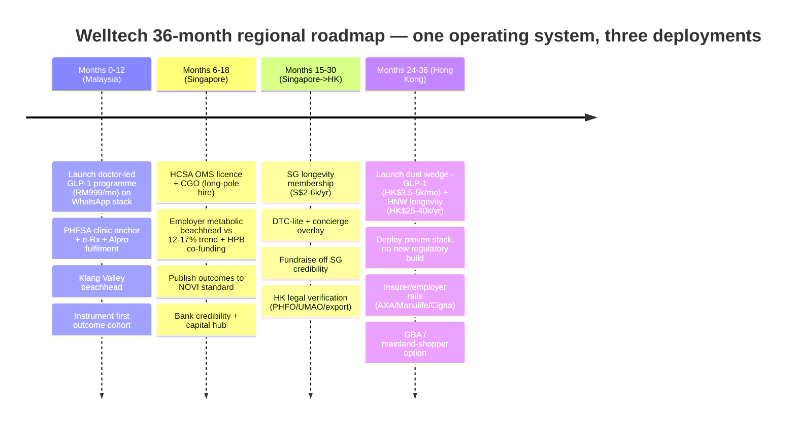

# Regional Executive Summary — The Welltech Health Pan-Asian Thesis (Malaysia · Singapore · Hong Kong)

**Abstract.** This is the top-level, cross-market synthesis of the Welltech Health repository — the regional front door that sits above the three country executive summaries and feeds the investor thesis. The controlling conclusion: Malaysia, Singapore and Hong Kong are **not three markets but one integrated opportunity** — the same universal whitespace (supervised, longitudinal, outcome-accountable metabolic and longevity care delivered on WhatsApp) exists identically in all three, defended everywhere by incumbents whose unit economics prevent them from filling it — and the winning move is **one operating system, sequenced through three deployments** that each de-risk the next. Malaysia is the volume engine and proving ground (WhatsApp clinical-ops proof, validated cash-pay demand, cheapest iteration, biggest whitespace); Singapore is the credibility and capital hub (a regulatory-grade licence that travels, payer sophistication, prestige); Hong Kong is the margin engine (highest ARPU, deepest longevity/HNW pool, a Greater Bay Area option) — monetising both prior investments without new regulatory build. The regional Welltech-relevant SAM is ~USD 1.4–3.0bn/year; achievable Year-3 SOM is ~USD 30–80m ARR, scaling toward USD 100m+ as Malaysia matures. The regional threat is a would-be regionaliser (Doctor Anywhere, ORA, or a Naluri-for-insurers play) assembling the same model first; the regional moat is a compounding stack of WhatsApp-native clinical operations, published outcomes, Singapore-grade governance carried everywhere, and cross-border corridor optionality. This document states the pan-regional thesis, sizes the aggregate opportunity, explains why the whitespace persists everywhere, lays out the sequencing logic and each market's contribution, maps the regional threat picture and moat, presents a consolidated 36-month roadmap and the investment-ask framing, and closes with a regional key-numbers dashboard. It introduces no new research: every figure traces to the linked market masters and country summaries.

**Last updated: July 2026.**

Related documents: [malaysia-executive-summary.md](malaysia-executive-summary.md) · [singapore-executive-summary.md](singapore-executive-summary.md) · [hong-kong-executive-summary.md](hong-kong-executive-summary.md) · the rigorous three-market tables in [../10-market-intelligence/cross-market-comparison.md](../10-market-intelligence/cross-market-comparison.md) · masters: [../10-market-intelligence/malaysia-market-intelligence.md](../10-market-intelligence/malaysia-market-intelligence.md) · [../10-market-intelligence/singapore-market-intelligence.md](../10-market-intelligence/singapore-market-intelligence.md) · [../10-market-intelligence/hong-kong-market-intelligence.md](../10-market-intelligence/hong-kong-market-intelligence.md) · [../20-competitor-dossiers/competitor-comparison.md](../20-competitor-dossiers/competitor-comparison.md)

---

**Contents:** 1. The pan-regional thesis · 2. Regional market size · 3. The universal whitespace & why it persists · 4. The sequencing logic & each market's contribution · 5. The regional threat picture · 6. The regional moat thesis · 7. The shared operating system · 8. Consolidated 36-month roadmap · 9. Investment-ask framing · 10. Regional risks & mitigations · 11. Regional key-numbers dashboard · 12. What we still don't know

---

## 1. The pan-regional thesis

**One opportunity, not three markets.** Across Malaysia, Singapore and Hong Kong the same structural facts hold. Six are load-bearing and universal:

1. **A metabolic-disease majority of adults** on Asian BMI cut-offs (54.4% MY / larger-than-12.7% SG / 54.6% HK), plus diabetes burden and fast-ageing populations.
2. **Double-digit medical inflation** (~15% MY / 12–16.9% SG / ~9.8% HK) converting employers and insurers into motivated buyers of prevention.
3. **WhatsApp as the default care substrate** (90.7% / ~84% / ~74.7% reach), already used for care logistics but run manually by incumbents.
4. **A synchronised 2024–26 GLP-1 category-formation window** (Wegovy Jan 2026 MY / Mounjaro weight Jun 2025 SG / Wegovy Nov 2025 HK).
5. **A legal ban on consumer drug advertising in all three**, forcing acquisition onto compliant lanes (education, referral, employer channel) that favour a retention operator.
6. **Screening and consults that "end at the PDF"** with an outcomes vacuum so complete that only two published outcome studies exist across the three markets combined.

Every incumbent — telehealth apps, hospitals, pharmacy chains, GP panels, med-spas, slimming chains, coaching-only wellness firms — sits crowded around the care journey and empty across it, structurally unable to occupy the medical-and-longitudinal quadrant because its own unit economics (per-consult, per-admission, per-pen commission, prepaid packages, coaching-only contracts) punish the continuity that quadrant demands ([../20-competitor-dossiers/competitor-comparison.md](../20-competitor-dossiers/competitor-comparison.md)).

**One operating system, deployed three times.** Because the whitespace is defined by an *operating model* — outcome-accountable, WhatsApp-delivered, subscription-priced continuity of medical care — not a category, the same machine wins in all three markets: an AI-staffed operations layer with enforced human clinical gates, a WhatsApp-Business-API care stack, shared GLP-1 titration and screening-follow-through protocols, compliance-as-brand built to the region's strictest (Singapore) standard, and outcomes publication. What changes market-to-market is the register (affordability in Malaysia; clinical seriousness in Singapore and Hong Kong), the regulatory build (a licence in Singapore; none in Hong Kong; a physical-clinic anchor in Malaysia), the price level (a 1.6–3.0× ARPU gradient), and the cultural product layer (halal/Ramadan in Malaysia only).

**Sequenced entry that compounds.** The three markets are entered in a deliberate order — **Malaysia → Singapore → Hong Kong** — chosen not by standalone attractiveness but by a capability-dependency chain: prove the model where it is cheapest and the whitespace largest (Malaysia), bank a licence and governance credibility that travels (Singapore), then monetise both at maximum ARPU without new regulatory build (Hong Kong). Each deployment de-risks the next; the third market is the most profitable per patient but cannot be won without the credibility earned in the second.

**The regional positioning statement:**

> **For** urban Asian adults across Malaysia, Singapore and Hong Kong who carry metabolic risk or seek to extend healthspan and have been failed by episodic clinics, slimming packages, screening reports that end at the PDF, and telehealth apps that sell consults, **Welltech is** the doctor-led metabolic-health and longevity programme delivered on WhatsApp **that** treats weight and prevention as medicine — named doctors, transparent all-in pricing, registered treatments, proactive weekly care, and published outcomes — **unlike** any incumbent in any of the three markets, none of which combines prescribing authority with retention infrastructure, WhatsApp-native operations, published outcomes and subscription economics. One operating system, adapted in register and price to each market, deployed three times.

**The prize.** A regional Welltech-relevant SAM of ~USD 1.4–3.0bn/year and an achievable Year-3 SOM of ~USD 30–80m ARR — fewer patients in the north at 2–3× the revenue per patient, funded by wealth density, converging on a single regional platform whose value is greater than the sum of three country P&Ls because of shared IP, portable credibility and corridor optionality.

**The regional thesis on one page:**

| Element | The regional statement |
|---|---|
| **Opportunity** | One universal whitespace — supervised, longitudinal, outcome-accountable metabolic & longevity care on WhatsApp — across three of Asia's densest metabolic-disease and wealth pools |
| **Window** | Synchronised 2024–26 GLP-1 formation + double-digit medical trend + post-enforcement demand vacuums; 6–24-mo lead before a regionaliser assembles the model |
| **Whitespace** | No operator in any market combines prescribing authority + retention infrastructure + WhatsApp-native ops + published outcomes + subscription economics — incumbents blocked by their own unit economics |
| **Model** | One operating system (AI-staffed ops, enforced human gates, WhatsApp care stack, shared protocols, compliance-as-brand) sequenced through three deployments |
| **Sequence** | Malaysia (prove) → Singapore (credential) → Hong Kong (monetise) — each de-risks the next |
| **Moat** | Compounding stack: WhatsApp-native ops + published outcomes + portable SG-grade governance + clinician-light delivery + corridor optionality |
| **Prize** | ~USD 1.4–3.0bn SAM; ~USD 30–80m yr-3 SOM ARR → USD 100m+ as MY matures; margin rises as the platform moves north |

**Why now — the regional window in dated facts:**

| Date | Fact | Consequence |
|---|---|---|
| Late 2024 | Mounjaro approved in SG & HK; MaNaDr shutdown (SG) | GLP-1 category inflects region-wide; pill-mill demand vacates toward governance-credible providers |
| Jun 2023–Nov 2024 | SG HCSA Phase 2 + Joint Circular 87/2024 | The compliance bar that punishes casual entrants and rewards the licensed — the credibility asset Welltech banks |
| Nov 2025 | Wegovy launches in HK (~HK$2,700/mo); HK eHealth+ in force | Retail anchor exposes clinic markups; compliant record rails open to entrants |
| Jan 2026 | Wegovy launches in MY; HK A&E fee doubled to HK$400 | MY market-formation moment; HK deliberately redirects demand private |
| Mar–Apr 2026 | HK first Weight-Management Action Plan; SG rider reform; MY GP fee-band revision | Serious weight medicine legitimised; insured consumers pushed toward package-priced prevention |
| 2025–26 | Medical trend ~10–17% across all three; drug-ad enforcement in all three | Employers become motivated buyers; paid drug advertising foreclosed everywhere |

**The window is timed, not permanent.** The three-market opportunity opened on a synchronised set of clocks — GLP-1 category formation across all three markets in 2024–26, double-digit medical inflation forcing payers to act, a post-enforcement demand vacuum in Singapore (MaNaDr) and Hong Kong (slimming-industry distrust, EC Healthcare distress), and a 6–24-month lead before the fastest regionaliser can assemble a competing model. A first mover that plants an outcome-accountable, WhatsApp-native flag in each market before incumbents self-cannibalise captures the category-defining position; a late mover fights an assembled — if economically compromised — competitor for a share of a defined category. The thesis is therefore explicitly a **speed thesis executed with governance discipline**, not a land-grab: move fast on the slow-to-copy assets (outcomes, employer contracts, portable governance) while refusing the short-cuts (drug ads, pill-mill consults, prepaid packages) that the regulators in all three markets are actively punishing.

---

## 2. Regional market size

The aggregate opportunity, reconciled from the three masters (USD, mid-2026 reference rates: USD1 = RM4.70 = S$1.30 = HK$7.80; full normalisation note in [../10-market-intelligence/cross-market-comparison.md §1](../10-market-intelligence/cross-market-comparison.md)):

| Layer | Malaysia | Singapore | Hong Kong | **Regional** |
|---|---|---|---|---|
| Digital-health-services envelope (2024–25) | USD 0.6–1.1bn | USD 0.4–0.7bn | USD 0.3–0.45bn | **~USD 1.3–2.25bn** |
| Growth | ~14–20% | low-to-mid-teens | ~7–20% | **~low-to-high-teens** |
| Welltech-relevant SAM (USD/yr) | ~320–745m (weight) + longevity/primary | ~715m–1.5bn | ~385–705m | **~USD 1.4–3.0bn** |
| **Year-3 SOM (USD ARR)** | ~13–34m (weight) | ~7.7–20m | ~9–26m | **~USD 30–80m** |
| Maturity SOM | RM185–670m ≈ USD 39–143m | (yr-3 basis) | (yr-3 basis) | **scaling toward USD 100m+** |

**Reading the aggregate.** The three markets stack to a ~USD 1.3–2.25bn reconciled digital-health-services envelope, a ~USD 1.4–3.0bn Welltech-relevant SAM, and a ~USD 30–80m Year-3 SOM — but the aggregate understates the platform's value, because the SOM figures capture only revenue, not the cross-market assets that do not appear on any country P&L: the portable Singapore licence, the three-market outcomes dataset, the shared cost base, and the corridor options. The regional platform is worth materially more than the arithmetic sum of three country businesses precisely because of what the sum-of-parts view omits.

Headline vendor "telemedicine" figures (e.g. Grand View's USD 4.1bn for Singapore) are scope-inflated with device/IT/enterprise infrastructure and are excluded; the envelope above is the analyst-reconciled consumer-digital-care scope Welltech actually competes within. The theoretical clinical TAM is far larger — GLP-1 eligibility alone runs to RM15–30bn (MY), S$3.4–6.3bn (SG) and HK$63bn (HK) — but is shown in the masters for discipline, not realisability. The investable case rests on capturing a low-single-digit share of the reconciled SAM, concentrated in the highest-value metabolic and longevity segments.

**How the regional SOM composes.** The three markets contribute to the Year-3 regional SOM in deliberately different shapes. Malaysia contributes the **most patients at the lowest ARPU** — its weight segment alone (6,000–15,000 active patients) generates USD 13–34m, and the blended three-segment maturity ceiling reaches USD 39–143m. Singapore contributes **fewer patients at ~2× the revenue per patient** (~USD 7.7–20m from a smaller cohort at structurally higher gross margin), plus the disproportionate value of the licence-credibility and capital-hub role that does not appear in any revenue line. Hong Kong contributes **the fewest patients at the highest ARPU** (~USD 9–26m), weighted toward the longevity-membership apex where per-member revenue (HK$25,000–40,000/yr) is multiples of the metabolic programme. The regional platform is therefore a barbell of volume (south) and margin (north) unified by one cost base — the arithmetic reason the whole is worth more than the parts.

---

## 3. The universal whitespace & why it persists

**The one-sentence whitespace, identical across the repository:**

> **In every market, no operator combines prescribing authority, retention infrastructure, WhatsApp-native clinical operations, published outcomes and subscription economics into supervised, longitudinal, outcome-accountable metabolic and longevity care — because each incumbent category is structurally prevented from assembling that combination by its own unit economics.**

**Why it exists everywhere.** The demand is structurally validated in all three markets (metabolic majority, double-digit medical trend, ageing), the enabling channel is universal (WhatsApp), the drug is now available (GLP-1 category formed 2024–26), and the failure mode is universal (episodic care with no follow-through, no published outcomes). The supply gap is the medical-and-longitudinal quadrant — clinically governed care delivered continuously — which every incumbent can see but none can enter.

**Why it persists.** Mobility into the empty quadrant is blocked not by capability but by **P&L self-cannibalisation**. Hospitals are paid per episode; telehealth anchored consults at RM15–25 / S$10–27; GP chains are fee-banded; aesthetic clinics and med-spas run commission-per-pen and prepaid packages; coaching-only players (Naluri) are contractually medication-avoidant; the DTC GLP-1 cohorts are drug-retail-first with no care layer. Each incumbent's revenue model punishes the longitudinal, outcome-accountable behaviour the whitespace requires. The quadrant has therefore stayed open through the entire GLP-1 demand surge, and the entrant with no legacy P&L holds the structural advantage in every market for as long as it outruns incumbents' willingness to cannibalise themselves — 6–24 months on the threat clocks. This is the single most important fact in the repository: **the whitespace is universal, durable, and the same machine fills it three times.**

**The same strategic groups block it in every market.** The incumbent categories rhyme across borders, and each is disqualified by the same structural feature everywhere:

| Strategic group | Malaysia | Singapore | Hong Kong | Why it cannot enter the quadrant |
|---|---|---|---|---|
| Transactional telehealth | DoctorOnCall, Doctor Anywhere | Doctor Anywhere, WhiteCoat | DrGo, Bowtie, ZA Health | Per-consult economics; rotating doctors; no programme |
| Hospitals / screening | IHH, KPJ, Sunway | Parkway, Raffles, Minmed | HKSH, Matilda, Gleneagles | Episode/report economics; care ends at the PDF |
| Pharmacy / fulfilment | Alpro, BIG CARING | DKSH channel | Registered pharmacies | Sells molecules, not outcomes; no prescriber base |
| Aesthetic / slimming / med-spa | Nexus, slimming chains | Aesthetic clinics | EC Healthcare, med-spas | Commission-per-pen / prepaid packages; cosmetic-coded |
| Coaching-only wellness | Naluri | (corporate wellness) | (employer wellness) | Contractually medication-avoidant; no prescribing |
| DTC GLP-1 cohort | OVA, Roczen, Seimbang | ORA, noah, Siena | Zoey, Noah, Bare | Drug-retail-first; thin care; no outcomes; <3yr old |
| Clinical benchmark | none | NOVI (sub-scale, app-walled) | none | Real outcomes but no scale/channel |

The pattern is exact: seven strategic groups, the same disqualifying economics, in all three markets. No incumbent category can assemble the full stack without breaking the model that funds it — which is why one de-novo operating system can occupy the vacant quadrant three times.

---

## 4. The sequencing logic & what each market contributes

Standalone market attractiveness (weighted matrix, [../10-market-intelligence/cross-market-comparison.md §16](../10-market-intelligence/cross-market-comparison.md)) ranks **Malaysia 4.45 > Hong Kong 4.10 > Singapore 3.00**. Yet the entry sequence is **Malaysia → Singapore → Hong Kong**, because entry order is a capability-dependency chain, not a raw attractiveness ranking: Hong Kong is the most attractive standalone P&L but cannot be won without the credibility banked in Singapore, and the cheapest place to prove the model is Malaysia.

| | **Malaysia — Market 1** | **Singapore — Market 2** | **Hong Kong — Market 3** |
|---|---|---|---|
| Strategic role | **Volume + proving ground** | **Credibility + payer + capital** | **Margin + longevity ARPU + GBA option** |
| Why this order | Cheapest to prove; biggest whitespace; cash demand validated; no regulatory build | Punishes unproven models, rewards arriving with evidence; licence travels as credibility | Max ARPU with no new regulatory build — but needs SG credibility + strongest brand first |
| Contributes to the platform | WhatsApp ops proof + AI machine + cash-pay demand + beachhead | HCSA licence + MOH-grade governance + payer/employer sophistication + prestige/capital | Highest margin per patient + longevity/HNW ARPU + Greater Bay Area / mainland-shopper option |
| Beachhead | Klang Valley affluent; doctor-led GLP-1 at RM999/mo | Employer metabolic programme vs 12–17% medical trend, HPB co-funded | Dual wedge: GLP-1 programme HK$3,500–5,000/mo + HNW longevity membership HK$25k–40k/yr |
| Binding risk | Price ceiling; trust-deficit CAC | Regulatory cost; licence/CGO lead time | Clinician scarcity; incumbent price war; UMAO-limited acquisition |

**The cumulative logic.** Malaysia proves the affordable-scale WhatsApp clinical-ops machinery and validates cash-pay GLP-1 demand ([malaysia-executive-summary.md §1](malaysia-executive-summary.md)). Singapore then buys the region's most valuable regulatory asset — an HCSA licence + approved Clinical Governance Officer + SMC-grade governance — which is read as a quality passport by Hong Kong regulators, insurers and investors, while adding payer sophistication and the capital/prestige hub ([singapore-executive-summary.md §5.1](singapore-executive-summary.md)). Hong Kong deploys the proven, credentialed machine at the highest ARPU in the region without any new licence, and opens the GBA / mainland-shopper adjacency no other market offers — but only after Singapore credibility exists, because entering Asia's most sceptical premium market first would mean building reputation with no proof points ([hong-kong-executive-summary.md §1](hong-kong-executive-summary.md)).

**Each market's contribution to the regional platform, in detail:**

- **Malaysia — WhatsApp ops + cash-pay demand + beachhead.** The proving ground: it validates the WhatsApp-native clinical-ops machine and the 11-role AI operations layer at the lowest cost of failure; proves cash-pay GLP-1 demand (RM400–900m already flows in 2026, 40–50% through aesthetic clinics at markups); establishes the Klang Valley beachhead; and produces the first published outcome cohort. It contributes the largest patient volume and the operational template every other market inherits ([malaysia-executive-summary.md §1](malaysia-executive-summary.md)).
- **Singapore — clinical credibility + payer sophistication + capital/prestige.** The credibility bank: an HCSA licence + approved CGO + SMC-grade governance that is read as a quality passport across the region; the region's most developed employer/insurer channel (near-universal PMET benefits, professional brokers, HPB 30–90% grants) against a 12–17% medical trend; the outcomes-publication discipline to the NOVI/IJO standard; and the capital-and-prestige hub that de-risks Hong Kong and deepens Malaysia ([singapore-executive-summary.md §5.1](singapore-executive-summary.md)).
- **Hong Kong — margin + longevity ARPU + GBA option.** The margin engine: the highest ARPU in the region (2–6× Malaysia per patient) at the heaviest per-capita metabolic burden and oldest population; the deepest HNW/family-office longevity constituency (membership HK$25–40k/yr, multiples of the metabolic programme); the best WhatsApp-healthcare channel fit in Asia; and the unique Greater Bay Area / mainland-shopper adjacency — all monetised without any new regulatory build ([hong-kong-executive-summary.md §1](hong-kong-executive-summary.md)).

**What each market teaches the next.** The sequence is a learning curve as much as a market-entry plan. Malaysia teaches the **operational** lessons — how to run WhatsApp-native clinical care at scale, how to manage GLP-1 titration and the month-two churn cliff, how to negotiate distributor drug terms, how to build the AI-staffed ops machine with enforced human gates — at the lowest cost of failure. Singapore teaches the **governance and payer** lessons — how to satisfy the region's strictest regulator, how to instrument and publish outcomes to the NOVI/IJO standard, how to sell an employer metabolic programme against a 12–17% medical trend through professional brokers, how to price a longevity membership into an empty productised middle. Hong Kong teaches the **premium and cross-border** lessons — how to command the highest ARPU in a sceptical, doctor-shopping market, how to run a clinician-light model where clinician supply is the binding constraint, how to monetise the mainland-shopper and GBA adjacencies within export/licensing law. By the third market, Welltech is deploying a machine refined across two prior markets and two regulatory regimes — the compounding that makes the regional platform defensible.

**Why not enter Singapore or Hong Kong first.** The counterfactual sharpens the logic. Entering Singapore first would burn scarce capital on the region's most expensive licence and cost base to prove a model that Malaysia proves for a fraction of the cost — and would arrive with no evidence in the market that most rewards evidence. Entering Hong Kong first would mean building a clinical brand from zero in Asia's most saturated, most sceptical premium market, against a distressed but entrenched incumbent (EC Healthcare) and two decades of slimming-industry scar tissue, with no Singapore credibility to borrow and the region's tightest clinician supply — the highest-execution-risk market attempted with the least preparation. The sequence is the risk-minimising path to the same regional endpoint.

### 4.1 The regional customer & channel map

Across markets the customer segments rhyme even as the payer and price differ. Five archetypes recur, reachable through the same compliant channels (drug advertising is banned everywhere):

| Archetype | Where it carries the P&L | Common trigger | Compliant channel |
|---|---|---|---|
| GLP-1-curious professional (30–50) | All three (core weight segment) | Abnormal screening result; GLP-1 media wave | Employer benefits; physician content; WhatsApp |
| Post-screening / undiagnosed patient | MY (undiagnosed); SG/HK (screened-unmanaged) | Red-flagged labs; the "PDF that goes nowhere" | Post-screening handoff; hospital co-marketing |
| Expat / IPMI family anchor | SG & HK (concierge overlay) | Relocation; no local GP loyalty | Expat networks, schools, employers; WhatsApp |
| HNW / longevity optimiser | SG & HK (ARPU apex) | Screening plateau; concierge price shock | Private-bank / family-office referral |
| Employer / broker (the economic buyer) | SG first, then all | 10–17% medical trend; claims-offset need | Broker relationships; outcome-denominated proposals |

**The channel constant.** In all three markets the growth engine cannot be paid drug advertising; it is (1) the employer/insurer channel selling claims-trend offset, (2) physician-referral and post-screening handoff converting the abnormal result nobody follows up, and (3) UMAO/KKLIU-compliant education content plus a solicited-review flywheel. The employer channel is most developed in Singapore (brokers, HPB grants) and the referral/screening channel most valuable in Hong Kong (mature exec-check market) — but the playbook is one playbook.

---

## 5. The regional threat picture — who could go regional first

The country-level threat clocks converge on one regional risk: a well-capitalised incumbent assembling the same outcome-accountable, WhatsApp-delivered programme **across borders** before Welltech does. Three candidate regionalisers stand out.

| Regional threat | Vector | Horizon | Read |
|---|---|---|---|
| **Doctor Anywhere** (assembles "DA Weight" region-wide) | Already multi-market (SEA), S$88m Series C, 2.8m users, insurer panels in MY & SG | 12–24 mo | The most obvious regionaliser — but every country dossier judges it "an assembly problem, not a build problem," hamstrung by a per-consult price anchor (RM15–25 / S$27) that struggles to charge premium programme prices credibly ([malaysia-executive-summary.md §4.4](malaysia-executive-summary.md), [singapore-executive-summary.md §4.3](singapore-executive-summary.md)) |
| **ORA Group** (andSons/OVA) | Strongest DTC funnel + only live hybrid answer to SG Circular 87/2024; already in MY & SG | Now–12 mo | Closest DTC analogue with a 3–4-yr brand head start; beatable on the post-purchase care layer it publicly loses (thin retention, no outcomes, auto-renew friction) ([singapore-executive-summary.md §4.3](singapore-executive-summary.md)) |
| **Naluri-for-insurers** (coaching rail wraps GLP-1) | 1m covered lives across MY/SG/TH/ID/PH; if it bolts prescribing on for insurers, it gatekeeps the reimbursed employer channel | 12–24 mo | Would control the reimbursed-channel gate regionally; the standing counter is to open a step-up-referral relationship before an insurer forces the pairing ([malaysia-executive-summary.md §4.4](malaysia-executive-summary.md)) |
| Insurer-bundled flanks | WhiteCoat/AIA (SG), QHMS/Bupa (HK), EC Healthcare (HK) | Now–24 mo | Country-specific but each could commoditise GLP-1 access inside its own insured channel; none owns the programme/outcomes layer today |

**Country-specific flanks feed the regional picture.** In Singapore the sharpest flank is a WhiteCoat-powered AIA weight benefit (1m+ members overnight) or NOVI regionalising its Novo Nordisk alliance; in Hong Kong it is EC Healthcare bolting GLP-1 onto 1m+ member records in 3–6 months (fastest but worst-positioned — beauty-coded, prepaid, distressed) or QHMS/Bupa activating its ~890k-customer panel; in Malaysia it is Alpro verticalising its pharmacist WhatsApp line or DoctorOnCall productising GLP-1 on its search dominance. Each is contained within one market today; the regional risk is only realised if one of them — or a DA/ORA/Naluri regionaliser — carries an assembled model across borders faster than Welltech carries the proven one. The defence is the same in every case: be first to the outcome-accountable, governed, WhatsApp-native position in each market, and hold the slow-to-copy assets.

**Net read.** No competitor holds the full regional stack today; every candidate holds one asset (funding, funnel, coaching rail, insurer distribution) and would inherit its own broken economics on assembly. The regional defence is speed on the slow-to-copy assets — WhatsApp-native SLAs, employer contracts, published outcomes, portable governance — deployed market-by-market faster than any incumbent can self-cannibalise. A proven, outcomes-published Welltech becomes the category's most valuable **acquisition target** rather than its casualty in the consolidation scenario.

**Regional landscape scenarios (analyst weighting):**

| Scenario | Probability | What happens | Welltech position |
|---|---|---|---|
| Fragmented drift | ~50% | The whitespace stays open 24+ months; incumbents circle but don't assemble | Welltech defines the category in each market and compounds the moat |
| Category assembly | ~35% | One or more regionalisers (DA/ORA/Naluri) bolt on a programme | Assembled offers inherit broken parent economics; Welltech wins on care depth + outcomes |
| Capital consolidation | ~15% | M&A wave; scaled players buy the category | A proven, outcomes-published Welltech is the most valuable **acquisition target**, not a casualty |

The scenario weighting reinforces the speed thesis: in the two most likely outcomes (85% combined) the winner is whoever holds the slow-to-copy assets — outcomes, employer contracts, portable governance — soonest in each market.

---

## 6. The regional moat thesis

The moat is not any single feature but a **compounding stack** that strengthens with each market entered. Ordered by copy-time (longest first — the ordering that matters for defence):

1. **Published outcome cohorts** — the slowest to copy (requires patients, retention and time); only two exist across all three markets; the tender asset in every payer conversation.
2. **Portable Singapore-grade governance** — a licence and CGO approval that take 3–6+ months and travel as a credibility passport.
3. **WhatsApp-native clinical operations** — an API-grade, audited, SLA-ed care stack that incumbents run manually and cannot re-platform overnight.
4. **Employer/insurer contracts** — relationship-and-trust assets, slow to displace once claims-offset outcomes are demonstrated.
5. **Clinician-light delivery** — an operating discipline (~1:600) that is hard to retrofit onto a per-consult or per-admission cost base.
6. **Corridor/cross-border optionality** — options (JB–SG, GBA, mainland-shopper) available only to a multi-market operator.

Layer by layer:

| Moat layer | Why it compounds regionally |
|---|---|
| **WhatsApp-native clinical operations** | Built once in Malaysia, re-used in SG/HK where incumbents run WhatsApp manually from front desks; deepest channel fit in HK (hospital-level habit). Care intensity becomes a clinical, not cost, decision (Meta fees ~RM1–3/patient-month) |
| **Published outcomes** | Only two outcome studies exist across all three markets; a NOVI-standard cohort published in one market becomes the payer/employer tender asset in all three, and every +10pp of 12-month retention is worth more than any pricing decision |
| **Singapore-grade governance, carried everywhere** | Build to the region's strictest bar (HCSA + CGO + SMC + PDPC) once and it clears MY and HK automatically and travels as a credibility passport — turning the strictest regime into a portable moat |
| **Clinician-light delivery** | AI-orchestration-with-a-medical-licence-at-the-centre; ~1 doctor per ~600 active patients; matters most in HK where clinician scarcity is the binding constraint |
| **Corridor & cross-border optionality** | JB–Singapore arbitrage, Penang/JB medical tourism, GBA record recognition, mainland-shopper adjacency — options no single-market operator can hold |
| **Compliance-as-brand** | In three markets that ban drug advertising and (SG/HK) actively enforce, governance credibility is the acquisition engine incumbents' scandals (MaNaDr, EC Healthcare PCPD, slimming-industry scar tissue) keep gifting |

**The standing partnership rule** is identical in all three markets and is itself a moat-preservation discipline: contracts assume any partner becomes a competitor within 24 months, so data, patient billing and programme IP stay with Welltech and no exclusivity forecloses a second source. The regional platform's defensibility is the intersection of these layers — retention makes outcomes measurable; outcomes justify subscription pricing; WhatsApp-native ops make retention affordable; governance makes the whole thing trusted and portable.

**The moat is a system, not a feature.** No single layer is uncopyable — a competitor can build a WhatsApp bot, run a clinic, or publish one study. What compounds is the *interlock*: the retention cadence generates the outcome data; the outcome data justifies the subscription price and wins the employer tender; the employer channel keeps CAC in band, which funds the coaching that drives retention; the governance posture makes all of it trusted in three markets that ban drug advertising and (in two) actively enforce; and the multi-market brand story de-risks the payer, investor and regulator conversations that a single-market operator must win cold. Each market entered strengthens every prior market's position — the Singapore licence improves the Malaysian CAC problem; the Hong Kong ARPU funds deeper Malaysian coaching; the three-market outcomes dataset is a tender asset no country incumbent can assemble. This is why the correct unit of competition is the **regional platform**, and why the incumbents — each strong in one country, one asset, one layer — are structurally out-matched by a system that spans all three.

---

## 7. The shared operating system — what is built once and re-used

The economic core of the thesis is that most of the machine is built once and re-deployed with local adaptation. The table below separates the **shared IP** (built once, ~90% re-used) from the **local adaptation** (re-engineered per market) — the ratio that makes the second and third market entries far more capital-efficient than the first.

| Layer | Shared IP (built once) | Local adaptation per market |
|---|---|---|
| WhatsApp care stack | Business-API gateway, consent logging, audit trail, templated clinical journeys, two-number portfolio | Language (Manglish/BM · English+Telegram · Traditional Chinese+Putonghua); channel mix |
| AI operations machine | 11 bounded roles (reception, triage, coordination, coaching, scribe, follow-up, billing…), enforced human gates, escalation logic | Salary/cost uplift only; local SLA tuning |
| Clinical protocols | GLP-1 titration, side-effect grading, screening-to-programme follow-through, maintenance off-ramp | Local formulary, halal/Ramadan (MY), in-person initiation rule (SG) |
| Data & compliance | EMR-as-record, results-via-secure-link, retention/consent architecture built to SG/PDPC bar | NEHR write-back (SG), eHealth+ deposit (HK), PDPA-MY TIAs |
| Governance playbook | Physician-led prescribing, no-tele-MC discipline, marketing-compliance review, no drug names | HCSA licence+CGO (SG), UMAO creative vetting (HK), KKLIU workflow (MY) |
| Commercial engine | Programme-not-consult pricing, employer/B2B2C motion, solicited-review flywheel, outcomes publication | Price level (1.6–3.0× gradient), payer channel, positioning register |
| Delivery model | Clinician-light: ~1 doctor per ~600 active patients, nurse/coach-led, AI-assisted | Panel depth (tightest in HK); part-time vs full-time mix |

**The capital-efficiency payoff.** Because the stack, the AI machine, the protocols, the data architecture and the governance playbook travel, the marginal cost of entering markets two and three is dominated by **local regulatory build, clinician recruitment and brand** — not software or process re-invention. This is what allows a sequenced three-market rollout to be funded as one platform rather than three independent country raises, and what lets each market's proof accelerate the next rather than starting from zero.

### 7.1 Standing operating principles (apply in all three markets)

Nine rules hold across every deployment — the regional operating doctrine that keeps the platform coherent:

1. **Own four things, rent everything else** — the prescriber relationship, the care channel, the programme layer and the patient data; rent beds, labs, imaging, fulfilment and corporate distribution.
2. **Doctors sign everything** — human-in-the-loop clinical gates are architectural, not procedural; no prescription, dose change or abnormal-result release exists without a signature event.
3. **Build to the Singapore governance ceiling everywhere** — it clears MY and HK automatically and travels as credibility.
4. **Market the programme, never the molecule** — drug advertising is banned in all three; the growth engine is education, referral and the employer channel.
5. **Margin lives in retention, not the pen** — coaching-weighted economics survive GLP-1 price deflation; the proactive titration cadence is the highest-ROI clinical activity.
6. **Sell outcomes to the economic buyer** — employers and insurers facing double-digit trend, in a procurement lane episodic incumbents cannot service.
7. **Continuity is engineered, not cultural** — no market's culture supplies it; the retention machine is the product.
8. **Compliance is brand** — in three markets that ban drug ads and (two) enforce hard, governance credibility is the acquisition asset incumbents' scandals keep gifting.
9. **Assume every partner becomes a competitor within 24 months** — data, billing and programme IP stay with Welltech; no exclusivity forecloses a second source.

---

## 8. Consolidated 36-month regional roadmap at a glance

| Horizon | Malaysia | Singapore | Hong Kong |
|---|---|---|---|
| Year 1 | Launch, prove ops, first cohort; 6k–15k patients trajectory | Licence + CGO in flight; employer pipeline pre-signed | Legal verification only |
| Year 2 | Scale weight + launch longevity membership | Employer beachhead live (≥60% 6-mo retention); publish outcomes | Beachhead launch (300–600 patients); eHealth+ enrolment |
| Year 3 | Maturity trajectory RM185–670m blended | S$10m+ ARR run-rate; insurer wellness-rider conversations | Premiumise (longevity membership); contribution-margin-positive |

**Regional proof milestones and gates:**

| Market | Launch gates (pre-revenue) | Growth proof (6–18 mo in-market) | Scale gate |
|---|---|---|---|
| Malaysia | PHFSA clinic anchor; e-Rx rails (Alpro/DOC2US); IFM clinical bench; PDPA/DPO stack | RM999 core live; month-two churn-save cadence; first outcome cohort instrumented | Top-3 digital programme; 6k–15k patients trajectory |
| Singapore | HCSA OMS licence; **CGO approved (long pole)**; SMC-grade consult protocol; ≥2 initiation partnerships; NEHR-ready EMR | 10–20 employer/broker pilots; 500–1,500 patients; ≥60% 6-mo retention; outcomes v1 published | CAC payback <9 mo; S$10m+ ARR run-rate |
| Hong Kong | Green legal opinions (PHFO/UMAO/export); signed medical director; ≥3 registered-doctor LOIs; premises-light arrangement | GLP-1 programme 300–600 patients; 2–3 employer pilots; ≥50% 6-mo retention; zero regulatory incidents | 400+ longevity members; contribution-margin-positive HK P&L |

The critical path is not capital but two scarce recruitment inputs — the Singapore-registered CGO and the Hong Kong prescriber panel — both started deliberately early. Every milestone doubles as the pre-planned response to that market's threat clock (§5): a flank move accelerates the corresponding proof, it does not trigger a reprice or pivot.

The roadmap is designed so each market's proof milestones double as the pre-planned response to that market's threat clock: if a flank move activates early, the counter is to accelerate the corresponding proof (outcomes, employer contracts, governance publication), not to reprice or pivot.

**Sequencing is overlapping, not strictly serial.** The markets do not wait for each other to finish. Singapore licence application and CGO recruitment begin while Malaysia is still scaling (months 6–18), because the CGO is the long-pole hire and the licence lead is 3–6 months; Hong Kong legal verification (PHFO applicability, UMAO creative review, export-control posture) begins during the Singapore build (months 15–30), so that Hong Kong can launch the moment Singapore credibility is banked. The critical-path constraint is not capital but two scarce inputs — the Singapore-registered CGO and the Hong Kong prescriber panel — both of which are recruitment problems started early and deliberately.

---

## 9. Investment-ask framing

This synthesis feeds the investor thesis; the framing that follows from the three-market analysis. In one line: **the investor is underwriting one regional operating system, sequenced to de-risk itself, entering three of Asia's densest metabolic-disease and wealth pools during a 24-month category-formation window that no incumbent yet occupies.**

- **What is being funded:** not three country bets but **one regional operating system** with a sequenced, self-de-risking rollout — a machine proven cheaply in Malaysia, credentialed in Singapore, and monetised at maximum margin in Hong Kong.
- **The market:** ~USD 1.4–3.0bn/year of Welltech-relevant SAM across three of Asia's densest metabolic-disease and wealth pools, growing low-to-high-teens, with the highest-value segments (medical weight loss, longevity) essentially unowned.
- **The return shape:** Year-3 SOM ~USD 30–80m ARR scaling toward USD 100m+ as Malaysia matures, at structurally higher gross margins in the northern markets (2–3× ARPU per patient), with retention — not price — as the dominant value lever.
- **Why now:** a synchronised 2024–26 GLP-1 category-formation window across all three markets, double-digit medical inflation making payers motivated buyers, and a 6–24-month lead before the fastest regionaliser can assemble a competing model.
- **Why Welltech wins:** the compounding moat (WhatsApp-native ops + published outcomes + portable Singapore-grade governance + clinician-light delivery + corridor optionality) and a partner-heavy, capital-efficient architecture that rents beds, labs, imaging and fulfilment while owning the prescriber relationship, the care channel, the programme layer and the patient data.
- **The optionality:** in the consolidation scenario, a proven, outcomes-published regional platform is the category's most valuable acquisition target rather than a casualty — an upside the single-market incumbents cannot manufacture.

**The return shape, stated plainly.** Year-1 to Year-3 is a proof-and-credibility phase (Malaysia scale + Singapore licence and outcomes) at controlled burn; the value inflection is the moment a three-market outcomes dataset and a portable Singapore licence exist and Hong Kong ARPU comes online — the point at which the platform is simultaneously the category-defining operator and the most valuable acquisition target in three markets. Downside protection comes from the sequence itself: each capital tranche is released only against the prior market's proof, so a stall in one market caps loss rather than compounding it, and even the bear cases (e.g. HK ~HK$35–50m ARR, halved SG willingness still S$4m+ from Segment A) remain viable at the relevant market's margins.

**The capital-allocation shape** follows the sequence: the first tranche funds Malaysia (proof + first cohort) at the lowest burn; the second funds the Singapore licence, CGO and employer beachhead (higher burn, credibility-buying); the third funds Hong Kong at maximum ARPU with the lowest marginal build cost because the machine is proven. Because the northern markets carry structurally higher gross margins and the operating system is shared, the platform's blended contribution margin improves as it moves north — a rare profile where geographic expansion raises, rather than dilutes, unit economics. The investor is underwriting a sequenced de-risking, not three simultaneous bets, with each capital tranche released against the prior market's proof milestones.

| Tranche | Funds | Burn profile | Release gate |
|---|---|---|---|
| 1 | Malaysia proof: WhatsApp/AI ops build, clinic anchor, first cohort | Lowest | — (initial) |
| 2 | Singapore licence + CGO + employer beachhead + outcomes publication | Higher (credibility-buying) | MY ops proven; first outcome cohort |
| 3 | Hong Kong dual wedge at max ARPU; lowest marginal build | Moderate (machine proven) | SG licence granted; outcomes published |

The blended-margin-improves-as-it-scales profile is the underwriting crux: each successive market is cheaper to build (shared machine) and richer per patient (ARPU gradient), so the platform's economics strengthen with geographic expansion rather than diluting — the inverse of the usual multi-market land-grab.

**Unit-economics shape across markets (analyst worked examples from the masters):**

| | Malaysia | Singapore | Hong Kong |
|---|---|---|---|
| Program-month price | RM999 (~USD 213) | S$450–700 (~USD 346–538) | HK$3,500–5,000 (~USD 449–641) |
| Contribution margin (pre-CAC) | Retention-led; every +10pp 12-mo retention ≈ RM900–1,000/patient | ~25–40% | Service net of drug ~HK$2,000–3,500/patient/mo |
| CAC tolerance | Below aesthetic-clinic paid; employer channel cheapest | S$300–600 at 9-mo retention | Within HK$4k target; employer channel |
| Dominant lever | **Retention, not price** | **Retention, not price** | **Retention + clinician leverage (~1:600)** |
| Meta/WhatsApp cost | ~RM1–3/patient-month (<0.5% of revenue) | (same stack) | (same stack) |

In all three markets the decisive variables are the same — **retention and clinician leverage, not list price** — which is why the operating investment concentrates on the coaching/titration cadence and the clinician-light delivery model rather than on pricing or paid acquisition.

---

## 10. Regional risks & mitigations

The cross-market risks that most affect the platform thesis (country-specific risks are ranked in each country summary's §7). These are the ones that threaten the *regional* logic — the sequence, the shared machine, or the compounding moat.

| # | Risk (class) | Why it threatens the regional thesis | Mitigation |
|---|---|---|---|
| 1 | **A competitor regionalises first** (competitive) | Doctor Anywhere, ORA or a Naluri-for-insurers play assembles the outcome-accountable programme across borders inside the 6–24-month window, capturing the category-defining position | Speed on slow-to-copy assets per market; sequence overlaps (SG build during MY scale); publish outcomes early; open Naluri step-up referral before an insurer forces the pairing |
| 2 | **Sequence dependency breaks** (execution) | If Singapore licensing/CGO stalls, Hong Kong loses the credibility it depends on and the sequence jams | CGO recruited first not last; MOH pre-application engagement; HK legal verification runs in parallel so it can launch on SG grant, not after |
| 3 | **GLP-1 price deflation region-wide** (economic) | Semaglutide LOE, oral formulations, HK mainland biosimilars compress drug-linked revenue simultaneously across markets | Coaching-weighted margin by design in every market; multi-molecule formulary; deflation *expands* eligible volume — programme economics benefit if margin never lived in pharmacy spread |
| 4 | **Synchronised regulatory tightening** (regulatory) | SG Circular 87/2024 trajectory, MY Digital Health Act, HK CMPR (by end-2026) could all tighten together | Build every market to the SG governance ceiling (exceeds all three today); treat competitor enforcement actions as an early-warning feed; virtual-only rests on a physical-clinic anchor where forbearance applies |
| 5 | **Premium cost base breaks northern unit economics** (economic) | SG/HK doctor time, rent and salaries can erase the contribution band if retention underperforms | The MY-proven AI/ops layer carries the cost structure; clinician-light delivery (~1:600); retention KPIs as board metrics; employer channel keeps CAC in band |
| 6 | **Clinician supply constraint in the north** (supply) | Post-emigration HK doctor scarcity (and SG premium cost) is the binding constraint on the margin markets | Clinician-light architecture is the entry condition, not an efficiency nicety; multi-doctor part-time panels (no single point of failure); non-solicit terms; GBA-pipeline watch |
| 7 | **Data/trust incident on the shared rail** (platform/reputational) | One leaked GLP-1 thread in a discretion-driven segment is trust-terminal and would damage the brand across all three markets at once | Entity-owned WABA, audit logs, results-via-secure-link, DPO + breach playbook at launch in every market; behave as if HK s.33 applied; governance published as marketing-grade collateral |
| 8 | **Payer coverage shift** (structural) | If any market subsidises/reimburses weight-loss GLP-1, the private premium pool re-prices — but also validates the category | Low near-term probability (unsubsidised everywhere today); outcomes dataset becomes the tender asset; employer channel insulated; deflation-resilient programme margin |

Each risk has a designed response rather than a hedge; the standing rule across markets is that if a threat activates early, the counter is to accelerate the corresponding proof (outcomes, employer contracts, governance publication, next-market entry), not to reprice or pivot.

---

## 11. Regional key-numbers dashboard

The sharpest load-bearing figures pulled from all three markets. Each traces to the linked country summary or master.

| # | Figure | Malaysia | Singapore | Hong Kong | Source |
|---|---|---|---|---|---|
| 1 | Population | 34.2m | 6.11m | 7.53m | masters §1 |
| 2 | Median age | 31.3 | 43.2 | 49.4 | [cross-market §2](../10-market-intelligence/cross-market-comparison.md) |
| 3 | GDP per capita (USD) | ~12–13k | ~99.4k | ~54.1k | masters §1 |
| 4 | Overweight+obese | 54.4% (WHO ≥25) | 12.7% obese (≥30) | 54.6% (Asian) | masters §2 |
| 5 | Diabetes | 15.6% | 1-in-3 lifetime | 8.5% raised glucose | masters §2 |
| 6 | OOP / payer | 76% of private financing | 71% IP-insured; OOP ~25% | private 48.2% of CHE | masters §3 |
| 7 | Medical trend (2025) | ~15% | 12–15.5% (16.9% proj. 2026) | ~9.8% | [cross-market §4](../10-market-intelligence/cross-market-comparison.md) |
| 8 | WhatsApp reach | 90.7% | ~84% (+Telegram 38%) | ~74.7% | masters §7–9 |
| 9 | Telehealth licence | None enforced | **HCSA + CGO required** | None (MCHK guidelines) | masters §6/§4 |
| 10 | Enforcement flagship | Tele-MC ban (Sep 2025) | **MaNaDr shutdown (2024)** | UMAO ad wall | masters |
| 11 | GLP-1 formation | Wegovy Jan 2026 | Mounjaro weight Jun 2025 | Wegovy Nov 2025 | masters |
| 12 | Welltech program-month (USD) | ~213 | ~346–538 | ~449–641 | [cross-market §12](../10-market-intelligence/cross-market-comparison.md) |
| 13 | Longevity membership target | RM3.6–8.8k/yr | S$2–6k/yr | HK$25–40k/yr | masters §7/§11 |
| 14 | Published outcome studies | 1 (Naluri) | 1 (NOVI) | 0 | [competitor-comparison](../20-competitor-dossiers/competitor-comparison.md) |
| 15 | Attractiveness score (of 5) | 4.45 | 3.00 | 4.10 | [cross-market §16](../10-market-intelligence/cross-market-comparison.md) |
| 16 | Strategic role | Volume + proving ground | Credibility + payer + capital | Margin + longevity + GBA | §4 |
| 17 | Year-3 SOM (USD ARR) | ~13–34m | ~7.7–20m | ~9–26m | §2 |
| 18 | **Regional SAM** | — | — | — | **~USD 1.4–3.0bn/yr** |
| 19 | **Regional Year-3 SOM** | — | — | — | **~USD 30–80m ARR** |
| 20 | Regional digital-health envelope | — | — | — | ~USD 1.3–2.25bn (2024–25) |

---

## 12. What we still don't know

Carried from the country summaries, the regional-level open questions that most affect the thesis:

| # | Open question | Why it matters regionally | Pre-launch action |
|---|---|---|---|
| 1 | **Screening-to-programme conversion rates** | The core funnel assumption in SG & HK ("screened-but-unmanaged"); currently analyst-estimated | Commission primary research in SG & HK before launch — the single most valuable pre-launch study |
| 2 | **GLP-1 price trajectory** | Semaglutide LOE, oral formulations, HK mainland biosimilars compress drug revenue but expand volume | Coaching-weighted margin by design; multi-molecule formulary; quarterly formulary review |
| 3 | **Insurer/employer GLP-1 coverage** | None today anywhere (not CDMP-listed SG; carved out HK; cosmetic-excluded MY); any coverage step-changes SAM | Instrument outcomes as the future tender asset; keep employer channel insulated |
| 4 | **Regulatory trajectory** | SG tightening (87/2024); MY Digital Health Act unlanded; HK CMPR by end-2026; virtual-only rests on forbearance (MY) / PHFO grey zone (HK) | Build to SG ceiling everywhere; physical-clinic anchor; legal review before each launch |
| 5 | **Competitor regionalisation timing** | Whether DA / ORA / Naluri-for-insurers assembles cross-border inside the 6–24-mo window | Speed on slow-to-copy assets; overlap the sequence; open Naluri step-up referral early |
| 6 | **Northern-market unit economics at scale** | Whether the MY-proven cost base holds under SG/HK doctor time, rent and clinician scarcity | Clinician-light delivery (~1:600) as entry condition; retention KPIs as board metrics |

*For the rigorous three-market side-by-side tables underpinning every claim here, see [../10-market-intelligence/cross-market-comparison.md](../10-market-intelligence/cross-market-comparison.md). For per-market depth, see the three country executive summaries and their masters.*
