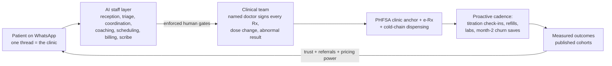

# Malaysia Executive Summary — The Welltech Health Investment & Operating Thesis

**Abstract.** This document is the front door to the Malaysia research repository: a synthesis of the eight market-intelligence deep dives, twenty-one competitor dossiers, the patient-review and clinician-experience corpora, the marketing-intelligence stack and the AI/WhatsApp operating-model designs. The controlling conclusion: Malaysia combines Southeast Asia's heaviest metabolic-disease burden (54.4% of adults overweight or obese, 15.6% diabetic), an ingrained cash-pay culture (76% of private health financing is out-of-pocket), effectively total WhatsApp penetration (~90%+ monthly reach, the country's most-opened app), and a GLP-1 market that formed only in 2025–26 (Mounjaro August 2025, Wegovy January 2026) — yet no operator anywhere in the market combines medical prescribing authority with retention infrastructure, WhatsApp-native clinical operations and published outcomes. Every incumbent category is structurally prevented from assembling that combination by its own unit economics. The window is real but timed: the fastest credible imitators are 6–24 months from assembling partial replicas. This summary states the thesis, reconciles the market sizing, compresses the regulatory rulebook into operating rules, maps the competition and the threat clock, distils the voice of customer and clinician, specifies the Welltech model and its economics, ranks the top ten risks, and closes with the master table of load-bearing numbers and the honest list of what still needs live verification.

**Last updated: July 2026.**

Related documents: every claim herein traces to the linked repository documents; primary citations live in those documents, not here. Start with [malaysia-market-intelligence.md](../10-market-intelligence/malaysia-market-intelligence.md) · [malaysia-regulations.md](../10-market-intelligence/malaysia-regulations.md) · [competitor-comparison.md](../20-competitor-dossiers/competitor-comparison.md).

---

**Contents:** 1. The one-page thesis · 2. Market · 3. Regulation · 4. Competition · 5. Voice of customer & clinician · 6. The Welltech model for Malaysia · 7. Risks & mitigations · 8. Key numbers appendix · 9. What we still don't know

---

## 1. The one-page thesis

**The opportunity.** Malaysia is the most overweight country in Southeast Asia and one of its fastest-ageing: 54.4% of adults are overweight or obese (up from 44.5% in 2011), 15.6% are diabetic (roughly two in five undiagnosed), and more than two million adults carry three simultaneous NCDs. The economic burden of NCDs is credibly estimated at RM64 billion a year; obesity alone at RM13–30 billion. Against this, the treatment system offers almost nothing between lifestyle advice and bariatric surgery: the pharmacological middle of the obesity pathway is empty across ~60 private hospitals, ~10,000 GP clinics and every telehealth platform ([malaysia-weight-loss-market.md](../10-market-intelligence/malaysia-weight-loss-market.md), [malaysia-private-healthcare.md](../10-market-intelligence/malaysia-private-healthcare.md)).

**The window.** The market-formation moment is now. Mounjaro became available in August 2025; Wegovy — the first commercially launched obesity-indicated GLP-1 in Malaysia's modern era — landed in January 2026 at entry pricing *below* prevailing off-label Ozempic clinic rates. Demand is proven (an estimated RM400–900M of GLP-1 weight-loss spend already flows in 2026, 40–50% of it through aesthetic clinics at 30–60% markups), regulation is tightening against exactly those incumbents (48 drug-advertising warning letters in 2025; the September 2025 tele-MC ban gutted transactional telehealth's main use case), and the fastest potential imitators are 6–24 months from assembling a competing program ([competitor-comparison.md §5](../20-competitor-dossiers/competitor-comparison.md)).

**The whitespace.** One sentence, from the synthesis of all 21 dossiers: *no Malaysian operator combines prescribing authority, retention infrastructure, WhatsApp-native clinical operations, published outcomes and subscription economics — and each incumbent category is structurally prevented from assembling that combination by its own unit economics* (hospitals are paid per episode; telehealth anchored consults at RM15–25; GPs are fee-banded at RM10–80; aesthetic clinics run commission-per-pen; Naluri is contractually medication-avoidant). The medical-and-longitudinal quadrant of the market is empty ([competitor-comparison.md §3, §7](../20-competitor-dossiers/competitor-comparison.md)).

**The model.** A doctor-led, subscription-priced metabolic-health and longevity program delivered on WhatsApp — the channel 90%+ of Malaysians already use for care logistics — with AI performing orchestration, monitoring and drafting behind enforced human clinical gates. Core tier ~RM999/month flat across titration with drug included; longevity diagnostics membership RM3,600–8,800/year; corporate PEPM channel sold as claims-inflation control against a 15–16% medical trend. Cash-pay is not a limitation but the market's default: Malaysians already pay out-of-pocket for 76% of private care and have demonstrated RM5,000–10,000 willingness to pay for supervised body transformation — historically to slimming centres that betrayed them ([pricing.md](../50-marketing-intelligence/pricing.md), [ai-clinic.md](../60-ai-operating-model/ai-clinic.md)).

**The moat.** Four assets that take longest to copy: (1) published Malaysian outcome cohorts — across ~40 operators studied, exactly one has ever published any outcomes; (2) WhatsApp clinical operations with SLAs — culturally saturated as a booking channel, clinically empty everywhere; (3) compliance as brand in a category the regulator is actively cleaning up; (4) the scarce clinical bench (Malaysia has three IFM-certified functional-medicine doctors; MEMS-affiliated endocrinology advisors are a finite pool). Retention is the economic engine: every +10pp of 12-month retention is worth ~RM900–1,000 per enrolled patient — an order of magnitude more than any list-price decision ([pricing.md §5.3](../50-marketing-intelligence/pricing.md)).

**The prize.** Reconciled bottom-up: a serviceable medical weight-management market of RM1.5–3.5B/year by 2030, inside a total digital-health services pool of USD 0.6–1.1B growing 14–20% annually. A top-three digital program at 36 months plausibly holds 6,000–15,000 active patients ≈ RM60–160M annualised revenue; the blended three-segment ceiling at maturity is RM185–670M/year ([§2.2](#22-market-sizing-reconciled) below).

**Why now — the window in six dated facts:**

| Date | Fact | Consequence |
|---|---|---|
| May 2025 | OHS Guideline 2025 issued | Compliance costs rise for casual entrants exactly as Welltech enters; grandfathering will favour the already-compliant |
| Aug 2025 | Mounjaro available | Tirzepatide demand opens; aesthetic clinics ladder it to RM3,200/month |
| Sep 2025 | MMC tele-MC prohibition | Transactional telehealth loses its highest-frequency use case; chronic/weight/longevity models mechanically favoured |
| 2025 (full year) | 48 GLP-1 ad warning letters; professional bodies attack "cosmetic quick-fix" marketing (Feb 2026) | The 40–50%-volume aesthetic cohort's growth engine (drug-name SEO/ads) is being dismantled by the regulator |
| Jan 2026 | Wegovy commercial launch at entry pricing below off-label Ozempic clinic rates | The market-formation moment: first on-label obesity GLP-1, national press cycle, price competition begins |
| Apr 2026 | GP fee band revised to RM10–80 after 34 frozen years | RM99–250 program touchpoints now read as modest premium, not 10× luxury; GPs are maximally recruitable |

---

## 2. Market

### 2.1 Demand foundations: the metabolic-disease engine

Malaysia's disease profile is the single strongest structural driver of the thesis ([malaysia-market-intelligence.md §2](../10-market-intelligence/malaysia-market-intelligence.md)):

| Indicator (adults, NHMS 2023 unless noted) | Value | Trend |
|---|---|---|
| Overweight + obese (BMI ≥25, WHO cutoff) | **54.4%** (~13M adults) | ↑ from 44.5% (2011) |
| Overweight + obese (Asian cutoff ≥23, used clinically in MY) | ~70.1% | — |
| Abdominal obesity | 54.5% | ↑ from 45.4% (2011) |
| Diabetes | **15.6%** (~3.9M) | 11.2% (2011) → 15.6%; ~2 in 5 undiagnosed |
| Hypertension | 29.2% | plateau; majority-undiagnosed fraction large |
| Hypercholesterolaemia | 33.3% | 18.1pp undiagnosed |
| ≥3 concurrent NCDs | >2 million adults | rising |
| Adult depression | 4.6% (~1M people 15+) | doubled from 2.3% (2019) |
| WOF adult-obesity projection | 41% by 2035 (BMI ≥30) | among the fastest trajectories globally |
| NCD economic cost | RM64.2B/yr (~4.2% of GDP, 2021) | — |
| Obesity economic burden | RM13–30B/yr (reconciled range) | rising to ~2.8% of GDP by 2035 (WOF) |

Three structural readings. First, **the undiagnosed fraction is the market**: with ~40% of diabetics unaware (84% of 18–29-year-old diabetics), screening is the acquisition funnel for the entire chronic-care economy, not a saturated category. Second, **obesity is the upstream commodity** — the common root of the four conditions Aon names as Malaysia's 2026 medical-cost drivers, which is the CFO-grade argument to employers and insurers. Third, the ageing transition compounds it: Malaysia crosses "ageing nation" status in 2030 (60+ population 3.9M → 5.8M) at record speed, front-loading chronic-disease demand into this decade ([malaysia-longevity-market.md §2](../10-market-intelligence/malaysia-longevity-market.md), [malaysia-private-healthcare.md §1.3](../10-market-intelligence/malaysia-private-healthcare.md)).

### 2.2 Market sizing, reconciled

Published headline estimates for Malaysian "digital health / telemedicine" diverge by an order of magnitude because they measure different things. The repository's reconciliation ([malaysia-market-intelligence.md §4](../10-market-intelligence/malaysia-market-intelligence.md), [malaysia-telehealth.md §3](../10-market-intelligence/malaysia-telehealth.md)):

| Layer | Estimate | Basis |
|---|---|---|
| Broad "telemedicine" (products + services) | USD 1.85B (2023) → USD 6.5B (2030), 19.7% CAGR | Grand View; overstates the care market several-fold |
| Consumer digital-health revenue | USD 588M (2024) → USD 834M (2028), 9.1% CAGR | Statista; includes USD 242M fitness apps |
| **Contestable telehealth-services pool** (what a care operator can actually compete for) | **USD 350–550M (2024), growing 12–20% p.a.** | analyst reconciliation, [malaysia-telehealth.md §3.3](../10-market-intelligence/malaysia-telehealth.md) |
| Planning band for the digital-health services market | USD 0.6–1.1B (2023–24), ~14–20% CAGR (≈doubling by 2029–30) | [malaysia-market-intelligence.md §4.1](../10-market-intelligence/malaysia-market-intelligence.md) |

The consult fee itself is a small slice of the pool — the majority is medicines and programmes, which is why every incumbent converged on pharmacy attach and why Welltech's economics must live in the program layer, not the consult.

**Segment funnels (TAM → SAM → SOM), reconciled across the repo's two builds.** The master document builds population-down funnels per segment; the weight-loss deep dive builds an independent spend-based funnel. They agree within range:

| Segment | TAM | SAM | SOM (3–5 yr) | SOM revenue | Source |
|---|---|---|---|---|---|
| **A. Medical weight loss / GLP-1** | ~13M overweight/obese adults; **8–9M CPG-eligible** for pharmacotherapy; theoretical spend ceiling RM15–30B/yr | 1.5–2.2M financially able (≥RM800/mo); **250k–550k active seekers/yr**; serviceable spend **RM1.5–3.5B by 2030** (vs RM400–900M in 2026) | **6k–15k active patients** (top-3 digital program, 36 mo) — consistent with the master doc's 15–40k members at 5-yr maturity | **RM60–160M** annualised (36 mo); RM100–350M at maturity | [malaysia-weight-loss-market.md §10](../10-market-intelligence/malaysia-weight-loss-market.md); [malaysia-market-intelligence.md §5.1](../10-market-intelligence/malaysia-market-intelligence.md) |
| **B. Longevity & preventive** | 5–7M adults 35+ with private-care income | 0.4–0.7M affluent urban screening buyers | 8k–25k members (master doc); KL preventive-membership clinic ~RM20–70M/yr (longevity doc) | **RM25–120M/yr** at maturity | [malaysia-market-intelligence.md §5.2](../10-market-intelligence/malaysia-market-intelligence.md); [malaysia-longevity-market.md](../10-market-intelligence/malaysia-longevity-market.md) |
| **C. Telehealth-first primary care** | 8–10M urban privately-served users | 2–3M digitally active WhatsApp-first households (Klang Valley, Penang, JB) | 30k–80k members | **RM60–200M/yr** at maturity | [malaysia-market-intelligence.md §5.3](../10-market-intelligence/malaysia-market-intelligence.md) |
| **Blended (overlap-unadjusted)** | — | — | — | **~RM185–670M/yr at maturity** | [malaysia-market-intelligence.md §5.4](../10-market-intelligence/malaysia-market-intelligence.md) |

All SOM figures are analyst estimates with stated assumptions; they are planning bands, not forecasts. The near-term investable case rests on Segment A (demand and pricing proven now), with B as the second product line and C as retention infrastructure rather than a standalone P&L.

### 2.3 Spending power and willingness to pay

The paradox that defines pricing: Malaysians **under-pay for access and over-pay for transformation** ([pricing.md §5.1](../50-marketing-intelligence/pricing.md)).

- **Cash-pay is the default.** Out-of-pocket is ~36% of total health expenditure and **76% of private financing**; private insurance funds only ~17%. Only ~22% hold personal health insurance, and weight-loss GLP-1s are almost universally excluded as "cosmetic" ([malaysia-market-intelligence.md §3](../10-market-intelligence/malaysia-market-intelligence.md), [malaysia-regulations.md §11](../10-market-intelligence/malaysia-regulations.md)).
- **Stated WTP for a teleconsult is only RM58** (median, 30 minutes) against a RM1 public anchor and RM15–30 incumbent pricing — the consult is structurally unmonetisable as a flagship product ([malaysia-consumer-behaviour.md](../10-market-intelligence/malaysia-consumer-behaviour.md)).
- **Revealed WTP for transformation is four figures monthly**: GLP-1 programs clear at RM899–1,150/month; aesthetic clinics move volume at RM1,288–3,200; slimming centres extracted RM5,000–10,000 packages; TRT runs RM5,000–15,000/year. The RM5,000–10,000 annual envelope appears independently across three categories — it is the demonstrated Malaysian budget for supervised body transformation ([competitor-comparison.md §2.4](../20-competitor-dossiers/competitor-comparison.md)).
- **Payer pressure is a tailwind.** Medical inflation of 15–16%/year (third-highest in the region, ~7× CPI) triggered the 2024–26 insurance repricing crisis, BNM interim price controls, DRG payment reform from 2026–27 and mandatory co-pays — pushing more spend to cash and making employers/insurers motivated buyers of prevention ([malaysia-private-healthcare.md §1–2](../10-market-intelligence/malaysia-private-healthcare.md)).

### 2.4 Digital and WhatsApp penetration

The enabling condition for the operating model is settled behaviour, not a bet ([malaysia-whatsapp-healthcare.md](../10-market-intelligence/malaysia-whatsapp-healthcare.md)):

| Metric | Value |
|---|---|
| Internet users / penetration | 34.9M / 97.7% (early 2025) |
| WhatsApp monthly reach (internet users 16–64) | **90.7%** — #1 platform; 97.7% name it their favourite comms app |
| WhatsApp sessions | 852/month — most-opened app in Malaysia (TikTok #2 at 368) |
| Share of messaging activity | ~80% |
| E-payments per capita | 409 (2024, +19% YoY); DuitNow QR 870M transactions |
| Wearable ownership | only ~30% own a smartwatch — RPM-dependent models cannot assume devices |

Malaysian hospitals, labs and pharmacies already run patient-facing workflows on WhatsApp (Columbia Asia, Sunway, KPJ, IJN bookings; Alpro pharmacist consults; 74% of physicians use it in practice) — but as a manually staffed inbox: no templates, Flows, SLAs, CRM sync, audit trail or AI. Patient behaviour requires zero education; incumbent execution sets a low bar that is visible within one conversation.

Four structural reasons the channel advantage holds ([malaysia-whatsapp-healthcare.md §2.3](../10-market-intelligence/malaysia-whatsapp-healthcare.md)): phone number = identity (patient identity resolution is native — the sender *is* the record key); cross-generational and cross-lingual reach (one platform spans the patient, the spouse and the adult-child caregiver in Malay, English, Mandarin and Tamil); a decade of "PM me to order" SME commerce trained Malaysians to transact with businesses in chat; and scam-degraded SMS trust makes a verified WhatsApp business profile a trust signal SMS cannot match. The public sector routes digital demand to MySejahtera, so no state WhatsApp incumbent will compress the advantage.

### 2.5 Geography, culture and demand rhythm

- **Beachhead: Klang Valley** (~8.8M people; the country's highest incomes, private-care density, insurance coverage and digital adoption), expanding to **Penang** (diagnostics and medical-tourism cluster) and **Johor Bahru** (Singapore corridor). Only six states/territories exceed the national median household income of RM6,338/month — target geography is concentrated, which suits a single-flagship-plus-digital model ([malaysia-market-intelligence.md §1.4](../10-market-intelligence/malaysia-market-intelligence.md)).
- **Halal and Ramadan are product parameters, not marketing gestures**: ~63–65% of the population is Muslim; GLP-1/supplement halal status should be scholar-verified and published; Ramadan fasting cycles materially affect titration schedules and adherence — a "Ramadan-mode" protocol is a differentiated retention asset ([malaysia-market-intelligence.md §1.3](../10-market-intelligence/malaysia-market-intelligence.md), [malaysia-weight-loss-market.md §3.2](../10-market-intelligence/malaysia-weight-loss-market.md)).
- **Demand is seasonal**: documented festive weight gain around Raya, CNY and Deepavali produces compensatory dieting peaks — by February 2026 doctors were publicly warning about festive-season surges in GLP-1 walk-ins. Acquisition pushes belong post-CNY and post-Raya; retention interventions belong *inside* the feasting windows ([malaysia-weight-loss-market.md §3.2](../10-market-intelligence/malaysia-weight-loss-market.md)).
- **Health literacy is limited for ~35% of adults**, concentrating in older and lower-income groups — consent flows, titration instructions and dosing reminders must be plain-language, visual, and bilingual by default ([malaysia-consumer-behaviour.md §2.4](../10-market-intelligence/malaysia-consumer-behaviour.md)).
- **Pharmacy-first behaviour** (45–63% self-medicate; 86.9% consult the pharmacist before buying) makes community pharmacies simultaneously the biggest informal competitor and the most natural referral channel ([malaysia-consumer-behaviour.md §2.2](../10-market-intelligence/malaysia-consumer-behaviour.md)).

### 2.6 Adjacent and enabling markets

| Adjacent market | Size / trajectory | Relevance |
|---|---|---|
| Hospital market (public + private) | USD 12.1B (2025) → ~USD 19–20B (2034–35), ~5.2% CAGR | Escalation partners, not competitors |
| Diagnostic labs | USD 1.28B (2024) → USD 2.01B (2030), 7.8% CAGR | Longevity-tier supply chain; independent labs hold ~40% share |
| Nutraceuticals / supplements | ~USD 0.6–1.2B | Share-of-wallet substitute; chronically adulteration-tainted (positioning foil) |
| Online pharmacy | USD 41.7M (2023) → USD 70.4M (2027), 14% CAGR | Fulfilment benchmark; the RM879–999 GLP-1 price floor lives here |
| Medical tourism | RM2.7–3.3B (2024–25); RM7B target by 2030; 2026 is "Year of Medical Tourism" | Indonesian/regional weight-loss and longevity adjacency via Penang/JB; MHTC membership is a legitimising channel |
| Wellness economy | USD 31.8B; prevention/personalised-medicine sub-sector +12.6% p.a. | Category tailwind for the longevity membership |

Source: [malaysia-market-intelligence.md §6](../10-market-intelligence/malaysia-market-intelligence.md), [malaysia-longevity-market.md](../10-market-intelligence/malaysia-longevity-market.md).

---

## 3. Regulation: the operating rules in one section

Malaysia regulates digital health through pre-internet statutes overlaid since 2020 by soft law. The Telemedicine Act 1997 **has never been brought into force**; telemedicine operates in a legally permissive but formally unregulated space, governed in practice by the MMC Guideline on Telemedicine (2024) and the MOH **Guideline on Online Healthcare Services (OHS) 2025**. Full analysis: [malaysia-regulations.md](../10-market-intelligence/malaysia-regulations.md).

### 3.1 The instruments that matter, in sixty seconds

| Year | Event | Why it matters |
|---|---|---|
| 1952–56 | Poisons Act; Sale of Drugs Act; Medicines (Advertisement and Sale) Act | Prescription-only architecture; product registration; the MAB/KKLIU advertising control still governing every creative today |
| 1971 | Medical Act | MMC registration + Annual Practising Certificate regime for every prescribing doctor |
| 1997 | Telemedicine Act passed — never commenced | The famous "world-first" that governs nothing |
| 1998/2006 | PHFSA + Private Medical Clinics Regulations | Clinic registration; no virtual category exists |
| 2012 | Medical Device Act | Software/SaMD capture |
| 2020–22 | MMC COVID advisory; MOH virtual-consult guideline; OHS RegLab sandbox | First official telemedicine permission; first-visit-in-person norm |
| 2024 | MMC Guideline on Telemedicine; PDP (Amendment) Act; Medical (Amendment) Act | The modern soft-law stack assembles |
| 2025 | PDPA amendments in force (Jan–Jun); **OHS Guideline (15 May)**; Mounjaro launch (Aug); **MMC tele-MC prohibition (23 Sep)** | The operating rulebook Welltech launches into |
| 2026 | **Wegovy launch (Jan)**; GP fee-band revision (Apr); OHS/Digital Health legislation awaited | The market-formation moment |

### 3.2 The operating rules

| Domain | The rule as it binds Welltech (July 2026) |
|---|---|
| **OHS Guideline 2025** (DG Circular 16/2025, 15 May 2025) | The de-facto rulebook: SSM-registered entity with a **physical office in Malaysia**; a **registered medical practitioner on the board/senior management** (plus a licensed pharmacist if offering e-pharmacy); all clinicians Malaysian-licensed; digital prescriptions recognised when signed by a licensed doctor and transmitted securely platform-to-pharmacist. Administrative circular, not statute — a Digital Health Act is expected (no bill tabled as of mid-2026); grandfathering will likely favour operators already compliant |
| **Clinic licensing (PHFSA 1998)** | **No "virtual clinic" category exists.** The clean structure: at least one PHFSA-registered physical clinic as clinical anchor and prescription origin; panel doctors MMC-registered with APCs and indemnity; the platform as a technology/management company that does not itself "provide" medicine. Budget 3–6 months for registration |
| **Tele-MC ban (MMC, 23 Sep 2025)** | **Medical certificates must not be issued after teleconsultation-only encounters** — the brightest line in Malaysian telehealth and the most likely trigger for MMC complaints. It also removed transactional telehealth's highest-frequency use case, mechanically favouring chronic/weight/longevity models |
| **GLP-1 status** | Saxenda, Ozempic, Rybelsus, Wegovy, Mounjaro all NPRA-registered; **Wegovy launched January 2026** (obesity indication), **Mounjaro August 2025** (T2DM; weight use off-label). All are Group B Poisons: prescription-only, physician-led. Off-label prescribing is lawful under MMC ethical standards but unmarketable. No lawful compounded-semaglutide channel exists — treat any such supplier as a red flag |
| **Advertising walls** | **Prescription medicines cannot be advertised to the public at all** — no molecule or brand names in any consumer creative, ever. Facility/service ads need MAB approval with a KKLIU number (4–6-week lead time); testimonials and before/after imagery largely prohibited; WhatsApp broadcasts count as advertising. Enforcement is real: 38,055 unapproved ads removed from e-commerce 2023–25; 48 warning letters over GLP-1 social ads in 2025 alone. The lawful lanes: disease-awareness and *program/service* marketing ("doctor-led weight-management programme") |
| **e-Rx pathway** | Teleconsult prescribing is settled in practice; OHS 2025 articulates the digital-prescription pathway, though the Poisons Regulations still assume written signed scripts (ambiguity, not prohibition). GP dispensing survives (no dispensing separation in the private sector) — Welltech's own clinic can consult **and dispense**, capturing pharmacy margin; plan a contingency P&L for eventual separation. Never list GLP-1s on marketplaces or allow add-to-cart-before-consult |
| **PDPA (amendments in force Jan–Jun 2025)** | Health data = sensitive personal data. New duties: DPO appointed and notified; **72-hour breach notification**; cross-border Transfer Impact Assessments (WhatsApp/Meta routing, cloud regions, AI APIs all qualify); fines raised to RM1M. Treat as a launch gate, not a retrofit |
| **AI / SaMD line** | Administrative AI (scheduling, drafting, logistics) is not a medical device; symptom-triage or dose-titration algorithms with clinical claims are registrable SaMD (~Class B) under Act 737. MMC's AI guideline (Feb 2025) keeps the doctor accountable for AI-assisted decisions. Keep AI on the orchestration side of the line; doctors sign everything |

### 3.3 Verdict

**What this means for the model.** Every load-bearing element of the Welltech design is lawful today, and the constraints select *for* it. The requirements — physical clinic anchor, doctor-in-governance, in-person-first GLP-1 initiation, no tele-MCs, program-not-molecule marketing, KKLIU workflow, PDPA-grade data operations — are exactly the costs a compliant, clinician-led operator absorbs once and cut-corner competitors cannot. Regulatory rigor is a moat: enforcement (ad takedowns, marketplace sweeps, professional-body warnings against "cosmetic quick-fix" GLP-1 marketing) lands hardest on the aesthetic-clinic cohort that currently holds 40–50% of GLP-1 volume. The main structural residual is that virtual-only operation rests on regulatory forbearance until the promised OHS legislation lands — mitigated by anchoring to a registered physical clinic and tracking the bill ([malaysia-regulations.md §3.5](../10-market-intelligence/malaysia-regulations.md)).

---

## 4. Competition

### 4.1 The landscape in one paragraph

The market is **crowded at every point of the care journey and empty across it**. Digital platforms (DoctorOnCall: 1.9M users, RM15 consults; Doctor Anywhere: >S$190M raised, S$43.5M FY2023 loss) are transactional — rotating doctors, no packaged GLP-1 program, no WhatsApp-native care. Hospitals (IHH/Pantai/Gleneagles, KPJ, Sunway, Prince Court) monetise episodes and beds; their weight pathway jumps from advice to bariatric surgery; only Prince Court packages a hospital GLP-1 clinic (single-site, unpriced, no remote titration). Pharmacy retail (Alpro ~300 touchpoints; BIG CARING 626 outlets, IPO-bound) owns fulfilment but not the program. Aesthetic clinics prescribe an estimated 40–50% of GLP-1 volume at 30–60% pen markups with no follow-up cadence; legacy slimming chains proved RM5,000–10,000 willingness to pay and poisoned the trust well doing it. The digital GLP-1 cohort — OVA (women-only, ~RM900/mo), Roczen (RM895), Seimbang (RM899 all-inclusive) — competes on brand, credential and price respectively; **no player competes on outcomes**. B2B rails (HealthMetrics: 1.2M corporate members; Naluri: 1M covered lives, coaching-only, medication-avoidant) are partners, not rivals ([competitor-comparison.md §1–2](../20-competitor-dossiers/competitor-comparison.md)).

### 4.2 Strategic groups and the empty quadrant

Two axes separate the field most cleanly: **medical authority** (non-medical → full prescribing) and **care model** (episodic → longitudinal). Every Malaysian competitor clusters in three of the four quadrants; the medical-and-longitudinal quadrant is structurally empty ([competitor-comparison.md §3](../20-competitor-dossiers/competitor-comparison.md)).

| Strategic group | Members | Competes on | Structural ceiling |
|---|---|---|---|
| Transactional telehealth | DoctorOnCall, Doctor Anywhere | Price (RM15–25), speed, payer panels | Per-consult economics preclude premium continuity; rotating doctors |
| Messaging/e-Rx & provider rails | DOC2US, Teleme, Qmed | Compliance infrastructure, B2B integration | Rails, not programs; weak consumer brands |
| Hospital episodic | IHH, KPJ, Sunway, Prince Court | Acuity, beds, screening retail, tourism | Consultant fee caps make longitudinal visits the worst-paid slot; growth math = higher-acuity episodes |
| Pharmacy retail | Alpro, BIG CARING | Footfall, price, refill logistics | No prescriber base; sells molecules, not outcomes |
| Fee-capped GP panel care | Qualitas, CareClinics, Mediviron | Panel volume, density, drug margin | RM10–80 statutory band; TPA intermediation; no consumer brand |
| Coaching-only B2B wellness | Naluri | Employer/insurer contracts, outcome reports | No prescribing; 16-week time-boxing; app-engagement bottleneck |
| Aesthetic/weight transaction capture | Nexus, CLEO, Her Clinic, Ozhean + digital GLP-1 cohort (OVA, Roczen, Seimbang) | Conversion machinery, SEO, pen availability | Episodic pen retail; economics decided by 12-month retention they don't do |
| Legacy slimming & fringe wellness | Marie France/BMF, London Weight; drip/TRT tail | Prepaid packages, mall presence, hard sell | Non-medical by regulation; existential trust deficit |

Mobility into the empty quadrant is blocked less by capability than by **P&L self-cannibalisation** — every incumbent's revenue model punishes the longitudinal behaviour the quadrant requires. That is why it has stayed empty through five years of GLP-1 demand growth, and why the entrant with no legacy P&L holds the structural advantage for as long as it outruns the incumbents' willingness to cannibalise themselves.

**Verdict scoreboard** (compressed; one line per dossier subject — full detail in [competitor-comparison.md §1](../20-competitor-dossiers/competitor-comparison.md)):

| Compete | Partner-first | Ignore / position against |
|---|---|---|
| OVA/ORA (beat on care depth, billing trust, outcomes) · Doctor Anywhere (move before "DA Weight") · DoctorOnCall (out-program its price anchor) · aesthetic clinics (attack the markup, own their month-two dropouts) · CareClinics/Sumitomo (watch) · Prince Court & PULSE (narrow premium segments) | Alpro (fulfilment — with ring-fencing; also threat #3) · DOC2US/Teleme (e-Rx rails) · HealthMetrics (corporate channel) · Naluri (step-up referrals) · Speedoc (home phlebotomy/nursing) · Qmed (provider rails, AI scribe) · IHH/KPJ/Sunway/PCMC (diagnostics + escalation) · Emagene (partner-or-hire the IFM bench) · BIG CARING (second-wave fulfilment; watch post-IPO M&A) | GetDoc, BookDoc (dormant; mine PERKESO playbook) · slimming centres (position against; target the burned cohort; watch BMF's medical pivot) |

### 4.3 The capability-gap conclusion

Across eight decisive capabilities scored for ten strategic groups, the absences cluster on the same three rows: **continuity/retention infrastructure, WhatsApp-native clinical operations, and outcomes measurement** — precisely the capabilities that compound (retention makes outcomes measurable; outcomes justify subscription pricing; WhatsApp-native ops make retention affordable). No player holds all eight; none holds the three compounding ones. Crucially, the groups strongest in prescribing (aesthetic clinics, hospitals) are weakest in exactly those three because their unit economics — commission-per-visit, yield-per-admission, markup-per-pen — actively punish longitudinal care. Across ~40 operators in 21 dossiers, exactly **one published outcome study exists in the entire market** (Naluri: a single non-randomised observational study). The whitespace has persisted for five years of GLP-1 demand growth not because it is invisible but because every incumbent's P&L punishes filling it ([competitor-comparison.md §3–4](../20-competitor-dossiers/competitor-comparison.md)).

### 4.4 The threat clock

Who could assemble the same model, and when ([competitor-comparison.md §5](../20-competitor-dossiers/competitor-comparison.md)):

| # | Threat | Horizon | One-line read |
|---|---|---|---|
| 1 | **OVA/ORA localises and deepens** (MY medical director, hybrid clinic, retention layer) | **Now–12 mo** | Closest live analogue, US$17M funded; beatable today on care depth, billing trust (documented auto-renew complaint), local clinical identity and outcomes |
| 2 | **Doctor Anywhere assembles "DA Weight"** | 12–24 mo | "An assembly problem, not a build problem" — but a program built on a RM25 price anchor struggles to charge RM900/month credibly |
| 3 | **Alpro verticalises** (doctors on its WhatsApp line + 150 dietitians + 300 doors) | 12–24 mo | Highest *structural* threat; restrained by conservative GLP-1 posture and founder bandwidth. Also priority partner #1 — ring-fence contractually |
| 4 | **DoctorOnCall productises GLP-1** on its RM999 pen anchor and dominant search traffic | 6–18 mo | Owns the funnel; blunted by fulfilment complaints and discount economics |
| 5 | CareClinics/Sumitomo payer-provider stack (300-clinic target + CompuMed TPA) | 24–36 mo | The one GP-chain threat |
| 6 | BIG CARING post-IPO M&A (buying a prescribing asset for 626 doors, 2.4M members) | 12–36 mo | Cannot build; can buy — the fastest incumbent route to the model |
| 7 | Naluri wraps GLP-1 for insurers | 12–24 mo | Would gatekeep the reimbursed employer channel — reason to open the step-up-referral conversation in Q1–2 |
| 8–10 | Prince Court premium GLP-1 clinic (now, narrow); Sunway platformises wellness post-IPO (24–36 mo); aesthetic-cohort share-of-wallet drag (now) | — | Segment competitors, not model competitors |

Scenario weighting: fragmented drift ~50% (quadrant stays open 24+ months); category assembly ~35% (assembled offers inherit their parents' broken economics); capital consolidation ~15% (in which a proven, outcomes-published Welltech becomes the category's most valuable acquisition target rather than a casualty).

### 4.5 Whitespace statement

> **In Malaysia, no operator combines prescribing authority, retention infrastructure, WhatsApp-native clinical operations, published outcomes and subscription economics — and each incumbent category is structurally prevented from assembling that combination by its own unit economics.** ([competitor-comparison.md §7](../20-competitor-dossiers/competitor-comparison.md))

The whitespace is not "weight loss" or "longevity" as categories — both are crowded — but the **operating model**: outcome-accountable, WhatsApp-delivered, subscription-priced continuity of medical care, launched first in weight (demand and pricing proven) and extended into longevity/preventive membership (demand validated, no system built). Equally mapped are the dead ends it is *not*: cheap consults, pen retail, directories, fee-banded primary care, asset-heavy delivery, coaching-only wellness.

### 4.6 Partnership architecture and sequencing

The dossiers converge on a partner-heavy architecture: own the prescriber relationship, the care channel, the program layer and the patient data — rent almost everything else ([competitor-comparison.md §6](../20-competitor-dossiers/competitor-comparison.md)).

| Phase | Moves | Rationale |
|---|---|---|
| **Q1–2 (existential)** | Alpro fulfilment terms; DOC2US-or-Teleme e-Rx decision; Emagene/IFM clinical bench; PCMC/Gleneagles KL escalation MOU | Alpro's verticalisation window opens at 12–24 months; nothing ships without e-Rx rails; the IFM pool is three people nationally; safety architecture must exist at launch |
| **Q2–4 (growth)** | HealthMetrics empanelment + one co-sold employer pilot; Speedoc home-phlebotomy integration; open the Naluri step-up conversation | Whoever Naluri partners with becomes the reimbursed-channel gatekeeper |
| **Year 2 (scale)** | BIG CARING second-wave fulfilment + loyalty CAC channel; KPJ geographic escalation; Sunway channel co-development | Optionality after volumes justify multi-chain |
| **Standing rule** | Contracts assume the partner becomes a competitor within 24 months | Data, patient billing and program IP stay with Welltech; no exclusivity that forecloses a second source |

---

## 5. Voice of customer & clinician

### 5.1 Patients: trust the medicine, resent the machine

The single most useful finding in the review corpus: **Malaysia does not complain about medicine; it complains about process.** Hospital reviews praise clinicians and condemn 3–6-hour waits, 5-hour guarantee-letter verification, deposit-first admission, billing opacity and 13-day report delays; telehealth reviews praise speed and condemn fulfilment failures, unreachable support and hidden pharmacy margins. The market's trust deficit is operational — exactly the layer an ops-led entrant can dominate. Patients forgive failure roughly at the rate the provider communicates; they punish silence disproportionately ([sentiment-analysis.md](../30-patient-reviews/sentiment-analysis.md), [recurring-complaints.md](../30-patient-reviews/recurring-complaints.md)).

**Category trauma is inherited, not earned.** The slimming-centre industry (Marie France, London Weight) conditioned Malaysian women to expect that any weight-loss "free trial" ends in a pressure script: 6,925 NCCC wellness/aesthetic complaints in 2015–17, ~10 women losing >RM2M combined, body-shaming to close, refusal of refunds. Every weight-loss entrant starts against a defensive crouch — which makes anti-hard-sell mechanics (published all-in prices, cancel-anytime monthly billing, written refund terms, "decide at home" scripting) marketable proof, not hygiene. Layered on top is state-taught scam anxiety (MOH actively warns that >90% of illegal online pharmacies supply POMs without prescription): **a new digital-health brand starts guilty until proven registered**, so registration performance (MMC numbers, KKLIU numbers, NPRA verification walkthroughs, named doctor faces) is the first conversion battle ([sentiment-analysis.md §2–3](../30-patient-reviews/sentiment-analysis.md)).

**The GLP-1 review vacuum.** OVA, Seimbang, Medkos and most longevity boutiques have near-empty public review records — no accumulated trust, but no scar tissue either. A new entrant that systematically harvests verified reviews from week one can out-reputation incumbents within quarters. Meanwhile the status-quo GLP-1 journey fails operationally, not pharmacologically: unmanaged nausea in weeks 2–8, refill friction, no proactive follow-up, ~50–70% quiet discontinuation by month six — the service-design brief writes itself ([malaysia-weight-loss-market.md §5.2](../10-market-intelligence/malaysia-weight-loss-market.md), [review-score-comparison.md](../30-patient-reviews/review-score-comparison.md)).

Stigma is the silent churn driver: only 28% of people with obesity had discussed weight with a clinician in six months; only 10% ever received a prescription; 63% regained after maintenance (ACTION Malaysia). The bottleneck is initiation friction and stigma, not awareness — favouring discreet, chat-first onboarding, unbranded packaging and (proven by OVA and Her Clinic) female-focused options.

**The nine recurring complaint themes are the product spec.** Every AI role and SLA in the operating model maps to one ([recurring-complaints.md](../30-patient-reviews/recurring-complaints.md)):

| Theme | Signature evidence | Welltech counter-design |
|---|---|---|
| T1 Pricing opacity & bill shock | "Too many hidden charges" (Gleneagles); final bills >10 days post-discharge | 100% all-in quotes before any commitment |
| T2 Communication black holes | Tickets unanswered "after days of waiting" (DA); billing phones unanswered | Reply-time SLAs; proactive status updates — never silence |
| T3 Prescription/medication traps | No Rx portability, meds marked up on-platform (DA); 93.4% of e-marketplace POMs unregistered | Rx portability by policy; NPRA batch-verification rituals |
| T4 Delivery failures | Multi-day to 15-day delays vs same-day marketing (DoctorOnCall) | Cold-chain SLAs; delay notified before the patient asks (>95%) |
| T5 Refund stalls | 4-month refund (Gleneagles); RM28-only refunds (LWM) | Published policy; auto-refund triggers; <7-day cycle |
| T6 Waiting/queue voids | 3–6h waits; ~5h GL verification; 6–7h screening days | Appointment integrity; backfill; no GL dependence in D2C |
| T7 Hard sell | Free-trial-to-pressure funnels; body-shaming to close | No in-session sales; cooling-off; retention by service, never pressure |
| T8 Rushed consults | Sub-3-minute video consults; "prescription vending" | AI-prepared 10–15-min protected slots |
| T9 App/tech failures | Crashes breaking the core chat loop (Naluri); forced app installs | No app mandatory — WhatsApp is the interface the excluded cohort already trusts |

**The hierarchy of trust proofs** orders the conversion battle: (1) legal existence (MOH/MMC/NPRA verifiability — absent this, nothing else registers); (2) named humans (doctor with face and registration number); (3) kept promises (first delivery on time); (4) recovery behaviour (how the first failure is handled — where every incumbent leaks trust and where reviews are actually written); (5) social proof at volume (only Alpro runs a solicited-review flywheel). Incumbents compete at layers 1–2 and neglect 3–5; layer 4 is the cheapest differentiation available because it monetises events that will happen anyway ([sentiment-analysis.md §3.1](../30-patient-reviews/sentiment-analysis.md)).

### 5.2 Clinicians: the recruiting pitch is documented grievance

Malaysian doctors are recruitable because the system is failing them in enumerable ways ([clinician-pain-points.md](../40-doctor-experience/clinician-pain-points.md)): GP consult fees frozen 1992–2026 (RM10–35, corrected to RM10–80 only in April 2026); ~70% of GP volume intermediated by ~30 unregulated TPAs extracting 10–15% of fees on 30–90-day settlement; layered unpaid administration (portals, claims, e-invoicing); unpaid after-hours WhatsApp care on personal numbers; 80.6% citing medico-legal issues as the top telemedicine barrier (validated by the 2025 MC-ban whiplash); implied platform payouts of RM10–18/consult against a RM40–60/hour locum floor; a contract-doctor generation (23,077 contract MOs, 3.4% permanency, 6,417 public-sector exits 2019–23) with fully formed grievances; burnout at 25–30%.

The pitch — **"Practise medicine. We do the rest."** — positions against three named villains every GP recognises (the TPA, the RM15-consult platform, the contract system), with quantified commitments: ≥RM80–120 effective per clinical hour with a published rate card and ≤7-day settlement; zero unpaid admin (AI-drafted notes, auto-claims); no patient ever holding the doctor's personal number; protocolised safety (no tele-MCs ever, indemnity top-cover paid); named panels with recurring per-patient programme income so follow-up work — currently free labour — becomes the paid product. Routing paid GLP-1 initiation visits *into* partner GP clinics converts 12,000 potential opponents into a distribution network.

---

## 6. The Welltech model for Malaysia

### 6.1 Positioning

> **For** urban Malaysian adults who have struggled with weight or metabolic risk and been failed by slimming packages, supplements and episodic clinics, **Welltech is** the doctor-led metabolic health program delivered on WhatsApp **that** treats weight and prevention as medicine — named doctors, transparent all-in pricing, registered treatments, proactive weekly care, and published results — **unlike** aesthetic clinics and slimming centres that sell products and pressure. ([positioning.md §6](../50-marketing-intelligence/positioning.md))

Positioning mechanics: own the **outcome-accountable** position nobody claims in any language; occupy the two empty perceptual quadrants (high-credibility/mid-price; high-convenience/high-continuity). Category label in BM: *pengurusan berat badan secara perubatan* (medical weight management) — never "kurus"/slimming vocabulary, which codes cosmetic and pattern-matches the grey market. For longevity, define "preventive health membership" digitally rather than fighting for the physically claimed "longevity clinic" label. Trust codes are checkable, not aesthetic: MMC/KKLIU/NPRA registration performance, named doctor faces, halal transparency (scholar-reviewed FAQ; Ramadan-mode protocol as productised proof), Mandarin capability for the Chinese-Malaysian screening buyer, PDPA-plus privacy pledges, and one physical flagship as the legitimacy anchor.

### 6.2 Pricing architecture

Anchored between the pharmacy drug floor (RM879–999/pen) and the aesthetic-clinic ceiling (RM1,288–2,088/pen), riding both WTP curves — near-RM58 entry, four-figure transformation ([pricing.md §4](../50-marketing-intelligence/pricing.md)):

| Tier | Price | Design logic |
|---|---|---|
| Entry consult | RM49, 100% credited against any program | Matches the RM58 WTP median; the paid lead magnet |
| Good — Metabolic Start (no GLP-1) | RM299/mo | Coaching + oral options; bridge tier |
| **Better — Medical Weight Program (core)** | **RM999/mo flat across titration, drug included**; 6-mo prepay RM5,499 via BNPL | Same price as a bare DoctorOnCall pen *with* the full care layer; flat pricing removes the month-4 dose-escalation churn cliff |
| Best — Premium + Concierge | RM1,599/mo; tirzepatide at transparent pass-through + RM399 service fee | Pass-through-plus-fee is itself a positioning asset against pen markups |
| Longevity Membership | RM3,600/yr Core; RM8,800/yr Executive | Function-style diagnostics membership — the screen plus the year of interpretation nobody sells |
| Maintenance | RM199–299/mo | Converts graduates instead of losing them; answers the 63%-regain fear |
| Corporate | RM8–15 PEPM base; RM350–500/enrolled seat/mo | Sold as claims-inflation control; avoids TPA rails entirely |

Sensitivity analysis shows revenue is nearly flat across RM999–1,199 list pricing: **price is not the decisive variable — drug COGS (negotiate distributor terms 10–20% below retail) and retention are.**

### 6.3 Funnel

Acquisition exploits mapped, unmonetised moments: the **post-screening handoff** ("send us your hospital screening report" — hospitals hand over a PDF and wait); the **month-two disillusioned GLP-1 patient** from aesthetic clinics (the cheapest high-intent CAC in the market); the burned-slimming cohort (content-led); festive seasonality (post-CNY and post-Raya acquisition; "survive Raya" retention protocols timed into feasting periods); doctor-fronted educational content that ranks on the "pen kurus" vernacular while correcting it — the compliant reach engine given molecule-advertising walls. Corporate channel through HealthMetrics empanelment plus a Naluri step-up referral deal opened before an insurer forces Naluri elsewhere ([competitor-comparison.md §6, §8](../20-competitor-dossiers/competitor-comparison.md), [positioning.md](../50-marketing-intelligence/positioning.md), [funnels.md](../50-marketing-intelligence/funnels.md)).

The funnel must be engineered against the researched drop-off map — each stage where today's market loses the patient is a designed counter-move ([sentiment-analysis.md §4](../30-patient-reviews/sentiment-analysis.md)):

| Journey stage | Market's failure today | Welltech counter-move |
|---|---|---|
| Legitimacy check | Silent abandonment when registration isn't visible or the price looks "too good" | Registration artefacts on every surface; "verify us" walkthrough; RM49 (not RM15) entry price |
| Booking → consult | Doctor no-shows, 15–20-min matching waits | Instant structured booking; confirmation cadence; backfill |
| Consult | Rushed 3-minute consult ending in a forced on-platform purchase | AI-prepared protected slots; Rx portability by policy |
| Fulfilment | Delivery misses the promise by days; then silence | Cold-chain SLA + proactive delay notification |
| Post-outcome | **No follow-up exists anywhere in the market** — churn is silent | The proactive cadence *is* the product; maintenance off-ramp |
| Refund/exit | Stalls and refusals produce the most viral negative reviews | Published policy, auto-refund triggers, structured off-boarding |

### 6.4 AI + WhatsApp operating model

The design premise, taken directly from this repository's research: complaints are operational, doctors' removable burdens are administrative — so the AI clinic is **an operations machine with a medical licence at its centre, not a diagnosis machine** ([ai-clinic.md](../60-ai-operating-model/ai-clinic.md), [whatsapp-operating-model.md](../60-ai-operating-model/whatsapp-operating-model.md)).

The clinic is staffed by eleven bounded AI roles mirroring a clinic org chart, each with defined tools, escalation rules enforced in the orchestration layer (not left to model discretion), and its own KPI dashboard ([ai-clinic.md §2](../60-ai-operating-model/ai-clinic.md)):

| AI role | Function | Autonomy |
|---|---|---|
| Receptionist | Intent detection, FAQs, all-in price quotes (anti-T1) | Full (admin only); <10s first response |
| Nurse | Protocol-bound side-effect grading, red-flag screens | Assisted; grade-3 → doctor <2h; never diagnoses or doses |
| Care Coordinator | End-to-end logistics state; notices stuck states before the patient does (anti-T4/T2/T5) | Full logistics; >95% of delays notified proactively |
| Health Coach | Dietitian-authored nudges, Ramadan-mode, plateau content | Assisted; content whitelisted |
| Doctor Assistant | One-screen pre-consult briefs; draft orders and letters | Drafts only — zero autonomy |
| Follow-up | The retention engine: titration check-ins, month-2 churn saves, win-back ladders | Full outreach; high churn-risk → human retention call |
| Clinical Documentation | Ambient scribe; chat-to-record summaries; EMR is the record | Drafts only; doctor signs |
| Scheduling | Booking, confirmation cadence, backfill; enforces in-person-first consult types | Full |
| Billing | All-in quotes, payment links, e-invoices, auto-refunds ≤ threshold | Full issuance; refunds gated |
| WhatsApp Agent | Window/template economics, opt-in ledger, quality-rating protection | Infrastructure |
| Longitudinal Memory | Role-scoped patient context; makes month 6 feel like day 1 | Infrastructure; no patient contact |

Load-bearing specifics: human-in-the-loop gates are architectural, not procedural (no prescription exists without a doctor signature event; abnormal labs never reach patients before sign-off; bypass is technically impossible); a two-number portfolio isolates the care rail from marketing risk; conversation architecture engineered around July-2025 per-message pricing means Meta fees run **≈RM1–3 per patient-month (<0.5% of programme revenue)** — care intensity becomes a clinical decision, not a cost decision; a 46-template compliance-classified library (never a molecule name in outbound content); bilingual BM/EN with Manglish code-switching as a moat against English-first bot templates; every conversation captured as structured data with the EMR, not the chat scroll, as the medical record; AI kept on the administrative side of the SaMD line, with doctors signing everything ([whatsapp-operating-model.md](../60-ai-operating-model/whatsapp-operating-model.md)).

### 6.5 Unit economics: retention is the dominant lever

| Driver | Value | Source |
|---|---|---|
| Drug gross margin (distributor vs retail parity) | 15–30% | [malaysia-weight-loss-market.md §9.2](../10-market-intelligence/malaysia-weight-loss-market.md) |
| Service revenue net of drug | RM250–500/patient/month | ibid. |
| Variable clinical + ops cost | RM60–150/patient/month (falls steeply with AI triage; RM120 modelled) | ibid.; [pricing.md §5.2](../50-marketing-intelligence/pricing.md) |
| CAC | RM150–600 by channel | [malaysia-weight-loss-market.md §9.2](../10-market-intelligence/malaysia-weight-loss-market.md) |
| 12-month LTV contribution | RM2,500–5,000 per retained patient | ibid. |
| Unmanaged 12-month GLP-1 persistence | ~30–38% (steepest drop months 1–3) | [pricing.md §5.3](../50-marketing-intelligence/pricing.md) |
| Managed-program target | >60% | ibid. |
| **Value of +10pp 12-month retention** | **~RM900–1,000 per enrolled patient** — an order of magnitude more than the RM999 vs RM1,099 list-price difference | ibid. |

At unmanaged persistence, CAC payback is marginal; at 60% retention, year-one revenue per enrolled patient rises ~44% (≈RM8,900 at the core tier). Side-effect triage in the first eight weeks — the peak dropout window — is the highest-ROI clinical activity in the company. This is the financial case for the entire AI + WhatsApp machine.

### 6.6 Proof milestones (what must be true, and when)

The competitive analysis converts directly into a proof plan — the assets that take longest to copy are the ones to build first ([competitor-comparison.md §8](../20-competitor-dossiers/competitor-comparison.md), [clinician-pain-points.md §3.4](../40-doctor-experience/clinician-pain-points.md)):

1. **Launch gates (pre-revenue):** SSM entity + physical office + doctor (and pharmacist) in senior management per OHS 2025; PHFSA clinic registration (3–6 months); DPO appointed and 72-hour breach playbook drilled; e-Rx rails contracted; escalation MOU signed; KKLIU workflow live.
2. **Quarter 1–2:** Alpro fulfilment terms and the IFM/MEMS clinical bench secured (both are races); published price ladder and doctor rate card (first in market on both); the WhatsApp care rail operating with measured SLAs.
3. **Month 6–12:** first cohort retention read vs the ~30–38% unmanaged baseline; HealthMetrics empanelment plus one co-sold employer pilot with HR-facing outcome reports; solicited-review flywheel producing volume.
4. **Month 12–18:** the decisive moat move — **publish the first Malaysian GLP-1 cohort outcomes to a credible evidential standard**. Across ~40 operators studied, nobody has done this; the first publisher defines what "good" looks like and owns the category narrative before the assembly threats (DoctorOnCall 6–18 mo, OVA now–12 mo, Alpro/DA 12–24 mo) crystallise.

Each milestone doubles as the pre-planned response to the watch-list tripwires in [competitor-comparison.md §8.1](../20-competitor-dossiers/competitor-comparison.md): if a threat activates early, the counter is to accelerate the corresponding proof, not to reprice or pivot.

---

## 7. Risks & mitigations: top 10

Ranked by probability × impact on the Malaysia plan.

| # | Risk (class) | Why it matters | Mitigation |
|---|---|---|---|
| 1 | **Advertising enforcement contact** (regulatory) | The tightest constraint on a weight-loss brand: molecule advertising is illegal, KKLIU approval takes 4–6 weeks, WhatsApp broadcasts count as ads; 48 warning letters hit the category in 2025 | All creatives through a KKLIU workflow; market the program, never the molecule; influencer contracts prohibit drug naming; treat competitor takedowns as an early-warning feed ([malaysia-regulations.md §6](../10-market-intelligence/malaysia-regulations.md)) |
| 2 | **Soft-law whiplash / OHS legislation** (regulatory) | The tele-MC ban showed the rulebook can reverse overnight; virtual-only operation rests on forbearance until the Digital Health Act lands | Over-comply with OHS 2025 now (grandfathering favours the compliant); PHFSA clinic anchor; no tele-MCs ever; track the bill quarterly ([malaysia-regulations.md §3](../10-market-intelligence/malaysia-regulations.md)) |
| 3 | **Fast-follower assembly** (competitive) | DoctorOnCall (6–18 mo), OVA (now–12 mo), Alpro and DA (12–24 mo) can each assemble partial replicas; category narrative contamination raises CAC | Race the assembly clock on the slow-to-copy assets: published outcomes, WhatsApp clinical SLAs, named clinical bench; run the tripwire watch-list as an operating cadence ([competitor-comparison.md §5, §8.1](../20-competitor-dossiers/competitor-comparison.md)) |
| 4 | **GLP-1 safety scare / category contamination** (clinical/reputational) | An NPRA alert or media cycle (e.g. the 2025 aspiration-risk alert) could chill the category; grey-market harm stories splash onto legitimate operators | Pharmacovigilance-forward content; "supervised vs unsupervised" framing pre-positions Welltech as the safe pole; bake NPRA alerts into protocols same-week ([malaysia-weight-loss-market.md §4.6](../10-market-intelligence/malaysia-weight-loss-market.md)) |
| 5 | **Retention below model** (economic) | The entire P&L hinges on beating ~30–38% unmanaged persistence; a mediocre month-2 save rate makes CAC payback marginal | Flat titration pricing; proactive AI Nurse cadence in weeks 0–8; maintenance off-ramp; retention KPIs as board metrics ([pricing.md §5.3](../50-marketing-intelligence/pricing.md), [ai-clinic.md §2.6](../60-ai-operating-model/ai-clinic.md)) |
| 6 | **PDPA breach in a stigmatised category** (platform/reputational) | A leaked GLP-1 patient thread is the exact "significant harm" scenario the 2024 amendments target; RM1M fines; trust destruction would be terminal in a discretion-driven segment | DPO + 72-hour breach playbook before launch; TIAs for Meta/cloud/AI vendors; message export to EMR with deletion policies; no patient-visible group features ([malaysia-regulations.md §7](../10-market-intelligence/malaysia-regulations.md)) |
| 7 | **WhatsApp platform dependence** (platform) | A number ban severs care delivery; Meta policy prohibits prescription-drug promotion; quality-rating degradation throttles reach | Two-number portfolio isolates marketing risk from the care rail; number-health monitoring as a safety-grade alarm; ban-appeal runbook pre-documented; EMR holds the record, not the thread ([whatsapp-operating-model.md §1, §8](../60-ai-operating-model/whatsapp-operating-model.md)) |
| 8 | **Drug supply and price shocks** (supply/economic) | The 2024 semaglutide shortage pushed patients to grey channels; Juniper-style price wars and eventual generics could compress the bundled tier | Contract allocation with Zuellig/DKSH rather than spot-purchase; quarterly flat-tier price review; pass-through structure on the premium tier absorbs shocks ([malaysia-weight-loss-market.md §4.4–4.5](../10-market-intelligence/malaysia-weight-loss-market.md)) |
| 9 | **Partner-turns-competitor** (competitive/structural) | Every priority partner (Alpro, HealthMetrics, Naluri, hospitals) is also on the threat list; fulfilment or channel dependency invites capture | Standing rule: data, billing, program IP and the prescriber relationship stay with Welltech; no exclusivity that forecloses a second source; dual-source fulfilment early ([competitor-comparison.md §6](../20-competitor-dossiers/competitor-comparison.md)) |
| 10 | **Trust-deficit drag on CAC** (reputational/market) | Scam anxiety and slimming-centre trauma mean the brand starts "guilty until proven registered"; silent S1 abandonment never shows in analytics | Registration performance everywhere (MMC/KKLIU/NPRA artefacts); anti-hard-sell mechanics as marketed features; solicited-review flywheel from week one; recovery-behaviour SLAs — the cheapest differentiation in the market ([sentiment-analysis.md §3](../30-patient-reviews/sentiment-analysis.md)) |

Second-order watch items, each with a designed response rather than a hedge:

| Watch item | Trigger | Response |
|---|---|---|
| Dispensing separation legislation | Pharmacy Bill revival | Contingency P&L exists; revenue already weighted to program/service layers ([malaysia-regulations.md §4.3](../10-market-intelligence/malaysia-regulations.md)) |
| Act 586 amendment extends regulated fees to platforms | MOH RESET agenda | Same — program economics, not consult arbitrage ([malaysia-private-healthcare.md §2.3](../10-market-intelligence/malaysia-private-healthcare.md)) |
| BNPL shake-out post-June 2026 | CCC licensing attrition | Multi-rail (Atome + SPayLater + cards); in-house 3-month split fallback ([pricing.md §4.4](../50-marketing-intelligence/pricing.md)) |
| Tech exclusion in older segments | Longevity-tier demographics | WhatsApp-first with no mandatory app removes the researched exclusion trigger ([sentiment-analysis.md §2.6](../30-patient-reviews/sentiment-analysis.md)) |
| Public-payer GLP-1 pivot commoditising supply | MOH formulary listing (no signal as of mid-2026) | Would validate the category; Welltech's payer-grade outcomes data becomes the tender asset |

---

## 8. Key numbers appendix

The ~40 most load-bearing figures in the repository. Each links to the carrying document; verify flagged items before external quotation.

| # | Figure | Value | Source document |
|---|---|---|---|
| 1 | Population (2025) | 34.2M; median age 31.3 | [malaysia-market-intelligence.md §1](../10-market-intelligence/malaysia-market-intelligence.md) |
| 2 | Adults overweight/obese (BMI ≥25) | **54.4%** (~13M); 70.1% at Asian cutoff | [malaysia-market-intelligence.md §2.1](../10-market-intelligence/malaysia-market-intelligence.md) |
| 3 | Diabetes prevalence | 15.6% (~3.9M; 5.9pp undiagnosed) | [malaysia-market-intelligence.md §2.2](../10-market-intelligence/malaysia-market-intelligence.md) |
| 4 | Hypertension / high cholesterol | 29.2% / 33.3% | ibid. |
| 5 | Adults with ≥3 concurrent NCDs | >2 million | ibid. |
| 6 | NCD economic cost | RM64.2B/yr (~4.2% GDP, 2021) | [malaysia-market-intelligence.md §2.4](../10-market-intelligence/malaysia-market-intelligence.md) |
| 7 | Obesity economic burden | RM13–30B/yr (reconciled) | [malaysia-weight-loss-market.md §2.6](../10-market-intelligence/malaysia-weight-loss-market.md) |
| 8 | WOF obesity projection | 41% of adults by 2035 | [malaysia-weight-loss-market.md §1](../10-market-intelligence/malaysia-weight-loss-market.md) |
| 9 | Total health expenditure | RM84.2B; 4.6% of GDP (2023) | [malaysia-market-intelligence.md §3.2](../10-market-intelligence/malaysia-market-intelligence.md) |
| 10 | OOP share | ~36% of THE; **76% of private financing** | ibid. |
| 11 | Medical inflation | 15% (2025) → 16% (2026 proj.) | [malaysia-private-healthcare.md §1.2](../10-market-intelligence/malaysia-private-healthcare.md) |
| 12 | MHIT claims-cost inflation 2021–23 | 56% cumulative; 40–70% attempted repricing | ibid. §2.2 |
| 13 | Personal health-insurance holders | ~22% of population | [malaysia-consumer-behaviour.md §1](../10-market-intelligence/malaysia-consumer-behaviour.md) |
| 14 | Public-sector specialist shortfall | ~10,800–11,000 | [malaysia-market-intelligence.md §3.1](../10-market-intelligence/malaysia-market-intelligence.md) |
| 15 | GP consult fee band | RM10–80 (April 2026; frozen at RM10–35 since 1992) | [malaysia-private-healthcare.md §4](../10-market-intelligence/malaysia-private-healthcare.md) |
| 16 | GP all-in panel visit average | RM131 (specialist RM526) | ibid. §4.3 |
| 17 | TPA extraction | 10–15% fee deductions on ~70% of GP volume; 30–90-day settlement | [clinician-pain-points.md §1](../40-doctor-experience/clinician-pain-points.md) |
| 18 | Digital-health market (headline range) | USD 0.6–1.85B (2023–24); 9–20% CAGR | [malaysia-market-intelligence.md §4.1](../10-market-intelligence/malaysia-market-intelligence.md) |
| 19 | Contestable telehealth services pool | USD 350–550M (2024), 12–20% p.a. | [malaysia-telehealth.md §3.3](../10-market-intelligence/malaysia-telehealth.md) |
| 20 | Teleconsult price floor / WTP | RM15–30 incumbent; median stated WTP RM58 | [pricing.md §2.1](../50-marketing-intelligence/pricing.md) |
| 21 | Internet / WhatsApp penetration | 97.7% internet; 90.7% WhatsApp monthly reach; 852 sessions/mo | [malaysia-whatsapp-healthcare.md §2](../10-market-intelligence/malaysia-whatsapp-healthcare.md) |
| 22 | CPG-eligible weight-loss pool | ~8–9M adults (BMI ≥27.5, or ≥23 + comorbidity) | [malaysia-weight-loss-market.md §10](../10-market-intelligence/malaysia-weight-loss-market.md) |
| 23 | Financially able (≥RM800/mo self-pay) | ~1.5–2.2M; active seekers 250k–550k/yr | ibid. |
| 24 | Current GLP-1 weight-loss spend (2026) | ~RM400–900M/yr; 35k–70k users *(analyst est.)* | ibid. |
| 25 | Medical weight-management SAM 2030 | RM1.5–3.5B/yr | ibid. |
| 26 | Welltech weight SOM (36 mo) | 6k–15k patients ≈ RM60–160M annualised | ibid. |
| 27 | Blended 3-segment SOM at maturity | ~RM185–670M/yr | [malaysia-market-intelligence.md §5.4](../10-market-intelligence/malaysia-market-intelligence.md) |
| 28 | GLP-1 pharmacy floor | RM879–999/pen (Ozempic 1mg RM999; Wegovy from RM879) | [malaysia-weight-loss-market.md §4.3](../10-market-intelligence/malaysia-weight-loss-market.md) |
| 29 | Aesthetic-clinic GLP-1 pricing | RM1,288–2,088/pen Wegovy; Mounjaro to RM3,200/mo (30–60% markup) | ibid. |
| 30 | Digital-program entry pricing | OVA ~RM900 flat; Seimbang RM899 all-in; Roczen RM895 | [competitor-comparison.md §2.4](../20-competitor-dossiers/competitor-comparison.md) |
| 31 | GLP-1 launch dates | Mounjaro ~30 Aug 2025; Wegovy mid-Jan 2026 | [malaysia-weight-loss-market.md §4.2](../10-market-intelligence/malaysia-weight-loss-market.md) |
| 32 | Unmanaged 12-mo GLP-1 persistence | ~30–38% (steepest drop months 1–3) | [pricing.md §5.3](../50-marketing-intelligence/pricing.md) |
| 33 | Value of +10pp 12-mo retention | ~RM900–1,000 per enrolled patient | ibid. |
| 34 | CAC / 12-mo LTV | RM150–600 / RM2,500–5,000 contribution | [malaysia-weight-loss-market.md §9.2](../10-market-intelligence/malaysia-weight-loss-market.md) |
| 35 | Ad-enforcement volume | 38,055 unapproved ads removed (2023–25); 48 GLP-1 warning letters (2025) | [malaysia-regulations.md §6, §12](../10-market-intelligence/malaysia-regulations.md) |
| 36 | PDPA penalties (2025 regime) | RM1M and/or 3 years; 72-hour breach notification | [malaysia-regulations.md §7](../10-market-intelligence/malaysia-regulations.md) |
| 37 | Slimming-centre spend / trauma | RM5,000–10,000 packages; 6,925 NCCC complaints 2015–17 | [slimming-centres.md](../20-competitor-dossiers/slimming-centres.md); [recurring-complaints.md §7](../30-patient-reviews/recurring-complaints.md) |
| 38 | ACTION Malaysia funnel facts | 28% discussed weight with HCP (6 mo); 10% ever prescribed; 63% regained | [malaysia-weight-loss-market.md §3.4](../10-market-intelligence/malaysia-weight-loss-market.md) |
| 39 | Screening price band | RM99–6,859 one-off; hospital executive RM551–3,290 | [malaysia-longevity-market.md §3.1](../10-market-intelligence/malaysia-longevity-market.md) |
| 40 | Longevity adjacents | NAD⁺ RM880/session; TRT RM5–15k/yr; epigenetic tests RM2,500–4,000; wellness economy USD 31.8B | [malaysia-longevity-market.md](../10-market-intelligence/malaysia-longevity-market.md) |
| 41 | Doctor medico-legal barrier / burnout | 80.6% cite medico-legal as top telemedicine barrier; 25–30% burnout | [clinician-pain-points.md §1](../40-doctor-experience/clinician-pain-points.md) |
| 42 | WhatsApp care-rail cost | ≈RM1–3 Meta fees/patient-month (<0.5% of programme revenue) | [whatsapp-operating-model.md §2.2](../60-ai-operating-model/whatsapp-operating-model.md) |

---

## 9. What we still don't know: the verification queue

Aggregated from the flags raised across the repository. None is thesis-threatening; all should be closed before board sign-off, regulatory filing or pricing-deck use.

**Regulatory & product (highest priority)**
1. **NPRA Quest3+ registration verification** — MAL numbers and approval dates for all GLP-1 products were sourced from MIMS/provider pages because Quest3+ was inaccessible to the research environment; re-verify before any formulary or filing use ([malaysia-weight-loss-market.md §4.1](../10-market-intelligence/malaysia-weight-loss-market.md)). Wegovy's reported April-2023 DCA approval date is provider-reported, not official ([malaysia-regulations.md §5.1](../10-market-intelligence/malaysia-regulations.md)).
2. **Exact penalty quanta** under the Medical Act 1971 and PHFSA 1998 — verify against the AGC consolidated texts ([malaysia-regulations.md §2.2, §12.2](../10-market-intelligence/malaysia-regulations.md)).
3. **Status of the OHS/Digital Health Act** — no bill tabled as of mid-2026; track each parliamentary session ([malaysia-regulations.md §3.3](../10-market-intelligence/malaysia-regulations.md)).
4. Cold-chain rules for injectable home delivery — no bespoke guidance exists; the GDP-by-analogy approach is analyst judgment awaiting MOH clarification ([malaysia-regulations.md §4.3](../10-market-intelligence/malaysia-regulations.md)).

**Market & competitor**
5. **Actual GLP-1 user counts** — the 35k–70k current-user estimate is extrapolated; no official data exists ([malaysia-weight-loss-market.md §10](../10-market-intelligence/malaysia-weight-loss-market.md)).
6. **Consult volumes** — no Malaysian platform publishes them; DoctorOnCall's ">20M annual visits" is web traffic, not consultations ([malaysia-telehealth.md §3.2](../10-market-intelligence/malaysia-telehealth.md)).
7. **Competitor prices behind blocked sites** — Sunway shop, KPJ Healthshoppe, Prince Court and OVA (Cloudflare 403) pricing derives from indexed extracts and bank PDFs; re-verify by manual browse or phone before pricing decisions (verification queues in the respective [dossiers](../20-competitor-dossiers/)).
8. **Naluri's per-enrollee pricing** (~USD 20 PEPM) is a third-party catalogue figure; HealthMetrics' fee structure is inferred, unverified ([naluri.md](../20-competitor-dossiers/naluri.md), [healthmetrics.md](../20-competitor-dossiers/healthmetrics.md)).
9. **App-store ratings** — Doctor Anywhere's ~4.3★ is a third-party tracker figure unverified against the live store; quote only with the caveat ([review-score-comparison.md](../30-patient-reviews/review-score-comparison.md)).
10. Bariatric surgery national volume (3,000–6,000/yr) is an analyst estimate — no registry exists ([malaysia-weight-loss-market.md §6.1](../10-market-intelligence/malaysia-weight-loss-market.md)).

**Economics & operations**
11. **GLP-1 distributor margin structure** — the 15–30% drug-margin assumption must be validated against actual Zuellig/DKSH quotes before board use ([prescribing-models.md](../40-doctor-experience/prescribing-models.md)).
12. **Doctor payout rates on incumbent platforms** (RM10–18/consult) are inference — no platform publishes rates; validate in recruiting conversations ([clinician-pain-points.md §1](../40-doctor-experience/clinician-pain-points.md)).
13. **After-hours WhatsApp load on doctors** — no Malaysian study quantifies it; Welltech should measure it as proprietary data ([clinician-pain-points.md §1.1](../40-doctor-experience/clinician-pain-points.md)).
14. All price benchmarks are advertised rates gathered 2025–mid-2026 and change frequently — refresh before external use ([pricing.md §2](../50-marketing-intelligence/pricing.md)).
15. WhatsApp channel-performance benchmarks (open/response rates) are vendor-reported ranges, not audited figures ([malaysia-whatsapp-healthcare.md §2.2](../10-market-intelligence/malaysia-whatsapp-healthcare.md)).

**Demand-side**
16. WHO HALE (healthy life expectancy) figure for Malaysia — source from WHO's country profile before quoting the "morbidity gap" externally ([malaysia-longevity-market.md §2.2](../10-market-intelligence/malaysia-longevity-market.md)).
17. Insurer obesity-management riders — none verified as of July 2026; watch as Wegovy normalises, since first-mover payer coverage would reshape both the B2B channel and threat #7 ([malaysia-regulations.md §11](../10-market-intelligence/malaysia-regulations.md)).
18. Sentiment findings are thematic synthesis, not computational scoring — store-page corpora were blocked; treat frequency language accordingly ([sentiment-analysis.md §1](../30-patient-reviews/sentiment-analysis.md)).

---

## 10. Reading map

For readers going deeper, the repository is organised so that each section of this summary expands into a folder:

| If you need | Read |
|---|---|
| Market sizing, epidemiology, macro | [malaysia-market-intelligence.md](../10-market-intelligence/malaysia-market-intelligence.md) · [malaysia-weight-loss-market.md](../10-market-intelligence/malaysia-weight-loss-market.md) · [malaysia-longevity-market.md](../10-market-intelligence/malaysia-longevity-market.md) · [malaysia-telehealth.md](../10-market-intelligence/malaysia-telehealth.md) · [malaysia-private-healthcare.md](../10-market-intelligence/malaysia-private-healthcare.md) |
| The full regulatory analysis, compliance tables, risk matrix | [malaysia-regulations.md](../10-market-intelligence/malaysia-regulations.md) |
| Consumer behaviour, personas, WhatsApp channel evidence | [malaysia-consumer-behaviour.md](../10-market-intelligence/malaysia-consumer-behaviour.md) · [malaysia-whatsapp-healthcare.md](../10-market-intelligence/malaysia-whatsapp-healthcare.md) |
| Any individual competitor | The 21 dossiers in [20-competitor-dossiers/](../20-competitor-dossiers/), synthesised in [competitor-comparison.md](../20-competitor-dossiers/competitor-comparison.md) |
| Patient sentiment, complaints, review scores | [30-patient-reviews/](../30-patient-reviews/) — start with [sentiment-analysis.md](../30-patient-reviews/sentiment-analysis.md) |
| Doctor recruiting, workflows, prescribing economics | [40-doctor-experience/](../40-doctor-experience/) — start with [clinician-pain-points.md](../40-doctor-experience/clinician-pain-points.md) |
| Positioning, pricing, funnels, channel playbooks | [50-marketing-intelligence/](../50-marketing-intelligence/) — start with [positioning.md](../50-marketing-intelligence/positioning.md) and [pricing.md](../50-marketing-intelligence/pricing.md) |
| The AI clinic and WhatsApp operating specification | [60-ai-operating-model/](../60-ai-operating-model/) — start with [ai-clinic.md](../60-ai-operating-model/ai-clinic.md) and [whatsapp-operating-model.md](../60-ai-operating-model/whatsapp-operating-model.md) |

*Prepared as the synthesis front door to the Malaysia repository. For the cross-market view and the Singapore/Hong Kong summaries, see this folder as the repository expands; for the operating blueprint, see [70-welltech-blueprint/](../70-welltech-blueprint/).*
