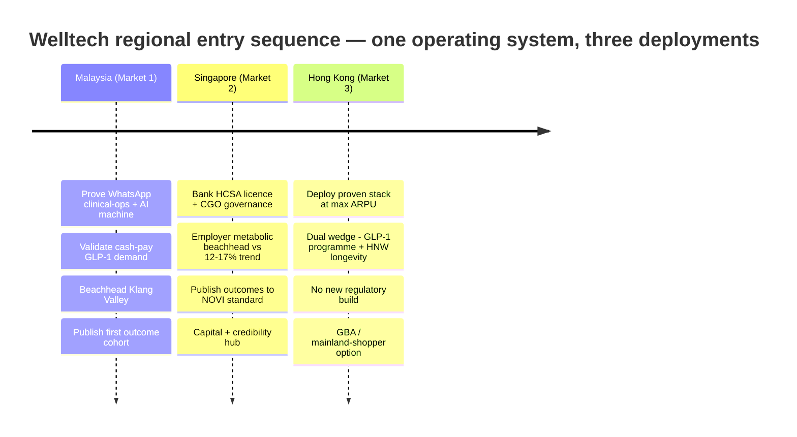

# Cross-Market Comparison — Malaysia · Singapore · Hong Kong (Welltech Health)

**Last updated: July 2026**

> This document is the rigorous three-market synthesis of Welltech's target geographies. It sets Malaysia, Singapore and Hong Kong side by side across every decision-relevant dimension — demographic and metabolic-disease burden; healthcare-system structure and out-of-pocket exposure; health expenditure and medical inflation; digital and WhatsApp penetration; telehealth regulation type and enforcement posture; GLP-1 registration and pricing (local currency and USD-normalised); advertising walls; privacy regimes; competition maturity and key incumbents; the shape of each longevity market; and TAM→SAM→SOM funnels reduced to a common USD view. It then distils what is common across all three (the universal whitespace: supervised, longitudinal, outcome-accountable metabolic and longevity care delivered on WhatsApp), what is genuinely market-specific, a weighted market-attractiveness scoring matrix explaining why the entry sequence is **Malaysia → Singapore → Hong Kong**, the cross-border and regional-platform synergies (shared clinical protocols, one AI/WhatsApp stack, the JB–Singapore and GBA corridors, licence portability as a credibility asset), and a currency-normalisation note. It introduces no new external research: every figure traces to the three market-intelligence masters and the three executive summaries via relative links, which carry the primary citations.

**Sibling documents:** [malaysia-market-intelligence.md](malaysia-market-intelligence.md) · [singapore-market-intelligence.md](singapore-market-intelligence.md) · [hong-kong-market-intelligence.md](hong-kong-market-intelligence.md) · [../00-executive-summary/malaysia-executive-summary.md](../00-executive-summary/malaysia-executive-summary.md) · [../00-executive-summary/singapore-executive-summary.md](../00-executive-summary/singapore-executive-summary.md) · [../00-executive-summary/hong-kong-executive-summary.md](../00-executive-summary/hong-kong-executive-summary.md) · [../20-competitor-dossiers/competitor-comparison.md](../20-competitor-dossiers/competitor-comparison.md) · regional exec summary: [../00-executive-summary/cross-market-summary.md](../00-executive-summary/cross-market-summary.md)

---

**Contents:** 1. Currency & normalisation note · 2. Demographics & metabolic burden · 3. Healthcare system & OOP structure · 4. Health expenditure & medical inflation · 5. Digital & WhatsApp penetration · 6. Telehealth regulation & enforcement · 7. GLP-1 status & pricing · 8. Advertising walls · 9. Privacy regimes · 10. Competition maturity & incumbents · 11. Longevity market shape · 12. Price levels (comparable program-month & screening) · 13. TAM→SAM→SOM, normalised USD · 14. What is common — the universal whitespace · 15. What is market-specific · 16. Market-attractiveness scoring matrix · 17. Cross-border & regional-platform synergies · 18. Synthesis

---

## 1. Currency & normalisation note

All local-currency figures are drawn from the three market masters. To compare across markets this document applies fixed mid-2026 reference rates; these are planning conversions, not spot quotes, and small movements do not change any conclusion.

| Pair | Rate used | Note |
|---|---|---|
| USD : MYR | 1 : 4.70 | Ringgit; RM999 ≈ USD 213 |
| USD : SGD | 1 : 1.30 | SGD 129,200 GDP/capita ≈ USD 99,400 implies ≈1.30 |
| USD : HKD | 1 : 7.80 | HK dollar peg band |
| SGD : MYR | 1 : 3.62 | S$1 ≈ RM3.62 (JB-corridor arbitrage anchor) |
| HKD : MYR | 1 : 0.60 | HK$1 ≈ RM0.60 |

**Reading discipline carried from the masters.** (i) Market-size headline estimates diverge by up to 10× across vendors because scopes differ (device+IT+enterprise "telemedicine" vs consumer digital-care); the reconciled Welltech-relevant envelopes below are the analyst-triangulated ranges, not vendor headlines ([MY §4.1](malaysia-market-intelligence.md), [SG §5.1](singapore-market-intelligence.md), [HK §5.1](hong-kong-market-intelligence.md)). (ii) Obesity figures are **not** like-for-like: Malaysia and Hong Kong report on Asian/local BMI cut-offs, Singapore headlines BMI≥30 (WHO) — the single most important cross-market caveat, flagged wherever it bites. (iii) All TAM/SAM/SOM are analyst estimates with stated assumptions in the source masters; they are planning bands, not forecasts.

---

## 2. Demographics & metabolic-disease burden

| Dimension | Malaysia | Singapore | Hong Kong |
|---|---|---|---|
| Population | 34.2m (2025) | 6.11m (4.20m residents + 1.91m non-residents) | 7.53m (mid-2025) |
| Adults (approx.) | ~24m (18+); ~23m in funnels | ~4.6m | ~5.2m (20–69) |
| Median age | **31.3** — youngest | 43.2 | **49.4** — oldest; world's highest life expectancy (F 88.4 / M 82.8) |
| Aged 65+ | 8.0% (ageing nation by 2030) | 18.8% residents (≈1-in-4 citizens by 2030) | **25.0%** (→36% by 2046) |
| GDP per capita | ~USD 12–13k (upper-middle) | ~USD 99,400 (very high) | ~USD 54,100 (high) |
| Wealth concentration | KL/Klang Valley affluent ~8.8m catchment | 332k USD-millionaires; 2,000+ family offices | 12,546 UHNWIs (#2 globally); ~3,384 family offices |
| Overweight+obese (reported) | **54.4%** (BMI≥25 WHO); ~70.1% at Asian ≥23 | **12.7% obese** (BMI≥30); larger at Asian ≥27.5 | **54.6%** (Asian cut-offs; obese 32.6%) |
| Cross-market caveat | WHO cut-off | **WHO cut-off — not comparable to MY/HK headline** | Asian cut-off |
| Obesity trend | ↑ from 44.5% (2011); WOF projects 41% (BMI≥30) by 2035 | ↑ from 10.5% (2019–20) — the NPHS 2024 headline concern | ↑ from 29.9% (2014-15); men 45–54 peak 74.6% |
| Diabetes | **15.6%** (~40% undiagnosed) | >400k; **1-in-3 lifetime risk**; ~1m by 2050 | **8.5%** raised glucose (3.1pp newly detected) |
| Hypertension | 29.2% | Highest-prevalence clinical NCD (exam component) | ~27.7% (commonest chronic condition) |
| NCD economic cost | RM64.2bn/yr (~4.2% GDP, 2021) | Claims-inflation-driven (see §4) | Ageing-driven; primary-care spend 29.3% of CHE |
| Structural read | Youngest + heaviest + fastest-worsening → **volume** | Smallest base, steepest trend, richest payer → **ARPU** | Heaviest per-capita + oldest + richest → **margin** |

**Analytical read.** On a like-for-like Asian-cut-off basis, all three markets have an overweight/obese **majority or near-majority of adults** — the metabolic engine is universal ([HK §2.1](hong-kong-market-intelligence.md)). What differs is (a) absolute scale (Malaysia's ~13m overweight/obese adults dwarf the others), (b) age structure (Hong Kong is 18 years older than Malaysia, front-loading chronic and longevity demand), and (c) diagnosis state — Malaysia's market is the **undiagnosed** ([MY exec §2.1](../00-executive-summary/malaysia-executive-summary.md)), while Singapore's and Hong Kong's is the **screened-but-unmanaged** ([SG exec §2.1](../00-executive-summary/singapore-executive-summary.md), [HK exec §2.2](../00-executive-summary/hong-kong-executive-summary.md)). The clinical mandate is identical; the acquisition funnel inverts.

---

## 3. Healthcare system structure & out-of-pocket exposure

| Dimension | Malaysia | Singapore | Hong Kong |
|---|---|---|---|
| System archetype | Two-tier (subsidised public + FFS private); public congested | Hybrid 3M financing + Healthier SG preventive reform | Dual-track extreme (HA near-free but queue-rationed) |
| Public role | 52.7% of THE; near-free at point of care; specialist short ~11,000 | 3 clusters + polyclinics; Healthier SG (~1m enrolled yr-1) | HA ~90% of inpatient; stable specialist waits in years |
| Private primary care | ~7,000 GPs; dense urban | >2,000 private GP clinics; CHAS-subsidised | **~70% of primary-care consultations already private** |
| OOP share of health spend | ~36% of THE; **~76% of private financing** | **~25%** (from ~48% in 2000) | Private = **48.2% of CHE** (highest private share) |
| Insurance structure | ~54% insurance+takaful penetration; MHIT shallow; ~17–22% health-insured | **71% hold Integrated Shield Plans (~3m)** | VHIS ~1.34m policies; group medical dominant white-collar |
| Payer archetype | **Cash is default** — patient pays directly | **Claims-anchored** — "is it claimable?" | **Highest OOP tolerance** — queue-avoidance pays |
| The economic buyer | Patient (cash), then employers | **Employers/insurers first**, then affluent cash | Cash patient + employer; insurers carve out GLP-1 |
| System's push on demand | Congestion pushes patients **private** | State **crowds out** the low end (Healthier SG, CHAS, HealthHub) | Jan 2026 A&E fee HK$180→400 deliberately pushes demand **private** |
| Public digital spine | **None** | NEHR (mandate incoming via HIA) | eHealth+ (voluntary, expanding; Amendment Ordinance 2025) |

**Analytical read.** The financing logic differs but converges on the same opening. Malaysia's 76% private-OOP share means a cash-pay subscription fits ingrained behaviour ([MY §3.2](malaysia-market-intelligence.md)). Singapore's low OOP is misleading — the money moves through **claims inflation** and 71% IP coverage, so the buyer is the employer/insurer, and the 1 April 2026 rider reform is pushing insured consumers toward package-priced prevention ([SG §3.3](singapore-market-intelligence.md)). Hong Kong's queue-versus-price binary generates continuous private demand with **no subsidy competitor in the middle market** ([HK §2.4](hong-kong-market-intelligence.md)). In all three, the state anchors or subsidises the low end (or lets it queue) and vacates the premium metabolic/longevity middle — the layer Welltech targets.

**Implication for Welltech.** The economic buyer differs by market and dictates the beachhead motion: patient-cash DTC in Malaysia, employer/insurer-first in Singapore, and cash-plus-employer with queue-avoidance in Hong Kong. The universal constant is that the premium metabolic/longevity middle is unsubsidised and uncontested by the state everywhere — so the go-to-market lead varies (DTC vs B2B2C) but the target layer does not.

---

## 4. Health expenditure & medical inflation

| Dimension | Malaysia | Singapore | Hong Kong |
|---|---|---|---|
| Total/current health expenditure | RM84.2bn (4.6% GDP, 2023) | MOH budget S$20.86bn FY2025 (+16.3% YoY); ~5.9% GDP projected by 2030 | HK$251.2bn (8.3% GDP, 2023/24) |
| Public : private split | 52.7 : 47.3 | State-heavy; OOP ~25% | 51.8 : 48.2 |
| Medical trend (2025) | **~15%** (Mercer Marsh) — ~7× CPI | **12–15.5%**; 16.9% projected 2026 vs ~3% healthcare CPI | **~9.8%**; group premiums +55% (2021–24) |
| Regulatory/payer response | BNM co-pay/deductible mandate; DRG reform 2026–27 | Rider reform 1 Apr 2026 (co-pay cap doubled to S$6,000) | VHIS growth; carve-outs of GLP-1 weight cover |
| Implication for Welltech | Employers/insurers motivated to fund prevention | **Burning-platform employer channel; brokers gatekeep** | CFO-grade metabolic-prevention pitch to employers |

**Analytical read.** Double-digit medical trend is the single most consistent payer-side tailwind across all three markets — 15% (MY), up to 16.9% projected (SG), ~9.8% (HK) — everywhere running multiples of headline inflation. It converts employers and insurers from bystanders into motivated buyers of claims-reducing metabolic prevention, and it is the B2B2C wedge that monetises **without** consumer drug advertising (illegal in all three; §8). Singapore's channel is the most developed (near-universal PMET benefits, professional brokers, HPB 30–90% co-funding grants), which is why the Singapore beachhead is explicitly employer-first ([SG exec §5.1](../00-executive-summary/singapore-executive-summary.md)).

---

## 5. Digital & WhatsApp penetration

| Dimension | Malaysia | Singapore | Hong Kong |
|---|---|---|---|
| Internet penetration | 97.4% | 98.4% | 96.8% |
| WhatsApp reach | **90.7%** of 16–64; 852 sessions/mo (most-opened app) | **~84%** of internet users | **~74.7%** — top messaging utility |
| Second channel | — | **Telegram ~38%** (unusually strong) | — (WeChat secondary; cross-border only) |
| Payment rails | Mature DuitNow QR (409 e-payments/capita) | SingPass/HealthHub identity familiarity | VHIS/group-medical claims plumbing |
| Incumbent WhatsApp use | Manual clinic inbox; no SLA/CRM/audit | Receptionist-on-handphone; vendor ecosystem forming | **Hospitals book over WhatsApp**; manual, unaudited |
| Differentiation lever | **Convenience** (vs manual inboxes) | **Quality** (everyone already WhatsApps; win on API/SLA/audit) | **Quality** at API/programme grade — best channel fit in Asia |
| Data-localisation barrier | PDPA TIAs apply | PDPA + NEHR write-back | **None** (PDPO s.33 not in force) |

**Analytical read.** WhatsApp is the universal substrate — the one operating assumption that holds identically across all three markets. The difference is competitive: in Malaysia WhatsApp-native care is a **convenience** advantage over manual inboxes; in Singapore and Hong Kong everyone already WhatsApps their clinic, so the edge shifts to **quality** — WhatsApp Business API with consent logging, SLAs, templated clinical journeys and audit trails versus the ad-hoc handphone status quo ([SG §9.4](singapore-market-intelligence.md), [HK §9.2](hong-kong-market-intelligence.md)). Hong Kong is the strongest channel fit of the three (hospital-level habit, no WeChat lock-in, no data-localisation barrier). The stack ships essentially unchanged across markets — add Mandarin/Manglish for MY, Telegram for SG, Traditional Chinese + Putonghua for HK.

---

## 6. Telehealth regulation type & enforcement posture

| Dimension | Malaysia | Singapore | Hong Kong |
|---|---|---|---|
| Telehealth licence | **None enforced** (Telemedicine Act 1997 never commenced) | **Required** — HCSA Outpatient Medical Service licence + CGO | **None** — MCHK 2019 ethical guidelines only |
| Governing instrument | OHS Guideline 2025 (DG Circular 16/2025); MMC guidelines | HCSA (Phase 2, Jun 2023); SMC ECEG; Joint Circular 87/2024 | MCHK *Ethical Guidelines on Telemedicine* (Dec 2019, non-binding) |
| Who bears the risk | Doctor (MMC) + facility (PHFSA) | **Licensee entity + doctor** | **The individual doctor** (registration/discipline) |
| Entry friction | Low–medium | **Highest** (licence + CGO + inspection; 3–6 mo lead) | **Lowest** — no licence, no inspection |
| Enforcement posture | Real but lighter: 48 GLP-1 ad warning letters (2025); tele-MC ban (Sep 2025) | **Most aggressive in region** — MaNaDr shutdown (Aug 2024), licence-revocation notice, doctors referred to SMC | No statutory telehealth enforcement; **MCHK discipline + press scrutiny** perform the function informally |
| GLP-1 initiation rule | In-person-first prudent norm | **In-person initiation effectively mandatory** (Circular 87/2024) | Doctor's clinical judgement (soft law) |
| Signature enforcement event | MMC tele-MC prohibition (23 Sep 2025) | MaNaDr: >100,000 consults ≤1 min in a sampled month | No equivalent shutdown — but any pill-mill exposes the doctor personally |
| Strategic implication | Rigor is a moat vs grey-market sellers | **Compliance is existential — and the price of admission is a moat** | Enter fast, but **govern as if licensed** — the safety net is the doctor's licence |

**Analytical read.** The regulatory profiles are near-opposites and that is the point. Singapore is hard-law, high-friction, actively enforced — the licence + approved CGO + SMC-grade consult protocol are costs a governance-led operator absorbs once and cut-corner competitors cannot, and post-MaNaDr, buyers actively discriminate toward governance-credible providers ([SG §4.9](singapore-market-intelligence.md)). Hong Kong is the mirror image — no licence gate (fastest launch), but the entire safety net rests on the prescribing doctor's registration, so governance must be engineered privately from day one ([HK §4.1](hong-kong-market-intelligence.md)). Malaysia sits between — permissive but tightening, with the tele-MC ban having mechanically favoured chronic/weight/longevity models over transactional consults ([MY exec §3.2](../00-executive-summary/malaysia-executive-summary.md)). The unifying design conclusion: **build to the Singapore standard everywhere** — it is the compliance ceiling that clears the other two markets automatically and travels as a credibility asset (§17).

---

## 7. GLP-1 status & pricing (local currency + USD)

| Dimension | Malaysia | Singapore | Hong Kong |
|---|---|---|---|
| Registration | Saxenda, Ozempic, Rybelsus, Wegovy, Mounjaro NPRA-registered | Saxenda, Ozempic, Wegovy (2023), Mounjaro (weight indication Jun 2025) | **All four brands registered**; Wegovy launched Nov 2025 |
| Market-formation moment | **Wegovy Jan 2026** (on-label obesity); Mounjaro Aug 2025 | Wegovy 2023 + Mounjaro weight indication Jun 2025 | Mounjaro late 2024; **Wegovy Nov 2025 (~HK$2,700/mo retail)** |
| Weight-drug ad rule | POM cannot be advertised to public; KKLIU pre-approval for service ads | POM ad ban actively enforced (no pre-approval lane) | UMAO statutory prohibition + Schedule 4 weight-claim limits |
| Retail/street price (local) | RM899–3,200/mo | S$350–1,000/mo (typical S$600–800) | HK$2,700 retail (Wegovy) → clinic programmes HK$6,000–11,500 |
| Retail/street price (USD) | **~USD 191–681/mo** | **~USD 269–769/mo** | **~USD 346–1,474/mo** |
| Dominant grey channel | Aesthetic clinics (40–50% of volume, 30–60% markup) | DTC discounters + HSA-policed online sellers | Med-spas + pharmacy self-sourcing + "Bangkok hop" + mainland-shopper |
| Reimbursement | Excluded as "cosmetic"; cash-pay | Not CDMP-listed; cash/employer | Increasingly carved out of plans |

**Analytical read.** GLP-1 availability is now settled in all three markets, with 2024–26 the shared category-formation window — Wegovy's arrival (Jan 2026 MY, Nov 2025 HK) plus Mounjaro created a synchronised regional inflection while consumer drug advertising stays suppressed everywhere. The pricing gradient is the clearest expression of the three-market thesis: identical clinical work commands ~USD 190 (MY) → ~USD 270–770 (SG) → up to ~USD 1,470 (HK). Retail drug price anchors (e.g. HK$2,700 Wegovy) expose incumbent programme markups, which is Welltech's positioning wedge in every market — sell the governed programme, not the pen.

---

## 8. Advertising walls

| Dimension | Malaysia | Singapore | Hong Kong |
|---|---|---|---|
| Legal instrument | Medicines (Advertisement & Sale) Act; MAB/KKLIU approval | Health Products (Advertisement) Regs 2016; HCS(A) Regs 2021 | **Undesirable Medical Advertisements Ordinance (UMAO, Cap 231)** |
| Core rule | No POM/molecule names in consumer creative; service ads need KKLIU no. | **Outright POM ad ban to public**, actively policed | **Statutory prohibition** + Schedule 4 weight-claim limits |
| Pre-approval lane | Yes (KKLIU, 4–6-wk lead) | **None** — outright ban | None — statutory prohibition |
| Enforcement evidence | 48 GLP-1 warning letters (2025); 38,055 ads removed 2023–25 | MOH/HSA blocked euphemistic creatives; **named platforms publicly** | First conviction HK$50,000 + 6 months; med-spas advertise "body contouring" only |
| Compliant growth engine | Disease education + program marketing; doctor-fronted content | Factual clinic/programme ads; HCP-gated detailing; outcome statistics | Education content, referral, employer channel, clinician credibility |

**Analytical read.** All three markets prohibit brand-name drug advertising to consumers — the growth engine cannot be paid product marketing anywhere. This is a **shared structural advantage** for Welltech's model: the compliant lanes (physician-authored disease education, program-not-molecule marketing, employer/insurer B2B, referral, a solicited-review flywheel) favour a WhatsApp-first retention operator over incumbents' foot-traffic and paid-media playbooks. Singapore and Hong Kong are strictest (outright bans, no pre-approval lane); Malaysia's KKLIU workflow is the one pre-clearance pathway. The compliant-content playbook built for Singapore ports to Hong Kong essentially unchanged ([HK §4.4](hong-kong-market-intelligence.md)).

---

## 9. Privacy regimes

| Dimension | Malaysia | Singapore | Hong Kong |
|---|---|---|---|
| Statute | PDPA 2010 (amendments in force Jan–Jun 2025) | PDPA + PDPC healthcare guidelines (rev. 2023) | PDPO (Cap 486) |
| Health data | Sensitive personal data | Sensitive; sector guidelines | Not a separate statutory category; PCPD treats as sensitive |
| Breach notification | **72-hour mandatory**; fines to RM1m | Duty under PDPA; NEHR contribution mandatory (HIA incoming) | **No mandatory breach notification** |
| Cross-border transfer | Transfer Impact Assessments required (WhatsApp/Meta, cloud, AI APIs) | Entity-owned WABA; no ad-hoc identifiable results in chat | **Section 33 (cross-border restriction) never brought into force** |
| National record mandate | None | **Mandatory NEHR contribution incoming (HIA, Bill Nov 2025)** | eHealth+ voluntary deposit; can be mandated for specified data |
| Relative burden | Medium | **Highest** | **Lightest** (most permissive for WhatsApp-first ops) |

**Analytical read.** Privacy burden inverts the regulatory-friction ranking in a useful way: Singapore is heaviest (entity-owned WABA, no ad-hoc identifiable results in chat, mandatory NEHR write-back), Hong Kong lightest (no s.33, no breach-notification duty — the most permissive of the three for a WhatsApp-first, offshore-processing operator), Malaysia in between (72-hour breach, TIAs). The design conclusion mirrors §6: build the messaging stack to the Singapore/PDPC bar everywhere (audit-logged, consent-flagged, results-via-secure-link, EMR-as-record) and it satisfies all three regimes while behaving as if HK's s.33 applied ([SG §9.2–9.3](singapore-market-intelligence.md), [HK §4.5](hong-kong-market-intelligence.md)).

---

## 10. Competition maturity & key incumbents

| Dimension | Malaysia | Singapore | Hong Kong |
|---|---|---|---|
| Maturity | Fragmented; thin premium; **empty medical-longitudinal quadrant** | **Dense, regulator-filtered**; rails locked | **Dense but unprogrammatic**; med-spa-led GLP-1 |
| Telehealth incumbents | DoctorOnCall (1.9m users, RM15), Doctor Anywhere, DOC2US | Doctor Anywhere (S$88m Series C), **WhiteCoat (AIA-exclusive)** | DrGo (HKT, ~180k downloads/5yr), Bowtie, ZA Health — subscale |
| Clinical/programme benchmark | None (no published outcomes; one Naluri study) | **NOVI Health** (708-pt cohort, 12.7%/12mo, IJO 2026) — sub-scale, app-walled | None; EC Healthcare (HK$4.14bn, loss-making, trust-damaged) |
| DTC weight cohort | OVA/ORA (~RM900), Roczen (RM895), Seimbang (RM899) | ORA/andSons/OVA (US$17m+, 250k+ consults), noah, Siena | Zoey (women-first, HK$200 consult), Noah, Bare, FastMed — <3yr old |
| Insurer rails | Low coverage; open | **Locked** (DA + WhiteCoat/AIA) | Semi-open (QHMS/Bupa, Bowtie own their own; AXA/Manulife/Cigna group books open) |
| Corporate channel | HealthMetrics (1.2m members), Naluri (1m lives, coaching-only) | Fullerton, IHP/MHC, Minmed screening funnels | QHMS/Bupa panel (~890k customers) |
| Published outcomes | **One** in entire market (Naluri) | **One** (NOVI, the benchmark) | **None** (weight sold on before/after imagery) |
| The unowned layer | Medical + longitudinal quadrant | Outcome-accountable programme care in mass-affluent middle | Care orchestration (programme-grade, auditable, longitudinal) |

**Analytical read.** The same structural pattern recurs in all three markets: **crowded at every point of the care journey, empty across it.** Every incumbent clusters in three of four quadrants on the medical-authority × care-model map, and the clinically-governed-and-longitudinal quadrant is empty — not for lack of visibility but because each incumbent's unit economics (per-consult, per-admission, per-pen commission, prepaid packages, coaching-only contracts) punish the longitudinal behaviour that quadrant requires ([MY exec §4.2](../00-executive-summary/malaysia-executive-summary.md), [SG exec §4.2](../00-executive-summary/singapore-executive-summary.md), [HK exec §4.2](../00-executive-summary/hong-kong-executive-summary.md)). The maturity differs: Malaysia has no benchmark; Singapore has one sub-scale clinical benchmark (NOVI) plus locked insurer rails; Hong Kong's largest incumbent (EC Healthcare) is distressed and beauty-coded. Only two published outcome studies exist across all three markets combined — the measurement gap is the moat.

### 10.1 Porter's Five Forces — cross-market synthesis

Each master runs a full Five Forces analysis; reduced to a single comparative view (⚠ = intensity):

| Force | Malaysia | Singapore | Hong Kong | Cross-market read |
|---|---|---|---|---|
| Rivalry | Moderate → rising (transactional incumbents) | **High** (DA/WhiteCoat + NOVI + DTC crowd) | **High** but *episodic, not programmatic* (EC, QHMS, boutiques) | Rivalry rises with wealth, but nowhere is it programme-based — the whitespace survives everywhere |
| New entrants | Moderate–High (low tech barriers) | **Medium-Low** (HCSA licence + CGO raise the bar) | Moderate-High (no licence gate; UMAO + clinician scarcity are the real barriers) | Licensing protects SG; reputation/clinician supply protects HK; MY least protected — enter first, define fast |
| Buyer power | Moderate (cash, price-compare) | **High** (insurers/employers negotiate; MOH benchmarks) | Moderate-High (doctor-shopping, zero switching cost) | Continuity must be *engineered* everywhere; longitudinal programmes reduce buyer power over time |
| Supplier power | Moderate-High (scarce specialists; GLP-1 duopoly) | Medium-High (scarce doctors; DKSH sole distribution) | **High** (post-emigration clinician scarcity; Novo/Lilly) | Clinician-light + multi-molecule formulary is the universal mitigation; binds hardest in HK |
| Substitutes | **High** (cheap GPs, near-free public, supplements) | High (subsidised polyclinics, JB arbitrage, grey-market) | High (near-free HA queue, TCM, GBA care, Bangkok hop) | Substitutes cap *middle-market* pricing but barely touch the premium segment Welltech targets |

**Net structural read.** Every market is attractive *only* for a differentiated, clinician-light, programme-based operator at the premium/metabolic end — a me-too clinic or generic telehealth app would be crushed in all three. The forces that matter most vary: buyer power and rivalry in Singapore, supplier power (clinicians) in Hong Kong, substitutes in Malaysia. But the winning posture is identical everywhere — outcomes + convenience + trust, never price.

### 10.2 Regulatory & category timeline — cross-market

The synchronised sequence of enforcement, category and payer events that opened the window across all three markets:

| Date | Malaysia | Singapore | Hong Kong |
|---|---|---|---|
| 2023 | Health White Paper (reform) | HCSA Phase 2 (teleconsult licensable); Wegovy HSA-approved | — |
| 2024 | PDPA amendments; OHS RegLab | **MaNaDr shutdown → revocation notice; Joint Circular 87/2024** | Mounjaro approved; group premiums +55% (2021–24) |
| Jun 2025 | Mounjaro available (Aug) | Mounjaro weight indication (KwikPen/DKSH) | — |
| Sep 2025 | **MMC tele-MC prohibition** | — | — |
| Nov 2025 | — | Health Information Bill introduced (NEHR mandate) | **Wegovy launched (~HK$2,700/mo); eHealth+ in force (1 Dec)** |
| Jan 2026 | **Wegovy launched** (on-label obesity) | — | **A&E fee HK$180→400** (pushes demand private) |
| Mar–Apr 2026 | GP fee-band revised (RM10–80) | **IP rider reform** (co-pay cap S$6,000) | **First Weight-Management Action Plan** (4 Mar) |
| End-2026 | Digital Health Act awaited | — | Centre for Medical Products Regulation to stand up |

**Analytical read.** The clocks are synchronised, not coincidental: GLP-1 category formation (2024–26), payer-reform pressure (rider reform SG, A&E fee HK, fee-band MY) and enforcement/legitimisation (MaNaDr SG, tele-MC ban MY, Action Plan HK) all land inside a ~24-month regional window. This is why the entry sequence is time-sensitive — the category-defining position in each market is contestable now and hardens as incumbents assemble responses over the following 6–24 months.

---

## 11. Longevity market shape

| Dimension | Malaysia | Singapore | Hong Kong |
|---|---|---|---|
| Stage | Nascent; exec screening mainstream, longevity early-adopter | **Asia's longevity hub** — state-institutional legitimacy | Mature checks + boutique longevity; HNW-dense |
| State/academic anchor | None | **NUS Academy for Healthy Longevity; Alexandra public HLC** | None (Prenetics is private, global-scale) |
| Premium incumbents | Longevity Clinic KL; hospital exec screening | Chi Longevity (from S$4,250/S$15k+), NOVI Assessment, Regenosis | Humansa (New World, distressed parent), LifeHub/LifeClinic, Prenetics/CircleDNA/Insighta |
| Market structure | Systems-poor cottage industry (real doctors, no prices/subscriptions) | **Barbell** — S$4,250+ concierge vs ≤S$1,700 report-and-goodbye | **Barbell** — HK$36,880 hospital checks vs boutique IV/functional |
| Consumer intent | Rising with ageing/NCD burden | **55.5%** expressed interest in a longevity clinic | Screening is a consumer habit; corporate-subsidised |
| Empty middle (whitespace) | Preventive-health membership (RM3,600–8,800/yr) | **S$2,000–6,000/yr productised tier** | **HK$25,000–40,000/yr managed membership** |
| Diagnostics supply | Independent labs ~40% share; USD 1.28bn (2024) lab market | Dense imaging/MRI supply; partner not build | Prenetics/CircleDNA/Insighta — partner as supplier |

**Analytical read.** The longevity opportunity is the same shape in all three markets — a **barbell with an empty productised middle** between one-off screening (which "ends at the PDF") and ultra-premium concierge — but at radically different price points and maturities. Singapore uniquely has state-institutional legitimacy (NUS, Alexandra HLC), which de-risks consumer perception that Malaysian and Hong Kong entrants must buy with marketing ([SG §7.3](singapore-market-intelligence.md)). Hong Kong has the deepest HNW constituency and the highest membership price ceiling, plus a global-scale diagnostics supplier (Prenetics) to partner. The universal design: physician-led, diagnostics-anchored, WhatsApp-case-managed membership that converts screening customers into managed programmes and cross-sells from the metabolic (GLP-1) line — the follow-through nobody owns.

---

## 12. Price levels — comparable GLP-1 program-month & executive screening

The clearest single view of the ARPU gradient: the same clinical service, priced three ways. Welltech reference program pricing is the doctor-led, all-in metabolic programme (drug bundled or transparent pass-through) from the three exec summaries.

| Comparable | Malaysia | Singapore | Hong Kong |
|---|---|---|---|
| **Welltech GLP-1 program-month (reference)** | RM999/mo core | S$450–700/mo all-in | HK$3,500–5,000/mo all-in |
| — in USD | **~USD 213** | **~USD 346–538** | **~USD 449–641** |
| Market GLP-1 program-month range (USD) | ~191–681 | ~269–769 | ~346–1,474 |
| Incumbent clinic band (local) | Aesthetic RM1,288–3,200/pen | Aesthetic/clinic S$430–1,200/mo | Clinic programmes HK$6,000–11,500/mo |
| **Executive screening (local)** | RM399–3,290 (hospital exec) | S$511/585–12,888 | HK$2,600–36,880 |
| — in USD | **~USD 85–700** | **~USD 393–9,914** | **~USD 333–4,728** |
| Longevity membership (Welltech target) | RM3,600–8,800/yr (~USD 766–1,872) | S$2,000–6,000/yr (~USD 1,538–4,615) | HK$25,000–40,000/yr (~USD 3,205–5,128) |
| Teleconsult anchor (unmonetisable flagship) | RM15–60 (WTP median RM58) | S$10–27 std / ~S$49 after-hours | (private GP HK$180–1,000+) |
| ARPU multiple vs Malaysia (program) | 1.0× | **~1.6–2.5×** | **~2.1–3.0×** |

**Analytical read.** Welltech's core GLP-1 programme is priced ~USD 213 in Malaysia, ~USD 346–538 in Singapore and ~USD 449–641 in Hong Kong — a 1.6–3.0× ARPU gradient for near-identical clinical work, driven entirely by wealth density and willingness-to-pay, not cost. Executive screening spans an even wider band (Singapore's S$12,888 apex is ~USD 9,900). The teleconsult is structurally unmonetisable as a flagship in every market (WTP RM58 in Malaysia; S$10–27 banded in Singapore) — confirming that the economics must live in the **programme layer**, not the consult, universally. This gradient is the arithmetic case for sequencing volume (Malaysia) before margin (Hong Kong): the same operating system earns 2–3× more per patient as it moves north.

**Price-positioning strategy, common logic, three anchors.** In every market Welltech prices *between* the drug/discounter floor and the incumbent-clinic ceiling, monetising the care layer rather than the pharmacy spread:

- **Malaysia:** RM999/mo core — same price as a bare DoctorOnCall pen *with* the full care layer; flat across titration to remove the month-4 dose-escalation churn cliff; anchored between the RM879–999 pharmacy floor and the RM1,288–3,200 aesthetic ceiling.
- **Singapore:** S$450–700/mo all-in — at/under NOVI's S$430 anchor with a deeper service layer; undercuts aesthetic tirzepatide (S$763+/mo ≥5mg); premium to DTC discounters (S$350–650), justified by the care layer.
- **Hong Kong:** HK$3,500–5,000/mo all-in — below the HK$6,000–11,500 clinic band while out-crediting med-spas; must justify its premium over ~HK$2,700 pharmacy self-sourcing and the "Bangkok hop" with governance, titration safety and outcomes, never price.

The universal principle: **the retail drug price is the anchor that exposes incumbent markups**, and margin lives in retention (coaching, titration discipline), not the pen — which is also exactly what regulators want to see clinically. Compliance and unit economics point the same direction in all three markets.

---

## 13. TAM → SAM → SOM, normalised to USD

Each market master builds bottom-up funnels in local currency with stated assumptions. Reduced to a common USD view (rates per §1):

### 13.1 Reconciled digital-health-services envelope (the market competed within)

| Market | Local/USD envelope (2024–25) | Growth |
|---|---|---|
| Malaysia | USD 0.6–1.1bn | ~14–20% CAGR |
| Singapore | USD 0.4–0.7bn | low-to-mid-teens |
| Hong Kong | USD 0.3–0.45bn | ~7–20% (scope-dependent) |
| **Regional** | **~USD 1.3–2.25bn (2024–25)** | **~low-to-high-teens** |

*Headline vendor "telemedicine" figures (e.g. Grand View USD 4.1bn Singapore) are scope-inflated with device/IT/enterprise and are not used here.*

**Implication.** The reconciled regional envelope (~USD 1.3–2.25bn) is the market Welltech competes *within*; the theoretical clinical TAM (GLP-1 eligibility alone: RM15–30bn MY, S$3.4–6.3bn SG, HK$63bn HK) is an order of magnitude larger but shown for discipline, not realisability. The investable case is a low-single-digit share of the reconciled SAM (§13.2), concentrated in the highest-value metabolic and preventive segments — not a bet on capturing the theoretical ceiling.

### 13.2 Welltech-relevant SAM and Year-3 SOM (USD)

| Market | SAM (Welltech-relevant, USD/yr) | Year-3 SOM (USD ARR) | Maturity SOM (USD/yr) |
|---|---|---|---|
| Malaysia | Weight serviceable RM1.5–3.5bn by 2030 ≈ **USD 320–745m**; +longevity/primary | Weight 6k–15k patients ≈ RM60–160m ≈ **USD 13–34m** | Blended RM185–670m ≈ **USD 39–143m** |
| Singapore | A S$0.7–1.4bn + B S$150–350m + C S$80–200m ≈ **USD 715m–1.5bn** | Combined S$10–26m ≈ **USD 7.7–20m** | (yr-3 basis) |
| Hong Kong | ~HK$3–5.5bn ≈ **USD 385–705m** | HK$70–200m ≈ **USD 9–26m** | (yr-3 basis) |
| **Regional** | **~USD 1.4–3.0bn/yr** | **~USD 30–80m ARR** | **scaling toward USD 100m+ as MY matures** |

### 13.3 Per-segment Year-3 SOM breakout (local + USD)

The three segments contribute differently by market, reflecting each market's role:

| Segment | Malaysia (yr-3) | Singapore (yr-3) | Hong Kong (yr-3) |
|---|---|---|---|
| A — Medical weight loss / GLP-1 | 6k–15k patients; RM60–160m (**USD 13–34m**) | 1,800–4,000 patients; S$6.5–14.5m (**USD 5–11m**) | 1,200–3,500 patients; HK$45–145m (**USD 6–19m**) |
| B — Longevity / preventive | 8k–25k members (maturity); RM25–120m (**USD 5–26m**, maturity) | 700–2,500 clients; S$2–7.5m (**USD 1.5–5.8m**) | 500–1,200 members; HK$15–45m (**USD 2–5.8m**) |
| C — Telehealth-first / concierge (retention wrapper) | 30k–80k members (maturity); RM60–200m (**USD 13–43m**, maturity) | 600–1,500 members; S$1.5–4m (**USD 1.2–3.1m**) | 2,000–5,000 members; HK$10–30m (**USD 1.3–3.8m**) |
| **Combined yr-3 SOM** | ~USD 13–34m (weight-led) | S$10–26m (**USD 7.7–20m**) | HK$70–200m (**USD 9–26m**) |

*Malaysia's B and C figures are maturity (3–5 yr) not strict yr-3; the weight segment is the yr-3 anchor. Segment A carries the near-term investable case in every market. Overlapping members net the blended figures down.*

**Analytical read.** The regional Welltech-relevant SAM is roughly **USD 1.4–3.0bn/year** and the achievable Year-3 SOM roughly **USD 30–80m ARR** — a low-single-digit share of a fast-growing niche-adjacent market, concentrated in the highest-value metabolic and preventive segments. The shape is deliberately different per market: Malaysia contributes the most patients at the lowest ARPU (the volume engine); Singapore and Hong Kong contribute fewer patients at 2–3× the revenue per patient (the margin/ARPU engines). Segment A (medical weight loss) carries the near-term investable case in every market; longevity is the second product line and ARPU apex — note Hong Kong's longevity membership (HK$25–40k/yr) commands multiples of the metabolic programme, inverting the MY/SG segment weighting; concierge/primary care is the retention wrapper, not a standalone P&L. Overlapping members would net the blended figures down.

---

## 14. What is common across all three — the universal whitespace

Stripped of local detail, the same opportunity exists in all three markets. The synthesised, one-sentence whitespace is identical across the repository:

> **In every market, no operator combines prescribing authority, retention infrastructure, WhatsApp-native clinical operations, published outcomes and subscription economics into supervised, longitudinal, outcome-accountable metabolic and longevity care — because each incumbent category is structurally prevented from assembling that combination by its own unit economics.**

The common structural facts that make this whitespace universal and durable:

| Universal fact | Malaysia | Singapore | Hong Kong |
|---|---|---|---|
| Metabolic majority (Asian cut-off) | ✓ 54.4% ow/ob | ✓ larger than 12.7% headline | ✓ 54.6% ow/ob |
| Double-digit medical trend | ✓ ~15% | ✓ 12–16.9% | ✓ ~9.8% |
| WhatsApp is the substrate | ✓ 90.7% | ✓ ~84% | ✓ ~74.7% |
| GLP-1 category formed 2024–26 | ✓ Wegovy Jan 2026 | ✓ Mounjaro Jun 2025 | ✓ Wegovy Nov 2025 |
| Consumer drug advertising banned | ✓ | ✓ | ✓ |
| Screening/consult "ends at the PDF"; no follow-through | ✓ | ✓ | ✓ |
| Outcomes essentially unpublished | ✓ (1 study) | ✓ (1 study = NOVI) | ✓ (0 studies) |
| Empty longevity productised middle | ✓ | ✓ | ✓ |
| Incumbents' economics block the quadrant | ✓ | ✓ | ✓ |

**Why it persists everywhere.** The whitespace is not "weight loss" or "longevity" as categories — both are crowded in all three markets — but the **operating model**: outcome-accountable, WhatsApp-delivered, subscription-priced continuity of medical care. Incumbents cannot enter it without cannibalising the revenue model that funds them (episodic consults, bed yield, per-pen commission, prepaid packages, coaching-only contracts). An entrant with no legacy P&L holds the structural advantage in every market for as long as it outruns incumbents' willingness to self-cannibalise — estimated at 6–24 months per the threat clocks in each exec summary. This is why **one operating system can be deployed three times.**

**Implications for Welltech.** (i) The strategic question is not "which market" but "which sequence" — the whitespace exists everywhere, so the decision variable is entry order, resolved in §16. (ii) The moat is the *operating model*, not any category or feature, so investment should concentrate on the compounding assets (retention → outcomes → subscription pricing → employer channel → governance) rather than on category marketing. (iii) The 6–24-month persistence window is the binding constraint on pace: the category-defining position in each market must be claimed before incumbents assemble responses that, while economically compromised, still consume the narrative.

---

## 15. What is market-specific

The spine is common; what it attaches to diverges. The dimensions that must be re-engineered per market:

| Dimension | Malaysia | Singapore | Hong Kong |
|---|---|---|---|
| Strategic role | Volume + proving ground | ARPU + credibility + capital hub | Margin + longevity ARPU + GBA option |
| The funnel insight | The **undiagnosed** are the market | The **screened-but-unmanaged** are the market | The **screened-but-unmanaged**, queue-averse |
| Economic buyer | Patient (cash), then employers | **Employers/insurers first** | Cash patient + employer; insurers carve out |
| Regulatory build | Physical-clinic anchor; no tele-MC | **HCSA licence + CGO** (long-pole hire) | No licence — but govern as if licensed |
| GLP-1 initiation | In-person-first norm | **In-person mandatory** (87/2024) | Doctor's judgement (soft law) |
| Differentiation lever | Convenience (vs manual inboxes) | Quality (SLAs, audit, structured journeys) | Quality at API grade + clinical brand |
| Second channel | — | Telegram (~38%) | — |
| Cultural product layer | **Halal verification, Ramadan-mode titration, festive cycles** | English-first; cultural layer secondary | Traditional Chinese + Putonghua; TCM as coexisting frame |
| Positioning register | Affordability-led | Clinical seriousness | **Clinical seriousness** (MY affordability playbook fails) |
| Distinctive adjacency | JB–Singapore corridor; medical tourism (Penang/JB) | JB corridor arbitrage; longevity state legitimacy | **Mainland-shopper GLP-1/screening; GBA cross-border** |
| Binding risk | Price ceiling; trust-deficit CAC | Regulatory cost; trajectory tightening | Clinician scarcity + incumbent price war + UMAO acquisition limits |

**Analytical read.** Two adaptations are non-negotiable. First, **positioning register**: Malaysia's affordability-led playbook does **not** transfer to Singapore or Hong Kong, where two decades of slimming-industry scar tissue and sophisticated buyers demand clinical-seriousness positioning ([HK §8.5](hong-kong-market-intelligence.md)). Second, the **cultural product layer**: halal/Ramadan/festive-cycle features are core product parameters in Malaysia and de-emphasised elsewhere (retained only for Malay-community and JB-corridor products). Everything else — the AI/WhatsApp ops machine, enforced human clinical gates, the retention cadence, compliance-as-brand, outcomes publication — is shared IP re-used across markets.

### 15.1 Consumer behaviour & willingness-to-pay cross-comparison

| Trait | Malaysia | Singapore | Hong Kong |
|---|---|---|---|
| Payment psychology | Under-pay for access, **over-pay for transformation** (RM5–10k proven) | Insurance-anchored; "is it claimable?" | **Highest OOP tolerance**; queue-avoidance pays |
| Screening culture | Low; undiagnosed is the funnel | **Kiasu, high (62.6%)**, then no follow-through | Strong consumer habit; corporate-subsidised, then no follow-through |
| Health-seeking pattern | Pharmacy-first (45–63% self-medicate) | Screen → PDF → nothing | **Doctor-shopping endemic**; biomedicine ↔ TCM code-switching |
| Trust deficit inherited | Slimming-centre trauma (Marie France/LWM); scam anxiety | MaNaDr-era scepticism; drug-ad suppression | **Deepest** — Sau San Tong legacy; Consumer Council complaints +248% (2025) |
| Loyalty | Low switching cost; continuity must be built | Low; screening-to-programme gap | **Lowest** — disloyal by habit; continuity must be engineered |
| Language of care | BM/EN/Mandarin/Tamil (Manglish) | English-first (Mandarin/Malay/Tamil for 60+) | Cantonese/English/**growing Putonghua** |
| Core persona | GLP-1-curious, burned by slimming centres | Post-screening professional; GLP-1-curious executive; expat anchor | Central professional; expat anchor; pre-retiree director; mainland newcomer |
| Positioning that wins | Affordability + anti-hard-sell proof + registration performance | Clinical seriousness + continuity-after-report | Clinical seriousness + transparent pricing + no-prepaid-package |

**Analytical read.** The behavioural inheritances converge on one design imperative: **continuity must be engineered, because no market's culture supplies it** — Malaysia's patients are pharmacy-first and slimming-scarred, Singapore's screen religiously then drop, Hong Kong's doctor-shop by habit. The universal counter is the proactive retention cadence (titration check-ins, side-effect triage, screening-result follow-through) that no incumbent runs. The anti-hard-sell mechanics (published all-in pricing, cancel-anytime, no prepaid packages, data minimisation) are marketable *proof*, not hygiene, in every market — each the explicit inverse of the local trust liability. The one hard divergence is register: affordability-led in Malaysia, clinical-seriousness in the north.

### 15.2 Operating-model portability — what carries vs what changes

| Operating-model element | Carries unchanged | Changes per market |
|---|---|---|
| AI-staffed ops machine (11 roles, enforced human gates) | ✓ Core IP | Salary/cost uplift only |
| WhatsApp-Business-API care stack (consent, audit, templates) | ✓ | Language; +Telegram (SG); Traditional Chinese+Putonghua (HK) |
| GLP-1 titration & screening-follow-through protocols | ✓ | Local formulary; halal/Ramadan (MY); in-person initiation (SG) |
| EMR-as-record; results-via-secure-link | ✓ | NEHR write-back (SG); eHealth+ deposit (HK); PDPA-MY TIAs |
| Compliance-as-brand / no drug names / physician-led | ✓ (built to SG bar) | HCSA+CGO (SG); UMAO vetting (HK); KKLIU workflow (MY) |
| Programme-not-consult pricing; solicited-review flywheel | ✓ | Price level (1.6–3.0× gradient); payer channel |
| Positioning register | ✗ | **Affordability (MY) vs clinical-seriousness (SG/HK)** |
| Cultural product layer | ✗ | **Halal/Ramadan/festive (MY) vs secondary (SG/HK)** |
| Beachhead motion | ✗ | Cash DTC (MY) vs employer-first (SG) vs dual GLP-1+longevity wedge (HK) |

**Beachhead & go-to-market at a glance:**

| | Malaysia | Singapore | Hong Kong |
|---|---|---|---|
| Beachhead | Klang Valley affluent; DTC cash | Employer metabolic programme (broker-sold) | Dual wedge: GLP-1 programme + HNW longevity |
| Anchor price | RM999/mo core | S$450–700/mo all-in | HK$3,500–5,000/mo + HK$25–40k/yr membership |
| Primary channel | WhatsApp DTC + post-screening handoff | Employer/broker + HPB co-funding | Employer + physician referral + UMAO-compliant content |
| First proof asset | First outcome cohort | Outcomes to NOVI standard + employer pilots | Outcomes dashboard + zero regulatory incidents |

**Analytical read.** The ~90/10 split — most of the machine carries, a minority is re-engineered — is the capital-efficiency core of the three-market thesis: the marginal cost of markets two and three is dominated by local regulatory build, clinician recruitment and brand, not software or process re-invention. The three elements that never carry (positioning register, cultural product layer, beachhead motion) are precisely the ones a naïve "copy-paste" expansion would get wrong.

---

## 16. Market-attractiveness scoring matrix

A weighted scoring of the three markets on eight decision criteria (1 = weakest, 5 = strongest for a Welltech entry). Weights reflect what actually drives success for this model. Scores are analyst judgements synthesised from the masters and exec summaries; see notes below.

| Criterion (weight) | Malaysia | Singapore | Hong Kong |
|---|---|---|---|
| Metabolic-demand scale/burden (15%) | 5 | 2 | 4 |
| Cash-pay / willingness-to-pay fit (15%) | 5 | 3 | 4 |
| Low regulatory friction / speed to launch (15%) | 4 | 2 | 4 |
| Competitive whitespace / low incumbent maturity (15%) | 5 | 3 | 4 |
| WhatsApp/channel fit (10%) | 5 | 4 | 5 |
| ARPU / margin potential (10%) | 2 | 4 | 5 |
| Beachhead cost / cheap iteration (10%) | 5 | 2 | 3 |
| Strategic option value (corridor/credibility/GBA) (10%) | 4 | 5 | 4 |
| **Weighted total (out of 5)** | **4.45** | **3.00** | **4.10** |

*Notes: Singapore scores low on burden (small BMI≥30 base), regulatory friction (HCSA + CGO) and beachhead cost (licence lead, premium cost base) but highest on strategic option value (credibility hub, capital, corridor). Hong Kong scores high standalone (heaviest per-capita burden, highest ARPU, best channel, low licence friction) but is constrained on beachhead cost by clinician scarcity and the need for a strong clinical brand.*

### 16.1 Why the entry sequence is Malaysia → Singapore → Hong Kong

The weighted matrix ranks standalone attractiveness **Malaysia (4.45) > Hong Kong (4.10) > Singapore (3.00)** — yet the entry sequence is Malaysia → Singapore → **Hong Kong last**. This is deliberate and not a contradiction: **entry order is a capability-dependency chain, not a pure attractiveness ranking.** Hong Kong is arguably the most attractive standalone P&L (margin market), but it is entered last because it *depends on* assets that can only be banked in the first two markets.

| Sequence factor | Malaysia (1st) | Singapore (2nd) | Hong Kong (3rd) |
|---|---|---|---|
| Attractiveness rank | 1 | 3 | 2 |
| Cost to prove the model | **Lowest** (cheap iteration, biggest whitespace) | High (licence, premium cost base) | High (scarce clinicians, brand build) |
| What it requires to win | WhatsApp ops + cash demand — available now | Evidence from MY + licence patience | **SG-earned credibility** + strongest clinical brand |
| What it contributes to the platform | WhatsApp ops proof + cash-pay demand + beachhead | Clinical credibility + payer sophistication + capital/prestige | Margin + longevity ARPU + GBA option |
| Dependency | Standalone start | Arrives with MY evidence, buys the licence | **Cannot win without SG credibility banked first** |

**The logic in one line per market.** Malaysia first because it is the cheapest place to prove the clinical-ops and WhatsApp machinery, has the largest whitespace and validated cash-pay demand, and needs no regulatory build ([MY exec §1](../00-executive-summary/malaysia-executive-summary.md)). Singapore second because it punishes unproven models but rewards arriving with evidence — its HCSA licence and MOH-grade governance become the **regional credibility asset read by Hong Kong regulators, insurers and investors alike**, plus payer sophistication and capital/prestige ([SG exec §5.1](../00-executive-summary/singapore-executive-summary.md)). Hong Kong third because it monetises both prior investments at maximum ARPU **without new regulatory build** — but demands the strongest clinical brand, which only exists *after* Singapore credibility is banked; entering Hong Kong first would mean building reputation in Asia's most sceptical, most saturated premium market with no proof points ([HK exec §1](../00-executive-summary/hong-kong-executive-summary.md)). The sequence is cumulative: each market de-risks the next.

---

## 17. Cross-border & regional-platform synergies

The three-market thesis is not three businesses; it is **one operating system deployed three times**, with assets that compound across borders.

### 17.1 Shared platform assets

| Asset | Built in | Re-used in | Adaptation |
|---|---|---|---|
| WhatsApp-API clinical-ops stack | Malaysia | SG, HK | +Telegram (SG); +Traditional Chinese/Putonghua (HK) |
| AI-staffed operations machine (11 bounded roles, enforced human gates) | Malaysia | SG, HK | Salary/cost uplift only |
| Clinical protocols (GLP-1 titration, side-effect triage, screening follow-up) | Malaysia | SG, HK | Language + local formulary |
| Compliance-as-brand / governance playbook | **Singapore (highest bar)** | HK (ports unchanged), MY (exceeds local) | HK adds UMAO creative vetting |
| Outcomes-publication discipline | SG (NOVI-standard benchmark) | MY, HK | Ethnicity-stratified per market |
| Back office, formulary negotiation, brand story | All | All | Multi-market brand story de-risks investor & payer conversations |

**The compounding logic.** Build the messaging/data stack to the Singapore/PDPC bar once and it clears Malaysia and Hong Kong automatically (§6, §9). Bank the Singapore licence and it functions as a credibility passport into Hong Kong's reputation-driven premium market and back into Malaysia's trust-deficit CAC problem. Publish outcomes to the NOVI standard in one market and the dataset becomes the payer/employer tender asset in all three. The clinician-light delivery model (nurse/coach-led, AI-assisted, part-time medical panel) is proven in Malaysia and matters **most** in Hong Kong, where clinician scarcity is the binding constraint ([HK exec §5.4](../00-executive-summary/hong-kong-executive-summary.md)).

### 17.2 Adjacent & enabling markets cross-comparison

The metabolic/longevity core sits inside a stack of adjacent markets that supply diagnostics, fulfilment and escalation — partners to rent, not build:

| Adjacent market | Malaysia | Singapore | Hong Kong |
|---|---|---|---|
| Hospital market | USD 12.1bn (2025) → ~USD 19–20bn (2034–35) | IHH/Parkway, Raffles — private premium | HKSH, Gleneagles, Matilda, CUHKMC — digitally open partners |
| Diagnostic/imaging | Labs USD 1.28bn (2024); independents ~40% | Dense MRI/lab supply (S$4,388 full-body MRI) | Prenetics/CircleDNA/Insighta — global-scale supplier |
| Pharmacy/fulfilment | Alpro (~300), BIG CARING (626) | DKSH distribution; same-/next-day | Registered pharmacies; 4-hr delivery benchmark (EC) |
| Corporate wellness | HealthMetrics (1.2m members) | ~US$646m by 2030; HPB 30–90% grants | Employer group medical; +55% premiums (2021–24) |
| Medical tourism / cross-border | MHTC RM7bn-by-2030 (Penang/JB) | JB-corridor arbitrage inbound | **Mainland-shopper + GBA** — unique proximity |
| Longevity diagnostics retail | Screening RM399–3,290 | Full-body MRI, MCED, CGM panels | Exec checks HK$2,600–36,880; CircleDNA |

**Analytical read.** The adjacency stack is deepest and most partner-ready in Hong Kong (Prenetics-class diagnostics, digitally open hospitals, 4-hour delivery norm) and Singapore (dense imaging supply, HPB-co-funded corporate channel), and most build-heavy in Malaysia (own dispensing + cold chain). The universal architecture is partner-heavy: rent beds, labs, imaging, fulfilment and corporate distribution; own only the prescriber relationship, care channel, programme layer and patient data. Hong Kong's mainland-shopper/GBA adjacency is the one genuinely unique enabling market — a monetisable in-person consult + screening layer no other market has at this proximity, and a compliance minefield (no cross-border dispensing).

### 17.3 Corridor & cross-border flows

| Corridor | Mechanics | Compliant Welltech pattern |
|---|---|---|
| **JB–Singapore** | 4–8× SG:MY price differentials on dental/screening/pharmacy; several hundred thousand MY commuters into SG | Separate licensed entities per jurisdiction + shared data layer + hand-off protocols; MY entity serves cheaper care, SG entity handles SG follow-up ([SG §4.7](singapore-market-intelligence.md)) |
| **Medical tourism (Penang/JB)** | MHTC RM7bn-by-2030 target; Indonesian/regional preventive & longevity demand | Penang/JB longevity & screening adjacency; MHTC membership as legitimising channel ([MY §6](malaysia-market-intelligence.md)) |
| **GBA (HK–mainland)** | Elderly-voucher pilot at 21 mainland service points; eHealth+ cross-boundary record recognition; state-normalised | Follow-on option **only after HK unit economics prove out**, within export/licensing law ([HK §4.6](hong-kong-market-intelligence.md)) |
| **Mainland-shopper (into HK)** | Semaglutide scarcity in China; HK pharmacies as grey-channel node; durable visit-HK habit | Legitimate in-person consult + screening for visitors; **never** cross-border dispensing/mailing ([HK §6.6](hong-kong-market-intelligence.md)) |

### 17.4 Licence & credibility portability

Singapore's HCSA licence + approved CGO + SMC-grade governance is the highest regulatory bar in the region and therefore the most valuable portable asset: it is read as a quality signal by Hong Kong regulators, insurers and investors, and it exceeds Malaysian requirements automatically. The design principle — **build to the Singapore standard everywhere** — turns the region's strictest regime from a cost into a moat that travels. The standing partnership rule is identical in all three markets: contracts assume the partner becomes a competitor within 24 months, so data, patient billing and programme IP stay with Welltech and no exclusivity forecloses a second source ([MY exec §4.6](../00-executive-summary/malaysia-executive-summary.md), [SG exec §4.6](../00-executive-summary/singapore-executive-summary.md), [HK exec §4.7](../00-executive-summary/hong-kong-executive-summary.md)).

### 17.5 Regional sequencing timeline

---

## 18. Synthesis

1. **One opportunity, three expressions.** The universal whitespace — supervised, longitudinal, outcome-accountable metabolic and longevity care on WhatsApp — exists identically in all three markets because the same structural facts (metabolic majority, double-digit medical trend, WhatsApp substrate, banned drug advertising, screening-without-follow-through, unpublished outcomes, incumbents blocked by their own economics) hold everywhere.

2. **The gradient is the strategy.** Near-identical clinical work earns ~USD 213 (MY) → ~USD 346–538 (SG) → ~USD 449–641 (HK) per program-month — a 1.6–3.0× ARPU ladder. Sequencing volume before margin lets one operating system earn more per patient as it moves north.

3. **Regulation inverts, so build to the ceiling.** Singapore is hard-law/high-friction/enforced; Hong Kong is no-licence/lowest-friction/doctor-risk; Malaysia sits between. Building every market to the Singapore governance standard clears all three and turns compliance into a portable moat.

4. **Attractiveness ≠ sequence.** Standalone attractiveness ranks MY (4.45) > HK (4.10) > SG (3.00), but the entry order is MY → SG → HK because Hong Kong depends on Singapore-earned credibility and the cheapest place to prove the model is Malaysia.

5. **Regional prize.** A Welltech-relevant SAM of ~USD 1.4–3.0bn/year and an achievable Year-3 SOM of ~USD 30–80m ARR, scaling toward USD 100m+ as Malaysia matures — a low-single-digit share of a fast-growing market, concentrated in the highest-value segments.

6. **The whitespace is durable, not just present.** It has survived the entire GLP-1 demand surge in all three markets because incumbents cannot enter it without cannibalising the revenue model that funds them. The threat is a de-novo regionaliser (Doctor Anywhere, ORA, Naluri-for-insurers) assembling the model first — met by speed on the slow-to-copy assets (outcomes, employer contracts, portable governance) deployed faster than incumbents will self-cannibalise.

7. **Compliance is the portable moat.** Three markets ban consumer drug advertising and two (SG, HK) enforce hard; building to the Singapore governance ceiling everywhere turns the region's strictest regime into a credibility passport that clears the other two markets and converts governance into brand.

8. **The platform is worth more than the parts.** Shared IP (~90% of the machine re-used), portable credibility (the SG licence improves the MY CAC problem and opens HK), a three-market outcomes dataset no country incumbent can assemble, and corridor optionality (JB–SG, Penang/JB tourism, GBA, mainland-shopper) make the regional platform the correct unit of competition — and, in the consolidation scenario, the category's most valuable acquisition target rather than its casualty.

9. **The one-line synthesis.** Three markets, one whitespace, one operating system, a 1.6–3.0× ARPU ladder, and a sequence — Malaysia to prove, Singapore to credential, Hong Kong to monetise — in which each deployment de-risks and enriches the next, and the region's strictest regime (Singapore) becomes the portable moat that clears the other two.

**Comparison-table index (for quick navigation):** demographics/burden §2 · system/OOP §3 · expenditure/inflation §4 · digital/WhatsApp §5 · regulation/enforcement §6 · GLP-1 status/pricing §7 · advertising §8 · privacy §9 · competition + Five Forces §10 · longevity §11 · price levels §12 · TAM/SAM/SOM §13 · universal whitespace §14 · market-specific + portability §15 · attractiveness scoring §16 · corridors/synergies §17.

*For the top-level regional investment thesis, sequencing logic, threat picture and consolidated roadmap, see the regional executive summary: [../00-executive-summary/cross-market-summary.md](../00-executive-summary/cross-market-summary.md).*
