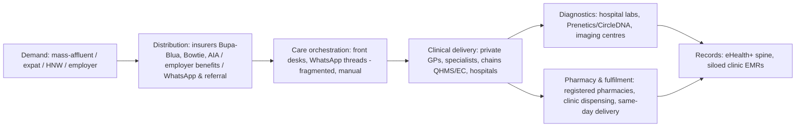
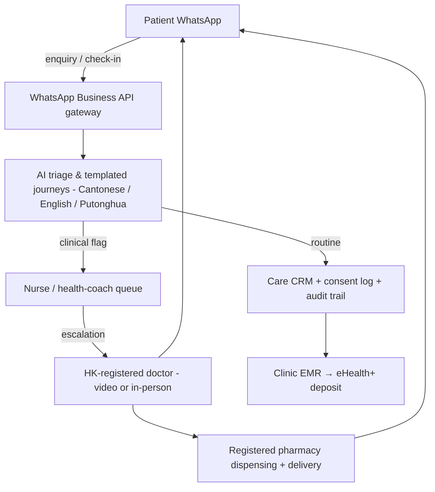

# Hong Kong Digital-Health Market Intelligence — Master Sizing, Regulation & Entry Strategy

**Last updated: July 2026**

> Hong Kong is a 7.5-million-person, high-income city (GDP/capita ~USD 54,000) that is simultaneously the world's longest-lived population, one of its fastest-ageing rich economies (25% aged 65+, median age 49.4), and — counter-intuitively — one of Asia's heaviest: the Population Health Survey 2020-22 found **54.6% of adults overweight or obese under the local (Asian) BMI classification**, with obesity rising sharply since 2014-15. The healthcare system is the most polarised of Welltech's three markets: a near-free but congested public system (Hospital Authority; ~90% of inpatient episodes; stable-case specialist waits measured in years) beside a large, expensive, cash-and-insurance private sector that already delivers ~70% of primary-care consultations at GP fees of HK$180–1,000+. Regulation is the mirror-image of Singapore's: **there is no telemedicine licensing statute at all** — only non-binding Medical Council guidelines (2019) — but a formidable *advertising* wall (Undesirable Medical Advertisements Ordinance) and prescription-only controls under the Pharmacy and Poisons Ordinance. All four major GLP-1 brands are now registered (Wegovy launched November 2025 at ~HK$2,700/month retail; clinic programmes run HK$6,000–11,500/month), sold into a culture with a two-decade commercial slimming industry and heavy mainland-shopper demand. Digital-health market estimates diverge (USD ~0.3–1.4bn depending on scope and year) and are reconciled below. Consumer channels are unambiguous: Hong Kong is a **WhatsApp city** (~75% of the online population; clinics from Adventist Hospital to Gleneagles book patients over WhatsApp), unlike WeChat-first mainland China. This document covers macro context, system structure, regulation, competitive landscape, weight-loss/GLP-1 and longevity verticals, consumer behaviour, WhatsApp workflows, TAM→SAM→SOM, and entry sequencing for Welltech's third market. Where sources conflict, ranges are shown.

**Sibling documents:** [malaysia-market-intelligence.md](malaysia-market-intelligence.md) · [malaysia-regulations.md](malaysia-regulations.md) · [malaysia-telehealth.md](malaysia-telehealth.md) · [malaysia-weight-loss-market.md](malaysia-weight-loss-market.md) · [malaysia-longevity-market.md](malaysia-longevity-market.md) · [malaysia-whatsapp-healthcare.md](malaysia-whatsapp-healthcare.md) · [malaysia-consumer-behaviour.md](malaysia-consumer-behaviour.md) · [malaysia-private-healthcare.md](malaysia-private-healthcare.md) · [singapore-market-intelligence.md](singapore-market-intelligence.md)

---

**Hong Kong at a glance (Welltech lens):**

| Dimension | Headline | Detail section |
|---|---|---|
| Population / wealth | 7.53m (mid-2025); 25% aged 65+; median age 49.4; USD ~54k GDP/capita; #2 globally in UHNWIs (12,546) | §1 |
| Metabolic burden | 54.6% overweight+obese (local BMI cutoffs); obesity 32.6% and rising; diabetes/raised glucose 8.5%; hypertension ~28% | §2 |
| System | Dual-track extreme: HA near-free but years-long stable waits; private = ~70% of primary care; A&E fee doubled to HK$400 (Jan 2026) | §3 |
| Regulation | No telehealth licence needed (vs SG HCSA); MCHK 2019 guidelines only; UMAO advertising wall; Part 1 poisons Rx-only | §4 |
| Digital-health market | Reconciled Welltech-relevant scope USD ~0.3–0.45bn (2024–25); COVID-era players (DrGo, DoctorNow) subscale | §5 |
| GLP-1 economics | All four brands registered; Wegovy ~HK$2,700/mo retail; clinic programmes HK$6,000–11,500/mo; mainland-shopper channel | §6 |
| Longevity | Exec checks HK$2,600–36,880; Prenetics/CircleDNA HQ'd here; Humansa, LifeHub/LifeClinic; deep HNW/family-office pool | §7 |
| Channels | WhatsApp ~75% penetration; hospitals and clinics natively book via WhatsApp; Cantonese/English bilingual market | §8–9 |
| Welltech maths | Combined yr-3 SOM ~HK$70–200m (USD 9–26m) ARR; longevity-concierge + medical GLP-1 beachhead | §10–11 |

---

## 1. Macro & demographic context

### 1.1 Population and structure

Hong Kong's population stood at **7,527,500 at mid-2025**, essentially flat year-on-year, with modest growth to ~7.51 million by end-2025 driven by talent-admission schemes offsetting natural decrease.[^1][^2] The demographic headline is ageing at a pace unmatched among rich economies of this size: persons aged 65+ tripled from 0.60 million (1995) to **1.79 million (2025) — 25.0% of the population** — while the median age rose from 33.8 to **49.4** over the same period; the 65+ share is projected to reach **36% by 2046**.[^3]

| Indicator | Value | Year | Source |
|---|---|---|---|
| Population (mid-year) | 7.5275 million | 2025 | C&SD[^1][^2] |
| Aged 65+ | 1.79 million (25.0%) | 2025 | C&SD via HK Economy[^3] |
| Median age | 49.4 years | 2025 | C&SD via HK Economy[^3] |
| Projected 65+ share | 36.0% | 2046 | C&SD projections[^3] |
| GDP per capita | ~USD 54,100 | 2024 | World Bank[^4] |
| Life expectancy (F / M) | 88.4 / 82.8 years — world's highest | 2024 | CHP; SCMP[^5][^6] |
| Internet penetration | 96.8% (7.16m users) | end-2025 | DataReportal[^7] |

Median age 49.4 makes Hong Kong **six years older than Singapore (43.2) and eighteen years older than Malaysia (31.3)** — structurally the most age-concentrated demand pool of the three markets, with correspondingly higher chronic-disease prevalence per capita and a larger preventive/longevity constituency.

### 1.2 The longevity paradox as a market driver

Hong Kong has the **world's highest life expectancy** (women 88.4, men 82.8 in 2024, both at or near records), attributed to accessible acute care, low smoking among women, and dense walkable urbanism.[^5][^6] The commercial implication: an unusually long *post-retirement horizon* (20–25+ years) colliding with a public system that rations by queue — creating demand for privately purchased healthspan extension (screening, prevention, functional medicine) among those who can pay. The local press explicitly frames longevity as an "opportunity for the city."[^6]

### 1.3 Wealth, HNW concentration and the expat segment

- Hong Kong ranks **second globally in ultra-high-net-worth individuals (12,546 with >US$30m)**; private wealth is projected to reach US$2.3 trillion by 2030.[^8]
- **Single-family offices reached ~3,384 by end-2025** (government-promoted under the "Wealth for Good" agenda), with asset- and wealth-management AUM surpassing HK$35 trillion.[^8][^9]
- The Western/professional expatriate community is estimated at **~300,000–395,000** (sources vary by definition; the larger foreign-resident population including domestic helpers is far bigger); this segment is overwhelmingly IPMI- or group-insured and anchored in Central/Mid-Levels/Island South.[^10]
- Hong Kong is routinely ranked the **second most expensive healthcare market in the world after the US** for private care, which sets a very high price umbrella for any credible new entrant.[^10]

### 1.4 Emigration wave and its demand-side effects

The post-2019 emigration wave removed a meaningful slice of the professional middle class (BN(O) and other routes), while the talent schemes since 2023 have back-filled with mainland-origin professionals — a *replacement* of the customer base rather than a loss *(analyst judgement based on population flow reporting; see §3.6 for the supply-side workforce effect, which is better documented)*.[^1][^11] For Welltech this shifts the language mix of the premium segment toward Mandarin/Putonghua alongside Cantonese and English (§8.4).

### 1.5 Demand segmentation (analyst framework)

| Segment | Size (est.) | Payer profile | Welltech relevance |
|---|---|---|---|
| Mass public-system users | ~4.5–5m adults | HA-dependent; extremely price-anchored (GP visit expectation ≤HK$500) | Low — served by HA and low-cost chains |
| Mass-affluent (private GP users, group-insured) | ~1.2–1.8m adults *(analyst estimate from private primary-care share ~70% and insurance coverage)* | Group medical + VHIS + cash; used to paying HK$400–800/GP visit | **Core** — weight loss, screening conversion, telehealth |
| Professional expatriates | ~300–400k[^10] | IPMI/employer; cash-tolerant | **Core** — concierge, longevity, GLP-1 |
| HNW / family-office principals | 12.5k UHNW; ~3,400 family offices[^8][^9] | Cash-indifferent; discretion-seeking | Concierge/longevity apex |
| Mainland visitors/shoppers | millions of trips/yr | Cash; episodic (drugs, vaccines, checks) | Opportunistic — GLP-1 & screening retail (§6.6) |

**Implications for Welltech:** Hong Kong combines Singapore's ARPU (or higher) with a *bigger* metabolically unhealthy population and an older age structure. The premium-addressable pool (mass-affluent + expat + HNW) is roughly 1.5–2m adults — about 2–3× Singapore's — but sits behind entrenched private-care relationships and the region's most saturated premium-clinic real estate. The wedge is *programmatic, outcome-managed care* (weight, metabolic, longevity), which incumbents sell as episodic services.

---

## 2. Disease burden — the heaviest of the three rich-market populations

### 2.1 Obesity and overweight

The Department of Health's **Population Health Survey (PHS) 2020-22** — the territory's flagship examination survey — found that among persons aged 15–84:

- **32.6% were obese** (BMI ≥25.0 under the Hong Kong/Asian classification used by CHP; males 39.4%, females 26.4%);
- a further **22.0% were overweight** (BMI 23.0–24.9);
- i.e. **~54.6% overweight or obese combined** (age-standardised 51.3% for ages 18–84);
- obesity rose significantly from 29.9% in 2014-15.[^12][^13][^14]

| Metric (PHS 2020-22, ages 15–84) | Value | Source |
|---|---|---|
| Obese (BMI ≥25, local classification) | **32.6%** (M 39.4% / F 26.4%) | CHP PHS[^12][^13] |
| Overweight (BMI 23–24.9) | 22.0% | CHP PHS[^12] |
| Overweight + obese | **54.6%** | CHP PHS[^12][^14] |
| Peak bands | M 45–54: 74.6% ow/ob; F 65–84: 57.0% | CHP PHS[^12] |
| Trend vs 2014-15 | Obesity ↑ from 29.9% | CHP/HKASO[^12][^14] |

Two framing cautions when comparing across markets: (i) Hong Kong reports on the **Asian cutoffs** (obese ≥25), so the 32.6% "obesity" figure is not comparable to Singapore's 12.7% (BMI ≥30) or Malaysia's WHO-cutoff figures — on a like-for-like Asian-cutoff basis all three markets show an overweight+obesity majority or near-majority of adults; (ii) the government's July 2025 Legislative Council reply on obesity confirms the issue is now on the political agenda, with members pressing for population-level measures.[^15] Under the WHO standard cutoff (BMI ≥30), older multi-country studies put Hong Kong's obesity nearer ~3% — the gap illustrates how decisive the classification choice is and why Welltech materials must state cutoffs explicitly.[^16]

### 2.2 Diabetes, hypertension and the NCD stack

- **Diabetes or raised blood glucose: 8.5%** of persons 15–84 (5.4% self-reported doctor-diagnosed + 3.1% newly detected biochemically; males 11.1% vs females 6.1%) — PHS 2020-22.[^17]
- **Hypertension ~27.7%** of persons ≥15 — the commonest chronic condition; a large share undiagnosed until screening.[^18]
- CHP maintains diabetes as a priority NCD with dedicated surveillance; the undiagnosed fraction (3.1 points of the 8.5%) is Welltech's screening-to-programme conversion pool.[^17]

### 2.3 The wider NCD stack and screening behaviour

Beyond the metabolic core, the PHS 2020-22 examination component documents the standard aged-rich-economy NCD profile — hypercholesterolaemia widespread, hypertension the most prevalent chronic condition, and substantial undiagnosed fractions revealed only on testing.[^12][^18] Three behavioural features matter commercially:

- **Screening is a consumer habit, not just a clinical event:** the private health-check market (§7.1) is large, corporate-subsidised and price-published — Hongkongers *buy* diagnostics voluntarily at a rate few markets match, then frequently fail to act on results because no one owns follow-through *(analyst observation; conversion data is the single most valuable primary research Welltech could commission pre-launch)*.[^117]
- **Undiagnosed pool:** the 3.1-percentage-point newly detected glucose abnormality (vs 5.4% known diabetes) implies roughly **one hidden case for every two known** — each private screening event is a programme-enrolment opportunity.[^17]
- **Ageing multiplies everything:** with 25% already 65+ and median age 49.4 (§1.1), each cohort entering the 45–64 screening-intensive years is larger and richer than the last for the next decade.[^3]

### 2.4 Why burden converts to private demand here

Unlike Malaysia (where OOP catastrophe drives avoidance) or Singapore (where state programmes absorb chronic care), Hong Kong's metabolic patients face a binary: **join an HA queue measured in months-to-years for stable conditions, or pay private rates immediately**. With ~70% of primary care already private and specialist stable-case waits notorious (§3.2), medically supervised weight/metabolic programmes are competing against *queues*, not against subsidised alternatives.[^19][^20]

**Implications for Welltech:** Hong Kong offers the largest treatable metabolic population per capita of the three markets *at premium prices*. Positioning must lead with clinical seriousness (endocrinology-adjacent, labs-anchored) because the local slimming industry (§6.5) has spent 20 years training consumers to distrust cosmetic weight-loss marketing — and because UMAO (§4.5) legally constrains claim-making anyway.

---

## 3. Healthcare system structure

### 3.1 The dual-track extreme

Hong Kong runs the sharpest public/private split in developed Asia:

| Layer | Scale | Share of activity | Funding |
|---|---|---|---|
| **Public — Hospital Authority (HA)** | 43 public hospitals, ~30,636 beds (end-2023); 73 general out-patient clinics; 49 specialist out-patient clinics | ~**90% of inpatient episodes**; ~30% of outpatient | Tax-funded; token user fees |
| **Private hospitals** | 13 hospitals, ~5,294 beds — incl. HK Sanatorium & Hospital, Gleneagles HK, Matilda International, HK Adventist (Stubbs Rd & Tsuen Wan), CUHK Medical Centre, Union, St. Teresa's, Baptist, Precious Blood | ~10% of inpatient | Insurance + cash |
| **Private ambulatory** | Thousands of solo GPs/specialists + chains (Quality HealthCare, EC Healthcare/UMH, Human Health, Town Health) | ~**70% of primary-care consultations** | Cash + group medical + VHIS |

Sources: US ITA Country Commercial Guide; C&SD medical-institution tables; doctor-shopping literature for the 70% private primary-care share.[^19][^21][^22]

#### Private hospitals relevant to Welltech partnerships

| Hospital | Position | Welltech relevance |
|---|---|---|
| **HK Sanatorium & Hospital (HKSH)** | The prestige incumbent (Happy Valley); dedicated Department of Health Assessment; own telemedicine service | Top-tier screening partner / referral destination; GLP-1 programmes at HK$7,000–9,200/mo band[^34][^106][^119] |
| **Gleneagles HK** (IHH/ NWS JV, Wong Chuk Hang) | Modern full-service; runs GP virtual consultations; WhatsApp bookings; telemedicine JVs with HKT/AIA/FWD | Most digitally open hospital partner; hybrid chronic-care programme precedent (hypertension with HKT+FWD)[^89][^90][^101][^133] |
| **Matilda International** (The Peak) | Boutique expat-heritage hospital; health-check flagship | Premium screening wedge for the expat/HNW segment[^117][^118] |
| **HK Adventist — Stubbs Rd** | Mid-premium; Health Assessment Clinic; WhatsApp appointment line | Screening + referral partner[^132] |
| **CUHK Medical Centre** | Newest (2021), university-owned, package-pricing pioneer | Price-transparent partner for procedures; bariatric/metabolic academic links via CUHK Surgery[^110] |
| **Union Hospital** (Sha Tin) | Kowloon/NT volume player; WhatsApp enquiry across polyclinics | Mass-affluent catchment beyond HK Island[^134] |

*(Positioning descriptors are analyst characterisations; scale data per §3.1 sources.)*

### 3.2 Public-sector congestion — the queue as competitor

- HA triages specialist out-patient (SOPC) referrals into Urgent (target median ≤2 weeks), Semi-urgent (≤8 weeks) and **Stable — no target**; stable-case waits are the pressure point.[^20]
- Psychiatry illustrates the tail: 2021-22 stable new-case median waits of **14–63 weeks by cluster, with the longest (90th percentile) exceeding 90 weeks** (~2 years); internal-medicine stable waits in some clusters have historically exceeded two years.[^23][^24]
- The government is now investing in a digital referral/triage platform targeted at cutting SOPC waits by ~25%.[^25]
- **Fee reform, January 2026:** A&E charges for non-critical (triage III–V) patients **more than doubled from HK$180 to HK$400** (critical cases exempt), the first big rebalancing in decades; A&E attendances promptly fell.[^26][^27][^28] Public inpatient care remains ~HK$120–300/day for eligible persons.[^29]

The reform is strategically important: the government is *deliberately pushing marginal demand toward the private sector*, widening the funnel for affordable private digital-first primary care *(analyst inference from the fee reform's stated intent to curb misuse)*.[^26][^27]

### 3.3 Private fee levels — the price umbrella

| Service | Typical fee (HKD) | Source |
|---|---|---|
| Private GP consultation (incl. basic meds) | 180–1,000+; ~500 median in core districts | Healthy Matters; Expatistan[^30][^31] |
| Private specialist first consultation | 1,090–2,580 (follow-up 950–2,350) | specialists.hk[^32] |
| Premium/expat GP (Central practices) | 800–1,800+ | Gleneagles clinic fee schedule; market observation[^33] |
| Private hospital day surgery / packages | tens of thousands; ward from ~HK$1,000+/night | Gleneagles/HKSH price lists[^33][^34] |

### 3.4 Health expenditure — Domestic Health Accounts

- Current health expenditure (CHE) reached **HK$251.2 billion in 2023/24 = 8.3% of GDP** (per-capita HK$33,334), up from ~5.5% of GDP two decades earlier — a ~50% rise in GDP share.[^35][^36][^37]
- Split: **public 51.8% / private 48.2%** — by far the highest private share of Welltech's three markets and one of the highest private shares among aged rich economies.[^35]
- Primary-care spending hit 29.3% of CHE, a decade high, aligned with the government's Primary Healthcare Blueprint pivot.[^35]

### 3.5 Insurance: VHIS, group medical, and runaway medical inflation

- **VHIS (Voluntary Health Insurance Scheme, launched April 2019):** tax-deductible, government-certified individual indemnity plans; **~1,341,000 policies in force at March 2024** (from ~1m in Sept 2022); 97% are Flexi plans; 53% of insured are under 40.[^38][^39]
- Group medical: employer plans dominate white-collar Hong Kong; employee premiums **rose ~55% between 2021 and 2024**.[^40]
- **Medical inflation ~9.8% (2025)** with insurer/broker projections of double-digit trend persisting into 2026+ across APAC; average individual medical premium projected ~HK$11,078 by 2026.[^40][^41][^42]
- GLP-1 weight-management coverage is patchy and increasingly carved out of private plans (§6.3).[^43]

### 3.6 Workforce: the emigration shock

- HA attrition peaked around FY2022/23 at **7.1% of doctors and 10.9% of nurses**; **1,032 doctors resigned from public hospitals over three years**; in one 12-month period 2,925 nurses left against 2,467 hired.[^44][^45]
- Responses: Medical Registration (Amendment) Ordinance 2021 admitting non-locally trained doctors (slow uptake initially — ~10 in year one; ~100 expected by 2023), GBA doctor-exchange schemes, retirement-age extension to 65.[^46][^47][^48]
- Private-sector implication: scarce clinicians command high private fees and have little incentive to join startups at salary; **clinician supply is the binding constraint for any HK clinical operation** *(analyst judgement)* — favouring high-leverage models (asynchronous review, AI-assisted triage, nurse/health-coach delivery under medical supervision).

### 3.7 Public digital infrastructure: eHealth / eHRSS

- The **Electronic Health Record Sharing System (eHRSS / "eHealth")**, launched March 2016, is a free, voluntary, territory-wide record-sharing spine; **~6 million registrants by mid-2024**, though ~70% had not yet given any private provider "sharing consent."[^49][^50]
- The **Electronic Health Record Sharing System (Amendment) Ordinance 2025** (effective 1 December 2025) converts eHealth into "eHealth+": providers can *deposit* records into patients' accounts, the Secretary for Health can mandate deposits of specified data, and cross-boundary (GBA) record recognition is enabled.[^51]
- Private clinics can and do enrol as eHealth providers — a credibility and interoperability asset for a new entrant (contrast Malaysia, where no equivalent spine exists).

**Implications for Welltech:** The system structure is Welltech-favourable in three ways: (1) the queue-vs-price binary generates continuous private demand without any subsidy competition in the middle market; (2) the January 2026 fee reform officially redirects demand privately; (3) eHealth+ gives a compliant startup the same record rails as incumbents. The constraint is clinician supply and private fee expectations — the delivery model must be clinician-light per patient.

---

## 4. Regulatory environment

### 4.1 Telemedicine: guidelines, not licences

Hong Kong has **no telemedicine-specific legislation and no licensing regime for telehealth services** — the sharpest possible contrast with Singapore's HCSA (licensable outpatient/telemedicine services, MOH inspections) and Malaysia's (dormant) Telemedicine Act.[^52][^53]

The operative instrument is the **Medical Council of Hong Kong (MCHK) *Ethical Guidelines on Practice of Telemedicine* (December 2019)**, supplemented by Q&As (March 2022, with the Academy of Medicine):[^54][^55]

- Not legally binding, but breach exposes doctors to **disciplinary proceedings** (professional misconduct).
- Core requirements: reliable mutual identification of doctor and patient; the same standard of care as face-to-face; telemedicine delivered "as part of a structured and well-organised system"; doctor responsibility for equipment fitness and training; judgement on when face-to-face is required.[^54]
- The Legislative Council has repeatedly reviewed telemedicine development (2021 research brief; LCQ replies 2022, 2023, September 2025) without committing to a statutory regime — the government's posture is enabling-but-hands-off, leaning on eHealth+ and HA's own telehealth rather than regulating private supply.[^56][^57][^58][^59]
- Where a physical clinic exists, the **Private Healthcare Facilities Ordinance (Cap 633)** applies to the premises, and the Code of Practice for Clinics (§3.10) sets telemedicine requirements for *licensed clinics*; a purely virtual service arguably sits outside PHFO's premises-based scope — a genuine grey zone counsel should confirm before launch.[^53][^60]

**Practical reading:** market entry friction is *low* (no licence, no capitation of virtual services), but the safety net is the individual doctor's registration — meaning governance must be engineered privately (protocols, audit, supervision) to protect the medical licences on which the whole operation rests. Singapore's MaNaDr enforcement saga has no HK statutory equivalent, but MCHK discipline plus press scrutiny (§6.4) perform the same function informally.

### 4.2 Medicines: Pharmacy and Poisons Ordinance (Cap 138)

- Prescription medicines are **Part 1 poisons** in the Poisons List; GLP-1s (semaglutide, tirzepatide, liraglutide) are prescription-only and must be dispensed by a registered pharmacist against a doctor's prescription; illegal supply carries **up to HK$100,000 fine and 2 years' imprisonment**.[^61][^62]
- Enforcement is real but leaky at retail: the SCMP documented over-the-counter sellers and online platforms supplying weight-loss injections without prescription, and police/DoH have made arrests for illegal sale of slimming injections.[^62][^63]
- **Export** of medicines to the mainland requires a licence; pharmacies mailing drugs across the border have been flagged as potentially sidestepping the law — relevant to the mainland-shopper GLP-1 trade (§6.6).[^64]
- Regulatory modernisation: Hong Kong is establishing the **Centre for Medical Products Regulation (CMPR)** by end-2026, consolidating drugs/TCM/device oversight and moving toward primary-evaluation ("1+" mechanism) authority — a medium-term shift toward a more FDA-like posture.[^65]

### 4.3 GLP-1 registration status (as of July 2026)

| Drug | HK status | Indication route | Street/clinic price (HKD) |
|---|---|---|---|
| **Saxenda** (liraglutide) | Registered | Chronic weight management | ~2,000–3,500/mo *(clinic-quoted ranges)* |
| **Ozempic** (semaglutide 1mg) | Registered | T2D (weight use = off-label, common) | ~1,500–3,000/mo depending on dose/channel |
| **Wegovy** (semaglutide 2.4mg) | Registered; **launched November 2025**; first weekly weight-loss drug approved for adolescents 12+ in HK | Weight management | ~**2,700/mo** retail benchmark; more in programmes |
| **Mounjaro** (tirzepatide KwikPen) | Approved late 2024 — first dual GIP/GLP-1 for obesity + T2D | Obesity and T2D | HKU pharmacy retail per-pen pricing; clinic programmes 6,000–11,500/mo (§6.2) |

Sources: SCMP explainer (all four brands approved); Novo Nordisk launch release; Wa Man pharmacy listing (HK$2,700/mo); SCMP/biopharma coverage of Mounjaro approval; Drug Office product registry.[^62][^66][^67][^68][^69] Prices are advertised or reported figures gathered June–July 2026 and move frequently — re-verify before any pricing decision.

### 4.4 Advertising: the UMAO wall

The **Undesirable Medical Advertisements Ordinance (Cap 231, enacted 1953, amended 2005)** is the single most binding go-to-market constraint:

- Prohibits/restricts advertising to the public of treatments for scheduled diseases and conditions, and — via the 2005 amendment's Schedule 4 — restricts six groups of health claims for **orally consumed products, explicitly including weight-loss/fat-reduction claims**.[^70][^71][^72]
- Practical effect: **direct-to-consumer advertising of prescription medicines (including GLP-1 brand names) to the public is prohibited**, and weight-loss claim language is tightly boxed. Incumbent med-spas advertise "body contouring"/"weight management programmes" without naming drugs; clinics rely on editorial/explainer content, doctor reputation, and word-of-mouth.[^70][^62]
- Compare Singapore (HSA/MOH actively enforcing against GLP-1 ads) — same functional outcome by different legal route. Malaysia's MAB approval regime is the third variant. Welltech's compliant-content playbook from SG largely transfers.

### 4.5 Privacy: PDPO

- The **Personal Data (Privacy) Ordinance (Cap 486)** governs patient data; health data is not a separate statutory category but is treated as sensitive in PCPD guidance.
- **Section 33 (cross-border transfer restriction) has never been brought into force** — so there is currently *no legal prohibition* on offshoring HK patient data, though PCPD "expects" adherence to its guidance and publishes Recommended Model Contractual Clauses; best practice is to behave as if s.33 applied.[^73][^74]
- No mandatory breach notification (as of drafting) — HK is lighter-touch than Singapore's PDPA and far lighter than mainland PIPL. For a WhatsApp-first operator this is the most permissive of the three markets, but reputational and MCHK-confidentiality duties still bind.

### 4.6 Cross-border: the Greater Bay Area dimension

- **Elderly Health Care Voucher GBA Pilot:** HK's HK$2,000/yr elderly vouchers are now usable at **21 service points across all nine mainland GBA cities** (expanded May 2025), covering ~1.78m eligible elders — the state is actively normalising cross-border care consumption.[^75][^76]
- eHealth+ enables recognised cross-boundary record flows (§3.7).[^51]
- Southbound: mainland visitors buy in HK what is scarce, unregistered or distrusted at home — HPV vaccines, health checks, second opinions, and now GLP-1s; HK pharmacies mailing medicines north operate in a legal grey zone.[^64][^77]
- Northbound: HK insurers (e.g. Bupa's 6,500-point mainland network) and providers (Humansa, UMH) are building GBA networks for HK customers seeking cheaper care.[^78][^79]

### 4.7 Chinese medicine context

TCM is fully institutionalised: registered CM practitioners under the Chinese Medicine Ordinance (Cap 549) with a statutory Council, and the territory's **first Chinese Medicine Hospital opened in Tseung Kwan O in December 2025** (consultations from HK$180).[^80][^81] DrGo already offers CM video consultations.[^82] TCM is a substitute and adjacency (slimming teas, weight acupuncture), not a regulatory obstacle, but it shapes consumer mental models of "detox/slimming" (§6.5, §8.3).

**Implications for Welltech:** Hong Kong is the **lowest-friction market to enter and the easiest to get quietly hurt in**. No licence gate means speed; UMAO means the growth engine cannot be paid product advertising and must be built on clinician credibility, referral, employer channels and compliant education content; PPO enforcement and MCHK discipline mean prescription pathways must be airtight even though no telehealth statute says so. Budget legal review for: PHFO applicability to a virtual-first model, UMAO vetting of all creative, and export-control posture on any mainland-facing fulfilment.

---

## 5. Digital-health & telehealth market

### 5.1 Market size — reconciling the estimates

| Source | Scope | Estimate | CAGR |
|---|---|---|---|
| Statista Digital Health Outlook | Digital health (broad: apps, e-pharmacy, digital fitness…) | ~US$300m+ (2024) → **US$428m by 2029** | 7.1% |
| Statista Digital Treatment & Care | Narrower treatment/care segment | → US$72m by 2029 | 6.3% |
| Insights10 | HK digital health | US$0.34bn (2022) → US$1.42bn (2030) | 19.6% |
| Insights10 | HK telemedicine | Report exists; figures paywalled — not usable | n/a |

Sources.[^83][^84][^85] **Reconciliation:** the honest Welltech-relevant range for consumer digital health/telehealth in Hong Kong 2024–25 is **US$0.3–0.45bn**, with the true *paid teleconsultation* slice likely well under US$100m *(analyst estimate: HA delivered only ~13,000 telehealth consults cumulatively by May 2022, and no private platform has disclosed volumes suggesting scale)*.[^86] Hong Kong's digital-health market is small relative to its wealth because the private in-person alternative is dense, fast and habitual — the market failure telehealth solves elsewhere (access) barely exists for the paying class; the openings are *convenience, discretion, programme adherence and chronic management*, not access.

### 5.2 Player landscape

| Player | Backer / model | Status & notes |
|---|---|---|
| **DrGo** (eSmartHealth) | HKT/PCCW telco platform, launched July–Aug 2020 | The COVID-era flagship: partners incl. Gleneagles, Precious Blood, QHMS, UMH; specialist add-ons (psychiatry with QHC 2021, CM video consults, AF tele-screening with Roche); insurer tie-ins (AIA "first hospital-supported telemedicine in insurance" 2020; FWD CSR programme; hybrid hypertension programme with FWD + Gleneagles)[^82][^87][^88][^89][^90] |
| **Quality HealthCare (QHMS)** | Bupa-owned network: 1,400+ service points, >100 centres | Publicly "bet on telemedicine" in 2020; video GP + CM consults embedded in Bupa's Blua Health app with same-day med delivery; the de-facto insurer-rail incumbent[^91][^92][^93] |
| **Bowtie** | HK's first virtual insurer (licensed Dec 2018); Sun Life-backed; US$70m Series C (2025); >US$150m raised cumulatively | Bowtie & JP Health physical/virtual clinic JV; free telehealth benefits with plans; the closest local analogue to an integrated payer-provider disruptor[^94][^95][^96] |
| **ZA Health** | ZA Bank / ZA Group (digital-bank ecosystem) | "ZA Health Pass" bundling year-round healthcare access into the banking app; distribution-led healthcare push[^97] |
| **Heals Healthcare** | Health-tech firm; "Dr. HK" app with China Mobile HK | Tele + offline hybrid, 60+ doctors onboarded; subscale[^98] |
| **DoctorNow** | Founded 2016; 5G telemedicine + home visits | >20,000 consultations lifetime — illustrative of ceiling for standalone HK telehealth[^99] |
| **Zoey** | Women's online clinic (HK/SG/JP), discreet D2C | Remote GLP-1 prescribing (Mounjaro/Wegovy) for women, HK$200 first consult, 4-hour delivery, unbranded packaging — **the closest model to Welltech's playbook already operating in HK**[^100] |
| **Gleneagles HK / HKSH / private hospitals** | Hospital virtual clinics | GP virtual consultations as service-line extensions[^101] |
| **HA "HA Go" telehealth** | Public | Follow-up-only telehealth for stable HA patients; ~13k consults by May 2022 — not a competitor for private demand[^86][^102] |
| **OT&P / Central Health** | Premium expat group practices | Video consults + WhatsApp workflows; GLP-1 programmes (§6.2)[^103] |

### 5.3 COVID acceleration and the post-COVID retrenchment

Telehealth in HK was effectively *created* by COVID (2020: DrGo launch, QHC pivot, insurer free-teleconsult benefits, HA pilots) and then **plateaued**: no HK telehealth pure-play has announced major funding since; DoctorNow's lifetime volumes remain modest; DrGo persists as an HKT ecosystem service rather than a growth company *(analyst assessment; no public wind-downs announced, but equally no disclosed growth metrics)*.[^87][^91][^99] Capital has instead flowed to **insurtech (Bowtie), biotech/diagnostics (Prenetics, Insilico) and government-anchored life-science investment** — HealthTech startups number ~355 with 57 funded, and the 2024-25 Budget earmarked HK$10bn for life & health technology.[^104][^105]

### 5.4 Funding history — where the capital actually went

| Year | Event | Amount / significance |
|---|---|---|
| 2018 | Bowtie licensed as HK's first virtual insurer; Sun Life-anchored Series A | HK$234m (US$30m)[^94][^95] |
| 2020 | COVID telehealth wave: DrGo launch (HKT), QHC telemedicine pivot, insurer free-teleconsult benefits, HA pilots | Corporate-funded, not VC[^87][^91] |
| 2021–22 | Prenetics SPAC listing on NASDAQ (first HK unicorn to list via SPAC); Bowtie Series B/B2 (~US$35m; Mitsui joins) | Diagnostics + insurtech, not telehealth[^95][^120] |
| 2023 | Insighta JV formed (Prenetics × Prof. Dennis Lo) | US$200m valuation JV[^120] |
| 2024–25 | Government allocates HK$10bn to life & health technology; 45 life/health-tech firms land with ~HK$6.5bn investment; Bowtie Series C | US$70m Series C; state-led biotech push[^95][^104][^105] |
| 2024–25 | IM8 (Prenetics × Beckham) scales to ~US$120m ARR run-rate | Consumer longevity validated from HK[^121] |

**Pattern:** venture and state capital in HK healthcare flows to *diagnostics, biotech, insurtech and consumer-health brands* — never to standalone teleconsultation, which has no visible funded champion. The service layer Welltech occupies (managed condition programmes) is between the funded categories, i.e. contested by adjacency (insurers, chains) but not by a funded direct competitor *(analyst assessment)*.

### 5.5 Value chain — who owns which layer



The unowned layer is **C — care orchestration**: nobody runs programme-grade, auditable, longitudinal patient management across the journey. Insurers own B, chains own D, government owns G. Welltech's entry claims C and rents B, D, E, F *(analyst framework)*.

**Implications for Welltech:** there is no dominant consumer telehealth brand to displace — the incumbent is *the WhatsApp thread with a known private clinic*. Do not enter as "telehealth"; enter as a **condition-programme operator (weight/metabolic/longevity) whose delivery happens to be virtual-first**, riding insurer and employer rails where possible (Bupa/Blua and Bowtie have locked their own rails; AXA/Manulife/Cigna group books are the open flank *(analyst judgement)*).

---

## 6. Weight-loss & GLP-1 market

### 6.1 Demand foundations

- Treatable pool: with 54.6% of adults overweight/obese on local cutoffs (§2.1) and obesity clustering in prime working ages (men 45–54: 74.6% overweight/obese), the clinically addressable population runs to **~2.5–3m adults**, of whom the privately paying segment (§1.5) is ~0.8–1.2m *(analyst estimate)*.[^12]
- Cultural demand is old: Hong Kong invented the listed slimming company (§6.5); appearance-driven weight spend predates GLP-1s by two decades.
- GLP-1 awareness is media-saturated: SCMP runs recurring explainers; the arrival of Wegovy (Nov 2025) and Mounjaro (late 2024) made "slimming injections" mainstream news, including enforcement stories about illegal sellers.[^62][^63][^66][^67]

### 6.2 GLP-1 pricing across channels (advertised/reported, HKD, mid-2026)

| Channel | Offer | Price (HKD) |
|---|---|---|
| Retail pharmacy (e.g. Wa Man listing) | Wegovy, per month | ~2,700[^68] |
| HKU Med Community Pharmacy | Mounjaro 2.5mg KwikPen retail | per-pen listing (entry dose)[^69] |
| Premium group practices (OT&P, Central Health) | Semaglutide programmes / tirzepatide programmes incl. consults | 6,200–8,000 / 8,500–11,500 per month-equivalent[^103][^106] |
| Quality HealthCare | GLP-1 weight programme | ~6,000–7,800[^106] |
| HK Sanatorium & Hospital | Specialist-led programme | ~7,000–9,200[^106] |
| Med-spa / aesthetic chains (Trinity Medical, LM Skin, Pulse Clinic) | "Wegovy/Mounjaro weight management" packages | undisclosed-to-quoted; consult fees 500–1,500 + drug margin[^107][^108] |
| Zoey (online, women) | Remote Rx + delivery | first consult 200; drug at market rates; free follow-ups[^100] |
| Human Health (clinic chain) | Patient-education-led GLP-1 comparison funnel | chain-clinic pricing[^109] |

*(All figures are advertised or third-party-compiled ranges (notably the Panya buyer's guide) seen June–July 2026; treat as directional and re-verify. The consistent pattern: ~HK$2,000–3,000/month drug cost with clinics layering 2–4× markup via programme fees.)*[^106]

### 6.3 Who prescribes, who pays

- **Prescribers:** private endocrinologists (HKSH, Gleneagles, CUHKMC clinics), GPs at group practices, and — the largest volume channel by clinic count — **aesthetic-medical chains** (EC Healthcare brands, Trinity, LM Skin et al.) where doctors staff med-spas. Off-label Ozempic via T2D prescribing remains the budget path.[^62][^106][^107]
- **Payers:** almost entirely out-of-pocket; insurers increasingly carve GLP-1 weight use out of group and individual plans.[^43][^106]
- **Bariatric surgery** remains niche: CUHK pioneered it (510 referrals, 220+ operations since 2001, zero mortality); the HK Society for Metabolic and Bariatric Surgery issued 2024 eligibility criteria (position statement) partly to channel the GLP-1 boom appropriately.[^110][^111]

### 6.4 Enforcement and safety backdrop

Regulator and press attention focuses on **illegal supply**, not on medical prescribing: OTC sellers, online platforms and a 2026 arrest for illegal slimming-injection sales; tirzepatide's Part 1 poison status is repeatedly emphasised in official replies and press.[^62][^63] There has been **no HK equivalent of Singapore's MaNaDr-style suspension of a telehealth prescriber** — but MCHK's "same standard as face-to-face" doctrine means a pill-mill model would expose every prescribing doctor personally.[^54]

### 6.5 The slimming-industry inheritance

Hong Kong's commercial weight-loss culture was industrialised early: **Sau San Tong** (founded 2000, herbal slimming → full-body slimming, GEM-listed November 2003 as the first listed slimming & beauty company, celebrity-spokesperson marketing machine) set the template of contract-based beauty-parlour weight loss later replicated across chains and into the mainland.[^112][^113] The sector's legacy is double-edged: enormous latent demand and normalised spending on weight services, but consumer scar tissue from hard-sell prepaid packages and dubious claims — plus the 2005 UMAO amendment which was in part a response to slimming-product advertising.[^70][^71] EC Healthcare (HKEX 2138; FY2025 revenue HK$4.14bn, the largest non-hospital medical services provider, spanning medical, aesthetic-medical and wellness brands) is the consolidated modern descendant of that industry — and the natural incumbent competitor for a medicalised GLP-1 programme.[^114][^115]

### 6.6 The mainland-shopper phenomenon

Semaglutide demand in mainland China outstrips supply and is entangled with a "wafer-thin" beauty economy; HK pharmacies function as a **grey-channel supply node** — mainland visitors buy in person, and some pharmacies mail products north despite export-licensing requirements.[^64][^77][^116] Wegovy's mainland pricing is set cheaper than the US, but supply constraints, brand trust and the visit-HK habit sustain the flow *(analyst synthesis)*.[^116] For a compliant operator this is a monetisable adjacency (screening + legitimate in-person prescribing for visitors) and a compliance minefield (no cross-border dispensing/mailing without licences).

### 6.7 Consumer weight-loss culture — how HK buyers differ

- **Aesthetic-first framing:** two decades of slimming-centre marketing (§6.5) plus mainland "wafer-thin" beauty norms mean much demand presents as cosmetic even when clinically indicated; intake flows must translate aesthetic motivation into medical framing without losing the customer *(analyst judgement grounded in the slimming-industry literature and SCMP coverage)*.[^62][^112][^116]
- **Prepaid-package scepticism:** hard-sell prepaid beauty contracts generated years of consumer complaints; transparent monthly pricing and cancel-anytime terms are a positioning weapon against med-spa incumbents *(inference from industry history)*.[^112]
- **Self-sourcing sophistication:** buyers compare pharmacy retail (~HK$2,700 Wegovy) against clinic programmes (HK$6,000–11,500) and against Bangkok medical-travel pricing — the "Bangkok hop" is documented in local buyer's guides; a mid-priced governed programme must justify its premium over self-sourcing with titration safety, side-effect management and outcomes.[^68][^106]
- **Gender split:** women dominate commercial slimming demand, while the highest overweight/obesity prevalence is in men 45–54 (74.6%) — an under-marketed segment reachable through executive-health and employer channels rather than beauty media.[^12]

### 6.8 GLP-1 patient journey (Welltech target-state)

```mermaid
journey
    title HK GLP-1 programme journey (WhatsApp-first)
    section Acquire
      Education content / employer webinar / GP referral: 4: Prospect
      WhatsApp enquiry + eligibility screener: 5: Prospect
    section Onboard
      Video or in-person consult with HK-registered doctor: 5: Patient
      Baseline labs + body composition (partner lab): 4: Patient
    section Treat
      Rx dispensed by registered pharmacy, delivered: 5: Patient
      Weekly WhatsApp titration check-ins + side-effect triage: 5: Patient
    section Retain
      Monthly outcomes review; quarterly labs: 4: Patient
      Graduation to maintenance / longevity membership: 5: Member
```

Every step above is legal today under MCHK guidelines + Pharmacy and Poisons Ordinance provided the doctor judges telemedicine appropriate and dispensing is pharmacist-controlled (§4.1–4.3).[^54][^61]

**Implications for Welltech:** the GLP-1 opportunity in HK is **category-conversion, not category-creation**: pull spenders out of med-spa packages and pharmacy self-sourcing into a medically governed, outcome-tracked programme priced *below* the HK$6,000–11,500 clinic band (e.g. HK$3,500–5,000/mo all-in), using the ~HK$2,700 Wegovy retail benchmark as the anchor that exposes incumbent markups. UMAO forces the acquisition engine to be education content, employer channels, and referral — which favours Welltech's WhatsApp-first retention model over incumbents' foot-traffic model.

---

## 7. Longevity, screening & concierge market

### 7.1 Executive health checks — the established wedge product

| Provider | Package | Price (HKD) |
|---|---|---|
| Matilda International (Peak) | Health-check packages; Diamond premium | 12,400–36,880; Diamond ~33,360 |
| Matilda Medical Centre (Central) | Basic / Wellwoman Lite | 2,600 / 3,200 |
| HK Sanatorium & Hospital | Health-assessment schemes (dept. of health assessment) | package menu; comparable premium band |
| HK Adventist (Stubbs Rd) | Health Assessment Clinic | mid-premium band |
| Quality HealthCare / chains | Corporate + retail screening | entry ~1,500–5,000 |

Sources: Alea 2026 cost guide; Matilda; HKSH package pages.[^117][^118][^119] Screening is a mature, price-transparent product with strong corporate purchase — the conversion problem (abnormal result → no programme) mirrors Singapore's.

### 7.2 Longevity players

- **Prenetics (NASDAQ: PRE)** — HK-headquartered health-sciences group: CircleDNA consumer genomics, **Insighta** (US$200m multi-cancer-early-detection JV with Prof. Dennis Lo), and **IM8** (David Beckham longevity-supplement brand tracking US$120m ARR by Dec 2025). Hong Kong's only global-scale consumer-health company — proof HNW-adjacent longevity demand can be built from HK.[^120][^121]
- **Humansa** (New World Group, founded 2020): ~40 health & wellness centres across HK + GBA; 14,000 sq ft Victoria Dockside flagship; "Future Health Program" explicitly sells biological-age reversal across five pillars. Note: parent New World's well-publicised debt stress makes Humansa's investment trajectory uncertain *(analyst flag — monitor divestment risk)*.[^122][^123][^124]
- **LifeHub + LifeClinic** (Central): the established functional-medicine/anti-ageing pair — IV-drip menus (NAD+ variants: Executive Plus, Anti-Fatigue, Jet Lag…), Swiss biological medicine, plus a Deep Longevity (Regent Pacific) biological-age partnership.[^125][^126][^127]
- **ReGen, OT&P "Longevity Clinic by OT&P" and other boutiques**: local lifestyle press now curates "five longevity clinics in Hong Kong" lists — the category exists in consumer media, still fragmented at boutique scale.[^128]
- **IV/NAD+ scene**: proliferating through med-spas and dedicated lounges; largely unregulated as a wellness service if physician-supervised.

### 7.2a Competitive read on the longevity field *(analyst assessment)*

| Player | Strength | Structural weakness Welltech exploits |
|---|---|---|
| Humansa | Capital-intensive flagship real estate; GBA network; "Future Health" longevity programme[^122][^124] | Parent (New World) balance-sheet distress; property-anchored cost base; wellness-brand (not physician-brand) credibility[^123] |
| LifeHub / LifeClinic | First-mover functional-medicine brand; NAD+/IV menu; Deep Longevity bio-age tie-up[^125][^126][^127] | Boutique scale; modality-led (drips) rather than outcome-led; no programme infrastructure or payer channel |
| Hospital health-assessment departments (HKSH, Matilda, Adventist) | Trust, imaging, throughput[^117][^118][^119] | Transactional: report handed over, no longitudinal management; no digital follow-through |
| Prenetics ecosystem (CircleDNA, Insighta, IM8) | Science brand, MCED pipeline, global consumer reach[^120][^121] | Products, not care delivery — natural supplier/partner, not competitor |
| Med-spa IV lounges | Ubiquity, Instagram economics | No clinical depth; UMAO-exposed claims; churn businesses |

### 7.3 Demand: HNW, family offices and medical hub ambitions

The §1.3 wealth stack (12.5k UHNWIs, ~3,400 family offices) is the densest concierge-medicine constituency in Asia outside Singapore, and AmCham/government discourse is explicitly promoting HK as a **high-value medical hub** for the region.[^8][^9][^129] Mainland HNW demand for HK checks/vaccines/second opinions adds a travel-health layer no other Welltech market has at this proximity.[^77][^129]

**Implications for Welltech:** HK's longevity market has (a) proven wedge products (exec checks) with weak longitudinal follow-through, (b) boutique incumbents without programme infrastructure, and (c) one property-backed incumbent (Humansa) whose parent is distressed. Whitespace: a **HK$20,000–60,000/yr managed-longevity membership** between exec-check retail and true concierge — diagnostics-led, physician-governed, WhatsApp-delivered — cross-sold from GLP-1/metabolic programmes. Prenetics' trajectory suggests partnership (CircleDNA/Insighta diagnostics inside Welltech programmes) rather than competition.

---

## 8. Consumer behaviour

### 8.1 Digital adoption

- **7.16m internet users (96.8% penetration)** end-2025; 6.24m social-media user identities (84.4% of population).[^7]
- Platform hierarchy (Q2 2025 usage): **WhatsApp ~74.7%**, Facebook ~73.5%, YouTube ~70.6%, then Instagram — WhatsApp is the top messaging/social utility, and unlike the mainland, WeChat is secondary (used mainly for cross-border ties).[^7][^130]

### 8.2 Health-seeking behaviour: the doctor-shopping culture

- ~70% of primary-care consultations are private; there is no gatekeeping — patients self-refer to specialists.[^19]
- **Doctor shopping is endemic and studied**: drivers include convenience, employer insurance, unpleasant doctor experiences, "searching for a match doctor", and **switching between biomedicine and TCM**; qualitative work famously likens finding a doctor to dating.[^19][^131]
- Consequences for a programme business: low switching costs cut both ways — easy acquisition, hard retention. Continuity must be *engineered* (measurable outcomes, care-team relationship, data lock-in via eHealth records and longitudinal dashboards) because the culture does not supply it.

### 8.3 TCM interplay

TCM is a parallel, legitimised system (registered practitioners, statutory council, new CM hospital, CM video consults on DrGo, CM covered by Bupa video benefits).[^80][^81][^82][^92] Consumers code-switch pragmatically: biomedicine for acute/measurable problems, TCM for constitution/wellness — a weight/longevity brand should treat TCM as a coexisting frame to respect in messaging, not a competitor to argue with *(analyst judgement)*.

### 8.4 Willingness to pay and language

- Price tolerance is the highest of the three markets: HK$500 GP visits, HK$11k/yr insurance premiums, HK$30k health checks and HK$8k/mo GLP-1 programmes all clear the market today (§3.3, §3.5, §6.2, §7.1).
- Language: **Cantonese-first mass market; English-dominant expat/premium niche; rapidly growing Putonghua-speaking professional segment** from talent schemes (§1.4). Full trilingual service is table stakes at the premium end; SG/MY English content ports directly to the expat segment.

### 8.5 Buyer personas (analyst synthesis of §1–§8 evidence)

| Persona | Profile | Trigger | Product fit | Channel |
|---|---|---|---|---|
| "Central professional" (35–50) | Group-insured, HK$80k+/mo household, time-poor | Abnormal company health-check result; GLP-1 media wave | GLP-1/metabolic programme | Employer benefits, WhatsApp, LinkedIn-adjacent content |
| Expat family anchor (30–55) | IPMI-insured, English-first, GP-attached (OT&P/Central Health type) | Frustration with episodic care; weight/perimenopause | Concierge membership + women's metabolic | Expat media (Liv, Localiiz), school/word-of-mouth, WhatsApp |
| Pre-retiree director (50–65) | Cash-rich, HA-averse, screening habit since 40s | Peer cardiac event; longevity media | Longevity membership, exec diagnostics | Private-banking/family-office referral, hospital co-marketing |
| Mainland professional newcomer (28–45, talent-scheme) | Putonghua-first, high digital expectations, no HK GP relationship | No trusted entry point to HK private care | Virtual-first primary care → metabolic upsell | RED/Xiaohongshu-compliant content, WeChat→WhatsApp bridge |
| Mainland visitor (episodic) | Cash buyer, drug/vaccine/check shopping | HK trip; mainland GLP-1 scarcity | Legit consult + screening packages (no cross-border dispensing) | Pharmacy/clinic partnerships, KOL content[^64][^77] |

**Implications for Welltech:** the HK consumer is the most experienced private-healthcare buyer in Asia — sceptical of hard sell (slimming-industry scar tissue), fluent in price comparison, disloyal by habit, but willing to pay multiples for perceived clinical quality and convenience. Positioning that worked in SG (clinical seriousness) works here; the MY playbook (affordability-led) does not.

---

## 9. WhatsApp healthcare workflows in Hong Kong

### 9.1 Prevalence — WhatsApp is the default clinic channel

Hong Kong healthcare runs on WhatsApp to a degree unusual even by SE-Asian standards — including at *hospital* level:

| Provider | Documented WhatsApp usage |
|---|---|
| HK Adventist Hospital (Stubbs Rd) | Dedicated appointment/WhatsApp line (+852 3651 8808)[^132] |
| Gleneagles Medical Clinic | WhatsApp appointment number (+852 5957 9732) alongside phone/web[^133] |
| Union Hospital | Enquiry & booking via WhatsApp across polyclinics and emergency-medicine centre[^134] |
| HK Medical Concierge | WhatsApp for customer service & bookings at its centres[^135] |
| Premium group practices (OT&P, Central Health), med-spas, TCM clinics | WhatsApp booking/enquiry standard across websites *(pattern observation across provider sites reviewed for this report)* |

With ~75% population penetration (§8.1) and no WeChat lock-in, the entire care journey — enquiry → booking → reminders → results notification → refill requests — already happens informally on WhatsApp threads run from clinic front desks.[^7][^130][^132][^133][^134]

### 9.2 The gap Welltech exploits

Incumbent WhatsApp use is **manual, front-desk, unaudited**: personal or shared handsets, no CRM integration, no consent architecture, no clinical-record capture. A WhatsApp Business API operation with consent logging, templated clinical journeys (GLP-1 titration check-ins, side-effect triage, screening-result follow-up), PDPO-compliant retention, and eHealth record deposit is a *category upgrade* invisible to consumers (same app) but transformative operationally — precisely Welltech's core competence from MY/SG.

### 9.2a Target-state WhatsApp architecture



Operating rules that convert the informal HK habit into a defensible system: templated (pre-approved) message journeys for titration, screening follow-up and no-show recovery; 24-hour clinical-response SLA; human-in-the-loop for all medication decisions (MCHK "same standard of care" doctrine[^54]); consent stamped at thread level; records deposited to eHealth+ for continuity credibility.[^51]

### 9.3 PDPO considerations for WhatsApp care

- PDPO DPP1/DPP3 (collection/use limitation) require clear purpose notification — solve with onboarding consent flows in-thread.
- Section 33 (cross-border) is not in force (§4.5), so Meta's offshore processing is not currently unlawful; PCPD guidance still favours contractual safeguards + encryption; MCHK confidentiality duties apply to doctors regardless.[^73][^74][^54]
- Practical bar: separate clinical numbers, role-based access, message-retention policy, and no clinical images/identifiers in marketing broadcasts *(compliance-by-design recommendation)*.

**Implications for Welltech:** Hong Kong is arguably the **best WhatsApp-healthcare market in Asia**: highest WhatsApp penetration among rich markets, pre-existing consumer habit of WhatsApping *hospitals*, no data-localisation barrier, and zero incumbent doing it at API/programme grade. This is the channel moat; ship the MY/SG WhatsApp stack essentially unchanged (add Traditional Chinese).

---

## 10. Market sizing: TAM → SAM → SOM

### 10.1 Assumptions (stated per RESEARCH-STANDARDS)

- Adults 20–69: ~5.2m of 7.53m population.[^1][^3]
- Premium-addressable adults (mass-affluent + expat + HNW, §1.5): **~1.5m** *(analyst estimate)*.
- Overweight/obese adults: ~54.6% (§2.1) → ~2.8m; clinically programme-eligible (BMI ≥27.5 or ≥25 + comorbidity): ~1.5m; intersection with premium-addressable: **~450k**.[^12]
- Programme price points (from observed market, §6.2, §7.1): weight programme HK$42k/yr (HK$3.5k/mo blended); longevity membership HK$30k/yr; virtual-first primary/concierge HK$6k/yr.
- FX: US$1 ≈ HK$7.8.

### 10.2 Sizing table

| Segment | TAM (theoretical ceiling) | SAM (premium-addressable, motivated) | SOM (Welltech yr-3) |
|---|---|---|---|
| Medical weight loss / GLP-1 | 1.5m eligible × HK$42k = **HK$63bn** (never realisable; shown for discipline) | ~450k × 10% actively seeking medical weight care × HK$42k ≈ **HK$1.9bn/yr** | 1,200–3,500 patients × HK$36–42k ≈ **HK$45–145m** |
| Longevity / screening-to-programme | 1.5m premium adults × HK$8k avg check/diagnostic spend ≈ **HK$12bn** incl. existing screening market | 150–250k annual premium screeners × 15% convertible × HK$30k ≈ **HK$0.7–1.1bn** | 500–1,200 members × HK$25–40k ≈ **HK$15–45m** |
| Virtual-first concierge/primary care | consumer digital-health market US$0.3–0.45bn ≈ HK$2.3–3.5bn[^83][^85] | employer/expat niche ≈ HK$0.3–0.6bn | 2,000–5,000 members × HK$4–8k ≈ **HK$10–30m** |
| **Combined** | — | **~HK$3–5.5bn/yr Welltech-relevant SAM** | **HK$70–200m (US$9–26m) ARR yr-3** |

*(All SAM/SOM figures are analyst estimates built from the cited prevalence, price and market-size inputs; the dominant uncertainties are conversion of screening customers to memberships and GLP-1 price erosion as competition and mainland generics arrive.)*

### 10.2a Sensitivity analysis on the yr-3 SOM

| Variable | Base case | Downside | Upside | SOM impact |
|---|---|---|---|---|
| GLP-1 programme price | HK$3.5k/mo | HK$2.5k/mo (price war / drug-price collapse) | HK$5k/mo (premium positioning holds) | ±40% on weight-loss line |
| Patient acquisition cost | HK$2.5–4k *(analyst est.; UMAO-constrained channels)* | HK$6k+ (content-only acquisition underperforms) | HK$1.5k (employer channel scales) | Determines payback <6 vs >12 months |
| 12-month retention | 55% | 35% (doctor-shopping culture wins) | 70% (outcomes + WhatsApp cadence hold) | ±50% on steady-state ARR |
| Longevity membership conversion from screening | 15% of engaged screeners | 5% | 25% | ±60% on longevity line |
| Clinician capacity | 1 FTE doctor per ~600 active programme patients (leveraged model) | 1:250 (regulatory/clinical caution) | 1:900 (AI-assisted maturity) | Gross-margin swing ~15pts |

Base case lands in the **HK$70–200m** band of §10.2; the plausible bear case is ~HK$35–50m ARR — still viable at HK margins; the structural bull case (employer + insurer rails open) exceeds HK$250m *(all analyst estimates)*.

### 10.3 Three-market comparison (MY / SG / HK)

| Dimension | Malaysia | Singapore | Hong Kong |
|---|---|---|---|
| Population / premium pool | 34m / KL-centric ~2–3m | 6.1m / ~0.6–0.9m | 7.5m / ~1.5m |
| Overweight+obese | 54.4% (WHO cutoff) — highest absolute burden | 12.7% BMI≥30, rising | 54.6% (Asian cutoff); 32.6% obese[^12] |
| Median age | 31.3 | 43.2 | **49.4**[^3] |
| GLP-1 programme price/mo | lowest (regional low) | S$400–800+ | **HK$3.5–11.5k (US$450–1,470)** — highest[^106] |
| Telehealth regulation | Telemedicine Act dormant; MMC guidance | **HCSA licence + active enforcement** | **No licence; MCHK guidelines only**[^52][^54] |
| Advertising friction | MAB approval regime | HSA/MOH POM ad ban, enforced | **UMAO — strictest statutory ad wall**[^70] |
| Insurance rails | low coverage; cash | IP-locked (DA/WhiteCoat) | group medical + VHIS; rails semi-open[^38] |
| Competition (Welltech verticals) | fragmented, thin premium | dense, regulator-filtered | dense but *unprogrammatic*; med-spa-led GLP-1 |
| WhatsApp fit | high (~90%) | high (~84%) | **high (~75%) incl. hospital-level habit**[^7][^130] |
| Whitespace | affordable medical weight loss at scale | S$2–6k longevity tier; employer metabolic | **programme layer over episodic premium care; longevity membership; compliant GLP-1 vs med-spas** |
| Key risk | price ceiling | regulatory cost | clinician supply + incumbent price war + UMAO-constrained acquisition |

**Implications for Welltech:** HK is the highest-ARPU, highest-burden, lowest-regulatory-friction and highest-competition market simultaneously. It cannot be the volume engine (Malaysia) or the regulatory flagship (Singapore); it is the **margin market** — fewer patients at 2–6× MY revenue per patient, funded by wealth density and queue-avoidance.

---

## 11. Entry strategy: Porter's Five Forces, SWOT, sequencing

### 11.1 Porter's Five Forces — Welltech verticals in HK

| Force | Intensity | Evidence & reading |
|---|---|---|
| **Rivalry among incumbents** | **High** | EC Healthcare (HK$4.14bn revenue, consolidated aesthetics-to-medical platform)[^114]; QHMS/Bupa vertical integration[^91][^92]; hospital brands (HKSH, Gleneagles) in screening & GLP-1; boutique longevity clinics. But rivalry is *service-episodic*, not programme-based — differentiation space exists. |
| **Supplier power (clinicians, pharma)** | **High** | Doctor scarcity post-emigration (§3.6) raises hiring cost; GLP-1 duopoly (Novo/Lilly) controls drug economics; pharmacies plentiful (dispensing partner power low). Mitigate via part-time medical panels + nurse/coach-led delivery. |
| **Buyer power** | **Moderate-high** | Doctor-shopping culture, zero switching costs, price-comparison media (10Life, Alea)[^41]; but low price *sensitivity* at premium end and information asymmetry on drug programmes preserve margin. |
| **Threat of new entrants** | **Moderate-high** | No licensing gate (§4.1) means anyone can copy fast; UMAO limits paid-media blitzes, favouring reputation compounding; clinician scarcity is the real barrier. First-mover programme data and employer contracts are the defensible assets. |
| **Threat of substitutes** | **High** | Near-free HA system (for the patient willing to queue); TCM; GBA cross-border care (state-promoted, §4.6); pharmacy self-sourcing of GLP-1s (§4.2); Bangkok/regional medical travel for drugs.[^106] Substitutes cap pricing for the middle market but barely touch the premium segment. |

Net: **structurally attractive only for a differentiated, clinician-light, programme-based operator at the premium end**; a me-too clinic or generic telehealth app would be crushed.

### 11.2 SWOT — Welltech HK entry

| | Helpful | Harmful |
|---|---|---|
| **Internal** | **S:** WhatsApp-API care-ops stack proven in MY/SG maps to HK's strongest channel (§9); GLP-1 clinical protocols + UMAO-compatible education-content engine from SG; multi-market brand story for insurers/employers; Cantonese/English/Putonghua hiring pool available. | **W:** no local medical panel or referral base; no HK brand equity in a reputation-driven market; premium cost base (Central-adjacent presence expected); dependency on scarce local prescribers; group HQ remote from a relationship-driven market. |
| **External** | **O:** Wegovy/Mounjaro launch window still early (2024–25) with no programmatic leader; Jan 2026 public-fee reform pushing demand private[^26]; medical-inflation pain making employers receptive to metabolic-prevention offers[^40]; eHealth+ rails open to private entrants[^51]; Humansa/NWD distress may free talent, sites, even M&A targets *(flag)*[^122]; mainland-visitor screening/prescribing adjacency (§6.6). | **T:** EC Healthcare or QHMS launching a copycat GLP-1 programme with superior distribution; GLP-1 price erosion (mainland biosimilars, parallel channels); MCHK tightening telemedicine guidance after any industry scandal; UMAO enforcement against aggressive content marketing; macro-driven premium-consumption slump; clinician poaching wars. |

### 11.3 Why Hong Kong third — and what beachhead

**Sequencing logic (validated):** Malaysia proved the affordable-scale model and WhatsApp ops; Singapore proved regulatory-grade clinical governance and premium pricing; Hong Kong monetises both at maximum ARPU without new regulatory build (no licence needed) — but demands the strongest clinical brand, which only exists *after* SG credibility is banked. Entering HK first would have meant building reputation in Asia's most sceptical, most saturated market with no proof points.

**Recommended beachhead (dual-wedge):**

1. **Medically governed GLP-1/metabolic programme** priced HK$3,500–5,000/mo all-in — undercutting the HK$6,000–11,500 clinic band while out-crediting med-spas: physician-prescribed, labs-anchored (baseline metabolic panel + body composition), WhatsApp-titrated, outcome-published. Acquisition via employer/insurer pilots (medical-inflation pitch), physician referral, and UMAO-compliant education content; never brand-name drug advertising.[^70][^106]
2. **Longevity-concierge membership (HK$25–40k/yr)** for the expat/HNW/family-office segment: diagnostics partnership (e.g. CircleDNA/Insighta-class tests), exec-check integration with existing hospitals rather than owned imaging, quarterly physician reviews, WhatsApp concierge. Converts the screening-culture spend (§7.1) into recurring revenue and cross-sells from wedge #1.

**Sequenced expansion:** women's-health metabolic line (menopause + GLP-1 — Zoey has validated demand[^100]); employer group programmes; mainland-visitor screening packages; GBA follow-on only after HK unit economics prove out (and only within export/licensing law).

### 11.4 Phased entry roadmap

| Phase | Timing | Moves | Gate to next phase |
|---|---|---|---|
| **0 — Verify** | Months 0–3 | Legal opinions (PHFO, UMAO, PDPO posture); clinic price survey; 3+ doctor LOIs; insurer/employer soundings; secure premises-light clinical arrangement (partner clinic or licensed suite) | Green legal opinions + signed medical director |
| **1 — Beachhead** | Months 3–12 | Launch GLP-1/metabolic programme (target 300–600 patients) + WhatsApp care stack in Cantonese/English; 2–3 employer pilots; eHealth+ provider enrolment; publish outcomes dashboard | ≥50% 6-month retention; CAC within HK$4k; zero regulatory incidents |
| **2 — Premiumise** | Months 12–24 | Longevity-concierge membership launch (diagnostics partnerships — CircleDNA/Insighta-class, hospital imaging); women's metabolic line; Putonghua service tier | 400+ members; contribution-margin positive HK P&L |
| **3 — Scale & rails** | Months 24–36 | Insurer programme reimbursement deals (AXA/Manulife/Cigna group books); mainland-visitor screening product; evaluate M&A of a distressed boutique (Humansa-adjacent assets *(flag)*)[^122][^123] | Yr-3 SOM trajectory §10.2 |

### 11.5 Top risks and mitigations

| Risk | Likelihood / impact | Mitigation |
|---|---|---|
| Incumbent copy (EC Healthcare / QHMS launches programmatic GLP-1) | High / High | Speed + outcomes publication + employer contracts; position on governance where chains carry med-spa brand baggage[^91][^114] |
| GLP-1 price collapse (mainland biosimilars, parallel import) | Medium / High | Price programme on service value (coaching, labs, titration), not drug margin; drug pass-through pricing |
| MCHK guideline tightening post-scandal | Medium / Medium | Exceed-guideline governance from day one; visible medical advisory board; engage HKAM |
| UMAO enforcement on marketing | Medium / High | Pre-clearance legal review of all creative; education-not-promotion doctrine; no drug brand names in public content[^70][^72] |
| Clinician supply shock / poaching | High / Medium | Panel model with multiple part-time doctors; nurse-coach delivery core; non-solicit terms; GBA-qualified pipeline watch[^44][^48] |
| Premium-consumption downturn | Medium / Medium | Employer-paid share of revenue ≥30%; monthly (not prepaid-annual) consumer billing |

**Bottom line:** Hong Kong is the highest-ARPU, fastest-to-enter, hardest-to-defend market of the three. Enter light (no owned real estate), clinical-first (doctor brand over app brand), WhatsApp-native, and let Malaysia's ops leverage and Singapore's governance credentials do the heavy lifting. The prize: a premium P&L whose margins fund the regional platform.

**Kill criteria / verification agenda before committing capital:** (i) legal opinion on PHFO applicability to virtual-first model and on UMAO treatment of programme marketing; (ii) primary pricing survey of ≥20 clinics/med-spas (advertised GLP-1 prices move fast and this report's ranges are directional); (iii) clinician-panel feasibility — signed LOIs from ≥3 registered doctors; (iv) insurer conversations (AXA/Manulife/Cigna group books) on programme reimbursement; (v) updated PHS wave and any post-2025 obesity policy measures.[^15]

---

## References

[^1]: news.gov.hk, "Mid-year population at 7.52m" (14 August 2025), https://www.news.gov.hk/eng/2025/08/20250814/20250814_163532_979.html (accessed July 2026).
[^2]: HKSAR Government press release, "Year-end Population for 2025" (12 February 2026), https://www.info.gov.hk/gia/general/202602/12/P2026021200283.htm (accessed July 2026).
[^3]: HKSAR Government Economic Analysis Division, "2025 Economic Background and 2026 Prospects — Box 6.1: Population ageing trend" (citing C&SD data: 65+ = 1.79m/25.0% in 2025; median age 49.4; 36.0% by 2046), https://www.hkeconomy.gov.hk/en/pdf/box-25q4-6-1.pdf (accessed July 2026).
[^4]: World Bank, "GDP per capita (current US$) — Hong Kong SAR, China" (USD 54,107, 2024), https://data.worldbank.org/indicator/NY.GDP.PCAP.CD?locations=HK (accessed July 2026).
[^5]: Centre for Health Protection, Department of Health, "Life expectancy at birth, 1971–2024" (88.4 F / 82.8 M in 2024), https://www.chp.gov.hk/en/statistics/data/10/27/111.html (accessed July 2026).
[^6]: South China Morning Post, "Life expectancy for Hong Kong women hits record, while men also get a lift", https://www.scmp.com/news/hong-kong/article/3323830/life-expectancy-hong-kong-women-hits-record-while-men-also-get-lift (accessed July 2026); see also SCMP editorial, https://www.scmp.com/opinion/comment/article/3324479/hongkongers-longevity-point-pride-and-opportunity-city.
[^7]: DataReportal, "Digital 2026: Hong Kong" (7.16m internet users, 96.8% penetration; 6.24m social identities, 84.4%), https://datareportal.com/reports/digital-2026-hong-kong (accessed July 2026).
[^8]: Financial Services and the Treasury Bureau, "Wealth for Good in Hong Kong: Of the World, For the World" (UHNWI count 12,546, #2 globally; US$2.3tn projected wealth), https://www.fstb.gov.hk/en/blog/blog120325.htm (accessed July 2026).
[^9]: Empaxis, "Hong Kong Family Offices 2025 — Outlook, Trends, Services" (~3,384 single-family offices end-2025; AUM >HK$35tn sector-wide), https://www.empaxis.com/blog/hong-kong-family-offices (accessed July 2026).
[^10]: Alea, "2025 Guide to Expat Health Insurance in Hong Kong" (expat population estimates ~300k–395k; HK second most expensive healthcare market globally), https://alea.care/health-insurance/expat-health-insurance-all-you-need-to-know (accessed July 2026).
[^11]: The Standard, "HK population projects at 7.5 million mid-year, boosted by talent and labor policies", https://www.thestandard.com.hk/hong-kong-news/article/309002/HK-population-projects-at-75-million-mid-year-boosted-by-talent-and-labor-policies (accessed July 2026).
[^12]: Department of Health, "Report of Population Health Survey 2020-22 (Part II)" (obesity 32.6%, overweight 22.0%, ages 15–84; age-standardised overweight+obesity 51.3% ages 18–84), https://www.chp.gov.hk/files/pdf/dh_phs_2020-22_part_2_report_eng.pdf (accessed July 2026).
[^13]: Centre for Health Protection, "Obesity" health topic page, https://www.chp.gov.hk/en/healthtopics/content/25/8802.html (accessed July 2026).
[^14]: Hong Kong Association for the Study of Obesity, "Hong Kong Obesity Prevalence and Survey Findings" (2014-15 obesity 29.9% vs 2020-22 32.6%), https://www.hkaso.org/p/41439 (accessed July 2026).
[^15]: HKSAR Government press release, "LCQ1: Obesity in the population" (9 July 2025), https://www.info.gov.hk/gia/general/202507/09/P2025070900418.htm (accessed July 2026 via search index; direct fetch blocked — verify text before quoting).
[^16]: World Obesity Federation, "Hong Kong Country report card — adults", https://data.worldobesity.org/country/hong-kong-92/report-card-adults-SV.pdf (accessed July 2026).
[^17]: Centre for Health Protection, "Situation of Diabetes in Hong Kong" (PHS 2020-22: 5.4% self-reported + 3.1% biochemically detected = 8.5%), https://www.chp.gov.hk/en/features/103652.html (accessed July 2026).
[^18]: Hong Kong Medical Journal, "Update on the Hong Kong Reference Framework for Hypertension Care for Adults in Primary Care Settings" (hypertension prevalence 27.7% aged ≥15), https://www.hkmj.org/abstracts/v25n1/64.htm (accessed July 2026).
[^19]: Kung K. & Lam A., "Health Seeking Behaviour: Doctor Shopping", in *Primary Care Revisited* (Springer, 2020) (private sector ~70% of primary-care consultations; doctor shopping widespread), https://link.springer.com/chapter/10.1007/978-981-15-2521-6_15 (accessed July 2026).
[^20]: Hospital Authority, "Waiting Time for New Case Booking for Specialist Out-patient Services" (triage targets: urgent ≤2 wks, semi-urgent ≤8 wks median), https://www.ha.org.hk/visitor/ha_visitor_index.asp?Content_ID=214197&Lang=ENG (accessed July 2026 via search index; direct fetch blocked).
[^21]: US International Trade Administration, "Hong Kong — Healthcare" Country Commercial Guide (43 public hospitals ~30,636 beds; 13 private hospitals 5,294 beds end-2023; ~90% inpatient public; ~32% outpatient public), https://www.trade.gov/country-commercial-guides/hong-kong-healthcare (accessed July 2026).
[^22]: Census and Statistics Department, Table 930-92083, "Medical institutions with hospital beds", https://www.censtatd.gov.hk/en/web_table.html?id=930-92083 (accessed July 2026).
[^23]: HKSAR Government press release, "LCQ20: Providing consultation and treatment for psychiatric patients" (5 July 2023) (stable psychiatric new-case median waits 14–63 weeks; longest >90 weeks), https://www.info.gov.hk/gia/general/202307/05/P2023070500324.htm (accessed July 2026).
[^24]: HKSAR Government press release, "LCQ14: Shortening waiting time for specialist outpatient services" (31 May 2023), https://www.info.gov.hk/gia/general/202305/31/P2023053100533.htm (accessed July 2026).
[^25]: South China Morning Post, "Hong Kong plans new digital platform to cut specialist clinic wait times by 25%", https://www.scmp.com/news/hong-kong/health-environment/article/3322926/hong-kong-plans-new-digital-platform-cut-specialist-clinic-wait-times-25 (accessed July 2026).
[^26]: Hong Kong Free Press, "Emergency room visits at Hong Kong public hospitals to increase to HK$400 on Jan 1 amid sweeping fee reform" (30 December 2025), https://hongkongfp.com/2025/12/30/emergency-room-visits-at-hong-kong-public-hospitals-to-increase-to-hk400-on-jan-1-amid-sweeping-fee-reform/ (accessed July 2026).
[^27]: Hong Kong Free Press, "Hong Kong public hospital A&E visits drop following doubling of fees for low-priority cases" (9 January 2026), https://hongkongfp.com/2026/01/09/hong-kong-public-hospital-ae-visits-drop-following-doubling-of-fees-for-low-priority-cases/ (accessed July 2026).
[^28]: Hospital Authority, "Public Healthcare Fees and Charges Reform" (A&E HK$180→HK$400 from 1 Jan 2026; triage I–II exempt; HK$350 refund mechanism), https://www.ha.org.hk/ho/corpcomm/fncr/index-en.html (accessed July 2026).
[^29]: Alea, "What's the Cost of Going to Public Hospitals in Hong Kong? (2026)", https://alea.care/resources/hong-kong-public-hospitals-clinics-how-much-does-it-really-cost (accessed July 2026).
[^30]: Healthy Matters, "Guide to General Practitioners in Hong Kong" (private GP fees HK$180–1,000+), https://www.healthymatters.com.hk/guide-to-general-practitioners-in-hong-kong/ (accessed July 2026).
[^31]: Expatistan, "Price of short visit to private doctor (15 minutes) in Hong Kong" (~HK$513), https://www.expatistan.com/price/doctor/hong-kong (accessed July 2026).
[^32]: Hong Kong Specialists (specialists.hk), "Consultation Fee" (first consult HK$1,090–2,580; follow-up HK$950–2,350), https://www.specialists.hk/en/subpage.php?pg=460 (accessed July 2026).
[^33]: Gleneagles Hospital Hong Kong, "Gleneagles Medical Clinic — Fees & Charges", https://gleneagles.hk/clinic/gleneagles-medical-clinic/fees-charges (accessed July 2026).
[^34]: Hong Kong Sanatorium & Hospital, "Price List", https://www.hksh-hospital.com/en/fees-and-charges/price-list (accessed July 2026).
[^35]: HKSAR Government press release, "Health Bureau releases Hong Kong's Domestic Health Accounts 2023/24" (16 October 2025) (CHE HK$251.207bn = 8.3% GDP; per capita HK$33,334; public 51.8% / private 48.2%; primary healthcare 29.3% of CHE), https://www.info.gov.hk/gia/general/202510/16/P2025101500854.htm (accessed July 2026).
[^36]: Health Bureau, "Hong Kong's Domestic Health Accounts", https://www.healthbureau.gov.hk/statistics/en/dha.htm (accessed July 2026).
[^37]: South China Morning Post, "Spending on healthcare as proportion of Hong Kong's GDP grows by 50%", https://www.scmp.com/news/hong-kong/health-environment/article/3329291/spending-healthcare-proportion-hong-kongs-gdp-grows-50 (accessed July 2026).
[^38]: HKSAR Government press release, "LCQ5: Voluntary Health Insurance Scheme" (4 December 2024) (~1,341,000 policies at 31 Mar 2024; 97% Flexi; 53% insured <40), https://www.info.gov.hk/gia/general/202412/04/P2024120400321.htm (accessed July 2026).
[^39]: HKSAR Government press release, "Number of Voluntary Health Insurance Scheme policies exceeds 1 million" (2 September 2022), https://www.info.gov.hk/gia/general/202209/02/P2022090200629.htm (accessed July 2026).
[^40]: Alea, "Why Is Medical Inflation So High in 2025?" (HK medical inflation 9.8% 2025; employee premiums +55% 2021–24; avg premium ~HK$11,078 by 2026), https://alea.care/health-insurance/why-is-medical-inflation-going-through-the-roof (accessed July 2026).
[^41]: WTW, "Double-digit medical cost increases projected to persist into 2026 and beyond in Asia Pacific" (November 2025), https://www.wtwco.com/en-hk/news/2025/11/double-digit-medical-cost-increases-projected-to-persisit-into-2026-and-beyond-in-asia-pacific (accessed July 2026).
[^42]: Bowtie, "Medical Inflations: 6 Key Factors and 2025 Price Projections", https://www.bowtie.com.hk/blog/en/insurance101/medical-inflation/ (accessed July 2026).
[^43]: Panya, "Hong Kong GLP-1 buyer's guide 2026" (insurer GLP-1 weight-management carve-outs increasing across Bupa/AXA/Manulife/Cigna plans), https://panya.health/blog/hong-kong-glp1-buyers-guide-2026 (accessed July 2026).
[^44]: Hong Kong Free Press, "6.1% doctors left Hong Kong public hospitals last year as authorities continue push to hire non-local medics" (17 April 2024; FY2022/23 attrition: doctors 7.1%, nurses 10.9%; 1,032 doctor resignations over three years), https://hongkongfp.com/2024/04/17/6-1-doctors-left-hong-kong-public-hospitals-last-year-as-authorities-continue-push-to-hire-non-local-medics/ (accessed July 2026).
[^45]: The Standard, "Mass medical exodus" (2,925 nurses left in 12 months vs 2,467 hired), https://www.thestandard.com.hk/section-news/fc/11/227078/Mass-medical-exodus: (accessed July 2026).
[^46]: Hong Kong Free Press, "Hong Kong only attracted around 10 non-locally trained doctors after admission rules relaxed — health chief" (4 March 2023), https://hongkongfp.com/2023/03/04/hong-kong-only-attracted-around-10-non-locally-trained-doctors-after-admission-rules-relaxed-health-chief/ (accessed July 2026).
[^47]: Hong Kong Free Press, "100 non-locally trained doctors expected to join Hong Kong public hospitals amid medics shortage" (31 August 2023), https://hongkongfp.com/2023/08/31/100-non-locally-trained-doctors-expected-to-join-hong-kong-public-hospitals-amid-medics-shortage/ (accessed July 2026).
[^48]: South China Morning Post, "Hong Kong's public hospitals unveil scheme to hire doctors from Greater Bay Area in bid to ease manpower crunch", https://www.scmp.com/news/hong-kong/health-environment/article/3182846/hong-kongs-public-hospitals-unveil-scheme-hire (accessed July 2026).
[^49]: HKSAR Government press release, "LCQ10: Electronic Health Record Sharing System" (26 June 2024) (~6m registrants; ~70% without private sharing consent), https://www.info.gov.hk/gia/general/202406/26/P2024062600507.htm (accessed July 2026).
[^50]: eHealth (Health Bureau), https://www.ehealth.gov.hk/ (accessed July 2026).
[^51]: Kennedys Law, "Electronic Health Record Sharing System in Hong Kong: an overview of the recent legislative development and next steps" (Amendment Ordinance 2025, effective 1 December 2025; deposit mandates; cross-boundary recognition), https://www.kennedyslaw.com/en/thought-leadership/article/2025/electronic-health-record-sharing-system-in-hong-kong-an-overview-of-the-recent-legislative-development-and-next-steps/ (accessed July 2026).
[^52]: DLA Piper, "Telehealth Around the World — Hong Kong: How is telehealth regulated?" (no legislation or regulation governing telemedicine; MCHK guidelines non-binding), https://www.dlapiperintelligence.com/telehealth/countries/index.html?t=02-regulation-of-telehealth&c=HK (accessed July 2026).
[^53]: CMS, "Digital health apps and telemedicine in Hong Kong" (CMS Expert Guide), https://cms.law/en/int/expert-guides/cms-expert-guide-to-digital-health-apps-and-telemedicine/hong-kong (accessed July 2026).
[^54]: Medical Council of Hong Kong, "Ethical Guidelines on Practice of Telemedicine" (December 2019), https://www.mchk.org.hk/files/PDF_File_Ethical_Guidelines_on_Telemedicine.pdf (accessed July 2026).
[^55]: Hong Kong Academy of Medicine, "Questions and Answers (Q&As) to the Ethical Guidelines on Practice of Telemedicine", https://www.hkam.org.hk/en/news/questions-and-answers-qas-ethical-guidelines-practice-telemedicine-guidelines (accessed July 2026).
[^56]: Legislative Council Research Office, "Development of telehealth services" (Essentials 2021), https://www.legco.gov.hk/research-publications/english/essentials-2021ise14-development-of-telehealth-services.htm (accessed July 2026).
[^57]: HKSAR Government press release, "LCQ7: Promoting development of telemedicine" (6 July 2022), https://www.info.gov.hk/gia/general/202207/06/P2022070600446.htm (accessed July 2026).
[^58]: HKSAR Government press release, "LCQ3: Telemedicine services" (15 February 2023), https://www.info.gov.hk/gia/general/202302/15/P2023021500631.htm (accessed July 2026).
[^59]: HKSAR Government press release, "LCQ6: Development of telemedicine services" (10 September 2025), https://www.info.gov.hk/gia/general/202509/10/P2025091000551.htm (accessed July 2026).
[^60]: Office for Regulation of Private Healthcare Facilities, "Regulation of Private Healthcare Facilities — FAQ" (PHFO scope; Code of Practice for Clinics §3.10 telemedicine requirements), https://www.orphf.gov.hk/en/regulatory_regime/new_licensing_scheme_faq (accessed July 2026).
[^61]: Panya, "Hong Kong GLP-1 buyer's guide 2026" (Pharmacy and Poisons Ordinance: prescription-only; max HK$100,000 fine + 2 years for unlawful supply), https://panya.health/blog/hong-kong-glp1-buyers-guide-2026 (accessed July 2026).
[^62]: South China Morning Post, "Explainer — Worth the weight? What Hongkongers should know about slimming injections" (Wegovy, Ozempic, Saxenda, Mounjaro approved in HK; tirzepatide a Part 1 poison; OTC/online illegal sales investigated), https://www.scmp.com/news/hong-kong/health-environment/article/3341137/worth-weight-what-hongkongers-should-know-about-slimming-injections (accessed July 2026).
[^63]: South China Morning Post, "Hong Kong woman, 30, arrested over illegal sale of slimming injection", https://www.scmp.com/news/hong-kong/health-environment/article/3345475/hong-kong-woman-30-arrested-over-illegal-sale-slimming-injection (accessed July 2026).
[^64]: South China Morning Post, "Medicines across the border: Hong Kong pharmacies that deliver drugs to mainland China may be sidestepping the law", https://www.scmp.com/news/hong-kong/health-environment/article/3203683/medicines-across-border-hong-kong-pharmacies-deliver-drugs-mainland-china-may-be-sidestepping-law (accessed July 2026).
[^65]: Bird & Bird, "Hong Kong: A New Chapter in Medical Products Regulations" (CMPR by end-2026), https://www.twobirds.com/en/insights/2025/china/hong-kong-a-new-chapter-in-medical-products-regulations (accessed July 2026).
[^66]: PR Newswire, "Novo Nordisk Launches Wegovy® in Hong Kong for Weight Management" (November 2025; first weekly weight-loss Rx approved for adolescents 12+ in HK; available at private clinics and selected pharmacies), https://www.prnewswire.com/apac/news-releases/novo-nordisk-launches-wegovy-in-hong-kong-for-weight-management-302602289.html (accessed July 2026).
[^67]: South China Morning Post, "Hong Kong approves celebrity weight-loss drug, but experts say it's not just to look good" (Mounjaro approval coverage, late 2024), https://www.scmp.com/news/hong-kong/health-environment/article/3285934/hong-kong-approves-celebrity-weight-loss-drug-experts-say-its-not-just-look-good (accessed July 2026); see also BioPharma APAC, "Hong Kong Approves Eli Lilly's Mounjaro as First Dual-Receptor Agonist for Obesity and Type 2 Diabetes", https://biopharmaapac.com/news/124/5447/hong-kong-approves-eli-lillys-mounjaro-as-first-dual-receptor-agonist-for-obesity-and-type-2-diabetes.html.
[^68]: Wa Man (HK) Limited, "WEGOVY" product listing (~HK$2,700/month), https://wamanhongkong.com/product/wegovy/ (accessed July 2026).
[^69]: HKUMed Community Pharmacy, "Mounjaro (Tirzepatide) 2.5mg/0.6mL Pre-filled KwikPen" retail listing, https://hkumedpharmacy.hku.hk/product-page/%E6%BB%BF%E5%81%A5%E6%A8%82mounjaro-%E5%8E%9F%E5%8E%B0-pre-filled-kwikpen-tirzepatide-2-5mg-0-6ml (accessed July 2026); Drug Office product registry entry, https://www.drugoffice.gov.hk/eps/drug/productDetail/en/pharmaceutical_trade/145964.
[^70]: Drug Office, Department of Health, "Undesirable Medical Advertisements Ordinance", https://www.drugoffice.gov.hk/eps/do/en/pharmaceutical_trade/other_useful_information/umao.html (accessed July 2026).
[^71]: Hong Kong e-Legislation, "Cap. 231 Undesirable Medical Advertisements Ordinance", https://www.elegislation.gov.hk/hk/cap231 (accessed July 2026).
[^72]: Drug Office, "Frequently Asked Questions on the UMAO" (2005 amendment; Schedule 4 six claim groups incl. weight loss/fat reduction for orally consumed products), https://www.drugoffice.gov.hk/eps/do/en/doc/guidelines_forms/FAQs_on_UMAO_Eng_for_upload.pdf (accessed July 2026).
[^73]: PCPD, "Fact Sheet — Section 33 (cross-border transfer of personal data)", https://www.pcpd.org.hk/english/resources_centre/publications/guidance/fact1_intro_1.html (accessed July 2026).
[^74]: DLA Piper, "Data Protection Laws of the World — Transfer: Hong Kong" (s.33 never brought into force; PCPD Recommended Model Contractual Clauses as best practice), https://www.dlapiperdataprotection.com/?t=transfer&c=HK (accessed July 2026).
[^75]: HKSAR Government press release, "Government announces extension of Elderly Health Care Voucher Greater Bay Area Pilot Scheme to cover all nine Mainland cities in GBA" (2 May 2025; 21 service points; 1.78m eligible elders), https://www.info.gov.hk/gia/general/202505/02/P2025050200824.htm (accessed July 2026).
[^76]: Health Care Voucher Scheme, "Milestone", https://www.hcv.gov.hk/en/hcvs/milestone.html (accessed July 2026).
[^77]: L.E.K. Consulting, "Medical tourism — Chinese patients proliferate internationally" (HK/Macau popular for drug prescriptions, checks, HPV vaccination), https://www.lek.com/sites/default/files/insights/pdf-attachments/Medical-Tourism_Healthcare-Business-International-Com_Nov-2015_0.pdf (accessed July 2026).
[^78]: Bupa Hong Kong, "Bupa Hong Kong Broadens Network Across Hong Kong and Mainland China, Offering Access to Over 6,500 Hospitals and Service Points" (10 December 2025), https://www.bupa.com.hk/en/media-centre/20251210_r/ (accessed July 2026).
[^79]: PMC, "China's health service collaboration in the Guangdong-Hong Kong-Macao Greater Bay Area: barriers and next steps", https://pmc.ncbi.nlm.nih.gov/articles/PMC12149214/ (accessed July 2026).
[^80]: Chinese Medicine Council of Hong Kong, "Regulation of Chinese Medicine Practitioners", https://www.cmchk.org.hk/cmp/eng/ (accessed July 2026); Hong Kong e-Legislation, "Cap. 549 Chinese Medicine Ordinance", https://www.elegislation.gov.hk/hk/cap549.
[^81]: news.gov.hk, "Chinese Medicine Hospital opens" (10 December 2025; phased services from 11 December 2025; consultations from HK$180), https://www.news.gov.hk/eng/2025/12/20251210/20251210_144222_520.html (accessed July 2026).
[^82]: The Fast Mode, "HKT's Telemedicine Platform DrGo Launches Chinese Medicine Video Consultation", https://www.thefastmode.com/services-and-innovations/26363-hkts-telemedicine-platform-drgo-launches-chinese-medicine-video-consultation (accessed July 2026).
[^83]: Statista Market Insights, "Digital Health — Hong Kong" (US$428.40m by 2029; 7.12% CAGR 2024–29), https://www.statista.com/outlook/hmo/digital-health/hong-kong (accessed July 2026).
[^84]: Statista Market Insights, "Digital Treatment & Care — Hong Kong" (US$72.09m by 2029; 6.30% CAGR), https://www.statista.com/outlook/hmo/digital-health/digital-treatment-care/hong-kong (accessed July 2026).
[^85]: Insights10, "Hong Kong Digital Health Market Analysis Report 2022 to 2030" (US$0.34bn 2022 → US$1.42bn 2030; 19.6% CAGR), https://www.insights10.com/report/hong-kong-digital-health-market-analysis/ (accessed July 2026); telemedicine-specific report (figures paywalled), https://www.insights10.com/report/hong-kong-telemedicine-market-analysis/.
[^86]: HKSAR Government press release, "LCQ7: Promoting development of telemedicine" (6 July 2022; HA >13,000 telehealth consultations to end-May 2022), https://www.info.gov.hk/gia/general/202207/06/P2022070600446.htm (accessed July 2026).
[^87]: PCCW/HKT press release, "HKT pioneers telemedicine in Hong Kong with HealthTech platform DrGo" (29 July 2020), https://www.pccw.com/assets/Common/files/press-release/2020/Jul/20200729e%20DrGo%20telemedicine%20platform%20launch.pdf (accessed July 2026).
[^88]: Quality HealthCare, "HKT partners with Quality HealthCare to launch mental health and psychiatric video consultations on DrGo" (March 2021), https://www.qhms.com/en/aboutus/media-centre/qhmsxdrgo (accessed July 2026).
[^89]: AIA Hong Kong press release, "AIA Hong Kong, HKT and Gleneagles Hospital Hong Kong … Hong Kong's first hospital-supported telemedicine service in the insurance industry" (2 December 2020), https://www.aia.com.hk/en/about-aia/about-us/media-centre/press-releases/2020/aia-press-release-20201202 (accessed July 2026).
[^90]: Gleneagles Hospital Hong Kong, "HKT, FWD and GHK co-launch an innovative hybrid hypertension care programme", https://gleneagles.hk/press-media/hkt-fwd-and-gleneagles-hospital-hong-kong-co-launch-an-innovative-hybrid-hypertension-care-programme (accessed July 2026); FWD, https://www.fwd.com.hk/en/press/2020/fwd-drgo-umh-collaboration/.
[^91]: South China Morning Post, "Hong Kong private clinics operator Quality HealthCare bets on growth in telemedicine" (2020), https://www.scmp.com/business/article/3112787/hong-kong-private-clinics-operator-quality-healthcare-bets-growth (accessed July 2026).
[^92]: Bupa Hong Kong, "Video Consultation Services" (QHMS GP + Chinese-medicine video consults via Blua Health; same-day free medication delivery), https://www.bupa.com.hk/en/customer-care/video-consultation-services/ (accessed July 2026).
[^93]: Quality HealthCare, "About Us" (1,400+ service points; >100 medical centres), https://www.qhms.com/en/aboutus (accessed July 2026).
[^94]: Bowtie, "Bowtie wins Hong Kong's first virtual insurer license" (20 December 2018), https://www.bowtie.com.hk/blog/en/hong-kong-first-virtual-insurer-license/ (accessed July 2026).
[^95]: South China Morning Post, "Hong Kong's virtual insurer Bowtie Life raises US$70 million in Series C funding round" (2025), https://www.scmp.com/business/banking-finance/article/3318659/hong-kong-virtual-insurer-bowtie-life-raises-us70-million-third-funding-round (accessed July 2026).
[^96]: Bowtie & JP Health, "About Us" (one-stop preventive healthcare centre JV), https://www.bowtiejphealth.com/en/about (accessed July 2026).
[^97]: ZA Health, "ZA Health Pass — Year-round Health Pass Throughout Hong Kong", https://health.za.group/en (accessed July 2026).
[^98]: MobiHealthNews, "China Mobile launches mobile health app in Hong Kong" (Heals Healthcare "Dr. HK" app; 60+ doctors), https://www.mobihealthnews.com/news/asia/china-mobile-launches-mobile-health-app-hong-kong (accessed July 2026); Heals Healthcare, https://www.healshealthcare.com/.
[^99]: DoctorNow, "Changing the way healthcare is delivered" (founded 2016; >20,000 consultations completed), https://app.doctornow.hk/ (accessed July 2026).
[^100]: Zoey HK, "Doctor-led Weight Loss for Women in Hong Kong" (remote Mounjaro/Wegovy prescribing; HK$200 first consult; 4-hour discreet delivery; 10,000+ users across HK/SG/JP), https://www.zoey.hk/en/weight-loss (accessed July 2026).
[^101]: Gleneagles Hospital Hong Kong, "General Practice Virtual Consultation", https://gleneagles.hk/facilities-services/general-practice-virtual-consultation (accessed July 2026).
[^102]: Hospital Authority, "HA Go — TeleHealth" (telehealth for stable follow-up patients physically in Hong Kong), https://www2.ha.org.hk/hago/en/features/appointment-related/telehealth (accessed July 2026).
[^103]: OT&P Healthcare, "Ozempic — Medicines in Hong Kong", https://www.otandp.com/medicines-in-hong-kong/ozempic (accessed July 2026).
[^104]: Above A Tech, "Hong Kong Startup Statistics 2025" (~355 HealthTech startups, 57 funded, 9 Series A+; sector +54% 2024–25), https://abovea.tech/hong-kong-startup-ecosystem-2025/ (accessed July 2026).
[^105]: China Daily HK, "45 life, health technology companies set to expand in HK" (HK$6.5bn investment since 2023; HK$10bn life & health tech budget allocation), https://www.chinadailyhk.com/hk/article/582705 (accessed July 2026).
[^106]: Panya, "Hong Kong GLP-1 buyer's guide 2026: HK private clinics + the Bangkok-hop story" (clinic programme ranges: OT&P HK$6,200–8,000 semaglutide / HK$8,500–10,500 tirzepatide-class; Central Health HK$6,500–8,500 / HK$9,000–11,500; QHC HK$6,000–7,800; HKSH HK$7,000–9,200; consult fees HK$800–1,500; off-label Ozempic path; insurance carve-outs), https://panya.health/blog/hong-kong-glp1-buyers-guide-2026 (accessed July 2026). *Third-party price compilation — verify against clinics directly before use in pricing decisions.*
[^107]: Trinity Medical Aesthetic, "Wegovy (Semaglutide) GLP-1" and "Mounjaro (Tirzepatide)" product pages, https://trinitymedical.com.hk/product/wegovy_semaglutide/ and https://trinitymedical.com.hk/product/mounjaro_tirzepatide/ (accessed July 2026).
[^108]: Pulse Clinic Hong Kong, "Mounjaro (Tirzepatide) in Hong Kong", https://www.pulse-clinic.com.hk/mounjaro-tirzepatide-hong-kong (accessed July 2026).
[^109]: Human Health Holdings, "A comprehensive comparison of Hong Kong weight loss injections: Saxenda vs Mounjaro vs Ozempic vs Wegovy", https://humanhealth.com.hk/en/healthinfo/info_detail/glp1compare/ (accessed July 2026).
[^110]: CUHK Department of Surgery, "Multidisciplinary Clinic of Metabolic & Bariatric Surgery" (510 referrals, >220 operations since 2001, no mortality), https://www.surgery.cuhk.edu.hk/coc/interventions.htm (accessed July 2026).
[^111]: Hong Kong Medical Journal, "Recommendations for eligibility criteria concerning bariatric and metabolic surgical and endoscopic procedures for obese Hong Kong adults 2024: HKSMBS Position Statement", https://www.hkmj.org/abstracts/v30n3/233.htm (accessed July 2026).
[^112]: Fung, Ho & Yeung, "Sau San Tong: A Paragon of the Slimming and Beauty Business" (Asian Case Research Journal, 2006), https://www.worldscientific.com/doi/pdf/10.1142/S0218927506000752 (accessed July 2026); ResearchGate record, https://www.researchgate.net/publication/23750722_Sau_San_Tong_A_Paragon_of_the_Slimming_and_Beauty_Business.
[^113]: Yahoo Finance, "Sau San Tong Holdings Limited (8200.HK) Company Profile" (founded July 2000; GEM-listed November 2003; first listed beauty & slimming company in HK), https://finance.yahoo.com/quote/8200.HK/profile/ (accessed July 2026).
[^114]: StockAnalysis.com, "EC Healthcare (HKG: 2138)" (FY2025 revenue HK$4.14bn, −1.7% YoY), https://stockanalysis.com/quote/hkg/2138/ (accessed July 2026).
[^115]: EC Healthcare corporate site ("largest non-hospital medical service provider" positioning; medical / aesthetic-medical / wellness segments), https://www.echealthcare.com/ (accessed July 2026).
[^116]: Bloomberg, "Why Wegovy Weight-Loss Drug Price Will Be Cheaper in China Than US" (November 2024), https://www.bloomberg.com/news/newsletters/2024-11-20/why-wegovy-weight-loss-drug-price-will-be-cheaper-in-china-than-us (accessed July 2026); WRAL/CNN syndication, "Ozempic is taking China by storm", https://www.wral.com/story/ozempic-is-taking-china-by-storm-drugmakers-are-scrambling-to-boost-supplies/20898511/.
[^117]: Alea, "Health Check Ups in Hong Kong 2026: Costs, Packages & Insurance" (hospital packages HK$12,400–36,880; Matilda Diamond HK$33,360; medical-centre entry HK$2,600–3,200), https://alea.care/resources/cost-health-check-ups-in-hong-kong (accessed July 2026).
[^118]: Matilda International Hospital, "Health Checks", https://www.matilda.org/en/services-specialities/health-checks (accessed July 2026).
[^119]: HKSH Medical Group, "Health Assessment Schemes — Department of Health Assessment", https://www.hksh-hospital.com/en/fees-and-charges/service-packages/department-of-health-assessment/health-assessment-schemes (accessed July 2026).
[^120]: Wikipedia, "Prenetics" (HK-headquartered; CircleDNA, Insighta US$200m JV with Prof. Dennis Lo, IM8), https://en.wikipedia.org/wiki/Prenetics (accessed July 2026).
[^121]: Prenetics IR, "Prenetics Reports Record Third Quarter 2025 Results; IM8 on Track for $120M ARR by December 2025", https://ir.prenetics.com/news-releases/news-release-details/prenetics-reports-record-third-quarter-2025-results-im8-track (accessed July 2026).
[^122]: Humansa, corporate site and "About Us" (founded 2020; ~40 centres HK+GBA; Future Health Program biological-age focus), https://www.humansahealth.com/ (accessed July 2026).
[^123]: South China Morning Post, "Hong Kong property giant New World Development taps into lucrative elderly care market in 'Greater Bay Area' with HK$1.4 billion investment", https://www.scmp.com/news/hong-kong/hong-kong-economy/article/2174400/hong-kong-property-giant-new-world-development-taps (accessed July 2026).
[^124]: Tatler Asia, "Humansa reimagines healthcare as 'preventative wellness' with its luxe integrated wellness centres" (Victoria Dockside 14,000 sq ft flagship, opened October 2022), https://www.tatlerasia.com/lifestyle/wellbeing/humansa-premium-integrated-wellness-centres (accessed July 2026).
[^125]: LifeHub, "IV Drips | Vitamin IV Therapy in Hong Kong" (NAD+ menu: Executive Plus, Anti-Fatigue, Detox, Fat Burner, Jet Lag, Immune Boost; The Loop, 33 Wellington St, Central), https://www.thelifehub.com/services-ivdrip/ (accessed July 2026).
[^126]: LifeClinic, corporate site (functional medicine / Swiss biological medicine anti-ageing clinic), https://lifeclinic.com.hk/ (accessed July 2026).
[^127]: PR Newswire APAC, "Regent Pacific's Deep Longevity Announces Partnership with LifeHub & LifeClinic in Hong Kong", https://en.prnasia.com/releases/apac/regent-pacific-s-deep-longevity-announces-partnership-with-lifehub-lifeclinic-in-hong-kong-319217.shtml (accessed July 2026).
[^128]: Liv Magazine, "Five Clinics Specialising in Longevity Medicine in Hong Kong", https://liv-magazine.com/five-clinics-specialising-in-longevity-medicine-in-hong-kong/ (accessed July 2026).
[^129]: AmCham HK, "Developing Hong Kong into a High-Value Medical Treatment Hub", https://amchamhk.online/developing-hong-kong-high-value-medical-treatment-hub/ (accessed July 2026).
[^130]: Statista, "Most used social media platforms in Hong Kong 2025" (Q2 2025: WhatsApp 74.7%, Facebook 73.5%, YouTube 70.6%), https://www.statista.com/statistics/412500/hk-social-network-penetration/ (accessed July 2026).
[^131]: Chin W.Y. et al., "'Seeing a doctor is just like having a date': a qualitative study on doctor shopping among overactive bladder patients in Hong Kong", BMC Family Practice 2014, https://www.ncbi.nlm.nih.gov/pmc/articles/PMC3936809/ (accessed July 2026).
[^132]: Hong Kong Adventist Hospital — Stubbs Road, "Make an Appointment" (Appointment/WhatsApp: +852 3651 8808), https://www.hkah.org.hk/en/make-an-appointment (accessed July 2026).
[^133]: Gleneagles Hospital Hong Kong, "Gleneagles Medical Clinic — Make an Appointment" (WhatsApp +852 5957 9732), https://gleneagles.hk/clinic/gleneagles-medical-clinic/make-an-appointment (accessed July 2026).
[^134]: Union Hospital, "24hr Emergency & Outpatient Services | Medical Centres" (enquiry & booking via WhatsApp across locations), https://www.union.org/en/service-overview/emergency-outpatient (accessed July 2026).
[^135]: HK Medical Concierge, "Contact Us" (WhatsApp for customer services and appointment bookings), https://www.hkmedicalconcierge.com/pages/contact (accessed July 2026).
