# Malaysia — Healthcare Consumer Behaviour, Segmentation & Digital Habits

**Abstract.** This document profiles the Malaysian healthcare consumer for Welltech Health: how Malaysians decide between public and private care, why the pharmacy is the true front door of primary care, how deeply traditional medicine and halal considerations shape treatment acceptance, what a WhatsApp-saturated, TikTok-heavy digital life means for acquisition and retention, and what each income band (B40/M40/T20) can realistically pay for digital health, weight management and preventive services. It closes with seven evidence-grounded buyer personas and a customer-journey map for a private digital-health purchase, with drop-off risks and countermeasures. Headline facts: 97.7% internet penetration[^1], WhatsApp named favourite communication app by 97.7% of internet users[^3], 54.4% of adults overweight or obese[^8], only ~22% with personal health insurance[^24], out-of-pocket payments ≈31–39% of total health expenditure[^19][^20], and a median stated willingness to pay of RM58 for a 30-minute teleconsultation[^29].

Last updated: July 2026.

Related documents: [10-market-intelligence/](./) siblings on market sizing, regulation and telehealth · [20-competitor-dossiers/](../20-competitor-dossiers/) · [30-patient-reviews/](../30-patient-reviews/) · [50-marketing-intelligence/](../50-marketing-intelligence/) · [60-ai-operating-model/](../60-ai-operating-model/) · [70-welltech-blueprint/](../70-welltech-blueprint/).

---

## 1. Executive summary

| Dimension | Key fact | Source year | Welltech relevance |
|---|---|---|---|
| Internet penetration | 34.9M users; 97.7% of population | Jan 2025 | Digital-first acquisition viable nationally[^1] |
| Messaging | WhatsApp favourite app of 97.7% of internet users; Telegram 56.4% | 2022 (MCMC IUS) | WhatsApp-first care ops match existing habit[^3] |
| Social ranking | TikTok ad reach ≈86.8% of internet users; Facebook ad audience ≈89% of population; Instagram ~16–17M | 2025 | TikTok/FB for reach, IG for affluent women, XHS for Chinese Malaysians[^2][^6][^7] |
| Obesity | 54.4% of adults overweight/obese (up from 44.5% in 2011) | NHMS 2023 | Enormous medical-weight-loss TAM[^8][^9] |
| Health literacy | ~35% of adults have limited health literacy | NHMS 2019 | Education-led funnels outperform jargon[^11][^12] |
| Outpatient behaviour | 12.5% used outpatient care in past 2 weeks; ~equal public/private split | NHMS 2023 | Private outpatient habit already ~50% of visits[^8] |
| Self-medication | 45–63% self-medicate; pharmacy is first port of call | 2010s studies | Pharmacy is the competitor *and* the channel[^15][^16][^17] |
| T&CM | ~21.5% used traditional/complementary medicine in past 12 months | NHMS 2015 | Position alongside, not against, T&CM[^13][^14] |
| Insurance | ~22% hold personal health insurance; ~12M medical/health insureds incl. group | 2019/2024 | Most consults are cash-pay; B2B2C via employers growing[^24][^25] |
| Out-of-pocket | OOP ≈31.5% of total health expenditure (RM24.6B, 2021); 46% of OOP goes to private hospitals | MNHA 2021 | Cash-pay culture normalises direct-to-consumer pricing[^19] |
| Teleconsult WTP | Median RM58 per 30-min session (stated) | 2024 study | Price entry consults ≤RM60; bundle upsell[^29] |
| GP fee anchor | Private GP consult RM10–35 (frozen 30 yrs), revised to RM10–80 in April 2026; public clinic RM1 | 2026 | Telehealth must price against a cheap, trusted GP visit[^21][^22] |

---

## 2. Health-seeking behaviour

### 2.1 Public vs private: the dual-system calculus

Malaysia runs a dual-tier system: heavily subsidised public care (RM1 outpatient fee at Klinik Kesihatan; near-free public hospital care for citizens) alongside a large cash-and-insurance private sector concentrated in urban areas.[^18][^21] NHMS 2023 found 12.5% of the population used outpatient services in the two weeks before interview (≈3.54 visits per capita/year), with a roughly equal public–private split of outpatient utilisation — meaning about half of everyday illness visits are already paid for privately despite the RM1 public alternative.[^8]

**Why Malaysians choose private care despite the cost:**

| Driver | Evidence | Direction |
|---|---|---|
| Waiting time | 21% rated public-hospital waiting time inadequate vs 3.2% for private hospitals | → private[^20] |
| Choice of doctor | 14.9% rated provider choice inadequate in public inpatient care vs 3.0% private | → private[^20] |
| Perceived quality & access | Private facilities perceived as better quality, more accessible in urban areas, shorter waits | → private[^18] |
| Cost | Public outpatient RM1; private GP RM10–80 + medicines; private hospital admission requires deposit/insurance | → public for B40, chronic care, inpatient[^18][^21] |
| Location | Private GPs and hospitals cluster in urban/richer areas; inpatient care for the poor is overwhelmingly public | mixed[^18] |

The macro trend favours private: the Health Minister stated in January 2026 that private health spending will surpass public spending "soonest", and household OOP already makes up ~76% of private financing sources.[^60][^19] Malaysia's OOP share of total health expenditure (≈31.5% in 2021; earlier estimates up to 38%) is roughly double the WHO's recommended 15–20% band — Malaysians are structurally accustomed to paying cash for care.[^19][^20]

Affordability still bites at the bottom: NHMS 2023 flagged that a segment of Malaysians report being unable to afford care, and government schemes such as PeKa B40 (free screening + subsidies at private GPs for B40 adults 40+) exist precisely to bridge the gap.[^63][^62]

### 2.2 Pharmacy-first behaviour and self-medication

Community pharmacies (Caring, BIG Pharmacy, Alpro, Watsons, Guardian) function as Malaysia's de facto walk-in primary care for minor ailments:

- Self-medication prevalence: **45%** of community-pharmacy customers in Kedah (prior 6 months)[^17]; **54%** of the general public in Penang[^15]; **62.7%** of Klang Valley adults had taken a non-prescribed medicine in the past week.[^16]
- **86.9%** say they consult the pharmacist before buying — the pharmacist is the most-consulted health professional in the country by volume of casual contacts.[^15]
- Top self-treated conditions: fever, cold/flu, cough; top categories: analgesics/NSAIDs, cold-and-flu preparations, antacids.[^17]
- Community pharmacies capture ~16% of all OOP health spending (RM3.9B in 2021) — third after private hospitals and private clinics.[^19]

### 2.3 Traditional & complementary medicine (T&CM)

T&CM is regulated (T&CM Act 2016) and normalised across ethnic groups. NHMS 2015 (the last dedicated national module) found **29.3% lifetime** and **21.5% past-12-month** use of T&CM with consultation; recognised-service breakdown: traditional Malay medicine 15.0%, TCM 3.9%, others 1.5%.[^13] The Malaysian Cohort study found CAM use highest among Chinese (33.0%), then Malays (31.4%), then Indians (18.1%), with herbal/biological therapies dominating (≈88% of users).[^14] Practical implications: patients routinely combine biomedicine with herbs, tonics, urut Melayu (Malay massage), TCM decoctions and Islamic healing — often **without disclosing this to doctors**, creating interaction risk for weight-loss and chronic-care pharmacotherapy.[^14]

### 2.4 Health literacy

NHMS 2019 (HLS-M-Q18, n=9,478) found **35% of adults have limited health literacy**; limitation concentrates in older (68% of 60+), less-educated (64.8% of low-education) and lower-income (49.5%) groups.[^11][^12] Only about half the population scores "sufficient" across healthcare, disease-prevention and health-promotion domains.[^11] Combined with heavy social-media exposure, this makes Malaysians simultaneously highly reachable and highly misinformable (see §7).

### 2.5 Preventive behaviour and screening

Screening uptake is low and reactive care dominates:

- Colorectal screening (iFOBT/colonoscopy, past 5 years): **~10%** in an urban survey.[^50]
- Mammography: ever-screened rates range 24–52% depending on population (46% at an urban university clinic; ~25% clinical-breast-exam participation nationally).[^49]
- Barriers: no doctor recommendation, low perceived susceptibility, fear of diagnosis (74.8%), cost (69.6%).[^49][^51x]
- NHMS 2023 shows large undiagnosed NCD burdens (diabetes, hypertension, hypercholesterolaemia), i.e. millions discover disease late.[^8][^10]

### Implications for Welltech

1. **Price against the RM1 anchor, sell against the queue.** Public care is nearly free; the willingness to pay is for *time, choice, privacy and continuity* — exactly what concierge telehealth sells. Do not compete on "cheaper than GP"; compete on "no waiting room, same doctor every time, answers on WhatsApp".
2. **Treat pharmacies as a channel, not just a competitor.** Pharmacy-first behaviour means GLP-1-curious and chronic patients are already standing at a counter. Pharmacist referral partnerships and pharmacy pickup points de-risk the "is this legit?" question.
3. **Screen-to-treat is the wedge for longevity.** With 10% CRC and <50% breast screening uptake and huge undiagnosed NCD pools, a low-friction screening bundle (home phlebotomy + WhatsApp results consult) converts an unserved need into a chronic-revenue relationship.
4. **Ask about T&CM in intake flows.** One in five patients used T&CM in the past year; non-judgmental intake ("Do you take any herbal or traditional products?") prevents interactions and signals cultural fluency no incumbent telehealth player shows.
5. **Write at a 9th-grade level, in the patient's language.** 35% limited health literacy means consent flows, GLP-1 titration instructions and dosing reminders must be plain-language, visual, and translated (§6.4).

---

## 3. Digital behaviour

### 3.1 Connectivity baseline

- **34.9M internet users, 97.7% penetration** (Jan 2025); Malaysia is effectively a fully-online consumer market.[^1]
- Heavy usage: 38.5% of internet users are online ≥9 hours/day (MCMC IUS 2022); 11.7% report 18+ hours.[^5]
- The divide is rural, not national: rural internet penetration is estimated at ~65% vs ~97% urban, and rural telehealth readiness/trust is measurably lower.[^30]

### 3.2 WhatsApp dominance

WhatsApp is not merely popular; it is the national communication default:

- **97.7% of internet users named WhatsApp their favourite communication app** (MCMC IUS 2022); Telegram is second at 56.4%.[^3][^4]
- DataReportal's Digital 2025 analysis likewise places WhatsApp as Malaysia's dominant messaging platform (≈80% share of messaging usage among platforms tracked).[^1]
- Businesses, clinics, schools and even government agencies transact over WhatsApp; voice notes are a mainstream register for older and lower-literacy users.

**This is the single most important behavioural fact for Welltech's operating model**: a WhatsApp-first care workflow (booking, reminders, results, nurse chat, payment links) requires zero behaviour change from ~every Malaysian adult, unlike proprietary apps which face download/retention friction (§4.2).

### 3.3 Social platform ranking (2025)

| Platform | Scale in Malaysia | Skew | Health-marketing role |
|---|---|---|---|
| WhatsApp | ~98% of internet users (favourite comms app) | Universal, all ages | Care delivery, CRM, referrals[^3] |
| Facebook | ~31.8M ad audience (≈89% of population; ad-audience methodology overstates people) | 30+, mass market, BM-language groups | Lead gen for 35+; community groups[^6] |
| TikTok | Ad reach ≈86.8% of internet users (late 2025); ~19–25M users est. | Under 40, all ethnicities; highest engagement (median ER 1.73% vs FB 0.05%) | Awareness, health edutainment, GLP-1 discourse[^2][^6] |
| Instagram | 15.5–16.9M users; ~55% female | Urban, affluent, women 25–44 | Premium brand-building, aesthetics/wellness[^1][^6] |
| Telegram | Used by 56.4% of internet users | Younger, tech-forward; channels for deals/communities | Secondary broadcast channel[^3] |
| XiaoHongShu (XHS/RedNote) | ~3M+ active users (agency estimate) | Chinese Malaysians, women 20–40, high purchase intent | Screening/longevity/TCM-adjacent content for Chinese segment; 3–5× conversion vs entertainment feeds (vendor claim)[^7] |
| X, LinkedIn | Niche | Professionals, news | Corporate/B2B credibility only |

### 3.4 E-commerce, e-wallets and superapps

- **E-wallets are mainstream**: ~63% of Malaysians use mobile wallets; among e-payment users, Touch 'n Go eWallet reaches ~92%, GrabPay ~51%, Boost ~36% (2022 survey).[^38][^39]
- **Shopee dominates e-commerce** (~43% of e-commerce traffic, 2024) and has trained consumers to expect flash pricing, vouchers, COD options and live-selling — norms that spill into how supplements and "wellness" products are bought.[^40]
- **Grab is the daily superapp** (transport, food, payments, insurance, GXBank digital banking in Malaysia), making one-tap payment and delivery logistics an expected baseline for any premium service.[^41x]
- DuitNow QR interoperability means payment friction is near zero for any provider that accepts wallet/QR payment.[^39]

### Implications for Welltech

1. **WhatsApp is the product surface, not a support channel.** Booking, triage, results, refills and payment links should live in WhatsApp; a native app is optional for power users only. This inverts the incumbent (app-first) model and matches 97.7% preference data.[^3]
2. **Channel-to-segment mapping is clean**: TikTok/Facebook for mass awareness (BM + English), Instagram for T20 women, XHS in Mandarin for the Chinese screening/longevity buyer, Telegram for promo channels. Budget allocation should follow §9 personas.
3. **Accept every wallet from day one** (TNG, GrabPay, Boost, DuitNow QR, cards, and instalment options like Atome for programme fees). Shopee-trained consumers abandon checkout over payment friction.
4. **Expect comparison-shopping behaviour**: consumers screenshot prices and ask in WhatsApp groups. Transparent package pricing published on-page outperforms "contact us" pricing in this market.

---

## 4. Digital health adoption

### 4.1 Telehealth usage

Precise national usage rates are not published; triangulation:

- Vendor/industry analyses claim **~65% of Malaysians express preference/openness toward telehealth** and report a 350% surge in teleconsultations post-COVID — treat as directional vendor claims, not measured prevalence.[^57]
- **DoctorOnCall** (largest local platform, est. 2016) reports ~800k monthly site visitors, >100k cumulative consultations (2021 reporting) and 200+ doctors — significant but small against ~120M annual outpatient visits, i.e. telehealth is still low-single-digit share of consults.[^32]
- Adoption drivers (2024 consumer study): performance expectancy, trust, effort expectancy and self-efficacy explain 82% of adoption-intention variance — trust and perceived usefulness dominate price in stated models.[^31x]
- Willingness to *pay* is the binding constraint: Malaysians hesitated to pay for online consultations, forcing platforms toward B2B2C (insurers, employers) and pharmacy-attached models.[^30]
- Telepharmacy: only 48.1% willing to adopt in future; strong stated preference for in-person dispensing advice.[^31]
- Public-sector supply exists but is thin: teleconsultation availability in public primary-care clinics was assessed as limited in a 2022 JMIR study.[^33x]
- Market sizing is contested: Statista projects Malaysia digital health at ~US$834M by 2028 (9.1% CAGR), while Grand View pegs "telemedicine" at US$1.85B already in 2023 growing 19.7%/yr to US$6.5B by 2030 — the definitions differ so widely (software vs total virtual-care-adjacent spend) that both should be used only as growth-direction evidence.[^55][^56][^57]

### 4.2 Health apps and the MySejahtera legacy

- **MySejahtera** onboarded essentially the entire adult population during COVID (15.1M registered users by Aug 2020, far more at peak), normalising QR flows, digital health records and vaccine certs; it is now being repositioned as a lifelong health-record app.[^34][^35]
- The legacy is double-edged: familiarity with digital health *plus* a publicised incident in which a "super admin" account downloaded 3M users' personal data (2021, confirmed by the Auditor-General in 2023) — a lasting reference point for privacy skeptics.[^35]
- Consumer health-app usage (Selangor study): among health-app users, 53.6% use general health apps and 38.1% fitness apps; ~70% engage at least weekly.[^37]

### 4.3 Wearables

- ~30% of surveyed Malaysians owned a smartwatch (Rakuten Insight, Sept 2022); 43% owned no wearable.[^36]
- Among wearable users: 61% use them for health/wellness, 54% for sport/fitness; 60% daily use; 91% intend to increase usage.[^36x]
- Watch/wearable retail value grew ~8% in 2025 to RM4.3B (all watches), with health features cited as a key driver — wearables are an affluent-urban phenomenon well-matched to longevity programmes.[^36y]

### 4.4 Online pharmacy behaviour

- DoctorOnCall's pharmacy lists ~3,000 registered medicines, claims prices up to 70% below clinic/hospital retail, and offers 2–4 hour delivery in major cities; chains (BIG, Alpro, Caring) all run e-commerce with WhatsApp ordering.[^32]
- Counterweight: prescription-medicine sales leak into general e-marketplaces against regulation, and unregistered/falsified products circulate widely (§7), so consumers are simultaneously eager online buyers and primed to doubt authenticity.[^47][^48]

### Implications for Welltech

1. **Do not assume telehealth demand; assume telehealth *tolerance*.** The population is digitally ready but has been trained to expect free/cheap consults. Monetise the programme (weight, longevity, chronic bundles), not the consult; price the consult as an entry product ≤ the RM58 WTP median.[^29]
2. **MySejahtera created the mental model** ("my health, in my phone") — ride it, but answer the privacy anxiety it also created with explicit, loud data-handling promises (§7).
3. **Wearable integration is a T20 differentiator** for longevity subscriptions (30% smartwatch base, concentrated exactly in Welltech's premium segments).
4. **Own the last mile.** 2–4h medicine delivery is now the expectation set by incumbents; GLP-1 cold-chain delivery done visibly well (sealed, insulated, authenticated) doubles as a trust asset.

---

## 5. Willingness to pay and income segmentation

### 5.1 B40 / M40 / T20 (DOSM HIES 2022)

| Segment | Monthly household income | Households | Healthcare behaviour & capacity |
|---|---|---|---|
| B40 | < RM5,250 | ~3.16M | Public-first; RM1 clinics; PeKa B40; OOP shocks are catastrophic; telehealth only if near-free or subsidised[^28][^62] |
| M40 | RM5,250–11,819 | ~3.16M | Mixed system use; private GP for speed, public hospital for big events; partial insurance; price-sensitive cash payers — the swing segment[^28][^24] |
| T20 | ≥ RM11,820 | ~1.58M | Private-default; insured or self-insuring; buys screening, wellness, aesthetics; concierge-receptive[^28] |

Median household income RM6,338; mean RM8,479 (2022). Kuala Lumpur, Selangor, Putrajaya and Penang skew far above national medians, concentrating the addressable premium market in Klang Valley + Penang + Johor Bahru.[^26][^28] (Note: the government has signalled a move away from B40/M40/T20 labels toward net-disposable-income classifications; the brackets above remain the operative market shorthand.[^28])

### 5.2 Household health spending

HES 2022: mean household expenditure RM5,150/month, dominated by housing (23.2%), food & beverages (16.3%), restaurants & accommodation (16.1%), transport (11.3%). Health is one of the smallest recorded categories — low single digits of household budgets (~2–3%, *analyst estimate from DOSM category structure*) — because the public system absorbs catastrophic costs.[^27][^26x] The consequence: health spending is *discretionary-coded* for most households; it competes psychologically with restaurants and shopping, not with rent. Premium health offers must therefore be sold like consumer lifestyle purchases (outcomes, identity, convenience), not like insurance.

Out-of-pocket structure (MNHA 2021): RM24.6B total OOP; 46% to private hospitals, 19% to private clinics, 16% to community pharmacies; 41% of OOP is outpatient.[^19]

### 5.3 Insurance and payer landscape

- Personal (individual) health insurance covers only **~22% of the population** (NHMS 2019); LIAM claims ~45% of Malaysians have some life/medical coverage, but effective penetration net of multiple policies is ~41%.[^24][^23][^25x]
- ~12M medical & health insureds post-pandemic: ~2/3 individual policies, ~1/3 employer group cover.[^25]
- **Medical inflation ran ~15% in 2025** with RM8.9B claims in 2024; premiums repriced +10–18%, pushing insurers and employers toward managed offerings, co-pays and prevention — an opening for digital chronic-care and weight programmes as cost-containment products.[^58][^59]
- Employer lens: 76% of Malaysian employees rate medical benefits a key reason to stay (Mednefits 2025); corporate wellness, screening days and chronic-disease management are standard add-ons at progressive firms.[^58]

### 5.4 Price anchors and WTP evidence

| Item | Price anchor (MYR) | Source/year |
|---|---|---|
| Public clinic outpatient | RM1 | statutory[^21] |
| Private GP consult (regulated) | RM10–35 pre-2026; RM10–80 from Apr 2026 | Schedule 7 revision[^21][^22] |
| Teleconsult stated WTP (30 min) | median RM58 (willing users: RM78; unwilling: RM26) | 2024 DBDC study, n=220[^29] |
| Slimming-centre packages | RM500 → RM8,000+ per package (aggressive laddered selling) | consumer complaints/forums[^52] |
| GLP-1 pens (clinic-advertised) | premium, cash-pay; tracked monthly by local price aggregators; several hundred to >RM1,000/month *(analyst estimate from clinic advertising)* | 2026[^53][^54x] |
| Employer group cover | rising 10–18%/yr | 2025[^58] |

### Implications for Welltech

1. **Design three price ladders, not one product.** T20: concierge/longevity memberships (RM300–1,000+/month territory). M40: modular programmes with instalments (weight-loss programme at RM200–400/month reads as "gym + supplements" money). B40: not a direct-pay target — reach via employer/insurer/government partnerships only.
2. **The consult is a loss-leader; the programme is the product.** Stated WTP (RM58) sits below sustainable telemedicine economics; incumbents already proved standalone paid consults stall.[^29][^30]
3. **Sell to payers in parallel.** 15% medical inflation makes insurers/employers actively shop for weight-management and chronic-care programmes with measurable claims impact — Welltech's B2B2C wedge.[^58]
4. **Instalment rails (BNPL, card instalments) materially expand the M40 market** for RM2,000–6,000 programmes, mirroring how aesthetics and slimming centres already sell.

---

## 6. Cultural segmentation for health

### 6.1 Malay / Muslim consumers (~63% of citizens incl. Bumiputera)

- **Halal assurance is a purchase criterion for medicines and supplements**: purchase intention for halal pharmaceuticals is driven by attitude, religiosity, halal knowledge and perceived behavioural control; COVID vaccines showed how fast halal doubt can become refusal.[^42][^43x] GLP-1 injectables and capsule excipients (gelatine, glycerine) will face "is it halal?" questions — answer proactively with ingredient transparency and, where possible, halal-certified alternatives.
- **Gender concordance matters**: Muslim women show a documented preference hierarchy (Muslim female > non-Muslim female > Muslim male > non-Muslim male practitioner) and delay care when female clinicians are unavailable; high-modesty patients report the most delay. (Evidence base is international Muslim populations; directionally applicable to Malaysia.)[^44] Offering female doctors/coaches by default for weight and women's-health programmes removes a silent objection.
- **Ramadan restructures chronic care and weight programmes annually**: MOH publishes dedicated guidance for diabetes management in Ramadan (risk stratification, medication adjustment, SMBG); fasting Malaysians adjust dosing, meal timing, and activity for a month, and GLP-1 titration/appetite-suppression interacts with suhoor/iftar patterns.[^45][^46] A "Ramadan mode" protocol (adjusted dosing calendars, pre-dawn reminder timing, hypo-risk education) is both a safety requirement and a differentiator no regional competitor markets well.
- Traditional Malay medicine (urut, herbal tonics, Islamic healing) is the highest-used T&CM category (15% past-year) — expect concurrent use.[^13]

### 6.2 Chinese Malaysians (~23%)

- Highest CAM/TCM affinity (33% CAM use) — TCM concepts ("heaty", qi, tonics) coexist with strong biomedical engagement; framing weight/metabolic programmes as "balance + data" resonates.[^14]
- **Strong screening and check-up culture** relative to other groups (private health-screening packages are a Chinese-market staple product for hospitals), and higher private-sector utilisation given income skew.[^18] *(inference from utilisation-by-income data plus industry practice; ethnicity-split screening data not published)*
- **XHS/RedNote (~3M+ Malaysian users) and WeChat shape discovery**: XHS functions as the trusted review-and-research engine for Chinese-literate consumers with explicit purchase intent; Mandarin-language content and Mandarin-speaking doctors are conversion assets.[^7]
- Sensitivities: medicine authenticity and "value-for-money" comparisons are acute; itemised pricing and brand-name transparency (e.g., original Novo Nordisk pens, NPRA registration numbers) matter.

### 6.3 Indian Malaysians (~7%)

- Lower CAM prevalence (18.1%) but Ayurveda/Siddha traditions persist, particularly for chronic and dermatological complaints.[^14]
- Epidemiologically the highest-risk group for diabetes and cardiovascular disease at lower BMI thresholds — clinically the strongest case for early metabolic intervention; Tamil-language outreach is almost entirely unserved by digital-health incumbents.[^8][^10] *(risk-profile claim: NHMS ethnic breakdowns)*
- Significant B40 overrepresentation means employer/insurer channels reach this segment better than direct premium marketing.

### 6.4 Language mix in care delivery

Bahasa Malaysia is universal; English dominates urban professional life; Mandarin/dialects (Cantonese, Hokkien) and Tamil are preferred by many older patients. Language barriers measurably harm care (unmet needs among elderly with limited BM/English proficiency ≈6.6%; clinics resort to Google Translate and untrained interpreters).[^61] Operating minimum for Welltech: BM + English across all surfaces; Mandarin doctors/CS for the screening & longevity line; Tamil templated content and on-request interpreting. WhatsApp makes multilingual routing cheap (language selection at first message; AI translation with human check).

### Implications for Welltech

1. **Halal-transparent formulary + female-doctor-by-default women's programmes** are cheap to implement and remove the two biggest silent objections in the majority segment.
2. **Run the calendar**: Ramadan protocol (Mar–Apr), CNY "new year new me" screening pushes (Jan–Feb), Deepavali family-health angles (Oct–Nov) — health marketing in Malaysia is festival-cyclical.
3. **Build the Mandarin funnel separately** (XHS content → Mandarin landing page → Mandarin-speaking doctor) rather than translating the English funnel; the Chinese screening buyer behaves differently (research-heavy, review-driven, comparison-shopping).
4. **Language is a moat**: no incumbent telehealth player delivers genuinely four-language care; AI-assisted translation inside WhatsApp workflows makes this affordable for a startup.

---

## 7. Trust, safety and misinformation

**Attitudes toward online doctors.** Baseline attitudes are positive (time-saving, access) but conversion to *paid* usage is weak; trust is the second-strongest adoption driver after perceived usefulness, and rural users show markedly lower trust and readiness.[^31x][^30] The credibility shortcut consumers use: is there a real clinic behind this, real doctors with MMC numbers, and a human I can reach?

**Medicine authenticity fears are rational, not paranoid.** Unregistered health products worth RM23M were seized from 1,330 premises in one 2021–22 enforcement wave; a 2023 nationwide study estimated meaningful prevalence of unregistered/falsified medicinal products; NPRA seizures of fakes rose 18% in 2023, mostly from unauthorised online sellers; products adulterated with mercury, hydroquinone, sibutramine and sildenafil circulate on social commerce.[^48][^47] Weight-loss products are the highest-risk category — the exact category Welltech operates in. Consumers know to check NPRA's Quest3+ registry, and savvy buyers do.[^47]

**Influencer-driven health misinformation is endemic**: the top misinformation categories in Malaysia are food/lifestyle, alternative medicine and supplements, with exaggerated cancer/weight-loss claims; TikTok's shop integration lets dubious products be bought in-video; NPRA issued 11 public alerts in 2025 alone.[^49x][^50x]

**Data privacy is a live wound**: the MySejahtera super-admin download (3M users), 20k+ leaked private medical records found online, and a 41% jump in breach notifications (Q1 2024) keep health-data anxiety high; the amended PDPA (in force June 2025) now classifies health data as sensitive, mandates breach notification and raises fines to RM1M.[^35][^62x] Fear that leaked medical data reaches insurers (premium loading) is specifically documented.[^62x]

### Implications for Welltech

1. **Perform legitimacy loudly**: MMC-registered doctor profiles, KKM/clinic licence numbers, NPRA registration numbers printed on every product page, batch-traceable medication photos on delivery. Make "how to verify us on Quest3+" a marketing asset.
2. **Position against the fakes**: "doctor-prescribed, NPRA-registered, cold-chain-delivered" directly weaponises consumer fear of Instagram slimming products — the largest adjacent spend pool.
3. **PDPA-plus privacy posture**: local data residency, explicit no-insurer-sharing pledge, WhatsApp-visible privacy summary. Post-MySejahtera, "we can't leak what we don't hoard" messaging lands.
4. **Fight misinformation with clinicians as creators**: BM/Mandarin doctor-fronted TikTok content debunking slimming scams builds the trust that converts — and is defensible under advertising rules where product claims are not (see regulatory sibling doc).

---

## 8. Weight and body image: the demand context for medical weight loss

**Epidemiology**: 54.4% of adults overweight or obese (NHMS 2023) — up 10 points since 2011; abdominal obesity 54.5%. Malaysia is the most overweight country in Southeast Asia.[^8][^9]

**Dieting culture**: ~38% of surveyed Malaysians report active weight-loss attempts (diet > exercise > slimming teas); women attempt at roughly twice the male rate.[^51y] The commercial history is a slimming-centre economy (London Weight Management, Marie France, Dorra et al.) notorious for RM2,000–8,000 packages, aggressive laddered sales tactics, disputed measurements and refund complaints — an installed base of consumers who have *already paid four figures for weight loss and been burned*.[^52] Slimming advertising has long stigmatised fat bodies ("fear appeal" marketing documented academically), so stigma-aware, medicalised positioning is both ethically and commercially differentiated.[^51]

**Clinical gap**: the ACTION Malaysia study documents that people with obesity delay seeking help for years and that both patients and HCPs frame obesity as a willpower problem rather than a disease — medical weight loss is under-prescribed relative to burden.[^54]

**GLP-1 awareness**: "Ozempic" entered mainstream Malaysian vocabulary via global celebrity discourse and TikTok; aesthetic and weight-loss clinics in KL openly advertise Saxenda/Wegovy/Ozempic programmes, price-comparison pages for weight-loss injections update monthly, and clinics report patients arriving asking for Ozempic by name and seeking "doctor-guided options instead of quick fixes".[^53][^54x] Regulatory status: Saxenda (liraglutide) and Wegovy (semaglutide) are registered for weight management; Ozempic is registered for T2D and used off-label.[^53] Supply, pricing and competitor detail: see the GLP-1 and competitor sibling documents.

**Stigma dynamics**: weight is discussed bluntly in Malaysian families ("dah gemuk!") yet clinically neglected; women carry the aesthetic pressure while men medicalise late via diabetes. Framing that works: health/metabolic framing for men and Malay-Muslim women (avoid vanity coding), aesthetic-plus-health for the urban Instagram segment.

### Implications for Welltech

1. **The reference price is the slimming centre, not the GP.** Consumers who paid RM8,000 for massage-and-wrap packages will pay comparable amounts for actual pharmacotherapy with doctor supervision — if the offer is framed as the credible, medical upgrade.
2. **Anti-slimming-centre positioning writes itself**: transparent fixed pricing, no sales pressure, money-back structure, real clinical endpoints (kg, HbA1c, waist) vs disputed caliper readings.
3. **Ride branded search demand** ("Ozempic Malaysia", "Wegovy price") with education-first SEO/GEO pages that convert to consult bookings — patients are already searching by drug name.[^53]
4. **Build the stigma-safe funnel**: anonymous BMI/eligibility quiz on web → WhatsApp private consult. No public-facing "fat loss" language in retargeting creatives that appear on shared/family devices.

---

## 9. Personas

Seven evidence-grounded personas. WTP bands are analyst estimates anchored to §5 income data and §5.4 price anchors.

---

**P1 · Datin-in-Progress — T20 KL professional woman, 38–50, weight management**
- **Profile**: Bangsar/Mont Kiara/Damansara; household income RM25k+; director/partner/business owner; has tried slimming centres, PTs, keto; perimenopausal weight gain; smartwatch owner.
- **Jobs-to-be-done**: lose 8–15kg without another scam; discreet, doctor-supervised GLP-1; fit health around a 60-hour week.
- **Channels**: Instagram, WhatsApp groups (school-mums, alumnae), Google search "Wegovy price Malaysia", word-of-mouth from her aesthetic doctor.
- **WTP**: RM500–1,500/month programmes; pays annual screening RM1–3k without blinking.
- **Objections**: "Is this real medicine or another slimming package?"; needle anxiety; side-effect horror stories; who sees my data?
- **Welltech play**: premium GLP-1 programme with named female physician, WhatsApp concierge, transparent all-in pricing, discreet packaging. She is the highest-LTV, lowest-CAC-via-referral persona.

**P2 · The Screening Tauke — Chinese Malaysian executive/SME owner, 45–60, longevity buyer**
- **Profile**: Petaling Jaya/Penang/JB; income T20; already does annual hospital screening packages; takes TCM tonics; children studying abroad; reads XHS and Mandarin news.
- **JTBD**: not die like his late father (heart attack at 62); interpret his pile of screening reports; optimise without giving up business dinners.
- **Channels**: XHS, WeChat/WhatsApp business circles, golf-club word-of-mouth, hospital screening brochures.
- **WTP**: RM3–10k/year for executive screening + longevity membership; pays cash.
- **Objections**: "My hospital package is cheaper — what do you add?"; wants brand-name labs and specialist referrals; suspicious of subscription lock-ins.
- **Welltech play**: longevity membership that *aggregates and interprets* his existing screenings (biological-age dashboard, quarterly Mandarin-speaking doctor reviews, wearable integration), upsell advanced diagnostics. Sell via Mandarin content + XHS.

**P3 · The Benefits Optimiser — corporate employee, 28–45, via employer**
- **Profile**: M40, RM6–12k household; Klang Valley office worker; employer panel-clinic card + group insurance; skips screenings "no time"; prediabetic and doesn't know it.
- **JTBD**: use benefits before year-end; avoid taking leave for clinic queues; get parents' questions answered too.
- **Channels**: HR emails, Teams/Slack, employer wellness days, TikTok after hours.
- **WTP**: RM0 personally (employer-paid); RM50–150 co-pay tolerable; would pay RM200–400/month for weight programme *if* employer subsidises half.
- **Objections**: "Will my employer/insurer see my results?"; inertia.
- **Welltech play**: B2B2C chronic-care and weight programmes sold to HR/insurers as claims-inflation control (§5.3); strict data firewall messaging to employees. Cheapest acquisition of M40 volume.

**P4 · The KL Expat / MM2H Retiree — 35–70, cash/international insurance**
- **Profile**: Mont Kiara/Desa ParkCity/Penang; UK/AU/JP/KR/SG origin; international insurance or self-pay; accustomed to concierge medicine or NHS frustration; no BM; navigates via Facebook expat groups.
- **JTBD**: find "a doctor who gets me" without hospital bureaucracy; continuity of meds started abroad (incl. GLP-1, TRT, statins); English-language records for their insurer.
- **Channels**: Facebook expat groups, Google, expat-focused blogs/forums, international clinics.
- **WTP**: high — RM300–800/consult territory; used to USD/GBP pricing; insurance-claimable invoices essential.
- **Objections**: prescription portability, medicine authenticity, insurer paperwork.
- **Welltech play**: English concierge membership with insurance-ready documentation, medication continuity service, and airport-fast onboarding. Small segment, premium margins, strong review-engine value.

**P5 · The Sandwich Caregiver — Malay Muslim mother, 32–48, family health CEO**
- **Profile**: M40 suburban (Shah Alam/Putrajaya/Seremban); manages husband's cholesterol, kids' fevers, parents' diabetes; pharmacy-first; halal-conscious; active in family WhatsApp groups; watches health TikToks in BM.
- **JTBD**: keep the family healthy without losing days in queues; halal-safe medicines; a trusted human to ask "doctor, is this serious?" at 10pm.
- **Channels**: WhatsApp (dominant), TikTok, Facebook, pharmacist chats.
- **WTP**: RM30–60 per teleconsult (matches RM58 WTP median); family plans RM100–200/month conceivable; price-checks everything.
- **Objections**: halal status, "online doctor tak sama macam jumpa doktor", data privacy, hidden charges.
- **Welltech play**: BM-language WhatsApp family plan (shared credits, kids' triage, elderly med reminders), halal-transparent formulary, female doctors on request, Ramadan-mode chronic care for her parents. Volume persona; feeds P1/P2 upgrades later.

**P6 · The Chronic-Care Switcher — B40/M40 telehealth user, 45–65, diabetes/hypertension**
- **Profile**: RM3–7k household; on public-clinic follow-ups (3-monthly, half-day queues); medication refills via public pharmacy; smartphone user, WhatsApp/voice notes; limited health literacy likely.[^11]
- **JTBD**: stop losing work days to queues; get refills reliably; understand his numbers.
- **Channels**: WhatsApp forwards, Facebook, children (who research on his behalf — the *real* decision-maker is often persona P3/P5 adult child).
- **WTP**: RM20–50/month realistically; viable only via PeKa-B40-style subsidy, employer, or insurer funding.[^62]
- **Objections**: cost vs RM1 clinic; trust; "government medicine is the same thing cheaper".
- **Welltech play**: not a direct-pay target; serve via payer partnerships and as the parent in P5's family plan. Design UX for voice notes and low literacy (visual dosing cards).

**P7 · The Glow-Up Optimiser — urban woman 24–34, aesthetic-metabolic entry buyer**
- **Profile**: single/newly married; RM4–8k personal income; gym + Kurus culture; buys supplements on Shopee/TikTok Shop; BNPL user; heard about "skinny jab" on TikTok.
- **JTBD**: lose 5–10kg for a wedding/CNY/raya; look credible doing it (not desperate); avoid scam products she's read exposés about.
- **Channels**: TikTok (primary), Instagram, XHS (if Chinese), Shopee reviews.
- **WTP**: RM150–400/month with instalments; impulse-buys consults under RM60.
- **Objections**: needle fear, side effects, "is it halal?", regain after stopping, being judged by the doctor.
- **Welltech play**: entry-tier programme (lifestyle + oral options + optional GLP-1 upgrade), BNPL, judgment-free onboarding quiz. Highest-volume top-of-funnel; strict eligibility screening protects clinical reputation (do not prescribe to non-obese aesthetic seekers — reputational landmine).

---

## 10. Customer journey: private digital-health purchase

```mermaid
flowchart LR
    subgraph A[1 · Awareness]
        A1[TikTok/IG/XHS content<br/>doctor-creator or ad]
        A2[WhatsApp forward /<br/>word of mouth]
        A3[Google/AI search:<br/>'Ozempic Malaysia price']
    end
    subgraph B[2 · Research]
        B1[Compare prices, read reviews,<br/>Lowyat/FB groups/XHS notes]
        B2[Check legitimacy:<br/>real doctors? NPRA? clinic?]
    end
    subgraph C[3 · Contact & Booking]
        C1[Click-to-WhatsApp]
        C2[Eligibility quiz / triage<br/>by AI + nurse]
        C3[Slot booking + deposit]
    end
    subgraph D[4 · Consult & Purchase]
        D1[Video/WhatsApp consult<br/>doctor, BM/EN/中文/தமிழ்]
        D2[Plan + transparent quote]
        D3[Payment: TNG/GrabPay/<br/>card/BNPL]
    end
    subgraph E[5 · Fulfilment]
        E1[Cold-chain delivery 2-4h/<br/>pharmacy pickup]
        E2[Onboarding: dosing videos,<br/>side-effect playbook]
    end
    subgraph F[6 · Retention]
        F1[WhatsApp check-ins,<br/>weight/side-effect logging]
        F2[Monthly review + refill]
        F3[Referral + upgrade:<br/>screening/longevity]
    end
    A --> B --> C --> D --> E --> F
    F -. re-engage lapsed .-> C
```

### Drop-off risks and countermeasures

| Stage | Drop-off risk | Evidence base | Countermeasure |
|---|---|---|---|
| Awareness→Research | Scam-association: weight-loss ads pattern-match to slimming-centre and fake-product trauma | §7, §8[^52][^48] | Doctor-fronted creative; regulatory IDs visible in ads |
| Research | Price opacity → abandonment to a competitor with published prices; unanswered XHS/Google reviews | §3.4 comparison culture[^7] | Publish all-in prices; seed authentic reviews; respond publicly |
| Research→Contact | Legitimacy check fails (no MMC names, no physical clinic address) | trust drivers[^31x] | Verification page; "check us on Quest3+" walkthrough[^47] |
| Contact | Slow WhatsApp reply (>5 min) kills impulse intent; consumers message 3 providers at once | superapp-era expectations §3.4 | AI first-response <1 min, human handoff SLA |
| Booking→Consult | Deposit friction; fear of being upsold; female patient assigned male doctor unexpectedly | §6.1[^44] | Low/refundable deposit; doctor gender choice at booking |
| Consult→Payment | Sticker shock vs RM58 consult anchor; "let me discuss with spouse" | §5.4[^29] | Tiered plans incl. entry tier; BNPL; spouse-friendly summary PDF sent to patient |
| Fulfilment | Cold-chain doubt, family discovering discreet purchase | §7[^48] | Sealed verified packaging, delivery-window choice, neutral labelling |
| Retention (weeks 2–6) | GLP-1 side-effect dropout; Ramadan disruption; "plateau" discouragement | §6.1, §8[^45][^54] | Proactive day-3/day-10 nurse check-ins; Ramadan protocol; expectation-setting content |
| Retention (month 3+) | Silent churn once weight goal near; cost fatigue | §5.2 discretionary coding | Maintenance tier at lower price; convert to screening/longevity membership (P1→P2 pathway) |

---

## 11. Synthesis — top implications for Welltech

1. **WhatsApp-first is not a channel strategy; it is the product** — 97.7% platform preference makes it the only zero-friction care surface in Malaysia.[^3]
2. **Monetise programmes, not consults**: RM58 consult WTP vs RM1 public anchor means the money is in weight, chronic and longevity bundles with instalments.[^29][^21]
3. **The weight-loss market is huge, burned, and trading up**: 54.4% overweight/obese, a discredited slimming-centre industry, and name-brand GLP-1 demand — the credible-medical-upgrade slot is open.[^8][^52][^53]
4. **Trust is the conversion currency**: NPRA registration, MMC-named doctors, PDPA-plus privacy, cold-chain proof — perform legitimacy at every touchpoint.[^47][^62x]
5. **Segment by culture, not just income**: halal transparency + female doctors (Malay segment), Mandarin/XHS screening funnel (Chinese segment), Tamil outreach via employers (Indian segment), English concierge (expat).[^42][^7][^61]
6. **Ride the payer squeeze**: 15% medical inflation converts insurers and employers into buyers of exactly what Welltech sells.[^58]
7. **Ramadan-mode chronic and weight protocols** are an annual, defensible differentiator.[^45]

---

## 12. Data gaps and reliability notes

| Topic | Status | Note |
|---|---|---|
| National telehealth usage rate | **No official measure** | MOH/MCMC publish no consumer telehealth-usage prevalence; the "65% prefer telehealth" figure is a market-research vendor claim.[^57] Treat platform-reported volumes (DoctorOnCall) as the hardest available proxy.[^32] |
| Market size (digital health) | **Conflicting by ~7×** | Statista ~US$0.8B by 2028 vs Grand View US$1.85B in 2023; definitional mismatch (software/app revenue vs broad virtual-care spend). Use for growth direction only.[^55][^56] |
| Social-platform user counts | **Methodology-dependent** | Ad-audience tools (NapoleonCat, platform ad managers) count identities, not people, and can exceed census-plausible figures; MCMC IUS (survey) and DataReportal are preferred anchors.[^1][^3][^6] |
| T&CM usage | **Dated** | Last dedicated national module is NHMS 2015; behaviour has likely shifted with social commerce but no newer national figure exists.[^13] |
| HES health-expenditure share | **Not verified at source** | DOSM full report PDF inaccessible at time of writing; ~2–3% share is an analyst estimate from DOSM's published category structure.[^27] |
| Muslim women's practitioner-gender preference | **Extrapolated** | Quantified studies are from international Muslim populations; Malaysia-specific quantification not found.[^44] |
| GLP-1 awareness/search volume | **Qualitative only** | No published Malaysian survey on GLP-1 awareness; evidence base is clinic advertising density, price-tracker existence and clinic-reported demand.[^53][^54x] Commission a brand-tracker before major spend. |
| Persona WTP bands | **Analyst estimates** | Anchored to DOSM income data, the RM58 WTP study and observed price points; validate with pricing research pre-launch.[^28][^29] |

Priority primary research for Welltech: (1) a 1,000+ respondent WTP/conjoint study across B40/M40/T20 for weight-loss and screening bundles; (2) GLP-1 awareness and halal-concern tracker (BM/EN/Mandarin); (3) WhatsApp-consult usability testing with 45+ and limited-literacy users.

---

## References

[^1]: DataReportal, "Digital 2025: Malaysia", https://datareportal.com/reports/digital-2025-malaysia (accessed July 2026).
[^2]: DataReportal, "Digital 2026: Malaysia", https://datareportal.com/reports/digital-2026-malaysia (accessed July 2026).
[^3]: Statista, "Most popular communication apps among internet users in Malaysia" (MCMC Internet Users Survey 2022 data), https://www.statista.com/statistics/973428/malaysia-internet-users-using-communication-apps/ (accessed July 2026).
[^4]: Malaysian Communications and Multimedia Commission (MCMC), "Internet Users Survey" series, https://www.mcmc.gov.my/en/resources/statistics/internet-users-survey (accessed July 2026).
[^5]: Scoop, "Worrying number of youth spending 18 hours on social media daily: MCMC" (MCMC IUS 2022 findings), https://www.scoop.my/news/129439/worrying-number-of-youth-spending-18-hours-on-social-media-daily-mcmc/ (accessed July 2026).
[^6]: NapoleonCat, "Social media users in Malaysia — 2025" (ad-audience methodology), https://stats.napoleoncat.com/social-media-users-in-malaysia/2025/ (accessed July 2026).
[^7]: Hashmeta, "Xiaohongshu Malaysia Guide: How Malaysians Use RedNote to Find Products & Places", https://hashmeta.com/blog/xiaohongshu-malaysia-guide-how-malaysians-use-rednote-little-red-book-to-find-products-places/ (agency estimate; accessed July 2026).
[^8]: Institute for Public Health (IKU), Ministry of Health Malaysia, "NHMS 2023 Fact Sheet — National Health and Morbidity Survey 2023", https://iku.nih.gov.my/images/nhms2023/fact-sheet-nhms-2023.pdf (accessed July 2026).
[^9]: CodeBlue (Galen Centre), "NHMS 2023: Over Half Of Malaysian Adults Overweight Or Obese", May 2024, https://codeblue.galencentre.org/2024/05/nhms-2023-over-half-of-malaysian-adults-overweight-or-obese/ (accessed July 2026).
[^10]: Institute for Public Health et al., "Conducting the National Health and Morbidity Survey 2023 in Malaysia with focus on methodology and main findings on non-communicable diseases", *Scientific Reports* (2025), https://www.nature.com/articles/s41598-025-08311-9 (accessed July 2026).
[^11]: Mohamad E. et al., "Malaysian Health Literacy: Scorecard Performance from a National Survey" (NHMS 2019, HLS-M-Q18, n=9,478), *Int J Environ Res Public Health* (2021), https://pmc.ncbi.nlm.nih.gov/articles/PMC8197907/ (accessed July 2026).
[^12]: "Association of health literacy and Socio-Demographic factors among Malaysian Adults: Findings from NHMS 2019", *Int J Acad Res Econ & Mgmt Sci*, https://knowledgewords.com/index.php/ijarems/article/view/816 (accessed July 2026).
[^13]: "Determinants of the Utilization of Recognized Traditional and Complementary Medicine Service in Malaysia" (NHMS 2015 secondary analysis), *Complementary Medicine Research* (Karger, 2024), https://pubmed.ncbi.nlm.nih.gov/39038440/ (accessed July 2026).
[^14]: "Utilization of Complementary and Alternative Medicine in Multiethnic Population: The Malaysian Cohort Study", https://pmc.ncbi.nlm.nih.gov/articles/PMC5922489/ (accessed July 2026).
[^15]: Hassali M.A. et al., "Assessment of health seeking behaviour and self-medication among general public in the state of Penang, Malaysia", *Pharmacy Practice*, https://www.pharmacypractice.org/index.php/pp/article/view/991 (accessed July 2026).
[^16]: "Prevalence and perception of self-medication among adults in the Klang Valley, Malaysia", *International Journal of Pharmacy Practice* 29(1), 2021, https://academic.oup.com/ijpp/article/29/1/29/6025210 (accessed July 2026).
[^17]: "Self-medication practices among adult population attending community pharmacies in Malaysia: an exploratory study", *International Journal of Clinical Pharmacy* (2011), https://link.springer.com/article/10.1007/s11096-011-9539-5; see also "Self-medication practices among Malaysian consumers", *Malaysian Journal of Pharmacy*, https://mjpharm.org/self-medication-practices-among-malaysian-consumer-a-questionnaire-based-study/ (accessed July 2026).
[^18]: "Socioeconomic Status Affecting Inequity of Healthcare Utilisation in Malaysia", https://pmc.ncbi.nlm.nih.gov/articles/PMC6719882/ (accessed July 2026).
[^19]: Chua Hong Teck, "Are Out-Of-Pocket Payments For Health Care Financing In Malaysia Misunderstood?" (Malaysia National Health Accounts 2021 data), CodeBlue, December 2023, https://codeblue.galencentre.org/2023/12/are-out-of-pocket-payments-for-health-care-financing-in-malaysia-misunderstood-chua-hong-teck/ (accessed July 2026).
[^20]: "Equity in Out-of-Pocket Payments for Healthcare Services: Evidence from Malaysia", *Int J Environ Res Public Health* (2022), https://www.ncbi.nlm.nih.gov/pmc/articles/PMC9029138/ (accessed July 2026).
[^21]: Malay Mail, "Private GPs welcome revised RM10–RM80 consultation fee after 30-year freeze", 3 April 2026, https://www.malaymail.com/news/malaysia/2026/04/03/private-gps-welcome-revised-rm10rm80-consultation-fee-after-30-year-freeze/214926 (accessed July 2026).
[^22]: CodeBlue, "MPCAM Proposes RM50 To RM80 GP Consultation Fee", June 2025, https://codeblue.galencentre.org/2025/06/mpcam-proposes-rm50-to-rm80-gp-consultation-fee/ (accessed July 2026).
[^23]: Statista, "Medical insurance ownership in Malaysia", https://www.statista.com/statistics/1424425/malaysia-medical-insurance-ownership/ (accessed July 2026).
[^24]: Balqis-Ali N.Z. et al., "Private Health Insurance in Malaysia: Who Is Left Behind?" (NHMS 2019 analysis), *Asia Pacific Journal of Public Health* (2021), https://pmc.ncbi.nlm.nih.gov/articles/PMC8592113/ (accessed July 2026).
[^25]: Faber Consulting, "Malaysian Insurance Highlights 2025", https://faberconsulting.ch/files/faber/pdf-pulse-reports/Malaysian%20Insurance%20Highlights%202025.pdf (accessed July 2026).
[^25x]: Phillip Capital, "Malaysia's Insurance Industry: Underpenetration and the Call for Greater Protection", https://www.phillipinvest.com.my/malaysias-insurance-industry-underpenetration-and-the-call-for-greater-protection/ (accessed July 2026).
[^26]: Malay Mail, "Stats Dept: Average household income at RM8,479 in 2022" (DOSM HIES 2022), https://www.malaymail.com/news/malaysia/2023/07/28/stats-dept-average-household-income-at-rm8479-in-2022/82299 (accessed July 2026).
[^26x]: DOSM, "Household Expenditure Survey Report 2024, Malaysia & States" (main expenditure groups), https://www.dosm.gov.my/portal-main/release-content/household-expenditure-survey-report--malaysia--states (accessed July 2026).
[^27]: Department of Statistics Malaysia (DOSM), "Household Expenditure Survey Report 2022, Malaysia & States", https://www.dosm.gov.my/portal-main/release-content/household-expenditure-survey-report--malaysia--states- (accessed July 2026).
[^28]: StashAway Malaysia, "B40, M40, T20 and T15 income classifications" (DOSM HIES 2022 thresholds), https://www.stashaway.my/r/b40-m40-t20-t15-malaysia (accessed July 2026).
[^29]: Tan M.M., Ogasawara K., "Telehealth Consultation for Malaysian Citizens' Willingness to Pay Assessed by the Double-Bounded Dichotomous Choice Method", *Malaysian Journal of Medical Sciences* (2024), https://pmc.ncbi.nlm.nih.gov/articles/PMC10917602/ (accessed July 2026).
[^30]: "Factors influencing telehealth adoption among consumers in Malaysia", *Journal of Infrastructure, Policy and Development* 8(13):6114 (2024), https://systems.enpress-publisher.com/index.php/jipd/article/view/6114 (accessed July 2026).
[^31]: "Embracing telepharmacy: Unveiling Malaysians' perceptions and knowledge through online survey", https://pmc.ncbi.nlm.nih.gov/articles/PMC11349093/ (accessed July 2026).
[^31x]: Tan S.H. et al., "Factors influencing telemedicine adoption among physicians in the Malaysian healthcare system: A revisit", *Digital Health* (2024), https://journals.sagepub.com/doi/full/10.1177/20552076241257050 (accessed July 2026).
[^32]: The Edge Malaysia, "Digital Health: Treating industry woes one issue at a time" and "DoctorOnCall: Championing digital healthcare during the pandemic", https://theedgemalaysia.com/article/digital-health-treating-industry-woes-one-issue-time (accessed July 2026).
[^33x]: "Assessing the Availability of Teleconsultation and the Extent of Its Use in Malaysian Public Primary Care Clinics: Cross-sectional Study", *JMIR Formative Research* (2022), https://formative.jmir.org/2022/5/e34485 (accessed July 2026).
[^34]: MySejahtera Helpdesk, "What is MySejahtera?", https://helpdesk.mysejahtera.malaysia.gov.my/en/support/solutions/articles/51000293086-what-is-mysejahtera- (accessed July 2026).
[^35]: Wikipedia, "MySejahtera" (registration figures; 2021 super-admin data-download incident confirmed by Auditor-General 2023), https://en.wikipedia.org/wiki/MySejahtera (accessed July 2026).
[^36]: Statista/Rakuten Insight, "Rate of smart wearables usage in Malaysia" (Sept 2022 survey), https://www.statista.com/statistics/1326982/malaysia-rate-of-wearables-usage/ (accessed July 2026).
[^36x]: "Exploring the mass adoption potential of wearable fitness devices in Malaysia", https://pmc.ncbi.nlm.nih.gov/articles/PMC10265353/ (accessed July 2026).
[^36y]: Euromonitor International, "Wearable Electronics in Malaysia", https://www.euromonitor.com/wearable-electronics-in-malaysia/report (accessed July 2026).
[^37]: "The Types and Pattern of Use of Mobile Health Applications Among the General Population: A Cross-Sectional Study from Selangor, Malaysia", https://pmc.ncbi.nlm.nih.gov/articles/PMC8367216/ (accessed July 2026).
[^38]: Statista, "Leading e-payment services in Malaysia" (Oct 2022 survey: TNG 92%, GrabPay 51%, Boost 36%), https://www.statista.com/statistics/1106239/malaysia-leading-e-payment-services/ (accessed July 2026).
[^39]: Upstack Studio, "E-Wallet App Usage & Demographics Malaysia (2024 Statistics)", https://upstackstudio.com/blog/e-wallet-malaysia/; Yahoo Finance/ResearchAndMarkets, "Malaysia Payments Market Trends 2026–2031", https://finance.yahoo.com/news/malaysia-payments-market-trends-growth-121900947.html (accessed July 2026).
[^40]: Statista, "Share of e-commerce traffic by platform in Malaysia 2024", https://www.statista.com/statistics/1480394/malaysia-share-of-e-commerce-traffic-by-platform/ (accessed July 2026).
[^41x]: The Brand Hopper, "Grab Superapp: Business Model, Funding, Revenue & More"; expandedramblings.com, "Grab Statistics (2026)", https://expandedramblings.com/index.php/grab-facts-statistics/ (accessed July 2026).
[^42]: "Challenges and Opportunities in the Halal Pharmaceutical Industry in Malaysia", *Information Management and Business Review* 15(4):73–78 (2024), https://ojs.amhinternational.com/index.php/imbr/article/view/3565 (accessed July 2026).
[^43x]: "Halal vaccination purchase intention: A comparative study between Muslim consumers in Malaysia and Pakistan" (2020), https://www.researchgate.net/publication/340312016 (accessed July 2026).
[^44]: Journal of the British Islamic Medical Association, "Muslim Women Have A Gender Preference For Female Physicians", https://jbima.com/article/muslim-women-have-a-gender-preference-for-female-physicians/ (international evidence; accessed July 2026).
[^45]: Ministry of Health Malaysia / Malaysian Endocrine & Metabolic Society, "Practical Guide to Diabetes Management in Ramadan", https://mems.my/wp-content/uploads/2019/07/Practical-Guide-to-Diabetes-Management-in-Ramadan.pdf (accessed July 2026).
[^46]: "Knowledge of diabetes and the practice of diabetes self-management during Ramadan fasting among patients with type 2 diabetes in Malaysia" (n=306), *Diabetes & Metabolic Syndrome* (2022), https://www.sciencedirect.com/science/article/abs/pii/S1871402122002697 (accessed July 2026).
[^47]: "Estimated prevalence of unregistered and falsified medicinal products in Malaysia: a nationwide cross-sectional study (March–November 2023)", https://pmc.ncbi.nlm.nih.gov/articles/PMC12462413/; Malay Mail, "How to check if the health products you get online are genuine" (Quest3+ verification), June 2024 (accessed July 2026).
[^48]: "The issues and challenges of addressing the importation of unregistered pharmaceutical products in Malaysia" (RM23M seizures, 1,330 premises, 2021–22), https://pmc.ncbi.nlm.nih.gov/articles/PMC12239228/ (accessed July 2026).
[^49]: "Factors Associated with Screening Mammogram Uptake among Women Attending an Urban University Primary Care Clinic in Malaysia", https://www.ncbi.nlm.nih.gov/pmc/articles/PMC9141597/ (accessed July 2026).
[^49x]: "Does Social Media Promote Health Misinformation? The Malaysian Scenario", IntechOpen (2024), https://www.intechopen.com/chapters/1176232 (accessed July 2026).
[^50]: Su T.T. et al., "Improving breast and colorectal cancer screening uptake in Malaysia", *European Journal of Cancer Care* (2022), https://onlinelibrary.wiley.com/doi/10.1111/ecc.13593 (accessed July 2026).
[^50x]: Asia News Network / The Star, "In Malaysia, dubious health supplements thrive on social media despite repeated warnings" (NPRA alerts; adulterants), https://asianews.network/in-malaysia-dubious-health-supplements-thrive-on-social-media-despite-repeated-warnings/ (accessed July 2026).
[^51]: "The overweight female body in Malaysian slimming advertisements: problem and solution", *Social Semiotics* 28(1); "Fat stigmatisation in slimming advertisements in Malaysia", https://www.tandfonline.com/doi/full/10.1080/10350330.2016.1191145 (accessed July 2026).
[^51x]: "Breast Cancer Screening in Semi-Rural Malaysia: Utilisation and Barriers", https://www.ncbi.nlm.nih.gov/pmc/articles/PMC8656961/ (accessed July 2026).
[^51y]: "Gender Differences in the Attitude and Strategy towards Weight Control among Government Employees in Penang, Malaysia" (weight-loss attempt prevalence), https://pmc.ncbi.nlm.nih.gov/articles/PMC3481661/ (accessed July 2026).
[^52]: Consumer complaint records and forums on Malaysian slimming centres: ComplaintsBoard, "London Weight Management Review", https://www.complaintsboard.com/london-weight-management-they-cheated-on-my-scale-c464920; Lowyat.NET slimming-centre threads, https://forum.lowyat.net/topic/1483194/all (accessed July 2026).
[^53]: Nexus Clinic KL, "All About GLP-1 Weight Loss Medications in Malaysia: Ozempic vs Wegovy vs Saxenda", https://www.nexus-clinic.com/blogs/all-about-glp-1-weight-loss-medications-in-malaysia-ozempic-vs-wegovy-vs-saxenda/ (accessed July 2026).
[^54]: "ACTION Malaysia — perception and barriers to obesity management among people with obesity and healthcare professionals in Malaysia", https://pmc.ncbi.nlm.nih.gov/articles/PMC11874754/ (accessed July 2026).
[^54x]: Peak Protocol, "Weight Loss Injection Prices Malaysia 2026 (Updated Monthly)", https://peakprotocolmy.com/glp-1/weight-loss-injection-prices-malaysia/ (accessed July 2026).
[^55]: Statista Market Insights, "Digital Health — Malaysia", https://www.statista.com/outlook/dmo/digital-health/malaysia (accessed July 2026).
[^56]: Grand View Research, "Malaysia Telemedicine Market Size & Outlook, 2025–2030", https://www.grandviewresearch.com/horizon/outlook/telemedicine-market/malaysia (accessed July 2026).
[^57]: Ken Research, "Malaysia Digital Health and Telemedicine Market", https://www.kenresearch.com/malaysia-digital-health-and-telemedicine-market (vendor estimates; accessed July 2026).
[^58]: Info-Tech, "Rising Employee Benefits Costs in Malaysia" (medical inflation ~15% in 2025; RM8.9B claims 2024; Mednefits 2025 survey), https://www.info-tech.com.my/blog/rising-employee-benefits-costs-in-malaysia/ (accessed July 2026).
[^59]: CodeBlue, "The Year Of The Payer: Malaysian Health Care In 2024", December 2024, https://codeblue.galencentre.org/2024/12/the-year-of-the-payer-malaysian-health-care-in-2024/ (accessed July 2026).
[^60]: CodeBlue, "Malaysia's Private Health Care Spending To Surpass Public 'Soonest': Dzulkefly", January 2026, https://codeblue.galencentre.org/2026/01/malaysias-private-health-care-spending-to-surpass-public-soonest-dzulkefly/ (accessed July 2026).
[^61]: Elite Asia, "Bridging Healthcare Communication: The Growing Demand for Medical Translation Services in Malaysia's Multicultural Healthcare Landscape", https://www.eliteasia.co/medical-translation-services-in-malaysia/ (accessed July 2026).
[^62]: "Gatekeepers in the health financing scheme: … Malaysian private general practitioners in the PeKa B40 scheme", https://pmc.ncbi.nlm.nih.gov/articles/PMC10581488/ (accessed July 2026).
[^62x]: Future of Privacy Forum, "Malaysia Charts Its Digital Course: New Frameworks for Data Protection and AI Ethics" (PDPA amendments, breach-notification trends), https://fpf.org/blog/malaysia-charts-its-digital-course-a-guide-to-the-new-frameworks-for-data-protection-and-ai-ethics/; Khazanah Research Institute, "Privacy and Cybersecurity: Protecting Personal Data", https://www.krinstitute.org/publications/privacy-and-cybersecurity-protecting-personal-data (accessed July 2026).
[^63]: CodeBlue, "Some Malaysians Still Can't Afford Health Care: NHMS 2023", June 2024, https://codeblue.galencentre.org/2024/06/some-malaysians-still-cant-afford-health-care-nhms-2023/ (accessed July 2026).
