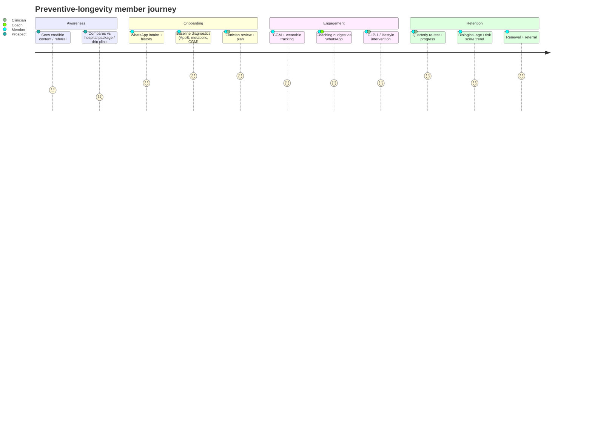

# Malaysia Longevity, Preventive & Functional Medicine Market

**Abstract.** Malaysia is ageing faster than almost any nation in Asia — crossing the "ageing nation" threshold (≥15% aged 60+) in 2030 and "aged nation" status around 2043–2048 — while carrying one of the region's heaviest non-communicable-disease (NCD) burdens: 15.6% diabetes, 29.2% hypertension, and 54.4% overweight/obese adults.[^1][^3][^4] This collision of longer lifespan (75.3 years at birth in 2025) with a shrinking healthspan is the structural engine of a preventive- and longevity-medicine market that is real but bifurcated. On one side sits a large, price-competitive executive-screening industry (hospital and lab packages from ~RM150 to RM3,500+) and a nascent, evidence-based preventive-cardiology/metabolic-health opportunity anchored on ApoB, CGM, and structured risk reduction. On the other sits a fast-growing, loosely regulated "anti-ageing" fringe — NAD⁺ drips (RM800–900/session), unregistered NMN, TRT/HRT clinics, and stem-cell/exosome "regenerative" offerings operating in an explicit regulatory grey zone. Malaysia's wellness economy is already USD 31.8bn, with "public health, prevention & personalised medicine" its second-fastest-growing sub-sector (+12.6% p.a. 2019–2024).[^30] The global longevity/diagnostics-led model (Function Health, Neko Health, Prenuvo/Ezra) is proven at scale abroad but not yet localised to Malaysia — the clearest whitespace for Welltech. This document maps demographics, the screening market, the provider landscape, the diagnostics frontier, supplements, regulation, demand signals, the scientific dividing line between defensible and quack offers, and a TAM/SAM/SOM for a preventive-longevity membership clinic in the Klang Valley.

**Last updated: July 2026**

Related reading: [Malaysia market sizing & demand drivers](malaysia-market-sizing.md) · [Malaysia GLP-1 / medical weight-loss market](malaysia-glp1-weight-loss-market.md) · [Malaysia telehealth market](malaysia-telehealth-market.md) · [Malaysia regulations](malaysia-regulations.md) · [Cross-market comparison](cross-market-comparison.md) · [Welltech blueprint](../70-welltech-blueprint/) · [Research standards](../RESEARCH-STANDARDS.md)

### Key numbers at a glance

| Metric | Value | Source |
|---|---|---|
| Life expectancy at birth (2025) | 75.3 yrs (F 77.9 / M 73.1) | DOSM[^5] |
| Population aged 60+ (2030 proj.) | 5.8m (~15.3%) — "ageing nation" | DOSM[^1] |
| Diabetes / hypertension / obesity (adults) | 15.6% / 29.2% / 54.4% | NHMS 2023[^3][^4] |
| Undiagnosed diabetics | ~2 in 5 (84% of 18–29yo) | NHMS 2023[^3] |
| Out-of-pocket share of private health financing | 76% | MNHA 2023[^28] |
| Malaysia wellness economy | USD 31.8bn; prevention/personalised-med +12.6% p.a. | GWI[^30] |
| Nutritional supplements market | USD 645m (2023) → USD 920m (2030), 5.2% CAGR | Maximize[^36] |
| HNWIs (≥USD 1m) | ~85k (2022) → ~164k (2027 proj.) | Knight Frank[^24] |
| Executive screening price band | RM99–6,859 (one-off) | providers[^8][^14] |
| NAD⁺ IV / epigenetic test / TRT | RM880/session · RM2,500–4,000 · RM5k–15k/yr | [^21][^27][^23] |
| Global longevity economy | ~USD 8tn (2024) → up to USD 12tn (2030) | McKinsey[^40] |
| **Est. SOM, KL preventive-membership clinic (3–5 yr)** | **~RM20–70m/yr** | analyst |

---

## 1. Why longevity, why Malaysia, why now

Three forces converge to make preventive/longevity medicine a structurally growing category in Malaysia:

1. **Demographic ageing at record speed.** Malaysia is one of the fastest countries in the world to transition to aged status.[^1]
2. **An NCD epidemic that compresses healthspan** well below lifespan, creating decades of "sick years" that preventive medicine can defer.[^3][^4]
3. **A wealthy, health-anxious urban minority** with rising discretionary spend, out-of-pocket payment habits, and exposure to global longevity culture.[^24][^30]

The category is not monolithic. It spans (a) **mass-market preventive screening** (the largest, most mature segment); (b) **evidence-based preventive/functional medicine** (small but defensible); and (c) a **speculative anti-ageing fringe** (fast-growing, reputationally hazardous). A serious operator must exploit (a) and (b) while ring-fencing itself from (c).

---

## 2. Ageing demographics: lifespan up, healthspan flat

### 2.1 The ageing transition

| Metric | Value | Year | Source |
|---|---|---|---|
| Population aged 60+ | 3.9m (11.6%) | 2024 | DOSM[^1] |
| Population aged 60+ | 3.8m (11.3%) | 2023 | DOSM[^1] |
| Projected 60+ | 5.8m (~15.3%) | 2030 | DOSM[^1] |
| Share aged 60+ | 7.9% | 2010 | DOSM[^1] |
| "Ageing nation" threshold (≥15% aged 60+) | Crossed | 2030 | DOSM / MPRH[^1][^2] |
| "Aged nation" (≥14% aged 65+) | ~2043–2048 | proj. | MOF / MPRH[^1] |

Malaysia will reach aged-nation status within roughly 20 years of entering the ageing transition — among the fastest globally, versus the many decades it took most Western economies.[^1] This compression means the healthcare system, and consumer demand, will confront age-related morbidity before the country is fully high-income — a "getting old before getting rich" risk that pushes affluent households toward private preventive solutions rather than waiting on public capacity.[^2][^28]

### 2.2 Lifespan vs healthspan

- **Life expectancy at birth: 75.3 years in 2025** (female 77.9; male 73.1), up 1.3 years since 2023 after a pandemic-era decline.[^5][^6]
- A **60-year-old female can expect to reach 81.6, a male 78.8** — i.e., two decades of later-life demand for health management.[^6]
- Ethnic gap: Chinese 77.3 vs Indian 71.8 years, a structural signal that ethnicity-linked metabolic risk (esp. among Malaysian Indians) shapes demand and messaging.[^5]

The critical gap is **healthspan**. With diabetes at 15.6% and >54% of adults overweight/obese, a large share of those added years are lived with chronic disease.[^3][^4] Malaysia has no official "healthy life expectancy" headline figure widely publicised, but WHO HALE estimates for Malaysia sit roughly a decade below life expectancy — the "morbidity gap" that preventive medicine explicitly targets.[^7] *(The precise HALE figure should be sourced from WHO's country profile before external quotation — analyst flag.)*

### 2.3 The NCD burden (NHMS 2023) — demand engine for prevention

| Condition | Prevalence (adults) | Trend | Note |
|---|---|---|---|
| Diabetes | 15.6% | ↑ from 11.2% (2011) | ~2 in 5 undiagnosed; 84% of 18–29yo unaware[^3][^4] |
| Hypertension | 29.2% | Plateau since 2011 | Largely asymptomatic[^4] |
| Overweight/obese (BMI ≥25) | 54.4% | ↑ from 44.5% (2011) | Abdominal obesity 54.5%[^3][^4] |
| High cholesterol (among comorbid) | — | — | 5.1% have diabetes+HTN+high-chol together[^4] |
| ≥3 concurrent NCDs | >2 million adults | rising | Multimorbidity cluster[^3] |

**Implications for Welltech.** The undiagnosed fraction is the commercial heart of preventive medicine: two in five diabetics — and the overwhelming majority of young diabetics — do not know their status.[^3][^4] A preventive offer that converts "worried well" affluent Malaysians into early-detected, actively managed patients addresses a genuine clinical gap, not a manufactured one. Metabolic health (diabetes/pre-diabetes, obesity, dyslipidaemia) — not exotic anti-ageing — is the scientifically defensible core, and it directly adjoins Welltech's GLP-1 weight-loss franchise (see [Malaysia GLP-1 market](malaysia-glp1-weight-loss-market.md)).

---

## 3. The preventive & screening market

### 3.1 Executive & comprehensive health-screening price benchmarks

Malaysia has a deep, competitive screening industry spanning budget labs, diagnostic chains, and premium private hospitals. Advertised prices (2025–2026, MYR):

| Provider | Package | Price (RM) | Notes | Source |
|---|---|---|---|---|
| **BP Healthcare** | Basic Health Screening (68 tests) | 156–268 | Frequent promo pricing | [^8] |
| BP Healthcare | Specialist Head-to-Toe | 2,500 | | [^8] |
| BP Healthcare | Premium Specialist Head-to-Toe | 3,500 | Top of range | [^8] |
| **Pathlab** | General Health Screening (62 tests) | 220 (promo 99–110) | Blood + urine, tumour + thyroid markers | [^9] |
| Pathlab | Comprehensive Senior "Golden" | varies | Age-targeted | [^9] |
| **Sunway Medical Centre** | Executive Female tiers | 680 / 1,080 / 1,380 / 1,780 / 2,580 | Discounts to ~RM1,513 | [^10] |
| Sunway Medical Ipoh | Executive Health Screening | 590 | Regional pricing | [^10] |
| **Prince Court Medical Centre** | Health screening range | 600–2,050 | "Well Man >40" RM1,500 | [^11] |
| Prince Court | Signature Male / Female | ~USD 350 / 400 | Internationally benchmarked | [^11] |
| **Gleneagles KL** | Screening range | 551–2,136 | Cardiac CT add-on RM4,125 | [^12] |
| **KPJ (network)** | Packages from | 399–899 (Elite) | Buy-1-free-1 promo Oct'25–Dec'26 | [^13] |
| **LifeCare Diagnostic** | Screening range | 638–6,859 | Economy #NewNorm RM438; "Essential for Her/Him" RM799 | [^14] |

**Observations.**
- **Price compression at the bottom.** Basic multi-test panels are effectively commoditised at RM99–268 — screening blood work is not a defensible business on its own.
- **Premium ceiling ~RM3,500–6,859** for hospital "head-to-toe" packages, but these are episodic (annual) transactions, not managed relationships.
- **The gap:** almost all packages are *one-off diagnostic events* with a brief doctor debrief. Virtually none offer **longitudinal tracking, structured intervention, or a membership relationship** — the model that Function Health and Neko have proven internationally (§7). That gap is the whitespace.

### 3.2 Corporate & insurer-funded screening

Corporate wellness screening is a large B2B channel (employers buying annual panels for staff, often via BP Healthcare/Pathlab/LifeCare and insurer networks). Private insurance funds only ~17% of private health financing; out-of-pocket dominates at 76% of private spend.[^28] Employers thus remain a key aggregator of screening demand, and a natural B2B2C beachhead for a membership model.

### 3.3 Public screening initiatives (the mass-market floor)

| Programme | Operator | Scope | Reach | Source |
|---|---|---|---|---|
| **PeKa B40** | ProtectHealth / MOH | Free NCD screening for B40 aged 40+ | 1.53m screened by Jan 2025; national rate 22.0% (up from 10% in 2022) | [^15][^16] |
| **National Health Screening Initiative (NHSI / Saringan Kesihatan Kebangsaan)** | MOH | Free screening at public clinics; expanded to age 18+ since 2023; MySejahtera booking | Nationwide public-clinic network | [^17] |
| **SEHATi** | PERKESO/SOCSO | Insured-worker health screening | Formal-sector workers | [^17] |

These programmes set a **"free floor"** for basic screening among lower-income Malaysians, but they are under-utilised (PeKa B40 uptake still <20% in Selangor/KL) and clinically basic.[^16] They do **not** compete for the affluent preventive segment; if anything they reinforce that comprehensive, longitudinal, concierge-grade prevention is a private, out-of-pocket play.

**Implications for Welltech.** Do not compete on screening price — that market is commoditised and, at the bottom, free. Compete on **what happens after the test**: interpretation, longitudinal tracking, behaviour change, and outcomes. The defensible unit is a *managed preventive relationship*, priced as a membership, not a *screening transaction*.

---

## 4. Longevity clinics & functional medicine: the provider map

A cluster of self-described longevity/functional/anti-ageing/regenerative providers has emerged in the Klang Valley. Quality and evidentiary rigour vary enormously; the table separates positioning from substance.

| Provider | Positioning | Core offer | Evidence posture | Notes / pricing |
|---|---|---|---|---|
| **Longevity Clinic (by Medkos)** | "Malaysia's first longevity clinic"; IFM-recognised functional medicine | Genomic screening, epigenetic clock, hormonal/functional biomarkers, lifestyle profiling; "biological age reversal" | Mixed: claims MOH-licensed doctors + IFM certification; also markets "age reversal" | Only MY clinic cited as IFM-recognised; states MOH compliance[^18][^19] |
| **Emagene Life** | "World's first AI-powered functional medicine & longevity centre" | AI-guided functional medicine, IFM-certified practitioners, virtual + lab partnerships | Marketing-forward; "first AI" claims unverified | HQ Malaysia, multi-country[^18][^19] |
| **Llayana Clinic** | Luxury longevity + aesthetics | AI health diagnostics, longevity care, aesthetics | Blends medical + cosmetic | Premium/HNW positioning[^18][^19] |
| **The Heal KL** | "Center for Lifestyle & Longevity" | Lifestyle-medicine framing | Lifestyle-led | [^19] |
| **The Living Centers** | Regenerative & wellness | EECP, BEMER, NAD⁺ IV, anti-ageing | Device + IV heavy; weak evidence base | KL[^19] |
| **Nexus Clinic KL** | Aesthetic + regenerative + weight loss | Botox/fillers/HIFU, GLP-1 (Ozempic/Mounjaro), TRT, HRT, stem-cell (marketed) | Aesthetic-medicine core; regenerative claims in grey zone | Wisma UOA II, KL[^20][^22] |
| **PULSE Clinic** | Lifestyle / sexual & men's health | TRT, IV drips, NMN/NAD⁺ | Sexual-health-led | Multi-city MY[^20][^21] |
| **Peak Protocol** | Men's-health / longevity content + service | TRT, biological-age testing guidance | Consumer-education-led | Content-heavy funnel[^21][^23] |
| **EECP Centre / Careplus / Chye / A Klinik / Blessono** | IV-therapy & NAD⁺ lounges | NAD⁺ drips, vitamin IV | Wellness, minimal validation | NAD⁺ RM880–888/session[^21] |
| **FirstCell / stem-cell concierges** | Regenerative/stem-cell | MSC, NK-cell, exosome "anti-ageing" | **Experimental / grey zone** | Stem-cell "anti-ageing" package quoted ~USD 11,800[^18][^25] |

### 4.1 Segment pricing snapshots (advertised)

| Service | Typical MY price | Source |
|---|---|---|
| NAD⁺ IV drip (single session) | RM880–888; packages RM2,288–4,288 | [^21] |
| TRT (testosterone replacement) | RM5,000–15,000/yr; injections RM800–2,500/session; gels RM300–700/month | [^23] |
| HRT (menopause) initial assessment | RM150–300; therapy from ~RM104 | [^26] |
| Epigenetic biological-age test | RM2,500–4,000 | [^27] |
| Stem-cell "anti-ageing" programme | ~USD 8,000–19,800 (RM ~38k–94k) | [^18] |

**Reading the map.** The Malaysian "longevity" field is dominated by (i) **aesthetic-medicine clinics** extending into wellness/hormones/GLP-1, and (ii) **IV/regenerative lounges** with thin evidence. Only a handful position around functional-medicine diagnostics; almost none around **preventive cardiology / metabolic medicine with published protocols**. This is both the reputational risk (§9) and the whitespace: the market lacks a credible, clinician-led, evidence-anchored preventive-longevity brand.

---

## 5. The diagnostics frontier in Malaysia

Longevity's technological substrate is advanced diagnostics. Availability in Malaysia, 2026:

| Modality | Availability in MY | Indicative price | Assessment | Source |
|---|---|---|---|---|
| **Biological-age / epigenetic clock** (DNA-methylation, TruAge-type) | Available (e.g. SuperDNA, Peak Protocol channels) | RM2,500–4,000 | Emerging; interpret cautiously as a *tracking* metric, not diagnosis | [^27] |
| **Genetic testing (WES/NGS)** — CircleDNA | Widely available; MY-localised pricing | Vital RM790 · Health RM2,090 · Premium RM2,590 | Consumer-grade; useful for carrier/pharmacogenomic, weak for "longevity" | [^27] |
| **Advanced lipids — ApoB** | Available via Pathlab & labs | Standalone add-on cheap (~RM15–65 range; MY-specific pricing thin) | **High-value, evidence-based**; superior to LDL-C for CV risk (§8) | [^29][^31] |
| **Lp(a)** | Available at reference labs | not widely published | Once-in-lifetime genetic CV risk marker; rising guideline status | [^29][^31] |
| **CGM (FreeStyle Libre)** | Retail available (CARiNG, pharmacies, Abbott MY) | Sensor ~RM281.90 / 14 days | **Strong metabolic-health tool**; scalable, consumer-friendly | [^32] |
| **Microbiome / gut testing** | Available (AMILI regional; WellLab; stem-cell centres) | varies | Evidence still maturing; consumer interest high | [^33] |
| **Full-body MRI (Prenuvo/Ezra analogue)** | **No dedicated MY analogue identified**; hospitals offer ad-hoc MRI/Cardiac CT (Gleneagles cardiac CT RM4,125) | US Prenuvo USD 1,199–2,499; Ezra now USD 499–899 | **Clear whitespace** — no Malaysian "whole-body MRI screening" brand found | [^12][^34][^35] |

**Implications for Welltech.**
- **Anchor on the evidence-based, scalable tools first: ApoB, CGM, structured metabolic panels.** These are cheap, defensible, and directly actionable — the opposite of a "quack" signature.
- **CGM is a standout wedge.** At ~RM282/sensor it enables a subscription-friendly, data-rich metabolic-coaching product that ties naturally to GLP-1 and weight-loss workflows and to WhatsApp-first monitoring (see [AI operating model](../60-ai-operating-model/)).
- **Full-body MRI is unbuilt in Malaysia.** Ezra's collapse in price to ~USD 499 after the Function acquisition shows the model is deflating fast; a partnered imaging-led offer could be a differentiator, but capex, false-positive/over-diagnosis risk, and radiologist supply must be weighed (§9).
- **Treat biological-age/epigenetic tests as engagement/retention metrics, not clinical endpoints** — market honestly.

---

## 6. Supplements & consumer longevity

### 6.1 Market size

| Estimate | Value | Source |
|---|---|---|
| Malaysia nutritional supplements market | USD 644.9m (2023) → USD 919.6m by 2030 (CAGR 5.2%) | Maximize[^36] |
| Alt. estimate (nutraceuticals/dietary) | ~USD 1.1–1.2bn | Ken Research[^36] |
| Direct-selling retail (all categories) | USD 10.19bn (2024); wellness ≈49% of retail | DSAM / Epixel[^37] |

Direct selling is a defining Malaysian channel. **Amway Malaysia** is the country's largest direct seller; globally Amway's nutrition category (Nutrilite, world's #1 vitamin brand) grew 2% in 2024 and is now 64% of Amway's ~USD 7.4bn global sales.[^37] Shaklee, Herbalife, Cosway and others reinforce a deeply entrenched supplement-consumption culture — meaning Malaysian consumers are *primed to pay monthly for health products*, a behavioural asset for subscription models.

### 6.2 NMN / NAD⁺ regulatory status

**NMN (nicotinamide mononucleotide)** — the flagship "longevity molecule" — sits in a **grey zone in Malaysia**: legal to import for personal use, but **not registered** as a health supplement with NPRA, so it cannot be sold with anti-ageing therapeutic claims.[^38] This mirrors global flux (the US FDA paused, then reversed, enforcement on NMN's supplement status).[^38] NAD⁺ IV therapy is offered clinically (RM880–888/session) but likewise lacks robust outcome evidence.[^21]

### 6.3 Supplement claims regime

Health supplements are **regulated as drugs** under NPRA (Sale of Drugs Act 1952; Control of Drugs and Cosmetics Regulations 1984). Claims must be **health-maintenance only — not medicinal/therapeutic** (no treat/cure/prevent-disease claims), must be evidence-proportionate, and **all advertising must be pre-approved** under the Medicines (Advertisement and Sale) Act 1956.[^39] This materially constrains how any longevity brand may market supplements, epigenetic "reversal," or NMN in Malaysia.

**Implications for Welltech.** A supplements line can be a high-margin adjunct and retention hook, but (a) NMN and similar molecules cannot carry therapeutic anti-ageing claims and are unregistered; (b) all promotional copy needs NPRA pre-clearance; (c) the compliant, credible play is evidence-graded supplementation (e.g. omega-3, vitamin D, fibre, creatine) framed as health-maintenance, not "age reversal." Leaning into unregistered NMN/NAD⁺ marketing invites both regulatory and reputational exposure.

---

## 7. Global longevity framing & business models

### 7.1 Market size (global)

| Framing | Figure | Source |
|---|---|---|
| Longevity economy (broad) | ~USD 8tn (2024) → up to USD 12tn by 2030 | McKinsey[^40] |
| Wider estimates | up to USD 27tn by 2030 (aggressive) | industry[^40] |
| Economic prize of healthy ageing | +9 healthy years, ~USD 12.5tn global gain by 2050 | McKinsey Health Institute[^40] |
| Global wellness economy | USD 6.8tn (2024) → USD 9.8tn by 2029 | GWI[^30] |

### 7.2 International model archetypes (and applicability to Malaysia)

| Model | Exemplar | Economics | MY applicability |
|---|---|---|---|
| **Diagnostics-led subscription** | **Function Health** — 160+ labs, USD 365–499/yr; USD 2.5bn valuation on USD 298m Series B (a16z, celebrity backers); acquired **Ezra**, dropped full-body MRI to ~USD 499 | Membership + upsell imaging; asset-light labs | **High** — subscription labs + interpretation is directly transplantable; localise panel + pricing[^41][^35] |
| **Scan-led preventive** | **Neko Health** (Daniel Ek) — full-body scan + bloods; USD 260m Series B; ~USD 1.8bn valuation; 300k+ waitlist; SE/UK/US | Proprietary hardware clinics; high capex | **Medium** — capex-heavy; brand-led; no Asia presence yet — first-mover opening[^42] |
| **Imaging-led screening** | **Prenuvo / Ezra** — whole-body MRI USD 499–2,499 | Imaging throughput; over-diagnosis debate | **Medium** — no MY analogue; partner-imaging model possible[^34][^35] |
| **Concierge longevity** | Biograph, Fountain Life (US) | High-touch, HNW, USD 5k–20k/yr | **Niche** — small MY HNW base; expat + medical-tourism angle |
| **Functional-medicine clinic** | IFM-model clinics | Consult + labs + supplements | **Present in MY** but fragmented, evidence-variable |

**Synthesis.** The internationally *proven, scalable* winner is the **diagnostics-led subscription** (Function): asset-light, recurring revenue, data-compounding, upsell-friendly. It has **not been localised to Malaysia**. Neko/Prenuvo prove consumer appetite for premium preventive scanning but carry capex and over-diagnosis risk. For Welltech, the Function template — *membership + longitudinal biomarkers + AI interpretation + WhatsApp-native engagement*, anchored on metabolic/cardiovascular evidence and integrated with GLP-1 — is the most defensible localisation.

---

## 8. Clinical & scientific grounding: the defensible core

To avoid the "quack" trap (§9), a longevity offer must rest on interventions with genuine outcome evidence. The strongest anchors:

- **Preventive cardiology via ApoB.** ESC/EAS and the US National Lipid Association consensus hold **ApoB as a more accurate marker of cardiovascular risk than LDL-C or non-HDL-C**, before and during therapy; ApoB outperformed LDL-C in 9/9 studies in one review; the 2026 ACC/AHA dyslipidaemia guideline elevates ApoB and Lp(a).[^29][^31] NLA targets: ApoB <90 (intermediate risk), <70 (high), <60 mg/dL (very high).[^29] This is cheap, actionable, guideline-backed — the antithesis of pseudoscience.
- **Metabolic health / early dysglycaemia.** With 40% of Malaysian diabetics undiagnosed, CGM-enabled detection of impaired glucose regulation and structured lifestyle/GLP-1 intervention has clear clinical value.[^3][^32]
- **Blood-pressure and lipid control**, weight management, physical activity, sleep, and smoking cessation — the boring, evidence-dense levers that actually extend healthspan.
- **Lp(a)** as a once-in-lifetime genetic CV risk stratifier.[^31]

Contrast this with the **speculative segment**: NAD⁺/NMN "age reversal," unproven stem-cell/exosome infusions, and epigenetic-clock "reversal" claims — none supported by outcome trials.[^25][^38][^43]

**Implications for Welltech.** Position as **preventive medicine that happens to extend healthspan**, not "anti-ageing." Every headline claim should map to a guideline (ESC/EAS, ACC/AHA, ADA). Use biological-age scores as *engagement metaphors*, disclosed as such. This is both clinically honest and the sharpest brand differentiator in a field crowded with drip lounges.

---

## 9. Regulatory touchpoints & reputational risk

### 9.1 Aesthetic medicine — LCP regime

Any aesthetic component (Botox, fillers, lasers, HIFU, threads) requires a doctor to hold a **Letter of Credentialing and Privileging (LCP)** from MOH's Medical Practice Division, per the 2013 *Guidelines on Aesthetic Medical Practice*. Eligibility: full MMC registration + valid APC, ≥2 years post-registration clinical experience, supervised aesthetic training, clean disciplinary record; LCP valid 3 years, renewable; holders listed on the National Registry.[^44] Practising aesthetics without LCP is a compliance breach.

### 9.2 Stem-cell / cell & gene therapy — experimental, tightly regulated

- CGTPs are **biological products** under the Sale of Drugs Act 1952 / CDCR 1984; NPRA published the *Guidance & Guidelines for Registration of CGTPs* (2024; 2nd ed. Sept 2025) and MOH the *Guidelines on Stem Cell & Cell-Based Therapies (3rd ed., 2023)*.[^45]
- **As of 2025, only haematopoietic stem-cell transplantation is recognised established practice.** MSC, NK-cell, and "regenerative/anti-ageing" stem-cell procedures are **experimental** and lawful **only within MREC-approved clinical trials**.[^45][^25]
- **Exosome therapy sits in an explicit grey zone** — MOH does not regulate exosomes as a drug category, and clinics marketing them for "anti-ageing" operate outside MOH endorsement.[^25]

### 9.3 Supplement & advertising rules

NPRA registration for supplements; **health-maintenance-only claims**; pre-approval of all advertising under the Medicines (Advertisement and Sale) Act 1956 (§6.3).[^39]

### 9.4 Reputational risk — the field's credibility problem

Peer-reviewed and mainstream critiques are blunt: longevity clinics are widely "**dismissed by scientists as pseudoscientific**," often "**disconnected from academic geroscience**," selling "**exotic supplements and intravenous cocktails … with minimal validation**" and "**stem-cell infusions or experimental biologics … without robust safety data**," frequently self-styling as "**wellness providers rather than medical facilities**" to escape oversight.[^43] For a serious digital-health venture, association with this fringe is an existential brand risk with investors, clinicians, and regulators.

**Implications for Welltech.**
1. **Stay inside the lines:** LCP for any aesthetics; no stem-cell/exosome "anti-ageing" offers outside trials; NPRA-compliant supplement claims; pre-cleared advertising.
2. **Weaponise credibility as differentiation:** publish protocols, cite guidelines, employ named licensed clinicians, and explicitly *disavow* unproven interventions. In a grey-zone market, being visibly the compliant, evidence-based operator is a moat.

---

## 10. Demand signals: who buys longevity in Malaysia

### 10.1 Buyer segments

| Segment | Size / signal | Willingness to pay | Source |
|---|---|---|---|
| **HNWIs (≥USD 1m)** | ~85k (2022) → ~164k projected 2027 | High; concierge-capable | Knight Frank[^24] |
| **UHNWIs** | 1,566 (2026) → 1,881 (2031), +20% | Very high | Knight Frank[^24] |
| **Urban affluent professionals (Klang Valley)** | Large; health-anxious, globally exposed | Medium — subscription-tier | inference[^24][^30] |
| **Expatriates** | KL/PJ expat community | Medium-high; familiar with Function/Neko | inference |
| **Medical/longevity tourists** | 1.6m healthcare travellers (2024), RM2.72bn revenue; MHTC targeting RM12bn by 2030 with wellness/preventive packages | Variable | MHTC[^46] |

### 10.2 Willingness-to-pay evidence

- **Out-of-pocket dominates** (76% of private health financing) — Malaysians already pay cash for healthcare, lowering the friction for a cash-pay membership.[^28]
- **Wellness economy USD 31.8bn**, with prevention/personalised medicine the #2 growth sub-sector (+12.6% p.a.).[^30] Yet Asia's per-capita wellness spend (USD 471) is a fraction of North America's (USD 6,029) — headroom, not saturation.[^30]
- **Entrenched supplement/subscription behaviour** via direct selling (§6) demonstrates recurring health spend.
- **Medical-tourism pivot to wellness/preventive** (MHTC's holistic packages, elderly-wellness programme) signals policy tailwinds for premium preventive services aimed at foreigners *and* affluent locals.[^46]

**Implications for Welltech.** The addressable buyer is not "everyone ageing" — it is the **urban affluent + HNW + expat + longevity-tourist** cohort in the Klang Valley, paying out-of-pocket, already spending on supplements and screening, and primed by global longevity culture but currently served only by a fragmented, evidence-variable field. Medical tourism (Malaysia's cost advantage: HRT/TRT ~40%+ cheaper than US/UK) offers a cross-border upside layer.[^26][^46]

---

## 11. Market sizing — preventive/longevity membership clinic, Klang Valley

*All figures are analyst estimates built from the cited demand and pricing data; ranges are shown deliberately. Treat as a sizing framework, not a forecast.*

### 11.1 Method & assumptions

- **Geography:** Klang Valley (Greater KL), ~8.4m population, the wealth and expat epicentre.
- **Product:** cash-pay **preventive-longevity membership** (annual diagnostics + longitudinal tracking + clinician + coaching), positioned RM3,000–12,000/yr across tiers (benchmarked to hospital premium packages RM2,500–6,859 and Function's ~USD 365–499, plus a concierge tier).
- **Anchor cohorts:** HNWIs, UHNWIs, urban affluent (top income decile), expats, inbound longevity tourists.

### 11.2 TAM / SAM / SOM (illustrative)

| Layer | Definition | Population basis | Assumed annual spend | Market value (RM/yr) |
|---|---|---|---|---|
| **TAM** | All Klang Valley adults who could plausibly buy premium preventive care (top ~10–15% income) + expats + inbound longevity tourists | ~600k–900k individuals | RM3,000–6,000 avg | **~RM2.0–4.5bn** |
| **SAM** | Realistically reachable, health-motivated, cash-pay affluent + HNW + expat in KL/PJ willing to pay for membership prevention | ~120k–200k individuals | RM4,000–8,000 | **~RM0.6–1.4bn** |
| **SOM (3–5 yr)** | Capturable by a credible single-brand operator with 1–3 clinics + digital/WhatsApp reach | ~3,000–8,000 members | RM5,000–9,000 | **~RM20–70m** |

Cross-check (bottom-up): a single flagship clinic serving ~2,000 active members at ~RM6,000 blended ARPU ≈ **RM12m/yr** recurring, before supplements, imaging upsell, GLP-1, and B2B corporate contracts — a plausible unit-economic base consistent with the SOM range.

### 11.3 Growth outlook

Underlying drivers compound: ageing (60+ share 11.6%→15.3% by 2030[^1]), HNWI growth (~+90% 2022–27[^24]), prevention/personalised-medicine sub-sector +12.6% p.a.[^30], and medical-tourism wellness pivot toward RM12bn by 2030.[^46] A **low-to-mid-teens % CAGR** for the affluent preventive-membership niche is a defensible planning assumption *(analyst estimate)*, faster than the overall supplements market (5.2%[^36]) because it starts from a near-zero localised base.

### 11.4 Competitive whitespace map

| Axis | Crowded | Empty (whitespace) |
|---|---|---|
| Screening | Commoditised (RM99–3,500 one-off packages)[^8][^14] | **Longitudinal, membership-based, outcome-tracked prevention** |
| Aesthetics/IV | Saturated (Botox, NAD⁺ lounges)[^20][^21] | **Evidence-based preventive cardiology / metabolic medicine** |
| Functional medicine | Fragmented, evidence-variable[^18][^19] | **Credible, guideline-anchored, clinician-led brand** |
| Diagnostics | Genetic/epigenetic consumer tests[^27] | **CGM-driven metabolic coaching at scale; whole-body MRI (no MY analogue)**[^32][^34] |
| Channel | Clinic-bound, episodic | **WhatsApp-first, digital, subscription, AI-interpreted** |

**The single clearest opening:** a **Function-Health-style, WhatsApp-native, membership preventive-longevity service** — anchored on ApoB/metabolic/CGM evidence, integrated with GLP-1 weight loss, marketed on credibility, and priced for the KL affluent/expat cohort. No incumbent occupies this square.

### 11.5 Porter's Five Forces — preventive-longevity membership, Klang Valley

| Force | Intensity | Rationale |
|---|---|---|
| **Threat of new entrants** | **High** | Low regulatory barrier to a "wellness" shingle; aesthetic clinics and labs can bolt on "longevity" branding cheaply. Barriers that matter are *credibility, clinical talent, data/software, and brand* — not capital. |
| **Supplier power (labs, imaging, CGM, drugs)** | **Medium** | Lab and CGM supply is competitive/commoditised (good for margins); MRI and specialist clinicians are scarcer and pricier. Reliance on Abbott (Libre) and a few reference labs is a concentration to manage. |
| **Buyer power** | **Medium-High** | Affluent, informed, out-of-pocket buyers with many screening substitutes and price transparency. Switching cost is low unless a longitudinal data relationship and outcomes create lock-in. |
| **Substitutes** | **High** | Free public screening (PeKa B40/NHSI), commoditised RM99–500 lab panels, hospital annual packages, DIY consumer tests (CircleDNA), and doing nothing. Differentiation must be *managed outcomes*, not the test itself. |
| **Rivalry** | **Medium (today) → High (soon)** | Fragmented, evidence-variable incumbents; no dominant credible brand yet. First credible mover can define the category before rivalry intensifies. |

**Read:** the structural attractiveness rests entirely on building **defensibility that the field currently lacks** — credibility, longitudinal data lock-in, software/AI, and integrated care (GLP-1, telehealth). Absent that, the business is a commoditised screening reseller.

### 11.6 SWOT — a Welltech preventive-longevity offer in Malaysia

| | Helpful | Harmful |
|---|---|---|
| **Internal** | **Strengths:** digital/WhatsApp-native operating model; GLP-1/telehealth adjacency; AI interpretation; ability to be the compliant, evidence-based brand | **Weaknesses:** no existing longevity brand equity; clinical-talent acquisition; capex if imaging added; regulated advertising limits growth hacking |
| **External** | **Opportunities:** unbuilt localised subscription model; CGM wedge; medical-tourism upside; policy tailwinds (MHTC wellness pivot); ageing + NCD demand | **Threats:** fast-following aesthetic/lab incumbents; reputational contagion from fringe "longevity"; regulatory tightening on cell therapy/claims; economic sensitivity of discretionary spend |

---

## 12. Buyer personas & customer journey

### 12.1 Three anchor personas

1. **"The Optimiser" (urban affluent professional, 35–50).** Dual-income Klang Valley executive or founder; wears a smartwatch, reads longevity content, mildly anxious about a parent's diabetes/heart disease. Wants data, control, and a credible expert — not a drip lounge. **WTP:** RM4,000–8,000/yr for a membership with clear tracking and a real clinician. The core subscription target.
2. **"The Worried HNW/UHNW" (50–65).** High wealth, existing NCD risk or recent scare, values discretion and concierge access. **WTP:** RM10,000–25,000+/yr; wants whole-body imaging, rapid specialist access, and a named physician. The premium/concierge tier and referral engine.
3. **"The Expat / Longevity Tourist."** KL-based expatriate or inbound visitor familiar with Function/Neko/Prenuvo, seeking equivalent service at Malaysian cost. **WTP:** benchmarked to home-market prices (a 40%+ discount is compelling). The medical-tourism and word-of-mouth layer.

### 12.2 Customer journey (membership model)

The journey's differentiator is the **engagement and retention loop** — the phase every incumbent screening package omits. WhatsApp-native coaching and longitudinal re-testing convert a one-off diagnostic into a recurring, data-compounding relationship (see [AI operating model](../60-ai-operating-model/) and [WhatsApp workflows](malaysia-whatsapp-healthcare.md)).

---

## 13. Functional & preventive medicine: separating signal from noise

The "functional medicine" label spans a spectrum from legitimate lifestyle/preventive medicine to unfounded protocols. A credible Malaysian offer should adopt the defensible elements and refuse the rest.

**Adopt (evidence-based):**
- Structured cardiovascular risk reduction on ApoB/Lp(a)/BP targets (ESC/EAS, ACC/AHA 2026).[^29][^31]
- Dysglycaemia detection and reversal via CGM + diet + activity + GLP-1 where indicated (ADA-aligned).[^3][^32]
- Weight management as the highest-leverage healthspan intervention in an obesogenic population (54% overweight/obese).[^4]
- Evidence-graded supplementation (omega-3, vitamin D repletion, fibre, protein/creatine) framed as maintenance.[^39]
- Sleep, activity, smoking/alcohol, and mental-health screening.

**Refuse or heavily caveat (weak/absent evidence):**
- NAD⁺/NMN "age reversal" claims.[^38][^43]
- Non-trial stem-cell/exosome "anti-ageing" infusions (also a regulatory breach).[^25][^45]
- "Epigenetic age reversal" marketing (use the score as a *tracking* metaphor only).[^27]
- Unvalidated IV "detox" cocktails.[^43]

**Implications for Welltech.** The clinical governance model — a published formulary of what the clinic will and won't offer, with the rationale — is itself a marketing asset in a market where competitors blur the line. It reassures regulators, clinicians, insurers, and investors simultaneously.

---

### 13.1 The metabolic-longevity–GLP-1 flywheel

Malaysia's specific epidemiology makes **metabolic health the natural centre of gravity** for a longevity offer — and that centre overlaps almost perfectly with Welltech's GLP-1/medical-weight-loss franchise (see [GLP-1 market](malaysia-glp1-weight-loss-market.md)). The logic chain:

1. Prevention screening (ApoB, CGM, HbA1c, weight, BP) **surfaces** the dysmetabolic majority — plausibly a majority of any affluent 35–55 cohort given national obesity at 54%.[^4]
2. A material share qualify for **GLP-1 therapy or structured weight/metabolic intervention** — a high-value, recurring, clinically-supervised product.
3. GLP-1 patients need **longitudinal monitoring** (CGM, labs, side-effect management) — the exact membership-retention engine a longevity subscription provides.
4. Sustained metabolic improvement is itself the **most evidence-backed "longevity" outcome** available today — closing the loop between the marketing promise and the clinical reality.

This flywheel — *screen → treat (GLP-1/metabolic) → monitor → retain → re-screen* — is Welltech's strongest right-to-win: it fuses a defensible longevity narrative with a proven revenue product and a WhatsApp-native monitoring model, none of which the fragmented incumbent field integrates.

---

## 14. Risks & sensitivities

| Risk | Likelihood | Impact | Mitigation |
|---|---|---|---|
| **Reputational contagion** from "longevity = quackery" perception | Medium | High | Evidence-only formulary; published protocols; disavow fringe; licensed clinicians front-of-house[^43] |
| **Regulatory tightening** (cell therapy, supplement claims, advertising) | Medium | Medium-High | Stay well inside NPRA/MOH lines; LCP compliance; pre-cleared ads[^44][^45][^39] |
| **Over-diagnosis / false positives** (esp. if MRI added) | Medium-High | High | Guideline-based test selection; clinician gatekeeping; informed consent; avoid indiscriminate whole-body scanning[^34][^43] |
| **Commoditisation / price war** with labs and hospitals | High | Medium | Compete on relationship/outcomes, not test price; membership lock-in |
| **Thin clinical-talent pool** (functional/preventive-trained MDs) | Medium | Medium | Train internally; telehealth leverage; protocolised care + AI support |
| **Discretionary-spend sensitivity** in downturns | Medium | Medium | Tiered pricing; B2B corporate contracts for revenue stability |
| **Supplier concentration** (Abbott CGM, reference labs) | Low-Medium | Medium | Multi-source labs; monitor CGM alternatives |

---

## 15. Implications for Welltech — consolidated

1. **Lead with metabolic & cardiovascular prevention, not "anti-ageing."** ApoB, CGM, lipids, BP, weight — cheap, guideline-backed, actionable, and adjacent to Welltech's GLP-1 franchise. This is the defensible core and the sharpest differentiator in a fringe-heavy field.[^29][^31][^32]
2. **Monetise the relationship, not the test.** The screening market is commoditised (and free at the bottom via PeKa B40/NHSI). Build a **membership** with longitudinal tracking, interpretation, coaching, and WhatsApp-native engagement — the Function/Neko insight localised.[^15][^41]
3. **CGM is the scalable wedge.** ~RM282/sensor supports a subscription metabolic-coaching product tying diagnostics to behaviour change and GLP-1.[^32]
4. **Credibility is the moat.** Publish protocols, cite guidelines, employ licensed clinicians, and *explicitly disavow* unproven stem-cell/exosome/NMN "reversal." In a grey-zone market, being the visibly compliant, evidence-based brand is a competitive asset — and de-risks investors and regulators.[^43][^45]
5. **Stay regulator-clean:** LCP for any aesthetics; no non-trial stem-cell/exosome offers; NPRA-compliant supplement claims; pre-cleared advertising.[^44][^45][^39]
6. **Target the affluent/expat/HNW + longevity-tourist cohort in Klang Valley** — out-of-pocket-ready, supplement-habituated, globally aware, under-served. SOM of ~RM20–70m/yr within 3–5 years is credible for a single credible brand.[^24][^28][^30]
7. **Consider whole-body MRI as a partnered differentiator, cautiously** — no Malaysian analogue exists, but weigh capex, over-diagnosis liability, and radiologist supply; Ezra's price collapse to ~USD 499 signals the model is deflating.[^34][^35]
8. **Supplements as adjunct, not anchor** — high margin and retention-positive, but claim-constrained; use evidence-graded products framed as health-maintenance.[^36][^39]

### 15.1 Suggested phasing

| Phase | Focus | Proof point |
|---|---|---|
| **0–12 mo** | Launch metabolic-membership (ApoB + CGM + labs + clinician + WhatsApp coaching); integrate GLP-1 | 1,000–2,000 members; retention >70% at renewal |
| **12–24 mo** | Add premium/concierge tier; corporate B2B2C contracts; supplement line | ARPU uplift; recurring corporate revenue |
| **24–36 mo** | Evaluate partnered whole-body MRI; expand to second KL site; medical-tourism packaging | Imaging attach-rate; inbound-patient share |

### 15.2 Cross-market context

Malaysia is the beachhead, but the model is regional. **Singapore** has a wealthier, more mature preventive-medicine market (higher WTP, stricter regulation) and is where global brands (and any Neko/Function analogue) will likely land first; **Hong Kong** has an affluent, longevity-curious base and strong medical-tourism links to the mainland. A KL-proven, cost-efficient, WhatsApp-native metabolic-longevity model is well-positioned to travel — with pricing and regulatory localisation — into both. See the forthcoming Singapore and Hong Kong longevity/preventive files and the [cross-market comparison](cross-market-comparison.md).

### 15.3 Bottom line

Malaysia's longevity/preventive market is genuine and structurally growing, but it is currently split between a **commoditised screening industry** and an **evidence-thin anti-ageing fringe**, with no credible operator occupying the middle. The winning position is neither cheap tests nor exotic drips: it is a **clinician-led, guideline-anchored, WhatsApp-native preventive-membership model** built on metabolic and cardiovascular evidence, integrated with GLP-1, priced for the Klang Valley affluent/expat cohort, and defended by credibility, longitudinal data, and software. That square is empty — and it is the one Welltech is best equipped to take.

---

## References

[^1]: Malay Mail / DOSM, "Malaysia set to become ageing nation by 2030; Perak leads senior surge," 31 Jul 2024, https://www.malaymail.com/news/malaysia/2024/07/31/malaysia-set-to-become-ageing-nation-by-2030-perak-leads-senior-surge-dosm-report-says/145577 (accessed Jul 2026).
[^2]: Malaysia Population Research Hub (LPPKN), "Ageing Phenomenon: Malaysia Towards 2030," https://mprh.lppkn.gov.my/ageing-phenomenon-malaysia-towards-2030/ (accessed Jul 2026).
[^3]: CodeBlue (Galen Centre), "Over Two Million Adults In Malaysia Live With Three NCDs: NHMS 2023," May 2024, https://codeblue.galencentre.org/2024/05/over-two-million-adults-in-malaysia-live-with-three-ncds-nhms-2023/ (accessed Jul 2026).
[^4]: Institute for Public Health (IKU), "NHMS 2023 Fact Sheet," https://iku.nih.gov.my/images/nhms2023/fact-sheet-nhms-2023.pdf; and Free Malaysia Today, "Survey shows over half of Malaysian adults overweight or obese," 16 May 2024, https://www.freemalaysiatoday.com/category/nation/2024/05/16/survey-shows-over-half-of-malaysian-adults-overweight-or-obese (accessed Jul 2026).
[^5]: The Star / DOSM, "Malaysia's life expectancy at birth increases to an average of 75.3 years in 2025," 30 Sep 2025, https://www.thestar.com.my/news/nation/2025/09/30/dosm-malaysia039s-life-expectancy-at-birth-increases-to-an-average-of-753-years-in-2025 (accessed Jul 2026).
[^6]: DOSM, "Abridged Life Tables, Malaysia, 2025" (release), https://www.dosm.gov.my/uploads/release-content/file_20250930111706.pdf; OpenDOSM Life Expectancy dashboard, https://open.dosm.gov.my/dashboard/life-expectancy (accessed Jul 2026).
[^7]: WHO, Malaysia country data profile, https://data.who.int/countries/458 (accessed Jul 2026). *(HALE headline figure to be confirmed from WHO profile before external quotation.)*
[^8]: BP Healthcare, "Screening Package," https://bpgroup.bphealthcare.com/screening-package/; malaysiafreebies promo listing, https://malaysiafreebies.com/promotion/bp-healthcare/ (accessed Jul 2026).
[^9]: Pathlab, "Health Screening Packages," https://www.pathlab.com.my/health-screening/health-screening-packages; package detail, https://ebuy.pathlab.com.my/package/details/10 (accessed Jul 2026).
[^10]: Sunway Medical Centre, "Health Screening Packages," https://www.sunwaymedical.com/en/packages and shop, https://shop.sunwaymedical.com/wellness-screening-packages/; Sunway Medical Ipoh, https://www.sunwaymedicalipoh.com.my/en/health-screening-package/ (accessed Jul 2026).
[^11]: Prince Court Medical Centre, "Health Screening," https://princecourt.com/health-screening; screening brochure, https://princecourt.com/docs/default-source/my-pcmc-pdfs/pcmc_healthscreening_brochure.pdf (accessed Jul 2026).
[^12]: Gleneagles Hospital Kuala Lumpur, "Health Screening Unit," https://gleneagles.com.my/kuala-lumpur/health-screening-unit and https://gleneagles.com.my/health-screening (accessed Jul 2026).
[^13]: KPJ Healthcare, "Health Packages," https://kpjhealth.com.my/health-package; KPJ Damansara packages, https://www.kpjhealth.com.my/damansara/Packages (accessed Jul 2026).
[^14]: LifeCare Diagnostic Medical Centre, "Health Screening," https://lifecarediagnostic.com/bs1/health-screening/ and comprehensive package, https://lifecarediagnostic.com/comprehensive-health-screening/ (accessed Jul 2026).
[^15]: ProtectHealth, "PeKa B40," https://protecthealth.com.my/peka-b40-eng/; MOH KKMNOW PeKa B40 dashboard, https://data.moh.gov.my/dashboard/peka-b40 (accessed Jul 2026).
[^16]: CodeBlue, "Peka B40 Screening Rate Improves But Still Below 20% In Selangor, KL," Mar 2025, https://codeblue.galencentre.org/2025/03/peka-b40-screening-rate-improves-but-still-below-20-in-selangor-kl/ (accessed Jul 2026).
[^17]: JKN Perlis / MOH, "Inisiatif Saringan Kesihatan Kebangsaan (NHSI)," https://jknperlis.moh.gov.my/v3/index.php/info-kesihatan/436-inisiatif-saringan-kesihatan-kebangsaan-atau-national-health-screening-initiative-nhsi; PERKESO SEHATi, https://sehati.perkeso.gov.my/ (accessed Jul 2026).
[^18]: Longevity Clinic Malaysia (by Medkos), https://www.longevityclinic.asia/; PlacidWay anti-aging clinic & stem-cell package listings, https://www.placidway.com/search-medical-centers/Anti-Aging/Malaysia/1 (accessed Jul 2026).
[^19]: Emagene Life, https://emagene.life/; Llayana Clinic, https://llayana.com/; The Heal KL, https://theheal.my/; The Living Centers, https://www.thelivingcenters.com/ (accessed Jul 2026).
[^20]: Nexus Clinic KL, https://www.nexus-clinic.com/en/; PULSE Clinic Malaysia men's health, https://www.pulse-clinic.com.my/mens-health-clinic-kuala-lumpur (accessed Jul 2026).
[^21]: MyDocSquad, "NAD+ IV Drip Services in KL & Selangor: 2026 Provider Comparison," https://docsquad.my/en/stay-informed/nad-iv-drip-kl-selangor/; EECP Centre NAD+ therapy, https://www.eecpcentre.com/services/nad-therapy/ (accessed Jul 2026).
[^22]: Nexus Clinic KL, "Testosterone Replacement Therapy Malaysia," https://www.nexus-clinic.com/regenerative/testosterone-therapy-malaysia/ (accessed Jul 2026).
[^23]: Peak Protocol, "TRT Malaysia: Complete Guide to Testosterone Replacement Therapy," https://peakprotocolmy.com/mens-health/trt-malaysia/ (accessed Jul 2026).
[^24]: Malay Mail / Knight Frank, "Malaysia ultra-high-net-worth individuals to rise 39pc by 2031," 28 Apr 2026, https://www.malaymail.com/news/malaysia/2026/04/28/malaysia-ultra-high-net-worth-individuals-to-rise-39pc-by-2031-says-report/217961; The Edge / Knight Frank, https://theedgemalaysia.com/node/704581 (accessed Jul 2026).
[^25]: Peak Protocol, "Exosome Therapy Malaysia: Benefits, Cost & What to Expect (2026)," https://peakprotocolmy.com/longevity/exosome-therapy-malaysia/; Longevity Clinic, "Stem Cell Therapy in Malaysia: Legal or Not?," https://www.longevityclinic.asia/post/stem-cell-therapy-guide (accessed Jul 2026).
[^26]: Nexus Clinic KL, "HRT Malaysia," https://www.nexus-clinic.com/regenerative/hormone-replacement-therapy-malaysia/; MyMediTravel HRT Malaysia pricing, https://www.mymeditravel.com/hormone-replacement-therapy-hrt-procedures-in-malaysia (accessed Jul 2026).
[^27]: Peak Protocol, "Biological Age Testing Malaysia (2026)," https://peakprotocolmy.com/longevity/biological-age-testing-malaysia/; SuperDNA epigenetics test, https://mysuperdna.com/product/epigenetics-test/; CircleDNA Malaysia premium, https://circledna.com/en-my/premium/ (accessed Jul 2026).
[^28]: CodeBlue, "Malaysia's Private Health Care Spending To Surpass Public 'Soonest': Dzulkefly," Jan 2026, https://codeblue.galencentre.org/2026/01/malaysias-private-health-care-spending-to-surpass-public-soonest-dzulkefly/; World Bank, Current health expenditure (% of GDP) Malaysia, https://data.worldbank.org/indicator/SH.XPD.CHEX.GD.ZS?locations=MY (accessed Jul 2026).
[^29]: National Lipid Association Expert Clinical Consensus, "Role of apolipoprotein B in the clinical management of cardiovascular risk in adults," PMC, https://pmc.ncbi.nlm.nih.gov/articles/PMC11734832/ (accessed Jul 2026).
[^30]: Global Wellness Institute, "First-Ever Research on Malaysia's $31.8 Billion Wellness Economy," PR Newswire, https://www.prnewswire.com/news-releases/global-wellness-institute-releases-first-ever-research-on-malaysias-31-8-billion-wellness-economy-302659047.html; GWI Wellness in Malaysia, https://globalwellnessinstitute.org/wellness-in-malaysia/ (accessed Jul 2026).
[^31]: "ApoB, LDL-C, and non-HDL-C as markers of cardiovascular risk," Journal of Clinical Lipidology, https://www.lipidjournal.com/article/S1933-2874(25)00315-0/abstract; HCPLive, "Lp(a) and ApoB in the 2026 Dyslipidemia Guidelines," https://www.hcplive.com/view/expert-insights-lp-a-and-apob-in-the-2026-dyslipidemia-guidelines (accessed Jul 2026).
[^32]: CARiNG Pharmacy eStore, "FreeStyle Libre Sensor," https://estore.caring2u.com/products/freestyle-libre-sensor; Abbott FreeStyle Malaysia, https://www.freestyle.abbott/en-my/home.html (accessed Jul 2026).
[^33]: WellLab Malaysia Gut Health, https://www.malaysialaboratory.com/gut-health; AMILI, https://www.amili.asia/ght (accessed Jul 2026).
[^34]: Prenuvo, https://prenuvo.com/; WellMed Bangkok, "Full-Body MRI Scan Costs: Prenuvo vs Ezra," https://wellmedbangkok.com/full-body-mri-scan-costs/ (accessed Jul 2026).
[^35]: CNBC, "Function Health buys Ezra, launches full-body scan for a third of the price," 5 May 2025, https://www.cnbc.com/2025/05/05/function-health-mri-ezra.html; Radiology Business, "Whole-body MRI provider Function Health raises $298M, reaches $2.5B valuation," https://radiologybusiness.com/topics/healthcare-management/healthcare-economics/whole-body-mri-provider-function-health-raises-298m-reaches-25b-valuation (accessed Jul 2026).
[^36]: Maximize Market Research, "Malaysia Nutritional Supplements Market (2024-2030)," https://www.maximizemarketresearch.com/market-report/malaysia-nutritional-supplements-market/224986/; Ken Research, "Malaysia Nutraceuticals & Dietary Supplements Market," https://www.kenresearch.com/malaysia-nutraceuticals-dietary-supplements-market (accessed Jul 2026).
[^37]: Business For Home, "Amway Reports Revenue of $7.4 Billion for 2024," https://www.businessforhome.org/2025/03/amway-revenue-down-3-to-7-4-billion/; Epixel, "Top MLM Companies in Malaysia," https://www.epixelmlmsoftware.com/blog/top-mlm-companies-malaysia; Amway Malaysia Nutrilite, https://www.amway.my/Brands/Nutrilite/c/nutrilite (accessed Jul 2026).
[^38]: NMN Malaysia, "Is NMN Legal in Malaysia?," https://nmnmalaysia.b-cdn.net/need-to-know.html; Freyr, "FDA's Restriction on NMN Dietary Supplements," https://www.freyrsolutions.com/blog/the-mystery-behind-fdas-restriction-on-nicotinamide-mononucleotide-nmn-dietary-supplements (accessed Jul 2026).
[^39]: Artixio, "NPRA Regulation of Health Supplements in Malaysia," https://www.artixio.com/post/regulation-of-health-supplements-nutraceuticals-in-malaysia-by-npra; NPRA, "Guideline on Registration of Health Supplements" (Appendix), https://www.npra.gov.my/images/00NPRA/health-supplements/appendix4HS.pdf (accessed Jul 2026).
[^40]: McKinsey & Company, "Healthy Longevity" (MHI focus area), https://www.mckinsey.com/mhi/focus-areas/healthy-longevity; McKinsey, "The future takes shape: Five dimensions of tomorrow's wellness economy," https://www.mckinsey.com/featured-insights/mckinsey-explainers/the-future-takes-shape-five-dimensions-of-tomorrows-wellness-economy (accessed Jul 2026).
[^41]: eMarketer, "Function Health raises $298M as D2C lab testing gains momentum," https://www.emarketer.com/content/function-health-raises--298m-direct-to-consumer-lab-testing-gains-momentum; Fierce Healthcare, "Function Health acquires Ezra," https://www.fiercehealthcare.com/health-tech/function-health-acquires-ezra-combine-lab-testing-and-ai-powered-medical-imaging (accessed Jul 2026).
[^42]: MedTech Dive, "Neko Health raises $260M to expand body scan service," https://www.medtechdive.com/news/neko-health-series-b-funding-full-body-scan/738447/; Neko Health press, "Neko Health raises $260m Series B led by Lightspeed," https://www.nekohealth.com/se/en/press/neko-health-raises-260m-series-b (accessed Jul 2026).
[^43]: "Longevity clinics: between promise and peril," Aging (Aging-US) / PMC, https://pmc.ncbi.nlm.nih.gov/articles/PMC12606959/; MIT Technology Review, "Longevity clinics around the world are selling unproven treatments," 18 Apr 2025, https://www.technologyreview.com/2025/04/18/1115372/longevity-clinics-selling-unproven-treatments/ (accessed Jul 2026).
[^44]: Medical Aesthetic Certification (MAC) Program, "LCP Guidelines," https://www.aestheticmedicalcertification.org.my/lcp-guidelines/; Aesthetic Academy Asia, "How to Apply for LCP," https://aestheticacademy.asia/blogs/how-to-apply-for-lcp-a-guide-for-doctors/ (accessed Jul 2026).
[^45]: Stem Cell Malaysia Concierge, "Malaysia Stem Cell Regulation 2025: MOH–NPRA–MMC Framework, CGTP Registration," https://stemcell-malaysia.com/malaysia-stem-cell-regulation-2025-complete-guide-to-moh-npra-mmc-framework-cgtp-registration-clinical-standards/; RegAsk, "Malaysia's NPRA Public Consultation on Updated CGTP Guidelines," https://regask.com/malaysia-cell-gene-therapy-guidelines/ (accessed Jul 2026).
[^46]: Alvarez & Marsal, "Medical Tourism in Malaysia: Tail Winds Driving Growth," Apr 2024, https://www.alvarezandmarsal.com/sites/default/files/2024-04/Malaysia%20Medical%20Tourism%20report%20-%20revised%20-%20April%2024,%202024.pdf; MHTC Statistics, https://www.mhtc.org.my/statistics/ (accessed Jul 2026).
