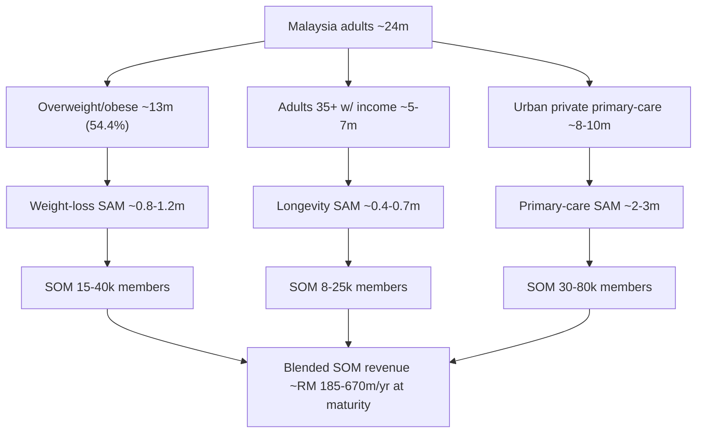

# Malaysia Digital-Health Market Intelligence — Master Sizing & Structure

**Last updated: July 2026**

> Malaysia is a 34.2-million-person, upper-middle-income market ($12.6k GDP/capita) where more than half of adults are overweight or obese, one in six has diabetes, and 76% of private health spending is paid out-of-pocket by households. Against this metabolic-disease backdrop, the country combines near-universal smartphone/WhatsApp penetration (97% internet, 90%+ WhatsApp monthly reach), a strained two-tier health system (public sector short ~11,000 specialists), fast-rising private health inflation (~15% medical trend), and a supportive reform agenda (Health White Paper 2023, MHTC medical-tourism push). Third-party estimates for Malaysia's telemedicine/digital-health market cluster between **USD 0.6bn and USD 1.85bn in 2023–2024**, forecast to grow at **~16–20% CAGR to 2030** (reaching USD 4–6.5bn depending on scope). This document sizes the opportunity, reconciles conflicting estimates, and builds an explicit TAM→SAM→SOM funnel for Welltech's medical-weight-loss, longevity/preventive, and telehealth-first primary-care segments. Where sources disagree, ranges are shown.

**Sibling documents:** [malaysia-regulations.md](malaysia-regulations.md) · [malaysia-weight-loss-market.md](malaysia-weight-loss-market.md) · [malaysia-telehealth.md](malaysia-telehealth.md) · [malaysia-competitor-landscape.md](../20-competitor-dossiers/competitor-comparison.md) · [singapore-market-intelligence.md](singapore-market-intelligence.md) · [hong-kong-market-intelligence.md](hong-kong-market-intelligence.md)

---

## 1. Macro & demographic context

### 1.1 Population and structure

Malaysia's total population reached an estimated **34.2 million in 2025** (34.1m in 2024), growing at just **0.5% p.a.** — a decelerating rate that reflects falling fertility and slowing non-citizen inflows.[^1][^2] Citizens number 30.8m (90.1%); non-citizens 3.4m (9.9%).[^1] DOSM projects the population to **peak at ~42 million around 2059** before declining, with the Chinese share shrinking below 15%.[^3]

| Indicator | Value | Year | Source |
|---|---|---|---|
| Total population | 34.2 million | 2025 | DOSM[^1] |
| Population growth rate | 0.5% p.a. | 2025 | DOSM[^1] |
| Median age | 31.3 years | 2025 | DOSM[^1] |
| Working age (15–64) | 70.4% | 2025 | DOSM[^1] |
| Aged 65+ | 8.0% (≈2.7m) | 2025 | DOSM[^1] |
| Aged 0–14 | 21.6% | 2025 | DOSM[^1] |
| Life expectancy at birth | 75.2 yrs (M 73.0 / F 77.8) | 2024 | DOSM[^4] |
| Urbanisation | ~78–79% | 2024 | World Bank / Statista[^5] |
| GDP per capita | ~USD 11,900–12,600 | 2024 | IMF / World Bank[^6] |
| Real GDP growth | 5.2% (2025), ~6.3% Q4-2025 YoY | 2025 | DOSM / Trading Economics[^6] |

### 1.2 Ageing — a fast, compressed transition

Malaysia becomes an **"ageing nation" in 2030**, when the 60+ cohort crosses 15% of the population (7.9% in 2010 → projected 15.3% by 2030).[^7] The 65+ population is projected to **more than double from 2.1m (2020) to 4.8m (2030)**.[^7] The Finance Ministry places the "aged nation" milestone (14% aged 65+) at **2048**; DOSM notes Malaysia is transitioning from ageing to aged in ~24 years — a pace comparable to Japan's, but at a far lower income level.[^7][^8] This compressed transition front-loads chronic-disease burden and preventive-care demand into the next decade.

### 1.3 Ethnicity, religion and the halal dimension

In 2024, Bumiputera were **70.4%** of the 30.7m citizen population (Malays 58.1%, other Bumiputera 12.3%), Chinese **22.4%**, Indians **6.5%**.[^9] Roughly **63.5–65% of the population is Muslim**, followed by Buddhism (~19%) and Christianity (~9%).[^10] Islam and JAKIM halal certification are central to consumer trust — halal status of pharmaceuticals, supplements, cosmetics and logistics is formally certified, and Malaysia has led the Global Muslim Travel Index since 2015.[^10] **Implication:** GLP-1 formulations, supplements and meal-replacement products marketed by Welltech should verify halal/porcine-gelatin status; Ramadan fasting cycles materially affect weight-management program design and adherence.

### 1.4 Geography of demand — Klang Valley, Penang, Johor

Demand concentrates in three economic corridors:

| Region | Population / note | Median household income (2022) | Relevance |
|---|---|---|---|
| Greater Kuala Lumpur / Klang Valley | ~8.8 million (2024) | KL RM10,234; Selangor RM9,983 | Highest income, private-care density, digital adoption |
| Penang | ~1.7m island+mainland | RM6,502 | Medical-tourism hub, diagnostics cluster |
| Johor (esp. Johor Bahru) | ~4m state | RM6,879 | JB–Singapore corridor, cross-border care, JS-SEZ growth |

National **median household income was RM6,338 (2022); mean RM8,479**.[^11] Only KL, Putrajaya, Selangor, Labuan, Johor and Penang exceed the national median.[^11] Greater KL grew ~2.25% in 2024 and faces urban-planning pressure.[^12] **Implication:** Welltech's beachhead is the Klang Valley affluent/mass-affluent segment — the concentration of income, English proficiency, private-insurance coverage and specialist scarcity is highest here.

---

## 2. Disease burden — the metabolic-disease engine

Malaysia's disease profile is the single strongest structural driver of the Welltech thesis. The **National Health & Morbidity Survey (NHMS) 2023** — the MOH/Institute for Public Health's flagship population survey — found the top four adult NCDs to be obesity, high cholesterol, hypertension and diabetes.[^13][^14]

### 2.1 Obesity and overweight

| Metric | NHMS 2023 | Trend | Source |
|---|---|---|---|
| Overweight + obese (BMI ≥25, WHO cutoff) | **54.4%** of adults | ↑ from 44.5% (2011) | NHMS 2023[^13][^14] |
| Overweight + obese (Asian cutoff, ≥23) | **~70.1%** | — | NHMS 2023[^13] |
| Abdominal obesity (WC ≥90cm M / ≥80cm F) | **54.5%** | ↑ from 45.4% (2011) | NHMS 2023[^13] |

Malaysia is among the most obese populations in Southeast Asia; over half of adults exceed the WHO overweight threshold and ~70% exceed the stricter Asian threshold used clinically in Malaysia.[^13] The 18–35 age band is both the largest and fastest-growing weight-management consumer segment.[^15]

### 2.2 Diabetes, hypertension, cholesterol

| Condition | Prevalence (NHMS 2023) | Known vs undiagnosed | Trend | Source |
|---|---|---|---|---|
| Diabetes | **15.6%** | 9.7% known / 5.9% undiagnosed | 11.2% (2011) → 18.3% (2019) → 15.6% (2023) | NHMS 2023[^16] |
| Hypertension | **29.2%** | 17.3% known / 11.9% undiagnosed | Plateau since 2011 (~29%) | NHMS 2023[^16] |
| Hypercholesterolemia | **33.3%** | 15.2% known / 18.1% undiagnosed | 35.1% (2011) → 33.3% (2023) | NHMS 2023[^16] |

Over **two million adults live with all three of diabetes, hypertension and high cholesterol simultaneously**; 5.1% of adults carry that triple burden, and 1.2% have diabetes+hypertension+obesity.[^14][^16] The large **undiagnosed fractions** (e.g. 5.9pp of the diabetes total, 18.1pp of the cholesterol total) represent a screening-and-activation opportunity directly addressable by digital-first care.

### 2.3 Mental health

NHMS 2023 recorded adult **depression at 4.6% (~1 million people aged 15+), doubling from 2.3% in 2019**; prevalence peaks among ages 16–19 (7.9%) and 20–29 (7.6%).[^17][^18] Childhood (5–15) mental-health problems rose to 16.5% (from 7.9% in 2019).[^18] Mental and cardiometabolic comorbidity underpins the coaching-led model pioneered locally by Naluri.[^19]

### 2.4 Economic burden of NCDs and obesity

| Measure | Value | Year | Source |
|---|---|---|---|
| Total economic cost of NCDs | **RM 64.2 billion (~4.2% of GDP)** | 2021 | analyst/press citing modelling[^20] |
| — Direct healthcare cost | RM 12.4 billion | 2021 | [^20] |
| — Indirect (productivity) cost | RM 51.8 billion | 2021 | [^20] |
| Annual healthcare cost — CVD, diabetes, cancer | **>RM 9.65 billion** | 2022 | WHO Malaysia[^21] |
| Productivity loss — CVD, diabetes, cancer | ~RM 9 billion/yr | 2020 | WHO Malaysia[^21] |
| Economic burden of overweight/obesity | ~USD 5.68bn (~1.6% GDP), projected to rise sharply by 2060 | 2021 est. | modelling[^20] |
| Share of health budget consumed by obesity | ~10–20% | — | [^20] |

NCDs account for ~72% of premature deaths in Malaysia.[^22] **Implication for Welltech:** the metabolic-disease burden is both a clinical mandate and a payer pain point. Employers and insurers facing 15% medical inflation (§4) have a direct financial incentive to fund preventive/weight-management interventions that reduce downstream CVD and diabetes claims — the core of a B2B2C channel.

---

## 3. Healthcare system structure

### 3.1 The two-tier split

Malaysia runs a **dual system**: a heavily-subsidised public sector (MOH facilities; near-free at point of care, RM1–5 nominal fees) and a fee-for-service private sector concentrated in urban areas. The public sector carries the majority of inpatient load but is chronically congested; the private sector serves higher-income and insured patients and dominates outpatient GP visits in cities.

| Structural fact | Detail | Source |
|---|---|---|
| Public share of total health expenditure | 52.7% | 2023 (MNHA)[^23] |
| Private share | 47.3% | 2023 (MNHA)[^23] |
| Public-sector specialist shortfall | ~10,800–11,000 specialists | 2025 (MOH data)[^24] |
| Private GPs nationwide | ~7,000 | est.[^25] |
| Private clinic:population coverage | ~1:4,228; avg 0.47km distance (urban) | [^25] |
| Public hospital wait example | 6-hour waits flagged at KL Hospital ortho clinic | 2025[^24] |

The public system is in a state of "excess demand": low price drives volume far beyond capacity, producing long waits and specialist shortages (worst in cardiothoracic surgery, forensic pathology, and **family medicine**).[^24] This structural congestion is the wedge for private telehealth-first primary care.

### 3.2 Health expenditure and financing

Malaysia's **total health expenditure reached RM 84.2 billion (4.6% of GDP) in 2023**, split 2.4% public / 2.2% private of GDP.[^23] Health spending as a share of GDP remains **below the OECD average and below the 5% public-management target** set in the Health White Paper 2023.[^26]

| Financing metric | Value | Year | Source |
|---|---|---|---|
| Total health expenditure | RM 84.2 billion | 2023 | MNHA[^23] |
| Health expenditure / GDP | 4.6% | 2023 | MNHA[^23] |
| Out-of-pocket share of current health expenditure | ~36% | 2023 | MNHA / World Bank[^23] |
| OOP as share of *private* financing | ~76% | 2023 | MNHA[^23] |
| Private insurance share of private financing | ~17% | 2023 | MNHA[^23] |

The **high out-of-pocket share (~36% of all health spending; ~76% of private financing)** is the single most important financing fact for a cash-pay, direct-to-consumer venture: Malaysians are already accustomed to paying directly for private care and medicines. The Health Minister has stated private health spending is on track to **surpass public spending** "soonest," reflecting rising private demand.[^27]

### 3.3 Insurance and takaful penetration

Overall insurance+takaful penetration was **~54% in 2023 (34% conventional insurance + 20% takaful)**; the takaful Hijrah 2027 plan targets doubling takaful penetration to 40%.[^28] But **medical & health insurance/takaful (MHIT) coverage is far shallower** than life coverage, and 2024 saw sharp repricing:

| Insurance metric | Value | Year | Source |
|---|---|---|---|
| Insurance + takaful penetration | ~54% | 2023 | BNM / RAM[^28] |
| MHIT policies with premium hikes ≤20% | 61% | 2024 | BNM[^29] |
| MHIT policies with hikes 21–40% | 30% | 2024 | BNM[^29] |
| Gross medical inflation (trend) | ~15% | 2025 | Mercer Marsh Benefits[^30] |
| Regulatory response | Mandatory ≥5% co-pay / RM500 deductible option on new individual medical products (from Sep 2024) | 2024 | BNM[^29] |

Malaysia's **~15% medical trend rate** is above the ~11% Asia-Pacific and ~10% global averages, running roughly seven times headline inflation and ~3x salary growth.[^30] **Implication:** payer cost pressure is acute. Insurers/takaful operators and employers are actively seeking cost-containment and prevention partners — a structural tailwind for Welltech's B2B2C and value-based propositions. Simultaneously, rising co-pays/deductibles push more spend directly onto consumers, expanding the cash-pay addressable base.

### 3.4 Reform direction — Health White Paper 2023

Parliament passed the **Health White Paper (HWP)** in June 2023: a 15-year reform blueprint whose pillars include strengthening **primary health care as the first point of contact (public *or private*)**, shifting toward promotive/preventive care and digital health, and gradually raising public health funding toward **5% of GDP**.[^26][^31] The HWP explicitly envisions public-private partnership and ambulatory care shifting to community settings — a policy narrative aligned with telehealth-first private primary care.

---

## 4. Digital-health market sizing — reconciling the estimates

Estimates for Malaysia's "digital health / telemedicine" market vary widely because analysts define scope differently (product+services vs services-only; B2C consultations only vs full digital-health stack). The table below reconciles the major published figures.

### 4.1 Headline market-size estimates (conflicting scopes)

| Source | Segment defined | Base value | Forecast | CAGR | Notes |
|---|---|---|---|---|---|
| Grand View Research | Malaysia telemedicine (product+services) | **USD 1,848.6m (2023)** | USD 6,515.4m (2030) | **19.7%** (2024–30) | Broadest "telemedicine" scope; product was largest 2023 segment, services fastest-growing[^32] |
| Ken Research | Malaysia digital health & telemedicine | **~USD 1.1bn** (5-yr historical) | to 2030 | n/a | Cites ~75% of providers offering telemedicine; >RM1.2bn govt digital-health investment since 2020[^33] |
| Ken Research | Malaysia e-health & virtual clinics | **~USD 620m** | to 2030 | n/a | Narrower "virtual clinics" scope[^34] |
| Ken Research | Malaysia digital therapeutics | **~USD 220m** | to 2030 | n/a | DTx-only[^35] |
| Statista | Malaysia digital health (revenue) | **USD 587.9m (2024)** | USD 834.2m (2028) | **9.14%** (2024–28) | B2C consumer-revenue definition; more conservative[^36] |
| Statista | Malaysia online doctor consultations | (subset of above) | — | — | Paid B2C web/app consults only[^36] |
| Statista | Malaysia online pharmacy | USD 41.7m (2023) | USD 70.4m (2027) | **14.0%** | User penetration ~26–27%[^37] |
| Mordor Intelligence | Malaysia healthcare digital transformation | — | — | **~18.95%** | Regional/adjacent framing[^38] |
| Grand View Research | Malaysia healthcare information system | USD 1,470.9m (2023) | USD 4,193.9m (2030) | **16.1%** | Enterprise HIS, adjacent[^39] |

**Reconciliation:** The **USD 0.6–1.85bn (2023–24)** spread reflects scope, not disagreement about direction. The narrow, consumer-revenue view (Statista, ~USD 0.6bn, ~9–14% CAGR) is the most relevant proxy for a B2C telehealth/pharmacy venture; the broad "telemedicine" view (Grand View, ~USD 1.85bn, ~20% CAGR) bundles hardware/enterprise. For Welltech planning, treat **the addressable digital-health-services market at USD 0.6–1.1bn (2023–24), growing ~14–20% p.a.** — i.e. roughly doubling by ~2029–30.

### 4.2 Growth forecast table (indicative, 2024–2030)

Blending the sources above (services-weighted, USD millions):

| Year | Conservative (Statista-style B2C) | Broad (Grand View telemedicine) |
|---|---|---|
| 2024 | ~590 | ~2,140 |
| 2025 | ~650 | ~2,560 |
| 2026 | ~715 | ~3,070 |
| 2027 | ~790 | ~3,670 |
| 2028 | ~835 | ~4,400 |
| 2029 | ~910 | ~5,270 |
| 2030 | ~1,000 | ~6,515 |

*Broad column interpolates Grand View's USD 1,848.6m (2023) → USD 6,515.4m (2030) at 19.7% CAGR; conservative column extends Statista's 2024–28 trajectory. Both are analyst reconstructions from stated endpoints and should be read as ranges, not point forecasts.*

### 4.3 Supply side — telehealth players (context)

| Player | Model | Scale / note | Source |
|---|---|---|---|
| DoctorOnCall | Teleconsult + online pharmacy + specialist booking; public-sector partnerships | Founded 2016; MAU grew 600k (Jan 2020) → 2.5m (Jan 2021); positions as Malaysia's largest digital-health platform | [^40] |
| Doctor Anywhere | Regional SG-based telehealth, MY operations | Health & wellness marketplace | [^40] |
| Naluri | Human-led + AI health coaching for cardiometabolic & mental health; B2B payer channel | Founded 2017; ~USD 15–20m raised; regional (MY/SG/TH/ID/PH) | [^19] |
| DOC2US | Teleconsult + e-prescription | Active in e-prescription SOP debate | [^41] |
| BP Healthcare (Doctor2U) | Diagnostics + app-based delivery | Premium positioning, lab-linked | [^42] |

**Implication for Welltech:** the incumbent telehealth layer is transactional (episodic consults + pharmacy fulfilment). No dominant player owns longitudinal **medical weight-loss** or **longevity/preventive** programs at scale — the whitespace Welltech targets. Naluri validates the coaching-led, payer-funded chronic-disease model but is B2B-centric and not GLP-1/clinical-prescribing-led.

---

## 5. TAM → SAM → SOM funnel for Welltech

Welltech's three priority segments in Malaysia are **(A) medical weight loss / GLP-1**, **(B) longevity & preventive medicine**, and **(C) telehealth-first private primary care**. The funnel below is built bottom-up from population and prevalence data, with stated assumptions. All figures are **analyst estimates** unless a cited market figure is used; they are planning bands, not precise forecasts.

### 5.1 Segment A — Medical weight loss / GLP-1

**Assumptions:** 34.2m population → ~24m adults (18+). Overweight/obese by WHO cutoff 54.4% ≈ 13m adults; clinically obese subset (BMI ≥30 / Asian ≥27.5 with comorbidity) ≈ 5–6m. GLP-1 (Wegovy launched; Ozempic registered for T2D, prescribed off-label for weight) is currently a niche, cash-pay, higher-cost option restricting usage to affluent segments.[^43][^44]

| Funnel stage | Definition | Estimate | Basis |
|---|---|---|---|
| **TAM** | All Malaysian adults overweight/obese (WHO cutoff) | **~13 million people** | 54.4% × 24m adults[^13] |
| **Serviceable TAM (clinical obesity)** | Adults with obesity/comorbidity clinically eligible for medical weight loss | ~5–6 million | Asian-cutoff obesity subset[^13] |
| **SAM** | Urban, mass-affluent, digitally-active, willing-to-pay adults in Klang Valley/Penang/Johor with clinical need | **~0.8–1.2 million** | ~15–20% of serviceable, income + geography filter |
| **SOM (3–5 yr)** | Realistic Welltech program enrolment at maturity | **~15,000–40,000 active members** | 1.5–3.5% penetration of SAM |
| **SOM revenue (indicative)** | At blended ~RM 400–900/mo (program + meds margin) | **~RM 100–350m/yr** | analyst estimate |

*GLP-1 drug cost alone runs several hundred to >RM1,000/month depending on molecule/dose; Welltech's monetisable layer is the wraparound program (consult, titration, coaching, labs, adherence) plus pharmacy margin.*

### 5.2 Segment B — Longevity & preventive medicine

**Assumptions:** the longevity/executive-screening market is nascent but growing, driven by ageing, high NCD burden and out-of-pocket willingness (most predictive/genomic testing is self-paid).[^22][^45] Executive health screening is already a mainstream affluent purchase (private hospitals, Pathlab/BP/Innoquest); longevity screening (epigenetic age, WGS, microbiome) is early-adopter.

| Funnel stage | Definition | Estimate | Basis |
|---|---|---|---|
| **TAM** | Malaysian adults 35+ with income for private preventive care | ~5–7 million | Age + income filter |
| **SAM** | Affluent urban 35–65 buying executive/longevity screening + preventive programs | **~0.4–0.7 million** | Klang Valley/Penang/Johor high-income |
| **SOM (3–5 yr)** | Welltech longevity/preventive members | **~8,000–25,000** | 2–4% of SAM |
| **SOM revenue (indicative)** | At ~RM 2,000–6,000/yr (screening + membership + repeat labs) | **~RM 25–120m/yr** | analyst estimate |

Adjacent anchor: Malaysia diagnostic-labs market **USD 1.28bn (2024) → USD 2.01bn (2030), 7.8% CAGR**; independent labs (Innoquest, BP, Pathlab) hold ~40% share.[^46] Supplements/nutraceuticals add **~USD 0.6–1.2bn**.[^47]

### 5.3 Segment C — Telehealth-first private primary care

**Assumptions:** private primary care is a large, cash-and-insurance market (~7,000 private GPs; urban clinic density high). Telehealth-first primary care converts episodic in-person GP demand plus underserved chronic-care follow-up into subscription/virtual-led relationships.

| Funnel stage | Definition | Estimate | Basis |
|---|---|---|---|
| **TAM** | Urban privately-served primary-care users | ~8–10 million | Urban insured/cash-pay adults |
| **SAM** | Digitally-active, WhatsApp-first urban households valuing convenience/continuity | **~2–3 million** | Klang Valley + Penang + JB |
| **SOM (3–5 yr)** | Welltech telehealth-first primary-care members | **~30,000–80,000** | 1.5–3% of SAM |
| **SOM revenue (indicative)** | Blended consult + subscription + pharmacy/labs | **~RM 60–200m/yr** | analyst estimate |

### 5.4 Combined Welltech Malaysia opportunity

**Blended Welltech Malaysia SOM at maturity: ~RM 185–670m/yr** across the three segments (analyst estimate; overlapping members would net this down). This sits credibly inside a total digital-health services market of ~USD 0.6–1.1bn (RM 2.8–5.2bn) growing double-digit — i.e. Welltech would be pursuing a low-single-digit to high-single-digit share of a fast-growing niche-adjacent market, concentrated in the highest-value metabolic/preventive segments.

---

## 6. Adjacent & enabling markets

| Adjacent market | Size / metric | Year | CAGR | Source |
|---|---|---|---|---|
| Malaysia hospital market (public+private) | USD 12.1bn (2025) → USD 20.1bn (2035) | 2025 | 5.2% | Expert/TechSci[^48] |
| Diagnostic / clinical labs | USD 1.28bn (2024) → USD 2.01bn (2030) | 2024 | 7.8% | TechSci/GlobeNewswire[^46] |
| Nutraceuticals / dietary supplements | ~USD 0.6–1.2bn | 2023–24 | ~5.2% | Maximize / Ken[^47] |
| Online pharmacy | USD 41.7m (2023) → USD 70.4m (2027) | 2023 | 14.0% | Statista[^37] |
| Fitness trackers / wearables | → USD 275.6m (2029) | 2024 | 8.05% | Statista[^49] |
| Digital therapeutics | ~USD 220m | — | — | Ken Research[^35] |
| Medical tourism (private hospitals) | RM 2.72bn (1.6m travellers, 2024); target RM7bn by 2030 | 2024 | — | MHTC[^50] |

**Wearables adoption:** only ~30% of Malaysians owned a smartwatch as of 2022; 43% owned no wearable — indicating headroom for device-linked remote monitoring but also that device ubiquity cannot be assumed for RPM-dependent models.[^49]

**Medical tourism:** private hospitals drew 1.6–1.84m international patients generating RM 2.7–3.34bn (2024–25), targeting RM7bn by 2030, with an estimated 4x economic multiplier (RM10–12bn/yr).[^48][^50] Cross-border (esp. Indonesia, Singapore corridor) preventive/longevity demand is a real adjacency for Welltech, especially in Penang and Johor.

---

## 7. Digital infrastructure — smartphone, internet, WhatsApp, payments

Malaysia's digital-adoption base is the enabling condition for a WhatsApp-first care model.

| Metric | Value | Year | Source |
|---|---|---|---|
| Internet users / penetration | 33.6 million / **97.4%** | 2024 | DataReportal / MCMC[^51] |
| Smartphone penetration | **~94.8%** | 2021 | MCMC HPUS[^52] |
| WhatsApp monthly reach (16–64) | **90.7%** — #1 app | 2024 | Meltwater/DataReportal[^51] |
| WhatsApp session intensity | 852 monthly sessions (vs TikTok 368) | 2024 | [^51] |
| E-payment transactions/capita | 409 (2024) vs 343 (2023), +19% | 2024 | BNM[^53] |
| DuitNow QR transactions | 870m (2024), 2.6m acceptance points | 2024 | BNM[^53] |
| Retail e-payment value | RM 698.1bn (+17%) | 2024 | BNM/Bernama[^53] |

**Implication for Welltech:** WhatsApp is not merely a channel but the default communication substrate — 90%+ monthly reach and the highest session intensity of any app make a **WhatsApp-first care workflow** the lowest-friction acquisition and engagement mechanism in this market. Mature DuitNow/e-wallet rails (409 e-payments/capita) enable frictionless cash-pay subscription and one-tap pharmacy checkout without card infrastructure.

---

## 8. Regulatory context (summary; see [malaysia-regulations.md](malaysia-regulations.md))

- **Telemedicine Act 1997** exists but key operational provisions have historically been un-gazetted; teleconsultation operates under MMC guidance and the broader legal framework — a known ambiguity being addressed under HWP-era reform.[^41]
- **Poisons Act 1952** governs prescription and dispensing; the statutory definition of a "prescription" as a *written order* creates a legal gap for e-prescriptions that the MMA has flagged, calling for audits of e-prescription pharmacy practice.[^41]
- **GLP-1 status:** Wegovy (semaglutide 2.4mg) registered/launched for obesity; Ozempic registered for T2D and prescribed off-label for weight management under BMI criteria; Saxenda (liraglutide) available.[^43][^44] Prescribing must be physician-led.
- **BNM medical-insurance reforms:** mandatory co-pay/deductible options and repricing scrutiny reshape payer economics (§3.3).[^29]

**Implication:** Welltech must design compliant physician-led prescribing and e-prescription/dispensing workflows; regulatory ambiguity is a moat for well-governed operators and a risk for cut-corner competitors.

---

## 9. Market structure — Porter's Five Forces (Malaysian digital private healthcare)

| Force | Assessment | Rating | Key drivers |
|---|---|---|---|
| **Threat of new entrants** | Moderate–High | ⚠️⚠️ | Low tech barriers and cheap patient acquisition via WhatsApp/social; but clinical licensing, physician networks, pharmacy compliance, insurer relationships and brand trust are real barriers. Regional players (Doctor Anywhere) and hospital groups (IHH, KPJ, Sunway) can enter downward. |
| **Bargaining power of buyers (patients)** | Moderate | ⚠️ | High OOP culture means patients pay directly and compare prices; low switching costs for episodic care. But chronic/longitudinal programs (weight loss, longevity) create stickiness and reduce buyer power over time. |
| **Bargaining power of suppliers** | Moderate–High | ⚠️⚠️ | Scarce specialists/family physicians (public shortfall ~11k) raise clinician cost/leverage; GLP-1 supply and pricing controlled by originator pharma (Novo/Lilly); lab capacity concentrated among IHH-linked and independent labs. |
| **Threat of substitutes** | High | ⚠️⚠️⚠️ | In-person GPs (dense, cheap, trusted), public system (near-free), pharmacies dispensing OTC/supplements, gyms/wellness, traditional & halal remedies, and DIY supplement/meal-replacement products all substitute for medical weight loss and preventive care. |
| **Competitive rivalry** | Moderate (today) → rising | ⚠️⚠️ | Incumbent telehealth (DoctorOnCall, DOC2US, Doctor Anywhere) is transactional; Naluri owns coaching-led chronic care via B2B. No dominant clinical weight-loss/longevity platform yet — genuine whitespace, but rivalry will intensify as GLP-1 demand attracts entrants. |

**Net structural read:** attractive whitespace in longitudinal metabolic/preventive care, defended by clinical governance, payer integration and WhatsApp-native engagement — but exposed to strong substitutes (cheap in-person GPs, public system) and supplier leverage (specialists, GLP-1 pharma). Winning requires **outcomes + convenience + trust**, not price.

---

## 10. Key implications for Welltech (synthesis)

1. **Demand is structurally validated.** 54.4% overweight/obese, 15.6% diabetic, ~1m depressed, ~72% of premature deaths from NCDs, and a metabolic-disease economic cost of ~RM64bn/yr create a durable clinical mandate for medical weight loss and preventive care.
2. **Cash-pay is the default.** ~36% OOP overall and ~76% of private financing paid out-of-pocket means a direct-to-consumer subscription model fits ingrained payment behaviour; rising co-pays/deductibles enlarge the cash-pay base.
3. **Payers are motivated partners.** ~15% medical trend (7x inflation) makes employers/insurers/takaful active buyers of prevention — a B2B2C channel Naluri has proven exists but not saturated for GLP-1/clinical weight loss.
4. **WhatsApp-first is the right architecture.** 90%+ monthly WhatsApp reach + mature DuitNow rails make WhatsApp-native acquisition, engagement and payment the lowest-friction go-to-market in ASEAN.
5. **Beachhead = Klang Valley affluent/mass-affluent.** Highest income, insurance coverage, specialist scarcity and digital adoption; expand to Penang (diagnostics/medical-tourism) and Johor (SG corridor).
6. **Whitespace is longitudinal, not episodic.** Incumbents are transactional; no one owns scaled clinical weight-loss + longevity + telehealth-first primary care as an integrated, outcomes-led membership. That is the defensible position.
7. **Regulatory rigor is a moat.** Physician-led prescribing, compliant e-prescription/dispensing and halal-verified products differentiate a governed operator from grey-market GLP-1 sellers.
8. **Model realistic scale conservatively.** Blended SOM ~RM185–670m/yr at maturity implies focusing capital on the highest-value metabolic/preventive members rather than chasing low-margin episodic teleconsults.

---

## References

[^1]: Department of Statistics Malaysia (DOSM), "Current Population Estimates, 2025", https://www.dosm.gov.my/portal-main/release-content/current-population-estimates-2025 (accessed July 2026).
[^2]: DOSM / OpenDOSM, "The Population of Malaysia — Population Dashboard", https://open.dosm.gov.my/dashboard/population (accessed July 2026).
[^3]: Malay Mail, "DOSM sees Malaysia population peaking at 42 million in 2059…", 11 July 2025, https://www.malaymail.com/news/malaysia/2025/07/11/dosm-sees-malaysia-population-peaking-at-42m-in-2059-chinese-community-shrinking-under-15pc-gender-imbalance-worsening/183589 (accessed July 2026).
[^4]: DOSM, "Abridged Life Tables Malaysia, 2024" (life expectancy 75.2 yrs), https://www.dosm.gov.my/portal-main/release-content/abridged-life-tables-malaysia-2024; Bernama, https://bernama.com/en/news.php?id=2346114 (accessed July 2026).
[^5]: World Bank, "Urban population (% of total) — Malaysia", https://data.worldbank.org/indicator/SP.URB.TOTL.IN.ZS?locations=MY; Statista, "Urbanization in Malaysia 2024", https://www.statista.com/statistics/455880/urbanization-in-malaysia/ (accessed July 2026).
[^6]: IMF DataMapper — Malaysia, https://www.imf.org/external/datamapper/profile/MYS; World Bank "GDP per capita (current US$) — Malaysia", https://data.worldbank.org/indicator/NY.GDP.PCAP.CD?locations=MY; DOSM GDP dashboard, https://open.dosm.gov.my/dashboard/gdp (accessed July 2026).
[^7]: Malay Mail, "Malaysia set to become ageing nation by 2030…", 31 July 2024, https://www.malaymail.com/news/malaysia/2024/07/31/malaysia-set-to-become-ageing-nation-by-2030-perak-leads-senior-surge-dosm-report-says/145577; Malaysia Population Research Hub (LPPKN), "Ageing Phenomenon: Malaysia Towards 2030", https://mprh.lppkn.gov.my/ageing-phenomenon-malaysia-towards-2030/ (accessed July 2026).
[^8]: Ministry of Finance Malaysia, "Malaysia To Become Aged Nation By 2048 — Amir Hamzah", https://mof.gov.my/portal/en/news/press-citations/malaysia-to-become-aged-nation-by-2048-amir-hamzah (accessed July 2026).
[^9]: DOSM, "Demographic Statistics, Third Quarter 2024", https://www.dosm.gov.my/portal-main/release-content/demographic-statistics-third-quarter-2024; Statista, "Malaysia population by ethnicity 2020–2025", https://www.statista.com/statistics/1017372/malaysia-breakdown-of-population-by-ethnicity/ (accessed July 2026).
[^10]: Wikipedia, "Islam in Malaysia", https://en.wikipedia.org/wiki/Islam_in_Malaysia; JAKIM / Salaam Gateway, "Halal Malaysia at 50", https://salaamgateway.com/story/halal-malaysia-at-50-a-legacy-of-trust (accessed July 2026).
[^11]: DOSM, "Household Income Survey Report 2022 (Malaysia & States)", https://www.dosm.gov.my/portal-main/release-content/household-income-survey-report--malaysia--states; The Edge Malaysia, "Selangor, Penang and Johor's median income exceeds national level", https://theedgemalaysia.com/node/676472 (accessed July 2026).
[^12]: The Star / Malay Mail, "Greater Kuala Lumpur's population reaches 8.8 million", 6 Aug 2024, https://www.thestar.com.my/news/nation/2024/08/06/kuala-lumpur039s-population-to-reach-88-million-in-2024 (accessed July 2026).
[^13]: CodeBlue (Galen Centre), "NHMS 2023: Over Half Of Malaysian Adults Overweight Or Obese", May 2024, https://codeblue.galencentre.org/2024/05/nhms-2023-over-half-of-malaysian-adults-overweight-or-obese/ (accessed July 2026).
[^14]: CodeBlue, "Over Two Million Adults In Malaysia Live With Three NCDs: NHMS 2023", May 2024, https://codeblue.galencentre.org/2024/05/over-two-million-adults-in-malaysia-live-with-three-ncds-nhms-2023/ (accessed July 2026).
[^15]: Data Bridge Market Research, "Malaysia Weight Loss and Obesity Management Market", https://www.databridgemarketresearch.com/nucleus/malaysia-weight-loss-and-obesity-management-market (accessed July 2026).
[^16]: Nature Scientific Reports, "Conducting the National Health and Morbidity Survey 2023 in Malaysia…", 2025, https://www.nature.com/articles/s41598-025-08311-9; NHMS 2023 Fact Sheet (Institute for Public Health / MOH), https://iku.nih.gov.my/images/nhms2023/fact-sheet-nhms-2023.pdf (accessed July 2026).
[^17]: The Star, "Significant increase in depression among Malaysians since 2019, NHMS 2023 reveals", 16 May 2024, https://www.thestar.com.my/news/nation/2024/05/16/significant-increase-in-depression-among-malaysians-since-2019-nhms-2023-reveals (accessed July 2026).
[^18]: CodeBlue, "NHMS 2023: A Million People Aged Above 15 In Malaysia Suffer From Depression", June 2024, https://codeblue.galencentre.org/2024/06/nhms-2023-a-million-people-aged-above-15-in-malaysia-suffer-from-depression/ (accessed July 2026).
[^19]: Naluri / Digital News Asia, "Malaysian startup Naluri raises US$5mil in Series A round", https://www.digitalnewsasia.com/startups/malaysian-startup-naluri-raises-us5mil-series-round; Tracxn Naluri profile, https://tracxn.com/d/companies/naluri (accessed July 2026).
[^20]: Sinar Daily, "Malaysia's quiet health crisis: Why what's on your plate is costing the country billions", https://www.sinardaily.my/article/735681/focus/national/malaysias-quiet-health-crisis-why-whats-on-your-plate-is-costing-the-country-billions; The Malaysian Reserve, "The fiscal art of managing obesity", 21 Oct 2024, https://themalaysianreserve.com/2024/10/21/the-fiscal-art-of-managing-obesity/ (accessed July 2026).
[^21]: WHO Malaysia, "The annual health-care cost of cardiovascular diseases, diabetes and cancer in Malaysia exceeds RM 9.65 billion", 9 Aug 2022, https://www.who.int/malaysia/news/detail/09-08-2022-the-annual-health-care-cost-of-cardiovascular-diseases--diabetes-and-cancer-in-malaysia-exceeds-rm-9.65-billion (accessed July 2026).
[^22]: Longevity Clinic Asia / The Star, "Executive vs Longevity Health Screening" and "Longevity Clinic Malaysia recognised by Malaysian Book of Records", Oct 2025, https://www.thestar.com.my/aseanplus/aseanplus-news/2025/10/24/longevity-clinic-malaysia-recognised-by-the-malaysian-book-of-records (accessed July 2026).
[^23]: Malaysia National Health Accounts (MNHA), "National Health Expenditure 2011–2023", MOH Malaysia, https://www.moh.gov.my/moh/resources/Penerbitan/Penerbitan%20Utama/MNHA/MNHA_HEALTH_EXPENDITURE_2011-2023_(MNHA_Steering_Meeting_2024).pdf; World Bank OOP indicator, https://data.worldbank.org/indicator/SH.XPD.OOPC.CH.ZS?locations=MY (accessed July 2026).
[^24]: CodeBlue, "Public Sector Short Of Nearly 11,000 Specialist Doctors: MOH Data", July 2025, https://codeblue.galencentre.org/2025/07/public-sector-short-of-nearly-11000-specialist-doctors-moh-data/; Penang Institute, "Cut the Queue", https://penanginstitute.org/publications/issues/cut-the-queue-a-basket-of-solutions-for-malaysian-hospitals/ (accessed July 2026).
[^25]: PMC, "Comparative performance of public and private primary care" and "Trends in the Cost of Medicines, Consultation Fees…", https://pmc.ncbi.nlm.nih.gov/articles/PMC9586414/; https://pmc.ncbi.nlm.nih.gov/articles/PMC10284298/ (accessed July 2026).
[^26]: MOH Malaysia, "Health White Paper for Malaysia" (Command Paper No. 29 of 2023), https://www.moh.gov.my/moh/resources/Penerbitan/Penerbitan%20Utama/Kertas%20Putih%20Kesihatan/Kertas_Putih_Kesihatan_(ENG)_compressed.pdf (accessed July 2026).
[^27]: CodeBlue, "Malaysia's Private Health Care Spending To Surpass Public 'Soonest': Dzulkefly", Jan 2026, https://codeblue.galencentre.org/2026/01/malaysias-private-health-care-spending-to-surpass-public-soonest-dzulkefly/ (accessed July 2026).
[^28]: RAM Ratings, "Malaysian insurance and takaful sector: Stable outlook", https://www.ram.com.my/pressrelease/?prviewid=7060; Bank Negara Malaysia, "Insurance & Takaful", https://www.bnm.gov.my/insurance-takaful (accessed July 2026).
[^29]: CodeBlue, "Majority Health Insurance Premiums Rose Up To 20% This Year: Bank Negara", Dec 2024, https://codeblue.galencentre.org/2024/12/majority-health-insurance-premiums-rose-up-to-20-pc-this-year-bank-negara/; Skrine, "BNM Policy Document on Medical and Health Insurance/Takaful Business", March 2024, https://www.skrine.com/insights/alerts/march-2024/bank-negara-malaysia-issues-policy-document-on-med (accessed July 2026).
[^30]: Mercer Marsh Benefits, "Health Trends 2026 / 2025" (Malaysia medical trend ~15%), https://www.marsh.com/my/services/employee-health-benefits/insights/rising-medical-costs-asia-balance-benefits-employee-needs.html; Mercer Asia "Health on Demand 2025", https://www.mercer.com/insights/total-rewards/employee-benefits-optimization/mmb-health-trends/ (accessed July 2026).
[^31]: Wen & Co, "Malaysia Health White Paper 2023: Path to Health System Reform through PPP", https://www.wenlaw.co/malaysia-health-white-paper-2023-malaysias-path-to-health-system-reform-through-public-private-partnerships/ (accessed July 2026).
[^32]: Grand View Research, "Malaysia Telemedicine Market Size & Outlook, 2025–2030", https://www.grandviewresearch.com/horizon/outlook/telemedicine-market/malaysia (accessed July 2026).
[^33]: Ken Research, "Malaysia Digital Health and Telemedicine Market" and OpenPR release "reached USD 1.1 billion", https://www.kenresearch.com/malaysia-digital-health-and-telemedicine-market; https://www.openpr.com/news/4526700/ken-research-stated-malaysia-s-digital-health-and-telemedicine (accessed July 2026).
[^34]: Ken Research, "Malaysia E-Health & Virtual Clinics Market | 2019–2030", https://www.kenresearch.com/malaysia-e-health-virtual-clinics-market (accessed July 2026).
[^35]: Ken Research, "Malaysia Digital Therapeutics Market | 2019–2030", https://www.kenresearch.com/malaysia-digital-therapeutics-market (accessed July 2026).
[^36]: Statista, "Digital Health — Malaysia | Market Forecast" and "Online Doctor Consultations — Malaysia", https://www.statista.com/outlook/hmo/digital-health/malaysia; https://www.statista.com/outlook/hmo/digital-health/online-doctor-consultations/malaysia (accessed July 2026).
[^37]: Statista, "Online Pharmacy — Malaysia", https://www.statista.com/outlook/dmo/digital-health/ehealth/online-pharmacy/malaysia (accessed July 2026).
[^38]: Mordor Intelligence, "Malaysia Digital Transformation Market" / "Digital Health Market", https://www.mordorintelligence.com/industry-reports/malaysia-digital-transformation-market (accessed July 2026).
[^39]: Grand View Research, "Malaysia Healthcare Information System Market Size & Outlook, 2030", https://www.grandviewresearch.com/horizon/outlook/healthcare-information-system-market/malaysia (accessed July 2026).
[^40]: DoctorOnCall — Wikipedia and Tracxn profiles, https://en.wikipedia.org/wiki/DoctorOnCall; https://tracxn.com/d/companies/doctoroncall; Doctor Anywhere Malaysia, https://www.doctoranywhere.my/ (accessed July 2026).
[^41]: CodeBlue, "Inspect Pharmacies Using E-Prescription Services — MMA", Jan 2025, https://codeblue.galencentre.org/2025/01/inspect-pharmacies-using-e-prescription-services-malaysian-medical-association/; Pharmaceutical Services Programme MOH, "Poisons Act 1952 and Regulations", https://pharmacy.moh.gov.my/en/documents/poisons-act-1952-and-regulations.html (accessed July 2026).
[^42]: The Walao Eh, "Health Screening Cost Malaysia 2026 (BP vs Pathlab vs Gov)", https://thewalaoeh.com/health-screening-cost-malaysia-2026/; Pathlab Malaysia, https://www.pathlab.com.my/ (accessed July 2026).
[^43]: Nexus Clinic, "All About GLP-1 Weight Loss Medications in Malaysia: Ozempic vs Wegovy vs Saxenda", https://www.nexus-clinic.com/blogs/all-about-glp-1-weight-loss-medications-in-malaysia-ozempic-vs-wegovy-vs-saxenda/ (accessed July 2026).
[^44]: Grand View Research, "GLP-1 Agonists Weight Loss Drugs Market Size Report, 2030", https://www.grandviewresearch.com/industry-analysis/glp-1-agonists-weight-loss-drugs-market-report (accessed July 2026).
[^45]: Hisential, "Longevity Screening & Advanced Medical Check-Up in KL", https://hisential.com/longevity-screening; MedConsultAsia, "Executive Health Screening: A Comprehensive 2026 Guide", https://www.medconsultasia.com/uncategorized/executive-health-screening-a-comprehensive-2026-guide-for-professionals/ (accessed July 2026).
[^46]: TechSci Research, "Malaysia Diagnostic Labs Market by Size, Share and Forecast 2030F", https://www.techsciresearch.com/report/malaysia-diagnostic-labs-market/10705.html; GlobeNewswire, "Opportunities in Malaysia's $2+ Billion Diagnostic Labs Market, 2025–2030", 7 Feb 2025, https://www.globenewswire.com/news-release/2025/02/07/3022696/0/en/Opportunities-in-Malaysia-s-2-Billion-Diagnostic-Labs-Market.html (accessed July 2026).
[^47]: Maximize Market Research, "Malaysia Nutritional Supplements Market (2024–2030)", https://www.maximizemarketresearch.com/market-report/malaysia-nutritional-supplements-market/224986/; Ken Research, "Malaysia Nutraceuticals & Dietary Supplements Market", https://www.kenresearch.com/malaysia-nutraceuticals-dietary-supplements-market (accessed July 2026).
[^48]: TechSci/Expert Market Research, "Malaysia Hospital Market Size, Share & Growth"; Malay Mail, "Private hospitals drive Malaysia's RM7b medical tourism ambition", 19 Apr 2026, https://www.malaymail.com/news/malaysia/2026/04/19/prescribing-growth-private-hospitals-drive-malaysias-rm7b-medical-tourism-ambition/216438 (accessed July 2026).
[^49]: Statista, "Fitness Trackers — Malaysia" and "Malaysia: ownership of wearable tech 2022", https://www.statista.com/outlook/hmo/digital-health/digital-fitness-well-being/fitness-trackers/malaysia; https://www.statista.com/statistics/1053038/malaysia-ownership-of-wearable-tech/ (accessed July 2026).
[^50]: Malaysia Healthcare Travel Council (MHTC), "Statistics", https://www.mhtc.org.my/statistics/; Statista, "Malaysia: revenue from medical tourism 2024", https://www.statista.com/statistics/1013817/medical-tourism-revenue-malaysia/ (accessed July 2026).
[^51]: DataReportal, "Digital 2024: Malaysia", https://datareportal.com/reports/digital-2024-malaysia; Meltwater, "Social Media Statistics for Malaysia 2024", https://www.meltwater.com/en/blog/social-media-statistics-malaysia (accessed July 2026).
[^52]: MCMC, "Hand Phone Users Survey 2021", https://www.mcmc.gov.my/skmmgovmy/media/General/pdf2/FULL-REPORT-HPUS-2021.pdf; MCMC Internet Users Survey, https://www.mcmc.gov.my/en/resources/statistics/internet-users-survey (accessed July 2026).
[^53]: Bernama, "Selected Retail E-Payment Transactions Reach RM698.1 Bln In 2024", https://www.bernama.com/en/news.php?id=2405609; TNGlobal, "Malaysia's e-payments transactions continue to rise in 2024", 24 Mar 2025, https://technode.global/2025/03/24/malaysias-e-payments-transactions-continue-to-rise-in-2024/ (accessed July 2026).
