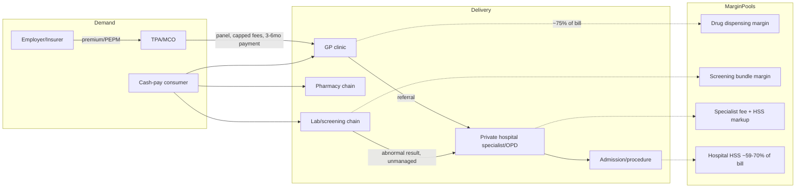

# Malaysia Private Healthcare: Structural Analysis of the Sector Welltech Will Sell Into

**Abstract.** Malaysia's private healthcare sector is a ~USD 12 billion hospital-centred market growing 5–7% a year in volume terms but 15–16% a year in price terms — the third-highest medical inflation in the region. That gap is the sector's defining tension: private hospital groups (IHH, KPJ, Sunway, Columbia Asia/Asia OneHealthcare) are posting record revenues and adding thousands of beds, while the payer side (insurers, takaful operators, employers, and 36%-out-of-pocket households) is in open revolt — a 2024–26 premium repricing crisis has forced Bank Negara Malaysia into interim price controls, a "RESET" reform agenda, DRG-based provider payment from 2026–27, and a state-run "premium economy" alternative (Rakan KKM). Beneath the hospitals sits a structurally broken primary care layer: ~10,000 private GP clinics whose consultation fees were frozen at RM10–35 for three decades (raised to a RM10–80 band only in Budget 2026), whose economics depend on drug-dispensing margins, and whose panel volumes are controlled by ~30 fee-extracting third-party administrators. This document maps sector size, hospital-group financials, GP and panel-clinic economics, screening/diagnostics pricing, medical tourism, and corporate purchasing — and identifies where a digital-first, WhatsApp-native, concierge and weight-loss/longevity-focused entrant can capture margin that incumbents are structurally unable to defend.

Last updated: July 2026.

Related documents: [Malaysia telehealth deep dive](malaysia-telehealth.md) · [Competitor dossiers](../20-competitor-dossiers/) · [Welltech blueprint](../70-welltech-blueprint/) · [Research standards](../RESEARCH-STANDARDS.md)

**Bottom line (ten findings that matter most):**

1. Medical inflation of 15–16%/yr vs ~2% CPI is the sector's master variable — it created the insurance repricing crisis, the regulatory RESET, and the opening for fixed-price digital care.[^9]
2. Private health spending is about to overtake public spending for the first time in Malaysian history.[^6]
3. Hospital bills are ~59–70% "hospital supplies and services" markups, not doctors' fees — and DRG payment (2026–27) attacks exactly that line.[^14][^23]
4. The GP layer (~9,800 clinics) is fee-capped, TPA-squeezed, and dependent on drug margins now under legal and regulatory attack — making GPs recruitable and their model disruptable.[^48][^53][^61]
5. ~60% of GP volume flows through ~30 unregulated TPAs that extract fees from both sides and delay payment 3–6 months — do not build on those rails.[^53][^62][^63]
6. The consumer price ladder has two empty rungs: nothing between the RM131 GP visit and RM526 specialist visit, and nothing between the RM300 screen and the RM9,300 admission.[^46]
7. 54.4% of adults are overweight/obese and 2.3 million carry 3+ NCDs, with massive undiagnosed shares — screening is the acquisition funnel, weight the upstream intervention.[^87]
8. Hospital groups (IHH, KPJ, Sunway, Asia OneHealthcare) are adding thousands of beds and hunting outpatient volume — they are partners and referral destinations, not competitors, for a primary/preventive layer.[^15][^33][^37]
9. Pharmacy chains (BIG CARING 600+ stores, Alpro 300+) are the fastest-moving format converging on the consumer front door — Welltech's most dangerous long-run rivals.[^51][^84]
10. Nobody in the system owns the patient between episodes; continuity is the largest unclaimed franchise in Malaysian private healthcare *(analysis, §8.1)*.

---

## 1. Sector size, growth, and the inflation problem

### 1.1 Headline market size

| Metric | Value | Year | Source |
|---|---|---|---|
| Malaysia hospital market (public + private) | USD 11.5B (2024); USD 12.1B (2025) | 2024–25 | Research & Markets[^1] |
| Hospital market forecast | USD 19.1B by 2034 (5.2% CAGR) | 2025–34 | Research & Markets[^1] |
| Alternative forecast | ~USD 11.3B by 2030 (6.5% CAGR, lower base) | 2025–30 | TechSci Research[^2] |
| Total health expenditure (THE) | RM84.2B; 4.6% of GDP | 2023 | MNHA[^3] |
| Out-of-pocket (OOP) share of THE | 36% | 2023 | MNHA[^3] |
| OOP share of *private* financing | 76% (private insurance only 17%) | 2023 | MNHA[^3] |
| Private hospitals' direct GDP contribution | RM6B; ~45,000 employees | 2023 | APHM[^4] |
| Private hospital EBITDA margins | 10–15% (APHM's own characterisation: "razor thin") | 2024 | APHM via CodeBlue[^5] |

Reconciliation note: market-research estimates of "hospital market" differ by base-year definition (revenue vs expenditure, public inclusion). The consistent picture across sources: a low-teens-USD-billion market growing at 5–7% real CAGR, with the **private half growing faster than the public half** — Health Minister Dzulkefly Ahmad said in January 2026 that private health spending will surpass public spending "soonest," a first in Malaysia's history.[^6] Private hospitals already account for 214 of Malaysia's hospitals (57% of facilities, though a minority of beds: ~18,700 private vs ~46,000 public beds in 2023).[^7][^8]

### 1.2 Medical inflation: the number that drives everything else

| Indicator | Value | Source |
|---|---|---|
| Malaysia gross medical trend rate 2025 | **15%** | Aon[^9] |
| Malaysia gross medical trend rate 2026 (projected) | **16%** | Aon (2026 Global Medical Trend Rates Report)[^9] |
| Asia-Pacific average 2025 | ~13% (5× general CPI) | WTW[^10] |
| Malaysia employer medical cost trend | ~13% YoY (inpatient + outpatient) | Mercer Marsh Benefits[^11] |
| Cumulative MHIT claims-cost inflation 2021–2023 | **56%** (industry); claims cost +73% vs premiums +21% | LIAM; BNM via CodeBlue[^12][^13] |
| Share of premium ringgit paid out as claims | >90 sen per RM1 (medical books) | LIAM[^12] |

Cost drivers named by Aon for Malaysia 2026: respiratory, musculoskeletal, gastrointestinal and cardiovascular conditions, with lifestyle risk factors (hypertension, cholesterol, hyperglycaemia) dominating.[^9] Bank Negara's own bill decompositions show **hospital supplies and services (HSS)** — not doctors' fees — contribute ~70% of non-surgical and ~59% of surgical private hospital bills, and that patients admitted on insurer guarantee letters are billed **286% more for dengue** and **158% more for pneumonia** than equivalent pay-and-claim patients.[^14] Doctors' (regulated) fees are the only bill component with a statutory cap; everything else floats.

### 1.3 Demand fundamentals: the NCD and ageing engine

Private healthcare demand growth is underwritten by one of the worst metabolic-disease profiles in Asia (NHMS 2023):[^87]

| Condition (Malaysian adults) | Prevalence | Awareness gap |
|---|---|---|
| Overweight or obese | **54.4%** (32.6% overweight + 21.8% obese; up from 44.5% in 2011) | — |
| Diabetes | **15.6%** | ~2 in 5 undiagnosed |
| Hypertension | 29.2% | Majority unaware (only fraction diagnosed) |
| High cholesterol | 33.3% | Large undiagnosed share |
| ≥3 concurrent NCDs | ~2.3 million adults | — |

Demographics compound this: Malaysia becomes an "aged nation" by 2030 (15% of the population over 60, one of the fastest ageing trajectories globally from 7.9% in 2010), driving chronic-disease and long-term-care demand;[^88] the healthcare sector overall is projected to expand a further 12% by 2030 on ageing, NCDs, private-sector expansion and digital adoption.[^89]

Two structural notes for demand-side strategy:

- **The awareness gap is the market.** With ~40% of diabetics undiagnosed and most hypertensives unaware, screening is not a saturated category — it is the acquisition funnel for the entire chronic-care economy. This is precisely why pharmacy chains are giving away HbA1c tests (§10.1).
- **Obesity is the upstream commodity.** At 54.4% overweight/obesity, weight is the common root of the four conditions Aon names as Malaysia's 2026 cost drivers.[^9] Medical weight loss is therefore not a niche vertical; it is the highest-leverage intervention point in the entire private-care cost curve — the argument to make to insurers and employers.

### 1.4 What this means structurally

- The sector's revenue growth is roughly half volume, half price. IHH and KPJ explicitly report rising "revenue intensity" per patient as a growth driver.[^15][^16]
- Price growth is now politically capped from three directions: BNM's premium repricing controls (§2.2), MOH's DRG payment reform (§2.3), and the state's Rakan KKM alternative (§2.4). The era of unconstrained fee-for-service pricing is closing.
- The uninsured/OOP consumer (36% of all spending) has no hedge against 15% inflation — creating demand for **predictable, transparent, subscription-style pricing**, which almost no incumbent offers.

**Implications for Welltech.** Medical inflation is Welltech's tailwind and its marketing narrative: every year, conventional private care gets ~15% more expensive while its pricing stays opaque. A digital-first operator with published bundle prices (consult + labs + medication + follow-up) directly answers the sector's most politically salient failure — price opacity. Position Welltech's plans as "medical-inflation-proof" (fixed annual subscription) and expect regulator goodwill rather than resistance, since MOH and BNM are actively hunting for transparent, lower-cost delivery models.

---

## 2. Financing: insurance/takaful, the repricing crisis, and the RESET

### 2.1 The insurance base

- Combined conventional life insurance + family takaful penetration was ~54% of the population in 2022 (34% conventional, 20% takaful); the 75% national target was missed, and only ~4% of B40 households hold any policy.[^17]
- Life insurers paid RM13.4B in total benefits in 2023, of which **RM6.2B was medical claims**.[^12]
- Medical and health insurance/takaful (MHIT) is largely sold as riders on investment-linked policies — which is why claims inflation converts directly into premium repricing rather than being absorbed.

### 2.2 The 2024–2026 repricing crisis and BNM's interim measures

In late 2024 insurers moved to reprice medical portfolios by **40–70%** to catch up with the 56% cumulative claims inflation of 2021–23.[^18][^12] Public outcry (documented waves of policy surrenders and lapses[^19]) forced Bank Negara Malaysia to intervene on 20 December 2024 with interim measures:[^20][^21]

| BNM interim measure (Dec 2024) | Detail |
|---|---|
| Staggered repricing | Premium adjustments spread over ≥3 years (2024–26); ≥80% of policyholders to face <10%/year increases |
| Seniors' pause | One-year pause on claims-inflation repricing for age 60+ on minimum plans |
| Reinstatement | Policies surrendered/lapsed Jan 2024–Feb 2025 due to repricing reinstated **without underwriting** |
| Downgrade rights | Every insurer must offer an alternative MHIT product at same/lower premium by end-2025 |
| Price transparency | BNM ordered the industry to **publish private hospitals' charges for common procedures**[^14] |

BNM had earlier reported that the majority of MHIT policyholders already saw premiums rise up to 20% in 2024 alone.[^22]

### 2.3 RESET and DRG: the structural fix

The joint BNM–MOH "RESET" agenda covers: revamped MHIT product design, drug price display, a strengthened digital health ecosystem, expansion of cost-effective supply (Rakan KKM, not-for-profit hospitals), and **payment reform via diagnosis-related groups (DRG)**.[^23] The DRG timeline (slipping, but moving):

| Milestone | Status (as of mid-2026) |
|---|---|
| Base MHIT product (standardised, affordable plan) | Pilot 2H2026; full rollout targeted early 2027, timed to expiry of BNM interim measures[^24] |
| Interim DRG for private hospitals | Announced for 2026 via the base MHIT product; at data-collection stage as of Feb 2026[^23][^25] |
| National DRG system | Targeted 2027 (delayed from mid-2025); RM~60m (US$14m) jointly funded under Budget 2026[^23][^26] |
| Act 586 amendment | MOH studying amendments to widen regulated charges beyond doctors' fees and to impose DRG[^27] |

DRG shifts hospital reimbursement from itemised fee-for-service to fixed payment per diagnosis — squeezing exactly the HSS line items that today make up 59–70% of bills.

### 2.4 Rakan KKM: the state enters the private market

Rakan KKM is MOH's "premium economy" service — paid elective outpatient, daycare and inpatient care inside selected public hospitals (Cyberjaya, Putrajaya, Sultan Idris Shah Serdang, National Cancer Institute), priced above cost but below private rates, with proceeds cross-subsidising public care. Budget 2025 seeded it with RM25m; launch slipped to 1Q2026 at Hospital Cyberjaya.[^28][^29] MOH has said it will benchmark private hospital bills against Rakan KKM prices — i.e., the state is creating a public reference price for private care.[^30]

**Implications for Welltech.** (1) The base MHIT plan + DRG will create, for the first time, a *standardised, price-known* insurance product — an ideal chassis for Welltech to build navigation/concierge services on top of ("we make the base plan feel premium"). (2) Insurers under claims pressure need cheaper care pathways: telehealth-first triage, GP-level management of chronic disease, and weight management that demonstrably reduces claims are all sellable to insurers/TPAs as cost-containment, not just consumer products. (3) Watch Act 586 amendments: if outpatient/telehealth charges become regulated the way GP consults are, Welltech's pricing freedom could narrow — structure revenue around unregulated components (programs, monitoring, coaching, medication supply) rather than the consult fee. See [malaysia-regulations.md](malaysia-regulations.md).

---

## 3. Private hospital groups: the consolidating top of the pyramid

### 3.1 Comparison table

| Group | Ownership/listing | Malaysia hospitals & beds | Latest revenue | Latest profitability | Expansion posture |
|---|---|---|---|---|---|
| **IHH Healthcare** (Pantai, Gleneagles, Prince Court, Island) | Bursa + SGX listed; Khazanah/Mitsui anchor | 16+ hospitals; 3,324 operational beds end-FY2024 (from 2,822 in FY2023) | Group FY2024 RM24.4B (+16%); Malaysia segment RM4.2B (FY2024, from RM3.7B); Group FY2025 RM25.7B reported / RM26.2B core (+18% core) | Group FY2024 EBITDA RM5.4B; Malaysia EBITDA RM1.1B; FY2025 net profit RM2.10B (−21% on forex translation) | Island Hospital acquired for RM3.9B (2024); Gleneagles Kuching (200 beds) planned; ~1,000 group beds added in FY2024[^15][^31][^32] |
| **KPJ Healthcare** | Bursa listed; Johor Corp | 30 hospitals; ~3,733 beds (2025) | FY2024 RM3.92B (+15%); FY2025 RM4.26B (+9%) | FY2024 net profit RM407m incl. divestment gain (RM354m continuing); FY2025 net profit RM366m; EBITDA RM1.05B | Target ~5,000 beds by 2028; 5 centres of excellence (cardiothoracic, neuro/stroke, oncology, ortho, robotic surgery); RM406m capex in FY2024[^16][^33][^34][^35] |
| **Sunway Healthcare** | Bursa listed Mar 2026 (RM2.9B IPO, largest in ~10 yrs; Sunway Bhd 69.4%; GIC pre-IPO investor) | ~1,980 beds today; 8 hospitals / >3,400 beds by 2032 | FY2025 RM2.20B (+19% from RM1.85B) | FY2025 EBITDA RM510m | RM1.6B expansion: Seremban Sentral (250 beds, 2029), Putrajaya (325 beds, 2031); shares +28% on debut[^36][^37][^38] |
| **Asia OneHealthcare** (Columbia Asia + ex-Ramsay Sime Darby) | Hong Leong Group + TPG (+ADIA/EPF in RSDH deal) | 13 Columbia Asia hospitals + 4 ex-RSDH hospitals (Subang Jaya, Ara Damansara, ParkCity, Bukit Tinggi) | RSDH alone: RM1.15B revenue FY2022 (pre-deal) | RSDH FY2022 PAT RM92.6m | Bought RSDH for RM5.7B cash (2023); RM1B further Malaysia expansion announced[^39][^40][^41] |
| **TMC Life Sciences** (Thomson Hospital Kota Damansara) | Bursa listed; Peter Lim-linked | 1 hospital, 554 beds (expanding toward 600 + cancer centre) | RM195m (FY2019; ~80% from THKD) — dated, pre-expansion | n/a | Organic expansion; fertility-led niche[^42] |
| **Prince Court Medical Centre** | IHH (acquired from Khazanah for RM1.02B, completed Sep 2020) | 277 beds, KL city centre | — | — | Premium/concierge flagship within IHH[^43] |

### 3.2 What the deals say about the market

- **Consolidation at scarcity prices.** IHH paid ~RM3.9B equity (RM4.2B including adjacent land) for 600-bed Island Hospital — roughly RM6.5m per bed — explicitly to buy its 60:40 foreign:local patient mix and Penang medical-tourism throughput.[^31][^32] Hong Leong/TPG paid RM5.7B for RSDH's 7 hospitals.[^39] Control of premium beds is being locked up by three balance sheets (Khazanah/IHH, Johor Corp/KPJ, Hong Leong/TPG).
- **Everyone is long beds.** IHH +~1,000 beds (FY2024), KPJ +~1,300 by 2028, Sunway +~1,450 by 2032, Columbia Asia RM1B program. Aggregate private bed capacity could rise 25–40% by 2030 *(analyst estimate based on stated plans above)* — at the same time DRG and payer pushback compress per-bed pricing. Expect intensifying competition for insured outpatients and day surgery.
- **Pivot to outpatient/daycare.** Sector analysts note operators pivoting capacity toward daycare, ambulatory and surgical services as the margin-defensive play; IHH's 2026 priorities include expanding daycare and medical tourism in Malaysia.[^44][^45]

**Implications for Welltech.** Hospitals are not Welltech's competitors for primary/longitudinal care — their outpatient departments are specialist-led, expensive (avg specialist visit RM526 via TPA panels[^46]), and congested. They are Welltech's **referral destinations and partnership targets**: a digital-first primary/preventive layer that feeds well-worked-up, insured or cash-pay patients into named specialists is valuable to groups fighting for occupancy. IHH's Prince Court runs the country's flagship executive-screening franchise — a model to partner with (white-label advanced diagnostics) rather than replicate in capex. Columbia Asia already outsourced telehealth to DoctorOnCall,[^47] proving groups will partner with digital operators rather than build.

---

## 4. The private GP clinic sector: large, fragmented, and economically broken

### 4.1 Structure

| Metric | Value | Year | Source |
|---|---|---|---|
| Registered private medical clinics (Act 586) | **9,830** (up from 7,571 in 2017) | 2022 | MOH via Statista[^48] |
| Private dental clinics | 3,522 | 2022 | MOH[^48] |
| Modal format | Solo-GP or 2–3 doctor shoplot clinic, bundled consult+dispensing | — | (sector consensus; see [^49]) |
| Largest chains | Qualitas (~300 clinics across MY/SG/AU incl. dental/imaging; Sojitz-invested), BIG CARING Group clinics, Alpro Clinic, Poliklinik/Klinik chains; hospital-owned clinic networks marginal | 2021–25 | [^50][^51][^52] |
| Share of GP patients arriving via TPA/employer panels | ~60% ("six in 10", MMA) | 2025 | MMA via CodeBlue[^53] |

Note: "~8,000+ clinics" is the commonly quoted round number; MOH registration data shows the true figure passed 9,800 by 2022.[^48] Chains hold a single-digit share of outlets; Malaysian primary care remains one of the most fragmented in ASEAN. A CodeBlue commentary by Doctor Anywhere's Dr Raymond Choy frames it precisely: Malaysia doesn't have a GP shortage, it has a **primary care design problem** — GPs are locked out of sustainable roles by fee controls and panel intermediation.[^54]

### 4.2 The fee-control story (Schedule 7)

- GP consultation fees under Schedule 7 of the Private Healthcare Facilities and Services Act 1998 (Act 586) were fixed at **RM10–35 from the early 1990s until 2025** — a 30+ year freeze (the range was originally an MMA proposal from 1992).[^53][^55]
- Budget 2026 (tabled October 2025) raised the ceiling to **RM80 but kept the RM10 floor**; the Health Minister defended RM10 as protection for the uninsured.[^55][^56] The revision was gazetted and welcomed by GPs in April 2026 as the first change in three decades.[^57]
- GP bodies wanted more: a Penang town hall demanded RM40–125;[^58] MMA demanded a RM50 floor precisely because ~60% of patients come via TPAs that peg payment to the statutory floor;[^53] MPCAM proposed RM50–80.[^59]
- Specialist consults at private hospitals sit under Schedule 13 at **RM80–235 (first consult), unchanged since 2013**.[^60]

### 4.3 GP unit economics

| Component of a GP visit | Value | Source |
|---|---|---|
| Average total GP bill (TPA panel data, 2024) | **RM131 per visit** | PMCare[^46] |
| Average bill composition (study of employer-insured visits) | ~RM134 total: ~RM100 medicines + ~RM34 consultation; medicines ≈ 75% of billings | J Multidiscip Healthc study[^49] |
| Average specialist visit (panel) | RM526 | PMCare[^46] |
| Average hospitalisation (panel) | RM9,289 | PMCare[^46] |
| GP-level cost inflation | ~10% (2025, PMCare book) vs 15% national | PMCare[^46] |
| Consultation fee (regulated) | RM10–35 → RM10–80 (2026) | Schedule 7[^56][^57] |

The structural read: with consults capped near RM35 for decades, **dispensing margin became the business model** — GPs earn on the ~75% of the bill that is medicine. This has three consequences: (1) GPs fight dispensing separation and drug price-display rules existentially (the price-display order is under judicial review, with a High Court stay granted in May 2026[^61]); (2) clinical time is undervalued, so chronic-disease management, prevention and counselling are systematically under-provided; (3) any entrant that monetises *time and outcomes* rather than *pills* is playing a different game than incumbents can afford to play.

### 4.4 The panel/TPA system: who really controls GP volume

- ~30 TPAs/managed-care organisations (PMCare, MiCare, Medilink-Global, AIA's in-house TPA, HealthMetrics, etc.) administer employer and insurer outpatient benefits across networks of thousands of clinics.[^62][^63]
- Documented TPA practices: clinic "registration fees" of RM100–2,500, monthly admin fees, per-claim submission fees, fees on disbursement, and payment cycles of 3–6 months; per-visit caps set so low they barely cover consult + basic medication.[^63]
- 2025 escalation: MiCare (TPA for Hong Leong Bank) imposed a **generic-only mandate** for staff long-term medication, drawing a legal-action threat from nine doctors' groups;[^64] another TPA instructed panel hospitals to prioritise local over general anaesthesia, triggering an MMA ethics complaint and a BNM demand for explanations from insurers/TPAs about **clinical interference**.[^65]
- TPAs are effectively unregulated: they fall between BNM (which regulates insurers) and MOH (which regulates facilities) — a gap flagged for years.[^62]

**Implications for Welltech.** The GP layer is Welltech's true competitive set and its richest source of dissatisfied clinicians. Three openings: (1) **Doctor supply** — GPs earning capped consults with squeezed panel rates are recruitable for flexible telehealth sessions at RM40–80/consult equivalents; see [doctor experience](../40-doctor-experience/). (2) **The cash-pay premium gap** — nothing between a RM35–80 GP visit and an RM526 hospital specialist visit exists as a product; a RM99–250 "premium primary care" consult (longer, data-driven, WhatsApp-followed-up) sits in white space. (3) **Don't build on TPA rails** — TPA panel economics (fee stacking, RM35-pegged rates, 3–6-month payment) would destroy Welltech's margins and clinical model; sell direct to employers (§7) or to insurers as a *cost-containment program* priced per-member, not per-visit.

---

## 5. Health screening and diagnostics

### 5.1 The supply side

| Player | Footprint | Notes |
|---|---|---|
| **Innoquest Pathology** (ex-Gribbles; Pathology Asia group) | Largest private community lab network nationally | CAP + ISO15189 accredited; NIPT, oncology, pharmacogenomics menus[^66] |
| **Lablink** | KPJ-affiliated lab network | Serves KPJ hospitals + external clients[^67] |
| **BP Healthcare** | 70+ outlets; ~50 imaging centres; Doctor2u app | Largest retail health-screening chain; screening + imaging + telehealth[^68] |
| **Pathlab** | National retail lab chain | Consumer screening packages, e-commerce storefront[^69] |
| **Clinipath / Qualitas imaging** | Lab + imaging attached to Qualitas network | [^50] |
| Market size | "USD 2B+" diagnostic-labs market (2025–30 horizon); independent labs ~40% share; fragmented | Research & Markets[^67] |

### 5.2 Screening price benchmarks (MYR, list/promo prices seen 2025–26)

| Provider & package | Price (RM) | Contents (indicative) |
|---|---|---|
| Pathlab general screening (~55 tests) | 120–180 promo (RM220 list) | Bloods panel, urine, basic markers[^69] |
| BP Healthcare "Head to Toe" | 180–300 | Bloods + ECG/audiometry/spirometry add-ons[^68][^70] |
| Commercial-lab comprehensive wellness | 150–400 | Chain-lab tier ceiling[^70] |
| Hospital basic package (KPJ/Pantai/Sunway tier) | 200–450 | Bloods, urine, doctor review[^71] |
| KPJ packages | 350–2,000 | Basic → executive tiers[^71] |
| Hospital executive package | 800–2,500 | + tumour markers (CEA/PSA/AFP), ultrasound, stress test[^71] |
| Pantai KL Premium Men's Wellness (40+) | 1,480 | Promo package, cardiac + cancer markers[^72] |
| Comprehensive/imaging-led executive (Prince Court, Sunway, Gleneagles tier) | 2,500–5,500+ | + MRI/CT, full-day concierge experience[^71][^73] |

Structural observations: (1) the same core blood panel retails from ~RM150 (lab chain) to ~RM1,500+ (hospital executive package) — a 10× spread paid for setting, branding and bundled imaging; (2) screening is the sector's main *consumer-marketed, cash-pay, price-transparent* product — the one category where providers publish prices and run promotions, proving Malaysian consumers will pre-pay for prevention; (3) follow-up is the industry's known failure: packages end at a PDF report and a 15-minute review, with no longitudinal ownership of abnormal findings *(inference from product structures above)*.

**Implications for Welltech.** Don't own labs — rent them. Innoquest/Pathlab/BP phlebotomy networks give national specimen-collection coverage with zero capex; Welltech's margin is in the layer the labs don't do: risk-stratified panel design (metabolic/longevity markers), doctor-led interpretation, and a 12-month intervention subscription (GLP-1 where indicated, lifestyle, repeat biomarkers) that converts a RM300 screen into a RM3,000–8,000/yr longitudinal customer. Price the entry screen at lab-chain level (RM250–450) to beat hospital packages on value, not on cheapness. See [malaysia-glp1-weight-loss.md](malaysia-glp1-weight-loss.md).

---

## 6. Medical tourism

| Metric | Value | Year | Source |
|---|---|---|---|
| Healthcare travellers | ~1.6 million | 2024 | MHTC[^74] |
| Industry revenue | **RM2.72B (+21% YoY)**; RM2.8B targeted 2025; RM12B ambition by 2030 (MYMT 2026 campaign) | 2024 | MHTC[^74] |
| Revenue by hub | KL ~41.0%; **Penang ~40.5%** | 2024 | MHTC[^74] |
| Largest source market | **Indonesia ~64.9% of travellers** (historically 65–80%) | 2024–25 | MIDA[^75][^76] |
| Flagship hospital | Island Hospital (Penang) named first "Flagship Medical Tourism Hospital"; >50% foreign patients | 2025 | MHTC[^77] |

Reconciliation note: early-2025 press reported 2024 revenue as low as RM2.13B before MHTC's final RM2.72B figure at the MYMT 2026 launch; treat RM2.72B as the official number.[^74] Medical tourism is hospital revenue's premium segment (revenue intensity for international patients averages ~RM1,381 per outpatient visit — roughly 10× a local GP bill[^44]) and explains the Island Hospital acquisition premium. For Welltech, tourism matters mainly as evidence of regional demand: Indonesian patients already travel for Malaysian care and are addressable digitally pre- and post-trip (tele-follow-up, medication continuity) — an adjacency, not a core market.

---

## 7. How corporates buy healthcare: employers, GHS, and TPAs

- Group Hospitalisation & Surgical (GHS) insurance is a default benefit in formal employment; SME plans start around RM350/employee/year, with typical corporate spend up to ~RM10,000/employee/year at executive tiers; annual limits commonly RM300k+ on branded SME products (Allianz, AIA).[^78]
- Outpatient GP benefits are usually administered through TPA panel networks (PMCare, MiCare, Medilink-Global — the latter alone claims 2,000+ providers and 500+ corporate clients) with per-visit caps and gatekeeping rules.[^63][^79]
- Employer medical costs are compounding at ~13%/yr (MMB), and 62% of employees rank health cover as their top benefit[^11][^78] — benefits managers are actively shopping for cost control.
- The corporate response so far is blunt-instrument managed care (generic-only mandates, anaesthesia directives, visit caps) that is now generating clinical-ethics blowback and BNM scrutiny.[^64][^65]

**Implications for Welltech.** The corporate channel is the fastest route to covered lives, but enter as a **replacement for the TPA's clinical layer, not a panel clinic inside it**: (1) telehealth-first outpatient benefit (unlimited virtual GP + WhatsApp nurse line) sold per-employee-per-month, undercutting RM131/visit panel averages; (2) metabolic-health/GLP-1 programs sold to self-insured employers and insurers as claims-reduction (weight, BP, HbA1c KPIs); (3) executive-health concierge for the C-suite tier that currently buys RM2,500+ hospital packages. Corporate GHS renewal season (Q4) and 13% trend give a concrete annual selling moment.

---

## 8. Consumer price benchmarks (what patients actually pay)

| Service | Typical price (MYR) | Source/basis |
|---|---|---|
| Public clinic (Klinik Kesihatan) visit | RM1 nominal | (statutory; widely documented)[^80] |
| Private GP consultation (regulated fee) | RM10–80 (post-2026 revision; RM10–35 before) | Schedule 7[^56][^57] |
| Private GP all-in visit (consult + meds) | ~RM60–150; panel average RM131–134 | PMCare; JMDH study[^46][^49] |
| Teleconsultation (GP) | from RM15–20 (DoctorOnCall) | [^81] |
| Teleconsultation (specialist) | from RM80 | DoctorOnCall[^81] |
| Private hospital specialist first consult | RM80–235 (regulated, Schedule 13) | [^60] |
| Specialist visit all-in (panel average) | ~RM526 | PMCare[^46] |
| Lab-chain screening package | RM120–400 | Pathlab/BP[^69][^70] |
| Hospital basic screening | RM200–450 | [^71] |
| Hospital executive screening | RM800–2,500 (e.g., Pantai men's RM1,480) | [^71][^72] |
| Comprehensive imaging-led executive screen | RM2,500–5,500+ | [^71] |
| GLP-1 program, monthly (medication) | RM800–1,800 (Ozempic RM800–1,200; oral semaglutide RM600–900) | clinic price surveys[^82] |
| GLP-1 first month incl. consult + bloods | RM1,100–2,500 | [^82] |
| Average private hospitalisation (panel) | ~RM9,300 | PMCare[^46] |

*(Prices are list/observed 2025–26; promotions and location cause wide variance.)*

The pricing ladder exposes the market's missing rung: between the RM131 GP visit and the RM526 specialist visit there is no premium-primary-care product; between the RM300 screen and the RM9,300 admission there is no managed prevention product. Both gaps are Welltech's target zone, and both are cash-pay (unregulated, un-intermediated).

### 8.1 The private outpatient customer journey today (and its failure points)

| Stage | Typical experience today | Failure point | Digital/concierge fix |
|---|---|---|---|
| Symptom / concern | WhatsApp a friend, Google, or walk into the nearest clinic/pharmacy | No trusted triage; pharmacy and GP compete on convenience, not appropriateness | WhatsApp-native triage with a real clinical team behind it |
| GP visit | Queue-based walk-in; 5–10 min consult; bundled bill ~RM131; panel patients gatekept by TPA caps[^46][^63] | Undocumented history; no follow-up; drug-margin incentive to dispense | Scheduled video/chat consults; e-records owned by the patient; transparent split of consult vs medication |
| Screening | Annual employer or promo-driven package (RM150–1,500); PDF report | Abnormal results routinely unmanaged; no owner of the result | Screen-to-plan conversion: every abnormal marker triggers a program offer |
| Specialist referral | Self-directed hospital shopping or GL-driven panel hospital; RM526 average visit[^46] | No navigation; price opacity; GL patients billed up to 286% more[^14] | Concierge referral to named specialists with price expectations set upfront |
| Chronic management | Monthly clinic revisits for repeat scripts; adherence unmanaged | Highest-value need, least-designed service | Subscription: remote monitoring, medication delivery, quarterly labs, WhatsApp check-ins |
| Post-episode | None | Zero longitudinal ownership anywhere in the system | The entire Welltech model is this stage |

The journey audit yields the sector's most important commercial fact: **no incumbent owns the patient between episodes.** Hospitals own admissions, GPs own visits, labs own tests, TPAs own claims — nobody owns outcomes or continuity. In a market where 2.3 million adults carry three or more NCDs,[^87] the between-episode layer is the largest unclaimed franchise in Malaysian healthcare.

---

## 9. Value chain of private outpatient care — and where digital captures margin

| Value-chain stage | Who captures margin today | Vulnerability | Digital/concierge capture play |
|---|---|---|---|
| Access & triage | TPA (admin fees on both sides) | Unregulated, resented by GPs and now scrutinised by BNM[^62][^65] | WhatsApp-first triage + care navigation replaces the TPA call centre; sell to employer directly |
| Consultation | GP (capped RM10–80); hospital specialist (RM80–235) | Fee caps make consult a loss-leader | Uncapped-value subscription: unlimited messaging + scheduled video reviews; monetise continuity, not the visit |
| Diagnostics | Labs (wholesale) + hospitals (3–10× retail markup on packages) | Retail markup indefensible once prices are published | Partner-lab panels at near-wholesale + charge for interpretation/plan |
| Medication | GP dispensing (~75% of GP bill); pharmacy chains | Price display litigation; generic mandates; margin transparency coming[^61][^64] | Transparent med pricing + delivery; margin shifted to program fee; GLP-1 supply chain as anchor |
| Chronic/preventive management | Nobody (systematically under-provided) | — | **The core white space**: metabolic clinics, longevity programs, remote monitoring |
| Referral & inpatient | Hospitals (HSS markups, occupancy) | DRG will compress itemised margins from 2026–27[^23] | Concierge referral: steer members to fair-priced, high-quality specialists; potential referral/bundle economics with bed-hungry groups |

### 9.1 Sizing the addressable pools *(analyst estimates — assumptions shown)*

| Pool | Estimate | Basis |
|---|---|---|
| Private GP/outpatient primary care | RM8–12B/yr | ~9,800 clinics × plausible RM0.8–1.2m average annual billings; cross-checked against OOP outpatient share (39.1% of a 36%-OOP, RM84B THE ≈ RM11.8B OOP outpatient alone)[^3][^48] *(analyst estimate)* |
| Consumer health screening | RM1–2B/yr | 70+ BP outlets, national lab chains, hospital screening franchises at RM150–5,500/package; no audited market figure seen *(analyst estimate)* |
| Employer outpatient benefits (TPA-administered) | RM3–5B/yr | ~30 TPAs; PMCare-type books averaging RM131/GP visit across millions of covered lives[^46][^62] *(analyst estimate)* |
| Medical weight loss / GLP-1 (cash-pay) | Early, fast-growing; RM10k–20k/patient-year at current pricing | RM800–1,800/month medication + consults[^82]; 21.8% adult obesity[^87] implies a multi-million-person eligible base; penetration today <<1% *(inference)* |
| Executive health / concierge | RM0.3–0.8B/yr | Hospital executive packages RM800–5,500 × corporate and medical-tourist volumes[^71][^74] *(analyst estimate)* |

Even at conservative capture rates, a digital operator that wins 50,000 subscribing households (≈0.5% of clinic-going Malaysia) at RM1,500–3,000/yr blended is a RM75–150m revenue business before B2B — the pools are deep enough that distribution, not market size, is the binding constraint.

**Implications for Welltech.** Welltech's economic design should invert the incumbent stack: give away cheaply what incumbents overcharge for (consults, basic labs), and charge for what incumbents don't do at all (continuity, outcomes, navigation, prevention). Every regulatory trend in §2 — DRG, price display, charge publication, base MHIT — attacks incumbent margin pools and leaves program-based, subscription revenue untouched.

---

## 10. Competitive dynamics: hospital OPD vs GP vs pharmacy-led care

### 10.1 The three incumbent formats

| Format | Strengths | Weaknesses | Trajectory |
|---|---|---|---|
| **Hospital outpatient (IHH/KPJ/Sunway OPDs)** | Specialist depth, brand trust, insurance GL rails, screening franchises | RM526 avg visit; congestion; no longitudinal primary care; DRG exposure | Growing daycare/ambulatory; partnering for telehealth (Columbia Asia × DoctorOnCall)[^47] |
| **Private GP clinics (~9,800)** | Ubiquity, dispensing convenience, community trust, low prices | Fee-capped, TPA-squeezed, no digital layer, ageing solo-owner cohort, dependent on drug margin | Slow consolidation (Qualitas ~300 units[^50]); chains under-capitalised; morale visibly poor (CodeBlue town halls)[^58] |
| **Pharmacy-led care** | Footfall + retail scale: BIG CARING >600 stores / ~RM2.3B revenue post-merger;[^83][^84] Alpro 300+ outlets moving into Alpro Clinic, physio, tele-pharmacy, 10,000-free-HbA1c prediabetes campaigns;[^51][^85] BP Healthcare 70+ centres + Doctor2u app[^68] | No prescribing authority (pharmacists), shallow clinical depth, regulatory boundary with medicine | **Fastest-moving format**: pharmacy chains are building the consumer-health front door (screening, chronic refills, wellness retail) and bolting on clinics/telehealth |

Digital natives: DoctorOnCall (est. 2016; GP video from ~RM15–20, specialist from RM80, online pharmacy, hospital partnerships)[^81][^47] and Doctor2u (BP Healthcare) are the incumbent telehealth brands — covered in depth in [malaysia-telehealth.md](malaysia-telehealth.md) and [competitor dossiers](../20-competitor-dossiers/).

### 10.2 Five Forces on private outpatient care (condensed)

| Force | Rating | Basis |
|---|---|---|
| Rivalry | High and rising | 9,800 clinics + pharmacy chains + hospital OPDs + telehealth converging on the same ambulatory ringgit |
| Buyer power | Rising sharply | BNM-armed insurers, TPA gatekeeping, price-display rules, Rakan KKM reference pricing |
| Supplier power (doctors) | Moderate | GP oversupply at junior level (contract-doctor saga[^86]) but specialist scarcity; GP dissatisfaction = recruitment opportunity |
| New entrants | Moderate barriers | Act 586 licensing and clinic capex modest; trust and patient acquisition are the real barriers |
| Substitutes | Growing | RM1 public clinics, Rakan KKM, pharmacy self-care, regional telehealth apps |

---

## 11. SWOT: incumbent private primary care vs a digital-first entrant

### 11.1 Incumbent GP/panel-clinic model

| | |
|---|---|
| **Strengths** | Physical ubiquity (~9,800 sites); dispensing convenience; community trust and Bahasa/dialect familiarity; panel contracts guarantee baseline volume |
| **Weaknesses** | Consult fee capped (RM10–80); ~75% of revenue tied to drug margins now under transparency attack; TPA fee-stack and 3–6-month receivables; near-zero digital capability; no chronic-care follow-up model; solo-owner succession risk |
| **Opportunities** | Fee revision (2026) restores some pricing room; chains could roll up distressed clinics cheaply; dispensing of GLP-1s and chronic meds |
| **Threats** | Drug price display / dispensing separation; TPA rate compression; pharmacy chains capturing wellness spend; Rakan KKM and RM1 public clinics for price-sensitive patients; telehealth skimming simple consults |

### 11.2 Digital-first entrant (Welltech archetype)

| | |
|---|---|
| **Strengths** | No legacy drug-margin dependence — can be transparently cheap on meds; WhatsApp-native continuity (the channel Malaysians already live in); subscription pricing immune to per-visit fee regulation; asset-light lab/pharmacy partnerships; ability to recruit squeezed GPs on better terms |
| **Weaknesses** | No physical touchpoints for exams/procedures (must partner); brand trust starts at zero vs 30-year-old clinic names; CAC in a market trained on RM35 visits; regulatory ambiguity for telehealth prescribing of GLP-1 (off-label weight-loss use at doctor discretion[^82]) |
| **Opportunities** | 15–16% medical inflation makes fixed-price subscriptions viscerally attractive; insurer/employer demand for claims-bending programs; screening-to-subscription conversion funnel; base-MHIT/DRG era rewards navigation and prevention layers; GP fee controversy = physician recruiting narrative |
| **Threats** | Pharmacy giants (BIG CARING, Alpro) building the same consumer front door with 300–600 physical nodes; hospital groups launching own apps; Act 586 amendments extending fee regulation to new charge types; TPA incumbents adding "digital" checkboxes to defend corporate accounts |

**Net assessment.** The incumbent primary-care model is regulated into low prices but not into quality, and its profit engine (opaque drug margins) is being dismantled by policy. A digital entrant should not fight incumbents for the RM35–80 sick visit; it should build the products the fee schedule never contemplated — longitudinal metabolic care, longevity programs, concierge navigation — where price is unregulated, willingness-to-pay is proven (RM800–1,800/month GLP-1 spend, RM1,500 executive screens), and no incumbent has an organisational reason to follow quickly.

---

## 12. Reconciliation ledger: conflicting numbers and how this document treats them

| Metric | Conflicting values seen | Treatment here |
|---|---|---|
| Hospital market size | USD 11.5B 2024 / USD 19.1B 2034 (Research & Markets)[^1] vs ~USD 11.3B by 2030 (TechSci)[^2] | Differ on base definitions and scope (public inclusion, revenue vs expenditure). Use "low-teens USD billions, 5–7% CAGR" as the working range; never quote a single point without source |
| Number of private clinics | "~8,000+" (common press shorthand) vs 9,830 registered (MOH, 2022)[^48] vs 2,958 (a mis-scoped Health Facts extract) | Use 9,830 (2022 registration data); discard the 2,958 figure as inconsistent with registration series |
| KPJ FY2024 net profit | RM353.8m (Bernama)[^34] vs RM407.2m (FMT)[^16] | Both correct: continuing operations vs including the Australian aged-care divestment gain. Cite both with the distinction |
| Medical tourism revenue 2024 | RM2.13B (early-2025 press) vs RM2.72B (MHTC, MYMT launch)[^74] | Treat RM2.72B as the official full-year figure; RM2.13B likely a part-year interim number |
| Medical inflation rate | 13% (MMB employer trend)[^11] vs 15%/16% (Aon gross trend 2025/2026)[^9] | Different survey bases (employer plan cost vs insurer gross trend). Quote both with attribution; use 15–16% for insurer-facing arguments, ~13% for employer-facing |
| Island Hospital price | RM3.9B (equity) vs RM4.2B (incl. adjacent land RM223m)[^31][^32] | RM3.9B for the hospital; RM4.2B for total transaction value |
| Insurance penetration 54% | Measures life + family takaful policies per population (2022), not medical coverage specifically[^17] | Use only as an upper bound on MHIT coverage; MHIT-specific penetration is lower and not separately published in sources seen |
| IHH FY2025 revenue | RM25.7B reported vs RM26.2B "core" (+18%)[^45] | Difference is hyperinflation accounting (Türkiye). Use reported for scale, core for growth-rate claims |

## 13. Watchlist (12–24 months)

1. **Base MHIT product pilot (2H2026) and DRG mechanics** — defines the future insurer-paid outpatient rails.[^23][^24]
2. **Act 586 amendment scope** — whether regulated charges extend beyond doctors' fees (and whether telehealth/program fees get swept in).[^27]
3. **Drug price-display judicial review** — outcome determines the speed of GP dispensing-margin erosion.[^61]
4. **Rakan KKM Cyberjaya launch performance** — its price points become the public benchmark for private charges.[^28][^30]
5. **BNM action on TPAs/ITOs after the clinical-interference probe** — possible first-ever TPA regulation, reshaping the corporate channel.[^65]
6. **Sunway Healthcare post-IPO capital deployment and any KPJ/Columbia Asia M&A response** — determines partner/acquirer landscape for digital assets.[^36][^40]
7. **GLP-1 supply and pricing** (Wegovy availability, generic semaglutide timelines) — the single biggest swing factor for weight-loss program economics.[^82]

---

## References

[^1]: Research and Markets via GlobeNewswire, "Malaysian Hospitals Market Report 2025–2034: Revenues to Hit USD 19.13 Billion", 25 July 2025, https://www.globenewswire.com/news-release/2025/07/25/3121634/28124/en/Malaysian-Hospitals-Market-Report-2025-2034-Revenues-to-Hit-USD-19-13-Billion.html (accessed July 2026).
[^2]: TechSci Research, "Malaysia Hospital Market Growth and Outlook 2030F", https://www.techsciresearch.com/report/malaysia-hospital-market/7583.html (accessed July 2026).
[^3]: Ministry of Health Malaysia, "MNHA National Health Expenditure 2011–2023" (MNHA Steering Meeting 2024 deck), https://www.scribd.com/document/886325117/MNHA-HEALTH-EXPENDITURE-2011-2023-MNHA-Steering-Meeting-2024 (accessed July 2026). THE RM84.19B, 4.6% of GDP, OOP 36% of THE (2023).
[^4]: MIMS Malaysia, "APHM factbook spotlights private hospitals' contribution to healthcare amid inflation", https://www.mims.com/malaysia/news-updates/topic/aphm-factbook-spotlights-private-hospitals--contribution-to-healthcare-amid-inflation (accessed July 2026).
[^5]: CodeBlue (Galen Centre), "Private Hospitals Make 'Razor Thin' Profit Margins At 10% To 15%: APHM", December 2024, https://codeblue.galencentre.org/2024/12/private-hospitals-make-razor-thin-profit-margins-at-10-to-15-aphm/ (accessed July 2026).
[^6]: CodeBlue, "Malaysia's Private Health Care Spending To Surpass Public 'Soonest': Dzulkefly", January 2026, https://codeblue.galencentre.org/2026/01/malaysias-private-health-care-spending-to-surpass-public-soonest-dzulkefly/ (accessed July 2026).
[^7]: Ministry of Health Malaysia, "Health Facts" series (Health Facts 2024, reference year 2023; Health Facts 2025 reports 214 private hospitals for 2024), https://www.moh.gov.my/moh/resources/Penerbitan/Penerbitan%20Utama/HEALTH%20FACTS/Health_Facts_2024.pdf (accessed July 2026).
[^8]: Statista, "Malaysia: number of beds in public and private hospitals" (public ~46,000; private ~18,700 in 2023), https://www.statista.com/statistics/794868/number-of-beds-in-public-and-private-hospitals-malaysia/ (accessed July 2026).
[^9]: The Star, "Malaysia's medical inflation to rise to 16% in 2026, says Aon", 30 October 2025, https://www.thestar.com.my/news/nation/2025/10/30/interactive-malaysia039s-medical-inflation-to-rise-to-16-in-2026-says-aon (accessed July 2026); Aon, "The Global Medical Trend Rates Report 2026", https://www.aon.com/en/insights/reports/the-global-medical-trend-rates-report.
[^10]: WTW, "Asia Pacific expects high medical inflation in 2025", December 2024, https://www.wtwco.com/en-vn/insights/2024/12/asia-pacific-expects-high-medical-inflation-in-2025 (accessed July 2026).
[^11]: Mercer Marsh Benefits / Marsh Malaysia, "Health Trends 2025 survey report", https://www.marsh.com/my/services/employee-health-benefits/insights/health-trends-report.html (accessed July 2026).
[^12]: CodeBlue, "LIAM: Full-Coverage Health Insurance Unsustainable, Over 90 Sen Of Every Premium Ringgit Goes To Paying Claims", July 2024, https://codeblue.galencentre.org/2024/07/liam-full-coverage-health-insurance-unsustainable-over-90-sen-of-every-premium-ringgit-goes-to-paying-claims/ (accessed July 2026); Bernama, "Insurance Industry In Limelight Due To Public Outcry Over Steep Medical Premium In 2024", https://www.bernama.com/en/news.php?id=2376013 (56% cumulative claims inflation 2021–23; RM6.2B medical claims paid 2023).
[^13]: CodeBlue, "Bank Negara Caps Medical Insurance Premium Hikes At 10% For Most Policyholders", December 2024, https://codeblue.galencentre.org/2024/12/bank-negara-caps-medical-insurance-premium-hikes-at-10-for-most-policyholders/ (claims cost +73% vs premiums +21%, 2021–23) (accessed July 2026).
[^14]: CodeBlue, "Bank Negara Orders Insurance Industry To Publish Private Hospitals' Charges For Procedures", December 2024, https://codeblue.galencentre.org/2024/12/bank-negara-orders-insurance-industry-to-publish-private-hospitals-charges-for-procedures/ (HSS ~70%/59% of bills; GL patients billed 286%/158% more for dengue/pneumonia) (accessed July 2026).
[^15]: IHH Healthcare, Annual Report 2024 (interactive edition), https://www.insage.com.my/interactiveAR/IHH/interactiveAR2024/ ; and IHH Investor Relations, Annual Report 2024 PDF, https://ihhmy.listedcompany.com/misc/agm/2025/Annual_Report_2024.pdf (accessed July 2026). Group revenue RM24.4B (+16%), EBITDA RM5.4B; Malaysia revenue RM4.2B, EBITDA RM1.1B; Malaysia beds 2,822→3,324.
[^16]: Free Malaysia Today, "KPJ Healthcare's net profit rises 50% to RM407.2mil in 2024", 3 March 2025, https://www.freemalaysiatoday.com/category/nation/2025/03/03/kpj-healthcares-net-profit-rises-50-to-rm407-2mil-in-2024 (accessed July 2026).
[^17]: The Edge Malaysia, "MTA eyes underinsured groups, targets 40% takaful industry penetration rate by 2028", https://theedgemalaysia.com/node/700198 (combined penetration 54% in 2022: 34% conventional + 20% takaful) (accessed July 2026); B40 4% figure per BNM "Expanding Insurance and Takaful Solutions for the Underserved Segment", https://www.bnm.gov.my/documents/20124/826852/FSPSR+BA2+-+Expanding+Insurance+and+Takaful+Solutions+for+the+Underserved+Segment.pdf.
[^18]: Free Malaysia Today, "Medical insurance premiums reportedly set for 40-70% rise", 26 November 2024, https://www.freemalaysiatoday.com/category/nation/2024/11/26/medical-insurance-premiums-reportedly-set-for-40-70-rise (accessed July 2026).
[^19]: MalaysiaNow, "When protection turns into burden: Policyholders cancelling health insurance plans as premiums spike", 9 December 2024, https://www.malaysianow.com/news/2024/12/09/when-protection-turns-into-burden-policyholders-cancelling-health-insurance-plans-as-premiums-spike (accessed July 2026).
[^20]: PIAM, "Interim Measures For MHIT Policyholders" (joint LIAM/PIAM/MTA announcement of BNM measures, 20 December 2024), https://piam.org.my/medical-health-insurance-and-takaful-repricing/ (accessed July 2026).
[^21]: Prudential Malaysia, "BNM Notice: Medical & Health Insurance — Interim Measures", https://www.prudential.com.my/en/about-us/newsroom/announcements/bnms-interim-measures-on-medical-health-insurance/ (accessed July 2026); AIA Malaysia FAQ on interim measures, https://www.aia.com.my/content/dam/my/en/docs/UPDATED-Interim-Measures-on-Medical-Repricing-AIA-Malaysia-FAQ-23-JAN-2025-ENG.pdf.
[^22]: CodeBlue, "Majority Health Insurance Premiums Rose Up To 20% This Year: Bank Negara", December 2024, https://codeblue.galencentre.org/2024/12/majority-health-insurance-premiums-rose-up-to-20-pc-this-year-bank-negara/ (accessed July 2026).
[^23]: CodeBlue, "DRG System For Private Hospitals In 2026, National DRG In 2027: Minister", August 2025, https://codeblue.galencentre.org/2025/08/drg-system-for-private-hospitals-in-2026-national-drg-in-2027-minister/ (accessed July 2026); Budget 2026 joint ~US$14m DRG funding per US ITA, "Malaysia Health Information Technology", https://www.trade.gov/market-intelligence/malaysia-health-information-technology.
[^24]: Ministry of Finance Malaysia (press citation), "BNM To Strengthen Rules On Medical Insurance As Base MHIT Plan Rolls Out", https://mof.gov.my/portal/en/news/press-citations/bnm-to-strenghten-rules-on-medical-insurance-as-base-mhit-plan-rolls-out (pilot 2H2026, full rollout early 2027) (accessed July 2026).
[^25]: New Straits Times, "Health minister: DRG payment system for private hospitals at data collection stage", February 2026, https://www.nst.com.my/news/nation/2026/02/1370946/health-minister-drg-payment-system-private-hospitals-data-collection (accessed July 2026).
[^26]: The Edge Malaysia, "Malaysia delays fixed-fee diagnosis-based healthcare payment system to 2027", https://theedgemalaysia.com/node/766205 (accessed July 2026).
[^27]: CodeBlue, "MOH Mulls Amending Act 586 To Impose DRG", July 2025, https://codeblue.galencentre.org/2025/07/moh-mulls-amending-act-586-to-impose-drg/ ; and "MOH Mulls Broadening Regulatory Scope Over Private Hospital Charges", December 2025, https://codeblue.galencentre.org/2025/12/moh-mulls-broadening-regulatory-scope-over-private-hospital-charges/ (accessed July 2026).
[^28]: The Edge Malaysia, "Rakan KKM 'premium economy' model rollout slated for 1Q2026, no more delays — Dzulkefly", https://theedgemalaysia.com/node/788190 (accessed July 2026).
[^29]: Malay Mail, "Rakan KKM: Your ticket to quality care without the hefty private hospital price tag", 22 January 2025, https://www.malaymail.com/news/malaysia/2025/01/22/rakan-kkm-your-ticket-to-quality-care-without-the-hefty-private-hospital-price-tag/163408 (accessed July 2026).
[^30]: CodeBlue, "MOH To Benchmark Private Hospital Bills Against Rakan KKM", December 2024, https://codeblue.galencentre.org/2024/12/moh-to-benchmark-private-hospital-bills-against-rakan-kkm/ (accessed July 2026).
[^31]: Bernama, "IHH Completes Acquisition Of Island Hospital In Penang For Nearly RM4 Bln", https://bernama.com/en/news.php?id=2359498 (accessed July 2026).
[^32]: BusinessToday, "Island Hospital Acquisition: A Game-Changer For IHH Healthcare", 6 December 2024, https://www.businesstoday.com.my/2024/12/06/island-hospital-acquisition-a-game-changer-for-ihh-healthcare/ (60:40 foreign:local mix; >1,000 IHH beds in Penang post-deal; RM4B sukuk funding) (accessed July 2026).
[^33]: The Edge Malaysia, "KPJ plans to add up to 5,000 hospital beds over four years", https://theedgemalaysia.com/node/716860 (3,733 beds → ~5,000 by 2028) (accessed July 2026).
[^34]: Bernama, "KPJ Healthcare Posts Higher FY2024 Net Profit Of RM353.81 Mln On Cost Cuts, Efficiency", https://www.bernama.com/en/news.php?id=2398032 (accessed July 2026). Reconciliation: RM353.8m relates to continuing operations; RM407m includes the Australian aged-care divestment gain (see [^16]).
[^35]: BusinessToday, "KPJ Revenue Jumps To RM4.2 Billion, Net Profit At RM366 Million, Declares 1.35 sen For FY26", 26 February 2026, https://www.businesstoday.com.my/2026/02/26/kpj-revenue-jumps-to-rm4-2-billion-net-profit-at-rm366-million-declares-1-35-sen-for-fy26/ ; FMT, "KPJ Healthcare posts RM4.26bil revenue in 2025", https://www.freemalaysiatoday.com/category/nation/2026/06/16/kpj-healthcare-posts-rm4-26bil-revenue-in-2025 (accessed July 2026).
[^36]: Fortune, "Sunway Healthcare surges in first trading day, with hospital demand set to rise in a wealthier and older Malaysia", 19 March 2026, https://fortune.com/2026/03/19/sunway-healthcare-ipo-malaysia-private-hospitals/ (RM2.9B IPO; +28% debut; FY2025 revenue RM2.20B) (accessed July 2026).
[^37]: The Malaysian Reserve, "Sunway Healthcare charts RM1.6b expansion, to double bed capacity by 2032", 19 September 2025, https://themalaysianreserve.com/2025/09/19/sunway-healthcare-to-channel-ipo-proceeds-into-nationwide-hospital-expansion/ (accessed July 2026).
[^38]: DealStreetAsia, "GIC-backed Sunway Healthcare posts 19% revenue growth ahead of $722m IPO", https://www.dealstreetasia.com/stories/sunway-healthcare-revenue-growth-476064 (accessed July 2026); GIC's RM750m pre-IPO investment per Sunway Group press release, https://www.sunway.com.my/media/press-release/gic-invests-rm750-million-in-sunway-healthcare/.
[^39]: Free Malaysia Today, "Sime Darby sells hospital biz for RM5.7bil after offer it 'could not refuse'", 10 November 2023, https://www.freemalaysiatoday.com/category/nation/2023/11/10/sime-darby-sells-off-hospital-business-for-rm5-86-billion (RSDH: 4 Malaysian + 3 Indonesian hospitals; FY2022 revenue RM1.15B, PAT RM92.6m) (accessed July 2026).
[^40]: Asia OneHealthcare, "Columbia Asia Healthcare is now Asia OneHealthcare Sdn Bhd post-Ramsay Sime Darby acquisition", https://asiaonehealth.com/columbia-asia-healthcare-is-now-asia-onehealthcare/ (accessed July 2026).
[^41]: The Edge Malaysia, "TPG-backed Columbia Asia keeps mum over possible merger as it plans RM1b expansion in Malaysia", https://theedgemalaysia.com/node/702614 (accessed July 2026); footprint per Wikipedia, "Columbia Asia" (13 Malaysian facilities), https://en.wikipedia.org/wiki/Columbia_Asia.
[^42]: Thomson Hospital Kota Damansara, "Who We Are", https://www.thomsonhospitals.com/who-we-are/ (554 beds); TMC Life Sciences group network, https://www.tmclife.com/our-network/ (accessed July 2026). Revenue figure RM195m FY2019 per The Edge, https://theedgemalaysia.com/article/tmc-life-sciences-looks-double-revenue-2020-0.
[^43]: The Edge Malaysia, "IHH completes Prince Court buy, now has 16 hospitals in Malaysia", https://theedgemalaysia.com/article/ihh-takes-over-prince-court-medical-centre-rm102b (RM1.02B; 277 beds) (accessed July 2026).
[^44]: RHB/i3investor, Malaysia healthcare sector update (Sep 2025), https://cdn1.i3investor.com/my/files/dfgs88n/2025/09/09/1571527999-2120413158.pdf (international outpatient revenue intensity ~RM1,381/visit; daycare/ambulatory pivot; 2Q25 revenue intensity +9% inpatient / +5% outpatient) (accessed July 2026).
[^45]: The Star, "IHH posts steady growth in 1Q26 results", 26 May 2026, https://www.thestar.com.my/business/business-news/2026/05/26/ihh-posts-steady-growth-in-1q26-results ; BusinessToday, "IHH Saw 1Q Profit Rise 3% To RM528 Million, Malaysia Main Contributor", https://www.businesstoday.com.my/2026/05/26/ihh-saw-1q-profit-rise-3-to-rm528-million-malaysia-main-contributor/ (accessed July 2026). FY2025 figures per Bernama, "IHH Healthcare Posts Lower FY2025 Net Profit Of RM2.10 Bln", https://www.bernama.com/en/news.php/world/news.php?id=2528536.
[^46]: CodeBlue, "A TPA's Medical Trend: Average RM9,300 Hospitalisation, RM131 GP Visit", 28 November 2025, https://codeblue.galencentre.org/2025/11/a-tpas-medical-trend-average-rm9300-hospitalisation-rm131-gp-visit/ (PMCare 2024 averages: RM9,289 hospitalisation, RM526 specialist, RM131 GP; ~10% GP cost inflation vs 15% national) (accessed July 2026).
[^47]: Healthcare IT News, "Columbia Asia Hospital group taps on DoctorOnCall to provide telehealth services for patients", https://www.healthcareitnews.com/news/asia/columbia-asia-hospital-group-taps-doctoroncall-provide-telehealth-services-patients (accessed July 2026).
[^48]: Statista (MOH data), "Malaysia: number of private medical clinics" (9,830 registered in 2022; 7,571 circa 2017; 3,522 private dental clinics), https://www.statista.com/statistics/1464154/malaysia-number-of-private-medical-clinics/ (accessed July 2026).
[^49]: "Trends in the Cost of Medicines, Consultation Fees and Clinic Visits in Malaysia's Private Primary Healthcare System: Employer Health Insurance Coverage", Journal of Multidisciplinary Healthcare, https://pmc.ncbi.nlm.nih.gov/articles/PMC10284298/ (average GP bill ~RM134: ~RM100 medicines + ~RM34 consultation; medicines ≈75% of billings) (accessed July 2026).
[^50]: Qualitas Health Group, "Overview", https://qualitashealthgroup.com/overview/ ; Sojitz Corporation, "Sojitz Invests in Leading Primary Healthcare Provider in Asia & Oceania", 1 March 2021, https://www.sojitz.com/en/news/article/20210301.html (~300 primary care, dental and imaging sites across MY/SG/AU) (accessed July 2026).
[^51]: Alpro Pharmacy, "About Us" and "Alpro Clinic", https://www.alpropharmacy.com/pages/about-us and https://www.alpropharmacy.com/pages/alpro-clinic (300+ outlets incl. Alpro Clinic, Alpro Physio; 650+ healthcare professionals) (accessed July 2026).
[^52]: BIG CARING GROUP, https://www.bigcaring.com.my/ (600+ stores; expansion into primary care and digital health) (accessed July 2026).
[^53]: CodeBlue, "Doctors' Group Demands GP Fee 'Correction' To RM50 to RM150", March 2025, https://codeblue.galencentre.org/2025/03/doctors-group-demands-gp-fee-correction-to-rm50-to-rm150/ (MMA: 6 in 10 GP patients from TPAs/companies paying below RM35; RM10–35 range originally proposed by MMA in 1992) (accessed July 2026).
[^54]: CodeBlue, "Malaysia Doesn't Have A GP Shortage, It Has A Primary Care Design Problem — Dr Raymond Choy", March 2026, https://codeblue.galencentre.org/2026/03/malaysia-doesnt-have-a-gp-shortage-it-has-a-primary-care-design-problem-dr-raymond-choy/ (accessed July 2026).
[^55]: Free Malaysia Today, "RM10 GP consultation fee to help uninsured patients, says Dzulkefly", 11 October 2025, https://www.freemalaysiatoday.com/category/nation/2025/10/11/rm10-gp-consultation-fee-to-help-uninsured-patients-says-dzulkefly (accessed July 2026).
[^56]: Malay Mail, "Health minister says RM10 still the floor price for doctor visits, but ceiling raised to RM80", 11 October 2025, https://www.malaymail.com/news/malaysia/2025/10/11/health-minister-says-rm10-still-the-floor-price-for-doctor-visits-but-ceiling-raised-to-rm80/194240 (accessed July 2026).
[^57]: Malay Mail, "Private GPs welcome revised RM10–RM80 consultation fee after 30-year freeze", 3 April 2026, https://www.malaymail.com/news/malaysia/2026/04/03/private-gps-welcome-revised-rm10rm80-consultation-fee-after-30-year-freeze/214926 (accessed July 2026).
[^58]: CodeBlue, "At Town Hall, GPs Demand Fee Revision To RM40 To RM125", October 2025, https://codeblue.galencentre.org/2025/10/at-town-hall-gps-demand-fee-revision-to-rm40-to-rm125/ (accessed July 2026).
[^59]: CodeBlue, "MPCAM Proposes RM50 To RM80 GP Consultation Fee", June 2025, https://codeblue.galencentre.org/2025/06/mpcam-proposes-rm50-to-rm80-gp-consultation-fee/ (also: bundled-pricing rebalancing — total bill stays flat as consult rises and med charges fall) (accessed July 2026).
[^60]: The Centre, "Healthcare Costs in Malaysia", https://www.centre.my/post/healthcare-costs-in-malaysia (Schedule 13 specialist first consult RM80–235, unchanged since the 2013 fee order) (accessed July 2026).
[^61]: CodeBlue, "High Court Stays Enforcement Of Drug Price Display", May 2026, https://codeblue.galencentre.org/2026/05/high-court-stays-enforcement-of-drug-price-display/ (accessed July 2026).
[^62]: Malaysiakini (letter), "Regulate third party administrators, Health Ministry told", https://www.malaysiakini.com/letters/328416 (~30 TPAs managing employee health benefits; regulatory gap) (accessed July 2026).
[^63]: CodeBlue, "Managed Care Organisations And Third-Party Administrators: The Final Frontier In Primary Care — Dr John Teo", September 2023, https://codeblue.galencentre.org/2023/09/managed-care-organisations-and-third-party-administrators-the-final-frontier-in-primary-care-dr-john-teo/ (TPA registration fees RM100–2,500; admin/claim/payment fees; 3–6-month payment cycles; low per-visit caps) (accessed July 2026).
[^64]: CodeBlue, "Medical Groups Threaten Legal Action Against TPA, Bank Over Generic-Only Policy", November 2025, https://codeblue.galencentre.org/2025/11/medical-groups-threaten-legal-action-against-tpa-bank-over-generic-only-policy/ (accessed July 2026).
[^65]: CodeBlue, "Bank Negara Wants Explanation From ITOs, TPAs On Clinical Interference", November 2025, https://codeblue.galencentre.org/2025/11/bank-negara-wants-explanation-from-itos-tpas-on-clinical-interference/ ; and "TPA Instructs Panel Hospitals To Prioritise Local Over General Anaesthesia", October 2025, https://codeblue.galencentre.org/2025/10/tpa-instructs-panel-hospitals-to-prioritise-local-over-general-anaesthesia/ (accessed July 2026).
[^66]: Innoquest Pathology, "About Us", https://www.innoquest.com.my/about-us/ (largest private lab; CAP + ISO15189; ex-Gribbles, operating since 1996) (accessed July 2026).
[^67]: Research and Markets via GlobeNewswire, "Opportunities in Malaysia's $2+ Billion Diagnostic Labs Market, 2025–2030", 7 February 2025, https://www.globenewswire.com/news-release/2025/02/07/3022696/28124/en/Opportunities-in-Malaysia-s-2-Billion-Diagnostic-Labs-Market-2025-2030-West-Malaysia-Dominates-with-Infrastructure-and-Investments-Shaping-the-Market.html ; Ken Research, "Malaysia Clinical Lab Market" (independent labs ~40% share), https://www.kenresearch.com/industry-reports/malaysia-clinical-lab-market (accessed July 2026).
[^68]: BP Healthcare Group, https://bpgroup.bphealthcare.com/ and "Outlets", https://bpgroup.bphealthcare.com/outlets/ (70+ locations; ~50 imaging centres); Doctor2U, https://www.doctor2u.my/Home/ (accessed July 2026).
[^69]: Pathlab, "Health Screening Packages", https://www.pathlab.com.my/health-screening/health-screening-packages (accessed July 2026).
[^70]: TheWalaoEh, "Health Screening Cost Malaysia 2026: BP vs Pathlab vs Gov", https://thewalaoeh.com/health-screening-cost-malaysia-2026/ (Pathlab ~55 tests RM120–180 promo; BP Head-to-Toe RM180–300; commercial labs RM150–400) (accessed July 2026).
[^71]: Calculator Malaysia, "Medical Checkup Cost Malaysia 2026 — KPJ, Sunway, Pantai Prices", https://calculatormalaysia.com/health/medical-checkup-cost-malaysia/ (Basic RM200–450; Executive RM800–2,500; Comprehensive RM2,500–5,500; KPJ RM350–2,000) (accessed July 2026).
[^72]: Pantai Hospital Kuala Lumpur, "Health Screening Packages", https://www.pantai.com.my/kuala-lumpur/health-screening-packages/health-screening-packages (Premium Men's Wellness 40+ at RM1,480, promo) (accessed July 2026).
[^73]: Prince Court Medical Centre, "Health Screening", https://princecourt.com/health-screening (accessed July 2026).
[^74]: Malaysia Healthcare Travel Council, "MHTC Launches MYMT 2026, Malaysia's First Medical Tourism Year", https://www.mhtc.org.my/malaysia-healthcare-travel-council-launches-mymt-2026-malaysias-first-medical-tourism-year/ (2024: ~1.6m travellers, RM2.72B revenue, +21% YoY; Penang 40.5% / KL 41.0% of revenue; RM12B 2030 ambition) (accessed July 2026).
[^75]: MIDA, "Indonesia remains largest contributor to Malaysia's medical tourism market", https://www.mida.gov.my/mida-news/indonesia-remains-largest-contributor-to-malaysias-medical-tourism-market/ (64.9% of medical travellers) (accessed July 2026).
[^76]: Alvarez & Marsal, "Medical Tourism in Malaysia: Tail Winds Driving Growth", April 2024, https://www.alvarezandmarsal.com/sites/default/files/2024-04/Malaysia%20Medical%20Tourism%20report%20-%20revised%20-%20April%2024,%202024.pdf (accessed July 2026).
[^77]: MHTC, "Malaysia Unveils First Flagship Medical Tourism Hospital Award Winner" (Island Hospital), https://www.mhtc.org.my/malaysia-unveils-firstflagship-medical-tourism-hospital-award-winner-to-drive-global-economy-competitiveness/ (accessed July 2026).
[^78]: HealthMetrics, "Guide to employee health benefits in Malaysia", https://healthmetrics.com/article/guide-to-employee-health-benefits-in-malaysia ; Pacific Prime, "Group & Corporate Health Insurance for Malaysia-Based SMEs", https://www.pacificprime.com/blog/group-corporate-health-insurance-malaysia-smes.html (GHS from ~RM350; up to ~RM10,000/employee/yr; RM300k annual limits on SME products) (accessed July 2026).
[^79]: Medilink-Global, company profile, https://medilink-global.com/profile (500+ corporate clients; 2,000+ provider network; 24/7 KL contact centre) (accessed July 2026).
[^80]: Qoala, "Is The Malaysia Government Hospital Charges Really Free?", https://www.qoala.my/en/blog/financial-management/malaysia-government-hospital/ (accessed July 2026).
[^81]: DoctorOnCall, https://www.doctoroncall.com.my/ and "About Us", https://www.doctoroncall.com.my/about-us (GP teleconsult from ~RM15–20; specialist from RM80; est. 2016); Wikipedia, "DoctorOnCall", https://en.wikipedia.org/wiki/DoctorOnCall (accessed July 2026).
[^82]: Peak Protocol, "Weight Loss Injection Prices Malaysia 2026" and "Ozempic Price Malaysia 2026", https://peakprotocolmy.com/glp-1/weight-loss-injection-prices-malaysia/ and https://peakprotocolmy.com/glp-1/ozempic-malaysia/ (Ozempic RM800–1,200/mo; Rybelsus RM600–900/mo; first month all-in RM1,100–2,500; NPRA-registered for T2DM, weight-loss use off-label at doctor discretion) (accessed July 2026).
[^83]: The Edge Malaysia, "BIG Pharmacy gets bigger", https://theedgemalaysia.com/node/675906 (BIG–Caring merger ~RM850m; 400+ outlets; ~RM2.3B combined revenue at merger) (accessed July 2026).
[^84]: BIG CARING GROUP, https://www.bigcaring.com.my/ (600+ stores today; integrated healthcare ambitions) (accessed July 2026).
[^85]: Alpro Pharmacy, "1 in 4 Malaysians at Risk: Alpro Pharmacy Leads National Movement to Reverse Prediabetes" (ASAP Programme; 10,000 free HbA1c tests, Apr–Jun 2025), https://www.alpropharmacy.com/blogs/news/1-in-4-malaysians-at-risk-alpro-pharmacy-leads-national-movement-to-reverse-prediabetes ; The Edge, "Alpro Pharmacy keen to have 300 outlets by year end", https://theedgemalaysia.com/node/689911 (accessed July 2026).
[^86]: CodeBlue, "We Finally Solved Malaysia's Doctor 'Oversupply': 5,000 Posts, 529 Doctors — Clinician", March 2026, https://codeblue.galencentre.org/2026/03/we-finally-solved-malaysias-doctor-oversupply-5000-posts-529-doctors-clinician/ (accessed July 2026).
[^87]: CodeBlue, "NHMS 2023: Over Half Of Malaysian Adults Overweight Or Obese", May 2024, https://codeblue.galencentre.org/2024/05/nhms-2023-over-half-of-malaysian-adults-overweight-or-obese/ ; and "Over Two Million Adults In Malaysia Live With Three NCDs: NHMS 2023", https://codeblue.galencentre.org/2024/05/over-two-million-adults-in-malaysia-live-with-three-ncds-nhms-2023/ ; underlying data: Institute for Public Health, "NHMS 2023 Fact Sheet", https://iku.nih.gov.my/images/nhms2023/fact-sheet-nhms-2023.pdf (accessed July 2026).
[^88]: Malaysia Population Research Hub (LPPKN), "Ageing Phenomenon: Malaysia Towards 2030", https://mprh.lppkn.gov.my/ageing-phenomenon-malaysia-towards-2030/ (15% aged 60+ by 2030, from 7.9% in 2010) (accessed July 2026).
[^89]: New Straits Times, "Malaysia's healthcare sector to expand 12pct by 2030", July 2026, https://www.nst.com.my/amp/business/economy/2026/07/1478397/malaysias-healthcare-sector-expand-12pct-2030 (accessed July 2026).
