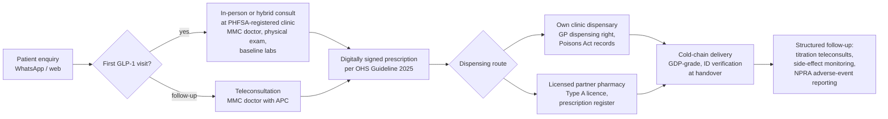

# Malaysia: The Definitive Regulatory Analysis for a Digital-Health Operator

**Abstract.** Malaysia regulates digital healthcare through a patchwork of pre-internet statutes — the Medical Act 1971, the Private Healthcare Facilities and Services Act 1998 (PHFSA), the Poisons Act 1952, the Sale of Drugs Act 1952 and the Medicines (Advertisement and Sale) Act 1956 — overlaid since 2020 by soft-law instruments: the Malaysian Medical Council (MMC) Guideline on Telemedicine, the MOH *Guideline on Online Healthcare Services 2025* (issued under Director General of Health Circular No. 16/2025), and the amended Personal Data Protection Act. The Telemedicine Act 1997 exists on the statute book but has never been brought into force, so telemedicine operates in a legally permissive but formally unregulated space — a condition that cuts both ways for operators. This document maps every regulatory domain relevant to Welltech Health's model (telehealth, GLP-1 weight-loss programs, longevity/preventive medicine, concierge care, AI-enabled operations, WhatsApp-first workflows), states what is settled versus contested, and closes with a compliance-requirements table and a likelihood × impact risk matrix. The single most consequential 2025–2026 developments: the MOH's OHS Guideline 2025 (May 2025), the MMC's prohibition on medical certificates issued after teleconsultation-only encounters (September 2025), and the staged entry into force of the PDPA amendments (January–June 2025).

**Last updated: July 2026.**

Related documents: [Malaysia market sizing](malaysia-market-sizing.md) · [Malaysia telehealth deep dive](malaysia-telehealth.md) · [Singapore regulations](singapore-regulations.md) · [Hong Kong regulations](hong-kong-regulations.md) · [Regulatory source index](../sources/regulatory-source-index.md) · [Welltech blueprint](../70-welltech-blueprint/)

---

## 1. Executive regulatory snapshot

| Domain | Key instrument(s) | Regulator | Status for a digital operator (July 2026) |
|---|---|---|---|
| Medical practice | Medical Act 1971 (Act 50), Medical Regulations 2017, Medical (Amendment) Act 2024 | Malaysian Medical Council (MMC) | Settled: MMC registration + Annual Practising Certificate (APC) mandatory for every prescribing doctor[^1][^2] |
| Clinic licensing | PHFSA 1998 (Act 586) + Private Medical Clinics Regulations 2006 | MOH Medical Practice Division / CKAPS | Settled for physical clinics; **contested/ambiguous for virtual-only clinics** (no registration category exists)[^3][^4] |
| Telemedicine | Telemedicine Act 1997 (Act 564, **never in force**); MMC Guideline on Telemedicine; MOH Guideline on Online Healthcare Services (OHS) 2025 | MMC; MOH | Permitted in practice; governed by soft law, not statute. Dedicated legislation in development[^5][^6][^7] |
| Prescribing & pharmacy | Poisons Act 1952 (Act 366), Poisons Regulations 1952, Sale of Drugs Act 1952, Control of Drugs and Cosmetics Regulations 1984 (CDCR) | Pharmacy Enforcement Division, MOH; Drug Control Authority (DCA)/NPRA | Settled: GLP-1s are prescription-only (Group B Poisons). E-prescription recognised operationally under OHS 2025 but Poisons Regulations still assume written, signed scripts[^8][^9][^10] |
| GLP-1 registration | CDCR 1984; NPRA registration | NPRA/DCA | Saxenda, Ozempic, Rybelsus, Wegovy, Mounjaro all NPRA-registered; Wegovy launched January 2026; Mounjaro launched August 2025[^11][^12][^13][^14] |
| Advertising | Medicines (Advertisement and Sale) Act 1956 (Act 290); MAB/KKLIU approval; PHFSA advertising provisions; MCMC Content Code | Medicine Advertisements Board (MAB); MOH; MCMC | Settled and restrictive: prescription-medicine advertising to the public prohibited; facility ads need MAB approval; heavy social-media takedown activity[^15][^16][^17] |
| Privacy | PDPA 2010 as amended by Personal Data Protection (Amendment) Act 2024 | Personal Data Protection Commissioner (JPDP) | Settled and newly stringent: DPO, 72-hour breach notification, cross-border TIA regime in force from mid-2025[^18][^19][^20] |
| AI / SaMD | Medical Device Act 2012 (Act 737); MDA guidance incl. MDA/GD/0062 (3rd ed., 2025); MMC Guideline on Ethical Use of AI (2025); National AIGE Guidelines (2024) | Medical Device Authority (MDA); MMC | Software with diagnostic/treatment intent is a registrable medical device; AI ethics guidance is non-binding but MMC-enforceable against doctors[^21][^22][^23] |
| Aesthetics/weight-loss clinics | MOH Guidelines on Aesthetic Medical Practice (LCP regime) | MOH Medical Practice Division | LCP required for aesthetic procedures; medical weight management by GPs sits outside LCP but inside general practice norms[^24][^25] |
| Reimbursement | Private MHIT policies, mySalam, PeKa B40 | BNM (insurers), PMCare/ProtectHealth | GLP-1 for weight loss almost universally excluded; telehealth reimbursement nascent[^26][^27][^28] |

### 1.1 Sixty-second timeline of the instruments that matter

| Year | Event | Why it matters for Welltech |
|---|---|---|
| 1952 | Poisons Act; Sale of Drugs Act | Prescription-only architecture; product registration foundation |
| 1956 | Medicines (Advertisement and Sale) Act | MAB/KKLIU advertising control still governing every creative today |
| 1971 | Medical Act (Act 50) | MMC registration + APC regime |
| 1997 | Telemedicine Act passed — never commenced | The famous "world-first" that governs nothing |
| 1998/2006 | PHFSA enacted / brought into force with 2006 Regulations | Clinic registration; no virtual category |
| 2010/2013 | PDPA passed / in force | Health data = sensitive personal data |
| 2012 | Medical Device Act (Act 737) | Software capture; SaMD registration |
| 2020 | MMC Advisory on Virtual Consultation (COVID) | First official telemedicine permission |
| 2022 | MOH virtual-consultation guideline (public facilities); OHS RegLab launched; Poisons (Amendment) Act passed | First-visit-in-person norm; sandbox rules; higher penalties (in force 1 Jan 2023) |
| 2023 | Health White Paper passed (June); RegLab guidelines lapse (Dec) | Reform mandate; regulatory vacuum re-opens |
| 2024 | MMC Guideline on Telemedicine published; PDP (Amendment) Act 2024; Medical (Amendment) Act 2024; AIGE guidelines | The modern soft-law stack assembles |
| 2025 | PDPA amendments in force (Jan–Jun); **OHS Guideline 2025 (15 May)**; Mounjaro launch (Aug); **MMC digital-MC prohibition (23 Sep)**; MMC AI guideline adopted (Feb) | The operating rulebook Welltech launches into |
| 2026 | **Wegovy launch (Jan)**; MOH Digital Strategic Plan 2026–2030; Year of Medical Tourism; OHS legislation awaited | Market formation moment |

Sources: as footnoted in the respective sections below.[^5][^7][^18][^29][^35][^38][^56][^14][^77]

---

## 2. Medical practice law

### 2.1 Practitioner registration — Medical Act 1971

- Every person practising medicine in Malaysia must be registered with the MMC under the Medical Act 1971 (Act 50) and hold a current **Annual Practising Certificate (APC)**.[^1] Practising without registration/APC is a criminal offence under the Act.
- The Medical Regulations 2017 (following the 2012 amendments to Act 50) made **professional indemnity cover a prerequisite for APC renewal**; APC renewal also requires meeting the mandatory CPD requirement (points accumulated in the 1 July–30 June cycle preceding the APC year).[^2]
- The **Medical (Amendment) Act 2024** (Act A1729, tabled 15 July 2024) restructured specialist recognition: the MMC now runs two separate processes — recognition of qualifications and recognition of specialist training — resolving the long-running impasse over parallel-pathway specialists.[^29] Relevance to Welltech: recruiting endocrinologists and bariatric physicians credentialed via parallel pathways is now on firmer legal ground than in 2023–24.
- **Locum practice**: doctors employed by MOH require approval and additional indemnity cover to do locum/private work; an APC is required for *any* form of medical practice, including part-time telehealth sessions.[^2] A moonlighting government doctor on a telehealth panel without approval creates regulatory exposure for both the doctor and, reputationally, the platform.

### 2.2 Facility licensing — PHFSA 1998 (Act 586)

Act 586 (in force since 2006, with the Private Medical Clinics/Private Dental Clinics Regulations 2006) governs all private healthcare facilities.[^3][^4]

| Facility type | Requirement | Process |
|---|---|---|
| Private medical clinic (GP) | **Registration** under s.27, Act 586 | Application to Director General of Health via CKAPS (Private Medical Practice Control Section); Borang B/registration certificate; premises inspection |
| Private hospital, ambulatory care centre, hemodialysis, etc. | **Approval to establish + licence to operate** | Two-stage licensing, more onerous than clinic registration |
| Clinic ownership | Clinics must be registered to, and operated under, a **person in charge** with prescribed qualifications (registered practitioner) | Corporate ownership possible but medical control must rest with registered practitioners[^3][^4] |

Key facts for Welltech:

- Only MMC-registered practitioners with valid APCs can be the registering/managing practitioners of a clinic; the business entity itself must be registered with SSM (Companies Commission).[^4]
- Operating an unregistered/unlicensed private healthcare facility is an offence under Act 586 attracting fines and imprisonment on conviction.[^3] (The precise quantum varies by section; the Act provides for substantial fines and up to imprisonment for unlicensed facilities — verify current figures against the AGC consolidated text before board sign-off. *(exact penalty quantum unverified in this research pass)*)
- **There is no PHFSA category for a "virtual clinic."** The Regulations 2006 prescribe physical premises standards (floor space, signage, equipment, records rooms). A standalone virtual-only clinic therefore cannot currently be *registered as a clinic*; conversely, MOH has not held that teleconsultation from a registered physical clinic is unlawful. Every credible operator (Doctor2U, DoctorOnCall's partner GPs, Qmed, etc.) anchors telehealth to registered physical clinics and licensed community pharmacies.[^30]

> **Implications for Welltech.** The clean structure in Malaysia is: (a) at least one PHFSA-registered physical clinic as the clinical anchor and prescription origin; (b) all panel doctors MMC-registered with current APCs and indemnity; (c) the platform entity as a technology/management services company that does not itself "provide" medicine. Do not launch a virtual-only entity that markets itself as a "clinic" — the term itself invites CKAPS scrutiny. Budget 3–6 months for clinic registration including premises inspection.

---

## 3. Telemedicine: legal status and 2023–2026 developments

### 3.1 The Telemedicine Act 1997 — enacted, never commenced

- The Telemedicine Act 1997 (Act 564) received royal assent on 18 June 1997, making Malaysia one of the first countries in the world to legislate for telemedicine. **It has never been brought into force**: s.1(2) leaves commencement to ministerial notification in the Gazette, which has never been issued. CommonLII lists it as "Not yet in force."[^5][^31]
- Consequence: the Act's restrictive architecture (only registered practitioners holding a "certificate to practise telemedicine"; foreign doctors needing case-by-case certification) has **no legal effect**. But it also means there is no statutory definition of, or safe harbour for, telemedicine. Practitioners self-regulate under general medical law.[^6][^32]

### 3.2 The soft-law stack that actually governs telemedicine

| Instrument | Issuer / date | Status | Core content |
|---|---|---|---|
| Advisory on Virtual Consultation | MMC, April 2020 (COVID MCO) | Revoked and replaced | Permitted virtual consultation under pandemic circumstances with limited physical examination[^33] |
| **Guideline on Telemedicine** | MMC (published on mmc.gov.my, posted January 2024) | In force (ethical guideline; breach = professional misconduct) | Same ethical/legal duties as in-person care; competence requirement; consent; **practitioners outside Malaysia serving Malaysian patients must comply with the ethical, legal and statutory requirements of a registered practitioner**[^6][^34] |
| Garis Panduan Perkhidmatan Konsultasi Secara Maya (Virtual Consultation Services Guidelines) | MOH, 2022 (for MOH facilities) | In force in public sector | First-time patients — especially NCD patients — must be seen in person; virtual consultation reserved for follow-ups[^35] |
| OHS Regulatory Lab (RegLab) guidelines | Futurise × MOH, 2022–2023 | Lapsed end-2023; still used informally | Sandbox rules for online healthcare platforms; formed the basis of the 2025 guideline and planned legislation[^35] |
| **Guideline on Online Healthcare Services (OHS) 2025** | MOH eHealth Planning Section; issued under **Surat Pekeliling Ketua Pengarah Kesihatan Bil. 16/2025, 15 May 2025** | In force as DG circular/administrative guideline (not statute) | See §3.3[^7][^36][^37] |
| MMC notification on medical certificates | MMC, 23 September 2025 | In force | **MCs must not be issued after teleconsultation-only encounters** (reaffirming a 2022 FAQ requiring appropriate consultation incl. physical examination)[^38] |

### 3.3 The OHS Guideline 2025 — the operating rulebook

Issued 15 May 2025 under Director General of Health Circular No. 16/2025, the Guideline on Online Healthcare Services 2025 is the first comprehensive MOH statement on private-sector digital health. Verified requirements:[^7][^36][^37]

- **Corporate presence**: platform operators must be registered with SSM and maintain a **physical office in Malaysia** with an identifiable management team — even for purely online services.
- **Clinical governance in the boardroom**: board or senior management must include a **registered medical practitioner**, and a **licensed pharmacist if the platform offers e-pharmacy services**.
- **Practitioner licensing**: all doctors, dentists, pharmacists, nurses and allied-health professionals on the platform must hold valid Malaysian licences to practise.
- **Digital prescriptions**: recognised as a prescription **signed by a licensed doctor or dentist and transmitted securely to a pharmacist through an OHS platform** — the first official articulation of an e-prescription pathway in Malaysia.
- Drafted with MMC, Malaysia Productivity Corporation and the National Cyber Security Agency (NACSA); covers safety, personal-data protection and service reliability.

Caveats (contested/unsettled):

- The guideline is an **administrative circular, not legislation**. Its enforcement hooks are indirect: MMC discipline for doctors, pharmacy enforcement for medicine supply, PHFSA for facilities. Commentators (e.g., Dr James Jeremiah in CodeBlue, July 2025) argue it under-protects patients and needs statutory backing.[^39]
- MOH has stated it is developing an **Online Healthcare Services regulatory framework / dedicated legislation** to rationalise the field (widely referred to in industry as a forthcoming digital-health or OHS Act; no bill had been tabled in the Dewan Rakyat as of mid-2026 — the 2026 legislative session prioritised the Cybercrimes Bill).[^32][^40]

### 3.4 The digital-MC shock (September–November 2025)

On 23 September 2025 the MMC notified practitioners that **medical certificates must not be issued after teleconsultation-only encounters**, invoking its 2022 FAQ position that an MC requires appropriate consultation including history, physical examination and investigation where necessary. The Malaysian Medical Association backed the move as a duty-of-care reminder aimed at "corporatised" digital platforms; the Association of Digital Health Malaysia (ADHM) called instead for an evidence-based teleconsultation guideline, warning a blanket ban undermines legitimate care pathways.[^38][^41][^42] MOH had, only in February 2025, been publicly considering digital MCs and e-prescriptions as part of its digitalisation agenda — the reversal illustrates how quickly the soft-law environment can move.[^43]

### 3.5 Is a standalone virtual clinic licensable? (The core structural question)

**Settled**: nothing in Malaysian law prohibits a registered doctor in a registered clinic from consulting patients remotely; the OHS Guideline 2025 explicitly contemplates teleconsultation and e-pharmacy platforms.
**Contested/unresolved**: whether an entity with no physical clinical premises can lawfully hold itself out as a healthcare provider. PHFSA has no virtual category; the OHS Guideline requires a physical office but does not create a licence class; the (unenforced) Telemedicine Act's certification scheme is dormant. Until the promised legislation lands, virtual-only operation rests on regulatory forbearance.[^5][^7][^32]

> **Implications for Welltech.** (1) Treat the OHS Guideline 2025 as binding in practice: SSM entity, Malaysian physical office, doctor (and pharmacist) at board/senior-management level, fully licensed panel. (2) Anchor prescriptions to a PHFSA-registered clinic. (3) Never issue MCs from teleconsult-only encounters — this is now the brightest line in Malaysian telehealth and the most likely trigger for MMC complaints against panel doctors. (4) Design the WhatsApp-first journey so the *first* GLP-1 consultation is in person or hybrid (aligns with both the MOH 2022 virtual-consult guideline logic and MMC physical-examination expectations); virtual follow-ups are defensible. (5) Track the forthcoming OHS/digital-health legislation — grandfathering is likely to favour operators already compliant with the 2025 guideline.

---

## 4. Prescribing, pharmacy and medicine delivery

### 4.1 The Poisons Act 1952 (Act 366) architecture

- Medicines are scheduled in the Poisons List. **Group B poisons** (prescription-only medicines) may be supplied by retail only by a licensed pharmacist **against a prescription** from a registered medical practitioner/dentist/vet — or dispensed by the prescribing practitioner to their own patient (the basis of Malaysia's GP dispensing model).[^8][^9]
- Prescription formalities (Poisons Regulations 1952): **in writing, signed and dated by the prescriber**, stating prescriber's address and the patient's name and address; the dispenser must record supply in a prescription book on the day of supply. Standard prescription validity is treated as ~3 months per Regulation 11 practice. An urgent-supply exception exists for verbal/telephoned instructions from a personally known prescriber, with the written script to follow within one day.[^8][^44]
- Selling/supplying a Group B poison without prescription is punishable under s.32(2) with a fine up to RM5,000 and/or up to 2 years' imprisonment — historically criticised as too light; the **Poisons (Amendment) Act 2022 (in force 1 January 2023) raised penalties and enhanced enforcement powers**.[^45][^46]

### 4.2 Product registration — Sale of Drugs Act 1952 and CDCR 1984

All pharmaceutical products must be registered with the **Drug Control Authority (DCA)**, administered by **NPRA**, before import, manufacture, sale or supply (CDCR 1984, made under the Sale of Drugs Act 1952). Dealing in unregistered products: fines up to RM25,000 and/or 3 years' imprisonment (first offence) and RM50,000 and/or 5 years (subsequent) for individuals; compounding of offences possible with public-prosecutor approval.[^10][^47]

### 4.3 E-prescriptions and online supply — what is settled vs not

| Question | Status | Basis |
|---|---|---|
| Can a teleconsult doctor issue a prescription? | **Yes** — settled in practice | MMC telemedicine guideline; OHS Guideline 2025 "digital prescription" pathway[^6][^7] |
| Is a purely digital prescription valid under the Poisons Regulations? | **Ambiguous** — regulations say "in writing signed"; OHS 2025 recognises digitally signed scripts transmitted platform-to-pharmacist, but the regulations have not been amended | [^7][^8][^44] |
| Can pharmacies deliver prescription medicines to homes? | **Yes, in practice** — DoctorOnCall-style models (consult → prescription → licensed partner pharmacy → delivery) have operated openly since 2016 and were publicly debated in Parliament in 2020 without prohibition | [^30][^48] |
| Can prescription medicines be sold on e-commerce marketplaces? | **No** — enforced; Pharmacy Enforcement removes listings at scale (38,055 unapproved medicine ads removed from e-commerce and 13,070 screened on social media, Jan 2023–Dec 2025) | [^49][^50] |
| Dispensing separation (doctors prescribe, pharmacists dispense) | **Not implemented in private sector** — GPs may still dispense; separation exists only in public facilities. Pharmacist bodies have pushed for statutory separation for decades (target dates of 2025 floated as early as 2019); a Pharmacy Bill has repeatedly stalled | [^51][^52] |

> **Implications for Welltech.** (1) The GP-dispensing model is a commercial gift: Welltech's own registered clinic can consult and dispense GLP-1s directly, capturing the pharmacy margin — a structural advantage unavailable in Singapore-style separated markets, but plan a contingency P&L for dispensing separation (its arrival would compress clinic margins materially). (2) For delivery at scale, contract licensed community pharmacies (Type A licence holders) and pass digitally signed prescriptions per OHS 2025; keep a compliant prescription register. (3) Cold-chain delivery of injectables has no bespoke rules — apply Good Distribution Practice by analogy and document it; this is a likely area of future guidance. (4) Never list GLP-1s on marketplaces or allow "add to cart before consult" flows; the enforcement statistics show this is where MOH is actively hunting.[^49][^50]

### 4.4 The compliant prescription-to-doorstep flow

Design notes: (a) the prescription must originate from an identifiable registered practitioner tied to a registered facility; (b) the platform never "sells" the medicine — the clinic or pharmacy does; (c) every handover is logged against the prescription record to survive a Pharmacy Enforcement inspection.[^7][^8][^30]

---

## 5. GLP-1 medicines: registration, classification, supply

### 5.1 Registration status with NPRA (verified July 2026)

| Molecule | Brand | NPRA status | Indication registered | Notes |
|---|---|---|---|---|
| Liraglutide 3.0 mg | Saxenda | Registered; prescription-only | Chronic weight management | Longest-established weight-loss GLP-1 in MY; retail via clinics/pharmacies[^13] |
| Liraglutide 1.8 mg | Victoza | Registered | T2DM | [^13] |
| Semaglutide (inj., T2DM doses) | Ozempic | Registered | **Type 2 diabetes only** — weight-loss use is **off-label** | Group B poison; ~RM800–1,800/month street pricing (2026)[^11][^53] |
| Semaglutide (oral) | Rybelsus | Registered | T2DM | Sold via licensed online pharmacy channels with prescription[^54] |
| Semaglutide 2.4 mg | Wegovy | Registered (clinic sources report DCA approval April 2023 — *treat date as unofficial*); **commercially launched January 2026** | Obesity/overweight + ≥1 comorbidity | Thailand got SEA's first launch (April 2025); Malaysia followed[^12][^14][^55] |
| Tirzepatide | Mounjaro | Registered — MAL24026013AZ; **launched 30 August 2025** | T2DM and chronic weight management | ~RM1,500–3,000/month (2026). "Zepbound" brand not separately marketed in MY — tirzepatide is supplied as Mounjaro (KwikPen)[^11][^56] |

*Registration numbers and dates above the line from NPRA-referencing secondary sources (clinic/telehealth publishers); NPRA's QUEST product-search portal is the authoritative verification point before any formulary decision.*

### 5.2 Classification, off-label use, compounding, import

- **Classification**: semaglutide (and GLP-1 class peers) are scheduled as **Group B Poisons** — no OTC sale, prescription mandatory.[^53]
- **Off-label prescribing** (e.g., Ozempic for weight loss) is not prohibited by statute; it is governed by MMC ethical standards — clinical justification, informed consent, documentation. It was the dominant pattern pre-Wegovy-launch and remains common on price grounds. Risk sits with the prescriber, and marketing an off-label indication to consumers would breach advertising law (§6).[^11]
- **Compounded semaglutide**: no Malaysian equivalent of the US 503A/503B compounding boom. Extemporaneous compounding is confined to a pharmacist/practitioner preparing for a specific patient; manufacturing semaglutide copies would require DCA registration and would infringe patents. No evidence of a lawful compounded-GLP-1 channel in Malaysia — treat any "compounded semaglutide" supplier as a red flag. *(inference from the registration framework; no primary source describes GLP-1 compounding in MY)*
- **Personal import**: travellers may bring medicines for personal use in limited quantities with prescription/medical documents in the patient's own name (MOH Traveller's Guide); controlled categories need permits. Importation of unregistered products for treatment requires case-by-case MOH approval; unregistered-product importation is a recognised enforcement problem.[^57][^58]
- **Counterfeits & grey market**: global falsified-Ozempic alerts (EMA, TGA, FDA) plus Malaysian grey-market listings on e-commerce/social platforms. Malaysian coverage documents online weight-loss drugs "evading prescription laws"; MOH's answer has been takedowns plus warnings to buy only from registered clinics/pharmacies and to report suspect products to NPRA.[^49][^59][^60]
- **Shortages**: the 2023–2024 global semaglutide shortage delayed Wegovy's Malaysian availability and pushed demand into off-label Ozempic and grey channels; supply normalised into 2025–26 as Novo/Lilly capacity expanded.[^12][^14]
- **Pharmacovigilance**: NPRA issued a 2025 safety alert on GLP-1 receptor agonists (dulaglutide, liraglutide, lixisenatide, semaglutide, tirzepatide) regarding pulmonary aspiration under anaesthesia/deep sedation — expect label updates and peri-operative guidance duties for prescribers.[^61]

> **Implications for Welltech.** (1) Build the formulary on **on-label** products (Wegovy, Saxenda, Mounjaro for weight management) — the off-label Ozempic play is cheaper but concentrates prescriber risk and is unmarketable (any consumer-facing weight-loss claim tied to Ozempic is an advertising offence waiting to happen). (2) Verify every product's MAL number on NPRA QUEST and keep batch-level records — counterfeit pens are a live patient-safety and brand risk. (3) The Jan-2026 Wegovy launch makes Malaysia the moment-of-market-formation: regulatory-compliant supply is the differentiator versus grey-market Telegram/Shopee sellers, and Welltech should actively position compliance as a trust asset. (4) Bake the NPRA aspiration warning into clinical protocols (pre-op holds) now.

---

## 6. Advertising and marketing law — the tightest constraint on a weight-loss brand

### 6.1 Medicines (Advertisement and Sale) Act 1956 (Act 290) and the MAB/KKLIU regime

- **s.3 + Schedule**: advertising any product/service for the treatment of scheduled diseases (kidney disease, heart disease, hypertension, diabetes, epilepsy, TB, mental disorder, infertility, sexual function/impotence, cancer, venereal disease, etc.) to the public is prohibited. **Obesity/weight loss is not on the statutory Schedule** — but this is *not* a green light (see next bullets). The Minister may amend the Schedule by order.[^15][^62]
- **s.4B**: every medicine/medical-service advertisement requires prior approval of the **Medicine Advertisements Board (MAB)**; approved ads carry a **KKLIU number** which must be displayed on every creative. Lead time in practice: 4–6 weeks.[^16][^63]
- **Prescription-only medicines cannot be advertised to the general public at all** under the MAB Guideline on Advertising of Medicines and Medicinal Products to the General Public — only OTC/registered non-POM products can be approved. Consequence: **you cannot lawfully advertise Wegovy, Mounjaro, Saxenda or "GLP-1 injections" by name (or by identifiable description) to Malaysian consumers.** Disease-awareness and service advertising are the lawful lanes.[^16]
- MOH/pharmacy enforcement flags "sustained weight loss" promises as a hallmark of illegal health-product advertising and actively pursues such ads.[^15][^64]

### 6.2 Private healthcare facility advertising

Facility/service advertising by clinics is regulated under the PHFSA framework and the **MAB Advertising Guidelines for Healthcare Facilities and Services (rev. 3/2023)**: prior approval required; prohibited elements include comparative claims between facilities, price/package comparisons, misleading or exaggerated claims, patient photographs in specified contexts, and testimonials in most forms.[^17][^65]

### 6.3 Social media, influencers, MCMC

- The MCMC Content Code and MAB rules apply online: **#ad/#sponsored disclosure** at the start of captions/first seconds of video; no therapeutic claims ("cures", "treats", "prevents") without a KKLIU-approved creative; a lifestyle influencer making clinical claims without MAB approval is itself a violation. Doctor-KOLs get no exemption.[^63][^66]
- Enforcement is real and voluminous: 38,055 unapproved ads removed from e-commerce platforms and 13,070 screened on social media between January 2023 and December 2025; publication of an unapproved advertisement is an offence under Act 290 s.5.[^49][^16]

> **Implications for Welltech.** This is the domain most likely to generate Welltech's first regulatory contact. Operating rules: (1) all Malaysian creatives pass through a KKLIU workflow with 6-week lead time; (2) market the *program and service* ("doctor-led weight-management program") — never the molecule or brand — and keep even program claims non-superlative; (3) WhatsApp broadcast/status content counts as advertising — apply the same review; (4) influencer briefs must contractually prohibit product naming and therapeutic claims and mandate #ad disclosure; (5) monitor competitor takedowns (clinics naming Ozempic/Mounjaro on landing pages are widespread today — see the [competitor dossiers](../20-competitor-dossiers/) — which signals under-enforcement, not legality; the gap is where enforcement sweeps eventually land).

---

## 7. Privacy: PDPA 2010 and the 2024 amendments

### 7.1 The upgraded regime (in force January–June 2025)

| Change | Detail | Effective |
|---|---|---|
| Data Protection Officer | Controllers **and processors** must appoint ≥1 DPO and notify the Commissioner; DPO guidelines issued 25 Feb 2025 | 1 June 2025[^18][^19] |
| Breach notification | Notify Commissioner "as soon as practicable" and **within 72 hours** of awareness; notify affected individuals without unnecessary delay where significant harm likely | 1 June 2025[^19] |
| Direct processor obligations | Processors directly liable for security principle | 2025 (staged)[^18] |
| Data portability | Data-subject right introduced | Staged 2025[^20] |
| Cross-border transfers | Whitelist abolished; transfers allowed to jurisdictions with substantially similar law/adequate protection or under exceptions; **Transfer Impact Assessments** expected per Guidelines No. 03/2025 on Cross-Border Personal Data Transfer | 2025[^20][^67] |
| Penalties | Max fine for breaching Data Protection Principles raised RM300,000 → **RM1,000,000**; imprisonment up to 3 years | 2025[^19] |
| "Data user" → "data controller" | Terminology aligned with GDPR | 2025[^18] |

Health data is **sensitive personal data** under the PDPA, requiring explicit consent for processing (s.40); this has been true since 2013 and now carries the amplified penalty regime.[^20]

### 7.2 Application to Welltech's WhatsApp/cloud/AI stack

- **WhatsApp-first care**: WhatsApp Business (API) routes message data through Meta infrastructure outside Malaysia → this is a **cross-border transfer of sensitive personal data** requiring a documented TIA under Guidelines 03/2025, explicit patient consent covering channel risk, and retention controls (message export into the EMR, deletion policies). End-to-end encryption helps the security analysis but does not remove PDPA obligations. *(analysis; the guidelines do not name WhatsApp specifically)*
- **Cloud hosting** (AWS/GCP Singapore regions, typical for MY health-tech): same TIA logic; Singapore's PDPA will usually pass the "substantially similar" screen but document the assessment.[^67]
- **AI processing** (LLM triage/scribing on patient messages): sending identifiable health data to a foreign AI API is simultaneously a sensitive-data processing event and a cross-border transfer; minimum controls are de-identification where feasible, DPA/sub-processor terms, and coverage in the consent/privacy notice. The Commissioner has signalled active guideline development (DPIA-style expectations are emerging in JPDP guidance).
- Appoint the DPO early (a compliance-manager DPO is acceptable; JPDP registration required) and stand up the 72-hour breach playbook — a leaked WhatsApp thread of GLP-1 patients is precisely the "significant harm" scenario the amendment targets.

> **Implications for Welltech.** Malaysia is now the strictest of Welltech's three markets on paper for data operations timing: the obligations are new (2025), the regulator is building an enforcement docket, and health data + weight-loss context is high-sensitivity. Treat PDPA compliance as a launch gate, not a retrofit: DPO appointed and notified, TIAs for Meta/cloud/AI vendors, consent flows in Bahasa Malaysia and English, breach playbook drilled. Compare [singapore-regulations.md](singapore-regulations.md) for the PDPA-SG contrast.

### 7.3 WhatsApp-first workflow: legal exposure map by journey stage

Because Welltech's operating model is WhatsApp-native, each message type crosses a different regulatory boundary. This is the channel-level compliance map:

| Journey stage (WhatsApp) | Regulatory frame | Rule of thumb |
|---|---|---|
| Broadcast/status marketing, click-to-WhatsApp ads | MASA 1956 + MAB/KKLIU; MCMC Content Code | Treated as advertising: KKLIU-approved creative only; no POM names, no cure/therapeutic claims, no before-after weight photos[^16][^63][^66] |
| Pre-consult triage chat (AI or human agent) | PDPA (sensitive data from first symptom disclosure); SaMD line if AI triages | Consent capture before health questions; AI limited to routing/admin, disclaimed as non-diagnostic[^20][^22] |
| Consultation itself (voice/video note, chat) | MMC Telemedicine Guideline; OHS 2025 | Registered doctor identified by name/MMC number; contemporaneous clinical record exported to EMR — chat history is not a medical record[^6][^7] |
| Prescription issuance | Poisons Regulations + OHS 2025 digital-prescription pathway | Signed digital script transmitted platform-to-pharmacist; never a bare "screenshot prescription" in chat[^7][^8] |
| MC requests | MMC 23 Sep 2025 notification | Decline via teleconsult-only encounter; route to in-person[^38] |
| Payment/receipts, delivery updates | Consumer law; PDPA (non-sensitive) | Lowest-risk zone; standard commerce rules |
| Follow-up nudges, adherence coaching | PDPA; advertising line if promotional | Care communications are fine; upsell messages flip into "advertisement" and need the marketing review |
| Group/community features | PDPA (disclosure risk between patients) | Avoid patient-visible groups for GLP-1 cohorts; one-to-one or anonymised community platforms only *(analyst judgment)* |

---

---

## 8. AI in healthcare and software as a medical device

- **Medical Device Act 2012 (Act 737)**: "medical device" expressly includes **software** intended for diagnosis, prevention, monitoring or treatment. Registration with the MDA is mandatory before placing on the market (s.5(1)); Classes A–D by risk, with Class B–D requiring conformity assessment by a Malaysian CAB.[^21][^68]
- **SaMD classification**: MDA/GD/0062 (Harmonised Classification of Medical Devices in ASEAN, 3rd ed., June 2025) sharpened SaMD rules: software supporting diagnosis/treatment decisions in non-critical settings ~Class B; software directly driving urgent/high-risk clinical care ~Class C.[^22]
- **What is likely *not* a medical device**: pure appointment/messaging/logistics software, wellness trackers without medical claims, administrative AI (billing, scheduling). **What likely *is***: symptom checkers that triage, dosing calculators/titration engines for GLP-1s, diagnostic-suggestion copilots. Intended purpose (claims made) drives the analysis — a marketing sentence can convert a CRM into a Class B device. *(analysis applying MDA definitions)*
- **MMC Guideline on the Ethical Use of Artificial Intelligence**: endorsed 29 December 2024, adopted 18 February 2025 — the doctor remains accountable for AI-assisted decisions; systems in sensitive uses should be fail-safe and rigorously overseen. Binding on doctors via MMC discipline.[^23]
- **National Guidelines on AI Governance and Ethics (AIGE)** (MOSTI, September 2024): seven voluntary principles (fairness, safety, privacy, inclusiveness, transparency, accountability, human benefit); no AI Act yet, but AIGE is the reference frame regulators cite.[^69][^70]

> **Implications for Welltech.** Keep the AI operating model (see [../60-ai-operating-model/](../60-ai-operating-model/)) on the administrative/augmentation side of the SaMD line at launch: AI drafts, humans decide; no autonomous dosing or diagnosis claims in any marketing or UI copy. If Welltech productises a titration algorithm, budget for MDA Class B registration (CAB conformity assessment, months not weeks). Document human-in-the-loop review so panel doctors satisfy the MMC AI guideline.

---

## 9. Aesthetic-medicine and wellness-clinic rules (LCP) as they bear on weight-loss/longevity clinics

- The MOH **Guidelines on Aesthetic Medical Practice for Registered Medical Practitioners** (2nd edition) require any practitioner performing aesthetic procedures to hold a **Letter of Credentialing and Privileging (LCP)** issued by the MOH Medical Practice Division on the recommendation of the national credentialing committee; validity 3 years. GP-tier LCP prerequisites: full MMC registration, valid APC, ≥2 years post-registration clinical experience, plus ~2 years supervised aesthetic training and the MAC exam pathway.[^24][^25][^71]
- **Where weight management sits**: prescribing GLP-1s, nutrition and lifestyle medicine is *general medical practice*, **not** an LCP-listed aesthetic procedure. But many Malaysian GLP-1 sellers are aesthetic clinics, and procedures Welltech might bundle later (cryolipolysis, HIFU body contouring, injection lipolysis) **are** LCP-controlled. A "longevity clinic" offering IV drips and hormone therapy sits in a grey zone MOH has periodically criticised. *(analysis; LCP scope from the MOH guideline)*

> **Implications for Welltech.** Medical weight loss per se needs no LCP — a clean, defensible position versus aesthetic-clinic competitors whose GLP-1 marketing invites both advertising and scope-of-practice scrutiny. Do not add device-based body contouring without LCP-credentialed doctors. For longevity services, keep offerings evidence-anchored (screening, biomarkers, prevention) and avoid unregistered-product IV therapies, which are a known Pharmacy Enforcement target.

---

## 10. Cross-border practice, foreign doctors, medical tourism

- **Foreign doctors** need MMC registration to practise in/into Malaysia: full registration (with qualifying exams for most), or a **Temporary Practising Certificate (TPC)** under s.16 for defined activities; applications flow through prospective employers, generally requiring ~5 years' experience.[^72][^73]
- **Inbound telemedicine**: the MMC Guideline on Telemedicine states practitioners **outside Malaysia** providing telemedicine to patients in Malaysia must comply with the ethical, legal and statutory requirements of a registered practitioner — i.e., MMC's position is that serving Malaysian patients remotely without Malaysian registration is non-compliant. Enforcement against offshore doctors is practically difficult; enforcement lands on the local platform instead. **Do not** route Malaysian patients to Singapore/HK-licensed doctors for prescribing.[^6][^34]
- **Outbound/regional model**: a Malaysian hub serving SG/HK patients triggers *those* jurisdictions' registration rules — see [singapore-regulations.md](singapore-regulations.md) and [hong-kong-regulations.md](hong-kong-regulations.md).
- **Medical tourism**: the Malaysia Healthcare Travel Council (MHTC, MOH agency, est. 2009) actively promotes teleconsultation for healthcare travellers (pre-arrival and follow-up), with 2026 designated Malaysia's Year of Medical Tourism. MHTC membership is a legitimising channel for a compliant digital-health brand targeting Indonesian/regional patients.[^74][^75]

> **Implications for Welltech.** Market-by-market licensing is unavoidable: separate Malaysian, Singaporean and Hong Kong clinical panels, with the tech layer shared. Malaysia's cost base plus MHTC's teleconsult-friendly medical-tourism posture make it the natural regional service hub for *Malaysian-registered* care of inbound patients (e.g., Indonesian weight-loss patients combining travel with onboarding), but not a licence-arbitrage base for treating Singaporeans remotely.

---

## 11. Reimbursement and financing

| Channel | Telehealth coverage | GLP-1/weight-loss coverage | Notes |
|---|---|---|---|
| Out-of-pocket | Dominant payment mode for private telehealth and GLP-1 programs | Wegovy ~RM1,300–2,000+/mo; Mounjaro ~RM1,500–3,000/mo; Ozempic (off-label) ~RM800–1,800/mo (2026, clinic-quoted) | The realistic revenue base[^11][^56] |
| Private MHIT (insurance/takaful) | Some insurers reimburse teleconsults within panel/GP benefits; no standard | **Weight-loss GLP-1s almost universally excluded** (cosmetic/wellness exclusions); possible coverage where T2DM diagnosed | Roczen (operating in MY) states most private plans don't cover GLP-1 for weight loss[^26] |
| Employer panels | Growing: employers add telehealth to panel-clinic arrangements; some comprehensive plans starting to include weight-management programmes | Case-by-case reimbursement with doctor's letter | B2B2C wedge for Welltech[^26] |
| mySalam (federal takaful scheme) | None (cash payouts: RM8,000 critical illness; RM50/day hospitalisation) | None | B40/M40 income-tested; not a telehealth payer[^27] |
| PeKa B40 | Screening-focused (age 40+, B40): health screening, medical device aid, cancer treatment incentives, transport | None for GLP-1s | Preventive-screening adjacency only[^28] |
| Tax relief | Personal income-tax relief for medical/health screening expenses partially applicable | Not GLP-1-specific | Marginal affordability lever |

> **Implications for Welltech.** Malaysia is a cash-pay GLP-1 market for the planning horizon; price architecture and financing (instalments, program bundling) matter more than payer strategy. The employer channel is the only near-term third-party payment wedge — position weight management as productivity/NCD prevention for corporate panels. Watch for insurers piloting obesity-management riders as Wegovy normalises post-launch; none verified as of July 2026.

---

## 12. Enforcement track record and penalties

### 12.1 Observed enforcement pattern (2020–2026)

| Actor | Focus | Evidence |
|---|---|---|
| Pharmacy Enforcement Division (MOH) | Illegal online sale of poisons/unregistered products; unapproved advertising; raids and prosecutions | 38,055 unapproved ads removed from e-commerce, 13,070 screened on social media (Jan 2023–Dec 2025); routine raids and seizures publicised[^49][^50] |
| MAB/BPF | Unapproved medicine/service ads (KKLIU) | Public warnings; s.5 Act 290 liability for anyone participating in publication[^16][^64] |
| MMC | Professional discipline; telemedicine standards; the Sept 2025 digital-MC prohibition | 23 Sep 2025 notification; disciplinary jurisdiction over all registered practitioners[^38] |
| CKAPS/Medical Practice Division | Unregistered clinics, unlicensed facilities, LCP violations (periodic sweeps of aesthetic premises) | Act 586 prosecutions; aesthetic-practice enforcement documented by law-firm commentary[^25] |
| JPDP (PDP Commissioner) | Newly empowered post-amendment; breach-notification regime operational June 2025 | Guidelines Feb 2025; enforcement docket building[^19] |
| MCMC | Content takedowns incl. health-claim ads under Content Code | Content Industry Reference on health-claim advertisements[^66] |

Notably absent: any prosecution of a mainstream telemedicine platform for practising telemedicine per se. The 2020 parliamentary questioning of DoctorOnCall's online pharmacy produced debate, not prosecution — evidence of deliberate regulatory forbearance toward compliant-ish incumbents.[^48]

### 12.2 Penalty reference table

| Offence | Statute | Maximum penalty |
|---|---|---|
| Practising medicine unregistered / without APC | Medical Act 1971 | Fine/imprisonment per Act 50 (verify quantum in current consolidation)[^1] |
| Operating unregistered private clinic | PHFSA 1998 s.5/s.27 | Fine + imprisonment on conviction (substantial; corporate officers liable)[^3] |
| Supplying Group B poison without prescription | Poisons Act s.32(2) | RM5,000 fine and/or 2 years (pre-2023 baseline; raised by Poisons (Amendment) Act 2022)[^45][^46] |
| Selling unregistered pharmaceutical product | CDCR 1984 | RM25,000 and/or 3 yrs (1st); RM50,000 and/or 5 yrs (subsequent) — individuals; higher for bodies corporate[^47] |
| Publishing unapproved medicine advertisement | MASA 1956 s.4B/s.5 | Fine/imprisonment; each publication a separate offence[^16] |
| PDPA principle breach | PDPA (as amended 2024) | RM1,000,000 and/or 3 years[^19] |
| Unregistered medical device on market | Medical Device Act 2012 s.5 | Fine/imprisonment per Act 737[^21] |
| Failure to display drug prices (2025 order) | Price Control and Anti-Profiteering framework | Up to RM100,000 (companies) — new 2025 obligation on private clinics/pharmacies[^76] |

---

## 13. Compliance-requirements table for Welltech's Malaysia model

| # | Requirement | Instrument | Owner | Gate |
|---|---|---|---|---|
| 1 | SSM-registered Malaysian entity; physical office; doctor (+pharmacist if e-pharmacy) in senior management | OHS Guideline 2025 | Corporate | Pre-launch |
| 2 | PHFSA registration of ≥1 physical clinic (CKAPS) | Act 586 + 2006 Regs | Clinical ops | Pre-launch |
| 3 | All doctors: MMC full registration + current APC + indemnity + CPD | Medical Act 1971/Regs 2017 | Medical director | Continuous |
| 4 | First GLP-1 consult in person/hybrid; physical exam documented; no teleconsult-only MCs | MMC Telemedicine Guideline; MMC Sep-2025 notification; MOH 2022 virtual-consult logic | Medical director | Continuous |
| 5 | Prescriptions digitally signed, transmitted platform-to-pharmacist; prescription register maintained | OHS 2025; Poisons Regulations | Pharmacy lead | Continuous |
| 6 | Dispensing only via own registered clinic or licensed partner pharmacies; GDP-grade cold chain for injectables | Poisons Act; licensing | Pharmacy lead | Continuous |
| 7 | Only NPRA-registered products (verify MAL numbers, batch traceability); no compounded GLP-1s | Sale of Drugs Act/CDCR | Pharmacy lead | Continuous |
| 8 | KKLIU/MAB approval workflow for all consumer creatives; no POM brand names in consumer marketing; influencer contracts with claim prohibitions | MASA 1956; MAB guidelines; MCMC code | Marketing | Continuous |
| 9 | Facility advertising approval; no comparative/price-comparison/testimonial ads | PHFSA advertising rules; MAB 3/2023 | Marketing | Continuous |
| 10 | DPO appointed + notified; 72-h breach playbook; explicit sensitive-data consent (BM+EN); TIAs for WhatsApp/Meta, cloud, AI vendors | PDPA as amended; Guidelines 01–03/2025 | DPO | Pre-launch |
| 11 | AI kept administrative/augmentative; human-in-the-loop documented; SaMD assessment before any titration/triage algorithm ships | Act 737; MDA/GD/0062; MMC AI guideline | CTO + medical director | Per release |
| 12 | LCP-credentialed doctors before any aesthetic procedures added | MOH Aesthetic Guidelines | Medical director | If/when in scope |
| 13 | No remote prescribing into MY by non-MMC doctors; no MY panel prescribing into SG/HK | MMC Telemedicine Guideline; foreign law | Medical director | Continuous |
| 14 | Drug price display compliance | 2025 price-transparency order | Clinic ops | Continuous |
| 15 | Monitoring: forthcoming OHS/digital-health legislation; Poisons/Pharmacy Bill; JPDP guidance | — | Regulatory counsel | Quarterly |

---

## 14. Regulatory risk matrix (likelihood × impact, 3-year horizon)

| Risk | Likelihood | Impact | Score | Mitigation |
|---|---|---|---|---|
| Advertising enforcement (unapproved/POM-referencing creative, influencer claim) | **High** | Medium (takedown, fines, brand damage) | **High** | Rule 8 above; conservative claims; KKLIU pipeline |
| MMC complaint against panel doctor (teleconsult MC, no physical exam, off-label marketing) | Medium–High | High (doctor suspension; panel disruption) | **High** | Hybrid first visits; MC policy; documentation |
| New OHS/digital-health legislation imposing licence class + conditions on platforms | High | Medium (compliance cost; likely grandfathering advantage) | **Medium–High** | Already-compliant posture; industry association (ADHM) engagement |
| PDPA enforcement (breach, WhatsApp/AI transfer gaps) | Medium | High (RM1M fine, criminal exposure, trust loss) | **Medium–High** | DPO, TIAs, breach drills |
| Virtual-clinic structural challenge (CKAPS questions the model) | Low–Medium | High (business-model rework) | **Medium** | Physical-clinic anchor; "platform + registered clinic" structure |
| Dispensing separation enacted | Low (stalled for decades) | High (margin compression) | **Medium** | Pharmacy partnerships; contingency P&L |
| GLP-1 supply shock or new NPRA restriction (e.g., channel controls after counterfeit incident) | Medium | Medium | **Medium** | Multi-product formulary; supplier agreements |
| SaMD reclassification of Welltech software | Low–Medium | Medium (registration cost/delay) | **Low–Medium** | Claims discipline; pre-submission MDA consultation |
| Off-label prescribing crackdown (Ozempic-for-weight-loss) | Medium | Low–Medium (on-label alternatives now registered) | **Low–Medium** | On-label formulary default |
| Cross-border prescribing enforcement | Low | High if it occurs | **Low–Medium** | Strict market-by-market panels |

**Net assessment.** Malaysia is a *permissive-but-hardening* regime. Nothing in current law blocks Welltech's model; the binding constraints are advertising law (structural, permanent) and the professional-conduct perimeter around teleconsultation (tightening since September 2025). The largest uncertainty is legislative: the promised online-healthcare statute will convert today's guideline compliance into licence conditions — operators already aligned with OHS 2025 are best positioned.

### 14.1 Settled vs contested: the one-page counsel's summary

| Question | Settled? | Position |
|---|---|---|
| May a registered doctor teleconsult a Malaysian patient? | Settled | Yes — under MMC guideline duties[^6] |
| May that doctor prescribe a Group B poison after teleconsult? | Largely settled | Yes for appropriate cases; OHS 2025 recognises the digital prescription; first-visit physical-exam expectations apply in practice[^7][^35] |
| May an MC be issued after a teleconsult-only encounter? | Settled (since Sep 2025) | **No**[^38] |
| May a platform with no physical clinic operate as a "virtual clinic"? | **Contested** | No PHFSA category; OHS 2025 requires physical office; forbearance-dependent[^3][^7] |
| May prescription medicines be delivered to homes? | Settled in practice | Yes via licensed pharmacy/clinic against valid prescription[^30] |
| May GLP-1 brands be advertised to consumers? | Settled | **No** (POM advertising prohibition); service-level marketing with MAB approval only[^16] |
| May Ozempic be prescribed off-label for weight loss? | Settled | Yes clinically (MMC ethics apply); cannot be marketed for it[^11] |
| Is patient chat data on WhatsApp a PDPA cross-border transfer? | Settled in principle, guidance evolving | Yes — TIA + consent required under Guidelines 03/2025[^67] |
| Is a GLP-1 titration algorithm a medical device? | Contested at the margin | Likely Class B SaMD if it recommends doses; registration advised before launch[^21][^22] |
| May a Singapore-licensed doctor treat Malaysian patients remotely? | Settled per MMC | No — must meet Malaysian registered-practitioner requirements[^6] |

---

## 15. Watchlist (H2 2026 – 2027)

1. Tabling of dedicated online-healthcare/digital-health legislation (MOH has signalled a rationalised framework; RegLab outputs and OHS 2025 are its skeleton).[^32][^35]
2. MMC follow-through on teleconsultation guidance — ADHM is lobbying for a structured teleconsultation guideline to replace the blunt MC ban.[^41]
3. Poisons Act/Pharmacy Bill movement — penalties, e-prescription formalisation, any dispensing-separation revival.[^46][^51]
4. JPDP guidance flow (DPIA expectations, AI processing, further cross-border rulings) and first health-sector enforcement actions.[^19][^67]
5. NPRA actions on GLP-1s: label updates (aspiration risk), channel restrictions, generic/biosimilar semaglutide entries as patents lapse regionally.[^61]
6. MOH Digital Strategic Plan 2026–2030 implementation (cloud clinic systems, national interoperability platform) — potential integration mandates/opportunities for private platforms.[^40][^77]

---

## Appendix: acronyms and institutions

| Acronym | Body / term | Role |
|---|---|---|
| MMC | Malaysian Medical Council | Doctor registration, APC, professional discipline, telemedicine and AI ethics guidelines |
| CKAPS | Cawangan Kawalan Amalan Perubatan Swasta (Private Medical Practice Control Section, MOH) | PHFSA clinic registration/inspection |
| NPRA | National Pharmaceutical Regulatory Agency | Secretariat to the DCA; product registration, pharmacovigilance |
| DCA | Drug Control Authority | Statutory body registering pharmaceutical products under CDCR 1984 |
| BPF / Pharmacy Enforcement Division | Bahagian Penguatkuasaan Farmasi, MOH | Poisons/advertising/unregistered-product enforcement, raids, prosecutions |
| MAB / LIM | Medicine Advertisements Board (Lembaga Iklan Ubat) | KKLIU advertisement approvals under MASA 1956 |
| KKLIU | Kelulusan Lembaga Iklan Ubat approval number | Mandatory serial number on approved health advertisements |
| MDA | Medical Device Authority | Act 737 device (incl. SaMD) registration |
| JPDP | Jabatan Perlindungan Data Peribadi (Personal Data Protection Department/Commissioner) | PDPA supervision, DPO notifications, breach handling |
| MCMC | Malaysian Communications and Multimedia Commission | Online content code, takedowns |
| LCP | Letter of Credentialing and Privileging | MOH credential for aesthetic medical practice |
| APC | Annual Practising Certificate | Yearly licence to practise for registered doctors |
| OHS | Online Healthcare Services | MOH's umbrella term for telehealth/e-pharmacy platforms |
| MHTC | Malaysia Healthcare Travel Council | MOH agency promoting medical tourism |
| ADHM | Association of Digital Health Malaysia | Industry body; policy interlocutor on telehealth rules |

---

## References

[^1]: Malaysian Medical Council, "Registrations", https://mmc.gov.my/registrations/ (accessed July 2026); Laws of Malaysia, Medical Act 1971 (Act 50), consolidated reprint, https://mmc.gov.my/wp-content/uploads/2024/01/Act-50-Final.pdf.
[^2]: Malaysian Medical Council, "Guidelines and Procedures for Application of Full Registration", https://mmc.gov.my/wp-content/uploads/2025/08/GUIDELINES-AND-PROCEDURES-FOR-APPLICATION-OF-FULL-REGISTRATION-1.pdf (accessed July 2026); Malaysian Medical Resources, "MMC Registration", https://new.medicine.com.my/government/mmc-registration/.
[^3]: Laws of Malaysia, Private Healthcare Facilities and Services Act 1998 (Act 586), MOH consolidated text, https://www.moh.gov.my/index.php/database_stores/attach_download/317/27 (accessed July 2026); CommonLII mirror, https://www.commonlii.org/my/legis/consol_act/phfasa1998367/.
[^4]: HHQ (Halim Hong & Quek), "Regulatory Framework for Setting Up Private Healthcare Facilities and Services in Malaysia", https://hhq.com.my/posts/regulatory-framework-for-setting-up-private-healthcare-facilities-and-services-in-malaysia/ (accessed July 2026); republished at Chambers and Partners, https://chambers.com/articles/regulatory-framework-for-setting-up-private-healthcare-facilities-and-services-in-malaysia.
[^5]: CommonLII, "Telemedicine Act 1997 (Not yet in force)", https://www.commonlii.org/my/legis/consol_act/ta1997yif269/ (accessed July 2026); Laws of Malaysia, Telemedicine Act 1997 (Act 564), MOH text, https://www.moh.gov.my/index.php/database_stores/attach_download/317/26.
[^6]: Malaysian Medical Council, "Guideline on Telemedicine", https://mmc.gov.my/wp-content/uploads/2024/01/MMC-Guideline-on-Telemedicine.pdf (accessed July 2026).
[^7]: Ministry of Health Malaysia, "Guideline on Online Healthcare Services 2025", https://www.moh.gov.my/images/04-penerbitan/garis-panduan-awam/1.pdf (accessed July 2026); MOH Planning Division page, https://hq.moh.gov.my/perancangan/guideline-on-online-healthcare-services-2025/.
[^8]: Laws of Malaysia, Poisons Act 1952 (Act 366), Pharmaceutical Services Programme text, https://pharmacy.moh.gov.my/sites/default/files/document-upload/poisons-act-1952-act-366.pdf (accessed July 2026); AGC LOM online consolidation (as at 15 May 2024), https://lom.agc.gov.my/ilims/upload/portal/akta/outputaktap/2182410_BI/ACT%20366_Final%20online_as%2015%20Mei%202024.pdf.
[^9]: Pharmaceutical Services Programme, MOH, "Poisons Act 1952 and Regulations", https://pharmacy.moh.gov.my/en/documents/poisons-act-1952-and-regulations.html (accessed July 2026).
[^10]: Pharmaceutical Services Programme, MOH, "Medicines (Advertisement & Sale) Act 1956 and Regulations" and CDCR framework pages, https://pharmacy.moh.gov.my/en/documents/medicines-advertisement-sale-act-1956-and-regulations.html (accessed July 2026).
[^11]: Seimbang, "Ozempic Malaysia 2026: Price, Availability & Legal Prescription", https://www.seimbang.my/blog/ozempic-malaysia (accessed July 2026) — secondary source describing NPRA registration (T2DM indication), Group B classification and off-label status.
[^12]: CLEO Clinic KL, "Wegovy & Ozempic Treatment in Kuala Lumpur, Malaysia", https://cliniccleo.com/aesthetic-treatments/saxenda-wegovy-ozempic-treatment-in-kuala-lumpur-malaysia/ (accessed July 2026) — reports NPRA approval of Wegovy (April 2023) and availability from January 2025/2026; treat dates as clinic-reported pending NPRA QUEST verification.
[^13]: DoctorOnCall, "Saxenda FlexTouch 6mg/ml Pre-filled Pen", https://www.doctoroncall.com.my/medicine/en/drugs/saxenda-flextouch-6mg-ml-pre-filled-pen-3ml-x3s (accessed July 2026).
[^14]: Malaysian Foodie, "Novo Nordisk Introduces Wegovy in Malaysia" (January 2026), https://www.malaysianfoodie.com/2026/01/novo-nordisk-introduces-wegovy-in-malaysia.html (accessed July 2026); Contemporary Health, "Novo Nordisk introduces Wegovy to Thailand, marking first launch in Southeast Asia", https://www.contemporaryhealth.co.uk/glp-1s-medications/novo-nordisk-introduces-wegovy-to-thailand-marking-first-launch-in-southeast-asia/.
[^15]: Laws of Malaysia, Medicines (Advertisement and Sale) Act 1956 (Revised 1983), CommonLII, https://www.commonlii.org/my/legis/consol_act/masa19561983359/ (accessed July 2026).
[^16]: Medicine Advertisements Board / Pharmaceutical Services Programme, "Guideline on Advertising of Medicines and Medicinal Products to General Public", https://pharmacy.moh.gov.my/sites/default/files/document-upload/latest-guideline-advertising-medicines-and-medicinal-products-general-public.pdf (accessed July 2026).
[^17]: Medicine Advertisements Board, "Advertising Guidelines for Healthcare Facilities and Services" (rev. 3/2023), https://pharmacy.moh.gov.my/sites/default/files/document-upload/advertising-guidelines-healthcare-facilities-and-services-mab-3.2023.pdf (accessed July 2026).
[^18]: Personal Data Protection Department (JPDP), "Personal Data Protection (Amendment) Act 2024", https://www.pdp.gov.my/ppdpv1/en/akta/personal-data-protection-amendment-act-2024/ (accessed July 2026).
[^19]: Raja, Darryl & Loh, "The Personal Data Protection (Amendment) Act 2024 and Guidelines on the Appointment of Data Protection Officer and Data Breach Notification", https://rajadarrylloh.com/the-personal-data-protection-amendment-act-2024-and-guidelines-on-the-appointment-of-data-protection-officer-and-data-breach-notification/ (accessed July 2026); Sidley Austin, "Important Changes to Malaysia's Data Protection Laws" (Aug 2024), https://www.sidley.com/en/insights/newsupdates/2024/08/important-changes-to-malaysias-data-protection-laws.
[^20]: DLA Piper, "Data Protection Laws of the World: Malaysia", https://www.dlapiperdataprotection.com/?t=law&c=MY (accessed July 2026).
[^21]: Medical Device Authority, MOH Malaysia, "Guidance Documents" (Medical Device Act 2012, Act 737), https://portal.mda.gov.my/index.php/doc-list/guidance-document (accessed July 2026).
[^22]: Asia Actual, "Malaysia Updates ASEAN Medical Device Classification List (MDA/GD/0062, 3rd edition, June 2025)", https://asiaactual.com/blog/asean-medical-device-classification-2025/ (accessed July 2026).
[^23]: Malaysian Medical Council, "Guideline on the Ethical Use of Artificial Intelligence (AI)" (endorsed 29 Dec 2024; adopted 18 Feb 2025), https://mmc.gov.my/wp-content/uploads/2025/09/MMC-Guideline-on-The-Ethical-Use-of-Artificial-Intelligence-AI-.pdf (accessed July 2026).
[^24]: Ministry of Health Malaysia, "Guidelines on Aesthetic Medical Practice for Registered Medical Practitioners", 2nd edition, https://www.moh.gov.my/images/04-penerbitan/penerbitan-klinikal/pengurusan-kesihatan-dan-kawalan-penyakit/Guidelines_on_Aesthetic_Medical_Practice_for_Registered_Medical_Practitioners_2nd_edition.pdf (accessed July 2026).
[^25]: RDS Law Partners, "Aesthetic Medicine in Malaysia: Navigating the Legal & Regulatory Framework", https://www.rdslawpartners.com/post/aesthetic-medicine-in-malaysia-navigating-the-legal-regulatory-framework (accessed July 2026).
[^26]: Roczen, "GLP-1 FAQs Malaysia", https://www.roczen.com/en-my/glp-1-faqs-my (accessed July 2026) — states most Malaysian private health plans do not cover GLP-1s for weight loss; employer reimbursement case-by-case.
[^27]: mySalam National Health Protection Scheme, "FAQ", https://www.mysalam.com.my/b40/info/?url=FAQ-EN (accessed July 2026).
[^28]: Malaysia.gov.my, "PeKa B40", https://www.malaysia.gov.my/en/personas/low-income-families/mendapatkan-kemudahan-kesihatan/peka-b40 (accessed July 2026).
[^29]: Laws of Malaysia, Medical (Amendment) Act 2024 (Act A1729), https://mmc.gov.my/wp-content/uploads/2025/08/Medical-Amendment-Act-2024.pdf (accessed July 2026); "The Impact of the Amendments of the Medical Act 1971 in 2024 on the Implementation of Specialist Training Programmes", Malaysian Journal of Medical Sciences, https://pmc.ncbi.nlm.nih.gov/articles/PMC12513535/.
[^30]: DoctorOnCall, "About Us — Malaysia's Online Pharmacy & Online Doctor", https://www.doctoroncall.com.my/about-us (accessed July 2026); Wikipedia, "DoctorOnCall", https://en.wikipedia.org/wiki/DoctorOnCall.
[^31]: WIPO Lex, "Telemedicine Act 1997, Malaysia", https://www.wipo.int/wipolex/en/legislation/details/8180 (accessed July 2026).
[^32]: RDS Law Partners, "Regulating Remote Care: A Legal Overview of Telemedicine", https://www.rdslawpartners.com/post/regulating-remote-care-a-legal-overview-of-telemedicine (accessed July 2026) — notes Act 564 never in force, absence of dedicated telemedicine regulation, and MOH work on an Online Healthcare Services regulatory framework.
[^33]: Malaysian Medical Council, "Advisory on Virtual Consultation" (April 2020, since revoked and replaced), archived copy via Medical Protection asset library, https://assets-usa.mkt.dynamics.com/f8e4c16b-724b-4dd9-ab8b-d4814f7b9f23/digitalassets/docs/ea29504d-5223-ef11-840b-6045bdefb562 (accessed July 2026).
[^34]: MPL Association / Medical Protection, "Knowledge Hub: Telemedicine (Malaysia)", https://www.mplassociation.org/Web/Membership/Knowledge_Hub.aspx (accessed July 2026).
[^35]: Yap Yoong Hong & Dr Sean Thum, "Stepping Into Digital Health Care Through Telemedicine", CodeBlue (Galen Centre), 2024, https://codeblue.galencentre.org/2024/03/stepping-into-digital-health-care-through-telemedicine-yap-yoong-hong-dr-sean-thum/ (accessed July 2026) — documents 2022 MOH virtual-consultation guideline (first-visit in-person rule), OHS RegLab 2022, lapse of RegLab guidelines end-2023.
[^36]: Ministry of Health Malaysia, Surat Pekeliling Ketua Pengarah Kesihatan Bil. 16/2025 — "Guideline on Online Healthcare Services 2025" (15 May 2025), https://www.moh.gov.my/images/04-penerbitan/pekeliling/Surat_Pekeliling_Ketua_Pengarah_Kesihatan_Bil._16_Guideline_OHS_2025_15_Mei_2025_compressed.pdf (accessed July 2026).
[^37]: Skrine, "MOH releases Guidelines on Online Healthcare Services" (July 2025), https://www.skrine.com/insights/alerts/july-2025/moh-releases-guidelines-on-online-healthcare-servi; Donovan & Ho, "New Guideline on Online Healthcare Services", https://dnh.com.my/new-guideline-on-online-healthcare-services/ (both accessed July 2026).
[^38]: CodeBlue (Galen Centre), "MMC Bans Medical Sick Certs Issued After Teleconsults" (November 2025), https://codeblue.galencentre.org/2025/11/mmc-bans-medical-sick-certs-issued-after-teleconsults/ (accessed July 2026) — MMC notification dated 23 September 2025.
[^39]: Dr James Jeremiah, "MOH Must Revisit Online Healthcare Guidelines 2025: Public Safety Is At Risk", CodeBlue, July 2025, https://codeblue.galencentre.org/2025/07/moh-must-revisit-online-healthcare-guidelines-2025-public-safety-is-at-risk-dr-james-jeremiah/ (accessed July 2026).
[^40]: OpenGov Asia, "Malaysia: Driving Next-Generation Digital Health Reform", https://opengovasia.com/malaysia-driving-next-generation-digital-health-reform/ (accessed July 2026); The Sun, "Malaysia's Health Ministry launches major reform implementation phase", https://thesun.my/news/malaysia-news/people-issues/malaysias-health-ministry-launches-major-reform-implementation-phase/.
[^41]: Association of Digital Health Malaysia via CodeBlue, "Develop Teleconsultation Guideline, Not Ban Digital MCs" (November 2025), https://codeblue.galencentre.org/2025/11/develop-teleconsultation-guideline-not-ban-digital-mcs-association-of-digital-health-malaysia/ (accessed July 2026).
[^42]: CodeBlue, "Ban On Digital MCs Shows MMC's Stance On Duty Of Care — MMA" (November 2025), https://codeblue.galencentre.org/2025/11/ban-on-digital-mcs-shows-mmcs-stance-on-duty-of-care-mma/; The Sun, "MMA backs MMC ban on medical certificates via teleconsults", https://thesun.my/news/malaysia-news/people-issues/mma-backs-mmc-ban-on-medical-certificates-via-teleconsults/ (accessed July 2026).
[^43]: CodeBlue, "MOH Mulls Digital Medical Certificates, E-Prescriptions" (February 2025), https://codeblue.galencentre.org/2025/02/moh-mulls-digital-medical-certificates-e-prescriptions/ (accessed July 2026).
[^44]: Pharmaceutical Services Programme, MOH, "Guide to Good Dispensing Practice", https://pharmacy.moh.gov.my/sites/default/files/Draft%20Guide%20to%20Good%20Dispensing%20Practice%202015_1.pdf (accessed July 2026).
[^45]: Pharmaceutical Services Programme, MOH, "Sale of Group B Poisons Without Prescription and Sale of Unregistered Drugs" (enforcement notice), https://pharmacy.moh.gov.my/en/news/26-dec-2013/sale-group-b-poisons-without-prescription-and-sale-unregistered-drugs.html (accessed July 2026).
[^46]: CodeBlue, "MOH Moots Harsher Punishments, Heavy-Handed Enforcement For Medicine Offences" (March 2022), https://codeblue.galencentre.org/2022/03/moh-moots-harsher-punishments-heavy-handed-enforcement-for-medicine-offences/ (accessed July 2026) — context for the Poisons (Amendment) Act 2022, in force 1 January 2023.
[^47]: Pharmaceutical Services Programme, MOH, "Penalty" (offences and penalties under pharmacy legislation), https://pharmacy.moh.gov.my/en/content/penalty.html (accessed July 2026).
[^48]: CodeBlue, "How Can DoctorOnCall Sell Prescription Drugs Online? Lanang MP Asks" (November 2020), https://codeblue.galencentre.org/2020/11/how-can-doctoroncall-sell-prescription-drugs-online-lanang-mp-asks/ (accessed July 2026).
[^49]: Sinar Daily, "Online weight-loss drugs evade Malaysia's prescription laws", https://www.sinardaily.my/article/734317/focus/exclusives/online-weight-loss-drugs-evade-malaysias-prescription-laws (accessed July 2026) — includes Pharmacy Enforcement takedown statistics (38,055 e-commerce ads removed; 13,070 social-media ads screened, Jan 2023–Dec 2025).
[^50]: Pharmaceutical Services Programme, MOH, "Pharmacy Enforcement Division" and "Buying Medicines Online: Beware", https://pharmacy.moh.gov.my/en/content/pharmacy-enforcement-division.html; https://www.pharmacy.gov.my/v2/en/website/waspada-belian-ubat-online (accessed July 2026).
[^51]: Shafie A.A. et al., "Separation of prescribing and dispensing in Malaysia: the history and challenges", International Journal of Pharmacy Practice / PubMed, https://pubmed.ncbi.nlm.nih.gov/26777986/ (accessed July 2026).
[^52]: CodeBlue, "Pharmacists Want Dispensing Separation By 2025" (March 2019), https://codeblue.galencentre.org/2019/03/pharmacists-want-dispensing-separation-by-2025/ (accessed July 2026).
[^53]: Peak Protocol, "Ozempic Price Malaysia 2026", https://peakprotocolmy.com/glp-1/ozempic-malaysia/ (accessed July 2026) — semaglutide as Group B Poison; grey-market warnings.
[^54]: DoctorOnCall, "Rybelsus 3mg Tablet 30s", https://www.doctoroncall.com.my/medicine/en/drugs/rybelsus-3mg-tablet-30s (accessed July 2026).
[^55]: Alainn Clinic, "What Is Wegovy (Semaglutide)", https://alainnclinic.com/wegovy-semaglutide/ (accessed July 2026) — clinic-reported NPRA approval timeline; corroborates prescription-only status.
[^56]: Peak Protocol, "Mounjaro Malaysia: Tirzepatide Guide, Price & Availability", https://peakprotocolmy.com/glp-1/mounjaro-malaysia/ (accessed July 2026) — NPRA registration MAL24026013AZ; launch 30 August 2025; RM1,500–3,000/month.
[^57]: Pharmaceutical Services Programme, MOH, "Traveller's Guide: Bringing Medication Into Malaysia", https://pharmacy.moh.gov.my/sites/default/files/document-upload/travellers-guide-bringing-medication-malaysia-personal-use-edited-16012019.pdf (accessed July 2026).
[^58]: "The issues and challenges of addressing the importation of unregistered pharmaceutical products in Malaysia", PMC, https://pmc.ncbi.nlm.nih.gov/articles/PMC12239228/ (accessed July 2026).
[^59]: European Medicines Agency, "EMA alerts EU patients and healthcare professionals to reports of falsified Ozempic pens", https://www.ema.europa.eu/en/news/ema-alerts-eu-patients-healthcare-professionals-reports-falsified-ozempic-pens; TGA, "Counterfeit Ozempic injection pens detected", https://www.tga.gov.au/safety/safety-monitoring-and-information/safety-alerts/counterfeit-ozempic-injection-pens-detected (accessed July 2026).
[^60]: NBC News, "Health authorities around the globe issue warnings about fake Ozempic", https://www.nbcnews.com/health/health-news/fake-ozempic-health-authorities-globe-issue-warnings-rcna131452 (accessed July 2026).
[^61]: NPRA, safety alert: "GLP-1 Receptor Agonists (Dulaglutide, Liraglutide, Lixisenatide, Semaglutide, and Tirzepatide): Aspiration and Pneumonia Aspiration during General Anaesthesia or Deep Sedation" (2025), https://npra.gov.my/index.php/en/component/content/article/465-english/safety-alerts-main/safety-alerts-2025/1527693-glucagon-like-peptide-1-glp-1-receptor-agonists-dulaglutide-liraglutide-lixisenatide-semaglutide-and-tirzepatide-aspiration-and-pneumonia-aspiration-during-general-anaesthesia-or-deep-sedation.html (accessed July 2026).
[^62]: MyHealth Portal, MOH, "Regulating on Medicines and Healthcare Facilities Advertisement", http://www.myhealth.gov.my/en/regulating-on-medicines-and-healthcare-facilities-advertisement/ (accessed July 2026).
[^63]: Disruptive Doctors, "KKLIU Regulations: A Doctor's Guide to Ethical Healthcare Marketing in Malaysia", https://disruptive-doctors.com/kkliu-advertising-guidelines-malaysia/; MYSense, "KOL Malaysia 2026: Healthcare Influencer Guide", https://mysense.com.my/kol-malaysia-healthcare-influencer-marketing-guide/ (accessed July 2026).
[^64]: Pharmaceutical Services Programme, MOH, "Beware of Illegal Advertisements", https://www.pharmacy.gov.my/v2/en/news/04-dec-2012/beware-illegal-advertisements.html (accessed July 2026).
[^65]: MSQH, "Guidelines — Private Healthcare Facilities and Services Regulation 2006", https://www.msqh.com.my/web/index.php/guidelines/62-private-healthcare-facilities-and-services-regulation-2006 (accessed July 2026).
[^66]: MCMC, "Content Industry Reference: Health Claim Advertisements", https://www.mcmc.gov.my/skmmgovmy/media/General/pdf/Content-Industry-Reference-Health-Claim-Advertisements.pdf (accessed July 2026).
[^67]: Mayer Brown, "From Legislative Reform to Practical Guidance: Key Amendments to Malaysia's PDPA and the Launch of Cross-Border Transfer Guidelines" (July 2025), https://www.mayerbrown.com/en/insights/publications/2025/07/from-legislative-reform-to-practical-guidance-key-amendments-to-malaysias-pdpa-and-the-launch-of-cross-border-transfer-guidelines (accessed July 2026) — Guidelines No. 03/2025; Transfer Impact Assessments.
[^68]: Medical Device Authority, "How to Apply for Medical Device Registration under Medical Device Act 2012 (Act 737)", https://portal.mda.gov.my/index.php/documents/guidance-documents/2900-how-to-apply-for-medical-device-registration-under-medical-device-act-2012-act-737/file (accessed July 2026).
[^69]: Malaysia.gov.my, "National Guidelines on Artificial Intelligence Governance and Ethics (AIGE)", https://www.malaysia.gov.my/en/my-initiative/whole-government-digital-services/tadbir-urus/national-guidelines-on-artificial-intelligence-governance-and-ethics-aige (accessed July 2026).
[^70]: Rahmat Lim & Partners, "National Guidelines on Artificial Intelligence Governance and Ethics: Key principles", https://www.rahmatlim.com/perspectives/articles/29210/mykh-national-guidelines-on-artificial-intelligence-governance-and-ethics-key-principles (accessed July 2026).
[^71]: Medical Aesthetic Certification (MAC) Program, "LCP Guidelines", https://www.aestheticmedicalcertification.org.my/lcp-guidelines/ (accessed July 2026).
[^72]: Malaysian Medical Council, "Temporary Practising Certificate — Guidelines & Application Form", https://mmc.gov.my/wp-content/uploads/2019/11/TPC_July_2019_2.pdf (accessed July 2026).
[^73]: ASEAN Secretariat, "Malaysia's Experience: Procedures on Mobility of ASEAN Doctors — Registration of Foreign Medical Practitioners", https://asean.org/wp-content/uploads/2012/05/Malaysias-Experience-Procedures-on-Mobility-of-ASEAN-Doctors.pdf (accessed July 2026).
[^74]: Malaysia Healthcare Travel Council, "Healing Meets Hospitality: Looking Ahead to Malaysia Year of Medical Tourism 2026", https://www.mhtc.org.my/healing-meets-hospitality-looking-ahead-to-malaysia-year-of-medical-tourism-2026/ (accessed July 2026).
[^75]: Malaysia Healthcare, "Digital treatment for medical tourism", https://malaysiahealthcare.org/digital-treatment-for-medical-tourism/ (accessed July 2026).
[^76]: CodeBlue, "Failure To Display Drug Prices Punishable With Maximum RM100,000 Fine" (April 2025), https://codeblue.galencentre.org/2025/04/failure-to-display-drug-prices-punishable-with-maximum-rm100000-fine/ (accessed July 2026).
[^77]: Ministry of Health Malaysia, "Digital Strategic Plan Ministry of Health Malaysia 2026–2030", https://www.moh.gov.my/en/publications-and-reports/policies-act-policies-guide-lines/strategic-plan/list-of-strategic-plans/digital-strategic-plan-ministry-of-health-malaysia-2026-2030 (accessed July 2026); Healthcare IT News, "Malaysia expanding total HIS to 16 hospitals", https://www.healthcareitnews.com/news/asia/malaysia-expanding-total-his-16-hospitals.

---

*Document prepared per [RESEARCH-STANDARDS.md](../RESEARCH-STANDARDS.md). Research method note: 32 distinct web searches were run against primary regulators (moh.gov.my, pharmacy.moh.gov.my, mmc.gov.my, npra.gov.my, mda.gov.my, pdp.gov.my, AGC LOM) and law-firm/press secondary sources. Direct document retrieval from several Malaysian government hosts was blocked in the research environment; where a fact rests on search-extracted content rather than a fully read primary document, dates and figures should be re-verified against the cited URL before external use. Claims marked "(analyst estimate)", "(inference)" or "clinic-reported" carry explicitly lower confidence.*
