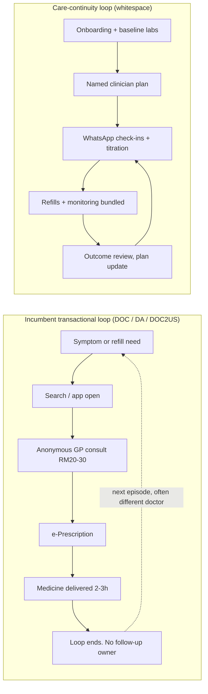

# Malaysia Telehealth: Definitive Sector Deep Dive

**Abstract.** Malaysia's telehealth sector is a paradox: one of Southeast Asia's oldest telemedicine legal frameworks (the never-enforced Telemedicine Act 1997) sits beneath one of its most under-institutionalised markets. COVID-19 produced a genuine step-change in usage — DoctorOnCall's monthly active users quadrupled in a year, the Ministry of Health (MOH) co-opted private platforms for its national COVID response, and 45.8% of public primary-care clinics were running some form of teleconsultation by end-2020 — but the sector has since settled into a transactional, low-margin equilibrium dominated by one-off GP consults at RM19.90–RM30 and online-pharmacy fulfilment. Market-size estimates diverge by an order of magnitude (USD ~0.6B to USD ~1.8–2.2B for 2023–24) because firms measure different things; we reconcile the ranges and estimate the genuinely contestable telehealth services revenue pool at roughly USD 350–550M in 2024, growing 12–20% p.a. to 2030. Regulatory clarity arrived only in May 2025 with MOH's Guideline on Online Healthcare Services, with a Digital Health Act targeted for 2026. Funding has collapsed (SEA healthtech venture funding fell 79% YoY in 2024), incumbents are consolidating or coasting, and no player owns care continuity, chronic/weight programmes at clinical depth, or WhatsApp-native care delivery — the three pillars of the Welltech thesis. This document covers history, market sizing, the full player landscape, business models and unit economics, public-sector telehealth, funding/M&A, usage evidence, infrastructure, gap analysis, Porter's Five Forces, SWOT, and a 2024–2030 forecast.

Last updated: July 2026.

Related documents: [Malaysia market overview](malaysia-market-overview.md) · [Malaysia regulations](malaysia-regulations.md) · [WhatsApp healthcare workflows](whatsapp-healthcare-workflows.md) · [Competitor dossiers](../20-competitor-dossiers/) · [Welltech blueprint](../70-welltech-blueprint/) · [Research standards](../RESEARCH-STANDARDS.md)

---

**Contents:** 1. Executive view · 2. History & catalysts · 3. Market size & forecasts · 4. Usage & evidence · 5. Player landscape (matrix, pricing, profiles, funding/M&A) · 6. Business models & unit economics · 7. Government & public-sector telehealth · 8. Regulatory snapshot · 9. Infrastructure & value chain · 10. Gap analysis & WhatsApp whitespace · 11. Porter's Five Forces · 12. SWOT · 13. Growth outlook & watchlist · 14. Bottom line · Appendix A · References

---

## 1. Executive view

| Dimension | State of play (2024–2026) |
|---|---|
| Regulation | Telemedicine Act 1997 never brought into force; MOH proposes abolishing it. MMC Guideline on Telemedicine (published January 2024) governs practitioner conduct; MOH Guideline on Online Healthcare Services (OHS) issued via DG circular 15 May 2025; Digital Health Act targeted for tabling in Parliament in 2026.[^5][^6][^7][^9][^14] |
| Market size | Contested: USD 587.9M (Statista digital-health definition, 2024) vs USD 1.85B (Grand View Research telemedicine definition, 2023) vs USD 1.1B (Ken Research digital health & telemedicine). Core contestable telehealth-services pool: USD 350–550M *(analyst estimate, §3.3)*.[^1][^2][^3] |
| Growth | 9.1% CAGR (Statista, digital health to 2028) to 19.7% CAGR (GVR, telemedicine to 2030).[^1][^3] |
| Leading platform | DoctorOnCall: claims >500 GP clinic network, 1.9M registered users, >20M annual visits (site traffic, not consults).[^28] |
| Consumer adoption | 48.7% of surveyed Malaysians had never used online health consultation as of January 2023; ~5% used it frequently.[^4] Median willingness-to-pay for a teleconsult: RM58–78.[^17] |
| Public sector | 376 government clinics offering virtual consultations by 2023; MySejahtera being repositioned as a "public health super app"; RM150M (≈USD 31M) allocated to MOH IT systems including cloud clinic management for 100 clinics.[^13][^22][^24] |
| Funding climate | SEA healthtech + life sciences funding fell to USD 123M in 2024, −79% YoY, a 7-year low; Malaysia-specific rounds are small (ECF, angel, sub-USD 10M).[^45] |
| Whitespace | Care continuity, medically supervised weight/GLP-1 programmes, WhatsApp-first workflows (WhatsApp used by 90.7% of Malaysian internet users), concierge/chronic longitudinal models.[^52] |

**Implications for Welltech.** Malaysia is a market where telehealth *infrastructure and habits* exist but telehealth *relationships* do not. Incumbents built pipes (consults, delivery, e-prescriptions) and rent them out per transaction. The May 2025 OHS Guideline raises compliance costs for casual entrants exactly as Welltech enters — a moat opportunity for a compliant, clinician-led operator, provided Welltech registers a Malaysian entity with a locally registered medical practitioner in senior management.[^10]

---

## 2. History and catalysts

### 2.1 Timeline

| Period | Event | Significance |
|---|---|---|
| 1997 | **Telemedicine Act 1997 (Act 564)** passed as part of the Multimedia Super Corridor push; Royal Assent 18 June 1997 | World's first dedicated telemedicine statute — but **never brought into force**; restricted practice to fully registered local practitioners and licensed foreign doctors.[^5] |
| 1997–2000s | Telemedicine Flagship Application under MSC: Mass Customised/Personalised Health Information & Education, Lifetime Health Plan, teleconsultation pilots | Established MOH's early digital-health ambitions; largely stalled on infrastructure and funding.[^47] |
| ~2005–2015 | MOH teledermatology (store-and-forward for underserved districts) | Service **terminated in 2015** — an early lesson that public tele-specialty programmes wither without operational ownership.[^25] |
| 2015–2017 | Startup wave: Doctor2U (BP Healthcare, Oct 2015), BookDoc (2015), DoctorOnCall (founded 2017 by Maran Virumandi and Hazwan Najib), DOC2US (2017), Teleme, GetDoc | Private B2C telehealth emerges without an enforced statutory framework; practitioners "self-regulate."[^6][^23][^48] |
| Sep 2019 | MOH pilots video-based teleconsultation at **5 public primary care clinics** | First official public virtual-clinic pilot; aimed at decongesting Klinik Kesihatan.[^15] |
| Feb 2020 | MOH × DoctorOnCall **Virtual Health Advisory** for COVID-19: free specialist advice portal, escalation to CPRC protocol | Landmark public-private telehealth partnership; later extended to online appointment booking for the Klinik Kesihatan network.[^23][^26] |
| Apr 2020 | MMC issues **Advisory on Virtual Consultation** (COVID-era): telemedicine chiefly for *existing* patients as continuation of care | The "existing patient" doctrine shapes conservative practitioner behaviour to this day; advisory later rescinded and replaced.[^8] |
| 2020–2021 | COVID acceleration: DoctorOnCall MAU 600K (Jan 2020) → 2.5M (Jan 2021); public clinics adopt phone/video follow-ups (45.8% of clinics by Dec 2020) | Demand-side habit formation at national scale.[^16][^27] |
| 2022 | **Online Healthcare Services Regulatory Lab (OHS RegLab)** launched with Futurise Sdn Bhd | Regulatory sandbox whose outputs became the basis of the OHS Guideline and the coming Digital Health Act.[^14] |
| Jun 2023 | **Health White Paper** approved by Parliament: 15-year reform, EMR + Electronic Lifetime Health Record + Health Information Exchange | Digital records positioned as the backbone of care coordination; telehealth implicitly mainstreamed.[^21] |
| Jan 2024 | **MMC Guideline on Telemedicine** published | Replaces the COVID advisory; sets competence, consent, and ethical parity with in-person care.[^7] |
| 15 May 2025 | **MOH Guideline on Online Healthcare Services 2025** issued (DG of Health Circular No. 16/2025) | First comprehensive platform-level rulebook: local physical presence, registered practitioner in senior management, patient/practitioner verification, PDPA compliance, complaint handling.[^9][^10][^11] |
| 2025–2026 | MOH drafts **Digital Health Act** (target: tabling 2026); proposal to abolish Telemedicine Act 1997; Cloud-Based Clinical Management System (CCMS) and "One Individual, One Record" rolled out under 13th Malaysia Plan preparations | The regulatory and data substrate for institutional telehealth is finally being poured.[^6][^14][^24] |

### 2.2 What actually drove adoption

1. **COVID-19, not regulation.** Usage exploded 2020–21 under Movement Control Orders while the legal framework remained a vacuum. The Ken described Malaysian telemedicine in 2020 as "mushrooming unregulated."[^27]
2. **Public-sector legitimisation.** MOH's decision to run its COVID Virtual Health Advisory *on* DoctorOnCall — rather than build in-house — signalled to consumers and doctors that private telehealth was acceptable.[^23][^26]
3. **Pharmacy pull-through.** E-prescription plus 2-hour medicine delivery (DoctorOnCall, DOC2US×Alpro×GDEX, Alpro×GrabExpress) made telehealth a commerce category, not just a consult category.[^38][^39][^40]
4. **Insurer/employer distribution.** AIA embedding DOC2US in the My AIA app, Prudential's Pulse (launched Malaysia August 2019 with Babylon symptom-checker and DoctorOnCall consults), and employer panels via HealthMetrics normalised "free-to-user" teleconsults.[^41][^43][^44]

**Implications for Welltech.** Every historical catalyst was *supply-push or crisis-pull*; none built longitudinal engagement. The habit that exists is "get a consult/MC/medicine fast and cheap." Welltech should not fight this habit head-on but use it as a top-of-funnel entry into programme-based care — the model no catalyst has yet created.

---

## 3. Market size and forecasts

### 3.1 The estimates and why they disagree

| Source | Definition scope | Base figure | Forecast | CAGR |
|---|---|---|---|---|
| Grand View Research (Horizon) | "Telemedicine" — products (hardware/software/tech) **plus** services; broadest scope | **USD 1,848.6M (2023)**; Malaysia = 1.6% of global telemedicine revenue | USD 6,515.4M by 2030 | 19.7% (2024–30)[^1] |
| Ken Research | "Digital health and telemedicine" combined | **USD 1.1B** (latest five-year historical analysis; base year not disclosed in public summary) | to 2030 (paywalled) | n/d[^2] |
| Statista Market Insights | Consumer "digital health" revenue (incl. digital fitness & well-being USD 242.3M) | **USD 587.9M (2024)** | USD 834.2M by 2028 | 9.14% (2024–28)[^3] |
| Tracxn / Galen Growth (funding, not revenue) | VC funding into SEA healthtech | SEA total **USD 123M (2024)**, −79% YoY; Malaysia a small share | — | —[^45][^46] |

Reconciliation:

- **GVR's USD 1.85B is not a services market.** Its Malaysia telemedicine outlook counts "product" (tele-hardware, software, connected devices) as the largest component in 2023, with services only the fastest-growing segment.[^1] Treating USD 1.85B as the addressable consult/care market would overstate it several-fold.
- **Statista's USD 588M includes digital fitness/wellbeing apps** (USD 242M), leaving roughly USD 300–350M for eHealth (online pharmacy, online doctor consultations, digital treatment).[^3]
- **Ken's USD 1.1B** blends digital health infrastructure and telemedicine services and cites RM1.2B of government digital-health investment since 2020 — again broader than the private telehealth services pool.[^2]

### 3.2 Volume indicators (reported, fragmentary)

- DoctorOnCall: ~800K monthly site visitors (2020) → 2.5M MAU (Jan 2021); later corporate materials claim 1.9M registered users and >20M annual *visits* (web traffic, not consultations).[^27][^28] Actual consult volumes are not published by any Malaysian platform.
- Public sector: 45.8% of 249 public primary-care clinics offered teleconsultation by Nov–Dec 2020 — but 60.5% of those offered *telephone only*; most use was for diabetes/hypertension follow-up.[^16] By 2023, 376 government clinics had adopted virtual consultations, with MOH-reported growth of ~65% since.[^13][^24]
- Consumer penetration: as of January 2023, 48.7% of surveyed Malaysians had never used online health consultation; ~5% used it frequently.[^4]

### 3.3 Analyst estimate: the contestable telehealth services pool

*(analyst estimate)* Stripping devices, software, and fitness apps out of the published figures, the Malaysian revenue pool that a care-delivery operator can actually compete for — B2C/B2B teleconsultations, tele-triage, online pharmacy attach, chronic/wellness programmes, home care — was on the order of **USD 350–550M in 2024** (RM 1.6–2.6B). Reasoning: Statista's non-fitness eHealth remainder (~USD 300–350M) is the floor; adding B2B2C employer/insurer-funded consults, home care, and digital therapeutics not captured in consumer-revenue panels plausibly adds USD 50–200M. Consultation fees alone are a small slice (at RM25–80/consult, even 10M paid consults/year ≈ RM 250–800M ≈ USD 55–175M); **the majority of the pool is medicines and programmes, not consult fees** — which is why every incumbent converged on pharmacy attach.

### 3.4 Growth forecast 2024–2030

| Scenario | 2024 (USD M) | 2026E | 2028E | 2030E | CAGR | Assumptions |
|---|---|---|---|---|---|---|
| Conservative (Statista-anchored) | 400 | 480 | 570 | 660 | ~9% | Digital-health growth at Statista's 9.1%; no regulatory catalyst.[^3] |
| Base *(analyst)* | 450 | 590 | 780 | 1,030 | ~15% | OHS Guideline + Digital Health Act 2026 legitimise reimbursement and employer adoption; GLP-1/chronic programmes add a new premium layer. |
| Aggressive (GVR-anchored) | 500 | 720 | 1,030 | 1,480 | ~19.7% | GVR's telemedicine CAGR applied to the services pool; public-sector procurement of private telehealth scales.[^1] |

**Implications for Welltech.** Do not size Welltech's opportunity off headline market reports — the real fee pool is modest and consult-fee competition is destructive (RM19.90 floor). The expandable layers are (a) medicines/GLP-1 attach, (b) recurring programme subscriptions, and (c) employer/insurer contracts. A RM 200–400/month weight or longevity programme with medication attach captures more revenue per patient per year than ~50 marginal teleconsults.

---

## 4. Usage, satisfaction and evidence base

| Study / dataset | Year | Key finding |
|---|---|---|
| JMIR Formative Research — national cross-sectional survey of public primary-care clinics | data Nov–Dec 2020; publ. May 2022 | 45.8% (114/249) of clinics provided teleconsultation; of these 60.5% telephone-only, 24.6% phone+video, 14.9% video-only; mainly urban; used mostly for diabetes and hypertension follow-up.[^16] |
| Malaysian Journal of Public Health Medicine — mental-health teleconsultation satisfaction | survey Jun–Aug 2020 | 49.1% highly satisfied vs 34.0% dissatisfied (n=106); convenience (no travel) the top satisfaction driver; inability to express feelings deeply the top complaint.[^18] |
| JSM Computer Science & Engineering — DOC2US platform case study | 2023–24 | Mean satisfaction 4.1/5; communication quality and "feeling valued" scored >4; ~40% reported appointment-scheduling problems.[^19] |
| Selangor government health clinics — provider satisfaction with virtual consultation services | publ. 2024 | 72.3% of healthcare providers satisfied with virtual consultation services.[^20] |
| Malaysian Journal of Medical Sciences — willingness-to-pay (double-bounded dichotomous choice, n=220) | publ. 2024 | Median WTP RM58 and RM78 across bid arrays among those willing to use teleconsultation; RM26 among the unwilling; affordability and sociodemographics shape WTP.[^17] |
| Statista consumer survey | Jan 2023 | 48.7% never used online health consultation; ~5% frequent users.[^4] |
| Telehealth adoption modelling (Journal of Infrastructure, Policy and Development) | 2024 | Performance expectancy, effort expectancy, self-efficacy and trust explain 82.1% of variance in intention to adopt telehealth.[^42] |

### 4.1 Demand segmentation read-out

| Segment | Telehealth behaviour (evidence) | Value to a continuity operator |
|---|---|---|
| Urban convenience users | Drove the COVID surge (DOC MAU 600K→2.5M); price-sensitive at RM20–30; churn between platforms freely[^27][^30] | Top-of-funnel only; convert selectively into programmes |
| Chronic-disease patients | Served today by public phone-based follow-up (diabetes/hypertension dominate public teleconsult use); refill demand powers e-pharmacy growth (DOC2US: one e-prescription filled per minute; +160% prescription demand)[^16][^49] | Core programme economics; highest annual value |
| Employer-covered workforce | Reached via HealthMetrics TPA rails, Qmed kiosks, insurer apps; consults free at point of use[^41][^50][^56] | B2B2C channel for weight/metabolic programmes with measurable absenteeism ROI (Naluri's claimed 4× ROI is the reference sales motion)[^60] |
| Weight-management / GLP-1 seekers | Buying Wegovy today through aesthetic-clinic online consults with delivery — fragmented, unmonitored, premium-priced[^78][^79] | Immediate wedge segment: high WTP, clinically underserved, no incumbent owner |
| Mental-health users | Teleconsultation satisfaction driven by convenience/privacy but limited by depth of connection (49.1% highly satisfied)[^18] | Adjacent programme layer; integrates with metabolic care (Naluri's pairing validates it)[^58] |
| Rural / access-constrained users | Target of MOH virtual clinics and NaDi internet centres; unlikely to pay privately[^13][^24] | Public-sector domain; not a Welltech segment near-term |

Read-through: satisfaction is decent but not enthusiastic; the binding constraints are trust, scheduling friction, and the shallow, transactional nature of encounters — not technology availability. Notably, the WTP evidence (RM58–78) sits **well above** prevailing B2C consult prices (RM19.90–30), implying incumbents compete on price in a market that would pay ~2–3× for perceived quality.[^17]

**Implications for Welltech.** The RM58–78 WTP headroom is the single most actionable datapoint in the Malaysian evidence base: a premium, continuity-based teleconsult experience (named doctor, WhatsApp follow-up, programme context) can price at RM60–100 without fighting the RM19.90 commodity floor.

---

## 5. Player landscape

### 5.1 Landscape matrix

| Player | HQ / origin | Model | Funding (reported) | Scale claims | Entry price (B2C) |
|---|---|---|---|---|---|
| **DoctorOnCall (DOC)** | MY, 2017 | B2C teleconsult + online pharmacy + marketplace + corporate/insurer panels + government projects | ~USD 5.1M tracked (Tracxn); investors incl. Samsung Ventures, Khazanah via MTDC, Fischer Medical Ventures (2024); US$122K NTIS/MTDC grant | >500 GP clinic network; 1.9M registered users; >20M annual visits; 2.5M MAU (Jan 2021) | GP consult from RM19.90; specialist from ~RM80; pharmacy delivery ≤2h in Klang Valley[^28][^29][^30][^31] |
| **Doctor Anywhere MY** | SG, in MY since ~2019 | Regional app: video GP, medicine delivery (3h), corporate/insurer B2B2C; advised MOH on telemedicine framework | US$65.7M Series C (2021, Asia Partners; Novo, Philips, OSK-SBI, IHH); +US$40.8M C1 extension (Dec 2022); >S$140M total | 5 SEA markets; acquired Asian Healthcare Specialists (SG, 12 specialist clinics) | GP video RM25 (promos RM19.80)[^32][^33][^34] |
| **Speedoc MY** | SG, in MY since 2019 | "Virtual hospital": teleconsult, house calls, home nursing, H-Ward hospital-at-home; insurer tie-ups (Manulife Home Ward) | US$5M Series A (2020, Vertex); US$28M pre-Series B (Nov 2022, Bertelsmann, Shinhan, Mars Growth) | 9 cities total, 8 in Malaysia | Teleconsult from RM30; house call from RM250 (+RM100/extra person)[^35][^36][^37] |
| **DOC2US** | MY, 2017 | Chat-first telemedicine + e-prescription rails; telepharmacy; B2B2C (AIA); DOC2HOME home care (2023) | Undisclosed; corporate-backed partnerships (Microsoft, Agmo, MSC TrustGate) | 4,000+ healthcare professionals; >1M patients served; 2,000+ integrated pharmacies; first MOH-recognised digitally-signed e-prescription provider | Chat consult low-cost/freemium tiers; priced per service[^38][^41][^49] |
| **Qmed Asia** | MY, 2018 (as QueueMed) | B2B/B2B2C: queue & appointment SaaS → Qmed GO workplace telehealth kiosks (16 vital parameters), AI health tech | RM5.1M (US$1.16M) ECF via Leet Capital (2023; MyCIF, 1337 Ventures); earlier accelerator backing | 42 COVID vaccination centres operated; Nestlé, SP Setia contracts; kiosks in workplaces | B2B contract pricing[^50][^51] |
| **BookDoc** | MY, 2015 | Appointment booking, corporate wellness (Activ rewards), directory; added virtual consults | US$2.31M over 5 rounds; angels incl. Brunei royalty, Stanley Ho family; valuation US$7.26M (2018) | Regional partnerships; no audited usage data | Free booking; consult fees per provider[^53] |
| **GetDoc** | MY/SG | Clinic discovery + payments app; employer health benefits | Undisclosed, small | Listed among market participants; low visibility post-COVID | n/d[^54] |
| **Teleme** | MY, ~2017 | Multi-practitioner marketplace (doctors, pharmacists, labs); chat/video; e-prescription | Undisclosed, small | 500+ licensed practitioners; claimed 1 of only 2 platforms with Pharmacy Board-compliant e-prescription (as of mid-2021) | Per-practitioner fees[^55] |
| **Doctor2U (BP Healthcare)** | MY, Oct 2015 | On-demand house calls, video consult, medicine delivery; arm of diagnostics group BP Healthcare | Corporate-funded (BP Healthcare) | 1,000+ doctors claimed; partners: Zurich, AIA, Great Eastern, hotels | House-call + consult fees; app-based[^48] |
| **HealthMetrics** | MY, 2015 | Digital TPA/employer healthcare administration; panel GP network incl. teleconsult riders | US$5M (RM20M) Series A (2020, ACA Investments); strategic investment into Indonesia's Across Asia Assist | 3,000+ provider network; clients: PwC, Mr DIY, FamilyMart, KLK | B2B (PEPM/ASO)[^56][^57] |
| **Naluri** | MY, 2017 | Digital therapeutics / behavioural health coaching for cardiometabolic + mental health; B2B2C via employers & insurers | US$14M total Series B (2022–Aug 2025; TELUS Global Ventures, Sumitomo, M Venture Partners) | 120 FTE + 150 part-time health professionals; clients incl. IOI, Prudential; peer-reviewed outcomes (60% achieve clinically significant improvement) | B2B per-member programmes[^58][^59][^60] |
| **Alpro Pharmacy** | MY, 2002 | Largest prescription-pharmacy chain; ePharmacy (teleconsult + refill + 2h delivery); GrabExpress partnership | Private; self-funded expansion | >300 outlets; e-pharmacy >5% of group revenue; projects e-pharmacy at 20–30% of pharma market long-term | Medicine + delivery; consult via partner platforms[^39][^40] |
| **iMedic** | SG/MY | Device-integrated telemedicine + cloud EMR/RPM for chronic disease; provider-facing | Undisclosed | Used in SG, MY + other markets; MOH Singapore-approved (Healthier SG Tier 1 CMS) | Provider SaaS[^61] |
| **KlinikGo** | ID (often mislabelled MY) | Clinic-network homecare/telemedicine aggregator — **Indonesia-focused**; not a material Malaysian player | Backed by Gaido Group and SG investors | 500K+ users (Indonesia) | n/a for MY[^62] |
| **Hospital telehealth** — IHH (Pantai/Gleneagles), KPJ, Sunway, Columbia Asia | MY | Adjunct video consults for existing/specialist patients | Hospital-group funded | IHH: 11 Pantai + 4 Gleneagles hospitals bookable; KPJ: Google Meet consults, existing patients only; Sunway: 24/7 Telemedicine Command Centre (free helpdesk) + home-care teleconsults | Specialist consult fees[^63][^64][^65] |
| **Insurer/TPA telehealth** — AIA (DOC2US), Prudential Pulse (Babylon + DoctorOnCall), Great Eastern (via Doctor2U partnerships) | MY | Free/subsidised consults inside insurer apps; wellness gamification | Carrier-funded | Pulse launched MY Aug 2019 (first market); AIA consults + e-prescriptions in My AIA app | Free to policyholders[^41][^43][^44][^48] |
| **Grab Health (historical)** | SG/regional | 2018 JV with Ping An Good Doctor ("Grab Health/GoodDoctor"); launched Indonesia 2019; never scaled in Malaysia; Good Doctor Indonesia sold to WhiteCoat (Oct 2024) | JV: Ping An + Grab; Good Doctor raised US$10M+ Series A | Exit/consolidation case study | Defunct as consumer play in MY[^66][^67][^68] |

### 5.2 B2C pricing benchmark (published prices, mid-2020s)

| Service | DoctorOnCall | Doctor Anywhere MY | Speedoc MY | DOC2US | Hospital telehealth (IHH/KPJ/Sunway) | Walk-in GP (reference) |
|---|---|---|---|---|---|---|
| GP teleconsult | from RM19.90[^30] | RM25 (RM19.80 promo)[^35] | from RM30 / 15 min[^37] | chat-based, low-cost/bundled tiers[^38] | n/a (GP layer not offered) | RM30–80 typical *(analyst reference)* |
| Specialist teleconsult | from ~RM80[^30] | via app, per specialist | n/a | n/a | full specialist consult fees[^63][^64] | RM80–250 |
| House call | n/a | n/a | from RM250 (+RM100/extra person)[^37] | via DOC2HOME[^49] | Sunway Home Healthcare packages[^65] | n/a |
| Medicine delivery | ≤2h express (Klang Valley)[^30] | ≤3h[^35] | same-day[^37] | GDEX nationwide / pharmacy pickup[^38] | hospital pharmacy | n/a |
| Insurer-funded consult | via Pulse (Prudential)[^43] | via corporate/insurer panels[^32] | Manulife Home Ward (H-Ward)[^69] | free in My AIA app[^41] | panel/GL arrangements | panel clinics |

Two readings: (1) B2C consult pricing is pinned at RM19.90–30 — below the RM58–78 measured willingness-to-pay — because platforms treat the consult as pharmacy-funnel CAC;[^17][^30] (2) nobody prices a *membership*: there is no published subscription tier for continuous care on any Malaysian consumer platform *(observation from public price pages, mid-2020s)*.

### 5.3 Deep dives on the four incumbents that matter

**DoctorOnCall — the traffic monopolist.** DOC's moat is SEO + brand: ~1M monthly web visits by 2020 and a pharmacy catalogue of ~3,000 registered medicines make it Malaysia's default "online doctor" destination.[^27][^30] Its economics lean on pharmacy margin (medicines claimed "up to 70% cheaper than clinics/hospitals") and corporate/insurer panels; its government work (COVID Virtual Health Advisory, Klinik Kesihatan appointment system) bought regulatory goodwill.[^23][^26][^30] Funding is thin for its ambitions — tracked equity is only ~USD 5.1M plus undisclosed cheques from Samsung Ventures, Khazanah-linked MTDC and, in 2024, India's Fischer Medical Ventures, which is using DOC as the chassis for international expansion.[^28][^29][^31] Weakness: the model is a funnel, not a relationship — consults are anonymous, episodic, doctor-rotating.

**Doctor Anywhere Malaysia — the regional B2B2C machine.** DA is the best-capitalised player touching Malaysia (>S$140M raised) and monetises through insurer/employer contracts more than B2C.[^32][^33] Its Malaysia arm advised MOH on the telemedicine regulatory framework — a signal of institutional positioning.[^34] Its strategic centre of gravity (specialist care via the AHS acquisition, premium clinics) is Singapore; Malaysia gets the standardised app playbook: RM25 GP video consults and 3-hour medicine delivery.[^33][^35]

**Speedoc — the acuity ladder.** Speedoc is the only player that escaped the RM20-consult trap by going *up* the acuity curve: house calls (RM250+), 24/7 home nursing, and H-Ward hospital-at-home, including insurer products (Manulife Home Ward Programme) and a Singapore MOH MIC@Home pilot role.[^36][^37][^69] Its telehealth is a feeder for high-ticket home services — structurally the closest analogue to Welltech's "telehealth as entry to deeper care" thesis, but focused on acute/post-acute rather than chronic/preventive.

**DOC2US — the rails builder.** DOC2US chose infrastructure over consumer brand: first MOH-recognised digitally-signed e-prescription system, 2,000+ integrated pharmacies, Bayer-partnered telepharmacy for family planning, GDEX logistics, and the AIA Malaysia integration.[^38][^41][^49] Its chat-first model is the nearest existing thing to "messaging-native" care in Malaysia — but it remains transactional, with no longitudinal programme layer.

### 5.4 Second-tier and adjacent players — quick profiles

- **Qmed Asia** began as QueueMed, a queue-and-appointment SaaS for clinics; the pandemic turned it into an operations partner for 42 vaccination centres and pushed it into hardware: Qmed GO workplace kiosks bundle a GP video consult with cloud-connected IoT devices reading up to 16 vital parameters, sold to employers (Nestlé, SP Setia) as a medical-cost-containment tool. Funding remains shallow (RM5.1M ECF, 2023), and the kiosk model is capex- and utilisation-constrained, but Qmed's employer relationships and on-site vitals data are a natural partnership surface for programme operators.[^50][^51]
- **BookDoc** is a cautionary tale in horizontal breadth: appointments, directories, corporate wellness (BookDoc Activ step-rewards), and virtual consults, funded by celebrity angels (Brunei royalty, the Stanley Ho family) but never past ~US$2.3M in disclosed capital. It retains corporate-wellness distribution but publishes no audited usage.[^53]
- **Teleme** built a genuinely multi-disciplinary marketplace (doctors, pharmacists, labs) and was early on compliant e-prescriptions (one of only two platforms with Pharmacy Board-compliant e-Rx as of mid-2021), yet stayed sub-scale — evidence that regulatory diligence without distribution does not compound.[^55]
- **GetDoc** (clinic discovery/payments) has minimal post-COVID visibility; it survives in market-participant lists rather than in consumer mindshare.[^54]
- **Doctor2U** demonstrates the corporate-parent model: BP Healthcare (diagnostics chain) uses it as a digital front door with house calls, video consults and insurer partnerships (Zurich, AIA, Great Eastern). Its constraint is strategic: it exists to feed BP's diagnostics and retail assets, not to build standalone telehealth economics.[^48]
- **HealthMetrics** is not a consumer telehealth brand but controls the employer rail that consumer platforms want: digital TPA administration across 3,000+ providers for corporates (PwC, Mr DIY, FamilyMart, KLK), with regional ambitions via its Across Asia Assist investment. Whoever owns claims adjudication owns the employer telehealth on-ramp.[^56][^57]
- **Naluri** is Malaysia's only evidence-published digital therapeutics operator: cardiometabolic + mental-health coaching sold to employers/insurers, ~270 health professionals (FTE + part-time), peer-reviewed real-world outcomes (60% of participants achieving clinically significant improvements), US$14M Series B completed August 2025 with profitability targeted within a year. It validates Malaysian willingness to fund *programmes* — but it deliberately stops short of prescribing, clinics, and B2C.[^58][^59][^60]
- **Hospital systems (IHH, KPJ, Sunway, Columbia Asia)** run telehealth as a retention adjunct: IHH books video consults across 11 Pantai and 4 Gleneagles hospitals; KPJ restricts telemedicine to existing patients over Google Meet; Sunway operates a free 24/7 Telemedicine Command Centre as a triage/helpdesk funnel into its hospital. None competes for primary-care telehealth volume — they defend specialist and inpatient revenue.[^63][^64][^65]
- **Insurer channels**: AIA (DOC2US inside My AIA), Prudential (Pulse, launched in Malaysia August 2019 as its first market, with Babylon symptom-checking and DoctorOnCall consults), Great Eastern (panel model; telehealth exposure via partners such as Doctor2U). Insurer telehealth is free-to-user, which anchors consumer price expectations at zero for basic consults — another reason not to compete at the commodity layer.[^41][^43][^44][^48]

### 5.5 Funding & M&A history (Malaysia-relevant digital health)

| Year | Company | Event | Amount | Investors / notes |
|---|---|---|---|---|
| 2016–18 | BookDoc | Seed/angel rounds | ~US$2.3M cumulative | Brunei royal family, Stanley Ho family; valuation ~US$7.3M (2018)[^53] |
| 2018 | Grab × Ping An Good Doctor | JV formation | n/d | O2O healthcare JV for SEA; Malaysia never launched at scale[^66] |
| 2020 | HealthMetrics | Series A | US$5M (RM20M) | ACA Investments (JP/SG)[^56] |
| 2020 | Speedoc | Series A | US$5M | Vertex Ventures SEA & India[^36] |
| 2021 | Doctor Anywhere | Series C | US$65.7M (S$88M) | Asia Partners; Novo Holdings, Philips, OSK-SBI, EDBI, IHH Healthcare[^32] |
| 2022 | Naluri | Series B first tranche | part of US$14M total | Sumitomo Corporation Equity Asia, M Venture Partners et al.[^58] |
| Nov 2022 | Speedoc | Pre-Series B | US$28M | Bertelsmann Investments, Shinhan Venture Investment, Mars Growth[^36] |
| Dec 2022 | Doctor Anywhere | Series C1 extension + M&A | US$40.8M; acquired Asian Healthcare Specialists (Catalist-listed, 12 specialist clinics) | Breakeven targeted end-2023[^33] |
| Apr 2023 | Qmed Asia | Equity crowdfunding | RM5.1M (US$1.16M) | Leet Capital; MyCIF, 1337 Ventures, angels[^50][^51] |
| 2023 | DoctorOnCall | NTIS grant | US$122K | MTDC (Khazanah-linked)[^29] |
| Oct 2024 | Good Doctor Indonesia | Acquired by WhiteCoat Global | n/d | SEA's largest telehealth M&A; end-state of the Grab Health JV era[^68] |
| 2024 | DoctorOnCall / Health Digital Technologies | Strategic investment | n/d | Fischer Medical Ventures (India, listed) via Time Medical International Ventures; joins Samsung Ventures, Khazanah/MTDC[^31] |
| Aug 2025 | Naluri | Series B final tranche | US$5M (US$14M total Series B) | TELUS Global Ventures (Pollinator Fund); targeting profitability within a year[^58] |
| Context | SEA sector | Funding collapse | US$123M total SEA healthtech (2024), −79% YoY, −90% vs 2022; Singapore took ~75% | Tracxn annual report; APAC digital health funding −19–27% (Galen Growth)[^45][^46] |

**Failures/exits pattern:** Grab Health (super-app distribution without clinical depth) quietly dissolved into the WhiteCoat–Good Doctor consolidation; MOH's own teledermatology died in 2015; GetDoc and Teleme have stagnated at sub-scale.[^25][^54][^55][^68] The consistent failure mode: distribution-first plays with no owned clinical relationship and no recurring-revenue programme.

**Implications for Welltech.** (1) Capital scarcity means incumbents cannot outspend a focused entrant — DA and Speedoc are prioritising profitability over land-grab. (2) Acquisition targets are cheap: Teleme/GetDoc-class assets, or even DOC2US's rails, could be partnered with or bought rather than rebuilt. (3) Insurer distribution is contested (AIA→DOC2US, Prudential→DOC/Babylon) but *programme-layer* partnerships (weight, longevity, chronic) are unclaimed — Naluri is the only credible occupant and it is B2B-only, coaching-led, non-prescribing.

---

## 6. Business models and unit economics

### 6.1 Model taxonomy

| Model | Who runs it | Revenue mechanics | Structural problem |
|---|---|---|---|
| B2C one-off consult | DOC, DA, Speedoc, DOC2US | RM19.90–30 GP video/chat; RM80+ specialist | Price war to the WTP floor; CAC > LTV on consult alone; no retention[^30][^35][^37] |
| Online pharmacy attach | DOC, Alpro, DOC2US×Alpro | Medicine margin + delivery fee; DOC claims prices up to 70% below clinics | Margin capture accrues to whoever holds prescription + fulfilment; regulated by Poisons Act dispensing rules[^30][^39][^70] |
| B2B2C employer/insurer panel | DA, DOC, DOC2US (AIA), HealthMetrics, Qmed | Per-member or per-consult contracts; free at point of use | Payor squeezes fees; platform is substitutable; no patient ownership[^41][^50][^56] |
| Chronic-care / DTx programmes | Naluri (coaching); public-sector pilots | Per-member-per-month programmes; outcomes-linked renewals | Only wellness/coaching depth; no prescribing integration (Naluri does not run medical weight-loss clinics)[^58][^60] |
| Home care / hospital-at-home | Speedoc, DOC2HOME, Sunway Home Healthcare | RM250+ house calls; nursing packages; insurer H-Ward products | High opex, staffing-bound; acute focus[^37][^49][^65] |
| Kiosk / worksite telehealth | Qmed GO | Hardware + subscription to employers; 16-parameter vitals + GP consult | Capex-heavy; utilisation risk[^51] |
| Hospital adjunct telehealth | IHH, KPJ, Sunway | Specialist video follow-ups at full consult fees; KPJ restricts to existing patients | Deliberately non-disruptive; protects inpatient economics[^63][^64][^65] |

### 6.2 Teleconsult + delivery unit economics *(analyst estimate)*

Illustrative per-encounter P&L for a standalone B2C GP teleconsult with medicine delivery in Klang Valley, at prevailing prices:

| Line | RM | Basis |
|---|---|---|
| Consult fee (B2C) | 25 | DA RM25; DOC from RM19.90; Speedoc RM30[^30][^35][^37] |
| Doctor payout | −15 to −18 | Locum GP rates imply RM60–100/hr; 4–5 consults/hr *(inference from market locum rates; platforms do not disclose)* |
| Payment/platform costs | −2 | Gateway + support |
| **Consult contribution** | **≈ +5 to +8** | Before CAC |
| Medicine basket (attach ~40–60% of consults) | +60–120 revenue | ~RM80 typical acute basket *(analyst estimate)* |
| Pharmacy gross margin (20–35%) | +12–40 | Retail pharmacy norms; DOC's "70% cheaper" claim implies thin acute margins, richer chronic margins[^30] |
| Delivery (2–3h, rider) | −8 to −15, partly passed through | GrabExpress/GDEX/courier partnerships[^38][^40] |
| **Encounter contribution** | **≈ RM10–35** | Only if medicines attach |

Conclusion: at RM19.90–30, the consult is a **loss-leader or break-even funnel**; the economic engine is dispensing margin and (for B2B) contracted panel fees. A chronic patient on monthly refills (hypertension, diabetes, GLP-1) is worth 10–30× a walk-in acute consult per year — yet no consumer platform runs structured chronic programmes with named-clinician continuity.

### 6.3 The structural journey gap

The incumbent journey terminates where clinical value begins:

Every element on the left exists at scale in Malaysia today; no element on the right is offered by any at-scale player. The public system's teleconsultation is closest in *intent* (chronic follow-up for diabetes/hypertension) but is 60% telephone-based, capacity-constrained, and free-tier by design.[^16]

**Implications for Welltech.** Welltech's GLP-1/weight and longevity programmes invert the incumbent structure: the medicine + monitoring subscription is the product, and the consult is a bundled quality signal, priced within (not below) the RM58–78 WTP band. Target contribution: RM150–400/patient/month vs incumbents' RM10–35/encounter.

---

## 7. Government and public-sector telehealth

- **MOH virtual clinics.** From a 5-clinic video pilot (Sep 2019) to 376 government clinics with virtual consultation by 2023 (+~65% since), plus a home-grown MOH telemedicine platform reachable via MySejahtera.[^13][^15][^24] Public teleconsultation skews telephone-based and follow-up-oriented (diabetes/hypertension).[^16]
- **DoctorOnCall × MOH.** COVID Virtual Health Advisory (Feb 2020) with escalation into the MOH CPRC; online appointment booking for Klinik Kesihatan to decongest facilities.[^23][^26]
- **MySejahtera evolution.** From contact-tracing app (2020) to declared "digital public health super app" ambitions (Dewan Rakyat, Feb 2023): NCD screening for 40+, immunisation records, organ-donation registration, infectious-disease surveillance; Home Assessment Tool (2023) for remote post-discharge monitoring (78% self-reporting adherence in a 1,200-patient 2024 study); mpox care-plan module. Fragmentation risk is real — the Madani Medical Scheme launched a *separate* app despite super-app plans.[^71][^72][^73]
- **Health White Paper (June 2023).** 15-year reform blueprint approved by Parliament: EMR + Electronic Lifetime Health Record + Health Information Exchange as the coordination backbone; explicit public-private partnership framing.[^21]
- **Digitalisation reality check.** Only ~3% of public health clinics had digital health records at the KRI baseline, and <15% of facilities were meaningfully digitalised as of 2024; Budget allocations include RM150M (≈US$31M) for MOH IT including Cloud-Based Clinical Management System subscriptions in 100 clinics, with CCMS and "One Individual, One Record" scaling under 13MP preparations; a RM1B healthcare-venture fund has been announced; 911+ NaDi centres provide rural internet access points.[^13][^22][^24][^74]
- **MyDIGITAL context.** MyDigital ID provides single-login identity for government services — a future rail for patient identity/consent, distinct from the EMR programme.[^22]

**Implications for Welltech.** Public-sector telehealth will absorb low-income chronic follow-up demand but will not serve the private, convenience- and outcomes-driven segment Welltech targets. The practical plays: (a) align data practices now with the coming Digital Health Act and One-Individual-One-Record standards to be partnership-eligible; (b) treat MySejahtera as a referral-adjacent channel, not a competitor; (c) watch CCMS procurement — vendors winning public clinic systems may become private-market EMR default.

---

## 8. Regulatory snapshot (see [Malaysia regulations](malaysia-regulations.md) for full analysis)

| Instrument | Status | Operative effect |
|---|---|---|
| Telemedicine Act 1997 (Act 564) | Never in force; MOH consultation proposes abolition | Historical curiosity; creates the famous "regulatory vacuum"[^5][^6] |
| MMC Guideline on Telemedicine (Jan 2024) | In force (professional conduct) | Competence, consent, ethical parity; preference for existing-patient continuity with carve-outs for first consults in primary care[^7][^8] |
| MOH Guideline on Online Healthcare Services 2025 (DG Circular 16/2025, 15 May 2025) | In force (administrative) | Platform providers must: have a physical Malaysian place of business; include a registered medical practitioner with valid APC in senior management/board; verify patients and practitioners; secure records and communications; run complaint mechanisms; comply with PDPA 2010. Criticised by some clinicians as insufficient for public safety[^9][^10][^11][^12] |
| Poisons Act 1952 + Control of Drugs and Cosmetics Regulations 1984 | In force | Group B (prescription) medicines dispensable only by registered pharmacists against a valid prescription — the legal spine of e-prescription/telepharmacy models[^70] |
| Digital Health Act (draft) | Target: tabled 2026 | Comprehensive statutory framework grown out of OHS RegLab (Futurise, 2022); expected to underpin One-Individual-One-Record[^14] |

---

## 9. Infrastructure: EMR, payments, logistics

- **Clinic systems.** Malaysian private GP clinics (>9,800 registered private medical clinics as of 2022)[^75] run a fragmented long tail of clinic management systems: kumoDoc (cloud CMS with WhatsApp, accounting, payment-gateway and LHDN MyInvois integrations), Desk Clinic, C-MagSys/MAGSYS, xHealth, Kreloses, Aoikumo (aesthetics-focused) — with e-Invoice (LHDN) and SST compliance now table stakes.[^76] No single vendor holds dominant share *(inference from vendor fragmentation in market listings)*; interoperability is minimal, which is precisely what CCMS/One-Individual-One-Record aims to fix in the public system.[^24]
- **Public-system digitisation** remains the bottleneck: ~3% of public clinics with digital records at baseline; <15% of facilities digitalised (2024).[^13][^22]
- **Payments.** Consumer telehealth runs on cards, FPX online banking and e-wallets (Boost is embedded in Prudential Pulse) *(payment-mix inference; platform checkouts observed via their public sites)*.[^43]
- **Logistics.** The medicine last mile is solved and commoditised: Alpro × GrabExpress on-demand prescription delivery (2023), DOC2US × Alpro × GDEX nationwide delivery, DoctorOnCall's ≤2-hour Klang Valley express network.[^30][^38][^40]
- **Pharmacy networks as physical rails.** Alpro (>300 outlets, prescription-led), BIG Pharmacy and others act as pickup/fulfilment nodes for telehealth prescriptions — Bayer × DOC2US telepharmacy shows pharma manufacturers will co-fund these channels.[^38][^39]
- **Messaging.** WhatsApp is used by 90.7% of Malaysian internet users — the highest-reach digital channel in the country, with ~852 sessions/month per user; clinic software (kumoDoc) already integrates WhatsApp for reminders, and SEA WhatsApp Business adoption is scaling.[^52][^76][^77]

### 9.1 Telehealth value chain — who owns what

| Value-chain layer | Current owner(s) | Concentration | Rentable by Welltech? |
|---|---|---|---|
| Demand generation (SEO/brand) | DoctorOnCall dominates organic search[^27] | High | Partially — paid channels + owned WhatsApp lists bypass it |
| Triage & symptom assessment | Insurer apps (Babylon in Pulse), platform bots[^43] | Low | Build (AI-enabled, WhatsApp-native) |
| Consultation supply (GPs) | Fragmented: >9,800 private clinics; platforms rent locum pools[^75] | Very low | Yes — recruit named-panel clinicians |
| e-Prescription rails | DOC2US (digitally-signed, MOH-recognised), Teleme; platform-internal others[^38][^55] | Moderate | Yes — partner or replicate with MSC TrustGate-class signatures |
| Dispensing | Alpro (>300 outlets), BIG, chain + independent pharmacies; Poisons Act gatekeeping[^39][^70] | Moderate | Yes — pharmacy partnerships |
| Last-mile delivery | GrabExpress, GDEX, platform couriers[^38][^40] | Commoditised | Yes |
| Payments | FPX, cards, e-wallets (Boost et al.)[^43] | Commoditised | Yes |
| Longitudinal record | **Nobody** (public EMR at ~3% of clinics; private CMS fragmented)[^22][^76] | — | **Must build — this is the moat layer** |
| Programme layer (chronic/weight/longevity) | **Nobody at clinical depth** (Naluri = coaching-only)[^58] | — | **Must build — this is the margin layer** |

**Implications for Welltech.** Welltech does not need to build delivery, dispensing, or payment rails — all are rentable (GrabExpress/GDEX, Alpro/BIG, FPX/e-wallets). The unbuilt layer is the *clinical operating system on top of WhatsApp*: identity-verified, PDPA-compliant, auditable care conversations tied to an EMR. The OHS Guideline's record-keeping and secure-communication requirements are a design spec for exactly this.[^10]

---

## 10. Gap analysis: what incumbents do poorly

| Gap | Evidence | Whitespace for Welltech |
|---|---|---|
| **Transactional one-off consults; no continuity** | Rotating anonymous GPs at RM19.90–30; KPJ limits telehealth to existing patients (continuity exists only where telehealth is *restricted*); MMC's own guidance frames telemedicine as continuation-of-care, which platforms structurally ignore[^8][^30][^64] | Named-clinician panels; every consult writes to a longitudinal record; follow-up is default, not upsell |
| **Weak chronic/weight programmes** | Public teleconsults handle diabetes/hypertension follow-up but 60% by telephone;[^16] consumer platforms sell refills, not programmes; Naluri proves outcomes economics (60% clinically significant improvement, claimed 4× ROI) but is coaching-only, employer-only, non-prescribing[^58][^60] | Medical weight loss/GLP-1 with titration, side-effect management, body-composition tracking; Wegovy NPRA-approved Apr 2023, in-market Jan 2025, already sold via ad-hoc clinic online consults with delivery — unbundled, unprogrammatic[^78][^79] |
| **Poor scheduling & experience** | ~40% of DOC2US study respondents reported scheduling problems; satisfaction good-not-great (4.1/5; 49% highly satisfied in mental-health teleconsults)[^18][^19] | Concierge-grade orchestration: WhatsApp-native booking, reminders, zero-app-download flows |
| **No WhatsApp-native care** | 90.7% WhatsApp penetration vs app-download funnels everywhere; incumbents use WhatsApp only for notifications/support, not as the care surface[^52][^76] | Full care loop in WhatsApp (triage → consult → plan → refills → check-ins), with OHS-compliant identity verification and record-keeping[^10] |
| **Price war at the bottom, vacuum at the top** | RM19.90–30 consults vs RM58–78 median WTP; hospital telehealth priced high but access-gated[^17][^30][^63] | Premium continuity tier (RM60–100 consults inside RM200–400/month programmes) |
| **B2B2C dependence without differentiation** | Insurer apps swap vendors (AIA→DOC2US; Prudential→Babylon+DOC); platforms are substitutable panels[^41][^43] | Own the patient relationship directly; sell *outcomes programmes* (not consult minutes) to insurers later |
| **Funding winter froze innovation** | SEA healthtech funding −79% (2024); incumbents in profitability mode, not product mode[^33][^45] | A well-capitalised focused entrant faces the weakest competitive response in a decade |

---

### 10.1 The WhatsApp-first whitespace, specified

Why no incumbent has claimed it despite 90.7% national reach:[^52]

1. **Platform DNA.** DOC and DA are web/app funnels optimised for SEO and app-store conversion; their unit of work is the booked consult, and WhatsApp threatens their session metrics. DOC2US is chat-native but inside its own app, where it must re-acquire users the network already gave WhatsApp.
2. **Compliance uncertainty (now resolved).** Before May 2025 there was no rulebook for identity verification, record-keeping, or secure communications in remote care; running clinical workflows over consumer messaging looked legally reckless. The OHS Guideline 2025 now defines the duties — verification of patients and practitioners, secure records, complaint handling, PDPA compliance — that a WhatsApp-native operator must engineer for, converting ambiguity into a checklist.[^10]
3. **Operational asymmetry.** WhatsApp-based care requires message-driven clinical operations (queue management, SLA-bound responses, structured data capture from unstructured chat, audit trails) — an operating-model investment, not a feature. Clinic software vendors are already normalising WhatsApp as the patient-communication rail (e.g., kumoDoc's native WhatsApp integration for Malaysian GP clinics), so patient expectations are forming without any care operator meeting them end-to-end.[^76]
4. **Economic misfit for incumbents.** At RM19.90–25 per consult, incumbents cannot afford the human-in-the-loop messaging operations WhatsApp care requires; at RM200–400/month programme pricing, Welltech can — and AI-enabled operations (triage drafting, follow-up scheduling, adherence nudges) push the marginal cost of a check-in toward zero (see [AI operating model](../60-ai-operating-model/)).

Minimum viable compliance stack for a WhatsApp-first operator under OHS 2025: Malaysian-registered entity with physical premises; an MMC-registered practitioner with valid APC in senior management; verified patient identity at onboarding (MyDigital ID a future rail[^22]); WhatsApp Business API with all clinical exchanges mirrored into a PDPA-compliant EMR; e-prescriptions via digitally-signed rails (DOC2US-style MSC TrustGate signatures[^38]); dispensing only through registered pharmacists per the Poisons Act.[^10][^70]

## 11. Porter's Five Forces — Malaysian telehealth segment

| Force | Intensity | Analysis |
|---|---|---|
| **Rivalry among existing competitors** | **High (at the commodity layer), Low (at the programme layer)** | 6+ platforms compete on near-identical RM20–30 GP consults; differentiation minimal; but zero rivalry in medically supervised weight/longevity programmes.[^30][^35][^37] |
| **Threat of new entrants** | **Moderate, falling** | OHS Guideline 2025 (local entity, RMP in management, verification/record duties) raises entry cost vs the pre-2025 free-for-all; funding winter chokes venture-backed entrants; regional players (WhiteCoat post-Good Doctor) could enter via insurer contracts.[^10][^45][^68] |
| **Bargaining power of buyers** | **High** | B2C: near-zero switching costs, price transparency, free insurer alternatives. B2B: insurers/employers commoditise panels and swap vendors.[^41][^43] |
| **Bargaining power of suppliers** | **Moderate** | GP labour is abundant (>9,800 private clinics) but *named, quality* clinicians willing to do continuity care are scarce; pharmacy/logistics suppliers (Alpro, Grab, GDEX) are competitive and rentable.[^39][^40][^75] |
| **Threat of substitutes** | **High** | RM30–80 walk-in GP visits are fast and ubiquitous; free public Klinik Kesihatan (64% of outpatient volume); MySejahtera-linked public telehealth for follow-ups; pharmacist advice at retail chains.[^24][^75] |

Net: an unattractive industry *as currently defined* (commodity consults), attractive only for models that change the unit of sale from consults to programmes and relationships.

## 12. SWOT — telehealth segment (from Welltech's vantage)

| | Helpful | Harmful |
|---|---|---|
| **Internal (segment)** | **Strengths:** proven consumer habit post-COVID; solved fulfilment rails (e-Rx, 2h delivery); regulatory clarity arriving (OHS 2025, DHA 2026); strong evidence of provider acceptance (72.3% satisfied)[^9][^14][^20][^38] | **Weaknesses:** race-to-bottom pricing; no continuity or programme depth; scheduling/UX friction; thin capitalisation of local players; consult economics negative without pharmacy attach[^19][^30][^45] |
| **External** | **Opportunities:** RM58–78 WTP headroom; GLP-1 wave (Wegovy live Jan 2025) with no programmatic owner; WhatsApp as an unclaimed care surface (90.7% reach); insurer appetite for outcomes products; public-system EMR reforms creating interoperability rails; cheap M&A of sub-scale assets[^17][^52][^78] | **Threats:** Digital Health Act could impose onerous platform licensing; public super-app (MySejahtera) expanding into chronic follow-up; regional consolidators (WhiteCoat, DA) buying distribution; GP lobby pressure on teleconsult scope (CodeBlue criticism of OHS safety)[^12][^14][^71] |

---

## 13. Consolidated growth outlook table, 2024–2030

| Metric | 2024 | 2026E | 2028E | 2030E | Source/basis |
|---|---|---|---|---|---|
| GVR "telemedicine" (broad, products+services), USD M | ~2,210 *(interpolated)* | ~3,170 | ~4,540 | 6,515 | 19.7% CAGR from USD 1,848.6M (2023)[^1] |
| Statista digital health, USD M | 587.9 | ~700 | 834 (2028) | ~950 *(extrapolated)* | 9.14% CAGR[^3] |
| Contestable telehealth services pool, USD M *(analyst)* | 350–550 | 450–720 | 570–1,030 | 660–1,480 | §3.4 scenarios |
| Government clinics with virtual consults | ~620 *(2025 reported growth applied)* | scaling with CCMS | — | — | 376 (2023) +65%[^13][^24] |
| Consumer ever-use of online consultation | ~51% (2023 baseline) | rising | — | — | Statista survey[^4] |

---

### 13.1 Watchlist: leading indicators to monitor (2026–2027)

| Signal | Why it matters | Where to watch |
|---|---|---|
| Digital Health Act tabling & final text (target 2026) | Could introduce platform licensing, prescribing limits, or data-localisation duties that reset entry economics | Parliament order papers; MOH digital health division; Skrine/Donovan & Ho alerts[^10][^14] |
| Abolition of Telemedicine Act 1997 | Confirms the OHS Guideline → statute pathway | Baker McKenzie / MOH consultations[^6] |
| CCMS + One-Individual-One-Record rollout pace | Determines when public–private data interoperability becomes real; CCMS vendors may become private EMR defaults | 13MP documents; MOH procurement; OpenGov Asia[^24] |
| DoctorOnCall's Fischer-funded internationalisation | Distraction from the home market = wider domestic window; alternatively fresh capital could fund a chronic-care vertical | Fischer MV disclosures (listed in India)[^31] |
| WhiteCoat/Good Doctor post-merger moves into Malaysia | The consolidated group (130+ insurers, 7,500 corporates regionally) entering MY via insurer contracts would contest the B2B2C layer | TechNode/MobiHealthNews; insurer app partner changes[^68] |
| GLP-1 supply and pricing (Wegovy, successors) | Programme economics depend on reliable supply; NPRA approvals of oral GLP-1s would expand the addressable base | NPRA registers; MIMS Malaysia; Novo Nordisk MY announcements[^78] |
| MySejahtera chronic-care expansion | Public super-app absorbing NCD follow-up would compress the low end; its fragmentation record (separate Madani app) suggests slow execution | MOH announcements; CodeBlue[^71][^72] |
| Naluri's move (or not) into prescribing/clinical services | The only player positioned one step from Welltech's model; its Series B investors expect profitability, which argues against costly clinical expansion | Naluri releases; DealStreetAsia[^58] |
| SEA healthtech funding recovery | A funding rebound re-arms incumbents; the current winter is Welltech's structural ally | Tracxn/Galen Growth quarterlies[^45][^46] |

## 14. Bottom line for Welltech

1. **Enter above the price war.** Anchor consults at RM60–100 inside programmes; the WTP evidence supports it and no incumbent occupies that band with continuity.[^17]
2. **Make WhatsApp the clinic.** 90.7% reach, zero download friction, and OHS 2025's verification/record-keeping rules give a compliant WhatsApp-native operator a defensible, hard-to-copy operating model.[^10][^52]
3. **Own GLP-1/chronic programmes before anyone else does.** Wegovy is in-market via fragmented aesthetic clinics; DOC-class platforms will eventually bolt on weight verticals — the window is now.[^78][^79]
4. **Rent the rails, own the relationship.** Partner Alpro/BIG + GrabExpress/GDEX for fulfilment; do not build logistics.[^38][^40]
5. **Prepare for the Digital Health Act (2026)** as a moat event: early compliance (local entity, RMP governance, PDPA-grade data architecture, auditable records) converts regulation from threat to barrier-to-entry.[^10][^14]
6. **Sell outcomes to employers via existing rails.** HealthMetrics' TPA network and Qmed's kiosk fleet are distribution, not competition — a Welltech metabolic programme is the product those rails lack, and Naluri has already educated Malaysian HR buyers on programme ROI.[^50][^56][^60]
7. **Treat public-sector telehealth as a boundary, not a threat.** MOH virtual clinics will own free chronic follow-up for the B40 segment; Welltech's segments (urban professionals, GLP-1 seekers, employer-covered workers) are structurally outside it — but data interoperability with One-Individual-One-Record will eventually be a licence to operate.[^13][^24]

---

*Next scheduled review: on Digital Health Act tabling (expected 2026) or any funding/M&A event involving DoctorOnCall, Doctor Anywhere MY, Speedoc MY, DOC2US, or Naluri — whichever comes first. See the [watchlist](#131-watchlist-leading-indicators-to-monitor-20262027).*

---

## Appendix A — Method and source-reliability notes

- **Source tiers.** Tier 1: government/regulatory (MOH guidelines and circulars, MMC, Poisons Act texts, Parliament-approved Health White Paper) and peer-reviewed studies (JMIR, MJMS, MJPHM, PLOS One). Tier 2: named-outlet business press (The Edge, TechCrunch, DealStreetAsia, MobiHealthNews, TechNode Global, Malay Mail, CodeBlue) and funding databases (Tracxn, PitchBook — headline figures only). Tier 3: company self-claims (user counts, network sizes, ROI multiples) — reported here as claims, never as verified facts.
- **Reconciliation policy.** Where market-size estimates conflict (§3.1), all figures are shown with their definitional scope; a single "true" number is never silently selected. The contestable-pool estimate (§3.3) and encounter P&L (§6.2) are original analyst work, labelled as such, with reasoning shown.
- **Known blind spots.** (1) No Malaysian platform publishes audited consultation volumes or revenue; all scale claims are self-reported. (2) DOC2US and Doctor2U funding is undisclosed — corporate backing makes tracked-equity comparisons misleading. (3) Statista and Ken Research figures come from paywalled models; only their public summary numbers are cited. (4) Ken Research's USD 1.1B base year is not disclosed in public summaries. These gaps should be closed via primary interviews (platform executives, GP locums, pharmacy partners) in the next research cycle.
- **Currency.** RM figures converted at ~RM4.4–4.7/USD range prevailing 2023–2025 where needed; original-source currency retained wherever possible.

## References

[^1]: Grand View Research, "Malaysia Telemedicine Market Size & Outlook, 2025–2030" (market revenue USD 1,848.6M in 2023; USD 6,515.4M by 2030; 19.7% CAGR 2024–2030; Malaysia 1.6% of global telemedicine revenue; product the largest 2023 component), https://www.grandviewresearch.com/horizon/outlook/telemedicine-market/malaysia (accessed July 2026).
[^2]: Ken Research, "Malaysia Digital Health and Telemedicine Market, 2019–2030" (market valued USD 1.1B; RM1.2B government digital-health investment since 2020), https://www.kenresearch.com/malaysia-digital-health-and-telemedicine-market; press summary: OpenPR, "Ken Research Stated Malaysia's Digital Health and Telemedicine Market Reached USD 1.1 billion", https://www.openpr.com/news/4526700/ken-research-stated-malaysia-s-digital-health-and-telemedicine (accessed July 2026).
[^3]: Statista Market Insights, "Digital Health – Malaysia" (revenue US$587.90M in 2024; 9.14% CAGR 2024–2028 to US$834.2M; Digital Fitness & Well-Being US$242.3M), https://www.statista.com/outlook/hmo/digital-health/malaysia (accessed July 2026).
[^4]: Statista, "Experience using online health consultation services in Malaysia, January 2023" (48.73% never used; ~5% frequent users), https://www.statista.com/statistics/1385807/malaysia-experience-using-online-health-consultation/ (accessed July 2026).
[^5]: Telemedicine Act 1997 (Act 564), Laws of Malaysia — not yet in force; see Ministry of Health Malaysia act listing, https://www.moh.gov.my/en/publications-and-reports/policies-act-policies-guide-lines/akta-kesihatan/senarai-akta-kesihatan/telemedicine-act-1997 and CommonLII consolidated text, https://www.commonlii.org/my/legis/consol_act/ta1997yif269/ (accessed July 2026).
[^6]: Baker McKenzie InsightPlus, "Malaysia: Telemedicine Act 1997 proposed to be abolished", https://insightplus.bakermckenzie.com/bm/healthcare-life-sciences/malaysia-telemedicine-act-1997-proposed-to-be-abolished (accessed July 2026).
[^7]: Malaysian Medical Council, "MMC Guideline on Telemedicine" (published January 2024), https://mmc.gov.my/wp-content/uploads/2024/01/MMC-Guideline-on-Telemedicine.pdf (accessed July 2026).
[^8]: RDS Law Partners, "Regulating Remote Care: A Legal Overview of Telemedicine" (MMC April 2020 advisory; existing-patient continuation-of-care doctrine; advisory rescinded and replaced), https://www.rdslawpartners.com/post/regulating-remote-care-a-legal-overview-of-telemedicine (accessed July 2026).
[^9]: Ministry of Health Malaysia, "Guideline on Online Healthcare Services 2025" and Director-General of Health Circular No. 16/2025 (15 May 2025), https://www.moh.gov.my/images/04-penerbitan/garis-panduan-awam/1.pdf and https://www.moh.gov.my/images/04-penerbitan/pekeliling/Surat_Pekeliling_Ketua_Pengarah_Kesihatan_Bil._16_Guideline_OHS_2025_15_Mei_2025_compressed.pdf (accessed July 2026).
[^10]: Skrine, "MOH releases Guidelines on Online Healthcare Services" (July 2025; physical place of business in Malaysia; registered medical practitioner in senior management/board; verification, records, PDPA, complaints), https://www.skrine.com/insights/alerts/july-2025/moh-releases-guidelines-on-online-healthcare-servi (accessed July 2026).
[^11]: Donovan & Ho, "New Guideline on Online Healthcare Services" (definition of online healthcare services; platform-intermediated remote arrangement/booking/delivery), https://dnh.com.my/new-guideline-on-online-healthcare-services/ (accessed July 2026).
[^12]: CodeBlue (Galen Centre), "MOH Must Revisit Online Healthcare Guidelines 2025: Public Safety Is At Risk — Dr James Jeremiah" (July 2025), https://codeblue.galencentre.org/2025/07/moh-must-revisit-online-healthcare-guidelines-2025-public-safety-is-at-risk-dr-james-jeremiah/ (accessed July 2026).
[^13]: CodeBlue (Galen Centre), Yap Yoong Hong & Dr Sean Thum, "Stepping Into Digital Health Care Through Telemedicine" (March 2024; 376 government clinics with virtual consultations by 2023; MOH telemedicine platform via MySejahtera), https://codeblue.galencentre.org/2024/03/stepping-into-digital-health-care-through-telemedicine-yap-yoong-hong-dr-sean-thum/ (accessed July 2026).
[^14]: The Edge Malaysia, "Cover Story: Next step for digital healthcare" (OHS RegLab launched 2022 with Futurise; Digital Health Act targeted for tabling in Parliament 2026; One Individual One Record), https://theedgemalaysia.com/node/756278 (accessed July 2026).
[^15]: JMIR Formative Research background citing MOH's September 2019 pilot of video teleconsultation at 5 public primary care clinics — see [^16].
[^16]: Lee et al., "Assessing the Availability of Teleconsultation and the Extent of Its Use in Malaysian Public Primary Care Clinics: Cross-sectional Study", JMIR Formative Research 6(5):e34485 (2022) (97.6% response; 45.8% of 249 clinics provided teleconsultation; 60.5% telephone-only; 24.6% phone+video; 14.9% video-only; predominantly urban; diabetes/hypertension), https://formative.jmir.org/2022/5/e34485 (accessed July 2026).
[^17]: "Telehealth Consultation for Malaysian Citizens' Willingness to Pay Assessed by the Double-Bounded Dichotomous Choice Method", Malaysian Journal of Medical Sciences (2024), n=220 (median WTP RM58 and RM78 among willing users; RM26 among unwilling), https://pmc.ncbi.nlm.nih.gov/articles/PMC10917602/ (accessed July 2026).
[^18]: Othman E. et al., "Patient Satisfaction with Teleconsultation during COVID-19 Pandemic: A Descriptive Study for Mental Health Care in Malaysia", Malaysian Journal of Public Health Medicine (2021), n=106 (49.1% high satisfaction; 34.0% dissatisfaction; convenience the leading driver), https://www.mjphm.org/index.php/mjphm/article/view/971 (accessed July 2026).
[^19]: "An In-Depth Analysis of Patient Satisfaction and the Multifaceted Challenges Encountered in the Utilization of E-Health Platforms in Malaysia: A Telehealth Case Study" (DOC2US; mean satisfaction 4.1/5; ~40% scheduling issues), JSM Computer Science and Engineering, https://www.jscimedcentral.com/jounal-article-info/JSM-Computer-Science-and-Engineering/An-In-Depth-Analysis-of-Patient-Satisfaction-and-the-Multifaceted-Challenges-Encountered-in-the-Utilization-of-E-Health-Platforms-in-Malaysia-A-Telehealth-Case-Study-12314 (accessed July 2026).
[^20]: "Satisfaction With Virtual Consultation Services and Associated Factors Among Health Care Providers in Government Health Clinics in Selangor, Malaysia" (72.3% provider satisfaction), PMC, https://pmc.ncbi.nlm.nih.gov/articles/PMC11527495/ (accessed July 2026).
[^21]: Mondaq / Azmi & Associates, "Malaysia Health White Paper 2023: Malaysia's Path to Health System Reform through Public-Private Partnerships" (Parliament approval 2023; 15-year reform; EMR, ELHR, HIE roll-out), https://www.mondaq.com/healthcare/1348400/ and Wen & Co summary, https://www.wenlaw.co/malaysia-health-white-paper-2023-malaysias-path-to-health-system-reform-through-public-private-partnerships/ (accessed July 2026).
[^22]: International Trade Administration (US), "Malaysia Digital Health – Market Intelligence" (≈3% of health clinics with digital records at baseline; <15% of facilities digitalised as of 2024; MyDigital ID context), https://www.trade.gov/market-intelligence/malaysia-digital-health (accessed July 2026).
[^23]: Malay Mail, "Health Ministry, DoctorOnCall team up on Virtual Health Advisory to fight Covid-19 misinformation" (19 February 2020; free specialist advisory; CPRC escalation; DOC founded by Maran Virumandi and Hazwan Najib), https://www.malaymail.com/news/malaysia/2020/02/19/health-ministry-doctoroncall-team-up-on-virtual-health-advisory-to-fight-co/1838964 (accessed July 2026).
[^24]: The Sun / MOH reporting via CodeBlue and trade.gov (RM150M ≈ US$31M for MOH IT incl. Clinic Management System subscriptions in 100 clinics; NaDi centres; virtual consultation clinic count growth ~65% since 2023) — see [^13], [^22]; OpenGov Asia, "Malaysia's Collaborative Digital Push for a Smarter Healthcare" (CCMS and One Individual One Record under 13MP; RM1B healthcare venture fund), https://opengovasia.com/2025/04/24/malaysias-collaborative-digital-push-for-a-smarter-healthcare/ (accessed July 2026).
[^25]: MIMS Specialty, "New normal comes with big changes: Telemedicine to the fore" (Malaysian teledermatology store-and-forward service; terminated 2015), https://specialty.mims.com/topic/new-normal-comes-with-big-changes--telemedicine-to-the-fore (accessed July 2026).
[^26]: Digital News Asia, "Malaysian healthtech startup DoctorOnCall helps government to combat COVID-19" (Klinik Kesihatan online appointment system; MOH referral workflows), https://www.digitalnewsasia.com/startups/malaysian-healthtech-startup-doctoroncall-helps-government-combat-covid-19 (accessed July 2026).
[^27]: The Ken, "DoctorOnCall, patients log in as Malaysian telemed mushrooms unregulated" (2020; DOC first and largest online doctor consultation platform; ~1M monthly visits / ~800K monthly active visitors), https://the-ken.com/story/doctoroncall-patients-log-in-as-malaysian-telemed-mushrooms-unregulated/; Vulcan Post, "How DoctorOnCall Is Digitalising Public Healthcare" (MAU 600K Jan 2020 → 2.5M Jan 2021), https://vulcanpost.com/741265/doctoroncall-services-malaysia-public-healthcare-online/ (accessed July 2026).
[^28]: Tracxn, "DoctorOnCall — Company Profile" (total funding ~US$5.11M; investor list), https://tracxn.com/d/companies/doctoroncall/__B2Zoow5XI9PLyt5_eatjWSIDhd-g67ygdKmQ5ybK-8A (accessed July 2026).
[^29]: Digital News Asia, "DoctorOnCall embarks on NTIS journey with US$122k MTDC grant", https://www.digitalnewsasia.com/startups/doctoroncall-embarks-ntis-journey-us122k-mtdc-grant (accessed July 2026).
[^30]: DoctorOnCall (company site), consult pricing from RM19.90 (GP) / from ~RM80 (per-practitioner fees), ~3,000 registered medicines, ≤2-hour express delivery, "up to 70% cheaper" claim, https://www.doctoroncall.com.my/ and https://www.doctoroncall.com.my/medicine/ and https://help.doctoroncall.com.my/faq/what-are-the-delivery-options-available-on-doctoroncall/; corroborating price comparison: Says.com, "6 Platforms Where You Can Get Affordable Online Medical Consultations", https://says.com/my/lifestyle/affordable-online-medical-consultations (accessed July 2026).
[^31]: Fischer Medical Ventures Ltd, "Fischer Medical Ventures Ltd and Malaysia's Health Digital Technologies firm up investment and collaboration to launch their DoctorOnCall platform worldwide" (2024; investment via Time Medical International Ventures; existing investors Samsung Ventures and Khazanah via MTDC; >500 GP clinic network, 1.9M registered users, >20M annual visits), https://fischermv.com/fischer-medical-ventures-ltd-and-malaysias-health-digital-technologies-firm-up-investment-and-collaboration-to-launch-their-doctoroncall-platform-worldwide/ (accessed July 2026).
[^32]: Doctor Anywhere, "Digital Health Platform Doctor Anywhere Closes S$88 Million Series C Round" (31 August 2021; US$65.7M; Asia Partners lead; Novo Holdings, Philips, OSK-SBI, EDBI, Square Peg, IHH Healthcare, Kamet, Pavilion; total >S$140M), https://doctoranywhere.com/blog/2021/08/31/doctor-anywhere-series-c-release/; MobiHealthNews coverage, https://www.mobihealthnews.com/news/asia/singapore-based-telehealth-startup-doctor-anywhere-nets-66m-series-c-round (accessed July 2026).
[^33]: DealStreetAsia, "SG's Doctor Anywhere buys Asian Healthcare Specialists, raises $38.8m in new funding" (December 2022), https://www.dealstreetasia.com/stories/doctor-anywhere-buys-asian-healthcare-322603; Yahoo Finance, "Doctor Anywhere announces US$40.8 mil Series C1 extension round, eyes 'secondary care'" (breakeven targeted end-2023), https://sg.finance.yahoo.com/news/doctor-anywhere-announces-us-40-164400695.html (accessed July 2026).
[^34]: TechNode Global, "Telehealth and online pharmacies are leading the growth in the healthcare industry, says Doctor Anywhere's Lim Wai Mun [Q&A]" (September 2021; DA on MOH Malaysia telemedicine regulatory advisory team), https://technode.global/2021/09/24/telehealth-and-online-pharmacies-are-leading-the-growth-in-the-healthcare-industry-says-doctor-anywheres-lim-wai-mun-qa/ (accessed July 2026).
[^35]: Doctor Anywhere Malaysia support, "How much does the video consultation service cost?" (GP video consult RM25; DBS/POSB promo RM19.80; 3-hour medicine delivery), https://support.doctoranywhere.my/hc/en-my/articles/10261755703311 and https://www.doctoranywhere.my/ (accessed July 2026).
[^36]: TechCrunch, "Southeast Asia health tech platform Speedoc raises $28M" (8 November 2022; pre-Series B; Bertelsmann, Shinhan, Mars Growth; Vertex US$5M Series A 2020; nine cities incl. eight in Malaysia; H-Ward), https://techcrunch.com/2022/11/08/southeast-asia-health-tech-platform-speedoc-raises-28m/ (accessed July 2026).
[^37]: Speedoc Malaysia (company site), teleconsult from RM30/15-min session; house-call doctor from RM250/30-min (+RM100 per additional family member); 8am–midnight house calls; 24/7 support, https://my.speedoc.com/en/services/telemedicine-online-doctors and https://my.speedoc.com/en/services/house-call-doctors (accessed July 2026).
[^38]: DOC2US newsroom: "DOC2US & Alpro Pharmacy Ties Up With GDEX To Ease Medication Delivery"; "Bayer and DOC2US launch Malaysia's first telepharmacy dedicated to family planning"; "DOC2US Launches Malaysia's First Fully Integrated Digital e-Referral Solutions" (2,000+ integrated partner pharmacies; 4,000+ healthcare professionals; >1M Malaysians served), https://www.doc2us.com/newsroom/ (accessed July 2026).
[^39]: The Edge Malaysia, "Alpro Pharmacy keen to have 300 outlets by year end, not eager to list", https://theedgemalaysia.com/node/689911; Alpro Pharmacy, "e-Pharmacy has potential to hit 20%-30% of pharma market share in Malaysia, says Alpro" (e-pharmacy >5% of revenue), https://www.alpropharmacy.com/blogs/news/e-pharmacy-has-potential-to-hit-20-30-of-pharma-market-share-in-malaysia-says-alpro/ (accessed July 2026).
[^40]: TechNode Global, "Alpro Pharmacy partners GrabExpress for on-demand prescription medication deliveries in Malaysia" (1 August 2023), https://technode.global/2023/08/01/alpro-pharmacy-partners-grabexpress-for-on-demand-prescription-medication-deliveries-in-malaysia/ (accessed July 2026).
[^41]: The Edge Malaysia, "AIA Malaysia ties up with DOC2US to provide virtual health services and wellness programmes", https://theedgemalaysia.com/article/aia-malaysia-ties-doc2us-provide-virtual-health-services-and-wellness-programmes; MobiHealthNews, "DOC2US' telemedicine services now accessible by AIA Malaysia's customers", https://www.mobihealthnews.com/news/asia/doc2us-telemedicine-services-now-accessible-aia-malaysias-customers; AIA Malaysia, "AIA+ Guide: Digital Health", https://www.aia.com.my/en/help-support/aia-guide/digital-health.html (accessed July 2026).
[^42]: "Factors influencing telehealth adoption among consumers in Malaysia", Journal of Infrastructure, Policy and Development (2024) (effort/performance expectancy, self-efficacy, trust explain 82.1% of adoption-intention variance), https://systems.enpress-publisher.com/index.php/jipd/article/view/6114 (accessed July 2026).
[^43]: Prudential Malaysia, "An All-In-One AI-Powered Mobile App" (Pulse launched Malaysia August 2019; Babylon symptom checker; partners incl. DoctorOnCall and Boost), https://www.prudential.com.my/en/our-company-newsroom/press-release/2019-an-all-in-one-ai-powered-mobile-app/; Prudential plc, "Prudential Expands its Health and Wealth Offerings on Pulse" (2021 partner list incl. Babylon, MyDoc, Halodoc, DoctorOnCall, AIME, Boost), https://www.prudentialplc.com/en/newsroom/company-news/2021/prudential-expands-its-health-and-wealth-offerings-on-its-pulse-by-prudential-app-with-new-partners/ (accessed July 2026).
[^44]: Health365.asia, "Great Eastern Panel Doctors in Malaysia" and Great Eastern Malaysia panel-locator resources (panel/cashless model; no dedicated MY teleconsult benefit surfaced), https://www.health365.asia/great-eastern-panel-doctors-in-malaysia/ (accessed July 2026).
[^45]: Tracxn, "Southeast Asia's HealthTech and Life Sciences Sector Sees Lowest Funding in 7 years — Annual Report Jan 2025" (US$123M in 2024; −79% vs US$599M 2023; −90% vs US$1.1B 2022; Singapore ~75% share), https://w.tracxn.com/report-releases/sea-healthtech-and-life-sciences-annual-funding-report-2024 (accessed July 2026).
[^46]: Galen Growth, "2024 Digital Health Funding in Asia Pacific: A Snapshot" and "Asia Pacific Digital Health 2025" (APAC digital-health funding decline ~19–27%; cash-crunch warning), https://www.galengrowth.com/2024-digital-health-funding-in-asia-pacific-a-snapshot/ and https://www.galengrowth.com/apac-digital-health-2025-funding-shifts-and-risks/ (accessed July 2026).
[^47]: Government of Malaysia / MOH, "Telemedicine Flagship Application" (Telehealth blueprint under the Multimedia Super Corridor), https://www.moh.gov.my/moh/resources/auto%20download%20images/5ca1b20928065.pdf (accessed July 2026).
[^48]: Vulcan Post, "BP Healthcare Group's Doctor2U App Gets A Doctor To You In 1 Hour" (founded October 2015 by Garvy Beh), https://vulcanpost.com/403391/doctor2u-app-bp-medical-group/; Doctor2U, "About Us" (1,000+ doctors; partnerships incl. Zurich, AIA, Great Eastern), https://www.doctor2u.my/about-us/ (accessed July 2026).
[^49]: CodeBlue (Galen Centre), "DOC2US Raises The Bar In The Telehealth Industry" (September 2022; MOH-recognised digitally-signed e-prescriptions; Microsoft Azure scaling 10K→180K monthly users; EPS >1M beneficiaries), https://codeblue.galencentre.org/2022/09/doc2us-raises-the-bar-in-the-telehealth-industry/; TechNode Global, "Malaysia's DOC2US launches new home-based healthcare services DOC2HOME" (April 2023), https://technode.global/2023/04/10/malaysias-doc2us-launches-new-home-based-healthcare-services-doc2home/ (accessed July 2026).
[^50]: TechNode Global, "Malaysian healthtech startup Qmed Asia raises $1.16M in equity crowdfunding for regional expansion" (April 2023; RM5,101,298 via Leet Capital; MyCIF, 1337 Ventures; 42 COVID vaccination centres; Nestlé and SP Setia partnerships), https://technode.global/2023/04/05/malaysian-healthtech-startup-qmed-asia-raises-1-16m-in-equity-crowdfunding-for-regional-expansion/ (accessed July 2026).
[^51]: MobiHealthNews, "Malaysia-based startup Qmed Asia launches telehealth kiosk for corporate employers" (Qmed GO; 16 vital parameters; GO/GO Plus/GO Lite versions), https://www.mobihealthnews.com/news/asia/malaysia-based-startup-qmed-asia-launches-telehealth-kiosk-corporate-employers (accessed July 2026).
[^52]: Meltwater, "Social Media Statistics for Malaysia" (2024: WhatsApp used by 90.7% of internet users — highest of all platforms; ~852 sessions/month), https://www.meltwater.com/en/blog/social-media-statistics-malaysia (accessed July 2026).
[^53]: Tracxn, "BookDoc — Company Profile" (US$2.31M over 5 rounds; valuation US$7.26M as of Feb 2018), https://tracxn.com/d/companies/bookdoc/__YhFxKkpp3xlV-cvxEeiCVplPmoKLmPwd_g-ZFdn3xM0; PR Newswire, "Macau's Dr Stanley Ho Family Invested into BookDoc" (2017), https://www.prnewswire.com/news-releases/macaus-dr-stanley-ho-family-invested-into-bookdoc-300412177.html (accessed July 2026).
[^54]: Ken Research market participant listings including GetDoc among Malaysian digital-health players — see [^2] (accessed July 2026).
[^55]: Teleme (company site and FAQ), 500+ licensed health practitioners; claim of being 1 of 2 platforms with Pharmacy Board (Lembaga Farmasi)-compliant e-prescription as of June 2021, https://teleme.co/ and https://teleme.co/faq (accessed July 2026).
[^56]: MobiHealthNews, "Malaysia's HealthMetrics scores $5M in Series A funding" (2020; ACA Investments lead; RM20M), https://www.mobihealthnews.com/news/asia/malaysias-healthmetrics-scores-5m-series-funding; HealthMetrics newsroom (3,000+ healthcare partners; clients PwC, Mr DIY, FamilyMart, KLK), https://healthmetrics.com/ (accessed July 2026).
[^57]: Digital News Asia, "Malaysia's HealthMetrics makes strategic investment into Indonesia's Across Asia Assist", https://www.digitalnewsasia.com/business/malaysias-healthmetrics-makes-strategic-investment-indonesias-across-asia-assist (accessed July 2026).
[^58]: Naluri, "Naluri Secures $5M Series B Funding to Expand Across Southeast Asia" (August 2025; TELUS Global Ventures via Pollinator Fund; Sumitomo Corporation Equity Asia, M Venture Partners; US$14M total Series B since 2022; founded 2017 by Azran Osman-Rani and Jeremy Ting; profitability targeted within a year), https://www.naluri.life/news/naluri-series-b-5m-southeast-asia-expansion; DealStreetAsia coverage, https://www.dealstreetasia.com/stories/naluri-raises-funds-452579 (accessed July 2026).
[^59]: MobiHealthNews, "Malaysian digital employee health provider doubles down on Southeast Asia" (Naluri regional expansion), https://www.mobihealthnews.com/news/asia/malaysian-digital-employee-health-provider-doubles-down-southeast-asia (accessed July 2026).
[^60]: "Real-World Outcomes of a Digital Behavioral Coaching Intervention to Improve Employee Health Status: Retrospective Observational Study" (Naluri; ~60% of participants achieve clinically significant outcomes), PMC/JMIR, https://pmc.ncbi.nlm.nih.gov/articles/PMC11422728/; Naluri corporate site (claimed 4× ROI; clients incl. IOI Group, Prudential; ~120 FTE + 150 part-time health professionals), https://www.naluri.life/ (accessed July 2026).
[^61]: iMedic, company site (device-integrated telemedicine, IoMT, cloud EMR; used in Singapore, Malaysia and other markets; MOH Singapore-approved Healthier SG Tier 1 CMS), https://www.imedichealth.net/ (accessed July 2026).
[^62]: MIME.asia, "Indonesian Conglomerate – Singapore Investor Injects Health Startup KlinikGo" (Indonesia-focused clinic/homecare aggregator; 500K+ users), https://www.mime.asia/indonesian-conglomerate-singapore-investor-injects-health-startup-klinikgo/ (accessed July 2026).
[^63]: IHH Healthcare, "IHH Healthcare Rolls Out Global Telemedicine Service" (Malaysia: virtual consultations bookable at 11 Pantai and 4 Gleneagles hospitals), https://www.ihhhealthcare.com/my/news-and-media/stories/ihh-healthcare-rolls-out-global-telemedicine-service; Healthcare IT News coverage, https://www.healthcareitnews.com/news/asia/ihh-healthcare-launches-telemedicine-services-singapore-malaysia-and-other-key-markets (accessed July 2026).
[^64]: KPJ Healthcare, "KPJ Telemedicine (Online Consultation) Walkthrough" (Google Meet-based; existing registered KPJ patients only), https://kpjhealth.com.my/kpj-telemedicine-online-consultation-walkthrough (accessed July 2026).
[^65]: Sunway Medical Centre, "Telemedicine Command Centre" (first 24/7 free in-house online healthcare helpdesk in Malaysia), https://www.sunwaymedical.com/en/telemedicine-command-centre; Sunway Home Healthcare teleconsultation services, https://www.sunwayhomehealthcare.com.my/en/services/telemedicine-malaysia/ (accessed July 2026).
[^66]: Grab, "Ping An Good Doctor and Grab Form Joint Venture to Deliver Transformative O2O Healthcare Solutions in Southeast Asia" (August 2018), https://www.grab.com/sg/press/business/ping-an-good-doctor-and-grab-form-joint-venture-to-deliver-transformative-o2o-healthcare-solutions-in-southeast-asia/; SCMP, "Singapore's Grab makes foray into health care with Ping An Good Doctor tie-up", https://www.scmp.com/tech/enterprises/article/2160061/ (accessed July 2026).
[^67]: MobiHealthNews, "Grab-backed telehealth startup Good Doctor scores $10M in Series A", https://www.mobihealthnews.com/news/asia/grab-backed-telehealth-startup-good-doctor-scores-10m-series-and-more-digital-health (accessed July 2026).
[^68]: TechNode Global, "WhiteCoat to acquire Indonesian telemedicine platform Good Doctor" (October 2024; described as SEA's biggest telehealth M&A; combined group: 130+ insurers, 7,500 corporate partners, 6.8M insured lives), https://technode.global/2024/10/14/whitecoat-to-acquire-indonesian-telemedicine-platform-good-doctor/ (accessed July 2026).
[^69]: Manulife Malaysia, "Home Ward Programme" (insurer-funded hospital-at-home with Speedoc), https://www.manulife.com.my/en/individual/campaigns/home-ward-programme.html; MobiHealthNews, "Singapore-based Speedoc bags $28M to expand virtual hospital model" (MIC@Home pilot technology partner), https://www.mobihealthnews.com/news/asia/singapore-based-speedoc-bags-28m-expand-virtual-hospital-model (accessed July 2026).
[^70]: Poisons Act 1952 (Act 366) and subsidiary regulations, Pharmaceutical Services Programme, MOH Malaysia (Group B poisons dispensable by registered pharmacists against prescriptions from registered practitioners), https://pharmacy.moh.gov.my/en/documents/poisons-act-1952-and-regulations.html (accessed July 2026).
[^71]: MalaysiaNow, "Govt aiming to make MySejahtera a 'public health super app'" (27 February 2023; NCD screening 40+, immunisation records, organ donation, disease surveillance), https://www.malaysianow.com/news/2023/02/27/govt-aiming-to-make-mysejahtera-a-digital-public-health-super-app (accessed July 2026).
[^72]: CodeBlue (Galen Centre), "New Madani Medical Scheme App Created, Despite 'Super App' Plans For MySejahtera" (October 2023), https://codeblue.galencentre.org/2023/10/new-madani-medical-scheme-app-created-despite-super-app-plans-for-mysejahtera/ (accessed July 2026).
[^73]: MySejahtera Helpdesk, "What is MySejahtera?" (Home Assessment Tool 2023; mpox care-plan module; Hajj features 2025; 2024 HAT study: 1,200 patients, 78% self-reporting adherence), https://helpdesk.mysejahtera.malaysia.gov.my/en/support/solutions/articles/51000293086-what-is-mysejahtera- (accessed July 2026).
[^74]: Khazanah Research Institute, "Digital Health Records in Malaysia: The Journey and the Way Forward", https://www.krinstitute.org/publications/digital-health-records-in-malaysia-the-journey-and-the-way-forward (accessed July 2026).
[^75]: Statista, "Number of private medical clinics in Malaysia" (>9,800 registered private health clinics, 2022), https://www.statista.com/statistics/1464154/malaysia-number-of-private-medical-clinics/; PwC Malaysia, "Partnering for health: Transforming Malaysia's healthcare through public-private partnerships" (public clinics = 28% of primary-care facilities but 64% of outpatient visits), https://www.pwc.com/my/en/publications/2024/transforming-malaysia-healthcare.html (accessed July 2026).
[^76]: Vendor sites: kumoDoc (cloud CMS with WhatsApp, accounting, payment-gateway, MyInvois integrations), https://www.kumodoc.com/; Desk Clinic, https://desk.clinic/malaysia; MAGSYS/C-MagSys, https://www.sistemklinik.com.my/; xHealth, https://xhealth.com.my/; Kreloses, https://www.kreloses.com/; SoftwareSuggest, "20 Best Clinic Management Software in Malaysia", https://www.softwaresuggest.com/clinic-management-software/malaysia (accessed July 2026).
[^77]: Hashmeta, "WhatsApp Business Statistics Southeast Asia" (WhatsApp ≈84% reach of Malaysian internet users; business-messaging growth), https://hashmeta.com/blog/whatsapp-business-statistics-southeast-asia-complete-guide-to-messaging-growth/ (accessed July 2026).
[^78]: NextMed Clinic, "Wegovy Malaysia – Safe & Doctor-Supervised Weight Loss Injections" (NPRA approval April 2023; commercial availability January 2025; BMI ≥30 or ≥27 with comorbidity), https://www.nextmedclinic.com.my/wegovy-malaysia/; MIMS Malaysia, "Wegovy: Dosage & Side Effects", https://www.mims.com/malaysia/drug/info/wegovy (accessed July 2026).
[^79]: PULSE Clinic, "Buy Wegovy (Semaglutide) Weight Loss in Kuala Lumpur, Penang… Online Consultation & Delivery", https://www.pulse-clinic.com/buy-wegovy-semaglutide-weight-loss-medication-in-kuala-lumpur-penang-malaysia (accessed July 2026).
