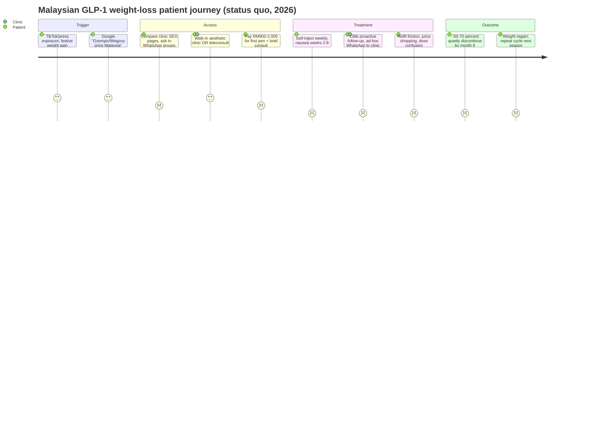

# Malaysia Medical Weight-Loss Market & GLP-1 Ecosystem

**Abstract.** Malaysia is the most overweight country in Southeast Asia — 54.4% of adults are overweight or obese (NHMS 2023), diabetes prevalence has reached 15.6%, and obesity's total economic burden is credibly estimated at RM13–30 billion per year. Against this epidemiology, the commercial medical weight-loss market is small, fragmented, and self-paid: insurers exclude obesity treatment as "cosmetic," public hospitals ration bariatric surgery behind multi-year waiting lists, and until recently the only registered pharmacotherapies were orlistat, phentermine, and off-label diabetes GLP-1s. That changed in 2025–2026: Mounjaro (tirzepatide) became available in August 2025 and Wegovy (semaglutide 2.4 mg) launched commercially in January 2026, at cash prices of roughly RM900–3,200 per month. Prescribing today is dominated by aesthetic-clinic chains and a first wave of telehealth entrants (OVA, Roczen, DoctorOnCall), with weak longitudinal care and rising regulatory scrutiny of online sales. This document quantifies the epidemiology, maps the GLP-1 supply and provider landscape with advertised prices, sizes the opportunity bottom-up (analyst-estimated serviceable market of RM1.5–3.5B by 2030 for medical weight management; current GLP-1 spend plausibly RM400–900M/year), and assesses structural attractiveness for a medically credible, WhatsApp-first, retention-oriented program such as Welltech's.

Last updated: July 2026.

**Related documents:** [Repository README](../README.md) · [Research standards](../RESEARCH-STANDARDS.md) · Siblings in [10-market-intelligence/](./): Malaysia telehealth market, Singapore & Hong Kong weight-loss markets, cross-market GLP-1 comparison *(forthcoming)* · [Competitor dossiers](../20-competitor-dossiers/) *(forthcoming)*.

---

## 1. Executive summary

- **Epidemiology is the demand engine.** Adult overweight/obesity rose from 44.5% (2011) to 54.4% (2023) on WHO BMI ≥25 cutoffs; abdominal obesity is 54.5%. Using Malaysia's own Asian BMI cutoffs (obesity ≥27.5), the treatable pool is materially larger than headline "obesity ~20%" figures suggest.[^1][^2]
- **The World Obesity Federation projects 41% adult obesity by 2035** (BMI ≥30), among the fastest trajectories globally, with an economic impact reaching 2.8% of GDP.[^7][^8]
- **GLP-1 access inflected in 2025–26.** Ozempic, Saxenda, Rybelsus and Trulicity have been available for years (diabetes-indicated; heavily used off-label). Mounjaro became available around August 2025; Wegovy — the first drug commercially launched in Malaysia with an obesity indication since sibutramine's 2010 withdrawal era — launched mid-January 2026.[^17][^20][^23]
- **Cash-pay prices cluster at RM900–2,100/month for semaglutide and RM1,300–3,200/month for tirzepatide**, with pharmacy/online channels ~20–40% below aesthetic-clinic price points. Insurance coverage is essentially zero.[^24][^25][^26][^30]
- **Prescribing is led by aesthetic chains and GP clinics, not endocrinologists.** A visible telehealth cohort (OVA at RM900/month flat, Roczen, DoctorOnCall pharmacy, Seimbang) is emerging; enforcement against illegal online sellers (48 warning letters in 2025 alone) is tightening the grey market.[^33][^36][^41]
- **Substitutes are weak or discredited.** Bariatric surgery (RM22k–45k) is effective but low-volume and capacity-constrained; slimming centres (Marie France, London Weight) carry reputational baggage of ~RM8k packages and aggressive upselling; the supplement market is large but repeatedly tainted by sibutramine adulteration.[^43][^47][^50]
- **The strategic gap is structured, medically supervised, longitudinal GLP-1 care.** Nobody owns the "6–12-month outcome-accountable program" position at scale; retention economics (not drug margin) will decide winners. This is directly aligned with Welltech's telehealth + WhatsApp-first operating model.

---

## 2. Obesity epidemiology

### 2.1 Adult prevalence and trend

The National Health and Morbidity Survey (NHMS), run by the Institute for Public Health (IKU), is the authoritative primary series. NHMS 2023 found **54.4% of adults (18+) overweight or obese** (BMI ≥25.0), a 10-percentage-point rise in 12 years.[^1][^2][^3]

| Indicator (adults 18+) | NHMS 2011 | NHMS 2015 | NHMS 2019 | NHMS 2023 |
|---|---|---|---|---|
| Overweight + obese (BMI ≥25) | 44.5% | 47.7% | 50.1% | **54.4%** |
| — Overweight (BMI 25–29.9) | — | 30.0% | 30.4% | n.r. (component of 54.4%) |
| — Obese (BMI ≥30) | 15.1% | 17.7% | 19.7% | n.r.; WOF projects 41% by 2035 |
| Abdominal obesity (waist-based) | 45.4% | n.r. | ~48% | **54.5%** |
| Diabetes (total) | 11.2% | 13.4% (2015) | 13.4% | **15.6%** |

Sources: NHMS series as reported by CodeBlue, The Star, FMT and peer-reviewed trend analyses.[^1][^2][^3][^4][^9] "n.r." = not reported in sources reviewed; NHMS 2023 topline communications emphasised the combined 54.4% figure.

Two definitional points matter commercially:

1. **Malaysia's CPG uses Asian cutoffs** — overweight 23.0–27.4, obese class I 27.5–32.4, class II 32.5–37.4, class III ≥37.5.[^13] On these thresholds, the clinically treatable population (obese ≥27.5, or ≥23 with comorbidity) is far larger than the ~20% captured by BMI ≥30 statistics — plausibly **8–10 million adults** *(analyst estimate: 54.4% of ~23.5M adults are ≥25; roughly half of those exceed 27.5, plus comorbid overweight adults)*.
2. **Screening data corroborate survey data.** The National Health Screening Initiative (NHSI 2023) found >53% of ~1 million screened Malaysians overweight or obese — consistent with NHMS and not an artefact of survey self-report.[^5]

### 2.2 Who is obese: sex, ethnicity, geography

| Cut | Finding | Source |
|---|---|---|
| Sex | Women consistently show higher obesity prevalence than men (analyses of NHMS series report roughly 38.8% vs 29.0% on Asian cutoffs); the gap widens with age | [^6][^9] |
| Ethnicity | Indians highest, Malays second, Chinese lowest for overweight/obesity; mirrored in NHMS 2023 diabetes prevalence — Indians 25.2%, Malays 16.9%, Chinese 13.5% | [^6][^10] |
| State (obesity, NHMS 2023) | Perlis highest at 32.8%; NHMS 2019 had flagged Putrajaya at 45.8% obese — public-sector-worker-heavy, urban, sedentary | [^11][^12] |
| State (overweight, NHMS 2023) | Kuala Lumpur 40.6%, Putrajaya 35.5%, Labuan 34.8% | [^11] |
| Urban/rural & income | Urban > rural; burden shifting toward lower-income groups over successive NHMS waves | [^6][^9] |

### 2.3 Children and adolescents

- NHMS Adolescent Health Survey 2022: **~30.5% of adolescents overweight or obese**; 4 in 5 adolescents physically inactive.[^14]
- Meta-analysis of Malaysian children (to 2022): overweight 16.1%, obesity 14.5% — **30.6% excess weight** among 5–17-year-olds; UNICEF-cited child obesity (12.7%) is second in Southeast Asia after Brunei.[^15][^16]
- Commercial relevance is indirect (paediatric GLP-1 prescribing is nascent and reputationally risky) but confirms a durable multi-decade demand pipeline.

### 2.4 Diabetes and cardiometabolic comorbidity

NHMS 2023: diabetes 15.6% of adults (~3.9M people; 9.7% known + 5.9% undiagnosed), up from 13.4% (2019) and 11.2% (2011); over two million adults live with three simultaneous NCD risk factors (diabetes, hypertension, hypercholesterolaemia).[^4][^10] IDF figures for Malaysia are of the same order (~4M adults). The diabetes overlap matters because (a) it legitimises GLP-1 therapy clinically, (b) it is the channel through which Ozempic/Mounjaro entered the market, and (c) diabetic patients were the collateral damage of the 2024 off-label demand surge (§4.5).

### 2.5 Verifying the "fattest country in Southeast Asia" claim

The claim is **substantively true with definitional caveats**. On WHO age-standardised adult obesity (BMI ≥30, ~2019 data), Malaysia ranks first in ASEAN at ~15.6% (Statista/WHO), with Brunei second — a ranking repeated by The Star and regional press.[^18][^19] National NHMS data (crude, Asian-relevant population) put obesity higher still. Caveats: small-state comparators (Brunei) are close; and rankings based on combined overweight+obesity or on more recent projections can reorder slightly. For marketing claims, "highest obesity prevalence in Southeast Asia" is defensible; "fattest country in Asia" is not (Gulf and Pacific comparisons fail).

### 2.6 Economic cost of obesity

| Estimate | Value | Basis / Year | Source |
|---|---|---|---|
| World Obesity Federation | USD 5.68B (~RM26.8B; 1.6% of GDP) | Total economic impact, 2019 | [^7][^8] |
| WOF projection | ~USD 20B (2.8% of GDP) by 2035; USD 104.55B by 2060 | Projection | [^7][^8] |
| EMIR Research / Media Selangor synthesis | RM4.2B direct healthcare + RM8.91B productivity ≈ **RM13.1B/yr** | ~2023–25 | [^21][^22] |
| Economist Intelligence Unit (cited by Penang Institute) | USD 4–7B (RM17–30B; ~2% GDP) | 2016–17 study | [^20a] |
| WHO Malaysia (NCD investment case) | RM9.65B/yr healthcare cost + ~RM9B/yr productivity losses for CVD/diabetes/cancer (obesity-attributable share substantial) | 2020–22 | [^22a] |

Reconciliation: direct comparisons differ in scope (healthcare-only vs productivity-inclusive) and year, but **RM13–30B/year total burden** brackets all credible estimates. Government fiscal pain at this scale underwrites policy tailwinds (sugar tax expansion, national obesity strategies) without implying imminent public reimbursement of GLP-1s.

### Implications for Welltech

- The addressable pool is not a niche: **>8M adults meet Malaysian CPG treatment criteria**; even a 1% treated-share ambition implies ~80k patients — larger than any current provider's base.
- Target segmentation should follow the epidemiology: Malay and Indian women 30–55 in Klang Valley/urban centres (highest prevalence, highest engagement with weight-loss content), plus diabetic/pre-diabetic men reachable through screening-linked funnels.
- The comorbidity overlap argues for a **metabolic-health framing** (weight + glucose + BP), which also future-proofs against "vanity drug" regulatory and reputational risk.

---

## 3. Demand: market size, culture, and consumer behaviour

### 3.1 Commercial market estimates (reconciled)

Malaysia-specific weight-management market research is thin and of mixed quality:

- Data Bridge Market Research publishes a "Malaysia Weight Loss and Obesity Management Market" with headline figures that are internally implausible (its 2024 "USD 380.22 billion" valuation exceeds Malaysian GDP; the figure is evidently mislabelled — treat as unreliable except for its structure: supplements largest segment, store-based channels dominant, 18–35 the largest cohort, ~11.6% CAGR).[^27]
- Euromonitor tracks "Weight Management and Wellbeing in Malaysia" (packaged products: meal replacements, supplements, slimming teas) — the credible packaged-goods segment is in the **hundreds of millions of RM**, inside a total nutraceutical/dietary-supplement market of ~USD 1.1–1.2B (~RM5B).[^28][^29]
- *(Analyst estimate)* Adding services (slimming centres, aesthetic-clinic programs, bariatric surgery ~RM150–250M, and the new GLP-1 spend, §10), Malaysia's total consumer weight-loss economy is plausibly **RM3–5B/year in 2026**, of which genuinely *medical* weight management (drugs + physician-supervised programs + surgery) is RM0.7–1.3B and growing fastest.

### 3.2 Cultural context and seasonality

- **Festive cycle drives a pronounced demand rhythm.** Ramadan/Hari Raya open-house season, Chinese New Year and Deepavali each produce documented festive weight gain (0.4–1.9 kg typical; up to ~3 kg reported by Malaysian dietitians) followed by compensatory dieting peaks.[^31][^32] By February 2026, Malaysian doctors were publicly warning about festive-season surges in walk-in requests for GLP-1 "slimming shots."[^33]
- **Modesty and discretion matter.** Female-focused, discreet, at-home models are already being marketed on exactly this insight (OVA: "discreet video consultations… for women").[^36] Weight is a sensitive topic across Malay, Chinese and Indian communities; ACTION Malaysia found only 28% of people with obesity had discussed weight with a clinician in the prior six months despite 71% recognising obesity as a chronic disease.[^34]
- **Body-image norms differ by community** (higher cultural tolerance of larger female body size in some Malay and Indian contexts; intense thinness pressure in Chinese-Malaysian and urban professional segments), but commercial behaviour converges: repeated self-directed attempts (mean 3 adult attempts; 63% regain) and low medicalisation (only 10% of PwO ever received an anti-obesity prescription).[^34]

### 3.3 Search and social demand signals

- Globally, Ozempic search volume grew exponentially 2018–2023 (Google Trends analyses) and #Ozempic exceeded 500M+ TikTok views; Malaysian press picked up the TikTok-driven trend from early 2023.[^35][^35a]
- Malaysia-specific signals: the December 2024 shortage coverage, the January 2026 Wegovy launch news cycle ("your gym membership just got competition"), and a dense field of clinic SEO pages bidding on "Ozempic price Malaysia," "Mounjaro Malaysia," "Wegovy price" — an unusually commercial SERP indicating high-intent search demand.[^17][^37]

### 3.4 Consumer attitudes: the ACTION Malaysia evidence base

ACTION Malaysia (n=1,001 people with obesity; 200 HCPs; fielded 2022) is the best demand-side primary study:[^34]

| Finding | PwO | HCPs |
|---|---|---|
| Obesity is a chronic disease | 71% | 88% |
| Discussed weight with HCP in past 6 months | 28% | — |
| Ever received weight-loss prescription | 10% | — |
| Cost a barrier to treatment | 60% | 84% |
| Limited insurance coverage a barrier | 47% | 58% |
| Regained weight after ≥6-month maintenance | 63% | — |

### Implications for Welltech

- **Plan revenue around festive seasonality**: acquisition pushes post-CNY (Feb–Mar) and post-Raya (varies; Apr–May in late 2020s), retention interventions timed *into* feasting periods (a WhatsApp-native "survive Raya" protocol is a differentiated retention asset).
- The ACTION data define the funnel problem: an enormous, aware, repeatedly failing population that almost never converts to medical care. The bottleneck is **initiation friction and stigma**, not awareness — favouring discreet, chat-first onboarding over clinic-first models.
- Price sensitivity is the #1 stated barrier; program design must engineer an entry tier near RM500–900/month and be honest about total 6–12-month cost.

---

## 4. The GLP-1 ecosystem

### 4.1 Registered GLP-1 / GIP-GLP-1 products

| Molecule | Brand (originator) | Malaysia status | Indication in Malaysia | Notes |
|---|---|---|---|---|
| Semaglutide (weekly inj.) | Ozempic (Novo Nordisk) | Registered; MAL20026057AZ (0.25/0.5 mg), MAL20026058AZ (1 mg) | Type 2 diabetes | Workhorse of off-label weight prescribing since ~2022–23[^38] |
| Semaglutide 2.4 mg | Wegovy (Novo Nordisk) | Registered (approval reported April 2023; package insert dated April 2024); **commercial launch mid-January 2026** | Chronic weight management (BMI ≥30, or ≥27 with comorbidity) | Full titration range 0.25→2.4 mg pens[^17][^23][^39] |
| Semaglutide (oral) | Rybelsus (Novo Nordisk) | Registered; retail | Type 2 diabetes | 3/7/14 mg tablets; used off-label for weight[^40] |
| Liraglutide 3.0 mg | Saxenda (Novo Nordisk) | Registered; long-available | Weight management | Daily injection; losing share to weeklies[^41a] |
| Tirzepatide | Mounjaro / KwikPen (Eli Lilly) | Registered; **available ~30 August 2025** (provider-reported NPRA approval August 2025) | Type 2 diabetes (weight-loss use off-label) | KwikPen 2.5–15 mg strengths listed in MIMS Malaysia[^20][^42][^42a] |
| Dulaglutide | Trulicity (Eli Lilly) | Registered | Type 2 diabetes | Modest weight effect; diabetes-focused[^42a] |

Verification caveat: NPRA's Quest3+ registry could not be fetched directly for this document (site inaccessible from research environment); MAL numbers and approval dates above are as published by MIMS Malaysia and licensed providers, and should be re-verified in Quest3+ before use in regulatory filings.

### 4.2 Launch chronology (demand-relevant)

- **Pre-2023:** Saxenda the only obesity-indicated GLP-1; Ozempic/Trulicity for diabetes.
- **2023:** Wegovy NPRA approval reported (April 2023) but no commercial supply amid the global shortage; Malaysian CPG Obesity 2nd ed. published (§7).[^13][^39]
- **2024:** Off-label Ozempic weight-loss demand surges; by December 2024 the Malaysian Pharmacists Society publicly blames misuse for diabetic-patient shortages; distributors ration stock.[^37]
- **August 2025:** Mounjaro becomes available (T2DM indication; off-label weight use immediate and heavily marketed by clinics).[^20][^42]
- **15–19 January 2026:** Novo Nordisk launches Wegovy commercially with national press coverage; positioning explicitly against lifestyle spend ("gym membership") and obesity-as-disease framing.[^17][^23]
- **February 2026:** festive-season demand spike; professional bodies (Persatuan Doktor Estetik Berdaftar Malaysia) warn against cosmetic quick-fix GLP-1 marketing.[^33]

### 4.3 Price benchmarking (advertised, MYR, 2025–mid-2026)

| Product / dose | Online pharmacy (DoctorOnCall / HelloDoktor) | GP / budget clinic | Aesthetic clinic (KL) | Typical monthly cost |
|---|---|---|---|---|
| Ozempic 1 mg pen | RM999 (RM2,997 per 3-pen bundle); "from RM879" | RM1,000–1,400 | RM1,200–2,500 "program" | RM800–1,800[^24][^26][^44] |
| Wegovy 0.25–1.0 mg | from RM879–899 | RM899 (myGP-type clinics) | RM1,288 (Nexus) | RM900–1,300[^25][^45][^46] |
| Wegovy 1.7 mg | — | RM1,088 | RM1,588 | RM1,100–1,600[^25][^45] |
| Wegovy 2.4 mg | — | RM1,288 | RM2,088 | RM1,300–2,100[^25][^45] |
| Mounjaro 2.5 mg | from ~RM1,259 | RM1,400–1,800 | RM1,500–1,800 | RM1,300–1,800[^30][^42] |
| Mounjaro 5 mg | from ~RM1,607 | RM1,600–2,000 | RM1,800–2,400 | RM1,600–2,400[^30] |
| Mounjaro 10–15 mg | — | — | RM2,700–3,200 | RM2,700–3,200[^30] |
| Saxenda (3-pen pack) | RM1,209 (discounted from RM2,090 list) | RM1,500–2,000/mo | RM2,000–3,000/mo | RM1,200–3,000[^41a][^47a] |
| Rybelsus (oral, 30 tabs) | RM472–549 | RM500–700 | rarely offered | RM470–700[^40] |

Read-through: **channel spread is 30–60%** between online pharmacy and aesthetic-clinic pricing for identical pens — the aesthetic markup is pure service/brand capture with thin clinical content. Wegovy's launch pricing (from ~RM879–899 at entry doses) came in *below* prevailing off-label Ozempic clinic pricing, a deliberate share-capture move. Prices are advertised rates gathered June–July 2026-era pages and change frequently; ranges, not points, should be used in modelling.

### 4.4 Supply chain

- **Novo Nordisk Pharma (Malaysia) Sdn Bhd** operates directly in-country; distribution runs through the major pharma logistics providers. **Zuellig Pharma holds a strategic distribution partnership with Eli Lilly for Malaysia and Thailand** (diabetes among named categories — i.e., Mounjaro/Trulicity flow).[^48]
- Cold chain: GLP-1 pens require 2–8°C logistics; Zuellig (eZCooler) and DKSH are the NPRA-listed cold-chain operators of scale; last-mile cold-chain competence is the practical moat for e-pharmacy delivery (DoctorOnCall advertises insulated cold-pack dispatch).[^48][^49][^24]
- Retail/dispensing: hospital pharmacies, ~9,800+ private clinics (dispensing doctors — Malaysia has no dispensing separation), community pharmacies (Caring, BIG, Alpro chains), and licensed e-pharmacies.[^51]

### 4.5 Shortages

The 2024 Ozempic shortage is documented: MPS president Amrahi Buang attributed it to non-diabetic weight-loss demand; aesthetic clinics were building Ozempic-based slimming packages; distributors imposed rationing.[^37] Global semaglutide supply normalised through 2025 (FDA delisted the shortage in Feb 2025), and the Wegovy launch was explicitly timed "after the global supply shortage eased."[^39][^37a] Residual risk: launch-phase allocation of high-dose Wegovy pens and Mounjaro high strengths; providers should contract allocation with Zuellig/DKSH rather than spot-purchase.

### 4.6 Grey market, counterfeits, enforcement

- Semaglutide/tirzepatide are **Group B poisons** (prescription-only) under the Poisons Act 1952; supply requires a registered practitioner or pharmacist-dispensed valid prescription, and Group B products may not be advertised to the public.[^52][^53]
- In 2025, MOH's Pharmacy Enforcement Division issued **warning letters over 48 social-media advertisements** for Ozempic, Mounjaro and Saxenda and removed e-commerce listings; screening spans Shopee, Lazada, Facebook, Instagram and TikTok. The Online Safety Act 2025 adds a platform-liability lever against illegal drug promotion.[^41]
- Marketplace listings for "Duromine" and "orlistat" persist on Shopee/Lazada — an indicator of enforcement lag and of consumer willingness to buy prescription anorectics without consultation.[^54]
- WHO's 2024 global alert on falsified semaglutide applies regionally; NPRA's authenticity advice (verify MAL number) is echoed by legitimate providers.[^55][^38]
- NPRA issued a 2025 safety-alert update on GLP-1 receptor agonists (aspiration risk under anaesthesia/deep sedation) — evidence of active pharmacovigilance on the class.[^56]

### Implications for Welltech

- **Legality is a moat.** A telehealth model that runs legitimate MMC-registered consultations, e-prescriptions, and pharmacist-dispensed cold-chain delivery is on the right side of an enforcement wave that is actively delegitimising Shopee sellers and ad-driven clinics. Compliance artefacts (MAL verification, prescription audit trail) should be productised and shown to patients.
- **Never advertise the molecule.** Group B advertising prohibitions mean growth must come from condition-level content ("medical weight management"), physician branding, and referral/word-of-mouth — which favours WhatsApp-native community mechanics over paid drug-name ads that competitors run illegally at takedown risk.
- Negotiate direct or Zuellig/DKSH-mediated supply early; allocation priority and bundle economics beat retail-pharmacy sourcing by 15–30% *(analyst estimate from channel spreads above)*.

---

## 5. Provider landscape: who prescribes GLP-1s today

| Segment | Representative players | Offer & advertised pricing | Clinical depth | Share of GLP-1 volume *(analyst est.)* |
|---|---|---|---|---|
| Hospital endocrine / obesity clinics | Sunway Medical weight-loss surgery unit, Prince Court, Pantai Ampang bariatric, Cengild GI Medical Centre | Consultant-led; drug at hospital-pharmacy price + RM150–400 consult | High | 10–15% |
| Aesthetic-clinic chains | Nexus Clinic, CLEO, Clique, Premier Clinic, Ozhean (Korean franchise), Alainn, Glojas, Da Vinci, NextMed, Her Clinic, MyBliss, Millennium, Klinik Suzana (JB) | "Weight-loss programs": Wegovy RM1,288–2,088/pen; Ozempic RM1,200–2,500/mo; Mounjaro RM1,500–3,200/mo; adjunct mesolipo RM500+/syringe | Low–medium (doctor on premises; weak follow-up) | **40–50%** |
| GP / primary-care clinics | myGP-type clinics, Klinik Dia Raissa, Klinik Safa, Klinik Sentosa HW, thousands of dispensing GPs | Pen at RM899–1,400; consult RM50–150; Duromine/orlistat legacy scripts | Medium | 20–30% |
| Telehealth / digital-first | **OVA** (women-focused; from RM900/mo flat incl. titration, RM15 video consult), **Roczen** (UK-origin; Roczen Plus medication-assisted program, MY site live), **DoctorOnCall** (teleconsult + e-pharmacy; Ozempic RM999/pen, Saxenda RM1,209/3-pen), **Seimbang** (GLP-1 program ~RM899/mo incl. medication), Teleme | Subscription programs, home cold-chain delivery | Medium (structured but young) | 5–10%, fastest-growing |
| Employer / payer digital health | Naluri (Series B, KL; digital coaching for cardiometabolic + mental health via employers/insurers) | B2B2C coaching; no in-app GLP-1 prescribing (as of mid-2026) | Coaching-strong, pharmacotherapy-absent | <5% |
| Obstetrics / fertility angle | Private O&G and fertility centres (weight loss as fertility-treatment prerequisite; maternal obesity ~14–20% in Klang Valley registry data) | Referral-driven; no branded GLP-1 programs yet | — | Negligible but strategically open[^57] |

Sources: provider websites and price pages as cited.[^24][^25][^30][^36][^45][^46][^58][^59][^60]

### 5.1 Named-provider price benchmark (advertised, mid-2026)

| Provider | Model | GLP-1 offer | Advertised price signal |
|---|---|---|---|
| DoctorOnCall | E-pharmacy + teleconsult | Ozempic, Saxenda, Rybelsus, Xenical | Ozempic 1 mg pen RM999; 3-pen bundle RM2,997; Saxenda 3-pen RM1,209; Rybelsus 3 mg 30s retail[^24][^40][^41a] |
| HelloDoktor | Content + fulfilment | Wegovy, Rybelsus, Xenical | Wegovy "from RM879"; Rybelsus from RM549; Xenical from RM150[^40][^46][^69] |
| OVA (Ova Healthcare) | Women-only telehealth subscription | Semaglutide & tirzepatide programs | From RM900/month **flat across titration**; RM15 mandatory video consult; Atome instalments[^36] |
| Seimbang | Telehealth program | GLP-1 bundle | From ~RM899/month incl. medication, monthly MD check-ins, dietitian coaching, cold-chain delivery[^78] |
| Roczen (UK-origin) | Clinician + mentor program | Roczen Plus medication-assisted | Pricing not published on MY pages at review date[^58] |
| Nexus Clinic (KL) | Aesthetic chain | Wegovy, Ozempic, Saxenda, Duromine | Wegovy RM1,288 (0.25–1.0 mg) / RM1,588 (1.7) / RM2,088 (2.4)[^45] |
| myGP-type GP clinics | Primary care | Wegovy | RM899 (0.25–1.0 mg) / RM1,088 (1.7) / RM1,288 (2.4) per pen[^25] |
| Her Clinic | Women-focused clinic | Mounjaro, Ozempic | Mounjaro RM1,400–1,800 (2.5–5 mg) rising to RM2,700–3,200 (10 mg+)[^30][^42] |
| Glojas / Alainn / CLEO / Clique / Da Vinci / NextMed / MyBliss / Millennium | Aesthetic clinics | Full GLP-1 menu | Ozempic ~RM800–1,800/mo; program bundles RM1,500–3,000/mo[^26][^38][^39][^44][^77] |
| Premier Clinic / Klinik Suzana (JB) | Aesthetic | Adjunct injections + weight programs | Mesolipo fat-melting ~RM500+/syringe; GLP-1 pricing on consultation[^79] |
| Klinik Dia Raissa / Klinik Safa / Klinik Sentosa HW | Suburban GP | Saxenda, Mounjaro, Rybelsus | Saxenda programs from ~RM1,500/mo[^47a] |

### 5.2 Patient journey today (composite)

The journey's failure points — unmanaged early side effects, refill friction, absent follow-up — are operational, not pharmacological. They define the service-design brief for any retention-led entrant.

Landscape observations:

1. **No provider owns outcomes.** Aesthetic chains sell pens plus vague "programs"; none publishes retention, mean %-weight-loss, or side-effect management protocols. The first provider to publish credible cohort outcomes will own the credibility high ground.
2. **Female-focused positioning is already proven** (OVA; Her Clinic) — confirming the discretion thesis in §3.2.
3. **DoctorOnCall is the price anchor**, not a care competitor: it wins DIY buyers but offers no longitudinal program; its pricing sets the reference cost for the drug component.
4. **Roczen's entry** (UK metabolic-clinic model, doctor+mentor pairing) is the closest analogue to a Welltech-style structured program and should be tracked in the competitor dossiers.
5. **Naluri is a partner, not a competitor**: it has employer distribution and coaching infrastructure but no prescribing arm — a natural B2B2C channel or acquisition-target adjacency.

### Implications for Welltech

- Differentiate on the two things the modal aesthetic clinic cannot copy: **medical governance** (endocrinologist-advised protocols, published outcomes) and **longitudinal engagement** (WhatsApp-first weekly touchpoints, dietitian escalation, side-effect triage within hours).
- Price the drug near pharmacy parity and monetise the service layer — attacking the aesthetic chains' 30–60% pen markup is the cleanest wedge (§4.3).
- Pre-empt the O&G/fertility referral channel (weight loss before IVF/conception is a motivated, time-boxed, high-adherence segment nobody has productised in Malaysia).

---

## 6. Substitutes and incumbents

### 6.1 Bariatric surgery

- **Prices (private, 2025–26):** sleeve gastrectomy RM22,000–35,000 (avg ~RM32,000); Roux-en-Y bypass RM38,000–45,000; mini bypass RM32,000–42,000; packages at Sunway Penang, Regency JB, Pantai widely advertised.[^43][^61][^62]
- **Volume:** no national registry exists; published evidence is fragmentary (a single Cengild surgeon logged ~1,000 procedures in one year, 2019–20 — an outlier centre; a Malaysian consensus statement governs patient selection). Total national volume is plausibly only **3,000–6,000 procedures/year** *(analyst estimate)* against millions of eligible patients.[^63][^64][^65]
- Public hospitals offer heavily subsidised surgery with multi-year waits; medical tourism (60–70% of inbound patients Indonesian) adds private demand.[^43][^66]
- Strategic read: surgery is a complement at BMI ≥37.5 (or ≥32.5 with comorbidity per CPG), not a volume competitor; GLP-1s will increasingly be the pre-surgical and surgery-avoidance pathway.

### 6.2 Incumbent pharmacotherapy

| Drug | Status | Price signal | Position |
|---|---|---|---|
| Phentermine (Duromine) | Registered, Group B; MPS has publicly clarified it is "not banned" but controlled | Clinic-dispensed; grey Shopee/Lazada listings persist | Decades-old GP/aesthetic staple; cheap; cardiovascular/CNS side-effect profile; being displaced upmarket by GLP-1s[^54][^67][^68] |
| Orlistat (Xenical; Cuvarlix by Pharmaniaga) | Registered; pharmacist-supervised | Xenical from ~RM150/box | Low efficacy (~3–5% weight), GI side effects; entry-level option[^69] |
| Naltrexone-bupropion | In clinical use (single-centre Malaysian experience published) | — | Marginal; adjunct for specific phenotypes[^70] |
| Sibutramine | **Registration suspended by the Drug Control Authority (2010s) on SCOUT cardiovascular data** | — | Survives only as an illegal adulterant (§6.3)[^50] |

### 6.3 Slimming centres, supplements and direct selling

- **Slimming-centre chains** (Marie France Bodyline, London Weight Management, Bella, Sliq/Terimee etc.): machine-based "treatments" sold in RM5,000–10,000+ packages; consumer forums and reviewer blogs document aggressive upselling, ~RM8k quotes, water-weight results and regain — a reputational vacuum that medical programs inherit demand from.[^47][^71]
- **Supplements/slimming teas**: part of the ~RM5B nutraceutical market; chronically compromised by adulteration — sibutramine is the most common adulterant found in weight-loss THM products per Malaysian pharmacovigilance analyses, with recurring NPRA cancellations and Star coverage of "hidden risks."[^29][^50a][^72]
- **Direct-selling/MLM herbal brands** add distribution reach in B40/M40 and rural segments; they compete for share-of-wallet, not for clinical credibility.

### Implications for Welltech

- Position explicitly against the discredited incumbents: "medical, registered, supervised" vs slimming-centre packages and adulterated supplements. The RM5,000–8,000 the market already pays a slimming chain for a package is the psychological budget a 4–6-month medical program should target.
- Build a bariatric referral loop (both directions): surgeons need pre-op optimisation and post-op regain management — recurring-revenue clinical relationships with the 10–20 active bariatric centres.

---

## 7. Clinical guidelines and professional positions

- **CPG Management of Obesity, 2nd edition (May 2023)** — MOH with the Malaysian Endocrine & Metabolic Society (MEMS) and partner colleges; first update in ~19 years. Core content: obesity framed as a **complex chronic disease**; Asian BMI classification (overweight 23–27.4; obese I 27.5–32.4; II 32.5–37.4; III ≥37.5); staged management — structured lifestyle intervention, pharmacotherapy when BMI ≥27.5 (or ≥23 with comorbidity) fails lifestyle alone, and metabolic surgery for class II–III; covers children/adolescents.[^13][^73][^74]
- **MEMS** hosts and disseminates the CPG; its leadership publicly supports chronic-disease framing and medically supervised pharmacotherapy — useful clinical-governance partners and KOL pool.[^73]
- **Aesthetic-medicine professional bodies** (Persatuan Doktor Estetik Berdaftar Malaysia) have warned against GLP-1s marketed as cosmetic quick fixes without adequate oversight (Feb 2026) — a signal that even the aesthetic segment expects standards to tighten.[^33]
- **NPRA pharmacovigilance** on the class is active (2025 aspiration-risk alert; ongoing adverse-event monitoring).[^56]
- Prescribing legality: any registered medical practitioner may prescribe registered GLP-1s, including off-label (Mounjaro for obesity), under Poisons Act/MMC good-practice duties; teleconsultation prescribing is lawful when a legitimate consultation, digital-signature-compliant e-prescription and pharmacist dispensing chain are in place (DOC2US/CodeBlue commentary; MMC dispensing guidance).[^52][^75]

### Implications for Welltech

Anchor every protocol to the CPG's cutoffs and stepwise logic; make the CPG the public justification for who is (and is not) accepted onto GLP-1 therapy. An advisory relationship with MEMS-affiliated endocrinologists converts a regulatory-risk narrative into a clinical-leadership narrative.

---

## 8. Payors: insurance and employers

- **Private health insurance in Malaysia generally excludes obesity/weight-loss treatment** as cosmetic/lifestyle; GLP-1s for weight are out-of-pocket. Partial claimability arises only when treatment addresses a covered secondary condition (e.g., T2DM consultations/labs).[^76]
- ACTION Malaysia quantifies the consequence: 47% of patients and 58% of HCPs cite limited coverage as a barrier.[^34]
- **Employers are the most plausible near-term payor.** Corporate wellness is an established budget line (Naluri's employer/insurer model proves willingness to pay for cardiometabolic coaching), and obesity-linked productivity losses (~RM9B/yr national) give CFO-grade justification.[^21][^59][^60]
- No signal (as of mid-2026) of MOH formulary listing or public reimbursement of obesity-indicated GLP-1s; public-sector access remains diabetes-pathway only.

### Implications for Welltech

Underwrite the plan on 100% self-pay; treat employer pilots (screening → identify BMI ≥27.5 + comorbidity → subsidised program) as the scalable B2B2C channel, potentially in partnership with (rather than against) Naluri or insurers' wellness riders.

---

## 9. Structured program economics

### 9.1 Patient-side: supervised program vs DIY pharmacy (6–12 months, semaglutide-based)

| Cost line | DIY (online pharmacy) | Aesthetic clinic ad hoc | Structured medical program *(modelled)* |
|---|---|---|---|
| Drug, months 1–3 (0.25–1.0 mg) | RM879–999/mo | RM1,288/mo | RM950–1,100/mo bundled |
| Drug, months 4–12 (1.7–2.4 mg) | RM1,100–1,300/mo *(if sourced)* | RM1,588–2,088/mo | RM1,300–1,600/mo bundled |
| Consults / monitoring | RM0–50 one-off | RM100–250 per visit, ad hoc | Included (monthly MD review, dietitian, labs 2×) |
| 6-month total | ~RM6,000–7,500 | ~RM9,000–12,500 | **RM7,500–9,500** |
| 12-month total | ~RM12,500–15,000 | ~RM18,000–24,000 | **RM15,000–19,000** |
| Expected outcome | Unsupervised; high discontinuation | Pen-focused; weak follow-up | 10–15% body-weight loss at 12 months with adherence support[^77] |

*(Analyst model built from advertised prices in §4.3; ranges honest to observed spread.)* The structured program can undercut aesthetic clinics while carrying 3–5× their service content, because it forgoes the pen markup and monetises retention instead.

### 9.2 Provider-side unit economics *(analyst estimates)*

| Driver | Estimate | Basis |
|---|---|---|
| Drug gross margin | 15–30% on pens sourced via distributor vs retail-parity pricing | Channel spread §4.3 |
| Service revenue | RM250–500/patient/month (program fee net of drug) | OVA RM900 flat vs RM879 drug floor; Seimbang RM899 bundle |
| Variable clinical cost | RM60–150/patient/month (MD minutes, dietitian, WhatsApp ops — falls steeply with AI-assisted triage) | Modelled |
| CAC | RM150–600 depending on channel (organic/WhatsApp referral vs paid) | Competitive SERP intensity §3.3 |
| Retention | Global GLP-1 persistence ~30–50% at 12 months unmanaged; managed programs target >60% | [^77][^78] |
| LTV (12-mo horizon) | RM2,500–5,000 contribution per retained patient | Modelled from above |

**Retention is the entire business.** At unmanaged persistence (~1/3 at 12 months), CAC payback is marginal; each +10pp of 12-month retention adds roughly RM400–700 LTV per enrolled patient *(model)*. This is the economic argument for the WhatsApp-first, proactive-nudge operating model: side-effect triage in the first 8 weeks (peak dropout window) is the highest-ROI clinical activity in the company.

---

## 10. Market sizing: TAM / SAM / SOM (bottom-up)

All figures are *(analyst estimates)* with assumptions stated; MYR throughout (MYR/USD ≈ 4.4–4.7, 2025–26).

**Population cascade (2026):**

| Step | Assumption | Result |
|---|---|---|
| Adults 18+ | ~23.5M (DOSM-consistent) | 23.5M |
| Overweight/obese (BMI ≥25) | 54.4% (NHMS 2023)[^1] | ~12.8M |
| CPG-eligible for pharmacotherapy (BMI ≥27.5, or ≥23 + comorbidity) | ~60–70% of the above | **~8–9M** |
| Able to sustain ≥RM800/mo self-pay (T20 + upper M40, urban) | ~18–25% of eligible | ~1.5–2.2M |
| Actively seeking treatment in any year | ~15–25% of able (ACTION: 3 attempts/adulthood, 28% discussed with HCP)[^34] | ~250k–550k |

**TAM (medical weight management, drugs + services, theoretical ceiling):** 1.5–2.2M financially-able eligible adults × RM10–14k/yr ≈ **RM15–30B/yr**. (Ceiling only; useful to show headroom, not a forecast.)

**SAM (realistically serviceable by 2030):** 250k–550k active seekers converging on medical options as GLP-1 prices fall ~20–40% (competition, oral semaglutide, eventual generics post-2026 China/India dynamics) → 150k–300k treated patients × RM8–12k/yr ≈ **RM1.5–3.5B/yr by 2030**, versus an estimated **RM400–900M in 2026** (assume 35k–70k current GLP-1 weight users — extrapolated from shortage severity, clinic density and launch volumes; no official user counts exist).

**SOM (Welltech, 36 months from launch):** a top-3 digital program capturing 3–8% of the digitally acquired segment → **6k–15k active patients ≈ RM60–160M annualised revenue**, requiring ~RM10–25M cumulative CAC at §9 assumptions.

**Growth forecast:** 25–40% CAGR for the medical weight-loss segment 2026–2030 *(analyst estimate)*, driven by Wegovy/Mounjaro commercialisation, price competition, employer channel opening, and the epidemiological escalator (41%-by-2035 trajectory)[^7]; downside scenarios hinge on safety scares, aggressive advertising crackdowns, or a public-payor pivot that commoditises supply.

---

## 11. Porter's Five Forces — GLP-1 weight-loss clinic segment (Malaysia, 2026)

| Force | Intensity | Assessment |
|---|---|---|
| Supplier power (Novo, Lilly, Zuellig/DKSH) | **High** | Duopoly molecules, allocation control, global pricing discipline; mitigants: oral semaglutide, tirzepatide competition, post-patent generics late-decade. Providers are price-takers on the drug. |
| Buyer power (patients) | **Medium–high** | 100% self-pay, price-transparent SERPs, low switching costs between clinics; loyalty accrues only to programs that deliver outcomes and relationships. |
| Threat of new entrants | **High** | Any GP or aesthetic clinic can prescribe; telehealth entry cost is low. Barriers that do exist — clinical governance, cold-chain e-pharmacy licensing, brand trust, retention infrastructure — are exactly the ones worth building. |
| Threat of substitutes | **Medium** | Bariatric surgery (capacity-capped), Duromine/orlistat (inferior), slimming centres/supplements (discredited but cheap), DIY grey-market pens (enforcement-pressured). GLP-1 efficacy resets consumer expectations against all of them. |
| Rivalry | **Medium, rising fast** | Dozens of clinics with undifferentiated pen-retail offers; early digital programs (OVA, Roczen, Seimbang) racing for category leadership; price competition already visible at entry doses. Consolidation and outcome-based differentiation ahead. |

**Net:** structurally attractive only for operators who (a) escape drug-margin dependence, (b) industrialise retention, and (c) convert regulatory tightening into a trust advantage. Commodity pen-sellers will see margins compress toward pharmacy parity.

---

## 12. Strategic synthesis for Welltech

1. **Enter as the medical authority, not another clinic.** CPG-anchored protocols, MEMS-affiliated advisors, published cohort outcomes — filling the credibility vacuum left by aesthetic chains and slimming centres.
2. **Win on retention economics.** WhatsApp-first weekly care, 48-hour side-effect triage, festive-cycle protocols; every +10pp 12-month persistence ≈ RM400–700 LTV/patient.
3. **Price the drug at pharmacy parity; sell the program.** RM900–1,100/month entry, transparent 6/12-month totals (RM7.5k–19k), undercutting aesthetic clinics by 20–40% with more service.
4. **Sequence segments:** urban women 30–55 (discretion-led), pre-diabetic/diabetic men via screening funnels, fertility-prep referrals, then employer B2B2C (possibly with Naluri/insurer wellness riders).
5. **Lock supply and compliance early:** distributor allocation (Zuellig/DKSH), licensed e-pharmacy cold chain, Group-B-compliant marketing — each is a moat as enforcement tightens.
6. **Watch list:** Roczen's Malaysian traction, OVA's expansion beyond women's health, Novo/Lilly direct-to-patient platform ambitions, oral semaglutide launch pricing, and any NPRA move to restrict off-label tirzepatide marketing.

---

## References

[^1]: CodeBlue (Galen Centre), "NHMS 2023: Over Half Of Malaysian Adults Overweight Or Obese", https://codeblue.galencentre.org/2024/05/nhms-2023-over-half-of-malaysian-adults-overweight-or-obese/ (accessed July 2026).
[^2]: The Star, "Surge in number of overweight, obese M'sians over past decade, national survey shows", 16 May 2024, https://www.thestar.com.my/news/nation/2024/05/16/surge-in-number-of-overweight-obese-m039sians-over-past-decade-national-survey-shows (accessed July 2026).
[^3]: Free Malaysia Today, "Survey shows over half of Malaysian adults overweight or obese", 16 May 2024, https://www.freemalaysiatoday.com/category/nation/2024/05/16/survey-shows-over-half-of-malaysian-adults-overweight-or-obese (accessed July 2026).
[^4]: CodeBlue, "Over Two Million Adults In Malaysia Live With Three NCDs: NHMS 2023", https://codeblue.galencentre.org/2024/05/over-two-million-adults-in-malaysia-live-with-three-ncds-nhms-2023/ (accessed July 2026).
[^5]: CodeBlue, "NHSI 2023: Over 53% Of Screened Malaysians Overweight Or Obese", https://codeblue.galencentre.org/2023/12/nhsi-2023-over-53-of-screened-malaysians-overweight-or-obese/ (accessed July 2026).
[^6]: "Prevalence of overweight and its associated factors among Malaysian adults: Findings from a nationally representative survey" (NHMS 2019 analysis), PLOS ONE, https://pmc.ncbi.nlm.nih.gov/articles/PMC10395944/ (accessed July 2026).
[^7]: CodeBlue, "Report: 41% Of Malaysia's Adults Will Be Obese By 2035", March 2023, https://codeblue.galencentre.org/2023/03/report-41-of-malaysias-adults-will-be-obese-by-2035/ (accessed July 2026).
[^8]: World Obesity Federation, "World Obesity Atlas 2023", https://data.worldobesity.org/publications/WOF-Obesity-Atlas-V5.pdf (accessed July 2026).
[^9]: "Rising Obesity in Malaysia (1990–2023): A Comprehensive Analysis of Temporal Trends, Sex Inequalities, and Lifestyle Drivers", Public Health Reviews, https://www.ncbi.nlm.nih.gov/pmc/articles/PMC12900780/ (accessed July 2026).
[^10]: HK3 Health, "Diabetes in Malaysia: Statistics, Causes and Prevention Guide" (compiling NHMS 2023 ethnicity breakdowns), https://hk3.com.my/diabetes-malaysia-statistics-guide/ (accessed July 2026); corroborated by CodeBlue NHMS 2023 coverage [^4].
[^11]: Malay Mail, "Perlis tops national obesity rate at 32.8pc, ranks third in diabetes, says state rep", 11 December 2025, https://www.malaymail.com/news/malaysia/2025/12/11/perlis-tops-national-obesity-rate-at-328pc-ranks-third-in-diabetes-says-state-rep/201580 (accessed July 2026).
[^12]: CodeBlue, "Nearly Half Of Putrajaya Adult Residents Are Obese" (NHMS 2019 state data), October 2022, https://codeblue.galencentre.org/2022/10/nearly-half-of-putrajaya-adult-residents-are-obese/ (accessed July 2026).
[^13]: Ministry of Health Malaysia / Malaysian Endocrine & Metabolic Society, "Clinical Practice Guidelines: Management of Obesity, 2nd Edition" (2023), https://mems.my/wp-content/uploads/2023/06/230518_MEMS_CPG-Management-Obesity_FA8-Digital.pdf (accessed July 2026).
[^14]: CodeBlue, "NHMS Survey: One-Third Of Malaysian Teens Are Overweight Or Obese" (Adolescent Health Survey 2022), June 2023, https://codeblue.galencentre.org/2023/06/nhms-survey-one-third-of-malaysian-teens-are-overweight-or-obese/ (accessed July 2026).
[^15]: "Prevalence of childhood overweight and obesity in Malaysia: a systematic review and meta-analysis", Clin Exp Pediatr, https://pmc.ncbi.nlm.nih.gov/articles/PMC11825116/ (accessed July 2026).
[^16]: The Star, "Obesity: Brunei ranks second in South-East Asia after Malaysia", 20 July 2023, https://www.thestar.com.my/aseanplus/aseanplus-news/2023/07/20/obesity-brunei-ranks-second-in-south-east-asia-after-malaysia (accessed July 2026).
[^17]: Malay Mail, "Your gym membership just got competition — weight-loss drug Wegovy launches in Malaysia", 15 January 2026, https://www.malaymail.com/news/malaysia/2026/01/15/your-gym-membership-just-got-competition-weight-loss-drug-wegovy-launches-in-malaysia/205531 (accessed July 2026).
[^18]: Statista, "ASEAN: obesity prevalence by country 2019" (WHO data), https://www.statista.com/statistics/1179519/asean-obesity-prevalence-by-country/ (accessed July 2026).
[^19]: New Straits Times, "Malaysians most obese in region", 2017, https://www.nst.com.my/news/nation/2017/06/246538/malaysians-most-obese-region (accessed July 2026).
[^20]: Peak Protocol, "Mounjaro Malaysia: Tirzepatide Guide, Price & Availability", https://peakprotocolmy.com/glp-1/mounjaro-malaysia/ (accessed July 2026).
[^20a]: Penang Institute, "Obesity in Malaysia: Unhealthy Eating is as Harmful as Smoking", https://penanginstitute.org/publications/issues/1029-obesity-in-malaysia-unhealthy-eating-is-as-harmful-as-smoking/ (accessed July 2026).
[^21]: EMIR Research, "Malaysia's Obesity Time Bomb: A National Crisis in the Making", https://www.emirresearch.com/malaysias-obesity-time-bomb-a-national-crisis-in-the-making/ (accessed July 2026).
[^22]: Media Selangor, "Cutting the fat: Malaysia weighs bold fixes for obesity crisis", May 2025, https://mediaselangor.com/en/2025/05/263524 (accessed July 2026).
[^22a]: WHO Malaysia, "The annual health-care cost of cardiovascular diseases, diabetes and cancer in Malaysia exceeds RM 9.65 billion", August 2022, https://www.who.int/malaysia/news/detail/09-08-2022-the-annual-health-care-cost-of-cardiovascular-diseases--diabetes-and-cancer-in-malaysia-exceeds-rm-9.65-billion; and "Cardiovascular diseases, diabetes and cancer cost nearly RM 9 billion productivity losses annually", September 2020, https://www.who.int/malaysia/news/detail/08-09-2020-cardiovascular-diseases-diabetes-and-cancer-cost-nearly-rm-9-billion-productivity-losses-annually-to-malaysian-economy (accessed July 2026).
[^23]: Sinar Daily, "Novo Nordisk launches Wegovy in Malaysia as new option for obesity management", January 2026, https://www.sinardaily.my/article/733207/culture/health/novo-nordisk-launches-wegovy-in-malaysia-as-new-option-for-obesity-management (accessed July 2026).
[^24]: DoctorOnCall (licensed e-pharmacy), "Ozempic 1.34mg/ml (1mg/dose) Pre-filled Pen", https://www.doctoroncall.com.my/medicine/en/drugs/ozempic-1-34mg-ml-1mg-dose-pre-filled-pen-3ml-x1-pen (accessed July 2026).
[^25]: Millennium Clinic KL, "Wegovy Price in Malaysia: Cost Guide, Dose Prices & KL Clinic Advice", https://www.millenniumclinickl.com/wegovy-price-in-malaysia/ (accessed July 2026).
[^26]: Peak Protocol, "Weight Loss Injection Prices Malaysia 2026 (Updated Monthly)", https://peakprotocolmy.com/glp-1/weight-loss-injection-prices-malaysia/ (accessed July 2026).
[^27]: Data Bridge Market Research, "Malaysia Weight Loss and Obesity Management Market, Trends and Forecast to 2032", https://www.databridgemarketresearch.com/nucleus/malaysia-weight-loss-and-obesity-management-market (accessed July 2026; headline valuation assessed as unreliable — see §3.1).
[^28]: Euromonitor International, "Weight Management and Wellbeing in Malaysia", https://www.euromonitor.com/weight-management-and-wellbeing-in-malaysia/report (accessed July 2026).
[^29]: Ken Research, "Malaysia Nutraceuticals and Dietary Supplements Market", https://www.kenresearch.com/malaysia-nutraceuticals-and-dietary-supplements-market (accessed July 2026).
[^30]: Her Clinic, "Mounjaro Price Malaysia 2026: Monthly Cost, Dosage Guide", https://herclinic.my/blogs/mounjaro-price-malaysia-2025/ (accessed July 2026).
[^31]: Malaysian Dietitians' Association, "Maintaining Body Weight during the Festive Season – The Truth?", https://www.dietitians.org.my/articles/maintaining-body-weight-during-the-festive-season-the-truth (accessed July 2026).
[^32]: Sarawak Tribune, "Experts Urge Moderation In Festive Eating During Aidilfitri", https://www.sarawaktribune.com/experts-urge-moderation-in-festive-eating-during-aidilfitri/ (accessed July 2026).
[^33]: Malay Mail, "Don't risk your health to get thin, doctors warn as festive season fuels demand for GLP-1 injections", 12 February 2026, https://www.malaymail.com/news/malaysia/2026/02/12/dont-risk-your-health-to-get-thin-doctors-warn-as-festive-season-fuels-demand-for-glp-1-injections/208741 (accessed July 2026).
[^34]: "ACTION Malaysia — perception and barriers to obesity management among people with obesity and healthcare professionals in Malaysia", BMC Public Health (2025), https://pmc.ncbi.nlm.nih.gov/articles/PMC11874754/ (accessed July 2026).
[^35]: "Public Interest in the Off-Label Use of Glucagon-like Peptide 1 Agonists (Ozempic) for Cosmetic Weight Loss: A Google Trends Analysis", Aesthetic Surgery Journal 44(1), https://academic.oup.com/asj/article/44/1/60/7218900 (accessed July 2026).
[^35a]: Malay Mail, "Weight loss drug trend on TikTok worries doctors", 1 March 2023, https://www.malaymail.com/news/life/2023/03/01/weight-loss-drug-trend-on-tiktok-worries-doctors/57389 (accessed July 2026).
[^36]: OVA (Ova Healthcare), "Online Weight Loss Programs for Women in Malaysia", https://getova.com.my/ and GLP-1 product/FAQ pages, https://getova.com.my/faqs/weight-loss (accessed July 2026).
[^37]: Malay Mail, "Pharmacists sound alarm as rising Ozempic misuse for weight-loss causes shortages for diabetes patients in Malaysia", 30 December 2024, https://www.malaymail.com/news/malaysia/2024/12/30/pharmacists-sound-alarm-as-rising-ozempic-misuse-for-weight-loss-causes-shortages-for-diabetes-patients-in-malaysia/161504 (accessed July 2026).
[^37a]: Pharmacy Times, "FDA Ends Semaglutide Shortage Listing", February 2025, https://www.pharmacytimes.com/view/fda-ends-semaglutide-shortage-listing-contributing-to-ongoing-legal-challenges (accessed July 2026).
[^38]: Glojas Aesthetic Clinic, "Ozempic Malaysia | Semaglutide (GLP-1)" (publishing MAL registration numbers MAL20026057AZ / MAL20026058AZ), https://glojasaesthetic.com/body-services/ozempic-malaysia/ (accessed July 2026).
[^39]: Alainn Clinic, "What Is Wegovy (Semaglutide): Benefits & Side Effects, Malaysia" (NPRA approval April 2023; availability timeline), https://alainnclinic.com/wegovy-semaglutide/ (accessed July 2026).
[^40]: HelloDoktor, "Rybelsus Malaysia Price: Oral Semaglutide Tablet from RM549", https://hellodoktor.com/weight-loss/rybelsus?lan=en; DoctorOnCall, "Rybelsus 3mg Tablet 30s", https://www.doctoroncall.com.my/medicine/en/drugs/rybelsus-3mg-tablet-30s (accessed July 2026).
[^41]: Sinar Daily, "Online weight-loss drugs evade Malaysia's prescription laws" (Pharmacy Enforcement Division: 48 warning letters in 2025; platform enforcement; Online Safety Act 2025), https://www.sinardaily.my/article/734317/focus/exclusives/online-weight-loss-drugs-evade-malaysias-prescription-laws (accessed July 2026).
[^41a]: DoctorOnCall, "Saxenda Flextouch 6mg/ml Pre-filled Pen 3ml x3s" (RM1,209 promotional price), https://www.doctoroncall.com.my/medicine/en/drugs/saxenda-flextouch-6mg-ml-pre-filled-pen-3ml-x3s (accessed July 2026).
[^42]: Her Clinic, "Mounjaro Malaysia: Price, Results, Side Effects" and "How To Verify NPRA & MAL Numbers On Mounjaro", https://herclinic.my/blogs/mounjaro-malaysia/ and https://herclinic.my/blogs/how-to-verify-npra-mal-numbers-on-mounjaro/ (accessed July 2026).
[^42a]: MIMS Malaysia, Eli Lilly product listings (Mounjaro KwikPen 2.5–15 mg; Trulicity), https://www.mims.com/malaysia/company/info/eli-lilly (accessed July 2026).
[^43]: Bariatric Surgery Malaysia, "Bariatric Surgery Cost in Malaysia: Complete Price Guide in 2026", https://bariatricsurgerymalaysia.com/bariatric-surgery-cost/ (accessed July 2026).
[^44]: Peak Protocol, "Ozempic Price Malaysia 2026: RM800–1,800/Month", https://peakprotocolmy.com/glp-1/ozempic-malaysia/ (accessed July 2026).
[^45]: Nexus Clinic, "Wegovy Malaysia Price & Doctor-Guided Dosing Schedule", https://www.nexus-clinic.com/en/wegovy-dosing-schedule-malaysia/ (accessed July 2026).
[^46]: HelloDoktor, "Wegovy Malaysia Price: Semaglutide Pen from RM879", https://hellodoktor.com/weight-loss/wegovy?lan=en (accessed July 2026).
[^47]: Lowyat Forum thread "Slimming Centers" and fourfeetnine, "A Marie France slimming review" (consumer pricing/complaint evidence, ~RM8k packages), https://forum.lowyat.net/topic/1483194/all and https://fourfeetnine.com/2015/10/08/a-marie-france-slimming-review/ (accessed July 2026).
[^47a]: Klinik Dia Raissa, "Weight Loss Management Clinic In Malaysia — Saxenda", https://klinikdiaraissa.com/saxenda/ (accessed July 2026).
[^48]: Zuellig Pharma, "Zuellig Pharma enters into strategic partnership with Eli Lilly and Company in Malaysia and Thailand", https://www.zuelligpharma.com/news-insights/zuellig-pharma-enters-into-strategic-partnership-with-eli-lilly-and-company-in-malaysia-and-thailand (accessed July 2026).
[^49]: NPRA, "Cold Chain Facilities List (Importers & Wholesalers)", https://www.npra.gov.my/easyarticles/images/users/1152/20221116-Cold-Chain-Facilities-List-edited.pdf (accessed July 2026).
[^50]: Pharmaceutical Services Programme (MOH), "Suspension Of Registration Of Products Containing Sibutramine Due To Safety Concerns" (SCOUT study basis), https://pharmacy.moh.gov.my/en/news/13-feb-2013/suspension-registration-products-containing-sibutramine-due-safety-concerns.html (accessed July 2026).
[^50a]: "Adulterated Traditional-Herbal Medicinal Products and Its Safety Signals in Malaysia", Drug Healthc Patient Saf, https://pmc.ncbi.nlm.nih.gov/articles/PMC8197568/ (accessed July 2026).
[^51]: Statista, "Number of private medical clinics Malaysia 2015–2023" (9,830 private medical clinics as of 2022), https://www.statista.com/statistics/1464154/malaysia-number-of-private-medical-clinics/; MOH Malaysia, "Health Facts 2024", https://www.moh.gov.my/moh/resources/Penerbitan/Penerbitan%20Utama/HEALTH%20FACTS/Health_Facts_2024.pdf (accessed July 2026).
[^52]: Laws of Malaysia, Poisons Act 1952 (Act 366) and Poisons Regulations, https://pharmacy.moh.gov.my/sites/default/files/document-upload/poisons-act-1952-act-366.pdf (accessed July 2026).
[^53]: Pharmaceutical Services Programme (MOH), FAQ: "Is Group B Poisons allowed to be advertised to the public?", https://pharmacy.moh.gov.my/en/faq/group-b-poisons-allowed-be-advertised-public.html (accessed July 2026).
[^54]: Malaysian Pharmacists Society, "Phentermine not a banned substance, says Drug Control Authority", https://www.mps.org.my/newsmaster.cfm?menuid=36&action=view&retrieveid=212; grey-market listings observed on Shopee/Lazada tag pages, e.g. https://www.lazada.com.my/tag/duromine-phentermine-30mg/ (accessed July 2026).
[^55]: AJMC, "WHO Issues Warning for Fake Semaglutide", https://www.ajmc.com/view/who-issues-warning-for-fake-semaglutide (accessed July 2026).
[^56]: NPRA, safety alert: "[Updated] GLP-1 Receptor Agonists (Dulaglutide, Liraglutide, Lixisenatide, Semaglutide, and Tirzepatide): Aspiration and Pneumonia Aspiration during General Anaesthesia or Deep Sedation" (2025), https://npra.gov.my/index.php/en/component/content/article/465-english/safety-alerts-main/safety-alerts-2025/1527693-glucagon-like-peptide-1-glp-1-receptor-agonists-dulaglutide-liraglutide-lixisenatide-semaglutide-and-tirzepatide-aspiration-and-pneumonia-aspiration-during-general-anaesthesia-or-deep-sedation.html?Itemid=1391 (accessed July 2026).
[^57]: "Maternal Obesity and Its Associated Factors and Outcomes in Klang Valley, Malaysia: Findings from National Obstetric Registry", https://pmc.ncbi.nlm.nih.gov/articles/PMC8680946/ (accessed July 2026).
[^58]: Roczen, "Roczen Plus Malaysia | Medication Assisted Programme" and "GLP-1 FAQs Malaysia", https://www.roczen.com/en-my/roczen-plus-malaysia and https://www.roczen.com/en-my/glp-1-faqs-my (accessed July 2026).
[^59]: Naluri, corporate site ("Workplace and employee wellness programme"), https://www.naluri.life/ (accessed July 2026).
[^60]: "Real-World Outcomes of a Digital Behavioral Coaching Intervention to Improve Employee Health Status" (Naluri cohort study), JMIR-published, https://pmc.ncbi.nlm.nih.gov/articles/PMC11422728/ (accessed July 2026).
[^61]: Sunway Medical Centre, "Weight Loss Surgery | Bariatric Surgery Specialists", https://www.sunwaymedical.com/en/speciality/weight-loss-surgery (accessed July 2026).
[^62]: Regency Specialist Hospital (Johor Bahru), "Bariatric Surgery Packages", https://www.regencyspecialist.com/services/packages/bariatric-packages (accessed July 2026).
[^63]: "Bariatric surgeries: Outcome throughout an annum at a specialist center in Malaysia" (Cengild Medical Centre cohort), PLOS ONE, https://pmc.ncbi.nlm.nih.gov/articles/PMC10168565/ (accessed July 2026).
[^64]: "Patient and procedure selection for bariatric and metabolic surgery in Malaysia — The Malaysian Consensus", Medical Journal of Malaysia 76(2), 2021, https://www.e-mjm.org/2021/v76n2/bariatric-surgery.pdf (accessed July 2026).
[^65]: "History and Progress of Bariatric Surgery in Malaysia", Obesity Surgery, https://pubmed.ncbi.nlm.nih.gov/29860561/ (accessed July 2026).
[^66]: "Intra-Regional Medical Tourism Demand in Malaysia: A Qualitative Study of Indonesian Medical Tourists' Rationale and Preferences", https://pmc.ncbi.nlm.nih.gov/articles/PMC9036925/; Treatment Abroad, "Obesity surgery in Malaysia", https://www.treatmentabroad.com/obesity-abroad/malaysia (accessed July 2026).
[^67]: MIMS Malaysia, "Duromine: Dosage & Drug Information", https://www.mims.com/malaysia/drug/info/duromine (accessed July 2026).
[^68]: Nexus Clinic, "Duromine Weight Loss Treatment in Malaysia", https://www.nexus-clinic.com/en/duromine-weight-loss-treatment-in-malaysia/ (accessed July 2026).
[^69]: HelloDoktor, "Xenical Malaysia Price: Orlistat 120 mg Capsules from RM150", https://hellodoktor.com/weight-loss/xenical?lan=en; MIMS Malaysia, "Orlistat", https://www.mims.com/malaysia/drug/info/orlistat?mtype=generic (accessed July 2026).
[^70]: "Anti-obesity Medication (Naltrexone/Bupropion) in Obesity Management: Single-Centre Early Experience" (Malaysia), https://www.ncbi.nlm.nih.gov/pmc/articles/PMC12513523/ (accessed July 2026).
[^71]: Beauty Insider Malaysia, "Marie France Bodyline Malaysia Review, Outlets & Price", https://beautyinsider.my/establishment/marie-france/ (accessed July 2026).
[^72]: The Star, "Hidden risks in illegal ingredients added to slimming pills", 21 May 2023, https://www.thestar.com.my/news/nation/2023/05/21/hidden-risks-in-illegal-ingredients-added-to-slimming-pills (accessed July 2026).
[^73]: Malaysian Endocrine & Metabolic Society, "Clinical Practice Guidelines 'Management of Obesity'" (CPG hub page), https://mems.my/cpg-management-of-obesity/ (accessed July 2026).
[^74]: CodeBlue, "Malaysia's Latest Obesity Management CPG: Obesity Is Chronic", December 2023, https://codeblue.galencentre.org/2023/12/malaysias-latest-obesity-management-cpg-obesity-is-chronic/ (accessed July 2026).
[^75]: CodeBlue, "Telehealth, E-Prescriptions Not About Replacing Traditional Care — DOC2US", January 2025, https://codeblue.galencentre.org/2025/01/telehealth-e-prescriptions-not-about-replacing-traditional-care-doc2us/; MMC, "Guideline: Good Dispensing Practice", https://mmc.gov.my/wp-content/uploads/2025/09/MMC-Guideline-for-Good-Dispensing-Practice.pdf (accessed July 2026).
[^76]: Bariatric Surgery Malaysia, "Anti-Obesity Medication: A Complete Guide to Prescription Weight Loss in Malaysia" (insurance classification of obesity treatment as cosmetic/lifestyle), https://bariatricsurgerymalaysia.com/anti-obesity-medication/ (accessed July 2026).
[^77]: Alainn Clinic, "GLP-1 Weight Loss Injection in Malaysia: Benefits, Eligibility & Cost" (10–15% body-weight loss over 6–12 months on therapeutic semaglutide with lifestyle support), https://alainnclinic.com/weight-loss-injection/ (accessed July 2026).
[^78]: Seimbang, "GLP-1 Weight Loss Malaysia: Complete 2026 Guide" (telehealth program pricing from RM899/month incl. medication; historical clinic pricing RM1,500–3,000/month), https://www.seimbang.my/blog/glp-1-weight-loss-malaysia-complete-guide (accessed July 2026).
