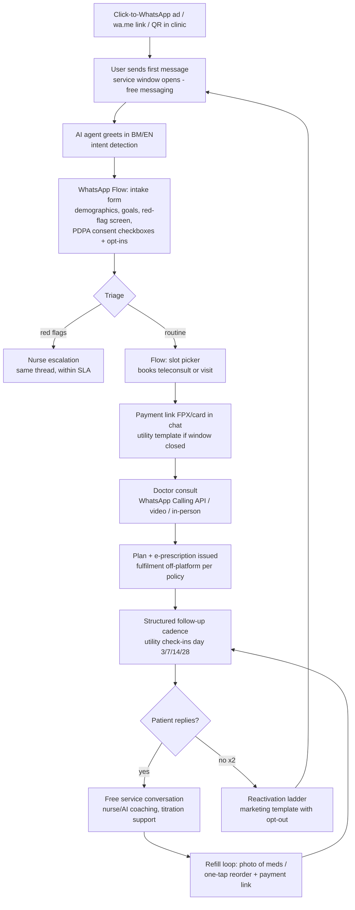

# Malaysia WhatsApp Healthcare Intelligence: How Care Already Runs on WhatsApp — and What a WhatsApp-Native Clinic Can Do

**Abstract.** WhatsApp is the closest thing Malaysia has to a universal digital identity layer: roughly 9 in 10 internet users aged 16–64 use it monthly, it commands ~80% share of messaging activity, and it is the single most-opened app in the country. Malaysian hospitals, clinics, labs, and pharmacies already run substantial patient-facing workflows on WhatsApp — appointment booking at Columbia Asia, KPJ, Sunway Medical and IJN; pharmacist consults at Alpro; lab logistics at Pathlab/BP Healthcare — but almost all of it is manual, human-typed, and unmeasured. Meanwhile, the WhatsApp Business Platform has matured into a genuine care-delivery substrate: per-message pricing (July 2025), native in-chat forms (Flows), voice calling (Calling API, 2025), MYR billing (April 2026), and AI-agent tooling from a vendor ecosystem that is unusually strong in Malaysia (respond.io is headquartered in KL and raised USD 62.5M in June 2026). This document quantifies the channel, maps current healthcare usage, reviews the clinical-evidence base, dissects platform mechanics/pricing/policy (including the prescription-medicine restrictions that directly constrain GLP-1 marketing), profiles the BSP ecosystem, and codifies an operational playbook and risk register for a WhatsApp-native clinic. The strategic conclusion: no Malaysian healthcare provider has yet built a compliant, AI-augmented, deeply instrumented WhatsApp care operation — the components exist, the assembly does not. That assembly is Welltech's most defensible near-term advantage.

**Last updated: July 2026**

Related documents: [WhatsApp operating model](../60-ai-operating-model/whatsapp-operating-model.md) · [AI operating model overview](../60-ai-operating-model/ai-operating-model.md) · [Malaysia telehealth market](./malaysia-telehealth-market.md) · [Malaysia GLP-1 & medical weight loss market](./malaysia-glp1-weight-loss-market.md) · [Marketing intelligence: patient acquisition](../50-marketing-intelligence/patient-acquisition-channels.md) · [Welltech blueprint](../70-welltech-blueprint/blueprint-overview.md)

---

## 1. Key findings

1. **Penetration is effectively total.** Malaysia had 34.9M internet users (97.7% penetration) at the start of 2025;[^1] 90.7% of internet users aged 16–64 use WhatsApp monthly — the highest of any social/messaging platform in the country[^4] — and MCMC survey data recorded WhatsApp as the "favourite communication app" of 97.7% of Malaysian internet users, versus 56.4% for Telegram.[^2] WhatsApp accounts for ~80.1% of messaging-app activity share (Messenger 16.5%, Telegram 14%).[^5]
2. **Healthcare already lives on WhatsApp — informally.** Columbia Asia runs a dedicated WhatsApp appointment channel across 14 Malaysian hospitals;[^20] Sunway Medical publishes WhatsApp-only booking lines for health screening and international patients;[^21][^22] KPJ operates WhatsApp lines for enquiries and medical tourism;[^24] IJN takes specialist bookings via WhatsApp;[^23] Alpro Pharmacy staffs a pharmacist-consult WhatsApp line and built its ePharmacy around chat-initiated prescriptions.[^25][^26] On the clinician side, 74% of Malaysian physicians report using WhatsApp in practice,[^29] and 68.4% of staff in a Malaysian public-hospital study rated it beneficial for clinical coordination.[^30]
3. **The evidence base supports messaging-first care.** RCTs and systematic reviews show messaging interventions improve medication adherence (odds roughly doubled vs. control in SMS meta-analysis),[^35] reduce no-shows,[^37] and deliver clinically meaningful weight loss when used as a coaching channel (e.g., a WhatsApp-assisted lifestyle intervention achieving 2.2 kg mean loss;[^33] Malaysian WhatsApp-group diabetes education significantly improved adherence[^32]).
4. **Platform economics favour a service-led (not blast-led) model.** Since 1 July 2025 Meta charges per delivered template message, not per conversation; service (user-initiated) messages are free, and utility templates inside the 24-hour window are free.[^7][^8] Malaysia marketing templates cost roughly RM0.30–0.45 each; utility messages a fraction of that; MYR billing arrived April 2026.[^10][^11] A clinic whose patients initiate most conversations pays near-zero marginal messaging cost.
5. **Policy is the binding constraint for GLP-1 marketing.** WhatsApp's Business Messaging/Commerce policy prohibits promoting or facilitating the sale of prescription drugs on the platform;[^12][^15] Malaysia's Medicine Advertisements Board separately prohibits advertising prescription medicines to the public.[^27][^28] Meta's 2025 health-and-wellness ad-data restrictions further strip conversion tracking from telehealth advertisers.[^45][^46] The compliant pattern — market the *service* (doctor-led weight-management programme), never the *molecule*, and conduct clinical discussion in user-initiated service conversations — is well-established and documented in §6.
6. **Malaysia has home-field advantage in tooling.** respond.io — a KL-headquartered WhatsApp-first conversation platform with healthcare case studies (Homage: +9% care-visit success, 50 staff-hours/month saved) — raised USD 62.5M in June 2026;[^16][^17][^18] SleekFlow, Wati, 360dialog, Gupshup, Twilio and Bird all serve the market. AI agents on WhatsApp handling triage, booking, FAQ and payment links are production-grade (India's MyGov COVID bot served 20M+ users;[^41] Zuri Health runs a multilingual WhatsApp virtual hospital across 9 African countries[^42]).
7. **The gap = the opportunity.** Malaysian providers use WhatsApp as an unstructured inbox: no templates, no flows, no SLAs, no CRM sync, no audit trail, no AI. A clinic that treats WhatsApp as its primary care-delivery rail — with opt-in discipline, PDPA-grade data handling, nurse-in-the-loop AI, and EMR-integrated message archiving — would be operating a fundamentally different machine than incumbents, at lower cost per interaction than app- or call-centre-based competitors.

---

## 2. Channel fundamentals: WhatsApp penetration and engagement in Malaysia

### 2.1 The numbers

| Metric | Value | Year | Source |
|---|---|---|---|
| Population using the internet | 34.9M (97.7% penetration) | early 2025 | DataReportal[^1] |
| Internet users (16–64) using WhatsApp monthly | 90.7% — #1 platform | 2024–25 | GWI via Meltwater[^4] |
| "Favourite communication app" = WhatsApp | 97.7% of internet users (Telegram 56.4%) | 2022 (MCMC IUS) | MCMC/Statista[^2][^3] |
| WhatsApp share of messaging-app activity | 80.1% (Messenger 16.5%, Telegram 14.0%) | 2025–26 | Elite Asia digital-trends analysis[^5] |
| WhatsApp monthly sessions per user | 852 — most-opened app in Malaysia (TikTok #2 at 368) | 2024 | GWI via Meltwater[^4] |
| Telegram users, Malaysia | ~8–10M (~62% penetration by some counts; strongest in news/communities) | 2025 | Hashmeta / World Population Review[^6] |
| Facebook / Instagram / Messenger ad reach, Malaysia | 23.1M / 15.5M / 11.1M | early 2025 | Meta ad tools via DataReportal[^1] |

Notes on reconciliation: the 97.7% MCMC figure measures *stated favourite communication app* among internet users (2022 survey); the 90.7% GWI figure measures *monthly usage among 16–64-year-old internet users*; the 80.1% figure measures *share of messaging activity*. All three triangulate to the same conclusion — WhatsApp is not "a channel" in Malaysia, it is *the* default interpersonal channel across ages, incomes, ethnicities and languages (Malay, English, Chinese, Tamil all in active use on-platform). Telegram is a strong #2 in absolute users but skews toward channels/broadcast and community use rather than 1:1 conversation.[^6]

### 2.2 Channel performance: WhatsApp vs. Telegram vs. SMS vs. email

Marketing-industry benchmarks (directionally consistent across vendors; treat exact numbers as vendor-reported ranges, not audited figures):

| Channel | Open rate | Click-through rate | Response rate | Notes |
|---|---|---|---|---|
| WhatsApp | 85–98%[^13][^14] | 15–60% (campaign-dependent)[^13][^15b] | 40–60%[^13] | Read receipts make "open" measurable; rich media, buttons, in-chat forms |
| SMS | ~90%+ delivery, "open" not measurable; ~19–28% response[^13] | ~19–45% (varies widely) | ~28%[^13] | No rich media; sender-ID spoofing has damaged trust in MY (scam SMS waves) |
| Email | ~20–25%[^13][^14] | 2–6%[^13][^14] | 1–5%[^13] | Weak in MY consumer contexts; fine for documents/receipts |
| Telegram | high for opted-in channels | n/a (broadcast-centric) | n/a | No equivalent business API ecosystem for 1:1 care workflows; weaker identity binding |

*(analyst judgment)* For healthcare jobs — reminders, results, coaching nudges, reactivation — the practical differences that matter are (a) WhatsApp identity = phone number = patient identifier, (b) two-way rich conversation vs. SMS's one-way text, (c) near-universal habitual checking (852 sessions/month[^4]). The open-rate gap alone (≈4–5× email) compounds across a 12-touch care journey into an order-of-magnitude difference in delivered touchpoints.

**Implications for Welltech.** Channel selection is settled: WhatsApp-first is not a bet, it is alignment with revealed national behaviour. The real strategic questions are *operational* (how to run care on it compliantly and at scale) and *defensive* (how to build switching costs into a channel anyone can open). Sections 5–9 address both.

---

## 3. How Malaysian healthcare uses WhatsApp today

### 3.1 Observed provider usage (concrete examples)

| Provider | Segment | Observed WhatsApp usage | Source |
|---|---|---|---|
| **Columbia Asia** (14 MY hospitals) | Private hospital chain | Dedicated "WhatsApp Appointment" page; booking via WhatsApp alongside web and phone | columbiaasia.com[^20] |
| **Sunway Medical Centre** (Subang Jaya, Velocity, Penang, Ipoh) | Private tertiary | "Book now via WhatsApp" for specialties; Penang health-screening line 04-373 8142 marked *"WhatsApp Only"*; Velocity International Patient Centre WhatsApp +6019 383 3587 | sunwaymedical sites[^21][^22] |
| **KPJ Healthcare** (29 specialist hospitals) | Private hospital chain | WhatsApp lines for appointment/health-tourism enquiries (e.g., 019 324 3208 for medical tourism) | KPJ via my1health directory[^24] |
| **IJN (Institut Jantung Negara)** | National cardiac centre | Publicly promoted WhatsApp specialist-appointment booking for IJN private clinics | IJN Facebook announcement[^23] |
| **Alpro Pharmacy** (~300 outlets; largest prescription pharmacy chain) | Community pharmacy | Pharmacist WhatsApp consult line +60 19 702 1923 ("chat with friendly pharmacists"); ePharmacy flow: chat → prescription review → 2-hour Klang Valley delivery; PDPA compliance stated | alpropharmacy.com[^25][^26] |
| **Pathlab** (51+ branches) | Diagnostics lab | WhatsApp used for OTP/account verification in its report app; branch-level WhatsApp enquiry lines; app is primary report channel | pathlab.com.my, App Store listing[^27b] |
| **BP Healthcare / Doctor2U** (70+ locations) | Screening + digital health | Chat-based support and ordering across screening/e-commerce properties | bphealthcare.com / shop.doctor2u.my[^28b] |
| **DoctorOnCall** | Telehealth + e-pharmacy | WhatsApp OTP for login; WhatsApp contact links for support; consults from RM15 via chat/video/audio | doctoroncall.com.my[^19] |
| **Him Clinic, Klinik Tuah, and long-tail GP/aesthetic clinics** | Primary care / men's health | wa.me links and WhatsApp buttons as the default booking CTA on clinic sites | forhimclinic.com, kliniktuah.com[^31] |

### 3.2 Usage patterns and their limits

Across these examples, five recurring patterns *(analyst synthesis of the provider pages above)*:

1. **wa.me as the universal CTA.** Clinic and hospital websites route "Book appointment" buttons to wa.me deep links answered by human staff on WhatsApp Business App (not API). Booking is a free-text negotiation ("Nak buat appointment Dr X hari Khamis boleh?").
2. **WhatsApp as switchboard replacement.** Screening centres and international-patient desks publish WhatsApp-only numbers because inbound WhatsApp is cheaper and asynchronous versus phone queues.
3. **Result and document delivery, ad hoc.** Labs and clinics send PDFs of results over chat when patients ask — convenient, but unencrypted-at-rest on personal devices, outside any EMR, and PDPA-grey (see §6.4).
4. **Pharmacy reorder by photo.** Patients photograph old medication strips/prescriptions and send them to pharmacy WhatsApp lines; pharmacists confirm and arrange delivery with a payment link (Alpro's documented flow[^25][^26]).
5. **Clinician back-channel.** WhatsApp groups coordinate referrals, on-call escalation and case discussion inside Malaysian hospitals; 68.4% of 307 surveyed staff at a Malaysian public hospital found it beneficial for clinical practice[^30] and an NIH-indexed review reports 74% of Malaysian physicians using WhatsApp in practice.[^29]

What is *absent* in nearly every observed deployment: structured templates, opt-in capture, Flows-based intake, CRM/EMR integration, measurable SLAs, automated reminder cadences, AI triage, and audit-grade message retention. Even the largest hospital chains run WhatsApp as a manually staffed inbox.

**Implications for Welltech.** Patient behaviour requires zero education — Malaysians already book, ask, and receive results on WhatsApp. Incumbent execution is shallow, so the bar for "best WhatsApp care experience in Malaysia" is low and the delta is visible to patients within one conversation (instant structured booking vs. "we will get back to you"). The playbook in §9 is designed to make that delta systematic.

---

## 4. Evidence base: messaging-delivered care works

### 4.1 Clinical communication and coordination

| Study | Setting | Finding |
|---|---|---|
| Ganasegeran et al., *Int J Med Informatics* — "The m-Health revolution: perceived benefits of WhatsApp use in clinical practice" | 307 health professionals, Malaysian public hospital | 68.4% perceived WhatsApp as beneficial in clinical practice; faster interaction for patient management[^30] |
| "WhatsApp in Clinical Practice — The Challenges of Record Keeping and Storage: A Scoping Review" (*IJERPH*, 2021) | 16 studies, global | Widespread clinical WhatsApp use, but "no clear mechanisms for record keeping or data storage"; legal/regulatory exposure from workarounds[^34] |
| NIH-indexed physician-usage data | Malaysia / Brazil | 74% of Malaysian and 97% of Brazilian physicians regularly use WhatsApp in practice[^29] |

### 4.2 Adherence, follow-up and attendance

| Evidence | Design | Result |
|---|---|---|
| SMS-for-adherence systematic review (*PMC4939231*) | Chronic-disease patients | Text interventions ~doubled odds of adherence; modelled adherence rise from 50% → 67.8%[^35] |
| Mobile-app adherence meta-analysis (*JMIR* 2025; 14 studies, n=1,785) | Chronic conditions | Significant adherence improvement (low-certainty evidence)[^36] |
| Appointment-reminder meta-analysis (*J Hosp Manag Health Policy*; 10 RCTs) | Outpatient attendance | Reminders significantly improve attendance vs. none[^37] |
| Klang Valley diabetes education RCT-style study (*Frontiers Clin Diabetes Healthc*, 2023; n=389) | Daily reminders + education **via WhatsApp groups**, 1 month | Significant improvement in medication adherence and information-seeking; authors note WhatsApp "widely used among Malaysians… could be leveraged" for health education[^32] |
| Yaagoob et al., WhatsApp-based T2D intervention RCT (*Nurs Health Sci*, 2024) | Type-2 diabetes | RCT of WhatsApp-delivered diabetes intervention (SEA-relevant population)[^38] |
| SeBF cluster-randomised field trial (Malaysia) | Breastfeeding self-efficacy via WhatsApp vs. face-to-face | WhatsApp arm feasible and effective as delivery channel for theory-based education[^39] |

### 4.3 Weight management via messaging — directly relevant to GLP-1 programmes

| Evidence | Design | Result |
|---|---|---|
| Patrick et al., text-message weight-loss RCT (*J Med Internet Res*, 2009) | Personalised SMS/MMS 2–5×/day + monthly calls, 16 weeks | Significantly greater weight loss vs. print-materials control — the foundational messaging-for-weight-loss RCT[^40] |
| WhatsApp-assisted, peer-supported lifestyle intervention (Karachi; *BMJ Open*/PMC 2023) | 12-month quasi-experimental | Mean −2.2 kg; −386 kcal/day intake; participants rated WhatsApp "convenient, flexible and supportive"[^33] |
| mHealth lifestyle meta-analysis (42 RCTs) | Mixed mHealth | Significant reductions in body weight and BMI[^43] |

*(analyst judgment)* The clinical literature supports three design principles for Welltech: (1) **cadence beats content** — frequency and timeliness of touches drive adherence effects; (2) **human-in-the-loop amplifies effect** — reminder systems with live-staff involvement outperform purely automated ones;[^37] (3) **groups add measurable value** in weight management via accountability,[^33] which maps to WhatsApp Communities (§9.8). For GLP-1 patients specifically — where week-4–12 discontinuation from side-effects and titration confusion is the main loss point — a structured WhatsApp check-in cadence is the cheapest known adherence lever.

**Implications for Welltech.** Welltech can legitimately describe its WhatsApp care model as *evidence-based*, citing messaging-adherence meta-analyses and Malaysian WhatsApp-delivered interventions — valuable for clinician recruitment, payer conversations, and MOH-facing credibility. It should also instrument its own cohort (adherence, weight change, retention vs. cadence) to build proprietary evidence no competitor holds.

---

## 5. WhatsApp Business Platform mechanics (2025–2026)

### 5.1 Capability inventory relevant to a clinic

| Capability | What it does | Healthcare relevance | Status in Malaysia |
|---|---|---|---|
| **Cloud API messaging** | Programmatic send/receive; text, media, documents, location, contacts | Core rail: reminders, results, coaching | GA[^7] |
| **Template messages** | Pre-approved business-initiated messages (marketing / utility / authentication) | Appointment reminders, refill nudges, reactivation | GA; per-message billing[^7][^8] |
| **24-hour customer-service window** | Free-form replies within 24h of last user message | Consults, triage, Q&A at zero marginal cost | GA[^7] |
| **WhatsApp Flows** | Native in-chat forms/screens (date pickers, dropdowns, multi-step) | Intake forms, screeners, booking, consent capture; completion rates ~65–85% vs. 35–55% for external links; no-show reductions of ~35–45% reported for Flows-based booking | GA[^9][^44] |
| **Catalogs / product messages** | In-chat product lists & carts | Supplements, screening packages, programme SKUs — **not** prescription items (policy, §6.1) | GA; commerce-policy-gated[^12] |
| **WhatsApp Pay / in-chat payments** | Native payment inside chat | **Not available in Malaysia** (limited to India, Brazil, Mexico, Indonesia); MY pattern = payment links (FPX/DuitNow/cards via HitPay, Billplz, Curlec, Stripe) confirmed in-chat | Not in MY[^47][^48] |
| **Business Calling API** (July 2025) | VoIP calls inside the WhatsApp thread, user- or business-initiated (with permission request) | Teleconsults and nurse callbacks in the same thread as the care record; Malaysia supported | GA[^49][^50] |
| **Click-to-WhatsApp ads (CTWA)** | FB/IG ads that open a WhatsApp chat | Primary paid-acquisition on-ramp; conversation-level attribution | GA; health-targeting restrictions apply (§6.3)[^51] |
| **Communities / groups** | Grouped chats under one umbrella, admin announcements | Cohort-based programmes, peer support | GA (consumer feature; API support limited)[^52] |
| **Verified business / Meta verification** | Green-tick brand verification | Trust signal against clinic-impersonation scams | GA |

### 5.2 Pricing: the July 2025 reset

Effective **1 July 2025**, Meta deprecated conversation-based pricing and moved to **per-delivered-template-message** pricing:[^7][^8]

- **Marketing templates** — always charged, regardless of window state. Mandatory opt-out button. Malaysia planning figure ≈ **RM0.30–0.45 per message**.[^10]
- **Utility templates** — charged *only outside* an open 24-hour service window; **free inside it**. Global range ≈ USD 0.004–0.0456.[^11]
- **Authentication templates** — charged per message with volume-tier discounts.[^7]
- **Service messages** (all free-form replies within the window) — **free, unlimited**.[^8]
- **MYR billing** available since **April 2026** (one of 8 new billing currencies), removing FX guesswork.[^10]

Modelled monthly Meta cost for a 1,000-active-patient WhatsApp clinic *(analyst estimate using rates above)*:

| Message class | Volume/month | Unit cost | Cost |
|---|---|---|---|
| Utility (reminders/refills outside window) | 3,000 | ~RM0.06–0.20 | RM180–600 |
| Utility (inside window) + all service replies | 12,000 | free | RM0 |
| Marketing (reactivation, campaigns) | 1,000 | RM0.30–0.45 | RM300–450 |
| **Total Meta fees** | | | **≈ RM480–1,050/month (≈ RM0.50–1.05 per patient)** |

The design lesson: **architect for user-initiated conversations.** Every journey that begins with the patient messaging first (or replying to a utility nudge) rides free service messaging. A blast-marketing model pays 30–45 sen per touch; a service-led model pays almost nothing and enjoys better quality ratings (§10.1).

### 5.3 Opt-in and messaging limits

- Businesses must obtain **opt-in consent** before business-initiated messages; consent must name the business and the message types; Meta's November 2024 update allows the opt-in to be collected on any channel provided local law is met, and Meta reserves the right to audit opt-in flows on complaint signals.[^53][^54]
- **Marketing templates must carry an opt-out button**; opt-outs must be honoured immediately.[^54]
- **Messaging limits** scale with quality: new numbers start at 1,000 unique recipients/24h for business-initiated conversations and scale to 10K/100K/unlimited with sustained quality; limits are now managed at business-portfolio level.[^55][^56]

**Implications for Welltech.** (a) Bake opt-in into the first Flow (intake) with granular checkboxes — appointment ops, clinical follow-up, education, marketing — creating a PDPA-clean consent ledger (§6.4). (b) Model unit economics on service-window engineering: a reminder timed so the patient *replies* converts the subsequent 24h of clinical messaging to zero cost. (c) Warm up numbers gradually; do not launch a reactivation blast from a fresh number (§10.1).

---

## 6. Policy, regulation and compliance — the deep water

### 6.1 Meta's healthcare-relevant platform rules

The WhatsApp Business Messaging Policy incorporates the Meta Commerce Policy. Key prohibitions and boundaries:[^12][^15]

| Rule | Consequence for a GLP-1 / telehealth clinic |
|---|---|
| **Prohibited: promoting or facilitating the exchange of prescription drugs** (and recreational drugs) | No template, catalog item, ad, or chat flow may market Wegovy/Mounjaro/Saxenda or offer them for sale on-platform. Product names must not appear in marketing templates or CTWA creative. |
| **OTC medicines: messaging allowed, commerce prohibited** (policy relaxation effective from 27 Aug — OTC/alcohol/gambling brands may message; buying/selling/payments for these categories stays prohibited on WhatsApp surfaces)[^57] | Supplements/OTC items may be discussed and supported in chat; do not sell OTC medicines through Catalogs/carts. General retail items are fine. |
| **Pharmacies/drugstores** may use full commerce features for grocery/convenience items but messaging-only for OTC drugs[^57] | If Welltech runs a pharmacy entity, segment its catalog accordingly. |
| **No deception, spam, or surprise**; respect blocks and opt-outs[^12] | Standard hygiene; enforced via quality ratings and template review. |
| Policy-violation enforcement: template rejection → feature limits → account suspension → permanent disable[^58] | A banned number severs the patient channel — treat number health as an operational KPI (§10.1). |

**The compliant GLP-1 pattern** *(analyst synthesis of the policies above)*: market the **clinical service** ("doctor-supervised medical weight-management programme"), not the drug; route interested users into a **user-initiated service conversation**, where an individualised clinical discussion between a licensed doctor and their patient (including prescribing decisions and titration support) is medical care conducted over a communication channel, not "promotion or sale of prescription drugs" — mirroring how Alpro's pharmacist-chat and MMC-compliant teleconsults already operate.[^25][^59] Fulfilment/payment for prescription medicine should occur off-platform (clinic dispensing, licensed e-pharmacy checkout), with WhatsApp carrying logistics notifications only. This is a policy-risk-managed reading, not a Meta-certified safe harbour — it should be revisited against policy updates quarterly.

### 6.2 Malaysian medicines-advertising law

- The **Medicines (Advertisement and Sale) Act 1956** and **Medicine Advertisements Board (MAB)** regime prohibit advertising prescription medicines to the general public; MAB approval (KKLIU number) is required for permitted medicine/health-facility advertising.[^27][^28]
- MAB also publishes **Advertising Guidelines for Healthcare Facilities and Services** governing how clinics may advertise service claims.[^27]
- Net effect: even where Meta policy permitted it, naming GLP-1 brands in Malaysian consumer advertising would breach domestic law. Programme-level advertising ("medically supervised weight loss") with MAB-compliant claims is the only lawful lane.

### 6.3 Meta health-and-wellness ad restrictions (2025)

From January–February 2025, Meta classifies health-and-wellness advertisers into restriction tiers and **blocks bottom-funnel conversion events (Purchase, Lead) for flagged accounts** — telehealth, pharmacies, diet programmes included.[^45][^46] Consequences: retargeting audiences off conversion events disappear and campaign optimisation degrades. CTWA is the structural workaround: the optimisation event becomes *conversation started* (not a stripped web conversion), and attribution moves into the chat funnel where Welltech controls measurement.[^51] Healthcare CTWA benchmarks: healthcare Meta CPL ≈ USD 41.60; CTWA deployments report multi-x improvements in qualified-lead cost vs. website-form campaigns (vendor-reported: up to 2.7× qualified leads, −78% cost per qualified lead in one Meta-ecosystem case).[^60][^51]

### 6.4 PDPA 2024/2025 — Malaysia's privacy regime

The **Personal Data Protection (Amendment) Act 2024** (in force via phased 2025 commencement) materially raises the bar:[^61][^62][^63]

| Requirement | Detail | WhatsApp-clinic consequence |
|---|---|---|
| Health data = **sensitive personal data** | Explicit consent required for processing; biometric data added to definition | Intake Flows must capture explicit, purpose-specific consent before clinical questioning |
| **Breach notification** | Notify Commissioner within 72h; affected individuals within 7 days if significant harm likely[^62] | Message archives and device policies become breach surface; incident runbook required |
| **DPO appointment** | Mandatory for qualifying controllers (guidelines issued March 2025)[^62] | Appoint DPO early; document WhatsApp data flows |
| **Penalties** | Max fine raised RM300K → **RM1M** + up to 3 years' imprisonment[^61][^63] | Board-level risk |
| **Cross-border transfer guidelines** (2025) | Structured transfer-assessment regime[^63] | Cloud API processes messages on Meta infrastructure outside MY; document the transfer basis and Meta's processor role |

### 6.5 Encryption and data-handling reality (what to tell patients honestly)

- All WhatsApp messages, including business messages, are Signal-protocol encrypted in transit.[^64]
- **Cloud API nuance:** messages are decrypted by the Cloud API for processing and delivery — Meta operates the endpoint as a data processor; Cloud API messages are stored at most 30 days for delivery purposes then deleted, are not used for ads, and the service is SOC 2 certified.[^64][^65] "End-to-end encrypted to the clinic's infrastructure" is accurate; "end-to-end encrypted to your doctor's eyes only, like a personal chat" is not — the BSP and the clinic's own systems see plaintext by design (that is what makes audit, AI and CRM possible).
- **MMC Guideline on Telemedicine** requires the same ethical, professional and record-keeping standards as in-person care and expects virtual consultation primarily as continuation of care for existing patients, with limited first-consult exceptions in primary care.[^59][^66]
- **Record-keeping:** the clinical-practice scoping review found no established mechanism for archiving WhatsApp clinical content[^34] — so a WhatsApp-native clinic must build one: API-side archiving of all message payloads into the EMR/CRM with timestamps and clinician identity, retention aligned to Malaysian medical-record norms, and clinician personal devices excluded from clinical messaging entirely (all clinical traffic through the API/platform, never staff-personal WhatsApp).

**Implications for Welltech.** Compliance is a moat, not a tax. Every rule above (prescription-ad bans, PDPA sensitive-data consent, MMC record-keeping) is *harder* for incumbents running WhatsApp on shared handsets with zero archiving — and largely solved by Welltech's architecture (API-only clinical messaging, consent-ledger Flows, EMR-integrated archive, DPO governance). Publishing a plain-language "How we protect your WhatsApp health data" page converts the compliance burden into a trust asset.

---

## 7. The BSP / vendor ecosystem (Malaysia lens)

### 7.1 Vendor comparison

| Vendor | HQ / MY relevance | Model & indicative pricing | Healthcare proof points | Fit assessment *(analyst view)* |
|---|---|---|---|---|
| **respond.io** | **Kuala Lumpur** — Malaysian champion; USD 62.5M raise June 2026, expanding into AI agents[^16][^18] | Platform subscription (Pro ~USD 199/mo, Premium ~USD 349/mo); no markup on Meta fees[^67] | Homage (SG/MY/AU caregiving): −50 staff-hours/mo, +9% care-visit success;[^17] Praga Medica (medical tourism): −50% response time, 97% spam filtered;[^68] dedicated healthcare vertical & WhatsApp-for-healthcare playbooks[^69][^70] | Strongest MY-context default: local support, healthcare references, AI-agent roadmap |
| **SleekFlow** | HK/SEA, active MY GTM | Premium AI plan ~USD 399/mo + USD 15/number/mo[^67] | MY case-study library; WhatsApp Pay/payments guides for MY[^47][^71] | Good omnichannel + commerce angle |
| **Wati** | HK, SME-focused | ~USD 99/mo (5 users) mid-tier[^67] | SME clinic long tail | Cheapest structured entry; limited depth for regulated ops |
| **360dialog** | Berlin; pure BSP | €49/mo licence, pass-through Meta fees[^72][^73] | Infrastructure-grade API access | Best raw-API economics if Welltech builds its own stack |
| **Gupshup** | US/India CPaaS | ~USD 80/mo + ~USD 0.001/msg markup[^74] | Large-scale India healthcare bots | Volume-rate leader for SEA at scale[^73] |
| **Twilio** | US CPaaS | Per-message markup (~USD 0.005) + usage[^8] | Enterprise integrations; Calling API support[^75] | Fits engineering-heavy build; higher TCO at volume |
| **Bird (ex-MessageBird)** | NL CPaaS | Per-message markup model[^73] | Marketing-automation strength | Alternative CPaaS |

Break-even heuristic: flat-licence BSPs (360dialog) beat per-message-markup CPaaS above roughly 10K messages/month.[^73] Malaysia-specific integrator content (e.g., forwardchat.my's Malaysian API-cost breakdowns[^76]) confirms an active local implementation market.

### 7.2 Build-vs-buy for a WhatsApp-native clinic *(analyst view)*

- **Phase 1 (0–12 mo):** buy respond.io (or SleekFlow) for inbox, automation, and audit exports; ship in weeks; accept platform fees as speed premium.
- **Phase 2 (12–24 mo):** move messaging infrastructure to 360dialog/Cloud API direct with an in-house orchestration layer once volumes exceed ~50K msgs/month and AI-agent logic becomes proprietary; keep the vendor inbox for human agents if useful.
- Never let the BSP own the data model: patient state, consent ledger, and conversation archive live in Welltech's EMR/CRM from day one.

---

## 8. Conversational AI on WhatsApp: state of the art

| Deployment | Scope | Reported results |
|---|---|---|
| **MyGov Corona Helpdesk (India, Haptik)** | COVID information/triage bot on WhatsApp | Largest WhatsApp chatbot built; 20M+ users served[^41] |
| **Zuri Health "Vera" (Kenya → 9 African countries)** | WhatsApp virtual hospital: symptom checking, doctor chat (from USD 0.10), pharmacy, labs, home visits; English/Swahili/French; Meta "Chat for Impact" accelerator alum | Full care marketplace operating primarily through WhatsApp + SMS[^42] |
| **Apollo 24/7 (India)** | WhatsApp for diagnostics booking (Flows) and medicine-refill reminders | Featured Meta success story; Flows-optimised test booking[^77][^9] |
| **Healthcare WhatsApp automation (industry benchmarks)** | Triage/booking/FAQ bots | Vendor-reported: ~70% call-centre volume reduction; 30–60% no-show reduction from automated reminders[^78][^9] |
| **respond.io AI Agents** | Lead qualification, FAQ, routing before human handoff | Praga Medica: instant after-hours replies, 97% spam filtered, −50% first-response time[^68] |

Architecture pattern now standard across these deployments *(analyst synthesis)*: **AI agent as first responder** (identify intent, collect structured data via Flows, answer whitelisted FAQs, schedule), **hard guardrails** (no diagnosis, no dosing advice, mandatory escalation triggers on red-flag symptom keywords), **human-in-the-loop** for anything clinical, and **full conversation logging** for QA. In Malaysia, the AI must handle Malay/English code-switching ("boleh tak nak reschedule appointment esok?") — a genuine local-model/prompting moat, since global bot templates are English-first.

**Implications for Welltech.** The AI layer is where WhatsApp-first becomes AI-native: every conversation is structured training/QA data; triage and admin absorb 60–80% of inbound volume *(analyst estimate from benchmarks above)*, letting one nurse supervise many concurrent care threads. See [WhatsApp operating model](../60-ai-operating-model/whatsapp-operating-model.md) for the staffing and escalation design.

---

## 9. The WhatsApp-native clinic playbook

Operational patterns Welltech should treat as product specs. Message-class annotations show cost behaviour under §5.2 pricing.

### 9.1 Care journey (end-to-end)

### 9.2 Onboarding
- CTWA ad → prefilled first message ("Hi, I'd like to learn about the weight programme") so the *user* initiates (free window + clean opt-in context).[^51][^53]
- First AI response < 5 seconds, bilingual, sets expectations (hours, human availability, emergency disclaimer with 999/ED routing).
- **Intake via Flow, not free text**: 65–85% completion vs. ~35–55% for external links.[^44] Consent ledger written per §6.4.
- Verification: green-tick business profile + published official number on the website to defeat impersonation scams.

### 9.3 Reminder cadences *(analyst-designed defaults; A/B from launch)*
| Journey | Cadence | Message class |
|---|---|---|
| Appointment | T-72h confirm (buttons: confirm/reschedule), T-24h reminder, T-2h logistics | Utility |
| GLP-1 titration | Day 1 injection walkthrough (video), D3 side-effect check, D7 weekly check-in Flow (weight, symptoms), D28 dose-review booking | Utility + service |
| Chronic follow-up | Monthly check-in Flow; abnormal answers auto-escalate to nurse | Utility |
| Labs | "Sample received" → "Results ready — reply to discuss" (result *content* only after patient reply, inside service window, ideally as link to secure portal) | Utility → service |

### 9.4 Nurse-in-the-loop messaging
- All clinical threads visible in shared inbox; AI drafts, nurse approves — never unsupervised clinical advice (MMC standards apply to chat as to consults[^59]).
- Escalation SLAs: red-flag keywords → nurse < 15 min in hours / on-call protocol after hours; routine clinical → same day.
- Clinician identity stamped on every outbound clinical message (name + role), mirroring record-keeping duty.[^34]

### 9.5 Repeat prescriptions
- Patient taps "Refill" quick-reply or photographs medication → pharmacist verification (Alpro's proven MY pattern[^25]) → doctor countersign where legally required → payment link → delivery tracking via utility templates. Prescription-drug *promotion* never appears; the loop is patient-initiated care fulfilment (§6.1).

### 9.6 Pathology results + explanation
- Never blast raw abnormal results. Pattern: utility ping → patient reply opens window → AI posts plain-language summary drafted from structured lab data, nurse-approved → offer one-tap booking if flagged. PDF full report via time-limited secure link rather than a chat attachment sitting in a personal gallery *(analyst recommendation given PDPA + device-security reality, §6.4–6.5)*.

### 9.7 Payments
- WhatsApp Pay unavailable in Malaysia;[^47] use FPX/DuitNow/card payment links (HitPay, Billplz, Curlec, Stripe) delivered in-chat — the same pattern Lotus's Malaysia uses for WhatsApp orders.[^48][^79] Reconcile via webhook → auto-confirm in thread.

### 9.8 Groups & communities
- Opt-in cohort groups for programme patients (e.g., "July GLP-1 cohort"), nurse-moderated, announcement-only clinical content + peer chat: peer-support messaging is evidenced for weight-loss maintenance.[^33][^80] Strict rule: no individual clinical data in groups.

### 9.9 Retention & reactivation
- Marketing templates only, with opt-out button, capped frequency (≤2/month *(analyst default)*), value-led (new screening package, seasonal check-up) — protecting quality rating (§10.1).
- Win-back ladder: day 45 lapsed → educational nudge; day 90 → offer; day 180 → final "shall we keep your file active?" consent refresh.

**Implications for Welltech.** Each pattern above is individually mundane; the compound system — instrumented, AI-drafted, nurse-supervised, consent-ledgered, EMR-archived — is what no Malaysian provider currently operates. Codify these as SOPs with owned metrics (response SLA, flow completion, cadence adherence, reactivation yield) in the [operating model](../60-ai-operating-model/whatsapp-operating-model.md).

---

## 10. Risks and mitigations

### 10.1 Risk register

| Risk | Mechanism | Severity | Mitigation |
|---|---|---|---|
| **Number ban / account suspension** | Policy violations, spam reports, poor quality rating → portfolio-level limits, suspension, permanent disable[^56][^58] | Existential (channel = clinic front door) | Service-led ratio (business-initiated < 20% of volume *(analyst target)*); warm-up new numbers; monitor quality rating daily; segregate marketing vs. clinical numbers under the portfolio; documented appeal runbook; keep phone/SMS/email fallback contactability for all patients |
| **Template rejections** | Category mismatch (promo content in utility), prohibited content (drug names), duplicates[^55][^58] | Medium — blocks campaigns | Template library with compliance pre-review; never put molecule/brand names in templates; utility templates strictly transactional |
| **Spam fatigue / opt-out spiral** | Over-messaging erodes the channel's core asset (attention) | High, slow-burn | Frequency caps; preference centre in Flow; suppress marketing to actively-in-care patients; watch block-rate as north-star health metric |
| **Medical-advice liability over chat** | Asynchronous advice without examination; missed red flags; AI hallucination | High | MMC-standard protocols applied to chat;[^59] AI never diagnoses/doses; red-flag keyword auto-escalation; emergency disclaimers; clinician sign-off on clinical messages; indemnity insurer briefed on chat-care model |
| **PDPA breach** | Device loss, staff personal-WhatsApp leakage, BSP compromise; RM1M fines + 72h notification duty[^61][^62] | High | API-only clinical messaging (no staff personal devices); MDM on any clinic handsets; BSP data-processing agreement; DPO + breach runbook; explicit sensitive-data consent at intake |
| **Record-keeping / audit gap** | Chat content absent from medical record → medico-legal exposure[^34] | High | Webhook-archive every message into EMR against patient ID; retention per MY medical-record norms; consult summaries formally written back into the record |
| **Platform dependence / policy shifts** | Meta pricing or health-policy changes (cf. 2025 pricing reset, ad-data restrictions)[^7][^45] | Medium-structural | Own the patient graph (phone numbers + consents in Welltech CRM); quarterly policy review; portable architecture (channel-abstracted messaging layer); email/SMS/app fallback for regulated notices |
| **Impersonation scams** | Fake "clinic" numbers phishing patients (MY scam-message environment) | Medium | Meta verification; publish the single official number everywhere; patient education in onboarding |

### 10.2 Benchmark: WhatsApp vs. native app vs. web portal vs. phone/SMS by healthcare job-to-be-done

| Job-to-be-done | WhatsApp | Native app | Web portal | Phone / SMS |
|---|---|---|---|---|
| Acquisition → first contact | ◎ CTWA/wa.me, zero install, 90%+ reach[^4][^51] | ✕ install wall (double-digit % drop-off) | ○ form fill, no thread | ○ call centre cost, no record |
| Appointment booking | ◎ Flows slot-picker, 65–85% completion[^44] | ○ good UX *if* installed | ○ decent | ○ synchronous, queue-bound |
| Reminders / no-shows | ◎ 85–98% opens; 30–60% no-show reduction reported[^13][^78] | △ push often disabled | ✕ requires login | ○ SMS works but one-way, scam-tainted |
| Triage & Q&A | ◎ conversational, AI-ready, free in window | △ chat modules underused | ✕ | △ phone = expensive gold standard |
| Teleconsult | ○ Calling API/video in-thread[^49] | ◎ richest AV control | △ | ○ voice only |
| Results delivery + explanation | ◎ ping → reply → explain (§9.6) | ○ secure but unopened | ○ secure but unvisited | ✕ insecure to convey detail |
| Refills / commerce | ◎ photo-reorder + payment link (policy-gated)[^25][^48] | ○ | ○ | ✕ |
| Coaching / behaviour change | ◎ evidenced channel (§4.3); groups | △ engagement decays post-install | ✕ | △ SMS evidenced but shallow |
| Longitudinal record & audit | △ **requires deliberate archiving build** (§10.1) | ◎ native | ◎ native | ✕ |
| Marginal cost per interaction | ◎ near-zero in service window[^7] | △ dev cost amortised | △ | ✕ call-centre labour |

◎ strong · ○ adequate · △ weak · ✕ poor. *(analyst assessment based on sources cited)*

Reading: WhatsApp wins every *engagement* job and loses only on *system-of-record* — which is precisely why the architecture must pair WhatsApp (front-of-house) with a real EMR/CRM (back-of-house), rather than pretending the chat thread is the record.

---

## 11. Strategic synthesis — Implications for Welltech

1. **Position WhatsApp as the clinic, not a channel of the clinic.** Booking, triage, consult scheduling, follow-up, refills, payment confirmation and coaching all execute in-thread; app/portal exist only for records access and video. This matches Malaysian behaviour (§2–3) and minimises marginal cost (§5.2).
2. **Weaponise incumbent shallowness.** Demonstrable superiority within one conversation: sub-minute structured response vs. hospital inboxes answered in hours. Mystery-shop competitors quarterly and track response-time deltas as marketing ammunition (feed [competitor dossiers](../20-competitor-dossiers/)).
3. **Run the GLP-1 programme policy-clean from day one** (§6.1–6.2): programme-led CTWA creative, no molecule names on-platform, prescriptions fulfilled off-platform, MAB/KKLIU review for any medicine-adjacent claims. Competitors cutting corners here face template bans and MAB enforcement; Welltech's discipline compounds into channel durability.
4. **Build the compliance moat visibly** (§6.4–6.5): consent ledger, EMR archiving, DPO, breach runbook, honest encryption language. This is the hardest part for incumbents to retrofit and the easiest to communicate to discerning patients and regulators.
5. **Buy respond.io-class tooling now, build the AI/orchestration layer as the moat** (§7.2, §8): Malay/English code-switching clinical AI with nurse-in-the-loop is defensible; inbox software is not.
6. **Instrument everything and publish outcomes**: no-show rate, GLP-1 week-12 persistence, weight outcomes vs. cadence — converting the operation itself into proprietary evidence (§4) no Malaysian competitor holds, and a reusable asset for Singapore/Hong Kong expansion where WhatsApp penetration is similarly dominant.
7. **Hedge platform risk structurally** (§10.1): Welltech's asset is the consented patient graph and the care logic — both must live in Welltech systems, with WhatsApp as the (current) best-in-class delivery rail.

---

## References

[^1]: DataReportal, "Digital 2025: Malaysia" (internet users 34.9M / 97.7% penetration; Facebook 23.1M, Instagram 15.5M, Messenger ad reach 11.1M, early 2025), https://datareportal.com/reports/digital-2025-malaysia (accessed July 2026).
[^2]: Statista (based on MCMC survey data), "Malaysia: internet users using communication apps" (WhatsApp favourite communication app of 97.7% of respondents; Telegram 56.4%, May 2022), https://www.statista.com/statistics/973428/malaysia-internet-users-using-communication-apps/ (accessed July 2026).
[^3]: Malaysian Communications and Multimedia Commission (MCMC), "Internet Users Survey" resource page, https://www.mcmc.gov.my/en/resources/statistics/internet-users-survey (accessed July 2026).
[^4]: Meltwater, "Social Media Statistics for Malaysia" (90.7% of internet users 16–64 use WhatsApp monthly; 852 WhatsApp sessions/month vs. TikTok 368.4; Facebook 84.9%, Instagram 77%), https://www.meltwater.com/en/blog/social-media-statistics-malaysia (accessed July 2026).
[^5]: Elite Asia, "Top Digital and Social Media Trends in Malaysia in 2026" (WhatsApp 80.1% messaging share; Messenger 16.5%; Telegram 14%), https://www.eliteasia.co/digital-and-social-media-trends-in-malaysia-in-2026/ (accessed July 2026).
[^6]: Hashmeta, "Telegram Statistics Southeast Asia: Complete Growth & Market Analysis" (Malaysia ~8–10M Telegram users; usage patterns), https://hashmeta.com/blog/telegram-statistics-southeast-asia-complete-growth-market-analysis/ (accessed July 2026).
[^7]: Meta for Developers, "Pricing on the WhatsApp Business Platform" (per-message pricing from 1 July 2025; category definitions; free service window; utility-in-window free; authentication volume tiers), https://developers.facebook.com/documentation/business-messaging/whatsapp/pricing (accessed July 2026).
[^8]: Twilio Help Center, "Notice: Changes to WhatsApp's Pricing (July 2025)", https://help.twilio.com/articles/30304057900699-Notice-Changes-to-WhatsApp-s-Pricing-July-2025 (accessed July 2026).
[^9]: WA.Expert, "Build WhatsApp Flows for Appointment Booking — Step-by-Step 2025" (Flows completion 65–85% vs. 35–55% external links; 35–45% no-show reduction; Apollo 24/7 diagnostics Flows), https://wa.expert/pages/whatsapp-flows-appointment-booking (accessed July 2026).
[^10]: ZenWeb, "WhatsApp Marketing Cost Malaysia 2026: API, Blast & Chatbot Pricing" (MY marketing template ≈ RM0.30–0.45; MYR billing from April 2026), https://zenweb.my/blog/whatsapp-marketing-cost-malaysia/ (accessed July 2026).
[^11]: Flowcall, "WhatsApp Business API Pricing 2026: Complete Cost Guide with Country Rates" (marketing USD 0.025–0.1365; utility USD 0.004–0.0456; authentication USD 0.004–0.0456; MY authentication-international USD 0.0418), https://www.flowcall.co/blog/whatsapp-business-api-pricing (accessed July 2026).
[^12]: WhatsApp, "WhatsApp Business Messaging Policy" (prescription-drug prohibition; opt-in and opt-out duties; Meta Commerce Policy incorporation), https://whatsappbusiness.com/policy/ (accessed July 2026).
[^13]: AiSensy, "50 Latest WhatsApp Statistics" (98% open rate vs. ~20% email; CTR and response-rate ranges; vendor-reported), https://m.aisensy.com/blog/whatsapp-statistics-for-businesses/ (accessed July 2026).
[^14]: Spotler, "What is the average open rate for WhatsApp marketing?" (85–98% open-rate range; email comparison), https://spotler.com/blog/what-is-the-average-open-rate-for-whatsapp-marketing (accessed July 2026).
[^15]: Wuseller, "WhatsApp Business Commerce Policy: Full Prohibited List & Compliance Guide (2026)", https://www.wuseller.com/whatsapp-business-knowledge-hub/whatsapp-business-commerce-policy-full-prohibited-list-compliance-guide-2026/ (accessed July 2026).
[^15b]: Sendwo, "WhatsApp Click-Through Rate Benchmarks (2025 Report)", https://sendwo.com/blog/whatsapp-click-through-rate-benchmarks-report/ (accessed July 2026).
[^16]: TechCrunch, "Malaysia-based Respond.io helps businesses juggle multiple messaging apps" (20 Sep 2022), https://techcrunch.com/2022/09/20/malaysia-based-respond-io-helps-businesses-juggle-multiple-messaging-apps/ (accessed July 2026).
[^17]: respond.io, "How Homage Achieved a 9% Increase in Care Visit Success with Respond.io Automation" (50 hours/month saved; SG/MY/AU caregiving network), https://respond.io/customers/how-homage-achieved-a-9-percent-increase-in-care-visit-success-with-respondio-automation (accessed July 2026).
[^18]: TechCrunch, "Malaysia's AI agent-powered messaging app Respond.io raises $62.5M, eyes acquisitions" (15 June 2026), https://techcrunch.com/2026/06/15/malaysias-respond-io-raises-62-5m-eyes-acquisitions-in-north-america-and-europe/ (accessed July 2026).
[^19]: DoctorOnCall, official site (teleconsult from RM15 via chat/video/audio; WhatsApp OTP and contact links), https://www.doctoroncall.com.my/ (accessed July 2026).
[^20]: Columbia Asia Hospitals Malaysia, "WhatsApp Appointment" page, https://www.columbiaasia.com/malaysia/whatsapp-appointment/ (accessed July 2026).
[^21]: Sunway Medical Centre Penang, "Make An Appointment" (Health Screening Centre WhatsApp-only line 04-373 8142), https://www.sunwaymedicalpenang.com.my/en/make-an-appointment/ (accessed July 2026).
[^22]: Sunway Medical Centre Velocity, "International Patient Centre" (WhatsApp +6019 383 3587) and "Contact Us", https://www.sunwaymedicalvelocity.com.my/en/international-patient-centre/ (accessed July 2026).
[^23]: Institut Jantung Negara (IJN), Facebook announcement, "You can now WhatsApp us for a specialist appointment booking at IJN private clinic", https://www.facebook.com/IJN.Malaysia/posts/you-can-now-whatsapp-us-for-a-specialist-appointment-booking-at-ijn-private-clin/10156505837392146/ (accessed July 2026).
[^24]: my1health hospital directory, "KPJ Healthcare" (WhatsApp booking/enquiry lines incl. medical tourism 019 324 3208; third-party directory — numbers to be reverified against kpjhealth.com.my before operational use), https://my1health.com/hospital/malaysia/kuala-lumpur/kpj-healthcare (accessed July 2026).
[^25]: Alpro Pharmacy, "Contact Us" (pharmacist WhatsApp consult +60 19 702 1923), https://www.alpropharmacy.com/pages/contact-us (accessed July 2026).
[^26]: Alpro Pharmacy, "OneClick / Online Pharmacy Malaysia" (ePharmacy: teleconsult → prescription review → 2-hour Klang Valley delivery; PDPA statement), https://www.alpropharmacy.com/pages/online-pharmacy-malaysia (accessed July 2026).
[^27]: Pharmaceutical Services Programme, MOH Malaysia, "Medicine Advertisements Board (MAB) Guidelines And Policy" (incl. Advertising Guidelines for Healthcare Facilities and Services), https://pharmacy.moh.gov.my/en/documents/medicine-advertisements-board-mab-guidelines-and-policy.html (accessed July 2026).
[^27b]: Pathlab Malaysia, official site and Pathlab Malaysia app listing (App Store) (51+ branches; app-based reports; WhatsApp OTP), https://www.pathlab.com.my/ and https://apps.apple.com/my/app/pathlab-malaysia/id6753067548 (accessed July 2026).
[^28]: PORTAL MyHEALTH (MOH Malaysia), "Advertisement of prescription medicines" (public advertising of prescription medicines not approved by MAB), http://www.myhealth.gov.my/en/advertisement-of-prescription-medicines/ (accessed July 2026).
[^28b]: BP Healthcare Group, official sites (largest screening provider, 70+ locations; Doctor2U shop), https://bphealthcare.com/ and https://shop.doctor2u.my/ (accessed July 2026).
[^29]: respond.io, "WhatsApp for Healthcare: A Comprehensive Guide" (cites NIH-indexed finding: 74% of Malaysian and 97% of Brazilian physicians use WhatsApp in practice), https://respond.io/blog/whatsapp-for-healthcare (accessed July 2026).
[^30]: Ganasegeran K. et al., "The m-Health revolution: Exploring perceived benefits of WhatsApp use in clinical practice", *International Journal of Medical Informatics* (307 health professionals, Malaysian public hospital; 68.4% perceived benefit), https://www.sciencedirect.com/science/article/abs/pii/S1386505616302283 (accessed July 2026).
[^31]: Him Clinic (https://forhimclinic.com/) and Klinik Tuah "Buat Temujanji" (https://kliniktuah.com/buat-temujanji/) — examples of wa.me/WhatsApp booking CTAs at Malaysian private clinics (accessed July 2026).
[^32]: "Effectiveness of educational intervention in improving medication adherence among patients with diabetes in Klang Valley, Malaysia", *Frontiers in Clinical Diabetes and Healthcare* (2023) (daily WhatsApp-group reminders + education, n=389; significant adherence improvement), https://www.frontiersin.org/journals/clinical-diabetes-and-healthcare/articles/10.3389/fcdhc.2023.1132489/full (accessed July 2026).
[^33]: "Feasibility of a peer-supported, WhatsApp-assisted, lifestyle modification intervention for weight reduction among adults in an urban slum of Karachi, Pakistan" (mean −2.2 kg; −386 kcal/day), https://pubmed.ncbi.nlm.nih.gov/37527890/ and https://pmc.ncbi.nlm.nih.gov/articles/PMC10394542/ (accessed July 2026).
[^34]: "WhatsApp in Clinical Practice — The Challenges of Record Keeping and Storage: A Scoping Review", *Int J Environ Res Public Health* 18(24):13426 (2021), https://www.ncbi.nlm.nih.gov/pmc/articles/PMC8708459/ (accessed July 2026).
[^35]: "The Effectiveness of Mobile Phone Text Messaging in Improving Medication Adherence for Patients with Chronic Diseases: A Systematic Review" (adherence odds ~doubled; modelled 50%→67.8%), https://pmc.ncbi.nlm.nih.gov/articles/PMC4939231/ (accessed July 2026).
[^36]: "Evaluating the Effectiveness of Mobile Apps on Medication Adherence for Chronic Conditions: Systematic Review and Meta-Analysis", *J Med Internet Res* 2025;27:e60822 (14 studies, n=1,785), https://www.jmir.org/2025/1/e60822 (accessed July 2026).
[^37]: "A systematic review and meta-analysis of appointment reminders for enhancing hospital attendance" (10 RCTs; reminders significantly improve attendance; live-staff reminders outperform automated), *Journal of Hospital Management and Health Policy*, https://jhmhp.amegroups.org/article/view/10215/html (accessed July 2026).
[^38]: Yaagoob E. et al., "WhatsApp-based intervention for people with type 2 diabetes: A randomized controlled trial", *Nursing & Health Sciences* (2024), https://onlinelibrary.wiley.com/doi/abs/10.1111/nhs.13117 (accessed July 2026).
[^39]: "Effect of Face-to-Face and WhatsApp Communication of a Theory-Based Health Education Intervention on Breastfeeding Self-Efficacy (SeBF): Cluster Randomized Controlled Field Trial" (Malaysia), https://www.ncbi.nlm.nih.gov/pmc/articles/PMC9520384/ (accessed July 2026).
[^40]: Patrick K. et al., "A Text Message–Based Intervention for Weight Loss: Randomized Controlled Trial", *J Med Internet Res* (2009), https://www.ncbi.nlm.nih.gov/pmc/articles/PMC2729073/ (accessed July 2026).
[^41]: Haptik, "How GOI Built the World's Largest WhatsApp Chatbot to Fight Against COVID-19" (MyGov Corona Helpdesk; 20M+ users), https://www.haptik.ai/resources/case-study/govt-of-india (accessed July 2026).
[^42]: Zuri Health, official site (WhatsApp virtual hospital; 9 African countries; consults from USD 0.10) https://zuri.health/ ; and Techloy, "Kenya-based health-tech startup Zuri Health launches Vera, a WhatsApp chatbot", https://www.techloy.com/kenya-based-health-tech-platform-zuri-health/ (accessed July 2026).
[^43]: Frontiers in Digital Health, "Internet-based smartphone apps consistently improved consumers' healthy eating behaviors: a systematic review of RCTs" (42-RCT meta-analysis: significant weight/BMI reduction from mHealth lifestyle interventions), https://www.frontiersin.org/journals/digital-health/articles/10.3389/fdgth.2024.1282570/full (accessed July 2026).
[^44]: Meta for Developers, "WhatsApp Flows" documentation (in-chat multi-step forms; booking, onboarding, surveys), https://developers.facebook.com/documentation/business-messaging/whatsapp/flows (accessed July 2026).
[^45]: Foley Hoag LLP, "Meta's New Advertising Rules: Key Considerations for Health and Wellness Businesses" (Jan 2025) (data-sharing restrictions; affected categories incl. telehealth), https://foleyhoag.com/news-and-insights/blogs/security-privacy-and-the-law/2025/january/meta-s-new-advertising-rules-key-considerations-for-health-and-wellness-businesses/ (accessed July 2026).
[^46]: EHM Results, "Meta Healthcare Ad Restrictions 2025–2026: What to Know" (3-tier restriction system; blocked Purchase/Lead events from Feb 2025), https://ehmresults.com/meta-ad-2025-2026-restrictions-what-healthcare-practices-need-to-know/ (accessed July 2026).
[^47]: SleekFlow, "WhatsApp Pay in Malaysia: Step-by-step guide" (WhatsApp Pay not available in Malaysia; official availability limited to India, Brazil, Mexico, Indonesia; payment-link workaround), https://sleekflow.io/blog/malaysia-whatsapp-pay (accessed July 2026).
[^48]: ZenWeb, "How to Add WhatsApp Button & Payment Gateway to Your Website" (Lotus's Malaysia WhatsApp order → payment-link flow; FPX/DuitNow options), https://zenweb.my/blog/whatsapp-button-payment-gateway-website/ (accessed July 2026).
[^49]: WhatsApp for Business blog, "Announcing Launch of the WhatsApp Business Calling API" (July 2025; user- and business-initiated VoIP in-thread), https://whatsappbusiness.com/blog/whatsapp-business-calling-api/ (accessed July 2026).
[^50]: Mobile Ecosystem Forum, "WhatsApp Opens a New Front in Business Voice with Calling API" (Dec 2025; availability incl. Malaysia; exclusions US/Canada/Turkey/Egypt/Vietnam/Nigeria), https://mobileecosystemforum.com/2025/12/17/whatsapp-opens-a-new-front-in-business-voice-with-calling-api/ (accessed July 2026).
[^51]: AiSensy, "Click-to-WhatsApp Ads for Healthcare | 2026 Guide" (healthcare CTWA benchmarks; qualified-lead economics; vendor-reported) https://m.aisensy.com/blog/click-to-whatsapp-ads-for-healthcare/ ; and Infobip, "Click to WhatsApp ads: How to create, optimize & scale campaigns", https://www.infobip.com/blog/click-to-whatsapp-ads (accessed July 2026).
[^52]: WhatsApp, "Health | WhatsApp Communities" (Communities structure for linked groups), https://www.whatsapp.com/communities/learning/health (accessed July 2026).
[^53]: Meta for Developers, "Get opt-in for WhatsApp" (opt-in requirements; November 2024 update permitting cross-channel consent subject to local law), https://developers.facebook.com/documentation/business-messaging/whatsapp/getting-opt-in (accessed July 2026).
[^54]: Infobip Docs, "WhatsApp Business Messaging: Opt-in & user consent best practices" (naming requirements; mandatory marketing opt-out button; enforcement), https://www.infobip.com/docs/whatsapp/compliance/user-opt-ins (accessed July 2026).
[^55]: Meta for Developers, "Messaging Limits — WhatsApp Business Platform" (1K→10K→100K→unlimited tiers; portfolio-level management), https://developers.facebook.com/docs/whatsapp/messaging-limits/ (accessed July 2026).
[^56]: Turn.io, "WhatsApp's quality rating and messaging limits" (Green/Yellow/Red quality tiers; sustained Red → suspension), https://learn.turn.io/l/en/article/uvdz8tz40l-quality-ratings-and-messaging-limits (accessed July 2026).
[^57]: BestMediaInfo, "WhatsApp policy update: What alcohol, gambling, and OTC medicine brands need to know" (OTC messaging permitted from 27 Aug; transactions remain prohibited; pharmacies commerce-eligible for convenience items only), https://bestmediainfo.com/mediainfo/mediainfo-marketing/whatsapp-policy-update-what-alcohol-gambling-and-otc-medicine-brands-need-to-know-6900589 (accessed July 2026).
[^58]: Meta for Developers, "WhatsApp Business Platform policy and spam enforcement" and "Policy Violations", https://developers.facebook.com/documentation/business-messaging/whatsapp/policy-enforcement (accessed July 2026).
[^59]: Malaysian Medical Council, "MMC Guideline on Telemedicine" (virtual consultation standards; continuation-of-care principle; same ethical/legal requirements as in-person), https://mmc.gov.my/wp-content/uploads/2024/01/MMC-Guideline-on-Telemedicine.pdf (accessed July 2026).
[^60]: AdAmigo.ai, "Meta Ads Cost Per Lead Benchmarks by Industry (2026)" (healthcare CPL ≈ USD 41.60; conversion-rate benchmarks), https://www.adamigo.ai/blog/meta-ads-cost-per-lead-benchmarks-industry-2026 (accessed July 2026).
[^61]: Jabatan Perlindungan Data Peribadi (PDP), "Personal Data Protection (Amendment) Act 2024", https://www.pdp.gov.my/ppdpv1/en/akta/personal-data-protection-amendment-act-2024/ (accessed July 2026).
[^62]: DLA Piper Privacy Matters, "Malaysia: Guidelines Issued on Data Breach Notification and Data Protection Officer Appointment" (Mar 2025) (72h Commissioner notification; 7-day data-subject notification where significant harm), https://privacymatters.dlapiper.com/2025/03/malaysia-guidelines-issued-on-data-breach-notification-and-data-protection-officer-appointment/ (accessed July 2026).
[^63]: Mayer Brown, "From Legislative Reform to Practical Guidance: Key Amendments to Malaysia's PDPA and the Launch of Cross-Border Transfer Guidelines" (July 2025) (fines to RM1M; DPO; portability; transfer guidelines), https://www.mayerbrown.com/en/insights/publications/2025/07/from-legislative-reform-to-practical-guidance-key-amendments-to-malaysias-pdpa-and-the-launch-of-cross-border-transfer-guidelines (accessed July 2026).
[^64]: Meta for Developers, "Data Privacy & Security — WhatsApp Business Platform / Cloud API" (Signal-protocol transit encryption; Cloud API processing; ≤30-day message storage; SOC 2), https://developers.facebook.com/documentation/business-messaging/whatsapp/data-privacy-and-security/ (accessed July 2026).
[^65]: Infobip, "WhatsApp data security: Encryption & API best practices", https://www.infobip.com/blog/whatsapp-data-security (accessed July 2026).
[^66]: RDS Law Partners, "Regulating Remote Care: A Legal Overview of Telemedicine" (Malaysian telemedicine legal framework; MMC advisory history), https://www.rdslawpartners.com/post/regulating-remote-care-a-legal-overview-of-telemedicine (accessed July 2026).
[^67]: respond.io, "Wati vs Respond.io" and "10 Best WhatsApp API Providers (2026)" (Wati ~USD 99/mo mid-tier; respond.io Pro USD 199 / Premium USD 349; SleekFlow Premium AI USD 399 + USD 15/number; markup practices) https://respond.io/blog/wati-vs-respondio and https://respond.io/blog/best-whatsapp-api-providers (accessed July 2026).
[^68]: respond.io, "Praga Medica" healthcare customer story (70% more lead contact data; 97% spam filtered; −50% response time), referenced via https://respond.io/blog/whatsapp-for-healthcare (accessed July 2026).
[^69]: respond.io, "AI Chat Platform for Healthcare Providers" (healthcare vertical page), https://respond.io/industry/healthcare (accessed July 2026).
[^70]: respond.io, "WhatsApp Chatbot for Healthcare: 7 Use Cases & How to Build One", https://respond.io/blog/whatsapp-chatbot-for-healthcare (accessed July 2026).
[^71]: SleekFlow, "WhatsApp Business API pricing & case studies in Malaysia", https://sleekflow.io/blog/malaysia-whatsapp-business-api-case-study (accessed July 2026).
[^72]: 360dialog, "WhatsApp Business Platform Pricing" (from €49/month; no markup on Meta fees), https://360dialog.com/pricing (accessed July 2026).
[^73]: EZContact, "WhatsApp BSP Comparison 2026: 360Dialog vs Twilio vs Wati" and "360Dialog Pricing 2026" (markup models; ~10K msgs/month flat-licence breakeven; Gupshup volume-rate position), https://ezcontact.ai/en/blog/whatsapp-bsp-comparison/ (accessed July 2026).
[^74]: Gupshup Support, "What is Gupshup's pricing model?" (~USD 0.001/message markup structure), https://support.gupshup.io/hc/en-us/articles/360012075779-Whats-is-Gupshup-s-pricing-model-What-is-Gupshup-fee-and-WhatsApp-fee-in-pricing (accessed July 2026).
[^75]: Twilio, "Quick guide to WhatsApp Business Calling API" and "WhatsApp Business Calling on Twilio Voice", https://www.twilio.com/en-us/blog/guide-to-whatsapp-business-calling-voice (accessed July 2026).
[^76]: ForwardChat (Malaysia), "WhatsApp API Cost Malaysia 2026: Real Numbers, No Marketing Fluff", https://forwardchat.my/blog/whatsapp-api-cost-malaysia (accessed July 2026).
[^77]: WhatsApp Business, "Success Stories — Apollo 24/7", https://business.whatsapp.com/resources/success-stories/apollo-24-7 (accessed July 2026; page geo-restricted at time of access — details corroborated via [^9]).
[^78]: Ascle AI, "Top 11 WhatsApp Doctor Appointment & Diagnostic Booking Platforms in India (2026 Comparison)" (70% call-volume reduction; 30–60% no-show reduction; vendor-reported), https://www.getascleai.com/blog/whatsapp-doctor-appointment-diagnostic-booking-platforms-india-2026 (accessed July 2026).
[^79]: HitPay, "Payment Link: Send & Get Paid Instantly in Malaysia" (FPX/DuitNow/card payment links for chat commerce), https://hitpayapp.com/my/blog/payment-link-malaysia-small-businesses ; see also Stripe, "A Guide to FPX Payments in Malaysia", https://stripe.com/resources/more/fpx-an-in-depth-guide (accessed July 2026).
[^80]: "Peer Support Groups for Weight Loss", *Current Cardiovascular Risk Reports* (Springer) (peer support contributes to weight loss and maintenance), https://link.springer.com/article/10.1007/s12170-020-00654-4 (accessed July 2026).
