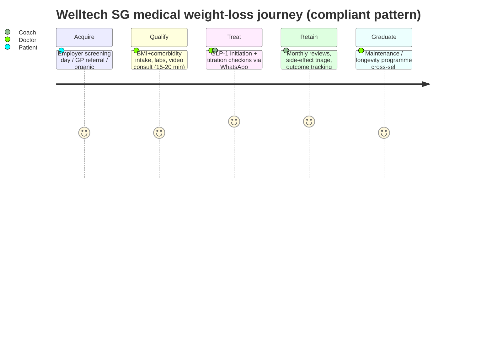
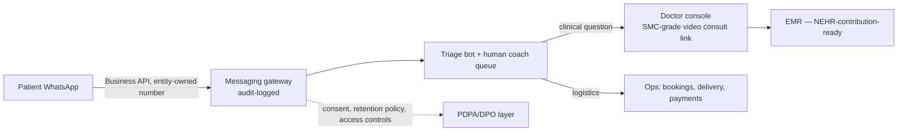

# Singapore Digital-Health Market Intelligence — Master Sizing, Regulation & Entry Strategy

**Last updated: July 2026**

> Singapore is a 6.1-million-person, very-high-income city-state (GDP/capita ~USD 99,000) that is simultaneously the wealthiest, most digitally penetrated, most tightly regulated and most competitively saturated of Welltech's three target markets. Obesity prevalence is lower than Malaysia's (12.7% BMI≥30 in 2023–24, but rising fast from 10.5% in 2019–20) while diabetes carries a 1-in-3 lifetime risk; the population is ageing faster than almost anywhere in Asia (18.8% of residents are 65+). The state runs a high-performing hybrid system (3M financing + Healthier SG preventive reform) that crowds out low-end private telehealth, yet private-pay willingness at the premium end is exceptional: GLP-1 programs retail at S$400–800+/month, executive screening at S$600–12,900, and full longevity programmes at S$15,000+. Third-party telehealth market estimates diverge wildly (USD ~0.3bn to >4bn for 2023–24 depending on scope) and are reconciled below. Critically for Welltech, MOH has run the region's most aggressive enforcement campaign against "pill-mill" weight-loss telehealth — suspending MaNaDr Clinic's teleconsultation service in August 2024 and moving to revoke its licence, and (jointly with HSA) blocking GLP-1 advertising to the public — making regulatory-grade clinical governance the price of admission and, properly executed, a moat. This document covers macro context, system structure, regulation, competitive landscape, weight-loss/GLP-1 and longevity verticals, consumer behaviour, WhatsApp workflows, TAM→SAM→SOM, and entry sequencing. Where sources conflict, ranges are shown.

**Sibling documents:** [malaysia-market-intelligence.md](malaysia-market-intelligence.md) · [malaysia-regulations.md](malaysia-regulations.md) · [malaysia-telehealth.md](malaysia-telehealth.md) · [malaysia-weight-loss-market.md](malaysia-weight-loss-market.md) · [malaysia-longevity-market.md](malaysia-longevity-market.md) · [malaysia-whatsapp-healthcare.md](malaysia-whatsapp-healthcare.md) · singapore-regulations.md *(forthcoming split if this file exceeds ~1,500 lines)* · [singapore-competitor-landscape.md](../20-competitor-dossiers/singapore-competitor-landscape.md) *(forthcoming)* · [hong-kong-market-intelligence.md](hong-kong-market-intelligence.md)

---

**Singapore at a glance (Welltech lens):**

| Dimension | Headline | Detail section |
|---|---|---|
| Population / wealth | 6.11m (4.20m residents + 1.91m non-residents); ~USD 99k GDP/capita; 332k millionaires | §1 |
| Metabolic burden | Obesity 12.7% and rising; diabetes lifetime risk 1-in-3; War on Diabetes since 2016 | §2 |
| System | 3 public clusters + Healthier SG (~1m enrolled yr-1); >2,000 private GP clinics; 71% IP-insured; OOP only ~25% | §3 |
| Regulation | HCSA telemedicine licensing (2023) + CGO; POM ads banned & enforced; MaNaDr shutdown 2024; NEHR mandate incoming | §4 |
| Digital-health market | Reconciled Welltech-relevant scope USD 0.4–0.7bn (2024–25), low-teens growth; insurer rails locked by DA/WhiteCoat | §5 |
| GLP-1 economics | Wegovy/Mounjaro registered for weight; street price S$350–1,000+/mo; programmes from S$430/mo | §6 |
| Longevity | Asia's hub: Chi (S$15k+), NUS Academy, 55.5% consumer intent; whitespace at S$2–6k tier | §7 |
| Channels | WhatsApp ~84% / Telegram ~38%; screening-culture conversion gap | §8–9 |
| Welltech maths | Combined yr-3 SOM ~S$10–26m ARR; employer metabolic beachhead | §10–11 |

---

## 1. Macro & demographic context

### 1.1 Population and structure

Singapore's total population reached **6.11 million as at end-June 2025** — 4.20 million residents (citizens + PRs) and **1.91 million non-residents** (work-pass holders, dependants, students).[^1] The non-resident third of the population is a structural feature no other Welltech market shares at this scale: a large, mobile, largely privately insured or cash-paying segment with no access to citizen subsidies.

| Indicator | Value | Year | Source |
|---|---|---|---|
| Total population | 6.11 million | 2025 | NPTD/SingStat[^1] |
| Residents (citizens + PRs) | 4.20 million | 2025 | NPTD/SingStat[^1] |
| Non-residents | 1.91 million (~31%) | 2025 | NPTD/SingStat[^1] |
| Median age (residents) | 43.2 years | 2025 | SingStat[^1] |
| Residents aged 65+ | 18.8% (~790,000) | 2025 | SingStat[^2] |
| Citizens aged 65+ | 20.7% (23.9% projected by 2030) | 2025 | NPTD[^1] |
| GDP per capita | ~SGD 129,200 / ~USD 99,400 | 2025 | CEIC / Statista[^3] |
| Household income per capita | ~USD 44,000 p.a. | 2024 | CEIC[^3] |
| Internet penetration | 98.4% (5.78m users) | end-2025 | DataReportal[^4] |

### 1.2 Ageing — among the fastest transitions in Asia

The 65+ resident share rose from 11.8% (2015) to **18.8% (2025)**; by 2030 roughly **1 in 4 citizens will be 65+**.[^1][^2] Singapore's ageing pace is routinely compared to Japan's, but at far higher income. Median resident age (43.2) is a full 12 years older than Malaysia's (31.3). The policy response — Healthier SG, Age Well SG, MediSave/MediShield recalibration — is explicitly preventive, which legitimises and part-subsidises exactly the preventive/longevity category Welltech sells.

### 1.3 Income, wealth and the expat/HNW segment

- **332,491 US-dollar millionaires** resident in Singapore; projections suggest >13% of the population will be millionaires by 2030.[^5]
- Net inflow of **~3,500 HNWIs in 2024** (up from 3,200 in 2023), driven by relocations from mainland China, Hong Kong, India and SE Asia.[^5][^6]
- **Single-family offices crossed 2,000 in 2025**, the densest concentration in Asia, with reported combined AUM of ~$66.8bn (43% YoY growth).[^6]
- The 1.91m non-resident population includes several hundred thousand professional expatriates whose healthcare is employer-insured or cash-paid at private clinics charging S$80–300+ per GP consult (e.g. Osler Health).[^7]

### 1.4 Demand segmentation (analyst framework)

Unlike Malaysia, where demand concentrates geographically (Klang Valley), Singapore demand segments **by payer status and wealth tier** within one dense city:

| Segment | Size (est.) | Payer profile | Welltech relevance |
|---|---|---|---|
| Citizens/PRs, mass (HDB heartland) | ~3.0–3.2m adults | Subsidy + CHAS + MediSave-anchored; price-sensitive | Low — served by polyclinics/Healthier SG[^17][^30] |
| Citizens/PRs, mass-affluent (condo/landed) | ~700k–900k adults *(analyst estimate from income quintiles)* | IP-insured (71% IP coverage overall), OOP-tolerant for prevention[^23] | **Core** — weight loss, screening-to-programme conversion |
| Professional expatriates | several hundred thousand of the 1.91m non-residents[^1] | Employer IPMI or cash; zero subsidy access | **Core** — concierge + weight loss + longevity |
| HNW / family-office principals | 332k millionaires; 2,000+ family offices[^5][^6] | Cash-indifferent; buys outcomes and discretion | Concierge/longevity apex tier |
| Migrant workers (work-permit) | large share of non-residents | Employer-mandated basic insurance | Out of scope commercially; CSR/optics only |

**Implication for Welltech:** Singapore is the ARPU market, not the volume market. The addressable premium segment (top-quintile residents + expats + HNW/family-office principals) is perhaps 600k–900k adults *(analyst estimate)* but supports price points 3–6× Malaysia's for identical clinical services. Concierge, longevity and medically supervised weight loss monetise here at levels that fund regional operations.

---

## 2. Disease burden — smaller base, steeper trend, richer payer

### 2.1 Obesity and overweight

The National Population Health Survey (NPHS) 2024 — MOH/HPB's flagship surveillance — found **obesity (BMI ≥30) rose significantly from 10.5% (2019–20) to 12.7% (2023–24)**, the headline concern of the survey.[^8][^9] Obesity clusters in the 30–39 age band (14.9% of obese adults), i.e. prime working, paying age.[^8] Under the lower Asian BMI risk cut-offs used clinically in Singapore (high-risk ≥27.5), the treatable population is substantially larger than the 12.7% headline *(inference; NPHS reports crude BMI≥30 — verify Asian-cutoff prevalence in the full NPHS 2024 report)*.[^9][^10]

| Metric | Value | Trend | Source |
|---|---|---|---|
| Obesity (BMI ≥30), residents 18–74 | **12.7%** (2023–24) | ↑ from 10.5% (2019–20) | NPHS 2024[^8][^9] |
| Peak obesity age band | 30–39 (14.9%) | — | NPHS 2024[^8] |
| MOH framing | "Rising obesity is a concern" (headline) | — | MOH newsroom[^8] |

Compared with Malaysia (54.4% overweight+obese, WHO cutoff), Singapore's prevalence is roughly a quarter as high — but the **paying propensity per affected person is far higher**, and the trend is adverse.

### 2.2 Diabetes — the "War on Diabetes" market

- MOH declared the **War on Diabetes in April 2016** — a whole-of-nation programme spanning screening, food reformulation (Nutri-Grade), and primary-care redesign.[^11][^12]
- **>400,000 Singaporeans live with diabetes**; the projection long used by MOH is **~1 million by 2050**; **lifetime risk is 1 in 3**.[^12][^13]
- An estimated **~430,000 residents have pre-diabetes** *(secondary sources citing MOH figures; verify against NPHS 2024 clinical tables)*.[^13]
- Chronic-disease screening participation was 62.6% (2023), broadly unchanged in 2024 — high by regional standards but leaving a third of adults unscreened.[^14]

The War on Diabetes toolkit is instructive for how Singapore regulates *demand-side* health behaviour: Nutri-Grade beverage labelling and advertising bans, sugar-reduction reformulation deals with industry, subsidised screening (Screen for Life), and polyclinic-anchored chronic care (CDMP) — a policy architecture that rewards clinically credible private programmes and punishes fad positioning.[^11][^12]

### 2.3 Mental health and other NCDs

NPHS 2024 flags mental-health challenges as most prevalent among ages 18–29, alongside the obesity rise; hypertension and hyperlipidaemia remain the highest-prevalence clinical NCDs in the examination component.[^8][^9] *(Exact 2023–24 hypertension/lipid prevalences require the full NPHS 2024 PDF — flagged for live verification.)*

Screening behaviour is comparatively strong and rising: chronic-disease screening participation 60.3% (2022) → 62.6% (2023), broadly held in 2024; cervical-cancer screening 43.1% → 45.4% and colorectal 38.1% → 41.7% over the same period.[^14] The unscreened remainder skews lower-SES — diabetes-screening attendance is 38.8% in low-SES vs 59.6% in high-SES groups — which conveniently means Welltech's paying segments are precisely the ones already screening (and therefore already generating actionable abnormal results).[^108]

### 2.4 Cost pressure as the system's forcing function

Singapore's disease burden translates into payer pain differently from Malaysia's: not through OOP catastrophe (OOP is only ~25% of spend[^24]) but through **claims inflation** — insurer-reported medical trend of 12–15.5% (2025) and a projected 16.9% (2026), against ~3% healthcare CPI — and through **fiscal escalation** (MOH budget +16.3% YoY to S$20.86bn in FY2025).[^26][^27][^28][^25] Obesity and diabetes sit squarely inside the claims-growth drivers insurers name (rising incidence, earlier detection, long-term management of cancer/diabetes/obesity).[^27]

**Implication for Welltech:** Singapore's metabolic-disease engine is smaller but better-diagnosed, better-financed and government-legitimised ("War on Diabetes", Healthier SG). Positioning weight-loss and cardiometabolic prevention as clinically serious medicine — never as cosmetic quick fixes — aligns with both regulator posture and consumer sophistication, and is mandatory after the 2024–25 enforcement wave (§4.6).

---

## 3. Healthcare system structure

### 3.1 Public system: three clusters, polyclinics, Healthier SG

Public care is delivered through **three integrated regional clusters** (since the 2017 re-organisation): **NHG Health** (central/north), **SingHealth** (east), **NUHS** (west), each pairing acute hospitals with a polyclinic network — NHG ~10 polyclinics, SingHealth 8, plus National University Polyclinics (≈26 polyclinics nationally *(approximate; verify current count)*).[^15][^16]

**Healthier SG** (White Paper 2022; launched July 2023) is the defining reform: every resident 40+ is invited to enrol with one family doctor (GP or polyclinic) who receives **annual capitation-style service fees** tiered by risk, with fully subsidised health plans, nationally recommended screenings and vaccinations.[^17][^18] **~960,000–1,000,000 residents (~40% of eligible) enrolled in year one** (to Aug 2024); ~60% of enrolees are 60+.[^19][^20]

### 3.2 Financing: 3M framework + subsidies

| Layer | Mechanism | Notes |
|---|---|---|
| Government subsidy | Up to ~80% at public acute wards; CHAS at private GPs | Tiered by ward class / means |
| **MediSave** | Mandatory medical savings (CPF) | Usable for outpatient chronics (CDMP), screening, some scans (e.g. S$600 toward MRI at accredited providers)[^21][^22] |
| **MediShield Life** | Universal catastrophic insurance | Sized to B2/C-class bills |
| **MediFund** | Endowment safety net | Last resort |
| Private **Integrated Shield Plans (IPs)** | ~**71% of residents (~3 million)** hold IPs; riders cover deductible/co-pay | Major private-hospital demand driver[^23] |

Out-of-pocket spending has fallen from ~48% of total health expenditure (2000) to **~25% (2023)** — less than a third of Malaysia's 76% private-OOP share, meaning Singapore consumers are more insurance/subsidy-anchored, but also more accustomed to formal, receipted, claimable healthcare.[^24]

**MOH's FY2025 budget is S$20.86bn (+16.3% YoY)**, after S$17.94bn (revised) in FY2024; national health spending is projected to approach ~5.9% of GDP by 2030.[^25][^24]

| MOH expenditure | Value | Source |
|---|---|---|
| FY2023 (actual) | S$17.26bn | Budget 2025 papers[^25] |
| FY2024 (revised) | S$17.94bn (+3.9%) | Budget 2025 papers[^25] |
| FY2025 (estimate) | **S$20.86bn (+16.3%)** — 90% operating / 10% development | Budget 2025 papers[^25] |
| Health spend as % GDP | ~2.9% (FY2021, govt); ~5.9% total projected by 2030 | World Bank / MOH projections[^24][^25] |

### 3.3 Insurance stress and the April 2026 rider reform

Insurer-reported medical trend is running hot: **12% (2025 projection, Mercer Marsh)**, **15.5% (2025, WTW)** and **16.9% projected for 2026** — figures MOH publicly disputes as reflecting claims growth rather than price inflation (healthcare CPI ~3%).[^26][^27][^28] In response, MOH mandated that **IP riders sold from 1 April 2026 can no longer fully cover the deductible**, and the annual co-payment cap doubles to S$6,000 — deliberately re-introducing patient cost-sharing at private hospitals.[^23][^29]

Supporting detail on the reform's mechanics and market reaction:

- New-style riders (max coverage) carry premiums ~35–40% below legacy riders — MOH's carrot for migration; meanwhile most IP insurers raised base-plan and legacy-rider premiums in 2025 citing claims growth.[^23][^29]
- The reform's second-order effect for Welltech: as private *inpatient* care gets more cost-shared, insured consumers become more receptive to **preventive, package-priced outpatient programmes** that keep them out of hospitals — the exact value proposition of metabolic and longevity care. Employers, facing the same trend in group plans, respond identically.[^26][^27]
- Group (employer) insurance is the other half of the private-payer picture: employer medical benefits are near-universal for PMETs, and brokers/consultants (Mercer Marsh, WTW, Howden) act as gatekeepers to wellness-programme procurement.[^26][^27]

### 3.4 Private provision

| Segment | Facts | Source |
|---|---|---|
| Private GP clinics | **>2,000** clinics (MOH; other counts ~2,500 in 2023), >1,300 CHAS-participating | MOH / Expatica[^30][^31] |
| Typical private GP consult | ~S$25–60 (heartland) to S$80–300+ (expat/CBD, e.g. Osler Health) | [^7][^32] |
| IHH Healthcare (Parkway) | Mount Elizabeth, Mount Elizabeth Novena, Gleneagles, Parkway East — ~1,000 licensed beds, 50+ medical centres; Singapore's largest private operator | IHH[^33] |
| Raffles Medical Group | Raffles Hospital + islandwide clinic network; ~US$585m TTM revenue | PitchBook/Prospeo[^34] |
| Others | Thomson Medical (women/children), Farrer Park Hospital *(analyst note — not directly sourced in this pass)*, Fullerton Health (corporate networks), Minmed (screening/GP chain) | [^35][^36] |
| Corporate/employer channel | Corporate wellness market projected ~US$646m by 2030; HPB grants cover 30–90% of programme costs | [^37] |

### 3.5 Division of labour — where a private digital entrant can and cannot play

| Care layer | Dominant provider | Price anchor | Private-digital opening |
|---|---|---|---|
| Acute episodic GP | Polyclinics, CHAS GPs, telehealth apps | S$10–30 (subsidised/tele)[^32] | None — commoditised |
| Preventive primary care | Healthier SG enrolled GPs (fully subsidised plans/screenings)[^17][^18] | S$0 to patient | None head-on; downstream conversion only |
| Chronic disease (T2DM, HTN) | CDMP GPs + polyclinics, MediSave-payable | Subsidised | Adjacent — premium adherence/coaching |
| **Medical weight loss (non-T2DM)** | Private only; **not state-subsidised** | S$400–1,200/mo[^91][^93] | **Primary whitespace** |
| **Longevity/executive prevention** | Private only | S$585–15,000+[^103][^86] | **Primary whitespace** |
| Concierge/expat care | Premium GP groups | S$80–300+/visit[^7] | Wrapper play |
| Hospital/specialist | IHH, Raffles, public SOCs | IP-insured | Referral partnerships |

**Implication for Welltech:** Healthier SG has nationalised cheap preventive primary care, and CHAS/polyclinics anchor low-end prices — competing on discount telehealth GP visits is a dead end. The openings are (a) **premium cash-pay verticals** the state does not subsidise (medical weight loss, longevity, concierge), (b) the **employer/insurer channel**, where 12–17% medical trend creates urgent demand for claims-reducing metabolic programmes, and (c) the **expat/non-resident third** of the population outside the subsidy net entirely.

---

## 4. Regulatory environment — the strictest, and the most enforced, in the region

### 4.1 Healthcare Services Act (HCSA) and telemedicine licensing

The HCSA 2020 replaced the PHMCA in three phases: Phase 1 (Jan 2022, clinics/hospitals), **Phase 2 (26 June 2023) — which for the first time licensed outpatient medical services delivered via teleconsultation and from non-clinic premises** — and Phase 3 (2024+, remaining services).[^38][^39][^40] Key features:

- **Who needs an Outpatient Medical Service (OMS) licence:** clinics offering teleconsults, telemedicine platform companies employing/engaging doctors, and individual doctors offering teleconsultation in their own capacity.[^38][^40]
- **Clinical Governance Officer (CGO):** every licensee must appoint a CGO approved by MOH's Director-General to own clinical quality.[^39]
- Services-based (not premises-based) licensing; MC issuance, prescribing and advertising conditions attach to the licence.
- The **LEAP regulatory sandbox** (2018–Feb 2021) preceded licensing: 11 telemedicine providers, >40,000 sandboxed teleconsultations, no major safety events — the co-created governance rules became the licensing template.[^41][^42] An interim **voluntary listing of direct telemedicine providers** (2021) attracted ~500–600 declarations before licensing took effect.[^43]

### 4.2 Professional standards: SMC ECEG and the 2024 joint circular

The SMC Ethical Code and Ethical Guidelines (2016) govern doctors: telemedicine must deliver **"the same quality and standard of care as in-person medical care"** (A6), prescriptions and MCs only on proper clinical grounds, informed consent documented, and doctors must recognise the modality's limits.[^44] In November 2024 MOH and HSA issued **Joint Circular 87/2024 on Regulations and Professional Standards for Telemedicine Services and Advertisements** — a direct response to the MaNaDr affair and GLP-1 tele-marketing — restating consult standards and advertising prohibitions for telemedicine licensees.[^45] MOH has also publicly stated that **doctors and patients must be able to see and hear each other during teleconsults** while studying sector lapses.[^46]

### 4.3 Medicines: HSA classification, e-prescribing, delivery

- Therapeutic products are classed **POM (prescription-only) / P (pharmacy-only) / GSL (general sale)** under the Health Products Act framework and Poisons Act schedules.[^47][^48]
- All GLP-1 receptor agonists (semaglutide, liraglutide, tirzepatide) are **POM** — teleconsult prescribing is legal only within an HCSA-licensed service meeting SMC standards; medication delivery is a normalised part of licensed telehealth (typically same-/next-day).[^49][^32]
- The **Health Information Bill** (consulted Dec 2023–Jan 2024; introduced in Parliament 5 Nov 2025) will make **contribution of key records to the NEHR mandatory for all licensed providers, including telemedicine and retail pharmacy** — a compliance build Welltech must scope from day one.[^50][^51]

### 4.4 Advertising: POM promotion to the public is prohibited

- Under the Health Products (Advertisement of Specified Health Products) Regulations 2016 (Reg 7), **advertising prescription-only medicines to the general public is prohibited**; POM advertising is permitted only to healthcare professionals.[^52][^53]
- The **Healthcare Services (Advertisement) Regulations 2021** additionally constrain what licensed services may claim (factual, not laudatory; no inducements).[^54]
- Practical consequence: **you cannot run "Wegovy/Ozempic" consumer ads in Singapore.** MOH/HSA have actively **blocked weight-loss drug advertisements** — including workaround creatives ("weight-loss pen", masked product imagery, "lose 20% of body weight" claims) on social and telehealth platforms.[^55]

**Marketing rulebook (operational translation):**

| Permitted | Prohibited / high-risk |
|---|---|
| Advertise the licensed clinic/service and its scope ("medical weight-management programme, doctor-supervised") in factual terms[^54] | Naming any POM (Wegovy, Ozempic, Mounjaro, Saxenda) in public-facing media[^52] |
| Physician-authored disease education (obesity as chronic disease), without product linkage | Euphemistic product references — "weight-loss pen", syringe imagery, masked pack shots[^55] |
| Publishing programme outcome statistics with substantiation | Quantified promises ("lose 20% of body weight", "drop kilos fast") without robust evidence[^55] |
| POM detailing to healthcare professionals (gated channels)[^52] | Testimonials/inducements framed as laudatory claims for a licensed service[^54] |
| Search/SEO on condition terms; PR; referral programmes structured within HCS(A) rules | Influencer/affiliate content that names drugs or implies guaranteed access |
| Employer-channel B2B materials (proposals, not public ads) | "Skip the doctor" / instant-prescription framing (invites §4.6 treatment) |

### 4.5 Aesthetic practice and PDPA

- Aesthetic procedures are policed via SMC's **Aesthetic Practice Oversight Committee (APOC)** guidelines (List A/B evidence tiers); fat-reduction/weight-loss injections and unlisted procedures must be cleared with APOC, and MOH audits aesthetic clinics.[^56][^57]
- The **PDPA** applies with sector-specific PDPC **Advisory Guidelines for the Healthcare Sector** (issued 2014, revised Sep 2023): consent, purpose limitation, retention and breach-notification duties for patient data — directly relevant to WhatsApp-based care (§8).[^58]

### 4.6 Enforcement history — the MaNaDr case and the GLP-1 clampdown (CRITICAL)

This is the single most important regulatory fact pattern for Welltech's category:

| Date | Action | Detail |
|---|---|---|
| 16 Aug 2024 | **MOH ordered MaNaDr Clinic to stop all teleconsultation services** | Sampled month: **>100,000 teleconsultations lasting ≤1 minute** (one lasting 1 second); one patient received **19 MCs in a month**; >1,500 patients got MCs ≥5 times in the month[^59][^60] |
| 24 Oct 2024 | **Notice of intended licence revocation** issued to MaNaDr Clinic Pte Ltd; doctors referred toward SMC disciplinary processes | MOH called practices "clinically and ethically inappropriate"[^61][^62] |
| 22 Nov 2024 | **MOH–HSA Joint Circular 87/2024** on telemedicine standards **and advertisements** | Sector-wide restatement; telemedicine + POM-advertising rules read together[^45] |
| 2024–2025 | **MOH/HSA blocked weight-loss (GLP-1) advertisements** across media and telehealth platforms | Targeted Saxenda/Ozempic promos, euphemistic "weight-loss pen" creatives, unsubstantiated rapid-loss claims[^55] |
| Apr 2025 | MaNaDr imposed a 1-minute minimum consult before MC issuance (remediation) | Reported by Mothership[^63] |
| 2025–2026 | Continued CNA/press scrutiny of easy online GLP-1 access and unregulated sellers; HSA takedowns of illegal online health-product listings | [^49][^64] |

MOH's message is unambiguous: telemedicine that functions as a **dispensing funnel** (short consults, MC mills, drug-first weight-loss flows) will be shut down and prosecuted through licensing and SMC channels.

### 4.7 Cross-border telehealth

Overseas-based providers are **not licensed under the HCSA**; MOH warns patients it cannot act on lapses by foreign telehealth services.[^65] A Singapore-licensed doctor teleconsulting an overseas (e.g. Malaysian) patient is not squarely prohibited, but MCs carry Singapore context only and **medication delivery is limited to Singapore addresses**; conversely a Malaysian doctor treating patients "in" Singapore would be practising unlicensed.[^66][^65] For the JB–Singapore corridor, the compliant pattern is separate licensed entities per jurisdiction with a shared data layer *(inference; mirror of the analysis in [malaysia-regulations.md](malaysia-regulations.md))*.

Corridor mechanics worth engineering for:

| Flow | Volume driver | Compliant Welltech pattern |
|---|---|---|
| SG residents seeking cheaper care in JB (dental, screening, pharmacy) | 4–8× SG price differentials | MY entity serves them in Malaysia; SG entity handles SG follow-up; unified record with cross-border PDPA/PDPA-MY consent |
| MY citizens working in SG (several hundred thousand commuters/residents) | SG income, MY family ties | SG-licensed care while in SG; hand-off protocol to MY entity for home leave |
| Expat/HNW patients traveling regionally | Continuity expectations | Teleconsult from SG doctor permitted; meds dispensed only on return / via local partner[^65][^66] |

### 4.8 Regulatory timeline — telemedicine in Singapore, 2018–2026

| Year | Milestone |
|---|---|
| 2018 | LEAP telemedicine sandbox opens (announced at Committee of Supply)[^41] |
| Feb 2021 | Sandbox closes: 11 providers, >40,000 consults, no major safety events[^42] |
| Mar 2021 | Voluntary listing of direct telemedicine providers (~500–600 declared)[^43] |
| Jan 2022 | HCSA Phase 1 — clinics/hospitals re-licensed under services-based regime[^39] |
| **26 Jun 2023** | **HCSA Phase 2 — teleconsultation becomes a licensable Outpatient Medical Service**; CGO regime applies[^38][^39] |
| Aug–Oct 2024 | **MaNaDr suspension → intended licence revocation**; doctors referred to SMC[^59][^61] |
| 22 Nov 2024 | **MOH–HSA Joint Circular 87/2024** (telemedicine standards + advertisements)[^45] |
| 2024–25 | MOH/HSA block GLP-1/weight-loss ads incl. euphemistic creatives[^55] |
| 5 Nov 2025 | Health Information Bill introduced — mandatory NEHR contribution incoming[^50][^51] |
| 1 Apr 2026 | IP rider reform (deductible/co-pay changes) reshapes private-pay flows[^23][^29] |

### 4.9 Welltech Singapore licensing & compliance checklist

| Item | Requirement | Owner/lead time |
|---|---|---|
| HCSA OMS licence (incl. teleconsultation mode) | Apply via HCSA portal; premises + virtual service scope | 3–6 months *(analyst estimate)*[^38][^39] |
| Clinical Governance Officer | MOH DG approval of named CGO before appointment | Recruit senior SG-registered doctor early[^39] |
| SMC-compliant consult protocol | Video (see-and-hear), adequate duration, documented consent, MC discipline | Medical director[^44][^46] |
| Advertising review | No POM names/claims to public; HCS(A) Regs-compliant clinic/programme marketing | Legal + marketing[^52][^54][^55] |
| PDPA/messaging | WhatsApp Business API on entity-owned number; consent, retention, audit logs; DP policy documented | DPO[^58][^109] |
| NEHR/HIA readiness | EMR capable of NEHR contribution (allergies, diagnoses, meds, labs, imaging) | CTO — architect now[^50][^51] |
| APOC check | Any aesthetic-adjacent service pre-cleared | Medical director[^56] |
| GLP-1 supply | Distributor accounts (e.g. DKSH for Lilly); cold chain; pharmacist oversight | Ops[^94] |

**Implication for Welltech:** Singapore raises the compliance bar from "advisable" to "existential": HCSA OMS licence + approved CGO, SMC-grade consult standards (video, adequate duration, documented consent), zero public POM advertising (market the *programme and clinic*, never the drug), APOC awareness for any aesthetic-adjacent service, PDPA-hardened messaging stack, NEHR integration readiness. The MaNaDr vacuum is an opportunity: post-2024, employers, insurers and consumers actively discriminate toward governance-credible providers. Welltech should weaponise compliance as brand.

---

## 5. Digital-health market: size, players, money

### 5.1 Market-size estimates — reconciliation required

Published numbers diverge by more than 10× because scopes differ (teleconsult fees only vs all remote/digital care vs devices/IT). Consumer-facing teleconsult prices are tightly banded at **S$10–27 standard / ~S$49 after-hours** (DigitalHealth.sg S$15; ReallySick from S$10–25; Raffles Connect S$22; Parkway Shenton S$22; SATA S$15; noah S$20.10; Doctor Anywhere S$27.25/S$49.05) — comparable to in-person GP fees, which caps consult-revenue upside and pushes economics toward medication, programmes and subscriptions.[^32][^81][^74]

| Source | Metric | Base | Forecast | CAGR |
|---|---|---|---|---|
| Grand View Research (Horizon) | "Telemedicine" Singapore | **USD 4,085m (2023)** | USD 14,342m (2030) | 18.5–19.6%[^67] |
| Grand View Research (Horizon) | "Telehealth" Singapore | USD 870m (2023) | USD 4,514m (2030) | 26.5%[^68] |
| Grand View Research (Horizon) | Tele-consulting services | USD 991m (2024) | USD 1,934m (2030) | 9.9%[^69] |
| Grand View Research (Horizon) | Acute-care telemedicine | USD 321m (2024) | USD 774m (2030) | 15.8%[^70] |
| Statista Market Insights | Digital health (consumer) | **USD 671m (2024)** | USD 1,274m (2029) | 13.7%[^71] |
| The Report Cubes | Digital health | USD 1.55bn (2025) | USD 3.96bn (2034) | 11.0%[^72] |

**Reconciliation (analyst view):** GVR's USD 4.1bn "telemedicine" figure cannot represent consumer teleconsultation spend — it exceeds plausible total private outpatient revenue and likely counts enabling IT, remote monitoring, hospital digital infrastructure and B2B contracts. Triangulating bottom-up (≈2–4m teleconsults/yr × S$20–30 consult + attached pharmacy ≈ **SGD 150–400m** consumer telehealth) against Statista's USD 671m digital-health envelope, a defensible working figure for Welltech-relevant digital care (teleconsults + online pharmacy + digital chronic programmes) is **USD 0.4–0.7bn (2024–25), growing low-to-mid teens %** — smaller than the headline numbers but at 3–6× Malaysian price points. *(analyst estimate; assumptions stated)*

### 5.2 Player landscape (summary — full dossiers to follow in [singapore-competitor-landscape.md](../20-competitor-dossiers/singapore-competitor-landscape.md))

| Player | Model | Scale / funding signals | Relevance to Welltech |
|---|---|---|---|
| **Doctor Anywhere** | Omnichannel telehealth + clinics, 6 SEA markets | Series C S$88m (US$65.7m, 2021; Asia Partners, Novo Holdings, IHH, EDBI…); >S$140m raised; 1.5m+ users; ~2,800 doctors; teleconsult S$27.25 std / S$49.05 after-hours; GLP-1 requires in-person first consult | Category leader; insurer/employer default[^73][^74][^49] |
| **WhiteCoat** | Insurer-integrated telehealth | S$10.8m Series A (record at the time); **exclusive AIA Singapore partnership**; acquiring **Good Doctor Indonesia** (2024) → claims region's largest insurer-linked digital-health group (130+ insurers, 7,500 corporates, 6.8m insured lives); Raffles Family Office-led round; MDI, SoftBank Vision Fund entering | Owns the insurer rail Welltech would otherwise court[^75][^76][^77] |
| **Speedoc** | Home care + virtual wards (H-Ward) | US$28m pre-Series B (2022, Bertelsmann, Shinhan, Mars Growth, Vertex); MIC@Home pilots with NUHS/SGH/KTPH | Public-system-integrated; not a weight-loss/longevity threat[^78] |
| **MaNaDr (Mobile-health Network Solutions)** | Telehealth platform + clinic | Teleconsult service suspended Aug 2024; licence-revocation notice Oct 2024; doctors referred to SMC | Cautionary tale; vacated demand[^59][^61] |
| **Ora (Modules / andSons / OVA)** | Vertically integrated DTC telehealth (derm, men's, women's) | US$10m Series A (2023, TNB Aura + Antler; >US$17m total); 250k+ consults; >70% subscription revenue | Closest DTC analogue; weight loss via andSons |[^79][^80] |
| **noah / Zoey (Hyphens-linked DTC)** | Men's (noah) & women's digital clinics | Teleconsult S$20.10; next-day discreet delivery; expanded to Hong Kong; MOH-listed | DTC playbook incl. weight management[^81][^82] |
| **Siena Health** | Women's 100% online clinic | Video consults; free discreet delivery; weight loss, contraception, skin, sleep | DTC weight-loss competitor[^83] |
| **NOVI Health** | Hybrid clinic + app: metabolic health, weight loss, longevity assessment | Optimum Plus from **S$430/month or S$1,289/3-months** incl. specialist + coach; claims 15–20% average weight loss over 72 weeks; NOVI Assessment longevity screening with MCED | The closest strategic comparable to Welltech's SG thesis[^84][^85] |
| **Minmed** | GP + screening chain, Healthier SG active | Screening at Paragon/Jewel/Jurong/Woodlands; corporate & home screening | Screening logistics partner or rival[^36] |
| **Fullerton Health / MyDoc** | Corporate healthcare networks + telemedicine | Executive screening + primary-care plans; 9 markets | Gatekeeper to employer channel[^35] |
| **Osler Health, IMC, Raffles** | Expat/premium bricks-and-mortar GP | Consults S$80–300+ | Feeder/partner pool for concierge tier[^7] |
| **Chi Longevity, Regenosis, Artisan, Lifespan Asia** | Longevity clinics (see §7) | Chi programmes ~S$15k+ | Premium longevity incumbents[^86][^87] |

### 5.3 Funding & consolidation timeline (selected)

| Year | Event | Amount / detail |
|---|---|---|
| 2019 | WhiteCoat Series A — then-largest SG telemedicine round | S$10.8m[^75] |
| Aug 2021 | Doctor Anywhere Series C | S$88m (US$65.7m); >S$140m cumulative[^73] |
| Nov 2022 | Speedoc pre-Series B | US$28m[^78] |
| May 2023 | Ora Series A | US$10m (>US$17m cumulative)[^79] |
| 2024 | MaNaDr parent (Mobile-health Network Solutions) — enforcement crisis post-listing | Teleconsult service suspended; revocation notice[^59][^61] |
| Oct 2024 | **WhiteCoat acquires Good Doctor Indonesia** + new round (Raffles Family Office; MDI, SoftBank Vision Fund entering) | 130+ insurers, 7,500 corporates, 6.8m insured lives claimed[^76][^77] |

Pattern: capital has rotated from consumer-app land-grabs (2019–2021) to **insurer-rail consolidation and clinical depth** (2023–), while enforcement culled the governance-weak tail. No SG player yet owns the metabolic/longevity outcome layer at scale — NOVI is closest but clinic-bound.[^84]

### 5.4 Channels and public digital infrastructure

Insurers (AIA→WhiteCoat exclusive; Cigna/Singlife/Great Eastern/HSBC Life/Allianz/Tokio Marine/Prudential→Doctor Anywhere) have already locked generic telehealth rails.[^76][^73] Public infrastructure absorbs routine engagement: **HealthHub** is becoming the single national front door (the three cluster apps fold into it, phased out from Feb 2027), running on Synapxe's NEHR/National Billing System spine — SingPass-gated and records-complete in ways no private app can match.[^88][^89] Private entrants therefore should not build "records + booking" super-apps; the state already owns that layer. Build what HealthHub will never do: paid programme journeys, human coaching, and WhatsApp-native service.

**Implication for Welltech:** The generic telehealth-GP war is over — DA and WhiteCoat won the insurer rails, the state won routine primary care. Whitespace sits in **outcome-owned vertical programmes** (medical weight loss with real titration + coaching; longevity with physician-grade diagnostics), **WhatsApp-native concierge service** (incumbents are app-first; app fatigue is real), and **employer metabolic-health contracts** priced against 12–17% medical trend.

---

## 6. Weight-loss & GLP-1 market

### 6.1 Demand fundamentals

~430,000 obese adults (BMI≥30, 12.7% of residents 18–74) plus a larger overweight-with-comorbidity pool; 1-in-3 lifetime diabetes risk creates a metabolic (not cosmetic) framing; obesity is rising fastest among 30–39-year-olds with peak earning power.[^8][^12]

### 6.2 GLP-1 registration status in Singapore (as of July 2026)

| Molecule / brand | HSA status | Notes |
|---|---|---|
| Liraglutide 3.0 (Saxenda) | Registered for weight management (longest-standing) | Widely stocked incl. aesthetic clinics[^90] |
| Semaglutide 1.0 (Ozempic) | Registered for T2DM | Off-label weight use common; supply constrained 2023–24, stabilised since[^49] |
| Semaglutide 2.4 (Wegovy) | **HSA-approved 2023** for chronic weight management | Commercial launch dates reported inconsistently (mid-2024 vs mid-2025 across sources) — **verify launch timing with Novo Nordisk SG**[^91] |
| Oral semaglutide (Rybelsus / oral Wegovy) | Registered (T2DM); oral weight-management formulation emerging 2025–26 | [^92] |
| Tirzepatide (Mounjaro / KwikPen) | **Approved Mar 2023 (T2DM)**; **weight-management indication added June 2025**; KwikPen registered via DKSH | "Zepbound" branding not used in SG — sold as Mounjaro[^93][^94] |

### 6.3 Street pricing across channels (advertised, SGD, 2025–26)

| Channel | Offer | Advertised price |
|---|---|---|
| Telehealth/DTC (noah, Siena, Regimen, Trimly etc.) | GLP-1 programmes, video consult + delivery | Wegovy ~S$350–1,000/mo (typical S$600–800); consults S$0–20[^91][^49] |
| Hybrid medical (NOVI Optimum Plus) | Specialist + app coaching + meds separately | From **S$430/mo** (programme) / S$1,289 per 3 months[^84] |
| GP / weight clinics (Nee Soon, ATA etc.) | Injection programmes | From ~S$450 per 2-month starter[^95] |
| Aesthetic clinics (New Path, Bay, Clifford…) | Saxenda/Ozempic/tirzepatide | Saxenda ~S$399/3 pens (≈S$1,200+/mo at max dose); Ozempic ~S$300–500 per 4-pen month; tirzepatide ~S$382/mo (2.5mg) → ~S$763/mo (≥5mg)[^90][^96][^93] |
| Public (polyclinic/CDMP) | T2DM-indicated GLP-1 only, subsidised | Not subsidised for weight management; Mounjaro not on CDMP list[^49][^93] |

### 6.3a Who prescribes — channel conduct compared

| Prescriber channel | Typical conduct | Regulatory posture | Share of market *(analyst estimate)* |
|---|---|---|---|
| Endocrinologists / obesity specialists (public SOCs + private) | Guideline-based, comorbidity-led | Safest; capacity-constrained | Small but authoritative |
| Private GPs / weight clinics | Programme-based (e.g. Nee Soon from S$450/2-mo starter)[^95] | Mainstream | Largest |
| Aesthetic clinics | Drug retail at premium mark-up (Saxenda S$399/3 pens; tirzepatide S$382–763/mo)[^90][^93] | APOC-shadowed; cosmetic framing is enforcement-adjacent[^56] | Significant, eroding |
| Licensed telehealth (DA, noah, Siena, Regimen, Trimly) | Video consult + delivery; DA requires in-person first GLP-1 visit[^49][^74] | Legal; under post-MaNaDr scrutiny[^45] | Fast-growing |
| Grey market (online sellers, cross-border) | No consult | Illegal; HSA takedowns (1,200+ listings in one operation)[^64] | Non-trivial, shrinking |

### 6.4 Bariatric surgery (severity apex)

Public-hospital surgery with subsidy: ~S$8,000–10,000; unsubsidised/private: ~S$25,000–28,000; MediSave-claimable within limits; eligibility BMI ≥37.5 or ≥32.5 with comorbidity.[^97][^98] Volumes remain small (hundreds/yr historically), leaving pharmacotherapy as the scalable tier.[^97]

### 6.5 Corporate wellness angle

Employers facing 12–16.9% medical trend[^26][^27] + HPB workplace-health grants (30–90% co-funding)[^37] make a B2B2C metabolic programme (screen → stratify → GLP-1/lifestyle → claims offset) the most defensible wedge — it monetises without consumer drug advertising, which is illegal anyway (§4.4).

### 6.6 Patient journey and unit economics (worked example, *analyst estimate*)

| P&L line (per patient-month) | Value (SGD) | Basis |
|---|---|---|
| Programme fee (all-in, ex-drug or drug-bundled tier) | 450–700 | Market band: NOVI S$430; aesthetic S$763+[^84][^93] |
| Drug cost (if bundled, at distributor pricing) | 250–450 | Mounjaro/Wegovy retail S$350–800 implies distributor cost below[^91][^93] |
| Doctor time (~0.5 consult-hr/mo blended) | 60–100 | SG GP locum rates *(analyst estimate)* |
| Coach + ops + WhatsApp stack | 40–70 | MY-proven cost base, SG salary uplift |
| Contribution margin | **~25–40%** | Before CAC |
| CAC tolerance at 9-month median retention | S$300–600 | Employer channel ≪ DTC paid |

The margin lives in **retention** (titration discipline, side-effect management, coaching) — which is also exactly what MOH wants to see clinically. Compliance and unit economics point the same direction.

**Implication for Welltech:** Build the anti-MaNaDr: BMI/comorbidity-gated intake, video consults of clinically defensible length, titration follow-ups, outcome tracking, no drug-name consumer ads (market "medical weight-loss programme" + physician brand), employer/insurer distribution. Reference price S$450–700/mo all-in undercuts aesthetic-clinic drug mark-ups while staying premium to DTC discounters — with margin coming from coaching/subscription, not pharmacy spread alone.

---

## 7. Longevity & preventive medicine — Asia's longevity hub

### 7.1 The ecosystem

Singapore has deliberately positioned itself as Asia's longevity capital across all three layers:

- **Academic/state:** NUS Medicine's **Academy for Healthy Longevity** (co-founded 2023 by Prof Andrea Maier) plus a dedicated **Clinical Trial Centre** for geroscience translation; Alexandra Hospital opened a public **healthy-longevity clinic** in 2023.[^99][^100][^101]
- **Premium private:** **Chi Longevity** (Maier-founded, opened Mar 2023; clinic at Four Seasons Hotel) — multi-hour multidisciplinary assessment (biological-age clocks, VO₂max, CGM, genetics), full programmes **from ~S$15,000 + 9% GST**.[^86][^102] **Regenosis** (geroscience/stem-cell, RealHealth 6-month programme), **Artisan Regenerative** (NAD+/NMN/stem cells), **Lifespan Asia** (HBOT + biomarker protocols), **Morrow** (mass-access longevity hub, opened Dec 2025).[^87][^101]
- **Hospital executive screening:** Parkway Shenton executive packages **S$585–S$1,999**, bespoke **Screen Excelsior from S$12,388 (men)/S$12,888 (women)**; Raffles "Executive" tiers; Fullerton EHS.[^103][^104][^35]
- **Advanced diagnostics retail:** full-body MRI **~S$4,388 (ATA Medical, MediSave-claimable up to S$600)**; whole-body MR benchmark ~S$5,014; MCED blood tests inside NOVI's longevity assessment.[^21][^85]

Demand validation: **55.5% of Singaporeans expressed interest in attending a healthy-longevity medicine clinic** (NUS-linked 2025 survey); SMA's own journal is debating the clinic model — mainstreaming is underway.[^105][^106]

### 7.2 Structure of the market

| Tier | Price band (SGD) | Players | Volume |
|---|---|---|---|
| Screening (basic→executive) | 50 – 2,000 | Minmed, Fullerton, Parkway Shenton, Raffles, ATA | Mass; partially MediSave/HSG-subsidised |
| Advanced diagnostics | 2,000 – 6,000 | Full-body MRI providers, MCED, CGM panels | Growing niche |
| Longevity programmes | 5,000 – 20,000+ | Chi, NOVI Assessment, Regenosis, Lifespan Asia | Small, HNW/expat-weighted |
| Interventions (evidence-variable) | per-session | HBOT, NAD+ drips, stem cells | Regulator-watched fringe |

### 7.3 Government and institutional tailwinds

Singapore is the only market in Welltech's set where longevity medicine has **state-institutional legitimacy**: an NUS professorial chair and Academy dedicated to healthy longevity, a geroscience Clinical Trial Centre, a public-hospital longevity clinic (Alexandra, 2023), and national ageing policy (Healthier SG, Age Well SG) that frames prevention as civic duty.[^99][^100][^101][^17] This de-risks consumer perception ("is this quackery?") in a way Malaysian and Hong Kong entrants must buy with marketing. The SMA's own journal debating longevity-clinic models signals mainstream professional engagement rather than fringe status.[^106]

### 7.4 Longevity competitive matrix

| Provider | Model | Entry price | Digital case-mgmt | Weakness Welltech exploits |
|---|---|---|---|---|
| Chi Longevity | Precision geromedicine, Four Seasons setting | ~S$15,000+/programme[^86] | Virtual add-ons | Ultra-premium only; tiny throughput |
| NOVI Health | Metabolic + longevity assessment (MCED) | ~S$2–5k assessment tier[^85] | App-based | Clinic-centric; limited concierge layer |
| Parkway Shenton / Raffles / Fullerton | Executive screening | S$585–12,888[^103][^104][^35] | Weak — report-and-goodbye | **No follow-through**: screening ends at the PDF |
| Regenosis / Artisan / Lifespan Asia | Interventional (stem cells, NAD+, HBOT) | per-protocol[^87] | Minimal | Evidence-variable; regulator-exposed |
| Alexandra Hospital (public) | Subsidised longevity clinic | Subsidised[^101] | Public-system | Waitlists; no premium service layer |

### 7.5 Adjacent & enabling markets

| Adjacent market | Signal | Relevance |
|---|---|---|
| Corporate wellness | SG market projected ~US$646m by 2030; HPB grants co-fund 30–90% of programme costs; mental (51%) and physical (49%) wellbeing top employer priorities (WTW 2024) | Distribution rail for Segments A and B[^37] |
| Retail advanced diagnostics | Full-body MRI at S$4,388 retail (MediSave S$600 usable); whole-body MR benchmark ~S$5,014; MCED tests retailing inside longevity assessments | Ready-made diagnostics supply — partner, don't build[^21][^85] |
| Executive screening | Package ladder S$585 → S$12,888 across Parkway/Raffles/Fullerton/Minmed | Conversion pool: screened-but-unmanaged patients[^103][^104][^35][^36] |
| Wealth ecosystem | 2,000+ family offices; private banks curating lifestyle/health services for clients | Concierge-tier referral channel[^6] |
| Interventional fringe (HBOT, NAD+, stem cells) | Growing but evidence-variable; regulator-watched | Reputational distance advised; monitor for APOC/HSA action[^87][^56] |

**Implication for Welltech:** The gap is the **mass-affluent middle (S$2,000–6,000/yr)**: physician-led longevity that is more rigorous than a screening package but 70–85% cheaper than Chi — digitally case-managed (WhatsApp-first), diagnostics-anchored (leveraging Singapore's dense imaging/lab supply), and converting straight into metabolic treatment (GLP-1, lipids, sleep) rather than one-off reports. Family offices and expat HNWIs (§1.3) are a concierge overlay, not the core P&L.

---

## 8. Consumer behaviour & digital adoption

### 8.1 Digital baseline (DataReportal, Digital 2026 Singapore)

| Metric | Value (Oct 2025 / end-2025) |
|---|---|
| Internet users | 5.78m — **98.4% penetration**[^4] |
| Social media identities | 5.33m — 90.6% of population; 95.3% of adults[^4] |
| Messaging-app usage | ~97% of internet users[^107] |
| **WhatsApp** | **~84% of internet users** — dominant messenger[^107] |
| Telegram | ~38% — unusually strong (channels, groups, privacy) | 

Two SG-specific channel facts matter operationally: **Telegram's ~38% reach** (unusual globally — strong for channels, communities, and privacy-conscious users) argues for a broadcast/community presence there; and near-universal SingPass/HealthHub familiarity means SG users tolerate identity-verified onboarding flows that would cause drop-off in Malaysia.[^107][^89]

### 8.2 Behavioural traits

- **Screening-oriented ("kiasu") health culture:** 62.6% chronic-disease screening participation (2023); cancer-screening uptake rising; screening is a socially normal annual purchase — but uptake skews sharply by socioeconomic status (38.8% vs 59.6% diabetes-screening attendance, low vs high SES).[^14][^108]
- **Willingness to pay:** OOP is only ~25% of national spend, yet the private premium tier is huge — S$80–300 GP consults, S$12k screenings and S$15k longevity programmes clear the market.[^7][^103][^86]
- **Insurance-anchored consumption:** 71% IP coverage means "is it claimable?" shapes private-care decisions; the 2026 rider reform will push patients toward providers with transparent, package pricing.[^23][^29]
- **Expat segment:** English-first, internationally insured, concierge-expectant; GP relationships often via WhatsApp already (§9).
- **Language/culture:** English is the operating language of healthcare (vs Malaysia's BM/English/Chinese mix); Mandarin/Malay/Tamil matter for the 60+ cohort — relevant to Healthier SG-age engagement, less to Welltech's 30–55 core.

### 8.3 Target personas (analyst synthesis)

| Persona | Profile | Trigger | Willingness to pay | Channel |
|---|---|---|---|---|
| "Post-screening professional" | 38–52, PMET, abnormal lipids/HbA1c on annual screening[^14] | Screening report with red flags | S$200–500/mo | Employer screening → WhatsApp follow-up |
| "GLP-1-curious executive" | 32–48, BMI 27+, tried apps/gyms | Peer/word-of-mouth, media GLP-1 coverage | S$450–800/mo | Physician-brand content, GP referral |
| "Expat family anchor" | 35–55, employer IPMI, no local GP loyalty | Relocation, paediatric + own care needs | S$1.5–5k/yr membership | Expat networks, schools, employers[^7] |
| "Longevity optimiser" | 45–65, HNW/family-office adjacent | Executive screening plateau; Chi price shock | S$3–15k/yr | Private-bank/family-office referral[^6][^86] |
| "Sandwich caregiver" | 40–60, managing parents' chronic care | Parent's diagnosis | S$100–300/mo (for parent) | Healthier SG-adjacent, WhatsApp-heavy |

**Implication for Welltech:** Singapore consumers do not need convincing to screen — they need **continuity after the report** (the classic gap: screen → PDF → nothing). A WhatsApp-first, physician-fronted follow-through engine converts existing kiasu screening behaviour into managed programmes. Telegram deserves a secondary channel strategy unique to SG (broadcast/community), with WhatsApp as the 1:1 care rail.

---

## 9. WhatsApp healthcare workflows in Singapore

### 9.1 Current usage

WhatsApp is already the de facto informal rail of private outpatient care: clinics routinely take bookings, send reminders, share results and field triage questions over WhatsApp; a local vendor ecosystem (ConnectLah AI assistants for clinics; botMD clinical workflow bots — a Singapore company; EKKO Medical's clinic "WhatsApp compliance check"; dental-focused Oralstack playbooks) has formed specifically to professionalise it.[^109][^110][^111] Hospitals in Singapore use WhatsApp Business API solutions for appointment automation, with vendor-reported no-show reductions up to ~40% and ~98% open rates.[^112]

### 9.2 PDPA guardrails

The PDPC's healthcare-sector guidelines and practitioner guidance converge on: **WhatsApp Business API on an organisation-owned number** (not staff personal phones), consent captured for channel + purpose, no identifiable results in ad-hoc chats without safeguards, no mixed-patient groups, retention/deletion policy, audit-logged messaging, documented DP policies (their absence is held against you in enforcement).[^58][^109][^110] Under the incoming Health Information Act, message-borne clinical data must reconcile into the record that feeds NEHR.[^50]

### 9.3 Compliant WhatsApp architecture for Singapore

| Compliance element | Singapore requirement | Design response |
|---|---|---|
| Channel ownership | No personal staff phones for patient data[^109] | WhatsApp Business API on corporate WABA |
| Consent | PDPA purpose-specific consent[^58] | Consent capture at onboarding, per-purpose flags |
| Sensitive results | No ad-hoc identifiable results in chat[^109] | Results via secured link; chat carries notification only |
| Retention/audit | Documented DP policy expected in enforcement[^58] | Auto-retention rules; exportable audit logs |
| Record integrity | HIA/NEHR contribution incoming[^50] | Chat-derived clinical facts written back to EMR |

### 9.4 Design implications

Singapore is the market where Welltech's WhatsApp-first thesis is *hardest* to differentiate on convenience (everyone has an app; clinics already WhatsApp) but *easiest* to differentiate on **quality of the WhatsApp experience**: API-based, SLA-ed response times, structured programme journeys (titration check-ins, side-effect triage, coach nudges), PDPA-clean consent and audit trails — versus the prevailing ad-hoc receptionist-on-a-handphone pattern. Telegram bot/channel as SG-specific secondary.

---

## 10. Market sizing: TAM → SAM → SOM for Welltech Singapore

All figures SGD, *(analyst estimates)* built from cited inputs; assumptions explicit. Population base: 4.20m residents + 1.91m non-residents; adults ≈ 4.6m.

### 10.1 Segment A — Medical weight loss / GLP-1

| Funnel stage | Assumption | Value |
|---|---|---|
| Clinically eligible | ~430k obese (12.7% of ~3.4m adult residents)[^8] + conservative 250–350k overweight-with-comorbidity + non-resident adults pro-rata | **~750k–900k adults** |
| TAM (value) | Eligible × S$4,500–7,000/yr full programme | **S$3.4–6.3bn/yr** (theoretical) |
| SAM | Willing & able private payers: 18–25% of eligible (screening-active, top-two income quintiles, expat skew), digitally reachable | 140k–220k people → **S$0.7–1.4bn/yr** |
| SOM (yr 3) | 1.0–2.0% of SAM via employer contracts + DTC-lite funnel; blended S$3,600/yr realised | 1,800–4,000 patients → **S$6.5–14.5m ARR** |

### 10.2 Segment B — Longevity & preventive medicine

| Funnel stage | Assumption | Value |
|---|---|---|
| Target base | Residents+expats 35–69 in top ~30% income ≈ 550–700k; screening-participation norms 60%+[^14] | — |
| TAM | Base × S$800 avg annual preventive spend (blend of S$300 screenings → S$15k programmes) | **S$0.45–0.55bn/yr** |
| SAM | Mass-affluent longevity tier (S$2k–6k/yr) adopters: 8–12% of base | 45k–85k → **S$150–350m/yr** |
| SOM (yr 3) | 1.5–3% of SAM; avg S$3,000/yr | 700–2,500 clients → **S$2–7.5m ARR** |

### 10.3 Segment C — Telehealth-first concierge primary care

Deliberately narrow (rails are taken — §5.2): expat/HNW concierge membership (S$1,500–5,000/yr) targeting ~250–400k concierge-suitable adults; SAM S$80–200m; SOM yr-3 S$1.5–4m ARR at 600–1,500 members. Functions primarily as the trust wrapper that feeds Segments A/B.

### 10.4 Combined and cross-market comparison

**Welltech Singapore combined SOM (yr 3): ~S$10–26m ARR** — fewer patients than Malaysia at similar revenue, at structurally higher gross margin per patient.

**Method notes & sensitivities.** (i) Segment A dominates the range; its single most sensitive assumption is the SAM willingness rate (18–25%) — halving it still yields S$4m+ yr-3 ARR from Segment A alone. (ii) GLP-1 price erosion (semaglutide LOE / oral formulations 2026+) cuts drug revenue but *expands* eligible volume; net effect on programme ARR is modestly positive if margin is coaching-weighted, negative if pharmacy-spread-weighted — a further argument for the programme model.[^92] (iii) Non-resident inclusion adds ~20–25% to each SAM; a hard expat-only strategy would roughly halve SAM but triple realised ARPU. (iv) All funnels assume no insurer reimbursement of weight-loss drugs (true today: not CDMP-listed[^93]); any future IP/employer coverage of GLP-1s would step-change SAM upward. *(all analyst estimates)*

| Dimension | **Singapore** | **Malaysia** (see [malaysia-market-intelligence.md](malaysia-market-intelligence.md)) |
|---|---|---|
| Population / adults | 6.1m / ~4.6m | 34.2m / ~23m |
| Obesity (BMI≥30) | 12.7% ↑[^8] | ~19–20% (54.4% overweight+obese, WHO)[MY: NHMS 2023] |
| GDP per capita | ~USD 99k[^3] | ~USD 12–13k |
| GLP-1 monthly price | S$400–800 (≈RM1,300–2,700)[^91][^93] | RM600–1,500 |
| Teleconsult price | S$15–27[^32] | RM15–60 |
| OOP share of health spend | ~25%[^24] | ~76% of private spend |
| Telehealth competition | Saturated; insurer rails locked (DA, WhiteCoat)[^73][^76] | Moderate; fragmented |
| Regulatory friction | High: HCSA licence + CGO, POM ad ban enforced, MaNaDr precedent[^38][^59] | Medium: PHFSA amendments pending, looser enforcement |
| Public-system crowd-out | Strong (Healthier SG, polyclinics, CHAS)[^17] | Weak (congestion pushes patients private) |
| Whitespace | Premium verticals, employer metabolic, WhatsApp-concierge | Broad primary-care + weight-loss volume |
| Strategic role | **ARPU + credibility + capital hub** | **Volume + proving ground** |

---

## 11. Market structure & entry strategy

### 11.1 Porter's Five Forces — Singapore digital private healthcare

| Force | Intensity | Notes |
|---|---|---|
| Rivalry | **High** | DA/WhiteCoat scale + insurer exclusives; DTC crowd (noah, Siena, Ora); NOVI in Welltech's exact lane; hospital groups downstream[^73][^76][^84] |
| New entrants | **Medium-Low** | HCSA licence + CGO + MaNaDr-era scrutiny raise barriers — which protects compliant incumbents *and* a compliant Welltech[^38][^59] |
| Buyer power | **High** | Insurers/employers negotiate hard; consumers comparison-shop; MOH fee benchmarks anchor prices |
| Supplier power | **Medium-High** | Doctors scarce/expensive; Novo/Lilly control GLP-1 supply & pricing via sole distributors (DKSH)[^94] |
| Substitutes | **High** | Subsidised polyclinics/Healthier SG, JB-Malaysia care arbitrage, grey-market online GLP-1 (HSA-policed)[^17][^64] |

### 11.2 SWOT — Welltech Singapore entry

| | |
|---|---|
| **Strengths** | Vertical outcome programmes vs generalist incumbents; WhatsApp-native ops (proven in MY) vs app-first rivals; compliance-as-brand post-MaNaDr; MY↔SG corridor learning and shared back office |
| **Weaknesses** | No SG licence/brand/panel at entry; sub-scale vs DA/WhiteCoat insurer lock-ins; premium doctor cost base |
| **Opportunities** | MaNaDr demand vacuum; GLP-1 category inflection (Wegovy/Mounjaro weight indications 2023–25)[^91][^93]; employer urgency at 12–17% trend[^26][^27]; longevity mainstreaming (55% intent)[^105]; 2026 rider reform pushing package-priced private care[^29] |
| **Threats** | Regulatory tail-risk (one bad consult can trigger licence action); GLP-1 price cuts/generics compressing margins; NOVI/Ora raising to occupy the wedge; MOH tightening telemedicine rules further (Circular 87/2024 trajectory)[^45] |

### 11.2a Value-chain position

Across the SG digital-health value chain — *acquisition → triage/consult → diagnostics → pharmacy/fulfilment → coaching/retention → records/analytics* — incumbents cluster at the ends: DA/WhiteCoat own insured **acquisition** and commodity **consults**; hospitals and labs own **diagnostics**; the state owns **records** (NEHR/HealthHub).[^73][^76][^88] The persistently unowned middle is **coaching/retention tied to clinical outcomes** — the highest-margin, hardest-to-copy layer, and the one MOH's enforcement regime structurally favours (it rewards longitudinal care over transactional consults). Welltech should buy or rent every other layer (panel doctors, imaging partners like ATA/Minmed, distributor pharmacy) and own only programme design, the WhatsApp care rail, and outcomes data.

### 11.3 Entry sequencing — why Singapore is market #2, and the beachhead

1. **Why second (not first):** Malaysia offered volume, looser regulation and cheaper iteration to prove clinical-ops and WhatsApp workflows. Singapore's licensing lead time (HCSA OMS + CGO approval), enforcement climate and cost base punish unproven models — but reward arriving with evidence.
2. **Why second (not later), and why before Hong Kong:** ARPU funds the region; a Singapore licence + MOH-grade governance is the regional credibility asset (read by HK regulators, insurers and investors alike); GLP-1 category timing is now (weight indications approved 2023–25, category ads suppressed — first credible programme brands will own recall)[^91][^93][^55]. Hong Kong's system is in deeper flux and its talent/political economy adds risk better absorbed once SG cash flows exist *(analyst judgment; full case in the forthcoming hongkong-market-intelligence.md)*.
3. **Beachhead (months 0–12):** *Employer metabolic-health programme* (screen → stratify → medically supervised GLP-1 + coaching), sold to 10–20 mid-size employers/brokers against medical-trend savings; delivered from one licensed clinic node + WhatsApp care layer. No consumer drug advertising exposure; revenue concentrated; clinical governance showcased.
4. **Expand (12–30 months):** DTC-lite programme brand (condition-framed, physician-fronted); mass-affluent longevity tier (S$2–6k) reusing the same diagnostics/coaching spine; concierge/expat membership overlay; JB–Singapore corridor products with the Malaysian entity.
5. **Do not do:** discount GP teleconsults; MC-adjacent volume plays; drug-name performance marketing; aesthetic-clinic-style GLP-1 retailing.

### 11.4 Indicative 0–36 month roadmap

| Phase | Months | Milestones | Gate |
|---|---|---|---|
| Licence & build | 0–6 | Entity, HCSA OMS application, CGO hired, one clinic node leased, WhatsApp/EMR stack localised (PDPA/NEHR-ready) | Licence granted |
| Employer beachhead | 6–15 | 10–20 employer/broker pilots; 500–1,500 programme patients; outcome dataset v1 | ≥60% 6-mo retention; documented %-weight-loss |
| DTC-lite + longevity tier | 15–27 | Physician-brand content engine; mass-affluent longevity programme (S$2–6k); concierge/expat membership | CAC payback <9 months |
| Scale & corridor | 27–36 | Insurer wellness-rider conversations; JB–SG corridor products with MY entity; Series-level fundraise off SG credibility | S$10m+ ARR run-rate |

### 11.5 Top risks and mitigations

| Risk | Likelihood | Mitigation |
|---|---|---|
| Licensing delay / CGO approval friction | Medium | Engage MOH pre-application; hire established SG medical director |
| Further telemedicine tightening post-MaNaDr | Medium | Exceed Circular 87/2024 standards by design; publish governance[^45] |
| GLP-1 price collapse compresses revenue | Medium-High | Coaching-weighted margin; multi-molecule formulary |
| Incumbent response (NOVI raises; DA/WhiteCoat verticalise) | Medium | Speed in employer channel; WhatsApp service depth; MY-SG corridor moat |
| Ad-rule breach via affiliate/influencer content | Low-Medium | Central marketing compliance review; no drug names ever[^52][^55] |
| PDPA/data incident on messaging rail | Low | API-only architecture, audit logs, DPO, breach playbook[^58] |

---

## 12. Key implications for Welltech (synthesis)

1. **Compliance is the moat.** Post-MaNaDr, Singapore rewards the most-governed operator, not the fastest. Budget for HCSA licensing, an approved CGO, SMC-grade consult protocols and PDPA-hardened WhatsApp from day one.[^38][^59][^58]
2. **Sell programmes, not pills.** POM advertising to the public is illegal and actively enforced against GLP-1 creatives; the marketable asset is the clinic brand and outcome data.[^52][^55]
3. **Employers are the wedge**; 12–16.9% medical trend is the burning platform and HPB co-funding sweetens pilots.[^26][^27][^37]
4. **Price premium, deliver premium:** S$450–700/mo weight-loss all-in and S$2–6k/yr longevity sit in validated gaps between DTC discounters and Chi-tier programmes.[^84][^86]
5. **WhatsApp wins on quality, not novelty** in SG — API-based, auditable, SLA-ed care journeys vs the ad-hoc status quo; add Telegram as SG-specific broadcast.[^107][^109]
6. **Plan for NEHR.** The Health Information Act will make record contribution mandatory — architect the clinical stack for it now, cheaper than retrofitting.[^50]
7. **Own the unowned middle of the value chain.** Rent acquisition (employers/brokers), diagnostics (imaging/lab partners) and fulfilment (distributor pharmacy); own programme design, the care rail and outcomes data (§11.2a).
8. **Let Singapore fund and legitimise the region.** The SG P&L is smaller in patient count but carries the margin, the licence prestige and the investor narrative that de-risk Hong Kong and deepen Malaysia.

Net assessment: Singapore is a **high-friction, high-reward second market**. Every structural obstacle — licensing, advertising bans, state-subsidised competition — falls harder on undisciplined competitors than on a governance-led operator. The market's own regulator has, in effect, cleared the low-quality end of Welltech's category; the remaining contest is for clinical credibility at premium price points, which is the contest Welltech is built to win.

### 12.1 Items flagged for live verification

| Item | Why it matters | Where to verify |
|---|---|---|
| Wegovy commercial launch date in SG (sources conflict: mid-2024 vs mid-2025)[^91] | Category-timing narrative for investors | Novo Nordisk SG / HSA registration database |
| NPHS 2024 clinical prevalences (hypertension, lipids; Asian-cutoff BMI bands)[^9] | Sizing precision for Segment A | Full NPHS 2024 PDF (gov PDF fetch was network-blocked this pass) |
| Full text of MOH–HSA Joint Circular 87/2024[^45] | Exact telemedicine ad/consult obligations | HCSA portal / licensed-provider circular access |
| Final MaNaDr licence outcome + SMC disciplinary results (post-Oct 2024)[^61] | Enforcement precedent detail | MOH newsroom; SMC decisions |
| Current polyclinic count and exact private GP clinic census[^16][^30] | System-map accuracy | MOH primary care statistics |
| Health Information Act passage status & commencement schedule (Bill introduced 5 Nov 2025)[^50][^51] | Compliance build timeline | Parliament Hansard / MOH |
| GVR "telemedicine USD 4.1bn" scope definition[^67] | Defensibility of reconciled market size | GVR methodology annex (paywalled) |
| HSG enrolment update beyond Aug 2024 (~1m)[^19] | Public crowd-out trajectory | MOH COS 2026 materials |

---

## References

[^1]: NPTD, "Population in Brief 2025", https://www.population.gov.sg/files/media-centre/publications/Population_in_Brief_2025.pdf; SingStat, "Population Trends 2025", https://www.singstat.gov.sg/-/media/files/publications/population/population2025.ashx (accessed July 2026).
[^2]: SingStat, "Elderly, Youth and Sex Profile — Latest News & Data", https://www.singstat.gov.sg/find-data/explore-data-themes/population/elderly-youth-and-sex-profile/latest-news-data; Statista, "Singapore: elderly share of resident population 2025", https://www.statista.com/statistics/1112943/singapore-elderly-share-of-resident-population/ (accessed July 2026).
[^3]: CEIC, "Singapore GDP per Capita (SGD)", https://www.ceicdata.com/en/singapore/gdp-per-capita/gdp-per-capita-sgd; Statista, "GDP per capita in Singapore", https://www.statista.com/statistics/378654/gross-domestic-product-gdp-per-capita-in-singapore/; CEIC, "Singapore Annual Household Income per Capita", https://www.ceicdata.com/en/indicator/singapore/annual-household-income-per-capita (accessed July 2026).
[^4]: DataReportal, "Digital 2026: Singapore", https://datareportal.com/reports/digital-2026-singapore; DataReportal, "Digital in Singapore", https://datareportal.com/digital-in-singapore (accessed July 2026).
[^5]: SmartWealth, "How Many Millionaires (& Billionaires) in Singapore? [2025]", https://smartwealth.sg/number-of-millionaires-singapore/; Reeracoen, "Singapore 2025: A Wealth Powerhouse", https://www.reeracoen.sg/en/articles/singapore-2025-a-wealth-powerhouse-with-world-class-gateways--but-what-does-it-mean-for-you (accessed July 2026).
[^6]: Empaxis, "Family Offices in Singapore 2025", https://www.empaxis.com/blog/family-offices-singapore; Dakota, "Top 10 Family Offices in Singapore: 2026 Guide", https://www.dakota.com/resources/blog/top-10-family-offices-in-singapore-asias-wealth-management-hub (accessed July 2026).
[^7]: Osler Health International, "FAQs" and homepage (consults from S$80, complex >S$300), https://osler-health.com/faqs; https://osler-health.com/ (accessed July 2026).
[^8]: MOH Singapore, "National Population Health Survey 2024 Shows Singaporeans Are Adopting Healthier Lifestyles, But Rising Obesity Is A Concern", https://www.moh.gov.sg/newsroom/national-population-health-survey-2024-shows-singaporeans-are-adopting-healthier-lifestyles---but-rising-obesity-is-a-concern/ (accessed July 2026).
[^9]: MOH, "National Population Health Survey (NPHS) 2024 Report", https://www.moh.gov.sg/others/resources-and-statistics/national-population-health-survey--nphs--2024-report/; full report PDF, https://isomer-user-content.by.gov.sg/3/4cad4e62-8093-48de-b0d1-af8e012d4d95/NPHS%202024%20Survey%20Report_Final.pdf (accessed July 2026).
[^10]: World Obesity Federation, "Singapore Country Report Card — Adults", https://data.worldobesity.org/country/singapore-192/report-card-adults-ET.pdf (accessed July 2026).
[^11]: MOH Singapore, "Diabetes: The War Continues", https://www.moh.gov.sg/newsroom/diabetes-the-war-continues/; MOH, "War on Diabetes Summary Report 2016–2019", https://isomer-user-content.by.gov.sg/3/de338897-bda1-4673-a555-8cbe906c0952/wod_public_report.pdf (accessed July 2026).
[^12]: Tan et al., "War on Diabetes in Singapore: a policy analysis", Health Research Policy and Systems (2021), https://www.ncbi.nlm.nih.gov/pmc/articles/PMC7869520/ (accessed July 2026).
[^13]: Wellnex Singapore, "What you have to know about Diabetes in Singapore", https://www.wellnex-singapore.com/post/what-you-have-to-know-about-diabetes-in-singapore; HOP, "Diabetes Screening Singapore", https://hop.sg/diabetes-screening-singapore-silent-epidemic/ (secondary corroboration; accessed July 2026).
[^14]: MOH Singapore, "National Population Health Survey 2023 Shows Singaporeans Are Adopting Healthier Lifestyles", https://www.moh.gov.sg/newsroom/national-population-health-survey-2023-shows-singaporeans-are-adopting-healthier-lifestyles/; HPB NPHS 2023 infographic, https://www.hpb.gov.sg/docs/default-source/pdf/nphs-2023-infographic.pdf (accessed July 2026).
[^15]: MOH Singapore, "Reorganisation of Healthcare System into Three Integrated Clusters", https://www.moh.gov.sg/newsroom/reorganisation-of-healthcare-system-into-three-integrated-clusters-to-better-meet-future-healthcare-needs/ (accessed July 2026).
[^16]: NHG Health, "Our Institutions", https://corp.nhg.com.sg/our_institutions/Pages/NHG-Institutions.aspx; SGDI, "Polyclinics", https://www.sgdi.gov.sg/other-organisations/polyclinics (accessed July 2026).
[^17]: MOH, "White Paper on Healthier SG", https://www.moh.gov.sg/newsroom/white-paper-on-healthier-sg/; Healthier SG White Paper PDF, https://file.go.gov.sg/healthiersg-whitepaper-pdf.pdf (accessed July 2026).
[^18]: Healthier SG official portal — enrolment and terms, https://www.healthiersg.gov.sg/enrolment/howtoenrol/; https://www.healthiersg.gov.sg/enrolment-terms/ (accessed July 2026).
[^19]: The Star/ANN, "Almost one million enrolled in Healthier SG in first year", 4 Aug 2024, https://www.thestar.com.my/aseanplus/aseanplus-news/2024/08/04/almost-one-million-enrolled-in-healthier-sg-in-first-year (accessed July 2026).
[^20]: Medical Channel Asia, "Healthier SG Attracts Almost One Million Enrollees in First Year", https://medicalchannelasia.com/healthier-sg-attracts-almost-one-million-enrollees-in-first-year/ (accessed July 2026).
[^21]: ATA Medical, "Full Body MRI Singapore: $4,388 with Doctor Review", https://atamed.sg/full-body-mri; ATA Medical, "MRI Scan Singapore: MediSave-Claimable", https://atamed.sg/mri-scan-singapore (accessed July 2026).
[^22]: EatRunTravelRetire, "The 3M Pillars of Singapore Healthcare Explained (MediSave, MediShield Life, MediFund)", https://www.eatruntravelretire.com/the-3m-pillars-of-singapore-healthcare-explained-for-beginners-medisave-medishield-life-medifund-copy (accessed July 2026).
[^23]: MOH Singapore, "New Requirements for Integrated Shield Plan Riders to Strengthen Sustainability of Private Health Insurance", https://www.moh.gov.sg/newsroom/new-requirements-for-integrated-shield-plan-riders-to-strengthen-sustainability-of-private-health-insurance-and-address-rising-healthcare-costs/; MOH, "New Integrated Shield Plan (IP) Riders", https://www.moh.gov.sg/newipriders/ (accessed July 2026).
[^24]: Commonwealth Fund, "International Health Policy Center — Singapore", https://www.commonwealthfund.org/international-health-policy-center/countries/singapore; Lifebit, "What You Need to Know About Singapore Healthcare Data" (OOP 48.2%→25.4%, 2000–2023), https://lifebit.ai/blog/what-you-need-to-know-about-singapore-healthcare-data/ (accessed July 2026).
[^25]: Singapore Budget 2025, "Ministry of Health — Expenditure Estimates (35-moh-2025.pdf)", https://www.singaporebudget.gov.sg/docs/librariesprovider3/budget2025/download/pdf/35-moh-2025.pdf; MOH, "Statistics on Government Expenditure on Public Healthcare…", https://www.moh.gov.sg/newsroom/statistics-on-government-expenditure-on-public-healthcare--subsidised-medical-care-for-citizens--prs-and-foreigners--and-healthcare-spend-by-government-and-individuals/ (accessed July 2026).
[^26]: HRD Asia, "Singapore's healthcare benefit costs projected to rise by 12% in 2025", https://www.hcamag.com/asia/specialisation/benefits/singapores-healthcare-benefit-costs-projected-to-rise-by-12-in-2025/516698; Mercer, "MMB Health Trends 2025", https://www.mercer.com/en-sg/insights/total-rewards/employee-benefits-optimization/mmb-health-trends/ (accessed July 2026).
[^27]: WTW, "Double-digit medical cost increases projected to persist into 2026 and beyond in Singapore" (15.5% in 2025; 16.9% projected 2026), Nov 2025, https://www.wtwco.com/en-sg/news/2025/11/double-digit-medical-cost-increases-projected-to-persist-into-2026-and-beyond-in-singapore (accessed July 2026).
[^28]: MOH Singapore, "Figure of 16.9% An Inaccurate Depiction of Healthcare Cost Inflation", https://www.moh.gov.sg/newsroom/figure-of-16--9-an-inaccurate-depiction-of-healthcare-cost-inflation/ (accessed July 2026).
[^29]: Rajah & Tann, "New Requirements for Integrated Shield Plan Riders Take Effect on 1 April 2026", https://www.rajahtannasia.com/viewpoints/new-requirements-for-integrated-shield-plan-riders-take-effect-on-1-april-2026-to-address-rising-healthcare-costs/; Health Insured, "New MOH Rules for Integrated Shield Plan Riders (2026)", https://healthinsured.sg/new-moh-rules-integrated-shield-plan-riders-2026/ (accessed July 2026).
[^30]: MOH Singapore, "Primary Care Services" (>2,000 private GP clinics; >1,300 CHAS), https://www.moh.gov.sg/seeking-healthcare/find-a-facility-or-service/types-of-medical-facilities-and-services/primary-care-services/ (accessed July 2026).
[^31]: Expatica, "Guide to doctors and GPs in Singapore" (≈2,500 private GP clinics, 2023), https://www.expatica.com/sg/health/primary-care/singapore-doctor-2172815/ (accessed July 2026).
[^32]: DollarsAndSense, "Guide To Telemedicine Providers In Singapore: How Much It Costs", https://dollarsandsense.sg/guide-to-telemedicine-providers-in-singapore-heres-how-much-it-costs-to-see-a-doctor-virtually/; TheSmartLocal, "13 Doctor Teleconsultations From Home", https://thesmartlocal.com/read/telemedicine-singapore/; DigitalHealth.sg, https://www.digitalhealth.sg/; ReallySick.sg, https://reallysick.sg/ (accessed July 2026).
[^33]: IHH Healthcare, Annual Report 2020 interactive (Singapore: Mount Elizabeth, Gleneagles, Parkway brands; ~1,000 licensed beds; 50+ medical centres), http://ihh.irplc.com/investor-relations/interactiveAR2020/55/ (accessed July 2026).
[^34]: Prospeo, "Raffles Medical Group Revenue, Funding & Valuation" (TTM revenue ~US$585m), https://prospeo.io/c/raffles-medical-group-revenue; PitchBook, "Raffles Medical Group Company Profile", https://pitchbook.com/profiles/company/62785-27 (accessed July 2026).
[^35]: Fullerton Health Singapore — "Executive Health Screening" and "Telemedicine", https://www.fullertonhealth.com/sg/services/executive-health-screening/; https://www.fullertonhealth.com/sg/services/telemedicine/ (accessed July 2026).
[^36]: Minmed Group — "Health Screening Singapore" and "Corporate Health Screening", https://minmed.sg/executive-health-screening/; https://minmed.sg/corporate-health-screening/ (accessed July 2026).
[^37]: Market Data Forecast, "Asia Pacific Corporate Wellness Market" (Singapore ≈US$645.9m by 2030), https://www.marketdataforecast.com/market-reports/asia-pacific-corporate-wellness-market; HPB, "Workplace" (grants), https://www.hpb.gov.sg/workplace/; ATA Medical, "Corporate Wellness Programme: 30-90% HPB Grants", https://atamed.sg/corporate-wellness-programme (accessed July 2026).
[^38]: Allen & Gledhill, "Phase 2 of Healthcare Services Act 2020 comes into force on 26 June 2023: Licensing of teleconsultation services", https://www.allenandgledhill.com/sg/publication/articles/24880/phase-2-of-healthcare-services-act-2020-comes-into-force-on-26-june-2023-licensing-of-teleconsultation-services-by-doctors-and-dentists; MOH, "Phase 2 of Healthcare Services Act to Start on 26 June 2023", https://www.moh.gov.sg/newsroom/phase-2-of-healthcare-services-act-to-start-on-26-june-2023/ (accessed July 2026).
[^39]: Lexology, "Healthcare Services Act: Licensing Framework for Hospital and Ambulatory Care Services wef 26 June 2023", https://www.lexology.com/library/detail.aspx?g=f42c40bd-55e2-47db-b5e1-fb06ff9880b8; HCSA portal, "About Us / Overview", https://www.hcsa.gov.sg/about-us/1-about-us/; MOH, "HCSA FAQs (Jan 2025)", https://isomer-user-content.by.gov.sg/7/45d2fac1-b713-4507-91e0-aab77f50763c/FAQs%20on%20HCSA_1.2.pdf (accessed July 2026).
[^40]: US ITA, "Singapore Licensing of Telemedicine", https://www.trade.gov/market-intelligence/singapore-licensing-telemedicine; CMS, "Legal Guide: Digital Health Apps & Telemedicine in Singapore", https://cms.law/en/int/expert-guides/cms-expert-guide-to-digital-health-apps-and-telemedicine/singapore (accessed July 2026).
[^41]: MOH Singapore, "MOH Launches First Regulatory Sandbox to Support Development of Telemedicine", https://www.moh.gov.sg/newsroom/moh-launches-first-regulatory-sandbox-to-support-development-of-telemedicine/ (accessed July 2026).
[^42]: Sidley Austin, "Singapore to License Telemedicine Service Providers from 2022" (LEAP: 11 providers, >40,000 teleconsults, closed Feb 2021), https://www.sidley.com/en/insights/newsupdates/2021/05/singapore-to-license-telemedicine-service-providers-from-2022 (accessed July 2026).
[^43]: MOH Singapore, "Voluntary Listing of Direct Telemedicine Service Providers to Help Patients Make Informed Choices", https://www.moh.gov.sg/newsroom/voluntary-listing-of-direct-telemedicine-service-providers-to-help-patients-make-informed-choices/; listing PDF (Sep 2021), https://www.moh.gov.sg/docs/librariesprovider5/default-document-library/voluntary-listing-of-direct-telemedicine-service-providers-20sep2021.pdf (accessed July 2026).
[^44]: SMC, "Ethical Code and Ethical Guidelines and Handbook on Medical Ethics", https://www.smc.gov.sg/for-professionals/regulations-guidelines-circulars/ethical-code-and-ethical-guidelines-and-handbook-on-medical-ethics/; SMC Handbook on Medical Ethics (2016), https://isomer-user-content.by.gov.sg/77/a5cf7c9f-6554-464e-8f41-01d4cbe87b13/2016-smc-handbook-on-medical-ethics---(13sep16).pdf (accessed July 2026).
[^45]: MOH/HSA, "MOH Circular No. 87/2024 — Joint Circular on Regulations and Professional Standards for Telemedicine Services and Advertisements", 22 Nov 2024, https://www.hcsa.gov.sg/licensable-healthcare-services/joint-circular-on-regulations-and-professional-standards-for-telemedicine-services-and-advertisements/moh-cir-87-2024-joint-circular-on-regulations-and-professional-standards-for-telemedicine-services-and-advertisements/ (PDF: https://isomer-user-content.by.gov.sg/7/72a967ab-3994-4beb-b5ec-6958dd8d22fd/MOH%20Cir%2087_2024%20Joint%20Circular%20on%20Regulations%20and%20Professional%20Standards%20for%20Telemedicine%20Services%20and%20Advertisements.pdf) (accessed July 2026; PDF fetch blocked by network policy — content cited from circular title/metadata and secondary coverage; verify full text live).
[^46]: SGH/Straits Times syndication, "Doctors, patients must see and hear each other during teleconsults; MOH studying potential lapses", https://www.sgh.com.sg/news/patient-care/doctors-patients-must-see-and-hear-each-other-during-teleconsults-moh-studying-potential-lapses (accessed July 2026).
[^47]: HSA, "Poisons", https://www.hsa.gov.sg/poisons; MIMS Singapore, "Singapore Regulatory Classification", https://www.mims.com/singapore/viewer/html/poisoncls.htm; Poisons Act 1938, https://sso.agc.gov.sg/Act/PA1938 (accessed July 2026).
[^48]: HSA, "List of reclassified medicines" (POM/P/GSL definitions), https://www.hsa.gov.sg/therapeutic-products/reclassification/list-of-reclassified-medicines (accessed July 2026).
[^49]: Regimen, "Ozempic & Mounjaro in Singapore 2026: Cost, Access & How to Get It", https://helloregimen.com/sg/blog/ozempic-mounjaro-singapore-guide-2026; Trimly, "GLP-1 Medications via Telehealth: Singapore Guidelines", https://www.trimly.sg/post/glp-1-medications-telehealth-guidelines-singapore; HMI Medical, "Understanding GLP-1 medications in Singapore", https://www.hmimedical.com/news-resources/health-tips-listing/understanding-glp-1-medications-in-singapore (accessed July 2026).
[^50]: MOH Singapore, "Health Information Bill to Support Coordinated Care Across Singapore's Healthcare Ecosystem", https://www.moh.gov.sg/newsroom/health-information-bill-to-support-coordinated-care-across-singapore-s-healthcare-ecosystem/; healthinfo.gov.sg, "Introduction", https://www.healthinfo.gov.sg/overview/introduction/ (accessed July 2026).
[^51]: Drew & Napier, "Singapore introduces Health Information Bill to mandate NEHR contributions", 4 Dec 2025, https://www.drewnapier.com/DrewNapier/media/DrewNapier/4Dec25-Singapore-introduces-Health-Information-Bill-to-mandate-NEHR-contributions.pdf; MOH, "Public Consultation on the Proposed Health Information Bill", https://www.moh.gov.sg/newsroom/public-consultation-on-the-proposed-health-information-billpublic-consultation-on-the-proposed-health-information-bill/ (accessed July 2026).
[^52]: Health Products (Advertisement of Specified Health Products) Regulations 2016, Singapore Statutes Online, https://sso.agc.gov.sg/SL/HPA2007-S333-2016?DocDate=20210217; HSA, "Advertisements and promotions of therapeutic products", https://www.hsa.gov.sg/therapeutic-products/advertisements (accessed July 2026).
[^53]: CMS, "Pharmaceutical advertising regulation and medical device advertising in Singapore", https://cms.law/en/int/expert-guides/cms-expert-guide-to-advertising-of-medicines-and-medical-devices/singapore; HSA, "Explanatory Guidance to the Health Products (Advertisement) Regulations (Aug 2025)", https://www.hsa.gov.sg/docs/default-source/hprg-vcb/medical-advertisements-sales-promotion/tp-advert-guidance_aug2025.pdf (accessed July 2026).
[^54]: MOH, "Healthcare Services (Advertisement) Regulations 2021 — FAQs", https://isomer-user-content.by.gov.sg/7/1d84b66a-5625-49a2-8c0e-e06eea4ed9fd/FAQs%20on%20HCS%20(Advertisement)%20Regulations_1.1.pdf (accessed July 2026).
[^55]: Medical Channel Asia, "MOH Singapore Blocks Weight-Loss Drug Ads, Encourages Informed Healthcare Choices", https://medicalchannelasia.com/news/moh-singapore-blocks-weight-loss-drug-ads-encourages-informed-healthcare-choices/ (accessed July 2026).
[^56]: SMC, "Guidelines on Aesthetic Practices for Doctors" (2016 edition), https://www.smc.gov.sg/for-professionals/regulations-guidelines-circulars/guidelines-on-aesthetic-practices-for-doctors/; 2016 PDF, https://isomer-user-content.by.gov.sg/77/93ca64b2-1ccd-45bf-a5dc-23a8a1ab11cc/2016-edition---guidelines-on-aesthetic-practices-for-doctors.pdf (accessed July 2026).
[^57]: MOH, "MOH Clarifies Position on Aesthetic Treatment", https://www.moh.gov.sg/newsroom/moh-clarifies-position-on-aesthetic-treatment; Medical Protection, "Advice on aesthetic practice for doctors (Singapore factsheet)", https://www.medicalprotection.org/docs/medicalprotectioninternationallibraries/pdfs/factsheet-pdfs/singapore-factsheet-pdfs/aesthetic-practice.pdf (accessed July 2026).
[^58]: PDPC, "Advisory Guidelines for the Healthcare Sector" (rev. Sep 2023), https://www.pdpc.gov.sg/-/media/files/pdpc/pdf-files/advisory-guidelines/advisory-guidelines-for-the-healthcare-sector-sep-2023.pdf; ComplyHQ, "PDPA Compliance for Clinics and Healthcare Providers in Singapore", https://complyhq.app/blog/pdpa-clinic-healthcare-compliance-singapore-guide (accessed July 2026).
[^59]: MOH Singapore, "MaNaDr Clinic Instructed to Stop Provision of Outpatient Medical Services via Teleconsultation", https://www.moh.gov.sg/newsroom/manadr-clinic-instructed-to-stop-provision-of-outpatient-medical-services-via-teleconsultation/ (accessed July 2026).
[^60]: Mothership, "MOH suspends MaNaDr Clinic's teleconsultation after finding many MCs issued, over 100,000 sessions ending in 1 minute or less", Aug 2024, https://mothership.sg/2024/08/manadr-clinic-suspended/ (accessed July 2026).
[^61]: MOH Singapore, "Regulatory Action Against MaNaDr Clinic and Doctors Involved In Potential Professional Misconduct", https://www.moh.gov.sg/newsroom/regulatory-action-against-manadr-clinic-and-doctors-involved-in-potential-professional-misconduct/ (accessed July 2026).
[^62]: The Online Citizen, "MOH to revoke MaNaDr Clinic's licence after probe into short teleconsultations", 24 Oct 2024, https://www.theonlinecitizen.com/2024/10/24/moh-to-revoke-manadr-clinics-licence-after-probe-into-short-teleconsultations/ (accessed July 2026).
[^63]: Mothership, "MaNaDr sets 1-minute requirement for teleconsultations before MC can be issued", Apr 2025, https://mothership.sg/2025/04/manadr-1-minute-teleconsultation/ (accessed July 2026).
[^64]: HSA, "HSA Removes over 1,200 Online Listings of Illegal Health Products during Global Enforcement Operation", https://www.hsa.gov.sg/announcements/hsaopspangea2025/ (accessed July 2026).
[^65]: HealthHub, "Using telemedicine the safe way" (overseas providers not HCSA-licensed), https://www.healthhub.sg/highlights-and-insights/health-safety-advisory/using-telemedicine-the-safe-way (accessed July 2026).
[^66]: DigitalHealth.sg, "Are You Really Sick? Get an Online Doctor Consult from Anywhere", https://www.digitalhealth.sg/blog/online-doctor-consult-anywhere-guide; Singapore Law Gazette, "Regulating Telehealth — the New Frontier in Healthcare", https://lawgazette.com.sg/feature/regulating-telehealth-new-frontier-healthcare/ (accessed July 2026).
[^67]: Grand View Research (Horizon), "Singapore Telemedicine Market Size & Outlook, 2023–2030", https://www.grandviewresearch.com/horizon/outlook/telemedicine-market/singapore (accessed July 2026).
[^68]: Grand View Research (Horizon), "Singapore Telehealth Market Size & Outlook, 2023–2030", https://www.grandviewresearch.com/horizon/outlook/telehealth-market/singapore (accessed July 2026).
[^69]: Grand View Research (Horizon), "Singapore Tele-Consulting Services Market Size & Outlook, 2030", https://www.grandviewresearch.com/horizon/outlook/tele-consulting-services-market/singapore (accessed July 2026).
[^70]: Grand View Research (Horizon), "Singapore Acute Care Telemedicine Market Size & Outlook, 2030", https://www.grandviewresearch.com/horizon/outlook/acute-care-telemedicine-market/singapore (accessed July 2026).
[^71]: Statista Market Insights, "Digital Health — Singapore", https://www.statista.com/outlook/hmo/digital-health/singapore (accessed July 2026).
[^72]: The Report Cubes, "Singapore Digital Health Market Size, Growth and Analysis 2034", https://www.thereportcubes.com/report-store/digital-health-market-singapore (accessed July 2026).
[^73]: Doctor Anywhere, "Digital Health Platform Doctor Anywhere Closes S$88 Million Series C Round", 31 Aug 2021, https://doctoranywhere.com/blog/2021/08/31/doctor-anywhere-series-c-release/; TechCrunch, "Southeast Asia 'omnichannel' health startup Doctor Anywhere gets $88M SGD", https://techcrunch.com/2021/08/30/southeast-asia-omnichannel-health-startup-doctor-anywhere-gets-88m-sgd/ (accessed July 2026).
[^74]: Doctor Anywhere, "24/7 Teleconsult in Singapore" (S$27.25 / S$49.05 pricing), https://doctoranywhere.com/da-virtual-clinic/; Doctor Anywhere, "GLP-1 Weight Loss Medication: What You Need to Know", https://doctoranywhere.com/blog/2024/09/06/glp-1-weight-loss-medication-what-you-need-to-know/ (accessed July 2026).
[^75]: SGInnovate, "WhiteCoat Raises S$10.8m in Singapore's Largest Telemedicine Series A Funding Round", https://www.sginnovate.com/press-room/whitecoat-raises-s108m-singapores-largest-telemedicine-series-funding-round (accessed July 2026).
[^76]: TNGlobal, "WhiteCoat to acquire Indonesian telemedicine platform Good Doctor", 14 Oct 2024, https://technode.global/2024/10/14/whitecoat-to-acquire-indonesian-telemedicine-platform-good-doctor/; Insurance Business Asia, "AIA Singapore expands healthcare access through new partnership", https://www.insurancebusinessmag.com/asia/news/life-insurance/aia-singapore-expands-healthcare-access-through-new-partnership-512511.aspx (accessed July 2026).
[^77]: WhiteCoat Global, "News Room", https://whitecoat.global/sg/newsDetail.html; CB Insights, "WhiteCoat profile", https://www.cbinsights.com/company/whitecoat (accessed July 2026).
[^78]: TechCrunch, "Southeast Asia health tech platform Speedoc raises $28M", 8 Nov 2022, https://techcrunch.com/2022/11/08/southeast-asia-health-tech-platform-speedoc-raises-28m/; Vertex Ventures SEA, "Speedoc Closes US$28 Million Pre-Series B Round", https://www.vertexventures.sg/news/healthtech-platform-speedoc-closes-us-28-million-pre-series-b-round-to-scale-up-virtual-hospital-model/ (accessed July 2026).
[^79]: TechCrunch, "Singapore's Ora takes a vertically integrated approach to telehealth", 16 May 2023, https://techcrunch.com/2023/05/16/ora/; MobiHealthNews, "Singaporean telehealth startup ORA nets $10M in Series A funding", https://www.mobihealthnews.com/news/asia/singaporean-telehealth-startup-ora-nets-10m-series-funding (accessed July 2026).
[^80]: Ora Group, https://www.ora.group/ (accessed July 2026).
[^81]: noah, https://www.ofnoah.sg/; noah, "FAQs" (teleconsult S$20.10; discreet next-day delivery), https://www.ofnoah.sg/faqs (accessed July 2026).
[^82]: MobiHealthNews, "Singapore-based digital men's clinic Noah launches in Hong Kong", https://www.mobihealthnews.com/news/asia/singapore-based-digital-mens-clinic-noah-launches-hong-kong (accessed July 2026).
[^83]: Siena Health, https://www.sienahealth.com/; Siena, "Oral Semaglutide Pill in Singapore (2026 Update)", https://www.sienahealth.com/blog/oral-wegovy-semaglutide-pill-singapore (accessed July 2026).
[^84]: NOVI Health, "Medical Weight Loss with Medication | NOVI Optimum Plus" (from S$430/month; S$1,289/3 months; 15–20% average loss over 72 weeks), https://novi-health.com/optimum-plus (accessed July 2026).
[^85]: NOVI Health, "Full Body Checkup & Health Screening Package Singapore — NOVI Assessment" (incl. MCED), https://novi-health.com/assessment (accessed July 2026).
[^86]: Chi Longevity, https://chilongevity.com/ and "Services — The Maier Method", https://chilongevity.com/services/; Four Seasons Singapore, "Chi Longevity Clinic", https://www.fourseasons.com/singapore/chi-longevity-clinic/; Serenity Ways, "Chi Longevity" (programmes from ~S$15,000, ex-GST), https://www.serenityways.com/clinics/chi-longevity; SCMP, "Singapore centre for age reversal Chi Longevity", https://www.scmp.com/lifestyle/health-wellness/article/3220863/singapore-centre-age-reversal-chi-longevity-helps-patients-live-longer-healthier-lives-and-youre (accessed July 2026).
[^87]: Regenosis, https://regenosis.com.sg/; Robb Report SG, "Regenosis uses cutting-edge Geroscience biotechnology", https://www.robbreport.com.sg/regenosis-uses-cutting-edge-geroscience-biotechnology-to-combat-aging/; Artisan Regenerative Centre, https://www.artisanregenerative.sg/; Lifespan Asia, "Hyperbaric Oxygen Therapy Singapore: 2026 HBOT Guide", https://lifespan.asia/hyperbaric-oxygen-therapy-singapore/ (accessed July 2026).
[^88]: Synapxe, "HealthHub" and "About NEHR", https://www.synapxe.sg/healthtech/national-programmes/healthhub; https://www.synapxe.sg/healthtech/national-programmes/national-electronic-health-record-nehr (accessed July 2026).
[^89]: GovInsider, "Singapore's public healthcare system cuts app sprawl through a single HealthHub", https://govinsider.asia/intl-en/article/singapores-public-healthcare-system-cuts-app-sprawl-through-a-single-healthhub; HealthHub, "About HealthHub", https://www.healthhub.sg/about-healthhub (accessed July 2026).
[^90]: New Path Aesthetics, "Weight Management Injections — Saxenda & Ozempic" (Saxenda S$399/3 pens ex-GST), https://newpathaesthetics.com.sg/weight-management-injections/; Bay Aesthetic Clinic, "Weight Loss Injections in Singapore", https://www.bayclinic.sg/treatment/medical-weight-loss-ozempic-semaglutide-wegovy-mounjaro/ (accessed July 2026).
[^91]: noah, "Wegovy Singapore: Cost, Availability & How to Get a Prescription", https://www.ofnoah.sg/blog/wegovy-singapore; noah, "Cost of Weight Loss Medication in Singapore (2026)", https://www.ofnoah.sg/blog/cost-of-weight-loss-medication-in-singapore-2026-ozempic-wegovy-mounjaro-pricing-5588d; SIRE Clinic, "Wegovy Singapore: Semaglutide Comparison Guide", https://thesire.sg/wegovy-release-date/ (accessed July 2026; launch-date discrepancy flagged in text).
[^92]: Trimly, "Oral Semaglutide for Weight Loss: What the Wegovy Pill Means for Singapore", https://www.trimly.sg/post/oral-semaglutide-weight-loss-pill (accessed July 2026).
[^93]: The Clifford Clinic, "Tirzepatide Injection in Singapore (2025): Benefits, Eligibility, Dosing, Cost" (S$382/mo at 2.5mg; ~S$763/mo ≥5mg), https://cliffordclinic.com/tirzepatide-injection-in-singapore-2025-benefits-eligibility-dosing-cost-where-to-get-it/; Nexus Aesthetic, "What Tirzepatide (Mounjaro) Costs in Singapore and Who Qualifies (2026)", https://nexusaestheticsg.com/articles/tirzepatide-mounjaro-singapore-guide/; SIRE, "Mounjaro Singapore (2026): HSA Approval, Eligibility, Cost", https://thesire.sg/mounjaro-in-singapore-what-you-need-to-know-in-2025/ (accessed July 2026).
[^94]: HSA, "New Drug Approvals — June 2025", https://www.hsa.gov.sg/announcements/new-drug-approval/new-drug-approvals---june-2025; DKSH, "DKSH Singapore Secures Approval of Mounjaro (tirzepatide) KwikPen in Singapore", https://www.dksh.com/global-en/home/media/news/dksh-singapore-secures-approval-of-mounjaro-tirzepatide-kwikpen-in-singapore (accessed July 2026).
[^95]: Nee Soon Clinic, "Weight Loss Injection Singapore from $450 for 2 mths Medication", https://www.neesoonclinic.sg/weight-loss-injection; Nee Soon Clinic, "Semaglutide for Obesity Treatment in Singapore", https://www.neesoonclinic.sg/news/wegovy-for-obesity-treatment-in-singapore%3A-everything-you-need-to-know (accessed July 2026).
[^96]: Edwin Lim Medical Aesthetic Clinic, "Ozempic (Semaglutide) GLP-1 Weight Loss Injections in Singapore", https://edwinlimclinic.sg/ozempic-singapore/ (accessed July 2026).
[^97]: Obesity SG, "Bariatric Surgery Costs in Singapore", https://www.obesity.sg/updates/bariatric-surgery-costs-in-singapore/; G&L Surgical, "How Much Does Bariatric Surgery Cost?", https://www.glsurgical.com.sg/how-much-does-bariatric-surgery-cost/; PMC, "Governmental or Social Support of Bariatric Surgery in the Asia-Pacific Region", https://pmc.ncbi.nlm.nih.gov/articles/PMC6484931/ (accessed July 2026).
[^98]: MOH, "TOSP SF703S — Stomach, Obesity, Sleeve Gastrectomy — Bill Information", https://www.moh.gov.sg/managing-expenses/bills-and-fee-benchmarks/cost-financing/tosp-sf703s-bill-information/; Health365.sg, "Are Obesity Treatments Covered by Health Insurance in Singapore?", https://www.health365.sg/are-obesity-treatments-covered-by-health-insurance-in-singapore/ (accessed July 2026).
[^99]: NUS Academy for Healthy Longevity, "Our Team", https://longevityacademy.sg/about-us/our-team; Informa Connect, "Andrea Maier — National University of Singapore", https://informaconnect.com/global-longevity-summit/speakers/andrea-maier/ (accessed July 2026).
[^100]: NUS Medicine, "NUS Medicine launches new clinical trial centre to advance healthy longevity research", https://medicine.nus.edu.sg/news/nus-medicine-launches-new-clinical-trial-centre-to-advance-healthy-longevity-research/; Longevity.Technology, "Singapore steps up with new trial center for healthy longevity", https://longevity.technology/news/singapore-steps-up-with-new-trial-center-for-healthy-longevity/ (accessed July 2026).
[^101]: Biotech Connection Singapore, "Singapore's Longevity Boom: Balancing the Science and Hype", https://www.biotechconnection-sg.org/singapore-longevity-boom/; The Peak, "Living younger, longer: Singapore's race to redefine longevity", https://www.thepeakmagazine.com.sg/lifestyle/longevity-movement-singapore (accessed July 2026).
[^102]: Chi Longevity, "About Chi Longevity", https://chilongevity.com/about-us/; Longevity.Technology Clinics, "Chi Longevity", https://longevity.technology/clinics/chi-longevity/ (accessed July 2026).
[^103]: Parkway Shenton, "Executive Health Screening" (packages S$585–S$1,999 w/GST), https://www.parkwayshenton.com.sg/services/health-screening/executive-health-screening; Parkway Shenton, "Screen Excelsior — Bespoke Executive Health Screening" (from S$12,388 men / S$12,888 women), https://www.parkwayshenton.com.sg/services/health-screening/executive-health-screening/screen-excelsior (accessed July 2026).
[^104]: Raffles Medical Group, "Raffles Executive Health Screening Package", https://www.rafflesmedicalgroup.com/services/health-screening/enhanced-packages/raffles-executive/; MoneySmart, "Cost of Health Screening Packages in Singapore (2026)", https://blog.moneysmart.sg/healthcare/health-screening-singapore-cost/ (accessed July 2026).
[^105]: NutraIngredients-Asia, "Over 50% of Singaporeans interested in attending healthy longevity medicine clinics", 18 Jun 2025, https://www.nutraingredients.com/Article/2025/06/18/one-in-two-singaporeans-keen-in-attending-healthy-longevity-medicine-clinic/; NUS Medicine, "Healthy longevity in Singapore: Public demand, policy opportunity", https://medicine.nus.edu.sg/news/healthy-longevity-in-singapore-public-demand-policy-opportunity/ (accessed July 2026).
[^106]: SMA News, "From Lifespan to Healthspan: Reimagining the Role of Longevity Clinics in Singapore", Apr 2025, https://www.sma.org.sg/news/2025/April/From-Lifespan-to-Healthspan-Reimagining-the-Role-of-Longevity-Clinics-in-Singapore (accessed July 2026).
[^107]: Hashmeta, "WhatsApp Statistics Singapore: Complete Guide to Messaging Trends" (~84% WhatsApp, ~38% Telegram, 97% messaging usage), https://hashmeta.com/blog/whatsapp-statistics-singapore-complete-guide-to-messaging-trends-business-opportunities/; Meltwater, "Social Media Statistics in Singapore", https://www.meltwater.com/en/blog/social-media-statistics-singapore (accessed July 2026).
[^108]: PMC, "Factors influencing uptake of diabetes health screening: a mixed methods study in Asian population", https://www.ncbi.nlm.nih.gov/pmc/articles/PMC9360713/ (accessed July 2026).
[^109]: ComplyHQ, "PDPA Compliance for Clinics… Practical Guide" (WhatsApp risks; Business API on clinic-owned numbers), https://complyhq.app/blog/pdpa-clinic-healthcare-compliance-singapore-guide; Oralstack, "WhatsApp Business for dental clinics in Singapore", https://oralstack.com/articles/whatsapp-business-dental-clinic-singapore/ (accessed July 2026).
[^110]: ConnectLah, "AI WhatsApp Assistant for Healthcare Clinics in Singapore", https://www.connectlah.app/; EKKO Medical, "Singapore Clinic WhatsApp Compliance Check", https://www.ekkomedical.com/compliance-check (accessed July 2026).
[^111]: botMD, "WhatsApp Healthcare Automation: Transform Patient Engagement", https://www.botmd.io/blog/whatsapp-healthcare-automation-patient-engagement (accessed July 2026).
[^112]: SparkTG, "WhatsApp Business API for Healthcare — Patient Communication", https://sparktg.com/blog/whatsapp-business-api-healthcare-patient-communication; respond.io, "WhatsApp Chatbot for Healthcare: 7 Use Cases", https://respond.io/blog/whatsapp-chatbot-for-healthcare (accessed July 2026).
