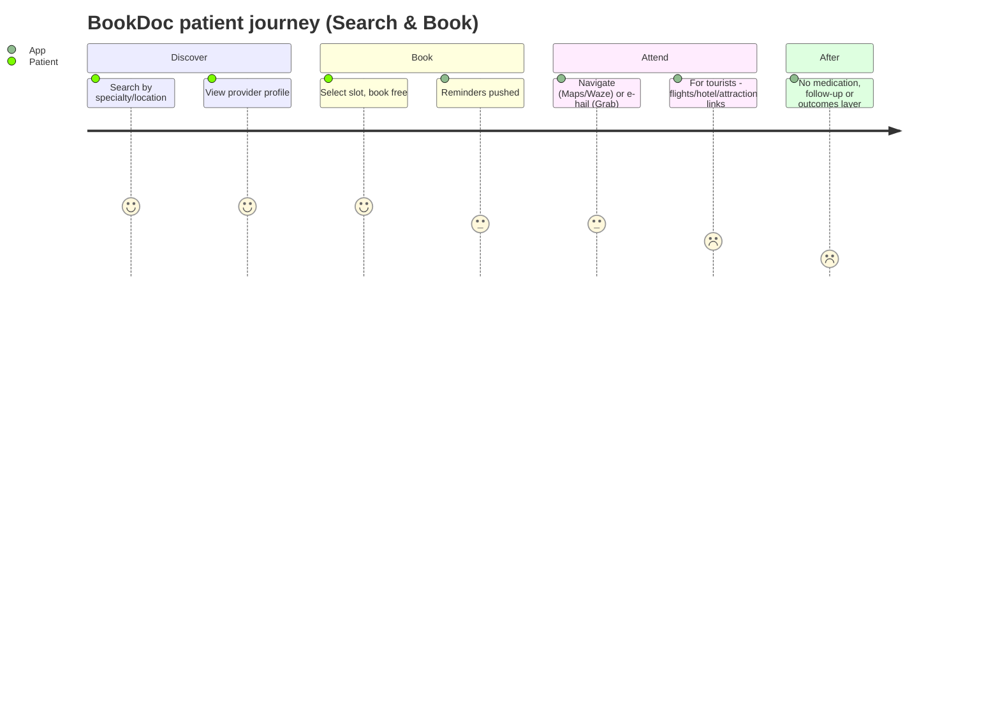

# BookDoc — Competitor Dossier

**Abstract.** BookDoc (operated by Health4U Solutions Sdn Bhd, Malaysia) is the most heavily publicised of Malaysia's first-generation digital health platforms: a doctor-appointment-booking app launched in 2015 by Dato' Chevy Beh (ex-BP Healthcare) that expanded into corporate step-challenge wellness (BookDoc Activ), teleconsultation, and government contracts (PERKESO Activ@Work). Its history is defined by celebrity-investor seed rounds with aggressive valuation claims, a PR-first growth strategy, and a pivot from consumer booking to B2B/government wellness programmes. Founder and CEO Chevy Beh died in August 2022; the company continues to operate — the app was still being updated in July 2025 and the PERKESO Activ@Work Challenge ran again in 2025 — but there is no evidence of new funding, new product direction, or a publicly named successor CEO. For Welltech, BookDoc is a cautionary case study in booking-marketplace economics and a live incumbent in the corporate-wellness channel, not a serious threat in telehealth, weight loss, or longevity medicine.

Last updated: July 2026

Related dossiers: [GetDoc](getdoc.md) · [Teleme](teleme.md) · [DoctorOnCall](doctoroncall.md) · [Naluri](naluri.md) · [Doc2Us](doc2us.md)
Related market context: [Malaysia market intelligence](../10-market-intelligence/malaysia-market-intelligence.md)

---

## 1. Company overview

| Item | Detail |
|---|---|
| Legal entity | Health4U Solutions Sdn Bhd, Co. Reg. 201501023319 (1148648-W)[^1] |
| HQ | Suite 6.03A, Level 6, Menara OBYU 4, Damansara Perdana, Petaling Jaya, Selangor[^1] |
| Founded | July 2015; official launch October 2015[^2][^3] |
| Founders | Dato' (Datuk) Chevy Beh (Beh Yen San), ex-managing director of BP Healthcare Group; co-founder Joel Neoh Eu-Jin (founder of Groupon Malaysia, later Fave)[^2][^1] |
| Category | Doctor-appointment booking → corporate/government wellness (step challenges) + vestigial teleconsult |
| Markets claimed | Malaysia, Singapore, Hong Kong, Thailand, Indonesia — "5 countries, 20 cities"[^2][^1] |
| Employees | ~48–51 (third-party estimates, not company-confirmed)[^4] |
| Total funding | USD 2.31M over 5 rounds (Tracxn); one aggregator cites USD 4.31M — see §4[^24][^25] |
| Flagship contract | PERKESO (SOCSO) Activ@Work national step challenge, annually since 2017[^6][^13] |
| Status (July 2026) | Operating; consumer app last updated July 2025; Activ@Work 2025 active[^5][^6] |

## 2. History & timeline

- **Jul–Oct 2015 — Founding.** Launched as Malaysia's first online doctor-appointment platform, positioned by TechCrunch as a "ZocDoc for Southeast Asia."[^7] Origin story, heavily used in PR: a friend of Beh's nearly died of misdiagnosed dengue; Beh's personal intervention expedited hospital admission and, per the physicians quoted, saved his life.[^3][^2]
- **Jan 2016 — Royal seed round.** Seed led by Brunei's Prince Abdul Qawi — reported by TechCrunch at ~USD 2M and billed as the prince's first tech investment. BookDoc claimed "the largest seed valuation of any seed-stage startup in Asia" — an unverifiable, company-originated claim.[^7][^8]
- **2016–2017 — Partnership blitz.** Lifestyle-partner integrations announced in rapid succession: TripAdvisor (medical tourism), Grab, Uber, AirAsia, Agoda; official partner status with SOCSO/PERKESO, FOMEMA (foreign-worker medical exams) and the Ministry of Tourism Malaysia; Berjaya Hotels & Resorts tie-in for tourists.[^9][^10][^11]
- **Feb 2017 — Macau money.** Investment round led by a family member of casino magnate Dr Stanley Ho, again announced via PR Newswire rather than financial press.[^12]
- **2017–2018 — The Activ pivot.** Launch of BookDoc Activ (step-tracking rewards) and the PERKESO Activ@Work corporate step challenge, which became the company's flagship recurring programme and de facto business.[^6][^13]
- **Aug 2019 — Series A that never was.** Publicly "looking to raise Series A from strategic partners" after crossing 100 partnerships in 20+ cities.[^14][^15] No completed Series A was ever announced — a significant signal (see §4).
- **Apr 2020 — COVID positioning.** Strategic collaboration with Tencent-backed WeDoctor: a bilingual Global Consultation & Prevention Center offering 24/7 online COVID-19 consultations; Beh appeared on CNBC to discuss it.[^16][^17]
- **Jun 2021 — Fake-vaccine-letter incident.** Forced to publicly deny a letter circulating under its name offering AstraZeneca vaccination at RM100 per jab; the company stated it was not involved in the national vaccination programme at that time.[^18]
- **Jul 2022 — Last founder statements.** Beh told Bernama/Borneo Post the platform had passed 1 million users/downloads across seven modules, was spending ~RM1M/year on the app, and would invest RM4M in technology in 2023.[^19][^20]
- **Aug 2022 — Founder's death.** Dato' Chevy Beh died at age 37; obituaries credited him with a role in COVID-19 vaccine distribution logistics.[^21][^22][^23]
- **2023–2025 — Steady-state operation.** Activ@Work ran for its 5th consecutive year in 2023 and continued in 2024 and 2025 (confirmed via the PERKESO microsite and BookDoc's social channels); the consumer app still receives updates (v5.17.62, 11 July 2025).[^13][^6][^5]

## 3. Founders & leadership

- **Dato' Chevy Beh (founder & CEO until 2022).** Son of the BP Healthcare Group founder; previously MD of BP Healthcare, a large Malaysian diagnostics chain — meaning BookDoc began with rare provider-side distribution advantages. Harvard-educated, a Forbes contributor, and an exceptionally effective self-publicist: most BookDoc coverage is founder-centred.[^21][^23][^30]
- **Joel Neoh Eu-Jin (co-founder).** Groupon Malaysia founder and later Fave co-founder; involvement appears early-stage and non-operational.[^2]
- **Post-2022 leadership: undisclosed.** Extensive searching found no announcement of a successor CEO, no covered leadership changes, and no post-2022 executive interviews. The company operates, but leadership is opaque — consistent with family/estate continuity rather than a venture-backed management rebuild. *(inference from absence of evidence across news searches, 2023–2026)*

## 4. Funding & investors

BookDoc's fundraising is small in absolute terms but was marketed as record-breaking. Treat all valuation claims skeptically — they originate from company PR.

| Round | Date | Amount | Investors | Notes |
|---|---|---|---|---|
| Seed | Sep 2015 – Jan 2016 | ~USD 2M (TechCrunch) | Prince Abdul Qawi (Brunei royal family) — his "first tech startup investment" | Company claimed highest seed valuation in Asian startup history[^7][^8] |
| Seed extension | Feb 2017 | Undisclosed | Family member of Dr Stanley Ho (Macau) | PR-led announcement[^12] |
| Seed (final recorded) | Feb 2018 | Undisclosed | — | Tracxn: total USD 2.31M over 5 rounds; post-money valuation USD 7.26M as of Feb 2018[^24] |
| Series A | Announced intent Aug 2019 | Never closed publicly | — | "Looking to raise from strategic partners"[^14][^15] |

Observations:

- Tracxn counts ~30 investors (28 of them angels); PitchBook counts 14 — either way the cap table is angel-heavy, celebrity-flavoured, and institutional-VC-free.[^24][^25]
- One aggregator snippet cites total raised of USD 4.31M, conflicting with Tracxn's USD 2.31M. Both are estimates; the true figure is likely USD 2–5M.[^25][^24]
- BookDoc maintains an "Initial Investors" page on its own site — investor identity was itself a marketing asset.[^35]
- **Analytical note:** a company that announced record seed valuations in 2016–2017 and then never closed a priced institutional round in ten years has been, in effect, valuation-orphaned. The prominent-investor strategy generated headlines, not follow-on capital.

## 5. Business model & revenue streams

Per founder interviews with Digital News Asia, revenue is **B2B-centred**:[^26]

| Stream | Mechanics | Evidence / clients |
|---|---|---|
| Provider subscriptions | Doctors/clinics pay for appointment-management listing + CRM | DNA founder interview[^26] |
| Corporate wellness (Activ) | Employers pay for step-challenge programmes, dashboards, "big data analytics" | Great Eastern Malaysia, Heineken Malaysia, Khazanah Nasional, Kimanis Power[^26][^13] |
| Government programmes | PERKESO funds the national Activ@Work Challenge; free to employers/employees; RM40,000 prize pool in current edition | activatwork.perkeso.gov.my[^6][^13] |
| Rewards/affiliate | Activ tiers (Bronze→Platinum), 90+ reward partners in F&B, retail, pharmacy across 12 countries | App Store listing; Activ pages[^27][^28] |
| Consumer booking & teleconsult | Free to patients; "Tele-Consult" is one of seven claimed modules; no public pricing advertised | Borneo Post; site[^19][^31] |

Financial data points (all third-party estimates or unaudited company statements):

- "Just shy of breaking even," expected to break even 2020; "now cashflow positive" — founder statements to DNA.[^26]
- Revenue ~RM3.8M/yr around mid-2020 (aggregator estimate).[^4]
- Growjo estimates USD 5.6M revenue and 48 staff — methodology opaque; treat as ceiling.[^4]
- RM1M/year app maintenance spend; RM4M planned 2023 tech investment (founder statement, July 2022).[^19]

## 6. Product & clinical workflow

Seven claimed modules (as of 2022): Search & Book, Activ, Tele-Consult, Marketplace, Events & News, Health Coaching, COVID-19 features.[^19]

### Patient workflow (Search & Book)

The travel integrations (AirAsia, Agoda, TripAdvisor, Grab) are affiliate deep-links rather than clinical workflow — breadth-first, depth-light.[^9][^10] There is no pharmacy, no e-prescription, no chronic-care programme anywhere in the stack — the loop ends at the clinic door. Contrast [Teleme](teleme.md), which closed the medication loop with a fraction of the press.

### Activ workflow

1. Sync steps from Apple Health, Fitbit, Garmin, Mi Band.[^27][^28]
2. Accumulate monthly tier status (Bronze–Platinum).
3. Redeem partner e-vouchers (F&B, retail, pharmacies); join virtual challenges for cash vouchers and virtual medals.[^27]
4. Employers run leaderboard challenges via promo codes; PERKESO's edition groups organisations by size and crowns "Most Active Employers."[^6]

### Provider network claims — treat as marketing

| Claim | Source & year | Assessment |
|---|---|---|
| "More than 40,000 healthcare providers… 20 cities, 5 countries" | SCMP Malaysia Business Report (country-report/advertorial), 2020[^10] | Likely counts every listed practitioner in partner groups; not independently verified; no transactable-count ever published |
| Anchor partners: IJN (National Heart Institute), KPJ Healthcare (MY); NTUC Unity Denticare, Q&M Dental (SG); Quality HealthCare, Town Health (HK) | SCMP 2020[^10] | Named institutions plausible; depth of integration unknown |
| "1 million users" | Founder statement, Jul 2022[^19][^20] | Cumulative downloads across three app stores, not MAU |
| "100+ strategic partnerships in 20+ cities" | PR Newswire, Aug 2019[^14] | Logo count, not revenue count |

## 7. Technology & AI

- Native iOS/Android apps (developer: Health4U Solutions Sdn. Bhd.); Huawei AppGallery distribution as well.[^28][^20]
- Wearable integrations (Apple Health, Fitbit, Garmin, Mi Band) are the most substantive technical asset — and the top source of user complaints (see §9).[^27][^34]
- "Big data analytics for corporates" is claimed in revenue-model descriptions[^26]; no evidence of ML/AI capability, AI triage, or clinical decision support in any product surface or press in eleven years.
- **No WhatsApp-based workflow found** — support runs via call centre (1300-88-2362), email and in-app channels.[^1]
- Separate provider-side app ("BookDoc for Providers", iOS id1460359883 / Android com.bookdoc.doctor).[^36]

## 8. Marketing & positioning

- **PR-first strategy.** BookDoc's dominant channel was press releases (PR Newswire cadence 2015–2021), founder profiles, paid/advertorial placements (Forbes Asia Custom, SCMP country reports, Malaysiakini advertorials), and award claims (CNBC "World's Top 100 Startup", Frost & Sullivan 2015–2021).[^30][^10][^13][^1] This bought exceptional share-of-voice relative to a tiny funding base — and collapsed to near-zero after 2022.
- **SEO.** Homepage now targets "Find 24/7 Online Doctor in Malaysia | Book Appointment Now" — chasing telehealth intent keywords despite the booking heritage; the site self-describes as "Malaysia's No 1 Wellness & Healthcare App" on its download page.[^31][^20]
- **Social.** Facebook (@BookDoc4u) and Instagram remain active, dominated by Activ@Work promotion — 2025 challenge posts on Facebook, Instagram reels in May 2025; historic YouTube content covers the PERKESO partnership.[^5][^32][^33]
- **Positioning drift:** consumer super-app (2015–17) → medical-tourism companion (2017–19) → COVID responder (2020–21) → government/corporate step-challenge operator (2022–present). The PERKESO programme is now the brand's centre of gravity.

## 9. Reviews & reputation

| Signal | Value | Reading |
|---|---|---|
| Google Play rating | 3.9★[^34] | Mediocre for a 10-year-old app |
| Dominant review themes | Wearable step-sync failures; step counts not crediting[^34] | Complaints target the rewards mechanics, not care delivery — users treat it as a rewards app |
| App Store title | "BookDoc - Go Activ Get Rewards"[^28] | The store name itself concedes Activ is the product |
| Installs | 1M+ cumulative claimed (2022, company figure)[^19] | Inflated by PERKESO enrolment waves |
| Update recency | Android v5.17.62, 11 Jul 2025[^5] | Maintained, not abandoned |
| Reddit/Lowyat presence | None meaningful found | Low organic consumer mindshare vs PR footprint *(absence-of-evidence, Jul 2026)* |
| Fraud exposure | 2021 fake RM100-AstraZeneca letter exploited the brand; fast denial[^18] | Brand recognisable enough to spoof |

## 10. Strengths & weaknesses

**Strengths**

1. Entrenched multi-year government relationship — PERKESO Activ@Work is national, recurring, and free-to-employer, giving BookDoc a distribution machine competitors can't buy.[^6][^13]
2. Recognised brand among Malaysian corporates and award/press legacy usable in B2B sales.[^1][^30]
3. Real wearable-integration capability across four device ecosystems.[^27]
4. App and social channels still maintained; the business survived its founder's death.[^5]

**Weaknesses**

1. Founder-dependent company that lost its founder; no named successor; strategy frozen since 2022. *(inference, §3)*
2. No institutional capital ever raised; no public funding since 2018.[^24]
3. Consumer booking is commoditised; teleconsult module is vestigial; no clinical depth (no in-house doctors, pharmacy, chronic-care programmes).
4. 3.9★ app with persistent sync complaints; no AI capability after 11 years.[^34]

## 11. SWOT

| | Helpful | Harmful |
|---|---|---|
| **Internal** | Government contract moat (PERKESO); corporate client roster; wearable integrations; brand legacy | Key-person vacuum; no capital; shallow clinical stack; ageing codebase and 3.9★ UX |
| **External** | Insurer wellness programmes (AIA-Vitality-style mechanics it already mimics); upsell screening/mental-health into captive corporate base; medical-tourism recovery | Loss of PERKESO contract removes the anchor; [Naluri](naluri.md) owns clinical corporate-wellness budgets; [DoctorOnCall](doctoroncall.md)/[Doc2Us](doc2us.md)/[Qmed](qmed-asia.md) own telehealth[^29]; wearable API platform risk |

## 12. Current status assessment

**Verdict: active but strategically frozen ("maintained incumbency") — not a zombie.**

- Evidence of activity: July 2025 app release[^5]; 2025 Activ@Work Challenge live on PERKESO's own subdomain and BookDoc's social channels.[^6][^5]
- Evidence of stagnation: no funding since ~2018[^24]; no new product announcements since the founder's death; no named CEO; PR output near-zero since 2022.
- Most probable trajectory: continued operation as a services vendor to PERKESO and corporates on the Activ platform, with consumer booking/telehealth ambitions effectively shelved. The RM4M 2023 technology-investment plan announced weeks before Beh's death has no visible public follow-through beyond routine app releases.[^19]

## 13. Comparison snapshot — first-generation MY platforms

| Dimension | BookDoc | [GetDoc](getdoc.md) | [Teleme](teleme.md) |
|---|---|---|---|
| Core model today | Government/corporate step challenges (Activ) | Benefits membership + clinic payments | Integrated telemedicine (consult→e-Rx→pharmacy→labs) |
| Clinical depth | None (booking + vestigial teleconsult) | None (discovery + discounts) | Real: compliant e-Rx, licensed dispensing, labs |
| Funding | ~USD 2.3–4.3M, angels/celebrities, none since 2018[^24][^25] | Reported US$1.6M, unconfirmed | RM300K grant + accelerator only |
| Anchor B2B relationship | PERKESO (national, recurring)[^6] | UOB/SAFRA/AA affinity deals | Telekom Malaysia Unifi (white-label) |
| App maintenance (2025–26) | Active (Jul 2025 release)[^5] | Stale since Mar 2021 | Active (Jan 2026 release) |
| Founder status | Deceased (2022); no named successor[^21] | Muddled/absent from press | Intact founder team |
| Threat to Welltech core (GLP-1/longevity/concierge) | None | None | None directly; workflow-relevant |
| Main lesson for Welltech | Government channel works; PR ≠ capital; breadth ≠ moat | Directory/discount models plateau | Clinical loop is buildable cheaply; scale needs capital |

Common pattern across all three: founded 2015–2016, celebrated 2016–2018, capital-starved by 2020, and by 2026 either frozen (BookDoc), harvesting (GetDoc), or surviving as infrastructure (Teleme). None converted early attention into a durable consumer franchise — that space was taken by better-funded clinical operators ([DoctorOnCall](doctoroncall.md), [Doc2Us](doc2us.md)) and corporate-clinical players ([Naluri](naluri.md)).

## 14. Intelligence gaps & monitoring plan

Open questions (not answerable from public sources as of July 2026):

1. **Who controls and runs Health4U Solutions post-2022?** Verify via SSM (Companies Commission of Malaysia) filings — directors, shareholders, charges. Highest-value single check on this company.
2. **PERKESO contract terms and tenure** — value, renewal cadence, and whether Activ@Work has ever been competitively tendered.
3. **Actual MAU vs the 1M cumulative-download claim** — approximate via app-analytics vendors if a commercial decision ever depends on it.
4. **Whether the Tele-Consult module has any doctor supply today** — mystery-shop the app.

Monitoring triggers (quarterly review):

- New leadership announcement or rebrand → possible restart/sale of the asset.
- Activ@Work absent from a calendar year → anchor loss; expect rapid decline.
- App update gap exceeding 12 months → reclassify toward zombie.
- Any fundraising or M&A chatter → the PERKESO relationship would be the asset being sold; a buyer could become a real corporate-channel competitor overnight.

## 15. Implications for Welltech

1. **Do not fear BookDoc in Welltech's core domains.** It has no GLP-1/weight-loss capability, no longevity or preventive-medicine clinical programmes, no concierge layer, no WhatsApp workflow, and no AI. Its telehealth module is vestigial. The overlap is zero on clinical depth and partial only in the corporate channel.
2. **Study the PERKESO playbook — then leapfrog it.** BookDoc proved a Malaysian digital-health startup can win and retain a multi-year national government wellness contract with a gamified step product. Welltech's corporate/insurer strategy should assume incumbents own "steps and vouchers" and differentiate on clinically meaningful outcomes (weight, HbA1c, metabolic age) that procurement cannot get from a pedometer challenge.
3. **PR-led fundraising is a trap.** BookDoc converted royal/celebrity angels and record-valuation headlines into ten years without an institutional round. Optimise for revenue-quality metrics that survive diligence, not announcement value.
4. **Key-person risk is real and observable here.** A founder-centric brand froze the moment the founder was gone. Welltech should institutionalise clinical governance and leadership depth early.
5. **Partnership breadth ≠ moat.** Dozens of logo partnerships (TripAdvisor, Grab, Agoda, hotels) produced press but no defensible patient relationship. Depth of clinical relationship — medication, follow-up, outcomes — is the moat BookDoc never built and the one Welltech should.
6. **Channel-watch item:** if the PERKESO contract is ever re-tendered, the incumbent's clinical shallowness makes it displaceable by a bidder offering outcome-based wellness. Track procurement signals via PERKESO channels.[^6]

---

## References

[^1]: Bloomberg company profile, "Health4U Solutions Sdn Bhd", https://www.bloomberg.com/profile/company/1370248D:MK; TalentCorp employer profile (reg. no., address), https://star.talentcorp.com.my/emp/search/3Y3HE; BookDoc, "Contact Us", https://www.bookdoc.com/contact-us/ (accessed July 2026).
[^2]: Wikipedia, "BookDoc", https://en.wikipedia.org/wiki/BookDoc (accessed via search excerpts, July 2026).
[^3]: Yahoo News Singapore, "Startup in Spotlight: How dengue helped create Malaysia's BookDoc", https://sg.news.yahoo.com/startup-spotlight-dengue-helped-create-malaysia-bookdoc-075500301.html (accessed July 2026).
[^4]: Growjo, "BookDoc: Revenue, Competitors, Alternatives", https://growjo.com/company/BookDoc; Owler, https://www.owler.com/company/bookdoc; LeadIQ, https://leadiq.com/c/bookdoc/5a1d8f0a5400005200750997 (revenue/headcount estimates; accessed July 2026).
[^5]: Aptoide, "BookDoc - Go Activ Get Rewards" v5.17.62, released 2025-07-11, https://bookdoc.en.aptoide.com/app; BookDoc Facebook, "ACTIV@WORK Challenge 2025 is here!", https://m.facebook.com/BookDoc4u/photos/726128746582365/ (accessed July 2026).
[^6]: PERKESO, "Activ@Work Challenge" official microsite (programme mechanics, RM40,000 prize pool, BookDoc app enrolment, employer promo codes), https://activatwork.perkeso.gov.my/ (accessed July 2026).
[^7]: TechCrunch, "Brunei Prince Invests $2M In BookDoc, A 'ZocDoc For Southeast Asia'", 20 Jan 2016, https://techcrunch.com/2016/01/20/brunei-prince-invests-2m-in-bookdoc-a-zocdoc-for-southeast-asia/ (accessed July 2026).
[^8]: PR Newswire, "Brunei Royal Family Makes First Tech Startup Investment in BookDoc", https://www.prnewswire.com/news-releases/brunei-royal-family-makes-first-tech-startup-investment-in-bookdoc-300205547.html; The Edge Malaysia, "Brunei's Prince Abdul Qawi invests in Malaysia's BookDoc", https://theedgemalaysia.com/article/brunei%E2%80%99s-prince-abdul-qawi-invests-malaysia%E2%80%99s-bookdoc (accessed July 2026).
[^9]: PR Newswire, "BookDoc Makes Medical Tourism More Enjoyable with TripAdvisor", https://www.prnewswire.com/news-releases/bookdoc-makes-medical-tourism-more-enjoyable-with-tripadvisor-300391781.html; BookDoc, "Strategic Partners - TripAdvisor", https://www.bookdoc.com/strategic-partners-tripadvisor/ (accessed July 2026).
[^10]: South China Morning Post (Malaysia Business Report country-report/advertorial), "BookDoc expands borderless health care services in Asia", 2020, https://www.scmp.com/country-reports/country-reports/topics/malaysia-business-report-2020/article/3052655/bookdoc; and "BookDoc redefines Malaysian health care access", 2017, https://www.scmp.com/country-reports/business/topics/malaysia-business-report-2017/article/2125202/bookdoc-redefines (accessed July 2026).
[^11]: Tourism Malaysia, "BookDoc… Teams Up with Berjaya Hotels & Resorts", https://www.tourism.gov.my/news/trade/view/bookdoc-the-trusted-medical-companion-for-tourists-teams-up-with-berjaya-hotels-resorts-for-a-worry-free-traveling-experience (accessed July 2026).
[^12]: PR Newswire, "Macau's Dr Stanley Ho Family Invested into BookDoc", Feb 2017, https://www.prnewswire.com/news-releases/macaus-dr-stanley-ho-family-invested-into-bookdoc-300412177.html (accessed July 2026).
[^13]: PR Newswire APAC, "The Activ@Work Challenge is back once again for the 5th consecutive year", 2023, https://www.prnewswire.com/apac/news-releases/the-activwork-challenge-is-back-once-again-for-the-5th-consecutive-year-301853892.html (also https://en.prnasia.com/releases/apac/the-activ-work-challenge-is-back-once-again-for-the-5th-consecutive-year-408404.shtml); Malaysiakini advertorial, "New Milestones for BookDoc in 2020" (Great Eastern, Heineken, Khazanah, Kimanis Power wellness programmes; KITASihat Wellbeing Day), https://www.malaysiakini.com/advertorial/557725 (accessed July 2026).
[^14]: PR Newswire APAC, "BookDoc… looking to raise Series A from Strategic partners", Aug 2019, https://en.prnasia.com/releases/apac/bookdoc-partners-it-s-way-to-being-southeast-asia-s-next-generation-healthcare-ecosystem-is-looking-to-raise-series-a-from-strategic-partners-258174.shtml (accessed July 2026).
[^15]: LaingBuisson Healthcare Markets International, "Malaysia: BookDoc looking to raise Series A funds", https://www.laingbuissonnews.com/healthcare-markets-international-content/malaysia-bookdoc-looking-to-raise-series-a-funds/ (accessed July 2026).
[^16]: PR Newswire APAC / BioSpectrum Asia, "BookDoc and WeDoctor announce strategic collaboration", Apr 2020, https://en.prnasia.com/releases/apac/bookdoc-and-wedoctor-announce-strategic-collaboration-279504.shtml and https://www.biospectrumasia.com/news/52/15916/bookdoc-and-wedoctor-announce-strategic-collaboration.html (accessed July 2026).
[^17]: CNBC (video), "Covid: Malaysia's BookDoc describes work with Tencent-backed WeDoctor", 2 Nov 2020, https://www.cnbc.com/video/2020/11/02/covid-malaysia-bookdoc-describes-work-with-tencent-backed-wedoctor.html (accessed July 2026).
[^18]: Malay Mail, "'Fake news': BookDoc says never issued letter offering AstraZeneca Covid-19 vaccine at RM100 a jab", 1 Jun 2021, https://www.malaymail.com/news/malaysia/2021/06/01/fake-news-bookdoc-says-never-issued-letter-offering-astrazeneca-covid-19-va/1978642 (accessed July 2026).
[^19]: Borneo Post Online, "Bookdoc aims to invest RM4 million in 2023 to meet rising demand for healthcare", 24 Jul 2022 (1M+ users; seven modules; RM1M/yr app spend), https://www.theborneopost.com/2022/07/24/bookdoc-aims-to-invest-rm4-million-in-2023-to-meet-rising-demand-for-healthcare/ (accessed July 2026).
[^20]: Bernama, "BookDoc aims to invest RM4 mln in 2023 to meet rising demand for healthcare", https://www.bernama.com/en/news.php?id=2102795; BookDoc, "Download Malaysia's No 1 Wellness & Healthcare App", https://www.bookdoc.com/download-bookdoc-app/ (accessed July 2026).
[^21]: Malay Mail, "Chevy Beh, co-founder of healthcare app BookDoc, dies at 37", 25 Aug 2022, https://www.malaymail.com/news/malaysia/2022/08/25/chevy-beh-co-founder-of-healthcare-app-bookdoc-dies-at-37/24667 (accessed July 2026).
[^22]: TNGlobal (TechNode Global), "Malaysia's BookDoc Founder & CEO Chevy Beh dies", 24 Aug 2022, https://technode.global/2022/08/24/malaysias-medtech-startup-bookdocs-founder-ceo-chevy-beh-dies/; Tatler Asia, "Dato' Chevy Beh of BookDoc Dies Age 37", https://www.tatlerasia.com/power-purpose/others/bookdoc-co-founder-dato-chevy-beh-dies-at-age-36 (accessed July 2026).
[^23]: Focus Malaysia, "Chevy Beh's demise at 37: The loss of an enterprising young Malaysian", https://focusmalaysia.my/chevy-behs-demise-at-37-the-loss-of-an-enterprising-young-malaysian/ (accessed July 2026).
[^24]: Tracxn, "BookDoc - Company Profile, Funding & Investors" (USD 2.31M over 5 rounds; USD 7.26M valuation Feb 2018; ~30 investors incl. 28 angels; last round 19 Feb 2018), https://tracxn.com/d/companies/bookdoc/__YhFxKkpp3xlV-cvxEeiCVplPmoKLmPwd_g-ZFdn3xM0 (accessed July 2026).
[^25]: PitchBook, "BookDoc 2026 Company Profile" (14 investors), https://pitchbook.com/profiles/company/125071-39; Crunchbase, "BookDoc", https://www.crunchbase.com/organization/bookdoc (accessed July 2026).
[^26]: Digital News Asia, "BookDoc aims to break even this year" (B2B subscription + CRM + corporate analytics revenue model; near-break-even and cashflow-positive claims), https://www.digitalnewsasia.com/startups/bookdoc-aims-break-even-year; also "BookDoc sees a healthy start to growth in the region", https://www.digitalnewsasia.com/business/bookdoc-sees-healthy-start-growth-region (accessed July 2026).
[^27]: BookDoc, "Online Run, Walk & Get Rewards | Join Be Activ with BookDoc" (wearable sync, reward tiers, virtual challenges), https://www.bookdoc.com/what-we-offer/activ/; BookDoc, "Win Big in Free Fitness Challenges", https://www.bookdoc.com/what-we-offer/challenges/ (accessed July 2026).
[^28]: Apple App Store, "BookDoc - Go Activ Get Rewards" (id1037726744; developer Health4U Solutions Sdn. Bhd.; 90+ reward partners in 12 countries; MY/SG/HK/TH/ID coverage), https://apps.apple.com/my/app/bookdoc-go-activ-get-rewards/id1037726744 (accessed July 2026).
[^29]: The Edge Malaysia, "Cover Story: Next step for digital healthcare" (private teleconsult growth driven by DoctorOnCall, Doc2Us, Qmed Asia), https://theedgemalaysia.com/node/756278 (accessed July 2026).
[^30]: Forbes Asia Custom (sponsored content), "BookDoc: A Growing Circle Of Connections", https://forbesasiacustom.com/bookdoc-a-growing-circle-of-connections/; Crunchbase person profile, "Dato' Chevy Beh — Contributor @ Forbes", https://www.crunchbase.com/person/chevy-beh (accessed July 2026).
[^31]: BookDoc homepage, "Find 24/7 Online Doctor in Malaysia | Book Appointment Now", https://www.bookdoc.com/; BookDoc, "How Are We Different?", https://www.bookdoc.com/how-are-we-different/ (accessed via search listings, July 2026).
[^32]: BookDoc Instagram reel, "Join the Activ@Work…", May 2025, https://www.instagram.com/reel/DJlYcJxRI2i/; BookDoc Facebook page, https://www.facebook.com/BookDoc4u/ (accessed July 2026).
[^33]: YouTube, "BookDoc partners with SOCSO to organise 'PERKESO Activ@Work Challenge'", https://www.youtube.com/watch?v=1hmcTaxMnMc (accessed July 2026).
[^34]: Google Play, "BookDoc - Go Activ Get Rewards" (3.9★; step-sync complaint themes in reviews), https://play.google.com/store/apps/details?id=com.bookdoc.bookdoc (accessed via search excerpts, July 2026).
[^35]: BookDoc, "All about the BookDoc Initial Investors", https://www.bookdoc.com/initial-investors/; BookDoc, "Milestone Achievement", https://www.bookdoc.com/about/milestone-achievement/ (accessed July 2026).
[^36]: Apple App Store, "BookDoc for Providers" (id1460359883), https://apps.apple.com/us/app/bookdoc-for-providers/id1460359883; Google Play, "BookDoc for Providers", https://play.google.com/store/apps/details?id=com.bookdoc.doctor (accessed July 2026).
