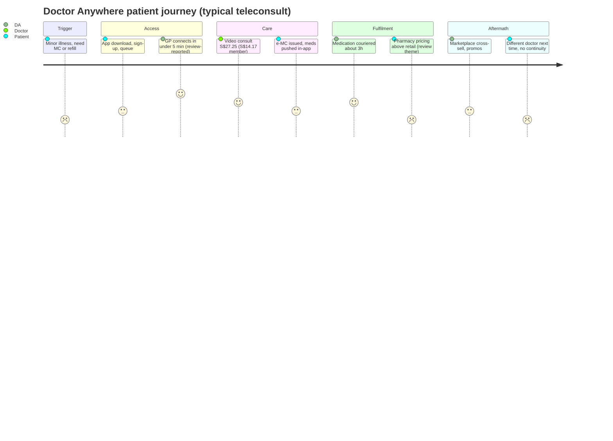

# Competitor Dossier: Doctor Anywhere

**Abstract.** Doctor Anywhere (DA, doctoranywhere.com) is Southeast Asia's best-funded regional telehealth-to-omnichannel healthcare group: founded in Singapore in 2017 by Lim Wai Mun, present in Singapore, Malaysia, Thailand, Vietnam, the Philippines and Indonesia, serving 2.5–2.8M+ users with ~600 staff and >S$190M raised (Series C S$88M led by Asia Partners, 2021; US$40.8M Series C1, 2023, Square Peg and Novo Holdings). Its model spans B2C teleconsults (S$27.25 SG / RM25 MY), a 300+-clinic panel and nine owned DA Clinics (CHAS/Healthier SG), insurer/employer B2B2C distribution (Prudential, Great Eastern, Singlife, Cigna, HSBC Life, Allianz, Tokio Marine), a 9,000-SKU marketplace, specialist care via the Asian Healthcare Specialists acquisition, and premium screening (DA Orchard MedSuites). It remains loss-making (S$43.5M after-tax loss on S$81.7M revenue, FY2023) and cut 8.1% of staff in December 2024. It has GLP-1-adjacent content and consults but no packaged medical weight-loss or longevity programme, and its funnel is app-first, not WhatsApp-first — the two most exploitable gaps for Welltech. This dossier covers the group with specific attention to Malaysia.

Last updated: July 2026

Related: [Speedoc dossier](speedoc.md) · [Research standards](../RESEARCH-STANDARDS.md)

---

## 1. Company overview & history

| Item | Detail |
|---|---|
| Founded | 2017, Singapore[^1] |
| Founder & CEO | Lim Wai Mun (founder-CEO throughout; still CEO as of 2024–2026 press and company pages)[^1][^2] |
| Markets | Singapore (HQ), Malaysia, Thailand, Vietnam, Philippines, Indonesia; tech hubs in Bangalore and Ho Chi Minh City[^3][^4] |
| Users | >1.5M (2021) → 2.5M (early 2023) → >2.8M (late 2023)[^1][^5][^6] |
| Headcount | ~600 across six countries (2024); minus ~45 roles cut Dec 2024[^5][^7] |
| Revenue | S$81.7M FY2023, +58% YoY[^8] |
| Profitability | After-tax losses: S$44.6M (FY2022), S$43.5M (FY2023) per ACRA filings; narrowing but heavy[^7][^8] |
| Total funding | >S$140M by Series C (2021) + US$40.8M Series C1 (2023)[^1][^9] |
| Group brands | DA app, DA Clinic, DA Marketplace, DA Orchard MedSuites, Asian Healthcare Specialists, SODA by DA[^2][^10] |

### Funding history (all amounts as reported)

| Round | Date | Amount | Lead / participants |
|---|---|---|---|
| Series A | Jul 2018 | US$4.1M | (early backers incl. Kamet Capital per later releases)[^11] |
| Series B | Mar 2020 | US$27M | Square Peg, EDBI, IHH Healthcare; Pavilion Capital, Kamet Capital[^11][^12] |
| Series C | Aug 2021 | S$88M (~US$65.7M) — among SEA healthtech's largest private rounds | Asia Partners (lead); Novo Holdings, Philips, OSK-SBI; returning EDBI, Square Peg, IHH, Kamet, Pavilion. Board adds: Oliver Rippel (Asia Partners), Dr Amit Kakar (Novo Holdings)[^1][^13][^14] |
| Series C1 extension | Dec 2023 | US$40.8M | Square Peg, Novo Holdings (returning); purpose: healthcare innovation + secondary-care push[^9][^15] |

No valuation was disclosed at any round; the C1 being an *extension* rather than a Series D, followed by December 2024 layoffs, signals a flat-to-disciplined valuation environment and an investor push toward profitability. *(inference)*[^7][^9]

### M&A and structural moves

- **Doctor Raksa (Thailand), Nov 2021** — acquired Thailand's largest telemedicine platform (~1M users; est. 2016), making Thailand DA's second market and lifting regional users past 2M.[^16][^17]
- **Asian Healthcare Specialists (Singapore)** — acquired the SGX-listed orthopaedic/specialist clinic group, extending DA beyond primary care into specialist and secondary care.[^18]
- **Philippines** — JV with Equicom Group for telemedicine.[^19]
- **Vietnam** — DA Clinics and DA Pharmacies operating in Hanoi and HCMC alongside the app; ViettelPay distribution partnership; ~US$30M earmarked investment reported by Vietcetera.[^20][^21]
- **Restructuring, Dec 2024** — ~45 roles (8.1% of SEA workforce) cut; <20% in Singapore; no clinicians affected; framed as removing "duplicative" roles for long-term sustainability, with enhanced severance.[^7][^22]

### Malaysia operation

- Entity: Doctor Anywhere Malaysia Sdn Bhd, offices at Menara UAC, Mutiara Damansara, Petaling Jaya, Selangor.[^23]
- Launched off the back of the 2020 Series B, which explicitly targeted Malaysia expansion.[^24]
- Consumer offer: GP video consults (RM25), specialist teleconsults (RM100), mental-wellness teleconsults (RM140 counsellor / RM230 clinical psychologist, 60 min), Tele-RTK (RM25), ~3-hour medication delivery; doctors MMC-registered.[^25][^26]
- Support portal: support.doctoranywhere.my; separate MY app storefronts and corporate/insurer panels.[^25]
- Regulatory context: no in-force telemedicine statute (Telemedicine Act 1997 never operationalised); MMC Guideline on Telemedicine requires (with narrow exceptions) an established doctor–patient relationship from prior physical consult; MOH "Guideline on Online Healthcare Services 2025" now frames platform conduct; **MMC banned MCs issued via teleconsultation in Nov 2025** — a direct hit to the most common Malaysian B2C telehealth use-case.[^27][^28][^29]

**Implication for Welltech:** DA-Malaysia is a real but shallower copy of the Singapore stack (no owned clinic estate found in MY; distribution leans on insurer/employer panels), and its lowest-friction consumer use-case (tele-MC) has been regulated away.

---

## 2. Business model & revenue streams

DA describes itself as **omnichannel**: online consults + owned clinics + panel network + home services + marketplace + specialist care.[^3][^30]

| Stream | Description | Evidence |
|---|---|---|
| B2C teleconsult | 24/7 GP video consults in-app; mental wellness, specialist and paediatric teleconsults | [^30][^31] |
| B2B2C insurer/employer panels | Telehealth partner for Cigna, Singlife, Great Eastern, HSBC Life, Allianz, Tokio Marine, Prudential; corporate GP-panel programmes with cashless/co-pay arrangements; Pacific Prime employee-benefits tie-up (2024); Singlife co-branded health subscription (2024) | [^31][^32][^33] |
| Owned clinics | 9 DA Clinics in SG (CHAS, Healthier SG, Screen for Life, Baby Bonus); DA Clinics/Pharmacies in Hanoi & HCMC | [^20][^34] |
| Panel network | 300+ trusted panel clinics in SG bookable at member rates | [^30][^35] |
| Marketplace & pharmacy | DA Marketplace: 9,000+ SKUs — vitamins, supplements, home screening kits, vaccinations, physio/chiro/fitness services; same-day OTC delivery | [^36] |
| Specialist & secondary care | Asian Healthcare Specialists (orthopaedics etc.); specialist teleconsults; DA Orchard MedSuites premium health screening & imaging | [^10][^18] |
| Home services | Doctor house calls islandwide (SG), home vaccinations, home health screenings (from S$68 with Prudential PRUShield tie-up) | [^32][^37] |
| Memberships | DA Healthwise S$29.90/yr (promos to S$15) and Healthwise Plus S$36.90/yr — unlock S$14.17 member GP consults | [^35][^38] |
| Government-adjacent | Healthier SG enrolment via DA Clinics (free first health-plan consult); CHAS subsidies | [^34][^39] |
| Partner distribution | Grab partner benefits (SG); Gojek driver consults (2019); DBS/POSB, Singtel, PAssion Card, HomeTeamNS, GetGo perks; StarHub LifeHub+ bundles | [^40][^41][^42] |

**Weight management / GLP-1 status:** DA publishes GLP-1 patient-education content (Sep 2024 blog) and offers GLP-1-related consults, prescriptions and refills through its platform per third-party guides; but there is **no packaged, branded medical weight-loss programme** (no dedicated program page, pricing, or coaching bundle found) as of July 2026.[^43][^44] Longevity: nothing beyond premium screening at Orchard MedSuites; "SODA by DA" appears as a group brand with minimal public detail.[^2][^10]

---

## 3. Pricing (actual listed prices)

### Singapore (incl. GST)

| Service | Price |
|---|---|
| GP video consult, standard hours 06:00–20:59 | **S$27.25**[^31] |
| GP video consult, after-hours 21:00–05:59 | **S$49.05**[^45] |
| Member GP consult (Healthwise), standard / after-hours | **S$14.17** / **S$35.97**[^35][^38] |
| Healthwise plan / Healthwise Plus plan | **S$29.90/yr** (promo S$15) / **S$36.90/yr**[^38] |
| Home health screening (Prudential tie-up) | from **S$68**[^32] |
| Flu/travel vaccinations (Prudential tie-up) | from **S$30**[^32] |
| Medication delivery | ~3 hours; 24-hour islandwide options[^40] |

### Malaysia

| Service | Price |
|---|---|
| GP video consult | **RM25**[^26] |
| Specialist teleconsult | **RM100**[^26] |
| Mental wellness — counsellor (60 min) | **RM140**[^26] |
| Mental wellness — clinical psychologist (60 min) | **RM230**[^26] |
| Tele-RTK consult | **RM25**[^26] |
| Medication delivery | ~3 hours[^26] |

Comparative note: DA undercuts Speedoc on teleconsults in Malaysia (RM25 vs RM30) and matches the SG mid-market; its S$14.17 member rate is the aggressive anchor. DA's competitor DoctorOnCall sits at ~RM20 in MY, so DA is not the price floor there.[^29]

---

## 4. Clinical workflow & doctor network model

**B2C flow:** app download → account/NRIC verification → on-demand GP queue (connect "within minutes"; reviews cite <5 min) or scheduled specialist/mental-health slots → video consult (Vonage video/communications APIs power the stack) → e-MC and e-prescription → in-app payment (insurer/corporate cashless where applicable) → medication couriered ~3h → follow-ups, refills and screenings cross-sold via app and marketplace.[^30][^40][^46][^47]

**Doctor network:** a marketplace/panel model — licensed GPs, specialists, paediatricians and psychologists join DA's network and receive **a fixed payout per completed consultation**; DA also employs clinic doctors in its nine owned SG clinics.[^34][^48] This hybrid (gig teleconsult layer + small owned estate) keeps fixed costs low but caps clinical continuity: patients rarely see the same doctor twice on the teleconsult side. *(inference from model structure)*

**Regulatory licensing approach:**
- **Singapore:** owned clinics are CHAS/Healthier SG-registered; telemedicine sits under HCSA outpatient licensing with remote mode of service delivery.[^34][^49]
- **Malaysia:** operates under MMC guidelines/Private Healthcare Facilities and Services Act environment with MMC-registered doctors; exposed to the Nov 2025 tele-MC ban.[^26][^27][^29]
- **Vietnam/Thailand/Philippines/Indonesia:** local entities, JVs (Equicom PH) and acquisitions (Doctor Raksa TH) to hold local licences.[^16][^19]

---

## 5. Technology & AI; WhatsApp usage

- **Stack:** consumer app (iOS/Android) + DA Provider app; Vonage APIs for video; NetSuite for regional back-office; marketplace e-commerce platform.[^36][^46][^50]
- **AI:** no flagship consumer AI product found. Series C1 messaging cites "next-generation healthcare innovation" and tech hubs in Bangalore/HCMC, but public evidence of deployed AI (triage bots, agentic ops) is thin — notably weaker than Speedoc's 2025 agentic-AI platform announcement.[^4][^9][^15] *(comparative judgment)*
- **WhatsApp:** no WhatsApp-first funnel found in SG/MY; support runs through in-app chat, hotlines, Zendesk portals; Vietnam bookings are confirmed by care-team callbacks. WhatsApp/Zalo appear only as peripheral contact channels.[^25][^51] *(verification of absence)*

---

## 6. Marketing & positioning

- **Positioning:** "Singapore's homegrown healthcare company" — mass-market, convenience-led, family-oriented; deliberately mainstream vs Speedoc's clinical/institutional framing.[^2]
- **SEO:** strong — doctoranywhere.com ranks across "teleconsult Singapore", clinic, screening and condition queries; a large support/FAQ estate (Zendesk) captures long-tail intent; MY site (doctoranywhere.my) mirrors this.[^25][^30]
- **Partnership-led distribution is the core engine:** Grab partner benefits, Gojek (drivers), DBS/POSB and Singtel perks, PAssion Card, HomeTeamNS, GetGo, StarHub LifeHub+ — plus the insurer panels (PRUPanel Connect, Great Eastern, Singlife, Cigna, HSBC Life, Allianz, Tokio Marine).[^31][^32][^40][^41][^42]
- **Campaigns:** "Highlympics" with Lifebuoy (national sprinter Shanti Pereira, Tyen Rasif, Mongchin Yeoh) pushing subsidised screenings to younger consumers; men's-health street campaigns ("Even strong men stop. It's stronger to know for sure"); student rates programme.[^52][^53]
- **Social:** Instagram ~7.5k followers; TikTok ~1.4k followers / 29.7k likes — modest owned-social reach; the reach engine is partners, not content.[^54]

---

## 7. Reviews & reputation

| Channel | Signal | Themes (with evidence) |
|---|---|---|
| Google Play (com.doctoranywhere) | Listing live; ~4.3★ per third-party tracker (unverified against live store) | Negative: unresolved support tickets ("after days of waiting, no one replied"), app-breaking bugs, charges taken despite UI errors[^47][^55] |
| Apple App Store (SG) | Mixed | Negative: medication priced well above retail pharmacy; users report being pushed to buy meds on-platform with no prescription-letter option even for chronic hypertension; support non-responsive after multiple reminders. Positive: ~10-consult veterans citing <5-min doctor response[^47] |
| Trustpilot | No listing for DA Singapore (UK "Doctor Care Anywhere" is a different company — beware conflation)[^56] | — |
| Reddit (r/singapore, r/malaysia) | No substantive indexed threads surfaced in this cycle | TikTok "Doctor Anywhere Singapore review" discovery pages indicate consumer chatter has shifted platforms[^54] |
| Employer | Not assessed this cycle | — |

**Theme synthesis:** the recurring, structural complaints — (1) pharmacy margin capture (expensive meds, no external prescription), (2) weak async support, (3) transactional one-off consults — are the exact failure modes a continuity-care, transparent-pricing, WhatsApp-native entrant is built to exploit.

---

## 8. Competitive context

### 8.1 Reconciliation of conflicting figures

| Figure | Values reported | Treatment |
|---|---|---|
| Series C size | S$88M (company) = ~US$65.7M (PR Newswire); MobiHealthNews headline "US$66M" | Single round; currency framing differs[^13][^14] |
| Users | 1.5M (2021) → 2.5M (Jan 2023) → 2.8M+ (late 2023) → "2M+"/"2.5M+" on current LinkedIn/marketplace pages | Growth series retained with dates; current public figure is loosely stated by DA itself[^1][^3][^5][^6] |
| Losses | S$44.6M (FY2022), S$43.5M (FY2023) after-tax (ACRA via press) | Reported as-is; no FY2024 filing surfaced this cycle[^7][^8] |
| Android rating | ~4.3★ (third-party tracker) | Unverified against live Play Store; flagged[^55] |
| Countries | "six countries" incl. Indonesia; ID consumer footprint appears limited (FAQ site, LinkedIn entity) | Indonesia counted as market entry, depth unverified[^3] |

### 8.2 Comparison matrix — DA vs key rivals in Welltech's geographies

| Dimension | Doctor Anywhere | Speedoc (see [dossier](speedoc.md)) | DoctorOnCall (MY) |
|---|---|---|---|
| Core motion | Omnichannel telehealth + clinics + marketplace | Home clinical logistics, hospital-at-home | MY online pharmacy + teleconsult |
| Geography | SG+5 SEA markets | SG, MY | MY |
| GP teleconsult | S$27.25 / RM25 (S$14.17 member) | S$21.80 / RM30 | ~RM20[^29] |
| Owned clinics | 9 (SG) + VN clinics/pharmacies | 0 | 0 (pharmacy partners) |
| Insurer panels | 7+ majors | GE, Allianz MY | Corporate panels |
| Home services | House calls, home screening/vaccination | Full stack incl. nursing, ambulance, virtual wards | Limited |
| Marketplace/pharmacy | 9,000+ SKUs | None | Core business |
| Weight/GLP-1 programme | Consults only, no packaged programme | None | Pharmacy-led categories |
| Funding | >S$190M | ~US$33–51M | (not assessed) |

### 8.3 Porter-style forces snapshot (DA's position)

| Force | Assessment |
|---|---|
| Buyer power | **High** — insurers/employers negotiate per-consult rates; consumers churn on price and promo codes. *(inference)* |
| Supplier power | **Medium** — gig-GP supply is elastic in SG/MY, but per-consult payouts floor the unit cost; specialist supply (AHS) is owned.[^48] |
| New entrants | **Medium-high** — teleconsult is commoditised; omnichannel estate is the differentiator but capital-hungry. |
| Substitutes | **High** — GP walk-ins, polyclinics, insurer-owned telehealth, pharmacy apps, and (in MY) DoctorOnCall at lower price points.[^29] |
| Rivalry | **High** — multi-front: Speedoc (home), WhiteCoat (B2B SG), Ping An/Grab-adjacent plays regionally. |

### 8.4 Customer journey (B2C teleconsult, SG)

Two structural notes: (1) speed-to-doctor is genuinely excellent and repeatedly praised; (2) monetisation concentrates post-consult (pharmacy margin, marketplace), which is precisely where trust complaints cluster.[^47]

### 8.5 Customer segments *(analyst synthesis)*

1. **Insured employees** (largest, via 7+ insurer/employer panels) — cashless, low-friction, low-loyalty.
2. **Convenience B2C** — MC/refill seekers, parents; promo-price sensitive.
3. **Heartland primary care** — CHAS/Healthier SG patients at nine DA Clinics.
4. **Premium screeners** — DA Orchard MedSuites imaging/screening clients.
5. **Regional mass-market** — TH (Raksa base), VN, PH, ID users at local price points.

---

## 9. Strengths / Weaknesses / SWOT

### Strengths
1. Regional scale and brand: 6 markets, 2.8M+ users, deepest funding stack in SEA consumer telehealth.[^1][^6]
2. Insurer/employer distribution machine — seven-plus major insurer partnerships create low-CAC, sticky B2B2C volume.[^31][^32]
3. Omnichannel assets: owned clinics (CHAS/Healthier SG), 300+ panel, marketplace, specialist group (AHS), premium screening (MedSuites).[^10][^34][^36]
4. Government-scheme integration in SG (Healthier SG, CHAS) anchors primary-care legitimacy.[^34][^39]
5. Proven M&A capability (Doctor Raksa, AHS, Equicom JV).[^16][^18][^19]

### Weaknesses
1. Persistent heavy losses (S$43.5M FY2023) and a C1-extension + layoffs pattern indicating funding-market pressure.[^7][^8][^9]
2. Transactional teleconsult model: per-consult gig doctors, no continuity of clinician, thin chronic-condition support (no prescription portability per reviews).[^47][^48]
3. Consumer-trust friction: medication pricing and support-responsiveness complaints.[^47]
4. No packaged weight-loss/GLP-1 or longevity programme despite owning every ingredient (doctors, pharmacy, screening, marketplace).[^43][^44]
5. App-first funnel; no WhatsApp-native journey in SG/MY.[^51]
6. Malaysia: tele-MC ban removes a key B2C driver; local offer thinner than SG.[^26][^29]

### SWOT matrix

| | Helpful | Harmful |
|---|---|---|
| **Internal** | Scale, insurer channel, omnichannel estate, M&A muscle, government-scheme access | Losses, transactional care model, med-pricing trust issues, no weight/longevity SKU, app-only funnel |
| **External** | GLP-1 demand wave it could package quickly; Healthier SG chronic-care subsidies; regional insurer digitisation | Funding winter for loss-makers; MY tele-MC ban; DoctorOnCall/Speedoc/WhiteCoat pressure; insurers building owned telehealth; review-driven trust erosion |

---

## 10. Vulnerability analysis vs a WhatsApp-first continuity-care weight/longevity entrant

1. **Continuity is the wedge.** DA's per-consult gig model cannot deliver a named clinician who follows a patient through 12 months of GLP-1 titration, labs and behaviour change. Welltech's care-team-in-your-WhatsApp model attacks DA where its unit economics forbid it to follow.
2. **Pharmacy-margin resentment is pre-built demand.** App-store reviewers already complain of inflated med prices and prescription lock-in.[^47] Transparent GLP-1 pricing + prescription portability is a direct conversion message.
3. **DA could respond fast — watch the marketplace.** DA owns doctors, pharmacy logistics, screening suites and 2.8M users; a packaged weight programme is an assembly problem, not a build problem. Expect a "DA Weight" SKU within 12–24 months if the GLP-1 category keeps growing. *(analyst forecast)* Its Sep 2024 GLP-1 content signals category awareness.[^43]
4. **B2B2C flank:** DA's insurer panels could bundle a weight benefit before Welltech reaches those employers. Counter: insurers currently buy *episodic consult* capacity from DA; outcome-based weight/metabolic programmes are a different procurement conversation Welltech can own.
5. **Malaysia is DA's softest market:** thinner service depth, regulatory headwind on tele-MCs, price competition from DoctorOnCall — and WhatsApp penetration in MY makes an app-download funnel a measurable disadvantage.
6. **Where DA is strong, avoid:** commodity 24/7 GP teleconsults, insurer cashless panels, OTC marketplace. Competing there means fighting scale with worse CAC.

---

## 11. Implications for Welltech

1. **Position against transactional telehealth explicitly.** "A doctor who knows you on WhatsApp" vs DA's queue-of-strangers. Use continuity, named clinicians and outcome tracking as the category frame.
2. **Move before DA packages weight loss.** DA has ingredients but no programme; Welltech's window to own "medical weight loss done right" in SG/MY is open but time-boxed (est. 12–24 months). *(analyst estimate)*
3. **Price transparently against hidden pharmacy margins.** Publish all-in GLP-1 programme pricing; DA's review-visible med-pricing resentment makes this a trust weapon.
4. **In Malaysia, design for the MMC regime:** anchor on established doctor–patient relationships (first consult physical or hybrid), never lead with tele-MCs, and treat the 2025 MOH online-services guideline as the compliance baseline — turning DA's regulatory headwind into Welltech's compliance moat.[^27][^28][^29]
5. **Don't out-partner DA with insurers on their terms.** Instead sell employers/insurers *outcomes* (weight, metabolic markers, absenteeism) rather than per-consult panels — a lane DA's model doesn't serve.
6. **Borrow the perk-distribution playbook cheaply:** DA's Grab/DBS/Singtel/telco perk pattern is replicable at boutique scale via HR platforms and premium credit-card concierges for a longevity product. *(strategy inference)*
7. **Watch signals:** any DA weight/longevity SKU launch, a Series D or down-round, further layoffs, divestment of AHS/clinics, or a WhatsApp Business API deployment — each would materially change the threat model.

---

## 12. Intelligence gaps & monitoring plan

| Gap / signal | Why it matters | How to monitor |
|---|---|---|
| FY2024/FY2025 financials | Confirms whether the layoff-driven path to profitability is working | ACRA filings; DealStreetAsia earnings coverage[^8] |
| Series D / down-round / exit process | Changes competitive aggression and pricing behaviour | DealStreetAsia, Tech in Asia, Bloomberg; Asia Partners/Novo portfolio updates |
| Packaged weight-management or GLP-1 programme launch | The single most direct threat to Welltech's category | Site diffs on doctoranywhere.com and marketplace; DA blog RSS[^43] |
| "SODA by DA" scope | Could be the wellness/longevity vehicle; public detail minimal | Group brand pages; founder LinkedIn posts[^2][^10] |
| Verified app ratings & review volumes per market | Only third-party/anecdotal data this cycle | Quarterly pulls: Play (com.doctoranywhere), App Store (id1273714922), MY storefronts |
| DA Malaysia service expansion (clinics, home services) | MY is Welltech's launch geography | doctoranywhere.my diffs; MY support portal article changes[^25] |
| Response to MMC tele-MC ban | Reveals MY regulatory strategy and B2C resilience | CodeBlue, MY press; DA MY FAQ updates[^29] |
| WhatsApp Business API adoption | Would neutralise part of Welltech's channel advantage | Funnel test-purchases; site/FAQ diffs |
| Insurer contract wins/losses (esp. AIA) | AIA MY moved digital-health partnership to BIG CARiNG (2025) — panel churn is live | Insurer newsrooms; AIA/Prudential/GE partner pages[^57] |

Verification notes: doctoranywhere.com and doctoranywhere.my returned HTTP 403 to direct page fetching during this cycle; site-sourced prices and service details above derive from DA's indexed support-portal articles and search extracts of the exact pages cited. UK-listed "Doctor Care Anywhere" (ASX:DOC) is an unrelated company; any figures from that entity were excluded.[^56]

---

## References

[^1]: TechCrunch, "Southeast Asia 'omnichannel' health startup Doctor Anywhere gets $88M SGD" (30 Aug 2021), https://techcrunch.com/2021/08/30/southeast-asia-omnichannel-health-startup-doctor-anywhere-gets-88m-sgd/ (accessed July 2026).
[^2]: Doctor Anywhere, corporate homepage ("Singapore's Homegrown Healthcare Company"; group brands incl. SODA by DA, DA Orchard MedSuites), https://doctoranywhere.com/ (accessed July 2026, via indexed search extracts).
[^3]: Doctor Anywhere / LinkedIn company page (regional offices in Malaysia, Thailand, Philippines, Vietnam, Indonesia, India; 600 employees; 2M+ users), https://sg.linkedin.com/company/doctoranywhere (accessed July 2026).
[^4]: Vonage press release, "Doctor Anywhere Chooses Vonage to Power Telehealth Services in Southeast Asia" (also notes tech hubs in Bangalore and Ho Chi Minh City), https://www.vonage.com/about-us/newsroom/press-releases/Doctor-Anywhere-Chooses-Vonage-to-Power-Telehealth-Services-in-Southeast-Asia/8b9b9862-1925-42de-aac5-726e2477e316/ (accessed July 2026).
[^5]: Doctor Anywhere blog, "Doctor Anywhere is one of 'Singapore's fastest-growing companies in 2023'" (2.5M users, six countries), https://doctoranywhere.com/blog/2023/01/17/doctor-anywhere-is-one-of-singapores-fastest-growing-companies-in-2023/ (accessed July 2026).
[^6]: Doctor Anywhere, "Doctors and Specialists: We want you" (network of GPs, specialists, paediatricians, psychologists; >2.8M users), https://doctoranywhere.com/doctor-application/ (accessed July 2026, via indexed search extracts).
[^7]: The Independent Singapore, "8.1% of Doctor Anywhere employees across SEA laid off" (Dec 2024; ~45 roles; <20% SG-based; ACRA losses S$44.6M FY2022, S$43.5M FY2023; enhanced severance), https://theindependent.sg/8-1-of-doctor-anywhere-employees-across-sea-laid-off/ (accessed July 2026); HRD Asia, "Doctor Anywhere lays off 8% of workforce in Southeast Asia", https://www.hcamag.com/asia/specialisation/recruitment/doctor-anywhere-lays-off-8-of-workforce-in-southeast-asia-reports/518324 (accessed July 2026).
[^8]: DealStreetAsia, "Doctor Anywhere narrows losses by a tad in 2023 as revenue jumps 58%" (revenue S$81.7M FY2023), https://www.dealstreetasia.com/stories/doctor-anywhere-2023-earnings-410738 (accessed July 2026).
[^9]: Doctor Anywhere blog, "Doctor Anywhere attracts USD 40.8 million in fresh funding to scale healthcare innovation and further expand into secondary care" (7 Dec 2023), https://doctoranywhere.com/blog/2023/12/07/doctor-anywhere-attracts-usd-40-8-million-in-fresh-funding-to-scale-healthcare-innovation-and-further-expand-into-secondary-care/ (accessed July 2026).
[^10]: DA Orchard MedSuites (health screenings & imaging; group description listing DA Telehealth App, DA Clinic, DA Marketplace, DA Orchard MedSuites, Asian Healthcare Specialists, SODA by DA), https://medsuites.doctoranywhere.com/news/doctor-anywhere-founder-lim-wai-mun-on-creating-a-blueprint-for-a-sustainable-tech%E2%80%91enabled-healthcare-company/ (accessed July 2026).
[^11]: EDBI, "Singapore-headquartered telehealth start-up Doctor Anywhere closes US$27 million Series B financing led by Square Peg, EDBI and IHH" (Mar 2020; total capital base >US$40M; Series A US$4.1M Jul 2018 per MobiHealthNews), https://edbi.com/news/singapore-headquartered-telehealth-start-up-doctor-anywhere-closes-us27-million-series-b-financing-led-by-square-peg-edbi-and-ihh/ (accessed July 2026); MobiHealthNews, "Doctor Anywhere scores $27M in Series B funding round", https://www.mobihealthnews.com/news/asia/doctor-anywhere-scores-27m-series-b-funding-round (accessed July 2026).
[^12]: Square Peg, "Investment notes: Doctor Anywhere US$27m Series B", https://www.squarepeg.vc/blog/investment-notes-doctor-anywhere (accessed July 2026).
[^13]: Doctor Anywhere blog, "Digital Health Platform Doctor Anywhere Closes S$88 Million Series C Round to Deepen Southeast Asia Expansion" (31 Aug 2021; total funding >S$140M; board additions Oliver Rippel and Dr Amit Kakar), https://doctoranywhere.com/blog/2021/08/31/doctor-anywhere-series-c-release/ (accessed July 2026).
[^14]: PR Newswire, "Novo Holdings participates in US$65.7 Million Series C Financing in Singapore-based Regional Telehealth Platform Doctor Anywhere", https://www.prnewswire.com/news-releases/novo-holdings-participates-in-us65-7-million-series-c-financing-in-singapore-based-regional-telehealth-platform-doctor-anywhere-301364461.html (accessed July 2026); The Edge Malaysia, "Doctor Anywhere's S$88m Series C financing attracts Asia Partners, Temasek's PE unit, OSK-SBI", https://theedgemalaysia.com/article/doctor-anywheres-s88m-series-c-financing-attracts-asia-partners-temaseks-pe-unit-osksbi (accessed July 2026).
[^15]: Novo Holdings, "Novo Holdings joins USD 40.8 million Series C extension round for Doctor Anywhere", https://novoholdings.dk/news/novo-holdings-joins-usd-40-8-million-series-c-extension-round-for-doctor-anywhere-a-tech-led-healthcare-provider-based-in-singapore (accessed July 2026); Allen & Gledhill, "US$40.8 million series C1 investment extension in Doctor Anywhere Pte. Ltd.", https://www.allenandgledhill.com/sg/perspectives/articles/27130/us-408-million-series-c1-investment-extension-in-doctor-anywhere-pte-ltd-led-by-square-peg-and-novo-holdings (accessed July 2026).
[^16]: Doctor Anywhere blog, "Doctor Anywhere acquires Doctor Raksa — Thailand's largest telemedicine platform" (11 Nov 2021), https://doctoranywhere.com/blog/2021/11/11/doctor-anywhere-acquires-doctor-raksa-thailand/ (accessed July 2026).
[^17]: MobiHealthNews, "Doctor Anywhere buys Thailand's biggest telemedicine platform", https://www.mobihealthnews.com/news/asia/doctor-anywhere-buys-thailands-biggest-telemedicine-platform (accessed July 2026).
[^18]: MobiHealthNews, "Doctor Anywhere acquires specialist clinic group Asian Healthcare Specialists", https://www.mobihealthnews.com/news/asia/doctor-anywhere-acquires-specialist-clinic-group-asian-healthcare-specialists (accessed July 2026).
[^19]: MobiHealthNews, "Doctor Anywhere sets up joint telemedicine venture with Equicom in the Philippines", https://www.mobihealthnews.com/news/asia/doctor-anywhere-sets-joint-telemedicine-venture-equicom-philippines (accessed July 2026).
[^20]: Vietcetera, "Doctor Anywhere Lands a $30M USD Investment For Digital Health As Demand In Vietnam Surges" (DA Clinics & DA Pharmacies in Hanoi and HCMC), https://vietcetera.com/en/vietnam-innovator-doctor-anywhere-lands-a-30m-usd-investment-for-digital-health-as-demand-in-vietnam-surges (accessed July 2026).
[^21]: MobiHealthNews, "Doctor Anywhere partners with ViettelPay to provide online healthcare services in Vietnam", https://www.mobihealthnews.com/news/asia/doctor-anywhere-partners-viettelpay-provide-online-healthcare-services-vietnam (accessed July 2026).
[^22]: Nestia/CNA syndication, "Doctor Anywhere lays off 8% of workforce across Singapore and Southeast Asia in restructuring push", https://news.nestia.com/detail/Doctor-Anywhere-lays-off-8%25-of-workforce-across-Singapore-and-Southeast-Asia-in-restructuring-push/13127414 (accessed July 2026).
[^23]: ZoomInfo, "Doctor Anywhere Malaysia — Overview" (Menara UAC, Mutiara Damansara, Petaling Jaya, Selangor), https://www.zoominfo.com/c/doctor-anywhere-malaysia/556897740 (accessed July 2026); Doctor Anywhere Malaysia site, https://www.doctoranywhere.my/ (accessed July 2026).
[^24]: KrASIA, "Singapore's Doctor Anywhere raises USD 27 million, eyeing expansion to Malaysia and the Philippines", https://kr-asia.com/singapores-doctor-anywhere-raises-usd-27-million-eyeing-expansion-to-malaysia-and-the-philippines (accessed July 2026).
[^25]: Doctor Anywhere Malaysia support portal, https://support.doctoranywhere.my/hc/en-my (accessed July 2026).
[^26]: Doctor Anywhere Malaysia support, "Video Consultation — How much does the video consultation service cost?" (GP RM25; Mental Wellness RM140 counsellor / RM230 clinical psychologist, 60 min; Tele-RTK RM25; Specialist RM100; ~3h medication delivery; MMC-registered doctors), https://support.doctoranywhere.my/hc/en-my/articles/10261755703311-Video-Consultation-How-much-does-the-video-consultation-service-cost (accessed July 2026).
[^27]: Malaysian Medical Council, "MMC Guideline on Telemedicine", https://mmc.gov.my/wp-content/uploads/2024/01/MMC-Guideline-on-Telemedicine.pdf (accessed July 2026); RDS Law Partners, "Regulating Remote Care: A Legal Overview of Telemedicine", https://www.rdslawpartners.com/post/regulating-remote-care-a-legal-overview-of-telemedicine (accessed July 2026).
[^28]: Ministry of Health Malaysia, "Guideline on Online Healthcare Services 2025", https://www.moh.gov.my/images/04-penerbitan/garis-panduan-awam/1.pdf (accessed July 2026).
[^29]: CodeBlue (Galen Centre), "MMC Bans Medical Sick Certs Issued After Teleconsults" (Nov 2025; also cites DoctorOnCall at ~RM20/consult), https://codeblue.galencentre.org/2025/11/mmc-bans-medical-sick-certs-issued-after-teleconsults/ (accessed July 2026).
[^30]: Doctor Anywhere, "24/7 Teleconsult in Singapore — DA Virtual Clinic", https://doctoranywhere.com/da-virtual-clinic/ (accessed July 2026, via indexed search extracts).
[^31]: Doctor Anywhere Support (SG), "Video Consultation — How much does the video consultation service cost?" (S$27.25 standard hours incl GST; telehealth partner of Cigna, Singlife, Great Eastern, HSBC Life, Allianz, Tokio Marine, Prudential), https://support.doctoranywhere.com/hc/en-sg/articles/10049809870991-Video-Consultation-How-much-does-the-video-consultation-service-cost (accessed July 2026).
[^32]: Doctor Anywhere blog, "Doctor Anywhere partners Prudential Singapore to boost preventive health with home-based services" (10 Nov 2023; screenings from S$68, vaccinations from S$30 for PRUShield customers), https://doctoranywhere.com/blog/2023/11/10/doctor-anywhere-partners-prudential-singapore-to-boost-preventive-health-with-home-based-services/ (accessed July 2026); Prudential Singapore, "PRUPanel Connect — Teleconsultations", https://www.prudential.com.sg/prupanel-connect/teleconsultations (accessed July 2026).
[^33]: Doctor Anywhere blog, "Doctor Anywhere and Pacific Prime Partner to Enhance Employee Benefits" (4 Jan 2024), https://doctoranywhere.com/blog/2024/01/04/doctor-anywhere-and-pacific-prime-partner-to-enhance-employee-benefits-with-seamless-access-to-da-marketplace/ (accessed July 2026); Singlife, "Singlife and Doctor Anywhere Launch Tailored Health Subscription Plan" (2024), https://singlife.com/en/about-us/newsroom/2024/singlife-and-doctor-anywhere-launch-tailored-health-subscription-plan (accessed July 2026).
[^34]: Doctor Anywhere, "DA Clinic (CHAS, Healthier SG, GP Clinic)" (nine locations: Anchorvale, Ang Mo Kio, Anson, Bishan, Sembawang, Simei, Taman Jurong, Yishun etc.; CHAS, Screen for Life, Baby Bonus, Healthier SG), https://doctoranywhere.com/da-clinic/ (accessed July 2026, via indexed search extracts); SHOPSinSG, "DA Clinic — 9 Medical Clinics in Singapore", https://shopsinsg.com/da-clinic.html (accessed July 2026).
[^35]: Doctor Anywhere Support (SG), "What are DA Healthwise health plans?" (member GP consults S$14.17 standard / S$35.97 after-hours; 300+ panel clinics), https://support.doctoranywhere.com/hc/en-sg/articles/10049816425103-What-are-DA-Healthwise-health-plans (accessed July 2026).
[^36]: DA Marketplace (9,000+ SKUs; physio, chiro, meal plans, fitness; same-day OTC delivery), https://marketplace.doctoranywhere.com/categories/all/services/all?type=services (accessed July 2026); Doctor Anywhere blog, "6 Holistic Health Services On DA Marketplace", https://doctoranywhere.com/blog/2019/03/01/6-wellness-services-available-on-marketplace-for-holistic-health/ (accessed July 2026).
[^37]: Doctor Anywhere blog, "Doctor House Call — Home-based care in Singapore" (19 Jan 2026; islandwide house calls, pricing shown at point of booking), https://doctoranywhere.com/blog/2026/01/19/doctor-house-call-home-based-care-singapore/ (accessed July 2026).
[^38]: Doctor Anywhere, "Healthwise — Affordable 24/7 Healthcare Plans" (Healthwise S$29.90/yr, promo S$15; Healthwise Plus S$36.90/yr; annual auto-renewal), https://doctoranywhere.com/healthwise-plans/ (accessed July 2026, via indexed search extracts); GetGo deal page, https://www.getgo.sg/getdeals/doctor-anywhere-healthwise-plan (accessed July 2026).
[^39]: Doctor Anywhere, "Healthier SG Enrolment — DA Clinic Benefits" (free first Health Plan consultation; enrol via HealthHub), https://doctoranywhere.com/healthiersg/ (accessed July 2026, via indexed search extracts).
[^40]: Doctor Anywhere, "Grab Partners — Telehealth & Wellness Perks" (partner rates for GP consults; medication within ~3h; 24-hour islandwide delivery), https://doctoranywhere.com/grab-partner-benefits/ (accessed July 2026, via indexed search extracts); MobiHealthNews, "Ride-hailing company Gojek collaborates with Doctor Anywhere to offer medical services for its drivers" (2019), https://www.mobihealthnews.com/news/apac/ride-hailing-company-gojek-collaborates-doctor-anywhere-offer-medical-services-its-drivers (accessed July 2026).
[^41]: Doctor Anywhere, "DBS/POSB Card Benefits" and "For Singtel Members", https://doctoranywhere.com/dbs-posb-benefits/ and https://doctoranywhere.com/singtel-offers/ (accessed July 2026); onePA, "Doctor Anywhere — PAssion Card merchants", https://www.onepa.gov.sg/passion-card/passion-merchants/doctor-anywhere (accessed July 2026); HomeTeamNS, "Doctor Anywhere", https://www.hometeamns.sg/doctor-anywhere-3/ (accessed July 2026).
[^42]: StarHub newsroom, "StarHub introduces LifeHub+" (26 Mar 2024; bundles from Speedoc, Nutrition Kitchen and Doctor Anywhere), https://corporate.starhub.com/about-us/newsroom/2024/march/starhub-introduces-lifehub-plus-the-one-stop-platform-for-health-and-wellness-enthusiasts.html (accessed July 2026).
[^43]: Doctor Anywhere blog, "GLP-1 Weight Loss Medication: What You Need to Know" (6 Sep 2024), https://doctoranywhere.com/blog/2024/09/06/glp-1-weight-loss-medication-what-you-need-to-know/ (accessed July 2026).
[^44]: Regimen, "Ozempic & Mounjaro in Singapore 2026 — GLP-1 guide" (lists Doctor Anywhere among telehealth platforms offering GLP-1 consultations, prescriptions and refills), https://helloregimen.com/sg/blog/ozempic-mounjaro-singapore-guide-2026 (accessed July 2026). No dedicated DA weight-programme page was found on doctoranywhere.com as of July 2026 *(analyst verification of absence)*.
[^45]: Doctor Anywhere Support (SG), "What is the after-hour consultation fee?" (S$49.05, 21:00–05:59), https://support.doctoranywhere.com/hc/en-sg/articles/10049809886351-Video-Consultation-What-is-the-after-hour-consultation-fee (accessed July 2026).
[^46]: NetSuite customer story, "Doctor Anywhere Expands Across Southeast Asia", https://www.netsuite.com/portal/customer-testimonials/doctor-anywhere-healthcare.shtml (accessed July 2026).
[^47]: Apple App Store, "Doctor Anywhere: Healthcare — Ratings & Reviews", https://apps.apple.com/sg/app/doctor-anywhere-healthcare/id1273714922?see-all=reviews&platform=iphone (accessed July 2026, via indexed search extracts); Google Play, "Doctor Anywhere — Healthcare", https://play.google.com/store/apps/details?id=com.doctoranywhere (accessed July 2026, via indexed search extracts). Themes: unresponsive support, UI-error charges, high medication prices, no prescription letters; positives: <5-min doctor connection.
[^48]: Doctor Anywhere, "Doctors and Specialists: We want you" (fixed payout per completed consultation), https://doctoranywhere.com/doctor-application/ (accessed July 2026, via indexed search extracts).
[^49]: MOH Singapore / HCSA, "Outpatient Medical Service" (licensing incl. remote mode of service delivery), https://www.hcsa.gov.sg/outpatient-services/outpatient-medical-service/ (accessed July 2026).
[^50]: Google Play, "DA — Provider" (clinician-side app), https://play.google.com/store/apps/details?id=com.doctoranywhere.provider (accessed July 2026).
[^51]: Verification of absence, July 2026: searches for Doctor Anywhere WhatsApp/Zalo-first booking funnels returned only generic contact channels (in-app chat, hotlines, Zendesk, care-team callbacks in Vietnam); no WhatsApp-native journey documented. Doctor Anywhere Vietnam Facebook page, https://www.facebook.com/doctoranywhere.vn/ (accessed July 2026).
[^52]: Marketing coverage of DA×Lifebuoy "Highlympics" campaign with Shanti Pereira, Tyen Rasif, Mongchin Yeoh (surfaced via campaign summaries in search results; primary campaign page on doctoranywhere.com), https://doctoranywhere.com/ (accessed July 2026).
[^53]: Doctor Anywhere, "Telemedicine Student Rates", https://doctoranywhere.com/student-rates/ (accessed July 2026).
[^54]: TikTok, "@doctoranywhere" (~1,357 followers, 29.7K likes), https://www.tiktok.com/@doctoranywhere (accessed July 2026); Instagram, "@doctoranywhere" (~7,522 followers, 1,427 posts), https://www.instagram.com/doctoranywhere/ (accessed July 2026).
[^55]: AndroidMedical third-party tracker citing ~4.3/5 average rating for the DA Android app (unverified against live Play Store), https://www.androidmedical.com/download-com-doctoranywhere.html (accessed July 2026).
[^56]: Trustpilot, "Doctor Care Anywhere Reviews" — UK company doctorcareanywhere.com, unrelated to Doctor Anywhere Pte Ltd; flagged to prevent source conflation, https://www.trustpilot.com/review/doctorcareanywhere.com (accessed July 2026).
[^57]: AIA Malaysia, "AIA+ Guide: Digital Health" (digital-health partnership moving to BIG Pharmacy/CARiNG Pharmacy from 1 Oct 2025, ending Doc2Us arrangement 31 Dec 2025 — illustrates MY insurer digital-health panel churn), https://www.aia.com.my/en/help-support/aia-guide/digital-health.html (accessed July 2026).
