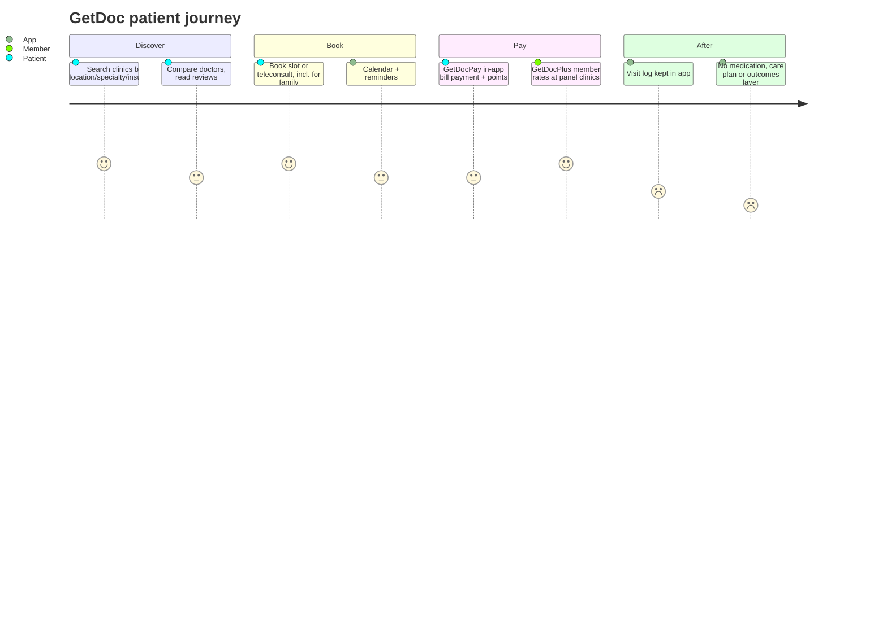

# GetDoc — Competitor Dossier

**Abstract.** GetDoc (getdoc.com / getdoc.co) is a clinic-discovery and appointment platform operated by Singapore-registered Jireh Group Pte Ltd, live in Malaysia and Singapore since 2015. It evolved from a booking directory into a low-cost healthcare-benefits membership (GetDocPlus, from ~S$6/year) plus a clinic payments product (GetDocPay), distributed through affinity partners (UOB, SAFRA, Automobile Association, student groups). It raised little (a reported US$1.6M round; no institutional follow-on), runs on a ~10-person team, and shows clear signs of product stagnation: its consumer Android app's last documented release was March 2021, and press coverage effectively stopped years ago. GetDoc matters to Welltech less as a competitor and more as evidence of how thin-margin directory/benefits models plateau in MY/SG — and as a reminder that "clinic network size" claims (400–1,200+ clinics) can persist on websites long after commercial momentum has gone.

Last updated: July 2026

Related dossiers: [BookDoc](bookdoc.md) · [Teleme](teleme.md) · [DoctorOnCall](doctoroncall.md) · [Speedoc](speedoc.md)
Related market context: [Malaysia market intelligence](../10-market-intelligence/malaysia-market-intelligence.md)

---

## 1. Company overview

| Item | Detail |
|---|---|
| Operator | Jireh Group Pte Ltd, Singapore (UEN 201134851W; registration live)[^1] |
| Product | GetDoc — clinic/doctor discovery, appointment & teleconsult booking; GetDocPlus benefits membership; GetDocPay clinic payments |
| Launched | Concept surfaced Feb 2015 (e27); consumer launch in Malaysia and Singapore, October 2015[^2][^3] |
| Founders / leadership | Woon Shung Toon (founder & CEO, serial entrepreneur); early co-founder Jerry Hang with Chris Ching as CMO — sources conflict (see §3)[^4][^2][^3] |
| Markets | Singapore, Malaysia (Thailand claimed in group materials)[^5] |
| Team size | ~10 employees (third-party estimate)[^6] |
| Funding | Reported US$1.6M (~2018); no institutional rounds recorded[^8][^1] |
| Revenue | ~US$3M (2025, aggregator estimate — unverified)[^6] |
| Status (July 2026) | Websites live; consumer app effectively unmaintained since ~2021; assessed as low-activity/harvest mode (§9) |

## 2. History & timeline

- **Feb 2015 — Debut coverage.** e27 profiles GetDoc as "Malaysia's latest labour of love in med-tech": three co-founders with 5+ years in the Malaysian medical community, concept in development since October 2014, targeting ~US$300K 2015 revenue and a US$500K seed raise.[^2]
- **Oct 2015 — Launch.** App launch in Malaysia and Singapore. Positioning: search nearby clinics, compare doctors by location, crowd-sourced reviews and insurance coverage, book instantly to skip queues.[^3]
- **Jul 2017 — GetDocPay.** In-app clinic bill payment trialled at ~100 clinics in Klang, with loyalty points redeemable for prizes. Platform then claimed 6,000+ doctors across SG/MY, ~1,200 clinics integrated for booking, and 40,000+ registered users.[^7]
- **~2018 — Reported raise.** A US$1.6M funding round is referenced in secondary profiles; no primary press release traceable; Crunchbase/Tracxn record no substantive round history.[^8][^1]
- **2019–2020 — GetDocPlus pivot.** Paid membership giving "members-only corporate rates" at panel clinics; launched in Malaysia January 2020; distributed via UOB (free 1-year membership for customers), SAFRA, AA and student schemes.[^9][^10][^11]
- **Apr 2021 — Last significant PR.** "Get doctors on GetDoc" (Enterprise IT News, reposted by Jireh Group) describing search, booking, teleconsult and GetDocPay.[^12]
- **Mar 2021 — Last documented Android release** (v4.14.14).[^19]
- **Oct 2024 — Still transacting.** Jireh Group "last seen on the Peppol e-invoicing network" October 2024; registration status live.[^1]

## 3. Founders & leadership

Reporting is inconsistent — itself a signal of how thin coverage is:

- **Woon Shung Toon** is listed as Founder & CEO of GetDoc/Jireh Group on The Org and staffing databases.[^4][^6]
- Vulcan Post's launch story credits **Jerry Hang** (ex-medical-supplies entrepreneur who had built and sold a business in the space) as the founder, with now-wife **Chris Ching** as CMO. Hang's stated motivation: he lost his father to colon cancer and believed earlier specialist access could have saved him.[^3][^2]
- Most plausible reconciliation: Woon leads the Jireh Group holding entity; Hang/Ching drove the GetDoc consumer brand early on. *(inference — sources conflict)*
- Jireh Group's wider portfolio: **Hippo** (health-tracking device + app), **Rapha Radiology** (radiology IT), **eLog**, and a "Jireh Health" app portal — a diversified small health-IT shop rather than a focused venture-scale startup.[^13][^5]

## 4. Funding & investors

| Event | Date | Amount | Source quality |
|---|---|---|---|
| Seed target announced | Feb 2015 | US$500K sought | e27 launch coverage[^2] |
| Funding round | ~2018 | US$1.6M reported | Secondary aggregator reference only; no lead investor named; no primary press[^8] |
| Any institutional round | — | None recorded | Crunchbase/Peachscore profiles effectively empty[^1][^8] |

- No government-grant announcements, no VC names, no valuation claims found in any press.
- **Analytical note:** GetDoc is essentially bootstrapped. Its economics must be judged by the membership/payments products' ability to self-fund a ~10-person multi-product team — which the app-stagnation evidence suggests is only barely happening.

## 5. Business model & revenue streams

| Stream | Mechanics | Pricing observed | Evidence |
|---|---|---|---|
| Clinic subscriptions | Doctors pay yearly to be listed/bookable; free for patients | Undisclosed | Vulcan Post[^3] |
| GetDocPlus membership | Discount card: members pay panel "corporate rates" | ~S$6/yr (some categories S$12/yr); GP consult S$15 + GST; dental scaling & polishing S$80 + GST; discounted specialist consults, screening, physio, optical, antenatal | Signup pages, YP.sg, rate-card PDFs[^9][^14] |
| Affinity distribution | Partners bundle free 1-year GetDocPlus | UOB cardholders, SAFRA, AA members, students | Partner pages[^10][^11] |
| GetDocPay | Clinic e-payments + loyalty points; marketed to clinics as "connecting your clinic to 22 million bank users" | Presumed MDR/fee share | GetDocPay pages, e27[^7][^15] |
| Teleconsult | Bookable within the flow; never marketed as a standalone paid product | — | Enterprise IT News[^12] |

Published panel rate cards even include the **Raffles Medical group** (GP and Raffles Health Screeners rates) — a genuinely strong panel name for a company this size.[^14]

### Network claims — all company-originated; note the dates

| Claim | Where | Year |
|---|---|---|
| 4,000+ doctors in Singapore | getdoc.com/singapore | current site[^16] |
| 6,000 doctors SG+MY; 1,200 booking-integrated; 40,000 registered users | e27 | 2017[^7] |
| 400+ clinics SG; 1,200 clinics MY | UOB partnership page | ~2020[^10] |
| "More than 1,000 clinics" | LinkedIn | undated[^17] |

The spread and the stale 2017 anchors suggest the panel has not been re-audited in years. None of these are transactable-supply counts.

## 6. Product & clinical workflow

**Patient flow:**

- Search → enquiry/booking → reminders → optional in-app payment → visit log; booking on behalf of family members is supported.[^16][^12][^18]
- **GetDocPlus flow:** sign up (partner promo code or paid) → show membership at panel clinic → pay published member rates. This is a discount-card model, not managed care: no triage, no care coordination, no medication delivery, no outcomes tracking.
- **Clinical depth: none.** GetDoc employs no doctors, holds no notable clinical licences, and does not deliver care — it brokers discovery, discounts and payments.

## 7. Technology & AI

- Android app `com.jireh.goseedoc` ("GetDoc - Search and Appointment"); iOS app id987814486; a separate "GetDoc Prime" app exists on Google Play.[^19][^20]
- **Update recency — the clearest red flag.** The last documented Android release is v4.14.14, 9 March 2021.[^19] (A same-named document-management product by the group shows v4.14.4 in software directories — brand hygiene is poor.[^21])
- Jireh Group's stated direction is IoT personal-health devices plus cloud platforms (Hippo tracker, Jireh Health portal).[^5][^13]
- **No AI claims anywhere.** No triage bots, no analytics products, no LLM features.
- **No WhatsApp workflow found** — contact is via web forms and in-app enquiry.[^22]
- A development subdomain (`dev.getdoc.co`) is indexed by search engines and serves live-looking country pages — sloppy technical housekeeping consistent with a skeleton team.[^23]

## 8. Marketing & positioning

- Mission language: "enrich 100 million lives by delivering a better healthcare experience."[^17] In practice: a utility directory + discount membership.
- **SEO:** country landing pages (Singapore/Malaysia) target "find doctors / book appointment" queries.[^16]
- **Content:** health-article content marketing in earlier years; GetDoc appears in third-party "medical apps in Malaysia" listicles (TallyPress, mirrored by Doc2US) but blog/PR output effectively ceased after ~2021.[^24][^12]
- **Social:** Instagram (@getdocsg) exists; no evidence of significant follower counts or recent campaigns surfaced in searches.[^25]
- Press footprint concentrated 2015–2017 (e27, Vulcan Post, Digital News Asia); nothing meaningful since.[^2][^3][^26]

## 9. Reviews, reputation & status assessment

| Signal | Finding | Reading |
|---|---|---|
| App reviews / ratings | No notable rating or install visibility in search results | Minimal consumer usage |
| Reddit / Lowyat / forums | No meaningful threads found *(absence-of-evidence, Jul 2026)* | Low mindshare in both markets |
| App maintenance | Last documented release Mar 2021[^19] | ~5 years without visible product investment |
| Corporate signs of life | Peppol transaction Oct 2024; registration live[^1] | Entity operating, likely on B2B/benefits contracts |
| Web estate | Sites live incl. rate cards; dev subdomain indexed[^14][^23] | Maintained at minimum viable level |

**Verdict: quasi-dormant / harvest mode.** Not formally dead — websites, membership schemes and partner pages are live — but the consumer platform has had no visible product investment for roughly five years, no funding, no press, and a ~10-person team spread across multiple product lines. This is the classic quiet-stall pattern of first-generation MY/SG health directories: the company survives on GetDocPlus affinity contracts and Jireh's other lines (radiology IT, devices) while the flagship app decays.

## 10. Strengths & weaknesses

**Strengths**

1. Cheap, plausibly self-sustaining benefits product (GetDocPlus) with real affinity distribution — UOB, SAFRA, AA are hard logos for a micro-startup to win.[^10][^11]
2. Published panel rate cards including the Raffles Medical network.[^14]
3. Dual-market (SG+MY) presence and a payments footprint in clinics (GetDocPay).[^7]
4. Very low burn; survived a decade unfunded.

**Weaknesses**

1. No capital, ~10 staff, attention split across four-plus product lines.[^6][^5]
2. Consumer app unmaintained since 2021; brand effectively invisible.[^19]
3. Network claims stale (2017-era anchors) and unauditable.[^7][^16]
4. No clinical services, no pharmacy, no telehealth depth, no AI; founder narrative muddled across sources.

## 11. SWOT

| | Helpful | Harmful |
|---|---|---|
| **Internal** | Affinity distribution; Raffles-grade panel rates; low cost base; payments rails in clinics | Zero product velocity; no capital; no clinical assets; skeleton team; brand confusion |
| **External** | Sell/licence panel network + membership book to an insurer or scaled telehealth player; SME employee-benefits packaging | Singapore's free national booking layer (health.gov.sg same-day GP booking) erodes directory value[^27]; scaled players (Doctor Anywhere, [Speedoc](speedoc.md), [DoctorOnCall](doctoroncall.md)) bundle discovery + telehealth + delivery; app-store delisting risk from stale binaries |

## 12. Implications for Welltech

1. **Directory + discount-card models plateau at sub-scale in MY/SG.** GetDoc executed the "ZocDoc + benefits card" playbook competently and still flatlined at a ~10-person lifestyle business. Welltech should not treat clinic discovery or panel-rate discounting as a growth engine — only as an acquisition hook attached to actual care delivery.
2. **Affinity-channel distribution is available and underpriced.** GetDoc got UOB, SAFRA and AA to distribute a S$6/year membership. The same channel types (banks, membership clubs, universities) are plausible low-CAC routes for Welltech's screening/longevity entry products — with a far stronger clinical offer behind them.
3. **Audit competitors' network claims by date, not size.** GetDoc's 400/1,200/4,000/6,000 figures trace to 2017-era marketing. When Welltech benchmarks "provider network" claims regionally, insist on transactable (booking-integrated, revenue-generating) counts and claim dates. Apply the same discipline to [BookDoc's](bookdoc.md) "40,000 providers."
4. **Watch for asset availability, not competition.** GetDoc's clinic panel, membership book, and GetDocPay clinic relationships are more interesting as acquirable assets or partnership shortcuts (instant MY/SG panel coverage) than as a competitive threat. A small cash offer to a bootstrapped, stalled founder team could buy years of panel-building.
5. **Operational hygiene is a trust signal in healthcare.** Indexed dev subdomains and decade-old rate PDFs are the kind of decay diligence teams and corporate buyers notice. Welltech's public estate should be audited quarterly precisely because competitors' decay is this visible.

---

## References

[^1]: SGPBusiness, "JIREH GROUP PTE. LTD. (201134851W)" (registration, live status, Peppol last-seen Oct 2024), https://www.sgpbusiness.com/company/Jireh-Group-Pte-Ltd; Crunchbase, "GetDoc by Jireh Group", https://www.crunchbase.com/organization/getdoc-enterprise (accessed July 2026).
[^2]: e27, "GetDoc is Malaysia's latest labour of love in med-tech", 9 Feb 2015, https://e27.co/getdoc-is-malaysias-latest-labour-of-love-in-med-tech-20150209/ (mirrored by MaGIC News, https://mymagic.my/news/getdoc-is-malaysias-latest-labour-of-love-in-med-tech/) (accessed July 2026).
[^3]: Vulcan Post, "GetDoc: Book Doctor's Appointments In Singapore Via App" (Oct 2015 MY+SG launch; Hang/Ching roles; clinic yearly subscription model), https://vulcanpost.com/418241/getdoc-doctor-appointment-app-trillion-dollar-healthcare-industry/ (accessed July 2026).
[^4]: The Org, "Woon Shung Toon — Founder & CEO at GetDoc by Jireh Group", https://theorg.com/org/getdoc-by-jireh-group/org-chart/woon-shung-toon and https://theorg.com/org/getdoc-by-jireh-group (accessed July 2026).
[^5]: Jireh Group Pte Ltd corporate site (portfolio: GetDoc, Hippo, Rapha Radiology, eLog; IoT + cloud healthcare focus; SG/MY/TH presence; founded 2015), https://www.jirehgroup.asia/ and https://www.jirehgroup.asia/our-team/ (accessed July 2026).
[^6]: RocketReach, "GetDoc, a Jireh Group company" (≈10 employees; ~US$3M 2025 revenue estimate), https://rocketreach.co/getdoc-a-jireh-group-company-profile_b5a77e1ef68f10a7 (accessed July 2026).
[^7]: e27, "Malaysian medtech platform GetDoc now allows clinics to accept e-payments", 24 Jul 2017 (GetDocPay Klang trial ~100 clinics; loyalty points; 6,000 doctors; 1,200 integrated; 40,000 users), https://e27.co/malaysian-medtech-platform-getdoc-now-allows-clinics-accept-e-payments-20170724/; Yahoo News SG mirror, https://sg.news.yahoo.com/malaysian-medtech-platform-getdoc-now-allows-clinics-accept-081232921.html (accessed July 2026).
[^8]: Peachscore, "GetDoc by Jireh Group — Company Profile & Funding" (reference to a US$1.6M round, ~2018), https://app.peachscore.com/company/getdoc-by-jireh-group (accessed July 2026).
[^9]: GetDocPlus membership signup pages (pricing tiers, member rates), https://plus.getdoc.com/member_signup/students and https://plus.getdoc.com/member_signup/aas/; YP SG, "They Are Leveraging Technology To Provide You Better Healthcare For As Cheap As $6 A Year", https://www.yp.sg/getdoc-technology/ (accessed July 2026).
[^10]: GetDoc, "GetDocPlus for all UOB customers! | GetDoc X UOB" (free 1-year membership; 400+ SG clinics, 1,200 MY clinics; redemption via UOB Health & Beauty Privileges promo codes), https://www.getdoc.com/getdoc-x-uob/ (accessed July 2026).
[^11]: GetDoc, "SAFRA members: Complimentary GetDocPlus Membership", https://www.getdoc.com/safra-getdocplus/; GetDocPlus SAFRA signup, https://plus.getdoc.com/member_signup/safra/; Jireh Group, "GetDocPlus is now available in Malaysia" (2 Jan 2020), https://www.jirehgroup.asia/2020/01/02/getdocplus-is-now-available-in-malaysia/ (accessed July 2026).
[^12]: Enterprise IT News (reposted by Jireh Group, 7 Apr 2021), "Get doctors on GetDoc" (search, booking, teleconsult, GetDocPay; >1,000 clinics), https://www.jirehgroup.asia/2021/04/07/get-doctors-on-getdoc/ and https://www.enterpriseitnews.com.my/get-doctors-on-getdoc/ (accessed July 2026).
[^13]: GetDoc/Jireh, "Your Personal Health & Fitness Partner | Hippo by GetDoc", http://www.dev.getdoc.co/hippo/; Jireh Health portal, https://app.jireh-health.com/ (accessed July 2026).
[^14]: GetDocPlus rate cards (PDF), "Raffles Medical — GetDocPlus Rates" (GP consult S$15 + GST; dental scaling S$80 + GST) and "Raffles Health Screeners — GetDocPlus Rates", https://d1r8e0qvww158m.cloudfront.net/uploaded/clinic/gdp-rates-RMG-GP.pdf and https://d1r8e0qvww158m.cloudfront.net/uploaded/clinic/gdp-rates-RMG-RHS.pdf (accessed July 2026).
[^15]: GetDocPay pages, "Pay Your Medical Bill, The Easy Way" and "Connecting Your Clinic to 22 Millions Bank Users!", https://www.getdoc.com/pay/ and https://www.getdoc.com/pay/mydoctor/; T&Cs, https://www.getdoc.com/pay/terms-conditions/ (accessed July 2026).
[^16]: GetDoc Singapore landing page ("search from over 4,000 doctors in Singapore"), https://www.getdoc.com/singapore/; Malaysia page, https://www.getdoc.com/malaysia/ (accessed July 2026).
[^17]: LinkedIn, "GetDoc, a Jireh Group company" (mission; >1,000 clinics claim), https://www.linkedin.com/company/getdoc (accessed via search excerpts, July 2026).
[^18]: Google Play, "GetDoc - Search and Appointment" (features incl. booking for family members), https://play.google.com/store/apps/details?id=com.jireh.goseedoc (accessed via search excerpts, July 2026).
[^19]: APKFollow, "GetDoc - Search and Appointment Booking Apk 4.14.14" (released 09-03-2021 — last documented Android release), https://www.apkfollow.com/app/getdoc-search-and-appointment-booking/com.jireh.goseedoc/ (accessed July 2026).
[^20]: Apple App Store, "GetDoc" (id987814486), https://apps.apple.com/my/app/getdoc/id987814486; Google Play, "GetDoc Prime", https://play.google.com/store/apps/details?id=com.getdoc.prime.app (accessed July 2026).
[^21]: UpdateStar software directory, "GetDoc — Jireh Group, v4.14.4", https://getdoc.updatestar.com/en (accessed July 2026).
[^22]: GetDoc, "Contact Us", https://www.getdoc.com/contact-us/ (accessed July 2026).
[^23]: Indexed development subdomain, "GetDoc | Find Doctors, Clinics and Make an Appointment in Malaysia", http://www.dev.getdoc.co/malaysia/ (accessed July 2026).
[^24]: TallyPress, "6 Medical Apps Available in Malaysia", https://tallypress.com/fun/6-medical-apps-available-in-malaysia/; Doc2US newsroom mirror, https://www.doc2us.com/index.php/newsroom/6-medical-apps-available-in-malaysia (accessed July 2026).
[^25]: Instagram, "GetDoc (Singapore) (@getdocsg)", https://www.instagram.com/getdocsg/ (accessed July 2026).
[^26]: Digital News Asia, "Reimagining healthcare services with GetDoc", https://www.digitalnewsasia.com/startups/reimagining-healthcare-services-getdoc (accessed July 2026).
[^27]: Singapore MOH Health Appointment System, "Same-day doctor appointments at over 800 clinics", https://book.health.gov.sg/ (accessed July 2026).
