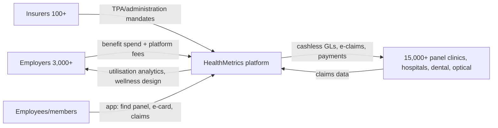

# Competitor Dossier: HealthMetrics (HealthMetrics Sdn Bhd)

**Abstract.** HealthMetrics (healthmetrics.com) is Malaysia's leading *digital* third-party administrator (TPA): a cloud platform through which employers and insurers administer employee outpatient/inpatient medical benefits across a cashless panel-clinic network. Founded in 2015 in Subang Jaya by pharmacist-turned-entrepreneur Alvin Yuan and co-founder Advent Phang, it raised a US$5m (RM20.8m) Series A from Japan's ACA Investments in 2020 (total disclosed funding ~US$6.6m by 2022; no Series B verified), acquired Indonesia's Across Asia Assist (2022) and relaunched it as HealthMetrics Indonesia (April 2025). Current claimed scale: 100+ insurers, 3,000+ corporate clients, 15,000+ healthcare providers across Malaysia, Singapore and Indonesia, with cumulative medical treatments processed on the platform on track to pass US$1bn by end-2025. HealthMetrics is not a care provider — it owns no clinics and employs no doctors — which makes it primarily a **B2B2C distribution rail** for Welltech's corporate channel (screening, weight-loss/GLP-1 programmes, preventive memberships as employer benefits) rather than a head-on competitor. The competitive risk is second-order: its data position and employer relationships let it steer corporate wellness spend, and it is moving up the value chain into wellness-programme design.

Last updated: July 2026

Related documents: [Klinik Mesra & GP chains](klinik-mesra-gp-chains.md) · [Naluri](naluri.md) · [Qmed Asia](qmed-asia.md) · [DoctorOnCall](doctoroncall.md) · [Malaysia private healthcare](../10-market-intelligence/malaysia-private-healthcare.md) · [Research standards](../RESEARCH-STANDARDS.md)

---

## 1. Snapshot

| Item | Detail |
|---|---|
| Legal entity | HealthMetrics Sdn Bhd, HQ Subang Jaya, Selangor[^1][^2] |
| Founded | 2015[^1][^3] |
| Founders | Alvin Yuan (co-founder & CEO, pharmacist by training) and Advent Phang[^3][^4][^5] |
| Category | Corporate-health-benefits platform / digital TPA (managed-care organisation tech) |
| Model | SaaS + TPA: employers/insurers pay to administer benefits; cashless panel network of clinics/hospitals; claims adjudication and analytics |
| Funding | Seed 2018 (Spiral Ventures, Cradle Fund, RHL Ventures); Series A 2020: US$5m / RM20.8m led by ACA Investments (Japan/Singapore); ~US$6.6m (RM30.7m) total disclosed by Sep 2022. **No completed Series B verified as of July 2026**[^3][^6][^7][^8][^9] |
| M&A | Strategic investment in / acquisition of Across Asia Assist (AAA) Indonesia, announced Sep 2022; rebranded HealthMetrics Indonesia, Apr 2025[^10][^11][^12] |
| Scale (2025–26 claims) | 100+ insurers; 3,000+ corporate clients; 15,000+ healthcare providers; on track to exceed US$1bn cumulative medical treatments processed by end-2025[^13][^14] |
| Scale (2021 baseline) | 5,000+ healthcare partners; 200,000 corporate members; 2,500 corporate clients (Malaysia + Singapore)[^2][^10] |
| Markets | Malaysia (core), Singapore (since ~2021), Indonesia (via AAA, relaunched 2025)[^2][^12][^13] |
| Pricing | Not published; enterprise/negotiated (see §6) |
| Care delivery | None owned — platform sits above third-party clinics/hospitals |

---

## 2. Company overview and history

HealthMetrics was built around a payer-side thesis: employers — not insurers — are Malaysia's real out-of-pocket spenders on outpatient employee healthcare, yet they administered benefits with paper GLs, chits and Excel. Yuan's stated mission is "to address rising healthcare expenditure by helping organisations optimise their healthcare spending" and, longer-term, to "restore bargaining power to organisations, the real payers".[^4][^5]

| Period | Event |
|---|---|
| 2015 | Founded by Alvin Yuan and Advent Phang, Selangor[^3][^5] |
| 2018 | Seed round: Spiral Ventures, Cradle Fund, RHL Ventures[^3][^9] |
| 2018–2020 | Claims ~500% revenue growth over two years pre-Series A[^7] |
| 2020 | Series A: US$5m (RM20.8m) led by ACA Investments (Japanese fund manager, ~US$1bn AUM), for SEA expansion[^6][^7][^8] |
| 2021 | Establishes Singapore presence; reaches 5,000+ healthcare partners, 200k corporate members, 2,500 corporate clients[^2][^10] |
| Sep 2022 | Strategic investment into Across Asia Assist Indonesia (regional TPA/medical-assistance firm); amount undisclosed; stated goal >2m members/policyholders and international cashless treatment for Malaysian corporate clients[^10][^11]. Total disclosed funding at this point ~US$6.6m[^6] |
| Apr 2025 | AAA rebrands as **HealthMetrics Indonesia**; launches HealthMetrics Cloud Platform, Global Member App, International Assistance Hub; positions Malaysia as regional hub, tying narrative to "Indonesia Emas 2045"[^12][^13][^15][^16] |
| 2025 | States it will exceed **US$1bn in cumulative medical treatments processed** since launch by end-2025[^13][^14] |

Two structural observations. First, funding is modest (~US$6.6m disclosed) for the scale claimed — like Qmed Asia (see [qmed-asia.md](qmed-asia.md)), this is a capital-light B2B operator monetising unglamorous administrative pain, not a venture-subsidised consumer play. Second, the AAA deal moved HealthMetrics from "benefits SaaS" to a genuine regional TPA with medical-assistance capability — a heavier, more regulated, more defensible position.

---

## 3. Founders and leadership

| Person | Role | Background |
|---|---|---|
| Alvin Yuan | Co-founder & CEO | Pharmacist by training; career across healthcare, financing, business management, economics, technology; Tatler Gen.T-featured; public face in podcasts and media[^4][^5][^17] |
| Advent Phang | Co-founder | Co-established the company in 2015; lower public profile[^3][^5] |

Yuan personally fronted the 2025 Indonesia launch, framing HealthMetrics as building a "borderless healthcare ecosystem" with Malaysia as the administrative hub.[^5][^13]

---

## 4. Business model and product

### 4.1 Who pays whom

### 4.2 Product lines (as marketed 2025–26)

| Module | What it does | Welltech relevance |
|---|---|---|
| Digital TPA core | Benefit-plan configuration, cashless visits, e-GL, claims adjudication, payments, real-time utilisation dashboards[^1][^2] | The rail corporate outpatient money runs on |
| Insurance module | Group-policy administration for insurers; positioned as alternative for employers who self-fund rather than insure[^18] | Self-funded employers are direct buyers of health programmes |
| Employee/member apps | "HealthMetrics Employee App" (legacy) and "HealthMetrics Global" app: find panel, benefits balance, e-card, directions[^19][^20] | The member touchpoint Welltech would appear in if empanelled |
| Health screening / pre-employment | Customisable test menus, employer dashboard for results, work-pass medicals (SG)[^21][^22] | Directly adjacent to Welltech screening; HealthMetrics aggregates demand but does not perform tests |
| Wellness & prevention | Tailored wellness programmes designed off claims-data "early risk indicators"[^1][^22] | The move up the value chain — closest thing to a competitive overlap |
| International Assistance Hub (2025) | Cross-border cashless treatment and medical assistance via Indonesia arm[^13][^15] | Signals regional payer ambitions |

Telemedicine is not marketed as an owned product; the platform integrates third-party care rather than delivering it.[^22] *(inference from absence in product marketing — a partnership surface for telehealth providers.)*

### 4.3 Technology and AI

The stack is cloud-native ("HealthMetrics Cloud Platform", 2025) with real-time claims data as the asset; marketing emphasises analytics and early-risk identification rather than named AI/LLM features.[^1][^13] No evidence found of WhatsApp-native workflows — member interaction is app- and portal-led, with a Zendesk help centre.[^19][^23] By Welltech's standards (WhatsApp-first, AI-native ops) HealthMetrics is a systems-of-record company, not a conversational-AI company.

---

## 5. Scale metrics — reconciliation

Claimed figures move across sources and dates; treat the 2025 set as company claims, not audited numbers.

| Metric | 2021 (SG entry) | 2022 (AAA deal) | 2025–26 (site/press) | Sources |
|---|---|---|---|---|
| Corporate clients | 2,500 | — | 3,000+ | [^2][^10][^13] |
| Members | 200,000 | target >2m incl. AAA policyholders | not restated separately | [^2][^10] |
| Healthcare providers | 5,000+ | — | 15,000+ | [^2][^13] |
| Insurers | — | — | 100+ | [^13][^14] |
| Cumulative treatments processed | — | — | ~US$1bn by end-2025 (claim) | [^13][^14] |

The jump from 200k members (2021) to a ">2m members and policyholders" ambition (2022) rests on consolidating AAA's Indonesian policyholder base, not organic Malaysian growth — the two should not be conflated.[^10] The US$1bn figure is *cumulative since 2015*, i.e. flow through the rail, not revenue.[^14]

---

## 6. Pricing

Not published anywhere found — no rate card on healthmetrics.com; sales-led enterprise contracting.[^1] For contrast, regional competitor Mednefits publishes a freemium/per-employee-per-month SaaS model.[^24] *(analyst estimate: HealthMetrics economics likely blend per-member-per-month platform fees, per-claim administration fees, and insurer TPA mandates — standard TPA structure; unverified.)*

---

## 7. Competitive set (benchmark)

| Player | Type | Scale markers | vs HealthMetrics |
|---|---|---|---|
| **PMCare** | Incumbent TPA/MCO (est. 1995) | 2,000+ clients since inception; 8,000+ provider network[^25][^26] | Older, insurer-embedded, less product-led; HealthMetrics positions as the "digital" alternative |
| **MiCare** | Incumbent TPA (MyMed app) | Major insurer mandates (e.g. AmMetLife claims administration from Sep 2023)[^27] | Insurer-channel heavyweight; app-enabled but legacy TPA DNA |
| **Mednefits** | SG/MY benefits SaaS | 7,000+ providers SG+MY; published freemium pricing[^24][^28] | SME-focused, transparent pricing; smaller enterprise presence |
| **Naluri** | Digital health coaching (see [naluri.md](naluri.md)) | Employer/insurer channel | Complement/competitor for wellness-programme budget, not for TPA rails |
| Insurer in-house (AIA, Allianz etc.) | Payer-owned programmes | Vitality-type engagement, insurer telehealth tie-ups[^29] | Insurers can disintermediate TPAs for insured (not self-funded) books |

HealthMetrics' wedge against the incumbents is real-time cloud UX and employer-facing analytics; its exposure is that PMCare/MiCare own deeper insurer relationships and that self-funded-employer budgets are contestable by benefits platforms and brokers alike.[^25][^26][^27]

---

## 8. Marketing channels and review themes

**Marketing.** Content-led B2B: HR-guide articles ("Guide to employee health benefits in Malaysia"), newsroom PR, LinkedIn, HR-media placements (Human Resources Online), CEO profile press (Tatler, Galen Growth, podcasts), and event-driven launches (Indonesia 2025).[^4][^5][^17][^30] No consumer advertising — members arrive via their employer.

**Review themes.** No public employer-side review corpus found (B2B contracts). Member-side signal comes from the Google Play "HealthMetrics Employee App":[^19]
- Panel-finder frustration: cannot search clinics by name; postcode search omits town names.
- Data-accuracy complaints: listed services (e.g. X-ray) not actually available at clinics; listed operating hours wrong ("most clinics listed 10pm closing but only one or two actually open"); hospitals intermittently missing from listings.
- Incomplete panel listings acknowledged in the company's own help centre (workarounds for panel search).[^23]

The pattern — a strong employer-facing platform with a weaker member experience — is the classic TPA shape, and exactly the gap a service-obsessed, WhatsApp-first operator can exploit or complement.

---

## 9. Strengths and weaknesses

**Strengths**
1. Employer distribution at scale: 3,000+ corporate clients is one of Malaysia's largest direct-to-HR footprints in health.[^13]
2. Claims-data moat: longitudinal utilisation data across 15,000+ providers enables risk analytics competitors lack.[^1][^13]
3. Capital-efficient, revenue-funded growth; survived without mega-rounds.[^6][^7]
4. Regional rails (MY/SG/ID) plus international-assistance capability post-AAA.[^12][^13]
5. Neutral position — owns no clinics, so providers empanel willingly.

**Weaknesses**
1. Member experience is thin and criticised (panel-finder accuracy, stale data).[^19][^23]
2. No clinical capability — cannot itself deliver the preventive, weight-loss or chronic-care programmes its data says employers need.
3. Modest funding limits pace against insurer-backed rivals and regional benefits platforms.[^6]
4. Wellness offering is analytics-plus-coordination, not outcomes-owned care.[^22]
5. TPA margins invite squeeze from both insurers (in-housing) and clinics (fee disputes — a live industry tension).[^26]

---

## 10. SWOT (HealthMetrics vs a Welltech corporate channel)

| | Helpful | Harmful |
|---|---|---|
| **Internal** | **S:** 3,000+ employer relationships; claims-data analytics; cashless rails across MY/SG/ID; neutral non-provider status | **W:** no care delivery; weak member UX; no WhatsApp/conversational layer; limited capital |
| **External** | **O:** employers demanding NCD/GLP-1/prevention programmes their TPA cannot deliver — partner slot open; insurer digitisation mandates | **T:** insurers in-housing TPA functions; Mednefits-style transparent SaaS pricing; benefits budgets shifting to outcome-owning providers (Naluri, Welltech-type operators) |

---

## 11. Implications for Welltech

1. **Verdict: PARTNER (priority), monitor as second-order competitor.** HealthMetrics is the single most efficient B2B2C rail into Malaysian employer-funded healthcare: empanelment puts Welltech's clinics/telehealth inside the app and cashless flow of 3,000+ employers without Welltech building an HR salesforce. Care Clinics-style provider empanelment pages show the onboarding path exists today.[^31]
2. **Sell what the rail cannot make.** HealthMetrics markets "wellness and prevention strategies" but owns no clinical delivery.[^22] Welltech's GLP-1 weight-loss, screening-plus-follow-through and preventive-membership programmes are precisely the productised interventions HealthMetrics could retail to its employer base — structure as revenue-share programmes triggered by their own risk analytics.
3. **Exploit the member-experience gap.** TPA members complain about panel discovery and dead-end data.[^19] A Welltech WhatsApp-first concierge layer (booking, triage, follow-up) inside an employer programme is differentiation HealthMetrics cannot quickly copy — it strengthens, not threatens, the partnership case.
4. **Do not compete for TPA rails.** Claims adjudication is low-margin, incumbent-heavy (PMCare, MiCare) and regulatorily entangled; building it would burn capital for no strategic gain.
5. **Hedge the channel.** HealthMetrics' move up the value chain (wellness design) means it could later favour in-house or exclusive programmes. Mitigate by also empanelling with PMCare/MiCare/Mednefits and selling direct to self-funded employers — no single-rail dependence.

---

## References

[^1]: HealthMetrics, "Optimising Healthcare Costs for All" (homepage), https://healthmetrics.com/ (accessed July 2026; direct fetch blocked, content via search index).
[^2]: Digital News Asia, "Malaysia's HealthMetrics makes strategic investment into Indonesia's Across Asia Assist", https://www.digitalnewsasia.com/business/malaysias-healthmetrics-makes-strategic-investment-indonesias-across-asia-assist (accessed July 2026).
[^3]: The Edge Malaysia, "HealthMetrics secures RHL Ventures' participation in seed round", https://theedgemalaysia.com/article/healthmetrics-secures-rhl-ventures-participation-seed-round (accessed July 2026).
[^4]: Galen Growth, "Meet the CEO: HealthMetrics Is Helping Corporates Optimise Healthcare Expenses", https://www.galengrowth.com/meet-the-ceo-healthmetrics-is-helping-corporates-optimise-healthcare-expenses/ (accessed July 2026).
[^5]: Tatler Asia, "Malaysia's HealthMetrics is bridging the gap between businesses and healthcare providers in Southeast Asia", https://www.tatlerasia.com/gen-t/leadership/how-this-health-tech-founder-is-streamlining-healthcare-for-the-southeast-asian-market (accessed July 2026).
[^6]: Crunchbase, "HealthMetrics — Company Profile & Funding", https://www.crunchbase.com/organization/healthmetrics (accessed July 2026).
[^7]: Vulcan Post, "After Growing Revenue By 500% In 2 Years, HealthMetrics Gets Fresh Funding Of RM20.8mil", https://vulcanpost.com/716327/healthmetrics-malaysia-healthtech-startup-series-a-funding/ (accessed July 2026).
[^8]: Digital News Asia, "Malaysia's HealthMetrics Secures US$5 mil Series A from Japan's ACA Investments", https://www.digitalnewsasia.com/startups/malaysias-healthmetrics-secures-us5-mil-series-japans-aca-investments (accessed July 2026).
[^9]: MobiHealthNews, "Malaysia's HealthMetrics scores $5M in Series A funding", https://www.mobihealthnews.com/news/asia/malaysias-healthmetrics-scores-5m-series-funding (accessed July 2026).
[^10]: HealthMetrics Newsroom, "HealthMetrics Makes Strategic Investment in Across Asia Assist", https://healthmetrics.com/newsroom/healthmetrics-makes-strategic-investment-in-across-asia-assist (accessed July 2026).
[^11]: The Edge Malaysia, "Cloud platform HealthMetrics secures US$5 million in Series A funding", https://theedgemalaysia.com/article/cloud-platform-healthmetrics-secures-us5-million-series-funding (accessed July 2026).
[^12]: Digital News Asia, "HealthMetrics rebrands Indonesian operations to HealthMetrics Indonesia, launches new solutions to strengthen its digital TPA foundation", https://www.digitalnewsasia.com/startups/healthmetrics-rebrands-indonesian-operations-healthmetrics-indonesia-launches-new-solutions (accessed July 2026).
[^13]: HealthMetrics Newsroom, "HealthMetrics Launches in Indonesia to Support Indonesia Emas 2045 and Build a Borderless Healthcare Ecosystem", https://healthmetrics.com/newsroom/healthmetrics-launches-in-indonesia-to-support-indonesia-emas-2045-and-build-a-borderless-healthcare-ecosystem (accessed July 2026).
[^14]: The Exchange Asia, "HealthMetrics Eyes US$1 Billion Milestone with Indonesia Launch", https://theexchangeasia.com/healthmetrics-eyes-us1billion-milestone-with-indonesia-launch/ (accessed July 2026).
[^15]: TNGlobal (TechNode Global), "Malaysia's digital third-party administrator HealthMetrics launches in Indonesia" (21 Apr 2025), https://technode.global/2025/04/21/malaysias-digital-third-party-administrator-healthmetrics-launches-in-indonesia/ (accessed July 2026).
[^16]: VOI, "HealthMetrics Present In Indonesia, Create An Integrated Digital Health Ecosystem", https://voi.id/en/technology/476321 (accessed July 2026).
[^17]: HealthMetrics Careers, "Spotlight Q&A with CEO and founder of HealthMetrics, Alvin Yuan", https://careers.healthmetrics.com/culture/spotlight-qa-with-ceo-and-founder-of-healthmetrics-alvin-yuan/ (accessed July 2026).
[^18]: HealthMetrics, "HealthMetrics Insurance — Your Partner in Group Health Insurance Administration", https://healthmetrics.com/insurance (accessed July 2026, via search index).
[^19]: Google Play, "HealthMetrics Employee App" (listing and user reviews), https://play.google.com/store/apps/details?id=com.healthmetrics.App&hl=en_SG (accessed July 2026).
[^20]: Google Play, "HealthMetrics Global", https://play.google.com/store/apps/details?id=com.healthmetrics.app.global&hl=en (accessed July 2026).
[^21]: HealthMetrics, "HealthMetrics Pre-Employment", https://healthmetrics.com/healthmetrics-pre-employment (accessed July 2026, via search index).
[^22]: HealthMetrics, "Why is Employees Health Screening Important for Businesses?", https://healthmetrics.com/article/why-is-employees-health-screening-important-for-businesses (accessed July 2026, via search index).
[^23]: HealthMetrics Help Centre (Zendesk), "I can't look for panel clinics around me using the HealthMetrics mobile app…", https://helpcentre-healthmetrics.zendesk.com/hc/en-gb/articles/30686737574809 (accessed July 2026).
[^24]: Mednefits, "Pricing — Free Employee Medical Benefits Platform", https://www.mednefits.com/pricing (accessed July 2026).
[^25]: PMCare, corporate homepage ("pioneer and leading Third Party Administrator (TPA) in Malaysia"), https://www.pmcare.com.my/ (accessed July 2026).
[^26]: CodeBlue (Galen Centre), "PMCare Advocates For Doctors, TPA More Than 'Middleman'" (Nov 2025), https://codeblue.galencentre.org/2025/11/pmcare-advocates-for-doctors-tpa-more-than-middleman/ (accessed July 2026).
[^27]: AmMetLife, "Change of Medical Claims TPA with FAQ and MiCare MyMed App User Guide", https://www.ammetlife.com/content/dam/metlifecom/my/homepage/support/tpa-ihp-malaysia/Change-of-Medical-Claims-TPA-with-FAQ-and-MiCare-MyMed-App-User-Guide-FINAL.pdf (accessed July 2026).
[^28]: Mednefits, "Medical Benefits for Employees — Malaysia (guide)", https://f.hubspotusercontent10.net/hubfs/2705714/Medical%20Benefits%20for%20Employees%20-%20Malaysia%20|%20Mednefits.pdf (accessed July 2026).
[^29]: Allianz, "Coronavirus: Doctors on Call — telehealth services", https://www.allianz.com/en/mediacenter/news/business/life_health/200406_Allianz-coronavirus-telehealth-services-doctors-on-call.html (accessed July 2026).
[^30]: Human Resources Online, "The top 3 medical benefits provided by Malaysia and Singapore employers", https://www.humanresourcesonline.net/the-top-3-medical-benefits-provided-by-malaysia-and-singapore-employers (accessed July 2026).
[^31]: Care Clinics Group, "TPA and Insurance — Health Metric", https://careclinics.com.my/tpa-and-insurance/health-metric/ (accessed July 2026).
