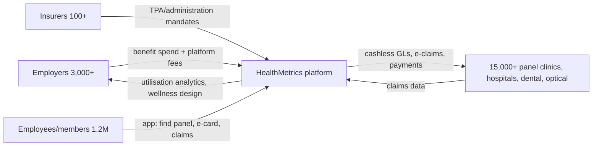

# Competitor Dossier: HealthMetrics (HealthMetrics Sdn Bhd)

**Abstract.** HealthMetrics (healthmetrics.com) is Malaysia's leading *digital* third-party administrator (TPA): a cloud platform through which employers and insurers administer employee outpatient/inpatient medical benefits across a cashless panel-clinic network. Founded in 2015 in Subang Jaya by pharmacist-turned-entrepreneur Alvin Yuan and CTO co-founder Advent Phang, it has raised roughly USD 15–17M in disclosed funding — USD 1M seed (2018: Spiral Ventures, Cradle, RHL Ventures), USD 5M Series A (2020, led by Japan's ACA Investments), and unannounced later rounds through 2024 involving Infocom, Artem Ventures, Daiwa Corporate Investment and the Khazanah-backed Gobi Dana Impak fund. Investors sometimes attributed to it — TNB Aura, SBI, Global Brain, MSW Ventures — could **not** be verified. It acquired Indonesia's Across Asia Assist (2022) and relaunched it as HealthMetrics Indonesia (April 2025). Current claimed scale: 100+ insurers, 3,000+ corporate clients, 1.2 million corporate members, 15,000+ healthcare providers across Malaysia, Singapore and Indonesia, with cumulative medical treatments processed on the platform on track to pass USD 1B by end-2025. HealthMetrics is not a care provider — it owns no clinics and employs no doctors — which makes it primarily a **B2B2C distribution rail** for Welltech's corporate channel (screening, weight-loss/GLP-1 programmes, preventive memberships as employer benefits) rather than a head-on competitor. The competitive risk is second-order: its data position and employer relationships let it steer corporate wellness spend, and it is moving up the value chain into wellness-programme design. Verdict: partner.

Last updated: July 2026

Related documents: [Naluri](naluri.md) · [Qmed Asia](qmed-asia.md) · [DoctorOnCall](doctoroncall.md) · [Malaysia private healthcare](../10-market-intelligence/malaysia-private-healthcare.md) · [Malaysia market intelligence](../10-market-intelligence/malaysia-market-intelligence.md) · [Research standards](../RESEARCH-STANDARDS.md)

---

## 1. Snapshot

| Item | Detail |
|---|---|
| Legal entities | HealthMetrics Sdn Bhd, HQ Subang Jaya, Selangor; HealthMetrics Singapore Pte Ltd (inc. 2021, 16 Raffles Quay); PT entity via Across Asia Assist → HealthMetrics Indonesia (2025)[^1][^2][^6][^32] |
| Founded | 2015 (Crunchbase, Vulcan Post, TNGlobal; one CEO interview says 2016 — treat 2015 as canonical)[^1][^3][^4][^7] |
| Founders | Alvin Yuan (co-founder & CEO, pharmacist by training) and Advent Phang (co-founder & CTO)[^3][^4][^5][^17] |
| Category | Corporate-health-benefits platform / digital TPA (managed-care organisation tech) |
| Model | SaaS + TPA: employers/insurers pay to administer benefits; cashless panel network of clinics/hospitals; claims adjudication and analytics |
| Funding | ~USD 15–17M total disclosed (PitchBook USD 16.6M; Tracxn USD 14.8M): USD 1M seed 2018; USD 5M (RM20.8M) Series A 2020; unannounced later rounds 2024[^6][^7][^8][^9][^33][^34][^35] |
| Key investors | ACA Investments (Daiwa-affiliated, Series A lead), Spiral Ventures, Cradle, RHL Ventures, Artem Ventures, Daiwa Corporate Investment, Gobi Partners / Gobi Dana Impak Ventures (Khazanah-backed), Infocom Corporation (Dec 2024)[^6][^33][^34] |
| TNB Aura / SBI / Global Brain / MSW Ventures | **Not verified — absent from all funding databases and press reviewed** (see §5)[^6][^33][^34] |
| M&A | Strategic investment in / acquisition of Across Asia Assist (AAA) Indonesia, announced Sep 2022; rebranded HealthMetrics Indonesia, Apr 2025[^10][^11][^12] |
| Scale (2025–26 claims) | 100+ insurers; 3,000+ corporate clients; 1.2M corporate members; 15,000+ healthcare providers (regional); ~6,000+ providers in Malaysia; on track to exceed USD 1B cumulative medical treatments processed by end-2025[^13][^14][^15][^36] |
| Scale (2021–22 baseline) | 5,000+ healthcare partners; 200,000 corporate members; 1,000–2,500 corporate clients (sources conflict — see §7)[^2][^5][^10] |
| Markets | Malaysia (core), Singapore (since ~2021), Indonesia (via AAA, relaunched 2025); Thailand stated ambition only. Philippines **not verified** — healthmetrics.com.ph is an unrelated Manila diagnostics firm[^2][^12][^13][^32][^37] |
| Pricing | Not published; enterprise/negotiated; basic employer platform marketed as "free"; self-funded ASO "Professional Plan" is pay-per-use plus refundable deposit (see §6)[^38][^39] |
| Care delivery / GLP-1 | None owned — platform sits above third-party clinics/hospitals; no clinical, weight-loss or GLP-1 programmes *(verified absence, July 2026)* |
| Glassdoor | 3.8/5 (54 reviews); 71% recommend; compensation & benefits 3.1/5[^40] |

---

## 2. Company overview and history

HealthMetrics was built around a payer-side thesis: employers — not insurers — are Malaysia's real out-of-pocket spenders on outpatient employee healthcare, yet they administered benefits with paper GLs, chits and Excel. Yuan, a pharmacist who was exposed to healthcare operations through his family's company (IHM), identified the administrative gap years before founding; his stated mission is "to address rising healthcare expenditure by helping organisations optimise their healthcare spending" and, longer-term, to "restore bargaining power to organisations, the real payers".[^4][^5][^17]

| Period | Event |
|---|---|
| 2015 | Founded by Alvin Yuan and Advent Phang, Selangor[^3][^5] |
| 2017 | First Malaysian startup accepted into Google Launchpad; employee app launches[^9][^41] |
| Apr 2018 | USD 1M seed: Spiral Ventures, Cradle Seed Ventures, RHL Ventures; targets larger corporate clients[^3][^9][^42][^43] |
| 2018–2020 | Claims ~500% revenue growth over two years pre-Series A[^7] |
| Sep–Nov 2020 | Series A: USD 5M (RM20.7–20.8M) led by ACA Investments (Japanese group affiliated with Daiwa Securities, ~USD 1B AUM), for SEA expansion; clients include PwC, FamilyMart, Star Media Group, Taylor's, Mr DIY, Pullman, KLK; RM62.5M of employer medical spend processed that year[^6][^7][^8][^44] |
| 2021 | HealthMetrics Singapore Pte Ltd incorporated; reaches 5,000+ healthcare partners, 200K corporate members[^2][^10][^32] |
| Sep 2022 | Strategic investment into Across Asia Assist Indonesia (regional TPA/medical-assistance firm serving Allianz, AXA, Tokio Marine); amount undisclosed; stated goal >2M members/policyholders and international cashless treatment for Malaysian corporate clients. Announces Series B intent — never publicly completed[^2][^10][^11] |
| May–Dec 2024 | Unannounced later-stage rounds: Tracxn logs a round on 8 May 2024; PitchBook logs Infocom Corporation (Japan) on 27 Dec 2024, with Artem Ventures, Daiwa Corporate Investment, Gobi Partners and Gobi Dana Impak Ventures among 12 listed investors; total raised reaches USD 14.8–16.6M[^33][^34] |
| Apr 2025 | AAA rebrands as **HealthMetrics Indonesia**; launches HealthMetrics Cloud Platform, Global Member App, International Assistance Hub; positions Malaysia as regional hub, tying narrative to "Indonesia Emas 2045"[^12][^13][^15][^16] |
| 2025 | States it will exceed **USD 1B in cumulative medical treatments processed** since launch by end-2025; claims 3,000+ corporates, 100+ insurers, 1.2M members[^13][^14][^15][^36] |

Two structural observations. First, funding is modest (~USD 15–17M over a decade) for the scale claimed — like Qmed Asia (see [qmed-asia.md](qmed-asia.md)), this is a capital-efficient B2B operator monetising unglamorous administrative pain, not a venture-subsidised consumer play. Second, the AAA deal moved HealthMetrics from "benefits SaaS" to a genuine regional TPA with medical-assistance capability — a heavier, more regulated, more defensible position.

---

## 3. Founders and leadership

| Person | Role | Background |
|---|---|---|
| Alvin Yuan | Co-founder & CEO | Pharmacist by training; career across healthcare, financing, business management, economics, technology via family company IHM before founding; Tatler Gen.T-featured; public face in podcasts (Compounding Curiosity), Galen Growth and VC interviews[^4][^5][^17][^45] |
| Advent Phang | Co-founder & CTO | Technologist; met Yuan ~3 years after Yuan identified the benefits-administration gap; leads platform engineering; lower public profile[^3][^5][^17] |

The brief asked to verify the founder set: **Alvin Yuan (CEO) and Advent Phang (CTO) are the two co-founders**; no other co-founders appear in any coverage reviewed.[^4][^17][^45] Yuan personally fronted the 2025 Indonesia launch, framing HealthMetrics as building a "borderless healthcare ecosystem" with Malaysia as the administrative hub.[^5][^13] Ownership is private and undisclosed; with 12 institutional investors across four-plus rounds, founders likely retain control with meaningful Japanese strategic ownership *(inference from round count and sizes)*.[^33]

---

## 4. Funding and investors — verification against the brief

| Round | Date | Amount | Investors | Notes |
|---|---|---|---|---|
| Seed | Apr 2018 | USD 1M | Spiral Ventures (Japan/SEA), Cradle Seed Ventures, RHL Ventures | Announced alongside Google Launchpad participation[^3][^9][^42][^43] |
| Series A | Sep–Nov 2020 | USD 5M (RM20.7–20.8M) | ACA Investments (lead; Daiwa Securities-affiliated, SEA arm in Singapore) | For SEA expansion + product; cumulative funding then USD 6.6M (RM30.7M)[^6][^7][^8][^11] |
| Later rounds (unannounced) | May 2024 (Tracxn); 27 Dec 2024 (PitchBook) | undisclosed | Infocom Corporation (Japan); Artem Ventures, Daiwa Corporate Investment, Gobi Partners and Gobi Dana Impak Ventures also listed as investors without public press releases[^33][^34] | No formally announced "Series B" found despite Sep 2022 statement of intent[^2] |
| **Total disclosed** | — | **USD 14.8M (Tracxn) – USD 16.6M (PitchBook)** | 12 investors (PitchBook) | Gap between databases unexplained; treat total as ~USD 15–17M[^33][^34] |

**Reconciliation and verification notes.**
1. *Series A amount:* Vulcan Post, The Edge, MobiHealthNews and the company state USD 5M; one later profile references "USD 4.3M (RM20M)". The RM20.0–20.8M figures likely reflect exchange-rate variation on the same round; USD 5M is the headline used by the company and lead investor.[^6][^7][^8][^11]
2. *Series B:* HealthMetrics told Digital News Asia in 2022 it would raise a Series B "in the coming months"; **no completed, publicly announced Series B was found**. The 2024 Infocom/Artem/Daiwa/Gobi money appears to have arrived as quiet extension/later-stage rounds.[^2][^33][^34]
3. *Brief verification:* **TNB Aura, SBI (any vehicle), Global Brain and MSW Ventures do not appear** in PitchBook, Crunchbase, Tracxn or any press coverage reviewed — treat these names as unsubstantiated. The Japanese-investor intuition behind the question is directionally right (ACA/Daiwa, Spiral, Infocom, Daiwa Corporate Investment), just with the wrong names.[^6][^33][^34]
4. *Khazanah angle:* Gobi Dana Impak Ventures is a Khazanah Nasional-backed impact fund managed by Gobi Partners — giving Khazanah indirect exposure to HealthMetrics. (Contrast Qmed Asia, where a rumoured Khazanah link was verified negative.)[^33][^46]

Strategic logic of the cap table: Japanese financial/IT groups (Daiwa ecosystem, Infocom) buy exposure to SEA claims infrastructure; Khazanah's Dana Impak aligns the company with the national health-financing agenda. This is a payor-infrastructure cap table, not a consumer-health one.

---

## 5. Business model and product

### 5.1 Who pays whom

### 5.2 Product lines (as marketed 2025–26)

| Module | What it does | Welltech relevance |
|---|---|---|
| Digital TPA core (Cloud Platform) | Benefit-plan configuration, enrolment, cashless visits, e-GL issuance, claims adjudication, payments, real-time utilisation dashboards, AI-assisted fraud detection and cost containment[^1][^2][^13] | The rail corporate outpatient money runs on |
| Insurance module | Group-policy administration for insurers; positioned as alternative for employers who self-fund rather than insure[^18] | Self-funded employers are direct buyers of health programmes |
| Employee/member apps | Legacy "HealthMetrics" app (2017) and "HealthMetrics Global" app (2025): find panel, benefits balance, virtual e-card/identity verification, claims submission/tracking, GL retrieval, multi-policy linking, 24/7 support[^19][^20][^47] | The member touchpoint Welltech would appear in if empanelled |
| Health screening / pre-employment | Customisable test menus, employer dashboard for results, work-pass medicals (SG)[^21][^22] | Directly adjacent to Welltech screening; HealthMetrics aggregates demand but does not perform tests |
| Wellness & prevention | Tailored wellness programmes designed off claims-data "early risk indicators"[^1][^22] | The move up the value chain — closest thing to a competitive overlap |
| International Assistance Hub (2025) | Cross-border cashless treatment and medical assistance via the AAA-derived regional network (15,000+ direct-billing providers)[^13][^15] | Signals regional payer ambitions |

**TPA vs SaaS positioning.** The company deliberately migrated its language from "employee health benefits platform" (2018–2021) to "digital TPA" (2022–present).[^1][^12] The distinction matters: a SaaS vendor sells software to incumbent TPAs' customers; a TPA takes over the administration contract itself — provider-network management, claims adjudication, GL issuance — with higher revenue per client, direct conflict with PMCare/MiCare, and regulatory obligations as a managed-care organisation. The AAA acquisition bought a licensed, insurer-connected TPA book in Indonesia rather than building one.[^10][^12]

Telemedicine is not marketed as an owned product; the platform integrates third-party care rather than delivering it.[^22] *(inference from absence in product marketing — a partnership surface for telehealth providers.)* Likewise no weight-management, GLP-1, chronic-disease or mental-health programme of its own exists — this is where Naluri, and potentially Welltech, plug in.

### 5.3 Technology and AI

The stack is cloud-native ("HealthMetrics Cloud Platform", 2025) with real-time claims data as the asset; marketing emphasises analytics, AI-powered fraud detection and early-risk identification rather than named LLM features. Yuan has framed the long-term ambition as machine learning and data analytics on claims flows.[^1][^4][^13] No evidence found of WhatsApp-native workflows — member interaction is app- and portal-led, with a Zendesk help centre.[^19][^23] By Welltech's standards (WhatsApp-first, AI-native ops) HealthMetrics is a systems-of-record company, not a conversational-AI company.

---

## 6. Pricing

Not published anywhere found — no rate card on healthmetrics.com; sales-led enterprise contracting.[^1][^38] What the pricing page and reseller listings do disclose:

- The basic employer platform is marketed as "**free to use** — and it always will be"; monetisation sits in administration and claims flow rather than seat licences.[^36][^38]
- The "**Professional Plan**" is a self-funded, ASO-style arrangement: no annual premium; the employer pays actual employee medical utilisation on a pay-per-use basis plus a one-time refundable deposit, with HealthMetrics administering.[^38]
- Capterra lists a generic "$10–$100" starting-price band — too vague to rely on.[^39]

*(Analyst estimate: economics likely blend per-member-per-month platform fees on paid tiers, per-claim administration fees, self-funded plan margins and insurer TPA mandates — standard TPA structure; unverified.)* For contrast, regional competitor Mednefits publishes a freemium/per-employee-per-month SaaS model.[^24]

---

## 7. Scale metrics — reconciliation

Claimed figures move across sources and dates; treat the 2025 set as company claims, not audited numbers.

| Metric | 2020 | 2021–22 | 2025–26 (site/press) | Sources |
|---|---|---|---|---|
| Corporate clients | marquee logos (PwC, Mr DIY, KLK…) | 1,000+ (LinkedIn/Tatler) vs 2,500 (DNA, Sep 2022) — unreconciled; possibly paying vs registered accounts | 3,000+ | [^2][^5][^7][^13] |
| Members | — | 200,000+; target >2M incl. AAA policyholders | 1.2M "corporate members" | [^2][^5][^10][^36] |
| Healthcare providers | 3,000+ (Malaysia) | 5,000+ | 15,000+ regional; ~6,000+ Malaysia | [^2][^13][^25][^34] |
| Insurers | — | — | 100+ | [^13][^14][^15] |
| Claims/GMV | RM62.5M employer medical spend processed (RM36M inpatient, RM26.4M outpatient) | — | ~USD 1B **cumulative** treatments by end-2025 (claim) | [^13][^14][^44] |
| Revenue | +500% over 2018–2020 (base undisclosed) | — | undisclosed | [^7] |
| Headcount | — | — | ~99–150 (database estimates) | [^34][^48] |

**Reconciliation.** The jump from 200K members (2021–22) to 1.2M (2025) rests substantially on consolidating AAA's Indonesian insurer/policyholder base (AAA served Allianz, AXA and Tokio Marine), not organic Malaysian growth — the two should not be conflated.[^2][^10][^12] Similarly, "15,000+ providers" includes AAA's international direct-billing assistance network; the Malaysian panel network is ~6,000.[^15][^25] The USD 1B figure is *cumulative since 2015* — flow through the rail, not revenue; against the RM62.5M (~USD 15M) processed in 2020, annual claims flow has plausibly scaled into the low hundreds of millions USD by 2025 *(analyst estimate; no annual figure disclosed)*.[^14][^44] Member figures are covered/eligible lives, not active users: the new Global app had only ~1K+ Android downloads shortly after its 2025 launch (the legacy app carried earlier volume).[^20][^47]

---

## 8. Geographic footprint

| Market | Status | Evidence |
|---|---|---|
| Malaysia | Core; HQ Subang Jaya; ~6,000-provider panel network | company, help centre[^1][^25] |
| Singapore | HealthMetrics Singapore Pte Ltd incorporated 2021 (UEN 202114319K); sales presence; work-pass medicals product | ACRA record; company[^21][^32] |
| Indonesia | Full TPA operation via AAA acquisition (2022), rebranded HealthMetrics Indonesia (Apr 2025); insurer clients incl. Allianz, AXA, Tokio Marine (AAA legacy) | launch releases[^10][^12][^13][^15][^16] |
| Thailand | Stated expansion target only; no operation found | CEO interviews[^5] |
| Philippines | **Not verified.** healthmetrics.com.ph belongs to Health Metrics, Inc., an unrelated Manila diagnostics-clinic company — a name-collision trap in secondary sources | disambiguation check[^37] |

---

## 9. Competitive set (benchmark)

| Player | Type | Scale markers | vs HealthMetrics |
|---|---|---|---|
| **PMCare** | Incumbent TPA/MCO (est. 1995, self-described pioneer) | ~7,300-provider network, claimed largest in Malaysia; publishes medical-trend data (avg RM9,300 hospitalisation, RM131 GP visit, 2025)[^26][^49] | Older, insurer- and GLC-embedded, less product-led; HealthMetrics positions as the "digital" alternative |
| **MiCare (MiCare HealthTech)** | Regional TPA/claims-tech | 15M members; 45+ insurers; 6,500 corporate clients; 5,000+ providers across MY/TH/PH; insurer mandates (e.g. AmMetLife claims administration from Sep 2023)[^27][^50] | Much larger member base and true TH/PH presence; legacy TPA DNA, less employer-SaaS polish *(inference)* |
| **Mednefits** | SG/MY benefits SaaS | 1,500–2,000+ providers claimed on current pages; up to 7,000+ in earlier collateral; published freemium pricing[^24][^28][^51] | SME-focused, transparent pricing; smaller enterprise/insurer presence |
| **Naluri** | Digital health coaching (see [naluri.md](naluri.md)) | 1M covered lives; 75+ enterprise clients | Complement/competitor for wellness-programme budget, not for TPA rails — a natural *supplier* into rails like HealthMetrics |
| Insurer in-house (AIA Vitality, Allianz etc.) | Payer-owned programmes | Vitality-type engagement, insurer telehealth tie-ups[^29] | Insurers can disintermediate TPAs for insured (not self-funded) books and push their own member apps |
| Qmed Asia (see [qmed-asia.md](qmed-asia.md)) | Provider-side SaaS + workplace kiosks | 4,500+ providers | Complementary/competitive at the employer wellness edge (Qmed GO kiosks substitute panel-clinic visits) |

HealthMetrics' wedge against the incumbents is real-time cloud UX, employer-facing analytics and now cross-border administration; its exposure is that PMCare/MiCare own deeper insurer relationships, self-funded-employer budgets are contestable by benefits platforms and brokers alike, and insurers may internalise TPA tech.[^26][^27][^49][^50]

---

## 10. Marketing channels

- **Enterprise direct sales** to HR/benefits and insurer partnership teams — the primary channel; marquee logos (PwC, Mr DIY, KLK, FamilyMart, Pullman) used heavily in PR.[^7]
- **Owned events:** annual "HR Reinvented" conference for HR leaders — demand generation positioned as thought leadership on benefits, technology adoption and medical inflation.[^52]
- **Content/SEO:** extensive HR-facing guide library (employee-benefits guides for Malaysia/Singapore, medical-inflation and cost-containment articles) ranking well for benefits queries.[^30][^53]
- **Case studies:** quantified success stories — UMLand "48 hours saved" in reimbursement cycles; a client saving 32% of annual benefits budget (vendor-reported, unaudited).[^54][^55]
- **Founder PR:** Tatler Gen.T, Galen Growth "Meet the CEO", VC podcasts and newsletters — investor- and award-circuit visibility.[^4][^5][^45]
- **Ecosystem credentials:** first Malaysian startup in Google Launchpad (2017); funding and expansion announcements as brand events.[^9]

No consumer advertising — members arrive via employer mandate, not choice.

---

## 11. Review themes and reputation

| Surface | Signal |
|---|---|
| Capterra/GetApp (HR buyers) | Positive: HR can self-serve staff onboarding/offboarding without vendor tickets; panel-locator and benefits-balance visibility for staff; on-demand reporting. Sparse review volume overall[^39] |
| Glassdoor (employees) | 3.8/5 across 54 reviews; 71% recommend; work-life balance 4.0 and culture 3.9 rated well; compensation & benefits weakest at 3.1 and declining — a retention-risk flag for a company whose product is benefits[^40] |
| App stores (members, legacy app) | Panel-finder frustration: cannot search clinics by name; postcode search omits town names. Data-accuracy complaints: listed services (e.g. X-ray) not actually available; wrong operating hours; hospitals intermittently missing. Incomplete panel listings acknowledged in the company's own help centre[^19][^23] |
| App stores (Global app, 2025) | ~4.6/5 but only ~1K+ Android downloads shortly after launch; migration from legacy app in progress[^20][^47] |
| Providers/clinics | Panel clinics list HealthMetrics alongside PMCare/MiCare/Mednefits as accepted TPAs — table-stakes acceptance; no visible provider complaints found[^31][^56] |

The pattern — a strong employer-facing platform with a weaker member experience — is the classic TPA shape, and exactly the gap a service-obsessed, WhatsApp-first operator can exploit or complement.

---

## 12. Strengths and weaknesses

**Strengths**
1. Employer distribution at scale: 3,000+ corporate clients and 100+ insurer relationships is one of Malaysia's largest direct-to-HR footprints in health.[^13][^15]
2. Claims-data moat: longitudinal utilisation data across 15,000+ providers enables risk analytics competitors lack.[^1][^13]
3. Capital-efficient growth with patient strategic backers (Daiwa ecosystem, Infocom, Khazanah-backed Gobi) aligned to long payor cycles.[^33][^34]
4. Regional rails (MY/SG/ID) plus international-assistance capability post-AAA.[^12][^13]
5. Neutral position — owns no clinics, so providers empanel willingly.

**Weaknesses**
1. Member experience is thin and criticised (panel-finder accuracy, stale data); the member app is a utility, not a health relationship.[^19][^23]
2. No clinical capability — cannot itself deliver the preventive, weight-loss or chronic-care programmes its data says employers need.
3. Sub-scale vs MiCare (15M members) and PMCare's network depth; 2025 headline numbers flattered by the AAA consolidation.[^26][^50]
4. No announced Series B despite 2022 intent; databases disagree even on total raised — funding cadence suggests grind rather than breakout.[^2][^33][^34]
5. TPA margins invite squeeze from both insurers (in-housing) and clinics (fee disputes — a live industry tension).[^49]

---

## 13. SWOT (HealthMetrics vs a Welltech corporate channel)

| | Helpful | Harmful |
|---|---|---|
| **Internal** | **S:** 3,000+ employer relationships; 100+ insurers; claims-data analytics; cashless rails across MY/SG/ID; neutral non-provider status | **W:** no care delivery; weak member UX; no WhatsApp/conversational layer; limited capital; compensation-driven staff attrition risk |
| **External** | **O:** double-digit Malaysian medical inflation forcing employers toward data-driven cost containment; self-funded/ASO shift; Indonesia group-health digitisation; employers demanding NCD/GLP-1/prevention programmes their TPA cannot deliver — partner slot open | **T:** insurers in-housing TPA functions and pushing own member apps; incumbents modernising; Mednefits-style transparent SaaS pricing from below; benefits budgets shifting to outcome-owning providers (Naluri, Welltech-type operators) |

---

## 14. Implications for Welltech

HealthMetrics is best analysed not as a competitor but as **the pipe through which Welltech's corporate channel could flow**.

**As a distribution rail (primary lens).**
1. Its buyer (HR/benefits at 3,000+ corporates) is exactly the buyer Welltech would court for employer-paid weight-loss/GLP-1 programmes, executive screening and longevity memberships — and HealthMetrics already holds the contracts, billing rail and cashless UX.[^13][^15]
2. It has a visible product gap: "wellness and prevention" marketing with no owned clinical programmes — no medical weight loss, no GLP-1, no longevity or advanced screening delivery. Naluri fills the coaching slot; nobody fills the *medical* slot on this rail. Welltech's doctor-led, GLP-1-capable programmes are complementary, not substitutive.[^1][^22]
3. Mechanics exist today: empanelment as a panel/specialty provider (cashless GL flow for screening and consults — Care Clinics-style onboarding pages show the path)[^31]; a co-sold benefit rider (weight-management programme as an employer add-on adjudicated through HealthMetrics); or data-driven targeting — their claims analytics can identify high-utilisation, metabolically at-risk employee cohorts for employer-sponsored intervention. *The strongest joint pitch: convert their cost-containment story into a treatment funnel with reported outcomes.*
4. Its Indonesia/Singapore rails offer a later cross-border corporate channel without Welltech building TPA relationships country by country.

**As a competitor (secondary lens).**
5. Direct overlap today: effectively none. It prescribes nothing, treats nothing, runs no telehealth. Overlap emerges only if it verticalises into care delivery (no signal found) or Welltech pursues benefits-administration economics (not Welltech's business). Indirect friction: its bundled "free" platform plus preferred wellness vendors could crowd the HR budget, and any employer deal Welltech wins at a HealthMetrics client will likely be *administered* on their rail anyway — margin leakage of a few points to the TPA is the realistic cost of channel access *(analyst estimate)*.

**Risks and hedges.**
6. Channel dependence on a sub-scale TPA that could be acquired by an insurer; claims-data sensitivity (PDPA) in cohort targeting; slow enterprise cycles versus Welltech's consumer-direct velocity. HealthMetrics' move up the value chain (wellness design) means it could later favour in-house or exclusive programmes. Mitigate by also empanelling with PMCare/MiCare/Mednefits and selling direct to self-funded employers — no single-rail dependence. A HealthMetrics partnership should complement, not replace, Welltech's WhatsApp-first D2C engine, which reaches the same employees without an HR gatekeeper — and whose concierge experience (booking, triage, follow-up) is differentiation HealthMetrics cannot quickly copy given its member-UX gap.[^19]

**Verdict: PARTNER (priority); do not compete; do not ignore.** Concretely: (1) join the panel network as a screening/weight-management provider to establish cashless billing; (2) pilot one co-sold employer programme (GLP-1-eligible cohort identified from claims data, outcomes reported back to HR) with 2–3 mid-size clients; (3) keep Naluri displacement in view — Welltech's medical depth is the differentiator on this rail. Revisit if HealthMetrics acquires or builds clinical capability, or is bought by an insurer that restricts third-party programmes.

---

## References

[^1]: HealthMetrics, "Optimising Healthcare Costs for All" (homepage), https://healthmetrics.com/ (accessed July 2026; direct fetch blocked, content via search index).
[^2]: Digital News Asia, "Malaysia's HealthMetrics makes strategic investment into Indonesia's Across Asia Assist", https://www.digitalnewsasia.com/business/malaysias-healthmetrics-makes-strategic-investment-indonesias-across-asia-assist (accessed July 2026).
[^3]: The Edge Malaysia, "HealthMetrics secures RHL Ventures' participation in seed round", https://theedgemalaysia.com/article/healthmetrics-secures-rhl-ventures-participation-seed-round (accessed July 2026).
[^4]: Galen Growth, "Meet the CEO: HealthMetrics Is Helping Corporates Optimise Healthcare Expenses", https://www.galengrowth.com/meet-the-ceo-healthmetrics-is-helping-corporates-optimise-healthcare-expenses/ (accessed July 2026).
[^5]: Tatler Asia, "Malaysia's HealthMetrics is bridging the gap between businesses and healthcare providers in Southeast Asia", https://www.tatlerasia.com/gen-t/leadership/how-this-health-tech-founder-is-streamlining-healthcare-for-the-southeast-asian-market (accessed July 2026).
[^6]: Crunchbase, "HealthMetrics — Company Profile & Funding", https://www.crunchbase.com/organization/healthmetrics (accessed July 2026).
[^7]: Vulcan Post, "After Growing Revenue By 500% In 2 Years, HealthMetrics Gets Fresh Funding Of RM20.8mil", https://vulcanpost.com/716327/healthmetrics-malaysia-healthtech-startup-series-a-funding/ (accessed July 2026).
[^8]: Digital News Asia, "Malaysia's HealthMetrics Secures US$5 mil Series A from Japan's ACA Investments", https://www.digitalnewsasia.com/startups/malaysias-healthmetrics-secures-us5-mil-series-japans-aca-investments (accessed July 2026).
[^9]: Cradle Investment Programme, "HealthMetrics, the first Malaysian startup to join Google Launchpad, raises US$1M from Spiral Ventures, Cradle, RHL Ventures", https://www.cradle.com.my/healthmetrics-the-first-malaysian-startup-to-join-google-launchpad-raises-us1m-from-spiral-ventures-cradle-rhl-ventures/ (accessed July 2026).
[^10]: HealthMetrics Newsroom, "HealthMetrics Makes Strategic Investment in Across Asia Assist", https://healthmetrics.com/newsroom/healthmetrics-makes-strategic-investment-in-across-asia-assist (accessed July 2026).
[^11]: The Edge Malaysia, "Cloud platform HealthMetrics secures US$5 million in Series A funding", https://theedgemalaysia.com/article/cloud-platform-healthmetrics-secures-us5-million-series-funding (accessed July 2026).
[^12]: Digital News Asia, "HealthMetrics rebrands Indonesian operations to HealthMetrics Indonesia, launches new solutions to strengthen its digital TPA foundation", https://www.digitalnewsasia.com/startups/healthmetrics-rebrands-indonesian-operations-healthmetrics-indonesia-launches-new-solutions (accessed July 2026).
[^13]: HealthMetrics Newsroom, "HealthMetrics Launches in Indonesia to Support Indonesia Emas 2045 and Build a Borderless Healthcare Ecosystem", https://healthmetrics.com/newsroom/healthmetrics-launches-in-indonesia-to-support-indonesia-emas-2045-and-build-a-borderless-healthcare-ecosystem (accessed July 2026).
[^14]: The Exchange Asia, "HealthMetrics Eyes US$1 Billion Milestone with Indonesia Launch", https://theexchangeasia.com/healthmetrics-eyes-us1billion-milestone-with-indonesia-launch/ (accessed July 2026).
[^15]: TNGlobal (TechNode Global), "Malaysia's digital third-party administrator HealthMetrics launches in Indonesia" (21 Apr 2025), https://technode.global/2025/04/21/malaysias-digital-third-party-administrator-healthmetrics-launches-in-indonesia/ (accessed July 2026).
[^16]: VOI, "HealthMetrics Present In Indonesia, Create An Integrated Digital Health Ecosystem", https://voi.id/en/technology/476321 (accessed July 2026).
[^17]: HealthMetrics Careers, "Spotlight Q&A with CEO and founder of HealthMetrics, Alvin Yuan", https://careers.healthmetrics.com/culture/spotlight-qa-with-ceo-and-founder-of-healthmetrics-alvin-yuan/ (accessed July 2026).
[^18]: HealthMetrics, "HealthMetrics Insurance — Your Partner in Group Health Insurance Administration", https://healthmetrics.com/insurance (accessed July 2026, via search index).
[^19]: Google Play, "HealthMetrics (Legacy)" (listing and user reviews), https://play.google.com/store/apps/details?id=com.healthmetrics.App&hl=en_SG (accessed July 2026).
[^20]: Google Play, "HealthMetrics Global", https://play.google.com/store/apps/details?id=com.healthmetrics.app.global&hl=en (accessed July 2026).
[^21]: HealthMetrics, "HealthMetrics Pre-Employment", https://healthmetrics.com/healthmetrics-pre-employment (accessed July 2026, via search index).
[^22]: HealthMetrics, "Why is Employees Health Screening Important for Businesses?", https://healthmetrics.com/article/why-is-employees-health-screening-important-for-businesses (accessed July 2026, via search index).
[^23]: HealthMetrics Help Centre (Zendesk), "Locating a Panel Healthcare Provider" and panel-search workaround articles, https://helpcentre-healthmetrics.zendesk.com/hc/en-gb/articles/360024435152-Locating-a-Panel-Healthcare-Provider (accessed July 2026).
[^24]: Mednefits, "Pricing — Free Employee Medical Benefits Platform", https://www.mednefits.com/pricing (accessed July 2026).
[^25]: HealthMetrics member/onboarding pages citing the Malaysian panel network ("How to find healthcare panel?"), https://healthmetrics.com/onboarding-en/how-to-find-healthcare-panel (accessed July 2026, via search index).
[^26]: PMCare, corporate homepage ("pioneer and leading Third Party Administrator (TPA) in Malaysia"), https://www.pmcare.com.my/ (accessed July 2026).
[^27]: AmMetLife, "Change of Medical Claims TPA with FAQ and MiCare MyMed App User Guide", https://www.ammetlife.com/content/dam/metlifecom/my/homepage/support/tpa-ihp-malaysia/Change-of-Medical-Claims-TPA-with-FAQ-and-MiCare-MyMed-App-User-Guide-FINAL.pdf (accessed July 2026).
[^28]: Mednefits, "Medical Benefits for Employees — Malaysia (guide)", https://f.hubspotusercontent10.net/hubfs/2705714/Medical%20Benefits%20for%20Employees%20-%20Malaysia%20|%20Mednefits.pdf (accessed July 2026).
[^29]: Allianz, "Coronavirus: Doctors on Call — telehealth services", https://www.allianz.com/en/mediacenter/news/business/life_health/200406_Allianz-coronavirus-telehealth-services-doctors-on-call.html (accessed July 2026).
[^30]: HealthMetrics, "Guide to employee health benefits in Malaysia", https://healthmetrics.com/article/guide-to-employee-health-benefits-in-malaysia (accessed July 2026, via search index).
[^31]: Care Clinics Group, "TPA and Insurance — Health Metric", https://careclinics.com.my/tpa-and-insurance/health-metric/ (accessed July 2026).
[^32]: OpenGovSG (ACRA record), "HEALTHMETRICS SINGAPORE PTE. LTD., 16 Raffles Quay, #16-02, Hong Leong Building, Singapore 048581 (UEN 202114319K)", https://opengovsg.com/corporate/202114319K (accessed July 2026).
[^33]: PitchBook, "HealthMetrics 2026 Company Profile: Valuation, Funding & Investors", https://pitchbook.com/profiles/company/180022-15 (accessed July 2026): total raised USD 16.6M; Infocom later-stage VC 27 Dec 2024; investors incl. Artem Ventures, Daiwa Corporate Investment, Gobi Dana Impak Ventures, Gobi Partners; 12 investors.
[^34]: Tracxn, "HealthMetrics — 2026 Company Profile, Team, Funding & Competitors", https://tracxn.com/d/companies/healthmetrics/__L27p0K_vrRzgwM8c_XQZEiVppA8PtY1w2cWLISTczG8 (accessed July 2026): total funding USD 14.8M; latest round dated 8 May 2024; 3,000+ healthcare partners (2020).
[^35]: MobiHealthNews, "Malaysia's HealthMetrics scores $5M in Series A funding", https://www.mobihealthnews.com/news/asia/malaysias-healthmetrics-scores-5m-series-funding (accessed July 2026).
[^36]: HealthMetrics, "Healthcare Partners", https://healthmetrics.com/healthcare-partner (accessed July 2026, via search index): 1.2M corporate members; free-platform claim.
[^37]: Health Metrics, Inc. (Philippines — unrelated diagnostics company; cited for disambiguation only), https://www.healthmetrics.com.ph/ (accessed July 2026).
[^38]: HealthMetrics, "Pricing", https://healthmetrics.com/pricing (accessed July 2026, via search index): tiered plans without published rates; Professional Plan self-funded ASO, pay-per-use plus refundable deposit.
[^39]: Capterra, "HealthMetrics Software Pricing, Alternatives & More 2026", https://www.capterra.com/p/228875/HealthMetrics/; GetApp, "HealthMetrics 2026 Pricing, Features, Reviews & Alternatives", https://www.getapp.com/hr-employee-management-software/a/healthmetrics/ (accessed July 2026).
[^40]: Glassdoor, "HealthMetrics Reviews (54): Pros & Cons of Working At HealthMetrics", https://www.glassdoor.com/Reviews/HealthMetrics-Reviews-E1868347.htm (accessed July 2026).
[^41]: Apple App Store, "HealthMetrics (Legacy)", https://apps.apple.com/my/app/healthmetrics-legacy/id1281433705 (accessed July 2026).
[^42]: Vulcan Post, "HealthMetrics Raises US$1 Mil Funding To Target Larger Clients", https://vulcanpost.com/639086/healthmetrics-funding-malaysia-2018/ (accessed July 2026).
[^43]: DealStreetAsia, "Malaysia's HealthMetrics raises $1m from Spiral, Cradle and RHL Ventures", https://www.dealstreetasia.com/stories/healthmetrics-cradle-rhl-spiral-97212 (accessed July 2026).
[^44]: HealthMetrics Newsroom, "Malaysia's HealthMetrics — Boosting Corporate Healthcare", https://healthmetrics.com/newsroom/malaysias-healthmetrics-boosting-corporate-healthcare (accessed July 2026, via search index): RM62.5M employer spend processed in 2020 (RM36M inpatient, RM26.4M outpatient).
[^45]: Crunchbase, "Alvin Yuan — Chief Executive Officer and Co-Founder @ HealthMetrics", https://www.crunchbase.com/person/alvin-yuan-b73c; Compounding Curiosity podcast, "Ep 34: Alvin Yuan, Optimising Healthcare Cost for All", https://compoundingpodcast.com/ep34/ (accessed July 2026).
[^46]: Gobi Partners, "Gobi Dana Impak: A Path to Prosperity and Resilience for Malaysia", https://gobi.vc/gobi-dana-impak-a-path-to-prosperity-and-resilience-for-malaysia/; Khazanah Nasional, "Dana Impak", https://www.khazanah.com.my/how-we-invest/dana-impak/ (accessed July 2026).
[^47]: MWM app tracker, "HealthMetrics Global — Medical App" (rating ~4.6/5, 1K+ downloads), https://mwm.ai/apps/healthmetrics-global/6743728054; HealthMetrics, "Global Member App", https://healthmetrics.com/healthmetrics-global-app/global-member-app (accessed July 2026).
[^48]: RocketReach, "HealthMetrics Management Team / Org Chart", https://rocketreach.co/healthmetrics-management_b50f379ef964d19a; LeadIQ, "HealthMetrics Sdn Bhd Company Overview", https://leadiq.com/c/healthmetrics-sdn-bhd/5a1d9ca32300005b008c60bb (accessed July 2026).
[^49]: CodeBlue (Galen Centre), "A TPA's Medical Trend: Average RM9,300 Hospitalisation, RM131 GP Visit" (Nov 2025), https://codeblue.galencentre.org/2025/11/a-tpas-medical-trend-average-rm9300-hospitalisation-rm131-gp-visit/ (accessed July 2026).
[^50]: MiCare HealthTech, "MiCare administers, processes & manages medical claims", https://www.micarehealthtech.com/corporate.html (accessed July 2026): 15M members, 45+ insurers, 6,500 corporate clients, 5,000+ providers across MY/TH/PH.
[^51]: BioSpectrum Asia, "Mednefits enhances employee benefits in Singapore and Malaysia", https://www.biospectrumasia.com/news/102/17129/mednefits-enhances-employee-benefits-in-singapore-and-malaysia.html (accessed July 2026).
[^52]: HealthMetrics, "HR Reinvented 2023", https://healthmetrics.com/hr-reinvented/register-2023 (accessed July 2026).
[^53]: HealthMetrics, "HR Guide To Employee Benefits Policy in Malaysia and Singapore", https://healthmetrics.com/article/hr-guide-to-employee-benefits-policy-in-malaysia-and-singapore (accessed July 2026, via search index).
[^54]: HealthMetrics, "HealthMetrics X UMLand: 48 Hours Saved in Healthcare Processes Using HealthMetrics", https://healthmetrics.com/success-stories/healthmetrics-x-umland-48-hours-saved-in-healthcare-processes-using-healthmetrics (accessed July 2026).
[^55]: HealthMetrics, "Company Saves 32% Of Their Annual Budget With HealthMetrics", https://healthmetrics.com/article/company-saves-32-of-their-annual-budget-with-healthmetrics (accessed July 2026, via search index).
[^56]: Dr. Prevents, "Health Metrics Panel Clinic in KL & Selangor", https://drprevents.com/insurance-panel-clinic/health-metrics-panel-clinic/ (accessed July 2026).
