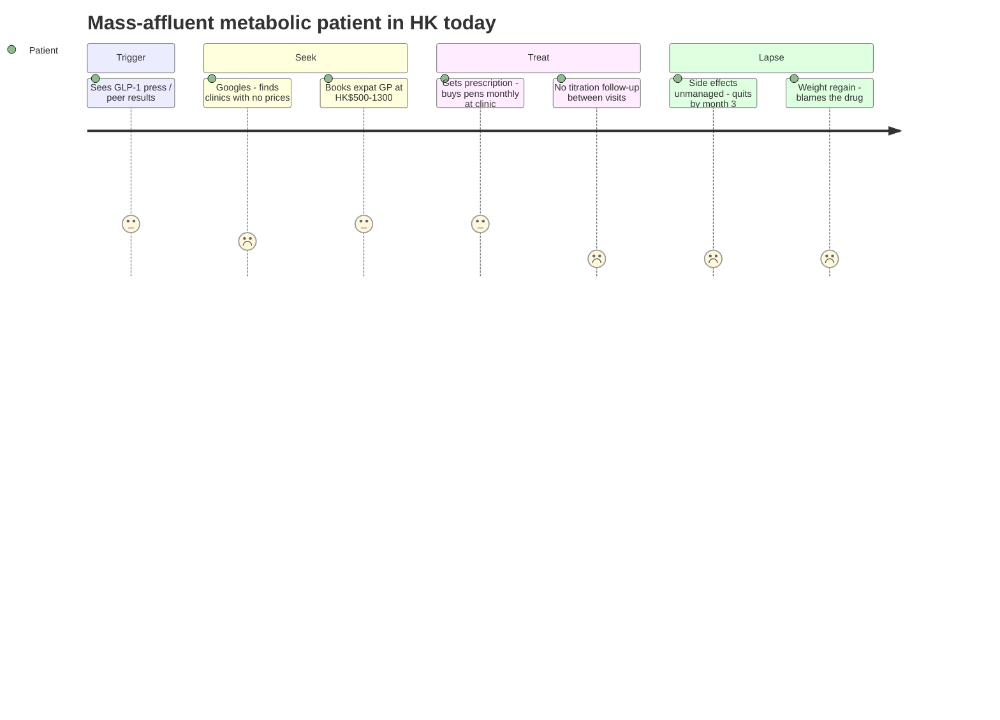

# Competitor Dossier: Hong Kong Premium, Expat & Concierge Primary-Care Clinics

**Abstract.** Hong Kong's premium primary-care segment splits into four camps: (1) the **expat institutions** — OT&P Healthcare (8 clinics, GP consults ~HK$460–500+, screening to HK$15,900, new "Longevity" service line), Central Health Medical Practice (Central/Southside/Discovery Bay) and the boutique anti-ageing practice Dr Lauren Bramley & Partners; (2) the **charitable-hospital anchor** Matilda International Hospital (The Peak, 1907, maternity-famous, in-town screening centre); (3) **conglomerate longevity plays** — New World Group's Humansa (~40 GBA centres, K11 flagship, May 2026 HSBC "Longevity as an Asset" alliance targeting HNW clients) and the functional-medicine duo LifeHub/LifeClinic (IV drips HK$2,080–2,780, Deep Longevity biological-age clocks); and (4) **consumer genomics** — Prenetics (NASDAQ-listed, CircleDNA kits HK$1,490–4,990, US$120M-ARR IM8 supplements with David Beckham, US$200M Insighta cancer-detection JV with Dennis Lo). Pricing is either episodic (per-consult, per-screen) or ultra-HNW (Humansa×HSBC); none offers a longitudinal, medication-inclusive metabolic/longevity programme at mass-affluent price points, and WhatsApp is used administratively, not clinically. That is the whitespace this dossier quantifies for Welltech.

Last updated: July 2026

Related: [HK telehealth platforms](hk-telehealth-platforms.md) · [Singapore longevity clinics](singapore-longevity-clinics.md) · [Research standards](../RESEARCH-STANDARDS.md)

---

## 1. OT&P Healthcare

| Item | Detail |
|---|---|
| Profile | Hong Kong's flagship expat medical group: 25+ years serving expat and local communities; 8 clinics; internationally trained, multilingual doctors; internationally accredited[^1][^2] |
| Locations | Central hub at Century Square, 1 D'Aguilar Street (General Practice, Central Family Clinic for women & children, Central Specialists, BodyWorX, MindWorX at New World Tower); Repulse Bay; Clearwater Bay[^2][^3][^4] |
| Ownership | Private group; no institutional-ownership disclosure found *(unknown)* |
| Pricing | GP consults in Central run ~HK$460–500 excl. medication (Healthy Matters); a GeoExpat user reported a HK$1,320 all-in OT&P visit and forum consensus flags OT&P as the expensive end vs HK$300–500 storefront GPs[^5][^6] |
| Screening | Body-check ladder: Standard → Comprehensive → Platinum → **Ultra at HK$15,900** (annual 45+ work-up: treadmill stress test, lung function, vitamins); Ultra Follow-up HK$13,900[^7][^8] |
| Longevity | Dedicated "Premium Longevity Services" line, split into **Longevity Performance** and **Longevity Medical** testing, incl. a female-specific longevity check designed with BodyWorX[^9] |
| Weight / GLP-1 | BodyWorX offers dietitian-led nutrition & weight management (goals, BMI, "nutritional DNA", eating plans); OT&P publishes Ozempic/keto patient-education content, but **no packaged medical weight-loss or GLP-1 programme with published pricing** was found as of July 2026[^10][^11] |
| Mental health | MindWorX: dedicated clinic (psychiatry, psychology, family therapy, assessments) in Central, plus Repulse Bay/Clearwater Bay coverage[^4][^12] |
| WhatsApp | Bookings via phone/email/web form; no WhatsApp-first workflow documented on public pages *(not found)* [^2] |
| Insurance | Direct billing with major international and local insurers — core to the expat value proposition[^1] |
| Review themes | Quality and English-speaking doctors praised; price the dominant complaint on expat forums[^6] |

**Implications for Welltech.** OT&P monetises trust and accreditation at premium episodic prices, and its new longevity line confirms segment demand — but it sells *tests*, not *programmes*: there is no continuous metabolic care loop, no medication-inclusive weight offer, no messaging-native follow-up. It is the incumbent to differentiate against on longitudinality and price transparency, and a potential clinical-partner brand for credibility. *(inference)*

---

## 2. Central Health Medical Practice — and Dr Lauren Bramley & Partners (a distinct practice)

The brief conflated two separate Central operators; both matter.

### Central Health Medical Practice

| Item | Detail |
|---|---|
| Profile | Multi-specialty family practice serving the expat/professional community: GPs, obstetricians, gynaecologists, paediatricians, psychiatrists, plastic surgery; mental-health advocacy dating to 2005[^13][^14] |
| Locations | 37/F New World Tower 1, 16–18 Queen's Road Central; One Island South (Southside, Wong Chuk Hang); Discovery Bay Plaza[^14] |
| Pricing | Not published on public pages; Central-district private GP benchmark ~HK$460–500/consult applies *(analyst estimate anchored to district benchmark)*[^5] |
| Weight / longevity / GLP-1 | None found on public pages |
| WhatsApp | Phone/email booking (+852 2824 0822); no WhatsApp workflow documented *(not found)*[^14] |

### Dr Lauren Bramley & Partners

| Item | Detail |
|---|---|
| Profile | Boutique practice founded 2005 by Canadian-trained Dr Lauren Bramley; 901 Pacific House, 20 Queen's Road Central[^15][^16] |
| Positioning | The closest thing HK has to an established functional/longevity GP: age management, bio-identical hormone therapy, thyroid, preventative medicine, nutrition, **genomics/genetic diagnostics**, plus family medicine, O&G, dentistry, TCM under one roof[^15][^16][^17] |
| Evidence of demand | Long-running expat-forum threads on "experiences and costs" and podcast appearances on biological-age reversal signal a loyal, self-paying clientele; blood-panel-heavy workups are a recurring cost theme[^18][^19] |
| Pricing | Not published *(unknown; forum threads discuss high costs without stable figures)* [^18] |
| Weight / GLP-1 | Hormone- and thyroid-led metabolic care rather than GLP-1 programmes; no published GLP-1 offer found |

**Implications for Welltech.** Bramley proves a physician-brand can hold premium longevity patients for 20 years with zero digital product. The practice is capacity-constrained by design (single-site, founder-branded). Welltech's opportunity is to systematise what Bramley does artisanally — hormones-plus-metabolics with data — at mass-affluent pricing and with modern (WhatsApp/AI) operations. *(inference)*

---

## 3. Matilda International Hospital (outpatient)

| Item | Detail |
|---|---|
| Ownership/history | Non-profit private hospital on The Peak, opened 1907 from banker Granville Sharp's bequest in memory of his wife Matilda; independent of religious/commercial/academic groups; affiliated Matilda Children's Foundation[^20][^21] |
| Expat position | Historic expat institution; by the 1980s renowned for its maternity unit — still a flagship service[^20][^22] |
| Outpatient model | 24-hour outpatient service (family medicine backed by on-site specialists and hospital diagnostics) on The Peak, plus **Matilda In-town Centre in Central** for health assessments; consultation fees vary by doctor and hour and are not published as a fixed tariff[^23][^24] |
| Screening | Health-check packages (All-Round, Signature, premarital, women's) marketed directly and via aggregator Welloft; package prices not retrievable from public snippets *(pricing gap — obtain by enquiry)*[^24][^25] |
| Weight / GLP-1 / longevity | None found beyond conventional screening |
| WhatsApp | Not documented on public pages *(not found)* |
| Review themes | Heritage, calm Peak setting and maternity care dominate coverage; the location is both halo and friction (in-town centre exists precisely to offset it)[^22][^24] |

**Implications for Welltech.** Matilda owns birth-to-family moments for affluent HK, but its outpatient economics are episodic and geography-limited. It is a screening/diagnostics referral partner, not a metabolic-care competitor.

---

## 4. Humansa (New World Group)

| Item | Detail |
|---|---|
| Ownership | Health & wellness brand of New World Group; NWD entered health/elderly care with a HK$1.4B GBA investment (2018) and launched Humansa in 2020[^26][^27] |
| Footprint | ~40 health & wellness centres across the Greater Bay Area; Hong Kong: 14,000 sq ft flagship at K11 ATELIER Victoria Dockside (opened October 2022), Central presence at New World Tower, plus Physio & Fitness sites in Central and TST[^26][^28][^29] |
| Positioning | "Leading one-stop longevity & wellness centre": healthspan extension via five pillars (physical, cardio-metabolic, cognitive, mental, nutritional wellbeing) "empowered by AI"; CEO Don So frames healthspan as "the most under-managed asset on the family balance sheet"[^26][^30] |
| Services | Health checks, medical imaging, endoscopy, dentistry, eye care, postnatal care, skin, physiotherapy, high-performance training; H+ tiered membership programme (baseline assessment + ongoing monitoring); "Future Health Lite" AI-driven longevity product; own supplement line[^26][^29][^31][^32] |
| Pricing (published promos) | Telomere length / biological-age blood test **HK$1,680**; BTL Exion body treatment **HK$980/session**; H+ membership tier prices not public *(pricing gap)*[^28][^29] |
| Strategic move | **May 2026: MoU with HSBC and HSBC Life** — "Longevity as an Asset" framework integrating longevity programmes, behavioural coaching and dedicated spaces into HSBC's HNW/UHNW wealth proposition across Asia[^30] |
| Ownership risk | NWD's well-publicised debt stress makes long-term ownership/funding of Humansa a watch item; no divestment evidence found as of July 2026 *(inference, flagged)* [^27] |
| WhatsApp | Not documented; phone (3180 2288) and web enquiry *(not found)*[^29] |
| Review themes | Lifestyle-media coverage emphasises hotel-grade environment and breadth of diagnostics; independent patient-outcome evidence absent[^28] |

**Implications for Welltech.** Humansa has claimed the *ultra-premium* longevity narrative and, via HSBC, the private-banking channel. It is real-estate-heavy, HNW-targeted and diagnostics-led. Welltech should not fight for the UHNW tier; the counter-position is clinical outcomes (weight, metabolic markers) for the mass-affluent tier Humansa's cost base cannot profitably serve, delivered without 14,000 sq ft of Victoria Dockside rent. *(inference)*

---

## 5. LifeHub & LifeClinic

| Item | Detail |
|---|---|
| Structure | Sister brands sharing The Loop, 33 Wellington Street, Central (LifeClinic on 2–3/F); LifeHub styled a "medical wellness centre", LifeClinic a licensed medical anti-ageing clinic[^33][^34] |
| Model | LifeHub: IV/IM nutrient therapy, genetic testing, supplements, hormone support — "one of the first fully integrated health and vitality centres" in HK; LifeClinic: functional medicine + "Swiss Biological Medicine", GP/family medicine, functional-medicine lab testing, integrative cancer-support clinic[^33][^34][^35][^36] |
| Longevity credentials | Partnership with Insilico-affiliated **Deep Longevity**: staff trained on deep aging clocks to issue biological-age reports guiding client programmes[^37] |
| Pricing (published examples) | IV drips: Super Immunity Boost **HK$2,080**, Skin Glow **HK$2,580**, Healthy Hair **HK$2,780**; NAD+ menu (Executive, Detox, Fat Burner, Immune Plus, Bespoke) priced on enquiry; programme/membership pricing not public[^38][^39][^40] |
| Weight / GLP-1 | "NAD+ Fat Burner" drips and nutrition programmes — wellness-grade, not medication-led; no GLP-1 prescribing programme found[^38] |
| WhatsApp | Not documented on public pages *(not found)* |
| Review themes | 17 reviews on WhatClinic for LIFE Clinic; lifestyle-blog reviews of IV drips are positive on experience, silent on outcomes — the segment's evidential weakness[^41][^42] |
| Status | Active; boutique scale (single Central hub) |

**Implications for Welltech.** LifeHub/LifeClinic validates HK willingness to pay HK$2,000–2,800 per wellness session and to buy "biological age" as a product. But it is supplement/drip-margin driven and clinically unregulated territory. Welltech wins the same customer with harder endpoints: prescription metabolic medicine, measured HbA1c/weight/lipid outcomes, physician accountability.

---

## 6. Prenetics / CircleDNA / IM8 / Insighta

| Item | Detail |
|---|---|
| Corporate | Founded 2014 by Danny Yeung; **NASDAQ-listed (PRE) May 2022 via the Artisan Acquisition SPAC at US$1.25B enterprise value — Hong Kong's first listed unicorn** (note: *Nasdaq*, not HKEX — the "HK-listed" framing in circulation is wrong)[^43][^44] |
| Strategic shift | Exited clinical diagnostics: ACT Genomics divested to Delta Electronics for up to US$71.78M (announced June 2025, completed 7 October 2025); now three consumer brands — IM8, CircleDNA, Europa (US sports-nutrition distribution) — plus >US$60M cash and a Bitcoin treasury[^45][^46] |
| CircleDNA | Consumer NGS DNA testing from saliva; HK prices: Vital **HK$1,490**, Health **HK$3,990**, Family Planning **HK$3,990**, Premium **HK$4,990** (500+ reports incl. 36 hereditary-cancer); Watsons retail distribution since 2019; CircleX health checks from HK$950[^47][^48][^49] |
| IM8 | Premium supplement brand co-founded with **David Beckham**; launched December 2024; **~US$120M ARR within 12 months**, IM8 FY2025 revenue US$60.1M, October 2025 monthly revenue US$9M; FY2026 guidance US$180–200M; "Daily Ultimate Longevity" SKU targets all 12 hallmarks of aging[^50][^51][^52] |
| Insighta | **US$200M JV (2023) with Prof Dennis Lo (CUHK)** for multi-cancer early detection; Presight liver-cancer test claims 85% sensitivity / 98% specificity; commercial launch targeted for HK/mainland from 2025 and a 10+-cancer Presight One planned 2027 — but trial/launch confirmation is lagging the original timeline *(status uncertain)*[^53][^54][^55] |
| Weight / GLP-1 | None — supplements and testing only |
| WhatsApp / care model | None; pure product/D2C e-commerce. No longitudinal care relationship |
| Review themes | CircleDNA reviews praise breadth (500+ reports), question actionability and steep list-vs-promo pricing[^48][^56] |

**Implications for Welltech.** Prenetics is not a care competitor — it is proof of two adjacent economics: (1) HK-origin consumer-health brands can scale globally and fast (IM8: 0→US$120M ARR in 12 months on celebrity + subscription mechanics); (2) consumers pay HK$1,500–5,000 for one-off genomic insight with no follow-on care. Welltech can be the *clinical continuation layer* that CircleDNA/IM8 buyers currently lack — and should watch Insighta as a future screening partner if Presight ships. *(inference)*

---

## 7. Footprint and channel audit

Physical footprint (all Hong Kong, July 2026, from provider pages cited above):

| Provider | Sites | Districts | Digital front door |
|---|---|---|---|
| OT&P | 8 clinics (multi-brand: GP, Family, Specialists, BodyWorX, MindWorX) | Central ×5, Repulse Bay, Clearwater Bay[^2][^3][^4] | Web booking + phone/email; blog-led SEO (strong content operation)[^1][^11] |
| Central Health | 3 | Central, Wong Chuk Hang, Discovery Bay[^14] | Web booking + phone/email[^14] |
| Bramley & Partners | 1 | Central[^15][^16] | Phone/email only |
| Matilda | Hospital (Peak) + In-town Centre (Central)[^23][^24] | Peak, Central | Web enquiry; assessment email/phone line[^24] |
| Humansa | K11 flagship (TST) + Central + Physio & Fitness sites; ~40 centres GBA-wide[^26][^28][^29] | TST, Central; GBA | Web + phone; supplements e-shop; AI product marketing[^31][^32] |
| LifeHub/LifeClinic | 1 shared hub (The Loop, Wellington St) | Central[^33][^34] | Web + phone |
| Prenetics brands | No HK clinics (D2C; Watsons retail for kits)[^49] | n/a | E-commerce only |

Channel observations:

- **Central-district saturation, everywhere else empty.** Six of seven operators anchor in Central; affluent catchments in Kowloon (beyond TST), Sai Kung/Clearwater Bay (OT&P only) and new-town professional hubs are unserved by this tier. A messaging-first model needs no Central flagship to reach them. *(analyst synthesis)*
- **Content is the only scaled acquisition engine in the segment** — OT&P's SEO blog (Ozempic guides, body-check explainers) is the closest thing to digital patient acquisition[^11]; everyone else relies on referral and reputation.
- **No provider documents WhatsApp clinical workflows** despite WhatsApp being the default admin channel across HK healthcare (see [telehealth dossier](hk-telehealth-platforms.md)) — booking lines should be mystery-shopped to confirm, but the public evidence gap itself signals no one is *productising* the channel.

## 8. Demand-side context: the mass-affluent gap

Three demand signals frame the segment:

1. **Willingness to pay is proven at every rung.** Cited price points consumers already pay: HK$460–500 routine GP consults in Central[^5]; HK$1,320 single expat-clinic visits[^6]; HK$1,490–4,990 one-off DNA kits[^47]; HK$1,680 biological-age tests[^28]; HK$2,080–2,780 IV sessions[^38][^39][^40]; HK$13,900–15,900 annual screens[^7][^8]. The spend exists — it is simply fragmented across disconnected episodic products.
2. **Wealth channels are institutionalising longevity.** The Humansa×HSBC MoU (May 2026) explicitly cites wealth-report evidence that affluent families are shifting spend from status goods to wellness/longevity and expect financial partners to support it[^30]. When banks productise a theme, the tier below their private-bank threshold predictably imitates it. *(inference)*
3. **The supply side skews to extremes.** Expat institutions serve episodic affluent demand; Humansa/HSBC target HNW–UHNW; wellness boutiques serve the experience-seeking. The professional earning enough for HK$1,500–3,000/month of health spend — but not enough for a private-bank longevity concierge — has no structured offer. *(analyst synthesis)*

## 9. Patient journey today vs the Welltech model

The failure modes are structural, not clinical: opaque pricing at discovery, consult-gated refills, and zero between-visit support. A WhatsApp-native programme attacks each failure point — published monthly pricing, chat-based titration and side-effect triage, and outcome dashboards — using the channel HK patients already use for clinic admin (WhatsApp booking is standard across Adventist, Gleneagles and private practices; see [telehealth dossier](hk-telehealth-platforms.md)).

## 10. Review-theme synthesis

| Provider | Dominant positive themes | Dominant negative themes | Source basis |
|---|---|---|---|
| OT&P | English-speaking, internationally trained doctors; breadth under one group | Price ("very damn pricey", HK$1,320 visit); forum advice to use storefront GPs instead | GeoExpat threads; directory listings[^6] |
| Central Health | Family continuity; mental-health de-stigmatisation record | Thin public review base; opaque pricing | Practice site; directories[^13][^14] |
| Bramley & Partners | Loyalty to founder; hormone/thyroid expertise rare in HK | Cost of extensive blood panels; single-doctor dependency | GeoExpat cost threads; podcast profile[^18][^19] |
| Matilda | Maternity excellence; serene Peak setting; heritage trust | Peak access friction; tariff opacity | Press/heritage features; hospital pages[^22][^23] |
| Humansa | Hotel-grade facilities; diagnostic breadth | No published outcomes; membership price opacity; brand younger than its ambitions | Expat lifestyle press[^28] |
| LifeHub/LifeClinic | Pleasant experience; staff attentiveness (17 WhatClinic reviews) | Outcome evidence absent; wellness-not-medicine skepticism | WhatClinic; blogger reviews[^41][^42] |
| CircleDNA | Report breadth (500+) | Actionability; aggressive list-vs-promo pricing | Review sites[^48][^56] |

Common thread: **no provider is criticised for clinical outcomes because none publishes any.** Trust is built on credentials, decor and bedside manner. A provider publishing verified programme outcomes (average kg lost, HbA1c delta, retention) would be making a segment-first move. *(analyst synthesis)*

## 11. Segment SWOT vs a Welltech entry

| | Incumbent premium clinics (collectively) | Welltech (prospective) |
|---|---|---|
| Strengths | Decades of trust; physical presence; insurer direct billing; physician brands | Purpose-built for longitudinal metabolic care; WhatsApp-first ops; transparent pricing; AI-enabled protocol scale |
| Weaknesses | Episodic revenue model; rent-heavy cost bases; founder/key-person dependencies; price opacity | No HK brand, licence relationships or patient base at day zero |
| Opportunities | Sell longevity *tests* into existing panels (already happening: OT&P longevity line[^9], Humansa H+[^29]) | Convert test-buyers (CircleDNA, telomere panels) into programme patients; partner for diagnostics rather than build |
| Threats | Humansa/HSBC pulling their top clients upmarket[^30]; Bowtie clinics undercutting on price (HK$350 consults)[see telehealth dossier] | An incumbent bolting GLP-1 onto existing trust before Welltech establishes presence — most plausibly OT&P (has the patients) or Bowtie (has the funnel) *(inference)* |

## 12. Comparative matrix

| Dimension | OT&P | Central Health | Bramley & Partners | Matilda (OPD) | Humansa | LifeHub/LifeClinic | Prenetics group |
|---|---|---|---|---|---|---|---|
| Model | Multi-clinic expat group | Expat family practice | Boutique functional GP | Non-profit hospital OPD + screening | Conglomerate longevity centres | Functional/IV boutique | D2C genomics + supplements |
| Ownership | Private group | Private partnership | Founder-owned | Charitable trust legacy | New World Group | Private | NASDAQ: PRE |
| Anchor prices (HKD) | GP ~460–500; Ultra screen 15,900 | ~460–500 *(est.)* | Unpublished (high) | Unpublished tariff; packages via Welloft | Bio-age test 1,680; memberships unpublished | Drips 2,080–2,780 | DNA kits 1,490–4,990 |
| Longevity offer | Longevity Performance/Medical tests | No | Core (hormones, genomics) | No | Core (five pillars, H+, HSBC tie-up) | Core (bio-age clocks, IV) | Products only (IM8 Longevity) |
| Medical weight / GLP-1 | Dietitian-led only | None found | Hormonal/metabolic, no GLP-1 offer | None | None published | "Fat Burner" drips only | None |
| Longitudinal programme w/ outcomes | No | No | Informal (physician-led) | No | Membership, outcomes unproven | Programmes, outcomes unproven | No |
| WhatsApp clinical ops | Not found | Not found | Not found | Not found | Not found | Not found | n/a |
| Target tier | Expat/affluent | Expat/affluent | Affluent self-payers | Affluent/expat | HNW–UHNW | Affluent wellness | Mass consumer→affluent |

## 13. Whitespace verdict: who serves the mass-affluent metabolic/longevity patient?

**Answer: no one, coherently.** The segment map has a hole exactly where Welltech aims:

1. **Price architecture is barbelled.** Expat institutions sell episodic consults (HK$460–1,300) and annual mega-screens (HK$13,900–15,900); Humansa+HSBC is racing upmarket to UHNW "longevity as an asset." Between a HK$500 GP visit and a private-bank longevity programme sits HK's mass-affluent professional class — able to pay HK$1,500–3,000/month for outcome-driven care — with no dedicated offer. *(analyst synthesis of cited price points)*
2. **Everyone sells inputs, nobody sells outcomes.** Tests (OT&P Ultra, CircleDNA, telomere panels), drips (LifeHub), and supplements (IM8, Humansa Nutrition) all monetise the assessment or the consumable. No player publishes a programme with tracked weight/HbA1c/biological-age endpoints and medication (GLP-1) where indicated — despite all four GLP-1 brands being registered in HK and Mounjaro approved October 2024 (see [telehealth dossier](hk-telehealth-platforms.md)).
3. **Longitudinality is artisanal, not systematised.** Bramley retains patients for decades through physician charisma; Humansa through membership real estate. Neither scales to thousands of mass-affluent patients. AI-enabled protocols + WhatsApp-native follow-up (already the default admin channel in HK healthcare) is the unbuilt operating model.
4. **The genomics install-base is unmonetised downstream.** Hundreds of thousands of CircleDNA kits sold via Watsons/D2C create risk-aware consumers with no care pathway. A "your DNA said X — here's your metabolic programme" bridge is an acquisition channel no clinic exploits.
5. **Competitive timing.** Humansa×HSBC (May 2026) shows longevity is entering mainstream financial distribution; Bowtie is inching from insurance into "weight care." The window to define *clinical* metabolic-longevity care for the mass-affluent — before a conglomerate packages it downmarket — is roughly the next 18–24 months. *(inference)*

**Welltech play:** position between OT&P's trust and Humansa's ambition — physician-led, GLP-1-inclusive, WhatsApp-first longitudinal metabolic care at transparent monthly pricing; partner (don't compete) with Matilda/OT&P for diagnostics, Prenetics for genomic acquisition, and insurers for funding.

## 14. Monitoring triggers (review quarterly)

| Trigger | Signal to watch | Implication if it fires |
|---|---|---|
| OT&P publishes a weight-loss or GLP-1 programme page | otandp.com services/blog (Ozempic content already live[^11]) | The trust incumbent enters; Welltech must lead on price transparency and messaging-native ops |
| Humansa launches a sub-HNW membership tier or HK expansion beyond K11/Central | humansahealth.com; NWD releases[^26][^29] | Conglomerate moves downmarket into the mass-affluent band |
| NWD divests or recapitalises Humansa | HKEX filings; SCMP property/debt coverage[^27] | Ownership change could either starve or turbo-charge the main longevity rival |
| HSBC×Humansa converts MoU into priced products | HSBC Life announcements[^30] | Bank distribution of longevity normalises the category — rising tide, harder HNW ceiling |
| Insighta/Presight commercial launch in HK | Prenetics IR; CUHK releases[^53][^54][^55] | Screening-led patient flows emerge; secure referral integration early |
| Bramley practice succession/expansion event | Practice site; expat press[^15][^16] | A sale or partnership would free (or lock up) HK's most credible functional-medicine patient base *(speculative)* |

Data gaps flagged for follow-up: OT&P and Central Health published fee schedules (obtain by direct enquiry); Matilda outpatient tariff and Welloft package prices; Humansa H+ tier pricing; LifeClinic programme pricing; any WhatsApp Business usage by these providers (none documented publicly — verify by mystery-shopping each booking line).

## 15. Source-quality note

- Provider websites in this segment (otandp.com, humansahealth.com, thelifehub.com, health pages behind bot protection) frequently block automated retrieval; where direct pages were unreachable, facts were taken from their content as surfaced through search indexing, cross-checked against directories (Healthy Matters, FindDoc) and press. Prices quoted are those published or reported at access time (July 2026) and should be re-verified before any pricing-strategy decision.
- Forum evidence (GeoExpat, AsiaXPAT) is anecdotal by nature; it is used here only for review *themes* and single dated price observations, never for scale claims.
- Prenetics figures come from the company's own investor-relations releases and are unaudited ARR/run-rate constructs; FY revenue figures are the harder numbers.[^45][^50]

---

## References

[^1]: OT&P Healthcare, "Internationally Accredited Medical Clinics in Hong Kong" (homepage) and FAQ, https://www.otandp.com/ and https://www.otandp.com/faq/ (accessed July 2026).
[^2]: OT&P Healthcare, "Clinic Locations in Hong Kong — Contact Us", https://www.otandp.com/contact (accessed July 2026).
[^3]: Healthy Matters, "OT&P General Practice (Central)" directory entry, https://www.healthymatters.com.hk/directory/clinics/ot-p-general-practice-central/ (accessed July 2026).
[^4]: OT&P Healthcare, "MindWorX Clinic for Mental Health", https://www.otandp.com/clinics/mindworx-mental-health-clinic (accessed July 2026).
[^5]: Healthy Matters, clinic directory pricing note for Central district GP consultations (~HK$460–500 excl. medication), https://www.healthymatters.com.hk/directory/clinics/ (accessed July 2026).
[^6]: GeoExpat forum, "Clinic / GP in Yau Ma Tei" thread (OT&P visit reported at HK$1,320; storefront GP benchmark HK$300–500), https://geoexpat.com/forum/52/thread366592.html (accessed July 2026).
[^7]: OT&P Healthcare, "Ultra Health Screening Package" (HK$15,900), https://www.otandp.com/body-check/ultra (accessed July 2026).
[^8]: OT&P Healthcare, "Ultra Follow Up Health Screening Package" (HK$13,900) and body-check overview, https://www.otandp.com/body-check/ultra-follow-up and https://www.otandp.com/body-check/ (accessed July 2026).
[^9]: OT&P Healthcare, "Premium Longevity Services in Hong Kong", https://www.otandp.com/longevity-services (accessed July 2026).
[^10]: OT&P BodyWorX, "Nutrition, Dietetics & Weight Management", https://bodyworx.otandp.com/services/nutrition-weight-management (accessed July 2026).
[^11]: OT&P Healthcare blog, "Ozempic & Keto Diet in Hong Kong: A Weight Loss Guide", https://www.otandp.com/blog/ozempic-keto-diet-hong-kong-weight-loss (accessed July 2026).
[^12]: Portal Hong Kong, "OT&P MindWorX Mental Health Clinic", https://www.portalhongkong.com/item/otp-mindworx-mental-health-clinic/ (accessed July 2026).
[^13]: Central Health Medical Practice, "Our Team" and "General Practice", https://www.centralhealth.com.hk/our-team/ and https://www.centralhealth.com.hk/general-practice/ (accessed July 2026).
[^14]: Central Health Medical Practice, "Contact Us" (New World Tower, One Island South, Discovery Bay), https://www.centralhealth.com.hk/contact-us/ (accessed July 2026).
[^15]: Healthy Matters, "Dr Lauren Bramley & Partners, Central", https://www.healthymatters.com.hk/directory/clinics/dr-lauren-bramley-partners-central/ (accessed July 2026).
[^16]: FindDoc, "Dr Lauren Bramley & Partners — Clinic in Central", https://www.finddoc.com/en/practices/dr-lauren-bramley-and-partners-4110 (accessed July 2026).
[^17]: GeoExpat resources, "Dr. Lauren Bramley & Partners" listing (age management, bio-identical hormones, genetic diagnostics), https://geoexpat.com/resources/medical-hk/gps-and-medical-clinics/general-practitioners/7866 (accessed July 2026).
[^18]: GeoExpat forum, "Dr Lauren Bramley & Partners — experiences and costs?", https://geoexpat.com/forum/115/thread348855.html (accessed July 2026).
[^19]: Hack My Age podcast, "Reversing Body Age, Bioidentical Hormones, Thyroid and Biological Age Testing — Dr. Lauren Bramley", http://hackmyage.com/reversing-body-age-dr-lauren-bramley/ (accessed July 2026).
[^20]: Wikipedia, "Matilda International Hospital" (Granville Sharp bequest, 1907 opening, non-profit status), https://en.wikipedia.org/wiki/Matilda_International_Hospital (accessed July 2026).
[^21]: Matilda International Hospital, "About", https://www.matilda.org/en/about (accessed July 2026).
[^22]: Beyond the High Rise, "Hospital drama — discovering the real Matilda of The Peak", https://beyondthehighrise.com/matilda-mums/ (accessed July 2026).
[^23]: Matilda International Hospital, "24-Hour Outpatient Service" and "Fees and Charges", https://www.matilda.org/en/services-specialities/24-hours-outpatient and https://www.matilda.org/en/fees-and-packages/hospital-fees (accessed July 2026).
[^24]: Matilda International Hospital, "Health Checks" (Matilda In-town Centre, Central), https://www.matilda.org/en/services-specialities/health-checks (accessed July 2026).
[^25]: Welloft, "Matilda International Hospital All-Round Health Check Package", https://www.welloft.com/en/product/matilda-international-hospital-all-round-health-check-package (accessed July 2026).
[^26]: New World Development, "New World Group's Humansa expands its footprint in the premium health and wellness market in the Greater Bay Area", https://www.nwd.com.hk/content/new-world-group%E2%80%99s-humansa-expands-its-footprint-premium-health-and-wellness-market-greater-0 (accessed July 2026).
[^27]: SCMP, "Hong Kong property giant New World Development taps into lucrative elderly care market in 'Greater Bay Area' with HK$1.4 billion investment" (2018), https://www.scmp.com/news/hong-kong/hong-kong-economy/article/2174400/hong-kong-property-giant-new-world-development-taps (accessed July 2026).
[^28]: Expat Living Hong Kong, "Wellness Sanctuary — Humansa Offers Health Checks and More" (K11 flagship, telomere/bio-age test HK$1,680, BTL Exion HK$980), https://expatliving.net/hong-kong/wellness-hongkong-humansa-health-checks/ (accessed July 2026).
[^29]: Humansa, corporate site and "H+ Membership | Personalized Health・Longevity Planning・Anti-Aging Programme", https://www.humansahealth.com/ and https://www.humansahealth.com/humansa-membership-programme/ (accessed July 2026).
[^30]: Media OutReach Newswire, "Humansa and HSBC Group Forge Pioneering Partnership to Make 'Longevity as an Asset' a New Standard for Asia's Wealthy" (11 May 2026), https://www.media-outreach.com/news/hong-kong/2026/05/11/463724/humansa-and-hsbc-group-forge-pioneering-partnership-to-make-longevity-as-an-asset-a-new-standard-for-asias-wealthy/ (accessed July 2026).
[^31]: Humansa, "Humansa Unveils Future Health Lite: AI-Driven Longevity Solution", https://www.humansahealth.com/news/humansa-unveils-future-health-lite-ai-driven-longevity-solution-for-proactive-wellness/ (accessed July 2026).
[^32]: Humansa Nutrition (supplements shop), https://shop.humansahealth.com/ (accessed July 2026).
[^33]: LifeHub, corporate site, https://www.thelifehub.com/ (accessed July 2026).
[^34]: LifeClinic, "Private Healthcare Company in Hong Kong" (2–3/F The Loop, 33 Wellington Street), https://lifeclinic.com.hk/ (accessed July 2026).
[^35]: LifeClinic, "Functional Medicine" and "GP Services & Family Medicine", https://lifeclinic.com.hk/functional-medicine-services/ and https://lifeclinic.com.hk/gp-services-and-family-medicine/ (accessed July 2026).
[^36]: LifeClinic Cancer Clinic, "Functional Medicine Approach", https://cancer.lifeclinic.com.hk/about-us/about-lifeclinic/functional-medicine-approach/ (accessed July 2026).
[^37]: EurekAlert!, "Deep Longevity announces partnership with LifeHub & LifeClinic in Hong Kong", https://www.eurekalert.org/news-releases/592705 (accessed July 2026).
[^38]: LifeHub, "IV Drips | Vitamin IV Therapy in Hong Kong" (NAD+ menu), https://www.thelifehub.com/services-ivdrip/ (accessed July 2026).
[^39]: The HK Hub, "Our Review of LifeHub's IV Drip Treatment For Glowing Skin" (Skin Glow HK$2,580), https://thehkhub.com/lifehub-skin-glow-iv-drip-review/ (accessed July 2026).
[^40]: Little Steps Asia, "Get A Boost With These IV Drip Therapies In Hong Kong" (Super Immunity Boost HK$2,080; Healthy Hair HK$2,780), https://www.littlestepsasia.com/hong-kong/health/wellness/where-to-get-iv-drip-therapy/ (accessed July 2026).
[^41]: WhatClinic, "LIFE Clinic in Central and Western, Hong Kong SAR — 17 reviews", https://www.whatclinic.com/beauty-clinics/hong-kong-sar/hong-kong-island/central-and-western/life-clinic (accessed July 2026).
[^42]: Furellie, "[Immunity Boost IV Drip Review] My Experience at Medical Spa LifeHub Hong Kong", https://www.furellie.com/post/2019/04/03/immunity-boost-iv-drip-review-when-traditional-medicine-fails-you-enter-lifehub-wellcare (accessed July 2026).
[^43]: Wikipedia, "Prenetics", https://en.wikipedia.org/wiki/Prenetics (accessed July 2026).
[^44]: Bocconi Students Investment Club, "Prenetics' SPAC merger: Hong Kong's first unicorn to be publicly listed in $1.25bn deal", https://bsic.it/prenetics-spac-merger-hong-kongs-first-unicorn-to-be-publicly-listed-in-1-25bn-deal/ (accessed July 2026).
[^45]: Prenetics IR, "Prenetics Divests ACT Genomics to Delta Electronics as Part of up to US$71.78 Million Transaction" (18 June 2025), https://ir.prenetics.com/news-releases/news-release-details/prenetics-divests-act-genomics-delta-electronics-part-us7178 (accessed July 2026).
[^46]: Prenetics IR, "Prenetics Completes $72 Million ACT Exit, Bolsters Cash and Bitcoin Treasury" (October 2025), https://prenetics.gcs-web.com/news-releases/news-release-details/prenetics-completes-72-million-act-exit-bolsters-cash-and (accessed July 2026).
[^47]: Little Steps Asia, "Best Home DNA Testing Kits For Health Screening In Hong Kong" (CircleDNA HK kit prices; CircleX from HK$950), https://www.littlestepsasia.com/hong-kong/health/medical-specialists/dna-home-testing-kits/ (accessed July 2026).
[^48]: Nucleus, "CircleDNA review: reports, accuracy, and pricing", https://mynucleus.com/blog/circle-dna-review (accessed July 2026).
[^49]: TechCrunch, "Prenetics partners with Watsons … to sell its new consumer DNA tests" (29 July 2019), https://techcrunch.com/2019/07/29/prenetics-partners-with-watsons-one-of-asias-largest-personal-care-retailers-to-sell-its-new-consumer-dna-tests/ (accessed July 2026).
[^50]: Prenetics IR, "Prenetics Reports Record Q4 and FY 2025 Results: IM8 Achieves $120M ARR in 12 Months, Revenue Surges 480% YoY", https://ir.prenetics.com/news-releases/news-release-details/prenetics-reports-record-q4-and-fy-2025-results-im8-achieves (accessed July 2026).
[^51]: Prenetics IR, "Prenetics' IM8 Achieves Record $9 Million in Revenue for October" (2025), https://ir.prenetics.com/news-releases/news-release-details/prenetics-im8-achieves-record-9-million-revenue-october (accessed July 2026).
[^52]: Prenetics, "IM8 Launches Daily Ultimate Longevity, First Supplement to Target All 12 Hallmarks of Aging", https://prenetics.gcs-web.com/news-releases/news-release-details/prenetics-im8-launches-daily-ultimate-longevity-first-supplement (accessed July 2026).
[^53]: CUHK Communications, "CUHK Professor Dennis Lo and Prenetics establish US$200m joint venture 'Insighta' for breakthrough multi-cancer early detection screening" (2023), https://www.cpr.cuhk.edu.hk/en/press/cuhk-professor-dennis-lo-and-prenetics-establish-us200m-joint-venture-insighta-for-breakthrough-multi-cancer-early-detection-screening/ (accessed July 2026).
[^54]: SCMP, "CUHK's Dennis Lo launches blood tests with Prenetics Group to find cancer cells in the liver and lungs" (2023), https://www.scmp.com/business/china-business/article/3225286/cuhks-dennis-lo-launches-blood-tests-prenetics-group-find-cancer-cells-liver-and-lungs-propelling (accessed July 2026).
[^55]: Wikipedia, "Prenetics" (Insighta trial-status caveat: no clinical trials announced as of 2025), https://en.wikipedia.org/wiki/Prenetics (accessed July 2026).
[^56]: Sassy Hong Kong, "CircleDNA Review: We Try The 'World's Most Comprehensive DNA Test'", https://www.sassyhongkong.com/circle-dna-test-review-health-wellness/ (accessed July 2026).
