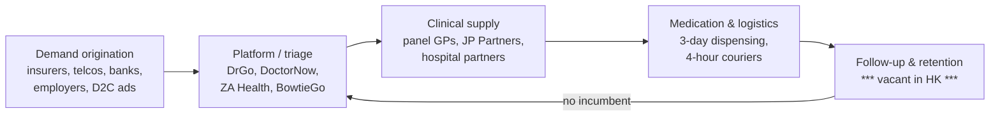

# Competitor Dossier: Hong Kong Telehealth Platforms

**Abstract.** Hong Kong's consumer telehealth market is small, fragmented and B2B2C-dominated. The territory has no telemedicine statute — only non-binding Medical Council ethical guidelines (2019) — and its compact geography (a GP is rarely more than 15 minutes away, storefront consults from ~HK$300) caps standalone B2C teleconsult demand.[^1][^2][^3] The players that matter are corporate-backed: **DrGo** (HKT's telco platform, pivoting to a HK$48/month membership and enterprise/insurer contracts), **ZA Health** (ZhongAn's discount-network health pass distributed through the ZA digital-bank ecosystem, HK$1,380/year), **Bowtie** (the virtual insurer, HK$687M ARR, now running its own Bowtie & JP Health clinics with HK$350 consults), plus long-tail independents **DoctorNow** (HK$110–780 consults; powers Cigna's virtual care) and **Heals Healthcare** (acquired Singapore's MyDoc in 2021; minimal visible activity since 2022). "Pinehill" could not be verified as a Hong Kong telemedicine app. No platform runs a packaged GLP-1 weight-loss or longevity programme, and none is WhatsApp-first — the clearest openings for Welltech, alongside the woman-focused GLP-1 telehealth startup Zoey as proof the model is viable in HK. This dossier profiles each player, scores traction with dated evidence, and closes with a comparative matrix and segment verdict.

Last updated: July 2026

Related: [Competitor comparison](competitor-comparison.md) · [HK concierge & expat clinics](hk-concierge-expat-clinics.md) · [Research standards](../RESEARCH-STANDARDS.md)

---

## 1. Market context: why HK telehealth stayed small

- **No legislation.** Hong Kong has no telemedicine statute or licensing regime; the Medical Council's *Ethical Guidelines on Practice of Telemedicine* (December 2019) are non-binding, though breaches can trigger disciplinary action.[^1][^2]
- **Public-sector benchmark.** The Hospital Authority's HA Go app handled 340,000+ non-COVID telehealth cases in the three years April 2022–March 2025 — government positioning is that telehealth suits stable chronic patients, not new cases.[^1]
- **COVID spike, post-COVID plateau.** Teleconsult usage grew in the private sector during the pandemic as an infection-control channel; the Consumer Council's 2023 telehealth study pushed for better governance and price transparency, implying immature consumer practices.[^3][^4]
- **Policy tailwind, finally.** The 2025 Policy Address commits to expanded telehealth, cross-border health-data sharing and a new regulatory centre — the first material government push beyond the Hospital Authority.[^5]
- **Economics.** Private GP consults run HK$180–1,000+ (median storefront ~HK$300–500), so a HK$398 teleconsult with delivery competes on convenience, not price.[^6]

**Implication for Welltech:** the binding constraint is not regulation (permissive by default) but the weak standalone economics of episodic teleconsults. Every surviving HK player has retreated to one of three models: corporate/insurer distribution, membership passes, or owned clinics. A condition-led longitudinal programme (weight/metabolic) is the one model no incumbent has tried.

---

## 2. DrGo (HKT / eSmartHealth)

| Item | Detail |
|---|---|
| Owner | eSmartHealth Ltd, wholly owned subsidiary of Hong Kong Telecommunications (HKT), PCCW group[^7][^8] |
| Launched | July 2020, positioned as "Hong Kong's first end-to-end integrated telemedicine platform"[^8] |
| Model | App-based video GP/specialist/TCM consults, 8:00–20:00 daily; e-prescription; medication (up to 3 days), medical certificates and referral letters couriered within ~4 hours[^7][^9] |
| Medical partners | Gleneagles Hospital Hong Kong (launch partner), Precious Blood Hospital (Caritas), EC Healthcare, Fu Heng Medical, Amazing Medical and others — 12+ institutional partners, 100+ doctors/experts[^7][^9][^10] |
| Consumer pricing | Launch pricing HK$398–450 per consult incl. 3-day medication + delivery (2020); today fees vary by provider and are shown in-app, with HK$398 as the base collected at booking and any excess charged to card[^9][^10] |
| Membership pivot | **DrGo One Wellness** (2025): HK$48/month + HK$598 one-off registration; first 3 consults include free basic 3-day medication + delivery, thereafter from HK$180; bundles Hong Kong, Greater Bay Area and overseas medical access plus travel-insurance perks[^11][^12] |
| Enterprise/B2B | Corporate telemedicine solutions; HKT's 2025 interim report cites the relevant revenue line at HK$414M for H1 2025 (vs HK$342M a year earlier) and notes DrGo's extension into the GBA and select Asian markets[^13] |
| Programmes | TCM video consults (2021); hybrid hypertension care with FWD and Gleneagles; free teleconsults for underprivileged families with FWD and UMH (2020); Kwai Tsing TCM community programme[^10][^14][^15] |
| Traction | ~180,000 cumulative Android downloads, ~290 in the prior 30 days (AppBrain, accessed July 2026) — consumer pull is modest for a telco with millions of mobile subscribers; distribution leans on csl bundles and The Club loyalty ecosystem[^16][^17][^18] |
| GLP-1 / weight | None found (no weight-loss programme page, no GLP-1 content) as of July 2026 |
| WhatsApp | None found; app-first with a phone hotline (2380 2323)[^12] |
| **Status verdict** | **Active but consumer-stalled.** The HK$48/month membership pivot and GBA/enterprise push signal that pay-per-consult B2C did not scale; DrGo is now an ecosystem retention asset for HKT and an enterprise healthtech vendor. |

**Implication for Welltech:** DrGo proves telco distribution alone doesn't create healthcare demand — ~180k downloads over five years despite HKT's subscriber base. Its infrastructure (4-hour med delivery, hospital partnerships) is real; its clinical proposition is episodic and shallow. Do not compete on generic teleconsults; DrGo will always be cheaper to distribute.

---

## 3. ZA Health (ZhongAn / ZA Group)

| Item | Detail |
|---|---|
| Owner | ZA Group — the Hong Kong fintech arm founded 2017 by ZhongAn Online P&C Insurance (HKEX: 6060); siblings include ZA Bank (HK's first and largest virtual bank, launched 2020) and ZA Insure[^19][^20] |
| Product | **ZA Health Pass** (launched July 2021 as "ZA 醫療 Pass"): a paid discount-network membership, explicitly *not insurance* — no underwriting, no age limit[^21][^22][^23] |
| Pricing | ZA Health Pass **HK$1,380/year** incl. 5 GP visits (each with 3 days' basic medication; HK$180 cash-back per unused visit); **Pro tier HK$3,000/year** incl. 5 specialist visits[^22] |
| Network | 850+ service points, 1,100+ doctors, 26 specialties; up to 70% off TCM, physiotherapy, dental cleaning, lab tests[^21][^22][^23] |
| Distribution | Cross-sold inside the ZA Bank / ZA ecosystem apps — the "virtual-bank distribution" thesis in action[^19][^21] |
| Clinic acquisitions | **Not verified.** Multiple searches (English and Chinese) found no evidence that ZA Group or ZhongAn has acquired Hong Kong clinics; the model is network-contracting, not ownership. Treat reports of ZA clinic M&A as unconfirmed.[^19][^21] |
| Telemedicine | No confirmed native video-consult product inside ZA Health Pass as of July 2026; the pass is physical-network access[^21][^22] |
| GLP-1 / weight | None found |
| WhatsApp | None found; in-app service model |
| **Status verdict** | **Active, but a fintech loyalty product rather than a care provider.** ZA Health monetises panel discounts and bank cross-sell; it owns no clinical relationship or medical records depth. |

**Implication for Welltech:** ZA proves HK consumers will prepay ~HK$1,400/year for cheaper GP access — a useful pricing anchor for membership design. Its weakness is clinical shallowness: five discounted visits create no longitudinal relationship. A Welltech metabolic membership at 2–4× ZA's price point with actual clinical outcomes would not collide with ZA head-on, and ZA Bank is a plausible future distribution partner rather than a competitor.

---

## 4. Heals Healthcare (and MyDoc)

| Item | Detail |
|---|---|
| Founded | 2017, Hong Kong; app for appointment booking, medical records and insurance-claim workflows[^24][^25] |
| Funding | Series A, August 2019 (Palm Drive Capital; investor base also includes MDI Ventures and Telkomsel Ventures)[^25] |
| MyDoc acquisition | **Verified**: Heals Healthcare acquired MyDoc (Singapore, founded 2012; Asia B2B2C telehealth pioneer with Aetna and Allianz insurer deals) on 9 November 2021[^26][^27][^28] |
| Post-deal activity | May 2022: co-launched a mobile health app with **China Mobile Hong Kong** — teleconsults, e-health records, clinic booking, medicine delivery[^29] |
| MyDoc today | MyDoc's last disclosed funding was 2017; Tracxn reports revenue of ~S$1.53M for FY2022; no material product or press activity found after 2022 — status uncertain, likely maintenance mode[^30] |
| Traction | No user numbers, ratings or dated claims found post-2022 for either brand |
| GLP-1 / weight / WhatsApp | None found |
| **Status verdict** | **Stalled.** Corporate sites remain live, but with no visible funding, product news or growth evidence since the 2022 China Mobile launch, Heals/MyDoc should be treated as a dormant asset pair, not an active competitor. |

**Implication for Welltech:** the Heals–MyDoc story is a cautionary tale — aggregating booking/records/claims features without owning a clinical wedge produced no durable business in HK or SG. Its insurer relationships (Aetna/Allianz legacy via MyDoc) may be acquirable cheaply if Welltech ever wants HK B2B2C rails. *(inference)*

---

## 5. DoctorNow

| Item | Detail |
|---|---|
| Founded | 2016, Hong Kong; founding member of the Hong Kong Telemedicine Association[^31][^32] |
| Model | Marketplace app: HK-registered GPs, family physicians, O&G, paediatrics consult by video; doctors set their own fees; medication same-day delivery or clinic pickup; refund guarantee on cancelled consults[^31][^33] |
| Pricing | Consult fees ~**HK$110–780** depending on doctor/specialty (fees displayed pre-booking); COVID-era PCR add-ons were HK$580[^33] |
| B2B2C | Powers **Cigna Hong Kong's** virtual health service (Cigna publishes a DoctorNow registration guide for members) — its most significant distribution win[^34] |
| Adjacent | DoctorNow NEEDS: door-to-door + video care programme for the elderly[^35] |
| Traction | App live on iOS/Android (first released 2016); no download or rating scale claims found; team and marketing footprint small[^31][^36] |
| GLP-1 / weight / WhatsApp | None found (one aggregator lists "WhatsApp 視像問診" among HK platforms generally, but DoctorNow's own flow is app-based)[^37] |
| **Status verdict** | **Active, niche.** Survives on insurer white-labelling and an elderly-care programme, not consumer scale. |

---

## 6. Bowtie (and Bowtie & JP Health)

| Item | Detail |
|---|---|
| Owner | Bowtie Life Insurance — Hong Kong's first virtual insurer (authorised December 2018)[^38] |
| Funding | >HK$1.2B raised from Sun Life Financial and Mitsui & Co.; Series C up to **US$70M led by Sun Life Hong Kong (July 2025)** — the largest round for a D2C digital health insurer in Asia[^39][^40] |
| Scale | ARR **HK$687M (August 2025)**, >100% YoY growth; Q4 2024: #1 in new individual non-single-premium policies via the direct channel, 32% share of online-channel new business, #9 across all channels (Insurance Authority statistics)[^40][^41] |
| Clinic JV | **Bowtie & JP Health** — JV with JP Partners Medical (primary-care group founded 2014); clinics in Wan Chai (China Hong Kong Tower, Hennessy Road) and Mong Kok; positioning: prevention-first personalised primary care blending Western/Chinese medicine and nutrition[^42][^43][^44] |
| Clinic pricing | GP consult **HK$350 incl. 2 days' basic medication** (~15 min); body-check packages from foundational metabolic screens to deep multi-organ assessments; vaccines; "supplements & weight care" listed as a service line[^44][^45] |
| Telehealth | **BowtieGo VDoctor+** membership (remote GP consults incl. basic meds + delivery) distributed via 3 Hong Kong and affiliates; listed at HK$39/month as a 3HK personal-edition value-added service, while an annual-pass listing shows HK$828 with a 1-year contract — pricing varies by channel and the two figures could not be reconciled from public pages[^46][^47][^48] |
| GLP-1 / weight | "Weight care" appears as a Bowtie & JP Health service category, but no GLP-1 programme, drug pricing or structured medical weight-loss product was found as of July 2026[^44] |
| WhatsApp | Clinic contact via phone (+852 6111 5773) and web booking; no WhatsApp-first workflow documented[^43] |
| **Status verdict** | **Active and strategically the most dangerous.** Bowtie is executing the payer-provider integration play: insurance ARR funds owned clinics whose preventive data feeds underwriting and retention. |

**Implication for Welltech:** Bowtie is the only HK player converging insurance, clinics and telehealth — but its clinic estate is generalist and its weight/longevity depth is embryonic ("weight care" as a menu item, not a programme). Welltech should move before Bowtie packages GLP-1 into its VHIS/clinic funnel; conversely, Bowtie is the natural insurance partner for a Welltech metabolic programme's downstream risk products. *(inference)*

---

## 7. "Pinehill" and the COVID-era long tail

**Pinehill: not verified.** Searches in English and Chinese surfaced no Hong Kong telemedicine app, platform or operator named Pinehill (the name matches unrelated entities elsewhere). Either the service never existed under that name, or it was too small to leave an indexable footprint. It should be dropped from the competitive set.[^37]

Who actually occupied the COVID-era telehealth surge, and where they are now:

| Player | Model | Current status (July 2026) |
|---|---|---|
| **HA Go (Hospital Authority)** | Public-sector app; teleconsults for stable chronic patients; drug delivery | Active; 340k+ non-COVID telehealth cases FY2022/23–2024/25; the volume benchmark all private players miss[^1] |
| **Quality HealthCare (QHMS)** | HK's largest private clinic chain; app with e-booking, video consults, same-day med delivery (pre-3pm cutoff) | Active as an omnichannel add-on to physical clinics, not a standalone platform[^49] |
| **EC Healthcare telemedicine** | GP + TCM video follow-ups for chronic/common conditions; 4-hour med delivery | Active as a service line of HK's largest non-hospital medical group[^50] |
| **Hospital tele-clinics** (HKSH, Adventist, Gleneagles) | Follow-up video consults for existing patients | Active, deliberately narrow[^37] |
| **Insurer channels** (AIA telemedicine, Cigna×DoctorNow, Bupa Blua video GP) | Member-benefit teleconsults | Active; this is where HK teleconsult volume actually lives[^34][^51] |
| **Zoey (zoey.hk)** | **Direct-to-consumer GLP-1 weight telehealth for women**: remote specialist prescribing of Mounjaro/Wegovy, meds delivered, first consult HK$200, unlimited follow-ups, 30-day guarantee | Active; the only HK-native vertical telehealth player in medical weight loss found as of July 2026[^52] |

The GLP-1 context making Zoey (and Welltech) timely: Wegovy, Ozempic, Saxenda and Mounjaro are all registered in HK (Mounjaro approved October 2024); they are prescription-only Part 1 poisons, and SCMP coverage highlights both booming demand and grey-market risk.[^53][^54][^55]

---

## 8. Value chain: where the money actually sits

| Layer | Who captures value today | Margin quality |
|---|---|---|
| Demand origination | Insurers (member benefits), HKT/3HK (bundles), ZA Bank (cross-sell)[^18][^21][^34][^46] | Structural — owned customer bases |
| Platform/triage | Thin platform fees; DrGo forced into HK$48/mo membership to stabilise revenue[^11] | Weak — commoditised |
| Clinical supply | Doctors keep fee-setting power (HK$110–780 on DoctorNow)[^33] | Strong but fragmented |
| Medication & logistics | Bundled into consult fees (3-day supplies); no recurring pharmacy economics[^7][^22][^45] | Underdeveloped — HK's biggest structural difference vs GLP-1 markets, where monthly medication is the revenue spine |
| Follow-up & retention | **Nobody** — every incumbent journey ends at medication handover (Section 11) | Vacant |

The HK anomaly: platforms dispense 2–3 days of medication as a consult accessory, so no player has built recurring-medication economics. A GLP-1 programme inverts this — medication is monthly, titrated and high-value, making the vacant layers (logistics recurrence + follow-up) the profit pool. *(analyst synthesis of cited pricing structures)*

## 9. Structural timeline

| Date | Event | Why it matters |
|---|---|---|
| Dec 2019 | Medical Council issues *Ethical Guidelines on Practice of Telemedicine* — non-binding[^1][^2] | Sets the permissive-by-default regime that still governs the market |
| Jul–Aug 2020 | HKT launches DrGo with Gleneagles; FWD/UMH charity teleconsults[^8][^9][^15] | Peak-COVID corporate land-grab begins |
| Jul 2021 | ZA Health Pass launches at HK$1,380/yr[^22][^23] | First fintech-distributed health membership |
| Nov 2021 | Heals Healthcare acquires MyDoc[^26] | HK–SG consolidation attempt; last major independent move |
| May 2022 | China Mobile HK × Heals health app[^29] | Second telco enters; no traction evidence follows |
| 2023 | Consumer Council telehealth governance study[^4] | Regulator-adjacent pressure for transparency |
| 2023 | Prenetics/Dennis Lo launch Insighta JV (see [clinics dossier](hk-concierge-expat-clinics.md)) | Screening capital flows to HK healthtech |
| Oct 2024 | Mounjaro approved in Hong Kong[^53] | Completes the four-drug GLP-1 set; demand inflection |
| Jul 2025 | Bowtie Series C (up to US$70M, Sun Life)[^39][^40] | Payer-provider integration gets funded |
| Sep 2025 | LCQ6 reply: 340k+ HA telehealth cases FY22–25; still no statute[^1] | Public sector remains the volume leader |
| Oct 2025 | 2025 Policy Address expands telehealth, data-sharing, regulatory centre[^5] | First real policy tailwind for private telehealth |
| 2025–26 | DrGo pivots to One Wellness membership (HK$48/mo)[^11][^12] | Admission that pay-per-consult B2C failed |

## 10. Five-forces snapshot (HK consumer telehealth)

- **Rivalry: moderate but unfocused.** Five-plus platforms compete on identical episodic consults; none differentiates on condition outcomes. Rivalry destroys margin at the generic layer while leaving vertical niches (weight, hormones, mental health) uncontested.
- **New entrants: low barriers, low reward.** No licence is required beyond doctors' registration[^2] — but DrGo's five-year, ~180k-download slog shows distribution cost, not regulation, is the real barrier.[^16]
- **Substitutes: severe.** Storefront GPs at HK$300–500 within walking distance[^6], free-ish HA Go for chronic follow-ups[^1], and insurer member-benefit teleconsults[^34][^51] all substitute for paid B2C telehealth.
- **Buyer power: high.** Consumers price-compare per consult; corporates/insurers negotiate platform fees down (hence DrGo's enterprise tilt[^13]).
- **Supplier power: high.** Doctors set their own fees on marketplace models (DoctorNow's HK$110–780 spread[^33]) and can multi-home across platforms; loyalty accrues to the physician, not the app.

**Net:** unattractive as a horizontal market; attractive only where a player owns the *clinical relationship and medication logistics* for a specific condition — precisely the GLP-1/metabolic configuration.

## 11. Patient-journey comparison

| Stage | DrGo | ZA Health | Bowtie & JP | DoctorNow | Welltech target model |
|---|---|---|---|---|---|
| Discovery | HKT/csl/The Club cross-sell[^17][^18] | ZA Bank app cross-sell[^21] | Insurance funnel + clinics[^42] | Insurer white-label (Cigna)[^34] | Meta/WhatsApp ads → chat |
| Onboarding | App download + registration (+HK$598 fee for membership)[^11] | Annual pass purchase[^22] | Policy or walk-in | App download | WhatsApp conversation, no app |
| Consult | Video, 8:00–20:00[^7] | Physical network visit[^21] | In-clinic (15 min, HK$350)[^45] | Video, doctor-priced[^33] | Async chat + scheduled video |
| Medication | 3-day supply, ~4h courier[^7] | 3-day basic supply in visit fee[^22] | 2-day supply in fee[^45] | Same-day delivery option[^33] | Monthly GLP-1 cold-chain + titration |
| Follow-up | None structured | None | Body-check upsell[^44] | None structured | Weekly protocol check-ins, outcome dashboard |
| Retention | HK$48/mo membership perks[^11] | Annual renewal discount logic[^22] | Insurance renewal | None | Clinical results + programme membership |

The last two rows are where every incumbent journey terminates and where a longitudinal model differentiates. *(analyst synthesis)*

## 12. SWOT — the two players that could pivot into Welltech's lane

**Bowtie**

| | |
|---|---|
| Strengths | HK$687M ARR funding engine[^40]; owned clinics with "weight care" shelf space[^44]; insurer trust brand; Sun Life/Mitsui backing[^39] |
| Weaknesses | Generalist clinics; two sites; no prescribing programme for obesity; app/web funnel, not messaging-native |
| Opportunities | Bundle GLP-1 programme into VHIS riders; underwriting data flywheel |
| Threats (to Bowtie) | Medical-loss economics of GLP-1 if bundled carelessly; clinic capacity |

**DrGo/HKT**

| | |
|---|---|
| Strengths | Courier/logistics muscle (4-hour med delivery)[^7]; enterprise sales channel with growing revenue line[^13]; hospital partnerships[^9] |
| Weaknesses | Weak consumer pull (~180k downloads)[^16]; no clinical brand; membership pivot signals monetisation strain[^11] |
| Opportunities | GBA cross-border care corridors[^13] |
| Threats (to DrGo) | Insurer platforms commoditise its consult supply; HKT capital discipline |

Neither has announced weight/GLP-1 or longevity moves as of July 2026 — but both could assemble one within ~12 months if a competitor validates the category. *(inference)*

## 13. Comparative matrix

| Dimension | DrGo | ZA Health | Heals/MyDoc | DoctorNow | Bowtie (+JP Health) | Zoey |
|---|---|---|---|---|---|---|
| Backer | HKT/PCCW | ZhongAn/ZA Group | VC (2019 Series A) | Independent | Sun Life, Mitsui (>HK$1.2B) | Startup (undisclosed) |
| Core model | Teleconsult app → membership + enterprise | Discount health pass via virtual bank | Booking/records/claims app | Teleconsult marketplace | Insurer + owned clinics + tele | Vertical GLP-1 telehealth |
| Headline price | HK$398/consult; HK$48/mo membership | HK$1,380/yr (5 GP visits) | n/a | HK$110–780/consult | HK$350 clinic consult; VDoctor+ HK$39/mo (3HK) | HK$200 first consult + med plans |
| Scale evidence (dated) | ~180k downloads cum. (Jul 2026); HK$414M H1-2025 enterprise-line revenue | 850+ service points, 1,100+ doctors (2021 launch claims) | None since 2022 | None public | HK$687M ARR (Aug 2025); direct-channel #1 (Q4 2024) | None public (new) |
| GLP-1 / weight programme | No | No | No | No | "Weight care" menu item only | **Yes — core** |
| WhatsApp-first ops | No | No | No | No | No | Not confirmed |
| Status | Active, consumer-stalled | Active (loyalty product) | Stalled | Active, niche | Active, scaling | Active, nascent |

## 14. Segment verdict for Welltech

1. **Generic B2C teleconsults are a dead end in HK.** Five years of telco (DrGo), fintech (ZA), and independent (DoctorNow, Heals) attempts produced no consumer-scale winner; volume sits in the public HA system and insurer member benefits. Welltech must not enter as "another teleconsult app."
2. **The open lane is condition-led, longitudinal, medication-inclusive care.** No incumbent operates a packaged GLP-1/metabolic programme; Bowtie's "weight care" is a menu item and Zoey is women-only and sub-scale. All four GLP-1 drugs are registered locally, and Mounjaro's October 2024 approval reset demand.[^53][^54]
3. **WhatsApp is the unclaimed operating system.** HK clinics and hospitals already run bookings over WhatsApp ad hoc (Adventist, Gleneagles, HK Medical Consultants), and clinic-software vendors treat WhatsApp reminders as table stakes — yet every telehealth platform above forces a proprietary app. A WhatsApp-native clinical funnel would match existing patient behaviour with zero download friction.[^56][^57]
4. **Pricing anchors:** HK$350–500 for a private GP consult; HK$1,380/year for ZA's access pass; HK$15,900 for top-end screening. A HK$1,500–3,000/month medication-inclusive metabolic membership sits in an empty price-value band. *(analyst estimate based on cited price points)*
5. **Partnership map:** Bowtie (insurance wrap), ZA Bank (distribution), DrGo/HKT (delivery logistics, enterprise channel) are all more valuable as partners than they are threatening as competitors — none owns the clinical weight/longevity relationship Welltech would create.

## 15. Monitoring triggers (review quarterly)

| Trigger | Signal to watch | Implication if it fires |
|---|---|---|
| Bowtie launches a branded weight-loss programme | bowtiejphealth.com service pages; Bowtie press room[^42][^44] | Direct collision; accelerates Welltech's need for insurance partnership elsewhere (Sun Life competitor carriers, FWD) |
| ZA adds teleconsults or acquires a clinic chain | ZA Group announcements; HKET/SCMP fintech coverage[^19][^23] | Virtual-bank distribution weaponised for care; pursue ZA Bank partnership pre-emptively |
| Telemedicine legislation introduced | Health Bureau / LegCo papers following the 2025 Policy Address regulatory-centre commitment[^1][^5] | Licensing moat potential for compliant early movers; compliance cost for late entrants |
| DrGo bundles GLP-1 delivery for partner clinics | DrGo app service list; HKT releases[^7][^13] | Logistics layer gets captured; secure independent cold-chain courier terms early |
| Zoey raises institutional funding or expands beyond women | zoey.hk; DealStreetAsia/e27 funding coverage[^52] | Category validation and a head-start rival; evaluate acquisition vs out-execution |
| MyDoc/Heals assets marketed for sale | Corporate registries; founder LinkedIn moves[^24][^30] | Cheap B2B2C insurer rails for HK entry *(speculative)* |

Data gaps flagged for follow-up research: DrGo active-user and consult-volume disclosures (HKT reports only revenue lines); ZA Health Pass subscriber counts; Bowtie & JP Health patient volumes; Zoey pricing beyond the HK$200 first consult; the unreconciled BowtieGo VDoctor+ price points (HK$39/month vs HK$828 annual listing).[^46][^47][^48]

---

## References

[^1]: HKSAR Government, "LCQ6: Development of telemedicine services" (10 September 2025), https://www.info.gov.hk/gia/general/202509/10/P2025091000551.htm (accessed July 2026).
[^2]: DLA Piper, "Telehealth Around the World — How is telehealth regulated? Hong Kong", https://www.dlapiperintelligence.com/telehealth/countries/index.html?t=02-regulation-of-telehealth&c=HK (accessed July 2026).
[^3]: Legislative Council Research Office, "Development of telehealth services" (2021), https://www.legco.gov.hk/research-publications/english/essentials-2021ise14-development-of-telehealth-services.htm (accessed July 2026).
[^4]: Consumer Council, "Enhancing Governance in Telehealth: Fostering Consumer Trust and Innovation", https://www.consumer.org.hk/en/advocacy/study-report/telehealth_services_study (accessed July 2026).
[^5]: Healthcare IT News, "Policy Address 2025: Hong Kong expands data, EHR, telehealth", https://www.healthcareitnews.com/news/asia/policy-address-2025-hong-kong-expands-data-ehr-telehealth (accessed July 2026).
[^6]: Healthy Matters, "Guide to General Practitioners in Hong Kong", https://www.healthymatters.com.hk/guide-to-general-practitioners-in-hong-kong/ (accessed July 2026).
[^7]: DrGo, "About DrGo", https://www.drgo.com.hk/about_en.html (accessed July 2026).
[^8]: PCCW/HKT press release, "HKT pioneers telemedicine in Hong Kong with HealthTech platform DrGo" (29 July 2020), https://www.pccw.com/assets/Common/files/press-release/2020/Jul/20200729e%20DrGo%20telemedicine%20platform%20launch.pdf (accessed July 2026).
[^9]: The Standard, "App gives patients easy access to doctors" (2020), https://www.thestandard.com.hk/news/article/21406/App-gives-patients-easy-access-to-doctors (accessed July 2026).
[^10]: The Fast Mode, "HKT's Telemedicine Platform DrGo Launches Chinese Medicine Video Consultation", https://www.thefastmode.com/services-and-innovations/26363-hkts-telemedicine-platform-drgo-launches-chinese-medicine-video-consultation (accessed July 2026).
[^11]: Oriental Sunday, "DrGo One Wellness：$48月費及$598+登記費解鎖香港、大灣區及海外醫健服務" , https://www.orientalsunday.hk/health/drgo-one-wellness-promo-1670632/ (accessed July 2026).
[^12]: DrGo, "常見問題 (FAQ, Chinese)", https://www.drgo.com.hk/faq-chinese/ (accessed July 2026).
[^13]: HKT Trust and HKT Limited, "5G Interim Report 2025" (Stock Code 6823), HKEXnews, https://www.hkexnews.hk/listedco/listconews/sehk/2025/0904/2025090400705.pdf (accessed July 2026).
[^14]: Gleneagles Hospital Hong Kong, "HKT, FWD and GHK co-launch an innovative hybrid hypertension care programme", https://gleneagles.hk/press-media/hkt-fwd-and-gleneagles-hospital-hong-kong-co-launch-an-innovative-hybrid-hypertension-care-programme (accessed July 2026).
[^15]: FWD Hong Kong, "HKT, FWD Insurance and Union Medical Healthcare provide free telemedicine service to underprivileged families" (2020), https://www.fwd.com.hk/en/press/2020/fwd-drgo-umh-collaboration/ (accessed July 2026).
[^16]: AppBrain, "DrGo — Video Consultation App for Android" (download statistics), https://www.appbrain.com/app/drgo-video-consultation-app/com.hkt.nightingale (accessed July 2026).
[^17]: Google Play, "DrGo" (developer: eSmartHealth Ltd), https://play.google.com/store/apps/details?id=com.hkt.nightingale (accessed July 2026).
[^18]: The Club (HKT loyalty), "DrGo partner page", https://www.theclub.com.hk/en/our-partners/DrGo.html (accessed July 2026).
[^19]: ZA Group, "Be different, together" (corporate site), https://za.group/en (accessed July 2026).
[^20]: Fortune, "ZA Bank company profile", https://fortune.com/company/za-bank/ (accessed July 2026).
[^21]: ZA Health, "ZA Health Pass | Year-round Health Pass Throughout Hong Kong", https://health.za.group/en (accessed July 2026).
[^22]: ZA Group blog, "ZA 醫療 Pass 登場！全年半價通行全港！", https://blog.za.group/hk/article/zahealthpass (accessed July 2026).
[^23]: HKET iMoney, "眾安國際推出「ZA 醫療 Pass」享有全年無限次低至3折看診優惠" (20 July 2021), https://inews.hket.com/article/3011301/ (accessed July 2026).
[^24]: Heals Healthcare, corporate site, https://www.healshealthcare.com/ (accessed July 2026).
[^25]: Crunchbase, "Heals Healthcare — company profile & funding", https://www.crunchbase.com/organization/heals-healthcare (accessed July 2026).
[^26]: PitchBook, "MyDoc company profile (acquisition by Heals Healthcare, 9 November 2021)", https://pitchbook.com/profiles/company/96941-53 (accessed July 2026).
[^27]: Life Insurance International, "Aetna, MyDoc collaborate to offer digital healthcare services in Hong Kong", https://www.lifeinsuranceinternational.com/news/aetna-mydoc-digital-healthcare-services-in-hong-kong/ (accessed July 2026).
[^28]: Allianz Care, "MyDoc Video Consultation service" (May 2020), https://www.allianzcare.com/en/about-us/news/2020/05/mydoc-singapore.html (accessed July 2026).
[^29]: MobiHealthNews, "China Mobile launches mobile health app in Hong Kong" (May 2022), https://www.mobihealthnews.com/news/asia/china-mobile-launches-mobile-health-app-hong-kong (accessed July 2026).
[^30]: Tracxn, "MyDoc — 2025 company profile, funding & financials", https://tracxn.com/d/companies/mydoc/__KvnG7f7LhRIvKDmAoIR71rhBCUicNnUw0yNUhmGzLA8 (accessed July 2026).
[^31]: DoctorNow, "DoctorNow App — Changing the way healthcare is delivered", https://app.doctornow.hk/ (accessed July 2026).
[^32]: Hong Kong Telemedicine Association, "DoctorNow Needs", https://hktelemed.org/doctornowneeds/ (accessed July 2026).
[^33]: Comedi.com.hk, "【視像診症】香港網上睇醫生有咩選擇？視像會診病人須知" (platform fee comparison incl. DoctorNow HK$110–780), https://www.comedi.com.hk/%E8%A6%96%E5%83%8F%E8%A8%BA%E7%97%87/ (accessed July 2026).
[^34]: Cigna Healthcare Hong Kong, "Virtual Health Service" and "DoctorNow APP Registration Guide", https://www.cigna.com.hk/en/telehealth-service-virtual-consultation-app and https://www.cigna.com.hk/iwov-resources/docs/Teladoc/doctornow_app_registration_guide.pdf (accessed July 2026).
[^35]: DoctorNow NEEDS, "老友所醫", https://needs.doctornow.hk/ (accessed July 2026).
[^36]: Apple App Store, "DoctorNow App", https://apps.apple.com/hk/app/doctornow-app/id1072001813?l=en (accessed July 2026).
[^37]: Yahoo News HK, "網上睇醫生｜5大線上應診平台！…WhatsApp視像問診", https://hk.news.yahoo.com/%E7%B6%B2%E4%B8%8A%E7%9D%87%E9%86%AB%E7%94%9F-5-%E5%A4%A7%E7%B7%9A%E4%B8%8A%E6%87%89%E8%A8%BA%E5%B9%B3%E5%8F%B0-000005243.html (accessed July 2026).
[^38]: Wikipedia, "Bowtie Life Insurance", https://en.wikipedia.org/wiki/Bowtie_Life_Insurance (accessed July 2026).
[^39]: Sun Life Hong Kong, "Sun Life Hong Kong Invests in Bowtie's Series C Funding" (July 2025), https://www.sunlife.com.hk/en/about-us/newsroom/news-releases/2025/Sun-Life-Hong-Kong-Invests-in-Bowtie-s-Series-C-Funding/ (accessed July 2026).
[^40]: Bowtie, "Bowtie Secures Series C Fundraising From Sun Life" (18 July 2025), https://www.bowtie.com.hk/blog/en/bowtie-story/bowtie-series-c-fundraising/ (accessed July 2026).
[^41]: PR Newswire, "Bowtie Secures Series C Fundraising From Sun Life", https://www.prnewswire.com/apac/news-releases/bowtie-secures-series-c-fundraising-from-sun-life-302508479.html (accessed July 2026).
[^42]: Bowtie, "Bowtie and JP Partners Launch a New Healthcare Centre" (press release), https://www.bowtie.com.hk/blog/en/press-release/bowtie-jp-partners-healthcare-centre/ (accessed July 2026).
[^43]: Bowtie & JP Health, "About Us" and "Contact Us", https://www.bowtiejphealth.com/en/about and https://www.bowtiejphealth.com/en/contact (accessed July 2026).
[^44]: Bowtie & JP Health, "Diagnosis, Wellness and Health Care — Services", https://www.bowtiejphealth.com/en/services (accessed July 2026).
[^45]: FindDoc, "Bowtie & JP Health — Clinic in Wan Chai" (consultation HK$350 incl. 2 days medication), https://www.finddoc.com/en/practices/bowtie-and-jp-health-10900 (accessed July 2026).
[^46]: 3 Hong Kong, "BowtieGo VDoctor+ Membership Plan", https://web.three.com.hk/vas/vdoctor/index-en.html (accessed July 2026).
[^47]: 3Care, "BowtieGo VDoctor personal edition (HK$39/month value-added service)", https://3care.com.hk/bowtiego/vdoctor-en.html (accessed July 2026).
[^48]: XtraMall HK, "BowtieGo VDoctor+ Membership Plan Annual Pass (HK$828, 1-year contract)", https://www.xtramallhk.com/home/catalog/product/view/id/4537/s/vas-vdoctor-828/ (accessed July 2026).
[^49]: Quality HealthCare, "Video Consultation (VC) and Drug Delivery Service", https://www.qhms.com/en/promo/video-consultation (accessed July 2026).
[^50]: EC Healthcare, "Telemedicine", https://www.echealthcare.com/online-services-old/telemedicine/ (accessed July 2026).
[^51]: AIA Hong Kong, "Telemedicine services — about the service", https://www.aia.com.hk/en/health-and-wellness/healthcare-services/telemedicine-services/about-the-service (accessed July 2026).
[^52]: Zoey, "Doctor-led Weight Loss for Women in Hong Kong | GLP-1 & Medical Weight Management", https://www.zoey.hk/en/weight-loss (accessed July 2026).
[^53]: Bloomberg, "Eli Lilly Gets Nod to Launch Weight-Loss Drug Mounjaro in Hong Kong" (28 October 2024), https://www.bloomberg.com/news/articles/2024-10-28/eli-lilly-gets-nod-to-launch-blockbuster-weight-loss-drug-in-hk (accessed July 2026).
[^54]: SCMP, "Worth the weight? What Hongkongers should know about slimming injections", https://www.scmp.com/news/hong-kong/health-environment/article/3341137/worth-weight-what-hongkongers-should-know-about-slimming-injections (accessed July 2026).
[^55]: SCMP, "Hong Kong approves celebrity weight-loss drug, but experts say it's not just to look good", https://www.scmp.com/news/hong-kong/health-environment/article/3285934/hong-kong-approves-celebrity-weight-loss-drug-experts-say-its-not-just-look-good (accessed July 2026).
[^56]: Hong Kong Adventist Hospital – Tsuen Wan, "Out-patient Services" (WhatsApp booking) and Gleneagles Hospital Hong Kong, "Make an Appointment", https://www.twah.org.hk/en/specialist-clinics/out-patient-services and https://gleneagles.hk/clinic/gleneagles-medical-clinic/make-an-appointment (accessed July 2026).
[^57]: HelloClinic, "The Ultimate Guide to Hong Kong Clinic Management Systems (CMS)" (WhatsApp reminders as standard), https://www.helloclinic.io/articles/2026-ultimate-guide-hong-kong-clinic-management-system-cms-comparison-helloclinic-clinicx-apricot/ (accessed July 2026).
