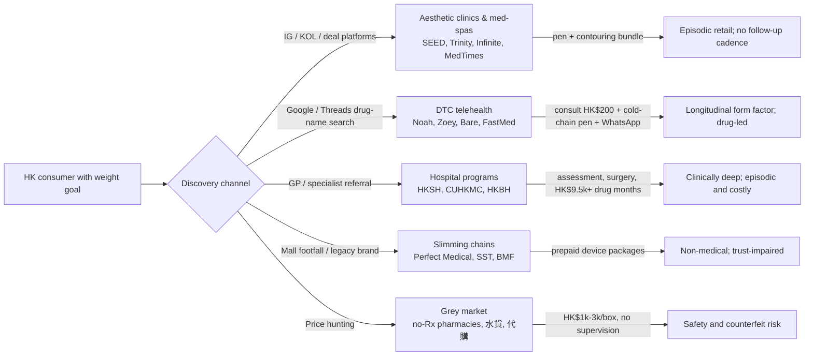

# Hong Kong Weight-Loss Providers — Combined Dossier: Legacy Slimming Chains, Aesthetic GLP-1 Retailers, Hospital Programs and Digital Entrants

**Abstract.** Hong Kong's weight-loss market is the most extreme version of the pattern Welltech has already mapped in Malaysia and Singapore: a legacy slimming industry that built listed companies on prepaid packages and celebrity transformations, then destroyed consumer trust so thoroughly that the Consumer Council publicly named operators and the government is (still) legislating a cooling-off period; a dense layer of aesthetic clinics and "medical" retail sites that now sell Ozempic, Wegovy, Mounjaro and Saxenda by brand name in Traditional Chinese at HK$3,700–11,000 per 4-week cycle; hospital-grade obesity medicine confined to episodic, surgery-anchored programs at HKSH, CUHK Medical Centre and Baptist Hospital; and a young digital cohort (Noah HK, Zoey HK, Bare HK, FastMed) that has arrived at the pen-plus-WhatsApp model faster than any regulator or incumbent. Wegovy formally launched in Hong Kong in November 2025; the government published its first Action Plan on Weight Management in March 2026 against a backdrop where 54.6% of adults aged 15–84 are overweight or obese; and a grey market of pharmacies and online shops sells GLP-1 pens without prescriptions at HK$1,000–3,000+ per box. The dossier's verdict: no operator in Hong Kong yet owns supervised, longitudinal, outcomes-accountable medical weight care — the digital entrants are closest in form but are drug-retail-first and less than three years old, and the deepest consumer scar tissue (prepayment, hard-sell, clinic collapses like 仁滙/Alliance Medical) is precisely the surface a trust-led, pay-as-you-go medical program can differentiate against.

Last updated: July 2026.

**Related documents:** [Hong Kong market intelligence](../10-market-intelligence/hong-kong-market-intelligence.md) · [Malaysia slimming centres dossier](slimming-centres.md) · [Malaysia aesthetic weight clinics dossier](aesthetic-weight-clinics.md) · [OVA / digital GLP-1 dossier](ova-health.md) · [ORA Group dossier](ora-group.md) · [Research standards](../RESEARCH-STANDARDS.md)

---

## 1. Market context in five numbers

| Indicator | Value | Source / year |
|---|---|---|
| Adults 15–84 obese (HK definition, BMI ≥25) | 32.6% (39.4% male, 26.4% female) | Population Health Survey 2020–22[^1] |
| Adults 15–84 overweight (BMI 23–<25) | 22.0% → combined 54.6% overweight/obese | Population Health Survey 2020–22[^1][^2] |
| Government response | First 3-year **Action Plan on Weight Management** (5 directions, 15 objectives), launched World Obesity Day, 4 March 2026 | Health Bureau/DH[^3][^4] |
| Wegovy availability | Launched by Novo Nordisk in Hong Kong 3 November 2025, via private clinics and selected pharmacies | Novo Nordisk PR[^5] |
| Consumer Council complaints, beauty services | 2,929 cases (2024) → 1,443 (2025); medical services complaints +248% to 1,845 in 2025 (1,299 from one clinic-group collapse) | Consumer Council year-enders[^6][^7] |

Regulatory frame in one paragraph: all four GLP-1 brands marketed in Hong Kong for weight management — Wegovy, Saxenda, Mounjaro, plus Ozempic (registered for type-2 diabetes) — are **Part 1 poisons under the Pharmacy and Poisons Ordinance (Cap. 138)**: prescription-only, dispensable only under a registered pharmacist's supervision, with illegal sale/possession punishable by up to HK$100,000 fine and two years' imprisonment.[^8][^9] Advertising of treatments to the public is constrained by the **Undesirable Medical Advertisements Ordinance (Cap. 231, enacted 1953)**; since 1 June 2012 its Schedule 4 also restricts weight-loss/fat-reduction claims for orally consumed products, and the Department of Health screens print and online media, issues warning letters, and refers repeat offenders to Police.[^10][^11] There is **no statutory cooling-off period for prepaid beauty/fitness/medical contracts** — the defining consumer-protection gap of this market (§6). The Medical Council permits telemedicine consultations and prescribing where the doctor exercises appropriate clinical judgement, which is the opening the digital cohort (§5) has exploited.[^12]

### 1.1 Channel structure at a glance



The five channels barely reference each other: hospital programs do not advertise against clinics; clinics do not warn against the grey market (they compete with it on convenience); the DTC cohort publishes price guides that commoditise everyone. No player runs the full journey from discovery through 12-month maintenance — the structural fact underlying the whitespace verdict in §7.3.

---

## 2. Legacy slimming chains

### 2.1 Sau San Tong 修身堂 (HKEX GEM: 8200)

| Item | Detail |
|---|---|
| Ownership / listing | Founded July 2000 by **Shirley Cheung 張玉珊**; in **November 2003 became the first pure slimming-and-beauty stock listed in Hong Kong** (GEM, 8200.HK).[^13][^14] |
| History & celebrity machinery | The archetype of celebrity-transformation marketing: for summer 2003 it signed **鄭欣宜 (Joyce Cheng, daughter of Lydia Shum), then 16, at ~110 kg**, and marketed her descent to ~60 kg a year later as proof of efficacy; a contracted swimsuit-ad sequel was shelved when her weight rebounded — the brand's own case study in non-durable outcomes. Successive ambassadors have included 那英, 林穎嫺, 余安安, 薛家燕 and currently 林夏薇.[^13][^15] |
| Footprint & model today | Five beauty/slimming centres in Hong Kong under the **修身堂** and **星悅** brands; services span full-body/part-body slimming, weight control, facial and body care. In 2015 it acquired **iPRO+ Medical Skin Care Centre Limited (星悅美容集團)** to enter "medical aesthetics"; the corporate site now leads with **iPRO Medical** branding, and the group has extended into **NMN anti-ageing supplements** through iPRO — a longevity-retail pivot, not a medical one.[^13][^16][^17] |
| Financials | Loss-making and shrinking: reported shareholders' loss of **HK$14.3M for FY2024** (loss widening 2.6% YoY); aggregator data show FY2024 revenue around **HK$1.09B (-11.3%)** (TipRanks) while trailing-12-month figures show **HK$860M revenue and HK$37.9M net loss** (StockAnalysis) — sources conflict on the revenue base (the group has non-slimming trading lines) but agree on direction: negative.[^18][^19][^20] |
| GLP-1 posture | None visible. Menu remains machines and courses (Theranova, Caresys, "SlimProLife", FIT MAGIC muscle-relaxation).[^16] No doctor-led pharmacotherapy program found. *(absence verified on corporate site only)* |

**Assessment.** Sau San Tong proved, twenty years early, both halves of the Hong Kong thesis: enormous media-fuelled willingness to pay for visible weight loss, and the reputational half-life of transformation marketing when weight returns. As a listed vehicle it is now a micro-cap in managed decline whose "medical" pivot is skincare and NMN retail. Not a competitive threat; a cautionary exhibit for Welltech's outcome-claims policy.

### 2.2 Perfect Medical Health Management 必瘦站 (HKEX: 1830)

| Item | Detail |
|---|---|
| Ownership / listing | HKEX Main Board-listed medical-beauty group; brand literally means "must-slim station." The financially strongest survivor of the slimming era, now positioned as "medical beauty + health management."[^21] |
| FY2025 results (yr to Mar 2025) | Revenue **HK$1,127.9M, -19.1% YoY**; profit attributable to equity holders **HK$206.9M, -34.5%**; EBITDA HK$319.1M (-30.8%; 28.3% margin); net margin 18.3%; EPS HK16.5¢ (vs 25.1¢); **dividend payout 100.6%** (HK16.6¢). Cost response: employee benefit expenses -13.3%, marketing -12.1%, headcount -302.[^21] |
| Profit warning | June 2025 profit warning citing economic downturn and subdued consumer sentiment.[^22] |
| FY2026 results (yr to Mar 2026) | Revenue **HK$962.3M, -14.7%**; profit **HK$178.7M, -13.6%**, but H2 net profit **+27.1% YoY** as retail sentiment recovered; total dividend HK14.6¢ (102.8% payout). Strategy: "high value-for-money Korean medical beauty services" and a strengthened membership loyalty program.[^21][^23] |
| Business model | Prepaid treatment packages sold through high-street/mall centres — the classic slimming-industry cash-flow machine (cash collected up front, revenue recognised on consumption), now applied to medical-beauty devices. Flagship body line is **Emsculpt / Emsculpt NEO** ("reduce 19% fat, add 16% muscle in 4 sessions"), i.e., body contouring rather than weight medicine.[^24][^25] |
| GLP-1 posture | No GLP-1 prescribing program found on its treatment menu; instead it publishes consumer-education content such as a "2025 Hong Kong Beauty Salon Guide: Common Scams & Popular Treatments" — positioning itself as the trustworthy operator in a scandal-prone category while staying non-pharmacological.[^24][^26] |
| Consumer-protection context | No Consumer Council naming action against Perfect Medical was found in this research. It operates, however, in the complaint category (beauty prepayment, §6) whose sector statistics — hundreds of sales-practice complaints yearly — define its trust environment.[^6][^27] *(company-specific complaint data not found; sector data applies)* |

**Assessment.** Perfect Medical is the segment's best operator: real profits, dividend discipline, brand scale. But its economics are prepaid-package economics, and its body-line is device-based contouring — GLP-1 commoditisation attacks its category from below (a pen outperforms an Emsculpt course on kilograms) while it has no prescribing infrastructure. Expect it either to bolt on doctor-led GLP-1 retail (it has clinics and doctors in its medical-beauty lines) or to cede the weight category and defend aesthetics. A marketing-share threat and a conceivable acquirer/partner of a medical program; not a chronic-care competitor today.

### 2.3 Marie France Bodyline HK → BMF (Bella Marie France)

| Item | Detail |
|---|---|
| Ownership | Global Beauty International / Cosmetic Care Asia stable (same parent as the Malaysian operation profiled in the [slimming-centres dossier](slimming-centres.md)); CEO Amy Quek.[^28] |
| HK trajectory | The Swiss-branded "slimming pioneer" of Hong Kong; in **2018 merged locally with Bella Skin Care to form BMF (Bella Marie France)**, a "one-stop beauty and body-sculpting centre" selling non-invasive laser/RF facial, body and hair-removal programs — the Bodyline name retired in favour of aesthetics.[^28][^29] |
| Offer & pricing | Machine/wrap slimming courses sold as packages; historical trial-price funnels (e.g., $68-for-8-sessions promotions) and package spends in the thousands documented in legacy consumer accounts across the group's markets; current HK rack rates unpublished. *(current HK package prices unknown)*[^30] |
| GLP-1 posture | None found. |

**Assessment.** Same conclusion as Malaysia: the regional market leader read its own category's decline and migrated the assets toward medical-adjacent aesthetics. The HK entity is a body-contouring spa, not a weight-care provider.

### 2.4 The long tail and the enforcement record

The rest of the legacy segment matters mainly as consumer-protection history:

- **Pretty Beauty 凱詩美容** — in November 2018 the Consumer Council took the rare step of **publicly naming and reprimanding** the 16-branch skincare/slimming/medical-beauty group after **82 complaints (2016–Oct 2018) involving ~HK$2.4M**, 60% about improper sales practices — including charging credit cards without consent and refusing refunds to disabled customers; the Council used the case to demand a mandatory cooling-off period.[^27][^31]
- **Physical 舒適堡** — the fitness-and-beauty chain's sudden September 2024 closure left consumers holding multi-year prepaid contracts and drove the "shop closure" complaint factor in beauty up 262% to 431 cases in 2024.[^6][^32]
- Onging pattern: a January 2026 RTHK report describes a woman in her seventies who had been sold **550 beauty-treatment sessions for over HK$300,000** — the Council warning consumers against buying service volumes they cannot consume.[^33]

### 2.5 Cross-chain comparison

| | Perfect Medical 必瘦站 | Sau San Tong 修身堂 | Marie France → BMF |
|---|---|---|---|
| Listing | HKEX Main Board 1830 | HKEX GEM 8200 | Private (Cosmetic Care Asia) |
| Latest revenue | HK$962.3M (FY2026, -14.7%)[^23] | ~HK$860M TTM (sources conflict)[^19][^20] | n/d |
| Profitability | HK$178.7M NP; 100%+ payout[^23] | Loss-making (HK$14–38M range across sources)[^18][^20] | n/d |
| Core weight offer | Emsculpt/Emsculpt NEO device courses[^24] | Machine slimming + 星悅 medical aesthetics[^16] | Non-invasive laser/RF contouring[^28] |
| Revenue model | Prepaid packages + membership loyalty program[^21] | Prepaid courses | Prepaid packages |
| GLP-1 program | None found | None found | None found |
| Pivot direction | Korean medical beauty, value positioning[^21] | iPRO Medical skincare + NMN supplements[^17] | Aesthetics rebrand, Bodyline name retired[^28] |
| Trust posture | Publishes anti-scam consumer guides[^26] | Celebrity ambassadors (current: 林夏薇)[^13] | Celebrity journeys (Fann Wong campaign)[^30] |

### 2.6 What the legacy era teaches a medical entrant

1. **Willingness-to-pay was proven at scale** — a pure slimming company could list on HKEX in 2003, and Perfect Medical still converted HK$962M of revenue in a recession year.[^13][^23] The demand is not the question; the vehicle is.
2. **Transformation marketing is a wasting asset.** The Joyce Cheng arc — 110 kg to 60 kg to a shelved swimsuit contract — played out in public and taught HK consumers that dramatic results revert.[^15] Any Welltech before/after marketing inherits this scepticism; durable-outcome framing (12-month maintenance data) is the counter-position.
3. **Prepayment is the industry's original sin and its regulatory endgame.** Every major trust shock of the past decade — Pretty Beauty, Physical, 仁滙 — is a prepayment story, and the legislature's answer (cooling-off) is finally in motion.[^27][^32][^81][^86]
4. **"Medical" pivots without medicine don't work.** SST's iPRO Medical is skincare and NMN retail on a loss-making base; BMF's is device aesthetics. The pivot consumers will pay for is prescriber-led pharmacotherapy with supervision — which none of the chains built.[^16][^17][^28]

**Segment verdict.** Hong Kong's legacy slimming industry is smaller, more consolidated and more discredited than Malaysia's, with two listed vehicles (one profitable, one not) and a two-decade complaint file. None of the chains has crossed into pharmacological weight care. Their enduring legacy is the trust deficit around **prepayment** — the single strongest reason for a medical entrant to price monthly and refundable.

---

## 3. Med-spa / aesthetic GLP-1 retailers

### 3.1 Segment mechanics

Chinese-language drug-name marketing is fully normalised: searches for "Ozempic 香港," "司美格魯肽 減肥 診所" and "Mounjaro 香港 價錢" return dozens of clinic and e-commerce landing pages that name Ozempic 胰妥讚, Wegovy 維秀美, Mounjaro 滿健樂/猛健樂 and Saxenda 秀身達 with prices, promo bundles and KOL endorsements.[^34][^35][^36] Because the UMAO regime is claims-based (and its weight-loss Schedule 4 targets *orally consumed products*), injectable-drug brand advertising sits in an enforcement grey zone that clinics exploit aggressively — the compliance posture is "name the drug, price the pen, gate behind a nominal consultation."[^10][^11] Media reporting confirms the loose end: SCMP found online retailers and at least one pharmacy selling the injections **without prescriptions** despite Part 1 poison rules.[^8][^37]

### 3.2 Representative operators and advertised prices

| Operator | Type | Advertised offer (HKD, as seen June–July 2026) |
|---|---|---|
| **SEED Medical 苗苗醫療** | Medical weight-management clinic with e-shop UX | Ozempic starter pack (0.25 mg + 0.5 mg pens) **HK$3,700** (from HK$4,570); Ozempic 1.0 mg avg **HK$4,180/box** (3-box purchase); Saxenda avg **HK$1,293/pen** (3-pack incl. doctor consult), single pen + consult HK$2,900; 3 pens + one BTL Vanquish body-contouring session HK$7,340 — pens bundled with legacy aesthetics, the Nexus-Malaysia pattern exactly.[^34][^38][^39] |
| **Trinity Medical 全仁醫學美容** | Aesthetic-clinic chain (Central, Causeway Bay, TST) | Wegovy, Mounjaro and Saxenda product pages; doctor consultation **HK$500**; program framed as "scientific weight management."[^40][^41] |
| **MedTimes 時代醫療** | Health-check/medical retail group | Ozempic 0.5 mg weight-management promo with waived doctor-consultation fee and basic body assessment (offer window to Jan 2026).[^42] |
| **Infinite Medical** (sold via Queen Concept deals platform) | Clinic selling through coupon channels | "香港行貨 Mounjaro… 包醫生注射, 劑量增加藥不加價" — dose-escalation price-lock marketing, KOL-designated doctors.[^36] |
| **REDEFINE / IPS / NUME Concept** | Med-spa long tail | Saxenda consult-and-buy pages; Mounjaro-vs-Saxenda comparison content ("10% vs 20% weight loss").[^43] |
| **Prevailing clinic ranges** | — | Mounjaro per 4 weeks: **2.5 mg HK$3,999–6,000; 5 mg HK$4,999–7,500; 7.5 mg HK$6,460–9,000; 10 mg HK$7,999–11,000** (Bare HK market survey of HK clinics, 2026).[^35] |

### 3.3 Mainland-shopper demand

Hong Kong's role as a pharmaceutical arbitrage hub runs in both directions. Sites such as BonplusHK market Ozempic explicitly with the keyword **"香港代購"** (HK purchasing-agent service) to mainland and cross-border buyers.[^34] The economics are narrowing: semaglutide was approved on the mainland in 2021 at RMB478/890 per 1.5/3 ml Ozempic pen — far below HK clinic prices — and **semaglutide's Chinese patent expires in 2026 with domestic generics launching**, which will collapse the southbound arbitrage and could reverse it (HK residents sourcing cheaper mainland/generic supply northbound, mirroring the existing 北上 consumption drain that Perfect Medical blames for weak HK retail).[^21][^44] Counterfeit and unregistered product risk rides on these flows (§6.3).

### 3.4 Observed UMAO/compliance postures

| Posture | Behaviour observed | Who | Risk read |
|---|---|---|---|
| **Full drug-name retail** | Brand name + price + "add to cart" UX; 代購 keywords | BonplusHK, e-commerce listings[^34][^79] | Highest — prescription-drug sale mechanics in public view; the segment most exposed if DH extends the screening-and-referral routine from oral products to injectables[^11] |
| **Drug-name + consult gate** | Brand-name landing pages with mandatory doctor consult before purchase; "香港正貨/行貨" authenticity seals | SEED, Trinity, Infinite, MedTimes[^34][^38][^40][^42] | Moderate — defensible as clinic service marketing, but the Chinese-language claims environment (KOL指定醫生, 劑量加藥不加價) invites scrutiny |
| **Condition-first editorial** | "醫學體重管理" framing, comparison education, eligibility criteria up front | Human Health, Marina Medical, hospital pages[^57][^58][^45] | Lowest — the posture a tightening regime will reward |

Two structural notes: (i) the authenticity seal ("香港正貨供應認証") has become a *marketing* device precisely because parallel imports and counterfeits are salient — trust language is already the currency; (ii) deal-platform distribution (Queen Concept coupons for Mounjaro injections) is unique to HK among Welltech's three markets and signals how completely the category is being retailed like a facial.[^36]

**Assessment.** This segment is Hong Kong's volume GLP-1 channel today: pens marked up and bundled with body-contouring, sold through drug-name SEO and deal platforms, with consultation as a checkout step rather than a care relationship. No operator publishes outcomes, retention or titration protocols. Structurally identical to Malaysia's aesthetic-clinic cohort — episodic retailers in a category whose economics are decided by 12-month retention.

---

## 4. Medical and endocrine providers

### 4.1 Private hospital programs

| Provider | Program | Notes |
|---|---|---|
| **Hong Kong Sanatorium & Hospital (HKSH)** | Weight Management and Metabolic Surgery Service | Multidisciplinary (surgeons, endocrinologists, dietitians, physiotherapists, clinical psychologists, plastic surgeons, anaesthetists, nurse specialists); surgical, endoscopic, pharmacological and lifestyle options; core procedures laparoscopic sleeve gastrectomy and Roux-en-Y bypass; counsels expected loss of ½–⅔ of excess weight in 2 years.[^45][^46] Wegovy programs at HKSH reported at **HK$9,500–12,500** (aggregator-reported; verify before citing externally).[^47] |
| **CUHK Medical Centre** | Weight Management and Metabolic Surgery Clinic + non-surgical Weight Management Programme | Private teaching-hospital model on the CUHK obesity-surgery legacy (CUHK Surgery runs a multidisciplinary metabolic & bariatric clinic); prices on enquiry.[^48][^49] |
| **HK Baptist Hospital (East Kowloon Medical Centre)** | Weight Management and Metabolic Surgery Centre | Second-tier private competitor replicating the multidisciplinary template.[^50] |
| Professional standards | Hong Kong Society for Metabolic and Bariatric Surgery **2024 position statement** (HKMJ) sets local eligibility criteria for bariatric/metabolic surgery and endoscopic procedures in HK adults.[^51] |

Private bariatric surgery pricing is not published by the hospitals; a dedicated private practice (obesitysurgery.com.hk; Surgical Care HK) markets sleeve gastrectomy (90-minute operation, 2–3 day stay) with fees on consultation.[^52] *(HK package price unpublished; Singapore reference range SGD 20,000–30,000.)*[^53]

### 4.2 Endocrinology, expat primary care and the professional bodies

- **HKASO (Hong Kong Association for the Study of Obesity)**, founded 2003 by endocrinologists, surgeons, family physicians and dietitians, anchors local pharmacotherapy standards: weight-loss drugs as adjuncts for **BMI ≥30, or ≥27 with a comorbidity**, under doctor prescription and supervision; founding president Dr Francis Chow has publicly warned about injection risks amid the boom.[^54][^55][^8] |
- **Expat/premium primary care** has quietly become a GLP-1 channel: Wegovy programs reported at **OT&P HK$8,500–10,500** and **Central Health HK$9,000–11,500** (with ongoing months ~HK$6,500–8,500) — aggregator-reported ranges; OT&P wraps them in its BodyWorX nutrition/weight service.[^47][^56] |
- **Specialist/chain clinics** (Human Health 盈健醫療, Marina Medical 海灣醫療) publish GLP-1 comparison education (Saxenda vs Mounjaro vs Ozempic vs Wegovy) and weight-management service pages — the research-stage-patient capture layer.[^57][^58] |
- **Public system**: obesity is managed within general HA chronic-disease services; a July 2025 LegCo question on obesity and the March 2026 Action Plan (whose "enhancing health service delivery" pillar is prevention-weighted) confirm there is **no funded, dedicated public medical-weight-management pathway** — public patients get lifestyle advice and, at the extreme, surgical referral.[^59][^3] |
- **University research**: CUHK is the local obesity-research pole (COVID-era doubling of child overweight/obesity with the HK Paediatric Foundation; Institute of Health Equity work on South Asian minority obesity 60.2%/89.4% general/abdominal), and CUHK medical faculty content ("減肥針" for fatty-liver patients) legitimises GLP-1s in Chinese-language health media.[^60][^61][^62] |

### 4.3 Care-economics comparison across the medical tier

| | Public system (HA) | Private hospital program | Private endocrinologist / expat GP | Aesthetic clinic |
|---|---|---|---|---|
| Entry point | GP/SOPC referral within chronic-disease clinics[^59] | Self-pay assessment or specialist referral[^45][^48] | Direct booking | Instagram/deal platform |
| Multidisciplinary depth | Diet/lifestyle advice; surgery for extreme cases | Full MDT: surgeon, endocrinologist, dietitian, physio, psychologist[^45] | Doctor + ad-hoc dietitian referral | Doctor sign-off only |
| GLP-1 supervision | Not a funded pathway[^59] | Yes, at HK$9,500–12,500/month[^47] | Yes, at HK$6,500–11,500/month[^47] | Nominal (consult HK$0–500)[^40][^42] |
| Longitudinal design | No | Program-length, then discharge | Consult-by-consult | None |
| Waiting/access | Long queues; obesity deprioritised vs diabetes/CVD *(inference from LCQ framing)*[^59] | Days | Days | Same-day |
| Who it serves | Lowest income, highest comorbidity | Affluent, surgical candidates | Affluent, expats | Mass-market aesthetic buyers |

The gap this table exposes: between the HK$500 aesthetic consult and the HK$9,500 hospital month there is **no mid-priced, protocol-driven supervised tier** — the exact slot occupied by Novi Health in Singapore (see [Novi dossier](novi-health.md)) and unfilled in Hong Kong.

**Assessment.** Hospital programs are clinically credible but episodic and surgery-anchored: patients enter for a procedure or a supervised program, not a multi-year metabolic relationship, and pricing (HK$9,500+ per Wegovy month at the top end) confines them to the affluent. Endocrinologists in private practice carry the supervised-pharmacotherapy load invisibly, one consult at a time, with no branded, scaled program. This is the credibility layer Welltech should partner with (named specialist oversight, surgical referral pathways) rather than compete against.

---

## 5. Digital / DTC entrants

### 5.1 The native cohort

| Player | Model | Advertised pricing & mechanics |
|---|---|---|
| **Noah HK (ofnoah.hk)** | Singapore-origin men's telehealth platform, launched into Hong Kong; MCHK-licensed doctors; text/video consults; discreet delivery | Fully online GLP-1 pathway (consult → prescription → delivery → follow-up); teleconsultation **HK$200**; Saxenda marketed "from HK$108/day"; publishes HK GLP-1 cost guides as SEO spine.[^63][^64][^65][^66] |
| **Zoey HK (zoey.hk)** | Sister women's brand — "doctor-led weight loss for women… a medical issue, not an aesthetic one" | Pre-intake quiz → text/video consult (**first consult HK$200, unlimited free follow-ups**) → medication delivered **within 4 hours** or self-pickup at 2,600+ locations.[^67][^63] |
| **Bare HK (barehk.com / barehongkong.com)** | GLP-1 "specialist store": licensed-doctor consult + prescription + 2–8 °C cold-chain delivery + WhatsApp medical-team follow-up | Mounjaro **from HK$1,080 per 2.5 mg 4-week cycle** (first course 4 injections HK$4,320); dose ladder HK$1,080/1,580/1,880/2,180 per cycle; advertised 12-month program ≈ **HK$23,360 (~HK$1,947/month)** — undercutting clinic rack rates by 50–75%; also markets Korean-sourced Wegovy "from HK$2,680/month" and publishes 行貨-vs-水貨 (official vs parallel import) risk guides.[^68][^35][^69] |
| **FastMed 醫家有藥** | Online pharmacy/clinic hybrid | "全城最平" (cheapest-in-town) Saxenda positioning; Mounjaro guides; buy-flow with prescription step.[^70][^71] |
| **Pulse Clinic** | Regional lifestyle-clinic network | Markets Wegovy to Hong Kong residents including via **Thailand fulfilment** — institutionalising the "Bangkok hop" that aggregator content (Panya's HK GLP-1 buyer's guide) documents as a price-arbitrage behaviour.[^72][^47] |

Chinese media descriptions of the cohort are apt: "Zoey/Noah 等線上平台" work by web/WhatsApp intake, doctor review, and couriered pens, with online-platform GLP-1 pricing spanning **HK$3,000–8,000/month** depending on drug and dose.[^35][^66]

### 5.2 Head-to-head: the digital three

| Dimension | Noah HK | Zoey HK | Bare HK |
|---|---|---|---|
| Positioning | Men's one-stop telehealth (sexual health, hair, sleep, weight)[^63] | Women's medical weight loss — "a medical issue, not an aesthetic one"[^67] | GLP-1 category specialist, gender-neutral, price-led[^68] |
| Consult | Online (text/video), MCHK-licensed doctors, HK$200[^63][^66] | HK$200 first consult, unlimited free follow-ups[^67] | Bundled into pen price[^68] |
| Fulfilment | Discreet delivery | 4-hour delivery or 2,600+ pickup points[^67] | 2–8 °C cold-chain courier[^68] |
| Follow-up | Doctor-led ongoing follow-up (unpriced)[^63] | Free follow-ups as retention hook[^67] | WhatsApp medical-team follow-up[^68] |
| Content strategy | English + Chinese cost guides, "complete guide 2026" SEO[^66] | Condition-first women's framing | The market's price-transparency machine: dose-ladder tables, 行貨-vs-水貨 risk guides, competitor price surveys[^35][^69] |
| Anchor price | Saxenda from HK$108/day[^64] | GLP-1 program (drug-dependent) | Mounjaro from HK$1,080/4-wk cycle; 12-month ≈ HK$23,360[^68][^35] |
| Structural gap *(analyst read)* | Weight is one SKU among many; men-only ceiling | Best positioning language in HK; thinnest public clinical scaffolding | Pure drug retail economics; "medical team" is a support desk, not a program |

None of the three publishes outcome data, retention rates, adverse-event handling protocols, or clinician rosters beyond "licensed doctors" — the entire clinical-evidence layer is open. *(absence assessed across their public sites and blogs, July 2026)*

### 5.3 International spillover watchlist

- **Eucalyptus/Juniper** (AU): operates Australia, UK, Germany, Japan, Canada — **no Hong Kong presence**; being acquired by **Hims & Hers for up to US$1.15B (announced February 2026)**, which puts a US$ war chest behind Asia-Pacific expansion decisions. Watch for a HK/SG move post-close.[^73][^74] |
- **ORA Group** (SG; parent of OVA and andSons, see [ORA dossier](ora-group.md)): US$10M Series A; launched **hybrid (virtual + in-person) weight management in Singapore in February 2025**; operates SG/MY/PH with stated "big plans" for Asia — **no confirmed Hong Kong entry** found.[^75][^76] |
- **Noah/Zoey** are themselves the Singapore spillover that already landed.[^65]

### 5.4 Grey market

The unsupervised channel is large and documented: Sing Tao's undercover team filmed licensed pharmacies illegally selling 瘦瘦筆 with sales patter ("想瘦邊就打邊度" — inject wherever you want to slim); Wen Wei Po reporters bought pens through a pharmacy's online platform with **no prescription**, at HK$1,000–3,000+ per box; SCMP's "No prescription, no problem" investigation reached the same finding.[^77][^78][^37] Unregistered oral "semaglutide tablets" of purported Japanese origin circulate on HK e-commerce sites.[^79] This channel competes on price and convenience against every legitimate provider — and generates the adverse-event headlines that will eventually drive regulatory tightening.

**Assessment.** Hong Kong is ahead of Malaysia on digital form factor: Noah/Zoey/Bare have already assembled tele-consult + cold-chain + WhatsApp follow-up. But all three are **drug-fulfilment-first**: the consult is HK$200 and the content is price-guide SEO; none publishes clinical outcomes, retention data, or a structured titration/comorbidity protocol; none owns labs, body-composition, dietetics or psychology layers. The care model above the pen is unbuilt.

---

## 6. Consumer-protection and regulatory context

### 6.1 The complaint record

- **2024**: >40,000 total Consumer Council complaints. Beauty category 2,929, within which slimming services 61 cases (+13%), spa/massage 490 (+66%), skincare 389 (+17%), laser/IPL 264 (+24%), plastic surgery/injections 99 (+19%); "shop closure" cause +262% to 431 cases (Physical 舒適堡 effect); LegCo-cited prepayment complaints >1,700 involving ~HK$60M.[^6][^80] |
- **2025**: total 35,969 (-4%); beauty fell 51% to 1,443 (HK$32.2M) — but **medical services complaints rose 248% to 1,845 (HK$16.3M)**, of which 1,299 stemmed from the 仁滙 collapse: the complaint load migrated from salons to clinics.[^7] |

### 6.2 仁滙醫務集團 (Alliance Medical Group) — the prepayment scandal goes medical

On 30 April 2025 the clinic group abruptly closed. Within a week Customs/Police had 1,686 reports involving HK$7.2M and the Consumer Council 844 complaints; combined reports reached ~2,530 (~HK$12M). Customs arrested the sole director and company secretary under the Trade Descriptions Ordinance's "wrongly accepting payment" offence — the group had been selling prepaid medical services days before closing — though the case was later closed for insufficient evidence, with the Council directing victims to civil claims; a winding-up petition followed in September 2025.[^81][^82][^83] Consequences that matter for market structure: (i) the government announced it would **re-study a statutory cooling-off period**; (ii) the episode exposed that the **Private Healthcare Facilities Ordinance still does not cover day clinics** six years on — the Health Bureau targeted bringing clinics under it from Q4 2025; (iii) the Medical Association observed a medical group entangled in prepaid-consumption disputes was "without precedent."[^84][^85] The pending cooling-off design: mandatory for beauty/fitness contracts ≥HK$3,000, on either a "3+7" or "7+14" working/calendar-day model.[^86][^87]

### 6.3 Drug-safety enforcement

- **Adulterated slimming products**: DH investigations of illegal online sales recur — March 2025, May 2025 (product containing **sibutramine + furosemide**, both Part 1 poisons; sibutramine banned in HK since November 2010 for cardiovascular risk), April 2024, and January 2026; penalties up to HK$100,000/2 years per offence.[^88][^89][^90][^91] |
- **GLP-1-specific**: the Drug Office relayed the FDA's December 2023 counterfeit-Ozempic alert to HK consumers; no seizure of counterfeit semaglutide *within* HK's regulated supply chain was found in this research — the local exposure is the no-prescription pharmacy/online channel (§5.3) and parallel-import ("水貨") pens outside cold-chain custody.[^92][^77][^78] |
- **UMAO enforcement** remains letter-first (media screening → warning letters → police referral for repeat offences); no prosecution of a GLP-1 advertiser was identified — consistent with the observed impunity of drug-name clinic marketing.[^11] |

### 6.4 Timeline of trust shocks and regulatory responses

| Year | Event | Consequence |
|---|---|---|
| 2003 | Sau San Tong lists on GEM off the Joyce Cheng transformation campaign[^13][^15] | Slimming becomes investable — and celebrity-outcome marketing becomes the category norm |
| 2010 | Sibutramine banned in HK (cardiovascular risk)[^88] | Start of the recurring adulterated-slimming-product enforcement cycle |
| 2012 | UMAO Schedule 4 extends to weight-loss claims for oral products[^10][^11] | Claims regulation — but injectables left in a grey zone later exploited by GLP-1 marketing |
| 2018 | Consumer Council names and reprimands Pretty Beauty (82 complaints, ~HK$2.4M)[^27][^31] | First public naming in the segment; Council formally demands mandatory cooling-off |
| 2019 | Government consults on statutory cooling-off for beauty/fitness contracts[^87] | Legislation stalls |
| Sep 2024 | Physical 舒適堡 fitness/beauty chain collapses; "shop closure" complaints +262%[^6][^32] | Prepayment risk moves from sales-practice issue to insolvency issue |
| Nov 2025 | Wegovy launches in HK[^5] | Legitimate obesity pharmacotherapy gets a registered, marketed product |
| Apr–May 2025 | 仁滙 Alliance Medical collapses: ~2,530 reports, ~HK$12M; director arrested; case later closed, victims sent to civil claims[^81][^82][^83] | Prepayment scandal jumps categories into *medicine*; cooling-off revived; clinic licensing under PHFO accelerated[^84] |
| 2025–26 | DH investigations of online slimming products (Mar/May 2025, Jan 2026); undercover exposés of no-Rx pen sales (Sing Tao; Wen Wei Po Apr 2026)[^88][^89][^91][^77][^78] | GLP-1 supply chain integrity becomes a live media story |
| Mar 2026 | First Action Plan on Weight Management[^3] | Obesity framed as population-health priority; no public treatment arm funded |

The pattern: regulation follows scandal with a 1–7 year lag, and each cycle ratchets scrutiny toward exactly the practices (prepayment, drug-name promotion, unsupervised supply) that current GLP-1 sellers depend on.

**Regulatory outlook.** Three converging tracks — cooling-off legislation, clinic licensing under PHFO, and the post-仁滙 political salience of prepaid medicine — point one direction: **the prepaid-package model is living on borrowed time, and pay-per-month, transparently priced medical services will be swimming with the regulatory tide.**

---

## 7. Synthesis

### 7.1 Price-benchmark master table (HKD, advertised, mid-2026)

| Provider (type) | Drug / program | Advertised price | Basis |
|---|---|---|---|
| Bare HK (DTC) | Mounjaro 2.5 mg, 4-wk cycle | **HK$1,080** (ladder to HK$2,180 at 10 mg) | incl. consult, cold chain, WhatsApp follow-up[^68] |
| Bare HK (DTC) | 12-month Mounjaro program | ~HK$23,360 (~HK$1,947/mo) | advertised plan total[^35] |
| Noah HK (DTC) | Saxenda | "from HK$108/day" (~HK$3,240/mo) | telehealth consult HK$200[^64][^66] |
| Online platforms generally (DTC) | GLP-1, monthly | HK$3,000–8,000 | market-survey range[^35] |
| SEED Medical (clinic-retail) | Ozempic starter (0.25+0.5 mg) | HK$3,700 (from HK$4,570) | promo bundle[^34] |
| SEED Medical (clinic-retail) | Ozempic 1.0 mg / box | HK$4,180 (3-box avg) | incl. pre-injection check[^38] |
| SEED Medical (clinic-retail) | Saxenda per pen | HK$1,293 (3-pack) – HK$2,900 (single + consult) | bundle-dependent[^39] |
| HK clinics, prevailing (aesthetic) | Mounjaro per 4 weeks | 2.5 mg HK$3,999–6,000 → 10 mg HK$7,999–11,000 | market survey[^35] |
| Trinity Medical (aesthetic) | Wegovy/Mounjaro program | consult HK$500 + drug | 3 locations[^40][^41] |
| OT&P (expat primary care) | Wegovy program | HK$8,500–10,500 | aggregator-reported[^47] |
| Central Health (expat primary care) | Wegovy program | HK$9,000–11,500 initial; ~HK$6,500–8,500 ongoing/mo | aggregator-reported[^47] |
| HKSH (hospital) | Wegovy program | HK$9,500–12,500 | aggregator-reported[^47] |
| Grey market (pharmacy/online, illegal) | GLP-1 pens, no Rx | HK$1,000–3,000+/box | undercover reporting[^78] |
| Mainland reference | Ozempic 1.5/3 ml | RMB478/890 (~HK$520/970) | 2021 launch prices; generics from 2026[^44] |

Read-through: the legitimate market spans **HK$1,080 to HK$12,500 for the same molecule-month** — an 11× spread in which price signals channel, not clinical value. The floor (Bare, grey market, future mainland generics) is falling; the defensible margin is in the *service layer*, which nobody has priced.

### 7.2 Strategic-group map

```mermaid
quadrantChart
    title Hong Kong weight-loss providers - medical depth vs care longitudinality
    x-axis Episodic transaction --> Longitudinal care
    y-axis Non-medical --> Medical depth
    quadrant-1 Whitespace: supervised chronic weight care
    quadrant-2 Hospital programs
    quadrant-3 Legacy slimming retail
    quadrant-4 Emerging DTC
    "HKSH / CUHKMC / HKBH": [0.35, 0.9]
    "Private endocrinologists": [0.45, 0.85]
    "OT&P / Central Health": [0.5, 0.7]
    "Aesthetic GLP-1 retailers (SEED, Trinity)": [0.2, 0.55]
    "Noah / Zoey": [0.55, 0.6]
    "Bare HK / FastMed": [0.4, 0.45]
    "Perfect Medical (Emsculpt)": [0.3, 0.25]
    "Sau San Tong / BMF": [0.25, 0.1]
    "Grey-market pharmacies": [0.1, 0.15]
```

### 7.3 Whitespace verdict

**Who owns supervised, longitudinal medical weight care in Hong Kong? Nobody.**

- Hospitals own *credibility* but sell episodes (surgery, assessments) at HK$9,500+/month drug pricing.
- Aesthetic clinics own *volume* but are pen retailers with a HK$500 consult as checkout friction.
- Legacy chains own *nothing* any more except the cautionary tale; neither listed slimming company has a pharmacotherapy program.
- Digital entrants own the *form factor* (tele-consult, cold chain, WhatsApp) but are <3 years old, drug-price-led, gendered-vertical-scoped (Noah men / Zoey women), and publish no outcomes, no retention, no protocolised titration or comorbidity management.
- The public system, per the 2026 Action Plan, is prevention-weighted and offers no funded medical-weight pathway.[^3][^59]

The unclaimed position: **a doctor-accountable program that treats obesity as a chronic disease — labs, body composition, dietetics, psychology, structured titration, 12-month retention design — priced monthly (no prepayment), delivered WhatsApp-first with physical touchpoints, and marketed on trust against the industry's scar tissue.** Every element exists in fragments; no operator assembles them.

### 7.4 Threat / partner calls

| Player | Call | Rationale |
|---|---|---|
| Noah/Zoey HK | **Primary threat** | Same form factor, funded, already localised; watch for them adding a service layer. Move before they do. |
| Bare HK / FastMed | Price-anchor threat | They set the HK$1,080–2,000/month floor; do not fight them on pen price. |
| Perfect Medical | Watch / conceivable partner-acquirer | Cash-generative, 100%-payout board suggests limited appetite to build; could buy rather than build a medical program. |
| HKSH / CUHKMC / endocrinologists | **Partner** | Referral pathways (bariatric surgery, complex comorbidity), named-specialist credibility, protocol co-design. |
| OT&P / Central Health | Partner or niche competitor | Expat-premium segment; potential B2B2C channel. |
| Eucalyptus(Hims)/ORA | Strategic watchlist | Either could make HK a 2026–27 expansion market post-funding events.[^73][^75] |
| Grey market / mainland generics | Structural price threat | Plan for molecule-price deflation from 2026 patent expiry; build economics on service, not drug margin.[^44] |

### 7.5 Implications for Welltech

1. **Price against the spread, not the floor.** At HK$1,080–12,500/month for the same drug, a transparent HK$2,500–4,000/month all-in supervised program (drug + labs + dietitian + WhatsApp care team) undercuts hospitals and expat clinics while out-servicing DTC — and its economics survive drug-price deflation because margin sits in care.
2. **Weaponise the trust deficit.** Monthly billing, no prepaid packages, published refund policy, published outcomes: each maps 1:1 against a documented industry failure (Pretty Beauty, Physical, 仁滙) and aligns with the coming cooling-off law rather than fighting it.[^27][^81][^86]
3. **Comply visibly where competitors skate.** Chinese-language drug-name advertising is the norm and an enforcement grey zone; a condition-first ("醫學體重管理"), claims-clean marketing posture is both UMAO-safe and a differentiator when enforcement tightens.[^10][^11]
4. **WhatsApp-first is validated, not differentiating.** Bare already bundles WhatsApp medical follow-up; differentiation must be *what travels over it* — titration protocols, side-effect triage, comorbidity monitoring — not the channel itself.[^68]
5. **Ride the policy wave.** The March 2026 Action Plan makes weight management a government theme for three years with no public delivery arm — the private program that can show outcomes will own the narrative (and any future employer/insurer channel).[^3]
6. **Sequence the verticals like Noah/Zoey but keep one clinical spine.** The gendered-brand split works for acquisition, but the defensible asset is a single obesity-medicine protocol and dataset across brands.

### 7.6 Scenario outlook, 2026–28 *(analyst estimates)*

| Scenario | Trigger | Effect on the landscape | Welltech posture |
|---|---|---|---|
| **Molecule-price collapse** (high likelihood) | Mainland semaglutide generics post-2026 patent expiry; parallel-import pressure[^44] | Pen margins compress across clinics and DTC; grey market grows before enforcement catches up; service-layer differentiation becomes the only margin | Build economics assuming ≤HK$1,500/month drug cost by 2028; never anchor brand on drug price |
| **Regulatory tightening** (high likelihood, timing uncertain) | Cooling-off law passes; clinics brought under PHFO; a GLP-1 adverse-event scandal from the no-Rx channel[^84][^86][^78] | Prepaid sellers forced to restructure; drug-name advertising curbed; compliance becomes a moat for clean operators | Be the operator regulators cite as the model; publish protocols before being asked |
| **Big-platform entry** (moderate likelihood) | Hims/Eucalyptus post-acquisition APAC push; ORA adds HK; EC Healthcare or Perfect Medical buys a DTC player[^73][^75][^21] | Marketing costs inflate; category education accelerates; second-mover local brands squeezed | Move before 2027; lock specialist partnerships (HKSH/CUHKMC referral lines) that money can't quickly buy |
| **Demand normalisation** (base case) | Action Plan keeps obesity salient; Wegovy/Mounjaro marketing normalises treatment[^3][^5] | Category migrates from aesthetic quick-fix to chronic-disease framing — the framing only medical operators can serve credibly | Ride the reframing: clinical voice, outcomes reporting, comorbidity bundles (see the [longevity dossiers](malaysia-longevity-clinics.md)) |

---

## References

[^1]: Centre for Health Protection, Department of Health, "Obesity" (Population Health Survey 2020–22: 32.6% obese, 22.0% overweight, persons aged 15–84), https://www.chp.gov.hk/en/healthtopics/content/25/8802.html (accessed July 2026).
[^2]: Hong Kong Association for the Study of Obesity, "Hong Kong Obesity Prevalence and Survey Findings", https://www.hkaso.org/p/41439 (accessed July 2026).
[^3]: HKSAR Government press release, "Hong Kong's inaugural Action Plan on Weight Management launched to build healthy and vibrant city", 4 March 2026, https://www.info.gov.hk/gia/general/202603/04/P2026030400320.htm (accessed July 2026).
[^4]: Hong Kong Free Press, "Hong Kong launches first action plan to combat obesity", 5 March 2026, https://hongkongfp.com/2026/03/05/hong-kong-launches-first-action-plan-to-combat-obesity/ (accessed July 2026); see also SCMP, "Hong Kong launches 3-year action plan to help residents fight the flab", https://www.scmp.com/news/hong-kong/health-environment/article/3345436/hong-kong-launches-3-year-action-plan-help-residents-fight-flab.
[^5]: PR Newswire, "Novo Nordisk Launches Wegovy® in Hong Kong for Weight Management", 3 November 2025, https://www.prnewswire.com/apac/news-releases/novo-nordisk-launches-wegovy-in-hong-kong-for-weight-management-302602289.html (accessed July 2026).
[^6]: Consumer Council press release, "Consumer Complaints Exceeded 40,000 Cases… (2024 year-ender)", https://www.consumer.org.hk/en/press-release/p-2024-year-ender (accessed July 2026).
[^7]: Consumer Council press release (Traditional Chinese), "全年消費投訴3.8萬宗 結束3年升勢…(2025 year-ender)", https://www.consumer.org.hk/tc/press-release/p-2025-year-ender (accessed July 2026).
[^8]: South China Morning Post, "Explainer: Worth the weight? What Hongkongers should know about slimming injections", https://www.scmp.com/news/hong-kong/health-environment/article/3341137/worth-weight-what-hongkongers-should-know-about-slimming-injections (accessed July 2026).
[^9]: Healthy Matters, "司美格魯肽 (Semaglutide) in Hong Kong", https://www.healthymatters.com.hk/zh/medicines/semaglutide-in-hong-kong/ (accessed July 2026).
[^10]: Drug Office, Department of Health, "Undesirable Medical Advertisements Ordinance", https://www.drugoffice.gov.hk/eps/do/en/pharmaceutical_trade/other_useful_information/umao.html (accessed July 2026).
[^11]: Drug Office, "Frequently Asked Questions on the Undesirable Medical Advertisements Ordinance", https://www.drugoffice.gov.hk/eps/do/en/doc/guidelines_forms/FAQs_on_UMAO_Eng_for_upload.pdf (accessed July 2026).
[^12]: Noah HK, "How Online GLP-1 Consultations Work in Hong Kong", https://www.ofnoah.hk/blog-en/how-online-glp-1-consultations-work-in-hong-kong (accessed July 2026).
[^13]: Wikipedia (Traditional Chinese), "修身堂" (founding July 2000; November 2003 first pure slimming stock; brands, ambassadors, iPRO acquisition), https://zh.wikipedia.org/zh-hk/%E4%BF%AE%E8%BA%AB%E5%A0%82 (accessed July 2026).
[^14]: Yahoo Finance, "Sau San Tong Holdings Limited (8200.HK) Company Profile", https://finance.yahoo.com/quote/8200.HK/profile/ (accessed July 2026).
[^15]: iHKTV/Next Magazine (reproduction), "飛走爆肥鄭欣宜 張玉珊頂硬上拍泳衣廣告", https://www.ihktv.com/next-1264-shirley-cheung.html (accessed July 2026).
[^16]: Sau San Tong corporate site (iPRO Medical branding; Theranova/Caresys/SlimProLife menus), https://www.sausantong.com/ (accessed July 2026).
[^17]: HK01 財經快訊, "修身堂旗下iPro推抗衰老NMN產品 拓展保健產品業務", https://www.hk01.com/%E8%B2%A1%E7%B6%93%E5%BF%AB%E8%A8%8A/854119/ (accessed July 2026).
[^18]: Futubull/Moomoo, Sau San Tong (08200) results coverage (FY2024 shareholders' loss HK$14.297M, +2.61% YoY), https://www.futunn.com/en/stock/08200-HK/news/major-events (accessed July 2026).
[^19]: TipRanks, "Sau San Tong Holdings (HK:8200) Revenue" (FY2024 revenue HK$1.09B, -11.27%), https://www.tipranks.com/stocks/hk:8200/revenue (accessed July 2026).
[^20]: StockAnalysis.com, "Sau San Tong Holdings (HKG:8200) Statistics" (TTM revenue HK$860.43M; net loss HK$37.94M), https://stockanalysis.com/quote/hkg/8200/statistics/ (accessed July 2026).
[^21]: Quartr, "Perfect Medical Health Management (1830) — H2/FY2025 earnings summary" (revenue HK$1,127.9M -19.1%; NP HK$206.9M -34.5%; EBITDA HK$319.1M; payout 100.6%; headcount -302), https://quartr.com/companies/perfect-medical-health-management-limited_19555 and https://quartr.com/events/perfect-medical-health-management-limited-1830-h2-2025_FPM1lD22 (accessed July 2026).
[^22]: FilingReader, "Perfect Medical issues profit warning amid economic downturn", 17 June 2025, https://filingreader.com/news-wire/hongkong/2025-06-17/perfect-medical-issues-profit-warning-amid-economic-downturn (accessed July 2026).
[^23]: Minichart, "Perfect Medical Health Management Limited Announces FY2026 Annual Results" (revenue HK$962.3M -14.7%; NP HK$178.7M -13.6%; H2 NP +27.1%; DPS 14.6¢, 102.8% payout), 1 July 2026, https://www.minichart.com.sg/2026/07/01/perfect-medical-health-management-limited-announces-fy2026-annual-results-revenue-and-profit-recovery-dividend-payout-and-strategic-outlook/ (accessed July 2026).
[^24]: Perfect Medical, "Emsculpt 減脂增肌療程" and treatment menu, https://www.psmedical.com.hk/emsculpt/ and https://www.psmedical.com.hk/treatment/ (accessed July 2026).
[^25]: Perfect Medical, "Emsculpt NEO 第2代減脂增肌療程", https://www.psmedical.com.hk/emsculpt-neo/ (accessed July 2026).
[^26]: Perfect Medical (EN blog), "2025 Hong Kong Beauty Salon Guide: Common Scams & Popular Treatments", https://www.psmedical.com.hk/en/blog/slimming-tips/2025-hong-kong-beauty-salon-guide/ (accessed July 2026).
[^27]: Consumer Council press release, "The Consumer Council Named and Reprimanded a Beauty Service Group for High Pressure Sales – Called for Mandatory Cooling-off Period", https://www.consumer.org.hk/en/press-release/pretty-beauty (accessed July 2026).
[^28]: Jin Communications press release, "香港一站式美容塑身中心BMF…" (BMF formed 2018 from merger of Bella Skin Care and Marie France Bodyline in HK), https://www.jin-comm.com/single-post/%E9%A6%99%E6%B8%AF%E4%B8%80%E7%AB%99%E5%BC%8F%E7%BE%8E%E5%AE%B9%E5%A1%91%E8%BA%AB%E4%B8%AD%E5%BF%83bmf (accessed July 2026).
[^29]: BMF Clinic (group brand history), https://www.bmfclinic.com.sg/our-brand (accessed July 2026).
[^30]: Marie France Asia (HK edition), "Marie France Bodyline: Fann Wong's authentic slimming journey" (promotional trial-price example), https://www.mariefranceasia.com/hk/beauty-hk/whats-new-hk/marie-france-bodyline-fann-wongs-authentic-slimming-journey-341205.html (accessed July 2026).
[^31]: South China Morning Post, "Pretty Beauty Centre in Hong Kong rebuked over cases of unscrupulous sales tactics" (82 complaints 2016–Oct 2018, ~HK$2.4M, 16 branches), https://www.scmp.com/news/hong-kong/hong-kong-economy/article/2174991/pretty-beauty-centre-hong-kong-rebuked-over-more-80 (accessed July 2026).
[^32]: HKBU 新報人, "「硬銷」中的美容服務 冷靜期的「期」待如「霧」" (Physical 舒適堡 September 2024 closure; beauty sales-practice complaint averages 2019–24), 18 June 2025, https://spyan-jour.hkbu.edu.hk/2025/06/18/ (accessed July 2026).
[^33]: RTHK, "七旬投訴人花逾30萬買550次美容療程 消委會籲勿買過量服務", 15 January 2026, https://news.rthk.hk/rthk/ch/component/k2/1839958-20260115.htm (accessed July 2026).
[^34]: BonplusHK, "Ozempic (胰妥讚) 減肥針｜…｜Ozempic 香港代購" product page, https://bonplushk.com/product/Ozempic- (accessed July 2026); SEED Medical Ozempic starter-pack promo pricing via https://www.seedmedicalhk.com/%E9%AB%94%E9%87%8D%E7%AE%A1%E7%90%86 (accessed July 2026).
[^35]: Bare HK (Chinese), "Mounjaro 滿健樂幾錢？2026 香港價錢全攻略" (clinic dose-ladder ranges; Bare plan totals; online-platform HK$3,000–8,000 range), https://barehongkong.com/blogs/news/mounjaro-%E5%83%B9%E9%8C%A2 (accessed July 2026).
[^36]: Queen Concept deals platform, "【Infinite Medical】香港行貨 Mounjaro 滿健樂 (tirzepatide) 包醫生注射…", https://queenconcept.com.hk/item/%E3%80%90Infinite-Medical%E3%80%91 (accessed July 2026).
[^37]: South China Morning Post, "Exclusive: No prescription, no problem — Hong Kong's grey zone for weight-loss injections", https://www.scmp.com/news/hong-kong/health-environment/article/3341117/no-prescription-no-problem-hong-kongs-grey-zone-weight-loss-injections (accessed July 2026).
[^38]: SEED Medical, "【香港正貨供應認証】Ozempic® 胰妥讚 減肥筆 (1.0mg) (包括注射前基本身體檢查)", https://www.seedmedicalhk.com/product-page/ozempic-1-0mg-%E6%B8%9B%E8%82%A5%E7%AD%86-%E9%A6%99%E6%B8%AF%E6%AD%A3%E8%B2%A8 (accessed July 2026).
[^39]: SEED Medical, "Saxenda® 秀身達減肥筆 (一盒三支) 平均每枝價錢$1293 (包括醫生諮詢)" and single-pen listing, https://www.seedmedicalhk.com/product-page/%E9%A6%99%E6%B8%AF%E6%AD%A3%E8%B2%A8%E4%BE%9B%E6%87%89%E8%AA%8D%E8%A8%BC-saxenda-%E7%A7%80%E8%BA%AB%E9%81%94%E6%B8%9B%E8%82%A5%E7%AD%86-%E4%B8%80%E7%9B%92%E4%B8%89%E6%94%AF (accessed July 2026).
[^40]: Trinity Medical Aesthetic, "Wegovy (Semaglutide) GLP-1", https://trinitymedical.com.hk/product/wegovy_semaglutide/ (accessed July 2026).
[^41]: Trinity Medical Aesthetic, "Mounjaro (Tirzepatide)" (consultation HK$500; Central/Causeway Bay/TST), https://trinitymedical.com.hk/product/mounjaro_tirzepatide/ (accessed July 2026).
[^42]: MedTimes 時代醫療, "【體重管理優惠】Ozempic® (0.5mg)" promotion page, https://www.medtimes.com.hk/discount/detail.html?id=+1278 (accessed July 2026).
[^43]: REDEFINE, "SAXENDA 秀身達價錢 全身減肥", https://www.redefine.com.hk/saxenda; NUME Concept, "減重 10% vs. 20%？…Mounjaro滿健樂 vs Saxenda", https://numeconcept.com/products/%E6%B8%9B%E9%87%8D-10-vs-20-%E9%81%B8%E5%B0%8D%E6%96%B9%E6%B3%95-%E6%95%88%E6%9E%9C%E5%A4%A9%E5%B7%AE%E5%9C%B0%E5%88%A5 (accessed July 2026).
[^44]: HK01 即時中國, "天價減肥藥將降價？司美格魯肽在中國專利到期 國產仿製藥上市" (mainland 2021 approval at RMB478/890; 2026 patent expiry), https://www.hk01.com/%E5%8D%B3%E6%99%82%E4%B8%AD%E5%9C%8B/1024906/ (accessed July 2026).
[^45]: Hong Kong Sanatorium & Hospital, "Weight Management and Metabolic Surgery Service", https://www.hksh-hospital.com/ds/en/surgery-centre/our-services/weight-management.php (accessed July 2026).
[^46]: HKSH Mobile, "Surgery Centre — Obesity Surgery" (procedures; expected loss ½–⅔ excess weight in 2 years), https://mobile.hksh.com/en/clinical-services/clinical-centres-specialties-and-services/surgery-centre-obesity-surgery (accessed July 2026).
[^47]: Panya, "Hong Kong GLP-1 buyer's guide 2026: HK private clinics + the Bangkok-hop story" (OT&P HK$8,500–10,500; Central Health HK$9,000–11,500 with ongoing HK$6,500–8,500; HKSH HK$9,500–12,500), https://panya.health/blog/hong-kong-glp1-buyers-guide-2026 (accessed July 2026 via search index; aggregator figures — verify with providers before external citation).
[^48]: CUHK Medical Centre, "Weight Management and Metabolic Surgery Clinic", https://www.cuhkmc.hk/services/weight-management-and-metabolic-surgery-clinic (accessed July 2026).
[^49]: Department of Surgery, CUHK, "Multidisciplinary Clinic of Metabolic & Bariatric Surgery", https://www.surgery.cuhk.edu.hk/coc/interventions.htm (accessed July 2026).
[^50]: Hong Kong Baptist Hospital East Kowloon Medical Centre, "Weight Management and Metabolic Surgery Centre", https://www.hkbh.org.hk/EKMC/en/centre/weight-management-and-metabolic-surgery-centre/ (accessed July 2026).
[^51]: Hong Kong Medical Journal, "Recommendations for eligibility criteria concerning bariatric and metabolic surgical and endoscopic procedures for obese Hong Kong adults 2024: HKSMBS Position Statement", https://www.hkmj.org/abstracts/v30n3/233.htm (accessed July 2026).
[^52]: Surgical Care HK, "Bariatric & Metabolic Surgery", https://surgicalcarehk.com/en/services/bariatric-metabolic-surgery/; see also https://www.obesitysurgery.com.hk/english.html (accessed July 2026).
[^53]: G&L Surgical (Singapore), "How Much Does Bariatric Surgery Cost?" (SGD 20,000–30,000 reference), https://www.glsurgical.com.sg/how-much-does-bariatric-surgery-cost/ (accessed July 2026).
[^54]: Hong Kong Association for the Study of Obesity, "Drug Therapy" (BMI ≥30 or ≥27 + comorbidity criteria; GLP-1 RA approval), https://www.hkaso.org/p/41444 (accessed July 2026).
[^55]: Hong Kong Association for the Study of Obesity, "About HKASO" (founded 2003; multidisciplinary membership), https://www.hkaso.org/ (accessed July 2026).
[^56]: OT&P BodyWorX, "Nutrition, Dietetics & Weight Management", https://bodyworx.otandp.com/services/nutrition-weight-management (accessed July 2026).
[^57]: Human Health Holdings, "A comprehensive comparison of Hong Kong weight loss injections: Saxenda vs Mounjaro vs Ozempic vs Wegovy", https://humanhealth.com.hk/en/healthinfo/info_detail/glp1compare/ (accessed July 2026).
[^58]: Marina Medical, "About Weight Management", https://marinamedical.hk/en/services/weight-management/about-weight-management (accessed July 2026).
[^59]: HKSAR Government, "LCQ1: Obesity in the population", 9 July 2025, https://www.info.gov.hk/gia/general/202507/09/P2025070900418.htm (accessed July 2026).
[^60]: Hong Kong Free Press, "Proportion of Hong Kong children who are overweight, obese more than doubled during Covid-19 — CUHK study", https://hongkongfp.com/2022/06/23/proportion-of-hong-kong-children-who-are-overweight-obese-more-than-doubled-during-covid-19-cuhk-study/ (accessed July 2026).
[^61]: PubMed, "Risk Factors Associated With General and Abdominal Obesity Among South Asian Minorities in Hong Kong" (CUHK Institute of Health Equity; 60.2%/89.4%), https://pubmed.ncbi.nlm.nih.gov/39180302/ (accessed July 2026).
[^62]: CUHK 閱肝 (Liver Centre), "「減肥針」隆重登場！脂肪肝病人期受惠…", https://livercenter.com.hk/article/ (accessed July 2026).
[^63]: Noah HK, "Weight Loss Treatment | Injections For Managing Weight", https://www.ofnoah.hk/en/physical-health/weight-loss; Noah HK homepage "全港最大男士健康線上診所", https://www.ofnoah.hk/ (accessed July 2026).
[^64]: Noah HK, "線上購買saxenda減肥針｜每日 $108 起", https://www.ofnoah.hk/medications/saxenda (accessed July 2026).
[^65]: MobiHealthNews, "Singapore-based digital men's clinic Noah launches in Hong Kong", https://www.mobihealthnews.com/news/asia/singapore-based-digital-mens-clinic-noah-launches-hong-kong (accessed July 2026).
[^66]: Noah HK, "How Much Does GLP-1 Weight Loss Treatment Cost in Hong Kong?" and "GLP-1 Weight Loss in Hong Kong: The Complete Guide (2026)" (HK$200 teleconsult), https://www.ofnoah.hk/blog-en/how-much-does-glp-1-weight-loss-treatment-cost-in-hong-kong (accessed July 2026 via search index).
[^67]: Zoey HK, "Doctor-led Weight Loss for Women in Hong Kong" (HK$200 first consult, free follow-ups, 4-hour delivery, 2,600+ pickup points), https://www.zoey.hk/en/weight-loss (accessed July 2026 via search index).
[^68]: Bare HK, "Hong Kong GLP-1 Weight Loss Injection Specialist | Mounjaro・Wegovy Original Products Cold Chain Delivery" (from HK$1,080 incl. doctor consult, cold chain, WhatsApp follow-up; first course HK$4,320), https://www.barehk.com/en and https://barehongkong.com/ (accessed July 2026 via search index).
[^69]: Bare HK, "香港買減肥針攻略 2026｜正規渠道 vs 水貨風險全比較", https://barehongkong.com/blogs/news/%E9%A6%99%E6%B8%AF%E8%B2%B7%E6%B8%9B%E8%82%A5%E9%87%9D%E6%94%BB%E7%95%A5 (accessed July 2026).
[^70]: FastMed 醫家有藥, "全城最平 Saxenda 秀身達…一盒三針", https://www.fastmedhk.com/product-page/saxenda-%E7%A7%80%E8%BA%AB%E9%81%94 (accessed July 2026).
[^71]: FastMed 醫家有藥, "【Mounjaro 滿健樂 2026指南】香港有貨嗎？功效、價錢與 Ozempic 比較", https://www.fastmedhk.com/post/%E3%80%90mounjaro%EF%BC%88%E6%BB%BF%E5%81%A5%E6%A8%82%EF%BC%89%E5%AE%8C%E6%95%B4%E4%BD%BF%E7%94%A8%E6%8C%87%E5%8D%97-%E6%B8%9B%E9%87%8D%E6%96%B0%E9%81%B8%E6%93%87%E3%80%91 (accessed July 2026).
[^72]: Pulse Clinic Hong Kong, "Wegovy Weight Loss for Hong Kong Residents | Available in Thailand", https://www.pulse-clinic.com.hk/wegovy-semaglutide-weight-loss-injection-hong-kong (accessed July 2026).
[^73]: MedCity News, "What Experts Say About Hims & Hers' $1.15B Acquisition of Eucalyptus", February 2026, https://medcitynews.com/2026/02/hims-hers-acquisition-eucalyptus/; Wikipedia, "Eucalyptus Health" (markets: AU, UK, DE, JP, CA), https://en.wikipedia.org/wiki/Eucalyptus_Health (accessed July 2026).
[^74]: Wikipedia, "Juniper (telehealth company)", https://en.wikipedia.org/wiki/Juniper_(telehealth_company) (accessed July 2026).
[^75]: MobiHealthNews, "Singaporean telehealth startup ORA nets $10M in Series A funding", https://www.mobihealthnews.com/news/asia/singaporean-telehealth-startup-ora-nets-10m-series-funding (accessed July 2026).
[^76]: BioPharma APAC, "ORA Group Introduces Singapore's First Hybrid Weight Management Care", 13 February 2025, https://biopharmaapac.com/news/89/5942/ora-group-introduces-singapores-first-hybrid-weight-management-care-to-tackle-rising-obesity-rates.html (accessed July 2026).
[^77]: 星島頭條 申訴王, "放蛇直擊藥房違法賣「瘦瘦筆」 店員落足嘴頭：想瘦邊就打邊度", https://www.stheadline.com/voice-undercover/3519613/ (accessed July 2026).
[^78]: 香港文匯網, "記者「放蛇」揭藥房網上平台無處方可購「減肥針」", 7 April 2026, https://www.wenweipo.com/a/202604/07/AP69d44efbe4b0b49ad1b5b408.html (accessed July 2026).
[^79]: 散貨佬 e-commerce listing, "日本人氣減肥藥 司美格鲁肽片7mg", https://www.saanfolouhk.com/products/ (accessed July 2026; unregistered-product channel example).
[^80]: Commerce and Economic Development Bureau, "LCQ10: Prepayment mode of consumptions" (>1,700 prepayment complaints, ~HK$60M), 6 November 2024, https://www.cedb.gov.hk/en/legco-business/questions/2024/pr06112024b.html (accessed July 2026).
[^81]: 香港文匯網, "仁滙醫務集團暫未開門營業 消委會：接獲157宗投訴、涉款逾百萬", 2 May 2025, https://www.wenweipo.com/a/202505/02/AP68147b94e4b02799d9af3e06.html (accessed July 2026).
[^82]: 集誌社 The Collective, "仁匯醫務結業｜海關拘集團董事、秘書 涉違《商品說明條例》 1686苦主涉款$720萬元", https://thecollectivehk.com/ (accessed July 2026).
[^83]: HK01, "仁滙醫務結業2500宗舉報 海關指證據不足結案 消委會籲民事索償", https://www.hk01.com/%E7%A4%BE%E6%9C%83%E6%96%B0%E8%81%9E/60347565/ (accessed July 2026); winding-up petition: on.cc, 30 September 2025, https://hk.on.cc/hk/bkn/cnt/news/20250930/bkn-20250930142634413-0930_00822_001.html.
[^84]: 明報, "仁滙投訴舉報逾400宗 政府專組跟進 私醫機構條例6年未涵診所 醫衛局：爭第四季落實", 3 May 2025, https://news.mingpao.com/pns/%E6%B8%AF%E8%81%9E/article/20250503/s00002/1746208425691/ (accessed July 2026).
[^85]: HKET, "仁滙醫務疑結業｜醫學會：醫療機構捲預繳式消費爭議無先例 議員斥損港形象促立法規管", https://news.hket.com/article/3944603/ (accessed July 2026).
[^86]: 堅料網, "仁滙醫務結業揭預繳消費陷阱 冷靜期立法勢在必行" (HK$3,000 threshold; "3+7"/"7+14" models), https://n.kinliu.hk/kinliunviews/ (accessed July 2026).
[^87]: Consumer Council, "倡議於特定交易模式及行業引入強制性冷靜期", https://www.consumer.org.hk/tc/press-release/report-cooling-off (accessed July 2026).
[^88]: HKSAR Government, "衞生署調查網上非法出售含有已禁用和受管制藥物成分的減肥產品" (sibutramine + furosemide; sibutramine banned since Nov 2010), 23 May 2025, https://www.info.gov.hk/gia/general/202505/23/P2025052300818.htm (accessed July 2026).
[^89]: HKSAR Government, "衞生署調查網上非法出售含有受管制藥物成分的減肥產品", 27 March 2025, https://www.info.gov.hk/gia/general/202503/27/P2025032700527.htm (accessed July 2026).
[^90]: HKSAR Government, "市民不應購買或服用含未標示受管制及已禁用藥物成分的減肥產品", 16 April 2024, https://www.info.gov.hk/gia/general/202404/16/P2024041600438.htm (accessed July 2026).
[^91]: Consumer Council consumer alert, "DH investigates illegal online sale of slimming product containing controlled drug ingredients", January 2026, https://www.consumer.org.hk/en/consumer-alert/https-www-info-gov-hk-gia-general-202601-29-p2026012900608-htm-fontsize-1 (accessed July 2026).
[^92]: Drug Office safety alert, "The United States: FDA warns consumers not to use counterfeit Ozempic (semaglutide) found in US drug supply chain", 22 December 2023, https://www.drugoffice.gov.hk/eps/news/showNews/The+United+States:+FDA+warns+consumers+not+to+use+counterfeit+Ozempic+(semaglutide)+found+in+US+drug+supply+chain/consumer/2023-12-22/en/52353.html (accessed July 2026).
