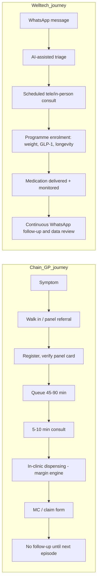

# Competitor Dossier: "Klinik Mesra" and Malaysia's GP Clinic Chains

**Abstract.** This dossier resolves the identity of "Klinik Mesra" and maps the private GP clinic chains that actually matter as primary-care competitors to Welltech in Malaysia. The headline verification finding: **"Klinik Mesra" is not a significant private chain** — "mesra" simply means "friendly" in Malay, and the name is used independently by multiple unrelated small operators (the largest verified: a ~3-branch Klang-area group under Mesra Holistik Sdn Bhd) as well as by the Ministry of Health for "friendly-service" concepts inside government facilities (Klinik Mesra Remaja adolescent clinics; a "Klinik Mesra" counselling unit at Hospital Melaka). The chains that do matter are: **Qualitas** (founded 1997, Southern Capital-controlled, 135 owned facilities plus 151 affiliates in Malaysia, IPO-bound), **CareClinics/CCHS** (Sumitomo Corporation-backed, 18→104→170+ clinics since 2020, targeting 300, with the CompuMed TPA now Sumitomo-owned — the most strategically dangerous consolidator), **Mediviron** (230+ clinics, occupational-health-rooted), and at the margins **Klinik Waqaf An-Nur** (KPJ/JCorp charity chain, RM5 flat fee — a safety net, not a competitor), BP Healthcare (diagnostics-led), and micro-chains such as Klinik Kita. The category competes on panel volume, drug margin and location; it is fee-capped (RM10–80 since April 2026), TPA-dependent, thinly digitalised and weak in longitudinal or preventive care — which defines exactly where Welltech should not fight and where it can partner.

Last updated: July 2026

Related documents: [Malaysia private healthcare](../10-market-intelligence/malaysia-private-healthcare.md) · [DoctorOnCall dossier](doctoroncall.md) · [Qmed Asia dossier](qmed-asia.md) · [KPJ Healthcare dossier](kpj-healthcare.md) · [Research standards](../RESEARCH-STANDARDS.md)

---

## 1. Scope and category context

Malaysia has roughly 9,800–12,000 private GP clinics; chains hold a single-digit share of outlets, making this one of ASEAN's most fragmented primary-care markets (sector economics — fee caps, drug-margin dependence, ~60% TPA-panel volume — are covered in [malaysia-private-healthcare.md](../10-market-intelligence/malaysia-private-healthcare.md) §4 and not repeated here).[^1][^2] Two regulatory facts frame every profile below:

- **The GP consultation fee is statutorily banded.** Schedule 7 of the Private Healthcare Facilities and Services Regulations fixed consults at **RM10–35** from 2006 (a range originating in a 1992 MMA schedule); the amendment gazetted as **P.U.(A) 150/2026, effective 2 April 2026, raised the band to RM10–80** — the first revision in over 30 years. GP bodies had demanded more (RM40–125 at a Penang town hall; RM50–80 from MPCAM), and the minister kept the RM10 floor "for the uninsured."[^1][^3][^4]
- **Chains therefore cannot differentiate on consult price upward.** Their business models are built on volume (panels, location density), dispensing margin, and ancillary lines (occupational health, screening, dental) — not on premium consultations. *(analysis)*

### 1.1 Category structure at a glance

| Tier | Who | Approx. outlets | Share of ~10,000 clinics |
|---|---|---|---|
| Consolidator chains | Mediviron (232+ claimed), CareClinics (170+ claimed incl. affiliates), Qualitas (135 owned + 151 affiliates MY) | ~450–550 combined (definitions overlap: "affiliate" vs owned) | ~5% *(analyst estimate from self-reported counts)*[^13][^20][^23] |
| Micro-chains (3–15 outlets) | Klinik Kita, Mediprima, Klinik Utama 24 Jam, Klinik Aurora, Permai Polyclinics, dozens more | Low hundreds in aggregate | ~2–3% *(analyst estimate)*[^8][^34] |
| Long tail | Solo and 2–3-doctor shoplot clinics | ~9,000+ | >90%[^2] |
| Charity/waqf | Klinik Waqaf An-Nur network | ~19 clinics + dialysis + mobile | <1%[^26] |

Two consolidation engines are now working the long tail: private-equity/strategic money (Southern Capital and Sojitz behind Qualitas; Sumitomo behind CareClinics and the CompuMed TPA) and succession pressure on ageing solo GPs whose fee-capped economics make their practices cheap to acquire. *(analysis)* The category is therefore best read not as a static list of chains but as a slow roll-up race — one Welltech will increasingly meet at the negotiating table for the same independent GPs and employer contracts.[^13][^21]

---

## 2. "Klinik Mesra" — identity verification

**Verdict: not a significant private chain.** "Mesra" is the Malay word for "friendly/warm"; it is one of the most generic possible clinic names, and the entities using it are unrelated to each other:

| Entity using the name | What it actually is | Evidence |
|---|---|---|
| Klinik Mesra (klinikmesra.my) | Small private GP group in Klang district, Selangor (Sijangkang, Bandar Putera 2, Alam Impian area), operating under **Mesra Holistik Sdn Bhd**; its Bandar Putera 2 outlet is self-described as "cawangan ke-3" (3rd branch) — i.e., a ~3-branch micro-chain | Own site; Facebook branch page[^5][^6] |
| Klinik Mesra Pinggiran (Batu Caves) | Independent neighbourhood GP clinic, Taman Pinggiran, Batu Caves | Directory listings, Facebook[^7] |
| Klinik Mesra Jaya (Seksyen 20, Shah Alam) | A branch brand of **Mediprima**, a separate small Selangor clinic group | Mediprima branch page[^8] |
| Klinik Mesra 24 Jam (Kemasik, Terengganu); Poliklinik Mesra (Muar); Klinik Mesra Plaza (Johor Bahru); Klinik Mesra (Pertam Jaya, Melaka); Klinik dan Surgeri Mesra (KL) | Independent single-site clinics scattered nationwide sharing only the adjective | Facebook/directory listings[^6][^7] |
| **Klinik Mesra Remaja** (also "Klinik CARE4U") | **Government programme, not a company**: MOH "adolescent-friendly clinic" services inside public Klinik Kesihatan, for ages 10–19; 38 sites held best-practice recognition as of 2019 | MOH BPKK / MyHealth portals[^9] |
| Klinik Mesra, Hospital Melaka | A named unit within a government hospital (clinical-support directorate) | Hospital Melaka (JKN Melaka) site[^10] |

**Verification method.** Searches for a corporate parent, branch directory, ownership disclosure or press coverage of a "Klinik Mesra" chain returned only the fragmented picture above; the largest verified footprint under the name is the Mesra Holistik Sdn Bhd group in Klang district (its own site, klinikmesra.my, blocked automated retrieval, but its Facebook branch pages disclose the "3rd branch" and corporate-vehicle details).[^5][^6] No entity called Klinik Mesra appears in TPA consolidator lists, healthcare M&A coverage, or MOH private-facility chain discussions. The confident negative: **there is no national private "Klinik Mesra" chain.**

Three implications. (1) Any market map listing "Klinik Mesra" as a national chain is wrong; the name should be dropped from Welltech's competitor set. (2) The confusion is instructive: MOH deliberately brands public services "mesra" (friendly) — adolescent-friendly clinics, friendly-counter service charters, hospital units — so the word carries public-sector, low-cost connotations; foreign analysts encountering "Klinik Mesra" listings likely conflated these government programmes with the scattered private namesakes. It is also a naming trap for any premium entrant. *(analysis)*[^9][^10] (3) The real story the name points to is the long tail: thousands of interchangeable neighbourhood clinics with generic Malay names ("Mesra", "Kita" = ours, "Utama" = main/prime), no brand equity beyond a 2 km radius, and no digital front door — the substrate the consolidators below are rolling up.[^2][^5]

---

## 3. Qualitas — the PE-built incumbent consolidator

| Item | Detail |
|---|---|
| Founded | 1997, by Dato' Dr Noorul Ameen Mohamed Ishack (physician); began as an integrated network of primary-care practices[^11][^12] |
| Ownership | Founder + **Southern Capital Group** (SEA buyout firm) collectively ~78.7% of the group (RAM); holding structure via Ameetaz Capital Sdn Bhd / Qualitas Medical Limited (Singapore-incorporated)[^13] |
| Capital-markets history | Listed on SGX Catalist ~3 years, delisted 2011; attempted KL IPO in 2015 (~USD 150M, shelved); Sojitz Corporation invested 2021; RM2.5B sukuk programme rated AA3 by RAM (2024); reported weighing a **Bursa Malaysia IPO of up to USD 942M** (The Edge/Bloomberg, mid-2025)[^11][^13][^14][^15][^16] |
| Scale | End-Dec 2024 (RAM): **135 owned facilities in Malaysia, 29 in Singapore, 53 in Australia, plus 151 affiliate/associate clinics in Malaysia**. Note: the Australian arm (Qualitas Health Australia, ~40 sites) was sold to Crescent Capital Partners in a deal finalised May 2024 for a reported ~AUD 250M — treat the RAM Australia figure as pre-/mid-divestment; current group is effectively Malaysia + Singapore[^13][^17] |
| Model | Owned + affiliated GP clinics, dental, medical imaging, ambulatory care, specialist eyecare, rehab, retail pharmacy; heavy **corporate/occupational-health** book (customisable corporate medical solutions, cashless medical cards, an IT platform for employers)[^13][^18] |
| Expansion | RAM: acquisitions of brownfield clinic chains targeted at up to SGD 156M by FY2027, focused on Malaysia and Singapore[^13] |
| Pricing | No public GP price list found; consults sit inside the statutory RM10–80 band; revenue skew is toward corporate panels, occupational health and ancillaries *(inference from service mix)*[^18] |
| Panel/TPA dependence | High by design — corporate panel and employer contracts are the core proposition; Qualitas is itself a managed-care counterparty rather than a passive panel member[^18] |
| Digitalisation | Corporate IT platform for employers; clinics bookable via third-party platforms (e.g., its Bangsar Shopping Centre clinic is listed on DoctorOnCall); no consumer app or WhatsApp-first workflow found[^18][^19] |
| Review themes | Location-dependent; its flagship urban clinics (e.g., Bangsar) read as standard panel GP experiences — no distinctive consumer brand sentiment surfaced *(analyst observation from directory/review listings)*[^19] |

**Read.** Qualitas is the financialised version of the Malaysian GP clinic: a PE-assembled, sukuk-funded, IPO-bound network whose customer is really the **employer/insurer**, not the patient. Its strengths are scale, corporate relationships and occupational-health licences; its weaknesses are a near-invisible consumer brand, no digital patient relationship, and an ownership clock (Southern Capital has been in for years; the IPO/sukuk structure demands growth and yield, pushing it toward acquisition-led expansion rather than care-model innovation). *(analysis)*[^13][^16]

---

## 4. CareClinics (CCHS) + Sumitomo — the fastest-moving consolidator

| Item | Detail |
|---|---|
| Founded | 2003, by Dr Ram Prakash and Dr Romel Rauf Al Abbas[^20] |
| Ownership | **Sumitomo Corporation** first invested 2020, added several rounds, now **largest shareholder** of CareClinics Healthcare Services (CCHS)[^21] |
| Scale | 18 clinics at start of Sumitomo collaboration → **104 clinics (Mar 2024)** → **170+ clinics** per company site (2025–26); ~2 million patients/year; stated targets of 200 clinics by 2025 and **300 facilities by 2026**; claims to be Malaysia's largest private clinic network[^20][^21] |
| Model | Roll-up/affiliation of neighbourhood GP clinics under the Care Clinics brand; panels for the major TPAs; corporate and government clients; a "Clinic Partnership" recruitment funnel for solo GPs[^20] |
| Vertical integration | June 2024: Sumitomo acquired **CompuMed, a Malaysian managed-care organisation/TPA, as a wholly owned subsidiary** — the same group now sits on both the payer-administration and provider sides of panel primary care[^22] |
| Digitalisation | **IntelSys** platform gives affiliated clinics shared access to patient records/medical history across the network — the closest thing to a chain-wide EMR among Malaysian GP groups; Sumitomo cites centralised patient-information management and service standardisation as its playbook[^20][^21] |
| Pricing | No public price list; consults within the statutory band; panel rates negotiated with TPAs *(unverified beyond regulatory band)* |
| WhatsApp | No evidence of a systematic WhatsApp care workflow; booking via website form/phone[^20] |
| Review themes | Not yet a distinct consumer brand; individual clinics carry legacy local reputations *(analyst observation)* |

**Read.** This is the chain to watch. Sumitomo is running the Japanese trading-house playbook: buy the network (CCHS), buy the rails (CompuMed TPA), standardise operations, centralise data, then scale to 300 sites. If it succeeds, a single foreign-backed group will control a meaningful slice of both panel administration and panel delivery in the Klang Valley — with a network EMR that could later support chronic-disease programmes, telehealth or even GLP-1 distribution at scale. Its current weakness is that the product is still the ordinary RM-banded panel visit; nothing in the public record shows consumer-facing innovation. *(analysis)*[^21][^22]

---

## 5. Mediviron — the occupational-health-rooted mass chain

| Item | Detail |
|---|---|
| Founded | 1984 by Datuk Dr Lim Heng Huat, initially as Malaysia's first comprehensive occupational safety & health consultancy; first Klinik Mediviron opened 1985 in SEA Park, Petaling Jaya[^23] |
| Ownership | Private, founder-linked; individual clinics often sit in separate Sdn Bhd vehicles (e.g., a Sepang outlet registered as SK Medic Sdn Bhd), suggesting a licensing/associate structure rather than a single owned estate *(inference from company registrations on listings)*[^23][^24] |
| Scale | Self-described as one of Malaysia's largest chains: 224+ clinics (Mar 2022) → 229+ (Jul 2022) → **232+ clinics across 8 west-coast peninsular states** (current site claim). Note this exceeds CareClinics' "largest network" claim — both are self-reported and use different owned/affiliate definitions; treat as unreconciled marketing claims[^23] |
| Model | High-density neighbourhood/industrial-area GP clinics + the original occupational-health line (statutory medical exams, OSH consultancy) + corporate panels; sited deliberately in residential, commercial and industrial zones[^23] |
| Pricing | No published consult prices; within RM10–80 band; occupational-health packages quoted B2B *(unverified)* |
| Panel/TPA dependence | High — Mediviron outlets are staples of TPA and employer panel lists; review evidence shows panel rules shaping clinical behaviour (see below)[^24] |
| Digitalisation | Basic website with branch directory; no chain-wide consumer app, portal or published EMR found *(analyst observation)*[^23] |
| WhatsApp | Individual branches publish mobile/WhatsApp numbers informally; no chain-level WhatsApp workflow[^24] |
| Review themes | Google/forum reviews (Lowyat, CariGold, Wanderlog, SeekClinic aggregations) recur on: **45–90 minute waits even with appointments**, slow registration, variable staff attitude, and panel-driven MC (medical certificate) restrictions — one reviewer reports staff limiting MC days "because HR will question them" despite the doctor's judgement. Positive reviews centre on individual doctors, not the brand[^24][^25] |

**Read.** Mediviron shows what 40 years of the panel-GP model produces: enormous physical reach, thin brand loyalty, throughput-driven service, and incentives visibly bent toward the employer-payer rather than the patient. It is a location-and-volume business; its occupational-health root is its most defensible asset. *(analysis)*

---

## 6. Klinik Waqaf An-Nur (KWAN) — charity chain, not a competitor

| Item | Detail |
|---|---|
| Origin | 1998, first clinic in Johor Bahru; a **waqf (Islamic endowment) healthcare initiative of Johor Corporation (JCorp) delivered through KPJ Healthcare**[^26] |
| Scale | Network of a Waqaf An-Nur hospital plus ~19 clinics (including ~5 site clinics) and 6 dialysis centres nationwide, plus 2 mobile clinics (Johor since 2012, Selangor since 2013); newer openings include Penang[^26][^27] |
| Pricing | **RM5 flat fee per outpatient visit including prescribed medicines**; ~RM90 for dialysis — charitable, cross-subsidised by JCorp/KPJ business earnings[^26] |
| Model & purpose | CSR/waqf safety net for low-income patients of all faiths, staffed by qualified doctors; also a reputational asset for KPJ (see [KPJ dossier](kpj-healthcare.md))[^26] |

**Read.** KWAN competes with no one commercially — it serves the segment below any private price point Welltech would set. Its relevance is as (1) proof that KPJ/JCorp can operate distributed primary care when motivated, and (2) a reminder that "affordable" in Malaysian primary care is anchored publicly at RM1–5 (government clinics, waqf clinics), which caps consumer willingness-to-pay for undifferentiated GP visits. *(analysis)*

---

## 7. BP Healthcare — diagnostics chain with a clinic-shaped edge

| Item | Detail |
|---|---|
| Identity | Family-built (Beh family) healthcare group, ~60 years old, positioned as a health-screening and diagnostics platform rather than a GP chain[^28] |
| Scale | 70+ locations nationwide; company materials enumerate 70+ laboratories, ~50 diagnostic centres, ~50 hearing-aid centres, ~50 dispensaries/pharmacies, ~50 food/industrial testing centres, 5 specialist centres, 3 dental specialist clinics (figures are self-reported and overlapping by site)[^28] |
| Digital arm | **Doctor2U** (launched Oct 2015 by Garvy Beh): on-demand doctor house calls → telehealth app with a claimed 1,000+ doctor network; early Microsoft digital-transformation partner[^29] |
| GP consultation | Its outlets are screening/diagnostic-first; walk-in GP consults are ancillary. No published GP consult pricing; screening packages are the advertised product[^28] |
| Panel dependence | Corporate screening contracts and occupational testing rather than TPA sick-visit panels *(inference from service mix)*[^28] |

**Read.** BP is a competitor to Welltech's **screening/longevity funnel**, not its GP layer: it owns the "annual health check" occasion for a large corporate base and has a telehealth asset (Doctor2U) that never converted into a care-programme business. Its weakness mirrors the category's: transactional volume, no longitudinal ownership of the patient. *(analysis)*

---

## 8. Verification notes and the long tail

- **Sri Kota "satellite clinics": not verified as significant.** Sri Kota Specialist Medical Centre (Klang, 232-bed private hospital, est. 1999) shows no evidence of a branded satellite GP-clinic network on its site or in searches; if satellite clinics exist they are not a visible competitive force. Treat the claim as unsubstantiated.[^30]
- **KMI Healthcare: out of scope.** KMI (division of state-owned TDM Berhad) operates five community specialist *hospitals* (Kelana Jaya, Taman Desa, Kuantan, Kuala Terengganu, Tawau) — secondary care, not a GP chain.[^31]
- **"Clinic Assunta": not a chain.** Assunta Hospital (Petaling Jaya, est. 1954 by Franciscan Missionaries of Mary) is a single mission hospital whose charity outreach (ASSISS) descends from the original Ave Maria clinic; there is no Assunta GP-chain network.[^32]
- **DoctorOnCall physical clinics: none owned that could be verified.** DoctorOnCall's platform lists and books *partner* physical clinics (including Qualitas' Bangsar Shopping Centre clinic) and runs state-scheme panels (Perak Prihatin, Kad Sejahtera Terengganu), but no evidence of DoctorOnCall-owned walk-in clinics was found. See [doctoroncall.md](doctoroncall.md).[^19][^33]
- **Klinik Kita:** genuine micro-chain — started 1988 in Pandan Jaya, ~9 branches across eastern KL/Selangor, TPA panel member (listed in CompuMed's provider system). Representative of dozens of 5–15-outlet family groups (others observed: Mediprima in Shah Alam, Klinik Utama 24 Jam, Klinik Aurora in Klang, Permai Polyclinics in Sabah).[^8][^34][^35]

---

## 9. Cross-cutting: digitalisation, WhatsApp, and reviews

- **Clinic software is commoditising fast, but chains lag.** Cloud CMS vendors (kumoDoc, Desk.Clinic, and Qmed Asia's stack — see [qmed-asia.md](qmed-asia.md)) now sell WhatsApp-integrated reminders, pre-visit forms and queue tools to any solo GP; only CareClinics (IntelSys shared records) evidences a network-wide clinical data layer among the chains profiled.[^20][^36]
- **WhatsApp is ubiquitous but ad hoc.** Branch-level WhatsApp numbers for booking are common across private clinics; no chain runs WhatsApp as a managed longitudinal care channel (triage → consult → follow-up → refills). The channel Welltech intends to own is culturally pre-validated and competitively unoccupied at chain level. *(analysis)*[^36]
- **Review themes are uniform across chains:** long waits (45–90 min with appointments at Mediviron outlets), throughput medicine, panel/MC friction, brand loyalty attaching to individual doctors rather than chains. Nothing in the review corpus suggests any chain owns patient trust the way a strong consumer brand would.[^24][^25]

### 9.1 Patient-journey contrast: chain GP visit vs Welltech model

The structural difference is where revenue attaches: the chain monetises the episode (visit + drugs), Welltech monetises the relationship (programme + outcomes). Chains cannot copy the right-hand journey without cannibalising dispensing margin and panel throughput — their two profit pools. *(analysis; journey steps synthesised from review corpus and service pages cited above)*[^18][^20][^24]

---

## 10. Key questions to monitor

| Question | Signal to watch | Why it matters |
|---|---|---|
| Does the Qualitas IPO complete, and at what valuation? | Bursa filings; The Edge/Bloomberg follow-ups to the USD 942M report | A listed Qualitas gains acquisition currency for clinic and digital-health roll-ups — and becomes a possible acquirer/partner for Welltech-adjacent assets[^16] |
| Does CareClinics hit 300 facilities by end-2026? | Sumitomo releases; careclinics.com.my location count | Tests whether the Sumitomo playbook scales; at 300 sites its network + CompuMed TPA becomes the default employer primary-care stack[^20][^21][^22] |
| Does CompuMed steer volume to CareClinics? | Panel-list changes; GP complaints via MMA/CodeBlue about steering | Payer-provider integration would squeeze independent GPs — accelerating the doctor discontent Welltech recruits from[^22] |
| Do chains launch chronic/weight programmes? | Service-page changes at Qualitas/Mediviron/CareClinics; GLP-1 availability messaging | First direct overlap with Welltech's core categories; currently absent everywhere |
| How do chains respond to the RM10–80 band? | Advertised consult prices; MMA fee surveys | If chains push toward RM50–80 for standard visits, the price gap to Welltech's premium consult narrows further[^3][^4] |
| Dispensing-separation and drug price-display outcomes | Judicial-review rulings; MOH policy papers | Removal of drug margin would break chain unit economics and trigger distress consolidation — a buying/partnering window (see market doc §4)[^2] |

---

## 11. Comparative matrix

| Chain | Clinics (MY) | Ownership | Core model | GP consult price | TPA/panel dependence | Digital maturity | WhatsApp workflow | Consumer brand |
|---|---|---|---|---|---|---|---|---|
| "Klinik Mesra" (all users of name) | ~3 (largest group); rest unrelated singles | Mesra Holistik Sdn Bhd + unrelated owners; also MOH programme branding | Neighbourhood GP | RM10–80 band (unpublished) | Local panels | Minimal | Branch-level, informal | None (generic name)[^5][^6][^9] |
| Qualitas | 135 owned + 151 affiliate | Founder + Southern Capital (~78.7%); Sojitz minority; IPO-bound | Corporate/occupational health + GP/dental/imaging network | Band; B2B-priced packages | High (is itself a managed-care counterparty) | Employer IT platform; no consumer app | None found | Weak[^13][^16][^18] |
| CareClinics (CCHS) | 104 (Mar 2024) → 170+ claimed; target 300 | Sumitomo Corp (largest shareholder) + founders | GP roll-up + TPA panels + IntelSys shared records; sister TPA CompuMed | Band (unpublished) | High — and vertically integrated into a TPA | Highest among chains (network records platform) | None found | Emerging[^20][^21][^22] |
| Mediviron | 232+ claimed | Founder-linked private; clinic-level Sdn Bhds | Density GP + occupational health + panels | Band (unpublished) | High | Low (directory website) | Branch-level, informal | Weak; service complaints[^23][^24] |
| Klinik Waqaf An-Nur | ~19 clinics + hospital + 6 dialysis + 2 mobile | JCorp waqf via KPJ | Charity primary care | **RM5 flat incl. medicines** | None (charitable) | Low | No | Positive but non-commercial[^26][^27] |
| BP Healthcare | 70+ locations (screening-led) | Beh family | Diagnostics/screening + pharmacy + Doctor2U telehealth | Screening packages advertised; GP consult ancillary | Corporate screening contracts | Medium (Doctor2U app) | No chain workflow found | Moderate (screening)[^28][^29] |
| Klinik Kita | ~9 | Private family (since 1988) | Neighbourhood GP + panels | Band (unpublished) | High | Minimal | Informal | Local only[^34][^35] |

---

## 12. SWOT — GP chains as a category, vs Welltech

| | Helpful | Harmful |
|---|---|---|
| **Internal** | **S:** Physical ubiquity and walk-in immediacy; dispensing revenue engine; entrenched employer/TPA contracts; occupational-health licences (Qualitas, Mediviron); trusted for acute episodic care; low prices anchored by regulation | **W:** Consult fees capped at RM10–80; ~60% of volume intermediated by fee-extracting TPAs; drug-margin dependence under regulatory attack; near-zero consumer brand equity (loyalty attaches to individual doctors); thin digitalisation; no longitudinal, preventive, weight-management or longevity programmes; service quality complaints (waits, MC friction)[^1][^2][^24] |
| **External** | **O:** Fee-band uplift to RM80 improves consult economics; consolidators (Sumitomo, Southern Capital money) can fund upgrades; ageing + NCD burden grows chronic-visit volume; government outsourcing experiments | **T:** Pharmacy chains and telehealth capturing minor-ailment traffic; DRG/insurance reform squeezing panel payers; drug price-display and dispensing-separation threats to the margin core; digital-first entrants (Welltech) taking the affluent chronic/preventive patient — the only profitable longitudinal segment[^1][^2] |

*(Category SWOT synthesised from sources cited throughout; sector-level items detailed in [malaysia-private-healthcare.md](../10-market-intelligence/malaysia-private-healthcare.md).)*

---

## 13. Implications for Welltech — compete / partner / ignore

1. **Do not compete for the panel GP visit.** The chains' battlefield — RM-banded consults, TPA volume, drug margin — is structurally low-margin and regulated. Welltech's premium, cash-pay/employer-direct, programme-based model (weight loss, GLP-1, longevity, concierge) sits above the band because programmes, monitoring and medication supply are not the regulated consult. *(analysis; regulatory basis in fee-order sources)*[^1][^3]
2. **Verdicts by player:**
   - **"Klinik Mesra": IGNORE.** Not a chain; remove from competitor tracking.[^5][^9]
   - **Qualitas: PARTNER (corporate channel) / monitor as acquirer.** Its employer book is a distribution channel for Welltech programmes as claims-reduction products; its IPO pressure makes it a plausible acquirer of digital capabilities — and a slow innovator in the meantime.[^13][^16]
   - **CareClinics/Sumitomo: COMPETE-WATCH — the one real threat.** A 300-clinic network with a shared record platform and an in-house TPA could bolt on chronic-care or GLP-1 programmes and undercut Welltech on physical touchpoints. Track its product moves quarterly; pre-empt by locking exclusive partnerships with independent GPs and employers before the roll-up reaches them.[^20][^21][^22]
   - **Mediviron: PARTNER opportunistically, else IGNORE.** Useful as a nationwide phlebotomy/vitals/injection-administration touchpoint network for Welltech's remote programmes; no evidence it can build competing digital programmes itself.[^23]
   - **Klinik Waqaf An-Nur: IGNORE** (different segment; respect it in public-affairs positioning).[^26]
   - **BP Healthcare: COMPETE in screening, PARTNER in labs.** It contests the corporate screening occasion that feeds Welltech's longevity funnel, but its lab network is also a candidate diagnostics vendor.[^28]
   - **Klinik Kita and the micro-chain tail: RECRUIT.** These are Welltech's doctor-supply and referral base, not rivals.[^34]
3. **The category's uniform gap is Welltech's product.** No chain owns the patient between visits: no chain-level WhatsApp care channel, no outcomes programmes, no preventive subscription. Welltech should position explicitly against the chain experience — "no queue, no panel forms, a doctor who follows up on WhatsApp" — because the review corpus shows that is precisely what patients resent.[^24][^36]
4. **Watch the fee band as a floor for perception.** With chains now allowed to charge up to RM80, a RM99–250 Welltech consult reads as a modest premium rather than a 5× multiple — the April 2026 revision quietly improved Welltech's price anchoring.[^3][^4]
5. **If Sumitomo's CompuMed–CCHS integration matures, panel rails get smarter.** A data-integrated payer-provider stack could eventually offer employers outcome-based primary care — the same pitch Welltech will make. Welltech's defence is speed and depth in the clinical programmes (GLP-1, metabolic, longevity) that a volume GP network cannot credibly staff. *(analysis)*[^21][^22]

---

## References

[^1]: CodeBlue (Galen Centre), "Budget 2026: Government Doctors Get 40% On-Call Allowance Hike, GPs Get RM80 Consultation Fee", https://codeblue.galencentre.org/2025/10/budget-2026-government-doctors-get-40-on-call-allowance-hike-gps-get-rm80-consultation-fee/ (accessed July 2026).
[^2]: Malaysian Medical Resources, "GPs and the Fee schedule", https://new.medicine.com.my/2019/05/gps-and-the-fee-schedule/ ; CodeBlue, "Decentralised Approach To New Clinic Fees Shifts Balance Of Power", https://codeblue.galencentre.org/2025/05/decentralised-approach-to-new-clinic-fees-shifts-balance-of-power/ (accessed July 2026).
[^3]: Malay Mail, "Private GPs welcome revised RM10–RM80 consultation fee after 30-year freeze" (3 Apr 2026; gazetted as P.U.(A) 150/2026, effective 2 Apr 2026, amending Schedule 7), https://www.malaymail.com/news/malaysia/2026/04/03/private-gps-welcome-revised-rm10rm80-consultation-fee-after-30-year-freeze/214926 (accessed July 2026).
[^4]: Malay Mail, "Health minister says RM10 still the floor price for doctor visits, but ceiling raised to RM80" (11 Oct 2025), https://www.malaymail.com/news/malaysia/2025/10/11/health-minister-says-rm10-still-the-floor-price-for-doctor-visits-but-ceiling-raised-to-rm80/194240 ; CodeBlue, "At Town Hall, GPs Demand Fee Revision To RM40 To RM125", https://codeblue.galencentre.org/2025/10/at-town-hall-gps-demand-fee-revision-to-rm40-to-rm125/ ; CodeBlue, "MPCAM Proposes RM50 To RM80 GP Consultation Fee", https://codeblue.galencentre.org/2025/06/mpcam-proposes-rm50-to-rm80-gp-consultation-fee/ (accessed July 2026).
[^5]: Klinik Mesra, "Klinik Perubatan Profesional Anda", https://klinikmesra.my/ (site identified via search; direct fetch blocked, accessed July 2026).
[^6]: Facebook, "Klinik Mesra - Bandar Putera 2" (describes itself as "cawangan ke-3", subsidiary of Mesra Holistik Sdn Bhd), https://www.facebook.com/klinikmesrabandarputera2/ ; Facebook, "Klinik Mesra 24 Jam Kemasik, Kemaman", https://www.facebook.com/Mesraclinic/ (accessed July 2026).
[^7]: GetDoc clinic directory, "Klinik Mesra (Pertam Jaya), Malacca", https://www.getdoc.com/clinic/klinik-mesra-pertam-jaya-5444 ; "Klinik Mesra (Sijangkang) 24 hours", https://www.getdoc.com/clinic/klinik-mesra-sijangkang-4925 ; SeekClinic, "Klinik Mesra, Batu Caves", https://seekclinic.my/klinik-mesra-batu-caves/ (accessed July 2026).
[^8]: Mediprima, "Klinik Mesra Jaya Seksyen 20", https://www.mediprima.asia/branch/klinik-mesra-jaya-seksyen-20/ (accessed July 2026).
[^9]: MOH Malaysia, Bahagian Pembangunan Kesihatan Keluarga, "Sektor Kesihatan Remaja" (Klinik Mesra Remaja / adolescent-friendly clinic services), https://hq.moh.gov.my/bpkk/index.php/pages/orang-awam/kesihatan-remaja-orang-awam.html ; MyHEALTH Portal, "Perkhidmatan Kesihatan Remaja", http://www.myhealth.gov.my/en/health-service-for-adolescent/ (accessed July 2026).
[^10]: Jabatan Kesihatan Negeri Melaka, "Hospital Melaka — Klinik Mesra", https://jknmelaka.moh.gov.my/hmelaka/index.php/19-profil-jabatan/direktorat-sokongan-klinikal/58-klinik-mesra (accessed July 2026).
[^11]: ProButterfly, "Analysis of Qualitas Medical Ltd Upcoming IPO" (founding 1997; Catalist listing and 2011 delisting; 2015 KL attempt), https://www.probutterfly.com/blog/analysis-of-qualitas-medical-ltd-upcoming-ipo (accessed July 2026).
[^12]: Qualitas Health Group, "Dato' Dr. Noorul Ameen Mohamed Ishack", https://qualitashealthgroup.com/management/ybhg-dato-dr-noorul-ameen-mohamed-ishack/ (accessed July 2026).
[^13]: RAM Ratings, "RAM Ratings assigns initial ratings to Qualitas Medical Limited Group entities" (facility counts end-Dec 2024: 135 MY owned, 29 SG, 53 AU, 151 MY affiliates; founder + Southern Capital 78.7%; RM2.5B sukuk; SGD156M acquisition pipeline to FY2027), https://www.ram.com.my/pressrelease/?prviewid=6896 ; "RAM Ratings assigns preliminary first-time AA3 ratings to Qualitas Medical Limited's vehicles", https://www.ram.com.my/pressrelease/?prviewid=6836 (accessed July 2026).
[^14]: Sojitz Corporation, "Sojitz Invests in Leading Primary Healthcare Provider in Asia & Oceania" (1 Mar 2021), https://www.sojitz.com/en/news/article/20210301.html (accessed July 2026).
[^15]: GlobalCapital, "Qualitas Medical tries again for IPO after Asia expansion", https://www.globalcapital.com/article/b17mbp4x2677y9/qualitas-medical-tries-again-for-ipo-after-asia-expansion ; AVCJ, "PE-owned Qualitas Medical targets Singapore IPO", https://www.avcj.com/avcj/news/3009355/pe-owned-qualitas-medical-targets-singapore-ipo (accessed July 2026).
[^16]: Bloomberg Law, "Qualitas Health Weighs $942 Million Malaysian IPO, The Edge Says", https://news.bloomberglaw.com/capital-markets/qualitas-health-weighs-942-million-malaysian-ipo-the-edge-says ; The Edge Malaysia, "Qualitas Health Group eyeing Bursa listing, say sources", https://theedgemalaysia.com/node/759127 ; Caproasia, "Malaysia Healthcare Company Qualitas Health Plans Malaysia IPO to Raise $942 Million" (15 Jun 2025), https://www.caproasia.com/2025/06/15/malaysia-healthcare-company-qualitas-health-plans-malaysia-ipo-to-raise-942-million-founded-in-1997-by-dr-noorul-ameen-mohamed-ishack/ (accessed July 2026).
[^17]: DealStreetAsia, "Southern Capital said to finalise sale of Australian health firm to Crescent Capital", https://www.dealstreetasia.com/stories/southern-capital-crescent-capital-398147 ; Crunchbase, "Crescent Capital Partners acquires Qualitas Health (31 May 2024)", https://www.crunchbase.com/acquisition/crescent-capital-partners-acquires-qualitas-health-e831--bfbbd080 ; Health Services Daily, "Qualitas doctor-owners looking for buyer for Aussie arm" (~AUD 250M), https://www.healthservicesdaily.com.au/qualitas-doctor-owners-looking-for-buyer-for-aussie-arm/15682 (accessed July 2026).
[^18]: Qualitas Health Malaysia, homepage and service pages: https://qualitashealth.com.my/ ; "Corporate Medical Solutions", https://qualitashealth.com.my/corporate-medical-solutions/ ; "Occupational Health Services", https://qualitashealth.com.my/occupational-health-new/ ; "Primary Care", https://qualitashealth.com.my/primary-care/ (accessed July 2026).
[^19]: DoctorOnCall, "Qualitas Health Clinic @ Bangsar — Book Appointment Online" (Bangsar Shopping Centre; hours Mon–Fri 9am–6pm), https://www.doctoroncall.com.my/find-doctor/kuala-lumpur/clinic/qualitas-health-clinic--bangsar (accessed July 2026).
[^20]: Care Clinics Group, "About Us" (founded 2003 by Dr Ram Prakash and Dr Romel Rauf Al Abbas; 170+ clinics; 1M+ patients served; TPA panels; IntelSys shared records; 200-clinic goal), https://careclinics.com.my/about-us/ ; "Our Milestones", https://careclinics.com.my/our-milestones/ ; "Clinic Partnership", https://careclinics.com.my/clinic-partnership/ (accessed July 2026).
[^21]: Sumitomo Corporation, "Full-Scale Entry into Private Clinic Business in Fast-Growing Southeast Asia" (CCHS: 18→104 clinics to Mar 2024; ~2M patients/yr; Sumitomo largest shareholder since first 2020 investment; 300-facility target by 2026), https://www.sumitomocorp.com/en/jp/news/release/2024/group/17540 ; Sumitomo Corporation, "Supporting Regional Healthcare in Malaysia: Becoming the Country's Leading Clinic Network", https://www.sumitomocorp.com/en/jp/enrich/contents/0057 (accessed July 2026).
[^22]: Sumitomo Corporation, "Sumitomo Corporation Acquires Malaysian Managed Care Provider CompuMed as a Wholly Owned Subsidiary" (19 Jun 2024), https://www.sumitomocorp.com/en/jp/news/topics/2024/group/20240619 (accessed July 2026).
[^23]: Mediviron Group of Clinics, "About Mediviron" (est. 1984 by Datuk Dr Lim Heng Huat; first clinic 1985 SEA Park PJ; 232+ clinics across 8 west-coast states; earlier snapshots 224+ in Mar 2022, 229+ in Jul 2022), https://mediviron.com.my/about-mediviron/ ; homepage, https://mediviron.com.my/ (accessed July 2026).
[^24]: SeekClinic, "Klinik Mediviron Sea Park In Petaling Jaya" (review aggregation: 45–90 min waits with appointment; staff attitude; panel MC restrictions), https://seekclinic.my/klinik-mediviron-sea-park/ ; Top-Rated.Online, "Klinik Mediviron Taman Meranti Jaya (SK Medic Sdn Bhd)", https://www.top-rated.online/cities/Sepang/place/p/8127363/Klinik+Mediviron+Taman+Meranti+Jaya+(SK+MEDIC+SDN+BHD) ; Wanderlog, "Klinik Mediviron Lukut — reviews", https://wanderlog.com/place/details/13780680/klinik-mediviron-lukut (accessed July 2026).
[^25]: Lowyat Forum threads, "Klinik Mediviron Scandal", https://forum.lowyat.net/topic/4231609/all ; "mediviron clinic", https://forum.lowyat.net/topic/3724234/all ; CariGold Forum, "Klinik Mediviron Review", https://carigold.com/forum/threads/klinik-mediviron-review.626535/ (accessed July 2026).
[^26]: KPJ Healthcare, "Klinik Waqaf An-Nur" (network of hospital + ~19 clinics + 6 dialysis centres; RM5 flat outpatient fee including medicines; ~RM90 dialysis; began 1998 Johor Bahru; mobile clinics Johor 2012, Selangor 2013), https://kpjhealth.com.my/klinik-wakaf-an-nur ; https://mail.kpjhealth.com.my/klinik-waqaf-an-nur.php (accessed July 2026).
[^27]: Majlis Agama Islam Negeri Pulau Pinang, "Klinik Waqaf An-Nur Pulau Pinang kini dibuka secara rasmi", https://www.mainpp.gov.my/index.php/en/component/content/article/klinik-waqaf-an-nur-pulau-pinang-kini-dibuka-secara-rasmi (accessed July 2026).
[^28]: BP Healthcare Group, "Outlets" (70+ locations; labs, diagnostic centres, hearing centres, dispensaries, specialist and dental centres), https://bpgroup.bphealthcare.com/outlets/ ; homepage, https://bphealthcare.com/ ; Doctor2U shop, "Largest Malaysia Healthcare Platform", https://shop.doctor2u.my/ (accessed July 2026).
[^29]: Vulcan Post, "BP Healthcare Group's Doctor2U App Gets A Doctor To You In 1 Hour", https://vulcanpost.com/403391/doctor2u-app-bp-medical-group/ ; Microsoft Malaysia News Center, "BP Healthcare's Doctor2U partners with Microsoft" (24 May 2017), https://news.microsoft.com/en-my/2017/05/24/bp-healthcares-doctor2u-partners-microsoft-digital-transformation-journey/ (accessed July 2026).
[^30]: Sri Kota Specialist Medical Centre, "About Us" (232-bed hospital, Klang, since 1999; no satellite-clinic network disclosed), https://srikotamedical.com/about/ ; https://srikotamedical.com/ (accessed July 2026).
[^31]: KMI Healthcare, "KMI Hospitals — Specialist Hospital Network in Malaysia" (five community specialist hospitals; division of TDM Berhad), https://kmihealthcare.com/hospitals/ ; TDM Berhad, "Healthcare Division", https://www.tdmberhad.com.my/who-we-are/healthcare-division/ (accessed July 2026).
[^32]: Assunta Hospital, "Our History & Timeline" (founded 1954 by Franciscan Missionaries of Mary; Ave Maria clinic origin; ASSISS community service), https://assunta.com.my/about/our-history-assunta-timeline/ (accessed July 2026).
[^33]: Vulcan Post, "How DoctorOnCall Is Digitalising Public Healthcare So Rural M'sians Can Access It Too" (Perak Prihatin, Kad Sejahtera Terengganu panels; MOH appointment system), https://vulcanpost.com/741265/doctoroncall-services-malaysia-public-healthcare-online/ ; DoctorOnCall help centre tag "physical clinic", https://help.doctoroncall.com.my/article-tags/physical-clinic/ (accessed July 2026).
[^34]: Klinik Kita Sdn Bhd, "Your Trusted Partner in Health" (started 1988 Pandan Jaya; ~9 branches KL/Selangor), https://klinik-kita.net/ (accessed July 2026).
[^35]: CompuMed provider portal, "Klinik Kita Sdn Bhd (Desa Pandan)-HQ" (TPA panel listing), https://data.compumed.com.my/provider/view/2043 (accessed July 2026).
[^36]: kumoDoc, "Clinic Management Software System from Malaysia for GP Clinics & Doctors" (WhatsApp-integrated reminders and forms), https://www.kumodoc.com/ ; Desk.Clinic, "Clinic Management System Malaysia — Cloud CMS for GP Clinics", https://desk.clinic/malaysia (accessed July 2026).
