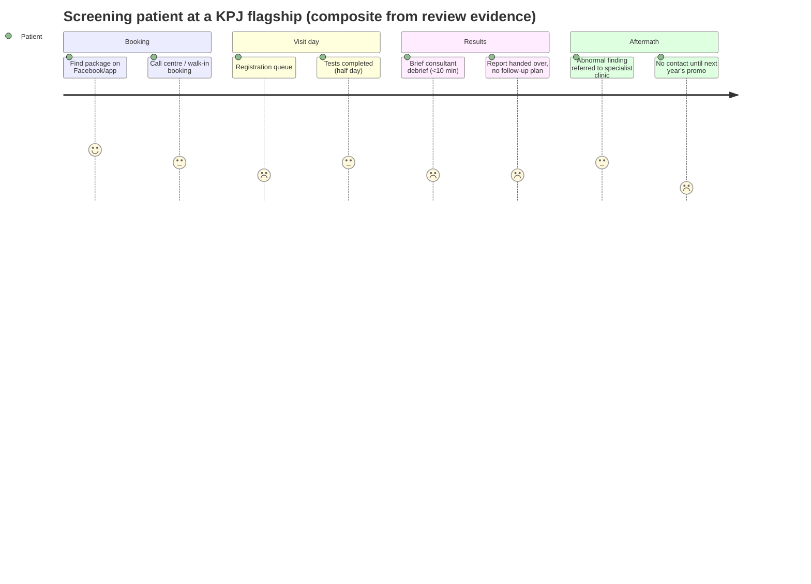

# KPJ Healthcare Berhad — Competitor Dossier

**Abstract.** KPJ Healthcare Berhad (Bursa Malaysia: 5878) is Malaysia's largest listed private hospital group by network size, operating roughly 29–30 hospitals and ~4,000 operational beds, with FY2025 revenue of RM4.26 billion and EBITDA of RM1.05 billion.[^1][^2] Its strategy — the "KPJ Health System" built with Mayo Clinic Global Consulting, a nHIS/EMR digital backbone, the KPJ Cares app, and an aggressive bed-expansion and medical-tourism push — is overwhelmingly an inpatient, episodic, acute-care play. Health screening is sold as packaged, transactional check-ups (RM399–RM1,260 at most hospitals); weight management is anchored in bariatric surgery rather than longitudinal medical weight-loss programmes; there is no meaningful longevity-medicine or GLP-1-led offering. For Welltech, KPJ is less a direct competitor than the dominant downstream referral and diagnostics infrastructure — and a slow-moving incumbent whose consumer-experience weaknesses (billing/GL delays, waiting times, fragmented digital front door) define the gap Welltech can occupy.

Last updated: July 2026

Related: [Sunway Healthcare dossier](sunway-healthcare.md) · [Research standards](../RESEARCH-STANDARDS.md) · [Repository map](../README.md)

---

## 1. Group overview

### 1.1 Corporate profile

| Item | Detail |
|---|---|
| Entity | KPJ Healthcare Berhad, listed on Bursa Malaysia Main Market (stock code 5878)[^1] |
| Parent/anchor shareholder | Johor Corporation (JCorp), Johor state investment arm (per KPJ corporate/IR profile)[^3] |
| Network | ~29–30 hospitals nationwide; KPJ's own app materials count "29 KPJ Hospitals nationwide, including KPJ Ambulatory Care Centre Kinrara and KPJ Tawakkal Health Centre", while the corporate site markets "30 hospitals"[^4][^5] — the count moves with new openings and how ambulatory centres are classified |
| Beds | ~4,000 operational beds (2025), targeting 5,000–6,000 by ~2030[^6] |
| Positioning | "Malaysia's Preferred Healthcare Partner in Specialist Care — Care for Life"[^5] |
| Education arm | KPJ Healthcare University (KPJU), integrated into the KPJ Health System[^7] |

**Recent corporate timeline**

| Date | Event |
|---|---|
| Dec 2023 | DSH2 launched as "Malaysia's first smart hospital" (nHIS, AI-driven EMR, IoT)[^31][^14] |
| 2024 | KPJ Health System introduced; Mayo Clinic engagement formalised; two hospitals join Mayo Clinic Care Network[^7][^12] |
| Feb 2025 | FY2024 results: revenue RM3.92b (+15%), PATAMI RM354m[^8] |
| Dec 2025 | First Centre of Excellence (Heart & Lung) launched at KPJ Johor Specialist Hospital with Mayo Clinic Global Consulting[^11] |
| Feb 2026 | FY2025 results: revenue RM4.26b, EBITDA RM1.05b, PATAMI RM366m; 1.35 sen interim dividend[^1][^2] |
| Jun 2026 | Management signals openness to value-accretive M&A; progress update at 33rd AGM[^10][^7] |

### 1.2 Financials (Bursa filings and results announcements)

| Metric (MYR) | FY2023 | FY2024 | FY2025 |
|---|---|---|---|
| Revenue | RM3.42b | RM3.92b (+15%) | RM4.26b (+9%) |
| EBITDA | n/d | ~RM0.99b *(implied from +6% FY2025 growth)* | RM1.05b (+6%) |
| Net profit after tax | RM270m | RM407m | n/d |
| PATAMI | RM263m | RM354m | RM366m |

Sources: FY2024 results announcement; FY2025 full-year results reporting.[^1][^2][^8] Q4 FY2025 alone: revenue RM1.152b (+10% y/y), EBITDA RM312m, EBITDA margin 27.1%.[^1] KPJ declared a first interim dividend of 1.35 sen/share (RM59.2m) early in FY2026.[^2] Operational drivers in FY2025: operational beds +4% y/y, surgical cases +11%, average revenue per inpatient +7%.[^8] Statista tracks the longer revenue series (FY2018–FY2023) for trend work.[^9]

**Read-through:** KPJ is compounding revenue at high single digits to mid-teens with ~25% EBITDA margins. Growth is volume- and acuity-led (beds, surgeries, revenue intensity), not consumer-subscription or preventive-care led.

### 1.3 Expansion strategy

- **Bed-led growth, not new flags.** KPJ plans to add capacity toward 5,000–6,000 beds by 2030, prioritising five "gestation" hospitals — Miri (Sarawak), Batu Pahat and Bandar Dato' Onn (Johor), Damansara Specialist Hospital 2 (Kuala Lumpur) and Kuala Selangor — over greenfield or overseas expansion.[^6]
- **Open to M&A** where value-accretive, per management commentary in June 2026.[^10]
- **KPJ Health System (KPJHS).** Introduced 2024; integrates Practice (care delivery), Education (KPJU) and Research & Innovation under one clinical-governance umbrella.[^7]
- **Mayo Clinic alignment.** KPJ has a formal engagement with Mayo Clinic Global Consulting covering clinical standards, patient experience, education frameworks and research; the first Centre of Excellence (Heart & Lung) launched at KPJ Johor Specialist Hospital in December 2025, the first of **15 CoEs planned by 2030** on a hub-and-spoke model (heart & lung, neurology & stroke, oncology, orthopaedics, robotic surgery).[^11][^7] Two KPJ hospitals, including KPJ Damansara Specialist Hospital, are members of the Mayo Clinic Care Network.[^12]

### 1.4 Hospital network (selected, by region)

The corporate site lists the full network[^5]; the table below covers facilities referenced elsewhere in this dossier plus the announced pipeline. Bed counts per hospital are not consistently published and are omitted rather than estimated.

| Region | Facilities (selected) | Status |
|---|---|---|
| Klang Valley | KPJ Damansara Specialist Hospital; Damansara Specialist Hospital 2 (DSH2); KPJ Ampang Puteri; KPJ Tawakkal (KL); KPJ Klang; KPJ Kajang; KPJ Ambulatory Care Centre Kinrara; KPJ Specialist & Healthcare Centre Kinrara[^4][^5][^33] | Operating |
| Johor | KPJ Johor Specialist Hospital (first CoE site); KPJ Puteri (JB); KPJ Bandar Dato' Onn; Batu Pahat[^11][^6] | Operating / gestation |
| Northern | KPJ Penang Specialist Hospital (Bukit Mertajam); KPJ Ipoh Specialist Hospital[^19][^29] | Operating |
| East Coast | KPJ Perdana (Kota Bharu)[^38] | Operating |
| East Malaysia | KPJ Sabah; KPJ Kuching; KPJ Miri[^20][^6] | Operating / gestation |
| Pipeline | Kuala Selangor; DSH2 ramp-up; Miri, Batu Pahat, Bandar Dato' Onn maturation[^6] | Gestation to ~2030 |

**Strategy statements on outpatient/digital/preventive:** KPJ's five-year transformation language centres on a hub-and-spoke network, unified digital health records ("one patient, one record"), and patient-experience uplift[^13][^14] — but public strategy materials contain no equivalent commitment to longitudinal preventive care, chronic weight management, or subscription primary care. Prevention appears as *screening package retail*, not as a care model.

**Implications for Welltech:** KPJ's capital is committed to beds and acute CoEs through 2030. A digital-first longitudinal preventive/weight-care operator does not collide with this capex programme; it feeds it (imaging, endoscopy, bariatric referrals) or quietly disintermediates its front end (screening, chronic follow-up).

---

## 2. Health screening & wellness offering

### 2.1 Screening packages and price points

KPJ retails screening through hospital wellness/health-screening centres, the corporate "Health Packages" pages, and an e-commerce arm (KPJ Healthshoppe / kpjcares.com).[^15][^16][^17] Pricing is set per hospital, so ranges below are indicative of the network rather than a single tariff. Note: KPJ's main site and Healthshoppe block automated access, so prices below are from KPJ hospital listings and aggregator pages actually reviewed; treat as directional and re-verify before pricing decisions.

| Package (hospital) | Price (MYR, 2025–26) | Notes |
|---|---|---|
| Entry screening, KPJ Johor Specialist Hospital | from RM399 | six packages tiered upward[^18] |
| Elite Package, KPJ Johor Specialist Hospital | RM899 | adds imaging, treadmill stress test, tumour markers AFP/CEA, infectious-disease screen[^18] |
| Premier Ladies (KPJ Penang, via aggregator) | RM580 | women's screening tier[^19] |
| Executive Health Screening — Ladies Supreme (KPJ Penang, via aggregator) | RM1,260 | top executive women's tier[^19] |
| Influenza vaccination promo (KPJ Sabah) | RM75 | tactical Facebook-led retail promotion[^20] |

KPJ also markets a network-level "Premiere Health Screening Package" and per-hospital screening menus (e.g. KPJ Tawakkal, Damansara Specialist Hospital 2), with prices gated behind enquiry at several hospitals.[^21][^17][^22]

**Pattern:** KPJ screening is priced for the mass-affluent (RM399–RM1,300), sold as one-off SKUs, promoted via Facebook and e-vouchers, and fulfilled in hospital wellness centres. There is no evidence of results-driven follow-on programmes (risk stratification into ongoing care), which is where screening value actually accrues.

### 2.2 Weight management, bariatric and endocrine

- KPJ's obesity offering is **surgical**: laparoscopic sleeve gastrectomy, mini gastric bypass and related metabolic surgery, marketed at hospitals such as KPJ Ampang Puteri, with named consultant bariatric surgeons across the network.[^23][^24]
- Peri-surgical support (nutritional counselling, psychological support, support groups) is described at KPJ Damansara.[^24]
- **No publicly marketed medical weight-loss / GLP-1 programme** was found on KPJ's national site or flagship hospital pages as of July 2026 *(absence of evidence from pages and search results reviewed; not a verified absence of any in-clinic prescribing)*. Endocrinology exists as a specialty, but is presented as consultant-led episodic clinic care, not a structured programme.

### 2.3 Longevity / anti-ageing

No branded longevity, healthy-ageing or functional-medicine programme was identified in KPJ's public materials reviewed for this dossier *(analyst observation from July 2026 search sweep)*. KPJ's "wellness" vocabulary maps to screening packages and health tourism, not to longevity medicine.

**Implications for Welltech:** KPJ validates screening price anchors (RM400–RM1,300) but leaves the entire post-screening journey — interpretation, behaviour change, GLP-1-supported weight care, longevity protocols — unowned. Welltech can position as "what happens after your KPJ check-up", and route the minority needing surgery back to KPJ bariatric units.

---

## 3. Digital initiatives

### 3.1 KPJ Cares app

- Available on iOS/Android; covers appointment booking, hospital services discovery, health content, and medication/treatment management.[^4][^25][^26]
- **Loyalty mechanics:** membership programme across all 29 hospitals; points on every RM1 spent (cash, card, insurance, selected e-wallets), redeemable for e-vouchers, discounted screening packages and merchant deals.[^4]
- **Concierge tier:** Premier Lounge with personalised bookings, room upgrades, private consultations, medication delivery and refreshments.[^4]

### 3.2 Teleconsultation

KPJ stood up teleconsultation during COVID-19, paired with medication home delivery.[^27] Post-pandemic, teleconsult is not marketed as a core national service line; the digital front door is the app plus per-hospital call centres and third-party booking platforms (DoctorOnCall, BookDoc, Encoremed).[^28][^29][^30]

### 3.3 HIS/EMR modernisation and the "smart hospital"

- KPJ's group-wide **EMR project is described as its largest single project in Malaysia**, delivering "one patient, one record" as the foundation of its digitalisation strategy.[^13]
- The new **Hospital Information System (nHIS)** underpins Damansara Specialist Hospital 2 (DSH2), launched December 2023 and marketed as **Malaysia's first smart hospital**: AI-driven EMR, IoT network, machine-learning analytics, connected pre-hospitalisation-to-home care and remote patient monitoring surfaced via mobile app.[^14][^31]
- KPJ runs Google Workspace group-wide for collaboration.[^32]

### 3.4 WhatsApp usage

KPJ has **no unified national WhatsApp booking channel**. Usage is fragmented and hospital-level: KPJ Penang Specialist Hospital advertises WhatsApp chat via 1300-88-2362 on its BookDoc listing[^29]; some hospitals route enquiries via web forms and call centres[^33]; third-party medical-tourism facilitators bolt WhatsApp concierge numbers onto KPJ hospital listings.[^34] Compare Sunway, which operates WhatsApp lines natively (see [Sunway dossier](sunway-healthcare.md)).

**Implications for Welltech:** KPJ's digital stack is hospital-centric (EMR, HIS, IoT wards) with a loyalty app bolted on. Conversational, WhatsApp-first, longitudinal engagement — Welltech's operating model — is structurally absent. KPJ's fragmented WhatsApp presence also means Welltech can win on response time and continuity without outspending a RM4b incumbent.

---

## 4. Medical tourism, insurers and corporate panels

### 4.1 Medical tourism

- Health-tourism revenue grew 41% in 2023 to ~RM190m — about 8.3% of Malaysia's health-tourism market — with management guiding double-digit growth for 2024.[^35]
- FY2024 healthcare-tourism revenue was estimated to rise ~68% to **RM324m**, driven by arrivals from Indonesia, China and India and regional partnerships.[^36]
- KPJ maintains a dedicated health-tourism arm and pages targeting international patients.[^37]

### 4.2 Insurer / TPA / corporate relationships

- Panel insurers include AIA, Allianz, AmGeneral, AXA Affin, Great Eastern, Prudential and Tokio Marine, among others, with per-hospital TPA panels published (e.g. KPJ Perdana financial-services page).[^38]
- KPJ operates an online **Guarantee Letter (GL) application** channel to speed insurance/employer approvals[^39]; hospitals actively court insurance/TPA/MCO corporate partners (e.g. KPJ Damansara corporate-client campaigns; annual insurer/TPA relationship events).[^40][^41]
- Patient guidance nonetheless acknowledges insurance verification and billing can take **up to ~5 hours** depending on insurer confirmation[^42] — a recurring complaint theme (§5).

**Implications for Welltech:** KPJ's insurer plumbing is built for inpatient GLs, not outpatient preventive subscriptions. Corporates buying KPJ screening days for employees are an addressable wedge: Welltech can sell the follow-through layer (post-screening triage, weight/metabolic programmes) to the same HR buyers, without needing GL infrastructure.

---

## 5. Consumer experience & reputation

Evidence base: review aggregators (ibanding, Wupdoc, WhatClinic, Yelp listings), social-listening summaries of Malaysian private hospitals, and KPJ's own patient-guidance disclosures.[^42][^43][^44][^45][^46] Google Maps star ratings could not be pulled directly in this environment; themes below are triangulated from the platforms cited and should be refreshed with a direct Google-review scrape.

### 5.1 Complaint patterns (flagships: KPJ Damansara, KPJ Ampang Puteri)

| Theme | Evidence |
|---|---|
| Waiting times | ~3-hour emergency waits reported; long queues for high-volume services; 2-hour+ drive-through swab waits during COVID[^43] |
| Billing & discharge | Discharge delays and poor communication from billing; GL/insurance verification up to ~5 hours acknowledged by KPJ itself[^42][^43] |
| Nursing responsiveness | Isolated but severe reports (bed sores; 45–60 min waits for assistance) at Damansara[^43] |
| Doctor communication | Very brief consultations (<2 minutes), results not walked through[^43] |
| Front-desk attitude | Emergency-counter and registration staff at Ampang Puteri described as rude; "worse than government hospitals" in one review[^44] |

### 5.2 Praise patterns

- Committed, friendly consultants with detailed explanations (Damansara).[^43]
- Helpful, caring nurses cited at Ampang Puteri despite front-desk complaints; Wupdoc average 4.4/5 (small n=5); WhatClinic ServiceScore 6.4/10.[^44][^45]
- Social-listening work places KPJ flagships among Malaysia's most-discussed private hospitals, with sentiment dominated by process friction rather than clinical-quality doubts.[^46]

**Pattern:** trust in doctors, frustration with the machine around them — queues, GLs, billing, discharge. This is the classic large-hospital experience signature, and it is precisely the surface a concierge/WhatsApp-first operator differentiates against.

### 5.3 The KPJ patient journey vs the Welltech model

The journey terminates at report handover. Every stage after "results" is where a longitudinal operator creates value KPJ currently does not capture: interpretation, risk-stratified programme enrolment, medication management, remote monitoring, and quarterly re-testing at marginal cost.

### 5.4 Reputation summary

| Dimension | Assessment | Basis |
|---|---|---|
| Clinical trust | High — consultants respected, Mayo affiliation reinforces | §5.2, [^11][^12] |
| Process experience | Weak — queues, GL/billing delays are the dominant complaint class | §5.1, [^42][^43] |
| Digital experience | Middling — app exists but booking still routes through call centres and third parties | §3, [^28][^29][^30] |
| Price perception | Mass-affluent accessible; screening from RM399 undercuts Sunway's entry tiers | §2.1, [^18] |
| Brand consistency | Variable across ~30 hospitals; flagship experience ≠ network experience | §5.1–5.2 *(inference from cross-hospital review variance)* |

---

## 6. SWOT

| | |
|---|---|
| **Strengths** | Largest private hospital network in Malaysia (~29–30 hospitals, national coverage incl. secondary cities); RM4.26b revenue, RM1.05b EBITDA, strong cash generation[^1][^2]; JCorp backing[^3]; Mayo Clinic-aligned clinical governance and 15-CoE roadmap[^11]; deep insurer/TPA panels[^38]; fast-growing medical-tourism franchise (RM324m est. FY24)[^36]; KPJU talent pipeline[^7] |
| **Weaknesses** | Episodic, inpatient-centric model; screening sold as one-off SKUs with no longitudinal follow-through (§2); fragmented digital front door — app + call centres + third-party platforms, no unified WhatsApp/teleconsult channel (§3); persistent billing/GL/waiting complaints (§5); brand consistency varies across ~30 hospitals; no longevity or medical weight-loss proposition |
| **Opportunities** | Convert screening volume into chronic/preventive programmes; monetise nHIS/EMR data for population health; DSH2 smart-hospital halo; ASEAN medical-tourism upside; partnerships with digital-health operators for pre/post-hospital care |
| **Threats** | Sunway Healthcare's better-capitalised, higher-NPS urban flagships (post-IPO war chest)[^47]; nurse/consultant cost inflation; payer pressure on private tariffs; digital-first entrants capturing the outpatient relationship and referring selectively; medical-tourism competition from Penang and Bangkok |

### 6.1 Strengths / weaknesses vs Welltech's model specifically

**Where KPJ is strong and Welltech should not fight:**

- Acute and surgical capacity, national coverage, 24/7 emergency — capital-intensive assets Welltech will never build.
- Insurer GL plumbing for inpatient episodes.[^38][^39]
- Bumiputera/JCorp institutional trust and Shariah-compliant positioning in mass-market and government-adjacent segments *(inference from JCorp ownership and KPJ's market positioning)*.[^3]
- Medical-tourism logistics for Indonesian and regional inbound patients.[^36][^37]

**Where KPJ is structurally weak and Welltech wins by design:**

- **Continuity:** no care relationship between annual encounters (§5.3).
- **Conversational access:** no unified WhatsApp channel; response times gated by call centres (§3.4).
- **Preventive economics:** hospital P&L rewards bed-days and procedures, not risk reduction — a misalignment KPJ cannot fix without cannibalising its core *(analyst judgement)*.
- **Speed:** listed-company, state-linked governance means new consumer offerings move at committee pace; DSH2 took years from announcement to launch.[^31]

---

## 7. Gap analysis: episodic hospital care vs longitudinal preventive/weight care

| Journey stage | KPJ today | Gap Welltech exploits |
|---|---|---|
| Awareness/entry | Screening promos, Facebook, corporate screening days[^20][^15] | No risk-based digital funnel; no conversational intake |
| Assessment | Package check-up, PDF/portal results | No structured interpretation, no metabolic risk stratification into a care plan |
| Intervention | Refer to consultant clinic; bariatric surgery for severe obesity[^23] | Nothing between "diet advice" and surgery — the GLP-1/medical-weight-loss middle is empty |
| Continuity | Annual re-screen; app loyalty points[^4] | No weekly coaching, dose titration, or outcome tracking; loyalty ≠ adherence |
| Escalation | Full acute network, CoEs[^11] | This is where KPJ is genuinely strong — partner, don't compete |

### Partnership vs competition scenarios

1. **Partner — referral & diagnostics (most likely, high value).** Welltech uses KPJ wellness centres for labs/imaging at wholesale rates and refers surgical bariatric, cardiology and oncology escalations into KPJ CoEs. KPJ gains qualified acuity; Welltech gains national diagnostic reach without capex.
2. **Partner — corporate co-sell.** Bundle Welltech's longitudinal metabolic programme on top of KPJ corporate screening contracts via the same insurer/TPA relationships.[^38]
3. **Compete — KPJ builds it.** KPJ could extend KPJ Cares into chronic-care subscriptions on the nHIS backbone.[^13] Its track record (loyalty-points app, COVID-era teleconsult that faded) and inpatient economics (~27% EBITDA margins on beds[^1]) make sustained investment in low-margin longitudinal care unlikely before 2028 *(analyst judgement)*.
4. **Compete — channel conflict.** If Welltech scales GLP-1 weight care, KPJ bariatric volumes could see demand shift; expect defensive "medical weight management" packages at flagship hospitals. Mitigate by making KPJ the preferred surgical partner early.

### 7.1 Benchmark: KPJ vs Sunway Healthcare (summary)

Full Sunway analysis in the [Sunway Healthcare dossier](sunway-healthcare.md).

| Dimension | KPJ Healthcare | Sunway Healthcare |
|---|---|---|
| FY2025 revenue | RM4.26b[^2] | RM2.20b[^47] *(see Sunway dossier for sourcing)* |
| Model | ~29–30 mid-size hospitals, national breadth[^5] | Fewer, larger urban flagships (SMC Sunway City 724 beds) |
| Digital front door | App + call centres; fragmented WhatsApp (§3.4) | 24/7 Telemedicine Command Centre incl. WhatsApp |
| Screening price entry | from RM399[^18] | roughly RM680–RM1,780 core tiers |
| Clinical affiliation | Mayo Clinic Global Consulting / Care Network[^11][^12] | JCI + ACHS + MSQH triple accreditation |
| Capital position | Internally funded expansion; JCorp anchor[^3][^6] | Post-IPO war chest, GIC-backed |
| Threat to Welltech | Low-medium: slow consumer innovation | Medium-high: active wellness/screening and digital push |

### 7.2 Monitoring plan (KPJ-specific tripwires)

| Signal | Where to watch | Why it matters |
|---|---|---|
| National teleconsult / WhatsApp relaunch | kpjhealth.com.my, app-store release notes[^25][^26] | Would close KPJ's conversational-access gap |
| "Medical weight management" or GLP-1 packages | Flagship hospital package pages[^15][^17] | Direct incursion into Welltech's core wedge |
| nHIS/EMR completion announcements | Bursa filings, The Edge tech advertorials[^13] | Enables population-health products at scale |
| Screening-to-programme bundling | Healthshoppe SKU structure[^16] | Signals shift from episodic SKUs to longitudinal offers |
| CoE rollout pace (15 by 2030) | PR Newswire / AGM statements[^11][^7] | Confirms capital stays committed to acute care |

---

## 8. Implications for Welltech

1. **Treat KPJ as infrastructure, not competitor.** Its 2026–2030 agenda is beds, CoEs and medical tourism.[^6][^11] Welltech's longitudinal preventive/weight-care model sits upstream and downstream of KPJ's core, not against it.
2. **Own the post-screening moment.** KPJ manufactures hundreds of thousands of screening encounters at RM399–RM1,300 with no follow-through product (§2). A "send us your KPJ report" WhatsApp intake converts KPJ's marketing spend into Welltech enrolments.
3. **Differentiate on the complaint file.** Billing opacity, 5-hour GL waits, 3-hour queues (§5) are KPJ's structural weaknesses. Welltech's proof points should be quantified inversions: minutes-not-hours response, transparent bundled pricing, no GL friction for cash-pay subscriptions.
4. **Fill the GLP-1 gap before KPJ notices.** KPJ's obesity pathway jumps from advice to surgery.[^23] The medically supervised GLP-1 middle market is uncontested by Malaysia's largest hospital group — a 2–3 year window before defensive packages appear *(analyst estimate)*.
5. **Copy the price anchors, beat the model.** Anchor Welltech's baseline assessment near KPJ's RM600–RM900 mid-tier[^18][^19] but sell it as month-one of a programme, not a standalone SKU — the economics KPJ's episodic model cannot match without cannibalising itself.
6. **Watch two tripwires:** (a) any KPJ national WhatsApp/teleconsult relaunch; (b) any "medical weight management" package appearing on flagship hospital price lists. Either signals the incumbency response has begun (full tripwire list in §7.2).

### 8.1 Scenario outlook, 2026–2030 *(analyst judgement)*

| Scenario | Probability (analyst estimate) | Shape | Welltech posture |
|---|---|---|---|
| **Base: acute-care doubling-down** | ~60% | KPJ executes beds + 15 CoEs + tourism; consumer digital stays a loyalty app | Partner aggressively: diagnostics wholesale, surgical referrals, corporate co-sell |
| **Defensive consumerisation** | ~25% | Post-2027, KPJ launches weight-management packages and a teleconsult relaunch on nHIS rails | Lock in referral agreements and corporate contracts before launch; compete on continuity and NPS, not price |
| **Platform pivot** | ~15% | KPJ acquires or JV's a digital-health operator to own outpatient longitudinal care | Position Welltech as the acquisition/JV candidate of choice — or as the reason the JV underperforms |

### 8.2 Data gaps and verification queue

- KPJ's main site, Healthshoppe and several price pages block automated retrieval (HTTP 403 in this environment); screening prices in §2.1 come from KPJ hospital listings and aggregators and should be re-verified by manual browse or phone before being used in pricing models.[^15][^16]
- Per-hospital Google Maps ratings for KPJ Damansara and KPJ Ampang Puteri need a direct scrape; §5 themes are triangulated from ibanding/Wupdoc/WhatClinic/Yelp and social-listening coverage, not Google star counts.[^43][^44][^45][^46]
- FY2025 net profit after tax (vs PATAMI RM366m) not captured; pull from the FY2025 annual report when published on KPJ IR.[^1][^3]
- Confirm current hospital count (29 vs 30) against the next annual report's network table.[^4][^5]
- No primary confirmation found for any KPJ GLP-1 prescribing programme; treat §2.2's "absence" finding as provisional.

---

## References

[^1]: The Edge Malaysia (advertorial), "KPJ Healthcare Berhad Reports Q4 FY2025 Results and Full-Year Performance", https://theedgemalaysia.com/content/advertise/kpj-healthcare-berhad-reports-q4-fy2025-results-and-full-year-performance (accessed July 2026).
[^2]: Business Today, "KPJ Revenue Jumps To RM4.2 Billion, Net Profit At RM366 Million, Declares 1.35 sen For FY26", 26 February 2026, https://www.businesstoday.com.my/2026/02/26/kpj-revenue-jumps-to-rm4-2-billion-net-profit-at-rm366-million-declares-1-35-sen-for-fy26/ (accessed July 2026).
[^3]: KPJ Healthcare Berhad, Investor Relations — corporate profile, https://kpj.listedcompany.com/profile.html (accessed July 2026).
[^4]: KPJ Healthcare, "KPJ Cares App", https://www.kpjhealth.com.my/cares-app (accessed July 2026).
[^5]: KPJ Healthcare, "Our Hospitals", https://kpjhealth.com.my/our-hospitals (accessed July 2026).
[^6]: The Edge Malaysia, "KPJ plans to add up to 5,000 hospital beds over four years", https://theedgemalaysia.com/node/716860 (accessed July 2026).
[^7]: Malaysiakini (announcement), "KPJ Healthcare highlights progress under KPJ Health System at 33rd AGM", https://www.malaysiakini.com/announcement/777586 (accessed July 2026).
[^8]: Bernama, "KPJ Healthcare Records Improved Net Profit, Revenue In FY2025", https://www.bernama.com/en/region/news.php?id=2528212 (accessed July 2026); FY2024 comparatives per Malaysiakini announcement, "KPJ Healthcare: Financial Results for The Financial Year Ended 31 December 2024", https://www.malaysiakini.com/announcement/736315 (accessed July 2026).
[^9]: Statista, "Revenue of KPJ Healthcare Bhd FY 2018–2023", https://www.statista.com/statistics/1463590/kpj-healthcare-revenue/ (accessed July 2026).
[^10]: New Straits Times, "KPJ Healthcare remains open to M&A as it eyes value-accretive expansion options", June 2026, https://www.nst.com.my/amp/business/corporate/2026/06/1464761/kpj-healthcare-remains-open-ma-it-eyes-value-accretive-expansion (accessed July 2026).
[^11]: PR Newswire, "KPJ Healthcare launches first Centre of Excellence at Johor Specialist Hospital, advancing KPJ Health System in collaboration with Mayo Clinic Global Consulting", December 2025, https://www.prnewswire.com/apac/news-releases/kpj-healthcare-launches-first-centre-of-excellence-at-johor-specialist-hospital-advancing-kpj-health-system-in-collaboration-with-mayo-clinic-global-consulting-302629097.html (accessed July 2026).
[^12]: Mayo Clinic News Network, "Two KPJ Healthcare hospitals in Malaysia join Mayo Clinic Care Network", https://newsnetwork.mayoclinic.org/discussion/two-kpj-healthcare-hospitals-in-malaysia-join-mayo-clinic-care-network/; Mayo Clinic, "Increase competitive edge — KPJ Damansara Specialist Hospital", https://www.mayoclinic.org/about-mayo-clinic/care-network/increase-competitive-edge/kpj-damansara-specialist-hospital (accessed July 2026).
[^13]: The Edge Malaysia (advertorial), "KPJ Healthcare: Leveraging technology to enhance patient-centricity", https://theedgemalaysia.com/content/advertise/kpj-healthcare-leveraging-technology-to-enhance-patient-centricity (accessed July 2026).
[^14]: The Edge Malaysia (advertorial), "Leading the way in redefining healthcare" (DSH2 smart hospital), https://theedgemalaysia.com/content/advertise/leading-way-redefining-healthcare (accessed July 2026).
[^15]: KPJ Healthcare, "Health Packages", https://kpjhealth.com.my/health-package (accessed July 2026; page gated against automated retrieval — details corroborated via search index).
[^16]: KPJ Healthshoppe, "Packages", https://healthshoppe.com.my/catalog/packages/ (accessed July 2026); KPJ Cares shop, "Health Screening Package 4", https://kpjcares.com/product/health-screening-package-4/ (accessed July 2026).
[^17]: KPJ Damansara Specialist Hospital 2, "Packages", https://www.kpjhealth.com.my/damansara2/packages (accessed July 2026).
[^18]: YourJBHood, "KPJ Johor Specialist Hospital — Health Screening Packages" (six packages from RM399; Elite RM899), https://yourjbhood.com/listing/kpj-johor-specialist-hospital/ (accessed July 2026).
[^19]: MedicalCheckup.my, "KPJ Penang Specialist Hospital — Executive Health Screening (Elite/Ladies tiers)", https://www.medicalcheckup.my/packages/kpj-penang-specialist-hospital-bukit-mertajam/executive-health-screening-elite/ (accessed July 2026).
[^20]: KPJ Sabah (Facebook), influenza package promotion at RM75, https://www.facebook.com/kpjsabah/posts/-buy-now-use-latertake-charge-of-your-health-and-secure-your-premium-health-scre/1020593663440895/ (accessed July 2026).
[^21]: KPJ Healthcare, "Premiere Health Screening Package", https://kpjhealth.com.my/premiere-health-screening-package (accessed July 2026).
[^22]: KPJ Tawakkal Health Centre, "Screenings and Packages", https://www.kpjhealth.com.my/tawakkal/screenings-and-packages (accessed July 2026).
[^23]: KPJ Ampang Puteri Specialist Hospital, "Obesity / Bariatric Surgery", https://www.kpjhealth.com.my/ampang/Obesity-Bariatric-Surgery (accessed July 2026).
[^24]: KPJ Healthcare, consultant bariatric surgeon profile (Dr Harnavindeep Singh Mann) and Damansara bariatric support services, https://kpjhealth.com.my/harnavindeep-singh-mann (accessed July 2026).
[^25]: Apple App Store, "KPJ Cares App", https://apps.apple.com/my/app/kpj-cares/id6446163793 (accessed July 2026).
[^26]: Google Play, "KPJ Cares", https://play.google.com/store/apps/details?id=com.fasspay.posh.kpj (accessed July 2026).
[^27]: KPJ Cares App FAQ / service description (teleconsultation with medication delivery), https://www.kpjhealth.com.my/cares-app/faq (accessed July 2026).
[^28]: DoctorOnCall, "KPJ Damansara — Book Appointment Online", https://www.doctoroncall.com.my/find-doctor/petaling-jaya/hospital/kpj-damansara (accessed July 2026).
[^29]: BookDoc, "KPJ Penang Specialist Hospital — Search & Book" (WhatsApp chat 1300-88-2362), https://www.bookdoc.com/search-book/clinic/kpj-penang-specialist-hospital-4f59e5 (accessed July 2026).
[^30]: Encoremed, KPJ Damansara online booking, https://encoremed.io/KPJDAMANSARA (accessed July 2026).
[^31]: Lumiworks, "Launch of KPJ Damansara Specialist Hospital 2", 27 December 2023, https://lumiworks.io/2023/12/27/launch-of-kpj-damansara-specialist-hospital-2/ (accessed July 2026).
[^32]: Google Workspace, "KPJ Healthcare Customer Success Story", https://workspace.google.com/customers/kpj-healthcare/ (accessed July 2026).
[^33]: KPJ Healthcare, "Contact Us", https://kpjhealth.com.my/contact-us (accessed July 2026).
[^34]: Health365.asia, "KPJ Ampang Puteri Specialist Hospital" (third-party WhatsApp concierge for bookings), https://www.health365.asia/kpj-ampang-puteri-specialist-hospital/ (accessed July 2026).
[^35]: Bernama, "KPJ Healthcare Expects Double-digit Growth In Health Tourism Sector This Year" (2023: +41%, ~RM190m, 8.3% market share), https://www.bernama.com/en/news.php?id=2311483 (accessed July 2026).
[^36]: TIN Media, "Medical tourism a boon for KPJ Healthcare's revenue" (FY24 health-tourism revenue est. +68% to RM324m), https://www.m.tin.media/news/details/medical-tourism-a-boon-for-kpj-healthcares-revenue (accessed July 2026).
[^37]: KPJ Healthcare, "Health Tourism", https://kpjhealth.com.my/health-tourism (accessed July 2026).
[^38]: KPJ Perdana Specialist Hospital, "Panel of Insurance and Third Party Administrator (TPA)", https://www.kpjhealth.com.my/perdana/financial-services (accessed July 2026).
[^39]: KPJ Healthcare, "GL Application", https://www.kpjhealth.com.my/gl-application (accessed July 2026).
[^40]: KPJ Damansara Specialist Hospital (Facebook), insurance/TPA/MCO corporate-client announcement, https://www.facebook.com/kpjdamansaraspecialist/posts/996430945180613/ (accessed July 2026).
[^41]: KPJ Healthcare Bhd (LinkedIn), "KPJ CNY Luncheon 2025 — Insurance & TPA Partners", https://www.linkedin.com/posts/kpj-healthcare-bhd_kpj-cny-luncheon-2025-insurance-tpa-partners-activity-7293258488279969792-iGsH (accessed July 2026).
[^42]: KPJ Damansara Specialist Hospital 2, "Payment and Insurance" (GL verification up to ~5 hours), https://www.kpjhealth.com.my/damansara2/payment-and-insurance (accessed July 2026).
[^43]: ibanding, "Customer Reviews for KPJ Damansara Specialist Hospital", https://review.ibanding.com/company/kpj-damansara-specialist-hospital (accessed July 2026); Yelp listing, https://www.yelp.com/biz/kpj-damansara-specialist-hospital-petaling-jaya (accessed July 2026).
[^44]: ibanding, "Customer Reviews for KPJ Ampang Puteri Specialist Hospital", https://review.ibanding.com/company/kpj-ampang-puteri-specialist-hospital (accessed July 2026).
[^45]: Wupdoc, "KPJ Ampang Puteri Specialist Hospital — Reviews" (4.4/5, n=5), https://www.wupdoc.com/all-reviews/malaysia/kpj-ampang-puteri-specialist-hospital-d-0000000039B8; WhatClinic, "Ampang Puteri Specialist Hospital" (ServiceScore 6.4), https://www.whatclinic.com/cosmetic-plastic-surgery/malaysia/selangor/ampang/ampang-puteri-specialist-hospital (accessed July 2026).
[^46]: Berkshire Media, "The Top Private Hospitals in Malaysia: In-Depth Review & Assessment Using Social Listening & News Monitoring", https://berkshiremedia.com.my/the-top-private-hospitals-in-malaysia-in-depth-review-assessment-using-social-listening-news-monitoring/ (accessed July 2026).
[^47]: The Edge Malaysia, "Sunway Healthcare IPO buoys up KPJ share price", https://theedgemalaysia.com/node/795627 (accessed July 2026).
