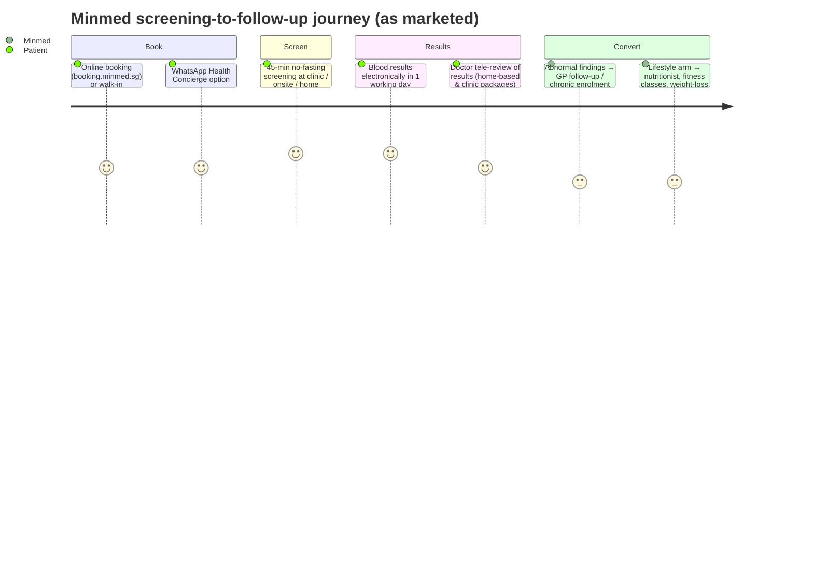

# Competitor Dossier: Minmed Group

**Abstract.** Minmed Group (Minmed Group Pte. Ltd., minmed.sg) is one of Singapore's largest private primary-care and health-screening operators: a network of roughly 29 GP clinics plus 2 dental and 2 paediatric clinics (32 outlets claimed as of 2025–26), four executive screening centres (Paragon, Jewel Changi Airport, Jurong Point, Woodlands), large mobile screening/vaccination teams, and the anchor contract for the Ministry of Education's annual staff health-screening and flu-vaccination programme.[^1][^2][^3] Founded in 2001 and led by founder-CEO Dr Eric Chiam, it is privately held and unfunded by institutional investors.[^2][^4][^5] It has quietly built most of the capabilities Welltech cares about: teleconsultation at S$21.60, a WhatsApp "health butler" concierge, hospital-at-home contracts with SGH/CGH/KKH under MIC@Home, a telehealth booth inside SGH's Emergency Department (SWIFT Care), a S$250 flat-fee premium GP tier (Minmed Reserve), fitness studios, and — critically — a doctor-prescribed weekly-injection weight-loss programme with medication "from S$150 (incl. GST)" renewed via WhatsApp video consult.[^6][^7][^8][^9][^10][^11] Its weaknesses are consumer-experience quality (Play Store app rating ~1★; Glassdoor 2.0) and the absence of longevity/functional-medicine positioning. Threat level for Welltech: **high on medical weight loss and screening-to-lifestyle funnels; moderate on concierge/longevity**, with genuine partnership potential in corporate screening channels.

Last updated: July 2026.

Related: [ORA Group dossier](ora-group.md) · [MyDoc + Fullerton dossier](mydoc-fullerton.md) · [Doctor Anywhere dossier](doctor-anywhere.md) · [Speedoc dossier](speedoc.md) · [Competitor comparison](competitor-comparison.md) · [Research standards](../RESEARCH-STANDARDS.md)

**Sourcing note.** minmed.sg and several third-party pages (Great Eastern, ClinicGeek, Play Store, health365.sg) returned HTTP 403 (Cloudflare/bot-blocking) to direct fetches from our research environment in July 2026. All minmed.sg content cited below therefore comes from search-engine result snippets of the named pages, not full-page fetches; each is marked accordingly. Prices should be re-verified by a human browser before being used in pricing decisions.

---

## 1. Company overview & history

| Item | Detail |
|---|---|
| Trading entity | Minmed Group Pte. Ltd., UEN 201432854H (incorporated 2014 — the group holding entity; the brand predates it)[^5] |
| Founded | 2001 (per minmed.sg "leading healthcare provider in Singapore since 2001" and Hospital Management Asia profile); Tracxn dates the current corporate entity to 2014 — both are correct at different levels (brand vs holding company)[^2][^4][^12] |
| Founder & CEO | Dr Eric Chiam (Eric Chiam Choon Guan); Tracxn also lists Chen Lisa as co-founder[^4][^13] |
| HQ | 8 Kaki Bukit Ave 1, #02-05/06/07, Singapore 417941 (head office); Haig Road is a clinic, not HQ[^14] |
| Network (as of 2025–26) | 32 clinics: 29 GP + 2 dental (incl. Marine Parade) + 2 paediatric (River Valley, Tengah); plus 4 executive screening centres and the Minmed Wellness Collective at Jewel Changi Airport[^3][^15][^16] |
| Positioning | "Primary and Preventive Healthcare organisation" — health screening, primary care, telemedicine, diagnostic imaging, fitness and nutrition[^2][^3] |
| Ownership | Private; no institutional funding recorded (Tracxn: "unfunded")[^4] |
| Revenue | Conflicting third-party estimates: ZoomInfo ~US$8.4M (2026 est.); Tracxn cites SGD 874K FY2023 for one entity. Both low confidence; the group operates through multiple entities (e.g. Dayspring Medical Clinic (Tampines) Pte. Ltd.), so single-entity filings understate group scale. *(analyst note)*[^4][^13][^17] |
| Employees | ~234 (ZoomInfo estimate, undated)[^13] |

### Timeline (reconstructed from public sources)

- **2001** — Minmed brand founded; grows as a mall/MRT-adjacent GP chain ("clinics largely located in shopping malls at major MRT stations").[^2][^18]
- **2014** — Minmed Group Pte. Ltd. incorporated as group entity.[^5]
- **2020–2022 (COVID era)** — Becomes a major national pandemic-operations contractor: Swab-and-Send-Home (SASH) clinics, PCR testing (S$77 standard; S$265 six-hour express with digital HealthCerts), COVID-19 vaccination centres (sites reported at Bishan CC and Raffles City Convention Centre among national VC locations) and mobile vaccination teams. Dr Eric Chiam and colleagues received the Pingat Bakti Masyarakat (COVID-19) national award.[^3][^19][^20]
- **2020** — Minmed Connect app launched (iOS App Store listing id1514570975, first published 2020).[^21]
- **2023** — Healthier SG launch; Minmed enrols patients on the spot at "more than 18" accredited clinics islandwide.[^22]
- **2023–2024** — Minmed Wellness Collective opens at Jewel Changi Airport: private-suite executive screening plus rhythm-cycling/yoga/barre/pilates classes in the Shiseido Forest Valley and Canopy Park.[^16][^23]
- **2024** — SWIFT Care Clinic opens inside SGH's Emergency Department: Minmed-staffed telehealth booths diverting non-emergency ED attendances.[^9][^24]
- **2024–2026** — Pivots into hospital-at-home: MIC@Home clinical partner to SGH, CGH and KKH (internal medicine, paediatrics, O&G, surgical disciplines; 24/7 remote monitoring, on-demand video, home visits, IV therapy, home phlebotomy).[^3][^25][^26]
- **2025–2026** — Opens Minmed Clinic (Punggol Coast) in Punggol Coast Mall (Punggol Digital District); launches doctor-prescribed injectable weight-loss programme and WhatsApp Health Concierge.[^7][^10][^27]

**Implications for Welltech.** Minmed is not a static GP chain; it converts government programmes (MOE screening, COVID ops, Healthier SG, MIC@Home) into standing capabilities. Expect it to do the same with weight management once national obesity programmes scale.

---

## 2. Founders & leadership

- **Dr Eric Chiam — Founder & CEO.** Confirmed across Crunchbase, LinkedIn, Apollo and minmed.sg-derived snippets. Publicly recognised with the Pingat Bakti Masyarakat (COVID-19) for national pandemic contributions.[^3][^12][^13]
- **Chen Lisa — co-founder** per Tracxn; role today unknown (not surfaced on the site or LinkedIn snippets).[^4]
- **Dr Chen Yew Nah — NOT verified as founder.** The research brief hypothesised Dr Chen Yew Nah as founder; searches find no connection. The only public "Chen Yew Nah" is a former Managing Director of DP Information Group (Experian) now at non-profits — unrelated to Minmed. Treat the hypothesis as disproven on available evidence.[^28]
- Other named managers (RocketReach/ZoomInfo, low confidence): Adelene Mai (HR Manager), Michelle Cheang (Director, Business Development).[^29]
- A "Dr Wong" is described as overseeing group medical protocols and leading doctors/nurses across vaccination centres, mobile teams and COVID testing ops (minmed.sg Our Doctors snippet; full name not captured).[^30]

---

## 3. Corporate structure, funding & investors

- **Privately held; no external funding recorded.** Tracxn classifies Minmed as "unfunded"; Crunchbase shows no rounds. No PE/VC investor, no acquisition of Minmed, and no stake sales were found as of July 2026.[^4][^12]
- **Brand roll-up behaviour:** Dayspring Medical Clinic (Tampines) Pte. Ltd. operates "as part of Minmed Group Pte Ltd" (Century Square, Tampines; a Pasir Ris Dayspring site also appears under Minmed's Facebook/locations) — evidence of at least one absorbed/affiliated practice, though no acquisition announcement was found.[^31]
- **Revenue reality check:** with ~32 outlets, four screening centres, the MOE contract and three hospital-at-home contracts, group revenue plausibly sits in the tens of millions SGD — far above Tracxn's single-entity SGD 874K figure and likely above ZoomInfo's US$8.4M estimate. *(analyst estimate; no group filings public)*[^4][^13]

**Implications for Welltech.** A bootstrapped incumbent with government-anchored cashflow has no exit pressure and can price aggressively, but it also cannot outspend a funded entrant on consumer product/brand.

---

## 4. Footprint: GP clinics vs screening centres

Verified locations (from minmed.sg locations/gp-clinics snippets and directory listings, July 2026). The brief's hypothesised list (Haig Road, Jurong East, Punggol, Tampines, Yishun, Bedok, Pasir Ris) is confirmed, with Tampines/Pasir Ris operating under the Dayspring sub-brand.[^15][^18][^31]

| Format | Count (as observed) | Named sites |
|---|---|---|
| GP clinics | ~29 (site claims; directories list 18–20 under "Minmed Clinic" brand) | AMK Hub (Ang Mo Kio), Bedok Mall, Boon Lay Place, The Clementi Mall, Haig Road, JEM (Jurong East), Jurong Point (Jurong West), Marina Bay Link Mall, Northpoint City (Yishun), Punggol (83 Punggol Central), Punggol Coast Mall, Sengkang Grand Mall, Woodlands, Pasir Ris; Dayspring (Tampines Century Square; Pasir Ris)[^3][^15][^18][^27][^31] |
| Executive screening centres | 4 | Minmed Health Screeners @ Paragon (flagship, >3,000 sq ft, 290 Orchard Rd #16-04/09/10); Minmed Wellness Collective @ Jewel Changi Airport (#04-209/212); Minmed Screening Centre @ Jurong (within Jurong Point clinic); Minmed Screening Centre @ Woodlands[^16][^32][^33] |
| Dental | 2 | incl. Minmed Dental Clinic (Marine Parade)[^3][^34] |
| Paediatric | 2 | River Valley; Tengah[^35] |
| Fitness/wellness | Jewel classes (35-bike rhythm cycling; yoga/barre/pilates at Canopy Park); corporate fitness and HPB fitness programmes islandwide; a "Minmed Fitness Studio" at Zion appears in search results (unverified detail)[^16][^23][^36] |
| Mobile/home | Home-based screening teams islandwide; onsite corporate/school screening; hospital-at-home coverage[^25][^37] |

Count reconciliation: "32 clinics" (HMA sponsor profile, 2025-26) vs "18 Minmed medical clinics" (ShopsInSG directory) vs "more than 18 Healthier SG clinics" (minmed.sg) vs "over 20 clinics" (health365.sg). The 32 figure includes dental, paediatric and newer/sub-branded sites; ~18–20 is the core "Minmed Clinic"-branded GP estate. State ranges, not a single number.[^3][^18][^22][^38]

---

## 5. Business model & revenue streams

| Stream | Description | Buyer | Evidence |
|---|---|---|---|
| GP services | Walk-in + booked acute care, chronic disease management (CDMP), child/travel vaccinations, work-permit medicals; CHAS/PG/MG subsidies | Consumers, MOM-driven demand | [^15][^22] |
| Health screening (retail) | 45-minute, no-fasting clinic screening daily at all clinics; results in 1 working day; Screen for Life national programme at ≤S$5 | Consumers | [^37][^39][^40] |
| Executive screening | Radiology-grade packages (X-ray, ultrasound, mammogram, treadmill ECG, 2D echo, cancer markers) at Paragon/Jewel/Jurong/Woodlands; private suites at Jewel; report ≤1 week | Affluent consumers, expat/corporate top-ups | [^16][^32][^33] |
| Corporate & school screening | Onsite mobile-team screening, all-day (non-fasting), corporate health reporting; anchor client: MOE — annual islandwide staff screening + flu vaccination (fully subsidised for MOE officers; S$10.90 basic package for non-eligible staff); NUS staff screening at corporate rates | Ministries, universities, employers | [^1][^41][^42] |
| Teleconsultation | Minmed Connect video GP, daily 9am–9pm, S$21.60/consult + meds, 3-hour medication delivery; Great Eastern co-branded at S$15 nett | Consumers, insurers | [^6][^8][^43] |
| SWIFT Care (B2G telehealth) | Minmed-run telehealth booths in SGH ED for non-emergencies: S$54.50 (9am–8:59pm) / S$87.20 (9pm–11:59pm) flat incl. 1 week acute meds + courier; 30–60 min end-to-end | SGH/SingHealth + patients | [^9][^24] |
| Hospital-at-home | MIC@Home clinical partner to SGH, CGH, KKH — 24/7 remote monitoring, video consults, home visits, IV/bloods; MOH-funded model | Public hospital clusters | [^3][^25][^26] |
| Premium GP (Minmed Reserve) | S$250 flat fee incl. consultation + generic meds (1 week acute / 1 month chronic) — a concierge-lite tier | Affluent consumers | [^11] |
| Weight management | Doctor-prescribed weekly injectable programme; medication from S$150 incl. GST per ~2-week pen; WhatsApp video renewals; nutritionist + fitness classes bundled | Consumers | [^7][^10][^44] |
| Fitness & wellness | Jewel classes S$28/class; corporate fitness; HPB-funded community fitness programmes | Consumers, HPB, employers | [^16][^23][^36] |
| Dental & paediatrics | 2 + 2 clinics | Consumers | [^3][^34][^35] |
| COVID legacy (wound down) | PCR S$77 / express S$265; ART; vaccination centres; SASH | Travellers, MOH | [^19][^20] |

Dietitian/physiotherapy note: Minmed markets **nutritionist** support (within weight-loss and screening follow-up) and fitness, but no standalone physiotherapy service line was found; the brief's physiotherapy hypothesis is unconfirmed.[^7][^36] "Minmed Hive"/"Minmed Junction" concepts: **no evidence found** — searches surface only the Wellness Collective (Jewel) and Punggol Coast Mall clinic; treat Hive/Junction as unverified/likely nonexistent.[^16][^27]

---

## 6. Advertised pricing (SGD, as surfaced from minmed.sg pages via search snippets, July 2026)

| Item | Price (SGD) | Notes |
|---|---|---|
| Teleconsult (Minmed Connect) | 21.40–21.60 incl. GST | meds + delivery charged separately; 9am–9pm daily; GE-partner rate S$15 nett[^6][^8][^43] |
| SWIFT Care Clinic @ SGH ED | 54.50 day / 87.20 night | flat, incl. 1 wk acute meds + courier[^9] |
| GP walk-in consult | not published | varies by time/length/location; ARI flat subsidised rate S$10 (PG/MG S$5) under public schemes[^15][^45] |
| Minmed Reserve premium GP | 250.00 flat incl. GST | incl. generic meds up to 1 wk acute / 1 mth chronic[^11] |
| Screen for Life | ≤5.00 (0 for eligible groups) | national programme at Minmed clinics[^40] |
| MOE basic screening package (non-eligible staff) | 10.90 incl. GST | fully subsidised for MOE officers[^1][^41] |
| Clinic health screening packages | from ~180 (health365 summary; tier names/prices not capturable — site blocked) | "Screen Early" package = doctor consult + biometrics + BP + vision + body-fat + waist-hip[^38][^39][^46] |
| Executive screening (Paragon/Jewel) | custom quotes; not published in snippets | X-ray/US/mammo/treadmill/2D echo; blood results in 1 day, full report ≤1 wk[^16][^32] |
| Flu vaccine | 32.00 (GE 4-in-1: 35.00 nett) | CHAS/MG/PG subsidies apply[^47] |
| HPV9 vaccine | 305.00 (GE rate 252.00 nett ×3 doses) | subsidies for eligible residents[^47] |
| Weight-loss medication | from 150.00 incl. GST | ~2-week injectable pen; programme consult + support bundled[^10] |
| Fitness class (Jewel) | 28.00/class | rhythm cycling, yoga, barre, pilates[^23] |
| COVID PCR (legacy) | 77.00 / 265.00 express | 6-hour express, HealthCerts[^19] |

The named tiers hypothesised in the brief ("Signature"/"Essential") were **not found**; observed package naming is "Screen Early" (and Screen for Life). Full tier grids could not be captured because minmed.sg blocked fetches — flag for manual verification.[^39][^46]

---

## 7. Clinical workflow & patient journey

- Walk-ins accepted at clinics; online booking encouraged; screening bookable per-location via a product-style booking engine (e.g. "Screen Early Package" per-clinic URLs).[^46][^48]
- Home-based screening: mobile team at preferred address, results in 1 working day, followed by a doctor teleconsult — tele-review is native to the model.[^37]
- Reports downloadable via a dedicated portal (minmed.sg/download-report); corporate clients get aggregate statistical reporting only (individual confidentiality maintained for MOE).[^41][^49]
- Weight-loss workflow: first consult in-clinic → biometrics + non-fasting bloods (glucose, cholesterol) → weekly injectable with GP-tailored dosing → renewal by WhatsApp video consult every ~2 weeks with pen delivered to home.[^7][^10]

---

## 8. Regulatory posture

- **HCSA licensing:** GP, screening, teleconsult and home/mobile services each require Outpatient Medical Service licences with permanent/temporary/remote modes of service delivery under the Healthcare Services Act 2020. Minmed's specific licence records were not individually retrievable in this research pass (MOH's HALP register was not fetchable), but its participation in CHAS, CDMP, Healthier SG, Screen for Life, SWIFT Care and MIC@Home — all of which require MOH accreditation — implies current OMS licensure across modes. *(inference)*[^22][^50]
- **CHAS / Healthier SG:** clinics accredited for CHAS and Medisave CDMP; 18+ Healthier SG-accredited clinics with on-the-spot enrolment (or via HealthHub); Healthier SG Chronic Tier drug pricing "comparable to polyclinics"; S$20 Healthpoints on first health-plan consult. Minmed appears in the national CHAS GP booking portal (book.health.gov.sg).[^22][^51]
- **MOH panel/programme status:** approved telemedicine provider lists (FluGoWhere-era), SASH clinic list, Screen for Life provider, MIC@Home private clinical partner.[^25][^40][^52]
- **Enforcement actions:** searches for MOH enforcement, fines, suspensions or HCSA breaches involving Minmed returned **nothing** as of July 2026 — no adverse regulatory record found (absence of evidence, stated as such).[^53]

---

## 9. Technology, AI & WhatsApp usage

- **Minmed Connect app** (iOS id1514570975; Android com.minmed.mink, 100K+ downloads): video consults with SMC-registered doctors, medication delivery, appointment management. Ratings are dire — Play data surfaced via APK mirrors shows ~1.0★ across ~376 ratings; written reviews cite a broken redesign, inability to reach the same doctor after dropped calls, and bot-only support.[^8][^21][^54]
- **WhatsApp-first workflows:** Health Concierge — "personal health butler" on WhatsApp, daily 9am–6pm, for appointment scheduling, referrals and **medication refills via WhatsApp**; weight-loss renewals run on WhatsApp video. WhatsApp is also the primary support channel (a complaint in app reviews: "no contact number… only WhatsApp chat").[^7][^54][^55]
- **Booking & self-service:** booking.minmed.sg engine with per-location product SKUs; report-download portal; HealthHub used for Healthier SG enrolment. No evidence of QR/self-service kiosks beyond the SGH SWIFT booths.[^9][^46][^49]
- **AI claims: none found.** No AI/ML marketing surfaced anywhere in Minmed's materials as of July 2026 — a notable gap versus Doctor Anywhere and Speedoc.[^2] *(absence of evidence)*

---

## 10. Marketing channels & social presence (observed July 2026)

| Channel | Handle | Followers (as observed) |
|---|---|---|
| Facebook | @minmedgroup | ~10K[^56] |
| Instagram | @minmedgroup (+ @minmedwellness) | ~3,036[^56] |
| LinkedIn | Minmed Group Pte Ltd | ~2,018[^56] |
| TikTok | none found | — |
| Linktree | linktr.ee/minmedgroup | aggregator[^56] |

Acquisition machinery is B2B2C, not social: MOE/school channel, Great Eastern Rewards (screening, S$15 teleconsult, vaccination bundles), DBS/POSB card healthcare promos, HPB community fitness, mall footfall, and Klook/Traveloka/funBooky listings (COVID-era testing, now clinic products). Consumer social presence is small for a company this size.[^20][^36][^43][^45][^57]

---

## 11. Reputation & review themes

- **Google reviews (branch-level):** Minmed Clinic (Jurong East/JEM) 3.9★ across 74 reviews — professional doctors praised; waiting times, staff attitude, appointment-system complexity and crowding criticised. Other branches not individually captured (listing sites blocked).[^58]
- **App stores:** heavily negative on both platforms (see §9): delivery delays vs 30–45-min expectation, credit-card demands for "free" consults, "dismissive and rushed" teleconsult doctors, inadequate explanation of abnormal screening results.[^54]
- **Reddit:** targeted searches (site:reddit.com, r/askSingapore phrasing) returned **no indexed Minmed threads** — either low salience or de-indexed; noted as a gap rather than evidence of sentiment.[^59]
- **Glassdoor:** 2.0/5 across ~196 reviews; 17% would recommend; themes: last-minute rostering, understaffing, salary deductions for lateness. (COVID-era swab assistants rated 4.3/5.) High churn risk in patient-facing staff is a service-quality driver. *(inference)*[^60]

---

## 12. Weight management, GLP-1 and longevity: what we found and didn't

**Found:**
- A live **Weight Loss Program** page: "medically guided, doctor-prescribed weekly weight loss program", "clinically guided pharmacotherapy to regulate appetite, reduce cravings and improve metabolism", teleconsult + in-clinic hybrid, nutritionist meal planning, bundled fitness classes, biometrics + non-fasting bloods at baseline.[^7]
- A **Weight Loss Medication** page headlined "from $150 (incl. GST)": in-clinic eligibility consult → ~2-week injectable pen → renewal via WhatsApp video → home delivery.[^10]
- A Facebook post: "Forget quick fixes… Build a healthier you, **one shot a week**" — confirming a weekly injectable, i.e. a GLP-1 (semaglutide-class) protocol, though **no drug brand (Wegovy/Saxenda/Ozempic) is named** in any captured material.[^44]
- A "Weigh to Health" programme page (historically an HPB-approved weight-management provider listing exists).[^61]

**Not found:** any "longevity", healthspan, hormone, or functional-medicine positioning; any advanced-biomarker or body-composition-led longevity packages; any Wegovy-by-name marketing. Searches for "Minmed longevity" return nothing Minmed-specific.[^62]

**Read-through:** Minmed has crossed into medical weight loss with a price-led, WhatsApp-renewed GLP-1 offer sitting on top of the largest screening funnel in the private primary-care market — but it markets it as a GP service, not a branded metabolic programme. The longevity white space remains open.

---

## 13. SWOT

| | Helpful | Harmful |
|---|---|---|
| **Internal** | **Strengths:** dominant corporate/school screening channel (MOE anchor); 32-outlet MRT-mall footprint; 4 radiology-grade screening centres incl. Paragon & Jewel flagships; deep MOH trust (SWIFT Care inside SGH ED, MIC@Home with 3 hospitals, PBM award); no-fasting/1-day-results screening ops; bootstrapped, self-funding; WhatsApp concierge + refills already live; cheap teleconsult (S$21.60) | **Weaknesses:** consumer digital experience is its worst asset (~1★ app, bot-only support); Glassdoor 2.0 signals staffing strain; brand is functional/transactional, weak premium equity; no AI capability narrative; conflicting/opaque financials; tiny social following; weight-loss offer unbranded and buried in GP services |
| **External** | **Opportunities:** Healthier SG capitation-style recurring relationships; convert screening abnormals into chronic/weight/longevity programmes at scale; expand Reserve (S$250) into true concierge; hospital-at-home growth as MOH scales MIC@Home; employer wellness beyond screening | **Threats:** funded consumer-first entrants (Welltech, ORA, Doctor Anywhere) out-designing its weight-loss and concierge UX; GP fee compression and manpower costs; reputational tail-risk from poor app/service reviews; loss of a single anchor contract (MOE) would dent corporate volumes |

---

## 14. Threat assessment & partnership potential for Welltech

**Threat level: HIGH on weight loss & screening-adjacent prevention; MODERATE elsewhere.**

| Dimension | Assessment |
|---|---|
| Medical weight loss / GLP-1 | **Direct competitor today.** From-S$150 medication pricing + WhatsApp renewals undercuts most branded programmes; but no brand, no cohort coaching, no outcomes marketing — beatable on experience and programme design |
| Telehealth | Competes on price (S$21.60) not experience; 1★ app is a standing invitation to switch |
| Longevity/preventive premium | Not present; Paragon/Jewel screening assets could pivot here, so the window is real but not permanent |
| Concierge | Minmed Reserve (S$250 flat) is embryonic concierge-lite; no membership model observed |
| Corporate channel | Formidable incumbent (MOE, NUS, GE, DBS) — hard to displace head-on |

**Partnership angles (credible because Minmed partners readily: SGH, KKH, CGH, GE, HPB, MOE):**
1. **Screening-channel partnership** — Welltech longevity/metabolic programmes as the premium follow-on for Minmed screening abnormals (Minmed monetises referrals; Welltech buys a qualified-lead funnel of tens of thousands of screened adults/year). *(analyst proposal)*
2. **Corporate channel piggyback** — bundle Welltech weight/longevity programmes into Minmed corporate screening RFPs as the "intervention layer" employers increasingly demand.
3. **White-label GLP-1 clinical network** — Minmed's islandwide clinics as draw/injection-training sites for Welltech's WhatsApp-first programme, mirroring how Minmed already staffs SGH's booths.

Conflict risk: Minmed's own weight-loss programme makes it a frenemy; structure any partnership around the premium/longevity tier it does not serve.

---

## 15. Implications for Welltech

1. **Price anchor:** S$150/2-week GLP-1 medication and S$21.60 teleconsults set the mass-market floor in Singapore. Welltech should not fight this on price; sell programme design, continuity, outcomes and brand.
2. **Experience gap is the wedge:** a ~1★ app, bot-only WhatsApp support and "rushed" teleconsult reviews define exactly what a concierge, WhatsApp-native service must not be — and what switchers will pay to escape.
3. **Screening is the customer-acquisition engine of Singapore preventive care.** Minmed proves the funnel (screen → tele-review → intervene). Welltech needs either its own screening offer or a channel deal (Minmed, [Fullerton](mydoc-fullerton.md), or labs) to feed its longevity/metabolic programmes.
4. **Longevity white space confirmed:** Singapore's biggest screening operator still has zero longevity positioning as of July 2026 — validate and move before it rebrands its Paragon/Jewel assets.
5. **Watch items:** any Minmed branded weight programme launch, app relaunch, AI/agentic claims, Healthier SG panel-size disclosures, or a first institutional fundraise — each would signal escalation.

---

## References

[^1]: Ministry of Education (OLive staff portal), "MOE Health Screening Programme", https://olive.moe.edu.sg/olive/spotlight/for-schools-info-moe-health-screening-programme/ (accessed July 2026).
[^2]: Minmed Group, "About Us" (via search snippets; direct fetch blocked 403), https://minmed.sg/about-us/ (accessed July 2026).
[^3]: Hospital Management Asia, "Minmed — sponsor profile", https://www.hospitalmanagementasia.com/sponsor/minmed/ (accessed July 2026).
[^4]: Tracxn, "Minmed - 2025 Company Profile, Team, Competitors & Financials", https://tracxn.com/d/companies/minmed/__C99e8XnS3pVczK1ZFR88bqMImFL1Y7TrQsPNUnZCiag (accessed July 2026).
[^5]: SGPBusiness, "MINMED GROUP PTE. LTD. (201432854H)", https://www.sgpbusiness.com/company/Minmed-Group-Pte-Ltd (accessed July 2026; page blocked to fetch, UEN from search snippet).
[^6]: Minmed Group, "Teleconsult Doctors in Singapore" (via search snippets), https://minmed.sg/teleconsult-doctor/ (accessed July 2026).
[^7]: Minmed Group, "Weight Loss Program in Singapore" (via search snippets), https://minmed.sg/weight-loss-program/ (accessed July 2026).
[^8]: Google Play, "Minmed Connect – Apps on Google Play", https://play.google.com/store/apps/details?id=com.minmed.mink&hl=en_SG (accessed July 2026; via search snippets).
[^9]: Minmed Group, "SWIFT Care Clinic" (via search snippets), https://minmed.sg/swift-care-clinic/ (accessed July 2026).
[^10]: Minmed Group, "Weight Loss Medication in Singapore From $150 (incl. GST)" (via search snippets), https://minmed.sg/weight-loss-medication/ (accessed July 2026).
[^11]: Minmed Group, "Minmed Reserve" (via search snippets), https://minmed.sg/minmedreserve/ (accessed July 2026).
[^12]: Crunchbase, "Minmed Group — Company Profile & Funding" and "Eric Chiam — CEO and Founder", https://www.crunchbase.com/organization/minmed-group (accessed July 2026).
[^13]: ZoomInfo, "Minmed Group - Overview", https://www.zoominfo.com/c/minmed-group-pte-ltd/434616716 (accessed July 2026).
[^14]: Minmed Group, "Contact Us" (via search snippets; HQ 8 Kaki Bukit Ave 1), https://minmed.sg/contact-us/ (accessed July 2026).
[^15]: Minmed Group, "Locations" and "GP clinics in Singapore" (via search snippets), https://minmed.sg/locations/ (accessed July 2026).
[^16]: Minmed Group, "Minmed Wellness Collective @ Jewel Changi Airport" (via search snippets), https://minmed.sg/mwc-health-screening/ (accessed July 2026).
[^17]: RocketReach, "Minmed Group Pte Ltd Information", https://rocketreach.co/minmed-group-pte-ltd-profile_b47e7187fc50d876 (accessed July 2026).
[^18]: SHOPSinSG, "Minmed - 18 Medical Clinics in Singapore", https://shopsinsg.com/minmed-medical-clinics-in-singapore.html (accessed July 2026).
[^19]: Minmed Group, "COVID-19 PCR Swab Test" (via search snippets), https://minmed.sg/covid-19-pcr-swab-test/ (accessed July 2026).
[^20]: Klook, "COVID-19 Testing (ART & PCR Swab Test) in Singapore — Minmed Group", https://www.klook.com/en-SG/activity/73100-covid-19-testing-art-pcr-swab-test-singapore/ (accessed July 2026).
[^21]: Apple App Store, "Minmed Connect App", https://apps.apple.com/sg/app/minmed-connect/id1514570975 (accessed July 2026; via search snippets).
[^22]: Minmed Group, "Healthier SG" (via search snippets), https://minmed.sg/healthier-sg/ (accessed July 2026).
[^23]: Zula, "Minmed Wellness Collective Has Fitness Classes At Jewel Changi", https://zula.sg/minmed-wellness-collective-jewel-changi-airport/ (accessed July 2026).
[^24]: Singapore General Hospital, "SWIFT Care Clinic", https://www.sgh.com.sg/our-specialties/emergency-medicine/swift-care-clinic (accessed July 2026).
[^25]: Hospital Management Asia, "Behind Minmed Group's pivot into Hospital at Home care", https://www.hospitalmanagementasia.com/hospital-at-home/behind-minmed-groups-pivot-into-hospital-at-home-care/ (accessed July 2026).
[^26]: MOH Office for Healthcare Transformation, "Mobile Inpatient Care @ Home", https://www.moht.com.sg/our-programmes/integrated-general-hospital/mic-home/ (accessed July 2026).
[^27]: Punggol Digital District / Punggol Coast Mall, "Minmed Clinic — Stores", https://www.punggoldigitaldistrict.sg/shop/stores/Minmed%20Clinic (accessed July 2026).
[^28]: Brahm Centre, "[Board Member] Ms Chen Yew Nah", https://brahmcentre.com/divi_overlay/ms-chen-yew-nah/ (accessed July 2026; establishes no Minmed link).
[^29]: RocketReach, "Minmed Group Pte Ltd Management Team | Org Chart", https://rocketreach.co/minmed-group-pte-ltd-management_b47e7187fc50d876 (accessed July 2026).
[^30]: Minmed Group, "Our Doctors" (via search snippets), https://minmed.sg/our-doctors/ (accessed July 2026).
[^31]: Healthcare.com.sg, "Dayspring Medical Clinic (Tampines) — part of Minmed Group Pte Ltd", https://www.healthcare.com.sg/item/dayspring-medical-clinic-tampines/ (accessed July 2026).
[^32]: Minmed Group, "Minmed Health Screeners @ Paragon" (via search snippets), https://minmed.sg/minmed-health-screeners/ (accessed July 2026).
[^33]: Minmed Group, "Minmed Screening Centre @ Jurong" and "@ Woodlands" (via search snippets), https://minmed.sg/minmed-screening-centre-jurong/ (accessed July 2026).
[^34]: Facebook, "Minmed Dental Clinic (Marine Parade) is back in action…", https://www.facebook.com/minmedgroup/posts/minmed-dental-clinic-marine-parade-is-back-in-action-and-so-will-your-sparkling-/915788033900386/ (accessed July 2026).
[^35]: Minmed Group, "Paediatric Clinics in Singapore" (via search snippets), https://minmed.sg/paediatric-clinic/ (accessed July 2026).
[^36]: Minmed Group, "Jewel Fitness Classes" and "Corporate Fitness Classes" (via search snippets), https://minmed.sg/fitness/ (accessed July 2026).
[^37]: Minmed Group, "Homebased Health Screening" (via search snippets), https://minmed.sg/homebased-health-screening/ (accessed July 2026).
[^38]: Health365.sg, "Minmed Group: Convenient Packages for a Healthier You", https://www.health365.sg/minmed-healthcare-provider-in-singapore/ (accessed July 2026).
[^39]: Minmed Group, "Affordable Health Screening Package in Singapore" (via search snippets), https://minmed.sg/health-screening/ (accessed July 2026).
[^40]: Minmed Group, "Screen For Life" (via search snippets), https://minmed.sg/screen-for-life/ (accessed July 2026).
[^41]: Booking.minmed.sg FAQ, "Will my health screening results be shown to Ministry of Education…", https://booking.minmed.sg/ufaqs/will-my-health-screening-results-be-shown-to-ministry-of-education-or-my-school-department/ (accessed July 2026).
[^42]: National University of Singapore UHC, "NUS Health Screening 2026 — brochure, payment guidelines", https://nus.edu.sg/uhc/docs/default-source/health-screening/brochure-payment-guidelines-resources.pdf (accessed July 2026).
[^43]: Great Eastern Singapore, "Teleconsult — Great Eastern Rewards", https://www.greateasternlife.com/sg/en/personal-insurance/rewards-and-promotions/rewards/great-eastern-rewards/health/gp-consultation-teleconsult/teleconsult.html (accessed July 2026).
[^44]: Facebook, Minmed Group post, "Forget quick fixes… one shot a week", https://www.facebook.com/minmedgroup/posts/forget-quick-fixes-and-solutions-to-weight-loss-build-a-healthier-you-one-shot-a/932853988860457/ (accessed July 2026).
[^45]: DBS Singapore, "Healthcare For You — card promotions (incl. Minmed)", https://www.dbs.com.sg/personal/promotion/cards-healthcare (accessed July 2026).
[^46]: Minmed Group, "SCREEN EARLY PACKAGE" (booking product page, via search snippets), https://minmed.sg/product/screen-early-package/ (accessed July 2026).
[^47]: Minmed Group, "Flu Vaccine" and "HPV Vaccine" (via search snippets), https://minmed.sg/flu-vaccine/ and https://minmed.sg/hpv-vaccine/; Great Eastern vaccination rewards page, https://www.greateasternlife.com/sg/en/personal-insurance/rewards-and-promotions/rewards/great-eastern-rewards/health/vaccination/minmed-group.html (accessed July 2026).
[^48]: Booking.minmed.sg FAQ, "Do I need to make an appointment to be seen at your clinic?", https://booking.minmed.sg/ufaqs/do-i-need-to-make-an-appointment-to-be-seen-at-your-clinic/ (accessed July 2026).
[^49]: Minmed Group, "Download Health Screening Report", https://minmed.sg/download-report (accessed July 2026).
[^50]: Ministry of Health Singapore, "Outpatient Medical Service | HCSA", https://www.moh.gov.sg/hcsa/outpatient-services/outpatient-medical-service (accessed July 2026).
[^51]: Health Appointment System (GovTech), "Book a CHAS GP appointment — Minmed institutions", https://book.health.gov.sg/offerings/2/institutions?search=minmed (accessed July 2026).
[^52]: MOH/GoWhere, "List of Approved Telemedicine Providers (FluGoWhere)", https://prd-tmp.cdn.gowhere.gov.sg/assets/flugowhere/files/List-of-TM-Providers-for-FluGoWhere.pdf (accessed July 2026).
[^53]: Web searches "Minmed MOH enforcement action fine suspended breach" and variants returned no Minmed-related results (checked July 2026) — negative finding, no source exists to cite.
[^54]: Apple App Store & Google Play user reviews for Minmed Connect (via search snippets incl. APKCombo mirror showing ~1.0★/376 ratings, 100K+ downloads), https://apkcombo.com/minmed-connect/com.minmed.mink/ (accessed July 2026).
[^55]: Minmed Group, "Minmed Health Concierge | Effortless Medication Refills via WhatsApp" (via search snippets), https://minmed.sg/health-concierge/ (accessed July 2026).
[^56]: Minmed Group social profiles: LinkedIn (~2,018 followers) https://sg.linkedin.com/company/minmed-group; Instagram @minmedgroup (~3,036) https://www.instagram.com/minmedgroup/; Facebook (~10K) https://www.facebook.com/minmedgroup/ (all accessed July 2026 via search snippets).
[^57]: Traveloka, "Minmed Clinic - Dayspring Medical Clinic Tampines Tickets 2025", https://www.traveloka.com/en-sg/activities/singapore/product/minmed-clinic-dayspring-medical-clinic-tampines-9531872269660 (accessed July 2026).
[^58]: ClinicGeek, "Minmed Clinic (Jurong East)" (3.9★/74 Google reviews, via search snippets), https://www.clinicgeek.com/place/minmed-clinic-jem-jurong-east (accessed July 2026).
[^59]: Web search "Minmed site:reddit.com" returned zero indexed results (checked July 2026) — negative finding.
[^60]: Glassdoor, "Minmed Group Reviews" (2.0/5, ~196 reviews, 17% recommend), https://www.glassdoor.sg/Reviews/Minmed-Group-Reviews-E2448284.htm (accessed July 2026).
[^61]: Minmed Group, "Weigh to Health" (via search snippets), https://minmed.sg/weigh-to-health/; HPB, "Weight Management Package — approved providers", https://www.hpb.gov.sg/docs/default-source/default-document-library/list-of-approved-programmes-service-providers_wah-141218.pdf (accessed July 2026).
[^62]: Web searches "Minmed longevity", "Minmed Wegovy" returned no Minmed-specific longevity or brand-name GLP-1 content (checked July 2026) — negative finding.
