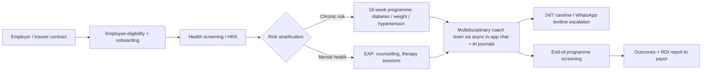
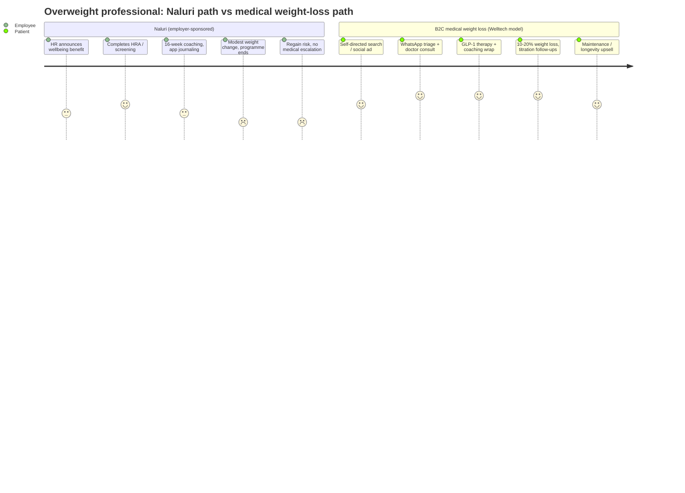

# Competitor Dossier: Naluri (Naluri Hidup Sdn Bhd)

**Abstract.** Naluri (naluri.life) is Malaysia's most heavily funded digital-therapeutics and employee-wellbeing company: a B2B2C platform that sells multidisciplinary human health coaching — clinical psychologists, dietitians, fitness coaches, pharmacists and medical advisors, augmented by AI — to employers and insurers across Southeast Asia. Founded in 2017 by ex-AirAsia X CEO Azran Osman-Rani and physician-epidemiologist Dr Jeremy Ting, it has raised roughly USD 21 million across Series A and B rounds, claims one million covered lives (July 2025), and has published peer-reviewed real-world outcomes for its chronic-disease coaching. It is the closest adjacent competitor to Welltech's weight-loss business in Malaysia — but it is a coaching-only, employer-paid model with no GLP-1 or prescribing capability, which leaves the consumer-direct medical weight-loss space open. This dossier covers its history, funding, business model, clinical workflow, technology, marketing, reputation, and the strategic implications for Welltech.

Last updated: July 2026

Related documents: [Malaysia market intelligence](../10-market-intelligence/malaysia-market-intelligence.md) · [Qmed Asia dossier](qmed-asia.md) · [Research standards](../RESEARCH-STANDARDS.md)

---

## 1. Snapshot

| Item | Detail |
|---|---|
| Legal entity | Naluri Hidup Sdn Bhd (Malaysia); Naluri Pte Ltd (Singapore) used in later funding announcements[^10] |
| Founded | 2017, Kuala Lumpur[^1][^4] |
| Founders | Azran Osman-Rani (CEO), Dr Jeremy Ting (President)[^2][^5] |
| Category | Digital therapeutics / employee health & wellbeing / chronic-disease and mental-health coaching |
| Model | B2B2C: employers and insurers pay per enrolled employee/policyholder[^19] |
| Core claim | "Human-led, AI-augmented" multidisciplinary health coaching; 4x ROI in six months; 60% of participants achieve clinically significant outcomes[^18] |
| Funding | ~USD 5M Series A (2021) + USD 14M total Series B in tranches (2022–2025)[^7][^10][^12] |
| Key investors | Integra Partners, Pruksa Group, TELUS Global Ventures (Pollinator Fund), Sumitomo Corporation Equity Asia, M Venture Partners, Bertelsmann Investments, Striders Corp, Duopharma Biotech, Pathology Asia, Palm Drive Capital, INP Capital, RHL Ventures/KB (Hibiscus Fund)[^7][^9][^12] |
| Scale claims | 1 million covered lives (Jul 2025); 75–100+ enterprise/insurer clients; ~200 staff at peak; markets: Malaysia, Singapore, Indonesia, Thailand, expanding to Philippines and Vietnam[^11][^13][^31] |
| Clinical evidence | JMIR mHealth and uHealth (2024) retrospective observational study, n=774[^15] |
| GLP-1 / prescribing | None found (as of July 2026) — coaching-only model *(verified absence, see §8)* |
| App rating | Google Play ~4.6/5 (~280 ratings)[^25] |
| Glassdoor | 3.4/5 (65 reviews)[^27] |

---

## 2. Company overview and history

Naluri ("instinct/intuition" in Bahasa Malaysia) was founded in 2017 on the thesis that behavioural health drives chronic-disease outcomes, and that existing providers fail patients in exactly the conditions — diabetes, hypertension, obesity, heart disease, anxiety, depression — where lifestyle change matters most.[^1][^6] The company combines behavioural science, data science, and digital design in a single app-based programme, and sells it to healthcare payors (employers and insurers) as a way to cut claims costs and improve workforce productivity.[^1][^4]

### Timeline

| Year | Event |
|---|---|
| 2017 | Founded in Kuala Lumpur by Azran Osman-Rani and Dr Jeremy Ting[^1][^6] |
| 2018–2020 | Early rounds backed by Duopharma Biotech, Pathology Asia (via Biomark), M Venture Partners; builds multidisciplinary coaching team (~50 clinicians/coaches by 2021)[^7][^30] |
| Jun 2021 | USD 5M Series A led by Integra Partners; valuation ~USD 29M (RM120M)[^7][^8][^9] |
| Jun 2022 | USD 7M pre-Series B led by Pruksa Group (Thailand), with Bertelsmann Investments and Striders Corporation; Thailand expansion[^10] |
| Aug 2023 | First global partnership with Prudential: wellbeing services for 13,000 Prudential employees across 26 countries[^22] |
| 2024 | USD 2M internal round (bridge)[^12]; JMIR mHealth and uHealth publishes real-world outcomes study[^15] |
| Jan 2025 | AIA Malaysia × Naluri "HolistiCare" group-insurance wellbeing solution launched[^21] |
| Jul 2025 | Reaches 1 million covered lives[^11] |
| Aug 2025 | Final USD 5M Series B tranche led by TELUS Global Ventures (Pollinator Fund for Good); total Series B USD 14M; targets profitability within a year and expansion into the Philippines and Vietnam[^12][^13][^14] |

The Series B was famously protracted — Azran described the three-year raise with "If I had hair, I would lose it all over again" — a signal of how hard the post-2022 funding environment was for SEA digital health, even for the category leader.[^12]

---

## 3. Founders and leadership

| Person | Role | Background |
|---|---|---|
| Azran Osman-Rani | Co-founder & CEO | Founding CEO of AirAsia X (startup to ~USD 1B IPO in six years); COO of iflix Group / CEO iflix Malaysia (2015–2017); Stanford BSc EE + MSc Management Science & Engineering; Ironman triathlete, author, keynote speaker, adjunct professor (UKM)[^3][^4][^5][^28] |
| Dr Jeremy Ting | Co-founder & President | Medical doctor (NHS); Oxford BM BCh; Harvard MPH (Epidemiology); ex-Junior Partner at McKinsey & Company; Venture Partner at Rhombuz VC[^2][^6] |
| Kenneth Koh | COO | Ex-McKinsey (Expert Associate Partner, implementation); previously Agensi Inovasi Malaysia, PwC Advisory[^29] |
| Ahmad Shah Hafizan Hamidin | CTO | Leads engineering/platform[^29] |
| Tiffanie Ong (earlier) | COO / chief product-psychology roles | Featured as COO in investor community profiles; illustrates the psychology-led product culture[^29] |

The founder pairing is a core asset: a household-name operator-CEO with a strong personal brand (aviation, Ironman, "A Broken Crayon" documentary about recovering from a major cycling accident)[^28] plus a clinically credible physician-epidemiologist president. Management bench is McKinsey-heavy.

---

## 4. Funding and investors

| Round | Date | Amount | Lead / notable investors | Notes |
|---|---|---|---|---|
| Seed / pre-A | 2018–2020 | undisclosed | Duopharma Biotech, Pathology Asia (via Biomark), M Venture Partners; 500 Global exposure via ecosystem[^7][^11] | Strategic pharma + diagnostics investors |
| Series A | Jun 2021 | USD 5M (RM21M) | Integra Partners (lead); Sumitomo Corporation Equity Asia, Palm Drive Capital, INP Capital; Hibiscus Fund (RHL Ventures + KB Investment); returning Duopharma, Pathology Asia, MVP[^7][^8][^9] | Valuation ~USD 29M (RM120M)[^7] |
| Pre-Series B | Jun 2022 | USD 7M | Pruksa Group VC arm (lead, Thailand); Bertelsmann Investments (Germany), Striders Corporation (Japan); returning MVP, Palm Drive, INP[^10] | Earmarked for Thailand entry |
| Series B (internal) | 2024 | USD 2M | Existing investors[^12] | Bridge during hard market |
| Series B (final) | Aug 2025 | USD 5M | TELUS Global Ventures — Pollinator Fund for Good (lead); Sumitomo Corporation Equity Asia, M Venture Partners[^12][^13][^14] | Total Series B USD 14M; goal: profitability within 12 months; Philippines & Vietnam expansion |

**Verification notes.** The task brief suggested Integra, TNB Aura, Pruksa and SBI as investors. Press coverage confirms **Integra Partners** (Series A lead) and **Pruksa** (pre-Series B lead). **TNB Aura and SBI (including SBI Islamic Fund) do not appear in any funding coverage reviewed** — treat them as unconfirmed and likely incorrect.[^7][^10][^12] Total disclosed equity funding is approximately USD 19–21M including Series A; Tracxn/CB Insights profiles are consistent with this range.[^24]

Strategic-investor mix matters: Duopharma (Malaysian pharma), Pathology Asia (labs), Sumitomo and TELUS (health-tech corporates), Prudential and AIA as clients rather than shareholders. Naluri is deeply woven into the payor-pharma-diagnostics establishment — a distribution moat, but also a constituency that anchors it to B2B.

---

## 5. Scale and traction

| Metric | Value | Date / source |
|---|---|---|
| Covered lives | 1,000,000 (milestone) | Jul 2025[^11] |
| Enterprise clients | "75+ of the region's leading employers" (banking, insurance, energy/O&G, mining, telco, property, education, aviation) | 2025[^13][^31] |
| Corporate clients & insurers (speaker-bio claim) | 100+ across five SEA markets | ~2022–2023[^28] |
| Employees | grew "from a single intern to 200" in ~5 years | ~2022[^28] |
| Clinical/coaching team | ~50 doctors, psychologists, coaches, dietitians, nutritionists | 2021[^30] |
| Markets live | Malaysia, Singapore, Indonesia, Thailand | 2025[^13] |
| Markets announced | Philippines, Vietnam (post-Series B); Hong Kong and Australia flagged in earlier coverage | 2025[^12][^31] |
| Insurer distribution | Prudential (global, 26 countries, 13k employees), AIA Malaysia (HolistiCare), Bank Rakyat (with TPA PMCare) | 2023–2025[^21][^22][^23] |

*(Analyst note)* "Covered lives" is an access metric (eligible members), not active users; app-store review volume (~hundreds of ratings) implies monthly active usage is a small fraction of eligible lives — typical for employer-sponsored wellbeing platforms, where enrolment rates of 5–20% are the industry norm. Treat engagement, not reach, as Naluri's binding constraint.

---

## 6. Business model and pricing

**Core model: B2B2C.** Employers (HR/benefits budgets) and insurers (group policies, TPAs) pay Naluri; employees/policyholders receive the programme free. Naluri charges **per enrolled employee**, with third-party benefits catalogues citing plans "starting at USD 20 per employee" in Malaysia — treat as directional, not confirmed list pricing.[^19][^20]

Revenue lines observed:

1. **Employee Assistance Programme (EAP).** Counselling, 24/7 crisis carelines (phone + WhatsApp), webinars, manager training — the entry product for HR buyers.[^18]
2. **Health improvement programmes.** Structured 16-week coaching programmes for diabetes, obesity/weight management, hypertension, mental health, with screening at start and end to prove outcomes (HbA1c, weight).[^16][^17]
3. **Insurer solutions.** White-labelled/co-branded wellbeing layers on group insurance (AIA HolistiCare: "Think Well / Plan Well / Feel Well" modules plus 24/7 careline and WhatsApp textline).[^21] Value proposition to insurers: claims containment and differentiation.
4. **Corporate health screening & assessments.** Clinically validated health-risk assessments feeding risk-stratified interventions.[^18][^31]
5. **B2C personal programmes.** Individuals can buy coaching and book therapy/health consultations directly, but this is a minor channel with no published pricing.[^26]

**Outcome-based selling.** Naluri leads with ROI claims — 4x return within six months, 60% of participants achieving clinically significant risk reduction — and structures screening-before/screening-after into programmes so it can report quantified outcomes to the payor.[^16][^18] This is the playbook of US digital-therapeutics vendors (Omada, Virta) localised for SEA.

**Implication:** the buyer is HR or the insurer, not the patient. Product decisions optimise for payor-visible metrics (enrolment, screening completion, aggregate biometric change), not for consumer willingness-to-pay or medical treatment depth.

---

## 7. Clinical and product workflow

### Programme mechanics

- Member gets access via employer/insurer; completes a comprehensive physical + mental health screening / health-risk assessment.[^16][^18]
- Naluri assembles a **personal multidisciplinary care team**: clinical psychologist (team lead), dietitian, fitness coach, pharmacist, medical advisor; plus career coaches and financial planners for the wellbeing layer.[^16][^25][^30]
- Coaching is delivered **asynchronously via in-app text chat**, supported by structured 16-week programmes, educational modules and challenges.[^25][^30]
- Self-monitoring tools: AI-assisted food journal, thought journal (CBT-style), weight, steps, blood pressure and blood-sugar tracking.[^16][^25]
- End-of-programme screening quantifies outcomes (weight, HbA1c) for the payor report.[^16]
- **Escalation:** 24/7 crisis carelines (phone and WhatsApp) staffed by clinical psychologists and counsellors; therapy and health consultations bookable with licensed professionals.[^18][^21][^26] Medical advisors and pharmacists advise within the programme, but Naluri does not operate as a licensed prescribing telemedicine clinic.

### Programme catalogue

| Programme | Target population | Core components | Outcome metrics reported to payor |
|---|---|---|---|
| Diabetes management | T2D and pre-diabetic employees | Multidisciplinary coach team, AI food journal, glucose + weight tracking, 16-week curriculum, start/end screening | HbA1c reduction, weight, medication adherence[^16] |
| Weight & obesity management | Overweight/obese employees | Dietitian + fitness + psychologist coaching, habit trackers, challenges; positions "reduce reliance on medications" | Weight, BMI, waist circumference[^17] |
| Hypertension management | Hypertensive employees | BP tracking, lifestyle coaching, medication-adherence support | Blood pressure control[^26] |
| Mental health / EAP | All employees | Counselling, therapy sessions, thought journal (CBT), 24/7 carelines, manager training, webinars | DASS/engagement measures, utilisation[^18] |
| Wellbeing extensions | All employees | Financial-planning coaching, career/workplace coaching (part of holistic positioning) | Engagement, self-reported wellbeing[^21][^25] |

Two design choices stand out. First, every programme is **time-boxed (typically 16 weeks)** with pre/post screening — built to generate a payor-facing outcomes report, not to hold a patient in continuous care. Second, mental health is the spine: the coach team is *led by a clinical psychologist*, with dietitians and fitness coaches attached — the inverse of a medical weight-loss clinic where the physician leads and psychology supports.[^25][^30]

### Human + AI mix

Naluri describes itself as **human-driven, AI-augmented**: an AI engine analyses member journal entries, tracker data and progress, and summarises them for the human coaches so each coach can carry a larger panel with higher-quality, personalised responses.[^15][^30][^32] AI is a coach-productivity multiplier, not a replacement — the licensed human remains the interface. Food-journal image recognition is described as patent-pending.[^16] Naluri has presented at ITU's AI for Good Global Summit.[^33]

### WhatsApp usage

WhatsApp is used for the **24/7 crisis textline/careline** (staffed by clinical psychologists and counsellors) and within insurer offerings such as AIA HolistiCare.[^18][^21] Core coaching remains in-app, not WhatsApp-native — a meaningful difference from Welltech's WhatsApp-first care model: Naluri pulls users into its app; the app is the engagement bottleneck.

---

## 8. Outcomes evidence — claims vs published data

**Published study.** *Real-World Outcomes of a Digital Behavioral Coaching Intervention to Improve Employee Health Status*, JMIR mHealth and uHealth, September 2024 (DOI 10.2196/50356). Retrospective observational analysis of 774 employees of an Indonesian (mining) company with 2021–2022 health screenings and Naluri access: active coaching n=177, passive coaching n=108, no coaching n=489. Significant time×group interaction effects were reported for body weight, BMI, HbA1c, LDL, total cholesterol, and systolic/diastolic blood pressure, favouring the actively coached group.[^15] Secondary coverage cites representative effect sizes such as HbA1c −0.14 points, HDL +2.14 mg/dL, total cholesterol −11.45 mg/dL versus comparison groups.[^32]

**Critical read.** The evidence is real but modest: retrospective, non-randomised, self-selected coaching uptake (motivated employees opt in), single employer, and clinically small average effects — a weight/HbA1c change far below what GLP-1 therapy produces (15–20% body-weight reduction in trials). Marketing claims ("reverse Type 2 Diabetes", "4x ROI in six months", "60% achieve clinically significant outcomes")[^16][^18] outrun the published evidence base. For payor sales this suffices; against a medical weight-loss offer it does not.

**GLP-1 / medical weight loss.** Extensive searching (programme pages, press, funding coverage, 2024–2026 news) found **no Naluri GLP-1, pharmacotherapy, or prescription weight-loss offering**. Its obesity programme is explicitly behavioural: coaching to "manage weight, control blood sugar and **reduce reliance on medications**".[^16][^17] Naluri's positioning is medication-avoidant, not medication-enabled. *(Verified absence as of July 2026; monitor — a GLP-1 companion/wraparound programme for insurers would be a logical next move for them.)*

---

## 9. Technology platform

- Mobile app (iOS/Android) with async coach chat, journals, trackers, modules, challenges; corporate dashboard for employer/insurer reporting.[^25][^31]
- AI layer: journal analysis, coach-facing summarisation, risk stratification from screening data; "patent-pending AI-assisted food journals".[^16][^30]
- Data platform: population-level health analytics for payor reporting — screening data, engagement, biometric change; this longitudinal SEA workforce-health dataset is itself an asset.[^18][^31]
- Carelines: 24/7 phone + WhatsApp, human-staffed.[^18]
- No evidence of prescribing infrastructure, e-pharmacy, or lab-ordering integration — the stack is coaching-and-analytics, not clinical care delivery.

---

## 10. Marketing and positioning

**Positioning statement (observed):** the outcomes-proven, holistic (mental + physical + financial wellbeing) employee-health platform for Asian enterprises — "combining behavioural science, data science and digital design".[^1][^31]

Channels and tactics:

- **Founder-led thought leadership.** Azran is a top-tier regional keynote speaker (100+ keynotes: leadership, resilience, "Ironman approach to business"), with heavy media presence (Tatler cover story, BFM radio, Wikipedia notability). He personifies the brand and generates free B2B awareness no competitor can match.[^3][^4][^28]
- **B2B content marketing.** Case studies, workplace-health reports, webinars and whitepapers targeted at HR and benefits leaders; testimonial-driven ("4x ROI") landing pages.[^18][^31]
- **LinkedIn-first social presence** (company page positioned as "Naluri – Employee Health & Wellness"), employee advocacy, HR-community engagement.[^31]
- **Insurer co-marketing.** Launches with AIA (HolistiCare, Jan 2025), Prudential (global, 2023), Bank Rakyat/PMCare — press-released partnerships that double as distribution.[^21][^22][^23]
- **Conference/industry circuit.** HR and wellbeing awards ecosystem (HR Vendors of the Year categories), AI for Good Summit, MedTech Innovator features.[^33][^34]
- **Consumer marketing is minimal** — Instagram carelines posts, app-store presence; there is no evidence of paid consumer acquisition at scale. Naluri does not compete for the B2C weight-loss searcher.

---

## 11. Reviews and reputation

### App stores
Google Play rating ~4.6/5 from ~280 ratings — positive but very low volume relative to "1M covered lives", confirming that active consumer engagement is thin.[^11][^25] Reviews praise coach responsiveness and journaling; no large corpus of complaints found. Apple App Store listing exists; rating volume not surfaced in research.[^25]

### Glassdoor (employer signals)
3.4/5 across 65 reviews. Pros: warm, transparent culture; accessible senior management; flexible work and unlimited leave. Cons repeatedly cited: long hours and burnout, favoritism in promotions, micro-management, limited career growth — including the pointed line that "for a company that focuses on mental health, it's ironic that they cause mental health issues for employees".[^27] Work-life balance 3.5, culture 3.6, career opportunities 3.1.[^27] Signal: a hard-driving, founder-led scale-up under commercial pressure — consistent with the three-year Series B grind.[^12]

### Client reputation
Public testimonials from enterprise clients emphasise cost-effective scaling across geographies and the mental+physical integration; marquee logos (AIA, Prudential, Bank Rakyat, large GLCs and MNCs) function as reference-sale proof.[^18][^21][^22][^23]

---

## 12. Competitive position within B2B wellbeing

| Player | HQ / founded | Focus | vs Naluri |
|---|---|---|---|
| **Naluri** | KL, 2017 | Mental + chronic-disease coaching, outcomes-led | Broadest clinical scope; strongest MY/ID footprint[^24][^35] |
| Intellect | SG, 2019 | Mental health / EAP, self-guided + coaching | Larger funding, mental-health-first; weaker on cardiometabolic[^35] |
| ThoughtFull | SG, 2019 | Mental health EAP for insurers/employers | Narrower; insurer-channel overlap[^35] |
| MindFi | SG | Mindfulness → EAP | Smaller[^35] |
| Ooca | TH | Tele-psychology | Thailand-centric[^35] |

Naluri's differentiation is the **physical-health/chronic-disease layer** (diabetes, obesity, hypertension) on top of EAP — closer to Omada/Vida than to Calm/Headspace clones. That makes it the incumbent claim on the "employer weight-management budget" in Malaysia.

---

## 13. Strengths, weaknesses, SWOT

**Strengths**
1. Category-leading brand and founder distribution in Malaysian corporate health; McKinsey-grade enterprise sales machine.[^4][^28][^29]
2. Multidisciplinary licensed clinical bench (psychologists, dietitians, pharmacists, medical advisors) — hard to replicate quickly.[^16][^30]
3. Insurer partnerships (AIA, Prudential) = structural distribution and credibility.[^21][^22]
4. Peer-reviewed outcomes publication — rare in SEA digital health.[^15]
5. Regional footprint (4 live markets, 1M covered lives) and strategic cap table (TELUS, Sumitomo, Duopharma, Pathology Asia).[^11][^12]

**Weaknesses**
1. Coaching-only: no prescribing, no GLP-1, no labs, no doctor-led treatment — cannot serve the patient who wants medical weight loss.[^16][^17]
2. Engagement gap: covered lives ≫ active users; app-first model with modest consumer pull.[^11][^25]
3. Payor-funded economics: long sales cycles, budget-line vulnerability, three years to close Series B; profitability still a forward target as of Aug 2025.[^12][^13]
4. Modest per-member clinical effect sizes vs pharmacotherapy.[^15][^32]
5. Internal strain signals on Glassdoor (burnout, turnover risk among the clinical coaching workforce).[^27]

### SWOT

| | Helpful | Harmful |
|---|---|---|
| **Internal** | Clinical multidisciplinary team; insurer/employer distribution; outcomes data; founder brand; regional platform | No medical/pharma capability; app engagement bottleneck; not yet profitable; culture strain |
| **External** | GLP-1 wave creates payor demand for weight programmes it could wrap; corporate mental-health mandates; SEA insurer digitisation; Philippines/Vietnam whitespace | GLP-1 providers reset consumer expectations of "weight loss that works"; better-funded SG rivals (Intellect); employer budget cuts; insurers building in-house |

---

## 14. Drug-enabled vs coaching-only: where a B2C medical weight-loss player fits

Naluri and Welltech both target the overweight Malaysian professional, but from opposite ends:

| Dimension | Naluri | Welltech (B2C medical weight loss) |
|---|---|---|
| Payer | Employer / insurer | Patient (out-of-pocket) |
| Intervention | Behavioural coaching, 16 weeks | Doctor-led GLP-1 pharmacotherapy + coaching wrap |
| Expected weight outcome | Low single-digit % (behavioural)[^15] | 10–20% (drug-enabled, per global trial data) |
| Clinical staff | Psychologist-led coach teams | Prescribing physicians + allied health |
| Channel | HR portal, app | WhatsApp-first, consumer marketing |
| Buyer motivation | Claims cost / ESG / benefits | Personal appearance, health, speed of results |
| Regulatory surface | Low (non-medical coaching) | High (prescribing, telemedicine, pharmacy) |

The gap is structural, not incidental: Naluri's payor economics, medication-avoidant positioning and non-clinic licensure mean it **cannot follow a patient into pharmacotherapy** without rebuilding its model. Conversely, its employer channel gives it first contact with millions of pre-screened, risk-stratified overweight employees whom it can only offer coaching. The strategic frontier is who captures the patient when coaching alone fails — today that patient leaks to hospitals, aesthetics clinics and grey-market semaglutide, not to Naluri.

---

### Customer-journey contrast

*(Inference)* The journeys intersect at exactly one point: the employee who finished a Naluri programme without adequate results is the highest-intent, pre-educated lead for medical weight loss. No player in Malaysia currently monetises that hand-off.

## 15. Key questions to monitor

| Question | Signal to watch | Why it matters |
|---|---|---|
| Will Naluri add GLP-1 wraparound services? | Physician/pharmacist hiring, insurer GLP-1 pilot announcements, telemedicine partnerships | Would convert Naluri from adjacent player to direct competitor/gatekeeper |
| Does the 2026 profitability target hold? | Follow-on raises, headcount changes, market exits | Distress could open acquisition or partnership windows |
| Philippines/Vietnam execution | Local entity launches, client logos | Diverts management attention from Malaysian product depth |
| Insurer channel deepening (AIA/Prudential expansion) | HolistiCare v2, group-policy embedding | Insurer-embedded wellbeing raises the bar for Welltech's own payor conversations |
| Engagement disclosure | Any published MAU/enrolment rates | Would confirm or refute the covered-lives vs active-users gap |

## 16. Implications for Welltech

1. **Do not fight Naluri for the employer budget; harvest its unmet demand.** Naluri conditions the market to believe weight is treatable and screens hundreds of thousands of employees, then offers only coaching. Welltech's B2C GLP-1 programme is the natural "step-up" tier. Position explicitly against coaching-only results ("when coaching isn't enough, medical treatment is") without disparaging coaching — it is the top of Welltech's funnel.
2. **A partnership is plausible and time-limited.** Naluri needs a medical weight-loss capability to defend insurer accounts as GLP-1 demand grows (its 2025 profitability push makes asset-light partnership more likely than building a clinic). A Welltech–Naluri referral or white-label prescribing layer would be a major distribution unlock — but the same logic applies to any licensed telehealth clinic, so the window is competitive.
3. **Own WhatsApp-first care as a differentiator.** Naluri's engagement bottleneck is its app; its WhatsApp use is limited to crisis lines. Welltech's WhatsApp-native journey (acquisition → consult → titration follow-ups) attacks exactly where employer-app models under-engage.
4. **Match the evidence play, but with stronger endpoints.** Naluri wins B2B deals with a single JMIR observational study and ROI whitepapers. Welltech should publish real-world Malaysian GLP-1 outcomes (weight %, HbA1c, retention) early — pharmacotherapy effect sizes will dwarf coaching benchmarks and can be used in payor conversations later.
5. **Watch for Naluri entering medical weight loss.** Trigger signs: hiring physicians/pharmacy licenses, insurer GLP-1 utilisation-management pilots, or a partnership with a telemedicine provider (e.g., DoctorOnCall-type players). If Naluri wraps GLP-1 for insurers before Welltech establishes its consumer brand, Naluri becomes the gatekeeper for reimbursed weight-loss care in Malaysia.
6. **Learn from its Glassdoor pattern.** Clinical-coach burnout at scale is the operational failure mode of human-heavy models; Welltech's AI-enabled ops should be designed to keep clinician panels sustainable from day one.

---

## References

[^1]: Naluri, "Workplace and employee wellness programme" (homepage), https://www.naluri.life/ (accessed July 2026).
[^2]: The Org, "Jeremy Ting — Co-founder & President at Naluri", https://theorg.com/org/naluri/org-chart/jeremy-ting (accessed July 2026).
[^3]: Wikipedia, "Azran Osman Rani", https://en.wikipedia.org/wiki/Azran_Osman_Rani (accessed July 2026).
[^4]: Tatler Asia, "Naluri's founder Azran Osman-Rani is on a mission to make healthcare more holistic", https://www.tatlerasia.com/power-purpose/business/cover-story-azran-osman-rani-aims-to-redefine-modern-healthcare (accessed July 2026).
[^5]: The Org, "Azran Osman-Rani — CEO and Co-Founder at Naluri", https://theorg.com/org/naluri/org-chart/azran-osman-rani (accessed July 2026).
[^6]: HR in Asia, "The right programs to retain healthy workers: Q&A with Dr Jeremy Ting, President and Co-Founder of Naluri", https://www.hrinasia.com/interview/programs-to-retain-healthy-workers/ (accessed July 2026).
[^7]: Naluri, "Malaysian health-tech startup Naluri secures $5 million in new funding round", https://www.naluri.life/news/malaysian-health-tech-startup-naluri-secures-5-million-in-new-funding-round (accessed July 2026).
[^8]: The Malaysian Reserve, "Naluri Hidup raises RM21m in Series A" (10 Jun 2021), https://themalaysianreserve.com/2021/06/10/naluri-hidup-raises-rm21m-in-series-a/ (accessed July 2026).
[^9]: MobiHealthNews, "Digital health coaching startup Naluri scores $5M to launch service in Thailand, Philippines" (2021), https://www.mobihealthnews.com/news/asia/digital-health-coaching-startup-naluri-scores-5m-launch-service-thailand-philippines (accessed July 2026).
[^10]: TechNode Global, "Malaysia's Naluri secures $7M pre-Series B funding round led by Pruksa Group" (21 Jun 2022), https://technode.global/2022/06/21/malaysias-naluri-secures-7m-pre-series-b-funding-round-led-by-pruksa-group/ (accessed July 2026).
[^11]: 500 Global, "Naluri raises US$5M, expands employee wellbeing programs across Asia to reach 1 million lives — Markup #1193", https://500.co/content/naluri-raises-us-5-m-expands-employee-wellbeing-programs-across-asia-to-reach-1-million-lives-markup-1193 (accessed July 2026).
[^12]: Digital News Asia, "'If I had hair, I would lose it all over again' — Naluri's Azran on closing his 3-year long Series B funding" (Aug 2025), https://www.digitalnewsasia.com/startups/if-i-had-hair-i-would-lose-it-all-over-again-naluris-azran-osman-rani-closing-his-3-year (accessed July 2026).
[^13]: Naluri, "Naluri secures $5M Series B funding to expand across Southeast Asia" (12 Aug 2025), https://www.naluri.life/news/naluri-series-b-5m-southeast-asia-expansion (accessed July 2026).
[^14]: e27, "Digital health provider Naluri raises US$5M, targets profitability in one year" (11 Aug 2025), https://e27.co/digital-health-provider-naluri-raises-us5m-targets-profitability-in-one-year-20250811/ (accessed July 2026).
[^15]: JMIR mHealth and uHealth, "Real-World Outcomes of a Digital Behavioral Coaching Intervention to Improve Employee Health Status: Retrospective Observational Study" (2024; DOI 10.2196/50356), https://mhealth.jmir.org/2024/1/e50356 ; PubMed record: https://pubmed.ncbi.nlm.nih.gov/39255013/ (accessed July 2026).
[^16]: Naluri, "Diabetes Management Programme", https://www.naluri.life/what-we-offer/health-improvement-programmes/diabetes (accessed July 2026).
[^17]: Naluri, "Weight and Obesity Management Programme", https://www.naluri.life/what-we-offer/health-improvement-programmes/obesity (accessed July 2026).
[^18]: Naluri, "Your trusted Employee Assistance Programme", https://www.naluri.life/what-we-offer/eap ; and Naluri, "Carelines — 24/7 counselling support", https://www.naluri.life/contact-us/carelines (accessed July 2026).
[^19]: WIPO IP Advantage, "Naluri health coaching app — providing holistic care for a healthier life", https://www.wipo.int/en/web/ip-advantage/w/stories/naluri-health-coaching-app-providing-holistic-care-for-a-healthier-life (accessed July 2026).
[^20]: Meditopia for Work, "Top 6 Employee Assistance Programs in Malaysia" (cites Naluri plans from ~USD 20 per employee), https://meditopia.com/en/forwork/articles/top-eap-providers-in-malaysia (accessed July 2026). *Third-party pricing signal; not confirmed by Naluri.*
[^21]: Naluri, "AIA Malaysia and Naluri join forces to launch HolistiCare solution" (8 Jan 2025), https://www.naluri.life/news/aia-malaysia-naluri-partnership-holisticare-launch (accessed July 2026).
[^22]: Naluri, "A global commitment to wellbeing: Naluri announces first global partnership with Prudential" (14 Aug 2023), https://www.naluri.life/news-and-reports/naluri-announces-first-global-partnership-with-prudential (accessed July 2026).
[^23]: Naluri, "Bank Rakyat Malaysia launches wellness programme with PMCare and Naluri", https://www.naluri.life/news-and-reports/bank-rakyat-malaysia-wellness-programme-pmcare-naluri (accessed July 2026).
[^24]: CB Insights, "Naluri — products, competitors, financials", https://www.cbinsights.com/company/naluri-hidup (accessed July 2026).
[^25]: Google Play, "Naluri" (life.naluriclientapp; ~4.6/5, ~280 ratings), https://play.google.com/store/apps/details?id=life.naluriclientapp ; Apple App Store, "Naluri", https://apps.apple.com/us/app/naluri/id1296553288 (accessed July 2026).
[^26]: Naluri, "Personal Health Programme (individuals)", https://www.naluri.life/who-we-serve/individuals ; "Book therapy or health consultation", https://www.naluri.life/consultations/ (accessed July 2026).
[^27]: Glassdoor, "Naluri Reviews" (3.4/5, 65 reviews), https://www.glassdoor.com/Reviews/Naluri-Reviews-E3270555.htm (accessed July 2026).
[^28]: A-Speakers, "Azran Osman-Rani — business growth speaker" (bio: 200 employees, 100+ corporate clients, five SEA markets), https://www.a-speakers.com/speakers/azran-osman-rani/ ; Thailand Speaker Bureau profile, https://www.thailandspeakerbureau.com/speaker-profile/azran-osman-rani (accessed July 2026).
[^29]: The Org, "Naluri — Leadership Team", https://theorg.com/org/naluri/teams/leadership-team ; The Org, "Kenneth Koh — COO", https://theorg.com/org/naluri/org-chart/kenneth-koh (accessed July 2026).
[^30]: KrASIA, "Naluri embraces mental health aspects of chronic disease treatment: Startup Stories" (2021), https://kr-asia.com/naluri-embraces-mental-health-aspects-of-chronic-disease-treatment (accessed July 2026).
[^31]: Beinsure, "Insurtech Naluri secures $5mn to scale digital health platform in Asia", https://beinsure.com/news/insurtech-naluri-secures-5mn/ ; IT Brief Asia, "Naluri raises USD $5 million to expand digital health in Asia", https://itbrief.asia/story/naluri-raises-usd-5-million-to-expand-digital-health-in-asia (accessed July 2026).
[^32]: AInvest, "Behavioral science and personalized digital coaching: the new frontier in health and wellness technology" (Aug 2025; summarises Naluri Indonesian-mining outcomes), https://www.ainvest.com/news/behavioral-science-personalized-digital-coaching-frontier-health-wellness-technology-2508/ (accessed July 2026).
[^33]: ITU AI for Good Global Summit, "Naluri" (speaker organisation), https://aiforgood.itu.int/speaker/naluri/ (accessed July 2026).
[^34]: Human Resources Online, "HR Vendors of the Year awards, Malaysia" (employee-wellness vendor category context), https://awards.humanresourcesonline.net/hr-vendors-of-the-year-my/ (accessed July 2026).
[^35]: CB Insights, "Top Intellect alternatives & competitors" (lists Naluri, ThoughtFull, Ooca), https://www.cbinsights.com/company/intellect/alternatives-competitors ; MindFi, "Best employee wellbeing solution providers for APAC companies in 2023", https://mindfi.co/for-hr/best-employee-wellbeing-solution-providers-apac-companies-2023-mindfi-intellect-naluri/ (accessed July 2026).
