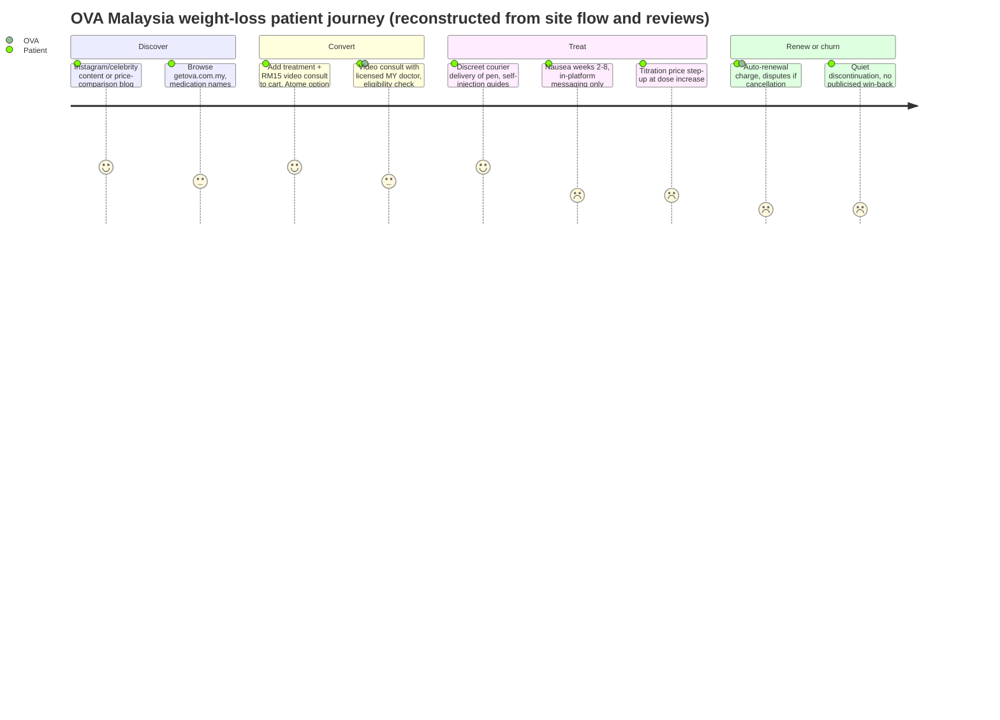

# OVA (ORA Group) — Competitor Dossier: Women-Focused Digital GLP-1 Weight Loss, Malaysia

**Abstract.** OVA — often informally cited as "Ova Health" — is the women's-health brand of ORA Group, a Singapore-headquartered vertically integrated telehealth company founded in 2020 by ex-Zalora CMO Elias Pour, operating in Singapore, Malaysia and the Philippines alongside sister brands andSons (men's health) and Modules (dermatology). In Malaysia (getova.com.my) OVA runs the market's most visible women-only digital weight-loss program: an RM15 mandatory video consultation with a licensed Malaysian doctor, GLP-1/GIP medication subscriptions with advertised entry pricing that has been observed in the ~RM900/month range for semaglutide-based plans and RM1,150/month for the tirzepatide 2.5 mg starter dose, Atome instalments, and discreet home delivery. ORA has raised US$17M to date (US$10M Series A, May 2023) and reports 250,000+ consultations delivered. OVA is the closest live analogue to Welltech's intended model — female-first, chat/video-native, subscription GLP-1 care — but its visible weaknesses (thin longitudinal follow-up, auto-renewal billing complaints, a near-empty public review base, regional rather than deep-local clinical branding) define exactly where a retention-led, medically governed entrant can differentiate. This dossier also profiles the two adjacent digital-first programs competing for the same patient — Roczen (Reset Health, UK) and Seimbang — plus DoctorOnCall's pharmacy-led program, since the four together constitute Malaysia's digital GLP-1 cohort.

Last updated: July 2026.

**Related documents:** [Malaysia weight-loss market](../10-market-intelligence/malaysia-weight-loss-market.md) · [Aesthetic weight clinics dossier](aesthetic-weight-clinics.md) · [Slimming centres dossier](slimming-centres.md) · [DoctorOnCall dossier](doctoroncall.md) · [Naluri dossier](naluri.md) · [Research standards](../RESEARCH-STANDARDS.md)

---

## 1. Identification note (read first)

The brief referenced "OVA (ovahealth.my)". The operating entity behind the Malaysian consumer brand **OVA** is **ORA Group** (Ora group of companies, Singapore); the Malaysian storefront is **getova.com.my**, with sibling storefronts getova.com.sg (Singapore) and getova.com.ph (Philippines).[^1][^2][^3] A Facebook page "Ova Health | Kuala Lumpur" exists for the brand's Malaysian presence.[^4] We found no separate Malaysian company trading at "ovahealth.my"; all evidence points to OVA-under-ORA as the intended subject, and this dossier proceeds on that identification. The "flat ~RM900/month" price point attributed to OVA is consistent with entry-level semaglutide plan pricing recorded in our market scan (see §4 and the [market file](../10-market-intelligence/malaysia-weight-loss-market.md) §5.1), while OVA's currently advertised tirzepatide starter dose is RM1,150/month — both are documented below and reconciled rather than averaged.[^5][^6]

## 2. Company overview and ownership

| Item | Detail | Source |
|---|---|---|
| Brand | OVA — "Medical care, redefined for women" | [^7] |
| Parent | ORA Group, Singapore HQ; vertically integrated telehealth (consultation → prescription → fulfilment → own-label products) | [^1][^2] |
| Founder / CEO | Elias Pour, ex-CMO of Zalora; founded 2020, platform launched 2021 | [^1][^2] |
| Sister brands | andSons (men's health), Modules (dermatology/skincare) | [^1][^2] |
| Markets | Singapore, Malaysia, Philippines | [^1][^2] |
| Funding | US$10M Series A (May 2023) co-led by TNB Aura and Antler; participation from Gobi Partners, Kairous Capital, GMA Ventures; US$17M total since inception | [^1][^2][^8] |
| Scale indicator | 250,000+ consultations delivered since 2021 launch (group level, all brands) | [^2] |
| Clinical governance | Local licensed doctors in each market; ORA appointed its first Chief Medical Advisor, endocrinologist Adj. Asst. Prof. Dr Ben Ng (Arden Endocrinology Specialist Clinic), with a hybrid virtual + in-person weight-management model launched in Singapore in February 2025 | [^9][^10] |

Strategic read: ORA is a **consumer-brand company with a medical layer**, not a clinic company with an app. Its DNA (Zalora-alumni leadership, D2C subscription mechanics, own-label product ambitions, planned retail distribution into 1,300+ tier-one stores) makes it formidable at acquisition and packaging, and comparatively weaker at longitudinal chronic-disease management — the hybrid endocrinology partnership in Singapore is an explicit attempt to patch that gap and to answer regulator concern about "telehealth abuse" in weight-loss prescribing.[^2][^9][^10]

## 3. Offer and clinical model (Malaysia)

### 3.1 Program structure

- **Entry funnel:** online questionnaire → mandatory **RM15 video consultation** with a licensed Malaysian doctor (added to cart as a one-off item) → doctor approves or declines treatment → medication subscription with home delivery.[^5][^6]
- **Eligibility gating (advertised):** BMI ≥30, or ≥27 with at least one weight-related comorbidity; type 1 diabetics excluded.[^6] This mirrors the Wegovy label and Malaysia's CPG logic rather than an "everyone qualifies" aesthetic-clinic posture.
- **Medication menu:** injectable and oral options. OVA's category pages deliberately do not name drug classes ("due to Malaysian regulatory requirements, OVA is unable to list the specific class of treatments by name") — compliance with the Poisons Act Group B advertising prohibition — but named product pages exist for **Wegovy** (semaglutide 2.4 mg pathway) and **Mounjaro 2.5 mg** (weekly "GLP-1 + GIP injectable").[^5][^6][^11]
- **Results claims:** "85% of patients successfully reduce body weight; average weight loss 9.5 kg; expect ≥5% body-weight loss after the first 16 weeks."[^6] These are framed as clinical-research figures, not audited OVA cohort outcomes — no Malaysian cohort data is published.
- **Follow-up:** doctor review at titration steps and subscription check-ins; no publicly documented structured weekly coaching, dietitian layer, or side-effect triage SLA. The depth gap versus Roczen's clinician+mentor pairing and Seimbang's bundled dietitian coaching is visible in the marketing materials themselves.[^12][^13]

### 3.2 Sister-brand signals relevant to clinical posture

- andSons (same platform, men) advertises that its doctors deem **over 40% of weight-loss inquirers unsuitable for prescription medicines** — a deliberately publicized screening-rigor statistic — and cites average body-weight loss of 23% for GLP-1+GIP therapy alongside holistic diet/exercise plans.[^14][^15]
- ORA's Singapore hybrid model (Feb 2025) added multidisciplinary evaluation, endocrine work-up, personalised nutrition and exercise planning, and bariatric-surgery counselling and referral — the template OVA Malaysia would likely inherit if replicated locally.[^9][^10]

## 4. Pricing (advertised, MYR)

| Item | Advertised price | Note | Source |
|---|---|---|---|
| Mandatory video consult | RM15, one-off | Added to cart before checkout | [^5][^6] |
| Tirzepatide (Mounjaro) 2.5 mg starter | **RM1,150/month** | "Treatment starts at RM1,150/month for the 2.5 mg starter dose" | [^5][^11] |
| Ongoing GLP-1/GIP treatment | ~RM1,200–2,500/month depending on dose | OVA blog's own framing of monthly cost range incl. clinical support | [^16] |
| Semaglutide-based entry plan | from ~RM900/month observed mid-2026 (flat-across-titration positioning) | Recorded in our market scan of getova.com.my pricing; current product pages emphasise the RM1,150 tirzepatide entry — treat RM900 as the semaglutide-plan floor, not a guaranteed current price | [^5][^6][^17] |
| Instalments | Atome buy-now-pay-later supported | | [^5] |

Reconciliation: OVA's pricing is **near the pharmacy floor at entry doses** (DoctorOnCall retails Ozempic 1 mg at RM999/pen; HelloDoktor advertises Wegovy "from RM879") and well below aesthetic-clinic pen pricing (Nexus: Wegovy RM1,288–2,088), but OVA monetises through subscription continuity rather than a fat per-pen markup.[^17][^18] Unknowns: exact per-dose price ladder above 2.5 mg tirzepatide, cancellation/pause terms, and whether the RM900 semaglutide floor survived the January 2026 Wegovy commercial launch — *not published; verify at purchase flow*.

## 5. Technology and WhatsApp usage

- Fully web-app based purchase-and-consult flow (video consult, e-prescription, courier delivery); discreet packaging is a core promise ("discreet video consultations… for women").[^6][^7]
- No evidence of a WhatsApp-first care channel; support appears to run through in-platform messaging and email. Sister storefronts follow the same pattern. This is a genuine white space: none of the digital cohort runs proactive WhatsApp-native care loops of the kind Welltech intends. *(Absence-of-evidence finding from site and search review, July 2026.)*
- Auto-renewing subscriptions are platform-default — the source of the sharpest customer complaints (§7).[^19]

## 6. Marketing channels

- **Instagram:** @get.ova, ~17K followers; polished women's-health content.[^7]
- **Celebrity/influencer:** partnerships with Malaysian celebrities **Diana Danielle, Siti Nordiana and Shila Amzah** — mainstream Malay-market reach, squarely targeting the modest, discretion-seeking female segment identified in the [market file](../10-market-intelligence/malaysia-weight-loss-market.md) §3.2.[^7]
- **SEO/content:** blog.getova.com.my publishes price-comparison content (e.g., "What are the price ranges for Mounjaro in Malaysian pharmacies"), positioning OVA as the safe, legal channel while capturing high-intent drug-name searches at the content level (drug names in editorial content rather than paid ads — a Group-B-compliant workaround).[^11][^16]
- **Compliance posture as marketing:** category pages refuse to name drug classes and stress doctor approval — turning the advertising prohibition into a trust signal.[^6]
- TikTok/XHS: no significant owned OVA Malaysia TikTok presence surfaced in our searches; discovery-level content exists around the Singapore brand. *(unknown / low signal)*

## 7. Review themes

Public review volume is strikingly thin for a funded regional brand:

- **Trustpilot (getova.com.my): only 4 reviews** as of July 2026 — themes: (a) a teleconsult doctor unable/unwilling to explain differences between pill options, telling the patient to research independently; (b) **auto-renewal billed despite a pre-shipment cancellation request, refund refused** citing subscription terms; (c) a parallel Singapore complaint about perfunctory consultation manner.[^19]
- Scamadviser lists the domain without adverse findings (trust-score checks only).[^20]
- No Malaysian forum (Lowyat) thread base or Google-reviews clinic profile of scale — consistent with a pure-online brand. **No fabricated rating is offered here: the honest summary is "too few public reviews to score."**
- Read-through: the complaint pattern (transactional consults, billing friction) is the classic D2C-subscription failure mode in healthcare, and it is the single most attackable flank for a service-led competitor.

## 8. The rest of Malaysia's digital GLP-1 cohort (context competitors)

| Player | Model | Advertised price (MYR) | Clinical depth signals | Source |
|---|---|---|---|---|
| **Roczen** (Reset Health Ltd, UK) | Clinician + dedicated mentor; metabolic program for obesity & T2D; UK/Italy/Malaysia; NICE-recommended for NHS early use until March 2028 (UK) | **from RM895/month**, price moves with dose | In-house doctors assess GLP-1/GIP suitability; heavyweight advisory board (incl. Prof. Sir Jonathan Van-Tam); "integrated care available to 18M+ patients" partnership claims | [^12][^21][^22][^23] |
| **Seimbang** | All-inclusive telehealth subscription | **RM899/month** incl. medication, monthly physician check-ins, dietitian-guided nutrition coaching, cold-chain delivery in 2–3 days; also RM199/dose entry; cancel anytime; free first consult | Positions as "Malaysia's first complete telehealth platform for medically supervised weight loss" | [^13][^24] |
| **DoctorOnCall** | E-pharmacy + clinician-guided program | Ozempic 0.25/0.5 mg starter plans in 1/3/6-month bundles (3-month "save RM150"); Ozempic 1 mg pen RM999 retail | Teleconsult with panel doctor if required; monitoring marketed but program service layer is thin; the market's drug-price anchor | [^18][^25] |
| **OVA / andSons** (ORA) | Gender-branded D2C subscriptions | §4 above | §3 above | [^5][^6][^14] |

Roczen is the most clinically credentialed threat (UK NHS validation narrative, employer-partnership playbook, Malaysiakini paid-partnership advertising in-market); Seimbang is the price-value benchmark (medication-inclusive RM899); OVA owns the female-consumer brand position; DoctorOnCall caps what anyone can charge for the drug itself.[^12][^13][^21][^25]

## 8A. Regulatory posture and risk exposure

OVA's compliance architecture is worth studying because it defines the lawful-aggressive frontier of the category:

- **Advertising:** Group B poisons (all GLP-1s) may not be advertised to the public in Malaysia. OVA's storefront withholds drug-class names on category pages while operating named product URLs (`/product/v2/wegovy`, `/product/v2/mounjaro-25mg`) reachable via search — a structure that respects the letter of the prohibition on *advertising* while remaining fully indexable. Editorial drug-name content lives on a separate blog subdomain.[^5][^6][^11] Enforcement interpretation could tighten; the 2025 wave of 48 warning letters targeted social-media drug ads, not structured e-commerce, but the boundary is untested.[^17]
- **Teleconsult prescribing:** Malaysian law permits registered practitioners to prescribe via legitimate teleconsultation with pharmacist-dispensed supply; OVA's mandatory RM15 video consult is the compliance keystone — and also the step its negative reviews attack as perfunctory. If MMC or MOH formalises stricter telemedicine prescribing standards for weight-loss drugs (as Singapore's "telehealth abuse" debate foreshadows[^10]), consult depth becomes a regulatory requirement, not just a quality differentiator.
- **Cross-border structure:** ORA is Singapore-domiciled with local clinical operations per market. Regulatory action in one market (e.g., Singapore MOH scrutiny of weight-loss telehealth) can force group-wide policy changes that alter the Malaysian offer without any Malaysian trigger.
- **Risk summary for Welltech planning:** OVA is unlikely to be an enforcement casualty; it is the competitor most likely to *benefit* from a compliance crackdown that clears out grey-market sellers — the same tailwind Welltech is counting on. Differentiation must therefore rest on care quality, not on relative legality.

## 8B. Estimated unit economics *(analyst model — assumptions stated)*

| Driver | OVA (estimated) | Basis |
|---|---|---|
| Revenue / patient / month | RM1,150–1,500 | Advertised tirzepatide entry RM1,150; semaglutide plans lower; dose mix assumption[^5][^16] |
| Drug cost | RM750–1,100 | Pharmacy-floor benchmarks less distributor terms ([market file](../10-market-intelligence/malaysia-weight-loss-market.md) §4.3–4.4) |
| Gross service margin | RM250–500/month | Consistent with cohort-wide program-fee spread |
| Clinical cost / patient / month | Low — single consult + async messaging | RM15 consult price implies minutes-per-patient economics |
| CAC | Moderate–high: celebrity + paid social in a category where drug-name ads are barred | @get.ova influencer roster[^7] |
| 12-month retention | Unknown; global unmanaged GLP-1 persistence ~30–50% and OVA shows no visible retention machinery | [market file](../10-market-intelligence/malaysia-weight-loss-market.md) §9.2 |

The model's implication: OVA's economics are acquisition-led, and its LTV is capped by the same churn that caps everyone's. A competitor that spends OVA-level CAC but doubles 12-month retention wins on contribution even at a lower headline price — the quantitative case for Welltech's service-heavy design.

## 9. Composite patient journey at OVA (Malaysia, 2026)

Reconstruction basis: purchase flow and FAQ content,[^5][^6] Trustpilot complaint narratives,[^19] and category norms documented in the [market file](../10-market-intelligence/malaysia-weight-loss-market.md) §5.2. The journey is strong at the top (best-in-market conversion UX for women) and weakest exactly where GLP-1 economics are decided: weeks 2–8 side-effect management and the renewal decision.

### 9.1 Failure points vs Welltech design targets

| Journey stage | OVA observed state | Welltech design target |
|---|---|---|
| First consult | RM15 video call; reviews describe perfunctory, script-bound encounters[^19] | Named doctor continuity; consult includes written plan + total 6/12-month cost |
| Weeks 2–8 side effects | Reactive in-platform messaging; no published triage SLA | Proactive WhatsApp check-ins at days 3/7/14/30; <4h triage response target |
| Titration | Price steps up with dose (RM1,150 → higher tiers, unpublished)[^5][^16] | Flat or pre-published ladder; no surprise re-pricing at the moment of clinical vulnerability |
| Renewal | Auto-renew default; refund refusals documented[^19] | Explicit opt-in renewal via WhatsApp confirmation; pause/skip a month without penalty |
| Discontinuation | Silent churn; no visible maintenance or relapse program | Maintenance tier (lower price, dietitian-led) + festive-cycle re-engagement protocols |

## 10. Scenario analysis — how the digital cohort evolves, 2026–2028 *(analyst assessment)*

| Scenario | Trigger | OVA's likely move | Consequence for Welltech |
|---|---|---|---|
| Consolidation | Series B pressure for path-to-profit across ORA's three brands | Double down on highest-margin verticals; weight loss defended with marketing spend, not care depth | Window stays open for a care-led differentiator; talent/asset acquisition opportunities from weaker cohort members |
| Hybrid replication | Singapore hybrid model shows retention lift[^9][^10] | Malaysian clinic partnership + named local medical advisor; "telehealth abuse" narrative used to attack pure-online rivals | Welltech must have physical-exam answer ready (partner clinic network or at-home phlebotomy) before OVA reframes the credibility bar |
| Price war | Seimbang holds RM899 all-in; oral semaglutide launches | Entry-price promotions, bundle with women's-health SKUs (contraception, skin) | Avoid matching headline price; compete on published outcomes and total-cost honesty |
| Regulatory tightening | NPRA/MMC rules on remote first prescriptions for Group B weight-loss drugs | OVA pivots consults to hybrid/in-person partners; smaller pure-online players exit | Compliance-first architecture becomes the moat; early MMC-aligned protocol documentation pays off |
| Pharma D2C entry | Novo/Lilly direct-to-patient platforms reach MY | Cohort competes for "services layer on top of pharma platform" positioning | Preferred-provider integrations and employer channels matter more than consumer brand alone |

Probability weighting: hybrid replication and regulatory tightening are the two most likely (both have live precedents in-market); price war is already underway at entry doses.[^13][^17]

## 11. Monitoring checklist (review quarterly)

- getova.com.my price ladder and any move off RM1,150 tirzepatide entry; appearance of a published semaglutide floor below RM900.[^5]
- Announcement of a Malaysian hybrid clinic partner, named medical director, or endocrinology advisor (mirror of the Feb 2025 Singapore playbook).[^9]
- Trustpilot/complaint volume shift — resolution of the auto-renewal pattern would signal operational maturation.[^19]
- Roczen: Malaysian employer/insurer contract announcements; any NHS-outcome PR localised to Malaysia.[^12][^22]
- Seimbang: evidence of scale (hiring, delivery coverage claims) or margin distress at RM899 all-inclusive.[^13]
- ORA group: Series B raise, Middle East expansion drawing management attention away from Malaysia, or retail-channel launches that reposition OVA as a products brand.[^2]

## 12. Strengths / weaknesses

**Strengths**
1. First-mover consumer brand for women's digital weight loss in Malaysia; celebrity-backed Malay-market reach.[^7]
2. Regional platform economics: one stack across SG/MY/PH and three brands; US$17M funding runway and Series A investors with SEA distribution muscle.[^1][^2]
3. Compliance-literate marketing (no public drug-name advertising on shop pages) reduces takedown risk versus aesthetic clinics running molecule ads.[^6]
4. Pricing at/near pharmacy parity at entry, with instalments — removes the affordability objection that kills conversion at RM1,500+ clinics.[^5][^17]
5. Group-level clinical upgrades (endocrinologist CMA, hybrid model, bariatric referral pathway) provide a ready template to deepen Malaysian clinical credibility.[^9][^10]

**Weaknesses**
1. Service layer is shallow relative to claims: no published dietitian/coaching cadence, no side-effect triage SLA, no Malaysian outcome cohort.[^6]
2. Billing/auto-renewal complaints and perfunctory-consult reviews on a tiny review base — trust is unbuilt, and the few public data points are negative.[^19]
3. Group HQ and clinical leadership sit in Singapore; Malaysian medical identity is thin (no named local medical director surfaced in our review). *(absence-of-evidence)*
4. Multi-brand, multi-market focus dilutes weight-loss specialisation just as Roczen (specialist) and Seimbang (value) sharpen theirs.[^12][^13]
5. Results claims recycle global trial statistics without local proof — vulnerable to a competitor that publishes real cohort outcomes.

## 13. SWOT synthesis — OVA vs the Malaysian opportunity

| | Helpful | Harmful |
|---|---|---|
| **Internal** | **S:** female-first brand equity; regional funded platform; pharmacy-parity pricing; compliant acquisition engine; celebrity channel | **W:** thin longitudinal care; negative early reviews (billing, consult quality); no local clinical figurehead; no published outcomes; WhatsApp-native care absent |
| **External** | **O:** 8–9M CPG-eligible adults, most of them women in OVA's demographic; Wegovy launch tailwind; hybrid-model template from Singapore; employer channel unopened | **T:** Roczen's clinical credential attack; Seimbang undercutting with medication-inclusive RM899; enforcement wave could tighten rules on remote first prescriptions; pharma direct-to-patient platforms |

## 14. Implications for Welltech

1. **Do not fight OVA on brand-for-women; fight it on care.** OVA has spent to own "discreet weight loss for women." The undefended ground is *outcome-accountable, WhatsApp-first longitudinal care*: weekly proactive touchpoints, 48-hour side-effect triage, published retention and %-weight-loss cohorts. Every public OVA complaint (robotic consults, billing surprises) is a service-design brief.
2. **Price architecture:** match the RM899–1,150 entry corridor (Seimbang has anchored medication-inclusive RM899; OVA RM1,150 tirzepatide entry), but publish the full 6/12-month total honestly — none of the cohort does, and ACTION Malaysia shows cost opacity is the #1 barrier.[^13][^5]
3. **Transparent billing as a weapon:** no auto-renew traps; pause/cancel in WhatsApp in one message; refund policy in plain language. OVA's Trustpilot record shows exactly how cheap this trust is to win.[^19]
4. **Pre-empt the hybrid move in Malaysia.** ORA already runs virtual+physical weight care in Singapore with an endocrinologist advisor; expect a Malaysian replication. Welltech should secure MEMS-affiliated endocrinology advisors and a bariatric referral loop first (see [market file](../10-market-intelligence/malaysia-weight-loss-market.md) §7).
5. **Watch items:** OVA Malaysia hybrid/clinic launch; a named Malaysian medical director; Roczen employer/insurer deals; Seimbang's ability to hold RM899 economics after Wegovy launch pricing; any NPRA move on remote first-prescription rules.

---

## References

[^1]: MobiHealthNews, "Singaporean telehealth startup ORA nets $10M in Series A funding", May 2023, https://www.mobihealthnews.com/news/asia/singaporean-telehealth-startup-ora-nets-10m-series-funding (accessed July 2026).
[^2]: TechCrunch, "Singapore's Ora takes a vertically integrated approach to telehealth", 16 May 2023, https://techcrunch.com/2023/05/16/ora/ (accessed July 2026); corroborated by TNGlobal, "Singaporean telehealth platform ORA raises $10M co-led by TNB Aura and Antler", 17 May 2023, https://technode.global/2023/05/17/singaporean-telehealth-platform-ora-raises-10m-co-led-by-tnb-aura-and-antler/ (accessed July 2026).
[^3]: OVA storefronts: Malaysia, https://getova.com.my/; Singapore, https://getova.com.sg/evaluation/weight-loss; Philippines, https://getova.com.ph/faqs/general (accessed July 2026).
[^4]: Facebook, "Ova Health | Kuala Lumpur", https://www.facebook.com/ovahealthnews/ (accessed July 2026).
[^5]: OVA Malaysia product pages: "Buy Weekly GLP-1 + GIP Injectable for Women" (Mounjaro 2.5 mg; treatment from RM1,150/month; RM15 one-off video consult; Atome instalments), https://getova.com.my/product/v2/mounjaro-25mg?category=weight-loss and https://getova.com.my/product/v2/wegovy (accessed July 2026).
[^6]: OVA Malaysia, "Women's Weight Loss Treatment & Consultations in Malaysia" and Weight Loss FAQs (doctor-led model; BMI ≥30 or ≥27 + comorbidity; T1D exclusion; 85% responders / 9.5 kg average / ≥5% at 16 weeks claims; regulatory restriction on naming drug classes), https://getova.com.my/category/weight-loss and https://getova.com.my/faqs/weight-loss (accessed July 2026).
[^7]: Instagram, "OVA | Medical care, redefined for women" (@get.ova; ~17K followers; partnerships with Diana Danielle, Siti Nordiana, Shila Amzah), https://www.instagram.com/get.ova/ (accessed July 2026).
[^8]: Forbes, "ORA Raises $10 Million As Demand For Tele-health In Asia Soars", 16 May 2023, https://www.forbes.com/sites/davidprosser/2023/05/16/ora-raises-10-million-as-demand-for-tele-health-in-asia-soars/ (accessed July 2026).
[^9]: BioPharma APAC, "ORA Group Introduces Singapore's First Hybrid Weight Management Care to Tackle Rising Obesity Rates" (partnership with Arden Endocrinology Specialist Clinic; Dr Ben Ng appointed first Chief Medical Advisor), February 2025, https://biopharmaapac.com/news/89/5942/ora-group-introduces-singapores-first-hybrid-weight-management-care-to-tackle-rising-obesity-rates.html (accessed July 2026).
[^10]: BioSpectrum Asia, "First-of-its-kind hybrid telehealth weight management care launched in Singapore", February 2025, https://www.biospectrumasia.com/news/30/25580/first-of-its-kind-hybrid-telehealth-weight-management-care-launched-in-singapore-.html; MobiHealthNews, "Countering telehealth abuse with hybrid model", https://www.mobihealthnews.com/news/asia/countering-telehealth-abuse-hybrid-model (accessed July 2026).
[^11]: OVA blog, "What Are the Price Ranges for Mounjaro in Malaysian Pharmacies" (Mounjaro not sold as retail pharmacy product; clinic/telehealth-set pricing), https://blog.getova.com.my/blog/weight-loss/what-are-the-price-ranges-for-mounjaro-in-malaysian-pharmacies (accessed July 2026).
[^12]: Roczen, "Roczen Plus Malaysia | Medication Assisted Programme" and "GLP-1 FAQs Malaysia" (programme from MYR 895/month; price moves with dose; in-house doctors and mentors), https://www.roczen.com/en-my/roczen-plus-malaysia and https://www.roczen.com/en-my/glp-1-faqs-my (accessed July 2026).
[^13]: Seimbang, pricing and program pages (RM899/month all-inclusive incl. medication, monthly physician check-ins, dietitian coaching, 2–3 day temperature-controlled delivery; RM199/dose; cancel anytime), https://www.seimbang.my/pricing and https://www.seimbang.my/glp-1-weight-loss-malaysia (accessed July 2026).
[^14]: andSons Malaysia, "Men's Weight Loss Treatment & Consultations in Malaysia" and "Weight-loss position" content (>40% of weight-loss inquirers deemed unsuitable for prescription medicines; average 23% body-weight loss with GLP-1+GIP plus lifestyle), https://andsons.com.my/category/weight-loss and https://andsons.com.my/content/weight-loss-position (accessed July 2026).
[^15]: ORA Group corporate site, https://www.ora.group/ (accessed July 2026).
[^16]: OVA blog / weight-loss content hub (monthly treatment costs typically RM1,200–2,500+ depending on dosage and clinical support), https://blog.getova.com.my/blog/weight-loss/what-are-the-price-ranges-for-mounjaro-in-malaysian-pharmacies (accessed July 2026).
[^17]: Welltech Intelligence, [Malaysia medical weight-loss market file](../10-market-intelligence/malaysia-weight-loss-market.md), §4.3 and §5.1 (channel price benchmarks incl. OVA "from RM900/month flat" as recorded mid-2026; HelloDoktor Wegovy from RM879), internal document (July 2026).
[^18]: DoctorOnCall, "Ozempic 1.34mg/ml (1mg/dose) Pre-filled Pen" (RM999 retail price anchor), https://www.doctoroncall.com.my/medicine/en/drugs/ozempic-1-34mg-ml-1mg-dose-pre-filled-pen-3ml-x1-pen (accessed July 2026).
[^19]: Trustpilot, "Getova Reviews" (4 reviews as of July 2026; consult-quality and auto-renewal/refund complaints), https://www.trustpilot.com/review/getova.com.my (accessed July 2026).
[^20]: Scamadviser, "getova.com.my Reviews", https://www.scamadviser.com/check-website/getova.com.my (accessed July 2026).
[^21]: Reset Health, corporate site and newsroom (Reset Technology Platform; UK, Malaysia and Italy operations; advisory appointments incl. Prof. Sir Jonathan Van-Tam), https://www.resethealth.clinic/ and https://www.resethealth.clinic/newsroom-articles/press-release-jonathan-van-tam (accessed July 2026); Reset Health Malaysia, https://www.resethealth.my/ (accessed July 2026).
[^22]: Roczen, "Roczen | NHS" (NICE time-limited recommendation for early NHS use until March 2028), https://www.roczen.com/en-gb/nhs (accessed July 2026).
[^23]: Facebook/Malaysiakini, paid partnership post "Reverse Obesity and Type 2 Diabetes with Roczen Malaysia", https://www.facebook.com/Malaysiakini/posts/paid-partnership-with-roczen-malaysiareverse-obesity-and-type-2-diabetes-with-ro/810329201132461/ (accessed July 2026).
[^24]: Seimbang blog, "GLP-1 Weight Loss Malaysia: Complete 2026 Guide", https://www.seimbang.my/blog/glp-1-weight-loss-malaysia-complete-guide (accessed July 2026).
[^25]: DoctorOnCall, "Ozempic Weight Loss Program (Clinician Guided) 0.25, 0.5 mg — 3 Months (Save RM150)" and "Weight Loss Programme" service page, https://www.doctoroncall.com.my/medicine/en/drugs/ozempic-weight-loss-program-doctor-monitored-0-25-0-5-mg-starter-plan-3-months-most-popular-save-rm150 and https://www.doctoroncall.com.my/health-centre/health-services/weight-management/weight-loss-programme (accessed July 2026).
