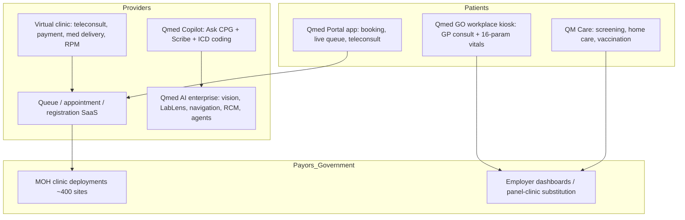

# Competitor Dossier: Qmed Asia (QueueMed Healthtech Sdn Bhd)

**Abstract.** Qmed Asia (qmed.asia) is a Malaysian provider-side health-tech company founded by doctors and engineers around 2018–2019 as "QueueMed", a mobile queue-management system for clinics. It has since grown into a profitable, capital-light digital-health platform spanning queue/appointment management for 4,500+ healthcare providers (including ~400 Ministry of Health clinics), workplace telehealth kiosks (Qmed GO), a virtual-clinic/teleconsultation stack, a physical clinic-services arm (QM Care), and — since 2023 — a generative-AI clinical suite (Qmed Copilot, Scribe, AI Vision, LabLens). Contrary to the common assumption, no Khazanah Nasional backing could be verified: its disclosed funding is small (~USD 1.6M, mostly a 2023 equity-crowdfunding round), and it reached profitability on revenue rather than venture capital. Qmed is infrastructure and B2B-provider tooling rather than a consumer clinic — a partial competitor to Welltech (workplace telehealth, screening) but more plausibly a partner or infrastructure benchmark.

Last updated: July 2026

Related documents: [Malaysia market intelligence](../10-market-intelligence/malaysia-market-intelligence.md) · [Naluri dossier](naluri.md) · [Research standards](../RESEARCH-STANDARDS.md)

---

## 1. Snapshot

| Item | Detail |
|---|---|
| Legal entity | QueueMed Healthtech Sdn Bhd, rebranded "Qmed Asia" in early 2022[^4][^5] |
| Founded | 2018–2019, Kuala Lumpur (sources conflict: company pages say 2019; ECF coverage says 2018)[^1][^2][^6] |
| Founders | Dr Kev Lim (CEO, paediatric-trained physician), Dr Tai Tzyy Jiun, Nic Tai (engineer)[^1][^3] |
| Category | Provider-side digital health: queue/patient-flow SaaS, telehealth, clinical AI |
| Model | B2B SaaS (clinics/hospitals) + B2G (MOH deployments) + B2B kiosks (employers) + B2C health services (QM Care, teleconsults) |
| Khazanah backing | **Not verified — no evidence found.** Disclosed investors: Leet Capital ECF investors, MyCIF, 1337 Ventures, Cradle Fund, SIDEC, angels[^6][^7][^8] |
| Funding | ~USD 1.58M total disclosed; RM5.1M (~USD 1.16M) ECF on Leet Capital, Apr 2023[^6][^7][^8] |
| Financials | FY2022 (to Jun 2022): revenue US$2.8M (RM12.5M), net profit US$380K (RM1.7M) — profitable[^4] |
| Scale claims | 4,500+ healthcare providers; 6M+ patients reached; 14M+ bookings (Jan 2023: 4,500 providers / 3.9M patients)[^2][^4][^6] |
| Government | Claims MOH & MOSTI endorsement as digital-health implementation partner; COVID-era rollout from 4 to ~400 government clinics[^2][^5][^9] |
| Markets | Malaysia core; Singapore entry (late 2023); MOUs/partnerships in Taiwan, Indonesia, Cambodia; discussions Vietnam, Philippines; Saudi Arabia ambition[^3][^10][^11] |
| Flagship AI | Qmed Copilot / Qmed AI (Scribe, Ask CPG, AI Vision, LabLens); enterprise suite at qmed.ai[^12][^13][^14] |

---

## 2. Company overview and history

Qmed Asia began with a personal frustration: Dr Kev Lim, a paediatric-trained doctor, spent hours in hospital queues bringing his daughter to follow-up appointments. Once her condition stabilised, he teamed up with two long-time friends — Dr Tai Tzyy Jiun and engineer Nic Tai — to build a mobile "live queue" system for clinics and hospitals.[^1][^3][^4]

| Period | Event |
|---|---|
| 2018–2019 | Founded as QueueMed; mobile queue-ticketing for clinics/hospitals[^1][^6] |
| 2020–2021 | COVID-19: MOH invites QueueMed to manage patient crowding; deployment grows from 4 government clinics to ~400[^5][^9] |
| Early 2022 | Rebrands to Qmed Asia ("Q" for quality, beyond queues); 4,000 providers, 2M+ patients, 11M+ bookings; FY2022 profitable (US$2.8M revenue, US$380K net profit)[^4] |
| Aug 2022 | Launches Qmed GO workplace telehealth kiosks ("mini clinics")[^15][^16] |
| Oct–Nov 2022 | APAC expansion announcements: MOUs with Eucare and Ubestream (Taiwan), insurer partnership (Indonesia), MeetDoctor MOU (Cambodia); Vietnam/Philippines discussions[^10] |
| Apr 2023 | RM5.1M equity crowdfunding on Leet Capital (110 investors incl. MyCIF, 1337 Ventures); unveils Qmed Copilot AI assistant; targets Indonesia and Saudi Arabia[^6][^7][^8] |
| Late 2023 | Enters Singapore[^3] |
| 2024–2026 | Pivots identity toward clinical AI: Qmed AI enterprise suite (scribe, guideline intelligence, patient navigation, screening, workforce optimisation, revenue-cycle automation, agentic workflows); HEYDOC Health strategic partnership (Mar 2026)[^13][^14][^17] |

The through-line: Qmed monetised unglamorous provider workflow pain (queues, registration, documentation) and used government-scale deployments as both revenue and distribution — the opposite of the venture-fuelled consumer-telehealth playbook.

---

## 3. Founders and leadership

| Person | Role | Background |
|---|---|---|
| Dr Kev Lim | Co-founder & CEO | Physician (paediatric training); Tatler Gen.T-featured; public face on LinkedIn and healthtech media[^1][^3][^18] |
| Dr Tai Tzyy Jiun | Co-founder | Physician; long-time friend of Lim[^1][^3] |
| Nic Tai | Co-founder | Engineer; long-time friend of Lim[^1][^3] |

Leadership is founder-operator style with a "doctors + engineers" identity the company markets explicitly.[^1][^2] Lim's stated philosophy links clinical practice and entrepreneurship (diagnosing problems, iterating treatment), and he frames the company's AI push as "made in Malaysia" — locally hosted, multilingual (Malay, English, Mandarin, Indonesian, mixed-language) generative AI for local clinical contexts.[^3][^18][^19]

---

## 4. Funding and investors — Khazanah claim verified negative

| Event | Date | Amount | Investors |
|---|---|---|---|
| Grants/early backing | 2019–2022 | undisclosed (small) | Cradle Fund, 1337 Ventures, SIDEC (Selangor Information Technology & Digital Economy Corp), Startup Wheel competition[^7] |
| Equity crowdfunding (Leet Capital) | Apr 2023 | RM5,101,298 (~USD 1.16M; one outlet reports US$932K net) | 110 investors: angels, Malaysia Co-Investment Fund (MyCIF), 1337 Ventures[^6][^8][^20] |
| Business-plan competition | Jun 2024 | n/a | (Crunchbase-listed event)[^7] |
| **Total disclosed** | — | **~USD 1.58M** | PitchBook/Crunchbase aggregate[^7][^21] |

**On Khazanah:** the research brief asked to verify reported Khazanah Nasional backing. Searches across funding databases (PitchBook, Crunchbase, CB Insights), Khazanah's own press releases, and Malaysian tech press found **no record of Khazanah investing in Qmed Asia**. Its capital story is the inverse: tiny external funding, early profitability (net profit RM1.7M on RM12.5M revenue in FY2022), and government relationships through contracts, not equity.[^4][^6][^7] *(If a Khazanah link exists — e.g., via Jelawang/dana dampak vehicles — it is undisclosed; treat any such claim as unsubstantiated.)*

Implication: Qmed answers to revenue, not investors. It can undercut venture-funded rivals on price and survive long sales cycles, but lacks war-chest capital for aggressive regional or consumer expansion — hence partnerships and ECF rather than blitzscaling.

---

## 5. Business model and revenue lines

| Line | Buyer | Offering | Notes |
|---|---|---|---|
| Patient-experience SaaS | Clinics, hospitals (private + public) | Online appointments, mobile live queue, digital + printed tickets, self-registration kiosks, doctor scheduling | Core original business; waiting times cut from ~2h to <30 min in deployments[^2][^5] |
| Virtual clinic / telehealth | Providers | Teleconsultation with new/follow-up patients, online payment, medication delivery, remote patient monitoring, tele-radiology | Enables clinics to run virtual services under their own brand[^2][^5] |
| Qmed GO kiosks | Employers/corporates | Workplace "mini clinic" telehealth kiosks with GP teleconsults and IoT devices monitoring up to 16 vital parameters; three tiers (GO, GO Plus, GO Lite); UV self-sanitising; employer dashboard; medication delivery | Pitched as a cheaper substitute for panel-clinic spend[^15][^16][^22] |
| Clinical AI subscriptions | Doctors, clinics, hospital enterprises | Qmed Copilot (Ask CPG chatbot + Scribe), ICD-10/11 coding, document generation; enterprise Qmed AI: guideline intelligence, patient navigation, disease screening, workforce optimisation, revenue-cycle automation, agentic workflow orchestration | Notes generated in <30s; claims up to 70% documentation-time reduction; multilingual incl. mixed-language consults[^12][^13][^14] |
| QM Care (services arm) | Corporates + consumers | Corporate/executive health screening by occupational-health doctors, mobile screening (KL/Selangor), home care, vaccinations, COVID testing legacy; online store for screening packages | Physical-world revenue adjacent to the software[^23][^24] |
| B2G | Ministry of Health | Queue/clinic digitisation across government clinics; claims MOH/MOSTI endorsement as nationwide implementation partner | Started COVID-era; ~400 government clinics[^5][^9][^13] |

Patient-side apps (Qmed Portal) provide booking, live-queue status, teleconsults and records — free to patients, monetised via providers.[^25]

### Product stack

*(Analyst read)* The stack is horizontally broad but vertically shallow: each layer serves clinic operations generally rather than any specific condition or patient cohort. That breadth is why Qmed is everywhere in Malaysian primary care yet owns no therapeutic category.

### Pricing signals

Published pricing was not found for any line. Directional signals: queue SaaS was cheap enough for mass GP-clinic adoption during COVID (4→400 government clinics without a large procurement announcement)[^5]; Qmed GO is sold against employers' panel-clinic spend, i.e., priced below expected per-employee clinic claims[^15][^16]; Copilot is distributed as a freemium/subscription app for individual doctors with enterprise tiers via qmed.ai.[^12][^14] *(Analyst estimate: low three-figure MYR per clinic per month for SaaS; kiosks likely leased with per-consult fees — unverified.)*

---

## 6. Technology and AI

- **Qmed Copilot** (mobile + web, dr.qmed.asia): clinical AI assistant for differential diagnosis support, care plans, "Ask CPG" (Malaysian clinical-practice-guideline Q&A), and an ambient **Scribe** producing structured notes in under 30 seconds; supports English, Malay, Mandarin, Indonesian and code-switched conversations; one-click ICD-10/11 coding and medical-document generation.[^12][^13]
- **Qmed AI Vision**: rapid reads/insights on medical images such as X-rays; **Qmed LabLens**: automated ingestion of lab-report data into hospital systems.[^18]
- **Enterprise platform (qmed.ai)**: positions "clinical intelligence for hospital leaders" — documentation, guideline intelligence, patient navigation, screening, workforce optimisation, revenue-cycle automation, and agent-based workflow orchestration.[^14]
- **Localisation as moat**: generative AI tuned to Malaysian languages, local CPGs and local data-residency expectations — Lim argues global tools miss mixed-language consultations and national guidelines.[^19]
- IoT vitals integration (16 parameters) in Qmed GO kiosks with cloud dashboards.[^15][^22]
- No evidence of WhatsApp-native care workflows; patient touchpoints run through the Qmed Portal app, kiosks and provider systems. *(Contrast: Welltech's WhatsApp-first model.)*

---

## 7. Marketing and positioning

- **Positioning:** Malaysia's home-grown, MOH-endorsed, profitable healthtech; "doctors + engineers" building practical tools; now "AI made easy for doctors".[^2][^12][^13]
- **Founder-led PR:** Dr Kev Lim in Tatler Gen.T, Digital News Asia, HealthTechAsia, BioSpectrum; story arcs of queue pain → profitability → AI pivot.[^3][^4][^18][^19]
- **Channels:** LinkedIn company page and Lim's personal feed; Facebook for product launches (Copilot, Scribe); PR Newswire releases for expansion news; newsroom on qmed.asia.[^11][^12][^26]
- **B2B motion:** trade partnerships and MOUs (Eucare/Ubestream Taiwan, MeetDoctor Cambodia, Indonesian insurer, HEYDOC Health 2026) rather than paid consumer marketing.[^10][^17]
- **Credibility anchors:** MOH/MOSTI endorsement claim, ECF oversubscription, early profitability — used repeatedly in coverage as differentiation from cash-burning peers.[^4][^6][^13]

---

## 8. Reviews and reputation

- **Qmed Portal app** (Google Play `asia.qmed.patientapp`; iOS): listing emphasises live-queue updates, appointments, teleconsults; no large public rating volume surfaced in research — consumer brand awareness is low relative to its provider footprint.[^25]
- **Qmed Copilot app** (Play/App Store) targets clinicians; adoption metrics not public.[^12]
- **Qmed Journey** Chrome extension shows 4.9/5 (small base).[^25]
- No significant Glassdoor corpus or public controversy found; reputational surface is B2B/government, where the ~400-clinic MOH deployment and documented waiting-time reductions are the reference cases.[^5][^9]
- Watch-item: "MOH/MOSTI official partner" is a company claim repeated in its own materials; independent confirmation of formal appointment status was not found and procurement relationships can change.[^13]

---

## 9. SWOT

| | Helpful | Harmful |
|---|---|---|
| **Internal** | **S:** Profitable, capital-efficient; 4,500+ provider network incl. MOH clinics; clinician-founder credibility; localised clinical AI (languages, CPGs); full stack from kiosk hardware to AI software | **W:** Thin capital base (~USD 1.6M raised) limits regional push; weak consumer brand; sprawling product portfolio for a small team; queue SaaS is commoditisable; key-person dependence on Lim |
| **External** | **O:** MOH digitisation budgets (e.g., RM150M IT allocations, clinic cloud systems); AI-scribe demand among GPs; employer healthcare-cost inflation favouring Qmed GO; APAC/Middle East partnerships | **T:** Global AI scribes (ambient-AI incumbents) entering Asia; DoctorOnCall/Doc2Us and hospital-owned telehealth on the consumer side; government procurement volatility; better-funded regional HIS/EMR vendors bundling queue + AI features[^9][^27] |

---

## 10. Competitive overlap with Welltech — infrastructure player, partial competitor

Qmed competes with Welltech only at the edges; most of its business is provider tooling Welltech does not sell.

| Surface | Overlap? | Analysis |
|---|---|---|
| Workplace telehealth (Qmed GO) | **Yes, moderate** | Competes for the corporate wallet Welltech might target with employer GLP-1/wellness offerings; but kiosk GP consults are episodic acute care, not longitudinal weight/longevity programmes[^15][^16] |
| Teleconsultation | Partial | Qmed powers providers' virtual clinics rather than operating a branded consumer clinic; no weight-loss, GLP-1, longevity or concierge programmes found |
| Health screening (QM Care) | **Yes, moderate** | Corporate/executive and mobile screening overlaps with Welltech preventive/longevity diagnostics funnel[^23][^24] |
| Clinical AI (Copilot/Scribe) | No — potential input | An AI scribe localised for Malay/Mandarin/code-switched consults and Malaysian CPGs is directly relevant to Welltech's AI-enabled ops; Qmed is a candidate vendor/benchmark[^12][^19] |
| Queue/patient-flow SaaS | No | Different business entirely |

Strategically, Qmed is best read as **the provider-infrastructure incumbent of Malaysian primary care**: it owns clinic-side rails (queues, bookings, records touchpoints, now documentation AI) across thousands of GP clinics — the same clinics that will dispense, monitor, or refer patients in any at-scale weight-loss ecosystem.

---

## 11. Implications for Welltech

1. **Partner potential outweighs threat.** Qmed's 4,500-provider network and Qmed GO employer kiosks are distribution rails a consumer medical-weight-loss brand could ride (screening → referral into Welltech programmes; kiosk vitals feeding GLP-1 monitoring). Its capital constraints make it partnership-hungry, as the Taiwan/Cambodia/HEYDOC MOUs show.[^10][^17]
2. **Do not expect Qmed to enter medical weight loss soon** — nothing in its portfolio (2019–2026) points at condition-specific consumer programmes; its DNA is horizontal provider tooling. But its telehealth + kiosk + pharmacy-delivery stack means it *could* white-label such a service for employers if a clinical partner supplied protocols. Welltech should aim to be that partner before an insurer or hospital group is.
3. **Benchmark its localised AI scribe.** Qmed Copilot's mixed-language notes, CPG Q&A and ICD coding define the local bar for clinical-AI UX in Malaysia. Welltech's AI operating model should meet or exceed this in its own consult documentation — or simply procure it.[^12][^14]
4. **Learn the capital-efficiency lesson.** Qmed reached profitability on ~RM12.5M revenue with almost no venture money by selling to whoever already had budget (MOH, clinics, employers).[^4] For Welltech, employer/insurer side-channels can subsidise consumer CAC in the same way.
5. **Its consumer weakness is Welltech's opening.** Six million "patients reached" have Qmed touchpoints but no Qmed brand loyalty; the consumer relationship in Malaysian digital health remains unowned — reinforcing the case for Welltech's WhatsApp-first, brand-led consumer model.[^2][^25]

---

## References

[^1]: Qmed Asia, "Our story — top healthcare company in Malaysia", https://qmed.asia/our-story (accessed July 2026).
[^2]: Qmed Asia, "About us — healthcare technology company", https://hello.qmed.asia/about-us ; enterprise homepage, https://hello.qmed.asia/ (accessed July 2026).
[^3]: Tatler Asia, "Why this Malaysian health tech startup pivoted to AI solutions for doctors" (Qmed Asia journey from kiosk solutions to AI-assisted diagnosis), https://www.tatlerasia.com/gen-t/leadership/health-tech-revolution-qmed-asias-journey-from-kiosk-solutions-to-ai-assisted-diagnosis (accessed July 2026).
[^4]: Digital News Asia, "The long patient queues that triggered Dr Kev Lim's startup journey to profitability with Qmed Asia", https://www.digitalnewsasia.com/startups/long-patient-queues-triggered-dr-kev-lims-startup-journey-profitability-qmed-asia (accessed July 2026).
[^5]: Tatler Asia, "How this doctor is solving one of Malaysian healthcare's most annoying problems", https://www.tatlerasia.com/gen-t/leadership/how-a-doctor-turned-entrepreneur-is-using-technology-to-solve-healthcares-most-annoying-problem (accessed July 2026).
[^6]: TechNode Global, "Malaysian healthtech startup Qmed Asia raises $1.16M in equity crowdfunding for regional expansion" (5 Apr 2023), https://technode.global/2023/04/05/malaysian-healthtech-startup-qmed-asia-raises-1-16m-in-equity-crowdfunding-for-regional-expansion/ (accessed July 2026).
[^7]: PitchBook, "Qmed.Asia company profile: valuation, funding & investors", https://pitchbook.com/profiles/company/509873-59 ; Crunchbase, "Qmed Asia (QueueMed Healthtech)", https://www.crunchbase.com/organization/queuemed-healthtech (accessed July 2026).
[^8]: Disruptr MY, "Health-tech startup Qmed Asia raises RM5.1 million through ECF campaign on Leet Capital" (2023), https://www.disruptr.com.my/health-tech-startup-qmed-asia-raises-rm5-1-million-through-ecf-campaign-on-leet-capital/ ; BusinessToday, "Qmed Asia raises RM5.1 million in ECF, plans regional expansion" (5 Apr 2023), https://www.businesstoday.com.my/2023/04/05/qmed-asia-raises-rm5-1-million-in-ecf-plans-regional-expansion/ (accessed July 2026).
[^9]: US International Trade Administration, "Malaysia digital health — market intelligence" (MOH IT allocations; telemedicine providers incl. Qmed, DoctorOnCall, Doc2Us), https://www.trade.gov/market-intelligence/malaysia-digital-health (accessed July 2026).
[^10]: BioSpectrum Asia, "Qmed Asia eyes APAC expansion with digital health solutions" (Nov 2022: Taiwan MOUs with Eucare and Ubestream; Indonesia insurer partnership; Cambodia MeetDoctor MOU; Vietnam/Philippines discussions), https://www.biospectrumasia.com/news/52/21461/qmed-asia-eyes-apac-expansion-with-digital-health-solutions.html (accessed July 2026).
[^11]: PR Newswire APAC, "Qmed Asia eyes APAC expansion with digital health solutions", https://en.prnasia.com/releases/apac/qmed-asia-eyes-apac-expansion-with-digital-health-solutions-384005.shtml (accessed July 2026).
[^12]: Google Play, "Qmed Copilot: Ask CPG, Scribe", https://play.google.com/store/apps/details?id=asia.qmed.copilot ; Qmed, "Qmed Copilot — AI made easy for doctors", https://dr.qmed.asia/ ; Apple App Store, "Qmed Copilot", https://apps.apple.com/us/app/qmed-copilot/id6445978154 (accessed July 2026).
[^13]: Qmed Asia, "Intelligence Suite" (Qmed AI; MOH & MOSTI endorsement claim), https://hello.qmed.asia/intelligence-suite (accessed July 2026).
[^14]: Qmed AI, "Enterprise clinical intelligence for hospital leaders", https://qmed.ai/ ; "Qmed Scribe — simplify clinical documentation", https://qmed.ai/scribe (accessed July 2026).
[^15]: MobiHealthNews, "Malaysia-based startup Qmed Asia launches telehealth kiosk for corporate employers" (2022), https://www.mobihealthnews.com/news/asia/malaysia-based-startup-qmed-asia-launches-telehealth-kiosk-corporate-employers (accessed July 2026).
[^16]: BusinessToday, "Qmed Asia introduces Qmed GO, a one-stop center for employee medical consultation and diagnosis" (8 Aug 2022), https://www.businesstoday.com.my/2022/08/08/qmed-asia-introduces-qmed-go-a-one-stop-center-for-employee-medical-consultation-and-diagnosis/ (accessed July 2026).
[^17]: HEYDOC Health, "HEYDOC Health and Qmed Asia sign strategic partnership to shape the future of intelligent healthcare" (26 Mar 2026), https://www.heydochealth.com/2026/03/26/heydoc-health-and-qmed-asia-sign-strategic-partnership-to-shape-the-future-of-intelligent-healthcare/ (accessed July 2026).
[^18]: Tatler Asia, "Kev Lim" (profile; Qmed AI offerings incl. Copilot, AI Vision, LabLens), https://www.tatlerasia.com/people/kev-lim (accessed July 2026).
[^19]: HealthTechAsia, "Made in Malaysia: Qmed Asia keeps it local with generative AI solutions" (interview with Dr Kev Lim), https://healthtechasia.co/made-in-malaysia-qmed-asia-keeps-it-local-with-generative-ai-solutions/ (accessed July 2026).
[^20]: Digital News Asia, "Qmed Asia raises ~US$1mil in equity crowdfunding via Leet Capital, plans regional expansion" (headline figures vary US$932K–1.2M across versions), https://www.digitalnewsasia.com/startups/qmed-asia-raises-us1.2mil-equity-crowdfunding-leet-capital-plans-regional-expansion (accessed July 2026).
[^21]: CB Insights, "Qmed Asia (QueueMed) — financials and competitors", https://www.cbinsights.com/company/queuemed (accessed July 2026).
[^22]: BioPharma APAC, "Qmed Asia launches Qmed GO 'mini clinics' to solve rising employee healthcare costs", https://biopharmaapac.com/news/112/1868/qmed-asia-launches-qmed-go-mini-clinics-to-solve-rising-employee-healthcare-costs.html ; Kiosk Marketplace, "Malaysia startup introduces mini clinics with telehealth kiosks", https://www.kioskmarketplace.com/news/malaysia-startup-introduces-mini-clinics-with-telehealth-kiosks/ (accessed July 2026).
[^23]: QM Care, "Services" and "Health screening packages & promotions Malaysia", https://care.qmed.asia/services/ ; https://care.qmed.asia/health-screening-packages-promotions-malaysia/ (accessed July 2026).
[^24]: Qmed Asia Store, "Health screening", https://store.qmed.asia/services/health-screening/ (accessed July 2026).
[^25]: Google Play, "Qmed Portal", https://play.google.com/store/apps/details?id=asia.qmed.patientapp ; Apple App Store, "Qmed Portal", https://apps.apple.com/my/app/qmed-portal/id6465315168 ; Chrome Web Store, "Qmed Journey — smart queue & appointment management" (4.9/5), https://chromewebstore.google.com/detail/qmed-journey-%E2%80%93-smart-queu/cdnfekadjgmnnelnjnfhfblmohgfipcj (accessed July 2026).
[^26]: Qmed Asia, "Newsroom", https://qmed.asia/newsroom/60 ; LinkedIn, "Qmed Asia", https://www.linkedin.com/company/qmed-asia (accessed July 2026).
[^27]: The Edge Malaysia, "Healthtech: Bringing convenience to healthcare", https://theedgemalaysia.com/node/650748 (accessed July 2026).
