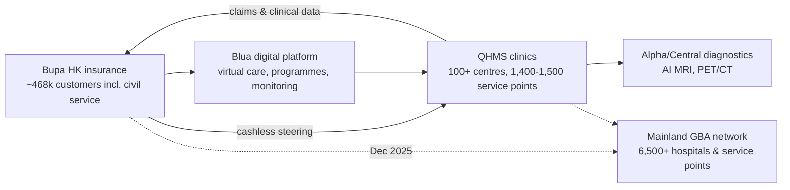

# Quality HealthCare Medical Services (Bupa) — Competitor Dossier

**Abstract.** Quality HealthCare Medical Services (QHMS, 卓健醫療) is Hong Kong's largest private clinic network and the healthcare-provision arm of British insurer Bupa, which acquired it from India's Fortis Healthcare in October 2013 for US$355 million (~HK$2.75bn — not the ~HK$3.5bn sometimes cited). With 100–120+ multi-specialty medical centres, 1,400–1,500+ provider service points, ~100 employed specialists and ~1,200 associated doctors, QHMS is the default employer-panel and TPA incumbent: roughly one in ten Hong Kong people has used its services. This dossier assembles its history and ownership, the insurer-provider vertical Bupa is building (468k insurance customers feeding ~890k provision customers), actual HKD pricing (GP consults ~HK$460–500 in Central; video consults from HK$398; screening packages to HK$10,200), its teleconsultation and app stack, and reputation evidence. The analytical core: QHMS owns the corporate contract and payer plumbing Welltech will encounter in every B2B deal, but it is a volume-driven episodic GP machine with no visible GLP-1/weight-medicine or longevity programme — leaving the highest-value continuous-care categories open, and making QHMS/Bupa as much a distribution partner as a competitor.

Last updated: July 2026

Related documents:

- [EC Healthcare](ec-healthcare.md) — the consumer/med-spa incumbent counterpart
- [Competitor comparison matrix](competitor-comparison.md)
- [Hong Kong market intelligence](../10-market-intelligence/hong-kong-market-intelligence.md)

---

## 1. Company overview and history

### 1.1 Heritage

- QHMS traces its medical heritage to **1868**, when Drs. Anderson & Partners began practising in Hong Kong; the modern group was formed as Quality HealthCare in **1998** through acquisition of Drs. Anderson & Partners and Dr. Henry Lee & Associates — over 150 years of continuous practice, the deepest heritage claim in HK private primary care.[^1][^2]
- Subsequent build-out: acquisition of Allied Medical Practices Guild; first Chinese-medicine clinic in association with Hong Kong Baptist University; first medical-aesthetic centre in Central; mainland-China entry via a joint venture with International SOS.[^1]
- Corporate history: the group passed through listed vehicle ownership to India's **Fortis Healthcare**, which sold it to **Bupa** in 2013 (below).

### 1.1a Timeline of key events

| Year | Event | Relevance |
|---|---|---|
| 1868 | Drs. Anderson & Partners begins practice[^1] | heritage anchor for brand trust |
| 1998 | Quality HealthCare formed; acquires Drs. Anderson & Partners and Dr. Henry Lee & Associates[^1] | consolidation of HK GP practices |
| 2000s | Allied Medical Practices Guild acquired; first TCM clinic (with HK Baptist University); first medical-aesthetic centre; mainland JV with International SOS[^1] | multi-line diversification |
| 2010 | 2.8m+ annual healthcare visits; IBM cloud/analytics adoption[^14] | scale + early enterprise IT |
| 2013 (Oct) | Bupa acquires QHMS from Fortis for US$355m; 102 core + 530 affiliated centres[^3][^4][^5] | insurer-provider vertical begins |
| 2019–20 | Mobile app with e-ticketing/video consultation era begins[^28][^35] | COVID-accelerated digital access |
| 2023 (Sep) | Fiona Harris announced MD, Bupa Hong Kong[^11] | post-integration leadership |
| 2023 (Nov) | Alpha Medical Diagnostic Centre, Mong Kok — AI-enabled imaging[^21][^22] | diagnostics upmarket move |
| 2025 (Sep) | Prince's Building flagship opens (10,000+ sq ft, Central)[^32][^33] | premium preventive positioning |
| 2025 (Dec) | Bupa HK announces 6,500+ HK+mainland service points, Blua Health Pass, Care Manager[^8] | GBA integrated-care platform |

### 1.2 Bupa acquisition (2013) — figure verified

- Announced 14 October 2013, completed end-October 2013: **Bupa acquired Quality HealthCare from Fortis Healthcare for US$355 million**.[^3][^4][^5]
- At the then USD/HKD peg (~7.75), US$355m ≈ **HK$2.75bn**. The ~HK$3.5bn figure circulating in some briefs is not supported by contemporaneous coverage — SCMP, Cover, domain-b and deal databases consistently report US$355m. Treat HK$3.5bn as an error (possibly conflating Fortis's original 2010 purchase-plus-investment or an SGD figure).[^3][^4][^5] *(reconciliation note)*
- At acquisition, QHMS was already HK's largest private clinic network: **102 core centres and 530 affiliated centres**; Bupa framed the deal around Hong Kong's ageing population and its ambition to combine funding and provision.[^4][^5]

### 1.3 Ownership and group context

- 100% Bupa (a UK company limited by guarantee with no shareholders — profits are reinvested). Group-wide, insurance is ~71% of Bupa revenue (24.4m customers) and health provision ~21% (19.2m customers) — QHMS is one of Bupa's flagship provision assets outside the UK/Australia.[^6]
- **Bupa Hong Kong** comprises: (a) a health-insurance business with ~468,000 customers — Bupa describes itself as the health insurer of choice for Hong Kong's **civil service**, covering 290,000+ individuals and 2,400+ organisations on some counts, 400,000+ individuals and 3,200 companies on others (definitions differ across pages/years — flagged, not reconciled); and (b) a health-provision business (QHMS) with **89 Bupa-counted medical centres serving ~890,000 customers**.[^6][^7][^8]
- Bupa APAC (Australia, NZ, HK) revenue rose 6% to ~A$12.9bn serving 11m+ people; Bupa does not disclose QHMS's standalone P&L. QHMS-level revenue/profit is therefore **not publicly available** — any figure would be an estimate.[^9] *(data gap, stated explicitly)*
- Leadership: Bupa Hong Kong MD Andrew Merrilees (elevated from GM Insurance; led the "insurance + provision" integration) departed after five years; **Fiona Harris announced as Managing Director from September 2023**.[^10][^11]

### 1.4 Scale today

| Metric | Figure | Source/date |
|---|---|---|
| Provider service points (HK) | 1,400–1,500+ (incl. affiliates) | Bupa/QHMS pages, 2025[^7][^12] |
| QHMS multi-specialty medical centres | "over 100" (Bupa page); "more than 120" (Healthy Matters guide); 89 (Bupa provision count) | figures vary by counting basis — flagged[^7][^13][^6] |
| Specialists / doctors | 100+ specialists; ~1,200 associated doctors | Healthy Matters guide[^13] |
| Population reach | ~1 in 10 Hong Kong people have used QHMS | QHMS[^12] |
| Annual healthcare visits | >2.8 million (2010 figure — dated) | IBM/QHMS release[^14] |
| Service lines | Western medicine, TCM, diagnostics & imaging, dental, physiotherapy, mental health, wellness | Bupa/QHMS[^7][^15] |
| Bupa HK+mainland combined network | 6,500+ hospitals and service points (Dec 2025) | Bupa press release[^8] |

## 2. Business model and revenue streams

### 2.1 Revenue engines

1. **Corporate contracts / employer panels** — QHMS is "one of Hong Kong's most well-established medical TPA (third-party administration) providers", selling corporate healthcare plans to companies of all sizes; the employer-panel scheme (fixed-copay GP visits for staff) is the historical core. Example economics: HKU's self-pay medical scheme members pay a **HK$65 copay** toward QHMS GP consultations.[^16][^17]
2. **Retail walk-in/appointment primary care** — GP consultation ~**HK$460–500 including basic medication in Central** (cheaper in non-core districts; senior discounts; government healthcare vouchers accepted).[^13]
3. **Specialist, dental, physio, TCM, mental-health services** — specialist clinics across ~29 specialities via dedicated booking hotline; dental scaling typically **HK$500–1,000** with itemised quotes for treatment.[^15][^18]
4. **Health screening** — age/gender-tiered packages and flexi (build-your-own) plans, sold direct and via an eShop (below).[^19][^20]
5. **Diagnostics & imaging** — Alpha Medical Diagnostic Centres (six), Central Medical Diagnostic Centres, Central PET/CT Scan Centre; the November 2023 Alpha centre at Pioneer Centre, Mong Kok (6,000 sq ft) is AI-enabled (GE AIR Recon DL MRI).[^21][^22]
6. **Insurer vertical (Bupa)** — cashless outpatient service at QHMS centres for Bupa cardholders; Bupa products increasingly bundle QHMS provision (and the Blua digital platform / Blua Health Pass, Green Concierge, Care Manager propositions announced December 2025).[^7][^8]

### 2.2 Actual advertised HKD pricing

| Item | Price (HKD) | Notes |
|---|---|---|
| GP consultation (Central), incl. basic meds | ~460–500 | varies by district; senior discount[^13] |
| Employer-panel GP copay (example: HKU scheme) | 65 | member copay, employer/scheme funds balance[^17] |
| Video consultation — Western medicine | from 398 | incl. 3 days basic meds; delivery[^23] |
| Video consultation — night service | 500 | incl. 3 days basic meds[^23] |
| Video consultation — TCM | from 440 | incl. 4 days Chinese meds[^23] |
| Men's/Women's 50+ Premium body check | 10,200 (promo 8,360) | top-tier screening[^19] |
| Lung-cancer screening plan | 2,060 (promo 1,650) | low-dose CT-based plan[^19] |
| Dental scaling | ~500–1,000 | treatment quoted case-by-case[^18] |
| Screening flexi-plan | base panel + priced add-ons | build-your-own model[^20] |

Market context: aggregator comparisons (HK01's 100+ package comparison; healthyD's 32+ centre round-ups, with entry combos from ~HK$550 market-wide) show QHMS priced mid-market — above pure-play check-up shops, below hospital executive-screening suites.[^24][^25]

Pricing notes and caveats:

- QHMS prices are promotional and change frequently; the figures above were published on pages accessed July 2026 and should be re-verified before use in pricing decks.
- Consultation prices vary materially by district (Hong Kong Island core > Kowloon/NT), and panel rates are confidential per contract — the retail prices above overstate what most volume actually pays.[^13][^17]

**Implications for Welltech.** QHMS's price architecture is the reference grid HR managers and insurers use. A Welltech weight/longevity subscription will be benchmarked against "GP visit ≈ HK$500" and "annual check ≈ HK$2k–8k" anchors; positioning must therefore sell *continuous outcomes*, not per-visit substitution.

### 2.3 The corporate-contract machine (how the panel actually works)

- **Structure**: employer (or its insurer/TPA) contracts QHMS for a panel of clinics; employees present a card/app and pay a fixed copay (HK$0–100 typical; HK$65 in the HKU scheme example), with the balance billed to the scheme. QHMS also *administers* schemes for third parties as a TPA — it earns both as provider and as administrator.[^16][^17]
- **Stickiness mechanics**: multi-year contracts, HR switching costs, network breadth (an employer with staff in 18 districts needs 100+ locations), claims-data integration with insurers, and membership-privilege programmes extending discounts to employees' families.[^16][^41]
- **The Bupa twist**: where Bupa is also the group medical insurer (3,200+ companies, incl. the civil-service relationship), QHMS provision can be bundled at underwriting level — cashless outpatient, steered referrals, and data feedback into pricing. No other HK provider-insurer pair has this loop at scale.[^6][^7]
- **Where it's weak**: the panel model monetises *visits*, not *outcomes*. Chronic-condition management, weight, and mental health are cost centres to the scheme rather than product lines — which is precisely why they remain underbuilt (§3, §4). *(analyst assessment)*

### 2.4 Customer journey (employer-panel member)

```mermaid
journey
    title QHMS panel-member journey (typical employee)
    section Access
      Feels unwell; opens QHMS app or WhatsApp/hotline: 4: Member
      e-Ticket/e-booking at nearest of 100+ centres: 4: Member
      GP visit with HK$0-100 copay, meds dispensed on site: 4: Member
    section Friction
      Queue at reception and pharmacy; HKID held during visit: 2: Member
      Specialist referral requires separate hotline and wait: 2: Member
    section Prevention
      Annual body-check promo (HK$1,650-8,360 tiers): 3: Member
      Results delivered; episodic follow-up only: 2: Member
    section Gap
      Weight/metabolic concern raised at GP visit: 2: Member
      Referred to dietitian consult; no structured programme: 1: Member
```

The journey ends where Welltech's begins: after screening or a GP flag, there is no owned longitudinal pathway.[^27][^42] *(analyst synthesis)*

## 3. GLP-1 / weight-management offerings

- **No branded GLP-1 or medical weight-loss programme was found** across QHMS's public properties in this research. Searches for QHMS + Wegovy/Saxenda/semaglutide/減重 returned nothing QHMS-specific.[^26]
- What exists is a **dietetics service**: registered dietitians providing dietary-therapy plans, explicitly indicated for weight management and chronic conditions (diabetes, kidney, heart disease) — consultation-based, no published programme pricing.[^27]
- Video-consultation coverage includes **dietetics and mental health**, so the raw components of a remote weight programme exist inside the stack, unassembled.[^23][^28]
- Bupa's Blua platform (group digital health: virtual appointments, digital health programmes, remote monitoring, medicine delivery) gives the group a ready chassis for a payer-integrated weight-management pathway if it chooses to build one.[^29][^30]
- UMAO context: as a doctor-led group serving conservative corporate clients and the civil service, QHMS is highly unlikely to consumer-advertise prescription weight drugs; any move would come packaged as a clinical programme through Bupa plans. *(inference)*

**Implications for Welltech.** The employer-panel incumbent is absent from medical weight loss. That is the single most important fact in this dossier: Welltech can sell employers a GLP-1/metabolic programme that QHMS panels don't offer — or sell *through* Bupa/QHMS as the specialist provider before they build in-house.

## 4. Longevity and preventive offerings

- **Screening is the preventive core**: age-tiered (30+/40+/50+) men's/women's packages, flexi plans, lung-cancer screening, mammography, stress ECG, ultrasound, MRI/CT — dedicated body-check microsite and physical-check-up hotline.[^19][^20][^31]
- **Diagnostics build-out** (AI-enabled imaging, PET/CT) supports upmarket screening but is framed as diagnosis, not longevity medicine.[^21][^22]
- **Prince's Building flagship (opened 1 September 2025)**: 10,000+ sq ft in LANDMARK's Prince's Building, Central — explicitly "designed to support preventive care and everyday health", with biophilic interiors, a bespoke scent, customer-care ambassadors and digital tools for booking/results/follow-up. This is QHMS reaching for the premium preventive/wellness experience layer.[^32][^33]
- **Wellness/mental health**: mental-health and wellness listed as service lines; TCM network; corporate wellness within TPA offerings.[^7][^15][^16]
- **Not found**: longevity-branded programmes (biological age, hormone/metabolic optimisation, IV therapy), executive health *membership* products, or functional-medicine offerings. QHMS sells episodic screening, not longitudinal healthspan management. *(analyst assessment)*

### 4.1 Screening product architecture (detail)

- **Tiering logic**: packages are segmented by age band (30+/40+/50+) and gender rather than by risk factor or goal; the top tier (50+ Premium, HK$10,200 list / HK$8,360 promo) bundles imaging-heavy panels; single-disease plans (lung-cancer screening HK$2,060/1,650) target specific anxieties.[^19]
- **Flexi plan**: a base panel plus à-la-carte add-ons — structurally similar to how EC's re:HEALTH retails checks, but with less promotional aggression (no half-price 63-item stunts observed).[^20]
- **Distribution**: own centres + body-check hotline (8100 8138) + eShop + third-party marketplaces (The Club) — screening is treated as e-commerce inventory, sold on promo cycles.[^31][^34][^36][^37]
- **The clinical handoff gap**: screening output feeds a report and, at best, a GP or dietitian referral. There is no published pathway converting abnormal metabolic findings (HbA1c, lipids, BMI, fatty liver) into a managed programme — the conversion point where preventive intent becomes recurring revenue is unmonetised.[^19][^27] *(analyst assessment)*

**Implications for Welltech.** QHMS screens hundreds of thousands of bodies a year and then lets the metabolic findings walk out the door. A referral or co-managed-care arrangement capturing even a small share of QHMS's abnormal-metabolic screens would be a lower-CAC acquisition channel than any consumer campaign.

## 5. Clinical workflow, doctors, technology

- **Doctor model**: mix of employed GPs/specialists in QHMS centres plus ~1,200 associated (affiliated panel) doctors — breadth over brand-consistency; quality via credentialing ("strict screening processes").[^13]
- **Booking and access stack**: 24-hour customer-service hotline (+852 8301 8301); dedicated hotlines for specialists (8200 8688), physical check-ups (8100 8138) and visa medicals (8200 8825); **reservation via WhatsApp** is offered alongside — WhatsApp is an access channel, though less central than in med-spa sales culture.[^34]
- **Quality HealthCare Mobile App**: e-ticketing for GP queues, e-booking, health records, video consultations, "Virtual Nurse", health information — one-stop from booking to medicine delivery.[^28][^35]
- **Video consultation service**: GP, specialty, paediatrics, mental health, dietetics; ages 3 months+; prescription-medicine delivery included (pricing §2.2).[^23]
- **Bupa digital layer**: Blua (virtual care, digital programmes, remote monitoring) and the December 2025 Blua Health Pass / Green Concierge / Care Manager propositions position Bupa-QHMS for integrated, cross-border (HK + mainland, 6,500+ service points) managed care.[^29][^8]
- **Data/IT heritage**: QHMS adopted IBM cloud and analytics as far back as the early 2010s to manage its network's 2.8m annual visits — long-standing but legacy-flavoured enterprise IT.[^14]
- **eShop**: health-screening and service packages sold online (shop.qhms.com), plus distribution via The Club (HKT) marketplace.[^36][^37]

## 6. Marketing, reputation, review themes

- **Channels**: corporate/B2B relationship sales; consumer brand via sponsorships (Cathay/HSBC Hong Kong Sevens 2023, with Bupa), airline partner benefits (Cathay), Instagram/Facebook/YouTube presence; promotion-led screening campaigns.[^38][^39][^40]
- **Membership schemes**: Quality HealthCare Membership Privilege/Family Card programmes give discounted rates to member organisations' staff and families — a retention/pricing tool aimed at the employer channel.[^17][^41]
- **Review themes** (Yelp, Foursquare tips across branches): doctors generally rated competent, but recurring friction on the service layer — terse reception staff, long pharmacy waits comparable to the doctor wait, crowded clinics, long body-check queues, and irritation at HKID being held during visits. A sampled Yelp branch rating sits at 2.3/5 — clinical trust with operational-experience deficit.[^42][^43]
- **Complaint pattern vs EC Healthcare**: QHMS's negatives are queue/experience complaints, not hard-sell or mis-selling — consistent with salaried-GP incentives rather than commission culture (see [EC Healthcare dossier](ec-healthcare.md) §7).[^42] *(comparative assessment)*
- Sector backdrop: the Consumer Council's private-healthcare study criticising price opacity applies less to QHMS than to most, given published consult/package pricing — a defensible transparency position it under-uses in marketing.[^44]

### 6.1 Regulatory and market context notes

- **Advertising**: as a provider of doctor services, QHMS operates under Medical Council professional-promotion rules and the Undesirable Medical Advertisements Ordinance; its marketing is correspondingly product-catalogue-like (packages, prices, hotlines) rather than claims-led. This is a compliance asset when corporates run procurement diligence.[^44]
- **Public-sector fee reform**: increases in Hospital Authority charges (specialist drug fees up sharply from January) push marginal demand toward private primary care — a tailwind for panel utilisation, and for private chronic-care alternatives generally.[^45]
- **Voluntary Health Insurance Scheme (VHIS)**: Bupa is a major VHIS player; VHIS growth deepens the insured base that can be steered into QHMS provision.[^7] *(contextual note; VHIS share figures not verified in this session)*

## 6a. The insurer-provider vertical: strategic reading



- Bupa is one of very few players globally running funding + provision + digital in one HK loop; the December 2025 network expansion extends it cross-border into the Greater Bay Area with concierge-style propositions (Green Concierge, Care Manager, Blua Health Pass).[^8][^29]
- The strategic logic is medical-cost control: owned primary care and diagnostics blunt outpatient claims inflation, and digital triage (Blua) deflects low-acuity visits. Provision quality also differentiates insurance renewal conversations.[^6][^9]
- The unbuilt layer is exactly Welltech's: chronic/metabolic programmes that *reduce future claims* (weight, diabetes prevention). For an insurer, a GLP-1 programme is an actuarial product as much as a clinical one — if Welltech can evidence claims impact, Bupa is the natural buyer of that evidence. *(analyst assessment)*

## 6b. Comparison snapshot: QHMS vs EC Healthcare vs Welltech target position

| Dimension | QHMS (Bupa) | EC Healthcare | Welltech target position |
|---|---|---|---|
| Core economics | panel visits + TPA fees + screening | prepaid packages + cross-sell | outcome subscriptions |
| Channel strength | employers, insurer, civil service[^16][^6] | consumer brands, marketplaces | employer add-on + D2C trust |
| Weight/GLP-1 | none found (dietetics only)[^26][^27] | Saxenda via DR REBORN, device slimming | clinician-led GLP-1 + metabolic care |
| Longevity | screening packages only[^19] | screening + imaging retail (see [EC dossier §5](ec-healthcare.md)) | healthspan programmes |
| Digital | app, video consults from HK$398, Blua[^23][^29] | group app, 4-hour med delivery | WhatsApp-native concierge |
| Trust profile | clinically trusted, operationally gruff[^42] | consumer-famous, trust-damaged | must be built; no legacy |
| Financial backer | Bupa (mutual, patient capital)[^6] | distressed listed founder vehicle | venture |

*(Cross-references to the EC dossier's evidence base: see [ec-healthcare.md](ec-healthcare.md).)*

## 7. SWOT

| | |
|---|---|
| **Strengths** | Largest clinic network (100–120+ centres, 1,400–1,500 service points); employer-panel/TPA incumbency incl. civil-service linkage; Bupa balance sheet and insurer vertical; published transparent pricing; full-stack diagnostics; 150-year heritage brand[^7][^12][^6][^13] |
| **Weaknesses** | Episodic, volume-driven GP model; dated service experience (queues, reception friction); no weight/GLP-1 or longevity programmes; QHMS financials opaque inside Bupa; innovation cadence set by a conservative global parent[^42][^26][^9] |
| **Opportunities** | Payer-provider integration (cashless, Blua, Care Manager); GBA cross-border care (6,500+ points); premiumisation via Prince's Building-style flagships; assembling weight/chronic programmes from existing dietetics + video components[^8][^32][^27] |
| **Threats** | Digital-first entrants unbundling teleconsults and chronic care; corporate clients demanding outcome-based programmes it doesn't yet run; EC Healthcare price aggression in screening; public-sector fee reform shifting demand patterns[^23][^45] |

## 8. Threat and partnership assessment

**Threat level for Welltech: MODERATE as competitor — HIGH as gatekeeper.**

- QHMS will not out-innovate Welltech in weight medicine or longevity; nothing in its public offering suggests intent. Its threat is **channel control**: it holds the employer contracts, TPA plumbing and the Bupa payer relationship through which corporate-funded weight programmes in HK would naturally flow. If Bupa decides GLP-1 management belongs inside Blua/QHMS, it can bundle it into renewals at marginal cost.[^16][^29]
- **Partnership logic is strong and time-sensitive**: Bupa globally buys and partners for provision capability; Bupa HK already co-brands external innovation (Alpha diagnostics). Welltech as the *specialist metabolic/longevity provider* on Bupa panels — cashless-integrated, outcomes-reported — is the natural structure. The window closes if Bupa builds in-house via Blua.[^21][^29]
- Secondary partnership: QHMS's 1,200 associated doctors and screening volume are a referral river for a Welltech weight/longevity clinic; conversely Welltech can refer routine GP/dental/physio needs into QHMS to stay asset-light.

## 8a. Porter's Five Forces — HK employer-panel primary care (QHMS's home turf)

| Force | Intensity | Evidence |
|---|---|---|
| Rivalry among incumbents | Moderate | QHMS vs UMP, Human Health, HKT/Dr Anywhere panels; differentiation on network size and price, little on product; QHMS holds the largest network[^12][^13] |
| Threat of new entrants | Low for panels, High for niches | 100+-site networks and TPA plumbing are years to replicate; but single-condition digital programmes (weight, mental health) bypass the network requirement entirely[^45] |
| Buyer power (employers/insurers) | High and rising | procurement-led renewals; Consumer Council pressure for price transparency; employers can multi-panel[^44][^16] |
| Supplier power (doctors) | Moderate | HK GP supply constrains salaried-model growth; 1,200 affiliated doctors mitigate but dilute consistency[^13] |
| Substitutes | Rising | video consults (incl. QHMS's own from HK$398), public-sector care despite fee reform, mainland GBA clinics for price-sensitive care[^23][^45][^8] |

Net: QHMS's fortress is real but static; the profit pools moving fastest (chronic programmes, weight, digital-first) sit outside the fortress walls. *(analyst synthesis)*

## 9. Implications for Welltech

1. **Sell what the panel can't.** Every HK employer already "has healthcare" via QHMS-style panels — but has no medical weight-loss, metabolic or longevity programme. Pitch Welltech as the panel *add-on* with hard outcomes (weight, HbA1c, absenteeism), not a panel replacement.
2. **Price against the anchor grid.** HK$65-copay panel GP visits and HK$398 video consults define "cheap"; HK$8,360–10,200 premium screenings define "comprehensive". A HK$3k–5k/month medical weight subscription must therefore be framed as therapeutics + continuous care, sitting in a different mental account. *(analyst estimate)*
3. **Court Bupa early.** The insurer-provider vertical is HK's most powerful distribution channel (468k insured, civil service, 3,200 companies); a Bupa panel listing or Blua integration converts Welltech's compliance-heavy clinical model into a moat rather than a cost.[^6][^7]
4. **Out-experience, not out-scale.** QHMS's review-verified weakness is service experience. Welltech's WhatsApp-first, zero-queue, concierge workflow directly attacks the 2.3/5 operational layer while conceding the 100-clinic footprint.[^42]
5. **Watch three triggers**: (a) any Blua/QHMS weight-management or chronic-metabolic programme launch; (b) expansion of Prince's Building-style preventive flagships; (c) Bupa bundling mainland-GBA concierge care — each would signal Bupa moving up the continuous-care stack.[^32][^8]

## 10. Data gaps and verification queue

| Item | Status | Next step |
|---|---|---|
| QHMS standalone revenue/EBITDA | not disclosed by Bupa; no public figure found[^9] | monitor Bupa annual report APAC commentary; UK Companies House Bupa filings |
| Exact current centre count (89 vs 100+ vs 120+) | conflicting counts across Bupa/QHMS/third-party pages — likely different definitions (Bupa-branded vs QHMS-operated vs affiliated)[^6][^7][^13] | request clarification in any partnership discussion |
| Corporate-contract count | 3,200 companies is a Bupa-insurance figure, not a QHMS-panel figure[^7] | dated 2013-era panel figures exist; refresh via industry contacts |
| HK$3.5bn acquisition figure in internal brief | **corrected**: verified deal value US$355m ≈ HK$2.75bn[^3][^4][^5] | update any internal decks citing HK$3.5bn |
| Blua feature availability in HK specifically | group-level Blua documentation reviewed; HK rollout depth unverified[^29][^30] | test Bupa HK app as a mystery shopper |

---

## References

[^1]: Quality HealthCare, "About Us" (heritage from 1868 Drs. Anderson & Partners; 1998 formation; acquisitions; Bupa 2013), https://www.qhms.com/en/aboutus (accessed July 2026).
[^2]: Healthy Matters, "Your Complete Guide to Quality HealthCare in Hong Kong", https://www.healthymatters.com.hk/guide-to-quality-healthcare-in-hong-kong/ (accessed July 2026).
[^3]: domain-b, "Fortis to sell Hong Kong-based Quality Healthcare to Bupa for $355 mn", https://www.domain-b.com/companies/companies_f/fortis_healthcare/20131015_hong_kong.html (accessed July 2026).
[^4]: Cover Magazine, "Bupa to acquire Hong Kong's largest private clinic network" (US$355m; 102 core + 530 affiliated centres), https://www.covermagazine.co.uk/news/2300577/bupa-acquire-hong-kongs-largest-private-clinic-network (accessed July 2026).
[^5]: SCMP, "Bupa eyes Hong Kong's ageing population with purchase of Fortis unit Quality", https://www.scmp.com/business/companies/article/1332623/bupa-eyes-hong-kongs-ageing-population-purchase-fortis-unit (accessed July 2026); corroborated by The Free Library, "Bupa agrees USD355m deal for Quality HealthCare in Hong Kong", https://www.thefreelibrary.com/Bupa+agrees+USD355m+deal+for+Quality+HealthCare+in+Hong+Kong.-a0345633043.
[^6]: Wikipedia, "Bupa" (group structure; insurance ~71% of revenue / 24.4m customers; provision ~21% / 19.2m; Bupa HK ~468,000 insurance customers and provision business of 89 medical centres serving ~890,000 customers), https://en.wikipedia.org/wiki/Bupa (accessed July 2026).
[^7]: Bupa Hong Kong, "About Bupa" (400,000+ individuals and 3,200 companies; 1,400+ provider service points incl. 100+ QHMS multi-specialty centres; cashless service; service lines), https://www.bupa.com.hk/en/companies-employees/about-bupa/ and https://www.bupa.com.hk/en/bupa-medical-centre/ (accessed July 2026).
[^8]: Bupa Hong Kong press release, 10 December 2025, "Bupa Hong Kong Broadens Network Across Hong Kong and Mainland China, Offering Access to Over 6,500 Hospitals and Service Points" (incl. Blua Health Pass, Green Concierge, Care Manager), https://www.bupa.com.hk/en/media-centre/20251210_r/ (accessed July 2026).
[^9]: Health & Protection, "Bupa group profit down to £725m but premiums push up UK insurance and IPMI revenue" (Bupa APAC revenue +6% to $12.9bn; 11m+ people served across AU/NZ/HK), https://healthcareandprotection.com/bupa-group-profit-down-to-725m-but-premiums-push-up-uk-insurance-and-ipmi-revenue/ (accessed July 2026).
[^10]: ITIJ, "Interview: Andrew Merrilees, BUPA Hong Kong" (insurance + provision integration strategy), https://www.itij.com/latest/long-read/interview-andrew-merrilees-bupa-hong-kong (accessed July 2026); Marketing-Interactive, "Bupa Hong Kong elevates Andrew Merrilees to MD", https://www.marketing-interactive.com/bupa-hong-kong-andrew-merrilees.
[^11]: Quality HealthCare, "Bupa Hong Kong Announces Fiona Harris as New Managing Director" (from September 2023), https://www.qhms.com/en/aboutus/media-centre/appointment (accessed July 2026).
[^12]: Quality HealthCare homepage (network of 1,500+ provider service points; "around one in ten Hong Kong people have used their services"; TPA positioning), https://www.qhms.com/en (accessed July 2026).
[^13]: Healthy Matters guide (120+ medical centres; 100+ specialists; ~1,200 associated doctors; GP ~HK$460–500 in Central incl. exclusions noted; senior discounts; government vouchers), https://www.healthymatters.com.hk/guide-to-quality-healthcare-in-hong-kong/ and Chinese edition https://www.healthymatters.com.hk/zh/guide-to-quality-healthcare-in-hong-kong/ (accessed July 2026).
[^14]: PR Newswire, "Hong Kong's Quality HealthCare Adopts IBM Cloud and Analytics" (2.8m+ healthcare visits recorded in 2010), https://www.prnewswire.com/news-releases/hong-kongs-quality-healthcare-adopts-ibm-cloud-and-analytics-136064488.html (accessed July 2026).
[^15]: Quality HealthCare, "All Services" and "Specialty Services", https://www.qhms.com/en/services and https://www.qhms.com/en/services/specialty-services (accessed July 2026).
[^16]: Quality HealthCare, "Services For Corporate Clients" (TPA provider; corporate healthcare plans), https://www.qhms.com/en/services/services-for-corporate-clients (accessed July 2026).
[^17]: HKU Human Resources, "Self-pay Medical Scheme — Rewards" (HK$65 member contribution toward QHMS GP consultations), https://rewards.hku.hk/mb/spms/ (accessed July 2026).
[^18]: Economic Digest (edigest), "卓健牙科中心｜附診所地址、收費、預約方法及牙醫名單" (scaling ~HK$500–1,000; itemised quotes; dental hotline 2366 0830), https://www.edigest.hk/生活消閒/卓健牙科-洗牙-蛀牙-牙醫-aplt-1202307/ (accessed July 2026).
[^19]: QHMS body-check microsite, "卓健醫療：智選體檢計劃" (Men's/Women's 50+ Premium HK$10,200, promo HK$8,360; lung-cancer screening HK$2,060, promo HK$1,650; 30+/40+/50+ tiers), https://body-check.qhms.com/ (accessed July 2026).
[^20]: Quality HealthCare, "Flexi Plan — 基本自選計劃+附加項目", https://www.qhms.com/services/health-screening/flexi-plan and https://www.qhms.com/health-screening/flexi-plan.aspx?lang=tc (accessed July 2026).
[^21]: Quality HealthCare / Bupa press release, "Bupa Hong Kong Introduces New Diagnostics and Imaging Centre with Quality HealthCare" (Alpha Medical Diagnostic Centre, Pioneer Centre Mong Kok, 6,000 sq ft, AIR Recon DL AI MRI; network of six Alpha centres, Central Medical Diagnostic Centres, Central PET/CT Scan Centre), https://www.qhms.com/en/aboutus/media-centre/QHMS_DandI (accessed July 2026).
[^22]: Insurance Business Asia, "Bupa HK opens new AI-powered diagnostics centre", https://www.insurancebusinessmag.com/asia/news/breaking-news/bupa-hk-opens-new-aipowered-diagnostics-centre-467158.aspx (accessed July 2026).
[^23]: Quality HealthCare, "Video Consultation (VC) and Drug Delivery Service" (Western medicine from HK$398 incl. 3 days meds; night service HK$500; TCM from HK$440 incl. 4 days meds; GP/specialty/paediatrics/mental health/dietetics; ages 3 months+), https://www.qhms.com/en/promo/video-consultation (accessed July 2026).
[^24]: HK01, "身體檢查2025｜超過100個體檢套餐推介｜費用服務比較懶人包", https://www.hk01.com/健康Easy/778437/ (accessed July 2026).
[^25]: healthyD, "香港平價身體檢查推介2026" (market entry-level check combos from ~HK$550) and "身體檢查推介2026…32+體檢中心比較", https://www.healthyd.com/articles/body/香港平價身體檢查推介-優惠 and https://www.healthyd.com/articles/body/長者身體檢查邊間好？-8間體檢中心比較 (accessed July 2026).
[^26]: Web searches for "Quality HealthCare weight management GLP-1 Wegovy Saxenda 卓健 減重" (July 2026) returned no QHMS-branded GLP-1 or medical weight-loss programme; only generic dietetics content (see [^27]). Absence-of-offering claim based on this search evidence.
[^27]: Quality HealthCare, "飲食治療 (Dietetics)" (registered-dietitian dietary therapy incl. weight management, diabetes, kidney, heart disease), https://www.qhms.com/services/dietetics (accessed July 2026).
[^28]: Apple App Store, "Quality HealthCare Mobile App" (e-ticketing, e-booking, health records, video consultation, Virtual Nurse, health info), https://apps.apple.com/hk/app/quality-healthcare-mobile-app/id1493247674?l=en-GB (accessed July 2026).
[^29]: Bupa Group, "Blua: transforming healthcare with digital innovation" (virtual appointments, digital health programmes, remote healthcare/monitoring, medicine delivery), https://www.bupa.com/impact/digital-healthcare/blua (accessed July 2026).
[^30]: Bupa Hong Kong, "Video Consultation Services", https://www.bupa.com.hk/en/customer-care/video-consultation-services/ (accessed July 2026).
[^31]: Quality HealthCare, "身體檢查 | 驗身計劃套餐 | 體檢中心" (health-screening hub), https://www.qhms.com/services/health-screening (accessed July 2026).
[^32]: Quality HealthCare, "Quality HealthCare Opens New Flagship Clinic in Prince's Building" (opened 1 September 2025; 6/F Prince's Building, Central; 10,000+ sq ft; preventive-care positioning; customer-care ambassador; digital tools), https://www.qhms.com/en/aboutus/media-centre/PB (accessed July 2026).
[^33]: Taiwan News (Media OutReach syndication), "Quality HealthCare Opens New Flagship Clinic in Prince's Building", https://www.taiwannews.com.tw/news/6191162 (accessed July 2026).
[^34]: Quality HealthCare, "Contact Us" (24-hour hotline +852 8301 8301; WhatsApp reservation; specialist booking 8200 8688; physical check-up 8100 8138; visa medical 8200 8825), https://www.qhms.com/en/contactus (accessed July 2026).
[^35]: Google Play, "Quality HealthCare Mobile App", https://play.google.com/store/apps/details?id=com.qhms.eportal.clinicone (accessed July 2026).
[^36]: QHMS eShop, "Health Screening" category, https://shop.qhms.com/en/catalog/health-screening/ (accessed July 2026).
[^37]: The Club (HKT) marketplace, "身體檢查 - 保健及美容" (QHMS-type screening packages distribution), https://shop.theclub.com.hk/health-and-wellbeing/healthcare-package.html (accessed July 2026).
[^38]: Media OutReach, "Bupa and Quality Healthcare Medical Services Sponsor Cathay/HSBC Hong Kong Sevens 2023", https://www.media-outreach.com/news/hong-kong/2023/03/17/206593/ (accessed July 2026).
[^39]: Cathay Pacific, "Quality HealthCare" partner page, https://www.cathaypacific.com/cx/en_HK/our-partners/quality-healthcare.html (accessed July 2026).
[^40]: Instagram, "卓健醫療 Quality HealthCare (@qhms_hk)", https://www.instagram.com/qhms_hk/ (accessed July 2026); YouTube channel https://www.youtube.com/channel/UCm7MctoiQ7xAwR8WVeE1-mg/videos.
[^41]: VTC HRO, "Quality HealthCare Membership Privilege Program 卓健會員專享優惠計劃" (member-organisation privilege rates), https://hro.vtc.edu.hk/cms/sites/default/files/content/form/qhms_vplan.pdf (accessed July 2026); QHMS Family Card, https://www.qhms.com/promo/familycard.
[^42]: Yelp branch listings for 卓健醫療 (sampled branch rating 2.3/5; themes: terse reception, pharmacy waits, crowding, HKID handling), e.g. https://www.yelp.com/biz/卓健醫療-香港-3 and https://www.yelp.com/biz/卓健醫療中心-香港 (accessed July 2026).
[^43]: Foursquare, "Quality Healthcare 卓健醫療 — 4 tips from 201 visitors" (long body-check waits; advice to book early), https://foursquare.com/v/quality-healthcare-卓健醫療/4c844ec747cc224bcbb4979f (accessed July 2026).
[^44]: Consumer Council, "Study Reveals Information Asymmetry and Price Uncertainty in Private Healthcare Services", https://www.consumer.org.hk/en/press-release/p-private-healthcare-services-study-report (accessed July 2026).
[^45]: HK01, "公營醫療服務元旦起實施新收費一文看" (public-sector fee reform context), https://www.hk01.com/社會新聞/60303131/ (accessed July 2026).
