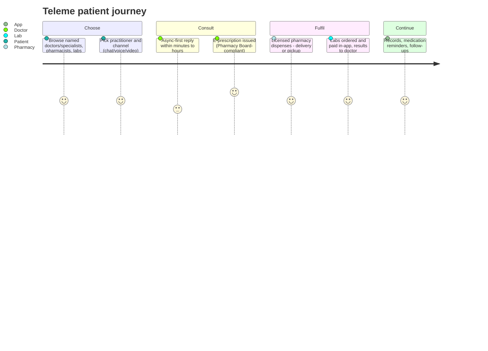

# Teleme — Competitor Dossier

**Abstract.** Teleme (teleme.co, TeleMe Technologies, Kuala Lumpur) is a small Malaysian telehealth platform founded 2015–2016 by Dr Aqeel Ahmad, Mark Choo and ophthalmologist Dr Hoh Hon Bing. It markets itself as "Malaysia's first integrated telemedicine platform": chat/voice/video consultations with named doctors and specialists, regulator-compliant e-prescriptions dispensed via licensed pharmacies, lab-test ordering, health screening packages and medication delivery. It was grant-funded (Cradle RM300K, MaGIC accelerator) rather than VC-backed, and remains a niche operator — roughly 44,000 lifetime Android downloads — whose most notable recent move is a B2B pivot: powering an e-Pharmacy teleconsultation app for Telekom Malaysia's Unifi Business, targeting independent pharmacies. Unlike most first-generation Malaysian health platforms, its app is still actively updated (January 2026). Teleme's specialist-continuity, e-prescription and lab-integration mechanics are directly relevant to Welltech's clinical workflows; its scale is not.

Last updated: July 2026

Related dossiers: [BookDoc](bookdoc.md) · [GetDoc](getdoc.md) · [DoctorOnCall](doctoroncall.md) · [Doc2Us](doc2us.md) · [Qmed Asia](qmed-asia.md)
Related market context: [Malaysia market intelligence](../10-market-intelligence/malaysia-market-intelligence.md)

---

## 1. Company overview

| Item | Detail |
|---|---|
| Entity / brand | TeleMe Technologies, Kuala Lumpur, Malaysia[^1][^2] |
| Founded | 2015–2016 (sources conflict: CB Insights says 2016; Vulcan Post's account and Dr Hoh's CMO tenure point to 2015 origins, market launch 2016)[^2][^3][^4] |
| Founders | Dr Aqeel Ahmad (co-founder, physician trained in Ireland), Mark Choo (co-founder & CEO), Dr Hoh Hon Bing (ophthalmologist; Chief Medical Officer, involved since 2015)[^3][^4][^5] |
| Early support | MaGIC Global Accelerator Programme (GAP), inaugural 2017 cohort (54 startups); Cradle Fund grant RM300,000[^3][^5] |
| Category | Integrated telemedicine: consult → e-prescription → pharmacy → labs → records |
| Market | Malaysia (platform claims usability "from anywhere in the world" for follow-ups)[^6] |
| Provider claim | "500+ licensed health practitioners" (company figure — see §6)[^6][^7] |
| Consumer scale | ~44,000 lifetime Android downloads; ~49/day recent average[^8] |
| Status (July 2026) | Active: app v1.2.47 released 13 January 2026; TM Unifi B2B partnership live[^8][^9] |

## 2. History & timeline

- **2015–2016 — Founding.** Motivation per Dr Aqeel: long waits and misallocated urgent-care attention observed while studying medicine in Ireland; the platform aimed to cut clinic waiting times and let doctors prioritise urgent cases. Dr Hoh Hon Bing joins as CMO, lending senior-specialist credibility.[^3][^4]
- **2017 — Accelerator year.** Selected into MaGIC's inaugural GAP cohort of 54 startups (CEO Mark Choo interviewed on BFM); the product's feature set was substantially shaped during GAP; Cradle RM300K grant followed in November.[^3][^5]
- **2018–2021 — Integrated-stack build-out.** Chat/voice/video consults, Pharmacy Board-compliant e-prescriptions, dispensing via MOH-licensed pharmacies, PathLab-type lab integrations, health screening packages, medication delivery, personal health records; marketed to both patients and employers.[^6][^7][^2]
- **2023 — B2B milestone.** Telekom Malaysia's Unifi Business launches an e-Pharmacy app developed with Teleme Technologies: teleconsultation + e-prescription + digital-signature tooling bundled with business broadband plans (100Mbps–2Gbps) for MSME pharmacies, with government GDPM digitalisation rebates up to 50%; explicitly pitched at rural and underserved communities; "over 500 licensed healthcare professionals" accessible; ~600 Unifi Business consultants as the sales channel.[^9][^10][^11]
- **2024–2026 — Steady shipping.** Incremental app releases: v1.2.38 (Jun 2024), v1.2.39 (Aug 2024), v1.2.43 (Feb 2025), v1.2.47 (13 Jan 2026).[^8]

## 3. Founders & leadership

- **Mark Choo — co-founder & CEO.** Public face for accelerator/startup media (BFM interview on MaGIC GAP selection, 2017).[^5]
- **Dr Aqeel Ahmad — co-founder.** Physician; carrier of the origin story (Irish training, frustration with waiting-time triage).[^3]
- **Dr Hoh Hon Bing — Chief Medical Officer.** Senior LASIK/refractive ophthalmologist involved since 2015; award-winning in ophthalmology research and surgery; practices on the platform himself and evangelises telemedicine to Malaysian doctors via Disruptive Doctors / Medic Footprints webinars — the CMO doubles as the doctor-acquisition channel.[^4][^12]
- No leadership changes, departures or new executive hires surfaced in searches — a stable, founder-run micro-team. *(inference from coverage absence)*

## 4. Funding & investors

| Event | Date | Amount | Type |
|---|---|---|---|
| MaGIC GAP accelerator | 2017 | Programmatic | Non-dilutive support[^3][^5] |
| Cradle Fund grant | Nov 2017 | RM300,000 | Government grant[^3] |
| VC rounds | — | None recorded | PitchBook/Tracxn/CB Insights profiles show no rounds, no valuation[^1][^2][^13] |

**Analytical note:** Teleme is a grant-and-revenue company. Ten years in, its ceiling has been set by capital: it survived where peers died, but could never buy growth. Its unit economics must be roughly self-sustaining at very low volume, implying a lean cost base and doctor-pays/patient-pays revenue rather than subsidised pricing.

## 5. Business model & revenue streams

| Stream | Mechanics | Pricing observed | Evidence |
|---|---|---|---|
| Consultation fees | Practitioners set their own rates; platform presumably takes a share | ~RM10–20 per chat/video session | FAQ via search[^7] |
| Pharmacy & delivery | E-prescriptions fulfilled by MOH-licensed local pharmacies; delivery or collection | Medication priced by pharmacy | FAQ, site[^7][^6] |
| Labs & screening | Doctors order tests in-app; patient pays online; results return to ordering doctor; screening packages sold directly | Package-dependent | FAQ, site[^7][^6] |
| B2B / employers | Screening + teleconsult offerings for employers | Undisclosed | CB Insights[^2] |
| Platform licensing | Teleme-as-infrastructure via partners — the TM Unifi e-Pharmacy app is the template | Bundled with telco plans; GDPM rebates | TM newsroom[^9][^10] |
| Payments | iPay88 and Billplz gateways (online banking, cards) | — | FAQ[^7] |

Two structural notes:

1. Teleme claims to be **one of only two health-tech platforms with Lembaga Farmasi (Pharmacy Board)-compliant e-prescription features** — a company claim, but consistent with Telekom Malaysia selecting it for a pharmacy-facing product.[^7][^9]
2. The RM10–20 consult price range caps take-rate revenue severely: even at a generous 20% take, a consult yields RM2–4. Volume, not consults, must carry the business — hence the pharmacy/labs/B2B emphasis. *(analyst calculation on sourced prices)*

## 6. Product & clinical workflow

Key differentiators vs queue-based telehealth ([DoctorOnCall](doctoroncall.md)-style on-demand GP pools):

- **Continuity with named clinicians**, including consultant specialists (e.g., ophthalmology follow-ups), suited to chronic-disease monitoring and post-op review; "different specialists via teleconference" is pitched for cost-effective chronic-condition maintenance.[^4][^6][^14]
- **Regulated e-prescription + community-pharmacy dispensing** rather than an in-house pharmacy — the asset that made the TM partnership possible.[^7][^9]
- **Trade-off:** response "within minutes to a few hours" — asynchronous-first, unsuited to acute on-demand care.[^7]

**Network claims — treat skeptically.** "500+ licensed health practitioners" has been repeated since at least the 2023 TM launch. Directory listing ≠ active supply; with ~44K lifetime downloads, the count of practitioners consulting weekly is plausibly an order of magnitude lower. *(analyst estimate)*[^6][^9][^8]

## 7. Technology & AI

- Patient app `com.teleme.teleme` (Android; iOS id1323899039); separate practitioner app "Teleme Health Practitioner" (`co.teleme.telemehp`; iOS id1609930264) — a proper two-sided clinical tooling split.[^15][^8]
- Update cadence: consistently maintained; latest v1.2.47 on 13 Jan 2026 — a live codebase, unlike [GetDoc's](getdoc.md).[^8]
- Digital-signature support for e-prescriptions (in the TM e-Pharmacy build).[^9]
- Web platform (teleme.co) supports the same flows plus doctor sign-up funnel.[^6][^16]
- **No AI features claimed anywhere** — no triage bots, no LLM assistants, no analytics products.
- **No WhatsApp workflow** — consults run inside the proprietary app's chat/voice/video channels.[^7][^14]

## 8. Marketing & positioning

- Positioning lines: "Malaysia's first integrated telemedicine platform" and "#1 healthcare app" — both unverifiable superlatives; the "integrated" claim (consult + prescription + pharmacy + labs in one loop) is the legitimate core.[^6]
- **Content/SEO:** doctor-profile pages, FAQ, and a doctor-authored health-tips blog (blog.teleme.co) — a modest but real organic surface.[^16][^4]
- **Doctor-side marketing:** practitioner sign-up funnel on-site; CMO-led webinars targeting doctors (Disruptive Doctors, Medic Footprints) as supply acquisition.[^17][^12]
- **PR:** thin — Vulcan Post (startup era), a Digital News Asia medtech-scepticism piece, then the 2023 TM announcement wave (TM newsroom, Developing Telecoms, Telecom Review Asia, Asian Wireless Communications).[^3][^18][^9][^10][^11]
- Included in third-party "best telemedicine apps in Malaysia" roundups alongside DoctorOnCall, Doc2US, Doctor2U — present in the consideration set, never the headline player.[^14][^19]

## 9. Reviews & reputation

| Signal | Value | Reading |
|---|---|---|
| Android installs | ~44,000 lifetime; ~49/day | Niche but not dead[^8] |
| Ratings volume | No ratings recorded on AppBrain | Too few reviewers to score — very small active base[^8] |
| Update recency | 13 Jan 2026 (v1.2.47) | Actively maintained[^8] |
| Reddit/Lowyat/forums | No significant threads found *(absence-of-evidence, Jul 2026)* | Neither complaints nor advocacy |
| Regulatory standing | Pharmacy Board-compliant e-Rx; MOH-licensed dispensing; TM chose it for pharmacy product | Compliance is its strongest reputational asset[^7][^9] |
| Market narrative | Edge/CodeBlue name DoctorOnCall, Doc2US, Qmed as sector drivers — not Teleme | Peripheral to the industry story[^19][^20] |

## 10. Strengths & weaknesses

**Strengths**

1. Genuine end-to-end clinical loop: consult → compliant e-Rx → pharmacy dispensing → labs → records — rarer in Malaysia than press coverage suggests.[^6][^7]
2. Named-specialist continuity model backed by a practising specialist CMO.[^4]
3. Regulatory compliance as a differentiator, already monetised once via Telekom Malaysia.[^9]
4. Still shipping product in 2026 on a grant-funded budget; survived a decade without VC.[^8]

**Weaknesses**

1. Tiny scale: ~44K downloads, no ratings volume, negligible brand salience.[^8]
2. No growth capital ever raised; no visible path to buying distribution.[^1][^13]
3. Asynchronous response times unsuited to acute on-demand care.[^7]
4. RM10–20 consult pricing caps marketplace revenue; no AI leverage; single-market exposure.[^7]

## 11. SWOT

| | Helpful | Harmful |
|---|---|---|
| **Internal** | Full clinical loop; e-Rx compliance; two-sided app tooling; lean survivor economics | Sub-scale demand; no capital; async UX; commodity pricing |
| **External** | Chronic-disease monitoring programmes; more white-label deals (insurers, pharmacy chains, state programmes — TM as template); Digital Health Act-era compliance positioning[^20] | DoctorOnCall/Doc2US scale and funding[^19]; hospital groups' own teleconsult ([IHH](ihh-pantai-gleneagles.md), [KPJ](kpj-healthcare.md)); TM partnership concentration risk; e-Rx compliance becoming table stakes under the Act[^20] |

## 12. Current status assessment

**Verdict: alive and quietly functional — a sustainable micro-business, not a growth company.**

- Positive signals: app releases through January 2026[^8]; a credible 2023 enterprise partnership with Telekom Malaysia implying working, certifiable technology and an ongoing revenue line.[^9]
- Limiting signals: no funding events in a decade; no download momentum (~49/day); no press since the TM launch cycle; founder-scale team.
- Trajectory: Teleme has effectively become **telehealth infrastructure with a small direct-to-patient storefront attached**. Expect more white-label/B2B arrangements rather than consumer growth.

## 13. Comparison snapshot — where Teleme sits

| Dimension | Teleme | [BookDoc](bookdoc.md) | [GetDoc](getdoc.md) | [DoctorOnCall](doctoroncall.md) / [Doc2Us](doc2us.md) class |
|---|---|---|---|---|
| Clinical loop | Full (consult→e-Rx→pharmacy→labs→records) | None | None | Full, at scale |
| Consult model | Named clinicians, async-first | Booking only | Directory only | On-demand GP queue |
| Compliance posture | Pharmacy Board-compliant e-Rx (claimed top-2)[^7] | n/a | n/a | Compliant, scaled |
| Capital raised | RM300K grant | ~USD 2.3–4.3M angels | Reported US$1.6M | VC-funded (see respective dossiers) |
| B2B distribution | Telekom Malaysia white-label[^9] | PERKESO programme | Bank/club affinity | Insurers, corporates, government |
| App vitality (2026) | Active, ~44K installs[^8] | Active, 1M+ claimed installs | Stale since 2021 | Active, market-leading |
| Status call | Sustainable micro-business | Frozen incumbent | Quasi-dormant | Market drivers[^19] |

Teleme is the only one of the three first-generation platforms whose *product* remains strategically instructive for Welltech; the other two are instructive mainly as channel and failure-mode case studies.

## 14. Intelligence gaps & monitoring plan

Open questions (not answerable from public sources as of July 2026):

1. **Active practitioner count** — the 500+ figure is a directory claim; mystery-shop three specialties and measure response latency to estimate live supply.
2. **Revenue mix** — how much of the business is now the TM/Unifi white-label line vs direct consumer? Determines whether Teleme is a competitor, a vendor, or an acquisition target.
3. **The "one of only 2 compliant platforms" e-prescription claim** — verify against Pharmacy Board (Lembaga Farmasi) records and identify the other platform; directly relevant to Welltech's own e-Rx build.
4. **Corporate registration & financials** — pull SSM filings for TeleMe Technologies to confirm solvency and shareholding.

Monitoring triggers (quarterly review):

- New white-label partner announcements (insurer, pharmacy chain, state programme) → Teleme is scaling the infrastructure play; potential channel conflict or partner opportunity for Welltech.
- App update gap exceeding 12 months → reclassify toward wind-down; acquisition window.
- Digital Health Act enactment → reassess whether Teleme's compliance edge survives commoditisation.[^20]
- Founder/CMO departures (esp. Dr Hoh) → supply-side model would likely unravel.

## 15. Implications for Welltech

1. **Teleme validates the exact clinical loop Welltech needs — at hobbyist scale.** Consult → compliant e-prescription → licensed pharmacy dispensing → labs → longitudinal records is precisely the chassis for GLP-1 weight-loss and longevity programmes. Teleme proves it is regulatorily buildable in Malaysia by a tiny team; Welltech's edge must come from programme design (structured weight-loss/longevity protocols), WhatsApp-native UX, and AI-driven operations — none of which Teleme has.
2. **Named-clinician continuity beats anonymous GP queues for chronic and longitudinal care.** Teleme's specialist-follow-up model (championed by an ophthalmologist CMO) is the right pattern for medically supervised weight-loss and preventive-medicine journeys — retain it, but wrap it in concierge coordination and proactive outreach rather than async waiting.
3. **Compliance is a marketable asset, not overhead.** Teleme extracted a Telekom Malaysia partnership largely off Pharmacy Board-compliant e-prescription capability. With Malaysia's Digital Health Act targeted for 2026, early compliance investment converts into B2B distribution deals; Welltech should treat regulatory tooling as sales collateral.[^20]
4. **Beware the RM10–20 consult trap.** Pricing telehealth as a cheap commodity consult makes venture-scale economics impossible. Welltech's monetisation should sit in programmes, medication cycles and memberships, with consults bundled — not sold à la carte at GP-visit-minus prices.
5. **Doctor-side content is a supply channel.** Dr Hoh's webinar circuit shows Malaysian specialists can be recruited through peer education. Welltech's clinical-advisory brand-building (CME-style content, specialist webinars) can serve the same double duty.
6. **Partnership watchlist.** If Welltech needs rapid e-prescription/pharmacy rails in Malaysia, Teleme is a plausible acquisition or white-label partner: proven stack, no capital, demonstrated openness to enterprise revenue (TM deal). A build-vs-buy assessment should include it.

---

## References

[^1]: PitchBook, "Teleme 2026 Company Profile", https://pitchbook.com/profiles/company/294497-02; Tracxn, "Teleme - 2025 Company Profile", https://tracxn.com/d/companies/teleme/__Scwe-qFbEjsC5fBCOjvkQwym_x9ij9ChZL0PNeFOWTQ (accessed July 2026).
[^2]: CB Insights, "TeleMe - Products, Competitors, Financials" (KL base; founded 2016; virtual consultations, e-prescriptions, health screenings, records; individual + employer customers), https://www.cbinsights.com/company/teleme and https://www.cbinsights.com/company/teleme/people (accessed July 2026).
[^3]: Vulcan Post, "Teleme Is A Malaysian Healthcare Startup For Virtual Doctor Consultations" (Dr Aqeel origin story; MaGIC GAP 2017; Cradle RM300K grant in November), https://vulcanpost.com/631850/teleme-healthcare-startup-malaysia/ (accessed July 2026).
[^4]: Teleme, "Who We Are", https://teleme.co/about-us; Teleme doctor profile, "Dr. Hoh Hon Bing - Ophthalmologist (LASIK and refractive)", https://teleme.co/doctors/profile/dr-hoh-hon-bing; Healthtech Alpha person profile, https://www.healthtechalpha.com/person/hoh-hon-bing (accessed July 2026).
[^5]: MaGIC Central, "TeleMe" organisation profile (GAP cohort of 54; BFM interview with CEO Mark Choo, July 2017), https://central.mymagic.my/network/organization/1520/TeleMe (accessed July 2026).
[^6]: Teleme homepage, "Talk To Health Practitioners Online & Get Your Medication" ("Malaysia's first integrated telemedicine platform"; 500+ practitioners; doctors/pharmacies/PathLab centres throughout Malaysia), https://teleme.co/ (accessed July 2026).
[^7]: Teleme, "Frequently Asked Questions (FAQ)" (chat/voice/video; response within minutes to hours; RM10–20 consult range; iPay88/Billplz; "one of only 2 platforms" with Lembaga Farmasi-compliant e-prescription; MOH-licensed pharmacy dispensing; in-app lab ordering), https://teleme.co/faq (accessed via search excerpts, July 2026).
[^8]: AppBrain, "Teleme for Android" (~44K downloads; ~49/day; no rating volume; last update 13 Jan 2026, v1.2.47), https://www.appbrain.com/app/teleme/com.teleme.teleme; Uptodown/APKCombo version histories (v1.2.38 Jun 2024; v1.2.39 Aug 2024; v1.2.43 Feb 2025), https://com-teleme-teleme.en.uptodown.com/android and https://apkcombo.com/teleme/com.teleme.teleme/download/apk (accessed July 2026).
[^9]: Telekom Malaysia newsroom, "TM revolutionises digital healthcare services with next gen e-Pharmacy solution" (Unifi Business × Teleme Technologies; 500+ licensed professionals; digital signature; GDPM rebates up to 50%; ~600 Unifi Business consultants; rural/underserved focus), https://www1.tm.com.my/news/digital_healthcare_services_with_next_gen_epharmacy_solution (accessed July 2026).
[^10]: Developing Telecoms, "Telekom Malaysia app streamlines prescriptions for pharmacies", https://developingtelecoms.com/telecom-technology/enterprise-ecosystems/16433-telekom-malaysia-app-streamlines-prescriptions-for-pharmacies.html; Telecom Review Asia Pacific, "Telekom Malaysia Transforms Digital Healthcare Services", https://www.telecomreviewasia.com/news/service-news/4075-telekom-malaysia-transforms-digital-healthcare-services (accessed July 2026).
[^11]: Asian Wireless Communications, "Telekom Malaysia's Unifi Business unit launches e-Pharmacy app", https://asianwirelesscomms.com/news-details?itemid=7494 (accessed July 2026).
[^12]: Disruptive Doctors, "Telemedicine with Dr Hoh Hon Bing" (webinar for doctors on telemedicine platforms), https://disruptive-doctors.com/telemedicine-with-dr-hoh-hon-bing/; Medic Footprints mirror, https://medicfootprints.org/telemedicine-with-dr-hoh-hon-bing/ (accessed July 2026).
[^13]: Cradle Fund, corporate site (grant programme context), https://www.cradle.com.my/ (accessed July 2026).
[^14]: Pacific Prime, "Telemedicine & Virtual Care: Malaysian Expat Options" (names DoctorOnCall, BookDoc, Teleme, DOC2US, Doctor2U as trusted providers; Teleme service description), https://www.pacificprime.com/blog/telemedicine-virtual-care-malaysia-expat-options.html (accessed July 2026).
[^15]: Google Play, "Teleme" (com.teleme.teleme) and "Teleme Health Practitioner" (co.teleme.telemehp), https://play.google.com/store/apps/details?id=com.teleme.teleme and https://play.google.com/store/apps/details?id=co.teleme.telemehp; Apple App Store, "Teleme App" (id1323899039), https://apps.apple.com/my/app/teleme/id1323899039, and "Teleme Health Practitioner" (id1609930264), https://apps.apple.com/us/app/teleme-health-practitioner/id1609930264 (accessed July 2026).
[^16]: Teleme blog, "Healthtips by TeleMe — Dr. Hoh Hon Bing", https://blog.teleme.co/doctors/dr-hoh-hon-bing/; Teleme doctor search, https://teleme.co/doctors/search; download page, https://teleme.co/download (accessed July 2026).
[^17]: Teleme, "Doctor / Practitioner Sign Up", https://teleme.co/doctors/signup (accessed July 2026).
[^18]: Digital News Asia, "Scepticism still surrounds medical technology" (Malaysian medtech adoption context for Teleme-era platforms), https://www.digitalnewsasia.com/business/scepticism-still-surrounds-medical-technology (accessed July 2026).
[^19]: The Edge Malaysia, "Cover Story: Next step for digital healthcare" (private teleconsult growth driven by DoctorOnCall, Doc2Us, Qmed Asia), https://theedgemalaysia.com/node/756278; Doc2US, "Best Telemedicine Apps in Malaysia", https://www.doc2us.com/newsroom/best-telemedicine-apps-in-malaysia (accessed July 2026).
[^20]: CodeBlue (Galen Centre), "Stepping Into Digital Health Care Through Telemedicine — Yap Yoong Hong & Dr Sean Thum", Mar 2024 (376 government clinics with virtual consults; MOH digital health division; Digital Health Act targeted 2026), https://codeblue.galencentre.org/2024/03/stepping-into-digital-health-care-through-telemedicine-yap-yoong-hong-dr-sean-thum/ (accessed July 2026).
