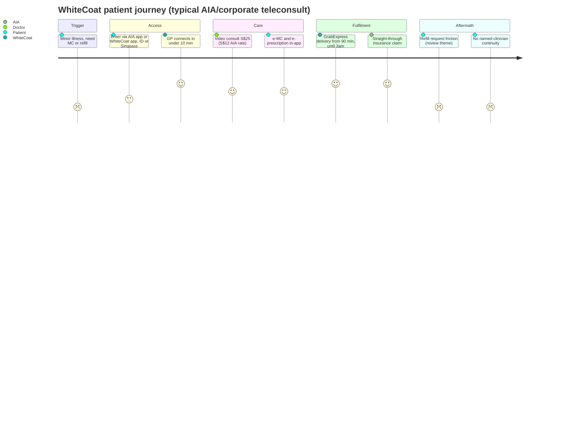

# Competitor Dossier: WhiteCoat Global

**Abstract.** WhiteCoat (whitecoat.global; WhiteCoat Holdings Pte Ltd) is Singapore's insurer-anchored telehealth major: founded by ex-corporate-lawyer Bryan Koh (company narrative dates the idea to 2016, operations to 2017–2018), it was one of the first two providers admitted to MOH's telemedicine regulatory sandbox (April 2018), became AIA Singapore's *exclusive* telehealth provider (2019, deepened 2023 and 2024 to cover 1M+ insured members), raised Singapore's then-largest telemedicine Series A (S$10.8M, April 2021, GEC-KIP/Golden Equator/Korea Investment Partners, SGInnovate, Asia Resource Corporation), and in October 2024 announced the acquisition of Good Doctor Technology Indonesia — the Ping An–Grab–SoftBank telehealth JV — alongside an undisclosed round led by Raffles Family Office with MDI Ventures and the SoftBank Vision Fund as new investors. The combined group claims 130+ insurers, 7,500+ corporate partners and 6.8M insured lives across Singapore, Indonesia, Malaysia and Vietnam (with Hong Kong presence via insurer mental-health deals). Rumoured Temasek/Heliconia backing is **not corroborated** by any press this cycle. WhiteCoat is a B2B2C distribution machine with GP/specialist/mental-wellness teleconsults, screening and chronic-care add-ons — but it has **no packaged weight-loss/GLP-1 or longevity programme** and an app-first, insurer-gated funnel, leaving Welltech's core categories open.

Last updated: July 2026

Related: [Competitor comparison](competitor-comparison.md) · [Doctor Anywhere dossier](doctor-anywhere.md) · [NOVI Health dossier](novi-health.md) · [Singapore market intelligence](../10-market-intelligence/singapore-market-intelligence.md) · [Research standards](../RESEARCH-STANDARDS.md)

---

## 1. Company overview & history

| Item | Detail |
|---|---|
| Founded | Idea 2016; company narrative cites founding 2017, service launch/sandbox entry 2018, Singapore[^1][^2][^3] |
| Founder & CEO | Bryan Koh — lawyer by training, ex-corporate lawyer; sister Dr Natalie Koh serves as medical advisor[^1][^2] |
| Other leadership | COO Clara L.; CMO Justin Chow; CFO Yin Ching Loh (per org-chart trackers; unverified against primary press)[^4] |
| Markets | Singapore (HQ), Indonesia (via Good Doctor), Malaysia, Vietnam (rep offices Hanoi & HCMC, entered 2022); Hong Kong presence via insurer partnerships (MSIG HK); one Vietnamese state-media profile counts "5 key markets" including HK[^5][^6][^7] |
| Scale claims | Group (post-Good Doctor): 130+ insurers, 7,500+ corporate partners, 6.8M insured lives; >1.5M consultations and medication-fulfilment services since 2023; 5,000+ partner hospitals, clinics, pharmacies (Vietnamese profile, 2025-era, treat as company-sourced)[^5][^6][^8] |
| 2020 performance | 8× revenue growth, 7× consultation growth (company statement at Series A)[^9] |
| Revenue / profitability | No ACRA figures surfaced in press this cycle — *intelligence gap* |
| Total disclosed funding | S$10.8M Series A (2021); October 2024 round led by Raffles Family Office — **amount undisclosed**[^9][^10] |

### Founding story and trajectory

Bryan Koh, a former corporate lawyer, conceived WhiteCoat after falling ill hours before a long flight in 2016 and being unable to see a doctor in time; he built an integrated on-demand platform spanning diagnosis, prescription and medication delivery, with his sister Natalie — a practising doctor — as medical advisor.[^1][^2] The company's defining early move was regulatory: after months of dialogue with MOH, WhiteCoat was selected on 18 April 2018 as one of the first two providers (with RingMD) in MOH's Licensing Experimentation and Adaptation Programme (LEAP) telemedicine sandbox — making it, by its own and press framing, Singapore's first MOH-approved full-stack telemedicine practice.[^3][^11][^12]

### Funding history (all amounts as reported)

| Round | Date | Amount | Lead / participants |
|---|---|---|---|
| Series A | Apr 2021 | **S$10.8M (~US$8M)** — then the largest Series A by a Singapore telemedicine company | GEC-KIP Technology and Innovation Fund (co-managed by Korea Investment Partners and Golden Equator Ventures); SGInnovate; Asia Resource Corporation[^9][^13] |
| Growth round | Oct 2024 | **Undisclosed** | Raffles Family Office (lead); new investors MDI Ventures (Telkom Indonesia's CVC) and The SoftBank Vision Fund, entering in tandem with the Good Doctor acquisition[^10][^14] |

**Temasek / Heliconia verification:** no press, release or database result this cycle links Temasek Holdings or Heliconia Capital to WhiteCoat. The confusable facts: SGInnovate (Series A participant) is wholly owned by the Singapore government, and the SoftBank Vision Fund (2024 entrant) arrived via Good Doctor's cap table heritage. Treat any Temasek/Heliconia claim as **unsubstantiated**.[^9][^10] *(verification of absence)*

### The Good Doctor acquisition (Oct 2024) — the transformative move

- Announced 11–14 October 2024: WhiteCoat Global to acquire **PT Good Doctor Technology Indonesia**, described as Indonesia's telemedicine platform with the largest insurer and corporate client network, in "the biggest M&A involving two dominant telehealth companies in Southeast Asia to date". Consideration undisclosed.[^10][^14][^15]
- Good Doctor's pedigree: a December 2018 JV between **Ping An Healthcare and Technology, Grab, and SoftBank's Vision Fund**; operator of **GrabHealth powered by Good Doctor** (beta Oct 2019, launched Dec 2019); ~12M users by early 2021 and ~15M reported later; 6,000+ registered doctors and 4,000+ pharmacies/hospitals/labs across 100+ cities; Indonesia's largest B2B2C telehealth player with 65+ insurers, 3,500+ corporate clients and 8+ TPA partners.[^16][^17][^18][^19]
- So the answer to "did WhiteCoat acquire Good Doctor Indonesia / the Grab telehealth assets?" is **yes — announced October 2024**: Good Doctor was the vehicle through which Grab (and Ping An/SoftBank) ran Indonesian telehealth, and WhiteCoat announced its acquisition together with the RFO-led round; SoftBank Vision Fund and MDI rolled in as WhiteCoat investors. Post-deal, WhiteCoat stated it would seek further funding "at the right time" to scale omnichannel services and integrate GenAI capabilities.[^10][^14][^15]

**Reconciliation note:** the 6.8M figure is "insured lives" under the combined insurer/corporate network in deal materials, but a 2025-era Vietnamese profile restates it as "6.8 million users in Asia" — the deal-material framing (insured lives with access) is the conservative reading; Good Doctor's separately claimed 12–15M registered users are historical app registrations, not active users. Date all these claims to Oct 2024 announcements and treat as company-sourced.[^5][^10][^17]

---

## 2. Business model & revenue streams

WhiteCoat is **insurer-first B2B2C** — the inverse of Doctor Anywhere's consumer-led omnichannel build (see [Doctor Anywhere dossier](doctor-anywhere.md)).

| Stream | Description | Evidence |
|---|---|---|
| Insurer B2B2C (anchor) | **Exclusive** telehealth provider to AIA Singapore since 2019 (corporate clients; straight-through insurance claims processing); Feb 2023: AIA "Think Well" digital corporate mental-health solution; Nov 2024: deepened to all AIA insured members — 1M+ members, discounted rates | [^20][^21][^22] |
| Corporate / employer | End-to-end workplace healthcare: customised corporate plans (e.g. capped ~S$50 all-in teleconsult), on-site screening; branded portals for UBS, JPMorgan Chase, P&G, Mediacorp, MSI(G), Singtel | [^8][^23][^24] |
| B2C teleconsult | On-demand GP video consults 8:00–24:00 daily; paediatrics; mental wellness | [^25][^26] |
| Specialist care | 290+ specialists across 18 specialities (cardiology, dermatology, gastro, ortho, psychiatry, urology, etc.) via app | [^8] |
| Chronic disease management | Diabetes, hypertension, cholesterol, thyroid, gout: care plans, regular tests, medication refills | [^8] |
| Health screening | Individual and corporate/on-site screening; all packages include a free GP teleconsult report review | [^8][^27] |
| Pharmacy & delivery | Medication fulfilment with GrabExpress delivery from 90 minutes post-consult until 3:00 daily | [^28][^29] |
| Regional | Indonesia: Good Doctor B2B2C (65+ insurers, 3,500 corporates, GrabHealth heritage); Malaysia: GP teleconsults 8:00–20:00 with nationwide same/next-day delivery incl. East Malaysia; Vietnam: rep offices, corporate/insurer focus | [^6][^7][^17] |
| Distribution partnerships | Singtel (telehealth bundle), Mediacorp; Swiss Life Network and MSIG Hong Kong for employee mental-health solutions | [^22][^23][^24] |

**Weight management / GLP-1 status:** third-party GLP-1 guides list WhiteCoat among Singapore telehealth platforms through which GLP-1 consultations/prescriptions are accessible, but **no packaged, branded weight-loss or longevity programme** (no programme page, bundle pricing, coaching tier or CGM offer) was found on WhiteCoat properties as of July 2026.[^30][^31] *(verification of absence)* Its chronic-disease and screening SKUs are the nearest adjacencies.

---

## 3. Pricing (actual listed prices, SGD, as published/reported)

| Service | Price | Notes |
|---|---|---|
| GP teleconsult, 8:00–19:59 Mon–Sat | **S$25** | Excludes medication, delivery, GST[^26] |
| GP teleconsult, 20:00–24:00 Mon–Sat; 8:00–24:00 Sun/PH | **S$50** | Same exclusions[^26] |
| "Standard consultation fee" stated in FAQ | S$35 | Conflicts with the S$25/S$50 banding reported by the same guide — likely a list-rate vs time-band artefact; flag for verification against live FAQ[^26] |
| AIA HealthShield Gold Max members (via AIA app) | **S$12** | Insurer-subsidised rate[^26] |
| Corporate plans | e.g. capped **S$50 all-in** per teleconsult (Singtel corporate FAQ) | Varies by contract[^23] |
| Medication delivery | From 90 min post-consult, until 3:00 daily; GrabExpress; fee at checkout | [^28][^29] |

Comparative anchor: Doctor Anywhere charges S$27.25 standard / S$14.17 member; WhiteCoat's S$25 undercuts DA's headline rate slightly, and its S$12 AIA rate is the aggressive insurer-side anchor. WhiteCoat competes on *insurer-subsidised* price, not open-market membership price.[^26]

---

## 4. Clinical workflow & doctor model

**B2C/B2B2C flow:** app download (iOS/Android) → account + ID upload/verification (Singpass supported) → choose GP / paediatrics / mental wellness / specialist → on-demand queue (average wait <10 minutes) or scheduled appointment → video consult with SMC-registered doctor → e-diagnosis, e-MC and e-prescription in-app → medication selected and dispatched via GrabExpress (from 90 min, tracked in the Grab app, until 3:00) → records and MCs stored in-app; insurer members flow through cashless/straight-through claims (AIA).[^20][^25][^26][^28][^29]

**Doctor model:** WhiteCoat markets "Singapore-registered doctors" on a full-stack proprietary platform; press describes an in-house/panel network rather than an open marketplace, but the employed-vs-per-consult mix is **not disclosed** — flag as an intelligence gap. Specialist depth (290+ across 18 specialities) implies a panel/affiliate model for specialists.[^8][^9][^25] Continuity of clinician is not a marketed feature; the model is episodic consult + refill, like DA's. *(inference from product surface)*

**Mental wellness:** psychologist consults in-app; the AIA Think Well programme adds text, video and in-person mental-health coaching for corporate employees — one of the few SG examples of text-based care pathways at insurer scale.[^21][^22]

---

## 5. Regulatory posture

- **Sandbox-native:** first participant (with RingMD) in MOH's LEAP telemedicine regulatory sandbox from April 2018 — WhiteCoat's brand is built on being the "MOH-approved" pioneer, and it published its own explainer on the sandbox.[^3][^11][^12]
- **HCSA:** the sandbox closed February 2021, with telemedicine providers transitioned to licensing under the Healthcare Services Act, phased from September 2021 (outpatient medical service with remote service delivery). WhiteCoat's continued operation implies an HCSA outpatient licence; no adverse licensing action was found.[^12][^32] *(inference; no enforcement history surfaced)*
- **Sector heat, not company-specific:** in December 2024 MOH said it was studying potential teleconsultation lapses sector-wide (doctors and patients must be able to see and hear each other; concerns over MC mills and lax prescribing). No WhiteCoat-specific enforcement was found this cycle.[^33]
- **GLP-1 rules context:** in Singapore only Wegovy and Saxenda are HSA-approved for weight loss; GLP-1s are prescription-only medicines that cannot be advertised to consumers, and telehealth GLP-1 prescribing is under scrutiny — operators report denying 20–40% of prescription requests. WhiteCoat accepts GLP-1-related consults via its platform but does not consumer-advertise a weight-loss medication programme — a compliance-conservative posture consistent with its insurer-facing brand.[^30][^31][^33]

---

## 6. Technology, AI & WhatsApp

- **Stack:** proprietary "full-stack telemedicine platform" (consult, e-prescription, fulfilment, claims integration); Series A proceeds were earmarked for product development and engineering; straight-through claims processing with AIA since 2019 is the standout integration.[^9][^20]
- **AI:** post-Good Doctor, WhiteCoat says its next growth phase involves "integration of cutting-edge GenAI capabilities" into omnichannel services — ambition, not yet a documented deployed product. Good Doctor brings real AI heritage: Ping An-derived intelligent triage/AI-assisted diagnosis was core to its Indonesia operation (Forbes case study, 2021).[^14][^18]
- **WhatsApp:** no WhatsApp-first booking or care funnel found on Singapore/Malaysia properties; the funnel is app-only with in-app records and Grab-app delivery tracking. Indonesia heritage is super-app (Grab) distribution, not WhatsApp.[^25][^28] *(verification of absence)*

---

## 7. Marketing & positioning

- **Positioning:** "MOH sandbox pioneer" trust story + insurer/corporate default option. Consumer brand is functional, not lifestyle; the reach engine is AIA and employer contracts, not content.[^3][^20][^22]
- **B2B microsites** for UBS, JPMC, P&G, MSI, Mediacorp, Singtel indicate a named-account enterprise motion unusual among SG telehealth players.[^23][^24]
- **PR:** funding and AIA-partnership announcements dominate; founder-profile features (Vulcan Post, KrASIA, A Magazine, Portfolio) carry the origin story.[^1][^2][^9][^22]
- **SEO/social:** whitecoat.global (regional, /sg /my /id) plus legacy whitecoat.com.sg content pages; modest owned-social footprint; no follower counts surfaced this cycle worth citing — owned-media reach appears materially smaller than its B2B footprint. *(analyst observation; low confidence on exact counts)*
- **App stores:** listed on Apple App Store (id1400608472) and Google Play (com.project.WhiteCoat); live rating/download counts were not verifiable via search extracts this cycle — flagged for direct store pulls.[^34]

---

## 8. Reviews & reputation

| Channel | Signal | Themes (with evidence) |
|---|---|---|
| App stores (Apple SG, Google Play) | Mixed; live aggregate ratings unverified this cycle | Positive: near-zero wait, "meticulous and professional" doctors, meds within ~3h. Negative: medication top-up/refill friction (user "begging" for eczema refills; company cites insurer/safety supply limits), "no internet connection" errors, Singpass login failures[^34] |
| Media test-drives | Positive | Vulcan Post walkthrough: fast MC issuance, S$25 consult, ~S$41.73 all-in bill vs >S$50 at private GPs[^35] |
| Consumer guides | Consistently listed top-3 SG telemedicine app alongside Doctor Anywhere | Price table placement: S$25/S$50 banding[^26][^36] |
| Reddit r/singapore | No substantive indexed threads surfaced this cycle | *(verification of absence)* |

**Theme synthesis:** WhiteCoat's complaint profile is *operational* (refill policy, app auth), not *trust/pricing* like DA's medication-margin resentment. Its refill conservatism is the flip side of its compliance posture — and a continuity-care gap: chronic patients wanting proactive refill management are underserved by episodic teleconsult logic.[^34]

---

## 9. Competitive context

### 9.0 Reconciliation of conflicting figures

| Figure | Values reported | Treatment |
|---|---|---|
| Founding year | 2016 (idea), 2017 (founding per A Magazine), 2018 (launch/sandbox per Vulcan Post and MOH) | All three retained with roles: idea → incorporation → regulated launch[^1][^2][^3] |
| Consultation fee | S$25/S$50 time-banded vs "standard fee S$35" in FAQ | Both shown; banding treated as the operative consumer price, S$35 flagged as list-rate artefact pending live-FAQ verification[^26] |
| Group reach | "6.8M insured lives" (deal materials, Oct 2024) vs "6.8M users in Asia" (Vietnamese profile, 2025) | Insured-lives framing adopted as conservative; user framing treated as company-sourced restatement[^5][^10] |
| Good Doctor users | 12M (early 2021) → ~15M (later company claims) | Historical registration counts, not active users; dated accordingly[^16][^17] |
| Markets | 4 (SG/ID/MY/VN with offices, LinkedIn) vs 5 incl. HK (Vietnamese profile) | 4 operating markets + HK insurer-partnership presence (Swiss Life Network / MSIG HK)[^5][^6][^22] |
| Oct 2024 round & deal size | Undisclosed in every source | Reported as undisclosed; no estimate fabricated[^10][^14] |

### 9.1 WhiteCoat vs Doctor Anywhere vs NOVI (Singapore lens)

| Dimension | WhiteCoat | Doctor Anywhere | NOVI Health (see [dossier](novi-health.md)) |
|---|---|---|---|
| Core motion | Insurer-exclusive B2B2C telehealth | Consumer omnichannel + insurer panels | Specialist metabolic clinic + digital programmes |
| GP teleconsult | S$25 (S$12 AIA) | S$27.25 (S$14.17 member) | n/a (specialist model) |
| Geography | SG, ID, MY, VN (+HK via insurers) | SG + 5 SEA markets | SG only |
| Owned clinics | None found (screening via partners) | 9 DA Clinics | 1 specialist clinic |
| Weight/GLP-1 programme | Consult access only | Consult access only | Full programme + published outcomes |
| Longevity | None | Premium screening only | NOVI Max programme |
| Distinct asset | AIA exclusivity; Good Doctor Indonesia | CHAS/Healthier SG estate; marketplace | Clinical outcomes data; Novo Nordisk partnership |

### 9.2 Customer journey (insured-member teleconsult, SG)

Structural read: the front half of the journey (speed, claims, delivery) is best-in-class in Singapore; the back half (refills, continuity, chronic follow-through) is where the model thins out — exactly the segment a programme-based entrant monetises.[^20][^28][^29][^34] *(analyst synthesis)*

### 9.3 Customer segments *(analyst synthesis)*

1. **AIA insured members** (largest; 1M+ addressable post-Nov 2024) — default-channel users at S$12; near-zero CAC for WhiteCoat, near-zero brand loyalty to WhiteCoat.[^22]
2. **Corporate employees** — UBS/JPMC/P&G-grade employer plans, capped all-in consults, on-site screening.[^23][^24]
3. **Convenience B2C** — MC/refill seekers paying S$25/S$50; interchangeable with DA's equivalent segment.[^26]
4. **Mental-wellness users** — Think Well corporate coaching plus B2C psychologist consults; regionalised via Swiss Life/MSIG HK.[^21][^22]
5. **Indonesia mass-market (Good Doctor)** — B2B2C insured/corporate lives plus GrabHealth-heritage consumers at local price points.[^17]

### 9.4 Forces snapshot

| Force | Assessment |
|---|---|
| Buyer power | **Very high** — AIA concentration is existential; insurer procurement sets rates. *(inference)* |
| Supplier power | Medium — SMC GP supply elastic; specialist panel needs curation |
| New entrants | Medium — commodity teleconsult is open; AIA exclusivity is the moat |
| Substitutes | High — GP walk-ins, DA, insurer-owned telehealth, employer clinics |
| Rivalry | High — DA (scale), Speedoc (home care), NOVI/Noah/vertical players (categories) |

---

## 10. Strengths / Weaknesses / SWOT

### Strengths
1. Regulatory first-mover halo: MOH sandbox pioneer, compliance-conservative brand.[^3][^11]
2. AIA exclusivity — 1M+ insured members funnelled by default; straight-through claims plumbing since 2019.[^20][^22]
3. Regional B2B2C scale post-Good Doctor: 130+ insurers, 7,500 corporates, 6.8M insured lives, GrabHealth heritage in Indonesia.[^10][^17]
4. Blue-chip cap table trajectory: GEC-KIP → Raffles FO, MDI Ventures, SoftBank Vision Fund.[^9][^10]
5. Enterprise sales muscle (UBS/JPMC/P&G-grade microsites; Swiss Life/MSIG HK mental-health distribution).[^22][^23][^24]

### Weaknesses
1. Channel concentration: AIA and corporate contracts own the customer; WhiteCoat's direct consumer brand and owned-social reach are thin. *(inference)*[^22]
2. No packaged weight-loss, metabolic or longevity programme despite GLP-1 consult capability — category gap.[^30][^31]
3. Episodic care model; refill friction complaints; no continuity-of-clinician proposition.[^34]
4. Financial opacity: no disclosed revenue/profit; Good Doctor integration cost and Indonesia burn (a market that broke bigger players) are unquantified risks.
5. App-only funnel; no WhatsApp-native journey in any market.[^25][^28]
6. Undisclosed round sizes since 2021 suggest total capital well below DA's >S$190M — thinner war chest for a five-market ambition. *(analyst estimate)*

### SWOT

| | Helpful | Harmful |
|---|---|---|
| **Internal** | AIA exclusivity, sandbox-pioneer trust, regional insurer network, enterprise microsites, GenAI ambition with Good Doctor AI heritage | No weight/longevity SKU, channel dependence on AIA, financial opacity, app-only funnel, refill/UX friction |
| **External** | Insurer digitisation across SEA; GLP-1 demand it could bundle for insurers; Indonesia scale via Good Doctor | Integration risk in Indonesia; MOH teleconsult scrutiny; DA/vertical-player rivalry; insurers building owned telehealth (AIA could internalise) |

---

## 11. Vulnerability analysis vs a WhatsApp-first continuity-care weight/longevity entrant

1. **The insurer moat doesn't cover Welltech's category.** WhiteCoat sells episodic consult capacity; medical weight loss and longevity are 6–18-month programme purchases bought on outcomes and trust, not panel access. Welltech does not need to displace WhiteCoat to win its category — it needs to define a category WhiteCoat hasn't entered.[^30][^31]
2. **Refill and chronic-care friction is documented.** WhiteCoat's own app reviewers describe refill requests as "begging"; its chronic-disease SKU is care-plans-plus-refills, not multidisciplinary programme care. A named-clinician GLP-1 titration journey with proactive refill logistics is direct counter-programming.[^8][^34]
3. **App-gated, insurer-gated funnel.** Two log-ins (AIA app → WhiteCoat) and Singpass friction sit between an insured member and care; a WhatsApp-first funnel removes every step. In Malaysia — where WhiteCoat's offer is a thin 8:00–20:00 GP teleconsult service — WhatsApp-native onboarding is a measurable acquisition advantage.[^7][^25][^34]
4. **WhiteCoat's counter-move runs through AIA, not through product.** Its rational response to GLP-1 demand is an insurer-bundled weight benefit (see §12.1). Welltech's defence is speed: lock in employer/insurer *outcome-based* metabolic contracts and clinical-brand authority before a bundled offer commoditises access.[^22][^30]
5. **Where WhiteCoat is genuinely superior — don't fight:** claims plumbing (straight-through AIA processing since 2019), enterprise procurement relationships, and 90-minute medication logistics via GrabExpress. Partner or neutralise; don't rebuild.[^20][^28][^29]
6. **Integration distraction window.** Digesting Good Doctor Indonesia (a market that consumed larger balance sheets) will absorb management bandwidth through 2025–2026 — a window in which WhiteCoat is unlikely to launch new Singapore verticals. *(analyst forecast)*[^10][^15]

---

## 12. Threat assessment for Welltech

1. **Does WhiteCoat enter weight/longevity?** Not yet — and its likeliest entry vector is *insurer-bundled*: an AIA weight-management or metabolic benefit powered by WhiteCoat would reach 1M+ members overnight. That is the scenario to monitor, because it would commoditise GLP-1 access inside the insured channel before Welltech reaches those employers. Probability rises if AIA regionalises its Think Well playbook into metabolic health. *(analyst forecast)*[^21][^22][^30]
2. **Direct B2C collision risk: low-medium.** WhiteCoat's consumer surface is a commodity teleconsult; it lacks the multidisciplinary programme design, outcome tracking and continuity Welltech is building. Its complaint profile (refill friction) is Welltech's pitch.
3. **Where WhiteCoat is strong, avoid:** exclusive insurer panels and enterprise employer contracts in SG. Competing head-on means displacing plumbing (claims integration) that took years.
4. **Partnership/acquisition angles:** (a) Welltech as *programme layer* on WhiteCoat's insurer rails — white-label medical weight-loss/longevity programmes for AIA corporates; (b) WhiteCoat as acquirer of a proven weight/metabolic vertical if it chooses buy over build (its Good Doctor deal proves M&A appetite); (c) Malaysia: WhiteCoat MY is shallow (GP teleconsults 8:00–20:00, delivery) — a local clinical partner would accelerate it, which cuts both ways.[^7][^10]
5. **Signals to watch:** any AIA weight/metabolic benefit announcement; a disclosed Series B; Good Doctor integration milestones or write-downs; GenAI product launches; WhatsApp Business API adoption; whitecoat.global adding programme pages (site diffs).

---

## 13. Implications for Welltech

1. **The insured channel is spoken for; the outcomes channel is not.** WhiteCoat sells consult capacity to insurers. Welltech should sell *outcomes* (kg lost, HbA1c, absenteeism) to employers/insurers — a different procurement conversation WhiteCoat's episodic model cannot service without rebuilding itself.
2. **Move before the AIA-bundle scenario materialises.** A WhiteCoat-powered insurer weight benefit is the single most dangerous flank move; Welltech's window to establish the category standard in SG (with NOVI as the clinical benchmark) is open now.
3. **Exploit continuity and refill friction.** WhiteCoat's own reviewers describe begging for refills; a named-clinician, WhatsApp-native titration journey is the direct counter-programming.[^34]
4. **Learn from the compliance-first brand.** WhiteCoat converted regulatory pioneering into distribution trust. Welltech should document its HCSA/MOH compliance posture as marketing-grade collateral, especially for GLP-1 prescribing where MOH scrutiny is rising.[^33]
5. **Don't fight in Indonesia/commodity teleconsults.** WhiteCoat+Good Doctor owns insurer telehealth plumbing there; Welltech's edge is programme depth in SG/MY, not consult breadth.
6. **Track the Temasek/Heliconia rumour to ground.** If sovereign-linked capital does enter WhiteCoat, its pricing aggression and M&A capacity change materially; as of July 2026 there is no evidence it has.[^9][^10]

---

## 14. Intelligence gaps & monitoring plan

| Gap / signal | Why it matters | How to monitor |
|---|---|---|
| Revenue, profitability, headcount | Unknown unit economics behind undisclosed rounds | ACRA filings; DealStreetAsia coverage |
| Oct 2024 round size & valuation | Sizes the war chest for regional expansion | Raffles FO / MDI / SVF portfolio notes; VentureCap Insights |
| Good Doctor integration status | Indonesia burn broke larger players; GrabHealth channel continuity unclear | Jakarta Post, DailySocial, MedX; gooddoctor.co.id diffs |
| Employed-vs-panel doctor mix | Determines continuity-care capability | Job ads; MOH licence registers; doctor recruitment pages |
| AIA contract renewal/exclusivity terms | Single-point-of-failure channel | AIA newsroom; insurer procurement chatter |
| Weight/metabolic/longevity SKU launch | Direct category threat | whitecoat.global + whitecoat.com.sg site diffs; app release notes |
| Live app ratings | Reputation trendline | Quarterly App Store (id1400608472) / Play (com.project.WhiteCoat) pulls[^34] |

Verification note: whitecoat.global, whitecoat.com.sg and most third-party news pages returned HTTP 403 to direct fetching this cycle; site-sourced prices, hours and service details derive from indexed search extracts of the exact pages cited, cross-checked across at least two independent guides where possible.

---

## References

[^1]: Vulcan Post, "Changing Healthcare With A Doctor In Every Phone: Bryan Koh, WhiteCoat CEO", https://vulcanpost.com/693230/whitecoat-ceo-bryan-koh-entrepreneur-of-the-month/ (accessed July 2026).
[^2]: A Magazine Singapore, "WhiteCoat Founder Bryan Koh: 'Covid-19 Brought Forward Telemedicine By At Least A Decade'", https://read-a.com/whitecoat-bryan-koh-telemedicine/ (accessed July 2026); KrASIA, "WhiteCoat brings convenience to Singapore's healthcare: Startup Stories", https://kr-asia.com/whitecoat-brings-convenience-to-singapores-healthcare-startup-stories (accessed July 2026).
[^3]: MOH Singapore, "MOH Launches First Regulatory Sandbox to Support Development of Telemedicine" (18 Apr 2018; first participants WhiteCoat and RingMD), https://www.moh.gov.sg/newsroom/moh-launches-first-regulatory-sandbox-to-support-development-of-telemedicine/ (accessed July 2026).
[^4]: The Org, "WhiteCoat — Leadership Team" (Bryan Koh CEO; Clara L. COO; Justin Chow CMO; Yin Ching Loh CFO), https://theorg.com/org/whitecoat/teams/leadership-team (accessed July 2026).
[^5]: Vietnam.vn (state media), "WhiteCoat develops a digital healthcare model that meets international standards" (5 markets incl. HK; 5,000+ partner facilities; 6.8M users; Vietnam entry 2022, rep offices Hanoi & HCMC), https://www.vietnam.vn/en/whitecoat-phat-trien-mo-hinh-y-te-so-chuan-quoc-te (accessed July 2026).
[^6]: WhiteCoat Global, LinkedIn company page (>1.5M consultations and medication fulfilment since 2023; offices in Singapore, Indonesia, Malaysia, Vietnam), https://sg.linkedin.com/company/whitecoat-global (accessed July 2026).
[^7]: WhiteCoat Malaysia, homepage (GP teleconsults 8AM–8PM daily; same/next-day nationwide medication delivery incl. East Malaysia), https://whitecoat.global/my/ (accessed July 2026, via indexed search extracts).
[^8]: WhiteCoat, services/microsite pages (290+ specialists across 18 specialities; chronic disease management incl. diabetes, hypertension, cholesterol, thyroid, gout; screening with free GP teleconsult review; corporate solutions), https://whitecoat.global.microsite.sg/ and https://whitecoat.com.sg/health-screening/ and https://whitecoat.com.sg/mental-wellness/ (accessed July 2026, via indexed search extracts).
[^9]: SGInnovate press room, "WhiteCoat Raises S$10.8m in Singapore's Largest Telemedicine Series A Funding Round" (Apr 2021; GEC-KIP Technology and Innovation Fund lead, co-managed by Korea Investment Partners and Golden Equator Ventures; SGInnovate, Asia Resource Corporation; 8× revenue and 7× consultations in 2020), https://www.sginnovate.com/press-room/whitecoat-raises-s108m-singapores-largest-telemedicine-series-funding-round (accessed July 2026).
[^10]: TNGlobal (TechNode Global), "WhiteCoat to acquire Indonesian telemedicine platform Good Doctor" (14 Oct 2024; round led by Raffles Family Office; new investors MDI Ventures and SoftBank Vision Fund; 130+ insurers, 7,500 corporate partners, 6.8M insured lives; GenAI integration plans; amounts undisclosed), https://technode.global/2024/10/14/whitecoat-to-acquire-indonesian-telemedicine-platform-good-doctor/ (accessed July 2026).
[^11]: WhiteCoat, "What's A 'Regulatory Sandbox' And What Does It Mean?" (selected 18 Apr 2018 as first participating provider), https://whitecoat.com.sg/news/regulatory-sandbox-meaning/ (accessed July 2026); OpenGov Asia, "First healthcare regulatory sandbox launched in Singapore for telemedicine services", https://opengovasia.com/2018/04/19/first-healthcare-regulatory-sandbox-launched-in-singapore-for-telemedicine-services/ (accessed July 2026).
[^12]: Sidley Austin, "Singapore to License Telemedicine Service Providers from 2022" (sandbox closed Feb 2021; HCSA phased licensing from Sep 2021), https://www.sidley.com/en/insights/newsupdates/2021/05/singapore-to-license-telemedicine-service-providers-from-2022 (accessed July 2026); LawTech.Asia, "The medico-legal dilemmas of the regulation of telemedicine and AI in Singapore's healthcare context", https://lawtech.asia/the-medico-legal-dilemmas-of-the-regulation-of-telemedicine-and-ai-in-singapores-healthcare-context/ (accessed July 2026).
[^13]: e27, "WhiteCoat banks US$8M for its on-demand telemedicine services platform" (9 Apr 2021), https://e27.co/whitecoat-bags-us8m-for-its-on-demand-telemedicine-services-platform-20210409/ (accessed July 2026).
[^14]: The Edge Singapore, "WhiteCoat Global has announced that it will be acquiring Good Doctor Indonesia", https://www.theedgesingapore.com/news/healthcare/whitecoat-global-has-announced-it-will-be-acquiring-good-doctor-indonesia (accessed July 2026); Asia Private Equity Centre, "Raffles FO, MDI & SoftBank Vision Fund Back WhiteCoat's Acquisition of Good Doctor", https://www.asiape.com/publication/raffles-fo-mdi-softbank-vision-fund-back-whitecoat-s-acquisition-of-good-doctor (accessed July 2026).
[^15]: The Jakarta Post, "WhiteCoat to acquire telemedicine platform Good Doctor" (14 Oct 2024), https://www.thejakartapost.com/business/2024/10/14/whitecoat-to-acquire-telemedicine-platform-good-doctor.html (accessed July 2026); MDI Ventures, "WhiteCoat to acquire Indonesian telemedicine startup Good Doctor", https://mdi.vc/news/white-coat-to-acquire-indonesian-telemedicine-startup-good-doctor (accessed July 2026); Crunchbase acquisition profile, https://www.crunchbase.com/acquisition/whitecoat-acquires-pt-good-doctor-technology-indonesia--036c2157 (accessed July 2026).
[^16]: NUS Saw Swee Hock School of Public Health, "Rapid Scaling of Telemedicine to Address Unmet Healthcare Needs" — Good Doctor case study (JV of Ping An Healthcare and Technology, Grab, SoftBank Vision Fund, est. Dec 2018; launched Dec 2019; 12M users by early 2021), https://sph.nus.edu.sg/wp-content/uploads/2021/11/Good-Dr-Case-Study.pdf (accessed July 2026).
[^17]: Good Doctor Indonesia, "Why Good Doctor?" (6,000+ doctors, 4,000+ pharmacies/hospitals/labs, 100+ cities; largest B2B2C telehealth: 65+ insurers, 3,500+ corporates, 8+ TPAs), https://www.gooddoctor.co.id/en/why-good-doctor/ (accessed July 2026); Backscoop, "$10M for Grab and Softbank-backed Indonesia's Good Doctor Technology to grow", https://www.backscoop.com/newsletter-posts/10m-for-grab-and-softbank-backed-indonesias-good-doctor-technology-to-grow (accessed July 2026).
[^18]: Forbes (Tom Davenport), "The Future Of Work Now: Good Doctor Technology For Intelligent Telemedicine In Southeast Asia" (2 Mar 2021; AI triage heritage), https://www.forbes.com/sites/tomdavenport/2021/03/02/the-future-of-work-now-good-doctor-technology-for-intelligent-telemedicine-in-southeast-asia/ (accessed July 2026).
[^19]: Grab Indonesia press, "Good Doctor Technology Indonesia dan Grab Luncurkan GrabHealth powered by Good Doctor", https://www.grab.com/id/en/press/tech-product/good-doctor-technology-indonesia-dan-grab-luncurkan-grabhealth-powered-by-good-doctor-membuka-akses-layanan-kesehatan-berkualitas-bagi-jutaan-masyarakat-indonesia/ (accessed July 2026); e27, "Together with Ping An, GrabHealth starts to show its teeth in Indonesia" (22 Oct 2019), https://e27.co/together-with-ping-an-grabhealth-starts-to-show-its-teeth-in-indonesia-20191022/ (accessed July 2026).
[^20]: AIA Singapore press release, "AIA Singapore and WhiteCoat enter landmark partnership, offering telemedicine services to AIA's corporate clients" (2019; exclusive telehealth provider; straight-through claims), https://www.aia.com.sg/en/about-aia/media-centre/press-releases/2019/aia-singapore-and-whitecoat-enter-landmark-partnership-offering-telemedicine-services-to-aia-s-corporate-clients (accessed July 2026).
[^21]: TNGlobal, "AIA Singapore partners WhiteCoat to launch digital mental health solution" (22 Feb 2023, Think Well), https://technode.global/2023/02/22/aia-singapore-partners-whitecoat-to-launch-digital-mental-health-solution/ (accessed July 2026); MobiHealthNews, "AIA, WhiteCoat tie up to expand digital mental health support in Singapore", https://www.mobihealthnews.com/news/asia/aia-whitecoat-tie-expand-digital-mental-health-support-singapore (accessed July 2026).
[^22]: Media OutReach, "AIA Singapore enhances accessibility and affordability of quality healthcare services for more than 1 million insured members with deepened partnership with WhiteCoat" (4 Nov 2024), https://www.media-outreach.com/news/singapore/2024/11/04/338480/aia-singapore-enhances-accessibility-and-affordability-of-quality-healthcare-services-for-more-than-1-million-insured-members-with-deepened-partnership-with-whitecoat/ (accessed July 2026); Coverager, "WhiteCoat expands partnership with AIA Singapore" (also notes Swiss Life Network and MSIG Hong Kong mental-health partnerships), https://coverager.com/whitecoat-expands-partnership-with-aia-singapore/ (accessed July 2026); Insurance Business Asia, "AIA Singapore expands healthcare access through new partnership", https://www.insurancebusinessmag.com/asia/news/life-insurance/aia-singapore-expands-healthcare-access-through-new-partnership-512511.aspx (accessed July 2026).
[^23]: Singtel Digital, "WhiteCoat Telehealth FAQ" (corporate plan example with ~S$50 all-in cap per teleconsult), https://cdn1.singteldigital.com/content/dam/singtel/personal/products-services/lifestyle-services/whitecoat-telehealth/whitecoat-telehealth-faq.pdf (accessed July 2026).
[^24]: WhiteCoat corporate microsites: UBS https://whitecoat.com.sg/ubs/; JPMC https://whitecoat.com.sg/jpmc/; MSI https://whitecoat.com.sg/msi/; P&G https://whitecoat.com.sg/pg/; Mediacorp https://whitecoat.com.sg/mediacorp/ (accessed July 2026, via indexed search extracts).
[^25]: WhiteCoat Singapore, homepage and FAQ (doctors daily 8AM–12AM; average wait <10 min; account/ID verification; GP, paediatrics, mental wellness; in-app MCs and records), https://whitecoat.global/sg/ and https://whitecoat.global/sg/faq.html (accessed July 2026, via indexed search extracts).
[^26]: DollarsAndSense, "Guide To Telemedicine Providers In Singapore: Here's How Much It Costs To See A Doctor (Virtually)" (WhiteCoat S$25 8:00–19:59 Mon–Sat; S$50 20:00–24:00 and Sun/PH; FAQ-listed standard fee S$35; AIA HealthShield Gold Max rate S$12 via AIA app; fees exclude medication, delivery, GST), https://dollarsandsense.sg/guide-to-telemedicine-providers-in-singapore-heres-how-much-it-costs-to-see-a-doctor-virtually/ (accessed July 2026).
[^27]: WhiteCoat health-screening booking microsite, https://wchsbooking.replit.app/ (accessed July 2026).
[^28]: MobiHealthNews, "WhiteCoat partners with GrabExpress to enhance its medication delivery services", https://www.mobihealthnews.com/news/asia/whitecoat-partners-grabexpress-enhance-its-medication-delivery-services (accessed July 2026).
[^29]: Vulcan Post, "Grab For Medicine? WhiteCoat Partners GrabExpress So Users Can Get Medicine In 90 Mins" (delivery from 90 min post-consult until 3AM daily; Grab-app tracking), https://vulcanpost.com/673490/whitecoat-grabexpress-medicine-delivery-singapore/ (accessed July 2026).
[^30]: Regimen, "Ozempic & Mounjaro in Singapore 2026 — GLP-1 guide" (lists WhiteCoat among SG telehealth platforms offering GLP-1 prescriptions with online consultations; Wegovy/Saxenda the only HSA-approved weight-loss GLP-1s), https://helloregimen.com/sg/blog/ozempic-mounjaro-singapore-guide-2026 (accessed July 2026).
[^31]: Noah (ofnoah.sg), "The Complete Guide to Medical Weight Loss in Singapore: GLP-1 Medications, Costs & Online Treatment", https://www.ofnoah.sg/blog/the-complete-guide-to-medical-weight-loss-in-singapore-glp-1-medications-costs-online-treatment (accessed July 2026). No WhiteCoat weight-loss programme page found on WhiteCoat properties as of July 2026 *(analyst verification of absence)*.
[^32]: MOH Singapore, health regulation overview (HCSA), https://www.moh.gov.sg/others/health-regulation/ (accessed July 2026).
[^33]: SGH/Straits Times syndication, "Doctors, patients must see and hear each other during teleconsults; MOH studying potential lapses" (Dec 2024; also reports telehealth operators denying 20–40% of GLP-1-type prescription requests), https://www.sgh.com.sg/news/patient-care/doctors-patients-must-see-and-hear-each-other-during-teleconsults-moh-studying-potential-lapses (accessed July 2026); NUHS press clipping, Sunday Times "Teleconsults put to the test" (1 Dec 2024), https://www.nuhs.edu.sg/docs/default-source/newsroom-document/jhc/2024/12-december/teleconsults-put-to-the-test.pdf (accessed July 2026).
[^34]: Apple App Store (SG), "WhiteCoat App", https://apps.apple.com/sg/app/whitecoat/id1400608472 (accessed July 2026, via indexed search extracts — refill-friction and login complaints, meds-in-3h and professionalism praise); Google Play, "WhiteCoat", https://play.google.com/store/apps/details?id=com.project.WhiteCoat (accessed July 2026, via indexed search extracts). Live aggregate ratings unverified this cycle.
[^35]: Vulcan Post, "This S'pore-Based App Lets Us Video Call A Doctor — Did We Manage To Get An MC?" (test consult: S$25 fee, ~S$41.73 total bill), https://vulcanpost.com/656208/whitecoat-app-review/ (accessed July 2026).
[^36]: TheSmartLocal, "13 Doctor Teleconsultations From Home With Reviews", https://thesmartlocal.com/read/telemedicine-singapore/ (accessed July 2026); Yahoo Finance SG, "Top 8 Telemedicine Apps in Singapore (2025)", https://sg.finance.yahoo.com/news/doctor-anywhere-whitecoat-doctor-world-023724258.html (accessed July 2026).
