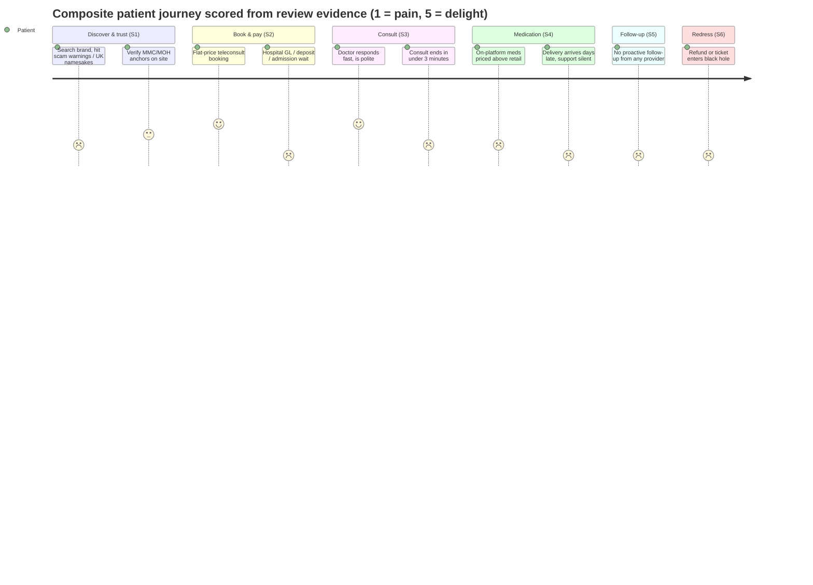

# Patient Review Analysis — Malaysian Digital Health & Private Healthcare

**Abstract.** This document is the master voice-of-customer synthesis for Welltech Health. It aggregates publicly visible patient reviews and complaint records across app stores, Google Maps aggregators, review platforms (Birdeye, iBanding, Wupdoc, ComplaintsBoard, Trustburn), forums (Lowyat, sgforums), consumer bodies (NCCC, KPDN/TTPM) and academic patient-experience studies, covering Malaysia's telehealth platforms (DoctorOnCall, DOC2US, Doctor Anywhere MY, Speedoc, Doctor2U), digital-health/coaching apps (Naluri), pharmacy chains (Alpro, BIG/CARiNG), weight-loss and aesthetic clinics, slimming centres, and the five flagship private hospital brands (Pantai, Gleneagles, Sunway, KPJ, Prince Court). Findings are organised by care-journey stage. Companion documents: [recurring-complaints.md](recurring-complaints.md) (complaint taxonomy), [review-score-comparison.md](review-score-comparison.md) (rating tables), [sentiment-analysis.md](sentiment-analysis.md) (emotional drivers and product implications).

Last updated: July 2026

---

## 1. Methodology

### 1.1 Platforms covered

| Platform class | Sources used | What it evidences |
|---|---|---|
| App stores | Google Play listings, Apple App Store listings, AppBrain tracker, AppGrooves review aggregation | App reliability, support responsiveness, consult experience |
| Location reviews | Google Maps ratings via aggregators (Top-Rated.Online, Travelynne snapshot, Birdeye, Wanderlog), iBanding, Wupdoc, Foursquare, Trustburn | Facility experience: queues, billing, staff attitude |
| Complaint platforms | ComplaintsBoard, PissedConsumer, NCCC archive, KPDN/TTPM statistics | Severe-harm tail: refunds, hard-sell, disputes |
| Forums / blogs | Lowyat.NET, sgforums, personal review blogs (Yanrula, SebrinahYeo, Hullabaloloo, SG Budget Babe) | Unprompted narrative experience |
| Academic / policy | PMC/BMC patient-experience studies, MOH Pharmaceutical Services advisories, MJPharm e-marketplace study | Population-level satisfaction and safety context |
| Employer reviews | Glassdoor, Indeed | Execution-quality proxy (service businesses fail where staff are strained) |

More than 30 distinct search queries were run for this cycle (provider-name + review/complaint permutations, Reddit/Lowyat site queries, GLP-1/slimming-centre complaint queries, ratings-verification queries). Review themes already established in the [competitor dossiers](../20-competitor-dossiers/) were used as priors and extended, not repeated verbatim.

### 1.2 Limitations of remote review research — read before using any number

1. **Direct store/Maps scraping was blocked** in this environment (Google Play and several aggregator pages return HTTP 403). Star ratings below are therefore third-party-tracker or dated-snapshot figures, each date-stamped in [review-score-comparison.md](review-score-comparison.md). Treat every score as "reported by X on date Y", not live truth.
2. **Selection bias.** App-store reviewers over-represent angry users and tech failures; Google Maps hospital reviewers over-represent admission/billing friction; satisfied patients of B2B2C services (DOC2US inside AIA/Watsons journeys) rarely review at all.
3. **Solicitation inflation.** Alpro's uniformly high Birdeye/Google scores reflect systematic point-of-sale review solicitation across outlets — a genuine signal of operational discipline, but not comparable 1:1 with unsolicited hospital reviews.[^13]
4. **Conflation traps.** Trustpilot "Doctorcall" (UK), "Doctor Care Anywhere" (UK) and "big-pharmacy.org" (US) are unrelated companies that pollute naive searches; no genuine Trustpilot presence was found for any Malaysian player reviewed.[^25][^26]
5. **Thin corpora are findings, not blanks.** Where a provider has almost no consumer reviews (DOC2US, BIG/CARiNG as a brand, GLP-1 programmes), that absence is itself analysed.

---

## 2. Evidence availability map

| Provider | App-store reviews | Google Maps/aggregator | Complaint platforms | Forums/blogs | Verdict on evidence base |
|---|---|---|---|---|---|
| DoctorOnCall | Thin (26k downloads, no aggregate rating)[^2] | n/a (web-first) | None found | 2017-era blog reviews[^3][^4] | Weak-moderate |
| DOC2US | Listings live, no retrievable aggregate[^5][^6] | n/a | None found | None found | Very thin — structural (B2B2C) |
| Doctor Anywhere (MY) | Rich (regional corpus, ~40k ratings across dev's apps)[^7][^8] | n/a | None found | SG blogs, MoneySmart comparisons[^9][^10] | Strong (mostly SG-flavoured) |
| Speedoc | Moderate (4.68★/3.2k on Play per AppBrain)[^11] | Top-Rated.Online KL page[^12] | None found | Thin | Moderate |
| Naluri | Moderate (~4.6★, low volume)[^14] | n/a | None found | None | Moderate |
| Doctor2U | Moderate (3,594 reviews aggregated on AppGrooves)[^15] | n/a | None | Vulcan Post coverage | Moderate |
| Alpro | n/a | Very rich (Birdeye per-outlet, 124–331 reviews each, 4.8★)[^13][^16] | Isolated staff-rudeness reports[^17] | None | Strong but solicited |
| BIG/CARiNG | n/a | Per-outlet only, no brand corpus | None found | Lowyat pharmacy threads (general)[^18] | Thin as a brand |
| Slimming centres (LWM, Marie France, Dorra) | n/a | n/a | Rich (ComplaintsBoard 36 complaints/1.7★ LWM; NCCC archive; tribunal case law)[^19][^20][^21][^22] | Rich (sgforums, blogs)[^23][^24] | Strong — and strongly negative |
| GLP-1/aesthetic weight clinics | n/a | Clinic-level (Nexus 4.7★ Trustindex/437)[^27] | None found | Clinic SEO content dominates; no patient corpus | Very thin — absence finding |
| Pantai KL | n/a | 4.0★/2,011 (Apr 2024 snapshot); MyMediTravel 4.3/197[^28][^29] | iBanding | Foursquare | Strong |
| Gleneagles KL | n/a | 4.5★/4,076 (Apr 2024)[^28] | iBanding[^30] | Wupdoc[^31] | Strong |
| Sunway (City & Velocity) | SMC app tracked[^32] | SJMC 4.5★/4,300; Velocity 3.7★/562 (Apr 2024)[^28] | iBanding[^33] | Wanderlog | Strong |
| KPJ (flagships) | n/a | Not retrieved this cycle | iBanding Kajang/Johor; PissedConsumer Puteri[^34][^35] | Thin | Moderate |
| Prince Court | n/a | ~4.4★ (count not visible)[^36] | Trustburn, Wupdoc[^37][^38] | Foursquare 179 tips[^39] | Strong |

**Notable absences.** No substantive r/malaysia telehealth-review threads or GLP-1-experience threads surfaced under multiple query formulations; Malaysian weight-loss chatter appears to live in closed channels (WhatsApp/Telegram/Facebook groups) and TikTok rather than indexed forums. This matters for Welltech: the public review layer under-samples exactly the weight-loss segment Welltech targets, and clinic SEO pages (Nexus, CLEO, Her Clinic, Peak Protocol price trackers) fill the vacuum with marketing content.[^40][^41]

---

## 3. Care-journey framework

All provider syntheses below are tagged to six stages:

| Stage | Code | Definition |
|---|---|---|
| Discover & trust | S1 | Finding the provider, judging legitimacy |
| Book & pay | S2 | Scheduling, pricing clarity, deposits/GL |
| Consult / treat | S3 | The clinical encounter itself |
| Medication & fulfilment | S4 | Prescription, dispensing, delivery |
| Follow-up & continuity | S5 | Results, aftercare, repeat care |
| Recovery & redress | S6 | Complaints, refunds, service recovery |

---

## 4. Per-provider review synthesis

### 4.1 DoctorOnCall (see [dossier](../20-competitor-dossiers/doctoroncall.md))

| Stage | Signal | Evidence pattern |
|---|---|---|
| S1 | Positive | Long-standing blog reviews frame it as the trusted, MOH-adjacent pioneer; genuine-product reassurance recurs[^3][^4] |
| S2 | Positive | Flat, published consult pricing (~RM19.99; specialists from RM80) is repeatedly cited as a draw[^4][^42] |
| S3 | Mixed | "Advice within minutes" marketing vs. reviewers citing delayed consults (per dossier evidence, corroborated this cycle) |
| S4 | **Negative — dominant theme** | Multi-day to 15-day delivery delays and unresponsive "virtual assistants" remain the core complaint class; praise appears when logistics work ("arrived in just 2 days")[^1][^2] |
| S5 | Weak | No continuity artefacts surface in any review; the relationship is transactional per episode *(inference)* |
| S6 | Negative | Refund/return policy exists on paper; anecdotes centre on slow resolution and unanswered follow-up emails |

Net: a trust-rich, fulfilment-weak marketplace. The brand survives its logistics because no rival has paired equal legitimacy with better delivery.

### 4.2 DOC2US (see [dossier](../20-competitor-dossiers/doc2us.md))

Consumer review corpus remains **near-empty** — store listings are live but expose no retrievable aggregate rating, and no complaint threads were found this cycle.[^5][^6] The one substantive datapoint is academic: a Malaysian telehealth case study using DOC2US reported high user satisfaction driven by convenience, scheduling ease and reduced travel, with two caveats — older users hit technical friction, and ~25% of participants raised health-data privacy worries.[^43] Interpretation unchanged from the dossier: DOC2US is consumed inside partner funnels (AIA, Watsons), so patients attribute the experience to the partner brand. For Welltech this is a warning about B2B2C invisibility: rails without brand accrue no review equity.

### 4.3 Doctor Anywhere Malaysia (see [dossier](../20-competitor-dossiers/doctor-anywhere.md))

| Stage | Signal | Evidence pattern |
|---|---|---|
| S1 | Positive | Regional scale (2.8M+ users) and insurer integrations read as legitimacy[^8] |
| S2 | Mixed | Doctor no-shows after scheduled bookings; 15–20 minute waits to be matched[^7] |
| S3 | Split | Veterans report sub-5-minute pickups and polite doctors; detractors report <3-minute rushed video consults[^7] |
| S4 | **Negative — structural** | Medication priced well above retail pharmacy; reviewers report no prescription-letter option even for chronic hypertension — perceived forced on-platform purchase[^7] |
| S5 | Weak | Chronic patients are the ones complaining; the model resists portability of care |
| S6 | Negative | Support tickets unanswered "after days of waiting", "no communication or effort made to fix the problem"; September 2025 reviews still cite unresponsive CS and delivery delays[^7][^8] |

Net: the best-funded consumer telehealth brand in the market carries the market's most legible pharmacy-margin resentment. This is the single most exploitable incumbent weakness for a transparent-pricing entrant.

### 4.4 Speedoc (see [dossier](../20-competitor-dossiers/speedoc.md))

Play-store rating is strong (4.68★ on ~3.2k ratings per AppBrain, accessed July 2026).[^11] Positive reviews cluster on speed and clinical warmth: same-day consult-plus-medication, onsite swab within 4 hours, on-time, caring house-call doctors.[^12][^44] The negative tail is small but severe: a wrong-medication delivery with unreachable customer service, and one detailed account of an inexperienced medical assistant botching a feeding-tube insertion.[^12] Pattern: when a home-care operator fails, it fails clinically, not just administratively — reputational risk is asymmetric. Consumer corpus remains thin relative to institutional (B2B/MOH) volume, consistent with the dossier's read.

### 4.5 Naluri (see [dossier](../20-competitor-dossiers/naluri.md))

Review themes split cleanly: **content and coaches praised** (specialists reply within ~24h; "friendly", "tons of good content"), **the app itself criticised** — crashes, blinking screens, disappearing keyboards rendering it "useless" for stretches, with reviewers noting recent versions improved.[^14][^45] Volume is very low (~hundreds of ratings) against ~1M claimed covered lives — the engagement gap in review form. For a coaching product, tech failure is fatal to the core loop (chat), so bug complaints here are higher-severity than equivalent complaints on a booking app.

### 4.6 Doctor2U (BP Healthcare)

Moderate corpus (3,594 reviews aggregated).[^15] Positives: doctors answer directly and professionally in live chat. Negatives: being **forced to install the app** to retrieve medical reports, counter-intuitive UI, unclear clickable elements.[^15] Its prescription-verification flow (photo of original Rx, IC match, signature on delivery) is a fraud-control patients notice and largely respect.[^46] Signal for Welltech: verification rituals can build trust rather than friction if narrated as safety.

### 4.7 Alpro Pharmacy

The standout review-operations story in Malaysian community pharmacy: per-outlet Birdeye/Google profiles at ~4.8★ with 124–331 reviews per location, including for "Minute Consult" screening corners — evidence of deliberate, chain-wide review solicitation.[^13][^16] Isolated complaints of rude staff (Kubang Kerian).[^17] Employee reviews (4.0/5, but citing unrealistic KPIs and sales targets) hint at counter-level sell pressure as the chain monetises services.[^47] Alpro demonstrates that Malaysian healthcare consumers **will** leave reviews in volume when asked at the moment of service — the review vacuum elsewhere is a solicitation failure, not a cultural one.

### 4.8 BIG / CARiNG (BIG CARiNG Group)

No brand-level consumer review corpus found; reviews exist only per-outlet and were not systematically retrievable this cycle. Trustpilot "big-pharmacy.org" is an unrelated foreign site.[^26] The merged group's review posture lags Alpro's visibly — a gap between retail scale and digital reputation infrastructure. Thin evidence is the finding.

### 4.9 Aesthetic weight-loss / GLP-1 clinics (Nexus, CLEO, Her Clinic, RegenX, Roczen MY et al.)

- **No patient-review corpus exists for GLP-1 programmes as programmes.** Searches surface clinic marketing pages, price guides (Wegovy from ~RM879–1,100+/month; Mounjaro ~RM1,200–3,200/month; Ozempic ~RM800–1,200/month) and FAQ content — not patient voices.[^40][^41][^48][^49]
- Clinic-level ratings where present are high but promotional in character (Nexus 4.7★ via Trustindex widget, 437 reviews; MyMediTravel 4.5/53).[^27][^50]
- Roczen (UK-origin, MY-localised) markets a medication-assisted programme with in-house clinicians; no Malaysian patient reviews surfaced.[^51]
- Academic patient-experience research fills in what reviews don't: Malaysian obesity patients report stigma, blame, repeated failed attempts, and **hiding medication use** because visible weight-loss drugs read as personal failure.[^52][^53]

Implication: the GLP-1 category's review layer is a green field. The first provider to accumulate authentic, volume patient reviews (Alpro-style solicitation, weight-segment-sensitive) will own category trust.

### 4.10 Slimming centres (London Weight Management, Marie France Bodyline, Dorra)

The most negative review corpus in this study. Recurring, multi-source patterns: pushy consultants pressing packages before and after every "free trial"; body-shaming as a sales tool ("ridiculed me with my body size"); scale manipulation allegations ("they cheated on my scale"); refunds restricted to trivial sums (LWM new-customer refund limited to the RM28 treatment fee, same-day request only); packages escalating RM3,000→RM4,000 mid-session.[^19][^20][^21][^23][^24] ComplaintsBoard aggregates 36 LWM complaints at 1.7★.[^22] NCCC recorded 6,925 complaints against wellness/aesthetic centres in 2015–2017, with ~10 women losing >RM2M combined.[^54] Case law: Marie France argued before the consumer tribunal that it provided "healthcare services" (to escape jurisdiction); the court held it was a slimming centre under its own treatment agreement.[^21] This industry manufactured the trust deficit that any Malaysian weight-loss brand — including a medical one — inherits by category adjacency. See [sentiment-analysis.md](sentiment-analysis.md) §2.

### 4.11 Private hospitals (Pantai KL, Gleneagles KL, Sunway, KPJ, Prince Court)

Dossier findings held and sharpened this cycle ([IHH](../20-competitor-dossiers/ihh-pantai-gleneagles.md), [Sunway](../20-competitor-dossiers/sunway-healthcare.md), [KPJ](../20-competitor-dossiers/kpj-healthcare.md), [Prince Court](../20-competitor-dossiers/prince-court.md)):

| Hospital | S2 (book/pay) | S3 (consult) | S6 (redress) | Distinct signature |
|---|---|---|---|---|
| Pantai KL | 3h admission waits with approved GL; 5h imaging round-trips | RM250 for 10-minute specialist consult cited as bill shock | Billing office slow to respond, complicating insurance claims[^28][^29][^55] | GL/insurance friction |
| Gleneagles KL | >6h intake-to-bed reported | Departmental variance (praise and ignored-call-bell complaints coexist) | "Too many hidden charges"; final bill >10 days post-discharge; one refund unresolved 4 months[^30][^31] | Billing opacity |
| Sunway City/Velocity | Appointment holders not prioritised; files misdelivered to wrong suites | Strongest praise density of the cohort; Newsweek #1 MY halo | Publishes real-time patient feedback — unique transparency[^33][^56] | Best-in-class, throughput flaws |
| KPJ flagships | GL counters single-staffed, 1–2h waits; verification up to ~5h | Sub-2-minute consults reported | Slow discharge, slow staff (Kajang, Puteri complaints)[^34][^35] | Process understaffing |
| Prince Court | Deposit-first culture (RM1,000 pre-discharge despite insurer billing); appointment SMS discrepancies | Doctors and nursing consistently praised; a doctor pushing a USD200 drug over a requested cheap alternative was flagged | 6–7h screening days; VIP queue-cutting resented; slow refunds[^36][^37][^38][^39] | Premium promise amplifies process failure |

Constant across all five: **patients trust the doctors and resent the machine** — queues, GLs, deposits, discharge, billing. No hospital brand is attacked on clinical quality at pattern level.

---

## 5. Cross-cutting journey-stage synthesis

| Stage | Where the market fails today | Providers most exposed | Welltech design consequence |
|---|---|---|---|
| S1 Discover | Legitimacy anxiety: 95.6% of online pharmacies operating illegally per MOH-cited studies; counterfeit fear is state-reinforced[^57][^58] | Any online seller without visible MOH/NPRA anchors | Lead with registration numbers, named doctors, NPRA-checkable products |
| S2 Book/pay | Hidden charges, deposits, GL waits (hospitals); no-shows (DA) | IHH brands, KPJ, PCMC, DA | Publish all-in prices; never take money before confirming service |
| S3 Consult | Rushed consults (<2–3 min) across hospitals and telehealth alike | KPJ, DA, Pantai | Minimum consult depth as SLA; async follow-up included |
| S4 Medication | Delivery delays (DoC), pharmacy-margin capture and no Rx portability (DA) | DoctorOnCall, Doctor Anywhere | Prescription letter by default; delivery promise with live tracking |
| S5 Follow-up | Nobody's reviews mention proactive follow-up — the stage is simply absent from the market's review corpus | All | Continuity is uncontested white space |
| S6 Redress | Slow refunds (4 months, Gleneagles), unanswered tickets (DA, DoC), refusal-by-policy (slimming) | DA, DoC, LWM/Marie France | 48h resolution SLA; refunds as marketing |

### 5.1 The composite Malaysian digital-health patient journey (review-evidence view)

### 5.2 What this cycle changed vs the dossier priors

| Dossier prior | Status after this cycle |
|---|---|
| DoctorOnCall: fulfilment complaints dominate ([dossier](../20-competitor-dossiers/doctoroncall.md) §8) | **Confirmed**; trust/authenticity praise also confirmed as the countervailing theme[^1][^3] |
| DOC2US: consumer corpus too thin to extract themes ([dossier](../20-competitor-dossiers/doc2us.md) §8) | **Confirmed**, with one new academic datapoint (high satisfaction; 25% privacy concern)[^43] |
| Doctor Anywhere: pharmacy margin capture + weak support ([dossier](../20-competitor-dossiers/doctor-anywhere.md) §7) | **Confirmed and current** — Sep 2025 reviews repeat both themes[^7][^8] |
| Speedoc: positive anecdotes, thin consumer base ([dossier](../20-competitor-dossiers/speedoc.md) §7) | **Refined** — a verifiable 4.68★/3.2k Play rating now exists via AppBrain; severe-failure tail newly documented[^11][^12] |
| Naluri: praise for coaches, low volume ([dossier](../20-competitor-dossiers/naluri.md) §11) | **Extended** — app-stability complaints (crashes, keyboard bugs) are the dominant negative, partially improving[^14] |
| Hospitals: trust doctors, resent the machine (all hospital dossiers §5–6) | **Confirmed across all five brands** with additional dated rating snapshots[^28] |

## 6. Implications for Welltech

1. **The review layer is winnable by process, not spend.** Alpro proves solicited review flywheels work in Malaysian healthcare; no telehealth or GLP-1 player runs one.[^13]
2. **Differentiate on S4 and S6.** Fulfilment reliability and service recovery are the two stages where every incumbent generates documented resentment; both are operations problems Welltech's AI-ops/WhatsApp model directly addresses.
3. **Never bundle-trap medication.** DA's forced on-platform purchase pattern is the most-cited structural complaint in the corpus; prescription portability is a stated, unmet demand.[^7]
4. **Enter weight loss as the anti-slimming-centre.** The category's complaint record (NCCC, tribunal case law) defines exactly what to visibly not be: no packages, no trial-to-hard-sell funnel, published refund terms.[^21][^22][^54]
5. **Expect no organic review base in GLP-1 — build one.** Absence of patient voice in the category means early authentic reviews will disproportionately shape search results.

---

## References

[^1]: Google Play, "DoctorOnCall: Online Pharmacy" listing, https://play.google.com/store/apps/details?id=com.doctoroncall.pharmacy (accessed July 2026).
[^2]: AppBrain, "DoctorOnCall - Online Pharmacy (com.docmobile)", https://www.appbrain.com/app/doctoroncall-online-pharmacy/com.docmobile (accessed July 2026).
[^3]: Yanrula, "Review: Doctor On The Net — Doctor On Call Review", http://yanrula.blogspot.com/2017/06/review-doctor-on-net-doctor-on-call.html (accessed July 2026).
[^4]: Sebrinah Yeo, "DoctorOnCall.com.my — First Tele-Health in Malaysia", https://www.sebrinahyeo.com/2017/09/doctor-on-call-first-tele-health-in-malaysia.html (accessed July 2026).
[^5]: Apple App Store (MY), "DOC2US - Trusted Online Doctor", https://apps.apple.com/my/app/doc2us-trusted-online-doctor/id1009218855 (accessed July 2026).
[^6]: Google Play, "DOC2US - Trusted Online Doctor", https://play.google.com/store/apps/details?id=com.doc2us.app (accessed July 2026).
[^7]: Apple App Store (SG), "Doctor Anywhere: Healthcare — Ratings & Reviews", https://apps.apple.com/sg/app/doctor-anywhere-healthcare/id1273714922?see-all=reviews&platform=iphone (accessed July 2026).
[^8]: AppBrain, "Doctor Anywhere — Android developer info", https://www.appbrain.com/dev/Doctor+Anywhere/ (accessed July 2026).
[^9]: Hullabaloloo, "Review: My experience using Doctor Anywhere, a telemedicine app in Singapore" (Sep 2020), https://hullabaloloo.wordpress.com/2020/09/13/review-my-experience-using-doctor-anywhere-a-telemedicine-app-in-singapore/ (accessed July 2026).
[^10]: MoneySmart, "Telemedicine Apps Singapore: Costs, Services & More", https://blog.moneysmart.sg/healthcare/doctor-anywhere-telemedicine-apps/ (accessed July 2026).
[^11]: AppBrain, "Speedoc: Virtual Hospital (com.speedoc.patient)" — 4.68★, ~3.2k ratings, 410k downloads, https://www.appbrain.com/app/speedoc-virtual-hospital/com.speedoc.patient (accessed July 2026).
[^12]: Top-Rated.Online, "Speedoc (Kuala Lumpur) Reviews", https://top-rated.online/cities/Kuala+Lumpur/place/p/9306855/Speedoc+(Kuala+Lumpur) (accessed July 2026).
[^13]: Birdeye, "ALPRO Pharmacy Simpang Renggam - Minute Consult — 302 Reviews", https://reviews.birdeye.com/alpro-pharmacy-simpang-renggam-minute-consult-177445724465474 (accessed July 2026).
[^14]: Google Play, "Naluri" listing and reviews, https://play.google.com/store/apps/details?id=life.naluriclientapp&hl=en_US (accessed July 2026).
[^15]: AppGrooves, "Positive & Negative Reviews: Doctor2U — 3,594 reviews", https://appgrooves.com/android/my.doctor2u.client/doctor2u-your-one-stop-healthcare-app/bp-healthcare-group/negative (accessed July 2026).
[^16]: Birdeye, "ALPRO Pharmacy Batu Lancang - Minute Consult — 4.8★, 124 reviews", https://reviews.birdeye.com/alpro-pharmacy-batu-lancang-minute-consult-177472455211836 (accessed July 2026).
[^17]: Birdeye, "ALPRO Pharmacy Kubang Kerian — 207 reviews", https://reviews.birdeye.com/alpro-pharmacy-kubang-kerian-177472455204779 (accessed July 2026).
[^18]: Lowyat.NET forum, "How to buy prescription drugs in Malaysia?", https://forum.lowyat.net/topic/1233308/all (accessed July 2026).
[^19]: ComplaintsBoard, "London Weight Management Review: pushy sales consultants", https://www.complaintsboard.com/london-weight-management-pushy-sales-consultants-c483950 (accessed July 2026).
[^20]: ComplaintsBoard, "London Weight Management Review: they cheated on my scale", https://www.complaintsboard.com/london-weight-management-they-cheated-on-my-scale-c464920 (accessed July 2026).
[^21]: Studocu, IIUM Consumer Law notes citing Marie France Bodyline Sdn Bhd tribunal appeal (slimming centre vs "healthcare services" jurisdiction argument), https://www.studocu.com/my/document/international-islamic-university-malaysia/consumer-law/consumer-midterm-notes/113786017 (accessed July 2026).
[^22]: ComplaintsBoard, "London Weight Management Reviews — 1.7★, 36 complaints", https://www.complaintsboard.com/london-weight-management-b128986 (accessed July 2026).
[^23]: SG Budget Babe, "Why I Will Never Sign Up With London Weight Management", https://sgbudgetbabe.com/why-i-will-never-sign-up-with-london-weight-management/ (accessed July 2026).
[^24]: sgforums, "London Weight Management Woes", https://sgforums.com/forums/8/topics/248313/2/ (accessed July 2026).
[^25]: Trustpilot, "Doctorcall (doctorcall.co.uk)" — unrelated UK company, https://www.trustpilot.com/review/doctorcall.co.uk (accessed July 2026).
[^26]: Trustpilot, "Big Pharmacy (big-pharmacy.org)" — unrelated foreign site, https://www.trustpilot.com/review/big-pharmacy.org (accessed July 2026).
[^27]: Trustindex, "Nexus Clinic — Aesthetic Clinic Kuala Lumpur Reviews", https://www.trustindex.io/reviews/www.nexus-clinic.com (accessed July 2026).
[^28]: Travelynne, "Health Screening Packages in Kuala Lumpur" — Google-rating snapshots April 2024 (Gleneagles KL 4.5★/4,076; Pantai KL 4.0★/2,011; SJMC 4.5★/4,300; Sunway Velocity 3.7★/562), https://www.travelynne.ca/blog/health-screenings-kuala-lumpur-hospitals (accessed July 2026).
[^29]: MyMediTravel, "Pantai Hospital Kuala Lumpur", https://www.mymeditravel.com/medical-centers/malaysia/kuala-lumpur/kl-city/pantai-hospital-kuala-lumpur (accessed July 2026).
[^30]: iBanding, "Customer Reviews for Gleneagles Hospital Kuala Lumpur", https://review.ibanding.com/company/gleneagles-hospital-kuala-lumpur (accessed July 2026).
[^31]: Wupdoc, "Gleneagles Hospital Kuala Lumpur — 10 reviews", https://www.wupdoc.com/all-reviews/malaysia/gleneagles-hospital-kuala-lumpur-d-00000000349F (accessed July 2026).
[^32]: AppstoreSpy, "Sunway Medical Sunway City app — trends and ratings", https://appstorespy.com/android-google-play/com.sunwayhealthcare.smc-trends-revenue-statistics-downloads-ratings (accessed July 2026).
[^33]: iBanding, "Customer Reviews for Sunway Medical Centre", https://review.ibanding.com/company/sunway-medical-centre (accessed July 2026).
[^34]: iBanding, "Customer Reviews for KPJ Kajang Specialist Hospital", https://review.ibanding.com/company/kpj-kajang-specialist-hospital (accessed July 2026).
[^35]: PissedConsumer, "KPJ Puteri Specialist Hospital Reviews", https://kpj-puteri-specialist-hospital.pissedconsumer.com/review.html (accessed July 2026).
[^36]: ClinicsOnCall, "Gleneagles Hospital Kuala Lumpur / Prince Court — prices, patient reviews" (Prince Court Google average ~4.4★ reported), https://clinicsoncall.com/en/clinic/gleneagles-hospital-kuala-lumpur/ (accessed July 2026).
[^37]: Trustburn, "PRINCE COURT Reviews/Feedback", https://trustburn.com/reviews/prince-court (accessed July 2026).
[^38]: Wupdoc, "Prince Court Medical Centre — 19 reviews", https://www.wupdoc.com/all-reviews/malaysia/prince-court-medical-centre-d-00000000034D (accessed July 2026).
[^39]: Foursquare, "Prince Court Medical Centre — 179 tips", https://foursquare.com/v/prince-court-medical-centre/4b374035f964a520264025e3 (accessed July 2026).
[^40]: Peak Protocol, "Weight Loss Injection Prices Malaysia 2026 (updated monthly)", https://peakprotocolmy.com/glp-1/weight-loss-injection-prices-malaysia/ (accessed July 2026).
[^41]: Her Clinic, "Mounjaro Price Malaysia: monthly cost, dosage guide", https://herclinic.my/blogs/mounjaro-price-malaysia-2025/ (accessed July 2026).
[^42]: DoctorOnCall, "About us / medicine pages" (pricing and delivery claims), https://www.doctoroncall.com.my/about-us (accessed July 2026).
[^43]: JSM Computer Science and Engineering, "An In-Depth Analysis of Patient Satisfaction and the Multifaceted Challenges Encountered in the Utilization of E-Health Platforms in Malaysia: A Telehealth Case Study", https://www.jscimedcentral.com/jounal-article-info/JSM-Computer-Science-and-Engineering/An-In-Depth-Analysis-of-Patient-Satisfaction-and-the-Multifaceted-Challenges-Encountered-in-the-Utilization-of-E-Health-Platforms-in-Malaysia-A-Telehealth-Case-Study-12314 (accessed July 2026).
[^44]: Apple App Store (SG), "Speedoc: Virtual Hospital App", https://apps.apple.com/sg/app/speedoc-care-comes-to-you/id1288838601 (accessed July 2026).
[^45]: AppBrain, "Naluri (life.naluriclientapp)", https://www.appbrain.com/app/naluri/life.naluriclientapp (accessed July 2026).
[^46]: Doctor2U, "Medication Delivery" (prescription verification flow), https://www.doctor2u.my/medication-delivery/ (accessed July 2026).
[^47]: Glassdoor, "Alpro Pharmacy Reviews", https://www.glassdoor.com/Reviews/%E2%80%8BAlpro-Pharmacy-Reviews-E1379925.htm (accessed July 2026).
[^48]: CLEO Clinic, "Wegovy & Ozempic Treatment in Kuala Lumpur, Malaysia", https://cliniccleo.com/aesthetic-treatments/saxenda-wegovy-ozempic-treatment-in-kuala-lumpur-malaysia/ (accessed July 2026).
[^49]: HelloDoktor, "Wegovy Malaysia Price: Semaglutide pen from RM879", https://hellodoktor.com/weight-loss/wegovy?lan=en (accessed July 2026).
[^50]: WhatClinic, "Nexus Clinic, Kuala Lumpur — 1 review", https://www.whatclinic.com/hair-loss/malaysia/kuala-lumpur/nexus-clinic (accessed July 2026).
[^51]: Roczen, "Roczen Plus Malaysia — Medication Assisted Programme", https://www.roczen.com/en-my/roczen-plus-malaysia (accessed July 2026).
[^52]: PMC, "Patients' experience of accessing healthcare for obesity in Peninsular Malaysia: a qualitative descriptive study", https://pmc.ncbi.nlm.nih.gov/articles/PMC10668280/ (accessed July 2026).
[^53]: PMC, "What is it like to live with obesity in Peninsular Malaysia? A qualitative study", https://pmc.ncbi.nlm.nih.gov/articles/PMC9541318/ (accessed July 2026).
[^54]: FOMCA/NST via NCCC, "Victims face financial ruin, emotional trauma and physical scars" (6,925 wellness/aesthetic-centre complaints 2015–2017), https://www.fomca.org.my/v1/index.php/fomca-di-pentas-media/727-nst-victims-face-financial-ruin-emotional-trauma-and-physical-scars-shabana-naseer-ahmad-senior-legal-advisor-nccc (accessed July 2026).
[^55]: Top-Rated.Online, "Pantai Hospital Kuala Lumpur", https://www.top-rated.online/cities/Kuala+Lumpur/place/p/4295702/Pantai+Hospital+Kuala+Lumpur (accessed July 2026).
[^56]: Sunway Cancer Centre, "Real-time Patient Feedback", https://www.sunwaycancercentre.com/en/real-time-patient-feedback/ (accessed July 2026).
[^57]: MOH Pharmaceutical Services Programme, "Risk of purchasing medications via Internet", https://pharmacy.moh.gov.my/en/content/risk-purchasing-medications-internet.html (accessed July 2026).
[^58]: Malaysian Journal of Pharmacy, "Patterns of Prescription Medicines Sale Through E-Marketplace in Malaysia and Associating Factors", https://mjpharm.org/patterns-of-prescription-medicines-sale-through-e-marketplace-in-malaysia-and-associating-factors/ (accessed July 2026).
