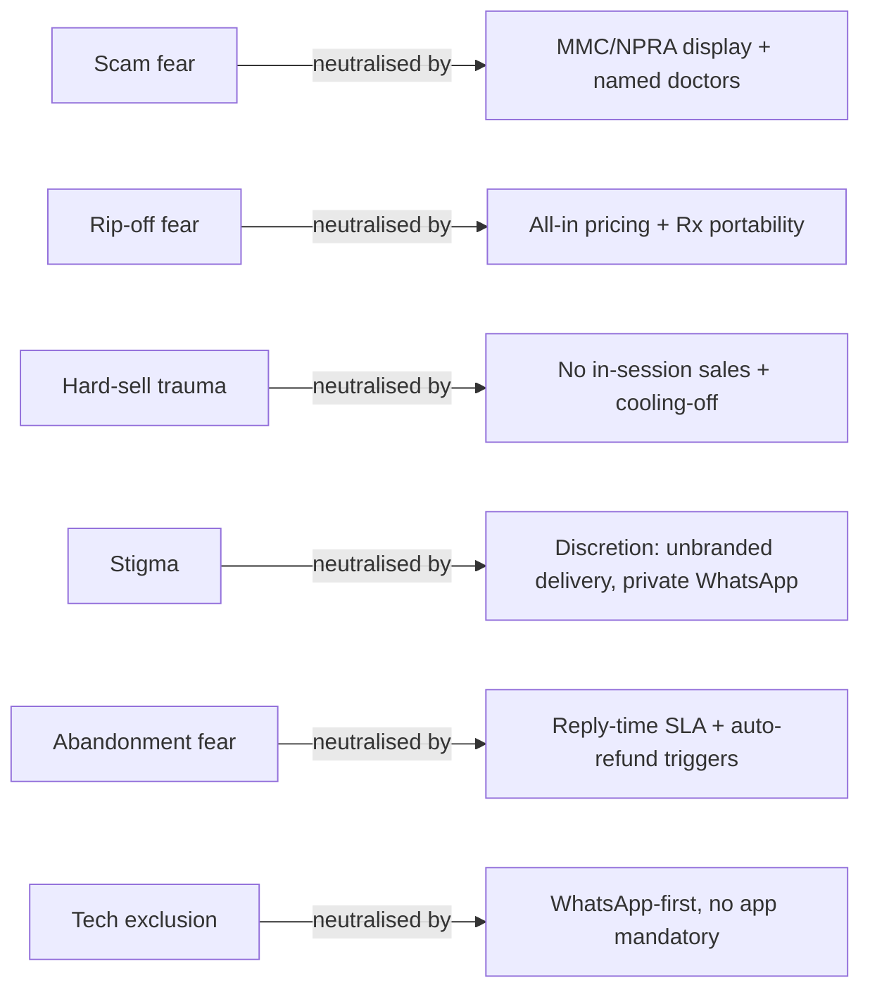

# Patient Sentiment Analysis — Emotional Drivers, Trust Builders and Drop-off Points

**Abstract.** This document converts the review evidence assembled in [review-analysis.md](review-analysis.md) into an emotional and behavioural map: what makes Malaysian patients afraid, what makes them trust, where they abandon the journey, and what they praise unprompted — segmented across weight-loss patients, telehealth users and private-hospital patients. It closes with implications ranked by expected impact on Welltech's product design. Complaint mechanics are catalogued in [recurring-complaints.md](recurring-complaints.md); raw scores in [review-score-comparison.md](review-score-comparison.md).

Last updated: July 2026

---

## 1. Method note

Sentiment here is thematic synthesis, not computational scoring: no API-level access to review corpora was possible in this environment (store pages blocked), so patterns were extracted from review excerpts, complaint records, forum/blog narratives and Malaysian qualitative patient-experience studies. Frequency language is deliberately conservative: "multiple reviewers report" means the pattern appeared across independent sources; single vivid anecdotes are labelled as such. Direct quotes are only those actually observed in cited sources.

## 2. Emotional triggers (negative sentiment drivers)

### 2.1 Fear of scams and fake medicine — the ambient anxiety

The Malaysian state actively teaches consumers to distrust online medicine: MOH's Pharmaceutical Services Programme warns of unregistered products, adulteration with controlled poisons and heavy-metal contamination, and cites research that 95.6% of online pharmacies operate illegally and >90% supply prescription-only medicines without prescription; a Malaysian e-marketplace study found 93.4% of prescription medicines listed were not registered with the Drug Control Authority.[^1][^2][^3] MOH's advice — check NPRA registration, distrust below-market prices — is precisely the checklist anxious patients apply to any new digital-health brand.[^2] Consequence: **a new telehealth/GLP-1 brand starts guilty until proven registered.** DoctorOnCall's most consistent praise theme ("trusted platform… genuine products") shows authenticity reassurance, not convenience, is the first conversion battle.[^4]

### 2.2 Fear of being ripped off

- Hospital corpus: hidden charges (Gleneagles), RM250 for 10 minutes (Pantai), being asked about payment repeatedly (Prince Court), deposit-before-discharge culture.[^5][^6][^7]
- Telehealth corpus: medication priced above retail with no prescription portability (Doctor Anywhere) reads to reviewers as a designed trap, not an accident.[^8]
- GLP-1 context: monthly costs of RM800–3,200 with clinic-by-clinic price dispersion and no published comparison baseline amplify the suspicion; third-party price-tracker pages exist precisely because patients don't trust single-clinic quotes.[^9][^10]

### 2.3 Fear of the hard sell — category trauma in weight loss

The slimming-centre industry conditioned Malaysian (and Singaporean) women to expect that any weight-loss "free trial" ends in a pressure script. Documented patterns: consultants pushing packages before treatment starts, guilt lines about savings and deposits, body-shaming to close ("ridiculed me with my body size"), alleged scale manipulation, and refusal of meaningful refunds.[^11][^12][^13][^14] NCCC logged 6,925 wellness/aesthetic-centre complaints in 2015–2017 with ~10 women losing >RM2M combined.[^15] **Every weight-loss entrant inherits this defensive crouch**: prospective patients arrive braced to say no.

### 2.4 Stigma and judgement — the silent churn driver for weight patients

Malaysian qualitative research documents obesity patients experiencing blame, discrimination and shame in ordinary healthcare settings; practitioners acknowledge short consult times crowd out weight conversations; and — critical for GLP-1 product design — working adults report **hiding weight-loss medication because visible use signals failed self-control**.[^16][^17][^18] CodeBlue's 2025 framing ("a disease, not a moral failure") indicates the public conversation is only now shifting.[^19] Discretion is therefore a product feature: unbranded packaging, private WhatsApp channels, no waiting-room exposure.

### 2.5 Abandonment after payment

Across DA, DoctorOnCall and Speedoc, the sharpest negative reviews are not about the failure itself but about silence afterwards — days-unanswered tickets, unreachable customer service, unanswered billing phones.[^8][^4][^20] Sentiment mechanics: patients forgive operational failure at roughly the rate the provider communicates; they punish silence disproportionately.

### 2.6 Technology distrust and exclusion — the quiet trigger

The Malaysian telehealth satisfaction literature shows older users encountering technical difficulties at materially higher rates, and geriatric telemedicine adoption depending on facilitated onboarding.[^30][^32] Review corpora confirm the mechanism from the other side: Naluri's crash/keyboard bugs and Doctor2U's forced-app-install complaints hit hardest for users with least app fluency.[^33][^34] Since Welltech's longevity and chronic-metabolic segments skew older, an app-mandatory journey imports this trigger wholesale; WhatsApp-first design substantially removes it (WhatsApp is the one interface this cohort already trusts). *(inference from the cited adoption studies)*

### 2.7 Trigger summary table

| Trigger | Primary segment | Intensity | Welltech exposure if unaddressed |
|---|---|---|---|
| Scam/fake-medicine fear | All online-health users | High, state-reinforced[^1] | Fatal at acquisition — visitors bounce before first consult |
| Rip-off fear | Hospital + telehealth | High[^5][^8] | Erodes conversion at payment step |
| Hard-sell trauma | Weight-loss | Very high, category-defining[^11][^15] | Fatal for weight vertical — inherited before first contact |
| Stigma/judgement | Weight-loss, mental health | High but hidden[^16][^17] | Silent non-signup; never appears in Welltech's own feedback |
| Post-payment abandonment | All | High[^4][^8] | Converts operational hiccups into permanent public record |
| Tech exclusion | Older/chronic | Medium[^30] | Caps addressable market for longevity vertical |

## 3. Trust builders (positive sentiment drivers)

| Trust builder | Evidence that it works | Who exploits it today |
|---|---|---|
| Named, MMC-registered doctors | DoctorOnCall's own trust copy leads with MMC registration + 5-year minimum experience; blog reviewers repeat it back verbatim — proof the message lands[^4][^21] | DoctorOnCall, Speedoc (MMC-registered house-call doctors)[^22] |
| MOH/NPRA proximity signals | MySejahtera/MOH association is the backbone of DoctorOnCall's and DOC2US's legitimacy (per [dossiers](../20-competitor-dossiers/doctoroncall.md)); MOH's own advice tells consumers to look for these anchors[^2] | Incumbents with COVID-era halo |
| Speed kept as promised | Speedoc's best reviews are time-stamped brags: swab in 4 hours, meds in 30 minutes, same-day consult+delivery[^20][^23] | Speedoc; DA's "<5 minutes to a doctor" veterans[^8] |
| Verification rituals | Doctor2U's Rx-photo + IC-match + signature flow is described in service terms and respected by users — safety theatre that reads as care[^24] | Doctor2U |
| Human warmth documented | "Pleasant and caring" house-call doctors (Speedoc), "friendly" coaches (Naluri), praised nurses (Sunway, Prince Court) are the most-quoted positives in each corpus[^20][^25][^26] | Everyone, inconsistently |
| Solicited review flywheel | Alpro's 4.8★/hundreds-per-outlet Birdeye machine converts routine service into public proof[^27] | Alpro only |
| Published, flat pricing | RM19.99 flat consult is cited by reviewers as the reason to try DoctorOnCall[^21] | DoctorOnCall (consults only — not meds) |
| Transparency infrastructure | Sunway Cancer Centre publishes real-time patient feedback — unique in the market and noted in its reputation record[^28] | Sunway |

### 3.1 Hierarchy of trust proofs *(analysis)*

The corpus implies an ordering — each layer only persuades if the layer beneath it is already in place:

1. **Legal existence** — MOH/MMC/NPRA verifiability. Absent this, nothing else registers (the scam prior wins).[^1][^2]
2. **Named humans** — a doctor with a name, face and registration number. DoctorOnCall's marketing and Speedoc's house-call disclosures both work at this layer.[^21][^22]
3. **Kept promises** — the first delivery on time, the first reply within the stated window. Speedoc's time-stamped praise shows this is where loyalty forms.[^20]
4. **Recovery behaviour** — how the first failure is handled. This is where every incumbent leaks trust (see §2.5) and where reviews are actually written.
5. **Social proof at volume** — Alpro-style review mass. Only valuable once layers 1–4 generate genuine material.[^27]

Incumbents compete at layers 1–2 and neglect 3–5. Layer 4 is the cheapest differentiation available because it monetises events that will happen anyway.

### 3.2 Mapping triggers to builders

## 4. Drop-off points in the journey

| Stage (per [review-analysis.md](review-analysis.md) §3) | Drop-off mechanism | Sentiment signature |
|---|---|---|
| S1→S2 | Legitimacy check fails (no registration visible, price too good, Trustpilot search returns a UK company) | Silent abandonment — invisible in reviews, visible in the thin corpora |
| S2→S3 | Doctor no-show / 15–20 min matching wait (DA); GL counter queue (KPJ, Pantai) | "Waste of consultation fee"; anger at voided appointments[^8] |
| S3→S4 | Rushed consult ends in forced on-platform purchase (DA) | Feeling processed, not treated[^8] |
| S4→S5 | Delivery misses promise by days-to-weeks (DoctorOnCall) | Broken-promise language; switching statements[^4] |
| S5 | No follow-up exists anywhere in the market | No sentiment at all — the stage is absent from review corpora; churn is silent |
| S6 | Refund stalls (4 months, Gleneagles) or is refused by policy (slimming) | The most viral, most permanent negative reviews[^5][^13] |
| Weight-specific | First hard-sell cue at any point | Immediate exit + warn-others behaviour (blogs, forums, complaint boards exist largely to warn)[^11][^12] |

## 5. Praise themes — what patients volunteer when it works

1. **Time given back** — the single most common positive across telehealth ("no queue", "did not have to travel"), home care (same-day everything) and pharmacies (3-hour delivery).[^8][^20][^29]
2. **Being treated kindly at a vulnerable moment** — nurses and house-call doctors get named-person praise; warmth is remembered longer than competence.[^20][^26]
3. **It simply worked** — fast delivery, genuine product, smooth end-to-end journeys (Sunway City's "registration to chemotherapy to billing, everything went smoothly").[^25]
4. **Affordability with legitimacy** — RM19.99 real-doctor consults; Alpro's free-ish Minute Consult screenings drawing hundreds of grateful reviews.[^21][^27]

## 6. Segment-level sentiment differences

| Dimension | Weight-loss patients | Telehealth users | Private-hospital patients |
|---|---|---|---|
| Default emotional state | Defensive (scam + stigma priors)[^11][^16] | Pragmatic, convenience-seeking[^30] | Entitled-anxious (paying premium, fearing bill)[^5][^7] |
| Primary fear | Hard sell, judgement, visible failure[^13][^17] | Fake/ineffective consult, med markup[^8] | Bill shock, GL limbo, queue-despite-appointment[^6][^7] |
| Trust proof required | No-pressure guarantee, discretion, medical (not beauty) framing | Registration, named doctor, flat price | Doctor reputation; the machine is tolerated for the doctor |
| Loudest praise when won | Results + dignity ("didn't judge me") *(inference from qualitative studies)*[^16] | Speed ("doctor in 5 minutes")[^8] | Named-nurse/doctor gratitude[^26] |
| Review behaviour | Warns publicly, praises privately — complaint boards dominate | Reviews in app stores, moderate volume | Reviews on Maps in volume; angry tail is billing-led |
| Willingness to pay signal | High (RM800–3,200/month GLP-1 spend exists)[^9] | Price-anchored low (RM15–30 consults)[^21] | High but conditional on perceived fairness |

**Cross-segment note:** the Malaysian telehealth satisfaction literature confirms the pragmatist profile — high satisfaction driven by convenience and scheduling, with older users hitting technical friction and ~25% carrying privacy concerns — meaning privacy assurance is a minority-but-material trust lever, especially for weight and mental-health use cases where the data is sensitive.[^30]

### 6.1 Sub-segment: mental-health and coaching users (Naluri corpus)

Distinct from all three main segments: these users praise **relationship continuity** (a coach who replies within 24h and remembers context) and punish **interface failure** hardest, because the app *is* the therapeutic channel — a crash mid-journal is not friction, it is treatment interruption.[^33] Privacy sensitivity is also highest here (employer-paid access creates a "will my company see this?" anxiety the review corpus hints at and the satisfaction literature's 25% privacy-concern figure supports).[^30] For Welltech's behavioural layer around GLP-1 care, the lesson transfers directly: the coaching channel must be the most reliable and most explicitly confidential surface in the product, not the most feature-rich.

### 6.2 Language and tone notes for Malaysian review corpora *(observational)*

- Complaint narratives are written in English far more often than praise, which frequently appears in Malay or Manglish — English-only sentiment scans overweight negativity. Multilingual monitoring is required for a true read.
- "Recommend/tak recommend" verdict framing and warn-others intent ("jangan sign up") dominate slimming-centre complaints — reviewers see themselves as protecting the next victim, which is why these reviews are long, detailed and durable in search.
- Named-staff praise ("Nurse X was so caring") is the strongest positive pattern across hospital corpora — individual recognition, not brand loyalty. A provider that surfaces and celebrates named staff gives patients the exact vocabulary they already want to use.

## 7. Implications for Welltech — ranked

1. **(Highest impact) Build the anti-hard-sell weight programme and say so structurally, not rhetorically.** No packages sold in-session, cooling-off periods, non-commissioned clinicians, published refund policy. The category's complaint record (NCCC, tribunal case law, ComplaintsBoard) is a ready-made "what we will never do" manifesto that directly neutralises the dominant emotional trigger.[^11][^13][^15]
2. **Lead every surface with verifiable legitimacy.** MMC numbers, NPRA-checkable products, named doctors with photos, MOH registration display. This is the entry ticket the state's own scam education has made mandatory.[^1][^2]
3. **Make prescription portability a headline feature.** DA's med-markup lock-in is the most-cited structural complaint in Malaysian telehealth; "your prescription is yours — fill it anywhere" converts an incumbent's margin engine into Welltech's trust engine.[^8]
4. **Engineer the silence out of failure.** SLA-clocked WhatsApp responses, proactive delay notifications, auto-refund triggers. Reviews show patients punish silence, not error — service recovery is the cheapest sentiment lever in the corpus.[^4][^8][^20]
5. **Design for discretion in weight care.** Unbranded delivery, no public waiting rooms, private channels — because patients demonstrably hide GLP-1 use and fear judgement.[^17]
6. **Run an Alpro-style review flywheel from day one.** Malaysian patients leave reviews in volume when asked at the moment of service; the GLP-1/longevity category has zero incumbent review equity to displace.[^27]
7. **Own the empty follow-up stage.** No provider's reviews mention proactive aftercare; continuity is uncontested sentiment territory and the natural home of a WhatsApp-first model. *(inference from corpus absence)*
8. **(Defensive) Claim brand search surfaces early** — Trustpilot page, Google Business profiles, FAQ content that disambiguates from foreign namesakes — so the first review-shaped result about Welltech is one Welltech seeded.[^31]

---

## References

[^1]: MOH Pharmaceutical Services Programme, "Risk of purchasing medications via Internet", https://pharmacy.moh.gov.my/en/content/risk-purchasing-medications-internet.html (accessed July 2026).
[^2]: MOH Pharmaceutical Services Programme, "Tips on how to buy medicines online", https://pharmacy.moh.gov.my/en/content/tips-how-buy-medicines-online.html (accessed July 2026).
[^3]: Malaysian Journal of Pharmacy, "Patterns of Prescription Medicines Sale Through E-Marketplace in Malaysia and Associating Factors", https://mjpharm.org/patterns-of-prescription-medicines-sale-through-e-marketplace-in-malaysia-and-associating-factors/ (accessed July 2026).
[^4]: Google Play, "DoctorOnCall: Online Pharmacy" listing and review themes, https://play.google.com/store/apps/details?id=com.doctoroncall.pharmacy (accessed July 2026); delivery/trust themes per [DoctorOnCall dossier](../20-competitor-dossiers/doctoroncall.md) §8.
[^5]: iBanding, "Customer Reviews for Gleneagles Hospital Kuala Lumpur", https://review.ibanding.com/company/gleneagles-hospital-kuala-lumpur (accessed July 2026).
[^6]: Top-Rated.Online, "Pantai Hospital Kuala Lumpur — reviews", https://www.top-rated.online/cities/Kuala+Lumpur/place/p/4295702/Pantai+Hospital+Kuala+Lumpur (accessed July 2026).
[^7]: Trustburn, "PRINCE COURT Reviews/Feedback", https://trustburn.com/reviews/prince-court (accessed July 2026).
[^8]: Apple App Store (SG), "Doctor Anywhere: Healthcare — Ratings & Reviews", https://apps.apple.com/sg/app/doctor-anywhere-healthcare/id1273714922?see-all=reviews&platform=iphone (accessed July 2026).
[^9]: Peak Protocol, "Weight Loss Injection Prices Malaysia 2026 (updated monthly)", https://peakprotocolmy.com/glp-1/weight-loss-injection-prices-malaysia/ (accessed July 2026).
[^10]: Her Clinic, "Mounjaro Price Malaysia: monthly cost, dosage guide", https://herclinic.my/blogs/mounjaro-price-malaysia-2025/ (accessed July 2026).
[^11]: ComplaintsBoard, "London Weight Management Review: pushy sales consultants", https://www.complaintsboard.com/london-weight-management-pushy-sales-consultants-c483950 (accessed July 2026).
[^12]: sgforums, "London Weight Management Woes", https://sgforums.com/forums/8/topics/248313/2/ (accessed July 2026).
[^13]: ComplaintsBoard, "London Weight Management Reviews — 1.7★, 36 complaints", https://www.complaintsboard.com/london-weight-management-b128986 (accessed July 2026).
[^14]: ComplaintsBoard, "London Weight Management Review: they cheated on my scale", https://www.complaintsboard.com/london-weight-management-they-cheated-on-my-scale-c464920 (accessed July 2026).
[^15]: FOMCA/NST via NCCC, "Victims face financial ruin, emotional trauma and physical scars" (6,925 wellness/aesthetic complaints 2015–2017), https://www.fomca.org.my/v1/index.php/fomca-di-pentas-media/727-nst-victims-face-financial-ruin-emotional-trauma-and-physical-scars-shabana-naseer-ahmad-senior-legal-advisor-nccc (accessed July 2026).
[^16]: PMC, "Patients' experience of accessing healthcare for obesity in Peninsular Malaysia: a qualitative descriptive study", https://pmc.ncbi.nlm.nih.gov/articles/PMC10668280/ (accessed July 2026).
[^17]: PMC, "What is it like to live with obesity in Peninsular Malaysia? A qualitative study" (medication concealment; shame themes), https://pmc.ncbi.nlm.nih.gov/articles/PMC9541318/ (accessed July 2026).
[^18]: BMC Health Services Research, "The perceptions of healthcare practitioners on obesity management in Peninsular Malaysia: a cross-sectional survey", https://bmchealthservres.biomedcentral.com/articles/10.1186/s12913-023-09759-z (accessed July 2026).
[^19]: CodeBlue (Galen Centre), "Obesity In Malaysia: A Disease, Not A Moral Failure" (Sep 2025), https://codeblue.galencentre.org/2025/09/obesity-in-malaysia-a-disease-not-a-moral-failure/ (accessed July 2026).
[^20]: Top-Rated.Online, "Speedoc (Kuala Lumpur) Reviews", https://top-rated.online/cities/Kuala+Lumpur/place/p/9306855/Speedoc+(Kuala+Lumpur) (accessed July 2026).
[^21]: Sebrinah Yeo, "DoctorOnCall.com.my — First Tele-Health in Malaysia" (RM20 flat consult; MMC framing), https://www.sebrinahyeo.com/2017/09/doctor-on-call-first-tele-health-in-malaysia.html (accessed July 2026); Yanrula review corroborates, http://yanrula.blogspot.com/2017/06/review-doctor-on-net-doctor-on-call.html.
[^22]: Speedoc (MY), "House Call Doctor in Malaysia" (MMC registration disclosure; from RM200/visit), https://my.speedoc.com/en/services/house-call-doctors (accessed July 2026).
[^23]: Apple App Store (SG), "Speedoc: Virtual Hospital App", https://apps.apple.com/sg/app/speedoc-care-comes-to-you/id1288838601 (accessed July 2026).
[^24]: Doctor2U, "Medication Delivery" (Rx verification flow), https://www.doctor2u.my/medication-delivery/ (accessed July 2026).
[^25]: iBanding, "Customer Reviews for Sunway Medical Centre", https://review.ibanding.com/company/sunway-medical-centre (accessed July 2026).
[^26]: Wupdoc, "Prince Court Medical Centre — 19 reviews" (nursing praise), https://www.wupdoc.com/all-reviews/malaysia/prince-court-medical-centre-d-00000000034D (accessed July 2026).
[^27]: Birdeye, "ALPRO Pharmacy Temerloh - Minute Consult — 327 reviews" (and sibling outlet pages at 4.8★), https://reviews.birdeye.com/alpro-pharmacy-temerloh-minute-consult-177472455351916 (accessed July 2026).
[^28]: Sunway Cancer Centre, "Real-time Patient Feedback", https://www.sunwaycancercentre.com/en/real-time-patient-feedback/ (accessed July 2026).
[^29]: Esyms, "Pharmacy Delivery" (3-hour Klang Valley express), https://esyms.com/pharmacy-delivery (accessed July 2026).
[^30]: JSM Computer Science and Engineering, "An In-Depth Analysis of Patient Satisfaction and the Multifaceted Challenges Encountered in the Utilization of E-Health Platforms in Malaysia: A Telehealth Case Study" (convenience-led satisfaction; ~25% privacy concerns; older-user friction), https://www.jscimedcentral.com/jounal-article-info/JSM-Computer-Science-and-Engineering/An-In-Depth-Analysis-of-Patient-Satisfaction-and-the-Multifaceted-Challenges-Encountered-in-the-Utilization-of-E-Health-Platforms-in-Malaysia-A-Telehealth-Case-Study-12314 (accessed July 2026).
[^31]: Trustpilot, "Doctorcall (doctorcall.co.uk)" and "Doctor Care Anywhere (doctorcareanywhere.com)" — unrelated UK companies polluting Malaysian brand searches, https://www.trustpilot.com/review/doctorcall.co.uk and https://www.trustpilot.com/review/doctorcareanywhere.com (accessed July 2026).
