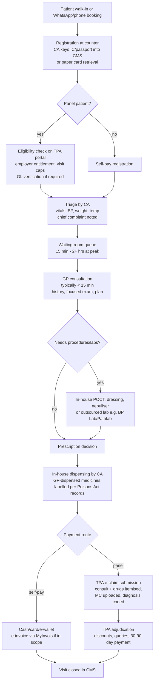

# Malaysian Doctor Workflows: How Private GPs and Telehealth Doctors Actually Work

**Abstract.** This document reconstructs the working day of the clinicians Welltech must recruit: Malaysia's ~12,000 private GP clinics and the telehealth doctors layered on top of them. The evidence shows a profession running at industrial throughput on artisanal economics: primary care doctors averaging ~40 consultations a day at under 15 minutes each, a consultation fee schedule frozen at RM10–35 from 1992 until April 2026, ~70% of urban GP patients arriving through third-party administrator (TPA) panels that deduct 10–15% of the professional fee and impose onboarding charges up to RM5,000, private locum rates clearing at RM40–60/hour, and a public-sector contract-doctor crisis (Hartal Doktor Kontrak) that pushed 6,417 medical officers out of government service between 2019 and 2023 — the supply pool Welltech recruits from. We map the standard clinic consult flow (registration → triage → consult → dispensing → payment), quantify volumes, consult duration, locum economics, panel/TPA paperwork, the clinic-software landscape, after-hours WhatsApp burden, and income data. Companion analyses: [prescribing models](prescribing-models.md), [teleconsultation anatomy](telehealth-consultation-analysis.md), and the synthesis in [clinician pain points](clinician-pain-points.md).

**Last updated: July 2026.**

Related documents: [Malaysia regulations](../10-market-intelligence/malaysia-regulations.md) · [Malaysia telehealth deep dive](../10-market-intelligence/malaysia-telehealth.md) · [WhatsApp healthcare](../10-market-intelligence/malaysia-whatsapp-healthcare.md) · [Clinician pain points](clinician-pain-points.md)

---

## 1. Executive snapshot

| Dimension | Finding | Confidence |
|---|---|---|
| GP clinic universe | >12,000 private GP clinics nationwide (MMA, 2025)[^1] | High |
| Daily volume | ~40 consultations/day average in primary care; public mega-clinics up to 1,000 attendances/day; Madani panel target of 1,000 patients/month ≈ 50/day called "lofty" by FPMPAM[^2][^3][^4] | High |
| Consult duration | <15 minutes typical (QUALICOPC-era data); fee tiers historically pegged to consult length | High |
| Consultation fee | RM10–35 (Schedule 7, PHFSA) from 1992/2006 until the 2 April 2026 revision to RM10–80[^5][^6][^7] | High |
| Locum market | Private clinic locums RM40–60/hour standard; MOH locum allowance RM80/hour (Feb 2024) reset expectations upward[^8][^9][^10] | High |
| TPA dependence | ~70% of GP patients arrive via TPA/panel arrangements; TPAs deduct 10–15% of professional fees; onboarding fees up to RM5,000[^11][^12] | High |
| Income | Private GP employee average ~RM10,000–10,650/month; junior public MOs from ~RM3,500/month[^13][^14][^15] | Medium (survey-based) |
| Workforce stress | 25–30% burnout among medical officers; 6,417 public medical officers (incl. >1,000 specialists) resigned 2019–2023[^16][^17] | High |

**Implications for Welltech.** Every element of Welltech's doctor-facing product should be priced and designed against three reference numbers: the RM40–60/hour locum clearing rate (the opportunity cost of a GP's hour), the <15-minute consult norm (the unit of clinical work doctors are calibrated to), and the 10–15% TPA skim plus unpaid administration (the deadweight Welltech can eliminate and monetise as goodwill).

---

## 2. The current-state clinic workflow

### 2.1 Standard private GP clinic consult flow

The modal Malaysian private GP clinic is a 1–2 doctor shopfront operation with 2–4 clinic assistants (CAs), open ~9am–9pm or split shifts, dispensing its own medicines (see [prescribing models §2](prescribing-models.md)). The flow below is the composite standard documented across panel-clinic guides, TPA onboarding materials and clinic-software vendor workflow descriptions.[^11][^18][^19]

Key operational facts behind the diagram:

- **Registration and triage are CA work**, but panel-eligibility checking is a genuine bottleneck: each TPA runs its own portal (eMedilink's ECCS, PMCare, MiCare, etc.), so a clinic on 15–30 panels juggles that many logins, entitlement rule-sets and claim formats.[^11][^18]
- **The consult itself is the smallest time block in the visit.** With ~40 patients/day against 8–10 clinical hours, the arithmetic forces sub-15-minute consultations; Malaysian GP fee guidance historically tiered fees by consult length, institutionalising the short consult.[^2][^20]
- **Dispensing is integral, not adjacent**: the medicine sale happens inside the visit and inside the clinic P&L. This is why fee stagnation was survivable — margin migrated to drugs (analysis in [prescribing-models.md §2](prescribing-models.md)).[^21]
- **Payment splits the workflow.** Self-pay closes in minutes; panel visits generate a claims tail (submission, TPA queries, discounting, 30–90 day receivables) that continues long after the patient leaves. *(analyst inference from TPA claim-cycle documentation and MMA statements; no published Malaysian time-and-motion study of GP claims administration exists)*[^11][^12]

### 2.2 Volumes: what "busy" means in Malaysian primary care

| Setting | Volume evidence |
|---|---|
| Primary care average | ~40 consultations/doctor/day, <15 min each (QUALICOPC-era reporting)[^2] |
| Public Klinik Kesihatan | Largest clinics reach ~1,000 outpatient attendances/day; smallest <50/day[^3] |
| Private GP composite | One private clinic head reported ~600 patients/month solo (9–5 weekdays + half-day Saturday) ≈ 25–30/day[^4] |
| Madani Medical Scheme target | 1,000 sponsored patients/month/clinic ≈ 50/day over 20 working days — FPMPAM called the target unrealistic for solo GPs[^4] |

The QUALICOPC Malaysia study (2015–16, 239 private practitioners responding) remains the only internationally comparable dataset on Malaysian GP working conditions; it found Malaysian primary care doctors carrying among the highest consultation loads in the 34-country study while private GPs reported higher job satisfaction than public counterparts — satisfaction driven by autonomy, not by workload relief.[^2][^22]

---

### 2.3 A composite working day (clinic GP vs platform telehealth doctor)

*(analyst composite from the workflow, locum-market and platform evidence in this document and [telehealth-consultation-analysis.md](telehealth-consultation-analysis.md))*

| Time block | Clinic GP (panel-heavy urban clinic) | Platform telehealth doctor (moonlighting MO/GP) |
|---|---|---|
| 08:30–09:00 | Open clinic; CA reconciles yesterday's panel claims; doctor reviews pending TPA queries | Log into platform queue before hospital shift; 1–2 consults if queue moves |
| 09:00–13:00 | 15–25 patients; ~10–15 min each; MCs, panel eligibility interruptions | (Day job) |
| 13:00–14:00 | Lunch punctuated by WhatsApp: results questions, refill requests | (Day job) |
| 14:00–18:00 | 10–20 more patients; drug-stock decisions; rep visits; sign off claims batch | (Day job) |
| 18:00–21:00 | Evening peak (workers after office hours); densest MC/URTI load | Peak platform queue: 2–4 consults/hour if demand is good |
| 21:00–23:00 | Close till; e-invoice run; unfinished clinical notes; WhatsApp follow-ups | Late-night queue thins; effective RM/hour collapses; log off |
| Unpaid throughout | Panel portal administration, GL coordination, WhatsApp triage | Documentation per consult; indemnity/compliance self-management |

Two observations follow. First, the clinic GP's day contains roughly 2–3 hours of work that generates no revenue line — claims administration, portal work, after-hours messaging — which is precisely the layer AI can absorb. Second, the moonlighting telehealth doctor's earnings are hostage to queue volatility: the platform bears no idle-time cost, the doctor bears all of it. Both facts are load-bearing for the [doctor value proposition](clinician-pain-points.md).

---

## 3. Consultation economics: the 34-year fee freeze and its April 2026 thaw

- The RM10–35 GP consultation fee band was proposed by the MMA in **1992** and codified into the **Seventh Schedule** of the PHFSA regulations in 2006 — then left untouched for over three decades while rents, wages and drug-acquisition costs compounded.[^5][^6]
- Doctors' groups demanded correction to RM50–150 (FPMPAM, March 2025) and RM40–125 (GP town hall, October 2025); the MMA argued anything below RM50 was uneconomic.[^7][^23][^24]
- **Budget 2026 / October 2025:** government confirmed the ceiling would rise to RM80 with the RM10 floor retained "for the uninsured"; the amended Schedule 7 took effect **2 April 2026**. MMA welcomed it as overdue reinforcement of primary care.[^6][^25][^26]
- The floor-retention detail matters: TPAs and price-sensitive walk-ins anchor on the floor, so the revision's realised uplift depends on each clinic's payer mix — clinics with 70% panel volume may see little change until TPA contracts reprice. *(analyst inference)*[^11][^12]
- Simultaneously, cost lines worsened: 6% SST touches clinic inputs and foreign-worker patient billing (July 2025), and LHDN e-invoicing captured clinics above RM500K turnover from 1 July 2025, with universal coverage from 1 July 2026.[^27][^28]

**Implications for Welltech.** The fee thaw raises the reference price for a "proper" GP consult toward RM50–80 exactly as Welltech launches — supporting premium teleconsult pricing (see WTP evidence of RM58–78 in [malaysia-telehealth.md §4](../10-market-intelligence/malaysia-telehealth.md)) and making a fair per-consult doctor payout both affordable and differentiating.

---

## 4. Locum economics: the spot price of a GP hour

Locum work is the liquid market that reveals what Malaysian GP time actually trades at:

| Rate | Context | Source |
|---|---|---|
| RM40/hour minimum | Standard floor on locum apps for private clinic shifts; surge pricing above at peak/undersupplied slots | Malaysian Medical Resources review of locum apps; LocumLah/LocumMY listings RM40–50/hour across KL, Shah Alam, Semenyih, Pasir Gudang[^8][^9][^29] |
| RM40–60/hour | Typical private GP locum band, Klang Valley *(analyst synthesis of listing ranges; Glassdoor KL locum salary data corroborates order of magnitude)*[^10] | |
| RM80/hour | MOH locum allowance for medical officers working extended hours/weekends/public holidays at government facilities, announced February 2024 — a public-sector benchmark that dragged private expectations upward | Health Minister announcement[^30][^31] |
| RM9.16/hour equivalent | The decade-stagnant public on-call allowance MMA campaigned against (demanding RM25/hour); Budget 2026 granted a 40% on-call hike | MMA; Budget 2026 coverage[^32][^25] |

Structural features of the locum market:

- **Platformised and transparent.** LocumLah, LocumMY and Facebook groups (e.g., Malaysian Doctors Club Locum Network) clear shifts with posted hourly rates — doctors comparison-shop hours the way gig workers do.[^9][^29][^33]
- **A 10-hour Saturday locum ≈ RM400–600 gross.** This is the number a telehealth platform's per-consult payout is silently benchmarked against by every moonlighting doctor. Per-consult platform rates that net below ~RM40–50/hour of active consulting lose the comparison (see [telehealth-consultation-analysis.md §4](telehealth-consultation-analysis.md)).
- **Locum supply is fed by the contract-doctor crisis** (§7): junior doctors on insecure government contracts locum to top up ~RM3,500/month base salaries, and many convert to full-time private/locum portfolios on exit.[^14][^17]

---

## 5. Panel/TPA workload: the paperwork tax

The managed-care layer is the single most resented workflow element in Malaysian general practice:

- **Dependence:** ~70% of GP patients come through TPAs acting for corporates, GLCs and insurers (MMA/GP-town-hall figures; 65% cited in 2025 MMA statements).[^11][^12][^24]
- **Extraction:** TPAs commonly deduct **10–15% of the doctor's professional fee**, charge registration and annual renewal fees, and some demand onboarding fees up to **RM5,000** per clinic; CodeBlue's November 2025 exposé documented "double-dipping" — charging both the corporate client and the clinic.[^12]
- **Workflow burden:** each panel has its own eligibility portal, claim format, itemisation rules, MC documentation requirements, drug formularies (including 2025 generic-only directives that MMA protested), and query/audit cycles; claims are paid on 30–90 day terms with unilateral discounting.[^11][^34][^35]
- **Guarantee letters (GLs):** for referrals and hospital admissions, GL issuance/verification adds hours of delay per case (up to six hours reported at hospital level) and clinics carry the coordination burden without compensation; 2025 TPA directives even instructed panels on anaesthesia choice, which MMA/APHM condemned as clinical interference.[^36][^37]
- **Public-scheme claims:** Madani Medical Scheme (SPM) claims run through ProtectHealth's PRIMIS portal — consult fee capped at RM30 (raised to RM35 after protest), consultation+medication capped at RM60 (later RM70)/visit — with GPs publicly calling the rates loss-making for complex cases.[^38][^39][^40]
- **Regulatory catch-up:** TPAs remain unregulated by statute after ~30 years of MMA complaints; MOH began compiling a mandatory national MCO/TPA registry (submissions due 31 January 2026), and the MMC banned fee-splitting arrangements between doctors and hospitals/insurers/TPAs in May 2026 — early signs the extraction model is under pressure.[^34][^41][^42]

**Implications for Welltech.** The TPA experience defines what doctors expect from any intermediary: fee skims, portal fatigue, and payment delay. Welltech's doctor proposition should be engineered as the anti-TPA — same-week settlement, zero onboarding fees, one interface, no clawbacks — and marketed explicitly in those terms (see [clinician-pain-points.md §5](clinician-pain-points.md)).

---

## 6. The clinic software / EMR landscape

Malaysian private primary care runs on a fragmented, low-ARPU clinic-management-system (CMS) market; full EMR adoption is partial and paper cards persist in older clinics. Verified vendors marketing to Malaysian GP clinics:

| Vendor | Type | Notes |
|---|---|---|
| kumoDoc | Cloud CMS, MY-built | Appointments, EMR, inventory, staffing; ISO/IEC 27001:2022 certified[^19] |
| Desk.clinic | Cloud CMS | GP-clinic focus, Malaysia landing page[^43] |
| Curo | Cloud CMS | Publishes MY buyer's guides; e-invoice-ready positioning[^44] |
| MocDoc | Hospital/clinic CMS (regional) | EMR, e-prescription, billing for GP/specialist clinics[^45] |
| My Clinic (myclinichealthcare) | Cloud CMS | Records, billing, stock, body charts[^46] |
| Clinica ERP | Clinic ERP, MY | Multi-branch, inventory, analytics[^47] |
| DocsPe | CMS | Markets to MY doctors[^48] |
| Easy Clinic | CMS (regional) | Specialty EMR templates; AI-assisted prescriptions[^49] |
| iMedic | Device-integrated EMR/RPM | Chronic-disease telemonitoring; used in SG+MY (see [telehealth deep dive §5](../10-market-intelligence/malaysia-telehealth.md)) |

Market dynamics:

- **The forcing function for digitisation is tax, not health**: the LHDN e-invoice mandate (RM500K+ turnover from July 2025; all taxpayers July 2026) is pushing paper clinics onto software; CMS vendors lead marketing with MyInvois compliance rather than clinical features.[^28][^44]
- **No dominant standard**: aggregator listings count 20+ CMS products active in Malaysia; switching costs are low and data portability is poor, so longitudinal records fragment across vendors.[^50]
- **Public sector runs separately** on MOH systems (TPC-OHCIS and the new Cloud-Based Clinical Management System roll-out), with no interoperability bridge to private CMS — the Health White Paper's health-information-exchange ambition remains unbuilt (see [malaysia-telehealth.md §7](../10-market-intelligence/malaysia-telehealth.md)).
- **Consequence for doctors**: double or triple data entry (CMS + TPA portals + PRIMIS for Madani + MyInvois), typically executed by CAs for administrative fields but by the doctor for clinical notes, diagnosis coding and MC issuance. *(analyst inference from portal architecture; consistent with MMA administrative-burden complaints)*[^11][^12]

**Implications for Welltech.** There is no incumbent clinical-record platform Welltech must integrate with — and none that doctors love. A WhatsApp-native, AI-scribed clinical documentation layer (see [60-ai-operating-model](../60-ai-operating-model/)) competes against genuinely weak incumbents, and "we type it for you" is a recruitment feature, not a nicety.

---

## 7. After-hours and WhatsApp burden

Direct Malaysian survey data on after-hours patient messaging is thin; the pattern is established through converging indirect evidence:

- **WhatsApp is the default clinical channel.** Housecall/GP services openly advertise free WhatsApp follow-up as part of the service; clinics take bookings and send results by WhatsApp; WhatsApp reaches 90%+ of Malaysian internet users (see [WhatsApp healthcare](../10-market-intelligence/malaysia-whatsapp-healthcare.md)).[^51]
- **The channel is personal, not institutional.** Patients message the doctor's own number; there is no billing construct for asynchronous advice in the Malaysian fee schedule, so this work is unpaid by design.
- **Medico-legal exposure is recognised**: medical defence organisations warn doctors about clinical information shared on WhatsApp (consent, confidentiality, record-keeping), and none of the mainstream Malaysian CMS products capture WhatsApp threads into the clinical record.[^52]
- **International evidence links asynchronous message load to burnout**: rising patient-portal/message volume is one of three identified mechanisms by which virtual care worsens clinician burnout.[^53]
- *(analyst inference)* For a Malaysian GP with a stable patient base, unpaid WhatsApp triage plausibly consumes 30–90 minutes/day across evenings and weekends; for GLP-1/chronic cohorts (dose questions, side-effects) the per-patient message rate is materially higher than for episodic care. This is unquantified in Malaysian literature — Welltech should treat measuring it (and paying for it) as a first-mover recruiting asset.

---

## 8. Income and workforce context: who is available to recruit

### 8.1 Income benchmarks (state currency/year; survey-grade data, ranges vary)

| Segment | Income | Source/year |
|---|---|---|
| Public junior medical officer (contract) | ~RM3,500/month base | People Matters analysis, 2024–25[^14] |
| Public on-call allowance | ~RM9.16/hour pre-2026; +40% from Budget 2026 | MMA campaign; Budget 2026[^32][^25] |
| Private GP (employed) | ~RM10,000–10,650/month average; mid-career total comp ~RM114K/year | Indeed MY; PayScale, 2025–26[^13][^15] |
| Locum GP | RM40–60/hour spot | LocumLah/LocumMY/locum apps[^8][^9][^29] |
| Private subspecialist | 4–5× government pay; some >RM100K/month | CodeBlue physician account, 2026; forum corroboration[^54][^55] |

### 8.2 The contract-doctor pipeline (Hartal Doktor Kontrak context)

- The 2016 contract system created a two-tier medical workforce: lower pay, weaker benefits, no clear permanency path. Between December 2016 and May 2021 only **3.4% of 23,077 contract medical officers** received permanent MOH appointments.[^16][^56]
- The **26 July 2021 Hartal Doktor Kontrak walkout** (up to ~8,000 junior doctors across 20+ hospitals) and renewed 2023 strike threats made doctor discontent a national political issue.[^16][^57][^58]
- Outflow: **6,417 public medical officers, including >1,000 specialists, left 2019–2023**; one in five doctors offered a permanent public post now declines it; destination options are Singapore/Australia (2–3× pay) or domestic private practice, locum portfolios and digital-health work.[^14][^17][^59]
- The public narrative — 84-hour weeks, RM9/hour on-call, "stop lying that we have enough doctors" — is mainstream discourse on forums and in press, shaping what any employer brand must speak to.[^55][^58]

### 8.3 What the income data implies about recruitability

- **The RM10,000/month private GP average is a blended illusion**: it averages clinic owners (whose income is business profit, dominated by drug margin and panel volume) with employed assistant GPs (typically RM7,000–12,000/month, near the Indeed/PayScale figures). For an employed GP, a Welltech offer of RM100+/clinical hour with zero administration is a direct upgrade; for an owner, the offer is incremental panel income without cannibalising the clinic. *(analyst segmentation)*[^13][^15]
- **The public-private pay gap is widest exactly where Welltech recruits**: a contract MO at ~RM3,500/month base earns less per month than 10 locum shifts pay; the marginal RM/hour of platform work therefore matters intensely to juniors and barely at all to established subspecialists.[^14][^54]
- **Timing tailwind**: the April 2026 fee revision legitimises RM50–80 consult pricing market-wide, which raises the ceiling for what Welltech can pay per teleconsult while remaining unit-economic — the first structural improvement in GP price architecture in 34 years.[^6][^25]

**Implications for Welltech.** Welltech's recruitable pool is (a) contract/former-contract MOs seeking income and dignity, (b) locum-portfolio GPs optimising RM/hour and flexibility, and (c) established private GPs wanting a paid channel for the follow-up work they currently do free on WhatsApp. Each segment prices differently; all three are anti-TPA, anti-paperwork, and fluent in WhatsApp. The value-proposition build is in [clinician-pain-points.md §6](clinician-pain-points.md).

---

## References

[^1]: MMA (letter), "MMA concerned with price transparency's impact on GP clinics", Malaysiakini, https://www.malaysiakini.com/letters/725806 (accessed July 2026).
[^2]: Ab Majid H. et al., "Job satisfaction of public and private primary care physicians in Malaysia: analysis of findings from QUALICO-PC", Human Resources for Health 17:82 (2019), https://human-resources-health.biomedcentral.com/articles/10.1186/s12960-019-0410-4 (accessed July 2026).
[^3]: Ng C.W., "Case study Malaysia", WHO Kobe Centre primary care case study, https://wkc.who.int/docs/librariesprovider24/wkc-projects-documents/2-7-case-study-malaysia.pdf (accessed July 2026).
[^4]: CodeBlue, "FPMPAM Questions 'Lofty' 1,000 Madani Patients Monthly Target Per Clinic" (Sep 2023), https://codeblue.galencentre.org/2023/09/fpmpam-questions-lofty-1000-madani-patients-monthly-target-per-clinic/ (accessed July 2026).
[^5]: Borneo Post, "Medical association welcomes long-overdue review of private clinic consultation fees" (5 Mar 2025), https://www.theborneopost.com/2025/03/05/medical-association-welcomes-long-overdue-review-of-private-clinic-consultation-fees/ (accessed July 2026).
[^6]: Borneo Post, "Revision of GP fees a crucial step to strengthen primary care, says medical association" (2 Apr 2026), https://www.theborneopost.com/2026/04/02/revision-of-gp-fees-a-crucial-step-to-strengthen-primary-care-says-medical-association/ (accessed July 2026).
[^7]: CodeBlue, "Doctors' Group Demands GP Fee 'Correction' To RM50 to RM150" (Mar 2025), https://codeblue.galencentre.org/2025/03/doctors-group-demands-gp-fee-correction-to-rm50-to-rm150/ (accessed July 2026).
[^8]: Malaysian Medical Resources, "Calling all doctors and nurses – get Locum Apps now!" (2020; RM40/hour minimum on locum apps), https://new.medicine.com.my/2020/05/calling-all-doctors-and-nurses-locumapps/ (accessed July 2026).
[^9]: LocumLah — Malaysia locum platform (live listings RM40–50/hour), https://portal.locumlah.com/ (accessed July 2026).
[^10]: Glassdoor, "Locum Doctor, Kuala Lumpur — average pay", https://www.glassdoor.com/Salaries/kuala-lumpur-malaysia-locum-doctor-salary-SRCH_IL.0,21_IM1100_KO22,34.htm (accessed July 2026).
[^11]: Free Malaysia Today, "Third-party administrator problem straining clinics financially, says MMA" (5 Mar 2025), https://www.freemalaysiatoday.com/category/nation/2025/03/05/third-party-administrator-problem-straining-clinics-financially-says-mma (accessed July 2026).
[^12]: Dr James Jeremiah, "The Double-Dipping Scandal: How TPAs Are Exploiting Both Corporations And Clinics", CodeBlue (Nov 2025), https://codeblue.galencentre.org/2025/11/the-double-dipping-scandal-how-tpas-are-exploiting-both-corporations-and-clinics-dr-james-jeremiah/ (accessed July 2026).
[^13]: Indeed Malaysia, "General practitioner salary in Malaysia" (~RM10,650/month average), https://malaysia.indeed.com/career/general-practitioner/salaries (accessed July 2026).
[^14]: People Matters SEA, "Bleeding talent: Why Malaysia's doctors are leaving", https://sea.peoplemattersglobal.com/article/recruiting-and-onboarding/bleeding-talent-why-malaysias-doctors-are-leaving-46877 (accessed July 2026).
[^15]: PayScale, "General Practitioner Salary in Malaysia" (2026), https://www.payscale.com/research/MY/Job=General_Practitioner/Salary (accessed July 2026).
[^16]: Wikipedia, "Hartal Doktor Kontrak", https://en.wikipedia.org/wiki/Hartal_Doktor_Kontrak (accessed July 2026).
[^17]: Yahoo News/agencies, "Why are Malaysian doctors quitting, striking and preferring to work in Singapore?", https://malaysia.news.yahoo.com/malaysian-doctors-quitting-striking-prefer-working-in-singapore-055139472.html (accessed July 2026).
[^18]: Mayflax, "Becoming a Panel Clinic and How Empanelment Works" (ECCS/e-Medilink application flow, APC/Borang B documentation), https://mayflax.com/becoming-a-panel-clinic/ (accessed July 2026).
[^19]: kumoDoc — Clinic Management Software Malaysia, https://www.kumodoc.com/ (accessed July 2026).
[^20]: CodeBlue, "GP Fees Still Depend On Consultation Length Even If Raised, Doctors Say" (2019), https://codeblue.galencentre.org/2019/06/gp-fees-still-depend-on-consultation-length-even-if-raised-doctors-say/ (accessed July 2026).
[^21]: Babar Z. et al., "Trends in the Cost of Medicines, Consultation Fees and Clinic Visits in Malaysia's Private Primary Healthcare System", J Multidiscip Healthc (2023), https://pmc.ncbi.nlm.nih.gov/articles/PMC10284298/ (accessed July 2026).
[^22]: Comparative performance of public and private primary care service delivery in Malaysia (QUALICOPC), PLOS ONE (2022), https://journals.plos.org/plosone/article?id=10.1371/journal.pone.0276480 (accessed July 2026).
[^23]: CodeBlue, "At Town Hall, GPs Demand Fee Revision To RM40 To RM125" (Oct 2025), https://codeblue.galencentre.org/2025/10/at-town-hall-gps-demand-fee-revision-to-rm40-to-rm125/ (accessed July 2026).
[^24]: Scoop, "MMA wants RM50 minimum for GP consultation fees, says RM10 'not enough'", https://www.scoop.my/news/270942/mma-wants-rm50-minimum-for-gp-consultation-fees-says-rm10-hike-not-enough/ (accessed July 2026).
[^25]: CodeBlue, "Budget 2026: Government Doctors Get 40% On-Call Allowance Hike, GPs Get RM80 Consultation Fee" (Oct 2025), https://codeblue.galencentre.org/2025/10/budget-2026-government-doctors-get-40-on-call-allowance-hike-gps-get-rm80-consultation-fee/ (accessed July 2026).
[^26]: Malay Mail, "Health minister says RM10 still the floor price for doctor visits, but ceiling raised to RM80" (11 Oct 2025), https://www.malaymail.com/news/malaysia/2025/10/11/health-minister-says-rm10-still-the-floor-price-for-doctor-visits-but-ceiling-raised-to-rm80/194240 (accessed July 2026).
[^27]: CodeBlue, "SST Punishes GP Clinics, Foreign Patients Mostly 3D Workers: MMA" (Jun 2025), https://codeblue.galencentre.org/2025/06/sst-punishes-gp-clinics-foreign-patients-mostly-3d-workers-mma/ (accessed July 2026).
[^28]: MedicalMet, "LHDN e-Invoice Guide for Clinics Malaysia" (phase dates incl. 1 Jul 2025 >RM500K; 1 Jul 2026 all), https://medicalmet.com/blog/lhdn-e-invoice-complete-guide-clinics/ (accessed July 2026).
[^29]: LocumMY — Platform Locum Malaysia, https://locumclinicmy.com/ (accessed July 2026).
[^30]: Malay Mail, "Health minister says doctors working overtime to get locum allowance immediately, at RM80 an hour" (23 Feb 2024), https://www.malaymail.com/news/malaysia/2024/02/23/health-minister-says-doctors-working-overtime-to-get-locum-allowance-immediately-at-rm80-an-hour/119618 (accessed July 2026).
[^31]: CodeBlue, "Dr Dzul Announces Immediate Payment Of Doctors' Locum Allowance At MOH Facilities" (Feb 2024), https://codeblue.galencentre.org/2024/02/dr-dzul-announces-immediate-payment-of-doctors-locum-allowance-at-moh-facilities/ (accessed July 2026).
[^32]: CodeBlue, "Raise Doctors' On-Call Allowance To RM25 Hourly — Malaysian Medical Association" (Aug 2024), https://codeblue.galencentre.org/2024/08/raise-doctors-on-call-allowance-to-rm25-hourly-malaysian-medical-association/ (accessed July 2026).
[^33]: Malaysian Doctors Club Locum Network (Facebook group), https://www.facebook.com/groups/616565011819403/ (accessed July 2026).
[^34]: CodeBlue, "Health Care Costs Will Rise Further If TPAs Remain Unregulated — MMA" (Jun 2024), https://codeblue.galencentre.org/2024/06/health-care-costs-will-rise-further-if-tpas-remain-unregulated-mma/ (accessed July 2026).
[^35]: Free Malaysia Today, "MMA renews call to regulate 3rd-party administrators after generic-only directive" (26 Sep 2025), https://www.freemalaysiatoday.com/category/nation/2025/09/26/mma-renews-call-to-regulate-3rd-party-administrators-after-generic-only-directive (accessed July 2026).
[^36]: Bowtie, "Malaysia Medical Card Guarantee Letter Application Process" (GL issuance up to ~6 hours), https://gobowtie.com/my/en/blog/malaysia-medical-card-guarantee-letter/ (accessed July 2026).
[^37]: CodeBlue, "TPA Instructs Panel Hospitals To Prioritise Local Over General Anaesthesia" (Oct 2025), https://codeblue.galencentre.org/2025/10/tpa-instructs-panel-hospitals-to-prioritise-local-over-general-anaesthesia/ (accessed July 2026).
[^38]: ProtectHealth, "Skim Perubatan MADANI" (PRIMIS fee-for-service claims), https://protecthealth.com.my/skimperubatanmadani/ (accessed July 2026).
[^39]: CodeBlue, "Madani Medical Scheme Faces Resistance From Underpaid GPs" (Aug 2023), https://codeblue.galencentre.org/2023/08/madani-medical-scheme-faces-resistance-from-underpaid-gps/ (accessed July 2026).
[^40]: CodeBlue, "Madani Medical Scheme's GP Consultation Fee Raised By RM5, Programme Expanded Nationwide" (Sep 2023), https://codeblue.galencentre.org/2023/09/madani-medical-schemes-gp-consultation-fee-raised-by-rm5-programme-expanded-nationwide/ (accessed July 2026).
[^41]: CodeBlue, "Health Ministry Forming National Registry Of MCOs, TPAs" (Nov 2025), https://codeblue.galencentre.org/2025/11/health-ministry-forming-national-registry-of-mcos-tpas/ (accessed July 2026).
[^42]: CodeBlue, "MMC Bans Doctor Fee-Splitting By Hospitals, Insurers, TPAs" (May 2026), https://codeblue.galencentre.org/2026/05/mmc-bans-doctor-fee-splitting-by-hospitals-insurers-tpas/ (accessed July 2026).
[^43]: Desk.clinic, "Clinic Management System Malaysia", https://desk.clinic/malaysia (accessed July 2026).
[^44]: Curo, "Best Clinic Management System Malaysia — Complete Guide", https://curo.com.my/blog/best-clinic-management-system-malaysia (accessed July 2026).
[^45]: MocDoc, "Best Cloud Hospital & Lab Management System in Malaysia", https://mocdoc.com/malaysia (accessed July 2026).
[^46]: My Clinic, "Clinic Management Software", https://www.myclinichealthcare.com/ (accessed July 2026).
[^47]: Clinica, "Clinic Software Malaysia — Smart ERP for Clinics", https://clinica.com.my/clinic-software-malaysia/ (accessed July 2026).
[^48]: DocsPe, "Clinic Management System Malaysia", https://docspe.my/clinic-management-system/ (accessed July 2026).
[^49]: Easy Clinic, "Malaysia", https://www.easyclinic.io/malaysia/ (accessed July 2026).
[^50]: SoftwareSuggest, "20 Best Clinic Management Software in Malaysia", https://www.softwaresuggest.com/clinic-management-software/malaysia (accessed July 2026).
[^51]: GP House Call Malaysia (free WhatsApp/phone follow-up advertised), https://gphousecall.my/ (accessed July 2026).
[^52]: Medical Defence Union, "Doctors warned to be cautious when sharing information on WhatsApp groups", https://www.themdu.com/press-centre/press-releases/doctors-warned-to-be-cautious-when-sharing-information-on-whatsapp-groups-by-mdu (accessed July 2026).
[^53]: Rutgers NJ State Policy Lab, "Telehealth May Worsen Physician Burnout: How to Avoid It", https://policylab.rutgers.edu/publication/telehealth-may-worsen-physician-burnout-how-to-avoid-it/ (accessed July 2026).
[^54]: CodeBlue, "After 15 Years Of Training, This Is What A Subspecialist Doctor Earns In Malaysia — Physician" (Mar 2026), https://codeblue.galencentre.org/2026/03/after-15-years-of-training-this-is-what-a-subspecialist-doctor-earns-in-malaysia-physician/ (accessed July 2026).
[^55]: Lowyat forum, "84-hour Work Week, Low Pay: Malaysia's Doctors" (thread), https://forum.lowyat.net/topic/5527353 (accessed July 2026).
[^56]: PLOS ONE, "Contract doctors' strike in Malaysia: A content analysis of the perception of medical fraternity and stakeholders on Facebook" (2023), https://journals.plos.org/plosone/article?id=10.1371/journal.pone.0292213 (accessed July 2026).
[^57]: The Online Citizen, "Malaysian group claims around 8,000 contract doctors will go on strike in April" (Mar 2023), https://www.theonlinecitizen.com/2023/03/31/malaysian-group-claims-around-8000-contract-doctors-will-go-on-strike-in-april-to-demand-fair-treatment/ (accessed July 2026).
[^58]: CodeBlue, "'Stop Lying To The Public That We Have Enough Doctors': Contract Medical Officer, Perak" (Feb 2023), https://codeblue.galencentre.org/2023/02/stop-lying-to-the-public-that-we-have-enough-doctors-contract-medical-officer-perak/ (accessed July 2026).
[^59]: Malaysiakini (letter), "Finance Ministry, Public Service Department also liable for doctors leaving", https://www.malaysiakini.com/letters/649277 (accessed July 2026).
