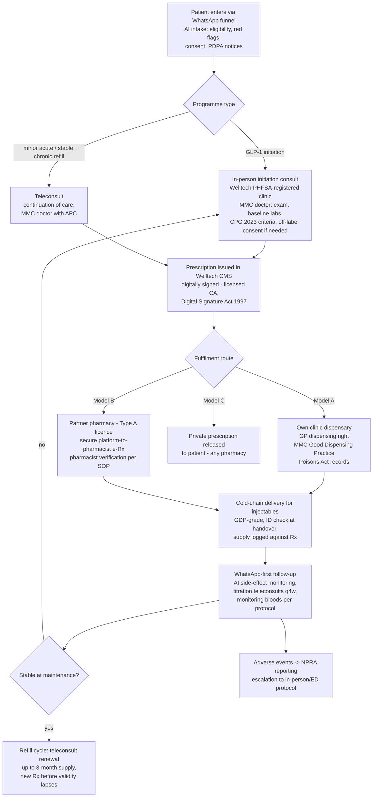

# Prescribing Models for a Digital Operator in Malaysia: Dispensing Economics, E-Prescriptions and the GLP-1 Pathway

**Abstract.** Malaysia offers a digital-health operator an unusually rich prescribing design space: private doctors retain the legal right to dispense their own prescriptions (a margin pool that dispensing-separated markets like Singapore lack), a digitally signed e-prescription channel has operated at scale since 2019 (DOC2US, >1M e-prescriptions) and was formally recognised by the MOH Online Healthcare Services Guideline 2025, and community pharmacies accept private prescriptions with home delivery. This document evaluates each model's economics and legal bounds, details the GLP-1 prescribing pathway specifically (initiation requirements under the MOH/MEMS Clinical Practice Guidelines on Management of Obesity 2023, off-label rules for Ozempic, titration and monitoring cadence), maps repeat-prescription/chronic-refill mechanics and controlled-drug exclusions, and closes with a compliant Welltech prescribing architecture. Regulatory foundations are covered in [malaysia-regulations.md](../10-market-intelligence/malaysia-regulations.md) and are not repeated; this document is the operator's build sheet.

**Last updated: July 2026.**

Related documents: [Doctor workflows](doctor-workflows.md) · [Teleconsultation analysis](telehealth-consultation-analysis.md) · [Clinician pain points](clinician-pain-points.md) · [Malaysia regulations](../10-market-intelligence/malaysia-regulations.md) · [Malaysia weight-loss market](../10-market-intelligence/malaysia-weight-loss-market.md)

---

## 1. The model menu

| # | Model | Legal basis | Who captures medicine margin | Digital-operator fit |
|---|---|---|---|---|
| A | **In-clinic dispensing** (doctor prescribes and dispenses) | Poisons Act 1952 practitioner-supply provisions; MMC Good Dispensing Practice guideline[^1][^2] | The clinic (Welltech, if clinic is owned) | Core model for owned hub clinics; anchors GLP-1 economics |
| B | **Digitally signed e-Rx → partner pharmacy** (platform-to-pharmacist transmission) | OHS Guideline 2025 "digital prescription" recognition; Digital Signature Act 1997 signatures (DOC2US precedent)[^3][^4] | Partner pharmacy (Welltech takes negotiated rebate/service fee — *within MMC fee-splitting constraints*[^5]) | Scale model for delivery beyond clinic catchments |
| C | **Private prescription → any community pharmacy** (paper or PDF; patient carries) | Poisons Regulations prescription formalities[^1][^6] | Pharmacy fully | Fallback/compliance valve; patient-choice optics |
| D | **Public-sector rails** (not available) | — | — | Not accessible to private operators |

The optimal Welltech architecture is A+B hybrid: initiate and dispense high-touch programmes (GLP-1) from owned PHFSA-registered clinics; scale refills through licensed pharmacy partners on digitally signed e-prescriptions (§7).

---

## 2. Model A — in-clinic dispensing: the economics of the GP dispensing right

### 2.1 Legal position

- Private medical practitioners may dispense Group B (prescription-only) medicines to their own patients under the Poisons Act 1952 architecture — the historical basis of the Malaysian GP business model; dispensing separation has been debated for decades and repeatedly stalled.[^1][^7][^8]
- Conduct standards sit in the **MMC Guideline for Good Dispensing Practice** (labelling, records, storage, patient counselling) and the MOH Guide to Good Dispensing Practice, which also addresses repeat prescriptions and part-supply by post.[^2][^9]
- Poisons Act record-keeping (prescription book entries on day of supply, retention, labelling per the MOH recording/labelling guide) is enforced by Pharmacy Enforcement inspections.[^1][^10]

### 2.2 Economics

- Dispensing is not a side business; it is the P&L. With consultation fees frozen at RM10–35 for three decades (see [doctor-workflows.md §3](doctor-workflows.md)), medicine margin became the cross-subsidy: studies note doctors "rely on medication sales because they are not able to charge based on their consultation skills."[^11][^12]
- Documented margin behaviour: generic paracetamol 500 mg commonly retails in clinics at RM5–10 per 10 tablets — a 2,400–4,900% markup on acquisition cost; dispensing doctors prescribe roughly **7× more medicines** than non-dispensing doctors, per the dispensing-separation literature.[^8][^12]
- Clinics buy at better prices than standalone pharmacies for many lines (volume + direct distributor relationships), reinforcing the moat.[^8]
- Threat vector: the August 2025 mandatory-prescription proposal (requiring GPs to issue a prescription for every supply) triggered GP fury precisely because it is the procedural precursor to dispensing separation; medicine price-transparency (price-display) rules push the same direction.[^13][^14]

### 2.3 Implications for Welltech

A Welltech-owned, PHFSA-registered clinic that initiates GLP-1 therapy captures consult fee + full pharmacy margin on drugs priced RM800–3,000/month (see [regulations §5](../10-market-intelligence/malaysia-regulations.md)) — the single largest unit-economics lever in the model. Two disciplines: (1) run dispensing to MMC Good Dispensing Practice standard with pharmacist oversight in senior management (OHS 2025 requires a pharmacist on the board if e-pharmacy is offered); (2) hold a contingency P&L for dispensing separation, whose probability is rising, not falling.[^2][^3][^13]

---

## 3. Model B — digitally signed e-prescription to partner pharmacies

### 3.1 The DOC2US precedent (the model Welltech should replicate, not invent)

- DOC2US launched Malaysia's first **digital-signature-enhanced e-prescription** (certified against the Digital Signature Act 1997, using one of Malaysia's four licensed certification authorities), recognised by the Malaysian Book of Records.[^4][^15]
- Scale proof: 300+ pharmacies authorised to accept its e-Rx by 2021; later ~1 in 3 of Malaysia's ~3,000 community pharmacies; 216,000 digitally signed e-prescriptions in a single 12-month period; cumulative >1 million e-prescriptions.[^16][^17][^18]
- Fulfilment logistics were solved with pharmacy/courier tie-ups (Alpro × GDEX).[^19]
- DOC2US publishes an operational SOP for e-prescription medicine supply — evidence that platform-to-pharmacist transmission with pharmacist verification is an accepted operating pattern.[^20]

### 3.2 Legal status

- The **OHS Guideline 2025** recognises a digital prescription as one "signed by a licensed doctor or dentist and transmitted securely to a pharmacist through an OHS platform" — the first official articulation (detail in [malaysia-regulations.md §3.3](../10-market-intelligence/malaysia-regulations.md)).[^3]
- Residual ambiguity: the Poisons Regulations 1952 still assume written, signed prescriptions; the digital pathway rests on guideline recognition plus Digital Signature Act validity rather than amended regulations. Operators mitigate by using licensed-CA digital signatures (the DOC2US pattern) rather than mere e-signatures.[^1][^4]
- Commercial terms with pharmacies must now be structured carefully: the MMC's May 2026 prohibition on fee-splitting (doctors sharing fees with hospitals, insurers, TPAs) argues for flat service/technology fees rather than percentage kickbacks tied to prescription value.[^5]

### 3.3 Model C — private prescription to community pharmacy

Always available, zero build cost: the doctor issues a compliant written prescription (prescriber name/address, signed and dated, patient identified; ~3-month validity in practice; dispenser records supply in the prescription book).[^1][^6] It forfeits margin and fulfilment control, but (a) it is the patient-autonomy answer regulators and pharmacist bodies want to see (anti-lock-in optics), and (b) it is the correct channel for medicines Welltech chooses not to touch (e.g., psychotropics, §6).

---

## 4. The GLP-1 prescribing pathway

### 4.1 Clinical governance baseline

- The **CPG Management of Obesity (2nd edition, 2023)** — joint MOH/Malaysian Endocrine & Metabolic Society publication, launched 9 June 2023 — is the national reference: obesity framed as a chronic disease; recommendations span behavioural intervention, nutrition, exercise, pharmacotherapy and bariatric surgery.[^21][^22][^23]
- Pharmacotherapy thresholds in Malaysian practice follow Asian BMI cut-points: initiation considered at **BMI ≥27.5 kg/m²** (or lower with comorbidities), with medication started at the lowest dose and titrated on tolerability and response.[^24]
- Registration status (verified in [malaysia-regulations.md §5](../10-market-intelligence/malaysia-regulations.md)): Saxenda, Wegovy (launched Jan 2026) and Mounjaro (launched Aug 2025) carry weight-management indications; **Ozempic/Rybelsus are T2DM-registered — weight-loss use is off-label**.

### 4.2 Off-label rules

- Off-label prescribing is lawful for a registered practitioner but carries elevated duties: adequate evidence base, documented justification, and explicit informed consent. MOH's Pharmaceutical Services Programme publishes a **consent form for treatment using unregistered medicine/indication (off-label)** used in government facilities — the de-facto standard of documentation private operators should mirror; a copy of consent is kept in the patient record.[^25][^26]
- Operating rule for Welltech: prescribe on-label first (Wegovy/Mounjaro/Saxenda for weight management); use off-label semaglutide only with documented rationale (e.g., availability, affordability), signed consent, and never in advertising (prescription-medicine advertising to the public is prohibited — see [regulations §6](../10-market-intelligence/malaysia-regulations.md)).

### 4.3 The pathway as practised by compliant Malaysian clinics (market evidence)

Private KL clinics marketing Wegovy programmes describe a consistent envelope — doctor-led assessment, screening bloods, supervised titration, monthly follow-up:[^27][^28][^29]

| Stage | Content | Channel norm |
|---|---|---|
| Initiation consult | BMI/waist, comorbidity and contraindication screen (MTC history, pancreatitis, pregnancy), medication interactions, goal-setting | **In-person at registered clinic** — aligns with MMC physical-exam expectations and MOH first-visit-in-person norms (see [regulations §3](../10-market-intelligence/malaysia-regulations.md)) |
| Baseline labs | Typically FBC, RP, LFT, HbA1c/FPG, lipids; TFT where indicated *(analyst synthesis of clinic programme descriptions; CPG-consistent)*[^27][^24] | Clinic/partner lab |
| Titration | Semaglutide 0.25 mg weekly ×4w → 0.5 → 1.0 → 1.7 → 2.4 mg maintenance, stepping ~q4 weeks on tolerability[^28] | Teleconsult-appropriate follow-ups |
| Follow-up cadence | Monthly reviews: weight/waist, side-effects (GI dominant), adherence, dose decision; most patients ≥6 months on programme[^27][^29] | Tele/WhatsApp-first with in-person checkpoints |
| Safety net | Side-effect triage, adverse-event reporting to NPRA, stop-rules (pancreatitis symptoms, pregnancy) | Asynchronous + escalation |

*(analyst inference)* Nothing in Malaysian law prescribes a mandatory follow-up interval or mandatory bloods for GLP-1s; the binding constraints are the MMC telemedicine guideline's parity-of-care duty and the CPG's chronic-disease framing. A written Welltech clinical protocol (initiation in person, teletitration, defined monitoring) converts regulatory ambiguity into defensible standard-of-care — and is a doctor-recruitment asset because it shifts protocol risk from the individual prescriber to the medical governance system (see [clinician-pain-points.md §5](clinician-pain-points.md)).

---

## 5. Repeat prescriptions and chronic-refill models

- **Repeat supply is a recognised category**: the MOH Guide to Good Dispensing Practice contains provisions for repeat prescriptions and delivery of part-supply medicines by post; standard prescription validity is treated as ~3 months in practice.[^6][^9]
- **Telemedicine refills are continuation-of-care territory**: regional scoping of Malaysian rules records that online prescribing (excluding narcotics/psychotropics) is accepted **as a continuation of care** — i.e., refill/titration of an established doctor-patient relationship is the defensible zone, novel-patient online initiation of sensitive medicines is not.[^30]
- Market practice: DoctorOnCall's dispensation policy and pharmacy operation show refill mechanics running openly at scale (prescription verification by pharmacists before supply); DOC2US built its telepharmacy business substantially on chronic refills.[^31][^16]
- Bounds for programme design: (a) each supply against a valid prescription within validity; (b) new prescription requires a consult — a fast teleconsult is sufficient for stable chronic patients under continuation of care; (c) quantity per supply should track the review cadence (monthly during titration; up to 3 months at stable maintenance) *(analyst protocol recommendation, consistent with the above instruments)*.[^6][^9][^30]

## 6. Controlled and excluded medicines

| Class | Instrument | Rule for a digital operator |
|---|---|---|
| Narcotics (dangerous drugs) | Dangerous Drugs Act 1952 | Out of scope entirely; no online prescribing[^30] |
| Psychotropics (benzodiazepines, zolpidem, **phentermine**) | Poisons (Psychotropic Substances) Regulations 1989; special record/supply obligations; clinics are actively audited (MOH audits of private clinics target benzodiazepines, zolpidem and phentermine diversion)[^32][^33][^34] | Do not prescribe via telehealth; phentermine — a legacy weight-loss drug — is a specific trap for a weight-loss operator: it is on the audited psychotropic list. Welltech should exclude phentermine from its formulary despite its low price. |
| GLP-1s | Group B poison (prescription-only), **not** psychotropic/narcotic | Full telehealth titration model available post-initiation[^1] |

---

## 7. The compliant Welltech prescribing architecture

Design rules encoded above:

1. **Every prescription originates from an identifiable MMC-registered doctor tied to the registered clinic** — the platform never prescribes; doctors do (OHS 2025 / PHFSA anchoring, see [regulations §2–3](../10-market-intelligence/malaysia-regulations.md)).[^3]
2. **Digital signatures via a licensed certification authority**, not drawn signatures — the DOC2US compliance pattern that survived scrutiny.[^4][^15]
3. **Initiation in person, titration remote** — matches MOH first-visit norms, MMC exam expectations, and the post-2025 enforcement climate (MC ban signalling; see [telehealth-consultation-analysis.md §5](telehealth-consultation-analysis.md)).[^3][^21]
4. **No teleprescribing of psychotropics/narcotics; no phentermine.**[^30][^32]
5. **Pharmacy commercials as flat fees, not percentage splits** (MMC fee-splitting ban).[^5]
6. **Model C always offered** — the patient may take the prescription elsewhere; this defuses the anti-lock-in critique pharmacist bodies aim at dispensing doctors.[^7][^8]

### 7.1 Risk table

| Risk | Likelihood | Impact | Mitigation |
|---|---|---|---|
| Dispensing separation legislated | Medium (rising post-2025 mandatory-Rx push)[^13] | High — clinic margin compression | Model B rails pre-built; pharmacy partnerships convert margin loss into service fees |
| Poisons Regulations e-Rx gap enforced restrictively | Low | Medium | Licensed-CA signatures; paper fallback (Model C) |
| Off-label enforcement tightening on semaglutide | Medium | Medium | On-label-first formulary; consent documentation per MOH form[^25] |
| Psychotropic audit spillover | Low (if formulary excludes) | High reputationally | Hard formulary exclusion of phentermine/benzodiazepines[^32][^33] |
| Fee-splitting recharacterisation of pharmacy rebates | Medium | Medium | Flat technology/service fees; legal review of pharmacy contracts[^5] |

---

## References

[^1]: Poisons Act 1952 (Act 366) and Regulations, Pharmaceutical Services Programme, MOH, https://pharmacy.moh.gov.my/en/documents/poisons-act-1952-and-regulations.html and consolidated Act text https://pharmacy.moh.gov.my/sites/default/files/document-upload/poisons-act-1952-act-366.pdf (accessed July 2026).
[^2]: Malaysian Medical Council, "Guideline for Good Dispensing Practice", https://mmc.gov.my/wp-content/uploads/2025/09/MMC-Guideline-for-Good-Dispensing-Practice.pdf (accessed July 2026).
[^3]: MOH Guideline on Online Healthcare Services 2025 — analysed with primary citations in [malaysia-regulations.md](../10-market-intelligence/malaysia-regulations.md), §3.3 (digital prescription definition).
[^4]: DOC2US, "The First to Launch Digital Signature Enhanced E-Prescription in Malaysia", https://www.doc2us.com/newsroom/doc2us---the-first-to-launch-digital-signature-enhanced-e-prescription-in-malaysia (accessed July 2026).
[^5]: CodeBlue, "MMC Bans Doctor Fee-Splitting By Hospitals, Insurers, TPAs" (May 2026), https://codeblue.galencentre.org/2026/05/mmc-bans-doctor-fee-splitting-by-hospitals-insurers-tpas/ (accessed July 2026).
[^6]: MOH Pharmaceutical Services, "A Guide to Legislations on the Recording, Labelling, Storage and Disposal of Poisons" (2nd ed.), https://pharmacy.moh.gov.my/sites/default/files/document-upload/2nd-ed-panduan-perekodan-pelabelan-penstoran-racun-gp_0.pdf (accessed July 2026).
[^7]: Shafie A.A. et al., "Separation of prescribing and dispensing in Malaysia: a summary of arguments", Research in Social & Administrative Pharmacy (2012), https://pubmed.ncbi.nlm.nih.gov/21824823/ (accessed July 2026).
[^8]: "Awareness and Perception Towards Implementation of Dispensing Separation in Malaysia: A Cross-Sectional Study", PMC (2021), https://pmc.ncbi.nlm.nih.gov/articles/PMC7909346/ (accessed July 2026).
[^9]: MOH, "Guide to Good Dispensing Practice" (incl. repeat prescriptions; part-supply by post), https://pharmacy.moh.gov.my/sites/default/files/Draft%20Guide%20to%20Good%20Dispensing%20Practice%202015_1.pdf (accessed July 2026).
[^10]: MOH Pharmaceutical Services Programme, private clinic psychotropic audits (record-keeping enforcement), https://pharmacy.moh.gov.my/en/content/number-premises-private-medical-clinics-involved-psychotropic-substances-audit-2011.html-0 (accessed July 2026).
[^11]: "Multi stakeholders of health and industries perspectives on medicine price transparency initiative in private health care settings in Malaysia", PMC (2020), https://pmc.ncbi.nlm.nih.gov/articles/PMC7335703/ (accessed July 2026).
[^12]: "Drug Utilization and Drug Pricing in the Private Primary Healthcare System in Malaysia: An Employer Price Control Mechanism", PMC (2020) — paracetamol margin 2,400–4,900%, https://www.ncbi.nlm.nih.gov/pmc/articles/PMC7750386/ (accessed July 2026).
[^13]: CodeBlue, "Mandatory Prescription Sparks Doctors' Fury, Dispensing Separation Fears" (Aug 2025), https://codeblue.galencentre.org/2025/08/mandatory-prescription-sparks-doctors-fury-dispensing-separation-fears/ (accessed July 2026).
[^14]: CodeBlue, "Medicine Price Transparency May Have Serious, Unintended Consequences For GP Clinics — MMA" (Nov 2024), https://codeblue.galencentre.org/2024/11/medicine-price-transparency-may-have-serious-unintended-consequences-for-gp-clinics-mma/ (accessed July 2026).
[^15]: DOC2US, "The First in Malaysia to launch Digital Signature Enhanced E-Prescription" (Malaysian Book of Records recognition), https://www.doc2us.com/newsroom/doc2us--the-first-in-malaysia-to-launch-digital-signature-enhanced-e-prescription (accessed July 2026).
[^16]: DOC2US, "DOC2US has successfully authorized 300 and more pharmacy outlets to accept E-prescription in Malaysia", https://www.doc2us.com/newsroom/e-prescription-system-news-doc2us-has-successfully-authorized-300-and-more-pharmacy-outlets-to-accept-e-prescription-in-malaysia (accessed July 2026).
[^17]: Digital News Asia, "DOC2US hits 216k digitally signed e-prescriptions in 12-month period", https://www.digitalnewsasia.com/startups/doc2us-hits-216k-digitally-signed-e-prescriptions-12-month-period (accessed July 2026).
[^18]: DOC2US, "DOC2US hits 1 million e-prescriptions milestone", https://www.doc2us.com/pressrelease/doc2us-hits-1-million-e-prescriptions-milestone-3j (accessed July 2026).
[^19]: DOC2US, "DOC2US & Alpro Pharmacy ties up with GDEX to ease medication delivery", https://www.doc2us.com/pressrelease/doc2us--alpro-pharmacy-ties-up-with-gdex--to-ease-medication-delivery (accessed July 2026).
[^20]: DOC2US, "Medicine e-Prescription SOP", https://www.doc2us.com/sop-medicine (accessed July 2026).
[^21]: Malaysia Endocrine & Metabolic Society, "Clinical Practice Guidelines: Management of Obesity" (2nd ed., 2023), https://mems.my/clinical-practice-guidelines-management-of-obesity/ (accessed July 2026).
[^22]: MDES, "CPG Management of Obesity 2023" (launch 9 June 2023), https://mdes.org.my/2023/07/11/cpg-management-of-obesity-2023/ (accessed July 2026).
[^23]: CodeBlue, "Malaysia's Latest Obesity Management CPG: Obesity Is Chronic" (Dec 2023), https://codeblue.galencentre.org/2023/12/malaysias-latest-obesity-management-cpg-obesity-is-chronic/ (accessed July 2026).
[^24]: Seimbang, "GLP-1 Weight Loss Malaysia: Complete Guide" (BMI ≥27.5 initiation threshold; lowest-dose titration), https://www.seimbang.my/blog/glp-1-weight-loss-malaysia-complete-guide (accessed July 2026).
[^25]: MOH Pharmaceutical Services Programme, "Consent Form for Treatment Using Unregistered Medicine/Indication (Off Label)", https://pharmacy.moh.gov.my/en/documents/consent-form-treatment-using-unregistered-medicine-indication-label.html (accessed July 2026).
[^26]: MyRxNote, "Off-label Use" (Malaysian practice summary: evidence basis, consent, documentation), https://www.myrxnote.com/2020/11/off-label-use.html (accessed July 2026).
[^27]: Nexus Clinic KL, "Wegovy Semaglutide Injections For Weight Loss" (doctor-led programme: screening, bloodwork, titration, monthly follow-up), https://www.nexus-clinic.com/weight-loss/wegovy-malaysia/ (accessed July 2026).
[^28]: Nexus Clinic KL, "Wegovy Dosing Schedule Malaysia" (0.25→2.4 mg q~4-week titration), https://www.nexus-clinic.com/wegovy-dosing-schedule-malaysia/ (accessed July 2026).
[^29]: Clique Clinic, "Wegovy Injection For Weight Loss — Doctor-Supervised Slimming Treatment", https://www.cliqueclinic.com/wegovy-injection-for-weight-loss-doctor-supervised-slimming-treatment (accessed July 2026).
[^30]: Intan Sabrina M., Defi I.R., "Telemedicine Guidelines in South East Asia — A Scoping Review", Frontiers in Neurology (2021) — Malaysia: online prescriptions other than narcotics/psychotropics permitted as continuation of care, https://pmc.ncbi.nlm.nih.gov/articles/PMC7838484/ (accessed July 2026).
[^31]: DoctorOnCall, "Dispensation Policy", https://www.doctoroncall.com.my/medicine/dispensation-policy (accessed July 2026).
[^32]: Poisons (Psychotropic Substances) Regulations 1989, MOH consolidated text, https://pharmacy.moh.gov.my/sites/default/files/document-upload/poisons-psychotropic-substances-regulations-1989-2-0_0.pdf (accessed July 2026).
[^33]: MOH Pharmaceutical Services, private-clinic psychotropic audit programme (audited classes incl. benzodiazepines, zolpidem, phentermine), https://pharmacy.moh.gov.my/en/content/number-premises-private-medical-clinics-involved-psychotropic-substances-audit-2011.html-0 (accessed July 2026).
[^34]: Malaysian Pharmacists Society, "Psychotropic Substances Diversion", https://www.mps.org.my/newsmaster.cfm?menuid=37&action=view&retrieveid=3177 (accessed July 2026).
