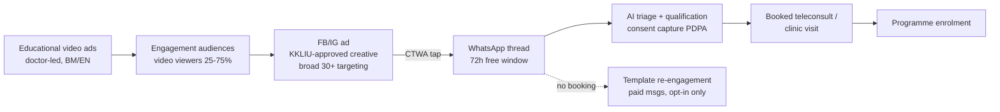

# Facebook & the Meta Ads Platform: Malaysian Healthcare Marketing Intelligence

Facebook remains Malaysia's mass-reach platform for the 30+ health-decision-maker, and Meta's click-to-WhatsApp ad format (CTWA) is the single most important paid entry point into Welltech's WhatsApp-first funnel. This document quantifies the Malaysian Facebook audience, dissects how local providers use the platform, maps Meta's tightening health-advertising restrictions (the January 2025 "health and wellness" data-source regime, the prescription-drug/LegitScript wall, the 2024 targeting purge) against Malaysia's own KKLIU regime, benchmarks costs and provider pages with sourced figures only, and specifies a compliant full-funnel design (Facebook → CTWA → WhatsApp → consult). It builds on the audience and regulatory groundwork in [malaysia-consumer-behaviour.md](../10-market-intelligence/malaysia-consumer-behaviour.md) and [malaysia-regulations.md](../10-market-intelligence/malaysia-regulations.md); platform siblings are [instagram.md](./instagram.md) and [youtube.md](./youtube.md).

Last updated: July 2026

---

## 1. User base and demographics: the mass-reach platform for 30+

### 1.1 Scale — and a reporting discontinuity worth understanding

Two widely used trackers now disagree materially on Facebook's Malaysian audience, because Meta revised its published audience-reach methodology during 2025:

| Source | Figure | Basis | Date |
|---|---|---|---|
| DataReportal / Meta ad resources | **23.0M users** = 63.7% of population; 78.0% of the eligible (13+) audience; **86.4% of adults 18+** | Meta ad-reach data after Meta's 2025 revisions | Late 2025[^1] |
| NapoleonCat | **≈31.8M** = 89.3% of population | Ad-audience methodology (pre-revision basis; overstates unique people) | 2025[^2] |
| This repo's baseline | ≈31.8M ad audience ≈89% of population | Same NapoleonCat/ad-audience basis | 2025 (see [consumer-behaviour §3](../10-market-intelligence/malaysia-consumer-behaviour.md)) |

Reconciliation: the ≈31.8M/89% figure used across earlier documents is an ad-audience count that includes duplicate and non-personal accounts; Meta's revised late-2025 reporting puts unique reachable users at 23.0M. Both support the same planning conclusion — **Facebook reaches more or less every Malaysian adult (86.4% of 18+)** — but media plans should size reach and frequency off the 23.0M figure, not 31.8M.[^1][^2] DataReportal also logged a 200k (−0.9%) decline in reachable users between July and October 2025 — the platform is plateauing, not growing.[^1]

### 1.2 Age and gender

- Gender (Meta ad audience, late 2025): **55.2% male / 43.7% female** — the only major Malaysian platform that skews male; Instagram skews ~55% female (see [instagram.md](./instagram.md)).[^1]
- NapoleonCat's 2025 breakdown puts **25–34 as the largest cohort (~11M)**, with the male skew concentrated in that band.[^2]
- Youth attention has migrated to TikTok (ad reach ≈86.8% of internet users; see [consumer-behaviour §3](../10-market-intelligence/malaysia-consumer-behaviour.md)); Facebook's distinctive residual strengths are the 30+ mass market, Bahasa Melayu community groups, and expat groups.
- Structural youth cutoff: Malaysia's Online Safety Act Child Protection Code, enforced from 1 June 2026, bars under-16s from holding accounts on TikTok, Meta platforms and YouTube; early reporting indicates Facebook is the platform enforcing registration blocks most fully.[^3] This locks in Facebook's older-skewing profile — a feature, not a bug, for healthcare demand generation.

**Implications for Welltech.** Facebook is the paid channel for exactly the personas most likely to convert to medical weight-loss and preventive programmes: the 35–55 metabolic-risk male (Facebook's overweight male skew matches the late-medicalising male persona P5/P6 in [consumer-behaviour §9](../10-market-intelligence/malaysia-consumer-behaviour.md)), the BM-speaking mass market, and expats navigating care via groups. Youth-oriented acquisition belongs on TikTok/Instagram; Facebook budgets should be justified on 30+ reach and CTWA efficiency, sized against 23.0M reachable users.

## 2. How Malaysian health providers use Facebook

### 2.1 The four working formats

| Format | How Malaysian providers use it | Welltech relevance |
|---|---|---|
| **Pages** | Hospital/pharmacy brand pages with health education, doctor talks, screening promos; chain clinics run fragmented per-branch pages (see §8) | Table-stakes trust asset; ad account anchor |
| **Groups** | Disease-support, diet, expat and BM community groups; providers participate via admins/ambassadors rather than ads (ads cannot target groups) | Organic seeding + social listening (§5) |
| **Lead ads (Instant Forms)** | Screening-package and aesthetic-clinic lead gen; Meta prohibits health-status questions in forms (§3.4) | Usable for webinar/screening interest, but inferior to CTWA for a WhatsApp-first operation |
| **Click-to-WhatsApp ads (CTWA)** | The dominant conversion format for clinics/SMEs in a market where WhatsApp is the favourite app of 97.7% of internet users ([consumer-behaviour §2](../10-market-intelligence/malaysia-consumer-behaviour.md)) | **Primary paid format** |

### 2.2 CTWA mechanics — the format Welltech's funnel runs on

Mechanics, as documented by Meta BSP/partner guides:[^4][^5]

- The ad (Feed, Stories, Reels, Marketplace, on Facebook and Instagram) carries a **Send Message/WhatsApp CTA**; a tap opens a WhatsApp thread with the business, typically with a pre-filled opener. Setup requires a linked WhatsApp Business account and the Engagement or Leads objective (formerly the "Messages" objective).[^4]
- **Free entry point**: a conversation initiated from a CTWA ad opens a **72-hour window in which all messages — including template messages — are free**; Meta monetises the ad click, not the ensuing conversation. After the window, standard WhatsApp Business Platform per-message/conversation pricing applies by category (marketing > utility > authentication) and recipient country.[^5]
- **Billing for the ad itself is standard Meta auction** (optimised for "Messaging Conversations Started"); the WhatsApp side is fixed-rate rather than auction-priced, which partners note keeps CTWA costs stable when Q4 CPMs spike.[^4]
- **Metric caveat**: Meta counts a conversation once per user per 7 days, and attribution counts "clicked and opened WhatsApp" — partner analyses put the gap between clicks and actual first messages at **20–30% or higher**. Cost-per-conversation must be reconciled against WhatsApp-side message logs, not Ads Manager alone.[^6]

Sourced performance claims (vendor-reported; treat as directional):

- Southeast Asian CTWA campaigns commonly produce leads at **US$1–3**; a Malaysian agency guide puts click-to-WhatsApp leads at **RM6–32** depending on industry.[^7]
- Healthcare-specific: AiSensy (a WhatsApp BSP) reports healthcare CTWA delivering **25–40% lower cost per lead than instant-form lead ads**, with higher appointment-show rates because the relationship starts as a conversation, and claims of "5x more qualified leads" for provider clients — vendor marketing, but directionally consistent across BSPs.[^8]
- A Malaysian agency round-up reports a facial-aesthetics campaign generating leads at **RM13.86** with an average of **RM11.47 per messaging conversation**; another agency case cites a Petaling Jaya aesthetic clinic starting at **RM195 per *qualified* enquiry** before optimisation — the spread illustrates how much qualification criteria move the number.[^9][^10]

**Implications for Welltech.** CTWA is not one channel among several; it is the paid front door of the whole operating model described in [malaysia-whatsapp-healthcare.md](../10-market-intelligence/malaysia-whatsapp-healthcare.md). Two design consequences: (1) the 72-hour free window is the AI-triage window — the WhatsApp agent must qualify, book and confirm inside it before per-message costs and cold-lead decay begin; (2) because Ads Manager overcounts conversations by 20–30%, Welltech's source-of-truth funnel metric must be WhatsApp-side "first inbound message received," stitched to booking outcomes in the CRM. Note the regulatory overlay: MAB treats click-to-WhatsApp ads and broadcast/status content as advertising requiring KKLIU-approved creative ([regulations §6](../10-market-intelligence/malaysia-regulations.md)).

## 3. Meta's health-and-wellness advertising restrictions

Meta has tightened three separate screws since 2024. Together they define what a Malaysian healthcare advertiser can target, track and say.

### 3.1 January 2025: data-source restrictions for "health and wellness" advertisers

Rolling out from January 2025 (advertisers notified from November 2024), Meta restricts ad accounts whose data sources it categorises as "health and wellness" — defined as businesses "associated with medical conditions, specific health statuses, or provider/patient relationships":[^11][^12]

- **Lower-funnel event optimisation is blocked**: categorised accounts can no longer use events such as Purchase, Add-to-Cart or Lead for campaign optimisation, via pixel or Conversions API; campaigns must optimise on upper-funnel proxies (landing-page views, engagement, messaging conversations).[^11]
- **"Core Setup"** became the default state for categorised data sources: transmission of custom parameters and URL-embedded information is stripped, so condition-revealing page paths (e.g. `/glp-1-program`) cannot flow into Meta's optimisation systems.[^12]
- Meta's signals-filtering also silently drops Business Tools data it classifies as sensitive health data, independent of advertiser intent.[^13]
- Agencies report the restrictions continuing to expand through 2026 as part of a broader health-privacy programme.[^12]

### 3.2 Prescription drugs: the LegitScript wall — Malaysia not eligible

Meta's Drugs and Pharmaceuticals ad standard permits prescription-drug promotion only by online pharmacies, telehealth providers and manufacturers that are **actively LegitScript-certified and Meta-authorised**, with a consult-a-professional disclaimer, 18+ targeting, and — critically — **targeting restricted to the United States, Canada and New Zealand**.[^14][^15] There is no lawful route to promote Wegovy, Mounjaro, Saxenda or Ozempic by name to Malaysian users on Meta — a platform prohibition that stacks on top of Malaysia's own MASA 1956 ban on advertising prescription-only medicines to the public ([regulations §6.1](../10-market-intelligence/malaysia-regulations.md)). Double wall: even a creative that somehow cleared MAB could not clear Meta.

### 3.3 2024: the personal-health targeting purge

Effective 15 January 2024 (impacted ad sets forcibly updated by 18 March 2024), Meta removed or consolidated detailed-targeting options relating to health, race and other topics "people may perceive as sensitive" — eliminating most condition- and treatment-interest segments (diabetes interest, weight-loss interest and similar) that clinics historically used.[^16] Meta's steer is broad targeting plus Advantage+ delivery. This compounds the older personal-health *creative* policy: ads may not assert or imply personal attributes, including physical or mental health ("Are you diabetic?", "struggling with your weight?" framings are policy violations).[^17]

### 3.4 Lead-form and sensitive-data rules

Instant Forms prohibit questions eliciting health status ("Do you have chronic back pain?" is the canonical prohibited example); Meta does not sign business-associate-style agreements and instructs advertisers not to transmit health information at all.[^13][^18]

**Implications for Welltech.** (1) Categorisation is near-certain for a weight-loss/telehealth brand — architect the funnel assuming Core Setup from day one rather than engineering around it: optimise campaigns on **Messaging Conversations Started**, which remains available and maps exactly to the CTWA funnel, and keep conversion truth in the WhatsApp/CRM layer (§2.2). This is a genuine structural advantage over website-checkout competitors who lost purchase optimisation. (2) No condition-interest targeting survives: plan on broad targeting shaped by age (30+), geography (Klang Valley/Penang/JB), language of creative (BM/EN/中文 self-selects the audience) and lookalikes built from value events that are *not* health-classified. (3) Retargeting site visitors of condition-specific pages is doubly compromised — URL parameters are stripped and audiences built on health signals are filtered — so retargeting should rely on **engagement custom audiences** (video viewers, page engagers, ad engagers) and CTWA re-engagement inside WhatsApp itself, which Meta's restrictions do not touch. (4) Creative must avoid "you"-framed health attributions regardless of KKLIU status.

## 4. Meta Ad Library as a research tool

What the Ad Library does and does not show for Malaysia:[^19][^20]

- For commercial (non-political) ads it shows **currently active ads only**, searchable by advertiser or keyword, scoped per country — there is no historical archive outside the EU (EU ads persist one year), and since 2024–2025 the **API covers only political/social-issue ads in the EU**, so Malaysian commercial monitoring means manual UI pulls, repeated over time.[^19][^20]
- Practically: searching Malaysia for advertisers ("Alpro Pharmacy", "DoctorOnCall", aesthetic-clinic brands) and terms ("kurus", "turun berat badan", "weight loss injection", "slimming") reveals live creative, formats (CTWA CTA visible on the ad card), and start dates — but nothing about spend or reach for non-political ads.

Enforcement precedent — the US GLP-1 telehealth wave:

- Researchers found **~4,500 active ad campaigns mentioning semaglutide** across Meta platforms in 2023 — more than Viagra — many from telehealth and compounding sellers; Meta removed violating ads largely after journalists and watchdogs flagged them.[^21]
- Media Matters documented Meta users "bombarded" with ads for dubious "generic Ozempic" prescriptions; a coalition of US state attorneys-general formally warned Meta over misleading, AI-generated weight-loss-drug ads; and the FDA/HHS moved against telehealth compounded-drug advertising in September 2025.[^22][^23][^24]
- Malaysia mirror: the MOH Pharmacy Enforcement Division issued warning letters over **48 social-media advertisements involving Ozempic, Mounjaro and Saxenda in 2025**, and the Malaysian Obesity Society issued a public warning (January 2026) on unregulated GLP-1 products marketed as "weight loss injections" via social media — sellers avoid explicit drug names to evade automated detection.[^25][^26] This sits alongside the 38,055 unapproved-ad takedowns documented in [regulations](../10-market-intelligence/malaysia-regulations.md).

**Implications for Welltech.** The precedent is unambiguous: platforms and regulators converge on GLP-1 advertising *after* the grey-market wave, and enforcement sweeps do not distinguish carefully between cowboys and compliant operators caught using similar language. Welltech should (a) run a standing monthly Ad Library pull (manual, screenshots archived — nothing persists) covering competitor clinics and BM/EN weight-loss terms, both for competitive creative intelligence and to document the grey market it is differentiating against; (b) keep its own creative conspicuously clean (KKLIU number displayed, no molecule names) so that any future Meta or MOH sweep of Malaysian weight-loss ads finds nothing to remove.

## 5. Community-group dynamics

What can actually be verified from open search (member counts generally are not indexed; treat all as needing live audit):

| Community | Type | Evidence found | Members |
|---|---|---|---|
| KL Expats (Kuala Lumpur/Malaysia) | Expat group | Group exists; cited in expat guides[^27] | n/a — needs live audit |
| Expats in/around Mont Kiara | Expat group (Welltech's launch geography) | Group exists[^27] | n/a — needs live audit |
| KL Expat Malaysia; Expats in Malaysia | Expat groups | Groups exist[^27] | n/a — needs live audit |
| Kelab Diabetes Malaysia (Kencing Manis) | BM disease-support group | Group exists[^28] | n/a — needs live audit |
| Diabetes Malaysia (Persatuan Diabetes Malaysia) | NGO page (14 state branches; ~11.7k offline members 2024) | Page: 6,889 likes; Penang branch 1,948[^28] | — |
| BM "kurus"/diet groups | Weight-loss groups | Individual groups not verifiably identified in open search; BM slimming-product posts inside general groups were visible | n/a — needs live audit |

Dynamics that matter: (1) expat groups function as referral engines — "which clinic for X?" threads are high-intent moments, and the expat persona P4 in [consumer-behaviour §9](../10-market-intelligence/malaysia-consumer-behaviour.md) navigates care primarily this way; (2) BM disease-support and diet groups are saturated with unregistered slimming-product sellers using private-message funnels[^25][^26] — a trust vacuum a doctor-led service can fill with education-only participation; (3) ads cannot be targeted *at* groups, so group strategy is organic: admin relationships, AMA sessions with Welltech doctors (subject to MMC ethics and MAB rules on service promotion), and social listening for language patients actually use.

**Implications for Welltech.** Groups are a listening and credibility channel, not a demand-capture channel. The compliant play is a named doctor answering questions generically (no patient solicitation, no service claims outside KKLIU-approved framing) plus a branded educational page whose posts members share into groups themselves. Any employee/agency posting disguised promotion into groups would constitute both an MCMC Content Code disclosure breach and likely an unapproved advertisement under MASA ([regulations §6](../10-market-intelligence/malaysia-regulations.md)).

## 6. Cost benchmarks — Malaysia and the health vertical

Sourced figures only; ranges reflect the spread across agency sources.

| Metric | Figure | Scope | Source, year |
|---|---|---|---|
| CPM (Malaysia) | RM6–25 per 1,000 impressions; awareness campaigns RM6–15 | All verticals | Malaysian agency pricing guides, 2025–2026[^9] |
| CPC (Malaysia) | RM0.50–3.00 | SME verticals | Malaysian agency guides, 2025–2026[^9] |
| CPL (Malaysia, lead campaigns) | RM15–80 | All verticals | Malaysian agency guides, 2025–2026[^9] |
| CTWA cost per lead (Malaysia) | RM6–32 | All verticals | ZenWeb, 2026[^7] |
| Messaging conversation cost (Malaysia, aesthetics) | RM11.47 avg; RM13.86/lead in cited campaign | Facial aesthetics | OpenMinds case round-up, 2026[^10] |
| Qualified enquiry, aesthetic clinic (pre-optimisation) | RM195 | Injectables/HIFU clinic, PJ | ZenWeb case, 2026[^9] |
| Global median CPM | US$13.48 (2025); US$8–15 considered "good" | All verticals | DigitalApplied benchmark compilation, 2025[^29] |
| Global avg CPC | US$0.70 traffic; US$1.92 lead campaigns | All verticals | WordStream Facebook Ads Benchmarks 2025[^30] |
| Global median CTR | 1.71% traffic; 2.59% leads | All verticals | WordStream 2025[^30] |
| Healthcare conversion rate | 11.0% | Healthcare vertical, US-weighted | WordStream benchmark series[^30] |
| Minimum viable spend (Malaysia) | RM30/day per ad set; RM1,500–3,000/month to exit learning phase | SME | Malaysian agency guides, 2026[^9] |
| Agency management fees (KL) | RM2,000–5,000/month on RM10–30k ad spend | — | ZenWeb pricing, 2026[^9] |

*(Analyst estimate)* Malaysia-specific **healthcare** CPM/CPC benchmarks are not published anywhere we found. Reasoning from the table: Malaysian CPMs run roughly 30–60% of US levels, healthcare/aesthetics competition concentrates in Klang Valley, and the Jan-2025 optimisation restrictions (§3.1) inflate effective CPA for health-categorised accounts by forcing upper-funnel optimisation. A planning assumption of **RM12–25 CPM, RM1.50–3.00 CPC, and RM15–45 per WhatsApp conversation** for compliant health-services creative in Klang Valley is defensible; the RM195 qualified-enquiry figure shows what happens when qualification is strict and creative untested. Validate within the first RM10k of spend.

**Implications for Welltech.** At RM15–45 per WhatsApp conversation and plausible 20–35% conversation→consult conversion (unvalidated — instrument from day one), paid CAC per booked consult of RM60–200 is the realistic planning band — comfortably viable against GLP-1 programme revenue of RM1,050–1,500/month per pen equivalent (see [weight-loss market](../10-market-intelligence/malaysia-weight-loss-market.md)), but only if the WhatsApp agent converts conversations efficiently. The binding constraint is not media cost; it is conversation-handling quality.

## 7. Compliant creative strategy and full-funnel design

### 7.1 The funnel

### 7.2 Creative rules (KKLIU × Meta, combined)

The union of MAB/KKLIU rules ([regulations §6](../10-market-intelligence/malaysia-regulations.md)) and Meta health policies (§3) yields one creative envelope:

| Rule | Driven by |
|---|---|
| Service-level claims only ("doctor-led weight management programme"), never molecule or brand names (no "Ozempic/semaglutide/GLP-1 injections") | MASA 1956 POM prohibition + Meta prescription-drug policy |
| KKLIU approval number on every creative; 4–6 week approval lead time built into campaign calendar | MAB regime |
| No before/after imagery, no testimonials, no patient photos in restricted contexts, no price comparisons or comparative claims | MAB facility-advertising guidelines (rev. 3/2023) |
| No second-person health attribution ("struggling with your weight?") — use first-person-neutral or population framing ("1 in 2 Malaysian adults is overweight — NHMS") | Meta personal-attributes policy[^17] |
| No cure/guarantee language; disease-awareness framing is the lawful lane | MASA + MAB |
| #ad/#sponsored disclosure on any influencer amplification | MCMC Content Code |

Creative that works inside the envelope: doctor-to-camera education (BM and EN variants), population-statistic hooks, "what happens in a consultation" process transparency, screening-offer creative (weight/metabolic health check), and Ramadan-calendar metabolic-health content timed to the health-reset moments mapped in [consumer-behaviour](../10-market-intelligence/malaysia-consumer-behaviour.md).

### 7.3 Targeting and retargeting under health-data restrictions

- **Prospecting**: broad 28–60, geo-tiered (Klang Valley core; Penang/JB expansion), creative-as-targeting via language and persona-coded hooks; Advantage+ where eligible. No health-interest segments exist to buy (§3.3).
- **Retargeting**: engagement custom audiences only (video viewers, page/IG engagers, CTWA ad engagers). Do **not** build website-pixel audiences from condition-specific pages — Core Setup strips them and it creates PDPA-sensitive-data exposure ([regulations](../10-market-intelligence/malaysia-regulations.md) — Malaysia's PDPA treats health data as sensitive, and cross-border transfer assessments for Meta are already on the compliance register).
- **Re-engagement of non-booked leads happens inside WhatsApp** (opted-in template messages), not via Meta retargeting — cheaper, unrestricted by health-category rules, and consent-logged.
- **Measurement**: optimise campaigns on Messaging Conversations Started; reconcile weekly against WhatsApp-side first-inbound-message counts (§2.2 20–30% gap); attribute consults/enrolments in CRM by ad-referral payload (CTWA passes ad ID into the thread metadata via the WhatsApp Business Platform[^5]).

**Implications for Welltech.** The KKLIU 4–6 week approval cycle is the operational bottleneck: run a rolling creative pipeline (batch of 6–10 concepts submitted monthly) so that Meta-side creative fatigue never forces a choice between stale ads and unapproved ones. The strategic read: Meta's health restrictions hurt e-commerce-style health brands far more than a conversation-first clinic — Welltech's funnel never needed the purchase pixel.

## 8. Benchmark: Malaysian provider Facebook pages

Counts only where actually observed in search results (likes and followers are adjacent but distinct metrics; both decay-prone — full audit queued):

| Page | Entity type | Likes/followers found | Note |
|---|---|---|---|
| Pantai Hospital Kuala Lumpur | IHH hospital | **179,384 likes / ~179k followers**[^31] | Largest single-hospital page found |
| Alpro Pharmacy (main) | Pharmacy chain (~300 touchpoints) | **133,230 likes**[^32] | Branch pages: 50–1.6k each |
| BIG Pharmacy (main) | Pharmacy chain | **~112k followers**[^33] | Branch pages: 40–213 each |
| Sunway Medical Centre Penang | Hospital | **87,785 likes**[^34] | Outperforms group HQ page |
| KPJ Healthcare Berhad | Hospital group (28 hospitals) | **35,254 likes**[^35] | Plus per-hospital pages (KPJ Sentosa, KPJ Selangor — counts n/a) |
| Sunway Healthcare Group | Group HQ | **9,295 likes**[^34] | |
| Sunway Medical Centre Damansara | Hospital | **8,985 likes**[^34] | |
| Diabetes Malaysia | Patient NGO | **6,889 likes**[^28] | |
| Qualitas Health Malaysia | GP/dental chain | **~4.1k followers**[^36] | Second page (PJ): 744 |
| Klinik Mediviron (232-clinic chain) | GP chain | Branch pages only: **84–1.1k followers each**; HQ page 302[^37] | No consolidated brand page found |
| DoctorOnCall | Telehealth/e-pharmacy | **n/a — needs live audit** (IG ~13k; X 1,596; LinkedIn 6,850)[^38] | FB page exists (@doctoroncallMY) |
| Poliklinik chains (various) | GP chains | n/a — needs live audit | Fragmented per-branch presence |
| Doctor-KOL pages (Medical Mythbusters Malaysia alumni, e.g. Dr Kamarul Ariffin) | KOLs | n/a — needs live audit; curated lists confirm an active BM doctor-page ecosystem[^39] | Candidates for advisory/UGC partnerships |

Pattern: hospitals and pharmacy chains have six-figure audiences built on brand and check-ins; GP/clinic chains are digitally fragmented (hundreds of sub-1k branch pages); the telehealth incumbent's Facebook footprint is unremarkable. **No Malaysian operator owns the "medical weight management" conversation on Facebook** — the audience is being farmed instead by unregistered-product sellers (§4, §5).

**Implications for Welltech.** A new page will not out-follower Pantai; it does not need to. The benchmark to beat is DoctorOnCall's apparent low-engagement social presence and the clinic chains' fragmentation: one consolidated, doctor-fronted page with weekly BM/EN educational video, run as the trust layer behind CTWA campaigns (users click through to the page before messaging). Follower count is a vanity metric here; the KPIs are CTWA conversation volume and page-level engagement rate.

## 9. Verification queue

Items requiring live tooling or in-country access that open web search could not settle:

1. **Meta Ad Library live pull (Malaysia)** — active health/weight-loss advertisers, CTWA usage rates, competitor creative; monthly recurring, screenshots archived (no history is retained for commercial ads).
2. **Follower/likes audit** — DoctorOnCall FB count; Pantai group pages beyond KL; KPJ per-hospital pages; doctor-KOL pages (Lobak Merah list); reconcile likes vs followers for all §8 rows.
3. **Group member counts** — KL Expats, Expats in/around Mont Kiara, Kelab Diabetes Malaysia, and a systematic BM "kurus/diet/turun berat" group census (requires logged-in Facebook search).
4. **Malaysia healthcare-vertical CPM/CPC/CPL actuals** — validate the §6 analyst estimate with first RM10k of live spend or an agency data-share.
5. **Health-and-wellness categorisation status** — confirm whether Welltech's ad account/domain is categorised at onboarding (Events Manager notification) and which events survive.
6. **CTWA availability/pricing specifics** — current WhatsApp Business Platform per-message rates for Malaysia and free-entry-point terms at launch date (Meta repriced messaging during 2025–2026).
7. **NapoleonCat vs Meta audience revision** — track whether DataReportal's Digital 2027 report restates the 23.0M baseline.

## References

[^1]: DataReportal, "Digital 2026: Malaysia", https://datareportal.com/reports/digital-2026-malaysia (accessed July 2026).
[^2]: NapoleonCat, "Facebook users in Malaysia — 2025", https://stats.napoleoncat.com/facebook-users-in-malaysia/2025/09/ (ad-audience methodology; accessed July 2026).
[^3]: NBC News, "Malaysia enforces ban on social media accounts for children younger than 16", https://www.nbcnews.com/world/asia/malaysia-enforces-ban-social-media-accounts-children-younger-16-rcna347823 (accessed July 2026).
[^4]: Infobip, "Click to WhatsApp ads: How to create, optimize & scale campaigns", https://www.infobip.com/blog/click-to-whatsapp-ads; respond.io, "WhatsApp Ads: A Practical Guide to WhatsApp Advertising", https://respond.io/blog/click-to-whatsapp-ads (accessed July 2026).
[^5]: go4whatsup, "Click-to-WhatsApp Ads 2026 — Setup, Cost, Free Window", https://www.go4whatsup.com/guides/click-to-whatsapp-ads/; Meta for Developers, "Ads that Click to WhatsApp", https://developers.facebook.com/documentation/ads-commerce/marketing-api/ad-creative/messaging-ads/click-to-whatsapp (accessed July 2026).
[^6]: adlibrary.com, "Meta Click-to-WhatsApp Ads: Complete 2026 Setup Guide", https://adlibrary.com/posts/meta-click-to-whatsapp-ads-guide (accessed July 2026).
[^7]: ZenWeb, "WhatsApp Ads Cost in Malaysia: Worth It or Not?", https://zenweb.my/blog/click-to-whatsapp-ads-cost/ (accessed July 2026).
[^8]: AiSensy, "Click-to-WhatsApp Ads for Healthcare | 2026 Guide", https://m.aisensy.com/blog/click-to-whatsapp-ads-for-healthcare/ (vendor-reported figures; accessed July 2026).
[^9]: ZenWeb, "Meta Ads Pricing Malaysia 2026 — Facebook & Instagram Cost", https://zenweb.my/services/meta-ads/pricing/; ZenWeb, "Best Digital Marketing for Aesthetic Clinic in Malaysia Guide 2026", https://zenweb.my/industries/aesthetic-clinic/digital-marketing/ (accessed July 2026).
[^10]: OpenMinds Group, "Performance Marketing Campaigns Malaysia 2026: 7 Real Examples With Results", https://www.openmindsresources.com/blog/performance-marketing-campaigns-malaysia-2026-7-real-examples-with-results/ (accessed July 2026).
[^11]: Foley Hoag LLP, "Meta's New Advertising Rules: Key Considerations for Health and Wellness Businesses", https://foleyhoag.com/news-and-insights/blogs/security-privacy-and-the-law/2025/january/meta-s-new-advertising-rules-key-considerations-for-health-and-wellness-businesses/; Digital Position, "Meta's Restrictions on Health and Wellness Ads + How to Fix", https://www.digitalposition.com/resources/blog/ppc/metas-new-restrictions-on-health-and-wellness-ads-what-you-need-to-know/ (accessed July 2026).
[^12]: Cardinal Digital Marketing, "How Meta's Data Restrictions Impact Healthcare Advertising Strategies", https://www.cardinaldigitalmarketing.com/healthcare-resources/blog/meta-announces-major-changes-healthcare-advertising/; Able CDP, "How to comply with Meta's tracking restrictions for healthcare advertisers (updated in 2026)", https://www.ablecdp.com/blog/meta-healthcare-restrictions (accessed July 2026).
[^13]: Meta Business Help Center, "About Sensitive Health Information", https://www.facebook.com/business/help/361948878201809 (accessed July 2026).
[^14]: Meta Transparency Center, "Drugs and Pharmaceuticals — Advertising Standards", https://transparency.meta.com/policies/ad-standards/restricted-goods-services/drugs-pharmaceuticals/; Meta Business Help Center, "About Meta's Prescription Drugs advertising policy", https://www.facebook.com/business/help/263390265553560 (accessed July 2026).
[^15]: LegitScript, "Healthcare Certification: Operate Safely Online", https://www.legitscript.com/certification/healthcare-certification/ (accessed July 2026).
[^16]: Social Media Today, "Meta To Remove More Detailed Targeting Options for Ad Campaigns", https://www.socialmediatoday.com/news/metas-removing-detailed-targeting-options-ad-campaigns/704375/; MediaPost, "Meta To Remove More Detailed Targeting Options Deemed 'Sensitive'" (15 Jan 2024), https://www.mediapost.com/publications/article/392609/ (accessed July 2026).
[^17]: Meta Business Help Center, "Facebook's Advertising Policy on Personal Health", https://www.facebook.com/business/help/2489235377779939 (accessed July 2026).
[^18]: Meta Business Help Center, "Questions Prohibited on Your Instant Form", https://www.facebook.com/business/help/219356599612120 (accessed July 2026).
[^19]: Shopify, "How to Use the Meta Ad Library in 2026: 9 Ways", https://www.shopify.com/blog/ad-library-facebook; adlibrary.com, "What Meta Ad Library Doesn't Show You 2026", https://adlibrary.com/posts/what-meta-ad-library-doesnt-show-you-2026 (accessed July 2026).
[^20]: Meta Transparency Center, "Ad Library tools", https://transparency.meta.com/researchtools/ad-library-tools; Global Investigative Journalism Network, "Guide to Investigating Digital Ad Libraries", https://gijn.org/stories/guide-investigating-digital-ad-libraries/ (accessed July 2026).
[^21]: NBC News, "Over 4,000 ads for Ozempic-style drugs found on Instagram and Facebook", https://www.nbcnews.com/tech/internet/ozempic-weight-loss-drug-ads-instagram-wegovy-semaglutide-rcna88602 (accessed July 2026).
[^22]: Media Matters for America, "Meta users are being bombarded with ads for shady 'generic' Ozempic prescriptions", https://www.mediamatters.org/facebook/meta-users-are-being-bombarded-ads-shady-generic-ozempic-prescriptions (accessed July 2026).
[^23]: eMarketer, "Meta faces scrutiny over misleading weight loss drug ads", https://www.emarketer.com/content/meta-faces-scrutiny-over-misleading-weight-loss-drug-ads (accessed July 2026).
[^24]: Holland & Knight, "FDA, HHS Taking Action Against Telehealth's Compounded Drug Advertising" (Sept 2025), https://www.hklaw.com/en/insights/publications/2025/09/fda-hhs-taking-action-against-telehealths-compounded-drug-advertising (accessed July 2026).
[^25]: Sinar Daily, "Online weight-loss drugs evade Malaysia's prescription laws", https://www.sinardaily.my/article/734317/focus/exclusives/online-weight-loss-drugs-evade-malaysias-prescription-laws (accessed July 2026).
[^26]: Malaysian Obesity Society (MYOS), "Public Health Warning: Unregulated Weight-Loss Medications" (6 Jan 2026), https://www.myos.org.my/2026/01/06/public-health-warning-unregulated-weight-loss-medications/ (accessed July 2026).
[^27]: Little Steps Asia, "Top Facebook Groups For Moms And Expats In KL", https://www.littlestepsasia.com/kuala-lumpur/family-life/parenting-life/facebook-groups-for-moms-and-expats/; Facebook groups "KL EXPATS", https://www.facebook.com/groups/klexpats/; "Expats in/around Mont Kiara", https://www.facebook.com/groups/424312424288892/ (accessed July 2026).
[^28]: Facebook group "Kelab Diabetes Malaysia (Kencing Manis)", https://www.facebook.com/groups/116093082419695/; Diabetes Malaysia page, https://www.facebook.com/p/Diabetes-Malaysia-100063922395603/; Diabetes Malaysia Penang Branch, https://www.facebook.com/dmpenang/; International Diabetes Federation, "Diabetes Malaysia", https://idf.org/our-network/regions-and-members/western-pacific/members/malaysia/diabetes-malaysia/ (accessed July 2026).
[^29]: DigitalApplied, "Facebook Ads Benchmarks 2026: CPC, CPM, CTR by Industry", https://www.digitalapplied.com/blog/facebook-ads-benchmarks-2026-cpc-cpm-ctr-industry (accessed July 2026).
[^30]: WordStream, "Facebook Ads Benchmarks 2025: NEW Data, Trends, & Insights for Your Industry", https://www.wordstream.com/blog/facebook-ads-benchmarks-2025; WordStream, "Facebook Ad Benchmarks for YOUR Industry", https://www.wordstream.com/blog/ws/2017/02/28/facebook-advertising-benchmarks (healthcare conversion rate; accessed July 2026).
[^31]: Facebook, "Pantai Hospital Kuala Lumpur", https://www.facebook.com/pantaihospitalkl/ (accessed July 2026).
[^32]: Facebook, "Alpro Pharmacy", https://www.facebook.com/alpropharmacy/ (accessed July 2026).
[^33]: Facebook, "BIG PHARMACY", https://www.facebook.com/bigpharmacymy/ (accessed July 2026).
[^34]: Facebook, "Sunway Medical Centre Penang", https://www.facebook.com/SunwayMedicalPenang/; "Sunway Healthcare Group", https://www.facebook.com/sunwayhealthcaregroup/; "Sunway Medical Centre Damansara", https://www.facebook.com/p/Sunway-Medical-Centre-Damansara-61564977045004/ (accessed July 2026).
[^35]: Facebook, "KPJ Healthcare Berhad", https://www.facebook.com/KPJHealthcare/ (accessed July 2026).
[^36]: Facebook, "Qualitas Health Malaysia", https://www.facebook.com/QualitasHealthMalaysia/; "Qualitas Health", https://www.facebook.com/QualitasHealthGroup/ (accessed July 2026).
[^37]: Facebook, "Klinik Mediviron Jalan Kuching", https://www.facebook.com/pkjalankuching/; "Mediviron Group of Clinics", https://www.facebook.com/medivirongroupofclinicshq/; Mediviron corporate site, https://mediviron.com.my/ (accessed July 2026).
[^38]: Facebook, "DoctorOnCall", https://www.facebook.com/doctoroncallMY/; Instagram, https://www.instagram.com/doctoroncallmy/; LinkedIn, https://www.linkedin.com/company/doctoroncall.com.my (accessed July 2026).
[^39]: Lobak Merah, "20 Doktor Perubatan Yang Anda Patut Follow di Facebook", https://lobakmerah.com/20-doktor-perubatan-yang-anda-patut-follow-di-facebook/ (accessed July 2026).
