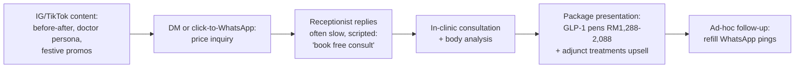
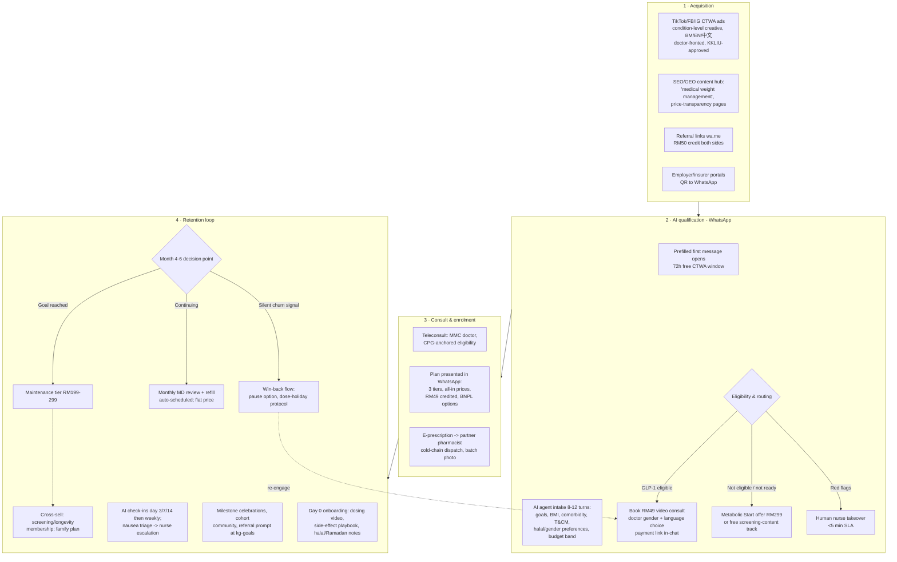

# Funnel Intelligence: Competitor Acquisition Funnels & Welltech's End-to-End Funnel Design

**Abstract.** This document maps, stage by stage, how patients are actually acquired in Malaysian digital health today — DoctorOnCall's SEO→content→consult→pharmacy machine (~1.6–1.7M monthly site visits), Doctor Anywhere's partner-and-insurer distribution, the aesthetic clinics' Instagram/TikTok→WhatsApp DM→in-clinic consult ladder, the slimming centres' Facebook lead-ad→"free trial"→hard-sell package playbook (documented in complaint archives), Naluri's employer→app-onboarding B2B2C motion, and the new GLP-1 telehealth funnels (OVA, Seimbang) — with drop-off risks evidenced from reviews and complaint records at each stage. It teardowns the two most instructive international onboarding flows (Hims' consult-first quiz funnel; Noom's 113-screen commitment engine), audits the (thin) use of email and remarketing by local players, then specifies Welltech's funnel end-to-end: click-to-WhatsApp ad → AI-agent qualification → paid teleconsult → program enrolment → retention loop, with labelled stage-conversion estimates and CAC/LTV scenarios. Headline model output: at Malaysian media costs (CPC RM1–6; CTWA cost-per-conversation in the low single-digit RM), a disciplined WhatsApp-first funnel plausibly lands CAC per enrolled program patient at RM400–900, against year-one revenue per enrolled patient of RM6,200–8,900 — making 12-month retention, not media efficiency, the binding constraint on LTV:CAC.

Last updated: July 2026.

**Related documents:** [pricing.md](pricing.md) (tier architecture the funnel sells into) · [positioning.md](positioning.md) (message and claims layer) · [malaysia-whatsapp-healthcare.md](../10-market-intelligence/malaysia-whatsapp-healthcare.md) (CTWA mechanics, WhatsApp policy constraints) · [malaysia-consumer-behaviour.md](../10-market-intelligence/malaysia-consumer-behaviour.md) (journey map, personas, drop-off table) · dossiers: [doctoroncall.md](../20-competitor-dossiers/doctoroncall.md), [doctor-anywhere.md](../20-competitor-dossiers/doctor-anywhere.md), [naluri.md](../20-competitor-dossiers/naluri.md).

---

## 1. Executive summary

1. **Nobody in Malaysia runs a full-funnel.** DoctorOnCall owns awareness (SEO) but leaks at retention; aesthetic clinics own conversion pressure but poison advocacy; Naluri owns distribution (employers) but not activation; the GLP-1 telehealth entrants (OVA, Seimbang) are the only players wiring acquisition→program→retention into one flow — and they are young and sub-scale.
2. **The dominant local conversion surface is already WhatsApp.** Aesthetic clinics convert IG/TikTok interest through WhatsApp DMs; even DoctorOnCall handles support there. But every incumbent uses WhatsApp as an unstructured inbox — no flows, SLAs, CRM sync or AI ([whatsapp-healthcare](../10-market-intelligence/malaysia-whatsapp-healthcare.md) finding 7). Structured CTWA→AI-qualification is open ground.
3. **The slimming-centre funnel is Welltech's anti-model and its richest source of pre-burned demand:** FB/IG free-trial lead ads → in-centre "consultation" → measured hard sell (complaints document RM4,846–14,950 packages, deposits taken before price disclosure, 1.8★ aggregate) — the trauma that makes "no hard sell, published prices" a conversion asset.[^1][^2]
4. **International teardowns converge on two mechanics Welltech should import:** (a) Hims frames onboarding as a *medical consultation first, checkout second* — the subscription reads as a care relationship, not a product; (b) Noom's quiz builds sunk-cost commitment before the paywall (113 screens, 10–15 minutes, validating micro-copy). The WhatsApp-native equivalent is a 8–12-turn AI intake that personalises before any price is shown.[^3][^4]
5. **Email is a dead channel locally; remarketing is constrained.** Local players run vouchers and referral cash, not lifecycle email (DoctorOnCall's promo-code culture is the closest thing); Meta health-targeting restrictions and WhatsApp's prescription-drug policy push all mid-funnel nurturing into the WhatsApp service window and utility templates.[^5][^6]
6. **Model output (§6):** base-case CAC per enrolled patient RM650; year-one contribution per enrolled patient RM2,200–3,600 at 45–60% twelve-month retention → LTV:CAC 3.4–5.5×, payback 2–4 months. At unmanaged retention (30%), the same funnel yields LTV:CAC ≈ 2× — the funnel is only as good as the retention loop it feeds.

---

## 2. Competitor funnel maps (with evidenced drop-off risks)

### 2.1 DoctorOnCall — SEO → content → consult → pharmacy

The incumbent B2C machine (full anatomy in [doctoroncall.md §7.1](../20-competitor-dossiers/doctoroncall.md)):

| Stage | Mechanism | Evidence | Drop-off risk (evidence) |
|---|---|---|---|
| Awareness | Massive SEO estate: /medicine/ commerce pages, condition content, /find-doctor/ directory; ~1.6–1.7M monthly visits | Similarweb/Semrush trackers[^7] | Traffic ≠ intent: content visitors bounce without an offer bridging education→consult |
| Consideration | Price anchoring "from RM15", promo codes (TNGDOC10), "Malaysia's first and largest" claims | dossier §7 | Discount-trained users wait for codes; weak WTP discipline |
| Conversion | Web checkout: consult, pharmacy basket, screening | dossier §5 | Fee stacking (consult + RM7.99 platform fee + RM25 delivery) reads as nickel-and-diming |
| Fulfilment | Partner-pharmacy dispatch, 2–4h express claim | dossier §5 | Reviews cite delays up to 15 days, unresponsive support — trust broken at the clinical moment |
| Retention | Referral cash (RM30), repeat pharmacy baskets; no membership/care plans | dossier §7.1 | Structural: no named doctor, no program → repeat behaviour is habit, not relationship |

Strategic read: DoctorOnCall converts *informational* search into *transactions*. It does not convert transactions into care relationships — the exact layer Welltech monetises. Its SEO moat also sets the reference CPC for paid search in the category (§6.1).

### 2.2 Doctor Anywhere — partner/insurer-led app funnel

DA's Malaysian funnel is distribution-led, not demand-led ([doctor-anywhere.md §6](../20-competitor-dossiers/doctor-anywhere.md)): insurer/employer panels (cashless consults) + perks partnerships feed app downloads; owned social is modest (IG ~7.5k). Drop-offs: the app-install wall (double-digit percentage loss vs zero-install WhatsApp, [whatsapp-healthcare](../10-market-intelligence/malaysia-whatsapp-healthcare.md) comparison table); churn tied to the B2B contract, not the patient; app-store reviews cite unresolved tickets and on-platform medication pricing above retail — friction exactly at repeat purchase.

### 2.3 Aesthetic clinics — IG/TikTok → WhatsApp DM → in-clinic consult → package

Composite of observed practice (Nexus, CLEO, Ozhean et al.) and agency documentation of the Malaysian aesthetic-clinic playbook:[^8]

Drop-off risks: (a) slow/scripted WhatsApp replies lose the 3-providers-at-once comparison shopper ([consumer-behaviour §10](../10-market-intelligence/malaysia-consumer-behaviour.md)); (b) the in-clinic step filters out the discretion-seeking majority (only 28% of people with obesity ever discussed weight with a clinician — walking into an aesthetic clinic is a high-stigma act, [weight-loss §3](../10-market-intelligence/malaysia-weight-loss-market.md)); (c) upsell pressure converts the session but caps referral; (d) KKLIU/LCP advertising rules make much of the before/after creative technically non-compliant — takedown-exposed reach.[^8][^9]

### 2.4 Slimming centres — FB lead ads → free trial → measured hard sell

The most documented funnel in the category, entirely from complaint evidence:[^1][^2]

| Stage | Mechanism | Documented failure |
|---|---|---|
| Lead gen | FB/IG "free trial" promos, celebrity campaigns (Marie France regional creative) | Attracts price-sensitive leads who don't know the real ticket |
| Trial visit | Free/RM50 session; body "analysis" with disputed measurements | Complaints: no measurement or customised plan before quote |
| Sales close | Consultant + manager tag-team, >30-minute persistence documented; deposit (RM500) taken before full price disclosed | RM4,846 "miscommunication" quotes; RM14,950 forced packages; S$7,251 SG analogues |
| Delivery | Machine sessions; results attributed to water loss | Regain; refund refusal complaints; 1.8★/36 reviews |
| Advocacy | None — complaint archives are the brand's SEO footprint | NCCC formal complaints |

Welltech implication: this funnel *works* commercially (four-figure closes at scale for two decades) because trial + in-person social pressure converts. The medical-grade version keeps the low-friction paid entry (RM49 credited consult) and discards the pressure: publish prices, decision-at-home, no same-day close incentives — each an explicit counter-signal (see [positioning.md §6](positioning.md)).

### 2.5 Naluri — employer contract → eligibility → app onboarding → 16-week program

B2B2C funnel ([naluri.md §7](../20-competitor-dossiers/naluri.md)): HR/insurer contract → employee eligibility comms → health-risk-assessment onboarding → risk-stratified 16-week coaching → pre/post outcomes report to payor. The binding constraint is *activation*: covered lives ≫ active users (app-review volume in the hundreds against ~1M covered lives; industry enrolment norms 5–20%), which Naluri itself addresses with "recruitment initiatives" it claims lift adherence 200%.[^10] Drop-offs: app-install wall again; employer-mediated trust ("will HR see my data?" — persona P3's stated objection); time-boxed programs end without a consumer-paid continuation path.

### 2.6 GLP-1 telehealth entrants — quiz/inquiry → teleconsult → subscription → delivery

OVA: landing page → eligibility form → RM15 mandatory video consult → RM900/month flat program → discreet cold-chain delivery → WhatsApp support; Atome instalments at checkout ([weight-loss §5.1](../10-market-intelligence/malaysia-weight-loss-market.md)). Seimbang: online health profile → doctor review → RM899/month plan (or in-clinic pickup) → nutrition coach + WhatsApp support + progress dashboard; no lock-in.[^11] These are the closest local analogues to Welltech's intended flow; neither shows evidence of AI qualification, proactive side-effect outreach cadence, or structured maintenance off-ramps — the differentiating layer.

### 2.7 International onboarding teardowns (transferable mechanics)

**Hims (US).** Quiz-segmented entry per condition; onboarding leads with the medical consultation, not checkout — health questions → provider match → personalised plan → payment last. Result: the subscription is framed as a medical relationship; reported ~85% retention and 40%+ conversion-relevant gains attributed to personalisation (MedMatch).[^3] **Import:** consult-before-price sequencing inside WhatsApp; the RM49 consult is the product until eligibility is established.

**Noom (US).** 113-screen web-to-app quiz taking 10–15 minutes; validating micro-copy at vulnerable moments (weight entry); willingness-to-pay question framed as contribution; urgency timers on the trial offer. Commitment via sunk effort is the conversion engine; critics document the dark-pattern edge (auto-renew traps) — a reputational ceiling Welltech should not import.[^4] **Import:** effort-graduated intake (each answer visibly personalises the plan); **reject:** fake urgency and renewal opacity — fatal in a market already primed by slimming-centre trauma.

---

## 3. Email & remarketing usage observed (Malaysia)

- **DoctorOnCall** is the only local player with a visible CRM motion: referral cash (RM30), signup vouchers (RM12), TNG co-promo codes, seasonal voucher pushes — price-led lifecycle, not content-led nurturing ([doctoroncall.md §7](../20-competitor-dossiers/doctoroncall.md)).
- **No Malaysian telehealth or aesthetic player shows evidence of sophisticated email lifecycle programs** (welcome series, abandoned-consult flows) in materials reviewed; global healthcare email benchmarks (≈23.5% open, 3.6% CTR) suggest the channel is viable but unexploited locally.[^5]
- **Remarketing constraints:** Meta restricts health-condition custom audiences; WhatsApp Business policy prohibits prescription-drug promotion in templates/ads (no molecule names in creatives or flows); KKLIU approval applies to healthcare-service ads. Practical consequence: mid-funnel nurturing must run as (a) WhatsApp utility/service messages inside opt-in, (b) broad interest-based (not condition-based) paid retargeting on engagement audiences, (c) owned content loops.[^6][^9]
- **Welltech stance:** WhatsApp *is* the CRM (free-form within the 24h service window; free utility templates inside the window; 72h free window after CTWA entry). Email is a compliance/receipts channel plus a monthly longevity-tier digest — not an acquisition channel.[^6][^12]

---

## 4. Welltech funnel design (end-to-end)

### 4.1 Stage design notes

- **Creative never names molecules** (Group B prohibition; WhatsApp drug policy): condition-level hooks ("Program pengurusan berat badan doktor" / "doctor-led weight management"), doctor-fronted TikTok, price-transparency angle ("harga penuh, tiada hard sell").[^6][^9]
- **AI agent speaks BM/EN/Mandarin from message one**; intake doubles as personalisation theatre (Noom lesson) and clinical pre-screen (Hims lesson). Every answer is written to CRM; handoff-to-human SLA <5 minutes during business hours ([whatsapp-healthcare](../10-market-intelligence/malaysia-whatsapp-healthcare.md) KPI table).
- **RM49 consult is the paid lead-qualifier** — filters tyre-kickers, credits into enrolment, and sits under the RM58 WTP median ([pricing.md §4.1](pricing.md)).
- **Enrolment happens in-chat**, not on a web checkout: tier cards + payment link + BNPL selector; spouse-friendly PDF summary auto-sent (documented "discuss with spouse" drop-off countermeasure, [consumer-behaviour §10](../10-market-intelligence/malaysia-consumer-behaviour.md)).
- **The retention loop is clinical, not promotional:** day-3/day-10 side-effect triage attacks the #1 real-world discontinuation reason (side effects, 28.2% of quits; steepest churn in months 1–3).[^13]

---

## 5. Stage-conversion assumptions (labelled estimates)

All figures are *(analyst estimates)* triangulated from: CTWA benchmark literature, healthcare landing-page benchmarks, quiz-funnel completion norms, GLP-1 persistence data, and local price-parity logic. These are planning numbers for a pilot, to be replaced by observed data within one quarter.

| Stage | Metric | Base case | Range (bear–bull) | Benchmark basis |
|---|---|---|---|---|
| Ad click → WhatsApp conversation opened | CTWA leakage | 72% | 60–80% | 20–30% click-to-message leakage is common[^12] |
| Conversation → completed AI intake | Quiz completion | 55% | 40–65% | Quiz-funnel completion norms 40–60%[^14] |
| Completed intake → clinically qualified | Eligibility | 60% | 50–70% | CPG criteria vs ad-audience skew *(assumption)* |
| Qualified → paid RM49 consult booked & attended | Conversion + show rate | 35% | 25–45% | CTWA conversion 15–30% outperforming 2–5% landing pages; paid consult filters no-shows[^12][^15] |
| Consult → program enrolment | Close rate | 45% | 35–55% | Price parity-plus at RM999 ([pricing.md §5.2](pricing.md)); Hims consult-first framing[^3] |
| Month 1→3 persistence | Early retention | 80% | 70–88% | Side-effect triage vs steep months-1–3 baseline drop[^13] |
| 12-month retention | Program persistence | 52% | 40% (bear) – 60% (bull, target) | Unmanaged 30–38%; managed target >60% ([weight-loss §9.2](../10-market-intelligence/malaysia-weight-loss-market.md))[^13] |
| Enrolled → referral-originated new conversation (12 mo) | Referral coefficient | 0.25 | 0.1–0.4 | WhatsApp-group sharing culture *(assumption)* |

**Compound funnel arithmetic (base case):** 10,000 ad clicks → 7,200 conversations → 3,960 completed intakes → 2,376 qualified → 832 paid consults → **374 enrolments** (3.7% click-to-enrolment).

---

## 6. CAC / LTV model scenarios

### 6.1 Media-cost inputs (Malaysia, 2025–26)

| Input | Value | Source |
|---|---|---|
| Meta CPC (MY, cross-industry) | RM0.50–6.00; healthcare above median | [^16] |
| Meta CPM (MY) | RM8–50 | [^16] |
| Google Ads CPC (MY) | RM2–10 by industry; healthcare mid-high; documented healthcare account at RM21.56 *cost per conversion* | [^17] |
| CTWA cost per conversation | USD 0.50–3 in emerging markets (≈RM2.30–14); CPL typically $1–5 vs $5–25 for landing pages | [^12] |
| WhatsApp API messaging | Marketing ~RM0.30–0.45/msg; utility in-window free; CTWA 72h window free | [^6] |
| US comparator discipline | Best telehealth operators hold CAC <USD 150 and CAC payback <12 months; LTV:CAC ≥3× | [^18] |

### 6.2 CAC build-up (per enrolled program patient)

| Scenario | Blended CPC | Click→enrol | Media CAC | + Content/agency/tools (30% load) | **Fully loaded CAC** |
|---|---|---|---|---|---|
| Bull (referral-heavy mix 30%) | RM1.80 | 4.5% | RM280 | RM84 | **~RM365** |
| **Base** | RM2.40 | 3.7% | RM485 | RM146 | **~RM650** |
| Bear (paid-only, competitive auction) | RM3.50 | 2.5% | RM980 | RM294 | **~RM1,275** |

*(Analyst model; media CAC = CPC ÷ click-to-enrolment rate. Organic/SEO and referral volume dilute blended CAC over time — DoctorOnCall's history shows Malaysian health SEO compounds.)*

### 6.3 LTV and ratios (core tier RM999/month; contribution margin after drug COGS + variable ops ≈ RM250–400/patient/month at scale, [pricing.md §5.2–5.3](pricing.md))

| Scenario | 12-mo retention | Avg paying months (yr 1) | Yr-1 revenue | Yr-1 contribution (at RM300 avg margin/mo) | LTV:CAC (base CAC RM650) | CAC payback |
|---|---|---|---|---|---|---|
| Bear | 40% | ~7.0 | RM6,990 | RM2,100 | 3.2× | ~3 months |
| **Base** | 52% | ~8.2 | RM8,190 | RM2,460 | **3.8×** | ~2.5 months |
| Bull | 60% | ~8.9 | RM8,890 | RM2,670 + maintenance/longevity cross-sell tail | 4.1×+ | ~2 months |
| Stress: unmanaged retention | 30% | ~6.2 | RM6,190 | RM1,860 | 2.9× (falls below 2× at bear CAC) | ~3.5 months |

Reading: at plausible Malaysian media costs the funnel clears the 3× LTV:CAC bar in all but the stress case — and the stress case is precisely the unmanaged-care baseline every aesthetic clinic currently runs. **The retention loop (§4, stage 4) is the economic moat; the CTWA front-end is merely efficient.** Sensitivity: ±RM100 in monthly contribution margin (drug COGS negotiation) moves LTV:CAC by ~±0.5×; ±10pp twelve-month retention moves it by ~±0.4×; ±RM1 CPC moves it by ~±1.0× — watch auction inflation (CPCs rising 8–12%/yr) as GLP-1 competition intensifies.[^17]

### 6.4 Measurement plan

Track weekly against §5 table: cost/conversation, intake completion, qualified rate, consult show rate, close rate, week-4/12 persistence, referral coefficient; conversation-level attribution via CTWA + CRM ([whatsapp-healthcare](../10-market-intelligence/malaysia-whatsapp-healthcare.md) KPI framework). Kill-criteria for creative: cost/qualified-lead >RM120 after 2 weeks. Quarterly: rebuild §6.2–6.3 with observed values; reconcile against pilot P&L.

---

## 7. WhatsApp flow specifications (message-level)

Operational detail lives in [malaysia-whatsapp-healthcare.md](../10-market-intelligence/malaysia-whatsapp-healthcare.md) and the [AI operating model](../60-ai-operating-model/); the funnel-critical flows and their conversion jobs:

### 7.1 Qualification flow (entry → consult booked)

| Turn | Message intent | Design notes |
|---|---|---|
| 0 | Prefilled CTWA first message ("Hi, saya nak tahu tentang program berat badan") | User-initiated = clean opt-in + free 72h window[^12] |
| 1 | Instant AI greeting + language selector (BM/EN/中文) + "real doctors, real prices" one-liner | <1 min response SLA kills the 3-provider comparison loss |
| 2–5 | Goals, height/weight (BMI computed and *acknowledged supportively* — Noom lesson), prior attempts, comorbidities | Each answer echoes back personalisation ("Ramai pesakit kami pernah cuba X…") |
| 6–8 | T&CM use, halal/gender/language preferences, budget band (RM299 / RM999 / premium framing as "program styles") | Preference capture doubles as objection pre-emption ([positioning.md §8](positioning.md)) |
| 9 | Eligibility outcome + RM49 credited consult offer + slot picker + payment link | Price shown only after personalisation is complete (Hims sequencing)[^3] |
| 10 | Booking confirmation (utility template) + what-to-expect video + doctor profile card (name, MMC no., photo) | Named-doctor card is the single strongest trust artefact ([positioning.md §5](positioning.md)) |

Fallbacks: silent-after-turn-2 → one gentle nudge at +4h, one at +22h (inside free window), then stop (no marketing-template chasing — cost and annoyance); "not ready" → opt-in to monthly education broadcast (marketing template, priced ~RM0.30–0.45/msg, sent sparingly).[^6]

### 7.2 Retention flow (enrolment → month 12)

| Trigger | Message | Job |
|---|---|---|
| Day 0 | Onboarding pack: dosing video, side-effect playbook, cold-chain unboxing verification | Set expectations; authenticity proof |
| Day 3 / 7 / 14 | AI check-in ("Macam mana minggu pertama? Ada loya?") with structured buttons; nausea → nurse callback <2h | Attack the 28.2% side-effect quit driver in its peak window[^13] |
| Weekly | Weigh-in prompt + trend chart image | Progress visibility = persistence |
| Monthly −3 days | Refill confirmation + MD review booking (utility template) | Remove refill friction (the documented DIY failure point, [weight-loss §5.2](../10-market-intelligence/malaysia-weight-loss-market.md)) |
| Plateau detected (3 weeks flat) | Doctor-authored explainer + dietitian session offer | Pre-empt "it stopped working" churn |
| Ramadan −30 days | Ramadan-mode protocol activation | Safety + differentiation ([consumer-behaviour §6.1](../10-market-intelligence/malaysia-consumer-behaviour.md)) |
| Goal milestone (−5%, −10%) | Celebration + referral card (RM50 credit both sides) | Convert success moments into CAC relief |
| Month 5 | Maintenance-tier conversation opened by the *doctor*, not marketing | Graduation framed clinically, not commercially |

### 7.3 90-day funnel launch plan

| Phase | Weeks | Milestones | Gate to proceed |
|---|---|---|---|
| Instrument | 1–2 | WABA + CRM + conversation attribution live; KKLIU submissions filed; claims library approved | End-to-end test lead traced ad→enrolment |
| Seed | 3–6 | 3 creative concepts × 2 languages at RM150–300/day; SEO hub (10 condition/price pages) published; referral mechanics live | Cost/qualified-lead <RM120; intake completion >45% |
| Scale | 7–12 | Winning creative to RM500–1,000/day; Mandarin/XHS cell; first corporate pilot LOI | CAC/enrolled <RM800; week-4 persistence >85%; consult show-rate >75% |

---

### 7.4 Funnel diagnostics playbook (symptom → likely cause → fix)

| Symptom | Likely cause | First fix | Second fix |
|---|---|---|---|
| High CPC, low conversation rate | Creative reads as ad, not help; audience too broad | Doctor-fronted hook; interest narrowing | Prefilled-message copy test |
| Conversations open, intake abandoned at turn 2–3 | AI greeting too long / wrong language guess | Language selector first; ≤2-line messages | Human-name signing of messages |
| Intake completes, consult not booked | Price shock at RM49 or slot friction | Reorder: slots before price; credit framing louder | RM29 test cell ([pricing.md §6.2](pricing.md)) |
| Consults booked, no-shows >25% | Low commitment; reminder gap | T-24h and T-1h utility reminders; reschedule button | Deposit-style framing of the credit |
| Consults happen, close rate <30% | Tier presentation or trust gap at price reveal | In-consult tier walkthrough by doctor; spouse PDF | Guarantee/refund policy disclosure test |
| Strong closes, week-4 drop | Side-effect management failing | Audit day-3/7 check-in response times | Nurse callback SLA tightening |
| Month-4–6 churn spike | Dose-cost anxiety (should not exist on flat tier) or plateau | Verify flat-price comprehension at onboarding | Plateau-protocol content + dietitian push |
| Referral coefficient <0.1 | Asking at wrong moment | Move ask to milestone celebrations only | Raise credit to RM75/side temporarily |

Weekly funnel review runs this table against the §5 dashboard; any two consecutive weeks outside range triggers the corresponding fix as an experiment, not a permanent change.

## 8. Risks & watch items

| Risk | Impact | Mitigation |
|---|---|---|
| Meta/WhatsApp policy enforcement wave against weight-loss creative | Channel interruption | Condition-level creative, KKLIU numbers in ads, pre-approved template library; SEO/referral diversification[^6][^9] |
| CPC inflation as Wegovy-era competitors bid up | CAC drift toward bear case | Referral engine (0.25→0.4 coefficient goal); Mandarin/XHS and Tamil under-fished audiences ([consumer-behaviour §6](../10-market-intelligence/malaysia-consumer-behaviour.md)) |
| AI-agent clinical error at qualification stage | Patient safety + brand | Nurse-in-the-loop escalation, red-flag hard rules, audit trail ([60-ai-operating-model](../60-ai-operating-model/)) |
| Slimming-centre-style reputation contagion (category guilt) | Conversion suppression | Anti-hard-sell signalling at every stage; published prices; cooling-off framing ([positioning.md §6](positioning.md)) |
| Tele-MC / telehealth regulatory shifts (e.g., DA's Nov 2025 tele-MC exposure) | Flow redesign | Consult SOPs anchored to MMC guidance; monitor Act 586/OHS developments ([malaysia-regulations.md](../10-market-intelligence/malaysia-regulations.md)) |

---

## References

Repository cross-references linked inline. External sources reviewed for this document:

[^1]: ComplaintsBoard, "London Weight Management Reviews", https://www.complaintsboard.com/london-weight-management-b128986 (1.8★/36; RM14,950 and RM4,846 complaints; deposit-before-price practices); NCCC, "Complaint: London Weight Management scam", https://nccc.org.my/v2/index.php/aduan-pengguna/arkib-2005-2008/a-f/fitness-club/370-complaint--london-weight-management-scam (accessed July 2026).
[^2]: SG Budget Babe, "Why I Will Never Sign Up With London Weight Management", https://sgbudgetbabe.com/why-i-will-never-sign-up-with-london-weight-management/ ; Lemon8, "'Free Trial' 🤝 'Hard Sell'", https://www.lemon8-app.com/chloechiaa/7320134178136588802?region=sg ; Campaign Asia, "Marie-France Bodyline group calls regional creative pitch", https://www.campaignasia.com/article/marie-france-bodyline-group-calls-regional-creative-pitch/294989 (accessed July 2026).
[^3]: ConvertFlow, "Hims Full-Funnel Marketing Examples & Templates", https://www.convertflow.com/campaigns/hims-full-funnel-marketing-examples-templates ; Propel, "Hims & Hers Customer Retention Strategy", https://www.trypropel.ai/resources/blogs/hims-and-hers-customer-retention-strategy-glp1 (consult-first sequencing; MedMatch personalisation; retention claims) (accessed July 2026).
[^4]: RevenueCat, "Inside Noom's Web-to-App Onboarding Funnel: UX Teardown + Key Takeaways", https://www.revenuecat.com/blog/growth/web-to-app-onboarding-funnel/ (113 screens; commitment mechanics); Growth Waves, "The 113-screen onboarding that doesn't feel long", https://growthwaves.substack.com/p/the-113-screen-onboarding-that-doesnt ; Louise Adams, "The Dark Psychology of Noom", https://medium.com/@louise_untrapped/the-dark-psychology-of-noom-50296363c299 (accessed July 2026).
[^5]: MailerLite, "Email Marketing Guide for Healthcare Providers", https://www.mailerlite.com/email-marketing-by-industry/healthcare-providers (healthcare open ~23.46%, CTR ~3.62%); Klyr Media, "What Is Healthcare Remarketing? A 2026 Strategy Guide", https://www.klyrmedia.com/blog/what-is-healthcare-remarketing-a-2026-strategy-guide (accessed July 2026).
[^6]: Meta, "Pricing on the WhatsApp Business Platform", https://developers.facebook.com/documentation/business-messaging/whatsapp/pricing (per-message pricing from 1 Jul 2025; MYR billing; free service window; free 72h CTWA window); ControlHippo, "WhatsApp Business API Pricing Updates (Effective July 1, 2025)", https://controlhippo.com/blog/whatsapp/whatsapp-business-api-pricing-update/ ; ZenWeb, "WhatsApp Marketing Cost Malaysia 2026", https://zenweb.my/blog/whatsapp-marketing-cost-malaysia/ (marketing ≈RM0.30–0.45/msg) (accessed July 2026). Prescription-drug promotion prohibition documented in [malaysia-whatsapp-healthcare.md](../10-market-intelligence/malaysia-whatsapp-healthcare.md) §6.
[^7]: Semrush, "DoctorOnCall Website Traffic, Ranking, Analytics", https://www.semrush.com/website/doctoroncall.com.my/ ; Similarweb profile, https://www.similarweb.com/website/doctoroncall.com.my/ (1.6M visits Apr 2024; ~1.7M monthly in later comparison snapshots) (accessed July 2026).
[^8]: Lamanify, "The Marketing Blueprint for Malaysian Aesthetic Clinics", https://www.lamanify.com/blog/the-marketing-blueprint-for-malaysian-aesthetic-clinics ; ZenWeb, "Best Digital Marketing for Aesthetic Clinic in Malaysia Guide 2026", https://zenweb.my/industries/aesthetic-clinic/digital-marketing/ (IG/TikTok primacy; WhatsApp booking as lowest-friction contact; KKM/LCP compliance constraints) (accessed July 2026).
[^9]: Disruptive Doctors, "KKLIU Regulations: A Doctor's Guide to Ethical Healthcare Marketing in Malaysia", https://disruptive-doctors.com/kkliu-advertising-guidelines-malaysia/ ; Bioprestige, "Medicine Advertisements Board (MAB) (KKLIU)", https://bioprestige.my/medicine-advertisements-board-mab-regulating-medical-advertising-malaysia/ (accessed July 2026).
[^10]: Naluri, "Your Trusted Employee Assistance Programme", https://www.naluri.life/what-we-offer/eap ; CIO Bulletin, "Naluri Empowering Healthier Workforces", https://ciobulletin.com/magazine/profile/naluri-holistic-employee-wellbeing-solutions (10× EAP engagement claim; +200% adherence via recruitment initiatives — vendor claims) (accessed July 2026).
[^11]: Seimbang, "GLP-1 Weight Loss Malaysia", https://www.seimbang.my/glp-1-weight-loss-malaysia and "Pricing", https://www.seimbang.my/pricing (online profile → doctor review → RM899/mo plan; WhatsApp support; no lock-in) (accessed July 2026).
[^12]: Go4Whatsup, "Click-to-WhatsApp Ads 2026 — Setup, Cost, Free Window", https://www.go4whatsup.com/guides/click-to-whatsapp-ads/ (CTWA CPL $1–5 vs $5–25 landing pages; emerging-market cost/conversation $0.50–3); Chatarmin, "WhatsApp Marketing KPIs 2026", https://chatarmin.com/en/blog/whats-app-kpi (cost/conversation €1.50–8; CTWA conversion 15–30% vs 2–5% landing pages); AiSensy healthcare CTWA guide as cited in [malaysia-whatsapp-healthcare.md](../10-market-intelligence/malaysia-whatsapp-healthcare.md) (20–30% click-to-message leakage) (accessed July 2026).
[^13]: Boli Care Insights, "Why half of GLP-1 patients stop in the first year", https://boli.care/insights/why-half-of-glp-1-patients-stop/ ; HealthVerity, "GLP-1 trends 2025", https://blog.healthverity.com/glp-1-trends-2025-real-world-data-patient-outcomes-future-therapies (38%/30.2% 12-mo persistence; steep months-1–3 drop); Truveta, "ISPOR 2025: Exploring reasons for GLP-1 discontinuation", https://www.truveta.com/blog/research/ispor-2025-real-world-temporal-and-indication-specific-variation-in-drivers-of-glp-1-ra-discontinuation/ (side effects 28.2%; cost 12.8%) (accessed July 2026).
[^14]: GrowthLens, "How to Increase Your Quiz Completion Rate", https://www.growthlens.io/blog/quiz-funnel-completion-rate-optimization (average quiz-funnel completion 40–60%) (accessed July 2026).
[^15]: First Page Sage, "Patient Conversion Rate by Practice Type: 2025 Report", https://firstpagesage.com/reports/patient-conversion-rate-by-practice-type/ ; Unbounce, "Healthcare, Wellness & Medical Services conversion rate benchmarks", https://unbounce.com/conversion-benchmark-report/healthcare-wellness-conversion-rate/ (healthcare median ~3.6%, avg 7.4%; top-quartile pages 20.4%) (accessed July 2026).
[^16]: Iffah Ishak, "Facebook Ads Malaysia: A Complete Guide to Costs, Strategies & Success in 2025", https://iffahishak.com/facebook-ads-malaysia-a-complete-guide-to-costs-strategies-success-in-2025/ ; NewNormz, "How to Optimise Instagram & Facebook Ad Costs in Malaysia", https://www.newnormz.com.my/facebook-advertisting-cost-in-malaysia/ (CPC RM0.50–6.00; CPM RM8–50); WordStream, "Facebook Ads Benchmarks 2025", https://www.wordstream.com/blog/facebook-ads-benchmarks-2025 (accessed July 2026).
[^17]: ZenWeb, "Google Ads CPC Malaysia: What Each Industry Pays Per Click", https://zenweb.my/blog/google-ads-cpc-by-industry-malaysia/ (RM1.80–12.50 by industry; CPC inflation 8–12%/yr); MediaPlus Digital, "Google Ads Price in Malaysia", https://mediaplusdigital.com.my/google-ads-price-in-malaysia/ (healthcare case: RM21.56 cost per conversion) (accessed July 2026).
[^18]: Bask Health, "The Telehealth Analytics Playbook: Metrics Every Founder Must Track", https://bask.health/blog/telehealth-analytics (CAC <$150, LTV:CAC ≥3×, payback <12 months discipline); Triple Whale, "Why Would HIMS Spend 48% of Its Revenue on Marketing?", https://www.triplewhale.com/blog/hims-marketing ; Kroker Equity Research, "#91 Hims & Hers — A reality check", https://krokerequityresearch.substack.com/p/91-hims-and-hers-a-reality-check (accessed July 2026).
