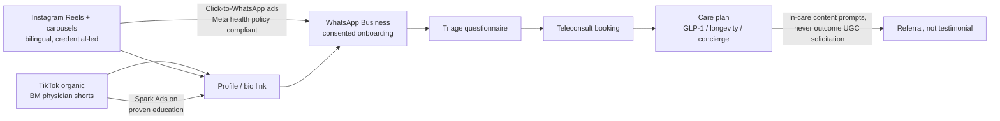

# Instagram & TikTok for Malaysian Healthcare Marketing

Instagram and TikTok are the two channels where Malaysian consumers actually discover aesthetic, weight-loss, and preventive-health services — and the two channels where Malaysian regulators and the platforms themselves impose the tightest creative restrictions on exactly that content. This document maps both platforms' Malaysian audiences (2025–2026 data), documents how aesthetic clinics and slimming brands really market, verifies the local doctor-influencer landscape by name, analyses the TikTok Shop supplement economy and its enforcement record, and converts the combined MOH/MAB + Meta + TikTok rulebook into an operational creative system for Welltech: content pillars, formats, cadence, a pre-publication compliance checklist, and the routing path from short video to WhatsApp consultation. It builds on the demographic and regulatory baselines in [malaysia-consumer-behaviour.md](../10-market-intelligence/malaysia-consumer-behaviour.md) and [malaysia-regulations.md](../10-market-intelligence/malaysia-regulations.md), and complements [./facebook.md](./facebook.md) and [./youtube.md](./youtube.md).

Last updated: July 2026

---

## 1. Platform demographics: who is actually reachable

### 1.1 Headline numbers (Malaysia, late 2025 / early 2026)

| Metric | Instagram | TikTok | Source year |
|---|---|---|---|
| Ad-reachable users | 16.1M (all 13+) | 30.7M (18+ only) | late 2025[^1] |
| Share of population | 44.6% of total population; 54.6% of eligible (13+) | 114.8% of adults 18+ (duplicate/multi-accounts inflate) | late 2025[^1] |
| Gender split | ~55% female in MY per prior analysis (see consumer-behaviour doc) | 52.2% female (16.5M F vs 15.1M M) | 2026[^2] |
| Age concentration | urban/affluent 25–44 skew (see consumer-behaviour doc) | 61.5% aged 18–34; 25–34 alone = 40.8% (12.9M) | 2026[^2] |
| Momentum | stable | −1.37M potential reach (−4.3%) Jul–Oct 2025 — first plateau signal | 2025[^1] |

Interpretation notes:

- TikTok's ">100% of adults" reach is an artefact of multiple accounts and loose age declaration; treat 30.7M as an upper bound on unique adults, not a count.[^1]
- TikTok is no longer "the youth platform" in Malaysia: the modal ad-reachable user is 25–34 — squarely Welltech's medical weight-loss and preventive-health entry demographic.[^2]
- Instagram remains the smaller but wealthier surface: the urban, female, 25–44, premium-services skew documented in [malaysia-consumer-behaviour.md](../10-market-intelligence/malaysia-consumer-behaviour.md) is where aesthetic and longevity positioning converts.
- The TikTok reach contraction (−4.3% in one quarter) is worth monitoring but is more likely account-hygiene enforcement than user exodus.[^1]

### 1.2 Engagement benchmarks

- Healthcare/wellness brands on Instagram: ~1.0–2.0% engagement by followers is the realistic band, with Reels the strongest format; cross-industry Reels engagement slid to ~0.50% by early 2026 on some panels — methodology varies up to 26x across sources, so benchmark internally after 90 days rather than against published medians.[^3]
- TikTok's Malaysian median engagement (~1.73%) remains an order of magnitude above Facebook (~0.05%) — established in [malaysia-consumer-behaviour.md](../10-market-intelligence/malaysia-consumer-behaviour.md); do not re-litigate channel priority.

**Implications for Welltech.** TikTok is the reach engine (30M+ adults, 25–34 core), Instagram the trust-and-premium engine (16M users, affluent female skew). A Malaysia-first digital clinic does not choose between them; it sequences them — TikTok for problem-aware discovery, Instagram for evaluation, WhatsApp for conversion (see §7).

---

## 2. How aesthetic clinics and slimming brands actually market — and the before/after rule stack

### 2.1 Observed content patterns (Malaysian market)

Malaysian aesthetic-clinic and slimming-brand marketing on IG/TikTok clusters into five recurring patterns:[^4]

1. **Doctor-led education** — LCP-certified aesthetic doctors explaining treatments (profhilo, pico laser, skin boosters) direct-to-camera; agencies now explicitly advise this as "the safest content format under MOH rules."[^4]
2. **Treatment-room B-roll** — procedure ASMR, machine close-ups, "what to expect" walkthroughs that imply outcomes without stating claims.
3. **Grey-zone transformation content** — before/after grids and patient "journeys," widespread despite being prohibited in facility advertising (enforcement is complaint-driven and inconsistent; see §2.2).
4. **Promo mechanics** — time-limited packages and price-led offers, which agency compliance guides themselves flag as likely breaches of MOH advertising guidelines.[^4]
5. **Slimming-brand affiliate flywheels** — supplement brands seeding hundreds of nano/micro affiliates through TikTok Shop with in-video checkout (see §4).

The competitive insight: most Malaysian aesthetic/slimming marketing operates in open non-compliance. That is a short-term growth tactic and a long-term liability — 38,055 unapproved ads were removed Jan 2023–Dec 2025 (see [malaysia-regulations.md](../10-market-intelligence/malaysia-regulations.md)), and enforcement attention is rising with the GLP-1 wave.

### 2.2 The before/after rule stack — three layers, all binding

| Layer | Rule | Practical effect |
|---|---|---|
| **MOH/MAB (law)** | MAB Advertising Guidelines for Healthcare Facilities and Services prohibit patient testimonials, before/after patient photographs, photos of practitioners performing procedures, and comparative/superlative claims; every medicine/service ad needs prior MAB approval + KKLIU number.[^5] | Before/after weight or aesthetic imagery in any Welltech-controlled advertising is prohibited regardless of platform. Detail in [malaysia-regulations.md](../10-market-intelligence/malaysia-regulations.md). |
| **Meta (platform)** | Personal-health ad policy bans before/after images and "idealized results"; 2026 enforcement extends to *implied* transformations (date-stamped image sequences, lighting/posture patterns detected automatically). Weight-loss ads must target 18+, cannot state weight amounts or time-bound claims, and cannot imply knowledge of the viewer's health status (even "for people managing diabetes" framing is flagged).[^6][^7] | Meta's machine enforcement is now stricter than MOH's manual enforcement. Creative that "reads" like transformation gets rejected or throttles the ad account. |
| **TikTok (platform)** | Weight-management policy: before/after transformation imagery prohibited in paid ads; fat-burners, appetite suppressants, detox teas and fasting products/services prohibited outright; fasting apps banned since 2020; weight-management ads restricted to 18+; content must not body-shame, suggest an ideal body type, or promise improved life circumstances from weight change.[^8][^9] In July 2025 TikTok extended this to **branded content**: creators cannot promote weight-loss products or make GLP-1/GLP-1-mimicking claims, including "implied" weight-loss promotion.[^10] | The organic/creator loophole is closing. Paying an influencer to promote a weight-loss service on TikTok now violates platform policy even before Malaysian law is considered. |

Additionally, POM weight-loss drugs (Wegovy, Mounjaro, Saxenda, Ozempic) cannot be advertised to the Malaysian public by name at all — MOH's Pharmacy Enforcement Division issued warning letters over 48 social-media ads naming these drugs in 2025 alone.[^11]

**Implications for Welltech.** Welltech's competitors' best-performing creative format (transformation content) is triply prohibited for a compliant operator. This is an advantage, not a constraint: build the brand on the *only* durable format — physician-led education — and let competitors accumulate regulatory and ad-account risk. Never name GLP-1 brands in any public-facing asset; use MAB-approved service-level language ("medically supervised weight management").

---

## 3. Doctor-influencer landscape: verified Malaysian medfluencers

All individuals below were verified through search during July 2026 research; follower counts are as surfaced in sources and require live audit (see Verification queue). Both names flagged for verification — "Dr Say Shazril" and "Dr Samhan" — are real and substantial.

| Name | Credential / role | Platform focus | Followers (as found) | Content pattern | Source |
|---|---|---|---|---|---|
| Dr Samhan (Samhan Awang) | GP, men's-health doctor; founder/CEO, HIM Wellness (telehealth); clinic in Kuala Terengganu | TikTok @dr.samhan | 1.7M followers, 25.3M likes | 2+ videos/day since Dec 2020; men's sexual health, myth-busting in BM; sells via own wellness brand — note testimonial-style product videos are a compliance grey zone[^12][^13] | TikTok profile; MalaysiaNow |
| Dr Nur Amalina Che Bakri | Surgeon (specialist trainee) & breast-research PhD fellow, Imperial College London | Instagram @dramalinabakri | ~845K | Evidence-based myth-busting, anti-misinformation advocacy; national celebrity since 2004 (17As SPM)[^14] | Wikipedia; IG profile |
| Dr Malar Santhi Santherasegapan | Medical doctor (govt + private experience), MBA healthcare mgmt | TikTok @drmalarss | 687K followers, 6.2M likes | COVID-era rise; bite-sized health education in fluent BM; multiracial-unity public figure[^15] | Voice Asia News; TikTok |
| Dr Lim Ing Kien ("Dr Ingky") | Cosmetic dermatology/aesthetic physician; founder, Medii Skin Studio (4 Klang Valley outlets) + Skynfyx digital skin clinic | TikTok/IG @dr_ingky | IG ~653K; TikTok n/a | Bilingual skincare reviews, procedure education aimed at teens/20s; the model for compliant aesthetic-doctor content[^16] | Her World/Women's Weekly; IG profile |
| Dr Say Shazril (Shazril Shaharuddin) | Medical doctor (MBBS, MSU-Bangalore); "doktor selebriti"; freelance at private clinics | IG @say_shazril; TikTok @say_shazril0 | IG ~479K; TikTok ~334K | Lifestyle-health hybrid, autism-awareness parenting content; Tergempak 2023 lifestyle content award[^17] | ecentral.my; TikTok/IG profiles |
| Dr Rafidah Abdullah | Consultant nephrologist, Hospital Putrajaya; MOH renal palliative-care committee chair | TikTok/X @rafidah72 | TikTok ~188K, 1.6M likes | Specialist explainer content in BM; kidney health, occasional controversy (2021 COVID commentary backlash)[^18] | TikTok profile; The Vibes |
| Medical Mythbusters Malaysia (M3) | ~46-member volunteer collective of doctors/pharmacists/dietitians, est. 2016 | Facebook-first, multi-platform | ~53.6K avg reach/post (FB, COVID era) | 7–10 debunking posts/week; the institutional myth-busting franchise[^19] | Health Analytics Asia; The Star |

Landscape observations:

- **BM-language GP/lifestyle creators dominate scale** (Dr Samhan 1.7M, Dr Malar 687K); English-first specialists skew smaller but reach the affluent Instagram cohort (Dr Amalina).
- **The monetization split is visible and instructive.** Dr Samhan converts audience into his own telehealth/wellness brand — directly analogous to Welltech's model, and proof the physician-creator-to-DTC-health funnel works in Malaysia. Dr Lim converts to clinic bookings and a digital-skin service. Neither route relies on paid weight-loss claims.
- **No verified Malaysian endocrinologist-creator of scale surfaced** — the obesity-medicine/GLP-1 education niche is structurally empty because the drugs cannot be named publicly (POM rule). Whoever owns compliant, unbranded "medical weight management" education owns an uncontested lane.
- Dr Kuljit Singh (APHM president, ENT surgeon at Prince Court) is a media commentator on private-hospital policy rather than a consumer-facing influencer — relevant for PR/thought-leadership, not creator campaigns.[^20]

**Implications for Welltech.** Do not buy reach from lifestyle influencers for clinical claims (a KKLIU violation — §6). Instead: (a) build in-house physician-creators on the Dr Samhan/Dr Ingky playbook; (b) partner with credentialed specialists for co-created education (no product claims, no payment-for-endorsement of medicines); (c) treat the empty endocrine/obesity-medicine lane as the flagship content franchise.

---

## 4. The TikTok Shop supplement economy and its regulatory trouble

TikTok Shop has fused content, influence, and checkout: beauty, health, and personal care dominate Malaysian TikTok Shop GMV (beauty was the #1 category in Q1 2025), with health supplements growing double-digit.[^21] The same rails move unregistered and adulterated products:

- **Unregistered medicines sold via live commerce.** In November 2025 MOH publicly warned sellers against using TikTok Live to promote and sell unregistered medicines, part of a broader crackdown in which press reporting cited thousands of compounds worth roughly RM8.5M issued in 2025 for unregistered health-product offences.[^22]
- **Adulteration is chemical, not just legal.** NPRA testing of unregistered products seized in Malaysia repeatedly finds undeclared sibutramine (a withdrawn appetite suppressant), steroids, tadalafil, and even warfarin; sibutramine-adulterated slimming products circulating on social commerce are documented in [malaysia-consumer-behaviour.md](../10-market-intelligence/malaysia-consumer-behaviour.md), and NPRA issued 11 public alerts in 2025.[^23]
- **The GLP-1 grey market.** Unregulated "GLP-1 patches" and mimic products exploded on TikTok Shop internationally; in Malaysia, prescription-only weight-loss injections are bought via social media, messaging apps and e-commerce in circumvention of prescription law.[^24][^11]
- **Platform response.** TikTok Shop Malaysia requires MAL (NPRA notification) numbers for listed medicines/supplements, and TikTok's 2025 policy wave banned weight-management products and GLP-1 claims from Shop and branded content — enforcement is real (creators report pulled listings and wiped commissions) but porous.[^10][^25]
- **Influencer overclaiming is being called out.** In late 2025, Malaysian influencer "Faiz Soul" publicly admitted overclaiming a juice product marketed at diabetic patients — an example of the testimonial-driven supplement economy MOH's KKLIU regime exists to police.[^26]

**Implications for Welltech.** (1) Never sell through TikTok Shop's supplement rails — category contamination means adjacency risk; a medical brand next to sibutramine sellers loses more trust than the GMV is worth. (2) The consumer's default reference point for "weight-loss product bought online" is a scam — Welltech's marketing should explicitly weaponize this ("if it doesn't come with a doctor, a prescription, and a MAL/KKLIU trail, don't swallow it"), converting the enforcement news cycle into brand tailwind. (3) Monitor NPRA alerts monthly; each new sibutramine alert is a compliant-content opportunity.

---

## 5. Short-video content strategy for medical credibility

What demonstrably works for Malaysian medical creators (patterns from §3 accounts and platform data):

1. **Myth-busting as the anchor franchise.** M3's decade of output and Dr Amalina's anti-misinformation positioning show debunking is the highest-trust format; it also aligns with MCMC/MOH priorities rather than against them.[^19][^14]
2. **Specialist-explains-simply.** Dr Malar's COVID-era growth came from compressing complex topics into bite-sized BM; Dr Rafidah does the same for nephrology. Credential on screen + kampung-simple language is the formula.[^15][^18]
3. **Day-in-the-life / behind-the-scenes.** Clinic walkthroughs and "what happens at your first consult" content de-risks the booking decision without making outcome claims — the compliant substitute for before/after.
4. **High cadence beats high polish.** Dr Samhan's 2+ videos/day since 2020 built the largest medical audience in the country; TikTok's algorithm rewards early-hour engagement, and Malaysian usage peaks at lunch, post-work evenings, and a late-night 10pm–2am window.[^13][^27]
5. **Hooks in the first 2 seconds, claims never.** Question hooks ("Kenapa berat naik balik lepas diet?"), enforcement-news hooks ("NPRA baru tarik produk ini..."), and stitch/duet responses to viral misinformation outperform brand-first openings.
6. **BM first, English for the premium layer.** The scale audience (TikTok, 25–34, mass-affluent) is BM/Manglish; the Instagram evaluation audience accepts English. Mirror the platform split: TikTok BM-led with English captions, Instagram bilingual with English-led carousels. Disclosure language must match content language (§6).
7. **Native replies as content.** Comment-reply videos (answering real patient questions generically, never diagnosing individuals) compound trust; the MMC social-media guideline requires avoiding personalized advice and patient-identifying content.[^28]

**Implications for Welltech.** Institutional polish is a disadvantage on TikTok; a named, consistent physician face at 4–7 videos/week beats an anonymous brand at 2/week. Budget for a repeatable studio-in-clinic capture system, not campaigns.

---

## 6. Influencer-marketing rules: KKLIU, disclosure, and the UGC/testimonial wall

The full regime is documented in [malaysia-regulations.md](../10-market-intelligence/malaysia-regulations.md); operational essentials for social campaigns:

- **KKLIU applies to influencer posts.** Any post making a health claim about a medicine, supplement, device, or health service requires prior MAB approval and a visible KKLIU number on the creative — lead time ~4–6 weeks; restricted words ("cures," "treats," "prevents") are barred; doctor-KOLs get no exemption.[^29][^30]
- **Disclosure under the MCMC Content Code (2022).** Paid or reciprocal arrangements must be labelled clearly — "Ad"/"Sponsored"/"Advertisement" at the start of the caption or within the first seconds of video; vague tags ("sp," "spon," "collab," "thanks," "ambassador") are non-compliant; disclosure must be in the same language as the post; non-disclosure risks removal, fines, or CMA investigation.[^31]
- **The testimonial wall.** Patient testimonials promoting services, skills, or treatment outcomes cannot be published in Malaysian healthcare-facility advertising — a rule Malaysian medical-tourism bodies themselves criticize as leaving local hospitals unable to match Singaporean/Thai competitors' review-driven marketing.[^5][^32] Consequence for UGC strategy: **reposting a patient's glowing outcome video to a Welltech channel converts it into facility advertising and a violation.** Patients may say what they like on their own accounts; the brand may not solicit, pay for, amplify, or embed it.
- **MMC professional rules bind the doctors personally.** The 2025 MMC guideline on dissemination of information (including social media) prohibits practitioners from publishing patient-identifying information without written consent, from procedure-on-patient imagery, and from self-aggrandizing promotion — a doctor-creator's registration is on the line, independent of brand liability.[^28]

Contract clauses any Welltech influencer/creator agreement must contain *(analyst framework, derived from the above rules)*:

1. No health, treatment, outcome, or product claims outside pre-approved, KKLIU-numbered scripts; no naming of POM medicines under any circumstances.
2. Mandatory MCMC-compliant disclosure ("Iklan"/"Ad") at caption start / first 3 seconds, same language as content.
3. No before/after, transformation, body-shaming, or "ideal body" creative (MAB + Meta + TikTok policies incorporated by reference).
4. Pre-publication review right + 24-hour takedown covenant; indemnity for off-script claims.
5. No concurrent promotion of unregistered health products (MAL/KKLIU screening of the creator's last 12 months of sponsored content before signing).

**Implications for Welltech.** The testimonial prohibition removes the cheapest trust asset in DTC health. Substitute stack: physician-fronted education (§5), process transparency (pricing, credentials, LCP/MOH registrations on-screen), third-party press, and Google-review volume (reviews on independent platforms, unsolicited and un-amplified by Welltech, sit outside facility-advertising creative — confirm boundary with counsel; see Verification queue).

---

## 7. Welltech creative system

### 7.1 Role split

| | TikTok | Instagram |
|---|---|---|
| Funnel role | Discovery: problem-aware mass audience (25–34 core) | Evaluation: affluent 25–44 women; proof-of-legitimacy surface |
| Content lead | BM-led physician shorts, high cadence | Bilingual; credentials, clinic, pricing transparency, carousels |
| Format mix | 60–70% myth-busting/explainers, 20% BTS/day-in-life, 10–20% news-reactive (NPRA alerts, GLP-1 headlines) | Reels (cross-posted best TikToks), credential carousels, Stories Q&A with question stickers, Highlights as "compliance-safe brochure" |
| CTA | "Link in bio → WhatsApp" (never in-video product claims) | Bio link + Stories link sticker → WhatsApp |
| Paid | Spark Ads on proven organic education (18+ targeting mandatory); no weight-management product claims in paid | Lead-form + click-to-WhatsApp ads under Meta health policy constraints (no personal-attribute framing) |

### 7.2 Content pillars (all KKLIU-screened)

1. **"Doktor Jawab"** — myth-busting and comment-reply franchise (BM; the reach engine).
2. **Metabolic health education** — unbranded weight-science explainers: insulin resistance, muscle mass, sleep; never drug names, never kg/timeframe promises.
3. **How medical care works** — first-consult walkthroughs, "what a prescription-only medicine means," how to check MAL/KKLIU numbers (positions Welltech as the anti-scam authority; feeds off §4 news cycle).
4. **Longevity/preventive** — screening, biomarkers, healthy-aging content for the Instagram premium cohort.
5. **Team & operations** — clinicians' credentials, day-in-the-life, WhatsApp-care demo (the trust substitute for testimonials).

### 7.3 Cadence

- TikTok: 5–7 posts/week (min. 4 physician-fronted); post at lunch (12–2pm), evening (7–10pm) MYT windows.[^27]
- Instagram: 3–4 Reels/week (best TikTok performers re-cut), 1–2 carousels, daily Stories; respond-to-DM SLA <1h routed to WhatsApp.
- Monthly: one NPRA-alert reactive video within 48h of any weight-loss product alert.

### 7.4 Pre-publication compliance checklist (every asset)

1. Health/service claim present? → MAB approval + KKLIU number on creative, or rewrite as pure education (no service link).
2. Any POM drug name (Ozempic/Wegovy/Mounjaro/Saxenda)? → remove; use "medically supervised weight management."
3. Before/after, transformation sequence, or implied timeline imagery? → reject (MAB + Meta + TikTok).
4. Testimonial or patient-outcome praise, including reposted UGC? → reject.
5. Patient identifiable? → written consent on file or reject (MMC).
6. Body-image framing (ideal body, desirability, shame)? → reject (TikTok/Meta).
7. Paid or gifted collaboration? → "Iklan"/"Ad" label at caption start / first 3s, same language as content (MCMC).
8. Paid distribution? → 18+ targeting; no personal-attribute copy (Meta); no weight-management product promotion (TikTok).
9. Superlatives, guarantees, comparisons, price-pressure mechanics? → reject (MAB).
10. Physician reviewer sign-off logged (name, date, version).

### 7.5 Path to WhatsApp

Short video → bio link / link sticker → WhatsApp Business entry point with consented onboarding flow → triage questionnaire → teleconsult booking. Rationale and build detail in [malaysia-whatsapp-healthcare.md](../10-market-intelligence/malaysia-whatsapp-healthcare.md). Two rules: never move a viewer straight from a video containing any health claim into a sales conversation without the education interstitial (keeps the video non-promotional), and log first-touch source per WhatsApp lead so TikTok-vs-Instagram CAC is measurable from week one.

### 7.6 Funnel architecture

### 7.7 KPI framework *(analyst targets, to be recalibrated after 90 days of owned data)*

| Stage | Metric | 90-day target | Rationale |
|---|---|---|---|
| Reach | TikTok video views/month | 500K+ | Achievable at 5–7 posts/week given MY median ER 1.73% and empty medical-education lane (§3) |
| Engagement | TikTok ER (engagements/views) | ≥1.7% | At or above MY platform median per consumer-behaviour baseline |
| Engagement | IG Reels ER by followers | ≥1.5% | Upper half of healthcare band (1.0–2.0%)[^3] |
| Capture | Profile-to-WhatsApp click-through | ≥3% of profile visits | Standard bio-link conversion band *(analyst estimate)* |
| Conversion | WhatsApp lead → booked teleconsult | ≥25% | Depends on triage UX; see [malaysia-whatsapp-healthcare.md](../10-market-intelligence/malaysia-whatsapp-healthcare.md) |
| Compliance | Assets published without checklist sign-off | 0 | Non-negotiable; one MAB complaint can trigger facility-wide scrutiny |
| Compliance | Takedown response time for flagged content | <24h | Matches contract covenant (§6) |

### 7.8 90-day launch sequence

1. **Weeks 1–4 — infrastructure.** Recruit/assign two physician faces (one BM-led for TikTok, one bilingual for IG); build in-clinic capture setup; draft 30 evergreen scripts across pillars 1–3; submit any claim-bearing creative to MAB (4–6 week lead time means this starts day one).[^30]
2. **Weeks 5–8 — publish and learn.** Launch at full cadence with education-only content (no claims → no KKLIU dependency); A/B hook styles; instrument WhatsApp source tagging before any paid spend.
3. **Weeks 9–12 — amplify.** Spark Ads behind top-3 organic performers; first NPRA-reactive video; first specialist collaboration (co-created education, no endorsement payment for medicines); review KPIs against §7.7 and reset targets on owned data.

**Implications for Welltech.** The system above is deliberately asymmetric to the market: competitors buy transformation reach and accumulate regulatory exposure; Welltech compounds a physician-media asset that platforms cannot throttle and MOH cannot cite. The moat is not follower count — it is the ability to publish daily *without* legal review bottlenecks because compliance is designed into the format library rather than inspected at the end.

---

### Verification queue (live checks before operational use)

- Follower audits (July 2026 live counts): @dr.samhan, @dramalinabakri, @drmalarss, @dr_ingky (TikTok count not found in research), @say_shazril/@say_shazril0, @rafidah72; engagement-rate pulls on last 20 posts each.
- TikTok Shop MY sweep: search "kurus," "slimming," "detox," "GLP-1 patch" listings; log MAL-number presence and NPRA-alert matches.
- Confirm current text of TikTok Weight Management ad policy and July 2025 branded-content rules directly (policy pages returned HTTP 403 to research proxy; summaries relied on secondary reporting).
- Counsel review: whether unsolicited third-party Google/consumer-platform reviews fall outside MAB "facility advertising" when not amplified by the facility.
- MAB current processing times for KKLIU approvals (4–6 week figure is agency-reported, not official).
- Live check whether Dr Samhan's product-testimonial TikToks carry KKLIU numbers — useful precedent either way.

## References

[^1]: DataReportal, "Digital 2026: Malaysia", https://datareportal.com/reports/digital-2026-malaysia (accessed July 2026).
[^2]: Affect Group, "Malaysia TikTok Audience by Age and Gender 2026", https://affectgroup.com/blog/tiktok-ads-audience-in-malaysia-2026-breakdown/ (accessed July 2026).
[^3]: Hootsuite, "Healthcare social media benchmarks: 2025 research", https://blog.hootsuite.com/healthcare-social-media-benchmarks/; Socialinsider, "2026 Instagram Organic Engagement Benchmarks", https://www.socialinsider.io/social-media-benchmarks/instagram (accessed July 2026).
[^4]: Zenweb, "Best Digital Marketing for Aesthetic Clinic in Malaysia Guide 2026", https://zenweb.my/industries/aesthetic-clinic/digital-marketing/; Lamanify, "The Marketing Blueprint for Malaysian Aesthetic Clinics", https://www.lamanify.com/blog/the-marketing-blueprint-for-malaysian-aesthetic-clinics (accessed July 2026).
[^5]: Ministry of Health Malaysia / Medicine Advertisements Board, "Advertising Guidelines for Healthcare Facilities and Services", https://pharmacy.moh.gov.my/sites/default/files/document-upload/advertisement-guidelines-services-edited-mab-6-2011.pdf (accessed July 2026).
[^6]: Meta Business Help Center, "Facebook's Advertising Policy on Personal Health", https://www.facebook.com/business/help/2489235377779939 (accessed July 2026).
[^7]: Meta Transparency Center, "Health and Wellness — Ad Standards", https://transparency.meta.com/policies/ad-standards/restricted-goods-services/health-wellness/; AuditSocials, "Meta Ad Policy Updates 2026", https://www.auditsocials.com/blog/meta-ad-policy-updates-2026-guide (accessed July 2026).
[^8]: TikTok Advertising Policies, "Weight Management", https://ads.tiktok.com/help/article/tiktok-ads-policy-weight-management (accessed July 2026).
[^9]: CNBC, "TikTok bans ads for fasting apps and restricts those promoting 'negative body image'", 23 Sep 2020, https://www.cnbc.com/2020/09/23/tiktok-bans-ads-for-fasting-apps-dieting-products.html (accessed July 2026).
[^10]: VizzyLabs, "TikTok Shop Bans Weight Loss Content: What Creators Must Know", https://app.vizzylabs.ai/blog/tiktok-shop-bans-weight-loss-content-what-creators-must-know; TikTok Seller University, "Requirements for Responsible Health-Related Content", https://seller-us.tiktok.com/university/essay?knowledge_id=4545471832983342 (accessed July 2026).
[^11]: Sinar Daily, "Online weight-loss drugs evade Malaysia's prescription laws", https://www.sinardaily.my/article/734317/focus/exclusives/online-weight-loss-drugs-evade-malaysias-prescription-laws (accessed July 2026).
[^12]: TikTok, "@dr.samhan" profile, https://www.tiktok.com/@dr.samhan (accessed July 2026).
[^13]: MalaysiaNow, "Doctors launch foray on TikTok in mission against fake news", 30 Mar 2021, https://www.malaysianow.com/news/2021/03/30/doctors-launch-foray-on-tiktok-in-mission-against-fake-news (accessed July 2026).
[^14]: Wikipedia, "Nur Amalina Che Bakri", https://en.wikipedia.org/wiki/Nur_Amalina_Che_Bakri; Instagram, "@dramalinabakri", https://www.instagram.com/dramalinabakri/ (accessed July 2026).
[^15]: Voice Asia News, "Dr. Malar Santhi Santherasegapan: Healing Minds, Touching Lives, Inspiring a Nation", https://voiceasianews.com/dr-malar-santhi-santherasegapan-healing-minds-touching-lives-inspiring-a-nation/; TikTok, "@drmalarss", https://www.tiktok.com/@drmalarss (accessed July 2026).
[^16]: Her World Singapore, "9 dermatologists to follow on TikTok", https://www.herworld.com/style/beauty/skin/dermatologists-follow-tiktok; Instagram, "@dr_ingky", https://www.instagram.com/dr_ingky/ (accessed July 2026).
[^17]: eCentral, "Dr Say Shazril: Biodata 'Doktor Selebriti' & Influencer Terkenal", https://ecentral.my/dr-say-shazril/; TikTok, "@say_shazril0", https://www.tiktok.com/@say_shazril0 (accessed July 2026).
[^18]: TikTok, "@rafidah72", https://www.tiktok.com/@rafidah72; The Vibes, "Putrajaya Hospital doctor panned for 'making light' of record Covid-19 deaths", https://www.thevibes.com/articles/news/29187/putrajaya-hospital-doctor-panned-for-making-light-of-record-covid-19-deaths (accessed July 2026).
[^19]: Health Analytics Asia, "How to battle medical misinformation", https://www.ha-asia.com/how-to-battle-medical-misinformation/; The Star, "Have health queries? Ask the Medical Mythbusters", 24 Jul 2016, https://www.thestar.com.my/news/nation/2016/07/24/have-health-queries-ask-the-medical-mythbusters (accessed July 2026).
[^20]: APHM Conference & Exhibition, "Dr Kuljit Singh" speaker profile, https://aphmconferences.com/speakers2024/dr-kuljit-singh/ (accessed July 2026).
[^21]: Statista, "Malaysia: GMV share on TikTok Shop by product category 2024", https://www.statista.com/statistics/1535790/malaysia-gmv-share-on-tiktok-shop-by-product-category/; Resourcera, "TikTok Shop Statistics (2025–2026): Global GMV & Insights", https://resourcera.com/data/social/tiktok-shop-statistics/ (accessed July 2026).
[^22]: Malay Mail, "Health Ministry warns sellers against using TikTok Live to promote unregistered medicines", 20 Nov 2025, https://www.malaymail.com/news/malaysia/2025/11/20/health-ministry-warns-sellers-against-using-tiktok-live-to-promote-unregistered-medicines/199052 (accessed July 2026). RM8.5M compounds figure is press-reported; verify against MOH releases.
[^23]: PMC, "The issues and challenges of addressing the importation of unregistered pharmaceutical products in Malaysia", https://pmc.ncbi.nlm.nih.gov/articles/PMC12239228/; NPRA press releases, https://www.npra.gov.my/index.php/en/informationen/general-information/press-release.html (accessed July 2026).
[^24]: Media Matters for America, "Unregulated GLP-1 patches are exploding on TikTok Shop", https://www.mediamatters.org/tiktok/unregulated-glp-1-patches-are-exploding-tiktok-shop (accessed July 2026).
[^25]: STAT News, "TikTok cracks down on users posting about popular weight loss drugs", 19 Jul 2023, https://www.statnews.com/2023/07/19/tiktok-wegovy-ozempic-weight-loss-drugs-obesity/ (accessed July 2026).
[^26]: WorldOfBuzz, "Malaysian Influencer Admits Overclaiming 'Health Product' Marketed for Diabetic Patients", https://worldofbuzz.com/its-just-a-drink-malaysian-influencer-admits-overclaiming-health-product-marketed-for-diabetic-patients/ (accessed July 2026).
[^27]: KOLHUB, "Best Time to Post on TikTok Malaysia 2025", https://kolhub.com/my/best-time-to-post-on-tiktok-malaysia (accessed July 2026).
[^28]: Malaysian Medical Council, "The Dissemination of Information by Medical Professionals Including on Social Media", https://mmc.gov.my/wp-content/uploads/2025/09/The-Dissemination-of-Information-by-Medical-Profesionals-Including-on-Social-Media.pdf (accessed July 2026).
[^29]: Disruptive Doctors, "KKLIU Regulations: A Doctor's Guide to Ethical Healthcare Marketing in Malaysia", https://disruptive-doctors.com/kkliu-advertising-guidelines-malaysia/ (accessed July 2026).
[^30]: MYSense, "KOL Malaysia 2026: Healthcare Influencer Guide", https://mysense.com.my/kol-malaysia-healthcare-influencer-marketing-guide/ (accessed July 2026).
[^31]: Shearn / SHC Legal, "Content Code Revamp 2021: Influencer Marketing and Disclosures", https://www.shco.my/content-code-influencer-marketing/; Communications and Multimedia Content Forum, "Content Code 2022", https://contentforum.my/wp-content/uploads/2022/08/Content-Code-2022.pdf (accessed July 2026).
[^32]: LaingBuisson IMTJ, "Out-dated advertising rules affect Malaysia", https://www.laingbuissonnews.com/imtj/news-imtj/out-dated-advertising-rules-affect-malaysia/ (accessed July 2026).
