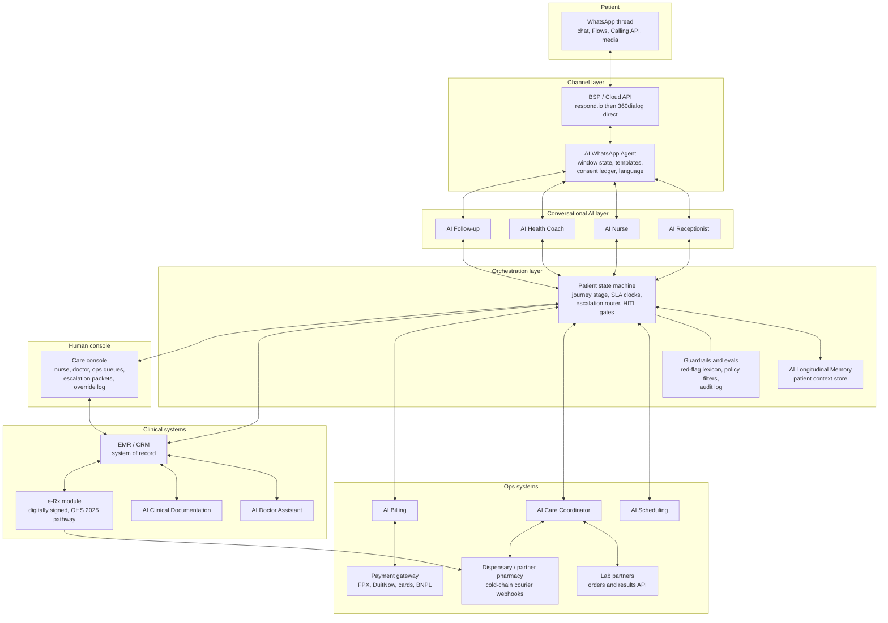

# The AI-Native Clinic: Master Architecture for Welltech Health

**Abstract.** This document is the master design for Welltech Health as an AI-native clinic: a Malaysian digital healthcare operation (telehealth, GLP-1 medical weight loss, longevity/preventive medicine, concierge care) in which AI performs orchestration, administration, monitoring and drafting, while licensed doctors perform judgment, prescribing and relationships — connected by explicit human-in-the-loop gates. It specifies eleven AI staff roles (Receptionist, Nurse, Care Coordinator, Health Coach, Doctor Assistant, Follow-up, Clinical Documentation, Scheduling, Billing, WhatsApp Agent, Longitudinal Memory) with inputs/outputs, escalation rules and KPIs; the system architecture from WhatsApp Business API through orchestration to EMR, e-Rx, labs and payments; the model/vendor strategy; the longitudinal patient-memory design that makes months-long GLP-1 care coherent; the regulatory guardrails mapped to Malaysian law (SaMD Class B boundary, PDPA, MMC accountability, audit logging); a staffing model quantifying AI leverage; and a risk register. The design premise, taken from this repository's research, is that Malaysian healthcare complaints are overwhelmingly operational and communicative, not clinical ([recurring complaints §15](../30-patient-reviews/recurring-complaints.md)), and that Malaysian doctors' top removable burdens are administrative, not medical ([clinician pain points §1](../40-doctor-experience/clinician-pain-points.md)). The AI clinic is therefore an operations machine with a medical licence at its centre — not a diagnosis machine.

**Last updated: July 2026**

Related documents: [AI patient journey](ai-patient-journey.md) · [Automation opportunity map](automation.md) · [WhatsApp operating model](whatsapp-operating-model.md) · [Malaysia WhatsApp healthcare](../10-market-intelligence/malaysia-whatsapp-healthcare.md) · [Malaysia regulations](../10-market-intelligence/malaysia-regulations.md) · [Recurring complaints](../30-patient-reviews/recurring-complaints.md) · [Clinician pain points](../40-doctor-experience/clinician-pain-points.md)

---

## 1. Design principles

1. **AI orchestrates; doctors judge.** AI handles intake, scheduling, reminders, monitoring, drafting, logistics, billing and documentation. Doctors handle diagnosis, prescribing decisions, dose changes, abnormal-result interpretation, and the therapeutic relationship. This split is simultaneously the regulatory line (administrative AI is not a medical device; diagnostic/dosing AI is registrable SaMD under Act 737 — [regulations §8](../10-market-intelligence/malaysia-regulations.md)), the clinical-safety line (MMC's AI guideline keeps the doctor accountable for AI-assisted decisions), and the economic line (admin is 60–80% of inbound volume — [WhatsApp healthcare §8](../10-market-intelligence/malaysia-whatsapp-healthcare.md)).
2. **Human-in-the-loop gates are architectural, not procedural.** Every clinically consequential action passes a named human gate enforced in code: no prescription exists without a doctor's signature event; no dose change without doctor approval; no abnormal lab result reaches a patient before doctor sign-off; no side-effect above severity threshold is closed by AI alone. Gates are logged; bypass is technically impossible, not merely forbidden.
3. **Proactive beats reactive.** Real-world GLP-1 persistence collapses early — 18% discontinue by month 3 and ~50%+ by month 12 in population data[^6][^7] — and retention is the entire business ([weight-loss market §retention](../10-market-intelligence/malaysia-weight-loss-market.md)). The AI clinic initiates contact (check-ins, reminders, results, refills) rather than waiting for complaints; the deployed-at-scale precedent is AI post-discharge follow-up calling with 9.0/10 patient ratings at US health systems.[^3]
4. **WhatsApp is the ward.** Every patient-facing AI role speaks through one WhatsApp thread — the channel Malaysians already use for care ([WhatsApp healthcare §2–3](../10-market-intelligence/malaysia-whatsapp-healthcare.md)) — engineered around service-window economics (patient-initiated conversations are free; utility templates re-open the window).
5. **Every conversation becomes structured data.** Flows capture intake, check-ins and consent as fields, not prose; free text is extracted into the longitudinal memory (§5). The chat thread is a channel; the EMR is the record ([regulations §7.3](../10-market-intelligence/malaysia-regulations.md)).
6. **Design against the complaint taxonomy.** Each AI role exists to prevent a researched failure: support black holes (T2), prescription lock-in (T3), delivery failures (T4), refund stalls (T5), queue voids (T6), rushed consults (T8) — see the [exploitation map](../30-patient-reviews/recurring-complaints.md) and stage-by-stage mapping in [ai-patient-journey.md](ai-patient-journey.md).
7. **Remove the doctor's burdens, never add one.** The AI staff exists as much for clinicians as patients: AI-drafted notes, AI-prepared charts, AI-absorbed after-hours messaging, auto-claims — targeting ≤5 non-clinical minutes/doctor/day ([clinician pain points §3](../40-doctor-experience/clinician-pain-points.md)). Evidence calibration: ambient scribes save real but modest time (16 min documentation per 8h of care in a 1,800-clinician study;[^1] 4+ min/patient in the best implementations[^8]) — so the doctor-time win must come from the *whole* stack (intake prep + scribe + auto-claims + message absorption), not the scribe alone.
8. **Bilingual by default.** Every AI surface handles Bahasa Malaysia, English and Manglish code-switching; Mandarin phase 2. This is a moat: global bot templates are English-first ([WhatsApp healthcare §8](../10-market-intelligence/malaysia-whatsapp-healthcare.md)).

---

## 2. The AI staff model

Eleven AI roles, mirroring a clinic's org chart. Each is a bounded agent: defined tools, defined data access, defined escalation rules, own KPI dashboard. "Escalates to" is enforced in the orchestration layer (§3), not left to model discretion.

| AI role | Human analogue | Autonomy level | Primary human counterpart |
|---|---|---|---|
| AI Receptionist | Front desk | Full (admin only) | Ops lead (exceptions) |
| AI Nurse | Triage/monitoring nurse | Assisted — protocol-bound | Registered nurse |
| AI Care Coordinator | Case manager | Full (logistics) / assisted (clinical touchpoints) | Care ops lead |
| AI Health Coach | Dietitian assistant / coach | Assisted — content whitelisted | Dietitian |
| AI Doctor Assistant | Houseman/clinical assistant | Drafts only — zero autonomy | Doctor |
| AI Follow-up | Recall clerk + retention manager | Full (outreach) / assisted (content) | Care ops lead |
| AI Clinical Documentation | Medical scribe | Drafts only | Doctor (signs) |
| AI Scheduling | Appointments clerk | Full | Ops lead |
| AI Billing | Billing clerk | Full (issuance) / gated (refunds > threshold) | Finance |
| AI WhatsApp Agent | Switchboard + channel manager | Full (routing) | — (infrastructure role) |
| AI Longitudinal Memory | The clinic's institutional memory | Infrastructure — no patient contact | Data/clinical governance |

### 2.1 AI Receptionist

- **Role**: first responder to every inbound WhatsApp contact. Greets in BM/EN within seconds, detects intent (new enquiry, booking, reschedule, price question, complaint, clinical message), answers whitelisted FAQs (hours, prices, programme contents, what-to-expect), routes everything else.
- **Inputs**: inbound messages, CTWA ad context (which ad/campaign), FAQ knowledge base, price list, patient-record existence flag.
- **Outputs**: intent classification; FAQ answers; handoffs to Scheduling, Nurse, or human; all-in price quotes (the anti-[T1](../30-patient-reviews/recurring-complaints.md) function — full programme price before any commitment).
- **Escalation**: any clinical content → AI Nurse; anger/complaint sentiment → human ops within 15 min; emergency keywords → immediate 999/ED script + human alert; unrecognised intent after 2 turns → human.
- **KPIs**: first-response time (<10 s), containment rate (% resolved without human; target 60–80% of admin volume), misroute rate (<2%), price-quote completeness (100% all-in).

### 2.2 AI Nurse

- **Role**: protocol-bound symptom and side-effect monitor for enrolled patients. Runs structured check-ins (Flows), grades reported side-effects against the GLP-1 protocol (nausea/vomiting/constipation severity scales, red-flag screens for pancreatitis, gallbladder disease, severe dehydration, hypoglycaemia), delivers pre-approved self-care guidance for mild cases, and packages everything else for humans. It never diagnoses and never adjusts doses — that would cross the SaMD Class B line (§6.1).
- **Inputs**: check-in Flow responses, free-text symptom messages, patient's protocol stage/dose from memory (§5), the clinical protocol's grading rubric.
- **Outputs**: graded symptom events written to EMR; pre-approved advice (doctor-authored library); escalation packets (symptom summary + history + current dose) to human nurse or doctor.
- **Escalation matrix**: mild/expected (grade 1) → AI advice + log + next-day re-check; moderate/persistent (grade 2) → human nurse same day; severe/red-flag (grade 3) → doctor within 2 h + patient told to stop dose pending review; emergency signs → 999/ED script immediately, human notified in parallel.
- **KPIs**: check-in completion rate (>70%), escalation precision (% of escalations humans confirm as warranted; target >80%), missed-red-flag rate (target zero; audited weekly against full transcripts), time-to-human on grade 2/3 (<4 h / <2 h).

### 2.3 AI Care Coordinator

- **Role**: owns each patient's end-to-end logistics state: intake complete? consult booked? payment cleared? prescription signed? medication shipped? cold-chain delivery confirmed? labs ordered/collected? next review due? It is the process watchdog that prevents the researched chains T4→T2→T5 (delivery fails → silence → refund stall) by noticing stuck states *before* the patient does ([recurring complaints §10.1](../30-patient-reviews/recurring-complaints.md)).
- **Inputs**: state machine per patient (orchestration layer), courier webhooks, pharmacy/dispensary status, lab status, payment events, SLA clock definitions.
- **Outputs**: proactive status updates ("your delivery is delayed — new ETA tomorrow 2 pm; reply if that fails you"); internal exception tickets; auto-compensation triggers on missed SLAs (per published policy, the anti-[T5](../30-patient-reviews/recurring-complaints.md) design).
- **Escalation**: any SLA breach → human ops ticket + proactive patient notification (never silence); cold-chain excursion → block delivery, human pharmacist decision; repeated delivery failure → human callback.
- **KPIs**: % of delays notified proactively before patient asks (target >95%), stuck-state dwell time, delivery promise-kept rate (>98%), refund cycle time (<7 days).

### 2.4 AI Health Coach

- **Role**: daily/weekly behavioural support between clinical touchpoints — nutrition nudges, protein/hydration guidance during titration, activity prompts, plateau expectation-setting, Ramadan-mode content (suhoor/iftar timing, adjusted reminder clock — [consumer behaviour §6.1](../10-market-intelligence/malaysia-consumer-behaviour.md)), habit streaks. Content is drawn from a dietitian-authored, versioned library; the AI personalises selection and timing, not medical substance. Messaging-delivered coaching has RCT support for weight loss ([WhatsApp healthcare §4.3](../10-market-intelligence/malaysia-whatsapp-healthcare.md)).
- **Inputs**: goals and preferences from intake, weight logs, check-in data, fasting/festival calendar, engagement history (what this patient responds to), content library.
- **Outputs**: coaching messages (utility/service class), weekly progress summaries with trend charts, dietitian-session prompts when appropriate.
- **Escalation**: disordered-eating signals, mood/self-harm language → human clinician same day (pre-scripted supportive handoff); repeated non-engagement → AI Follow-up's re-engagement ladder; any request for dosing advice → AI Nurse rails.
- **KPIs**: weekly engagement rate, weight-log frequency, content fatigue (opt-down rate <5%/month), coached vs uncoached 12-week retention delta (the metric that proves the role).

### 2.5 AI Doctor Assistant

- **Role**: makes every consult a prepared consult. Before the doctor opens the video call: a one-screen brief (reason for visit, intake answers, weight/symptom trends, current dose and titration history, outstanding labs, flagged risks, prior-consult commitments). During/after: drafts orders, referral letters, patient-instruction summaries, and MC-policy responses (always "no MC from teleconsult-only" per the [MMC 2025 prohibition](../10-market-intelligence/malaysia-regulations.md)) for doctor review. This is the direct answer to rushed-consult complaints ([T8](../30-patient-reviews/recurring-complaints.md)) and the doctor's unpaid-admin burden ([clinician pain points §2](../40-doctor-experience/clinician-pain-points.md)); the Cedars-Sinai/K Health deployment shows AI-prepared, physician-approved virtual care operating at scale with quality ratings comparable to or above unassisted physicians.[^4]
- **Inputs**: longitudinal memory (§5), EMR record, intake Flow data, guideline/protocol library.
- **Outputs**: pre-consult brief; draft orders/letters/instructions — all requiring doctor action to take effect.
- **Escalation**: none outbound (it serves the doctor); it must surface, never suppress, conflicting data (e.g., pharmacy record vs patient-reported dose).
- **KPIs**: brief accuracy (doctor-rated, sampled), % consults with brief ready ≥30 min ahead (>99%), draft acceptance/edit rate, doctor prep time (<2 min).

### 2.6 AI Follow-up

- **Role**: the retention engine. Executes the cadence in [ai-patient-journey.md §cadence](ai-patient-journey.md): titration check-ins, refill windows, review-due recalls, lab recalls, month-2 churn-cliff interventions, plateau-phase support, win-back ladders for lapsed patients, annual-screening recalls for longevity members. Distinguishes *care* messages (utility class) from *marketing* messages (KKLIU-reviewed, opt-out-carrying — [regulations §6](../10-market-intelligence/malaysia-regulations.md)).
- **Inputs**: patient journey stage, persistence-risk score (engagement decay, missed check-ins, payment hesitancy, side-effect burden), template library with compliance classification, festival calendar.
- **Outputs**: scheduled outreach; risk-ranked "save lists" for human care-team calls; reactivation campaigns.
- **Escalation**: high churn-risk score → human retention call (evidence: live-staff contact outperforms pure automation — [WhatsApp healthcare §4.4](../10-market-intelligence/malaysia-whatsapp-healthcare.md)); stated intent to quit → structured off-boarding with doctor conversation offer (never hard-sell — the anti-[T7](../30-patient-reviews/recurring-complaints.md) rule: retention by service, not pressure).
- **KPIs**: 12-week and 12-month persistence vs the unmanaged ~50%/~30–50% baselines[^6][^7], check-in response rate, save rate on flagged patients, reactivation conversion, opt-out rate.

### 2.7 AI Clinical Documentation

- **Role**: ambient scribe plus record assembler. Transcribes and drafts SOAP notes from video/Calling-API consults (BM/EN code-switch capable); summarises the week's WhatsApp clinical exchanges into encounter-note addenda so the EMR — not the chat scroll — is the medical record ([regulations §7.3](../10-market-intelligence/malaysia-regulations.md)); auto-codes encounters for billing/claims. Every note is a draft until the doctor signs; signature events are the audit anchor.
- **Inputs**: consult audio/video, WhatsApp thread segments tagged clinical, EMR templates, coding rules.
- **Outputs**: draft SOAP notes; chat-to-record summaries; coded encounters; MMC-grade record completeness (doctor name/MMC number, date/time, modality).
- **Escalation**: low-confidence transcription segments flagged inline; any drafted content the doctor did not say is a severity-1 QA event (hallucinated documentation is the role's cardinal risk).
- **KPIs**: draft turnaround (<5 min post-consult), doctor edit distance, sign-off latency (<24 h), documentation time saved per doctor (measured, honestly benchmarked against the modest published effects[^1][^2]).

### 2.8 AI Scheduling

- **Role**: books, confirms, reschedules and fills. Runs slot inventory across doctors/nurses/dietitians and the physical clinic; enforces protocol-defined consult types (in-person initiation vs teleconsult follow-up — [regulations §3](../10-market-intelligence/malaysia-regulations.md)); executes T-72h/T-24h/T-2h confirmation cadence; backfills cancellations from a standby list. Appointment-holders are honoured or compensated (the anti-[T6](../30-patient-reviews/recurring-complaints.md) rule).
- **Inputs**: calendar inventory, protocol consult-type rules, patient preferences (language, doctor gender — a researched persona need), confirmation responses.
- **Outputs**: bookings with instant confirmation; reminder templates; backfill offers; doctor-day schedules with panel-size caps ([clinician pain points §3](../40-doctor-experience/clinician-pain-points.md)).
- **Escalation**: double-booking or capacity conflict → human ops; 2× no-show pattern → AI Follow-up re-engagement; same-day cancellations → human confirmation of backfill.
- **KPIs**: no-show rate (<10% vs 30–60% reduction benchmarks from automated reminders — [WhatsApp healthcare §8](../10-market-intelligence/malaysia-whatsapp-healthcare.md)), slot utilisation (>85%), reschedule self-service rate, time-to-booking from first contact.

### 2.9 AI Billing

- **Role**: quotes all-in prices pre-booking (anti-[T1](../30-patient-reviews/recurring-complaints.md)); issues payment links (FPX/DuitNow/cards/TNG/BNPL per [pricing §4.4](../50-marketing-intelligence/pricing.md)); retries failed payments with grace protocols; generates itemised digital receipts and LHDN e-invoices ([clinician pain points §1.1](../40-doctor-experience/clinician-pain-points.md)); executes published refund policy automatically when SLA triggers fire; prepares employer/insurer claim bundles.
- **Inputs**: price book (versioned, single source of truth), payment-gateway webhooks, SLA breach events, subscription states.
- **Outputs**: quotes, links, receipts, e-invoices, auto-refunds ≤ threshold, dunning sequences (grace-first, never care-blocking mid-titration without human review).
- **Escalation**: refund above threshold or any disputed charge → human finance same day; payment failure at a clinically sensitive moment (mid-titration refill) → care-team decision, not auto-suspension.
- **KPIs**: quote-before-commitment rate (100%), payment-link conversion, involuntary-churn rate from failed payments (<2%/month), refund cycle time (<7 days vs the researched 4-month incumbent failure), billing-dispute rate.

### 2.10 AI WhatsApp Agent (channel infrastructure)

- **Role**: the shared conversational substrate the other roles speak through: session and 24-hour-window state, template selection and compliance classification (utility vs marketing), opt-in/opt-out ledger enforcement, language detection and register (warm, brief, bilingual — [WhatsApp healthcare §3.4](../10-market-intelligence/malaysia-whatsapp-healthcare.md)), quality-rating protection (frequency caps, number warm-up), Flows rendering, media handling (injection-technique videos, result PDFs never sent before sign-off).
- **Inputs**: BSP/Cloud API events, template library, consent ledger, number-health metrics.
- **Outputs**: delivered messages with full metadata archived to EMR/CRM; window-state signals to other roles (send free service message vs paid utility template).
- **Escalation**: template rejection or quality-rating drop → ops alert; suspected impersonation/scam report → security runbook.
- **KPIs**: delivery rate, quality rating (protect "High"), template rejection rate, cost per patient-month (target ≈RM0.5–1 per the [modelled Meta fees](../10-market-intelligence/malaysia-whatsapp-healthcare.md)), opt-out honouring latency (immediate).

### 2.11 AI Longitudinal Memory

- **Role**: the institutional memory that makes month 6 feel like a continuation of day 1 — full design in §5. Serves every other role read-scoped context; ingests every structured and extracted datum; never contacts patients.
- **Inputs**: all events (messages, Flows, consults, notes, labs, deliveries, payments, consents).
- **Outputs**: patient context packets scoped per consuming role (the Health Coach does not see billing history; the Billing agent does not see clinical notes).
- **Escalation**: data conflicts (two weights same day, dose mismatch) → flagged to Doctor Assistant, never silently resolved.
- **KPIs**: context accuracy (sampled audit), retrieval latency, staleness (time from event to availability <1 min), access-scope violations (zero).

---

## 3. System architecture

Architecture rules:

- **The orchestration layer, not the LLM, owns state.** Journey stage, SLA clocks, escalation routing and HITL gates are deterministic code; LLMs classify, converse, extract and draft within it. An LLM can *request* a transition; only the state machine *performs* it. This confines model unreliability to recoverable surfaces.
- **The EMR is the system of record**; the BSP never owns the data model (per the [build-vs-buy rule](../10-market-intelligence/malaysia-whatsapp-healthcare.md)). Every WhatsApp payload is archived with timestamps and staff identity.
- **The human console is a first-class product.** Nurses and doctors work risk-ranked queues of AI-prepared escalation packets; every human action (approve, edit, override, reject) is captured — this is both the MMC accountability record and the training signal for improving the AI.
- **Guardrails run outside the model**: deterministic red-flag keyword tripwires (bilingual lexicon) that escalate regardless of model output; output filters blocking dose numbers, diagnosis statements and drug-brand names in marketing contexts; per-role tool allowlists.

---

## 4. Model and vendor strategy

### 4.1 LLM layer

| Consideration | Design position *(analyst view)* |
|---|---|
| Model choice | Frontier hosted API model (Claude/GPT class) for conversation, extraction and drafting — health-conversation quality is now formally measurable via physician-rubric benchmarks such as HealthBench (5,000 conversations, 262 physicians, 48,562 rubric criteria)[^5]; re-benchmark candidate models on a Welltech-specific BM/EN eval set, since public benchmarks under-test Malay and Manglish |
| Multi-model | Route by task: frontier model for clinical-adjacent conversation and scribing; cheaper small models for classification/routing/extraction (majority of token volume); never route clinical-adjacent tasks to the cheap tier |
| Data protection | Health data to any foreign LLM API is a PDPA sensitive-data processing + cross-border event: DPA/zero-retention terms, TIA on file, de-identification where feasible ([regulations §7.2](../10-market-intelligence/malaysia-regulations.md)); pseudonymise before inference where the task allows (coaching content selection does not need names) |
| Fine-tuning | Not at launch. Invest in prompts, retrieval, and evals; revisit fine-tuning/distillation for Manglish tone and template selection once ≥6 months of QA-labelled transcripts exist |
| Evals | Pre-deployment: golden-set conversations (BM/EN) per role with physician-written rubrics (HealthBench-style[^5]); red-team suite (dosing-advice bait, MC requests, prescription-drug marketing bait, self-harm content, PDPA probes). Post-deployment: weekly sampled transcript audits by a clinician, missed-red-flag audit of 100% of grade-2/3 symptom threads, drift dashboards |

### 4.2 BSP, EMR and stack components

| Component | Phase 1 (launch) | Phase 2 (scale) | Rationale |
|---|---|---|---|
| BSP | respond.io (KL-based, healthcare references, audit exports) | 360dialog / Cloud API direct once >50K msgs/month and agent logic is proprietary | Per the [BSP analysis](../10-market-intelligence/malaysia-whatsapp-healthcare.md); flat-licence beats markup at volume |
| Human inbox | BSP-native console | Custom care console fused with EMR | Escalation packets need EMR context the BSP inbox lacks |
| EMR | Malaysian cloud clinic system with API access (evaluate local CMS vendors for PHFSA/e-invoice fit), or lightweight FHIR-native store behind a thin clinic UI | Same, deepened | Non-negotiables: API-first, message-archive ingestion, audit log, MYS e-invoice support; the EMR choice is reversible only before the memory layer fills |
| e-Rx | In-EMR digitally signed prescription per OHS 2025 pathway, platform-to-pharmacist transmission | Same + partner-pharmacy network integration | [Regulations §4.3](../10-market-intelligence/malaysia-regulations.md) |
| Orchestration | Build (thin): state machine + router + gates is the proprietary core | Build (deep) | This layer *is* the company; see [automation.md §make-vs-buy](automation.md) |
| Scribe | Buy/API (mature category[^1][^2]) wrapped in own sign-off UX | Reassess build for BM/Manglish edge | Differentiation is language handling + chat-summarisation, not transcription |
| Payments | HitPay/Curlec/Stripe + BNPL (Atome first — [pricing §4.4](../50-marketing-intelligence/pricing.md)) | Same | Link-in-chat pattern; WhatsApp Pay not available in Malaysia |

---

## 5. Longitudinal memory design

GLP-1 and longevity care runs for months; the product dies if the patient must repeat themselves (the incumbents' chat threads are goldfish — every session starts cold). The memory layer is a structured patient-context store, not a raw chat log.

### 5.1 What the AI must remember (schema domains)

| Domain | Contents | Primary writers | Primary readers |
|---|---|---|---|
| Identity & preferences | Language/register, doctor-gender preference, contactable hours, family involvement consents, halal/cultural preferences | Receptionist, intake Flows | All patient-facing roles |
| Clinical baseline | Diagnoses, comorbidities, allergies, meds, baseline labs/vitals, contraindication screens, pregnancy/fertility status | Intake, Doctor Assistant, labs | Nurse, Doctor Assistant |
| Programme state | Programme/tier, current molecule & dose, titration week, next dose-review date, in-person-visit status (first-consult rule satisfied?) | Orchestration, doctor sign-offs | All |
| Symptom & side-effect history | Every graded event with dates, what advice was given, what resolved it ("nausea settled when she split meals — week 3") | AI Nurse | Nurse, Doctor Assistant, Coach |
| Outcomes trajectory | Weight series, adherence signals, lab trends, goal progress | Check-ins, labs | Coach, Doctor Assistant, Follow-up |
| Commitments & promises | Everything the clinic said it would do ("doctor will review your labs Friday"), everything the patient agreed to try | All roles | Care Coordinator (SLA watchdog) |
| Life context | Ramadan observance, travel dates, festivals, work constraints, family events volunteered in chat | Extraction from conversation | Coach, Follow-up, Scheduling |
| Consent & compliance ledger | PDPA consents by purpose, marketing opt-ins/outs, policy versions acknowledged | WhatsApp Agent, intake | WhatsApp Agent, Billing |
| Service history | Complaints, refunds, delivery incidents, sentiment trajectory | Coordinator, Billing | Receptionist (tone), Follow-up |

### 5.2 Design rules

1. **Structured first, extracted second.** Flows write fields directly; an extraction pass converts free text into candidate memory entries with source-message links; low-confidence extractions are queued for human confirmation rather than stored as fact.
2. **Role-scoped retrieval.** Each role receives a purpose-limited context packet (PDPA data-minimisation made architectural).
3. **Provenance on every fact.** Each entry carries source (message ID, Flow, note), author (AI/human), timestamp, confidence. Conflicts surface to humans; the memory never averages two contradictory weights.
4. **Clinical facts require clinical provenance.** A patient-reported dose is stored as *reported*; only the e-Rx record makes it *prescribed*.
5. **Forgetting is a feature.** Retention schedules follow medical-record norms for clinical data and shorter PDPA-aligned windows for behavioural/marketing data; erasure requests execute against the store with an auditable tombstone.
6. **The memory is the moat.** Twelve months of structured side-effect → intervention → outcome data across a Malaysian GLP-1 cohort is proprietary evidence no competitor holds ([WhatsApp healthcare §4.4](../10-market-intelligence/malaysia-whatsapp-healthcare.md) notes no published RCT on WhatsApp GLP-1 persistence support exists).

---

## 6. Regulatory guardrails mapped to Malaysian law

### 6.1 The SaMD Class B boundary — what the AI must NOT do

Under the Medical Device Act 2012 and MDA/GD/0062 (3rd ed., 2025), software intended for diagnosis, monitoring or treatment decisions is a registrable medical device (~Class B for non-critical decision support); administrative software is not ([regulations §8](../10-market-intelligence/malaysia-regulations.md)). Welltech's launch posture keeps every AI role on the administrative/drafting side of the line:

| Prohibited for AI (would cross SaMD line or MMC rules) | Permitted (administrative / assisted) |
|---|---|
| State or imply a diagnosis to a patient | Collect structured symptoms and route to a clinician |
| Recommend, calculate or change a dose; run a titration algorithm that decides | Present the doctor's own protocol schedule; remind the patient of the *doctor-signed* next dose |
| Interpret lab results to a patient before sign-off | Deliver doctor-approved result explanations; draft the explanation for the doctor |
| Triage with treatment consequence ("you don't need to see a doctor") | Escalate by protocol; default-to-human on ambiguity |
| Issue or promise an MC (banned outright post-teleconsult — MMC Sep 2025) | Explain the in-person MC policy and book the visit |
| Market prescription molecules by name (MASA 1956 / Meta policy) | Market the doctor-led programme with KKLIU-approved copy |
| Auto-approve refunds/claims beyond thresholds without review | Execute published-policy refunds within thresholds |

Marketing discipline is part of the boundary: a single UI or ad sentence claiming the AI "assesses", "diagnoses" or "personalises your dose" can convert the platform into an unregistered Class B device. Copy review is a compliance gate, not a brand nicety. If Welltech later productises a titration engine, that is a deliberate Class B registration project (CAB conformity assessment, months), not a feature flag.

### 6.2 PDPA data flows

- **Consent before clinical questioning**: intake Flow captures explicit, purpose-itemised consent (clinical care, reminders, coaching, marketing) in BM/EN — the consent ledger of §5.1.
- **Documented processors and transfers**: Meta Cloud API, BSP, LLM API, cloud hosting each carry a DPA and Transfer Impact Assessment per Guidelines 03/2025; DPO appointed and notified from day one; 72-hour breach runbook drilled ([regulations §7](../10-market-intelligence/malaysia-regulations.md)).
- **Minimisation in the pipes**: role-scoped context packets (§5.2); pseudonymised inference where tasks allow; no clinical traffic on staff personal devices — API-only clinical messaging.
- **Patient-facing honesty**: publish "How we protect your WhatsApp health data" (encryption-in-transit is real; "only your doctor can read it" is not — [WhatsApp healthcare §6.5](../10-market-intelligence/malaysia-whatsapp-healthcare.md)).

### 6.3 MMC accountability and audit logging

- The MMC AI guideline keeps the doctor accountable for AI-assisted decisions; therefore every clinical output is doctor-signed, override rates are audited, and panel doctors can export complete encounter records — the exact assurances the recruiting pitch promises ([clinician pain points §3.5](../40-doctor-experience/clinician-pain-points.md)).
- **Audit log spec**: append-only, immutable event log capturing every AI output shown to a patient or clinician (with model version + prompt/template version), every HITL gate decision (who, what, when, edit diff), every guardrail trip, every consent change, every record access. Retention aligned to medical-record norms. This single artefact serves MMC defence, PDPA accountability, MDA no-device evidence (demonstrating human decision-making), and internal QA.
- **Clinical governance**: a named medical director owns the protocol book, the AI advice libraries (every patient-facing clinical sentence is doctor-authored or doctor-approved), and the weekly transcript-audit programme.

---

## 7. Staffing model: humans per 1,000 active patients

*(analyst estimates; assumes 1,000 active weight-management/longevity patients, WhatsApp-first, ~12–15 structured touches/patient/month plus consults; "traditional" = Malaysian private clinic norms per [doctor workflows](../40-doctor-experience/doctor-workflows.md); validate all ratios in pilot)*

| Function | Traditional clinic FTEs | AI-native FTEs | AI leverage mechanism |
|---|---|---|---|
| Reception/switchboard/booking | 3.0 | 0.5 | Receptionist + Scheduling agents contain 60–80% of volume |
| Nursing (triage, monitoring, education) | 4.0 | 1.5 | AI Nurse grades and packages; humans handle grade 2+ only |
| Care coordination/logistics | 2.0 | 0.5 | State-machine watchdog + proactive notifications |
| Doctors | 3.0 | 1.5–2.0 | Prepared consults, scribe, async absorption → panel ≈500–650 vs ≈300–350 |
| Dietitian/coaching | 2.0 | 0.75 | AI Coach delivers cadence; humans take sessions and exceptions |
| Billing/claims/admin | 2.0 | 0.5 | Auto-quotes, e-invoices, auto-refunds |
| Retention/recall | 1.0 (rarely exists) | 0.25 | AI Follow-up + human save-calls |
| **Total** | **~17 FTE** | **~5.5–6 FTE** | ≈3× leverage |

New roles the AI clinic adds that traditional clinics lack: conversation QA/clinical auditor (0.5 FTE), AI ops engineer (shared), DPO/compliance (shared). Net: ≈6.5–7 humans per 1,000 patients vs ≈17 — with the *quality* inversion that remaining human time concentrates on exceptions and relationships. Cost translation in [automation.md §cost model](automation.md).

Scaling law *(design target)*: human headcount grows sub-linearly (≈0.4–0.5 FTE per additional 100 patients) because AI absorbs volume-proportional work while humans absorb exception-proportional work.

---

## 8. Risk register

| # | Risk | Likelihood | Impact | Mitigations |
|---|---|---|---|---|
| R1 | AI gives clinical advice beyond guardrails (hallucinated dosing/diagnosis) | Medium | Severe | Deterministic red-flag tripwires outside the model; whitelisted advice library; 100% audit of grade-2/3 threads; red-team evals per release; kill-switch to human-only mode |
| R2 | Missed red flag → patient harm (the inverse of R1) | Low–Medium | Severe | Conservative default-to-human; bilingual symptom lexicon incl. Manglish; weekly missed-flag audit; patient-facing emergency routing in every first message |
| R3 | WhatsApp number ban / quality-rating collapse severs the care channel | Low | Severe | Number-health as ops KPI; service-led (not blast) messaging; template pre-review; backup numbers + SMS/voice fallback; patient phone numbers portable in own CRM |
| R4 | PDPA breach (leaked GLP-1 thread) → RM1M fine + trust collapse | Low | Severe | §6.2 controls; role-scoped access; no personal devices; drilled 72-h runbook; encryption at rest; access logging |
| R5 | Regulator reclassifies platform as SaMD or new OHS Act imposes licence class | Medium | High | §6.1 posture + audit log as evidence; quarterly regulatory watch; pre-drafted Class B registration plan; OHS 2025 compliance already in place (grandfathering posture) |
| R6 | Doctor rubber-stamping — sign-off gates degrade into click-through | Medium | High | Edit-distance and time-on-review monitoring; sampled second review; panel-size caps; make review UX genuinely fast (good drafts) rather than pressuring throughput |
| R7 | Model/vendor failure (API outage, model deprecation, price shock) | Medium | Medium | Multi-model routing abstraction; degraded human-only mode; cached template fallbacks; BSP portability (own the data model) |
| R8 | Patient over-trust — treating the AI as the doctor | Medium | Medium | Persistent identity labelling (AI vs named staff); AI never uses "I recommend" clinically; periodic "message your care team" human touchpoints |
| R9 | Marketing copy drifts into prescription-drug or device claims (MASA/MDA) | Medium | High | KKLIU workflow with dual review; molecule-name blocklist in template/ad linting; quarterly Meta-policy re-review ([WhatsApp healthcare §6.1](../10-market-intelligence/malaysia-whatsapp-healthcare.md)) |
| R10 | Automation resentment — patients or doctors reject "bot care" | Low–Medium | Medium | AI handles logistics visibly, care invisibly (drafting); human names on clinical messages; measure CSAT by touchpoint; easy "talk to a human" in every menu |
| R11 | Cold-start data poverty — memory layer thin at launch → generic care | High (early) | Low–Medium | Front-load structured intake; design check-ins to earn data; accept higher human ratios in months 0–6 (staffing plan phases in §7 ratios) |

---

## 9. Bottom line

The AI-native clinic is not a chatbot with a clinic attached; it is a clinic whose entire administrative and monitoring nervous system is software, wrapped around a small number of well-paid, well-protected clinicians. Every design choice above traces to a researched fact: complaints are operational → AI owns operations end-to-end; doctors drown in unpaid admin → AI drafts and doctors sign; GLP-1 economics live or die on weeks 2–12 persistence → the Follow-up and Nurse agents are the revenue engine; Malaysian law draws a bright line at diagnosis, dosing and MCs → the architecture enforces that line in code and logs the proof. The staffing math (≈3× leverage) is the business case; the longitudinal memory and its outcome dataset are the moat; the audit log is the licence to operate.

---

## References

[^1]: STAT News, "Large AI scribe study finds modest time savings, inconsistent use" (Apr 2026) — 1,800 clinicians, five academic medical centers; 16 minutes documentation time saved per 8 hours of patient care, https://www.statnews.com/2026/04/01/ai-ambient-scribes-modest-time-savings-clinical-documentation/ (accessed July 2026).
[^2]: UCLA Health, "UCLA study finds AI scribes may reduce documentation time and improve physician well-being" — randomized trial, Nabla arm ~41 s/note reduction; DAX arm not statistically significant, https://www.uclahealth.org/news/release/ucla-study-finds-ai-scribes-may-reduce-documentation-time (accessed July 2026).
[^3]: Universal Health Services / Hippocratic AI, "UHS Launches Hippocratic AI's Generative AI Healthcare Agents to Assist with Post-Discharge Patient Engagement" (June 2025) — 9.0/10 average patient rating for AI follow-up calls, https://uhs.com/news/universal-health-services-launches-hippocratic-ais-generative-ai-healthcare-agents-to-assist-with-post-discharge-patient-engagement/ (accessed July 2026).
[^4]: Cedars-Sinai, "AI Has Potential to Aid Physician Decisions" and news-medical.net coverage of the CS Connect (K Health) study — AI recommendations rated optimal in 77% vs 67% for physicians in virtual urgent care, with physician review/approval of all treatments, https://www.cedars-sinai.org/newsroom/artificial-intelligence-has-potential-to-aid-physician-decisions-during-virtual-urgent-care/ ; https://www.news-medical.net/news/20250404/Cedars-Sinai-study-reveals-distinct-roles-for-AI-and-physicians-in-virtual-care.aspx (accessed July 2026).
[^5]: OpenAI HealthBench — 5,000 multi-turn health conversations evaluated against rubrics written by 262 physicians from 60 countries (48,562 criteria), the reference pattern for physician-rubric LLM evaluation, https://www.mobihealthnews.com/news/openai-unveils-healthbench-evaluate-llms-safety-healthcare (accessed July 2026).
[^6]: Medscape, "Real-World Study Finds Over 50% Stop GLP-1s Within 1 Year" (2025) — Danish cohort, n=77,310 semaglutide-for-weight-loss initiators: 18% discontinued at 3 months, 31% at 6 months, 52% within 1 year, https://www.medscape.com/viewarticle/real-world-study-finds-over-50-stop-glp-1s-within-1-year-2025a1000obm (accessed July 2026).
[^7]: Samuels et al., "Real-world titration, persistence & weight loss of semaglutide and tirzepatide in an academic obesity clinic", Diabetes, Obesity and Metabolism (2025) — discontinuation 14%/24%/35%/50% at 3/6/9/12 months even in specialist care, https://dom-pubs.onlinelibrary.wiley.com/doi/10.1111/dom.70004 (accessed July 2026).
[^8]: American Hospital Association, "6 Health Systems Enhancing Care Delivery with Ambient AI Scribes" (Apr 2026) — Cleveland Clinic: −14 min/day in EHR with Ambience; Cooper University Healthcare: 4.15 min saved per patient with Dragon Copilot, https://www.aha.org/aha-center-health-innovation-market-scan/2026-04-14-6-health-systems-enhancing-care-delivery-ambient-ai-scribes (accessed July 2026).
