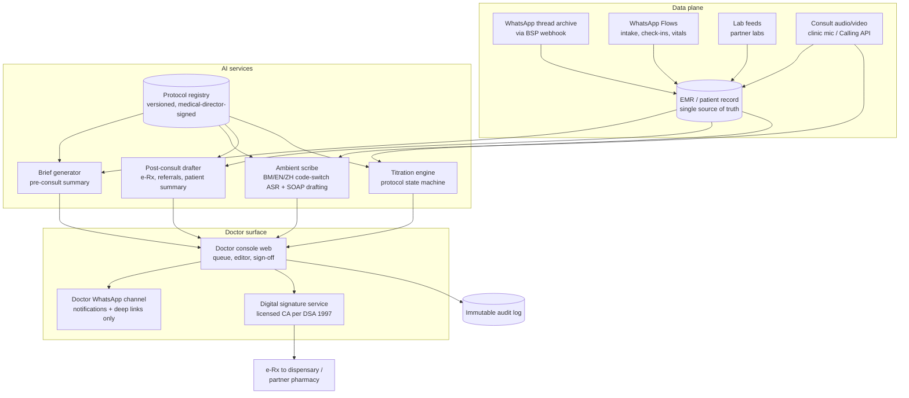
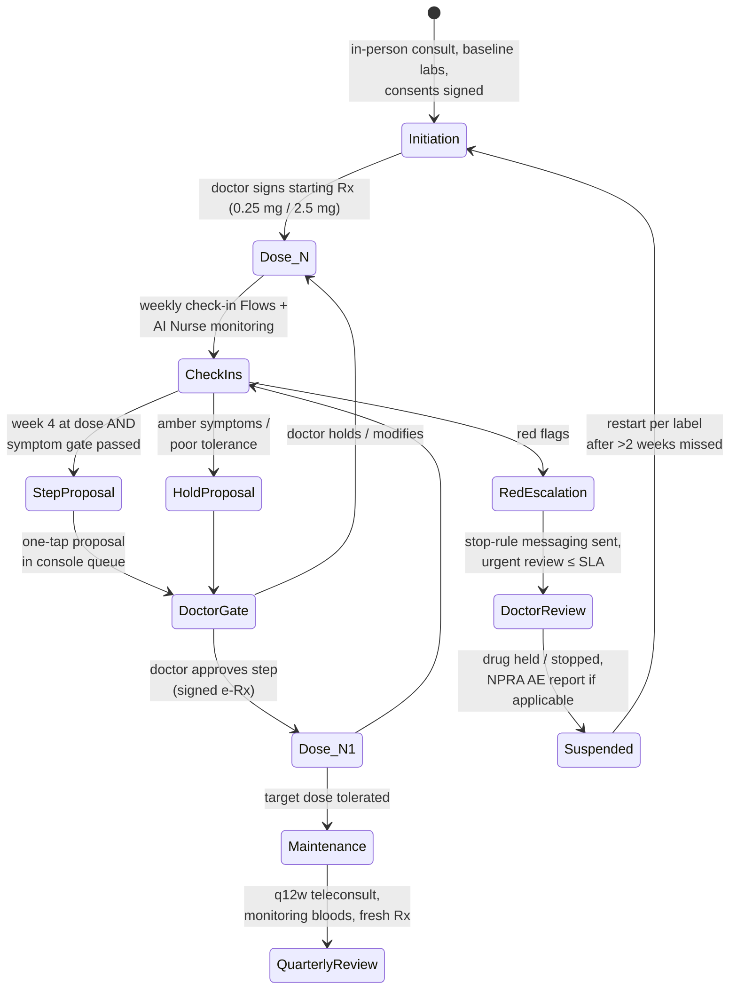

# The AI Doctor Assistant: Design Specification for Welltech's Physician-Facing AI Layer

**Abstract.** This document specifies the AI system that surrounds every Welltech doctor: pre-consult chart preparation that compresses intake data, message history and biometric trends into a 30-second brief; an in-consult ambient scribe generating SOAP notes from Bahasa Malaysia/English/Mandarin code-switched consultations (benchmarked against Qmed Copilot, the Malaysian incumbent); post-consult automation that drafts e-prescriptions, referral letters and patient-friendly summaries for doctor sign-off; and a GLP-1 titration protocol engine with hard doctor-approval gates. The design is bounded by three constraints established in the repository's research: the Medical Device Act 2012 SaMD line (decision-support software is a registrable Class B device — Welltech launches on the administrative side of that line), the MMC's accountability doctrine (the doctor remains answerable for every AI-assisted decision, and no MC is ever issued from a teleconsult), and the clinician-experience commitments that anchor recruiting — ≤5 non-clinical minutes per doctor per day, a published rate card, and contractual message-load caps. Every AI output in the system is attributable, versioned, reviewable and signed; the AI drafts, the doctor decides, and the audit trail proves it.

**Last updated: July 2026**

Related documents: [AI-native clinic master architecture](ai-clinic.md) · [AI Nurse design](ai-nurse.md) · [WhatsApp operating model](whatsapp-operating-model.md) · [Automation opportunity map](automation.md) · [Clinician pain points](../40-doctor-experience/clinician-pain-points.md) · [Doctor workflows](../40-doctor-experience/doctor-workflows.md) · [Prescribing models](../40-doctor-experience/prescribing-models.md) · [Malaysia regulations](../10-market-intelligence/malaysia-regulations.md) · [Qmed Asia dossier](../20-competitor-dossiers/qmed-asia.md)

---

**Contents:** 1. Design principles · 2. System architecture · 3. Pre-consult: the 30-second brief · 4. In-consult: ambient scribe · 5. Post-consult automation · 6. Clinical decision support boundaries (the SaMD line) · 7. GLP-1 programme workflows · 8. The doctor console · 9. Medico-legal design · 10. Doctor onboarding and AI-collaboration training · 11. KPIs and failure modes · References

---

## 1. Design principles

The Malaysian doctor Welltech recruits runs ~40 consultations a day at under 15 minutes each, does 2–3 hours of unpaid administration, and answers patient WhatsApp messages from a personal number at night ([doctor-workflows.md](../40-doctor-experience/doctor-workflows.md)). The AI Doctor Assistant is designed against that baseline, not against a Silicon Valley clinic. Five principles govern every component:

1. **The doctor's keystroke budget is zero.** Target: no doctor types anything except edits to AI drafts and free-text clinical reasoning they choose to add. The recruiting KPI is ≤5 non-clinical minutes/day, measured and published ([clinician-pain-points.md §3.4](../40-doctor-experience/clinician-pain-points.md)).
2. **AI drafts, doctor decides, system proves it.** Every clinical artefact (note, prescription, referral, patient message) exists in one of three states — `AI-draft`, `doctor-edited`, `doctor-signed` — and nothing patient-affecting leaves `AI-draft` without a named MMC-registered doctor's action. This operationalises the MMC Guideline on the Ethical Use of AI (adopted February 2025), under which the doctor remains accountable for AI-assisted decisions ([malaysia-regulations.md §8](../10-market-intelligence/malaysia-regulations.md)).
3. **Administrative AI, not autonomous medicine.** At launch, every AI function is defensibly on the non-device side of the Medical Device Act 2012 line: summarisation, transcription, drafting, scheduling, protocol lookup. Anything that *decides* — dose selection, diagnosis, triage disposition — is structured as a proposal inside a doctor-approval gate (§6).
4. **Protocol risk lives with the governance system, not the individual doctor.** The medical director owns the protocol book; the doctor practises inside it. This is the recruiting answer to the 80.6% medico-legal-anxiety barrier and the 2025 tele-MC ban whiplash ([clinician-pain-points.md §1](../40-doctor-experience/clinician-pain-points.md)).
5. **Multilingual is table stakes, not a feature.** Malaysian consultations code-switch between Bahasa Malaysia, English, Mandarin/dialects and Manglish mid-sentence. Qmed Copilot — the local benchmark — already supports English, Malay, Mandarin and Indonesian with mixed-language consults and sub-30-second note generation ([qmed-asia.md §6](../20-competitor-dossiers/qmed-asia.md)); Welltech must match that floor or doctors will notice.

## 2. System architecture

Architectural rules:

- **The EMR is the system of record; WhatsApp is a rail.** Every message, Flow submission and consult artefact is archived against the patient ID ([malaysia-whatsapp-healthcare.md §6.5](../10-market-intelligence/malaysia-whatsapp-healthcare.md)).
- **AI services read only from the EMR and the protocol registry** — never from unversioned documents, the open web, or model memory for clinical content. This is the primary hallucination control (see [ai-nurse.md §9](ai-nurse.md) for the shared safety framework).
- **The signature service is separate from the AI services.** Signing requires an authenticated doctor session and a licensed-CA digital signature per the DOC2US pattern the OHS Guideline 2025 recognises ([prescribing-models.md §3](../40-doctor-experience/prescribing-models.md)); no AI component can invoke it.
- **PDPA posture**: LLM processing of identifiable health data is a sensitive-data processing event and (for foreign-hosted models) a cross-border transfer requiring a documented Transfer Impact Assessment, DPA terms, and consent-notice coverage ([malaysia-regulations.md §7.2](../10-market-intelligence/malaysia-regulations.md)). De-identify where the task permits (trend summarisation); log every model call with purpose.

## 3. Pre-consult: the 30-second brief

### 3.1 Problem and target

The Malaysian consult norm is <15 minutes; on incumbent platforms the doctor meets each patient cold. Welltech inverts this: by the time the consult starts, the AI has already done the chart biopsy. Target: a brief the doctor can absorb in **≤30 seconds**, delivered to the console (and consult-start notification) **≥15 minutes before** a scheduled consult, or generated on-demand in <10 seconds for queue consults.

### 3.2 Inputs and output spec

| Input | Source | Notes |
|---|---|---|
| Intake Flow (demographics, goals, red-flag screen, meds, allergies) | WhatsApp Flow at onboarding | Structured; no NLP needed |
| Full WhatsApp thread since last consult | EMR archive | Summarised: symptoms reported, AI/nurse advice given, unresolved items |
| Weekly check-in Flows (weight, symptoms, adherence, doses taken) | Programme cadence ([whatsapp-operating-model.md §5](whatsapp-operating-model.md)) | Rendered as trends, not raw rows |
| Labs | Lab feed | Delta-flagged vs baseline and reference ranges |
| Titration state | Titration engine (§7) | Current dose, weeks at dose, pending proposal |
| Prior notes and prescriptions | EMR | Last plan, last sign-off |

**Brief format (fixed template, one screen):**

1. **Header line**: name, age/sex, programme + week, current dose, weight Δ since baseline and since last consult.
2. **Reason for today** (one sentence): scheduled titration review / patient-raised issue / nurse escalation.
3. **Interval events** (max 5 bullets): side-effects reported with severity/duration, missed doses, amber/red episodes and how they resolved, relevant life events the patient mentioned.
4. **Data box**: sparkline of weight, adherence %, check-in response rate, latest labs with deltas.
5. **Protocol prompt**: what the protocol expects at this visit (e.g., "Week 8: eligible for 0.5→1.0 mg step if GI symptoms ≤ mild; monitoring bloods due at week 12–16") with the pending one-tap proposal if any.
6. **Flags**: allergy, comorbidity, drug-interaction and contraindication reminders (rule-based from structured data, not LLM-generated — see §6).

Every statement in the brief is **click-through sourced**: tapping a bullet opens the underlying message, Flow submission or lab line. The brief is labelled `AI-generated summary — verify before relying`; it is a navigation aid, not part of the medical record until the doctor's signed note incorporates it.

### 3.3 Quality bar

- Factual-consistency evaluation against source data on a sampled basis (target ≥98% of brief statements supported by a source record; measured monthly by clinical QA — *analyst-set launch target*).
- Omission audit: red-flag or amber events in the interval must appear in the brief with 100% recall — this is the one brief-generation failure class treated as a safety incident, because a doctor who trusts the brief will not re-read the thread.

## 4. In-consult: the ambient scribe

### 4.1 Modalities and benchmark

| Modality | Capture path |
|---|---|
| In-person (initiation visits at the PHFSA-registered clinic) | Room microphone via consult-room tablet; explicit patient consent at check-in (recorded in consent ledger) |
| WhatsApp Calling API voice consult | Call audio via BSP media stream ([malaysia-whatsapp-healthcare.md §5.1](../10-market-intelligence/malaysia-whatsapp-healthcare.md)) |
| Video consult | Platform WebRTC audio |
| Asynchronous chat "consult" | No ASR needed; thread itself is the transcript |

The local benchmark is **Qmed Copilot**: ambient scribe producing structured notes in under 30 seconds, English/Malay/Mandarin/Indonesian including code-switched conversations, one-click ICD-10/11 coding, and a claimed up-to-70% documentation-time reduction ([qmed-asia.md §6](../20-competitor-dossiers/qmed-asia.md)). Welltech should treat those numbers as the competitive floor for doctor expectations — a Malaysian GP who has seen Qmed's demo will not tolerate an English-only scribe that takes minutes.

International evidence calibrates what to promise doctors honestly: the first RCT and large deployment studies of ambient scribes show *modest* time savings (roughly 9–16 minutes per day-shift) with meaningful burnout reduction, and documented hallucination in a nontrivial share of unreviewed notes — physician review is mandatory, and the review time partly offsets capture savings.[^1][^2] Welltech's pitch is therefore not "the AI writes your notes" but "you never start from a blank page, and the whole day's admin is ≤5 minutes" — the compound effect of scribe + brief + post-consult automation, not the scribe alone.

### 4.2 Pipeline and output

1. **ASR pass** tuned for BM/EN/Mandarin code-switching and Malaysian clinical vocabulary (drug brand names as spoken: "Wegovy", "ubat sakit gastrik"); speaker-diarised (doctor vs patient vs chaperone).
2. **SOAP drafting** constrained to the transcript + brief context: Subjective (patient's words, translated to English clinical register with original-language quotes preserved where clinically meaningful), Objective (stated examination findings and vitals only — the scribe must never *infer* examination findings that were not verbalised; this is the known failure mode of the product class[^2]), Assessment (doctor's stated impression), Plan (doctor's stated plan, cross-checked against the titration engine's state).
3. **Structured extraction**: ICD-10 code suggestions, medication changes, follow-up interval, orders — each rendered as editable fields, not buried prose.
4. **Draft lands in the console within 60 seconds of consult end** (*launch target*); doctor edits and signs. Median expected edit time for a protocolised titration review: under 1 minute (*analyst estimate; instrument from day one*).

Language rule: the *record* is written in English clinical register (Malaysian medico-legal convention); patient-language quotes are preserved inline. The *patient-facing summary* (§5.3) is generated in the patient's preferred language.

## 5. Post-consult automation

All four artefacts below are drafted automatically from the signed note and presented in a single sign-off screen; the doctor's action is approve / edit / reject per artefact.

### 5.1 e-Prescription drafting

- The titration engine or the doctor's stated plan populates a structured prescription (product by registered brand, dose, form, quantity tracking the review interval per the refill-cadence rules in [prescribing-models.md §5.1](../40-doctor-experience/prescribing-models.md)).
- Hard validation before the draft reaches the doctor: NPRA-registered product and MAL number, dose step legal within the label titration ladder (semaglutide 0.25→2.4 mg; tirzepatide 2.5→15 mg in 2.5 mg increments, each step ≥4 weeks[^3][^4]), quantity ≤ review interval, allergy/interaction rules, formulary exclusions (no phentermine, no psychotropics, no narcotics — [prescribing-models.md §6](../40-doctor-experience/prescribing-models.md)).
- Signing invokes the licensed-CA digital signature; the signed script routes to the clinic dispensary (Model A) or partner pharmacy (Model B) per the prescribing architecture. **The AI never signs; the platform never prescribes.**
- Off-label prescriptions (e.g., Ozempic for weight, on affordability grounds) additionally require the MOH-pattern off-label consent record attached before the sign-off button activates ([prescribing-models.md §4.2](../40-doctor-experience/prescribing-models.md)).

### 5.2 Referral letters and MC policy

- Referral letters (e.g., to endocrinology, bariatric surgery, mental health) drafted from the note in standard Malaysian referral format, addressed from the named doctor and clinic, signed digitally, delivered as a secure PDF link.
- **Medical certificates: the system enforces the MMC line.** MC issuance is disabled for teleconsult-only encounters at the software level — the button does not exist — reflecting the 23 September 2025 MMC prohibition ([malaysia-regulations.md §3.4](../10-market-intelligence/malaysia-regulations.md)). For in-person encounters at the registered clinic, MC drafting is available to the signing doctor. This removes the single most likely MMC-complaint trigger from the doctor's decision space entirely — a recruiting point, stated in the doctor contract.

### 5.3 Patient-friendly summaries

- After sign-off, a plain-language summary is generated in the patient's preferred language (BM/EN/中文): what was decided, the new dose and start date, what to expect, when the next check-in is, and red-flag symptoms with the emergency instruction.
- Delivered on the patient's WhatsApp thread attributed to the doctor by name ("Ringkasan daripada Dr …"), because clinician identity must be stamped on clinical messages ([malaysia-whatsapp-healthcare.md §9.4](../10-market-intelligence/malaysia-whatsapp-healthcare.md)). The summary is nurse-console-visible so the [AI Nurse](ai-nurse.md) layer coaches against the same plan.

### 5.4 Coding, claims and e-invoice

ICD coding, programme billing events and MyInvois e-invoice generation run without doctor involvement (finance-ops reviewed). This is deliberate scope: the [pain-points research](../40-doctor-experience/clinician-pain-points.md) shows claims/portal administration is the most-resented unpaid work; none of it should ever appear in a doctor's queue.

## 6. Clinical decision support boundaries — engineering to the SaMD line

The Medical Device Act 2012 captures software intended for diagnosis, prevention, monitoring or treatment; MDA/GD/0062 (3rd ed., June 2025) places software supporting diagnosis/treatment decisions in non-critical settings at ~Class B, requiring MDA registration with conformity assessment ([malaysia-regulations.md §8](../10-market-intelligence/malaysia-regulations.md)). Intended purpose — the claims made in UI and marketing — drives classification. The design therefore sorts every AI function explicitly:

| Function | Side of the line | Design treatment |
|---|---|---|
| Brief generation, thread summarisation | Administrative (information organisation) | No claims of clinical judgement; click-through sourcing; "verify before relying" label |
| Ambient scribe, coding suggestions | Administrative (documentation) | Doctor review mandatory; no autonomous entry into record |
| Appointment, reminder, payment automation | Not a device | Standard software |
| **CPG-anchored suggestion surfacing** ("CPG Obesity 2023 §x recommends reassessment at 12 weeks; this patient is at week 13") | Borderline — kept administrative | Implemented as *retrieval and display of the published guideline text with patient-context matching*, never as a recommendation engine ("consider drug X"). The system quotes the CPG; it does not conclude. UI copy reviewed by regulatory counsel |
| Symptom triage disposition (patient-facing) | Device-risk if it decides | AI collects structured symptoms and *routes* per a doctor-authored protocol table; disposition logic is a deterministic, clinician-signed decision tree, not model judgement (see [ai-nurse.md §5](ai-nurse.md)) |
| **Titration dose proposals** | Device-risk if autonomous | Structured as workflow: the engine *schedules a protocol-defined decision point* and pre-fills the protocol-default option; the doctor makes the dose decision. No marketing or UI copy may describe it as a "dosing algorithm" (*a marketing sentence can convert a CRM into a Class B device* — [malaysia-regulations.md §8](../10-market-intelligence/malaysia-regulations.md)) |
| Diagnostic suggestion copilot, lab-interpretation engine, autonomous triage | Class B+ — **not built at launch** | If productised later (e.g., a true titration algorithm as a claim), budget MDA Class B registration: Malaysian CAB conformity assessment, months not weeks |

Two governance mechanics keep the line honest: (a) a **claims register** — every UI string and marketing sentence describing AI capability is inventoried and change-controlled, reviewed quarterly against MDA guidance; (b) the **MMC AI guideline mapping** — each AI function documented with its human-oversight mechanism, so any panel doctor facing an MMC query can produce the oversight evidence in minutes ([malaysia-regulations.md §8](../10-market-intelligence/malaysia-regulations.md)).

## 7. GLP-1 programme workflows

### 7.1 Titration protocol engine

The engine is a per-patient state machine executing the Welltech GLP-1 protocol (CPG Management of Obesity 2023-aligned; initiation in person at BMI ≥27.5 kg/m² or lower with comorbidities; label-conform dose ladders — [prescribing-models.md §4](../40-doctor-experience/prescribing-models.md)).

**Approval-gate rules (non-negotiable):**

1. No dose change of any kind — up, down, or hold beyond protocol default — takes effect without a doctor-signed order. The engine's proposals expire if unactioned (48 h), triggering escalation to the medical director's queue rather than auto-execution.
2. The proposal card shows the evidence: weeks at dose, symptom pattern from check-ins, weight trend, adherence, and the protocol citation. One tap = approve protocol default; two taps = modify; the modify path requires a reason code (feeding the protocol-improvement loop, §10.3).
3. Dose-step gates encode the labels: minimum 4 weeks per step; semaglutide 0.25→0.5→1.0→1.7→2.4 mg; tirzepatide 2.5→5→7.5→10→12.5→15 mg;[^3][^4] a failed symptom gate proposes "hold and re-check in 2 weeks" (label-consistent tolerance management), never skipping steps.

### 7.2 Side-effect-aware logic and safety interlocks

- Check-in and free-text symptom signals feed the [AI Nurse escalation matrix](ai-nurse.md) (green/amber/red with SLAs). The titration engine consumes the same classifications: amber suppresses step proposals; red freezes the state machine pending doctor review.
- **Stop-rule messaging** mirrors the label: severe persistent abdominal pain (± radiation to back, ± vomiting) → stop injecting and seek immediate care — pushed automatically on red classification and always countersigned by the on-call clinician's follow-up.[^5]
- **Hypoglycaemia interlock**: patients whose medication list includes a sulfonylurea or insulin are flagged at initiation; the protocol requires the doctor to document a secretagogue/insulin dose-reduction decision (label-recommended risk mitigation[^6][^7]), the AI Nurse delivers hypoglycaemia-recognition education, and hypo symptoms in this cohort classify amber-or-higher by default.
- **Peri-operative hold**: the NPRA 2025 GLP-1 aspiration alert is encoded as a rule — any patient reporting upcoming surgery/sedation triggers a pre-op-hold task to the doctor ([malaysia-regulations.md §5.2](../10-market-intelligence/malaysia-regulations.md)).
- **Pharmacovigilance**: adverse events meeting reporting criteria generate a pre-filled NPRA report draft for medical-director submission; batch numbers are recorded at dispensing to enable trace-back.

### 7.3 Monitoring-blood scheduling

Per the CPG Obesity 2023 chronic-disease framing and prevailing compliant-clinic practice ([prescribing-models.md §4.3](../40-doctor-experience/prescribing-models.md)), the engine schedules bloods as tasks with WhatsApp pre-lab instructions ([ai-nurse.md §4](ai-nurse.md)):

| Timepoint | Panel | Notes |
|---|---|---|
| Baseline (initiation visit) | FBC, renal profile, LFT, HbA1c/FPG, lipids; TFT where indicated | In-clinic or partner lab; gates the first prescription |
| Week 12–16 | Weight-response review ± HbA1c (if dysglycaemic at baseline), LFT if baseline abnormal | Timed with the ~3-month response assessment the CPG framing implies; *analyst protocol — no statutory interval exists* |
| Every 6 months at maintenance | HbA1c/FPG, lipids, renal profile | Chronic-disease monitoring cadence; doubles as programme-value touchpoint |
| Event-driven | Amylase/lipase on suspected pancreatitis; U&E on significant vomiting/dehydration | Ordered by doctor at escalation, not automatically |

The scheduler books the lab slot via Flow, chases non-completion (2 nudges then nurse call), and flags "labs overdue" on the doctor's brief — the engine never withholds a clinically approved refill autonomously, but the refill proposal card shows the overdue status so the doctor decides with the gap visible.

## 8. The doctor console

### 8.1 Surfaces

| Surface | Purpose | Notes |
|---|---|---|
| **Web console** (desktop + mobile web) | The workplace: queue, brief, note editor, sign-off screen, panel dashboard, earnings ledger | All signing happens here (authenticated session + CA signature) |
| **Doctor WhatsApp channel** (separate internal number, never patient-facing) | Notifications and deep links: "3 titration approvals waiting (est. 4 min) — [link]"; red-alert pages | Meets doctors where they already live; contains zero patient-identifiable data in message bodies (PDPA surface discipline) — name initials + record link only |
| Consult-room tablet | Scribe capture + brief display at the physical clinic | |

### 8.2 Queue design

- Three priority classes: **P0 red clinical** (page + call escalation per [ai-nurse.md §5](ai-nurse.md) SLAs), **P1 same-day** (amber follow-ups, expiring proposals, abnormal labs), **P2 batch** (titration approvals, refill renewals, note sign-offs, referral approvals).
- P2 is delivered as **two scheduled review blocks/day** chosen by the doctor (e.g., 13:00 and 20:30), each designed to clear in ≤10 minutes for a full panel — batching is what converts "always on call" into bounded, *paid* review work ([clinician-pain-points.md §2](../40-doctor-experience/clinician-pain-points.md) mechanism #4).
- Every queue item shows its estimated action time; the console displays the running "non-clinical minutes today" counter — the same number reported in the quarterly admin-metric publication.

### 8.3 One-tap approvals — what "one tap" legally means

The tap is UX, not the signature. Flow: WhatsApp/console notification → deep link → authenticated console session (biometric/passkey) → proposal card with evidence → approve → CA digital signature applied server-side under the doctor's signing credential → immutable log entry. Approval actions are rate-limited and require re-authentication after inactivity, so a stolen phone cannot prescribe. Bulk-approve is deliberately not offered for prescriptions; each script is an individual signed act (mirroring Poisons Act prescription formalities — [malaysia-regulations.md §4.1](../10-market-intelligence/malaysia-regulations.md)).

## 9. Medico-legal design

### 9.1 Attribution and accountability chain

- **Every AI output is attributable**: each artefact carries (model + version, prompt/protocol version, input-context hash, generation timestamp) and its review chain (who viewed, who edited, what changed, who signed, when). MMC accountability requires the doctor to be answerable for AI-assisted decisions; this design makes the *evidence of oversight* automatic rather than reconstructive.
- **Patient-visible clinical communications always carry a named, MMC-registered clinician** (doctor or nurse per scope); the AI never impersonates a clinician and AI-authored operational messages are branded as the care team/assistant ([whatsapp-operating-model.md §8](whatsapp-operating-model.md)).
- **Doctors own their defence file**: full export rights to every encounter they touched — records, threads, audit entries — written into the doctor contract ([clinician-pain-points.md §3.2](../40-doctor-experience/clinician-pain-points.md)). Platforms' documentation opacity is a known grievance; Welltech inverts it.

### 9.2 Audit-trail specification

| Event class | Logged fields | Retention |
|---|---|---|
| AI generation (brief/note/draft/proposal) | Artefact ID, model+version, protocol version, context hash, output hash | Medical-record norms (≥7 years, align to MMC record-keeping) |
| Human review action | Actor (MMC/NMC ID), action (view/edit/sign/reject), diff, timestamp, session ID | Same |
| Prescription signing | Rx ID, CA certificate serial, product MAL number, batch at dispensing | Same + Poisons Act prescription-book duties |
| Escalation events | Trigger classification, SLA clock, responder, disposition | Same |
| Message traffic | Full payload archive to EMR (webhook), sender identity stamp | Same ([malaysia-whatsapp-healthcare.md §6.5](../10-market-intelligence/malaysia-whatsapp-healthcare.md)) |
| Overrides/deviations | Reason code, free-text rationale, protocol section deviated from | Same; feeds monthly governance review |

Logs are append-only, clock-synced, and separated from application infrastructure so an application compromise cannot silently rewrite history. The audit system is also the input to the published protocol-deviation KPI (<2% of encounters — [clinician-pain-points.md §6](../40-doctor-experience/clinician-pain-points.md)).

### 9.3 The recruiting pitch, as system properties

The doctor value proposition's measurable commitments are properties of this design, not HR promises:

| Commitment (from [clinician-pain-points.md §3](../40-doctor-experience/clinician-pain-points.md)) | Enforcing component |
|---|---|
| ≤5 non-clinical minutes/day, measured | Console minute-counter; quarterly published admin metric |
| Published rate card; settlement ≤7 days | Earnings ledger in console; payout events logged per signed encounter |
| ≤3 after-hours messages/day reaching a doctor; message-load caps per panel | AI Nurse first-line + batching; caps enforced in routing logic, breaches alarmed to ops |
| No teleconsult MCs, ever | MC function disabled for tele encounters (§5.2) |
| Protocol risk carried by governance | Protocol registry with medical-director signature; deviation audit |
| Full record export rights | Self-serve export in console |

## 10. Doctor onboarding and AI-collaboration training

### 10.1 Curriculum (pre-panel certification, ~4 hours total)

| Module | Content | Assessment |
|---|---|---|
| 1. Platform & clinical model (60 min) | Care model, WhatsApp rails, roles of AI Nurse/human nurse/doctor, consult modalities | Scenario walkthrough |
| 2. Working with the AI — capabilities and failure modes (75 min) | What the scribe gets wrong (inferred exam findings, ~1-in-14-note hallucination risk in the product class[^2]), brief omission risk, automation-bias training ("the brief is a map, not the territory"), how to flag AI errors (one-tap "AI got this wrong" control on every artefact) | Seeded-error exercise: doctor must catch 5 planted errors in sample notes/briefs before certification |
| 3. Protocol book (60 min) | GLP-1 pathway end-to-end, escalation matrix, stop rules, off-label consent flow, MC and formulary hard lines | Protocol quiz ≥90% |
| 4. Medico-legal & sign-off discipline (45 min) | MMC AI-guideline duties, what the audit trail records, signature ceremony, PDPA basics for clinicians, incident reporting | Attestation + signature-service enrolment |

### 10.2 Supervised ramp

First 2 weeks on panel: all signed notes and 100% of titration decisions co-reviewed by the medical director (or delegate); ramp exits when edit-rate and deviation metrics sit within cohort norms. Locum-portfolio doctors get the same ramp compressed to their first 20 encounters.

### 10.3 Continuous calibration

- Monthly QA: random 5% sample of AI drafts vs signed versions per doctor — measures both AI quality (edit distance) and reviewer vigilance (planted-error audits quarterly; a doctor who signs unedited drafts at anomalous speed triggers a coaching conversation, not discipline).
- Override/modification reason codes reviewed monthly by the medical director; recurring overrides are protocol bugs — the protocol changes, versioned, rather than doctors quietly working around it.
- Model or prompt updates ship with release notes to the panel and a re-run of the seeded-error certification set before deployment (see the shared evaluation framework in [ai-nurse.md §9](ai-nurse.md)).

## 11. KPIs and failure modes

| KPI | Launch target | Notes |
|---|---|---|
| Non-clinical minutes/doctor/day | ≤5 median | The headline recruiting metric |
| Brief red-flag recall | 100% | Safety-grade; any miss = incident |
| Scribe draft → sign median edit time | <60 s (titration reviews) | *Analyst target; instrument from day one* |
| Draft acceptance without material edit | 60–80% band | Too low = AI quality problem; suspiciously high = vigilance problem |
| Titration proposals actioned within 48 h | ≥99% | Expiry escalations near zero |
| Protocol deviation rate | <2% of encounters | Published internally ([clinician-pain-points.md §6](../40-doctor-experience/clinician-pain-points.md)) |
| e-Rx validation-rule catches | Tracked, reviewed monthly | Each catch is a prevented error — recruiting evidence |
| Doctor NPS / 12-month retention | ≥50 / ≥85% | The moat metrics |

Failure modes designed against: **automation bias** (seeded-error audits, edit-rate anomaly detection); **rubber-stamp throughput pressure** (no per-approval piece rates that reward speed over care — approvals are paid within programme-panel economics, not per tap); **silent model drift** (version pinning + regression evals per release); **queue overflow recreating the treadmill** (panel-size caps gate growth, per the sequencing discipline in [clinician-pain-points.md §6.1](../40-doctor-experience/clinician-pain-points.md)).

---

## References

Repository sources are linked inline above. External sources:

[^1]: STAT News, "Large AI scribe study finds modest time savings, inconsistent use" (1 April 2026), https://www.statnews.com/2026/04/01/ai-ambient-scribes-modest-time-savings-clinical-documentation/ (accessed July 2026).
[^2]: EHR Source, "Ambient AI Scribes in 2026: Clinical Evidence, ROI Data, and Vendor Comparison" (multicenter deployment data: ~13–16 min/day EHR-time savings, burnout reduction; hallucinated content in roughly 1 in 14 unreviewed notes; unreliable physical-exam documentation — vendor-adjacent secondary source, treat figures as indicative), https://www.ehrsource.com/articles/ambient-ai-scribes-comparison/ (accessed July 2026); corroborating pilot: "Ambient Artificial Intelligence Scribes: A Pilot Survey… in Palliative Medicine", PMC, https://www.ncbi.nlm.nih.gov/pmc/articles/PMC12427878/ (accessed July 2026).
[^3]: US FDA, MOUNJARO (tirzepatide) Prescribing Information (2.5 mg weekly ×4 weeks start; 2.5 mg increments after ≥4 weeks at current dose; maximum 15 mg weekly), https://www.accessdata.fda.gov/drugsatfda_docs/label/2022/215866s000lbl.pdf (accessed July 2026); Eli Lilly Medical, "How should Mounjaro (tirzepatide) doses be increased in adults?", https://medical.lilly.com/us/products/answers/how-should-mounjaro-tirzepatide-doses-be-increased-in-adults-110552 (accessed July 2026).
[^4]: US FDA, WEGOVY (semaglutide) Prescribing Information (0.25→0.5→1.0→1.7→2.4 mg 4-weekly escalation; GI-tolerability rationale), https://www.accessdata.fda.gov/drugsatfda_docs/label/2021/215256s000lbl.pdf (accessed July 2026).
[^5]: Novo Nordisk, "Wegovy Side Effects & Safety" (stop use and contact a healthcare provider for severe persistent abdominal pain with or without vomiting — pancreatitis warning), https://www.wegovy.com/obesity/is-wegovy-right-for-me/safety-side-effects.html (accessed July 2026).
[^6]: US FDA, tirzepatide Prescribing Information (2025 revision) — hypoglycaemia risk when combined with insulin secretagogues or insulin; consider reducing secretagogue/insulin dose, https://www.accessdata.fda.gov/drugsatfda_docs/label/2025/215866s039lbl.pdf (accessed July 2026).
[^7]: "Reducing or Discontinuing Insulin or Sulfonylurea When Initiating a Glucagon-like Peptide-1 Agonist", PMC (2024), https://pmc.ncbi.nlm.nih.gov/articles/PMC11147431/ (accessed July 2026).
