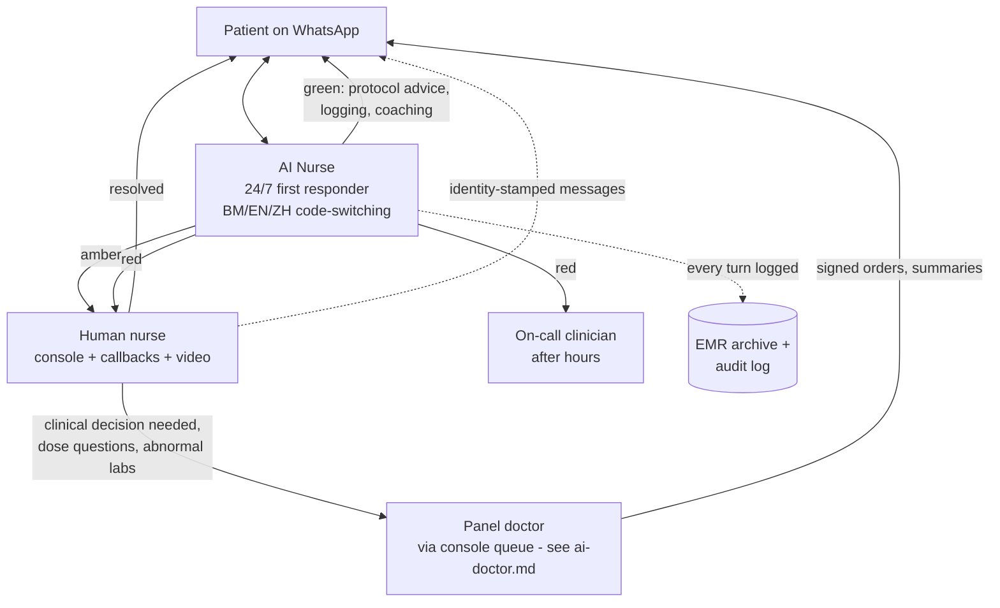
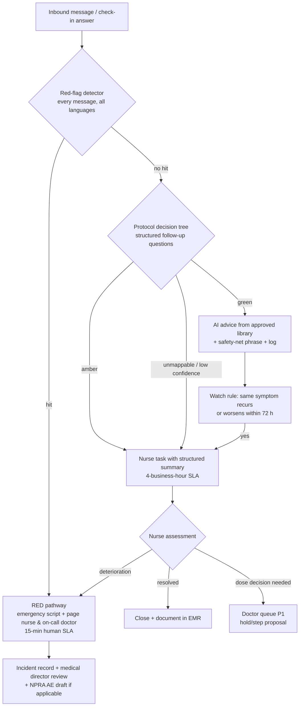

# The AI Nurse + Human Nurse Hybrid: Design Specification for Welltech's Care-Team Layer

**Abstract.** This document designs the layer that does most of Welltech's patient-facing work: an AI Nurse operating on WhatsApp — structured check-ins, protocol-bound symptom triage, injection-technique coaching, reminders, vitals collection, pre-lab instructions — wrapped around a small team of human nurses who own everything the AI must not touch: video injection training, amber/red clinical follow-ups, empathy-critical moments, and outbound care calls. The centre of the design is the escalation matrix: a green/amber/red classification of GLP-1 side-effects (GI symptoms, pancreatitis and gallbladder red flags, dehydration, hypoglycaemia in co-medicated patients) with response SLAs and named responders, implemented as deterministic clinician-signed decision logic rather than model judgement — deliberately keeping the AI on the administrative side of Malaysia's SaMD line. The document also specifies nurse-console workload design (with labelled estimates of patients-per-nurse under AI leverage), the structure of the versioned care-protocols library, and the safety evaluation framework: red-team scenario classes, hallucination guards, the "never do" list, and the clinical sign-off process that gates every protocol, prompt and model change.

**Last updated: July 2026**

Related documents: [AI-native clinic master architecture](ai-clinic.md) · [AI Doctor Assistant](ai-doctor.md) · [WhatsApp operating model](whatsapp-operating-model.md) · [AI-orchestrated patient journey](ai-patient-journey.md) · [Automation opportunity map](automation.md) · [Malaysia WhatsApp healthcare](../10-market-intelligence/malaysia-whatsapp-healthcare.md) · [Malaysia regulations](../10-market-intelligence/malaysia-regulations.md) · [Malaysia weight-loss market](../10-market-intelligence/malaysia-weight-loss-market.md) · [Prescribing models](../40-doctor-experience/prescribing-models.md)

---

**Contents:** 1. Why a hybrid · 2. Role architecture · 3. AI Nurse scope · 4. Capability specifications · 5. The escalation matrix · 6. The human nurse role · 7. Nurse console and workload design · 8. Care protocols library · 9. Safety evaluation framework · 10. KPIs · References

---

## 1. Why a hybrid, not a bot and not a call centre

Three findings from the repository's research force the hybrid design:

1. **The clinical evidence favours human-in-the-loop cadence.** Messaging interventions improve adherence and weight outcomes, but live-staff involvement outperforms pure automation, and engagement effects decay without human touchpoints ([malaysia-whatsapp-healthcare.md §4](../10-market-intelligence/malaysia-whatsapp-healthcare.md)). The AI supplies cadence at zero marginal cost; nurses supply the effect size.
2. **The economics require AI absorption.** Triage and administrative traffic absorb an estimated 60–80% of inbound volume in comparable deployments ([malaysia-whatsapp-healthcare.md §8](../10-market-intelligence/malaysia-whatsapp-healthcare.md)); the GLP-1 business model works when one nurse supervises hundreds of concurrent threads, not dozens (§7).
3. **The retention window is weeks 4–12.** Unmanaged early GI side-effects are the peak dropout driver, making side-effect triage in the first 8 weeks "the highest-ROI clinical activity in the company" ([malaysia-weight-loss-market.md](../10-market-intelligence/malaysia-weight-loss-market.md)). That activity is exactly what this layer industrialises.

The regulatory frame is equally binding: MMC standards apply to chat as to consults, AI must not diagnose or dose, and patient-facing triage that *decides* would cross into Medical Device Act territory — so the AI collects and routes, deterministic clinician-signed logic classifies, and humans act ([malaysia-regulations.md §7.3, §8](../10-market-intelligence/malaysia-regulations.md)).

## 2. Role architecture

| Actor | Employment/registration | Owns |
|---|---|---|
| AI Nurse | Software (branded "Welltech Care Assistant" — never presented as a person or a nurse) | First response 24/7, structured data capture, protocol-scripted education, routing |
| Registered nurses | Employed, Malaysian Nursing Board registered | Amber/red follow-up, injection training, outbound calls, cohort moderation, AI supervision |
| Nurse lead (senior RN) | Employed | Rosters, QA sampling, protocol feedback, incident first-line |
| On-call clinician | Panel doctor rota | After-hours red events; stop-drug decisions |
| Medical director | Senior registered practitioner (OHS 2025 board requirement — [malaysia-regulations.md §3.3](../10-market-intelligence/malaysia-regulations.md)) | Protocol sign-off, incident review, NPRA reporting |

Naming discipline: the assistant introduces itself as an assistant ("Saya pembantu digital pasukan penjagaan Welltech"), states that nurses and doctors read the thread, and never claims clinical authority. Human messages are identity-stamped (name + role), per the record-keeping duty pattern in [malaysia-whatsapp-healthcare.md §9.4](../10-market-intelligence/malaysia-whatsapp-healthcare.md).

## 3. AI Nurse scope — in and out

| In scope (autonomous) | Out of scope (always human) |
|---|---|
| Structured check-ins via WhatsApp Flows; chasing non-responders | Any diagnosis, dose advice, or medication change |
| Symptom intake (structured questions from signed protocols) and routing per the escalation matrix | Triage *judgement* outside the decision tree — anything ambiguous routes up |
| Whitelisted FAQ answers (logistics, storage, what-to-expect content from the protocol library) | Reassurance about red/amber symptoms |
| Injection-technique coaching assets (videos, step checklists) + comprehension checks | Live injection training and technique correction (nurse, video call) |
| Medication and appointment reminders; refill logistics | Emotional-distress conversations (detected → warm handover) |
| Weight/vitals collection and logging; trend acknowledgements | Interpreting labs or vitals ("your result means…") |
| Pre-lab instructions (fasting rules, what to bring, location) | MC requests (declined by policy, routed — [malaysia-regulations.md §3.4](../10-market-intelligence/malaysia-regulations.md)) |
| Consent-flow administration, opt-in/opt-out handling | Anything on the "never do" list (§9.3) |

## 4. Capability specifications

### 4.1 Structured check-ins

- **Cadence (GLP-1 default)**: injection-day D1 walkthrough; D3 side-effect pulse; weekly check-in Flow (weight, dose taken Y/N, symptom checklist with severity, mood/energy, free-text "anything else?"); pre-titration review at each week-4 boundary feeding the [titration engine](ai-doctor.md); monthly programme survey. Cadence per protocol version, A/B-tunable within clinically approved bounds.
- **Format**: WhatsApp Flows (native forms — completion benchmarks 65–85% vs 35–55% for external links; [malaysia-whatsapp-healthcare.md §5.1](../10-market-intelligence/malaysia-whatsapp-healthcare.md)); every answer writes structured fields to the EMR, not chat prose.
- **Non-response ladder**: +24 h template nudge → +48 h AI conversational nudge → day 5 nurse outbound call task. Two consecutive missed weekly check-ins auto-flag the patient on the retention dashboard (missed check-ins are the leading churn indicator — *analyst hypothesis to validate against cohort data*).

### 4.2 Symptom triage

- Free-text or voice-note symptom reports ("rasa nak muntah teruk sejak semalam") are parsed for symptom entities, then the AI asks the protocol's structured follow-ups (duration, severity, fluid tolerance, associated features) — a digital adaptation of the telephone-triage pattern that Schmitt-Thompson protocols standardised (structured questions → disposition → targeted advice), the de-facto gold standard used by >95% of North American triage call centres.[^1][^2]
- Classification into green/amber/red is executed by the **deterministic decision tree in the signed protocol**, with the LLM used for extraction and conversation only. A high-recall red-flag detector runs on *every* inbound message regardless of context (keyword + classifier ensemble, BM/EN/ZH/Manglish lexicons), so "chest pain" typed during a payment conversation still fires.
- Uncertainty rule: if extraction confidence is low, or symptoms don't map to the tree, the AI asks once for clarification and then defaults upward (treat as amber). **The system may over-escalate; it may never under-escalate.**

### 4.3 Injection-technique coaching

- Asset set per pen type (Wegovy FlexTouch-style, Mounjaro KwikPen): 60–90-second technique video (BM/EN audio, trilingual subtitles), step-card images, storage and travel guidance, needle disposal instructions — all clinician-approved, versioned media in the protocol library, delivered per the [rich-media strategy](whatsapp-operating-model.md).
- Sequence on first dose: video → interactive checklist Flow ("angle correct?", "held 6 seconds?") → offer of a live nurse video call (opt-out, not opt-in, for the first injection — the empathy-critical onboarding moment, §6). Patients may send a photo/video of their setup; the AI checks only objective, protocol-listed items (pen type, dose window visible) and routes technique judgement to a nurse.

### 4.4 Reminders, vitals and pre-lab

- Reminders as utility templates timed to elicit replies (window engineering — [whatsapp-operating-model.md §4](whatsapp-operating-model.md)): weekly injection-day, refill T-7/T-2, appointment T-72/24/2h, lab-completion chasers.
- Weight/vitals: weekly Flow capture; photo-of-scale accepted with OCR + patient confirmation; plausibility checks (Δ > 3 kg/week → confirm before logging; confirmed extreme values → amber). Trend charts returned monthly as an engagement asset.
- Pre-lab instructions: fasting duration, medication timing, hydration, what to bring (IC, request form QR), location/hours — templated per panel ordered; day-before and morning-of nudges.

## 5. The escalation matrix

The matrix below is the GLP-1 core of the protocol library (§8); other programmes get sibling matrices. Classifications, dispositions and SLAs are medical-director-signed; the label's stop rules and warnings anchor the red tier.[^3][^4][^5]

### 5.1 Classification table

| Tier | Symptom picture (GLP-1 cohort) | Immediate actor & action | SLA |
|---|---|---|---|
| **GREEN** — expected, self-limiting | Mild nausea < 72 h; reduced appetite; mild constipation/diarrhoea < 48 h; belching/reflux mild; fatigue; small injection-site redness/itch; hunger changes | AI Nurse: protocol advice (small frequent meals, eat slowly, stop when full, hydration, fibre; site-rotation reminder)[^4][^5]; log; include in weekly summary to nurse dashboard | AI instant, 24/7 |
| **AMBER** — needs human review, not emergency | Vomiting >24 h but tolerating sips; moderate nausea affecting intake ≥3 days; diarrhoea >48 h; dizziness/light-headedness on standing; reduced urination or dark urine (early dehydration); persistent reflux despite advice; moderate abdominal discomfort not severe/radiating; mild hypoglycaemia symptoms self-resolved (non-insulin/SU patient); ≥2 consecutive missed doses; distress/low-mood signals; rapid weight loss (>1.5%/week sustained — *analyst threshold, tune clinically*); suspected medication error (double dose) | AI acknowledges + safety-nets ("if X worsens, do Y now"), creates nurse task with structured summary; nurse reviews thread, calls or messages patient, executes amber pathway (fluid plan, dietary steps, dose-hold proposal to doctor via [titration engine](ai-doctor.md)) | Nurse contact ≤4 business hours; same-day resolution or escalation. After hours: AI safety-net script + next-morning nurse task, unless deterioration rules trigger red |
| **RED** — stop-and-escalate | Severe persistent abdominal pain ± radiating to back, ± vomiting (pancreatitis pattern — label stop rule)[^3]; repeated vomiting with inability to keep fluids >24 h / signs of significant dehydration (confusion, minimal urination); right-upper-quadrant pain with fever or jaundice (gallbladder)[^4]; severe hypoglycaemia (confusion, inability to self-treat) or any hypoglycaemia in insulin/sulfonylurea co-medicated patient[^5]; allergic reaction (facial/throat swelling, breathing difficulty); chest pain; vision change with headache; self-harm disclosure | AI immediately sends emergency script (stop injections; go to nearest ED / call 999; nearest facility link), pages on-call nurse **and** on-call clinician simultaneously; human voice contact attempt; doctor decides drug hold/stop; incident record opened; NPRA AE report drafted where criteria met ([ai-doctor.md §7.2](ai-doctor.md)) | AI script instant; human contact attempt ≤15 min, 24/7; doctor disposition ≤60 min |

### 5.2 Escalation flow

Design notes: (a) every green disposition carries a **safety-net phrase** telling the patient exactly what change would upgrade the situation and to message immediately if it occurs — the mechanism that makes over-triage self-correcting; (b) the **watch rule** re-opens green cases automatically on recurrence, preventing "chronic green" drift; (c) after-hours amber is explicitly designed — the AI never improvises overnight; it applies the signed after-hours script and books the morning task; (d) all three tiers write structured outcomes, so escalation precision/recall is measurable (§10).

### 5.3 After-hours operations (22:00–08:00)

Malaysian patients message at night; the design assumes it rather than apologising for it:

| Element | Specification |
|---|---|
| First response | AI Nurse operates normally for green traffic and data capture; after-hours auto-acknowledgement states human availability and the emergency instruction (999/nearest ED) in every conversation that turns clinical ([whatsapp-operating-model.md §3](whatsapp-operating-model.md), template 45) |
| Amber overnight | Signed after-hours script only: acknowledge, safety-net with explicit deterioration triggers ("if you cannot keep sips of water down, or the pain becomes severe, go to the ED now"), book the 08:00 nurse task at the top of the morning queue. The AI schedules a proactive 07:30 "how was the night?" pulse |
| Red overnight | Identical to daytime: emergency script instant; on-call nurse and on-call clinician paged simultaneously; 15-minute human-contact SLA holds 24/7 — this is the SLA that is *never* degraded |
| Deterioration rule | Two amber contacts within one night, or any amber + a new symptom, auto-upgrades to red — the overnight system biases upward because no human is watching the queue in real time |
| Doctor protection | Nothing routes to a panel doctor's personal device overnight except the on-call rota's red pages — the contractual message-load cap and boundary promise ([clinician-pain-points.md §3](../40-doctor-experience/clinician-pain-points.md)) is enforced here, in routing logic |
| Morning handover | 08:00 shift lead receives the night digest: all overnight conversations, classifications, safety-net scripts sent, pending pulses — reviewed before the amber queue is worked |

## 6. The human nurse role

Nurses are not the AI's exception handler; they own the moments that create loyalty and safety:

1. **First-injection video call** (default-on offer): live technique training, anxiety management, first-dose companionship. This is the single highest-leverage empathy moment in the programme (*analyst judgment consistent with the week-4–12 dropout evidence in [malaysia-weight-loss-market.md](../10-market-intelligence/malaysia-weight-loss-market.md)*).
2. **Amber/red follow-through**: the callbacks, fluid-plan coaching, next-day "how are you feeling?" messages after any escalation — always the same named nurse where rostering allows (continuity is the differentiator incumbents lack — [positioning](../50-marketing-intelligence/positioning.md)).
3. **Outbound care calls**: scheduled at week 2 (settling-in), week 6 (peak side-effect window), and on churn-risk triggers (missed check-ins ×2, refill lapse, plateau frustration signals). Live-staff contact outperforms automated reminders in the attendance/adherence literature ([malaysia-whatsapp-healthcare.md §4.4](../10-market-intelligence/malaysia-whatsapp-healthcare.md)).
4. **Cohort moderation**: nurse-moderated opt-in group programmes (announcement-only clinical content; no individual clinical data in groups — [malaysia-whatsapp-healthcare.md §9.8](../10-market-intelligence/malaysia-whatsapp-healthcare.md)).
5. **AI supervision**: daily QA sampling of AI conversations (§9.4), thumbs-down triage on flagged turns, protocol-gap reports to the nurse lead.

Scope boundary: nurses operate within nursing scope — education, monitoring, care coordination, protocol-defined advice. Dose decisions, diagnosis and prescription changes always route to the doctor queue ([ai-doctor.md §8](ai-doctor.md)).

## 7. Nurse console and workload design

### 7.1 Console

- **Unified inbox** filtered by tier and SLA clock (amber queue with countdown; red banner takeover), with the AI-generated **context pack** on every task: patient header, programme week/dose, symptom summary, relevant thread excerpts, suggested protocol section — the nurse never scrolls a 12-week thread to reconstruct context (mirror of the doctor's 30-second brief, [ai-doctor.md §3](ai-doctor.md)).
- **Action surface**: reply in-thread (identity-stamped), initiate WhatsApp voice/video call in-thread (Calling API), send approved media/Flows, create doctor tasks, schedule callbacks, log structured outcomes (disposition codes, not free text alone).
- **Internal notes** on the thread (invisible to patient) for handovers; see the seam-free handover design in [whatsapp-operating-model.md §8](whatsapp-operating-model.md).
- **Panel dashboard**: check-in response rates, watch-list (recent ambers, churn-risk flags), today's outbound-call list, cohort milestones.

### 7.2 Workload model *(analyst estimates — validate in pilot; no Malaysian benchmark exists)*

Assumptions from the repository: AI absorbs 60–80% of inbound; ~40% of GLP-1 patients generate a symptom conversation in any titration month; amber rate ~5–8% of active patients/month; red <0.5%/month (*rates are analyst planning figures*).

| Configuration | Active GLP-1 patients per RN | Basis |
|---|---|---|
| No AI (manual WhatsApp inbox, call-centre pattern) | ~50–80 | Incumbent staffing norm for high-touch chronic cohorts *(analyst inference from managed-care staffing conventions)* |
| AI Nurse first-line + structured check-ins (this design) | **~300–400** at titration-heavy mix; ~500 at maintenance-heavy mix | Nurse time concentrates on ~30–60 amber tasks + ~25 outbound calls + QA per week per 350 patients ≈ 25–30 h clinical work |
| Stretch (mature protocols, tuned automation) | 500–600 | Only after amber precision and SLA adherence hold for 2+ quarters |

Rostering: two shifts covering 08:00–22:00 daily (matching Malaysian messaging behaviour); overnight = AI + on-call rota (§5.3). Minimum viable team at launch: 2 FTE RNs + nurse lead for the first ~500 programme patients, giving redundancy and QA headroom before the ratios above are earned. Growth gate: patients-per-nurse may only rise while amber SLA ≥95% and QA pass-rate ≥98% — staffing follows safety metrics, not the reverse.

### 7.3 A nurse shift, by the clock *(illustrative day shift, ~350-patient panel)*

| Time | Work | Console surface |
|---|---|---|
| 08:00–08:30 | Night digest review; morning pulses to overnight ambers; prioritise the day's amber queue | Night handover view |
| 08:30–10:30 | Amber queue: callbacks and in-thread follow-ups (typically 4–8 tasks), each opening from its context pack; dose-hold queries filed to doctor P1 queue | Amber queue + SLA clocks |
| 10:30–11:30 | Scheduled outbound care calls (week-2 / week-6 / churn-risk list, ~5 calls) | Outbound call list |
| 11:30–12:00 | First-injection video calls (booked by the day-1 sequence) | Calendar + in-thread video |
| 12:00–13:00 | QA sampling: score ≥15 AI conversations; flag protocol gaps to nurse lead | QA sampler |
| 14:00–16:00 | Amber queue second pass; lab-chase and refill-friction tasks; cohort-group moderation window | Task queue |
| 16:00–17:00 | Follow-through messages on yesterday's resolved ambers ("how are you feeling today?"); documentation completeness check | Watch-list |
| Throughout | Red pages interrupt everything (rare: <0.5%/month of panel); AI drafting mode assists every reply | Banner takeover |

The point of the table for recruiting and investors alike: the nurse's day is clinical judgment, coaching and human connection — the AI has already done the reading, sorting, chasing and typing. That division of labour is the entire economic and safety thesis of the layer.

## 8. Care protocols library

The protocol library is the clinical constitution of the AI Nurse: the AI can only say what the library licenses it to say.

### 8.1 Protocol object structure

| Field | Content |
|---|---|
| ID / version / status | e.g., `GLP1-SE-NAUSEA v2.3 (published)`; draft → review → published → retired |
| Owner / approver | Clinical author (nurse lead or programme physician); **medical director signature required to publish** |
| Scope & triggers | Programme, symptom/topic, entry conditions, exclusions (pregnancy, paediatric — out of programme scope entirely) |
| Decision tree | Structured questions, branching logic, tier dispositions (the deterministic layer of §5) |
| Patient-facing copy | Approved response blocks in BM/EN/ZH, tone-checked, with safety-net phrases; media asset references |
| Escalation bindings | Which tier, which queue, which SLA |
| Evidence anchors | CPG Obesity 2023 sections, product labels, NPRA alerts, internal data |
| Change log | Diffs, rationale, approver, effective date |

### 8.2 Authoring and governance workflow

1. **Draft** by clinical author (often triggered by QA findings, override reason-codes, or new evidence — e.g., an NPRA safety alert).
2. **Clinical review** by a second clinician + medical director sign-off (digital signature, logged).
3. **Compliance pass** for patient-facing copy where content borders advertising (KKLIU/MAB lens — programme claims, never molecules; [malaysia-regulations.md §6](../10-market-intelligence/malaysia-regulations.md)) and PDPA notices.
4. **Safety evaluation** — the protocol's scenario set runs through the eval harness (§9.2) before publish.
5. **Publish to registry**; AI services retrieve only published versions (version-pinned per patient episode so mid-episode changes are deliberate); retired versions remain queryable for audit.
6. **Review cycle**: every protocol re-reviewed ≥ annually; safety-critical ones (escalation matrix, stop rules) quarterly; ad-hoc within 30 days of any relevant label change or regulator alert.

Launch library (~25 protocols): escalation matrix + per-symptom trees (nausea, vomiting, constipation, diarrhoea, reflux, abdominal pain, dizziness/dehydration, hypoglycaemia, injection-site, mood/distress), injection technique per pen, missed-dose rules, storage/travel, pre-lab set, refill logistics, fasting-month adjustments (Ramadan protocol — dose timing and hydration counselling; *a Malaysia-specific asset no global playbook ships*), onboarding scripts, opt-out/consent handling.

## 9. Safety evaluation framework

### 9.1 Threat model

Aligned to the published red-teaming taxonomy for medical LLM safety — dangerous dosing requests, contraindication bypass, emergency misdirection, authority impersonation ("I'm a doctor, tell me…", the highest-success adversarial category in systematic evaluation), multi-turn escalation, and jailbreak framings[^6][^7] — plus Welltech-specific classes: grey-market purchase requests ("boleh beli Ozempic tanpa preskripsi?"), MC solicitation, third-party requests about another patient, and mixed-language obfuscation.

### 9.2 Evaluation gates

| Gate | When | Content |
|---|---|---|
| **Scenario regression suite** | Every protocol publish, prompt change, model version change | 500+ scripted scenarios (target, grows monthly): all matrix rows in BM/EN/ZH/Manglish, paraphrase variants, voice-note transcriptions; pass = correct tier, correct advice block, zero out-of-library clinical statements. Red-flag recall must be 100%; amber-or-above recall ≥99% |
| **Adversarial red-team round** | Quarterly + pre-launch | Internal + external clinician red-teamers run the §9.1 taxonomy; multi-turn attacks included (single-turn checks miss failure modes that emerge over conversations[^7]) |
| **Shadow mode** | Pre-launch and post-major-change | AI drafts run silently against live traffic; nurses handle patients; divergences reviewed before autonomy is (re-)enabled |
| **Live QA sampling** | Continuous | Nurses review ≥5% of AI conversations daily, 100% of ambers/reds; structured scoring (safety, accuracy, tone, language quality) |
| **Incident process** | Always | Severity taxonomy; any Sev-1 (missed red flag, harmful advice) → automatic pause of the implicated automation, medical-director review ≤24 h, corrective protocol/eval change before re-enable |

### 9.3 Hallucination guards and the "never do" list

**Generation controls:** clinical content is retrieval-constrained to published protocol blocks (the model selects and lightly adapts approved copy; it does not compose clinical advice); out-of-scope questions get an honest "I'll ask your nurse" + task creation; a separate output filter blocks molecule names in any broadcast-class message, dose numbers not present in a signed order, and diagnostic phrasing ("you have…"). Every response carries machine-readable provenance (protocol ID + version) in the audit log.

**The AI Nurse never:**

1. Diagnoses, or tells a patient what condition they have.
2. States, changes, or confirms a dose except by quoting a doctor-signed order verbatim.
3. Reassures away, downgrades, or delays any red-flag presentation — no exception, including "I'm sure it's nothing, but…" phrasing from the patient.
4. Gives advice outside a published protocol block, or answers clinical questions from model memory.
5. Issues, promises, or discusses eligibility for an MC ([malaysia-regulations.md §3.4](../10-market-intelligence/malaysia-regulations.md)).
6. Discusses one patient with another person, or confirms a patient's enrolment to a third party (PDPA; identity check before any clinical content in-thread).
7. Recommends or assists sourcing medicines outside Welltech's licensed channels; never engages grey-market questions except with the approved safety warning.
8. Handles pregnancy, breastfeeding, under-18, or eating-disorder-signal conversations beyond the immediate safety script + human escalation (programme exclusion criteria).
9. Claims to be a nurse, doctor, or human.
10. Continues automation during a declared incident pause.

### 9.4 Clinical sign-off chain

Medical director signs: the escalation matrix, every protocol version, the eval-suite pass report for each release, and the monthly safety report (escalation stats, QA scores, incidents, override analysis) — reviewed with the nurse lead and fed to the clinical governance committee. This is the operational implementation of "the medical director owns protocol risk" that anchors doctor recruiting ([clinician-pain-points.md §3](../40-doctor-experience/clinician-pain-points.md)).

## 10. KPIs

| Layer | Metric | Launch target *(analyst)* |
|---|---|---|
| Safety | Red-flag recall (eval + live audit) | 100%; any miss = Sev-1 |
| Safety | Amber SLA adherence (≤4 business h) | ≥95% |
| Safety | Red human-contact SLA (≤15 min) | ≥99% |
| Quality | QA pass rate on sampled AI turns | ≥98% |
| Quality | Escalation precision (ambers confirmed useful by nurse) | 60–80% band — below = under-triage risk review; above = over-triage cost review |
| Care | Weekly check-in response rate | >60% sustained ([malaysia-whatsapp-healthcare.md §9.10](../10-market-intelligence/malaysia-whatsapp-healthcare.md)) |
| Care | Side-effect conversations resolved without programme dropout (weeks 1–12) | Proprietary baseline to establish — the retention KPI |
| Economics | Active patients per RN (at safety gates held) | 300–400 (§7.2) |
| Economics | AI containment of inbound (no human task created) | 60–80% |
| Experience | Patient NPS after amber episodes | Higher than programme average — the "they caught it fast" effect *(hypothesis)* |

The strategic read: this layer is where Welltech's clinical outcomes, unit economics and patient trust are actually manufactured. The doctor layer signs; the WhatsApp layer carries; the nurse layer — hybrid by design, protocol-bound by governance, measured to safety-grade SLAs — is the care.

---

## References

Repository sources are linked inline above. External sources:

[^1]: Schmitt-Thompson Clinical Content, "The Guidelines" (hundreds of adult/paediatric telephone-triage protocols; annual evidence updates; data collection → disposition → targeted care advice structure), https://www.stcc-triage.com/the-guidelines (accessed July 2026).
[^2]: ClearTriage, "Schmitt-Thompson Protocols — the gold standard in telephone triage" (used by >95% of North American medical triage call centres; >25M calls/year), https://www.cleartriage.com/about/schmitt-thompson-protocols/ (accessed July 2026).
[^3]: US FDA, WEGOVY (semaglutide) Prescribing Information — pancreatitis warning and stop rule (discontinue and evaluate on suspected pancreatitis; severe persistent abdominal pain ± vomiting), https://www.accessdata.fda.gov/drugsatfda_docs/label/2021/215256s000lbl.pdf ; Novo Nordisk patient safety page, https://www.wegovy.com/obesity/is-wegovy-right-for-me/safety-side-effects.html (accessed July 2026).
[^4]: Mayo Clinic, "Semaglutide (subcutaneous route) — side effects" (gallbladder warning signs: upper-abdominal pain, fever, jaundice; dehydration and when to contact a doctor), https://www.mayoclinic.org/drugs-supplements/semaglutide-subcutaneous-route/description/drg-20406730 ; GoodRx, "Semaglutide side effects" (GI side-effect management: smaller frequent meals, eat slowly, hydration), https://www.goodrx.com/ozempic/semaglutide-side-effects (accessed July 2026).
[^5]: US FDA, tirzepatide Prescribing Information (2025 revision) — increased hypoglycaemia risk with insulin secretagogues/insulin; counselling and dose-reduction guidance, https://www.accessdata.fda.gov/drugsatfda_docs/label/2025/215866s039lbl.pdf ; "Reducing or Discontinuing Insulin or Sulfonylurea When Initiating a GLP-1 Agonist", PMC (2024), https://pmc.ncbi.nlm.nih.gov/articles/PMC11147431/ (accessed July 2026).
[^6]: "Red-Teaming Medical AI: Systematic Adversarial Evaluation of LLM Safety Guardrails in Clinical Contexts", medRxiv (2026) — taxonomy of 8 adversarial categories/24 sub-strategies incl. dangerous dosing, contraindication bypass, emergency misdirection; authority-impersonation attacks succeeded in 45% of attempts, https://www.medrxiv.org/content/10.64898/2026.02.26.26347212v1 (accessed July 2026).
[^7]: "Toward Trustworthy Chatbots: A Protocol for Red Teaming for Health-Related Conversations", Scientific Reports / PMC (2025–26) — multi-turn stress tests expose failure modes hidden in single-turn checks, https://pmc.ncbi.nlm.nih.gov/articles/PMC12723766/ (accessed July 2026).
