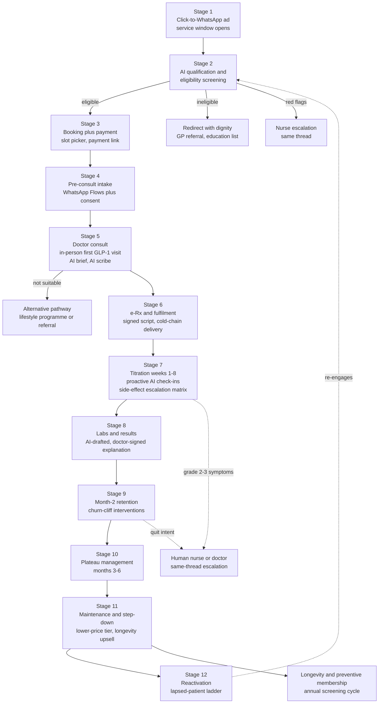

# The AI-Orchestrated Patient Journey: Click-to-WhatsApp to Lifetime Care

**Abstract.** This document designs Welltech's patient journey end-to-end as an AI-orchestrated, WhatsApp-native pathway: from a click-to-WhatsApp ad through AI qualification, booking and payment, Flows-based intake, the doctor consult (AI-prepared, AI-scribed), e-prescription and cold-chain fulfilment, week-by-week titration monitoring, labs with doctor-signed AI explanations, the month-2 retention cliff, plateau management, maintenance step-down and reactivation. Each stage specifies channel, AI role, human role, the researched failure modes it prevents (mapped to the [complaint taxonomy T1–T9](../30-patient-reviews/recurring-complaints.md)), and metrics. The journey is deliberately engineered against the three researched drop-off clusters: GLP-1 side-effect churn in weeks 2–6 (real-world data shows 18% discontinue by month 3, ~50% by month 12[^1][^2]), Ramadan disruption ([consumer behaviour §6.1](../10-market-intelligence/malaysia-consumer-behaviour.md)), and payment friction at conversion and renewal ([consumer behaviour §drop-off map](../10-market-intelligence/malaysia-consumer-behaviour.md)). Roles, escalation logic and regulatory gates referenced here are defined in [ai-clinic.md](ai-clinic.md); process scoring and build sequence in [automation.md](automation.md); channel mechanics in [malaysia-whatsapp-healthcare.md](../10-market-intelligence/malaysia-whatsapp-healthcare.md) and the [WhatsApp operating model](whatsapp-operating-model.md).

**Last updated: July 2026**

---

## 1. Journey overview

Design constants across all stages:

- **One thread.** Every stage lives in the same WhatsApp conversation; forced channel-switches are experienced as service failure ([WhatsApp healthcare §3.4](../10-market-intelligence/malaysia-whatsapp-healthcare.md)). The only mandated exceptions: the first GLP-1 consult (in-person, per the [first-visit rule](../10-market-intelligence/malaysia-regulations.md)) and payment (link-out to gateway; WhatsApp Pay is unavailable in Malaysia).
- **AI speaks as itself; clinicians speak as themselves.** Every message is labelled (assistant vs "SN Aisyah" vs "Dr Lim") — the anti-over-trust rule ([ai-clinic.md §8 R8](ai-clinic.md)).
- **Escalation is same-thread.** Humans join the conversation the patient already has; the patient never repeats their story (Longitudinal Memory provides the context packet).
- **Every business-initiated message is engineered to invite a reply**, converting paid utility templates into free 24-hour service windows ([WhatsApp healthcare §5.2](../10-market-intelligence/malaysia-whatsapp-healthcare.md)).

### 1.1 Journey summary matrix

| Stage | Channel | AI lead ([roles](ai-clinic.md)) | Human lead | Complaints prevented | North-star metric |
|---|---|---|---|---|---|
| 1. CTWA acquisition | Meta ads → WhatsApp | Receptionist | Marketing (creative compliance) | Unanswered first contact | First-response time |
| 2. Qualification & screening | WhatsApp chat + Flow | Receptionist (+ Nurse rails) | Nurse (borderline reviews) | T1 pricing opacity; T7 hard sell | Flow completion rate |
| 3. Booking + payment | Flow + payment link | Scheduling, Billing | Ops (disputes only) | Payment friction; T6 queue voids | First message→booked (<15 min) |
| 4. Pre-consult intake | WhatsApp Flows | Care Coordinator, Doctor Assistant | Nurse spot-checks | T8 rushed consults; consent gaps | Intake completion >90% |
| 5. Doctor consult | In-person (initiation) / video | Doctor Assistant, Documentation | **Doctor (owns stage)** | T8; T3 lock-in; MC exposure | Consult duration ≥10 min median |
| 6. e-Rx + fulfilment | System-to-pharmacist; WhatsApp logistics | Care Coordinator | Pharmacist (dispensing) | T4 delivery; T2 silence; counterfeit fear | Promise-kept rate >98% |
| 7. Titration weeks 1–8 | WhatsApp check-ins | Nurse, Coach, Follow-up | Nurse (grade 1+), doctor (grade 3) | Silent churn; "nobody warned me" | Week-4/8 persistence |
| 8. Labs & results | Lab partner + WhatsApp | Coordinator, Doctor Assistant | **Doctor signs every release** | Results-without-explanation; T2 | Result TAT; 100% explained |
| 9. Month-2 retention | WhatsApp + teleconsult | Follow-up (risk scoring) | Nurse/coach save-calls; doctor | Silent churn; renewal friction; T7 | Month-2→3 renewal rate |
| 10. Plateau months 3–6 | WhatsApp | Coach, Doctor Assistant | Doctor (dose strategy), dietitian | Plateau discouragement; supply shocks | Month-6 persistence |
| 11. Maintenance/step-down | WhatsApp monthly | Follow-up, Billing | Doctor (taper plan), dietitian | Weight-regain disappointment; cost fatigue | Step-down conversion |
| 12. Reactivation | WhatsApp marketing templates | Follow-up (segmentation) | Marketing (KKLIU copy) | Spam degradation; tone-deaf blasts | Reactivation rate; opt-outs <2% |

---

## 2. Stage-by-stage design

### Stage 1 — Click-to-WhatsApp acquisition

- **Channel**: Meta CTWA ad → prefilled first message ("Hi, I'd like to learn about the doctor-led weight programme") → WhatsApp thread. Also wa.me links from SEO content, QR at partner clinics.
- **AI role**: AI Receptionist replies <10 s, bilingual, carrying the ad context (campaign → expected intent); sets expectations (what the programme is, that a doctor decides suitability, emergency disclaimer); logs attribution at conversation level (the workaround to Meta's stripped health-ad conversion events — [WhatsApp healthcare §6.3](../10-market-intelligence/malaysia-whatsapp-healthcare.md)).
- **Human role**: none in-line; marketing team owns KKLIU-approved creative (programme claims only, never molecules — [regulations §6](../10-market-intelligence/malaysia-regulations.md)).
- **Failure modes prevented**: unanswered first contact (the manual-inbox norm of every Malaysian incumbent — [WhatsApp healthcare §3.2](../10-market-intelligence/malaysia-whatsapp-healthcare.md)); ad-to-reality mismatch that seeds T1-style distrust.
- **Metrics**: first-response time, ad→conversation rate, conversation→qualification start rate, cost per started conversation by creative.

### Stage 2 — AI qualification & eligibility screening

- **Channel**: WhatsApp chat + short screening Flow (age, BMI inputs, pregnancy/breastfeeding, key contraindication screens, current medications, prior weight-loss attempts, motivation).
- **AI role**: Receptionist hands to a screening flow that is explicitly *administrative*: it collects structured data and applies doctor-authored inclusion rules to decide only whether a **doctor consult is offered** — it never tells the patient they are "suitable for medication" (SaMD boundary, [ai-clinic.md §6.1](ai-clinic.md)). Quotes the full all-in programme price ladder before booking (RM999/month core tier per [pricing §4](../50-marketing-intelligence/pricing.md)). PDPA consent checkboxes precede any health question.
- **Human role**: nurse reviews borderline screens (e.g., BMI at margin, complex med lists) same day; red-flag disclosures (chest pain, eating-disorder signals, pregnancy) route to nurse immediately.
- **Failure modes prevented**: T1 pricing opacity (price shown before any commitment — the single most universal researched complaint); T7 hard sell (ineligible enquirers are declined with dignity and given alternatives — never "upgraded"; protects clinical reputation per [persona P7 warning](../10-market-intelligence/malaysia-consumer-behaviour.md)); wasted doctor slots on unqualifiable leads.
- **Metrics**: Flow completion rate (benchmark 65–85% vs 35–55% for external links[^3]), qualification rate, decline-handled-well CSAT, consent-capture completeness (100%).

### Stage 3 — Booking + payment

- **Channel**: WhatsApp Flow slot-picker → payment link (FPX/DuitNow/cards/TNG/GrabPay; BNPL for programme fees) → instant confirmation in-thread.
- **AI role**: AI Scheduling offers slots respecting protocol type (first GLP-1 visit = in-person at the PHFSA-registered clinic; general teleconsults bookable directly), language and doctor-gender preferences; AI Billing issues the link, watches the webhook, confirms with itemised receipt; failed payment → gentle retry with alternative rails after 2 h, human follow-up after 24 h.
- **Human role**: ops handles gateway disputes; no human needed in the happy path.
- **Failure modes prevented**: payment friction abandonment (Shopee-trained consumers abandon on friction; every wallet accepted from day one — [consumer behaviour §3.4](../10-market-intelligence/malaysia-consumer-behaviour.md)); "let me discuss with spouse" stalls (AI sends a shareable plain-language programme summary PDF on request); T6 queue voids (booked slot = honoured slot, or compensation per published policy).
- **Metrics**: qualification→booking conversion, payment completion rate, payment-abandonment recovery rate (target >30%), time from first message to booked consult (<15 min median).

### Stage 4 — Pre-consult intake (WhatsApp Flows)

- **Channel**: sequenced Flows T-48h to T-2h before consult: medical history, medication list, side-effect education module ("what week 1 actually feels like"), goals and expectations, photo/document upload (prior labs), granular consents.
- **AI role**: AI Care Coordinator sequences the Flows and chases incompletion (T-24h nudge); extraction writes structured history into Longitudinal Memory; AI Doctor Assistant compiles the one-screen brief; side-effect expectation-setting starts *here*, pre-emptively (the researched anticipated complaint "nobody warned me about the nausea" — [recurring complaints §14](../30-patient-reviews/recurring-complaints.md)).
- **Human role**: nurse spot-checks flagged histories; doctor reviews the brief pre-consult (<2 min).
- **Failure modes prevented**: T8 rushed consults (the 10–15 min consult spends zero time on form-filling — the whole slot is judgment and relationship); repeated history-taking; consent gaps (PDPA ledger written before clinical data flows).
- **Metrics**: intake completion before consult (>90%), brief-ready rate ≥30 min ahead (>99%), doctor-rated brief usefulness, % consults starting on time.

### Stage 5 — Doctor consult (AI-prepared, AI-scribed)

- **Channel**: in-person at the anchor clinic for GLP-1 initiation (physical exam, baseline vitals/labs — the compliance spine per [regulations §3.5](../10-market-intelligence/malaysia-regulations.md)); video/Calling-API teleconsult for follow-ups; the WhatsApp thread carries pre/post logistics.
- **AI role**: Doctor Assistant delivers the brief; Clinical Documentation scribes the encounter (BM/EN) and drafts the SOAP note, patient-instruction summary, and baseline lab orders; nothing reaches the record or the patient unsigned.
- **Human role**: **the doctor owns this stage entirely** — suitability decision, molecule/dose selection, contraindication judgment, expectation-setting conversation, prescribing. Minimum consult standards (no <3-minute consults — the researched T8 wedge) are protected by AI having removed the admin.
- **Failure modes prevented**: T8 ("prescription vending machine" consults at Doctor Anywhere — [recurring complaints §8](../30-patient-reviews/recurring-complaints.md)); T3 prescription lock-in (prescription letter offered by default; buy-anywhere explicitly allowed); unsafe teleconsult-only initiation (regulatory bright line); MC requests (policy explained, in-person visit offered — never issued via teleconsult).
- **Metrics**: consult duration (≥10 min median), same-day note sign-off rate, patients receiving written post-consult summary (100%), doctor consults per clinical hour (throughput *with* quality floor).

### Stage 6 — e-Rx + fulfilment orchestration

- **Channel**: e-Rx flows system-to-pharmacist (digitally signed per OHS 2025 pathway — never a screenshot in chat); WhatsApp carries logistics only (order confirmed → packed → courier → delivered), keeping prescription commerce off-platform per Meta policy ([WhatsApp healthcare §6.1](../10-market-intelligence/malaysia-whatsapp-healthcare.md)).
- **AI role**: Care Coordinator orchestrates dispensing (own dispensary or partner pharmacy), cold-chain courier booking, ID-verified handover, and proactive status messages; delay detected → patient told *before* they ask, with new ETA and a reply path.
- **Human role**: pharmacist verifies and dispenses (Poisons Act records); human decision on any cold-chain excursion.
- **Failure modes prevented**: T4 delivery failures (DoctorOnCall's 15-day-vs-same-day gap is the researched cautionary tale); T2 post-failure silence (the T4→T2→T5 chain broken at link two — [recurring complaints §10.1](../30-patient-reviews/recurring-complaints.md)); counterfeit anxiety (batch-level records, NPRA-registered stock only — [regulations §5](../10-market-intelligence/malaysia-regulations.md)).
- **Metrics**: prescription→delivery time (Klang Valley <24 h target), delivery promise-kept rate (>98%), proactive-notification rate on delays (>95%), cold-chain integrity (100% logged).

### Stage 7 — Titration & side-effect monitoring (weeks 1–8) — **the churn firewall**

The decisive stage: real-world discontinuation is front-loaded (18% by month 3 in population data; steep drop in the first twelve weeks[^1][^2]), and the researched Malaysian drop-off cluster is side-effect dropout in weeks 2–6 ([consumer behaviour §journey map](../10-market-intelligence/malaysia-consumer-behaviour.md)).

- **Channel**: WhatsApp — injection-day walkthrough video, day-3 side-effect pulse, weekly check-in Flow (weight, symptoms graded, dose taken?, mood), always answerable free-form.
- **AI role**: AI Nurse runs the check-in cadence and grades responses; AI Health Coach fills the gaps between clinical touches (protein/hydration/meal-splitting content matched to reported symptoms); AI Follow-up watches for silent disengagement (missed check-in ×2 → escalating re-engagement, then human call). Precedent: AI follow-up calling at US health systems runs this playbook at scale with 9.0/10 patient ratings.[^4]
- **Human role**: per the escalation matrix below; a named nurse fronts weeks 1–2 (first check-in is signed by a human even when AI-drafted — trust anchor).
- **Failure modes prevented**: the anticipated "nobody warned me" complaint class (expectations pre-set at Stage 4, reinforced at day 1); silent churn (the market norm — [sentiment analysis §4](../30-patient-reviews/sentiment-analysis.md) found stage-5 follow-up absent from the entire Malaysian market); unsafe DIY dose changes (patients who skip doses due to nausea get a doctor conversation, not a lecture).
- **Metrics**: week-4 and week-8 persistence (the leading revenue indicators), check-in completion, grade-2/3 escalation resolution time, side-effect-related discontinuations vs baseline.

**Escalation matrix (who handles what):**

| Severity | Examples | Handler | SLA | Action |
|---|---|---|---|---|
| Grade 0 (expected, mild) | Mild nausea day 2–4, injection-site redness, mild constipation | **AI Nurse** | Immediate | Doctor-authored self-care advice; log; re-check next day |
| Grade 1 (persistent mild) | Nausea >5 days, appetite collapse, fatigue affecting work | **AI Nurse → human nurse review** | Same day | AI packages thread + history; nurse replies in-thread; coach adjusts content |
| Grade 2 (moderate) | Repeated vomiting, dehydration signs, dizziness, missed doses ×2 | **Human nurse, doctor informed** | <4 h | Nurse call (Calling API, same thread); doctor decides dose-hold; follow-up scheduled |
| Grade 3 (red flag) | Severe abdominal pain (pancreatitis screen), RUQ pain, hypoglycaemia, chest pain, mental-health crisis | **Doctor** | <2 h | AI instructs dose-hold pending review + doctor contact; documented outcome mandatory |
| Emergency | Collapse, severe allergic reaction, suicidality | **999/ED script instantly** | Immediate | AI sends emergency routing first, alerts on-call human in parallel; never triages |

**Ramadan mode** (annual protocol, activated Ramadan −30 days per [funnels §Ramadan](../50-marketing-intelligence/funnels.md)): doctor-reviewed adjusted dosing calendars; check-in and reminder clock shifts to post-iftar/pre-suhoor windows; hypo-risk and dehydration education; fasting-status field added to check-ins; muftī-reviewed FAQ (injections do not invalidate the fast — [positioning §halal](../50-marketing-intelligence/positioning.md)) served on demand. Prevents the researched annual disruption where titration collides with fasting and patients silently pause ([consumer behaviour §6.1](../10-market-intelligence/malaysia-consumer-behaviour.md)).

### Stage 8 — Labs & results delivery

- **Channel**: lab order at consult → partner-lab collection (home phlebotomy or branch) → results into EMR → WhatsApp notification "your results are ready" (never values in the template — [WhatsApp healthcare §5.4](../10-market-intelligence/malaysia-whatsapp-healthcare.md)) → doctor-signed explanation in-thread, teleconsult offered for abnormalities.
- **AI role**: Care Coordinator books collection and chases lab TATs; Doctor Assistant drafts a plain-language, trend-aware explanation (this result vs baseline vs last quarter, in the patient's language); Follow-up schedules the next cycle (month-3 metabolic panel; annual longevity screening).
- **Human role**: **doctor signs every result release** — normal or not; abnormal results get a doctor-initiated conversation, not a PDF drop.
- **Failure modes prevented**: results-as-PDF-with-no-explanation (the incumbent norm; KPJ-class "results not walked through" complaints — [recurring complaints §8](../30-patient-reviews/recurring-complaints.md)); results lost outside the record (all archived to EMR); T2 silence while patients wait anxiously (TAT commitments with proactive delay notices).
- **Metrics**: result TAT (collection→signed release), % results with explanation delivered (100%), abnormal-result conversation completion, screening-cycle adherence.

### Stage 9 — Month-2 retention interventions (the churn cliff)

Month 2 is where paid enthusiasm meets lived reality: side-effect fatigue, visible-cost/uneven-results tension, renewal payment, and the first "is this worth RM999?" reflection ([consumer behaviour month-3+ risks](../10-market-intelligence/malaysia-consumer-behaviour.md); population data shows discontinuation compounding through months 2–3[^1]).

- **Channel**: WhatsApp; structured month-2 review teleconsult.
- **AI role**: Follow-up computes a persistence-risk score (engagement decay + symptom burden + payment hesitancy + missed check-ins) and fires interventions: progress-visualisation message (weight trend chart + non-scale victories logged since day 1 from memory), month-2 doctor-review booking (dose optimisation moment), renewal reminder T-5 days with all payment rails + BNPL option, and — for high-risk scores — a human save-call task, since live-staff contact outperforms automation ([WhatsApp healthcare §4.4](../10-market-intelligence/malaysia-whatsapp-healthcare.md)).
- **Human role**: nurse/coach save-calls for flagged patients; doctor handles "it's not working" conversations with dose/molecule options; **no retention pressure scripts** — stated quit intent triggers a respectful off-boarding with a doctor conversation offered (anti-T7 by design; one-message cancellation honoured per [recurring complaints §14](../30-patient-reviews/recurring-complaints.md)).
- **Failure modes prevented**: silent month-2 churn (the market's invisible revenue leak); renewal payment friction (retry ladders, rail switching, instalment offers); subscription-cancellation rage (the slimming-centre scar tissue — cancellation is easy, refunds published).
- **Metrics**: month-2→3 renewal rate, save-call conversion (target >30% of flagged), cancellation NPS (exit experience rated), involuntary payment churn (<2%).

### Stage 10 — Plateau management (months 3–6)

- **Channel**: WhatsApp cadence continues at reduced frequency (weekly → fortnightly by engagement preference).
- **AI role**: Coach reframes plateaus with pre-authored clinical content (physiology of adaptation, non-scale metrics, strength/body-composition angles); Doctor Assistant flags true plateaus (≥4 weeks flat at stable adherence) for doctor review of dose/molecule strategy; Follow-up maintains the quarterly labs rhythm.
- **Human role**: doctor owns dose-escalation and switch decisions; dietitian sessions offered at plateau flags.
- **Failure modes prevented**: "plateau discouragement" drop-off (researched weeks-2–6 cousin at months 3–6 — [consumer behaviour journey map](../10-market-intelligence/malaysia-consumer-behaviour.md)); expectation inflation (10–15% body-weight at 12 months with support is the honest anchor — [weight-loss market](../10-market-intelligence/malaysia-weight-loss-market.md)); supply interruptions mid-programme (stock-visibility promise; therapeutic-switch protocol communicated *before* it is needed per [recurring complaints §14](../30-patient-reviews/recurring-complaints.md)).
- **Metrics**: month-6 persistence (vs ~24–31% discontinuation benchmarks[^1][^2]), plateau-flag→doctor-review time, weight outcomes at 6 months, dietitian-session uptake.

### Stage 11 — Maintenance & step-down

- **Channel**: WhatsApp, monthly rhythm.
- **AI role**: Follow-up runs the off-ramp programme (expectation-setting about weight regain from month one — the researched fourth anticipated complaint class); Coach shifts to habit-maintenance content; Billing moves the patient to the cheaper maintenance tier proactively (the clinic volunteers the downgrade — a trust event no incumbent performs); Receptionist cross-serves the longevity/preventive membership (annual screening, biomarkers) as the natural continuation.
- **Human role**: doctor designs the taper/maintenance plan (continue low dose vs discontinue with monitoring); dietitian anchors the transition.
- **Failure modes prevented**: weight-regain disappointment ([recurring complaints §14](../30-patient-reviews/recurring-complaints.md)); cost-fatigue churn (maintenance tier priced for it — [consumer behaviour month-3+](../10-market-intelligence/malaysia-consumer-behaviour.md)); the P1→P2 conversion path left unbuilt (weight patient → longevity member is the LTV extension — [consumer behaviour personas](../10-market-intelligence/malaysia-consumer-behaviour.md)).
- **Metrics**: step-down tier conversion (vs outright cancellation), 12-month weight maintenance, longevity-membership cross-sell rate, alumni NPS.

### Stage 12 — Reactivation

- **Channel**: WhatsApp **marketing** templates (opt-out button mandatory, KKLIU-reviewed copy, frequency-capped) — the only journey stage that pays per-message rates by design ([WhatsApp healthcare §5.2](../10-market-intelligence/malaysia-whatsapp-healthcare.md)).
- **AI role**: Follow-up segments lapsed patients (side-effect leavers ≠ cost leavers ≠ goal-achievers ≠ ghosted) and matches the ladder: goal-achievers get annual-screening recalls; cost leavers get maintenance-tier or promo-window offers; side-effect leavers get "newer options / different approach, doctor conversation free" framing; festival timing exploits the researched demand rhythm (post-Raya, CNY, January — [weight-loss market seasonality](../10-market-intelligence/malaysia-weight-loss-market.md)).
- **Human role**: marketing owns copy compliance; returning patients route to a doctor review (re-screening rules apply — no auto-restart of expired prescriptions).
- **Failure modes prevented**: spam-degraded number quality (caps + opt-outs protect the rating); blanket blasts to people who left angry (service-history-aware suppression from memory).
- **Metrics**: reactivation rate by segment, cost per reactivation vs CAC (should be <25%), opt-out rate (<2% per campaign), number quality rating (hold "High").

---

## 3. Drop-off engineering: the three researched cliffs

The journey above is generic machinery; this section is the targeting. Three drop-off clusters dominate the research and each gets a dedicated design response.

### 3.1 Side-effect churn, weeks 2–6

**Mechanism** ([consumer behaviour journey map](../10-market-intelligence/malaysia-consumer-behaviour.md); real-world persistence data[^1][^2]): GI side-effects peak during early titration; patients quietly skip doses, then stop; in the incumbent market nobody notices because stage-5 follow-up does not exist ([sentiment analysis §4](../30-patient-reviews/sentiment-analysis.md)). Discontinuation is front-loaded — the steepest decline is inside the first twelve weeks.[^2]

| Design response | Where it lives | Evidence/rationale |
|---|---|---|
| Expectation-setting *before* symptoms (intake education module, day-1 primer) | Stages 4–6 | Pre-warned patients reinterpret nausea as "expected week-2" not "something is wrong" |
| Day-3 pulse — the earliest catchable moment | Cadence D3 | Side-effects onset within days of first injection |
| Symptom-matched coaching (meal-splitting, hydration, protein-first) within minutes of report | Stage 7, AI Nurse + Coach | Messaging cadence is the cheapest known adherence lever ([WhatsApp healthcare §4.3](../10-market-intelligence/malaysia-whatsapp-healthcare.md)) |
| Missed check-in ×2 → escalating re-engagement → human call | Stage 7, AI Follow-up | Silence is the strongest churn signal; live contact outperforms automation |
| Dose-hold with doctor conversation instead of DIY quitting | Escalation matrix grade 2–3 | Converts "I stopped because I felt awful" into a managed titration adjustment |
| Week-4 doctor review as a fixed milestone | Cadence D28 | Specialist-managed cohorts retain better than unmanaged[^1]; the review is where dose strategy absorbs side-effect burden |

### 3.2 Ramadan disruption

**Mechanism** ([consumer behaviour §6.1](../10-market-intelligence/malaysia-consumer-behaviour.md)): fasting restructures meal timing, hydration and medication routines for a month; GLP-1 appetite suppression interacts with suhoor/iftar; patients pause programmes silently rather than ask whether injecting breaks the fast.

| Timeline | Action | Owner |
|---|---|---|
| Ramadan −30d | Ramadan-mode activation template ("reply RAMADAN"); fasting-intent captured to memory | AI Follow-up |
| Ramadan −14d | Doctor-reviewed adjusted dosing calendar issued per patient; muftī-reviewed FAQ pushed (non-nutritional injections do not invalidate the fast — [positioning §halal](../50-marketing-intelligence/positioning.md)) | Doctor + Coach |
| Ramadan day 1 | Check-in clock shifts to post-iftar / pre-suhoor windows; hydration + hypo-risk education begins | AI Coach |
| Mid-Ramadan | Fasting-status field in weekly check-ins; dizziness/hypo reports escalate at lowered threshold | AI Nurse |
| Raya + open-house season | Expectation-setting for festive weight fluctuation (documented 0.4–1.9 kg festive gain — [weight-loss market seasonality](../10-market-intelligence/malaysia-weight-loss-market.md)); no weigh-in shaming; post-Raya re-engagement wave doubles as acquisition season | Coach + Follow-up |

No regional competitor productises this ([consumer behaviour §6.1](../10-market-intelligence/malaysia-consumer-behaviour.md)) — Ramadan mode is simultaneously a safety protocol and the most culturally legible differentiation Welltech owns.

### 3.3 Payment friction

**Mechanism** ([consumer behaviour §3.4, §5](../10-market-intelligence/malaysia-consumer-behaviour.md)): Shopee-trained consumers abandon on checkout friction; RM999/month is discretionary-budget money for the M40 core segment; renewals fail silently on expired cards and empty wallets.

| Friction point | Design response | Owner |
|---|---|---|
| First payment (sticker shock vs RM58 consult anchor) | Cheap entry consult; price ladder shown at Stage 2 before any commitment; BNPL offered inline (Atome/SPayLater/Grab per [pricing §4.4](../50-marketing-intelligence/pricing.md)) | AI Billing |
| Wallet mismatch | Every rail from day one: FPX, DuitNow QR, cards, TNG, GrabPay, Boost | AI Billing |
| Spouse-approval stall | Shareable plain-language programme summary PDF on request; resume link honoured for 7 days | AI Receptionist |
| Renewal failure (involuntary churn) | T-5d reminder; retry ladder across rails; grace period — **never suspend mid-titration without human review** | AI Billing |
| Cost fatigue months 3+ | Proactive step-down tier offer; 6-month prepay discount via BNPL instalments (converts churn risk to committed cash — [pricing §3](../50-marketing-intelligence/pricing.md)) | Billing + Follow-up |
| Refund anxiety (slimming-centre scar tissue) | Published refund policy quoted at purchase; auto-refund on missed SLAs; <7-day cycle | AI Billing |

---

## 4. Message cadence table (core GLP-1 programme, first 12 weeks)

*(analyst-designed defaults; A/B from launch; all templates Meta-reviewed and clinically approved; class determines cost per [WhatsApp healthcare §5.2](../10-market-intelligence/malaysia-whatsapp-healthcare.md))*

| Day | Message / template | Class | Sender label | Purpose |
|---|---|---|---|---|
| D0 (enquiry) | Instant greeting + programme explainer + price ladder | Service | Assistant | Qualification start |
| D0 | Screening Flow + PDPA consent | Service | Assistant | Eligibility, consent ledger |
| D0–1 | Slot picker + payment link + confirmation with itemised receipt | Service/Utility | Assistant | Booking + payment |
| T-48h | Intake Flow part 1 (history, meds) | Utility | Assistant | Chart building |
| T-24h | Appointment reminder + intake part 2 (expectations, side-effect primer) | Utility | Assistant | No-show defence, expectation-setting |
| T-2h | Logistics (clinic pin / video link) | Utility | Assistant | Friction removal |
| Consult day | Post-consult summary + plan + prescription letter offer | Service | Dr {name} | T3/T8 counters; written plan |
| D+1 | Delivery confirmation + injection walkthrough video + storage guide | Utility | Assistant | Fulfilment + technique |
| **Week 1, D3** | Side-effect pulse ("2 taps: how are you feeling?") | Utility | SN {name} | First churn checkpoint |
| W1, D7 | Weekly check-in Flow (weight, symptoms, dose taken, mood) | Utility | SN {name} | Structured monitoring |
| W2, D10 | Coach content: managing nausea, protein-first meals (BM/EN) | Utility | Coach | Side-effect coping — churn window opens |
| W2, D14 | Check-in Flow + "reply anything, a nurse reads these" | Utility | SN {name} | Keep human presence visible |
| W3, D17 | Coach: hydration + movement nudge, personalised to logs | Utility | Coach | Engagement variation |
| W3, D21 | Check-in + week-4 dose-review booking offer | Utility | Assistant | Titration milestone |
| **W4, D28** | Dose-review teleconsult (doctor) + progress chart | Service | Dr {name} | First outcome conversation |
| W5–6 | Weekly check-ins + coach content; **peak-churn watch** — missed check-in ×2 → re-engagement → human call | Utility/Service | Mixed | Weeks 2–6 firewall |
| W6, D42 | Non-scale-victories message (memory-sourced: sleep, energy, clothing) | Utility | Coach | Motivation at the researched dip |
| **W8, D56** | Month-2 review consult + labs order + renewal reminder T-5d (all rails + BNPL) | Service/Utility | Dr + Assistant | Churn-cliff intervention set |
| W9, D63 | Results-ready notification → doctor-signed explanation | Utility→Service | Dr {name} | Results with meaning |
| W10–12 | Fortnightly check-ins; plateau content as flagged; month-3 renewal sequence | Utility | Mixed | Transition to steady state |
| Ramadan −30d | Ramadan-mode activation ("reply RAMADAN") + adjusted calendar | Utility | Dr/Assistant | Annual disruption protocol |
| Lapsed +30/60/90d | Reactivation ladder (segment-matched) | **Marketing** | Brand | Opt-out carried; frequency-capped |

**Steady-state cadence (months 4–12):**

| Rhythm | Message | Class | Purpose |
|---|---|---|---|
| Fortnightly | Check-in Flow (weight, symptoms, adherence) — monthly from month 6 by preference | Utility | Monitoring without fatigue |
| Monthly | Progress summary + coach content matched to phase | Utility | Engagement floor |
| Monthly, T-5d | Renewal reminder + rails + instalment option | Utility | Involuntary-churn defence |
| Quarterly | Labs cycle: order → collection → doctor-signed explanation | Utility→Service | Outcome evidence + clinical safety |
| Quarterly | Doctor review teleconsult | Service | Dose strategy, relationship |
| Event-driven | Plateau flag content; supply-status notices; festival protocols (Ramadan, CNY, Raya, Deepavali) | Utility | The researched calendar ([consumer behaviour §6](../10-market-intelligence/malaysia-consumer-behaviour.md)) |
| Month 9–12 | Step-down conversation sequence + maintenance-tier offer + longevity cross-serve | Service | Off-ramp by design |

Cost note: this cadence is ~85% utility/service class; modelled Meta fees stay ≈RM0.50–1.05 per patient-month ([WhatsApp healthcare §5.2](../10-market-intelligence/malaysia-whatsapp-healthcare.md)) — the proactive-care model is nearly free at the channel layer; its real cost is the human escalation capacity in [ai-clinic.md §7](ai-clinic.md).

---

## 5. Journey-wide metrics

| Layer | Metrics |
|---|---|
| Funnel | Ad→conversation, conversation→qualified, qualified→booked, booked→consulted, consulted→enrolled; time-to-value (first message → first delivery) |
| Persistence (the business) | Week-4 / week-8 / month-3 / month-6 / month-12 persistence vs unmanaged baselines (82%/69%/48% surviving at months 3/6/12 inverted from discontinuation data[^1]); target: month-3 ≥90%, month-12 ≥60% *(analyst targets per [weight-loss market](../10-market-intelligence/malaysia-weight-loss-market.md))* |
| Safety | Grade-2/3 escalation SLAs met, missed-red-flag audit findings (zero tolerance), adverse events reported to NPRA |
| Experience | First-response time, CSAT per stage, complaint rate per 100 patients (vs the T1–T9 taxonomy as the scorecard), cancellation-experience NPS |
| Outcomes | % body-weight loss at 6/12 months, lab-marker deltas, screening-cycle adherence — the proprietary evidence asset |

The complaint taxonomy doubles as the journey's QA checklist: a monthly review asks, for each of T1–T9 and the four anticipated classes, "did we generate any instance of this — and did the AI or a human catch it first?" ([recurring complaints §11, §14](../30-patient-reviews/recurring-complaints.md)).

---

## References

[^1]: Medscape, "Real-World Study Finds Over 50% Stop GLP-1s Within 1 Year" (2025) — Danish cohort, n=77,310: discontinuation 18% at 3 months, 31% at 6 months, 52% at 12 months, https://www.medscape.com/viewarticle/real-world-study-finds-over-50-stop-glp-1s-within-1-year-2025a1000obm (accessed July 2026).
[^2]: Samuels et al., "Real-world titration, persistence & weight loss of semaglutide and tirzepatide in an academic obesity clinic", Diabetes, Obesity and Metabolism (2025) — discontinuation 14%/24%/35%/50% at 3/6/9/12 months; steep early drop pattern, https://dom-pubs.onlinelibrary.wiley.com/doi/10.1111/dom.70004 (accessed July 2026).
[^3]: WhatsApp Flows completion benchmarks (65–85% vs 35–55% external links) as documented in [malaysia-whatsapp-healthcare.md §5.1](../10-market-intelligence/malaysia-whatsapp-healthcare.md) and its underlying sources.
[^4]: Universal Health Services / Hippocratic AI post-discharge AI follow-up deployment (June 2025) — 9.0/10 average patient rating, https://uhs.com/news/universal-health-services-launches-hippocratic-ais-generative-ai-healthcare-agents-to-assist-with-post-discharge-patient-engagement/ (accessed July 2026).
