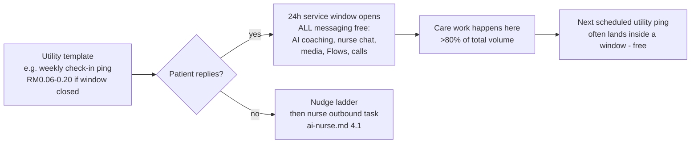
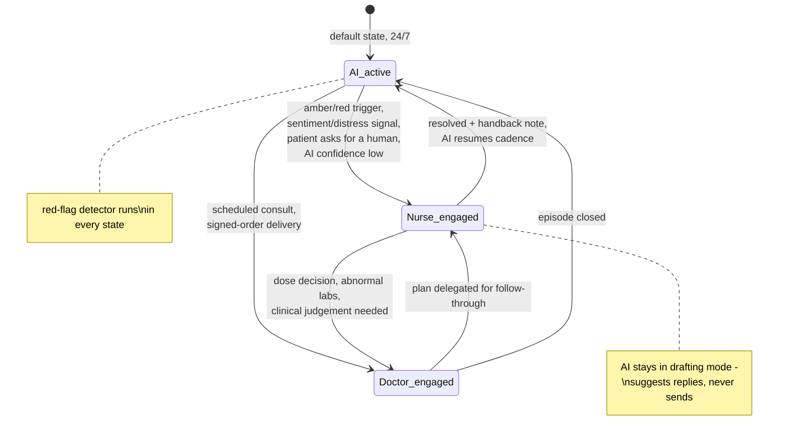

# The WhatsApp Operating Model: Welltech's Core Care-Delivery Rail, Fully Specified

**Abstract.** WhatsApp is not a channel of Welltech's clinic; it is the clinic's front-of-house — the research in [malaysia-whatsapp-healthcare.md](../10-market-intelligence/malaysia-whatsapp-healthcare.md) established that the channel decision is settled and that no Malaysian provider yet runs a compliant, instrumented, AI-augmented WhatsApp care operation. This document is the operating specification that closes that gap: number and identity strategy (a two-number portfolio separating the care rail from the growth rail); conversation architecture engineered around the July 2025 per-message pricing so a service-led clinic pays roughly RM1–3 per patient-month in Meta fees; a 46-template library mapped to category, trigger and compliance constraints (Meta health policy + MAB/KKLIU: never a molecule name in outbound content); WhatsApp Flows for intake, screeners, booking and consent; a rich-media strategy; a PDPA-grade opt-in/consent ledger; the AI→nurse→doctor handover state machine with no patient-visible seams; quality and deliverability operations that treat the Meta quality rating as a safety-grade alarm; the measurement stack; and a message-by-message worked example of twelve weeks in a GLP-1 patient's thread showing AI, nurse and doctor turns and their cost class.

**Last updated: July 2026**

Related documents: [Malaysia WhatsApp healthcare intelligence](../10-market-intelligence/malaysia-whatsapp-healthcare.md) (the evidence base this design executes) · [AI Doctor Assistant](ai-doctor.md) · [AI Nurse design](ai-nurse.md) · [Malaysia regulations](../10-market-intelligence/malaysia-regulations.md) · [Prescribing models](../40-doctor-experience/prescribing-models.md) · [Patient acquisition channels](../50-marketing-intelligence/patient-acquisition-channels.md)

---

**Contents:** 1. Number & identity strategy · 2. Conversation architecture & cost model · 3. Template library · 4. WhatsApp Flows usage · 5. Rich media strategy · 6. Opt-in, opt-out and PDPA consent architecture · 7. Human handover design · 8. Quality & deliverability operations · 9. Measurement · 10. Twelve weeks of a GLP-1 patient's thread · References

---

## 1. Number and identity strategy

### 1.1 The portfolio

| Number | Display name | Purpose | Message mix | Rationale |
|---|---|---|---|---|
| **Care number** (primary) | "Welltech Care" | The clinic: onboarding, care, reminders, results, refills, payments, support | Service + utility; marketing ≈ 0 | One thread = one longitudinal care record per patient. Quality rating protected by near-zero marketing volume; a ban here severs care delivery, so nothing risky ever runs on it |
| **Growth number** | "Welltech" | CTWA landing, campaigns, reactivation of lapsed/never-enrolled contacts, newsletters | Marketing-heavy + onboarding service | Absorbs all marketing-template risk. If throttled or banned, care continues untouched. Enrolled patients are handed to the Care number and suppressed from Growth marketing |
| Internal doctor channel | (not patient-facing) | Doctor notifications/deep links ([ai-doctor.md §8](ai-doctor.md)) | Utility | Never published; zero patient PII in message bodies |

Both patient-facing numbers sit in one WhatsApp Business portfolio (messaging limits and quality are managed at portfolio level — [malaysia-whatsapp-healthcare.md §5.3](../10-market-intelligence/malaysia-whatsapp-healthcare.md)), with Meta business verification and the green-tick display name on each.

Why not one number for everything? Marketing templates are the dominant cause of blocks and quality degradation, and quality events now propagate consequences at portfolio and number level; separating rails is the standard risk isolation the research's risk register calls for (§10.1 there). Why not a number per function (booking vs nursing vs billing)? Because the single-thread experience *is* the product — Malaysians treat the chat thread as their de-facto health record ("scroll up"), and every forced channel switch reads as service failure ([malaysia-whatsapp-healthcare.md §3.4](../10-market-intelligence/malaysia-whatsapp-healthcare.md)).

### 1.2 Identity hygiene

- Business profile fully populated (clinic address of the PHFSA-registered facility, website, hours); the official numbers published on the website, clinic signage, and patient onboarding pack — the anti-impersonation defence in Malaysia's scam-saturated messaging environment.
- Patient education line in onboarding: "We will only ever message you from this number. We never ask for banking passwords or OTPs."
- Number continuity is a board-level asset: porting, backup admin access, and the ban-appeal runbook (§8) are documented before launch, not after an incident.

## 2. Conversation architecture and cost model

### 2.1 Message classes and the window

Under the July 2025 pricing reset: service messages (anything inside the 24-hour window opened by a patient message) are free and unlimited; utility templates are free inside the window and cheap outside it; marketing templates are always charged (Malaysia ≈ RM0.30–0.45) and carry mandatory opt-out ([malaysia-whatsapp-healthcare.md §5.2](../10-market-intelligence/malaysia-whatsapp-healthcare.md)).

**The architectural rule: engineer for patient-initiated conversations.** Every cadence message is designed to elicit a reply (buttons, Flows, questions), because a reply opens 24 hours of free rich messaging in which the [AI Nurse](ai-nurse.md) and care team operate at zero marginal cost. Business-initiated volume should stay under ~20% of total traffic (*analyst target from the research's risk register*).

### 2.2 Cost model per patient-month (MYR)

*(analyst model; unit rates from [malaysia-whatsapp-healthcare.md §5.2](../10-market-intelligence/malaysia-whatsapp-healthcare.md); volumes from the §10 worked example)*

| Patient state | Template sends/month (outside window) | Marketing sends | Meta cost/month |
|---|---|---|---|
| GLP-1 titration phase (weeks 0–16) | ~10–14 utility (check-in pings, reminders, refill, labs) — but ~half land inside open windows → free | 0 | **RM0.40–1.60** |
| GLP-1 maintenance | ~6–8 utility | 0 | RM0.25–1.00 |
| General telehealth patient (episodic) | ~2–4 utility | 0–1 | RM0.15–0.80 |
| Lapsed contact (reactivation ladder) | 0 | ≤2 marketing (RM0.30–0.45 ea.) | RM0.60–0.90 |
| **Blended active-patient planning figure** | | | **≈ RM1–3/patient-month; Meta fees <0.5% of programme revenue** |

BSP platform fees sit on top (respond.io-class subscription at launch; migration economics and the build-vs-buy path are in [malaysia-whatsapp-healthcare.md §7.2](../10-market-intelligence/malaysia-whatsapp-healthcare.md)). The strategic point stands: the marginal cost of an extra care touchpoint is ~zero, so care intensity is a clinical-design decision, not a cost decision — the inverse of SMS/call-centre economics.

### 2.3 Payments

WhatsApp Pay is unavailable in Malaysia; all payments run as FPX/DuitNow/card payment links in-thread with webhook reconciliation auto-confirming in the conversation ([malaysia-whatsapp-healthcare.md §9.7](../10-market-intelligence/malaysia-whatsapp-healthcare.md)). Prescription-medicine checkout never happens on WhatsApp surfaces — the thread carries the payment link for *programme fees* and logistics notifications only ([malaysia-regulations.md §7.3](../10-market-intelligence/malaysia-regulations.md)).

## 3. Template library

Governance first: templates are regulated communications. Every template passes (1) clinical review where care-relevant, (2) compliance review — Meta health policy (no prescription-drug promotion or sale; **no molecule or brand names ever** in outbound content) + MASA/MAB rules (no prescription-medicine advertising to the public; KKLIU approval for anything promotional) + PDPA, (3) Meta category review. Version-controlled; dual sign-off; quarterly re-review ([malaysia-whatsapp-healthcare.md §5.4, §6](../10-market-intelligence/malaysia-whatsapp-healthcare.md)).

Library v1 — 46 templates. Category: U = utility, M = marketing, A = authentication.

| # | Template | Cat | Trigger | Compliance notes |
|---|---|---|---|---|
| **Acquisition & onboarding (Growth number)** |||||
| 1 | CTWA welcome + programme explainer | U (reply to user-initiated) | Patient's first message from ad | Service reply in practice; programme language only ("doctor-led weight-management programme"), no molecules |
| 2 | Intake Flow invitation | U | Post-welcome | Consent checkboxes inside Flow (§6) |
| 3 | Eligibility outcome + booking invite | U | Intake Flow completed | No clinical claims; route to consult |
| 4 | Handover to Care number card | U | Enrolment confirmed | Contact card + "save this number"; anti-impersonation line |
| 5 | Incomplete-intake nudge | U | Flow abandoned 24 h | One retry only, then stop |
| **Booking & logistics (Care number)** |||||
| 6 | Appointment confirmation | U | Booking made | Buttons: confirm / reschedule (opens window) |
| 7 | Reminder T-72h | U | Schedule | Reschedule Flow attached |
| 8 | Reminder T-24h | U | Schedule | |
| 9 | Logistics T-2h (directions/parking or call-link) | U | Schedule | |
| 10 | Missed-appointment recovery | U | No-show event | Rebooking Flow; neutral tone |
| 11 | Teleconsult starting soon + join link | U | T-10 min | |
| **Payments & admin** |||||
| 12 | Payment link (programme fee/consult) | U | Invoice raised | Programme fees only; no medicine checkout on-platform |
| 13 | Payment received + e-invoice | U | Webhook | |
| 14 | Payment failed / retry | U | Webhook | Max 2 retries then human |
| **GLP-1 programme cadence (Care number)** |||||
| 15 | Injection-day walkthrough (video attached) | U | Day 1 each dose step | Technique content only; no drug naming in template text ("your pen") |
| 16 | Day-3 side-effect pulse | U | D+3 of new dose | Buttons: OK / not great (not-great → AI triage, [ai-nurse.md §5](ai-nurse.md)) |
| 17 | Weekly check-in Flow ping | U | Weekly | The core cadence touch |
| 18 | Check-in nudge (24 h) | U | Non-response | |
| 19 | Missed check-in ×2 — nurse call offer | U | Trigger | Warm tone; schedule-a-call button |
| 20 | Titration-review booking (week-4 boundary) | U | Titration engine | "Dose review with Dr {{name}}" — no dose values in template |
| 21 | Dose-change confirmation | U | Doctor signs order | Quotes signed order via secure link; template itself carries no dose text |
| 22 | Weekly injection-day reminder | U | Patient-chosen day | |
| 23 | Missed-dose guidance ping | U | Adherence gap detected | Links approved protocol content, no improvised advice |
| 24 | Pre-op / procedure hold check | U | Patient reports surgery | NPRA aspiration-alert protocol ([ai-doctor.md §7.2](ai-doctor.md)) |
| **Labs & results** |||||
| 25 | Lab booking + pre-lab instructions | U | Monitoring schedule | Fasting rules, location, QR |
| 26 | Lab reminder (day before / morning) | U | Schedule | |
| 27 | Results-ready ping | U | Results in EMR | **Never values in template**; "reply READY to walk through them" |
| 28 | Results follow-up booking (flagged) | U | Doctor flags | Neutral wording to avoid alarm + avoid clinical content pre-window |
| **Refills & delivery** |||||
| 29 | Refill due T-7 | U | Supply model | "Your programme supply" — no product names |
| 30 | Refill teleconsult required (Rx expiring) | U | Rx validity ([prescribing-models.md §5](../40-doctor-experience/prescribing-models.md)) | Supply never outruns review |
| 31 | Order confirmed + delivery window | U | Dispensing event | |
| 32 | Cold-chain delivery day instructions | U | Dispatch | "Refrigerate on arrival"; ID check note |
| 33 | Delivery completed + storage check | U | POD webhook | Button: "stored in fridge ✓" |
| **Care & engagement** |||||
| 34 | Nurse outbound-call booking (week 2 / week 6) | U | Cadence ([ai-nurse.md §6](ai-nurse.md)) | |
| 35 | Monthly progress summary (chart image) | U | Month boundary | Patient's own data only |
| 36 | Educational tip of the week | U* | Weekly, consented | *Borderline utility/marketing — submit both variants; keep non-promotional to stay utility |
| 37 | Programme milestone congratulation | U | Milestone event | No before/after imagery, no outcome claims to others |
| 38 | NPS / experience survey Flow | U | Post-episode + quarterly | |
| **Reactivation & marketing (Growth number; all with opt-out button, KKLIU-reviewed)** |||||
| 39 | Lapsed day-45 educational nudge | M | Lapse ladder | Value-led; no discount pressure; RM0.30–0.45 |
| 40 | Lapsed day-90 offer (screening package) | M | Lapse ladder | MAB-compliant service claims only |
| 41 | Lapsed day-180 consent refresh ("keep your file active?") | M | Lapse ladder | Doubles as PDPA hygiene |
| 42 | Seasonal screening campaign | M | Campaign calendar | Frequency cap ≤2 marketing/contact/month |
| 43 | New-service announcement | M | Launch events | Suppressed for active programme patients |
| **System & safety** |||||
| 44 | OTP / identity verification | A | Portal login, record export | |
| 45 | After-hours auto-acknowledgement | U | Inbound 22:00–08:00 | States emergency routing (999/ED) — always |
| 46 | Service-disruption notice | U | Incident | Backup-channel pointers (§8.4) |

Rejection-handling: category mismatch is the top rejection cause; utility templates stay strictly transactional (any promotional phrase migrates the template to marketing review), and every template ships with a fallback plain variant pre-approved so a rejection never breaks a care cadence ([malaysia-whatsapp-healthcare.md §10.1](../10-market-intelligence/malaysia-whatsapp-healthcare.md)).

## 4. WhatsApp Flows usage

Flows are the structured-data backbone — native in-chat multi-screen forms (text inputs, dropdowns, checkboxes, radio buttons, date pickers, opt-in components; up to 8 screens of 8 components, with endpoint-powered dynamic screens for live data like slot availability).[^1] Completion benchmarks: 65–85% vs 35–55% for external links ([malaysia-whatsapp-healthcare.md §5.1](../10-market-intelligence/malaysia-whatsapp-healthcare.md)).

| Flow | Screens (≤8) | Data captured | Notes |
|---|---|---|---|
| **Intake & consent** | Welcome → demographics → health goals → medical history & meds → red-flag screen → PDPA consent set → confirmation | Structured intake + consent ledger entries (§6) | Consent screens *before* any health questions (PDPA sensitive-data sequencing); BM/EN selectable at screen 1 |
| **Appointment booking / reschedule** | Service → doctor → date picker → slot (endpoint-driven) → confirm | Booking record | Slot picker kills the "we'll get back to you" incumbent experience |
| **Weekly GLP-1 check-in** | Weight → dose taken → symptom checklist + severity → mood/energy → free text | Longitudinal programme dataset | Feeds triage + titration engine; 2-minute design budget |
| **Wellbeing screener (PHQ-style)** | Framing → questionnaire items → support options | Screener responses | **Scored and interpreted by clinicians, not the Flow** — auto-scoring with disposition would drift toward SaMD; distress answers create an immediate nurse task ([ai-nurse.md §5](ai-nurse.md)) |
| **Injection-technique checklist** | Step confirmations → confidence rating → video-call offer | Technique confidence data | First-dose sequence ([ai-nurse.md §4.3](ai-nurse.md)) |
| **Pre-lab confirmation** | Instructions ack → slot pick → reminders opt-in | Lab compliance | |
| **Preference centre** | Message-type toggles → frequency → language | Consent/preference updates | The opt-out-lite that saves opt-outs (§6) |
| **NPS & feedback** | Score → verbatim → follow-up permission | Experience data | |

Design rules: no Flow asks for data the EMR already holds (pre-fill via endpoint); every Flow submission is archived raw + parsed; Flows are versioned artefacts in the protocol library with the same sign-off chain as clinical copy ([ai-nurse.md §8](ai-nurse.md)).

## 5. Rich media strategy

| Asset class | Use | Rules |
|---|---|---|
| Injection-technique videos (60–90 s, per pen type) | Day-1 walkthroughs, refreshers | BM/EN audio + trilingual subtitles; clinician-approved, versioned; no brand glamour shots — instructional framing keeps it outside advertising |
| Meal guides & local food swaps (images/PDF) | Weekly education, plateau support | Malaysian food vernacular (nasi campur portions, mamak choices, Ramadan guidance); no "lose X kg" claims (MAB) |
| **Doctor voice notes** (20–40 s) | Dose-change explanations, milestone encouragement, amber-episode reassurance after review | The highest-trust artefact in the model: the patient's *named doctor* speaking. Scripted boundaries (no new clinical instructions outside the signed plan), archived to EMR like any clinical message ([ai-doctor.md §9](ai-doctor.md)) |
| Progress charts (auto-generated image) | Monthly summary, consult prep | Patient's own data; watermarked; no sharing prompts |
| Location/contact cards | Clinic visits, lab directions | |
| Secure-link documents | Lab PDFs, referral letters, signed summaries | Time-limited links, not chat attachments sitting in a personal gallery ([malaysia-whatsapp-healthcare.md §9.6](../10-market-intelligence/malaysia-whatsapp-healthcare.md)) |

Voice-note symmetry matters culturally: patients voice-note in Manglish and expect the same register back; the AI transcribes patient voice notes for the record, and human clinicians are encouraged to reply by voice at emotionally loaded moments ([malaysia-whatsapp-healthcare.md §3.4](../10-market-intelligence/malaysia-whatsapp-healthcare.md)).

## 6. Opt-in, opt-out and PDPA consent architecture

### 6.1 The consent ledger

Captured in the intake Flow (and amendable via the preference centre), one ledger row per consent: `patient_id · consent_type · granted/withdrawn · wording version · timestamp · channel · Flow submission ID`. Consent types are granular:

| Consent | Covers | Default |
|---|---|---|
| C1 Care operations | Appointments, payments, logistics, delivery | Required to enrol |
| C2 Clinical follow-up | Check-ins, side-effect monitoring, results pings, titration comms | Required for programme patients |
| C3 Sensitive-data processing (PDPA s.40 explicit consent) | Health data processing incl. AI-assisted processing and cross-border infrastructure (Meta Cloud API, cloud/AI vendors) — plain-language, BM/EN | Required; named processors listed in the privacy notice |
| C4 Education content | Tips, guides, cohort invitations | Optional |
| C5 Marketing | Campaigns, reactivation, new services | Optional; Growth number only |
| C6 Guardian/family involvement | Named family member may be included in logistics comms | Optional; identity-verified |

This implements the PDPA 2024-amendment posture — explicit sensitive-data consent, documented cross-border basis (TIA for Meta Cloud API and AI vendors), DPO-owned records, 72-hour breach runbook ([malaysia-regulations.md §7](../10-market-intelligence/malaysia-regulations.md)) — and Meta's opt-in requirements (named business, named message types, auditable capture; [malaysia-whatsapp-healthcare.md §5.3](../10-market-intelligence/malaysia-whatsapp-healthcare.md)).

### 6.2 Opt-out mechanics

- Every marketing template carries the opt-out button; opt-out executes immediately, writes the ledger, and is confirmed in one line, with the preference-centre Flow offered ("only want reminders, not offers? choose here") — converting all-or-nothing opt-outs into preference downgrades.
- "STOP"-class free-text in *any* conversation is honoured for marketing globally; clinical-safety messages (red-flag responses, recall-grade notices) are exempted from marketing opt-out but not from full-relationship termination.
- Full withdrawal/erasure requests route to the DPO workflow: care implications explained by a human, retention obligations honoured (medical-record norms override erasure for clinical records — explained honestly), everything else deleted on schedule.

## 7. Human handover design

### 7.1 The state machine

### 7.2 Continuity rules — no patient-visible seams

1. **One thread, always.** Handover changes who is speaking, never where. The patient is never told to call a number, email, or start a new chat.
2. **Context travels, the patient repeats nothing.** Every handover generates a context pack (state, programme week, last 10 relevant turns summarised, open tasks) into the console — the receiving human reads for 20 seconds and continues mid-conversation ([ai-nurse.md §7.1](ai-nurse.md)).
3. **Identity is explicit at the clinical layer.** AI turns are the "Welltech care assistant"; human clinical turns are stamped "— SN Aisyah (Nurse)" / "— Dr Tan (MMC …)". The patient always knows *whether* a human is speaking, and never experiences a gap while one is found. No fake typing indicators, no AI pretending to be staff ([ai-nurse.md §2](ai-nurse.md)).
4. **Internal notes ride the thread invisibly.** Nurse↔doctor coordination ("held dose proposal, patient anxious re: nausea, please voice-note") lives as console-side notes bound to the conversation, archived with it — never sent to the patient, never in a separate silo that fragments the record.
5. **During human engagement the AI demotes to drafting mode**: it suggests responses and fetches protocol blocks for the human but cannot send; the red-flag detector alone stays autonomous in all states.
6. **Handback is explicit.** The human closes with a handback note; the AI resumes cadence referencing the human's plan ("Dr Tan asked me to check in on Thursday — how's the nausea today?") so the thread reads as one coordinated team, which is exactly what it is.

## 8. Quality and deliverability operations

The number is the clinic's front door; its health is run like clinical safety, not marketing ops ([malaysia-whatsapp-healthcare.md §10.1](../10-market-intelligence/malaysia-whatsapp-healthcare.md)).

### 8.1 Monitoring (daily, alarmed)

| Signal | Threshold | Response |
|---|---|---|
| Meta quality rating | Anything below Green | Freeze marketing sends portfolio-wide; incident review same day |
| Block rate per template | >0.5% | Pull template, root-cause, redesign |
| Template rejection | Any | Runbook: reclassify/rewrite → resubmit → appeal; deploy pre-approved fallback variant meanwhile |
| Business-initiated share of volume | >20% | Cadence redesign — the model is drifting blast-ward |
| Messaging-limit tier | Ahead of growth curve | Warm-up plan: tiers scale 1K→10K→100K→unlimited on sustained quality; no campaign may exceed the current tier's headroom |

### 8.2 Ban prevention and recovery

- Prevention: number-role separation (§1), marketing frequency caps (≤2/contact/month), suppression of marketing to active patients, no molecule names anywhere, opt-in audit trail ready for Meta review, gradual warm-up of any new number.
- Recovery runbook (written, drilled): appeal path via BSP + Meta support with the consent-ledger evidence pack; Growth-number loss → acquisition pauses, care unaffected; Care-number loss (worst case) → patients notified via backup channels within 24 h with the replacement verified number, re-opt-in flow ready. The patient graph (numbers + consents) lives in Welltech's CRM, not the BSP, so the channel is rebuildable ([malaysia-whatsapp-healthcare.md §11](../10-market-intelligence/malaysia-whatsapp-healthcare.md)).

### 8.3 Vendor posture

Launch on a respond.io-class BSP (local support, healthcare references), with the §7.2 build-vs-buy migration path (direct Cloud API/360dialog once >~50K msgs/month) pre-designed: channel-abstracted messaging layer, exportable archives, no BSP-proprietary data model ([malaysia-whatsapp-healthcare.md §7](../10-market-intelligence/malaysia-whatsapp-healthcare.md)).

### 8.4 Backup channels

SMS + email held warm for every patient (collected at intake): regulated notices, service-disruption fallback, and the ban-recovery path. Phone/voice for red-tier escalation always available — the escalation SLAs in [ai-nurse.md §5](ai-nurse.md) must not depend on a single platform's uptime.

## 9. Measurement

Extends the KPI framework in [malaysia-whatsapp-healthcare.md §9.10](../10-market-intelligence/malaysia-whatsapp-healthcare.md); owned by ops with monthly leadership review; quality metrics are safety-grade.

| Layer | Metric | Target *(launch hypotheses)* |
|---|---|---|
| Channel health | Quality rating / block rate / template rejection rate | Green continuously / <0.5% / <5% of submissions |
| Access | First response (AI), 24/7 | <1 min |
| Access | Human response: red ≤15 min · amber ≤4 business h · routine same-day | ≥99% / ≥95% / ≥90% |
| Funnel | CTWA click→conversation / intake-Flow completion | >70% / >65% |
| Resolution | Conversations resolved without human task | 60–80% band ([ai-nurse.md §10](ai-nurse.md)) |
| Resolution | Median time-to-resolution, patient-raised issues | <4 business h |
| Care | Weekly check-in response rate / no-show rate | >60% sustained / <10% |
| Care | GLP-1 week-12 persistence | Proprietary benchmark to establish — the company's core outcome |
| Consent | Marketing opt-out rate / preference-downgrade ratio | <2%/quarter; downgrades > opt-outs |
| Economics | Meta fees per active patient-month / conversations per care-FTE | <RM1.50 / rising QoQ |
| Experience | NPS via WhatsApp Flow (quarterly + post-episode) | ≥60 patients; response rate >40% |

Instrumentation rule: every conversation carries machine-readable tags (journey stage, actor, protocol version, disposition) at send time — the analytics are a by-product of the routing architecture, not an afterthought. This dataset is also the proprietary-evidence engine (outcomes vs cadence) that the research identifies as a publishable moat ([malaysia-whatsapp-healthcare.md §4.4](../10-market-intelligence/malaysia-whatsapp-healthcare.md)).

## 10. Twelve weeks of a GLP-1 patient's thread (worked example)

Aminah, 38, BMI 31, enrolled via Instagram CTWA ad. Semaglutide programme, injection day Sunday. Message classes: **[M]** marketing template · **[U]** utility template · **[S]** service (free, in-window) · **[F]** Flow · **[V]** media/voice · **[C]** call. Actor: AI (assistant), N (nurse), D (doctor), P (patient).

| Wk | Day | Actor→ | Class | Message (summary) |
|---|---|---|---|---|
| 0 | Mon | P→ | S | Taps CTWA ad (Growth number): "Hi, I'd like to learn about the weight programme" — window opens, service messaging free from here |
| 0 | Mon | AI→ | S | Bilingual greeting <5 s; explains doctor-led programme; emergency disclaimer; offers intake |
| 0 | Mon | AI→ | F | Intake Flow: demographics, history, meds, red-flag screen, PDPA consent set (C1–C5) |
| 0 | Mon | P→ | F | Completes in 4 min; consents C1–C4, declines C5 |
| 0 | Mon | AI→ | S | Eligibility confirmed for assessment; explains first visit must be in person ([malaysia-regulations.md §3](../10-market-intelligence/malaysia-regulations.md)); booking Flow → Thu 18:30, Dr Tan |
| 0 | Mon | AI→ | U | Handover card to Care number: "Save this number — all your care happens here" |
| 0 | Thu | AI→ | U | T-2h logistics: clinic pin, parking, bring IC, fasting not required |
| 0 | Thu | — | — | **In-person initiation consult**: exam, baseline labs (FBC/RP/LFT/HbA1c/lipids), CPG-2023 eligibility, consents; ambient scribe drafts note; Dr Tan signs plan + e-Rx 0.25 mg ([ai-doctor.md §4–5](ai-doctor.md)) |
| 0 | Thu | D→ | S | Patient-friendly summary in BM under Dr Tan's name: plan, start dose, what to expect, red-flag list + emergency line |
| 0 | Thu | AI→ | U | Payment link (programme month 1) → paid → receipt + e-invoice |
| 0 | Fri | AI→ | U | Delivery day: cold-chain instructions; 16:40 POD → "pen in fridge?" button → P confirms |
| 1 | Sun | AI→ | U | **[15]** Injection-day walkthrough + technique video (BM subtitles) |
| 1 | Sun | AI→ | F | Technique checklist; Aminah rates confidence 2/5 |
| 1 | Sun | N→ | C | Nurse Aisyah video-calls (in-thread): live first-injection coaching, 12 min; logs outcome |
| 1 | Wed | AI→ | U | **[16]** Day-3 pulse: "OK" tapped — logged green |
| 1 | Sun | AI→ | U | **[17]** Weekly check-in Flow: 81.2 kg (−0.6), mild nausea D1–2, dose taken ✓ |
| 2 | Sun | AI→ | U/F | Check-in: 80.9 kg, no symptoms; AI returns encouragement + Malaysian-breakfast swap card [V] |
| 2 | Tue | N→ | C | **Week-2 outbound care call** (template 34 booked it): settling-in, questions answered |
| 3 | Sun | AI→ | U/F | Check-in: 80.4 kg; constipation reported → AI sends approved fibre/hydration block; safety-net phrase; watch rule set |
| 4 | Sun | AI→ | U/F | Pre-titration check-in: symptoms mild, adherence 4/4 → titration engine files step proposal 0.25→0.5 |
| 4 | Mon | D→ | — | Dr Tan's 13:00 review block: one-tap approves step, signs e-Rx ([ai-doctor.md §7.1](ai-doctor.md)) |
| 4 | Mon | D→ | V | 25-s voice note: "Aminah, minggu depan kita naik ke 0.5… expect a bit more nausea first week, ini normal" |
| 4 | Mon | AI→ | U | **[21]** Dose-change confirmation + refill delivery booked; payment link month 2 |
| 5 | Sun | AI→ | U | New-step injection-day walkthrough (0.5 mg pen video variant) |
| 5 | Wed | P→ | S | 21:40 voice note in Manglish: "teruk sikit ni, muntah twice today, tak lalu makan" |
| 5 | Wed | AI→ | S | Transcribes, runs triage tree: vomiting <24 h, tolerating sips → **amber**; sends fluid-plan block + safety-net ("if you can't keep sips down or get severe tummy pain, go to ED now — message me anytime"); nurse task created |
| 5 | Thu | N→ | C | 09:10 SN Aisyah calls (inside 4-h SLA from shift start): assessment, small-meals plan, files dose-hold query |
| 5 | Thu | D→ | S | Dr Tan (P1 queue) holds at 0.5 mg 2 extra weeks; signed; AI schedules extra D+3 pulse |
| 5 | Sat | N→ | S | Aisyah follow-up: "How's the nausea today, Aminah?" — "much better, thank you 🙏" |
| 6 | Sun | AI→ | U/F | Check-in: 79.8 kg, mild nausea only; green |
| 6 | Thu | N→ | C | **Week-6 outbound call** (peak side-effect window): coping well; notes cohort-group interest |
| 7 | Sun | AI→ | U/F | Check-in: 79.5 kg; no symptoms; meal-guide card [V] |
| 8 | Sun | AI→ | U/F | Extended-hold review check-in: clean → step proposal 0.5→1.0 filed |
| 8 | Mon | D→ | S | Teleconsult (WhatsApp Calling API, 8 min) — post-vomiting episode, Dr Tan wants voice contact before stepping; scribe drafts, signs step + e-Rx |
| 8 | Mon | AI→ | U | Dose confirmation + month-3 payment link + delivery |
| 9 | Sun | AI→ | U/F | Check-in: 78.9 kg (−2.9 total); transient D1 nausea; green |
| 10 | Sun | AI→ | U/F | Check-in: 78.8 kg; "plateau?" in free text → AI sends approved plateau-explainer + offers dietitian-content series (C4 consented) |
| 11 | Sun | AI→ | U | Check-in ping — no response |
| 11 | Mon | AI→ | U | **[18]** Nudge — P completes: 78.4 kg, busy week, dose taken ✓ |
| 11 | Fri | AI→ | U | **[25]** Week-12 monitoring bloods due ([ai-doctor.md §7.3](ai-doctor.md)): pre-lab Flow → Sat 08:30 slot booked; fasting instructions |
| 12 | Sat | AI→ | U | Morning-of lab reminder; sample logged |
| 12 | Mon | AI→ | U | **[27]** "Your results are ready — reply READY and we'll walk through them" (no values in template) |
| 12 | Mon | P→ | S | "READY" — window opens |
| 12 | Mon | D→ | S | Dr Tan: plain-language lab summary (all in range, LFT improved) + secure PDF link; invites week-12 review |
| 12 | Tue | D→ | C | **Week-12 review teleconsult**: −3.4 kg (4.2%), on track vs CPG 12-week expectations; plan signed: continue 1.0 mg 4 more weeks then reassess 1.7; brief prepared in 30 s pre-call ([ai-doctor.md §3](ai-doctor.md)) |
| 12 | Tue | AI→ | U/V | Monthly progress chart + milestone message **[37]**; quarterly NPS Flow **[38]** → 9/10 |
| 12 | Tue | AI→ | U | Month-4 payment link + refill cycle continues (supply tracks review interval — [prescribing-models.md §5.1](../40-doctor-experience/prescribing-models.md)) |

**Cost accounting for the 12 weeks** *(analyst tally)*: ~70 message events; ~24 utility templates of which ~14 landed inside open windows (free); ~10 charged utility sends ≈ RM0.60–2.00; zero marketing messages; everything else service-class and free. Total Meta cost ≈ **under RM2 for a quarter of high-touch care** — while the same thread produced 3 signed prescriptions, 12 structured check-ins, one amber episode caught and resolved in under 12 hours, two nurse calls, monitoring bloods on schedule, and a doctor whose total administrative involvement was measured in taps and voice notes. That compound artefact — cheap, safe, seamless, fully archived — is the operating model no Malaysian incumbent currently runs, and this document is the specification for running it.

---

## References

Platform facts (pricing, window mechanics, opt-in rules, quality tiers, BSP economics, Flows completion benchmarks) are cited in [malaysia-whatsapp-healthcare.md](../10-market-intelligence/malaysia-whatsapp-healthcare.md); regulatory constraints (MASA/MAB/KKLIU, PDPA, MMC/OHS) in [malaysia-regulations.md](../10-market-intelligence/malaysia-regulations.md). New external sources:

[^1]: Meta for Developers, "WhatsApp Flows — Components" (text inputs, dropdowns, checkboxes, radio buttons, opt-in, date picker; 8-component/8-screen limits; endpoint-powered dynamic screens), https://developers.facebook.com/docs/whatsapp/flows/reference/components/ (accessed July 2026).
