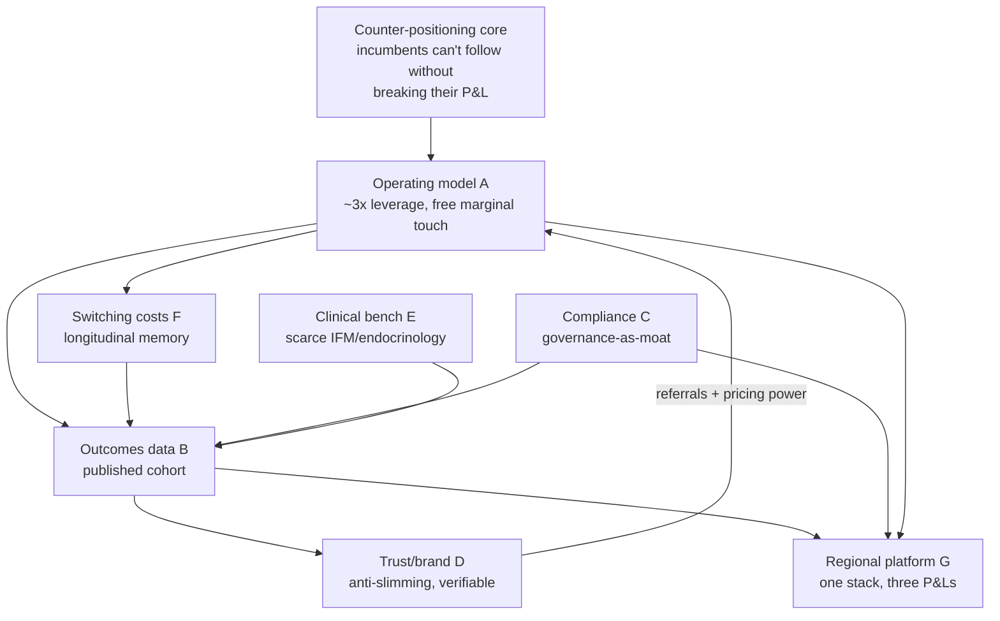

# Welltech Competitive Moat — Why the Model Is Defensible Where Incumbents Structurally Cannot Follow

**Abstract.** This chapter is the defensibility thesis for Welltech: a rigorous account of why a doctor-led, WhatsApp-native, subscription-priced metabolic-health and longevity platform can hold the ground it takes, and why the incumbents best positioned to contest it are the ones structurally least able to. The controlling finding, synthesized across 21 competitor dossiers and roughly 40 named operators in Malaysia alone, is that the whitespace Welltech enters — outcome-accountable, longitudinal, WhatsApp-delivered medical care — has stayed empty through five years of GLP-1 demand growth **not because it is invisible but because filling it requires every incumbent to break its own P&L.** Hospitals are paid per episode, telehealth anchored consults at RM15–25, aesthetic clinics run commission-per-pen, coaching platforms are contractually medication-avoidant; longitudinal care is the worst-paid activity in each of their revenue models. That is a counter-positioning moat of the strongest kind — the barrier is not that competitors *cannot* copy the model but that copying it damages the business they already have. On top of that structural advantage Welltech builds six further, mutually reinforcing moat sources, each mapped here to Hamilton Helmer's 7 Powers and Porter's Five Forces, each stress-tested for durability, and each war-gamed against the specific incumbents most likely to attack it. The chapter closes with a moat-durability ledger (which moats are real versus contestable, and time-to-erode), and an "assembly-clock" war-game keyed to the [../20-competitor-dossiers/competitor-comparison.md](../20-competitor-dossiers/competitor-comparison.md) threat ranking. It is the analytical spine beneath the [investor-thesis.md](investor-thesis.md), and it dictates the build order in the [implementation-roadmap.md](implementation-roadmap.md): construct the slowest-to-copy assets first.

**Last updated: July 2026.**

Related: [../00-executive-summary/malaysia-executive-summary.md](../00-executive-summary/malaysia-executive-summary.md) · [../20-competitor-dossiers/competitor-comparison.md](../20-competitor-dossiers/competitor-comparison.md) · [../60-ai-operating-model/ai-clinic.md](../60-ai-operating-model/ai-clinic.md) · [../50-marketing-intelligence/positioning.md](../50-marketing-intelligence/positioning.md) · [../10-market-intelligence/malaysia-regulations.md](../10-market-intelligence/malaysia-regulations.md) · [investor-thesis.md](investor-thesis.md) · [implementation-roadmap.md](implementation-roadmap.md)

---

**Contents:** 1. The moat thesis in one page · 2. Framework: 7 Powers × Five Forces · 3. The counter-positioning core (the empty quadrant) · 4. Moat A — the operating-model moat · 5. Moat B — the outcomes-data moat · 6. Moat C — the compliance moat · 7. Moat D — the trust/brand moat · 8. Moat E — the clinical-supply moat · 9. Moat F — switching costs & longitudinal memory · 10. Moat G — regional-platform economies · 11. Moat-durability ledger · 12. War-game: how incumbents attack and how we defend · 13. How the moat varies by market · 14. The network-effects question (honest) · 15. Bear case on the moat · 16. The moat-building sequence · 17. The synthesis: why the moats compound

---

## 1. The moat thesis in one page

**The claim.** Welltech's defensibility does not rest on any single feature that a well-funded rival could clone in a quarter. It rests on a *system* of seven moat sources, of which the foundational one is structural and the other six compound on top of it and on each other. The foundational moat is **counter-positioning**: the operating model Welltech runs — AI-orchestrated, WhatsApp-delivered, outcome-accountable, subscription-priced continuity of medical care — is one that every incumbent category is "structurally prevented from assembling by its own unit economics" ([competitor-comparison.md §7](../20-competitor-dossiers/competitor-comparison.md)). An incumbent that copies it must cannibalise the episode-based, commission-based or consult-based revenue it lives on today.

**The seven moat sources.**

| # | Moat source | 7 Powers mapping | One-line thesis |
|---|---|---|---|
| **Core** | Counter-positioning (empty quadrant) | Counter-Positioning | Longitudinal medical care is the worst-paid activity in every incumbent P&L; copying it is self-cannibalisation |
| A | Operating-model moat (AI + WhatsApp continuity) | Process Power + Scale | ~3× staffing leverage and near-zero touch cost make proactive continuity affordable to deliver — a capability incumbents' cost structures punish |
| B | Outcomes-data moat (published cohorts) | Cornered Resource | Across ~40 operators, exactly one has published any outcomes; the first credible cohort owns the category's definition of "good" |
| C | Compliance moat (regulatory discipline) | Counter-Positioning + entry barrier | Post-MaNaDr/MMC/UMAO enforcement, governance is the price of admission; the sunk cost cut-corner rivals cannot absorb |
| D | Trust/brand moat (anti-slimming-centre) | Branding | In a category poisoned by hard-sell trauma, verifiable trust codes are a position "nobody claims, in any language" |
| E | Clinical-supply moat (scarce bench) | Cornered Resource | Malaysia has 3 IFM-certified doctors nationally; a documented doctor value-prop locks the recruitable pool |
| F | Switching costs & longitudinal memory | Switching Costs | Structured patient memory "makes month 6 feel like a continuation of day 1"; incumbents' threads are "goldfish" |
| G | Regional-platform economies | Scale Economies | One stack amortized across MY/SG/HK; evidence and governance travel; each market cheaper than the last |

**How the moats interlock.** The defensibility is not additive but multiplicative — each moat is a prerequisite for or an amplifier of another:

The critical dependency chain: the operating model (A) makes retention affordable, retention builds switching costs (F), retention plus the operating model produce the outcome data (B), outcomes escalate the brand beyond copyable slogans (D) and constitute the platform's portable credibility (G). Break any early link and the downstream moats do not form — which is exactly why an incumbent cannot shortcut to the deep end.

**The load-bearing sentence**, from the synthesis of all 21 dossiers: *Welltech's competition is not any single company but the incumbents' collective assumption that healthcare revenue lives in episodes … the window closes the moment one of them decides the GLP-1 retention pool is worth the cannibalisation, which the threat ranking dates at roughly 12–24 months* ([competitor-comparison.md §8.1](../20-competitor-dossiers/competitor-comparison.md)). The moat strategy is therefore a race: build the slowest-to-copy assets (B, E, and the outcome-instrumented version of A) inside that 12–24-month window, so that when assembly happens the differentiation survives it.

---

## 2. Framework: 7 Powers × Five Forces

Two lenses, used deliberately. **Helmer's 7 Powers** asks: what is the *specific benefit* a competitor cannot replicate, and what is the *barrier* that stops them? A moat requires both. **Porter's Five Forces** asks: is the *industry structure* one in which a differentiated operator can earn durable returns? The Hong Kong dossier already runs the Five Forces read and concludes the industry is "structurally attractive **only for a differentiated, clinician-light, programme-based operator at the premium end** — a me-too clinic or generic telehealth app would be crushed" ([../00-executive-summary/hong-kong-executive-summary.md §4.6](../00-executive-summary/hong-kong-executive-summary.md)). That is the whole point: the forces are hostile to undifferentiated entrants and favourable to exactly Welltech's shape.

**Five Forces, summarized across the three markets:**

| Force | Intensity | Why it favours Welltech's model |
|---|---|---|
| Rivalry | High but *episodic* | Rivalry is service-episodic, not programme-based; the differentiation space (longitudinal, outcome-accountable) is unoccupied |
| Supplier power (clinicians, pharma) | High | Clinician scarcity and GLP-1 duopoly punish asset-heavy rivals; Welltech's clinician-light + dual-distributor design mitigates it and turns scarcity into moat E |
| Buyer power | Moderate–high | Doctor-shopping and price-comparison cap *undifferentiated* pricing, but low price *sensitivity* at the premium end and information asymmetry preserve programme margin |
| New entrants | Moderate–high | Low technical barriers to a bot, but UMAO/KKLIU ad walls throttle paid-media blitzes and favour reputation compounding; the real barriers (outcomes, governance, bench) are slow |
| Substitutes | High | Public queues, pharmacy self-sourcing, medical travel cap middle-market pricing but barely touch the supervised-programme premium |

The strategic conclusion the two frameworks share: **an undifferentiated entrant is crushed; a differentiated, governed, outcome-accountable operator faces forces that actively protect it once the slow moats are built.**

**7 Powers — benefit and barrier, power by power.** Helmer's discipline is that a real power requires *both* a benefit the competitor cannot match and a barrier that stops them matching it. The table states both for each Welltech power:

| Power | The benefit (what a rival cannot match) | The barrier (why they cannot) |
|---|---|---|
| Counter-Positioning | Proactive longitudinal care sold at a profit | Copying it cannibalises the incumbent's episode/commission/consult P&L |
| Process Power | ~3× staffing leverage; ≈free marginal care touch | Orchestration + clinical governance is tacit, Malaysia-shaped, 18–36 mo to build; no vendor sells it |
| Cornered Resource (outcomes) | A published local cohort that defines "good" | Requires 12 mo of retention-instrumented data a rival must first build A and F to produce |
| Cornered Resource (bench) | Credentialed IFM/endocrinology clinical authority | 3 IFM doctors nationally; a recruitable pool locked by a documented value-prop |
| Switching Costs | Personalized, accumulated care context | Abandoning it means starting cold; strengthens month over month |
| Branding | The only "we are accountable for your result" position | Verifiable trust codes (outcomes, refunds, named continuity) cannot be faked |
| Scale Economies | Each market cheaper than the last | The shared stack + portable evidence require prior-market proof to travel |

No single power is permanent, but every one has both halves — benefit and barrier — which is the test most "moats" fail.

**Five Forces across the three markets.** The industry structure is hostile to undifferentiated entrants and favourable to Welltech's shape in all three, with the binding constraint shifting by market:

| Force | Malaysia | Singapore | Hong Kong | Welltech read |
|---|---|---|---|---|
| Rivalry | Fragmented, thin premium; episodic | Dense, regulator-filtered; NOVI sub-scale | Dense but unprogrammatic; EC distressed | Rivalry is episodic everywhere; the longitudinal quadrant is unoccupied |
| Supplier power | GP fee-band, TPA extraction | Scarce CGO-grade doctors | Post-emigration clinician scarcity (acute) | Clinician-light + dual-distributor design turns supplier scarcity into moat E |
| Buyer power | Cash-default, price-sensitive at low end | Insurance-anchored, employer-mediated | Doctor-shopping, price-comparison | Low price *sensitivity* at the premium end preserves programme margin |
| New entrants | Low tech bar; KKLIU ad wall | HCSA licence + CGO gate | No licence but UMAO ad wall | Ad walls throttle paid-media blitzes; the slow moats (outcomes, governance) are the real barrier |
| Substitutes | Public queues, pharmacy self-source | Healthier SG, polyclinics | HA queue, TCM, Bangkok hop, pharmacy | Cap middle-market pricing; barely touch the supervised-programme premium |

The consistent conclusion: the forces crush a me-too clinic or generic telehealth app and protect a differentiated, governed, outcome-accountable operator — exactly Welltech's shape.

---

## 3. The counter-positioning core (the empty quadrant)

### 3.1 The structural fact

Across every market, two axes separate the field: **medical authority** (non-medical → full prescribing) and **care model** (episodic → longitudinal). Every competitor clusters in three of the four quadrants; the medical-and-longitudinal quadrant is "structurally empty" ([competitor-comparison.md §3](../20-competitor-dossiers/competitor-comparison.md)). The emptiness is not an oversight — it is the equilibrium output of the incumbents' unit economics:

| Incumbent group | Revenue model | Why longitudinal care is unprofitable *for them* |
|---|---|---|
| Hospitals (IHH/KPJ/Sunway/PCMC) | Yield per admission; consultant fee caps | "Longitudinal visits [are] the worst-paid slot; growth math = higher-acuity episodes" |
| Transactional telehealth (DoctorOnCall, DA) | Per-consult (RM15–25) | "A program launched on a RM15–25 price anchor will struggle to charge RM900/month credibly" |
| Aesthetic clinics | Commission-per-pen (30–60% markup) | "Economics decided by 12-month retention they don't do"; follow-up care cannibalises commission |
| Pharmacy retail (Alpro, BIG CARING) | Markup-per-molecule | "Sells the molecule, not a program"; no prescriber base |
| Coaching B2B (Naluri) | Payor contracts, 16-week container | "Explicitly medication-avoidant"; rebuilding around pharmacotherapy risks the 2026 profitability target |

### 3.2 Why this is a moat, not just a gap

Counter-positioning is Helmer's strongest power precisely because the barrier is the incumbent's own success. The four theoretically available mobility paths into the quadrant are each blocked by self-cannibalisation, not capability ([competitor-comparison.md §3.1](../20-competitor-dossiers/competitor-comparison.md)):

> "each path is blocked less by capability than by **P&L self-cannibalisation** — every incumbent's existing revenue model punishes the longitudinal behaviour the empty quadrant requires. That is why the quadrant has stayed empty through five years of GLP-1 demand growth, and why the entrant with no legacy P&L holds the structural advantage for as long as it moves faster than the incumbents' willingness to cannibalise themselves."

The moat, then, has a clock attached. It is durable *while the incumbents prefer their existing P&L to the retention pool* — the dossiers date that preference at 12–24 months before at least one incumbent decides the cannibalisation is worth it. Everything else in this chapter is about what Welltech builds inside that window so that differentiation survives the assembly.

---

## 4. Moat A — the operating-model moat (AI + WhatsApp continuity)

### 4.1 The power: Process Power + Scale Economies

The AI + WhatsApp clinic is not a chatbot; it is "an operations machine with a medical licence at its centre" ([ai-clinic.md](../60-ai-operating-model/ai-clinic.md)). Its defensibility is Process Power: a set of interlocking, hard-to-observe, hard-to-replicate operational practices (11 bounded AI roles, deterministic orchestration, architectural human-in-the-loop gates) that together deliver *proactive longitudinal care at a cost structure incumbents cannot match.*

The economics are the moat's engine:

| Metric | Traditional clinic | AI-native (Welltech) | Source |
|---|---|---|---|
| Humans per 1,000 active patients | ~17 FTE | ~5.5–7 FTE | [ai-clinic.md §7](../60-ai-operating-model/ai-clinic.md) |
| Staffing leverage | 1× | **≈3×** | ibid. |
| Doctor panel size | ~300–350 | ~500–650 | ibid. |
| Cost per patient-month | ~RM108 | ~RM68–78 (≈30–37% lower) | [automation.md §5.1](../60-ai-operating-model/automation.md) |
| Care touches per patient-month | 1–2 (reactive) | 12–15 structured + 24/7 | [automation.md §5.2](../60-ai-operating-model/automation.md) |
| Cost per delivered touchpoint | — | **falls ~90%** | ibid. |
| WhatsApp/Meta fees per patient-month | — | ≈RM1–3 (<0.5% of revenue) | [whatsapp-operating-model.md §2.2](../60-ai-operating-model/whatsapp-operating-model.md) |
| Human headcount growth | linear with patients | **sub-linear: ~0.4–0.5 FTE per +100 patients** | [ai-clinic.md §7](../60-ai-operating-model/ai-clinic.md) |

### 4.2 Why this is the counter-positioning weapon

The single most important consequence: because the marginal cost of an extra care touchpoint is ~zero, **"care intensity is a clinical-design decision, not a cost decision — the inverse of SMS/call-centre economics"** ([whatsapp-operating-model.md §2.2](../60-ai-operating-model/whatsapp-operating-model.md)). Proactive weeks-0–8 titration outreach — the highest-ROI clinical activity in the company, because it defends against the ~50–70% quiet discontinuation that kills GLP-1 programmes — is affordable for Welltech and prohibitively expensive for a call-centre-staffed incumbent. This is where moat A and the counter-positioning core fuse: the incumbents' cost structure makes proactive continuity a loss; Welltech's makes it the product.

Incumbents fail here architecturally, not for lack of effort. The Malaysian incumbent pattern is "keyword bots over unstructured inboxes … the bot answers, then the [complaint] chain fires anyway" ([automation.md §7](../60-ai-operating-model/automation.md)). Welltech's inversion — "orchestration/state machine is the phase-1 core; conversation is its interface" — is the hard part, and the part vendors do not sell: "the orchestration layer … is the company; embeds the escalation matrix and regulatory gates; no vendor sells it Malaysia-shaped" ([automation.md §4](../60-ai-operating-model/automation.md)).

### 4.3 The "assembly clock"

Retention economics quantify what is at stake. The scale/process moat is worth defending because the business case rests on it: "The staffing math (≈3× leverage) is the business case; the longitudinal memory and its outcome dataset are the moat; the audit log is the licence to operate" ([ai-clinic.md §9](../60-ai-operating-model/ai-clinic.md)). The strategic instruction is to "race the assembly clock, not the incumbents" ([competitor-comparison.md §8](../20-competitor-dossiers/competitor-comparison.md)) — build the outcome-instrumented, SLA-measured version of this machine before an incumbent assembles a partial replica.

---

## 5. Moat B — the outcomes-data moat (published cohorts)

### 5.1 The power: Cornered Resource

This is the deepest and most durable moat, and the reason the roadmap front-loads it. Across 21 dossiers and ~40 operators, **exactly one has published any outcomes** — Naluri, "one non-randomised observational study whose marketing outruns it" ([competitor-comparison.md §4](../20-competitor-dossiers/competitor-comparison.md)). In Singapore, NOVI has published the only credible cohort (708 patients, 12.7% weight loss at 12 months, IJO 2026). In Hong Kong, "weight care is sold on before/after imagery, not measured results." A published Malaysian GLP-1 cohort "would be alone in the market."

The asset is a Cornered Resource because it is:

- **Non-substitutable**: an incumbent cannot buy a published cohort; it must run a retention-instrumented programme for 12 months and measure it — which requires moats A and F to exist first.
- **Self-reinforcing**: "the category king is whoever defines what 'good' looks like" ([positioning.md §4.1](../50-marketing-intelligence/positioning.md)). The first publisher sets the evidential standard the whole category is then judged against, and owns the narrative before assembly threats crystallise.
- **Portable**: Malaysian and Singaporean cohorts are the credibility currency that opens Hong Kong insurer/employer doors and de-risks fundraising (see moat G).

### 5.2 Why incumbents cannot pre-empt it

An incumbent publishing outcomes would first have to *have* outcomes worth publishing — which means running proactive longitudinal care (moat A), retaining patients past the month-3 cliff (moat F), and structuring the data (the longitudinal-memory schema). "Twelve months of structured side-effect → intervention → outcome data across a Malaysian GLP-1 cohort is proprietary evidence no competitor holds" ([ai-clinic.md §5.2](../60-ai-operating-model/ai-clinic.md)); no published RCT on WhatsApp GLP-1 persistence support exists anywhere. The data compounds as a by-product of the operating architecture, not as a separate project: "the analytics are a by-product of the routing architecture" ([whatsapp-operating-model.md §9](../60-ai-operating-model/whatsapp-operating-model.md)). This is why the decisive moat move in every market is the same: publish the first credible local cohort at month 12–18 (MY) / 18–30 (SG).

---

## 6. Moat C — the compliance moat (regulatory discipline)

### 6.1 The power: Counter-Positioning + entry barrier

Regulatory rigor inverts from cost to moat because enforcement lands hardest on Welltech's competitors, not on Welltech. The requirements — physical clinic anchor, doctor-in-governance, in-person-first GLP-1 initiation, no tele-MCs, program-not-molecule marketing, KKLIU/UMAO workflow, PDPA-grade data operations — "are exactly the costs a compliant, clinician-led operator absorbs once and cut-corner competitors cannot" ([../00-executive-summary/malaysia-executive-summary.md §3.3](../00-executive-summary/malaysia-executive-summary.md)).

The enforcement backdrop makes this concrete across all three markets:

| Market | Enforcement event | Who it punishes | Welltech read |
|---|---|---|---|
| Malaysia | 48 GLP-1 ad warning letters (2025); 38,055 unapproved ads removed 2023–25; tele-MC ban (Sep 2025) | The aesthetic-clinic cohort holding 40–50% of GLP-1 volume | Compliance-forward positioning "converts regulation from cost to moat" |
| Singapore | MaNaDr shutdown (>100k ≤1-min consults); Joint Circular 87/2024; POM ad blocks naming platforms | Pill-mill telehealth; DTC drug marketers | Post-MaNaDr, buyers "actively screen for" governance credibility |
| Hong Kong | UMAO wall (first conviction HK$50k + 6 mo); MCHK discipline; EC's 2022 PCPD enforcement notice | Hard-sell chains; no-Rx sellers | "Govern as if licensed"; the doctor's licence is the safety net |

### 6.2 Durability caveat

Compliance is a real moat but a *medium-durability* one: it is a sunk cost and a brand asset, but a well-capitalized incumbent can absorb the same cost if it chooses. Its strength is in combination — compliance credibility plus published outcomes plus a governance narrative is far harder to assemble than any one alone. And the grandfathering dynamic favours early compliance: in Malaysia, "grandfathering will likely favour operators already compliant" as the Digital Health Act lands ([../10-market-intelligence/malaysia-regulations.md §3.3](../10-market-intelligence/malaysia-regulations.md)). The audit log is the operational core: "append-only, immutable … serves MMC defence, PDPA accountability, MDA no-device evidence and internal QA" — "the audit log is the licence to operate" ([ai-clinic.md §6.3, §9](../60-ai-operating-model/ai-clinic.md)).

---

## 7. Moat D — the trust/brand moat (anti-slimming-centre)

### 7.1 The power: Branding

In a category where "category equity is now negative among burned consumers — an attack surface" ([positioning.md §3](../50-marketing-intelligence/positioning.md)), a brand built on verifiable trust occupies a position no one else claims. The positioning statement is explicit ([positioning.md §6.1](../50-marketing-intelligence/positioning.md)):

> "For urban Malaysian adults who have struggled with weight or metabolic risk and been failed by slimming packages, supplements and episodic clinics, Welltech is the doctor-led metabolic health program delivered on WhatsApp that treats weight and prevention as medicine — named doctors, transparent all-in pricing, registered treatments, proactive weekly care, and published results — unlike aesthetic clinics and slimming centres that sell products and pressure."

The whitespace is a *language* whitespace: "no player in Malaysia says, in any language, 'we are accountable for your result'" ([positioning.md §3](../50-marketing-intelligence/positioning.md)). The against-positioning is sharp: "Not a slimming centre … Not a pen shop … Not another teleconsult app … Not a miracle" ([positioning.md §6.3](../50-marketing-intelligence/positioning.md)).

### 7.1b The eight-capability scoreboard

The capability-gap analysis scores eight decisive capabilities across strategic groups; the ○s cluster on the three compounding rows (continuity/retention, WhatsApp-native ops, outcomes). Welltech is designed to hold all eight — and uniquely the three that compound ([competitor-comparison.md §4](../20-competitor-dossiers/competitor-comparison.md)):

| Capability | Best incumbent position | Welltech target |
|---|---|---|
| 1. Medical prescribing | ● Abundant (aesthetic, hospitals, GPs) | ● — but with clinical governance around it |
| 2. Continuity / retention infrastructure | ○–◐ (Alpro refills, Naluri 16-wk container) | ● Proactive protocolised outreach — the compounding gap |
| 3. WhatsApp-native clinical ops | ○ (saturated as booking, empty as care) | ● API-grade, SLA'd, templated journeys |
| 4. Outcomes measurement & publication | ○ (one non-randomised study across ~40 operators) | ● Published cohorts — the deepest gap |
| 5. Subscription economics | ◐ (ORA >70% subscription, no care layer) | ● Program-priced with retention engine |
| 6. Compliance discipline | ◐ (varies; enforcement filtering the field) | ● Governance-as-brand |
| 7. Consumer brand trust | ◐ (Alpro's review flywheel; most near-empty) | ● Verifiable trust codes + solicited reviews |
| 8. Corporate / payer distribution | ● (HealthMetrics, Naluri, QHMS/Bupa) | ◐→● Partner rails + outcomes-denominated sale |

The scoreboard's decisive reading is vertical: no player holds all eight, and "no player holds the three compounding ones" (rows 2–4). Welltech's entire design is to hold those three, because they are the ones that make each other possible.

### 7.2 Why the brand moat is defensible

Its durability rests on **verifiability, not aesthetics**. The trust codes are "checkable, not aesthetic" ([positioning.md §1.5](../50-marketing-intelligence/positioning.md)): MMC/KKLIU/NPRA registration performance, named photographed doctors, halal transparency (muftī-reviewed FAQ; the 1997 International Islamic Fiqh Academy ruling; Ramadan-mode protocol), PDPA-plus privacy pledges, published all-in prices, cancel-anytime billing. Crucially, when an incumbent copies the surface signals (transparent pricing is "cheap to copy"), the defence is to "escalate to verifiable proof they cannot fake: published retention/outcome dashboards, refund policy, named-doctor continuity" ([positioning.md §11](../50-marketing-intelligence/positioning.md)) — which chains moat D to moats B and F. Even "eligibility screening that visibly turns people away is itself marketing — the credibility flywheel of saying no" ([positioning.md §6.3](../50-marketing-intelligence/positioning.md)). The scar tissue is region-wide — slimming-industry trauma is documented in all three markets (Malaysia's NCCC complaints; Hong Kong's Consumer Council +248% to 1,845 complaints in 2025) — so the anti-hard-sell position ports directly.

---

## 8. Moat E — the clinical-supply moat (scarce bench)

### 8.1 The power: Cornered Resource

Two scarce clinical resources anchor this moat. First, functional-medicine credentials: "Malaysia has three IFM-certified functional-medicine doctors" nationally, of whom Emagene Life employs two ([../00-executive-summary/malaysia-executive-summary.md §1](../00-executive-summary/malaysia-executive-summary.md); [competitor-comparison.md §6](../20-competitor-dossiers/competitor-comparison.md)). Partnering-or-hiring that bench, plus MEMS-affiliated endocrinology advisors (a finite pool), corners the credentialing input for the longevity tier. Second, and more strategically, the *recruitable general clinician pool*: Welltech's doctor value-proposition — "Practise medicine. We do the rest." — is a documented answer to enumerable grievances.

### 8.2 Why the doctor value-prop is a moat

Malaysian and Hong Kong clinicians are recruitable because the system fails them in specific, quantified ways: GP fees frozen 1992–2026; ~70% of GP volume intermediated by unregulated TPAs extracting 10–15% on 30–90-day settlement; 80.6% citing medico-legal issues as the top telemedicine barrier; implied platform payouts of RM10–18/consult; HK doctor attrition peaking at 7.1% with 1,032 resignations over three years ([../00-executive-summary/malaysia-executive-summary.md §5.2](../00-executive-summary/malaysia-executive-summary.md); [../00-executive-summary/hong-kong-executive-summary.md §7](../00-executive-summary/hong-kong-executive-summary.md)). Welltech's counter — ≥RM80–120 effective per clinical hour, ≤7-day settlement, zero unpaid admin (AI-drafted notes, auto-claims), no personal phone number exposure, indemnity top-cover, recurring per-patient programme income — converts "12,000 potential opponents into a distribution network." Because the operating model makes each doctor 1.5–2× more productive (panel 500–650 vs 300–350), Welltech can pay above market *and* run a better P&L — a supplier-power inversion competitors on episodic economics cannot match. In Hong Kong, where clinician scarcity is most acute, the clinician-light architecture is "not an efficiency nicety; it is the entry condition."

---

## 9. Moat F — switching costs & longitudinal memory

### 9.1 The power: Switching Costs

GLP-1 and longevity care run for months; the relationship dies if the patient must repeat themselves. The Longitudinal Memory role is "a structured patient-context store, not a raw chat log … the institutional memory that makes month 6 feel like a continuation of day 1" ([ai-clinic.md §2.11, §5](../60-ai-operating-model/ai-clinic.md)). The contrast with incumbents is stark: "the incumbents' chat threads are goldfish — every session starts cold."

The memory schema captures identity, clinical baseline, programme state (molecule, titration week), symptom→intervention→outcome history ("nausea settled when she split meals — week 3"), commitments, life context (Ramadan, travel) and the consent ledger. Every handover generates a context pack so "the receiving human reads for 20 seconds and continues mid-conversation" ([whatsapp-operating-model.md §7.2](../60-ai-operating-model/whatsapp-operating-model.md)).

### 9.2 Why this creates lock-in

Switching away from Welltech means abandoning an accumulated, personalized care context — the plateau history, the side-effect map, the dose journey, the coach relationship — and starting cold with a competitor. In a market where doctor-shopping is endemic and "zero switching costs cut both ways" ([../00-executive-summary/hong-kong-executive-summary.md §2.3](../00-executive-summary/hong-kong-executive-summary.md)), Welltech *manufactures* the switching cost the culture does not supply, through measurable outcomes, care-team relationship and data lock-in via the longitudinal dashboard and (in SG/HK) the national-record deposit. The retention economics quantify the value: every +10pp of 12-month persistence is worth ~RM900–1,000 per enrolled patient ([../50-marketing-intelligence/pricing.md §5.3](../50-marketing-intelligence/pricing.md)) — the single largest lever in the P&L, an order of magnitude above any list-price decision.

---

## 10. Moat G — regional-platform economies

### 10.1 The power: Scale Economies

Welltech is "one regional operating platform," not three national businesses ([expansion-strategy.md](expansion-strategy.md)). A new market inherits ~70–80% of the technology and clinical-protocol IP; the marginal cost of entry is the localization layer (language, regulatory wrapper, pricing, cultural features), not the whole clinic. Four mechanisms compound:

| Mechanism | Effect |
|---|---|
| Fixed-cost amortization | AI engine, template libraries, orchestration, outcomes instrumentation reused across markets |
| Evidence portability | MY/SG cohorts open HK insurer/employer doors and de-risk fundraising |
| Governance portability | Building to SG's hard-law bar over-satisfies HK (no-licence) and MY (soft-law) |
| Talent & capital density | Singapore as regional HQ; a multi-market brand commands a higher valuation multiple |

### 10.2 Durability caveat

Scale economies are a genuine but *contestable* moat: a well-funded regional player (Doctor Anywhere already operates six markets; ORA runs SG/MY/PH) can also amortize a stack. Welltech's edge is not scale per se but *the combination of scale with the slow moats* — a regional platform that also holds published outcomes, governance credibility and a scarce clinical bench is far harder to assemble than a multi-market consult app. The platform moat's job is to make the *other* moats cheaper to extend, not to stand alone.

---

## 11. Moat-durability ledger

Which moats are real versus contestable, and how long each takes to erode if Welltech stands still.

| Moat | Strength | Contestable by | Time to erode (if idle) | Verdict |
|---|---|---|---|---|
| **Core — Counter-positioning** | Very strong | Any incumbent willing to cannibalise its P&L | 12–24 months (the assembly clock) | **Real but time-boxed** — the reason to build the slow moats fast |
| **A — Operating model** | Strong | A from-scratch AI-native rival (not an incumbent) | 18–36 months to replicate the orchestration + ops discipline | **Real; Process Power** — hard to observe, harder to copy Malaysia-shaped |
| **B — Outcomes data** | Very strong | Anyone, but only after running retained cohorts for 12+ months | 24–36 months (they must first build A and F) | **Real; deepest moat** — front-load it |
| **C — Compliance** | Medium | A well-capitalized incumbent absorbing the same sunk cost | Erodes only if Welltech lapses; grandfathering protects the early | **Real but absorbable alone** — strong in combination |
| **D — Trust/brand** | Medium–strong | Surface signals cheap to copy; verifiable proof is not | Surface copied in months; verifiable trust takes B + F | **Real if escalated to proof** — brittle if left at slogans |
| **E — Clinical supply** | Medium (MY IFM) to strong (recruitable pool) | A rival matching pay + productivity | IFM bench cornered now; general pool contestable 12–24 mo | **Real; secure the bench early** |
| **F — Switching costs** | Strong | Only by out-caring the patient over months | Compounds with tenure; strongest at month 6+ | **Real; compounds with retention** |
| **G — Regional platform** | Medium | Existing multi-market operators (DA, ORA) | Ongoing; contestable on scale alone | **Real only in combination** with A/B/C |

**The durability synthesis.** No single moat is permanent. The counter-positioning core is time-boxed by the assembly clock; compliance and platform are absorbable alone; brand is brittle if left at slogans. But the moats are designed to *interlock*: outcomes (B) require the operating model (A) and switching costs (F) to exist; trust (D) escalates to outcomes (B) when copied; the platform (G) amortizes all of them. An incumbent must therefore assemble not one moat but the *system* — and the dossiers' verdict is that "none of the assemblable combinations includes a working program with retention and outcomes" ([competitor-comparison.md §5](../20-competitor-dossiers/competitor-comparison.md)).

---

## 12. War-game: how incumbents attack and how we defend

The threat ranking dates specific attacks; each has a pre-planned defence keyed to accelerating the corresponding slow moat rather than repricing or pivoting ([competitor-comparison.md §5, §8.1](../20-competitor-dossiers/competitor-comparison.md); [../00-executive-summary/singapore-executive-summary.md §4.3](../00-executive-summary/singapore-executive-summary.md); [../00-executive-summary/hong-kong-executive-summary.md §4.3](../00-executive-summary/hong-kong-executive-summary.md)).

| Attacker | Attack vector | Horizon | How they hurt us | How we defend |
|---|---|---|---|---|
| **OVA/ORA** (MY) | Localise + hire MY medical director + add retention layer | Now–12 mo | Closest live analogue (US$17M); contaminates category narrative | Fight on care, not brand: match RM899–1,150 entry, transparent billing (their documented auto-renew weakness), 48h triage SLA, publish local cohort before they do |
| **DoctorOnCall** (MY) | Productise GLP-1 on RM999 pen anchor + 20M-visit funnel | 6–18 mo | Owns the demand funnel | Don't fight on price/SEO breadth; out-program on care depth and fulfilment SLAs; publish comparison content vs its pen anchor |
| **Doctor Anywhere** (MY/SG) | Assemble "DA Weight" SKU | 12–24 mo | "An assembly problem, not a build problem"; 2.8M users | Lock employer pilots + category narrative first; exploit its per-consult DNA and pharmacy-margin resentment; a RM25 anchor can't credibly charge RM900 |
| **Alpro** (MY) | Verticalise: doctors on WhatsApp line + 150 dietitians + 300 doors | 12–24 mo | Highest *structural* threat; best WhatsApp base | Ring-fence as partner (data/billing/IP stay with Welltech); dual-source fulfilment early; race to the doctor-continuity + outcomes layer it lacks |
| **BIG CARING** (MY) | Post-IPO M&A of a prescribing/telehealth asset (RM3B raise) | 12–36 mo | "The single fastest route any incumbent has to Welltech's model" | Be the *most valuable* acquisition target (capital-consolidation scenario), not a casualty — published outcomes make Welltech the buy, not the bought |
| **Naluri** (MY) | Wrap GLP-1 for insurers | 12–24 mo | Would gatekeep the reimbursed employer channel | Open step-up referral now; empanel the same insurers directly (HealthMetrics/PMCare/MiCare) |
| **NOVI + Novo** (SG) | Pharma-funded category default + regionalise | Now–12 mo | The benchmark; could become default | Match the evidence, differentiate on channel (WhatsApp vs app-wall); keep partnership/acquisition option open |
| **WhiteCoat/AIA** (SG) | Insurer-bundled weight benefit | 12–24 mo | 1M+ members overnight; commoditises insured-channel GLP-1 | Speed in the employer channel; sell *outcomes* (a lane episodic models can't service); insurer wellness-rider talks from month 18 with data in hand |
| **EC Healthcare** (HK) | Bolt GLP-1 onto DR REBORN + 1M member records | Now–6 mo | Fastest HK threat; hundreds of prescribers | Weaponise its hard-sell/PCPD record in trust positioning; define the clinician-led, outcome-audited category it structurally can't claim |
| **Regulatory** (all) | Ad enforcement, dispensing separation, telehealth tightening | Ongoing | Category contamination raises CAC | Over-comply now; compliance becomes the moat; owned channels (referral, community, education) carry acquisition |

**The standing rule for all defences**: if a threat activates early, the counter is to *accelerate the corresponding proof* (publish outcomes, sign employer pilots, secure the bench), not to reprice or pivot. And every partner is treated as a future competitor: "contracts should assume the partner becomes a competitor within 24 months: data stays with Welltech, patient billing stays with Welltech, program IP stays with Welltech, and no … exclusivity that forecloses the second source" ([competitor-comparison.md §6](../20-competitor-dossiers/competitor-comparison.md)).

---

## 13. How the moat varies by market

The seven moat sources are the same across Malaysia, Singapore and Hong Kong, but their *relative weight* shifts with each market's structure. Underwriting the moat requires knowing which source carries the defence in each country.

| Moat source | Malaysia (volume) | Singapore (ARPU/credibility) | Hong Kong (margin) |
|---|---|---|---|
| **Counter-positioning** | Strongest — empty medical-longitudinal quadrant, no published outcomes anywhere | Partial — NOVI is a sub-scale benchmark in the quadrant | Strong — EC distressed and unprogrammatic; quadrant open |
| **Operating model (A)** | Foundational — WhatsApp at 90.7% is the volume rail; convenience is the differentiator | Quality (not convenience) is the differentiator — everyone already WhatsApps; win on API auditability + SLAs | Highest leverage — clinician scarcity makes clinician-light delivery the *entry condition*, not an efficiency |
| **Outcomes data (B)** | First-mover: define "good" in a market with zero cohorts | Must *match* NOVI's published standard and beat on channel | Category-defining: weight care sold on before/after imagery, not measured results |
| **Compliance (C)** | Over-comply into soft law; grandfathering favours the early | Price of admission (HCSA + CGO); the moat post-MaNaDr | Govern-as-if-licensed; the doctor's licence is the only safety net |
| **Trust/brand (D)** | Anti-slimming-centre trauma; "guilty until proven registered" | Governance-credible discrimination post-MaNaDr | Weaponise EC's PCPD/hard-sell record; strictest ad wall (UMAO) |
| **Clinical supply (E)** | IFM bench (3 doctors) + recruitable GPs failed by TPAs/frozen fees | Scarce CGO-grade doctors; the long-pole hire | Most acute — post-emigration attrition; part-time panel design essential |
| **Switching costs (F)** | Longitudinal memory vs "goldfish" incumbent threads | NEHR write-back deepens the record lock-in | Doctor-shopping culture means switching cost must be *manufactured* |
| **Regional platform (G)** | The proving ground the platform is built on | The credibility hub that de-risks HK and the fundraise | The margin P&L that funds the platform |

Two readings follow. First, **the operating-model moat (A) is load-bearing everywhere but for different reasons** — it is the volume rail in Malaysia, the quality differentiator in Singapore, and the survival condition in Hong Kong. Second, **the outcomes moat (B) is the one asset that travels and compounds across all three** — a Malaysian cohort de-risks Singapore; a Singaporean cohort opens Hong Kong insurer doors. That is why it is built first and why it is the deepest moat: it is the only source that is simultaneously local (first-mover in each market) and portable (credibility currency across markets).

---

## 14. The network-effects question (honest)

An institutional reader will ask whether Welltech has network effects — the strongest and most-prized moat category. The honest answer: **not in the classic demand-side sense, and the thesis does not depend on pretending otherwise.** Welltech is not a marketplace; a new patient does not directly make the service more valuable to other patients. Claiming a network-effects moat here would be intellectually dishonest.

What Welltech has instead is a **data-scale effect** that behaves like a one-sided network effect over time:

- Each retained cohort enlarges the proprietary outcome dataset, which (a) sharpens the clinical protocols (better titration, better side-effect management → better retention → more data), and (b) strengthens the published-evidence moat (B) and the payer/employer sales motion.
- Each market added enlarges the shared platform's amortization base and the multi-market evidence story (moat G).
- The longitudinal-memory schema improves with volume: more transcripts unlock fine-tuned local-language models (available only after ≥6 months of QA-labelled data), which improve the operating model (A).

This is a **learning/scale-economy flywheel, not a Metcalfe network** — weaker than a true two-sided network but real, compounding, and, crucially, *unavailable to incumbents who do not run retention-instrumented longitudinal care.* The thesis is stronger for stating this precisely: the moat is Process Power plus Cornered Resource plus Counter-Positioning, not a network effect, and those three are sufficient because they interlock.

---

## 15. Bear case on the moat

Discipline requires stating the strongest case *against* the moat's durability, and then the response.

| Bear argument | Steel-manned | Response |
|---|---|---|
| "Counter-positioning has a clock; when an incumbent decides to cannibalise, the moat evaporates." | True that the core is time-boxed at 12–24 months | Correct — which is *why* the roadmap front-loads the slow, non-time-boxed moats (B, E, F). By the time assembly happens, the differentiation has migrated to assets with no clock |
| "Compliance and platform are absorbable by a well-capitalized incumbent." | A BIG CARING or IHH can spend to match governance and scale | True individually; but they must assemble the *system*, and none of the assemblable combinations includes retention + outcomes. Capital buys a consult app, not a retention machine (DA is the proof: best-funded, largest losses) |
| "Brand and transparent pricing are cheap to copy." | Aesthetic chains can publish prices tomorrow | The defence is to escalate to proof they cannot fake — published outcome dashboards, refund policy, named-doctor continuity — chaining D to B and F |
| "GLP-1 price deflation destroys the drug-margin economics." | Generics/orals compress the bundled tier | The margin is coaching/retention-weighted by design, not drug-spread; deflation *expands* eligible volume — net positive if the margin never lived in the pen |
| "Retention is unproven; the whole moat rests on it." | The single biggest open risk | Conceded — this is the primary underwriting question. The mitigation is the operating model that makes proactive weeks-0–8 care affordable; the stage-gates make retention a fundable milestone, not a leap |

The bear case does not break the thesis, but it correctly identifies its load-bearing dependency: **the moat is a race, and retention is the fuel.** An investor is underwriting execution inside a real window, not a static, already-built fortress — and the roadmap is explicitly designed as the plan to win that race.

---

### 15.1 Early-warning: what would signal each moat is eroding

Moat management requires tripwires — observable signals that a moat is weakening, each with a pre-planned response (the standing rule: accelerate the corresponding proof, never reprice).

| Moat | Erosion signal | Pre-planned response |
|---|---|---|
| Counter-positioning | An incumbent hires a medical director + launches a retention layer (OVA, Alpro) | Accelerate outcomes publication; sharpen billing-trust/local-clinician contrast |
| Operating model | A from-scratch AI-native rival ships an orchestration-grade product | Deepen the memory schema + fine-tuned local models; extend the ops-KPI lead |
| Outcomes data | A competitor announces a cohort study | Publish first and to a higher standard; own the evidential-standard definition |
| Compliance | A well-capitalized incumbent invests in governance | Lean on the *combination* (governance + outcomes + brand); grandfathering advantage |
| Trust/brand | Aesthetic chains copy transparent pricing | Escalate to proof they can't fake (outcome dashboards, refund policy, named continuity) |
| Clinical supply | A rival poaches the IFM bench or matches pay | Lock advisory contracts; deepen the productivity-driven pay advantage |
| Switching costs | Rising early-churn or portability demands | Strengthen the memory/dashboard lock-in; measurable-outcome relationship |
| Regional platform | A multi-market operator matches scale | Combine scale with the slow moats; the platform amortizes them, scale alone doesn't |

Running these as a monthly operating cadence (not a static document) is the difference between defending a moat and discovering too late that it has gone.

---

## 16. The moat-building sequence

The moats are not built in parallel; they are sequenced by copy-time so the slowest assets exist before the assembly clock runs out. This table is the bridge to the [implementation-roadmap.md](implementation-roadmap.md).

| Sequence | Moat asset | Phase | Why this order |
|---|---|---|---|
| 1 | Compliance/governance (C) + scarce bench (E) + e-Rx rails | Phase 0 (pre-launch) | Existential gates and finite resources — secure before anyone else and before launch |
| 2 | Operating model (A) instrumented for outcomes | Phase 0–1 | The machine must run from patient one, capturing structured data |
| 3 | Switching costs / longitudinal memory (F) | Phase 1 | Populated from first patient; compounds with tenure |
| 4 | Trust/brand (D) escalated to verifiable proof | Phase 1–2 | Starts as registration performance; escalates as outcomes accrue |
| 5 | **Outcomes data (B) — published cohort** | Phase 2 (~month 12–18) | The decisive move; requires 12 months of retained-cohort data (needs 1–4 first) |
| 6 | Regional platform (G) | Phase 3–5 | Amortizes all prior moats; needs prior-market proof to travel |

The sequence *is* the strategy: each moat is a prerequisite for the next. Outcomes (B) cannot be published without the operating model (A) and switching costs (F) that produce retained cohorts; the platform (G) cannot travel without the outcomes (B) and governance (C) that constitute its credibility currency. An incumbent starting today would have to run the same sequence from scratch — which is what the 24–36-month copy-times in the durability ledger measure.

---

## 17. The synthesis: why the moats compound

The competitive question is not "can a rival copy any one of these?" — several are individually contestable. It is "can a rival assemble the *system* before Welltech's lead compounds?" The answer, from the research, is no, for three reasons:

1. **The moats are sequenced by copy-time and built in that order.** The roadmap constructs the slowest-to-copy assets first — outcomes data (B), the operating-model instrumentation (A), the scarce bench (E) — inside the 12–24-month assembly window, so that when an incumbent finally decides to cannibalise its P&L, the differentiation already exists and survives the assembly.

2. **The moats reinforce each other.** Retention (F) makes outcomes measurable (B); measured outcomes justify subscription pricing and escalate the brand beyond copyable slogans (D); the operating model (A) makes retention affordable; the platform (G) amortizes all of it across markets; compliance (C) is the licence under which the whole thing runs. "No player holds all eight [capabilities]; more importantly, no player holds the three compounding ones" ([competitor-comparison.md §4](../20-competitor-dossiers/competitor-comparison.md)) — continuity/retention, WhatsApp-native ops, and outcomes measurement.

3. **The incumbents' strength is their weakness.** The groups strongest in prescribing (aesthetic clinics, hospitals) are weakest in the three compounding capabilities "because their unit economics — commission-per-visit, yield-per-admission, markup-per-pen — actively punish longitudinal care" ([competitor-comparison.md §4](../20-competitor-dossiers/competitor-comparison.md)). That is counter-positioning at the level of the entire industry.

The strategic bottom line, unchanged from the dossier synthesis: *speed to published outcomes, WhatsApp-native care operations and locked partner rails is not one strategy among several — it is the strategy* ([competitor-comparison.md §8.1](../20-competitor-dossiers/competitor-comparison.md)). The moat is real, it is a system, and it has a clock. The [implementation-roadmap.md](implementation-roadmap.md) is the plan to build it before the clock runs out; the [investor-thesis.md](investor-thesis.md) is the case for funding that race.

---

## References

All claims trace to the linked repository documents; primary citations live in those documents. Load-bearing sources: [../20-competitor-dossiers/competitor-comparison.md](../20-competitor-dossiers/competitor-comparison.md) (§3–8: strategic groups, capability gap, threat clock, whitespace, partnership architecture, war-game); [../60-ai-operating-model/ai-clinic.md](../60-ai-operating-model/ai-clinic.md) and [../60-ai-operating-model/automation.md](../60-ai-operating-model/automation.md) and [../60-ai-operating-model/whatsapp-operating-model.md](../60-ai-operating-model/whatsapp-operating-model.md) (operating-model economics, memory, audit log); [../50-marketing-intelligence/positioning.md](../50-marketing-intelligence/positioning.md) and [../50-marketing-intelligence/pricing.md](../50-marketing-intelligence/pricing.md) (brand codes, retention economics); [../10-market-intelligence/malaysia-regulations.md](../10-market-intelligence/malaysia-regulations.md) (compliance moat); the three executive summaries in [../00-executive-summary/](../00-executive-summary/). Framework references: Hamilton Helmer, *7 Powers* (2016); Michael Porter, *Competitive Strategy* (1980).
