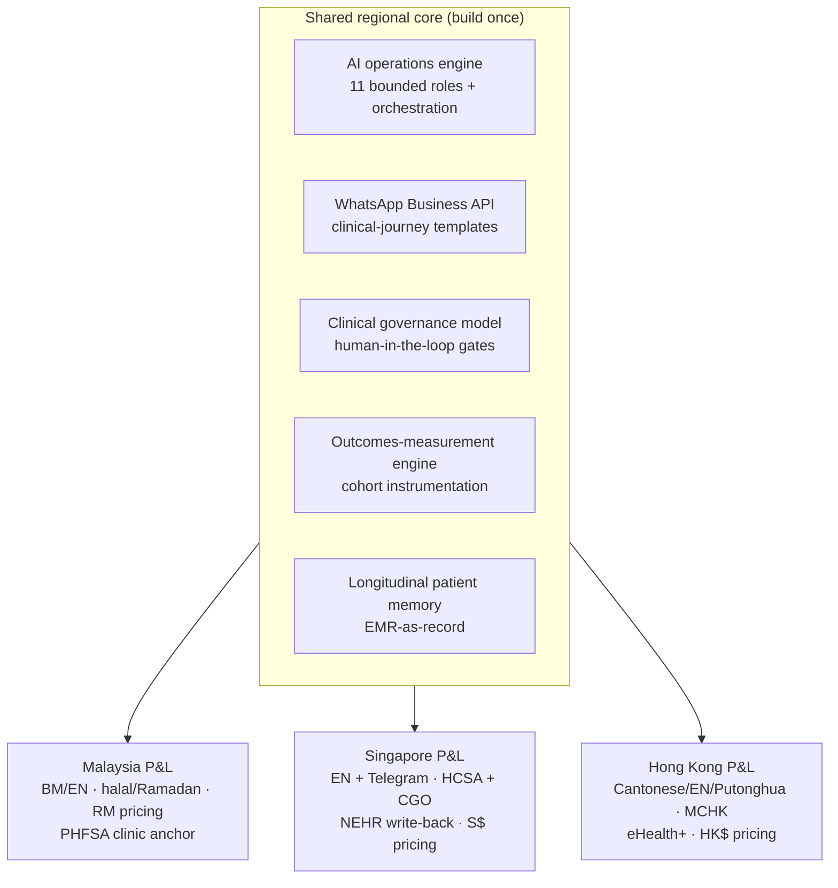
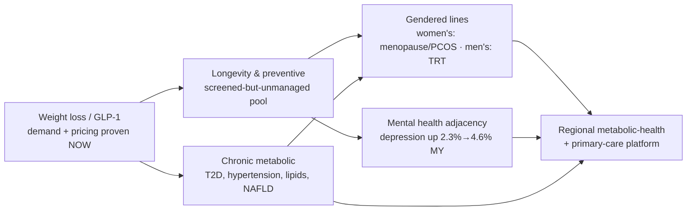
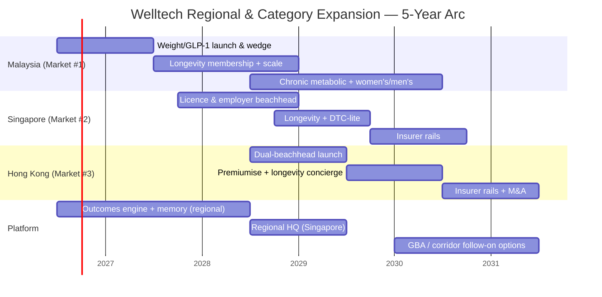

# Welltech Regional & Category Expansion Strategy — Malaysia → Singapore → Hong Kong, Weight → Longevity → Platform

**Abstract.** This document specifies how Welltech expands along two axes — geography (Malaysia first, then Singapore, then Hong Kong) and category (medical weight loss first, then longevity/preventive, then a broader metabolic-and-primary-care platform) — and why that specific sequence, rather than any other, compounds the moat instead of diluting it. The controlling logic is that Welltech is not three national businesses but **one regional operating platform** — a single AI + WhatsApp + clinical-governance stack, localized per market — where each market plays a distinct financial role: Malaysia is the volume and proving ground, Singapore is the ARPU-and-credibility hub, Hong Kong is the margin market that funds the platform. Category expansion follows the same discipline: enter each new line only where demand and pricing are already proven, reuse the same diagnostics-and-coaching spine, and let the retention machinery built for weight loss carry longevity, chronic-metabolic, and gender-specific lines at near-zero marginal operating cost. The build/partner/acquire framework is uniform across markets — own the prescriber relationship, the care channel, the program layer and the patient data; rent everything else — with market-specific acquisition targets (distressed EC Healthcare clinical assets in Hong Kong; e-Rx rails such as Teleme/DOC2US and the IFM bench in Malaysia; a NOVI partnership option in Singapore). This is the expansion counterpart to the [competitive-moat.md](competitive-moat.md), [implementation-roadmap.md](implementation-roadmap.md) and [investor-thesis.md](investor-thesis.md) chapters, and it operationalizes the cross-market synthesis in [../00-executive-summary/cross-market-summary.md](../00-executive-summary/cross-market-summary.md).

**Last updated: July 2026.**

Related: [../00-executive-summary/malaysia-executive-summary.md](../00-executive-summary/malaysia-executive-summary.md) · [../00-executive-summary/singapore-executive-summary.md](../00-executive-summary/singapore-executive-summary.md) · [../00-executive-summary/hong-kong-executive-summary.md](../00-executive-summary/hong-kong-executive-summary.md) · [go-to-market.md](go-to-market.md) · [product-strategy.md](product-strategy.md)

---

**Contents:** 1. The expansion thesis in one page · 2. The regional operating-platform thesis · 3. Geographic sequencing (MY→SG→HK) and entry criteria · 4. Licensing, entity and regulatory approach per market · 5. Category expansion beyond weight · 6. The build/partner/acquire framework · 7. GBA and cross-border opportunities · 8. The 5-year regional vision · 9. Expansion risks & sequencing discipline

---

## 1. The expansion thesis in one page

Welltech's expansion is governed by one rule: **build the slowest-to-copy assets once, then amortize them across markets and categories.** The AI + WhatsApp clinical-operations stack, the compliance-as-brand governance model, the outcomes-measurement discipline, and the longitudinal patient memory are expensive to build the first time and nearly free to redeploy. Every geographic and category move is chosen to reuse that spine rather than to rebuild it.

Three sequencing decisions define the plan:

1. **Geography: Malaysia → Singapore → Hong Kong**, in that order, because the markets form a capability ladder. Malaysia offers volume, loose-but-tightening regulation and cheap iteration to prove the clinical-ops and WhatsApp machinery. Singapore punishes unproven models (licence lead-time, enforcement climate, cost base) but rewards arriving with evidence — and its HCSA licence plus MOH-grade governance is the **regional credibility asset** read by Hong Kong regulators, insurers and investors alike. Hong Kong monetizes both proofs at maximum ARPU without new regulatory build, but demands the strongest clinical brand — which only exists after Singapore credibility is banked. Entering Hong Kong or Singapore first would mean building reputation in Asia's most sceptical, most saturated premium markets with no proof points.

2. **Category: weight → longevity → platform**, because weight loss is the only line where demand and pricing are proven *now* (GLP-1 supercycle, four-figure monthly willingness-to-pay across all three markets), longevity is demand-validated but system-empty (the "screened-but-unmanaged" pool), and the broader metabolic/chronic/primary-care platform is the natural extension of a longitudinal care relationship already established.

3. **Operating model: one platform, localized** — not three national stacks. The same eleven AI roles, the same human-in-the-loop clinical gates, the same EMR-as-record architecture, the same solicited-review flywheel, ported market to market with localized language, regulatory wrappers, pricing and cultural product features.

| Market | Role in the platform | Entry order | Year-3 SOM (local / USD) |
|---|---|---|---|
| **Malaysia** | Volume + proving ground; WhatsApp-ops and outcomes-publication proof | #1 (now) | RM60–160M (weight segment) ≈ US$13–35M |
| **Singapore** | ARPU + regulatory credibility + capital hub | #2 (~month 15–18) | S$10–26M ARR ≈ US$7.5–19M |
| **Hong Kong** | Margin market; highest ARPU; funds the regional platform | #3 (~month 24–30) | HK$70–200M ≈ US$9–26M |

The three markets combine to a plausible year-3 blended run-rate on the order of **US$30–80M ARR** across a patient base far smaller than a single-market volume play would require, at structurally rising gross margin as the mix shifts toward Singapore and Hong Kong.

---

## 2. The regional operating-platform thesis

### 2.1 One stack, three P&Ls

The strategic error the incumbents make — and the one Welltech must not — is treating each market as a bespoke build. Doctor Anywhere raised >S$190M and still runs market-by-market with per-consult economics; EC Healthcare operates 46 brands and 168 locations as a federation, not a platform. Welltech's defensibility comes from the opposite: a **single core system** whose marginal cost of entering the next market is the localization layer, not the whole clinic.

Localization is a defined, bounded layer, not a rebuild:

| Localization dimension | Malaysia | Singapore | Hong Kong |
|---|---|---|---|
| Primary languages | BM / EN + Manglish code-switching | English-first; Mandarin/Malay/Tamil for 60+ | Cantonese / English / Putonghua tier |
| Second channel | WhatsApp only (90.7%) | WhatsApp (~84%) + **Telegram (~38%)** | WhatsApp (~75%, hospital-level habit) |
| Regulatory wrapper | PHFSA clinic anchor + OHS 2025 | HCSA OMS licence + approved CGO | No licence; MCHK ethics on the doctor |
| Records regime | PDPA 2025 (no national EHR) | PDPC + **mandatory NEHR (HIA)** | PDPO + **eHealth+ deposit** (no s.33 in force) |
| GLP-1 initiation | In-person-first (soft-law norm) | **In-person mandatory** (Circular 87/2024) | In-person-first (prudent, not compelled) |
| Cultural product layer | Halal verification, Ramadan-mode titration, festive cycles | Secondary (JB-corridor/Malay lines only) | Slimming-scar-tissue positioning; mainland-visitor tier |
| Price level (weight core) | RM999/mo (~US$210) | S$450–700/mo (~US$335–520) | HK$3,500–5,000/mo (~US$450–640) |

### 2.2 Why the platform compounds

Four mechanisms make the second and third markets cheaper and stronger than the first:

1. **Fixed-cost amortization.** The AI operations engine, template libraries, orchestration logic and outcomes instrumentation are near-entirely reusable. A new market inherits ~70–80% of the technology and clinical-protocol IP.
2. **Evidence portability.** Malaysian and Singaporean published outcome cohorts are the credibility currency that opens Hong Kong insurer/employer conversations and de-risks fundraising. The moat asset *travels*.
3. **Governance portability.** Singapore-grade compliance, once built for the strictest regime, over-satisfies Hong Kong's lighter-touch regime and Malaysia's soft-law regime. Building to the highest bar once means every other market is already covered.
4. **Talent and capital density.** Singapore becomes the natural regional HQ and capital hub; a multi-market brand story commands a higher valuation multiple than any single-market operator (see [investor-thesis.md](investor-thesis.md)).

The corollary discipline: **never localize the moat away.** The temptation in each market is to hire a country GM who rebuilds the stack to local taste. The standing rule is that the core system is owned centrally; markets get a localization budget, not an architecture licence.

---

## 3. Geographic sequencing (MY → SG → HK) and entry criteria

### 3.1 Why Malaysia first

Malaysia is the correct market #1 on five independent criteria:

| Criterion | Malaysia advantage |
|---|---|
| Demand density | Highest absolute metabolic burden: 54.4% overweight/obese (~13M adults), 15.6% diabetic; RM64B/yr NCD cost |
| Cost of iteration | Lowest clinician and operating cost of the three; cheap to make mistakes and learn the WhatsApp-ops machine |
| Regulatory runway | Soft-law regime (Telemedicine Act 1997 never commenced) permits launch now; grandfathering favours the already-compliant as OHS legislation lands |
| Channel fit | WhatsApp at 90.7% monthly reach, 852 sessions/mo — the world-class rail the operating model is designed around |
| Whitespace | Empty medical-and-longitudinal quadrant; **zero published outcomes** across ~40 operators — the cleanest first-mover run |

Malaysia's role is explicitly to **prove the machine cheaply and generate the first published outcome cohort** — the asset that everything downstream leverages.

### 3.2 The entry-criteria gate (applied to every market)

A market qualifies for entry only when it clears a standing checklist. This prevents premature, capital-destroying expansion:

| Gate | Requirement | Malaysia | Singapore | Hong Kong |
|---|---|---|---|---|
| G1 Demand proven | GLP-1 pricing clears four figures/mo; screened-but-unmanaged pool exists | ✅ RM899–3,200 | ✅ S$400–800+ | ✅ HK$6,000–11,500 |
| G2 Whitespace open | No incumbent owns outcome-accountable longitudinal medical care | ✅ | ⚠️ NOVI sub-scale benchmark | ✅ EC distressed, unprogrammatic |
| G3 Channel fit | WhatsApp ≥70% reach; no data-localization block | ✅ | ✅ | ✅ |
| G4 Regulatory path clear | A lawful structure exists for the model today | ✅ soft-law | ✅ HCSA licensable | ✅ no licence gate |
| G5 Prior-market proof banked | The credibility asset the next market requires is in hand | — | Needs MY outcomes | Needs SG governance + licence |
| G6 Capital in place | Funding runway to reach the market's stage-gate | Seed | Series A | Series A/B |

The load-bearing gate is **G5**: Singapore should not be entered until Malaysia has a published cohort and a running WhatsApp care rail with measured SLAs; Hong Kong should not be entered until Singapore has an HCSA licence and a documented governance model. Sequencing is not sentiment — it is the mechanism by which each market's hardest asset is manufactured before it is needed.

### 3.3 Singapore as market #2 — the credibility hub

Singapore is deliberately second because it is the market that converts Malaysian volume-learning into **regulatory-grade credibility and premium ARPU**. Its entry logic:

- **Buy the licence, the margin and the narrative.** Arrive with the clinical-ops machine and outcomes already proven in Malaysia; spend Singapore's higher cost base on the HCSA OMS licence, an approved Clinical Governance Officer (the single longest-lead hire), and one clinic node for mandatory in-person GLP-1 initiation.
- **Lead with the employer/insurer channel**, not DTC. The Singapore economic buyer is the employer/insurer facing 12–16.9% medical trend and the 1 April 2026 rider reform — a burning-platform sale that the POM advertising wall (which forbids consumer drug marketing) makes structurally favourable to a programme brand sold via proposals, not ads.
- **Match NOVI's evidence, differentiate on channel.** NOVI has the only published cohort (708 patients, 12.7% weight loss at 12 months) but is one clinic, ~34 staff, app-walled. Welltech ports its WhatsApp-native retention machine and outcomes discipline into the mass-affluent S$450–700/mo tier NOVI under-serves at scale.

### 3.4 Hong Kong as market #3 — the margin market

Hong Kong is last because it is the least forgiving of an unproven brand and the most rewarding of a proven one:

- **Maximum ARPU, no new regulatory build.** No telemedicine licence exists (MCHK guidelines bind the doctor, not the company), so entry is *faster* than Singapore — but the safety net is the doctor's licence, so Singapore-grade governance must ship from day one.
- **Dual beachhead**: (1) a governed GLP-1/metabolic programme at HK$3,500–5,000/mo, undercutting the HK$6,000–11,500 clinic band while out-crediting med-spas; and (2) an HNW longevity-concierge membership at HK$25,000–40,000/yr converting screening-culture spend into recurring revenue.
- **Clinician-light delivery is the entry condition**, not an efficiency nicety — post-emigration doctor scarcity (HA attrition peaked at 7.1%; 1,032 doctors resigned over three years) makes the nurse/coach-led, AI-assisted, part-time-panel model the only way to reach the ~1:600 doctor-to-patient leverage the margin P&L requires.
- **The UMAO advertising wall favours Welltech's model**: because paid brand-name drug advertising is illegal, the incumbents' foot-traffic acquisition engine is throttled and the WhatsApp-first retention model plus employer/referral/education channels wins by default.

---

## 4. Licensing, entity and regulatory approach per market

### 4.1 The uniform principle

Every market runs as a **separate licensed entity per jurisdiction with a shared data and technology layer** — never a single cross-border medical entity, which no regime permits. The prescriber relationship, the clinic anchor and the dispensing pathway are always local and compliant; the AI engine, EMR, template IP and outcomes database are central. This structure is also the risk firewall: a regulatory action in one market cannot cross-contaminate the others.

### 4.2 Per-market approach

| Dimension | Malaysia | Singapore | Hong Kong |
|---|---|---|---|
| **Entity** | SSM-registered Sdn Bhd with physical office; **registered medical practitioner in senior management/board** (+ licensed pharmacist if e-pharmacy) per OHS 2025 | Locally incorporated entity; HCSA licensee | Locally incorporated entity; no service licence required |
| **Clinical licence** | ≥1 **PHFSA-registered physical clinic** as clinical anchor and Rx origin (no virtual-clinic category exists); budget 3–6 months | **HCSA Outpatient Medical Service licence** + MOH-DG-approved **Clinical Governance Officer**; budget 3–6 months; CGO is the long-pole hire | None — but PHFO (Cap 633) applies to any physical premises; confirm virtual-first grey zone with counsel |
| **Prescribing** | Panel doctors MMC-registered with APCs + indemnity; GP dispensing survives (capture pharmacy margin); e-Rx pathway articulated by OHS 2025 | SMC-standard consults (see-and-hear, documented consent); **in-person GLP-1 initiation mandatory** (Circular 87/2024) | Individual doctor bears risk under MCHK ethics; "same standard as face-to-face"; airtight Rx pathway |
| **Advertising** | No molecule names ever; facility/service ads need **MAB approval + KKLIU number** (4–6-wk lead) | POM ban outright, **no pre-approval lane, actively policed**; platforms named publicly (Dec 2024) | **UMAO wall** (Cap 231): no DTC Rx advertising; first conviction HK$50k + 6 months |
| **Data** | PDPA 2025: DPO, 72-hr breach notification, cross-border TIAs; fines to RM1M | PDPC healthcare guidelines + entity-owned WABA; **mandatory NEHR write-back (HIA)** | PDPO Cap 486; **s.33 cross-border restriction never commenced** (most permissive) — but behave as if it applied |
| **Records asset to claim** | (none national) — build proprietary EMR | NEHR-ready EMR from day one | **eHealth+ provider enrolment** as credibility/continuity signal |
| **Compliance-as-moat read** | Over-comply now; grandfathering favours the compliant | Compliance is the price of admission post-MaNaDr — and the moat | Govern as if licensed; the doctor's licence is the safety net |

### 4.3 The regulatory-portability advantage

Because Welltech builds to Singapore's hard-law bar, entering Hong Kong (lighter regime) and having entered Malaysia (softer regime) means the governance model is always ahead of the local requirement. The sequence deliberately climbs from soft-law to hard-law to no-law-but-high-scrutiny, so the compliance investment is front-loaded where it is legally forced (Singapore) and then reused where it is merely prudent (Hong Kong). See [competitive-moat.md §compliance moat](competitive-moat.md) for the durability analysis.

---

## 5. Category expansion beyond weight

### 5.1 The category ladder

Weight is the wedge, not the destination. Each subsequent category reuses the same diagnostics-coaching-titration spine and the same longitudinal relationship, so the marginal cost of adding a line is a protocol and a template set, not a new business.

### 5.2 The category sequence and rationale

| Category | Why it is next, not first | Reuses | Pricing anchor | Demand evidence |
|---|---|---|---|---|
| **1. Medical weight loss / GLP-1** | Only line with demand *and* pricing proven today; GLP-1 supercycle; four-figure monthly WTP | — (the wedge) | RM999 / S$450–700 / HK$3,500–5,000 per mo | RM400–900M MY spend in 2026; SG/HK clinic programmes clearing |
| **2. Longevity & preventive membership** | Demand validated (screening is habitual) but no one owns follow-through; reuses the exact diagnostics/coaching spine | Labs, coaching, WhatsApp cadence, memory | RM3,600–8,800/yr · S$2,000–6,000/yr · HK$25,000–40,000/yr | Screening participation 62.6% SG; HK$2,600–36,880 HK checks; KL clinics RM20–70M/yr |
| **3. Chronic metabolic (T2D, HTN, dyslipidaemia, NAFLD)** | The natural clinical extension of weight care; obesity is the upstream commodity of all four; employer/insurer CFO-grade | Prescribing, titration, monitoring, retention engine | Program-priced; PEPM in B2B | >2M MY adults with ≥3 NCDs; 1-in-3 SG diabetes lifetime risk |
| **4. Women's health (menopause/perimenopause, PCOS)** | GLP-1 demand skews female; OVA/Her Clinic/Zoey validated female-focused weight lines | Same spine + gendered protocol | Membership/program tiers | OVA women-only ~RM900/mo; Zoey women-first HK |
| **5. Men's health (TRT, metabolic)** | Under-marketed: highest obesity is men 45–54 (74.6% HK) reachable via executive-health, not beauty media | Same spine + labs | TRT RM5–15k/yr envelope | Revealed four-figure annual TRT WTP across markets |
| **6. Mental health adjacency** | Depression doubled 2.3%→4.6% in MY; metabolic-mental comorbidity; partner-led not build-led initially | Coaching layer, memory, referral | Bundled/referral | 1M+ MY adults 15+ with depression |

### 5.3 The category-expansion discipline

Three rules govern when a new line opens:

1. **Demand-and-pricing-proven-first.** Never create a category; convert one where willingness-to-pay is already revealed (the GLP-1 lesson). Longevity qualifies because screening spend is habitual; men's/women's health qualify because TRT and female weight programmes already clear four figures.
2. **Spine-reuse test.** A line ships only if it reuses ≥70% of the existing diagnostics/coaching/titration/memory spine. Lines that would require a new clinical operating model (e.g. acute care, surgery) are escalation *partnerships*, not owned lines.
3. **Retention-accretive.** Each new line must lengthen the patient relationship — the maintenance off-ramp from weight into longevity membership is the archetype: it converts graduates (who answer the 63%-regain fear) instead of losing them, and it lifts LTV against the same CAC.

### 5.4 Category sequencing differs by market

The category ladder is universal, but which line follows weight *first* differs by market, because each market's demand structure and payer differ:

| Market | Weight wedge → next line | Rationale |
|---|---|---|
| **Malaysia** | Weight → **longevity membership** + corporate chronic | Cash-pay affluent screening buyers exist; corporate PEPM channel monetizes the NCD burden as claims-inflation control |
| **Singapore** | Weight (employer) → **chronic metabolic** (employer) → longevity | The employer/insurer is the economic buyer facing 12–16.9% trend; chronic-metabolic is the CFO-grade extension before consumer longevity |
| **Hong Kong** | Weight → **HNW longevity concierge** (dual beachhead from day one) + women's metabolic | Wealth density and screening culture make the HK$25–40k/yr concierge line viable immediately, in parallel with weight |

The women's-health line leads in markets where female weight demand is already validated (OVA in Malaysia, Zoey in Hong Kong); the men's-health/TRT line is reached through executive-health and employer channels (the under-marketed male 45–54 cohort, 74.6% obese in HK) rather than beauty media. Mental-health adjacency enters last and partner-led (referral, not owned build) given the depression comorbidity but different clinical operating model.

### 5.5 The longevity line as the ARPU apex

Longevity is the highest-value second line because it monetizes the same infrastructure at a higher price point and a longer horizon. It is deliberately defined as a **"preventive health membership"** delivered digitally rather than a physical "longevity clinic" — sidestepping the capacity-capped, key-person-dependent boutique model (Chi Longevity, Humansa) and occupying the empty productised middle (S$2–6k/yr in Singapore; the gap between subsidised screening and S$4,250+ concierge). The membership reuses partner diagnostics (CircleDNA/Insighta in HK; independent labs in MY) rather than owned imaging, keeping it high-margin recurring revenue.

---

## 6. The build / partner / acquire framework

### 6.1 The default posture: own the four, rent the rest

Across every market and category, Welltech **owns** four things and **rents or partners** everything else:

| Own (never outsource) | Partner / rent (dual-source always) |
|---|---|
| The prescriber relationship | Drug distribution (Zuellig/DKSH) |
| The care channel (WhatsApp) | Fulfilment / last-mile cold-chain |
| The program layer (protocols, pricing, brand) | Diagnostics / imaging / labs |
| The patient data (EMR, outcomes, memory) | Home phlebotomy / nursing (Speedoc) |
| — | Corporate/insurer distribution rails |

The **standing rule** carried across all markets: *contracts assume the partner becomes a competitor within 24 months.* No exclusivity forecloses a second source; data, billing and program IP stay with Welltech. Every priority partner (Alpro, HealthMetrics, Naluri, hospitals, EC-adjacent assets) is simultaneously on the threat list, so the architecture is designed for partner-capture resistance from day one.

### 6.2 Build vs partner vs acquire — decision rule

| Decision | Applies when | Examples |
|---|---|---|
| **Build** | The asset is a moat source (slow to copy, compounds) | AI ops engine, outcomes engine, WhatsApp clinical journeys, governance model, longitudinal memory |
| **Partner** | The asset is commoditized, capital-heavy or relationship-gated, and dual-sourcing is possible | Drug distribution, imaging/labs, home nursing, corporate rails, e-Rx infrastructure (Teleme/DOC2US), diagnostics (Prenetics/CircleDNA) |
| **Acquire** | Speed-to-scale, a scarce clinical bench, distressed assets below build cost, or a channel that would take years to earn organically | See §6.3 |

### 6.3 Acquisition targets per market

Acquisition is opportunistic, not core — but three situations justify it:

| Market | Target type | Specific candidates | Rationale |
|---|---|---|---|
| **Malaysia** | e-Rx rails; scarce clinical bench; second-wave fulfilment | **Teleme / DOC2US** (e-Rx infrastructure); **Emagene / the IFM bench** (only ~3 IFM-certified functional-medicine doctors nationally — partner-or-hire); BIG CARING (626 doors, post-IPO channel) | The IFM pool is a finite national resource; e-Rx rails are existential for launch; fulfilment scale is a Year-2 optionality |
| **Singapore** | Clinical benchmark; screening funnels | **NOVI Health** (partnership/acquisition option — the only published-outcomes clinic, sub-scale, US$5M war chest); Minmed (screening-funnel frenemy) | NOVI is both highest-value partner and potential acquisition; buying the benchmark neutralizes the closest analogue |
| **Hong Kong** | Distressed clinical assets and talent | **EC Healthcare rationalized clinics** (FY2025 loss HK$167m, ~96% share collapse, disposing assets); **Humansa-adjacent assets** if New World divests; distressed boutique longevity clinics | Distress frees sites, prescribers and M&A targets below build cost in the market with the tightest clinician supply |

The acquisition philosophy: **buy scarcity and distress, build the moat.** Never acquire something that is a moat source (that must be built and owned); acquire channels, benches and distressed capacity that would otherwise take years or be structurally unavailable.

### 6.4 Acquisition integration principle

Any acquisition is integrated *onto* the platform, never operated as a standalone federation (the EC Healthcare 46-brand failure mode). The rule: an acquired asset keeps its licence, prescribers and local relationships, but its patients migrate onto Welltech's WhatsApp care rail, EMR and outcomes instrumentation within one quarter. The acquisition buys the input (a channel, a bench, a site); the platform supplies the moat (the operating model, the memory, the governance). An acquired clinic that continues to run its own bespoke stack has not been integrated — it has been subsidised. This is the same discipline as §2.2's "never localize the moat away," applied to M&A.

---

## 7. GBA and cross-border opportunities

### 7.1 The Greater Bay Area follow-on

The Guangdong–Hong Kong–Macao Greater Bay Area is a genuine long-horizon option, but strictly a **follow-on after Hong Kong unit economics prove out**, and strictly within export/licensing law:

- **State-normalized rails exist**: HK elderly healthcare vouchers are usable at 21 mainland service points; eHealth+ has cross-boundary record recognition; GBA cross-border care is government-promoted.
- **The mainland-shopper adjacency is the near-term, HK-based play**: mainland semaglutide demand outstrips supply, HK pharmacies function as a grey-channel node, and the visit-HK habit is durable. The *only* compliant Welltech play is **legitimate in-person prescribing and screening for visitors in Hong Kong — never cross-border dispensing or mailing.** This is a monetizable in-person consult + screening layer no other Welltech market has at this proximity, but it is a compliance minefield handled conservatively.
- **The Putonghua service tier** (built for the mainland-professional-newcomer persona in HK) is the bridge asset that later supports any compliant GBA expansion.

### 7.2 The JB–Singapore corridor

The Johor Bahru–Singapore corridor is a nearer, lower-risk cross-border product:

- **Price differentials of 4–8×** on dental/screening/pharmacy and several hundred thousand Malaysian commuters support cross-border products.
- Run as **separate licensed entities per jurisdiction with a shared data layer and hand-off protocols** — a Malaysian entity and a Singaporean entity, never one cross-border medical service.
- This corridor is the first proof that the shared-data-layer / separate-entity architecture works, de-risking the harder GBA question later.

### 7.3 The cross-border principle

The uniform rule across all cross-border opportunities: **data and brand cross borders; prescribing and dispensing never do.** Every clinical act is performed by a locally licensed entity under local law; the shared layer is the patient record, the AI engine and the brand. This is what makes Welltech a regional platform rather than a set of exporters exposed to cross-border-practice enforcement.

---

## 8. The 5-year regional vision

### 8.1 The trajectory

### 8.2 The Year-5 end-state

By the end of Year 5, Welltech is:

- **A three-market regional metabolic-health-and-longevity platform** with published outcome cohorts in each market — the only operator in any of the three with outcomes accountability at scale.
- **Category-diversified**: weight loss (the wedge) is now one of four-plus lines, with longevity membership as the ARPU apex and chronic-metabolic as the employer/insurer-funded volume engine.
- **Channel-diversified**: a meaningful and rising share of revenue is employer/insurer-paid (≥30% in Hong Kong by design), insulating the consumer P&L and converting the CFO medical-inflation pitch into recurring B2B2C rails.
- **A platform, not a federation**: one AI + WhatsApp + governance stack, three localized P&Ls, a shared outcomes database that is the single most valuable strategic asset — the tender/partnership/acquisition currency that makes Welltech the category's most valuable regional entity rather than a casualty of consolidation.
- **Optioned into GBA and the corridors** — long-horizon expansion available but never entered before the core three markets prove out.

### 8.3 The vision in one sentence

> **Welltech becomes the outcome-accountable operating system for private metabolic and preventive medicine across Malaysia, Singapore and Hong Kong — one AI-and-WhatsApp clinical platform, localized three ways, that turns the region's GLP-1 supercycle and ageing-driven prevention demand into the only published, defensible, recurring-revenue care franchise in the market.**

---

## 9. Expansion risks & sequencing discipline

| # | Expansion risk | Why it matters | Mitigation |
|---|---|---|---|
| 1 | **Premature market entry** | Entering SG before MY outcomes exist, or HK before SG governance is banked, wastes the sequencing advantage and burns capital | Enforce the G1–G6 entry gate; G5 (prior-market proof) is non-negotiable |
| 2 | **Localizing the moat away** | Country GMs rebuild the stack to local taste, destroying platform economics | Core system owned centrally; markets get a localization budget, not an architecture licence |
| 3 | **Category sprawl** | Opening lines where demand/pricing is unproven dilutes focus and CAC | Demand-and-pricing-proven-first rule; spine-reuse ≥70% test; retention-accretive test |
| 4 | **Partner-turns-competitor at scale** | Every priority partner is on the threat list; multi-market dependency compounds capture risk | Standing 24-month rule; dual-source; own the four (prescriber, channel, program, data) |
| 5 | **Cross-border compliance breach** | GBA/corridor dispensing or mailing invites cross-border-practice enforcement | Data/brand cross borders; prescribing/dispensing never do; separate licensed entities per jurisdiction |
| 6 | **Regulatory divergence outrunning the platform** | SG (NEHR mandate) and MY (Digital Health Act) legislation could force per-market rebuilds | Build to the highest bar (SG) once; track each bill quarterly; grandfathering favours the compliant |
| 7 | **Capital gap between markets** | Each market has a funding-runway prerequisite (G6); a gap strands a half-entered market | Sequence fundraising to market entry: Seed→MY, Series A→SG, Series A/B→HK (see [investor-thesis.md](investor-thesis.md)) |

The discipline that ties this document together: **expansion is a manufacturing sequence for the moat, not a land-grab.** Each geography and each category is entered in the order that builds the slowest-to-copy asset before it is needed downstream — Malaysian outcomes before Singapore, Singapore governance before Hong Kong, weight before longevity before platform. Deviating from the sequence does not accelerate the company; it forfeits the compounding that is the entire thesis.

---

## References

All claims trace to the linked repository documents; primary citations live in those documents. Key sources: [../00-executive-summary/malaysia-executive-summary.md](../00-executive-summary/malaysia-executive-summary.md), [../00-executive-summary/singapore-executive-summary.md](../00-executive-summary/singapore-executive-summary.md), [../00-executive-summary/hong-kong-executive-summary.md](../00-executive-summary/hong-kong-executive-summary.md), [../20-competitor-dossiers/competitor-comparison.md](../20-competitor-dossiers/competitor-comparison.md), [../10-market-intelligence/malaysia-regulations.md](../10-market-intelligence/malaysia-regulations.md), [../50-marketing-intelligence/pricing.md](../50-marketing-intelligence/pricing.md), [../60-ai-operating-model/ai-clinic.md](../60-ai-operating-model/ai-clinic.md). Cross-market synthesis: [../00-executive-summary/cross-market-summary.md](../00-executive-summary/cross-market-summary.md).
