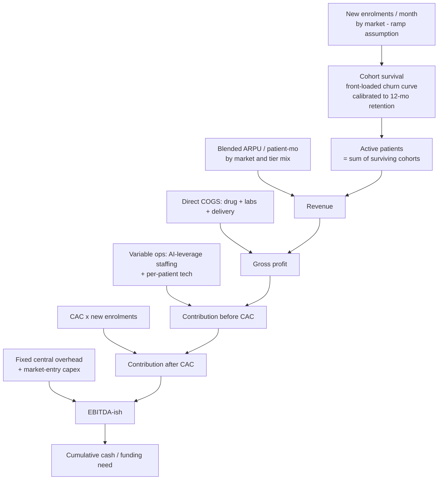
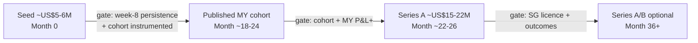

# Welltech Health — Driver-Based Financial Model (5-Year, 3-Market)

**Abstract.** This is the driver-based financial model that sits beneath the "illustrative framework" gestured at in [investor-thesis.md §9](investor-thesis.md). It replaces prose bands with an explicit, reproducible engine: a 60-month cohort model across three markets (Malaysia from Year 1, Singapore from Year 2, Hong Kong from Year 3), driven by named, sourced assumptions — new patients/month by market, CAC by market, blended ARPU by tier and market, gross margin, monthly retention/churn, an AI-leverage staffing model, and fixed overhead — producing active patients, revenue, gross profit, contribution, EBITDA-ish and cash burn by year for three scenarios (Bear / Base / Bull). Every number here is computed by a Python script (kept out of the repo) and matches the accompanying [financial-model.csv](financial-model.csv) exactly. The model's single controlling finding reproduces the repository's central claim: **retention is the dominant *economic* lever — it moves the five-year outcome more than price, drug COGS or CAC, and it is a product-and-clinical result, not a spend result.** The base case reaches a ~US$40M year-3 ARR run-rate and turns EBITDA-positive around month 22 on a peak funding need of ~US$5M; the bear case (retention stalls at the unmanaged baseline) nearly halves five-year cumulative EBITDA and pushes breakeven to month 47.

**Last updated: July 2026.**

Related: [investor-thesis.md](investor-thesis.md) · [pricing-strategy.md](pricing-strategy.md) · [malaysia-go-to-market.md](malaysia-go-to-market.md) · [implementation-roadmap.md](implementation-roadmap.md) · [../50-marketing-intelligence/pricing.md](../50-marketing-intelligence/pricing.md) · [../50-marketing-intelligence/funnels.md](../50-marketing-intelligence/funnels.md) · [../00-executive-summary/cross-market-summary.md](../00-executive-summary/cross-market-summary.md) · [../60-ai-operating-model/ai-clinic.md](../60-ai-operating-model/ai-clinic.md) · [../60-ai-operating-model/automation.md](../60-ai-operating-model/automation.md) · [../90-verification/methodology.md](../90-verification/methodology.md) · data: [financial-model.csv](financial-model.csv)

---

> ## ⚠️ ILLUSTRATIVE — ASSUMPTIONS, NOT FORECASTS
>
> **Every figure in this document is a labelled planning assumption, not a prediction.** The model exists to expose the *shape* of the business and its *sensitivity* to the load-bearing drivers — above all retention — not to forecast an outcome. The drivers are grounded in the repository's research and each is flagged for the confidence level and the diligence step it still requires ([../90-verification/methodology.md](../90-verification/methodology.md)). Several inputs (drug distributor terms, screening-to-programme conversion, SG/HK willingness-to-pay) are explicitly un-validated and must be confirmed by primary research before any external or financing use. Do not quote a single point figure from this model as a target; quote the range and the assumption behind it.

---

**Contents:** 1. How the model works · 2. Assumptions register · 3. Scenario summary · 4. Per-market build · 5. Unit economics (LTV / CAC / payback) · 6. Sensitivity & tornado · 7. Capital plan · 8. What would break this model · 9. Reproducibility

---

## 1. How the model works

The model is a **monthly cohort engine** run over 60 months and aggregated to five years. Its logic, in order:



Three mechanics deserve emphasis because they carry the result:

- **Retention drives two things at once.** It sets each cohort's survival curve (hence the active-patient *stock* for a given enrolment) and each enrolled patient's paying months (hence LTV). Churn is modelled front-loaded — the first three monthly transitions churn at ~2× the later rate — reproducing the researched GLP-1 discontinuation shape (steepest in months 1–3; Danish cohort 18%/31%/52% at 3/6/12 months, [../60-ai-operating-model/ai-clinic.md](../60-ai-operating-model/ai-clinic.md)).
- **Staffing is a leverage model, not a headcount line.** People cost scales with *exceptions*, not patients: FTE = a fixed clinical core + 0.45 FTE per 100 active patients ([../60-ai-operating-model/ai-clinic.md §7](../60-ai-operating-model/ai-clinic.md)). This makes cost-per-patient fall as the base grows — the ~3× staffing leverage that is the operating thesis.
- **Price is modelled with its volume elasticity.** When the price lever moves in the sensitivity analysis, enrolment moves inversely (~unit-elastic, [../50-marketing-intelligence/pricing.md §5.2/§8.4](../50-marketing-intelligence/pricing.md)), so total revenue stays ~flat across list prices — which is *why* the model finds retention, not price, to be the dominant lever.

**FX (mid-2026 triangulation, [../00-executive-summary/cross-market-summary.md §2](../00-executive-summary/cross-market-summary.md)):** USD 1 = RM 4.70 = S$ 1.30 = HK$ 7.80 ⇒ S$ 1 = RM 3.615, HK$ 1 = RM 0.6026. All P&L is computed in RM and reported in both RM and USD.

### 1.1 The retention → survival calibration (worked)

Because retention is the model's load-bearing input, its mechanics are worth making explicit. Each scenario's 12-month retention (S₁₂) is turned into a monthly survival curve by solving a two-phase front-loaded decay: the first three monthly transitions churn at rate c₁, the next eight at c₂, with c₁ = 2·c₂ and (1−c₁)³·(1−c₂)⁸ = S₁₂. Beyond month 12 a flatter tail retention applies (survivors plus the maintenance off-ramp are stickier). The curve is then used identically for the active-patient stock *and* the LTV, so the two can never disagree.

| Scenario | S₁₂ (12-mo) | Solved early/late monthly churn | Paying-months (yr 1) | Expected lifetime (mo) |
|---|---|---|---|---|
| Bear | 38% | ~13% / ~6.5% | 7.2 | 11.0 |
| Base | 52% | ~9% / ~4.5% | 8.4 | 15.1 |
| Bull | 60% | ~7% / ~3.5% | 9.1 | 19.5 |

The front-loading matters: it places the churn — and therefore the value of the weeks-0–8 side-effect triage that the AI clinic is built around ([../60-ai-operating-model/ai-clinic.md §2.2](../60-ai-operating-model/ai-clinic.md)) — exactly where the model says the money is. A patient saved in month 2 is worth far more than the same patient saved in month 10, because month-2 survival multiplies through the whole remaining curve.

---

## 2. Assumptions register

Every driver, its value, its source or rationale, and a one-line sensitivity note. Confidence tags follow [../90-verification/methodology.md](../90-verification/methodology.md): 🟢 corroborated · 🟡 single-source / analyst estimate · ⚪ requires primary research.

### 2.1 Retention (the key lever)

| Driver | Bear | Base | Bull | Source / rationale | Sensitivity note |
|---|---|---|---|---|---|
| 12-month retention (S₁₂) | **38%** | **52%** | **60%** | Unmanaged all-comers ~30–38% (🟢 US real-world, [../50-marketing-intelligence/pricing.md §5.3](../50-marketing-intelligence/pricing.md)); managed base 52% ([../50-marketing-intelligence/funnels.md §6.3](../50-marketing-intelligence/funnels.md)); managed target ≥60% (🟡) | The single most important input; see §6 |
| Churn shape | front-loaded | front-loaded | front-loaded | Months 1–3 churn ~2× later months (🟢 Danish n=77,310) | Front-loading concentrates value of weeks-0–8 triage |
| Post-month-12 monthly retention (tail) | 0.91 | 0.93 | 0.95 | Survivors + maintenance off-ramp are stickier (🟡 analyst) | Sets lifetime beyond year 1 (11.0 / 15.1 / 19.5 months) |
| Resulting paying-months (yr 1) | 7.2 | 8.4 | 9.1 | Computed from survival curve | Each +10pp retention ≈ +RM900 revenue/enrolled |

The 30% "deep-stress" unmanaged point is carried explicitly in §8 (what breaks the model).

### 2.2 Enrolment ramp — new patients / month (Base anchors, interpolated monthly)

| Market | Launch | Mo 12 | Mo 24 | Mo 36 | Mo 48 | Mo 60 | Source / rationale |
|---|---|---|---|---|---|---|---|
| Malaysia | Mo 1: 60 | 360 | 560 | 720 | 950 | 1,120 | Klang Valley beachhead ramp; CTWA funnel throughput ([malaysia-go-to-market.md §6](malaysia-go-to-market.md)) 🟡 |
| Singapore | Mo 13: 45 | — | 190 | 360 | 520 | 660 | Employer-led beachhead; SG launches Yr 2 ([implementation-roadmap.md §6](implementation-roadmap.md)) 🟡 |
| Hong Kong | Mo 25: 45 | — | — | 210 | 390 | 540 | Dual wedge; HK launches Yr 3 ([implementation-roadmap.md §7](implementation-roadmap.md)) 🟡 |

Scenario multiplier on the whole ramp: **Bear ×0.62, Base ×1.0, Bull ×1.35.** Bear also delays SG to month 16 and HK to month 30 (the "one market delayed" case). Enrolment is the *growth-plan axis* — it scales the whole business and is therefore treated as the scenario dimension, not an economic lever (§6).

### 2.3 Blended ARPU and gross margin by market

Blended monthly revenue per active patient across the tier mix (weight core, premium, metabolic-start, longevity membership, maintenance, corporate). ARPU is held representative of a mature mix; the tier build is in §5.

| Market | Blended ARPU (local/mo) | ARPU (RM/mo) | ARPU (USD/yr) | Gross margin | Source / rationale | Sensitivity |
|---|---|---|---|---|---|---|
| Malaysia | RM 900 | 900 | ~2,298 | **42%** | Core RM999 anchor diluted by maintenance/metabolic-start, lifted by premium/longevity ([pricing-strategy.md §2, §8](pricing-strategy.md)) 🟡 | ±10% price ≈ flat revenue (elastic) |
| Singapore | S$ 525 | 1,898 | ~4,846 | **50%** | Core S$450–700; coaching-weighted, MediSave adjacency ([../00-executive-summary/cross-market-summary.md §9](../00-executive-summary/cross-market-summary.md)) 🟡⚪ | SG WTP un-validated ⚪ |
| Hong Kong | HK$ 4,065 | 2,449 | ~6,254 | **58%** | Core HK$3,500–5,000; service-net-of-drug HK$2,000–3,500/mo ([../00-executive-summary/cross-market-summary.md §9](../00-executive-summary/cross-market-summary.md)) 🟡⚪ | HK WTP un-validated ⚪ |

The rising ARPU and gross margin as the platform moves north is the "margin rises as it scales" property of the regional thesis. The **1.0× → 2.1× → 2.7× ARPU gradient** (MY→SG→HK) matches [../00-executive-summary/cross-market-summary.md §11](../00-executive-summary/cross-market-summary.md).

### 2.4 Direct COGS (drug + labs + delivery)

Set as (1 − gross margin) × ARPU per §2.3: **MY RM 522/patient-mo, SG RM 949, HK RM 1,029.** The weight tiers pass the GLP-1 drug through at ~RM 860–920/month (distributor pricing 10–20% below retail, the enabling condition — [pricing-strategy.md §4](pricing-strategy.md)); non-drug tiers (longevity, metabolic-start, coaching) carry only labs/delivery, lifting the blend. **Sensitivity:** ±8% on drug COGS (worse/better distributor terms) is the #3 economic lever (§6). Drug distributor terms are 🟡/⚪ — must be validated against actual Zuellig/DKSH quotes.

### 2.5 Staffing — the AI-leverage model

| Parameter | Malaysia | Singapore | Hong Kong | Source |
|---|---|---|---|---|
| Fixed clinical core (FTE, floor) | 4.0 | 5.0 | 4.0 | Min viable team incl. cold-start months 0–6 ([../60-ai-operating-model/ai-clinic.md R11](../60-ai-operating-model/ai-clinic.md)) 🟡 |
| Variable FTE per 100 patients | 0.45 | 0.45 | 0.45 | Sub-linear scaling law ([../60-ai-operating-model/ai-clinic.md §7](../60-ai-operating-model/ai-clinic.md)) 🟢-derived |
| Loaded cost / FTE / mo (RM) | 8,200 | 18,000 | 19,700 | MY clinic norms +15% statutory ([../60-ai-operating-model/automation.md §5](../60-ai-operating-model/automation.md)); SG/HK salary uplift 🟡 |
| Per-patient tech (LLM+BSP+scribe+EMR) | RM 16 | RM 20 | RM 22 | ~RM13–23/patient at 1,000 scale ([../60-ai-operating-model/automation.md §5.1](../60-ai-operating-model/automation.md)) 🟡 |

At 1,000 MY patients this yields 8.5 FTE (≈6.5–7 target) and **~RM 86/patient-month all-in variable ops** — inside the RM 68–78 people+tech envelope once fixed-core dilution is excluded, and falling toward ~RM 45–55 at 5,000 patients ([../60-ai-operating-model/automation.md §5.3](../60-ai-operating-model/automation.md)). This is the ~3× leverage vs the ~RM 108/patient traditional model.

### 2.6 CAC by market and scenario (fully-loaded, RM per enrolled patient)

| Market | Bear | Base | Bull | Source |
|---|---|---|---|---|
| Malaysia | 1,275 | **650** | 365 | Funnel CAC build ([../50-marketing-intelligence/funnels.md §6.2](../50-marketing-intelligence/funnels.md)) 🟡 |
| Singapore | 2,169 (S$600) | **1,627 (S$450)** | 1,085 (S$300) | S$300–600 at 9-mo retention ([implementation-roadmap.md §6](implementation-roadmap.md)) 🟡 |
| Hong Kong | 3,314 (HK$5,500) | **2,410 (HK$4,000)** | 1,808 (HK$3,000) | ≤HK$4k target ([implementation-roadmap.md §7](implementation-roadmap.md)) 🟡 |

### 2.7 Fixed overhead and market-entry capex

| Item | Value | Source / rationale |
|---|---|---|
| Central fixed overhead (RM/mo) | Yr1 650k → Yr2 1,300k → Yr3 2,000k → Yr4 2,700k → Yr5 3,300k | Platform eng/AI, product, exec, group compliance/DPO, outcomes-data science, brand; grows with phase ([implementation-roadmap.md §11](implementation-roadmap.md)) 🟡 |
| MY entry capex (mo 1) | RM 3.0M | Clinic fit-out + orchestration-stack build 🟡 |
| SG entry capex (mo 15) | RM 6.0M | HCSA licence + CGO + clinic node + brand 🟡 |
| HK entry capex (mo 27) | RM 4.0M | Legal verification + panel + light setup 🟡 |

**Not modelled (stated, not hidden):** working-capital drag from contracted drug inventory (cold-chain allocation), FX hedging, taxes, financing costs. Each would deepen early burn; the funding plan in §7 carries a buffer for them.

---

## 3. Scenario summary

Three scenarios flex retention, CAC, and the enrolment ramp (plus SG/HK timing in Bear). All money in **USD M** unless noted; active patients are **end-of-year stock**. "ARR" is the year-end run-rate (active × ARPU × 12) — the basis on which [investor-thesis.md §9.2](investor-thesis.md) states its bands; "Revenue" is recognised full-year revenue.

### 3.1 Bear — retention stalls at the unmanaged baseline (38%), CAC high, ramp ×0.62, one market delayed

| Year | Active MY | Active SG | Active HK | Active TOT | Revenue | ARR run-rate | Gross profit | Contribution | EBITDA-ish | Cum. funding need |
|---|---|---|---|---|---|---|---|---|---|---|
| 1 | 1,058 | 0 | 0 | 1,058 | 1.1 | 2.4 | 0.5 | −0.1 | −2.4 | 2.4 |
| 2 | 2,548 | 392 | 0 | 2,940 | 5.0 | 7.8 | 2.2 | 0.4 | −4.2 | 6.6 |
| 3 | 3,850 | 1,276 | 299 | 5,424 | 12.2 | 16.9 | 5.5 | 2.0 | −3.9 | 10.5 |
| 4 | 5,208 | 2,329 | 1,213 | 8,750 | 24.2 | 30.8 | 11.6 | 5.5 | −1.4 | 11.9 |
| 5 | 6,540 | 3,376 | 2,307 | 12,224 | 39.0 | 45.8 | 19.3 | 10.6 | 2.2 | 9.8 |

**Peak funding need ≈ US$12.0M (month 46); first EBITDA-positive month 47.** A viable single-plus-market business, but capital-hungry and late to profit — the retention-failure case.

### 3.2 Base — managed retention (52%), CAC in band, ramp ×1.0, on-schedule entry

| Year | Active MY | Active SG | Active HK | Active TOT | Revenue | ARR run-rate | Gross profit | Contribution | EBITDA-ish | Cum. funding need |
|---|---|---|---|---|---|---|---|---|---|---|
| 1 | 1,922 | 0 | 0 | 1,922 | 1.9 | 4.4 | 0.8 | 0.3 | −2.0 | 2.0 |
| 2 | 4,970 | 1,063 | 0 | 6,034 | 10.5 | 16.6 | 4.6 | 2.4 | −2.2 | 4.2 |
| 3 | 7,844 | 2,970 | 1,158 | 11,972 | 28.2 | 39.7 | 13.2 | 8.1 | 2.1 | 2.1 |
| 4 | 10,830 | 5,230 | 3,235 | 19,295 | 55.9 | 70.5 | 27.3 | 18.7 | 11.8 | 0.0 |
| 5 | 13,816 | 7,502 | 5,556 | 26,874 | 88.1 | 102.8 | 44.0 | 31.8 | 23.3 | 0.0 |

**Peak funding need ≈ US$5.1M (month 27); first EBITDA-positive month 22.** Year-3 ARR run-rate US$39.7M sits squarely inside the thesis US$30–55M band; Year-5 ARR US$102.8M inside the US$85–140M band.

### 3.3 Bull — retention ≥60%, CAC low (referral/employer rails open), ramp ×1.35

| Year | Active MY | Active SG | Active HK | Active TOT | Revenue | ARR run-rate | Gross profit | Contribution | EBITDA-ish | Cum. funding need |
|---|---|---|---|---|---|---|---|---|---|---|
| 1 | 2,746 | 0 | 0 | 2,746 | 2.7 | 6.3 | 1.1 | 0.6 | −1.7 | 1.7 |
| 2 | 7,439 | 1,523 | 0 | 8,962 | 15.4 | 24.5 | 6.7 | 4.5 | −0.1 | 1.8 |
| 3 | 12,247 | 4,430 | 1,657 | 18,334 | 42.3 | 60.0 | 19.7 | 14.2 | 8.2 | 0.0 |
| 4 | 17,383 | 8,086 | 4,825 | 30,294 | 85.8 | 109.3 | 41.8 | 32.0 | 25.1 | 0.0 |
| 5 | 22,639 | 11,951 | 8,607 | 43,197 | 138.7 | 163.8 | 69.1 | 54.8 | 46.4 | 0.0 |

**Peak funding need ≈ US$3.2M (month 16); first EBITDA-positive month 12.** Year-3 ARR US$60.0M approaches the thesis "US$70M+" bull marker; Year-5 ARR US$163.8M exceeds the top of the planning band.

### 3.4 The three scenarios on one line

| Metric | Bear | Base | Bull |
|---|---|---|---|
| Year-3 revenue (USD) | 12.2M | **28.2M** | 42.3M |
| Year-3 ARR run-rate (USD) | 16.9M | **39.7M** | 60.0M |
| Year-5 revenue (USD) | 39.0M | **88.1M** | 138.7M |
| Year-5 active patients | 12,224 | **26,874** | 43,197 |
| Peak funding need (USD) | ~12.0M | **~5.1M** | ~3.2M |
| First EBITDA-positive | month 47 | **month 22** | month 12 |
| 5-yr cumulative EBITDA (USD) | 17.8M | **33.0M** | 44.2M |

The gap between Bear and Bull is almost entirely a **retention-and-execution** gap, not a market-size or price gap — the thesis's central claim, now quantified.

### 3.5 Base-case consolidated P&L waterfall (USD M)

The full base-case P&L, revenue to EBITDA to cumulative cash. This is the same data as [financial-model.csv](financial-model.csv), converted to USD; the RM originals are in the CSV.

| Line item (USD M) | Year 1 | Year 2 | Year 3 | Year 4 | Year 5 |
|---|---|---|---|---|---|
| Revenue | 1.9 | 10.5 | 28.2 | 55.9 | 88.1 |
| less: Direct COGS (drug/labs/delivery) | (1.1) | (5.9) | (15.1) | (28.6) | (44.1) |
| **Gross profit** | **0.8** | **4.6** | **13.2** | **27.3** | **44.0** |
| less: Variable ops (AI-leverage staffing + tech) | (0.2) | (0.9) | (2.1) | (3.5) | (5.1) |
| less: Customer acquisition (CAC) | (0.3) | (1.3) | (3.0) | (5.1) | (7.1) |
| **Contribution after CAC** | **0.3** | **2.4** | **8.1** | **18.7** | **31.8** |
| less: Fixed central overhead | (1.7) | (3.3) | (5.1) | (6.9) | (8.4) |
| less: Market-entry capex | (0.6) | (1.3) | (0.9) | 0.0 | 0.0 |
| **EBITDA-ish** | **(2.0)** | **(2.2)** | **2.1** | **11.8** | **23.3** |
| EBITDA margin | −105% | −21% | 8% | 21% | 27% |
| **Cumulative EBITDA / (funding need)** | **(2.0)** | **(4.2)** | **(2.1)** | **9.7** | **33.0** |

The shape is the thesis in one table: two years of controlled burn while the machine is built and the cohort is instrumented, breakeven crossing during Year 3 as SG comes online, then rapid margin expansion (EBITDA margin 8% → 27%) as the three-market mix matures and staffing leverage compounds. The cumulative cash trough is shallow (−US$4.2M end of Year 2) because contribution scales fast against a light variable-cost base — capital efficiency that is structural, not imposed ([investor-thesis.md §10.2](investor-thesis.md)). The engine runs at monthly granularity (quarterly and monthly views are available from the same run); the yearly view is shown here for readability.

### 3.6 Reconciliation to the thesis illustrative bands

The model was built bottom-up from drivers, then checked against the top-down planning bands in [investor-thesis.md §9.2](investor-thesis.md). It lands inside them:

| Metric | Thesis band | Model Base | Model Bear | Model Bull | Fit |
|---|---|---|---|---|---|
| Year-3 ARR run-rate (USD) | 30–55M | 39.7M | 16.9M | 60.0M | ✅ Base mid-band; Bull at "70M+" marker |
| Year-5 ARR run-rate (USD) | 85–140M | 102.8M | 45.8M | 163.8M | ✅ Base mid-band |
| MY active patients, Yr 3 | 8–12k | 7,844 | 3,850 | 12,247 | ✅ Base at conservative end |
| SG customers, Yr 3 | 2–4k | 2,970 | 1,276 | 4,430 | ✅ |
| HK patients, Yr 3 | 1–2.5k | 1,158 | 299 | 1,657 | ✅ |
| Year-3 blended ARPU (USD/yr) | ~3.4k | ~3,313 | — | — | ✅ (rises MY→HK mix) |

The model's Base sits at the *conservative* middle of the thesis bands — deliberately, because the bands are wide by design and the honest read is that only Year-1 Malaysia is near-certain. The Bear column shows the "plausibly halves the Year-3 figure" case the thesis names; the Bull column shows the "exceeds the top of the band" case.

---

## 4. Per-market build

The three markets stack into one P&L but earn very differently. Base case, end-of-year active patients and full-year revenue (USD M):

| | Malaysia | | Singapore | | Hong Kong | |
|---|---|---|---|---|---|---|
| **Year** | Active | Rev (USD) | Active | Rev (USD) | Active | Rev (USD) |
| 1 | 1,922 | 1.9 | — | — | — | — |
| 2 | 4,970 | 8.2 | 1,063 | 2.4 | — | — |
| 3 | 7,844 | 15.1 | 2,970 | 9.9 | 1,158 | 3.3 |
| 4 | 10,830 | 21.7 | 5,230 | 20.3 | 3,235 | 14.0 |
| 5 | 13,816 | 28.7 | 7,502 | 31.3 | 5,556 | 28.1 |

**Reading the build:**

- **Malaysia** is the volume engine — the most patients at the lowest ARPU (RM 900/mo, ~US$2,298/yr). It carries the platform alone through Year 1, reaches ~7,800 active by Year 3 and ~13,800 by Year 5, and by Year 5 is the *smallest* revenue contributor despite the largest patient base — the barbell working as designed ([../00-executive-summary/cross-market-summary.md §2](../00-executive-summary/cross-market-summary.md)). MY active counts land inside the thesis bands (Yr3 8–12k; Yr5 15–25k, base sits at the conservative end).
- **Singapore** enters Year 2 and overtakes Malaysia on revenue by Year 5 (US$31.3M vs US$28.7M) on ~half the patients — the ARPU gradient (S$525/mo ≈ 2.1× MY) plus a 50% gross margin. This is the credibility-and-ARPU role.
- **Hong Kong** enters Year 3, the fewest patients at the highest ARPU (HK$4,065/mo ≈ 2.7× MY) and the fattest gross margin (58%). By Year 5 it matches Singapore's revenue on fewer patients — the margin engine.

Gross margin rises as the mix moves north: blended gross margin climbs from ~42% (Year 1, MY-only) to ~50% (Year 5, three-market) — geographic expansion that *raises* unit economics rather than diluting them.

---

## 5. Unit economics (LTV / CAC / payback)

### 5.1 Malaysia tier-level monthly contribution (the "core is a loss-leader" fact)

Per active patient-month, price − direct COGS − variable ops (ops ≈ RM 86/patient at the 1,000-patient reference):

| Tier | Price (RM) | Direct COGS (RM) | Ops (RM) | Contribution / mo (RM) |
|---|---|---|---|---|
| **Core weight** (RM999, drug bundled) | 999 | 920 | 86 | **−7** |
| Premium / concierge (tirzepatide pass-through + fee) | 1,599 | 1,340 | 86 | 173 |
| Metabolic Start (no GLP-1) | 299 | 40 | 86 | 173 |
| Longevity membership (monthly-equiv) | 450 | 190 | 86 | 174 |
| Maintenance (low-dose) | 249 | 150 | 86 | 13 |

The core weight tier alone is a **near-breakeven acquisition-and-trust instrument** — exactly the repository's finding ([pricing-strategy.md §8.5](pricing-strategy.md)). The margin lives in *retention duration* and the *portfolio* (premium, longevity, maintenance, corporate), not in the flagship's list price. This is why the blended contribution — what a weight enrolee actually generates as they retain, step down to maintenance and cross-sell into longevity — is the number that governs LTV.

### 5.2 Blended enrolled-patient economics by market and scenario

LTV = paying-months × blended contribution/month. **12-month LTV:CAC** (headline, comparable to the repo) and **lifetime** are both shown. Blended contribution/month: **MY RM 292, SG RM 758, HK RM 1,231** (at the 1,000-patient reference).

**Malaysia** (blended contribution RM 292/mo):

| Scenario | 12-mo retention | Paying-mo (yr1) | Lifetime (mo) | 12-mo LTV (RM) | Lifetime LTV (RM) | CAC (RM) | **12-mo LTV:CAC** | Payback (mo) |
|---|---|---|---|---|---|---|---|---|
| Bear | 38% | 7.2 | 11.0 | 2,099 | 3,210 | 1,275 | **1.65×** | 4.4 |
| Base | 52% | 8.4 | 15.1 | 2,458 | 4,415 | 650 | **3.78×** | 2.2 |
| Bull | 60% | 9.1 | 19.5 | 2,648 | 5,696 | 365 | **7.26×** | 1.2 |

The Base 3.78× and ~2.2-month payback reproduce the repository's headline (LTV:CAC ~3.8×, payback ~2.5mo, [../50-marketing-intelligence/funnels.md §6.3](../50-marketing-intelligence/funnels.md)); the Bear 1.65× is the "falls below 2× at unmanaged retention" stress the repo flags.

**Singapore** (blended contribution RM 758/mo):

| Scenario | 12-mo retention | Paying-mo | Lifetime | 12-mo LTV (RM) | Lifetime LTV (RM) | CAC (RM) | **12-mo LTV:CAC** | Payback (mo) |
|---|---|---|---|---|---|---|---|---|
| Bear | 38% | 7.2 | 11.0 | 5,445 | 8,326 | 2,169 | **2.51×** | 2.9 |
| Base | 52% | 8.4 | 15.1 | 6,374 | 11,450 | 1,627 | **3.92×** | 2.1 |
| Bull | 60% | 9.1 | 19.5 | 6,868 | 14,774 | 1,085 | **6.33×** | 1.4 |

**Hong Kong** (blended contribution RM 1,231/mo):

| Scenario | 12-mo retention | Paying-mo | Lifetime | 12-mo LTV (RM) | Lifetime LTV (RM) | CAC (RM) | **12-mo LTV:CAC** | Payback (mo) |
|---|---|---|---|---|---|---|---|---|
| Bear | 38% | 7.2 | 11.0 | 8,841 | 13,520 | 3,314 | **2.67×** | 2.7 |
| Base | 52% | 8.4 | 15.1 | 10,350 | 18,593 | 2,410 | **4.29×** | 2.0 |
| Bull | 60% | 9.1 | 19.5 | 11,153 | 23,990 | 1,808 | **6.17×** | 1.5 |

**Reading:** every market clears the 3× LTV:CAC bar in Base and Bull; only Bear (unmanaged retention) falls below 3× in MY and to ~2.5× in SG/HK. The northern markets carry higher absolute LTV (higher ARPU and margin) but also higher CAC, so the *ratios* converge — retention, not geography, is what moves them.

### 5.3 The retention delta, per enrolled patient

Holding price and CAC fixed, **each +10pp of 12-month retention is worth ≈ RM 900 of additional year-1 revenue per enrolled MY patient** (paying-months × RM 900 ARPU: 7.2 → 8.4 → 9.1 months across the scenarios), matching the repository's RM 900–1,000 finding ([../50-marketing-intelligence/pricing.md §5.3](../50-marketing-intelligence/pricing.md)) — an order of magnitude more than any RM 100 list-price move.

---

## 6. Sensitivity & tornado

The tornado flexes each **economic driver** from its Bear to its Bull setting while holding the growth plan (enrolment ramp) at Base. Enrolment ramp is the *scenario axis* — it scales the whole business — so it is reported separately rather than as a value lever.

### 6.1 Primary tornado — 5-year cumulative EBITDA (Base = US$33.0M)

| Driver (Bear → Bull) | Low (USD M) | High (USD M) | **Swing** |
|---|---|---|---|
| **12-month retention (38% → 60%)** | 17.8 | 44.2 | **26.4** |
| ARPU / price ±10% (with volume elasticity) | 19.5 | 42.5 | 23.0 |
| Drug COGS (+8% → −8%) | 25.5 | 40.6 | 15.2 |
| CAC (bear → bull) | 23.8 | 38.8 | 14.9 |
| Market timing (SG+HK delayed → on-schedule) | 24.0 | 33.0 | 9.0 |
| *Enrolment ramp (growth-plan axis, ×0.62 → ×1.35)* | *9.0* | *55.2* | *46.1 [scenario axis]* |

```
Retention (38→60%)   ████████████████████████████  26.4   ← #1 economic lever
ARPU/price ±10%      █████████████████████████     23.0
Drug COGS ±8%        ████████████████              15.2
CAC bear/bull        ███████████████               14.9
Market timing        █████████                      9.0
——— growth-plan axis ———
Enrolment ramp       ██████████████████████████████████████████████  46.1
```

**The finding.** Among the economic levers, **retention is #1** — it moves five-year cumulative EBITDA by US$26.4M, more than price, drug COGS, CAC or timing. Price/ARPU ranks *below* retention specifically because its volume elasticity offsets it (higher price loses proportionate volume), which is the repository's core "revenue is flat across list prices" result made mechanical. Enrolment volume produces a larger swing than any single lever, but volume is the growth objective, and its *efficiency* is itself governed by CAC and retention — so retention remains the value driver, not a spend outcome.

### 6.2 Secondary tornado — Year-3 revenue (Base = US$28.2M)

| Driver | Low | High | Swing |
|---|---|---|---|
| 12-month retention | 23.5 | 31.3 | **7.8** |
| Market timing (SG/HK) | 23.7 | 28.2 | 4.6 |
| ARPU / price ±10% (elastic) | 28.2 | 27.7 | 0.6 |
| Drug COGS | 28.2 | 28.2 | 0.0 |
| CAC | 28.2 | 28.2 | 0.0 |

On top-line too, retention leads the economic levers; price is near-neutral (elasticity), and COGS/CAC do not touch revenue at all — they only move margin and burn.

### 6.3 The three drivers that matter

1. **Retention** — dominant on economics and on the funding path (Bear retention pushes breakeven from month 22 to month 47 and nearly doubles the funding need). A product-and-clinical outcome.
2. **ARPU / mix** — second, but blunted by price elasticity; the lever that works is *mix shift* (adding longevity/premium/corporate and moving north), not list price.
3. **Drug COGS** — third; distributor terms 10–20% below retail are worth more than any list-price decision ([pricing-strategy.md §13](pricing-strategy.md)) and are the enabling condition for the whole core-tier structure.

---

## 7. Capital plan

The capital plan mirrors the phase structure in [implementation-roadmap.md §10](implementation-roadmap.md) and the "raise to the next proof point" discipline of [investor-thesis.md §10](investor-thesis.md): **each tranche is released against the prior market's proof, and the Series A is gated on the published Malaysian cohort existing.**

| Round | Timing | Size (illustrative) | Funds | Release gate | Milestone it buys |
|---|---|---|---|---|---|
| **Seed** | Month 0 | **~US$5–6M** | MY stack build + PHFSA clinic + founding clinical/eng team; ~18-mo runway; covers Base MY operating burn (~US$4M to month 24) plus buffer | — (initial) | Live WhatsApp care rail; ≥200-patient week-8 persistence; first cohort instrumented |
| **Series A** | Month ~22–26 | **~US$15–22M** | Scale MY retention engine + longevity line; SG licence/CGO/clinic node; HK entry; working-capital + growth buffer; fully funds the **Bear** operating need (~US$12M peak) | **Published MY cohort + contribution-positive MY weight P&L** ([implementation-roadmap.md §12](implementation-roadmap.md)) | Two running markets; the outcomes moat banked |
| **Series A/B (optional)** | Month ~36+ | growth-dependent | HK scale + insurer rails + regional platform + opportunistic M&A | Contribution-positive HK P&L | Three-market run-rate; the strategic outcomes DB |

**The honest read on the ask.** The model's *operating* funding-need-to-profitability is modest — **~US$5M in Base, ~US$12M in Bear** — because managed retention plus AI-leverage staffing makes the business structurally capital-efficient ([investor-thesis.md §10.2](investor-thesis.md)). The larger Seed + Series A envelope (~US$20–28M) is therefore sized not to cover a bleeding P&L but to (a) provide runway buffer, (b) fund three-market expansion capex and drug-inventory working capital, (c) *fully fund the bear case* so the retention bet can be proven before scale capital is committed, and (d) accelerate growth beyond the organic pace. The Seed is deliberately sized to reach the publishable-cohort milestone (~month 18–24) — the moat asset that re-rates the company — and the Series A is priced against a cohort that *already exists*, not a promise.



---

## 8. What would break this model

Written to be honest, not reassuring. The model's outputs are only as good as these assumptions; here is where they are most fragile.

| # | What breaks it | Where it hits the model | How bad |
|---|---|---|---|
| 1 | **Retention never beats the unmanaged baseline** (stays ~30–38%) | S₁₂ collapses to Bear or below; deep-stress 30% cuts paying-months to ~6.2 and MY 12-mo LTV:CAC below 2× at Base CAC | **Fatal to the thesis.** At 30% the whole P&L is marginal; this is the #1 underwriting risk and the model's most load-bearing input |
| 2 | **Drug distributor terms worse than modelled** (not 10–20% below retail) | Direct COGS rises; MY gross margin (42%) compresses; core tier goes deeper negative | High — the enabling condition; COGS is the #3 economic lever and is 🟡/⚪ un-validated |
| 3 | **SG/HK willingness-to-pay below the ARPU assumption** | SG S$525 / HK HK$4,065 blended ARPU is 🟡/⚪; a 20% shortfall roughly halves each market's contribution | High — the northern-margin thesis rests on un-measured WTP; the single most valuable pre-launch study ([../00-executive-summary/cross-market-summary.md §12](../00-executive-summary/cross-market-summary.md)) |
| 4 | **CAC inflates as GLP-1 competition bids up the auction** (CPCs +8–12%/yr) | CAC drifts toward Bear; payback lengthens; contribution-after-CAC thins | Medium — mitigated by referral/employer rails, but real |
| 5 | **Enrolment ramp underperforms** (funnel/trust drag, one market delayed) | The growth-plan axis scales down; Bear ramp ×0.62 cuts Year-3 revenue ~40% | Medium — the largest raw swing, but an execution variable, not a margin one |
| 6 | **Fixed overhead scales faster than modelled** (3-market org heavier than assumed) | Overhead line grows; breakeven pushes out; funding need rises | Medium — overhead is 🟡; a real 3-market venture can run richer |
| 7 | **Working capital ignored** | Contracted drug inventory + cold-chain allocation ties up cash the model doesn't show | Low–medium — deepens early burn; the funding buffer is meant to absorb it |
| 8 | **Constant-mix / constant-ARPU simplification** | ARPU is held representative; a maintenance-heavy or metabolic-start-heavy mix would dilute MY ARPU below RM 900 | Low–medium — directionally captured, but the true mix is un-observed pre-launch |
| 9 | **Retention curve shape wrong** (churn not front-loaded, or fatter tail) | Lifetime and paying-months shift; LTV moves | Low–medium — the shape is 🟢-grounded but the *level* is the open question |

**The one-line honesty statement:** this model is a *retention-and-execution* model wearing a spreadsheet. The market size, the ARPU gradient and the cost structure are defensible; the number that decides whether any of it is real is 12-month retention, and that number is unproven until the first Malaysian cohort reports. Every scenario in §3 is, at root, a retention scenario.

---

## 9. Reproducibility

Every figure in this document and in [financial-model.csv](financial-model.csv) is produced by a single Python script (a 60-month cohort engine; kept in the analyst scratchpad, not the repository, per the build brief). The script computes all three scenarios, the unit economics, and both tornados, and writes the base-case yearly table to the CSV. **The numbers in this markdown, the CSV, and the script output are identical by construction** — the tables above are transcribed from the script's printed output, and the CSV is written by the same run.

To regenerate: run the script; it prints the scenario tables, unit economics and sensitivity, and overwrites `financial-model.csv`. Changing any driver in the assumptions register (§2) — most importantly the retention vector — propagates through the whole model. The CSV is the base-case yearly line-item table (active patients, enrolments, revenue by market, ARR run-rate, gross profit, variable ops, CAC, contribution, overhead, capex, EBITDA, cumulative funding) in RM and USD, suitable for opening in a spreadsheet.

**Provenance and confidence:** all drivers trace to the linked repository documents and carry the confidence tags of §2. Per [../90-verification/methodology.md](../90-verification/methodology.md), even 🟢 inputs merit primary-source confirmation before use in a financing; the 🟡 and ⚪ inputs — drug distributor terms, SG/HK WTP, screening-to-programme conversion, the retention *level* — must be validated by primary research first. This model is the quantified skeleton of the investment case, not its proof.

---

## References

Repository sources (relative links): [investor-thesis.md](investor-thesis.md), [pricing-strategy.md](pricing-strategy.md), [malaysia-go-to-market.md](malaysia-go-to-market.md), [implementation-roadmap.md](implementation-roadmap.md), [../50-marketing-intelligence/pricing.md](../50-marketing-intelligence/pricing.md), [../50-marketing-intelligence/funnels.md](../50-marketing-intelligence/funnels.md), [../00-executive-summary/cross-market-summary.md](../00-executive-summary/cross-market-summary.md), [../00-executive-summary/malaysia-executive-summary.md](../00-executive-summary/malaysia-executive-summary.md), [../00-executive-summary/singapore-executive-summary.md](../00-executive-summary/singapore-executive-summary.md), [../00-executive-summary/hong-kong-executive-summary.md](../00-executive-summary/hong-kong-executive-summary.md), [../60-ai-operating-model/ai-clinic.md](../60-ai-operating-model/ai-clinic.md), [../60-ai-operating-model/automation.md](../60-ai-operating-model/automation.md), [../90-verification/methodology.md](../90-verification/methodology.md). Base-case output data: [financial-model.csv](financial-model.csv).

All external facts (GLP-1 persistence, media costs, comparable pricing) are cited to primary sources in the linked market-intelligence and marketing-intelligence documents; this model introduces no new external facts, only the arithmetic that combines the repository's labelled assumptions.
