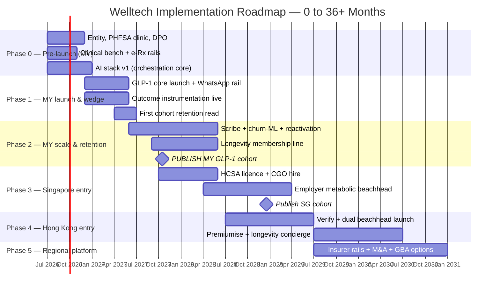
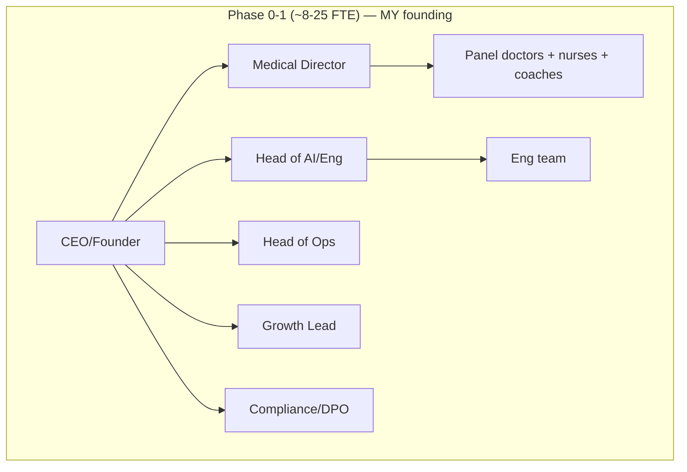
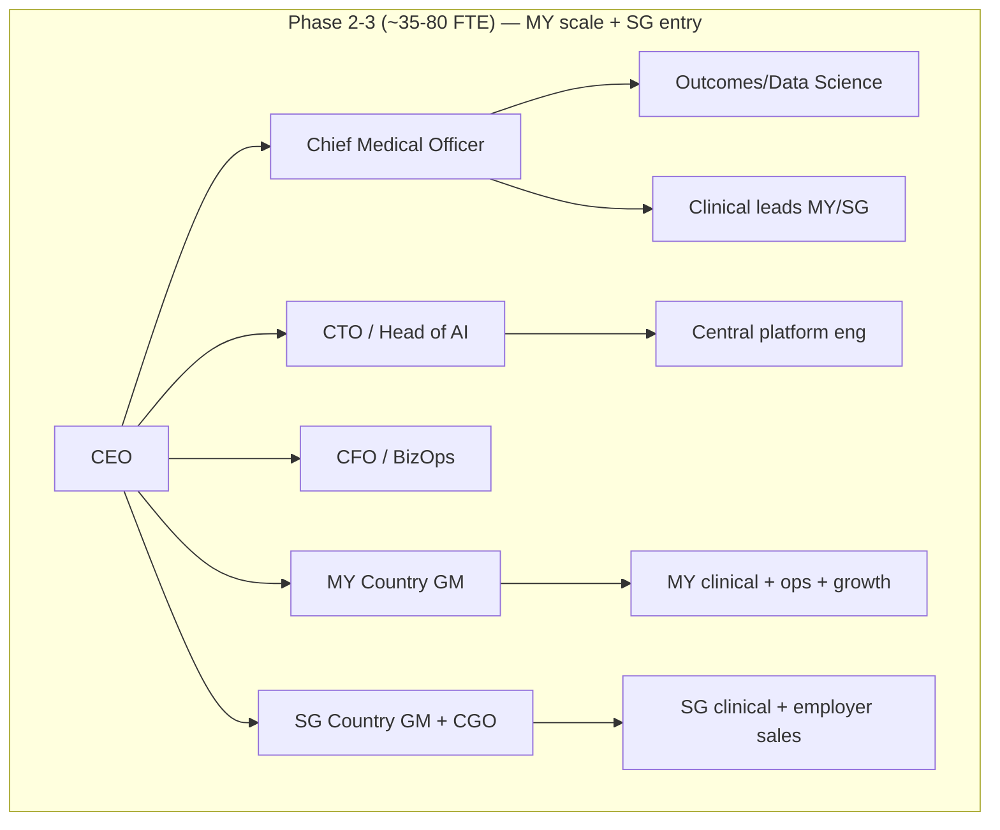
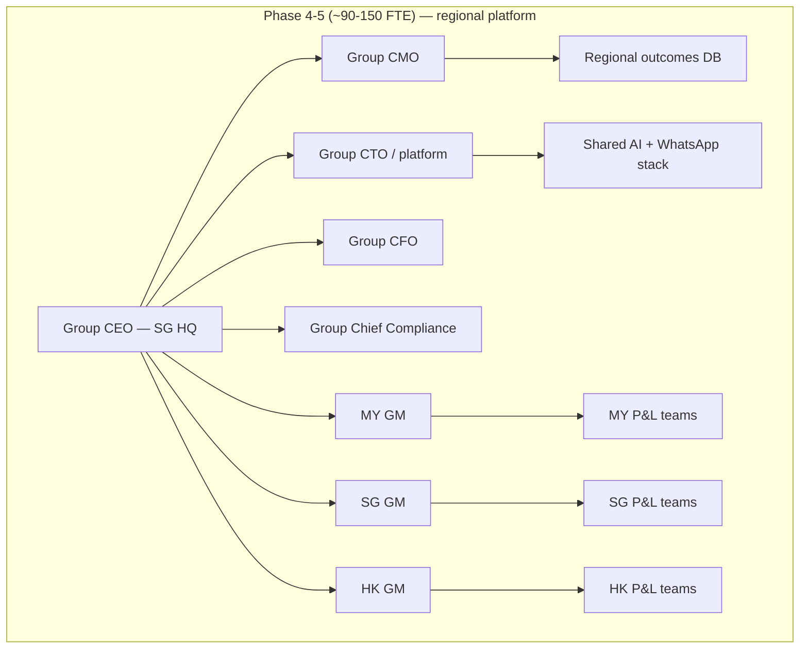

# Welltech Implementation Roadmap — 0 to 36+ Months, Malaysia → Singapore → Hong Kong

**Abstract.** This is the execution plan that converts the moat thesis into a build sequence. Its organizing principle is taken directly from the competitive analysis: **build the slowest-to-copy assets first**, inside the 12–24-month window before an incumbent decides the GLP-1 retention pool is worth cannibalising its own P&L. The roadmap runs six phases — Phase 0 (pre-launch: regulatory, entity, hiring, stack build), Phase 1 (Malaysia launch & wedge), Phase 2 (Malaysia scale & retention engine), Phase 3 (Singapore entry), Phase 4 (Hong Kong entry), Phase 5 (regional platform) — each specified across six workstreams (clinical, product/AI, growth, ops, compliance, finance) with objectives, milestones, hiring plan, org design, capex/opex shape, key metrics with explicit stage-gates and kill-criteria, and risks. Every milestone is tied to the moat-building sequence: the Malaysian published GLP-1 cohort (the deepest moat) is engineered from the first patient and published by month 12–18; the AI operating model is instrumented for outcomes from day one; the scarce clinical bench and e-Rx rails are secured in the first two quarters because they are races. Financial figures are illustrative planning bands with stated assumptions, consistent with the unit economics in [../50-marketing-intelligence/pricing.md](../50-marketing-intelligence/pricing.md) and the market sizing in the three executive summaries. The roadmap is the operational counterpart to [competitive-moat.md](competitive-moat.md), [investor-thesis.md](investor-thesis.md) and [expansion-strategy.md](expansion-strategy.md).

**Last updated: July 2026.**

Related: [../00-executive-summary/malaysia-executive-summary.md](../00-executive-summary/malaysia-executive-summary.md) · [../60-ai-operating-model/automation.md](../60-ai-operating-model/automation.md) · [../60-ai-operating-model/ai-clinic.md](../60-ai-operating-model/ai-clinic.md) · [go-to-market.md](go-to-market.md) · [product-strategy.md](product-strategy.md) · [pricing-strategy.md](pricing-strategy.md)

---

**Contents:** 1. The build-order principle · 2. Timeline overview (Gantt) · 3. Phase 0 — Pre-launch · 4. Phase 1 — Malaysia launch & wedge · 5. Phase 2 — Malaysia scale & retention engine · 6. Phase 3 — Singapore entry · 7. Phase 4 — Hong Kong entry · 8. Phase 5 — Regional platform · 9. Org-chart evolution · 10. Consolidated hiring plan · 11. Capex/opex shape · 12. Stage-gates & kill-criteria summary · 13. Consolidated risk register · 14. Per-phase KPI dashboard · 15. Moat-milestone map · 16. Governance & operating cadence

---

## 1. The build-order principle

The moat chapter establishes that Welltech's defensibility is a *system* of assets ranked by copy-time. The roadmap's non-negotiable rule is to build them in copy-time order, because the counter-positioning core is time-boxed:

| Moat asset | Copy-time | Build in phase | Why first/last |
|---|---|---|---|
| Outcomes data (published cohort) | 24–36 mo | Instrument in **Phase 0–1**, publish **Phase 2** | Deepest moat; requires 12 mo of retained-cohort data — start day one |
| AI operating model + orchestration | 18–36 mo | **Phase 0–1** core; deepen **Phase 2** | Process Power; the churn firewall is the business case |
| Scarce clinical bench (IFM, endocrinology) | Now (finite pool) | **Phase 0** | 3 IFM doctors nationally; a race — secure before competitors |
| e-Rx rails + fulfilment | Existential | **Phase 0** | "Nothing ships without e-Rx rails" |
| Switching costs / longitudinal memory | Compounds with tenure | **Phase 1** build, compounds thereafter | Strongest at month 6+; must exist from first patient |
| Compliance / governance | Sunk cost | **Phase 0** (over-comply) | Grandfathering favours the early-compliant |
| Regional platform economies | Ongoing | **Phase 3–5** | Amortizes the above; needs prior-market proof first |

The corollary: **do not chase revenue at the expense of the slow moats.** A Phase-1 that hits patient targets but fails to instrument outcomes has built a business with no moat. The stage-gates enforce this by making moat-progress (retention beating baseline, outcome dataset instrumented) a condition of advancing, not just patient count.

---

## 2. Timeline overview (Gantt)

**Phase gate summary** (detail in §12): Phase 0→1 opens on a clean launch-gate audit; Phase 1→2 on week-8 cohort persistence ≥ target on ≥200 patients and ≥60% containment; Phase 2→3 on the published MY cohort plus a contribution-positive MY weight P&L; Phase 3→4 on an HCSA licence and a documented SG governance model; Phase 4→5 on a contribution-positive HK P&L.

---

## 3. Phase 0 — Pre-launch (Months 0–6, Malaysia)

**Objective.** Assemble the launch-gate assets: a compliant entity and clinic anchor, the scarce clinical bench and e-Rx rails (both races), the AI orchestration core, and the data/consent architecture — so that when the first patient arrives, the moat instrumentation is already running.

### Workstreams

| Workstream | Phase 0 work |
|---|---|
| **Clinical** | Recruit founding Medical Director (MMC-registered, in senior management per OHS 2025); secure IFM/MEMS advisory bench (partner-or-hire Emagene-class — a finite national pool); write CPG-anchored eligibility protocols, titration protocols, red-flag escalation matrix (grade 1–3 + emergency); Ramadan-mode protocol |
| **Product/AI** | Build the orchestration state machine (the proprietary core — "no vendor sells it Malaysia-shaped"); AI Receptionist + Scheduling + intake/screening Flows + pre-consult brief v1; AI Nurse check-in engine + red-flag tripwires (bilingual deterministic lexicon); longitudinal-memory schema v1; EMR selection (FHIR-native or MY cloud clinic system with API); BSP (respond.io) + WhatsApp Business API, two-number portfolio, consent ledger, append-only audit log; 46-template library through 3-stage compliance review |
| **Growth** | Brand + positioning build ("medical weight management," never "kurus"); named-doctor content assets; pre-launch waitlist; partner LOIs (Alpro fulfilment, HealthMetrics empanelment prep); post-screening and month-two-dropout acquisition motions designed |
| **Ops** | PHFSA clinic registration (3–6 months — the long pole); cold-chain dispensing + delivery SLA design; human console v1; QA transcript review process |
| **Compliance** | SSM entity + physical office + doctor (and pharmacist if e-pharmacy) in senior management; DPO appointed + 72-hour breach playbook drilled; cross-border TIAs (Meta/cloud/AI); KKLIU creative workflow live; e-Rx rails contracted (DOC2US or Teleme — existential); escalation MOU (PCMC/Gleneagles KL) |
| **Finance** | Seed close; 18-month runway model; distributor term negotiation (Zuellig/DKSH, target 10–20% below retail); BNPL rails (Atome/SPayLater/cards) |

### Hiring (Phase 0): ~8–12 FTE

Founding team + Medical Director + 1–2 panel doctors (part-time), Head of AI/Engineering + 2 engineers, Head of Ops/Clinic Manager, Compliance/DPO lead, Growth lead. Deliberately lean; the AI-native design targets ~5.5–7 humans per 1,000 patients, so early hiring is capability, not volume.

### Capex/opex shape
Front-loaded build cost: engineering salaries, PHFSA clinic fit-out (one flagship), EMR + infra + observability (~RM5–8k/mo), LLM inference + BSP + scribe API tooling. No patient revenue. **Kill-criterion:** if PHFSA registration or e-Rx rails cannot be secured within 6 months, the compliant structure does not exist — halt and re-scope rather than launch non-compliant.

### Stage-gate to Phase 1
Missed-red-flag audit clean over 4 consecutive weeks at pilot volume; consent/archiving verified end-to-end; escalation SLAs met ≥95%; refund automation fires correctly on injected test breaches ([automation.md §3.4](../60-ai-operating-model/automation.md)).

---

## 4. Phase 1 — Malaysia launch & wedge (Months 6–18)

**Objective.** Launch the GLP-1 weight wedge (demand and pricing proven now), prove the WhatsApp care rail with measured SLAs, and — the moat priority — instrument the outcome dataset from the first patient so the cohort can be published in Phase 2.

### Workstreams

| Workstream | Phase 1 work |
|---|---|
| **Clinical** | Launch core Medical Weight Program (RM999/mo flat, drug included); in-person-first initiation at the PHFSA clinic; proactive weeks-0–8 titration cadence (the highest-ROI clinical activity); grade-2/3 escalation live; first cohort enrolled and instrumented |
| **Product/AI** | Full 11-role AI clinic live at Phase-1 depth ("answer, book, monitor, deliver"); AI Nurse churn firewall; fulfilment orchestration + proactive delay notices; metrics stack v1 computing from the audit event log; longitudinal memory populating |
| **Growth** | Two designed acquisition motions monetised: the **post-screening handoff** ("send us your hospital screening report") and the **month-two disillusioned GLP-1 patient** from aesthetic clinics ("the cheapest high-intent CAC in the market"); burned-slimming-cohort content; doctor-fronted education ranking on "pen kurus" vernacular while correcting it; solicited-review flywheel from week one; post-CNY/post-Raya acquisition timing |
| **Ops** | Cold-chain SLA live (>95% delays notified proactively); refund cycle <7 days; appointment integrity + backfill |
| **Compliance** | All creatives through KKLIU workflow; program-not-molecule marketing enforced; PDPA operations live; competitor ad-takedowns monitored as an early-warning feed |
| **Finance** | Track CAC by channel (RM150–600 band), contribution margin, retention vs the ~30–38% unmanaged baseline; distributor pricing secured 10–20% below retail (worth more than any list-price move) |

### Key metrics & targets
- AI first response <1 min, 24/7; human SLA red ≤15 min / amber ≤4 business-h / routine same-day at ≥99/95/90%.
- Containment 60–80% of admin volume without CSAT degradation.
- **Week-8 cohort persistence ≥ target on ≥200 patients** (the churn firewall working).
- Meta fees <RM1.50/active patient-month; no-show <10%; NPS ≥60 on ≥60 patients.
- Patients: ramp toward ~1,000–2,500 active by month 18.

### Hiring (Phase 1): to ~18–25 FTE
Add 2–3 more panel doctors, 2–3 nurses, care coordinators, 1–2 dietitians/coaches, a retention/recall lead, 2–3 more engineers, a growth/performance marketer, clinic support. Headcount grows sub-linearly (~0.4–0.5 FTE per +100 patients).

### Risks
Retention below model (mitigate: flat titration pricing + proactive Nurse cadence); ad-enforcement contact (KKLIU workflow; never name molecules); GLP-1 safety scare (pharmacovigilance-forward content); OVA localises early (fight on care/billing-trust/outcomes, accelerate publication).

### Stage-gate to Phase 2
Week-8 persistence ≥ target on ≥200 patients; containment ≥60% without CSAT degradation; doctor non-clinical minutes ≤10 (path to ≤5); number quality rating "High" sustained ([automation.md §3.4](../60-ai-operating-model/automation.md)). **Kill-criterion:** if managed 12-month retention cannot clear ~45% (vs 30–38% unmanaged), CAC payback is structurally marginal — pause scaling and fix the retention engine before spending on growth.

---

## 5. Phase 2 — Malaysia scale & retention engine (Months 18–30)

**Objective.** Deepen the operating model ("remove the doctor's keyboard, defend month 2"), launch the second product line (longevity membership), and execute the decisive moat move: **publish the first Malaysian GLP-1 cohort.**

### Workstreams

| Workstream | Phase 2 work |
|---|---|
| **Clinical** | Longevity/preventive membership (RM3,600 Core / RM8,800 Executive); maintenance tier (RM199–299/mo) converting graduates; women's/men's metabolic lines as demand warrants; chronic-metabolic protocols for the employer channel |
| **Product/AI** | AI scribe + chat-to-EMR summarisation (Phase-2 automation); learned churn-risk scoring v2 + save-call ops + month-2 intervention set; reactivation ladders; Coach personalisation + Ramadan mode; BSP toward Cloud API direct (>50k msgs/mo trigger) |
| **Growth** | HealthMetrics empanelment + ≥1 co-sold employer pilot with HR-facing outcome reports; corporate PEPM channel (RM8–15 base; RM350–500/enrolled seat); BIG CARING second-wave fulfilment as CAC channel; scale the review flywheel |
| **Ops** | Dual-source fulfilment live; KPJ diagnostics at wholesale; Speedoc home phlebotomy integration |
| **Compliance** | Quarterly cohort-outcomes dashboard as a trust artefact; track the Digital Health Act bill; PDPA breach-drill refresh |
| **Finance** | Contribution-positive MY weight P&L; retention KPIs as board metrics (every +10pp 12-mo retention ≈ RM900–1,000/patient) |

### The decisive moat move
By month ~24 (12–18 months post-launch), **publish the first Malaysian GLP-1 cohort outcomes to a credible evidential standard.** Across ~40 operators, nobody has done this; the first publisher defines "good" and owns the category narrative before assembly threats (DoctorOnCall 6–18 mo, OVA now–12 mo, Alpro/DA 12–24 mo) crystallise. This is the Cornered Resource that de-risks Singapore and the fundraise.

### Key metrics
Month-6 persistence beats unmanaged baseline by ≥15pp; ≥6 months of QA-labelled transcripts (unlocks fine-tuned Manglish models); edit-distance on doctor sign-offs stable; patients ~6,000–10,000 active; MY weight-segment run-rate approaching RM60–160M annualised trajectory.

### Hiring (Phase 2): to ~35–55 FTE
Add longevity clinical lead, more coaches, a data/outcomes scientist (owns the cohort publication), employer-channel sales, more engineers (scribe, churn-ML), finance/BizOps. Begin recruiting the Singapore CGO candidate (long-lead).

### Stage-gate to Phase 3
Published MY cohort; contribution-positive MY weight P&L; Singapore CGO candidate identified; Series A closed. **Kill-criterion:** if the cohort cannot be published to a credible standard (retention or data quality inadequate), do not enter Singapore — the credibility asset Singapore requires does not yet exist.

---

## 6. Phase 3 — Singapore entry (Months ~15–36, overlapping)

**Objective.** Convert Malaysian proof into regulatory-grade credibility and premium ARPU. Buy the licence, the margin and the regional narrative. Lead with the employer channel, not DTC.

### Workstreams

| Workstream | Phase 3 work |
|---|---|
| **Clinical** | HCSA OMS licence; **MOH-DG-approved CGO** (the single longest-lead hire — start in Phase 2); one clinic node for mandatory in-person GLP-1 initiation (Circular 87/2024); SMC-grade consult protocol |
| **Product/AI** | Port the MY stack; add Telegram broadcast/community layer (~38% SG reach); NEHR write-back under the HIA; SingPass-grade identity verification; English-first with Mandarin/Malay/Tamil for 60+ |
| **Growth** | Employer metabolic beachhead: 10–20 employer/broker pilots sold against 12–16.9% medical trend with HPB 30–90% co-funding; screen→stratify→supervised GLP-1 + coaching; then DTC-lite (condition-framed) + mass-affluent longevity membership (S$2–6k/yr) reusing the diagnostics spine; imaging partners locked before Prenuvo opens |
| **Ops** | Distributor pharmacy (DKSH); Speedoc for home draws/injection-training (B2B rates); two+ specialist initiation partnerships (redundancy ORA lacks) |
| **Compliance** | POM ad wall (no pre-approval lane — outright ban, policed): central marketing compliance review, zero molecule names including affiliates; entity-owned WABA; DPO + breach playbook; NEHR-capable EMR |
| **Finance** | Pricing S$450–700/mo core; contribution ~25–40% before CAC; CAC tolerance S$300–600 at 9-mo retention; employer channel keeps CAC in band |

### Pricing (SGD)
Core weight S$450–700/mo all-in (at/under NOVI's S$430 anchor with deeper service); employer per-enrolled with HPB co-funding; longevity S$2,000–6,000/yr; concierge/expat S$1,500–5,000/yr; maintenance step-down.

### Key metrics & stage-gates
Licence granted → ≥60% 6-mo retention with documented %-weight-loss → CAC payback <9 months → S$10m+ ARR run-rate. **The decisive SG moat move (month 18–30):** publish SG cohort to the NOVI standard or better, through a channel NOVI doesn't use, and take the dataset into insurer wellness-rider talks before a WhiteCoat/AIA metabolic benefit crystallises.

### Hiring (Phase 3): +~15–25 SG FTE
CGO/SG Medical Director (first, not last), SG panel doctors, SG country/employer-sales lead, coaches, ops/clinic manager, compliance. Core tech/AI stays central (platform economics).

### Risks & kill-criteria
Licensing/CGO delay (engage MOH pre-application; hire CGO first); insurer-bundled flank (speed in employer channel); premium cost base breaking unit economics (the MY-proven AI/ops layer carries the cost structure). **Kill-criterion:** no licence, no business — do not launch clinical service ahead of HCSA grant.

---

## 7. Phase 4 — Hong Kong entry (Months ~24–42, overlapping)

**Objective.** Monetise both prior proofs at maximum ARPU without new regulatory build. Enter light and fast (no licence gate) but ship Singapore-grade governance from day one, because the safety net is the doctor's licence, not the company's.

### Workstreams

| Workstream | Phase 4 work |
|---|---|
| **Clinical** | No licence required; individual-doctor MCHK-ethics governance; airtight Rx pathway ("same standard as face-to-face"); part-time medical panel (no single point of failure); clinician-light nurse/coach-led delivery (the entry condition given doctor scarcity) |
| **Product/AI** | Ship the MY/SG WhatsApp-API stack near-unchanged (best channel fit of the three, ~75%, hospital-level habit, no data-localization barrier); add Traditional Chinese + Putonghua tier; eHealth+ provider enrolment as a credibility/continuity signal |
| **Growth** | Dual beachhead: (1) governed GLP-1/metabolic programme HK$3,500–5,000/mo (undercut the HK$6,000–11,500 clinic band, out-credit med-spas); (2) HNW longevity-concierge HK$25,000–40,000/yr; employer/insurer pilots (medical-inflation pitch to the under-marketed male 45–54 segment); UMAO-compliant education content; solicited-review flywheel |
| **Ops** | Diagnostics via Prenetics/CircleDNA/Insighta (partner, not owned); hospital imaging partners; registered-pharmacy dispensing; 4-hour post-consult delivery benchmark (EC's standard, must match) |
| **Compliance** | UMAO wall: every creative pre-cleared, program never molecule; PDPO (behave as if s.33 applied); govern as if licensed |
| **Finance** | Service revenue net of drug ~HK$2,000–3,500/patient/mo; retention base case 55% at 12 mo; clinician leverage ~1:600 (1:250 caution vs 1:900 maturity moves gross margin ~15 pts) |

### Key metrics & stage-gates
Phase 0-Verify: green legal opinions (PHFO virtual-first grey zone, UMAO, export-control) + signed medical director + ≥3 registered-doctor LOIs. Phase 1-Beachhead: ≥50% 6-mo retention; CAC within HK$4k; zero regulatory incidents; 300–600 patients. Phase 2-Premiumise: 400+ longevity members; contribution-margin-positive HK P&L.

### Hiring (Phase 4): +~12–20 HK FTE
HK Medical Director + part-time panel, nurse/coach delivery team, HK country lead, ops/partnerships, compliance/legal counsel. Deliberately clinician-light.

### Risks & kill-criteria
Clinician scarcity from emigration (clinician-light by design; part-time panel; non-solicit terms); EC/QHMS copycat (race the slow moats; weaponise EC's PCPD/hard-sell record); UMAO enforcement (pre-clear all creative). **Kill-criterion:** adverse legal opinion on virtual-first PHFO applicability or export-control posture → do not launch that element until restructured.

---

## 8. Phase 5 — Regional platform (Months 36+)

**Objective.** Complete the transition from three national P&Ls to one regional platform: insurer/employer rails in all three markets, category diversification, a shared outcomes database as the strategic asset, and optioned GBA/corridor follow-ons.

| Workstream | Phase 5 work |
|---|---|
| **Clinical** | Chronic-metabolic, women's/men's health and mental-health-adjacency lines mature across markets; all reuse the diagnostics/coaching/titration spine (≥70% reuse test) |
| **Product/AI** | Multi-market replication layer on shared tech; fine-tuned/distilled local-language models; titration decision-support as a deliberate registered Class B SaMD (never a feature flag); outcome-dataset productisation across markets |
| **Growth** | Insurer programme-reimbursement deals (SG wellness riders; HK AXA/Manulife/Cigna group books); ≥30% employer/insurer-paid revenue share (HK by design); JB–SG corridor products |
| **Ops** | Singapore regional HQ; opportunistic M&A of distressed clinical assets (EC-rationalised clinics; Humansa-adjacent) and scarce benches |
| **Compliance** | Build-to-highest-bar governance reused market to market; GBA only within export/licensing law (data/brand cross borders; prescribing/dispensing never do) |
| **Finance** | Blended year-3+ run-rate on the order of US$30–80M ARR across a small patient base at rising gross margin; the shared outcomes database is the tender/partnership/acquisition currency |

**End-state:** the only operator in any of the three markets with outcomes accountability at scale — positioned in the capital-consolidation scenario as "the most valuable acquisition target in the category rather than a casualty."

---

## 9. Org-chart evolution

**Design principle:** the AI + WhatsApp stack, the outcomes database and the governance model are owned *centrally* (platform economics); country GMs own local clinical, ops, growth and compliance-execution but receive a localization budget, not an architecture licence.

---

## 10. Consolidated hiring plan

| Role / function | Phase 0 | Phase 1 | Phase 2 | Phase 3 (SG) | Phase 4 (HK) | Phase 5 |
|---|---|---|---|---|---|---|
| Exec (CEO/CMO/CTO/CFO) | 1–2 | 3 | 4 | 4 | 5 | 5–6 (group) |
| Medical Director / CGO | 1 | 1 | 1 | +1 (CGO) | +1 | regional CMO office |
| Panel doctors | 1–2 PT | 3–5 | 5–8 | +3–5 | +3–5 PT | scale to panels |
| Nurses / coaches | 1–2 | 4–6 | 8–12 | +5–8 | +4–6 | scale sub-linearly |
| Engineering / AI | 2–3 | 4–6 | 8–12 | central | central | 15–25 central |
| Data / outcomes science | — | 1 | 2–3 | +1 | +1 | regional team |
| Growth / employer sales | 1 | 2–3 | 4–6 | +3–5 | +2–4 | regional |
| Ops / clinic / fulfilment | 1–2 | 3–5 | 6–10 | +3–5 | +3–5 | per-market |
| Compliance / DPO / legal | 1 | 1–2 | 2–3 | +2 | +2 | Group CCO office |
| **Approx. total FTE** | **~8–12** | **~18–25** | **~35–55** | **~55–85** | **~75–110** | **~90–150** |

Headcount is deliberately sub-linear to patients: the AI-native design targets ~5.5–7 humans per 1,000 active patients versus ~17 traditional, with ~0.4–0.5 FTE added per +100 patients ([ai-clinic.md §7](../60-ai-operating-model/ai-clinic.md)).

---

## 11. Capex/opex shape

| Phase | Capex character | Opex character | Revenue |
|---|---|---|---|
| **0** | Clinic fit-out (1 flagship); EMR/infra build; stack build | Engineering salaries; LLM/BSP/scribe tooling; legal/reg | Zero |
| **1** | Minimal (asset-light; partner fulfilment) | Clinical + ops payroll; CAC (RM150–600/patient); drug COGS; ~RM68–78/patient-month all-in ops | Ramping; contribution thin/negative early |
| **2** | Minimal | Scale payroll (sub-linear); churn-ML/scribe build; employer-sales | Contribution-positive MY weight P&L |
| **3 (SG)** | 1 SG clinic node; licence cost | Premium SG payroll (CGO, doctors); SG CAC (S$300–600) | Higher ARPU; ~25–40% contribution pre-CAC |
| **4 (HK)** | Light (partner diagnostics/imaging/pharmacy) | Part-time panel; HK CAC (~HK$4k) | Highest ARPU; margin market |
| **5** | Opportunistic M&A (distressed assets) | Regional platform + HQ overhead | Blended rising-margin ARR |

The model is structurally asset-light: own the prescriber, channel, program and data; rent distribution, fulfilment, imaging and diagnostics. Technology cost rises (LLM inference RM4–8k/mo, scribe RM2–4k/mo, EMR/infra RM5–8k/mo at 1,000 patients) but stays a minority of total cost — "inference is not the cost driver, people are" ([automation.md §5.3](../60-ai-operating-model/automation.md)) — and people cost scales with exceptions, not patients.

---

## 12. Stage-gates & kill-criteria summary

| Gate | Advance criteria | Kill / halt criteria |
|---|---|---|
| **0 → 1** | Clean red-flag audit (4 wks); consent/archiving end-to-end; SLAs ≥95%; refund automation verified | PHFSA or e-Rx rails not secured in 6 mo → halt, re-scope (no non-compliant launch) |
| **1 → 2** | Week-8 persistence ≥ target on ≥200 patients; containment ≥60%; doctor non-clinical mins ≤10; number quality "High" | Managed 12-mo retention can't clear ~45% → pause scaling, fix retention before growth spend |
| **2 → 3** | Published MY cohort; contribution-positive MY weight P&L; SG CGO identified; Series A closed | Cohort not publishable to credible standard → do not enter SG |
| **3 → 4** | HCSA licence granted; ≥60% SG 6-mo retention; documented SG governance model | No licence → no SG clinical launch |
| **4 → 5** | Contribution-positive HK P&L; 400+ longevity members; zero regulatory incidents | Adverse legal opinion (PHFO/export) → restructure before that element launches |

---

## 13. Consolidated risk register

| # | Risk (phase) | Impact | Mitigation |
|---|---|---|---|
| 1 | Retention below model (P1–2) | CAC payback marginal; whole P&L hinges on it | Flat titration pricing; proactive Nurse cadence weeks 0–8; maintenance off-ramp; retention as board metric |
| 2 | Fast-follower assembly (P1–3) | Category narrative contamination; CAC rises | Race the assembly clock; publish outcomes first; run tripwire watch-list as operating cadence |
| 3 | Ad-enforcement contact (all) | Tightest constraint on a weight brand | KKLIU/UMAO workflow; market program never molecule; influencer contracts prohibit drug naming |
| 4 | Regulatory whiplash (P1, P3) | Soft-law/OHS can reverse; SG tightening | Over-comply now; PHFSA/clinic anchor; no tele-MCs; track bills quarterly |
| 5 | Clinician scarcity (P0, P4) | Binding constraint in HK; IFM pool tiny | Clinician-light design; secure IFM bench in P0; part-time panels; doctor value-prop as recruiting moat |
| 6 | CGO/licence delay (P3) | No SG business without it | Engage MOH pre-application; hire CGO first, not last; sequence pipeline to licence grant |
| 7 | PDPA/PDPO breach (all) | Terminal in a stigmatised category | DPO + breach playbook pre-launch; entity-owned WABA; EMR-as-record; results-via-secure-link |
| 8 | WhatsApp platform dependence (all) | Number ban severs care | Two-number portfolio; number-health monitoring; patient graph in Welltech CRM not BSP; ban-appeal runbook |
| 9 | Drug supply/price shocks (all) | Shortages push to grey channels; price wars | Contract allocation (Zuellig/DKSH); pass-through premium tier; coaching-weighted margin |
| 10 | Partner-turns-competitor (all) | Every priority partner is on the threat list | Standing 24-mo rule; dual-source; own prescriber/channel/program/data |
| 11 | Capital gap between phases (P2–4) | Strands a half-entered market | Sequence fundraising to entry: Seed→MY, Series A→SG, Series A/B→HK |

---

## 13bis. Critical path & dependencies

The roadmap has a critical path: the sequence of milestones where a slip delays everything downstream. Managing it is the difference between hitting the assembly-clock window and missing it.

```mermaid
flowchart LR
    A[PHFSA clinic + e-Rx rails<br/>Phase 0] --> B[Orchestration core<br/>+ care rail live]
    B --> C[First cohort enrolled<br/>+ instrumented]
    C --> D[Week-8 persistence<br/>proven ≥200 pts]
    D --> E[12-mo retained cohort]
    E --> F[PUBLISH MY cohort<br/>Phase 2]
    F --> G[Series A + SG CGO]
    G --> H[HCSA licence]
    H --> I[SG cohort published]
    I --> J[HK dual beachhead]
```

| Critical dependency | Blocks | If it slips |
|---|---|---|
| PHFSA registration (3–6 mo) | All clinical launch | No compliant launch — halt, don't work around |
| e-Rx rails + IFM bench (races) | Launch + longevity credibility | Accelerate acquisition (DOC2US/Teleme; Emagene) |
| 12-mo retained cohort | The published cohort (moat B) | Cannot be compressed — start day one; a launch slip pushes publication and the SG entry |
| SG CGO approval (long-pole) | HCSA licence | Recruit in Phase 2, not Phase 3 |
| HCSA licence | All SG clinical revenue | Sequence employer pipeline to sign at grant |

The non-compressible item is the **12-month retained cohort**: no amount of capital shortens the calendar time to publish outcomes. This is why the cohort is instrumented from the first patient and why a Phase-1 launch slip is the most expensive delay in the plan — it pushes the deepest moat and the entire downstream sequence.

---

## 14. Per-phase KPI dashboard

The metrics that define "on track" per phase. AI-clinic role KPIs and SLA targets are drawn from [../60-ai-operating-model/ai-clinic.md §2](../60-ai-operating-model/ai-clinic.md) and [../60-ai-operating-model/whatsapp-operating-model.md §9](../60-ai-operating-model/whatsapp-operating-model.md).

### Operating-model KPIs (all phases, once live)

| KPI | Target | Why it matters |
|---|---|---|
| AI first-response time | <10 s (admin), <1 min blended | The anti-silence guarantee (complaint theme T2) |
| Human SLA — red / amber / routine | ≤15 min / ≤4 business-h / same-day at ≥99/95/90% | Safety and trust; the recovery-behaviour moat |
| AI containment (admin volume) | 60–80% without CSAT degradation | The staffing-leverage engine (~3×) |
| Missed-red-flag rate | Zero (audited weekly) | Non-negotiable clinical-safety gate |
| Delays notified proactively | >95% before patient asks | Anti-T4/T2 (fulfilment/communication) |
| Refund cycle time | <7 days | Anti-T5 (refund stalls) |
| Doctor non-clinical minutes/day | ≤10 → ≤5 | The doctor value-prop (moat E) |
| Meta fees / active patient-month | <RM1.50 | Care intensity is a clinical, not cost, decision |
| Number quality rating | "High"/Green sustained | Platform-dependence safeguard |

### Growth & retention KPIs by phase

| KPI | Phase 1 (MY) | Phase 2 (MY) | Phase 3 (SG) | Phase 4 (HK) |
|---|---|---|---|---|
| Active patients/members | 1–2.5k | 6–10k | 0.5–1.5k | 0.3–0.6k → 400+ members |
| 12-mo managed retention | ≥45% (from 30–38% unmanaged) | ≥60% | ≥60% | ≥55% |
| Week-8 cohort persistence | ≥ target on ≥200 patients | sustained | instrumented | instrumented |
| CAC (blended) | RM150–600 | falling with review flywheel | S$300–600 | ≤HK$4k |
| CAC payback | approaching band | in band | <9 months | in band |
| NPS | ≥60 on ≥60 patients | rising | ≥60 | ≥50 |
| Employer/insurer pilots | — | ≥1 co-sold | 10–20 | 2–3 |
| Outcome dataset | instrumented | **published cohort** | v1 instrumented → published | instrumented |

### Financial KPIs by phase

| KPI | Phase 1 | Phase 2 | Phase 3 | Phase 4 |
|---|---|---|---|---|
| Contribution margin | thin/negative | **positive (MY weight P&L)** | ~25–40% pre-CAC | HK$2,000–3,500 net-of-drug/patient/mo |
| Distributor drug pricing | 10–20% below retail secured | maintained | DKSH terms | pass-through preserves margin |
| Illustrative ARR (USD) | US$3–6M | US$12–25M | +US$7.5–19M SG | +US$9–26M HK |

---

## 15. Moat-milestone map

The explicit tie between roadmap milestones and the moat sources they build (cross-reference [competitive-moat.md §16](competitive-moat.md)).

| Milestone | Phase | Moat built | Slow-to-copy? |
|---|---|---|---|
| PHFSA clinic + DPO + e-Rx rails live | 0 | Compliance (C) | Existential gate |
| IFM/MEMS bench secured | 0 | Clinical supply (E) | Yes — finite national pool |
| Orchestration core + red-flag tripwires live | 0–1 | Operating model (A) | Yes — "no vendor sells it Malaysia-shaped" |
| Longitudinal-memory schema populating | 1 | Switching costs (F) | Yes — compounds with tenure |
| Registration performance on every surface | 1 | Trust/brand (D) | Escalates to proof |
| Week-8 persistence ≥ target on ≥200 patients | 1 | Operating model + retention | The churn firewall working |
| **First MY GLP-1 cohort published** | 2 | **Outcomes data (B)** | **Yes — the deepest moat (24–36 mo)** |
| Quarterly outcomes dashboard | 2 | Trust/brand escalated to proof (D+B) | Yes |
| HCSA licence + documented governance | 3 | Compliance + platform credibility (C+G) | Regional credibility asset |
| SG cohort published (NOVI standard+) | 3 | Outcomes (B) portable | Yes |
| Shared outcomes DB + multi-market stack | 5 | Regional platform (G) | Amortizes all |

**Reading:** the milestones that are stage-gates (published cohort, HCSA licence) are precisely the slow-to-copy moat assets. Revenue milestones ride on top of moat milestones, never ahead of them.

---

## 16. Governance & operating cadence

Because the moat is a race against the assembly clock, the operating cadence treats competitive intelligence and moat-progress as board-level metrics, not background noise.

| Cadence | Activity | Owner |
|---|---|---|
| **Weekly** | Red-flag audit; SLA adherence; retention cohort tracking; number-health monitoring; tripwire watch-list (OVA/Alpro monthly-flagged signals) | Clinical + Ops |
| **Monthly** | CAC/contribution by channel; containment rate; competitor tripwire review (OVA MY-director hire, Alpro listing GLP-1, regulatory enforcement) | Exec |
| **Quarterly** | Outcomes-dashboard publication; moat-milestone progress vs the sequence; regulatory-bill tracking (Digital Health Act, HIA); partner-vs-competitor ring-fence review; stage-gate readiness | Board |
| **Per stage-gate** | Formal advance/kill decision against §12 criteria | Board |
| **Standing rule** | If a threat activates early, accelerate the corresponding proof (publish, sign, secure) — never reprice or pivot | Exec + Board |

The through-line: **the roadmap is a manufacturing sequence for the moat.** Each phase builds the slowest-to-copy asset before it is needed downstream — MY outcomes before SG, SG governance before HK — and each stage-gate makes moat-progress, not just revenue, the condition of advancing. See [competitive-moat.md](competitive-moat.md) for why this order is the defensibility strategy and [investor-thesis.md](investor-thesis.md) for the capital that funds it.

---

## References

All claims trace to the linked repository documents. Load-bearing sources: [../60-ai-operating-model/automation.md](../60-ai-operating-model/automation.md) (phase structure, phase gates, cost model, scaling law); [../60-ai-operating-model/ai-clinic.md](../60-ai-operating-model/ai-clinic.md) (staffing leverage, roles, memory, KPIs); [../50-marketing-intelligence/pricing.md](../50-marketing-intelligence/pricing.md) (unit economics, retention); the three executive summaries in [../00-executive-summary/](../00-executive-summary/) (market entry sequencing, proof milestones, phased entry roadmaps); [../20-competitor-dossiers/competitor-comparison.md](../20-competitor-dossiers/competitor-comparison.md) (partnership sequencing, threat clock).
