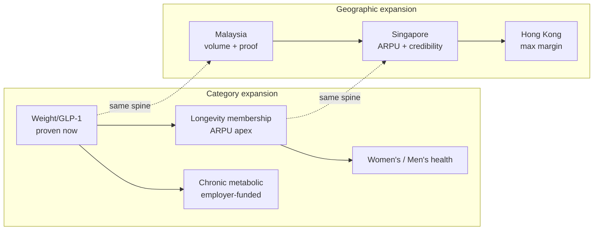
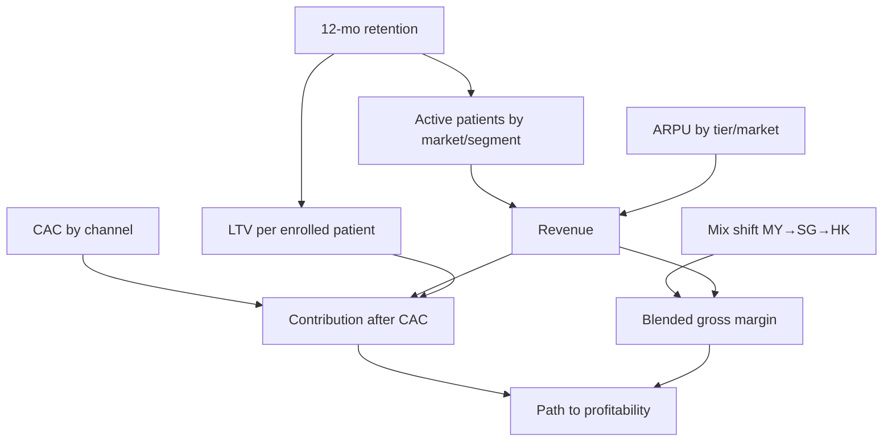

# Welltech Investor Thesis — The Institutional Investment Case

**Abstract.** This is the investment case for Welltech, written to the standard a top-tier venture investor applies: a clear thesis, an honest account of why now, a defensible market size built bottom-up from primary research, a wedge with a credible expansion path, unit economics with labelled assumptions, a moat that is a *system* rather than a feature, a competitive read that explains why the best-positioned incumbents are structurally the least able to respond, and a risk section that does not flinch. The thesis in one line: **Welltech is building the outcome-accountable operating system for private metabolic and preventive medicine across Malaysia, Singapore and Hong Kong — a single AI-and-WhatsApp clinical platform, localized three ways — into a GLP-1 supercycle, a regulatory cleanup and an ageing-driven prevention wave that have simultaneously created demand and vacated the incumbents best able to serve it.** The company enters a whitespace that, across 21 competitor dossiers and ~40 named operators, no one occupies: subscription-priced, WhatsApp-delivered, published-outcome continuity of medical care. It monetizes that whitespace first in Malaysia (volume and cheap iteration), then Singapore (ARPU and regulatory credibility), then Hong Kong (maximum margin) — one stack, three P&Ls, rising gross margin. This document states the thesis, sizes the prize, lays out the model and its economics as an explicitly illustrative scenario framework, summarizes the moat, frames the comparables and returns, and is candid about what could break. Financial projections herein are labelled illustrative planning bands with stated assumptions, not forecasts. It is the capital case beneath [competitive-moat.md](competitive-moat.md), [implementation-roadmap.md](implementation-roadmap.md) and [expansion-strategy.md](expansion-strategy.md).

**Last updated: July 2026.**

Related: [../00-executive-summary/malaysia-executive-summary.md](../00-executive-summary/malaysia-executive-summary.md) · [../00-executive-summary/singapore-executive-summary.md](../00-executive-summary/singapore-executive-summary.md) · [../00-executive-summary/hong-kong-executive-summary.md](../00-executive-summary/hong-kong-executive-summary.md) · [../20-competitor-dossiers/competitor-comparison.md](../20-competitor-dossiers/competitor-comparison.md) · [../50-marketing-intelligence/pricing.md](../50-marketing-intelligence/pricing.md)

---

**Contents:** 1. The thesis in one page · 2. Problem & why now · 3. Market size (TAM/SAM/SOM) · 4. The wedge & the expansion · 5. Business model & unit economics · 6. The moat, summarized · 7. Competition & why incumbents lose · 8. Team & what to hire · 9. Financial projections framework · 10. The ask & use of funds · 11. Risks & mitigations · 12. Comparable-company framing · 13. Exit & return scenarios · 14. Quality of revenue & defensibility of margin · 15. The diligence questions, answered · 16. The one-slide summary

---

## 1. The thesis in one page

**What Welltech is.** A doctor-led metabolic-health and longevity company delivered on WhatsApp, where AI performs the orchestration, monitoring and drafting behind enforced human clinical gates, and doctors sign everything. It launches in medical weight loss (GLP-1), where demand and pricing are proven *today*, and extends into longevity/preventive membership and chronic-metabolic care. It operates across three markets in sequence — Malaysia, Singapore, Hong Kong — as one regional platform.

**Why it wins.** The company occupies a whitespace that has stayed empty through five years of GLP-1 demand growth for a structural reason: *filling it requires every incumbent to break its own P&L.* Hospitals are paid per episode, telehealth anchored consults at RM15–25, aesthetic clinics run commission-per-pen, coaching platforms are contractually medication-avoidant. Longitudinal, outcome-accountable care is the worst-paid activity in each of their models. Welltech has no legacy P&L to protect and an operating model — ~3× staffing leverage, near-zero marginal touch cost — that makes proactive continuity *profitable* rather than ruinous.

**Why now.** Four clocks are aligned for the first time: the **GLP-1 supercycle** (Wegovy and Mounjaro launched across all three markets in 2024–26), a **regulatory cleanup** that is dismantling the cut-corner incumbents (Malaysia's 48 GLP-1 ad warning letters and tele-MC ban; Singapore's MaNaDr shutdown and Circular 87/2024; Hong Kong's UMAO wall), a **payer inflection** (12–17% medical trend making employers and insurers motivated buyers), and an **ageing wave** front-loading chronic-disease demand into this decade.

**The prize.** Reconciled bottom-up across the research: a serviceable medical-weight-management market of RM1.5–3.5B/yr in Malaysia by 2030, S$0.7–1.4B/yr in Singapore, and HK$1.9B/yr in Hong Kong — inside far larger longevity and chronic pools. A three-market year-3 SOM on the order of **US$30–80M ARR** across a small patient base at rising gross margin, with the published-outcomes dataset as the strategic asset that makes Welltech the category's most valuable acquisition target rather than a casualty.

**The ask.** A seed round to prove the Malaysian machine and publish the first cohort, then a Series A to enter Singapore with evidence and buy the licence and margin. Sizing rationale in §10.

---

## 2. Problem & why now

### 2.1 The problem

Southeast Asia and Hong Kong carry among the world's heaviest metabolic-disease burdens, and their treatment systems offer almost nothing between lifestyle advice and bariatric surgery. In Malaysia, 54.4% of adults are overweight or obese and 15.6% diabetic (roughly two in five undiagnosed); the pharmacological middle of the obesity pathway is empty across ~60 private hospitals, ~10,000 GP clinics and every telehealth platform. In Singapore, the population screens religiously (62.6% participation) and then receives no follow-through — the classic journey is screen → PDF → nothing. In Hong Kong, 54.6% are overweight or obese, GLP-1 demand is proven, and clinics layer 2–4× markups to sell "programmes" while med-spas package the same drugs as cosmetic slimming. Across all three, the patient who wants supervised, medically serious, ongoing metabolic care cannot buy it from anyone running it well.

### 2.2 Why now — the four aligned clocks

| Clock | Malaysia | Singapore | Hong Kong |
|---|---|---|---|
| **GLP-1 supercycle** | Mounjaro Aug 2025; Wegovy Jan 2026 (below off-label Ozempic rates) | Wegovy 2023; Mounjaro weight indication Jun 2025 | Mounjaro late 2024; Wegovy Nov 2025 (~HK$2,700/mo) |
| **Regulatory cleanup** | 48 GLP-1 ad warning letters (2025); tele-MC ban (Sep 2025) | MaNaDr shutdown; Joint Circular 87/2024; POM ad blocks | UMAO wall; MCHK discipline; EC's PCPD record |
| **Payer inflection** | 15–16% medical trend; DRG reform; mandatory co-pays | 12–16.9% trend; 1 Apr 2026 rider reform | ~9.8% inflation; group premiums +55% (2021–24) |
| **Ageing wave** | "Ageing nation" 2030; 60+ 3.9M→5.8M | ~1-in-4 citizens 65+ by 2030 | 25% already 65+; world's highest life expectancy |

The regulatory clock is the non-obvious tailwind: enforcement lands hardest on exactly the cut-corner incumbents (aesthetic clinics, pill-mill telehealth) that hold 40–50% of current GLP-1 volume, while the requirements it imposes are the sunk costs a compliant, clinician-led operator absorbs once. **Regulation is clearing the field for Welltech, not obstructing it.**

### 2.3 The window is real but timed

The fastest credible imitators are 6–24 months from assembling partial replicas ([competitor-comparison.md §5](../20-competitor-dossiers/competitor-comparison.md)). The investment logic is a race: fund the construction of the slowest-to-copy assets (published outcomes, WhatsApp clinical ops, the scarce clinical bench) inside that window, so that when assembly happens, the differentiation survives it.

---

## 3. Market size (TAM / SAM / SOM)

All figures are reconciled bottom-up in the research and carried here as planning bands, not forecasts. Currency and year are stated; USD conversions approximate.

### 3.1 Regional summary

| Market | Contestable digital-care pool | Segment-A (weight) SAM | Combined year-3 SOM |
|---|---|---|---|
| **Malaysia** | USD 0.6–1.1B (2023–24), 14–20% CAGR | RM1.5–3.5B/yr by 2030 | RM60–160M (weight) ≈ US$13–35M; blended maturity RM185–670M |
| **Singapore** | USD 0.4–0.7B (2024–25), low-to-mid-teens | S$0.7–1.4B/yr | S$10–26M ARR ≈ US$7.5–19M |
| **Hong Kong** | USD 0.3–0.45B (2024–25) | HK$1.9B/yr | HK$70–200M ≈ US$9–26M |
| **Combined** | — | — | **~US$30–80M ARR (year 3)** |

### 3.2 Malaysia segment funnel (the near-term investable case)

| Segment | TAM | SAM | SOM (3–5 yr) | SOM revenue |
|---|---|---|---|---|
| A. Medical weight loss / GLP-1 | ~13M overweight/obese; 8–9M pharmacotherapy-eligible | 1.5–2.2M financially able; 250k–550k active seekers/yr; RM1.5–3.5B by 2030 | 6k–15k active patients (top-3 program, 36 mo) | RM60–160M annualised |
| B. Longevity & preventive | 5–7M adults 35+ with private-care income | 0.4–0.7M affluent screening buyers | 8k–25k members | RM25–120M/yr |
| C. Telehealth-first primary care | 8–10M urban private users | 2–3M WhatsApp-first households | 30k–80k members | RM60–200M/yr |
| **Blended** | — | — | — | **~RM185–670M/yr at maturity** |

The near-term case rests on Segment A (demand and pricing proven now); B is the second product line and ARPU apex; C is retention infrastructure, not a standalone P&L. The consult fee is a small slice — the money lives in the *program* layer (medicines + membership), which is why every incumbent converged on pharmacy attach and why Welltech's economics live above the consult.

### 3.3 The retention lever dominates the sizing

The single most important economic fact: revenue is nearly flat across list prices (RM899–1,199) but highly sensitive to retention. **Every +10pp of 12-month retention is worth ~RM900–1,000 per enrolled patient** ([../50-marketing-intelligence/pricing.md §5.3](../50-marketing-intelligence/pricing.md)) — an order of magnitude more than any list-price decision. The market size Welltech can actually capture is therefore a function of the retention engine, which is exactly the capability the incumbents' economics prevent them from building.

---

## 3bis. Voice of demand — why the demand converts

Market size means nothing if the demand does not convert. The research establishes three demand facts that de-risk conversion:

1. **The trust deficit is operational, not clinical.** Malaysia "does not complain about medicine; it complains about process" — 3–6-hour waits, billing opacity, unreachable support, delivery failures, and above all *no follow-up anywhere in the market*. This is the exact layer an ops-led entrant dominates, and it is the cheapest differentiation available because it monetizes events (the first failure, the month-two check-in) that happen anyway.
2. **The GLP-1 review vacuum is an opportunity.** OVA, Seimbang, Medkos and most longevity boutiques have near-empty public review records — "no accumulated trust, but no scar tissue either." A new entrant that systematically harvests verified reviews from week one can out-reputation incumbents within quarters.
3. **Revealed willingness-to-pay is four figures monthly.** The RM5,000–10,000 annual envelope for supervised body transformation appears independently across three categories (GLP-1 programs, aesthetic clinics, slimming centres, TRT). The demand is proven; the bottleneck is initiation friction and stigma, which favours discreet, chat-first onboarding — exactly Welltech's channel.

The conversion thesis: the market is full of people who *already pay* for weight and metabolic care and are *already dissatisfied* with how it is delivered. Welltech does not have to create demand or educate a category; it has to out-execute on the operational layer where every incumbent leaks trust.

---

## 4. The wedge & the expansion

### 4.1 The wedge: weight loss, in Malaysia

Weight loss is the only line where demand *and* pricing are proven today. Malaysians already pay four figures monthly for supervised body transformation — RM899–1,150 for digital GLP-1 programs, RM1,288–3,200 at aesthetic clinics, RM5,000–10,000 historically to slimming centres. The wedge exploits two unmonetized acquisition moments: the **post-screening handoff** (hospitals hand over a PDF and wait) and the **month-two disillusioned GLP-1 patient** from aesthetic clinics — "the cheapest high-intent CAC in the market."

### 4.2 Two expansions, one platform

- **Category: weight → longevity → platform.** Each new line reuses ≥70% of the diagnostics/coaching/titration/memory spine, so the marginal cost of a new line is a protocol and a template set, not a new business. The maintenance off-ramp from weight into longevity membership is the archetype: it converts graduates (answering the 63%-regain fear) instead of losing them, lifting LTV against the same CAC.
- **Geography: MY → SG → HK.** A capability ladder. Malaysia proves the machine cheaply; Singapore banks the regulatory-grade credibility (the HCSA licence and MOH-grade governance are the regional credibility asset); Hong Kong monetizes both at maximum ARPU without new regulatory build. Sequencing is the mechanism by which each market's hardest asset is manufactured before it is needed — see [expansion-strategy.md](expansion-strategy.md).

---

## 5. Business model & unit economics

### 5.1 Revenue model

Subscription-priced programs, not per-consult fees. Malaysia pricing architecture ([../50-marketing-intelligence/pricing.md §4.1](../50-marketing-intelligence/pricing.md)):

| Tier | Price (MYR) | Role |
|---|---|---|
| Entry consult | RM49, 100% credited | Paid lead magnet at the RM58 WTP median |
| Metabolic Start (no GLP-1) | RM299/mo | Bridge tier |
| **Medical Weight Program (core)** | **RM999/mo flat, drug included**; RM5,499 6-mo prepay | The flagship; flat pricing removes the month-4 dose-escalation churn cliff |
| Premium + Concierge | RM1,599/mo; tirzepatide pass-through + RM399 fee | Positioning asset vs pen markups |
| Longevity Membership | RM3,600 Core / RM8,800 Executive /yr | ARPU apex; diagnostics membership |
| Maintenance | RM199–299/mo | Converts graduates |
| Corporate | RM8–15 PEPM + RM350–500/enrolled seat/mo | Claims-inflation control |

Prices scale ~3–6× in Singapore (S$450–700/mo core) and Hong Kong (HK$3,500–5,000/mo core) for near-identical clinical work — the source of the rising-margin mix.

### 5.2 Unit economics (illustrative, labelled assumptions)

Malaysia core-tier worked example, assumptions from the pricing research ([../50-marketing-intelligence/pricing.md §5.2–5.3](../50-marketing-intelligence/pricing.md)):

| Driver | Value | Note |
|---|---|---|
| Core price | RM999/mo | Flat across titration |
| Blended drug cost | ~RM950/mo | Target distributor pricing 10–20% below retail |
| Variable clinical + ops cost | ~RM120/patient/mo | Falls with AI leverage (~RM68–78 all-in ops at 1,000 patients) |
| Service margin/patient/mo | −RM71 to +RM60 (RM999 tier) | Positive with ≥30% prepay mix + distributor pricing; +RM129 at RM1,199 |
| CAC | RM150–600 by channel | Post-screening and month-two motions are cheapest |
| 12-mo LTV contribution | RM2,500–5,000 per retained patient | — |
| Unmanaged 12-mo persistence | ~30–38% | Steepest drop months 1–3 |
| Managed target | ≥60% | Proactive triage + flat pricing + maintenance |
| **Value of +10pp retention** | **~RM900–1,000/enrolled patient** | The dominant lever |

Year-1 revenue per enrolled patient rises with retention: ~RM6,200 at 30% (baseline) → ~RM7,600 at 45% (+23%) → **~RM8,900 at 60% (+44%)**. The entire investment case in the operating model is this: side-effect triage in weeks 0–8, the peak dropout window, is the highest-ROI clinical activity in the company, and it is affordable only because the AI + WhatsApp cost structure makes the marginal care touch ≈free.

*Assumption flags for diligence:* drug distributor margin (15–30%) must be validated against actual Zuellig/DKSH quotes; CAC-by-channel and any LTV/CAC ratio live in the funnels model, not the pricing doc; the unmanaged-persistence baseline appears as both 30% (revenue table) and 38%/30.2% (real-world source) in the research and should be reconciled to 38% (all-comers) for external use.

### 5.3 Path to profitability

Contribution turns positive on the RM999 tier with a modest prepay mix and secured distributor pricing; the Singapore and Hong Kong mixes carry structurally higher contribution (~25–40% pre-CAC in SG; HK$2,000–3,500 service-net-of-drug/patient/mo in HK). Because people cost scales with *exceptions* (~0.4–0.5 FTE per +100 patients), not patients, gross margin improves as the base grows. Profitability is a function of (1) retention beating the unmanaged baseline, (2) distributor drug terms, and (3) the mix shift toward SG/HK — not of list-price optimization.

---

## 6. The moat, summarized

Full analysis in [competitive-moat.md](competitive-moat.md). Seven interlocking moat sources, mapped to Helmer's 7 Powers:

| Moat | Power | Durability |
|---|---|---|
| Counter-positioning (empty quadrant) | Counter-Positioning | Very strong but time-boxed (12–24 mo assembly clock) |
| Operating model (AI + WhatsApp) | Process Power + Scale | Strong; 18–36 mo to replicate Malaysia-shaped |
| Outcomes data (published cohort) | Cornered Resource | Deepest; 24–36 mo (rivals must build retention first) |
| Compliance discipline | Counter-Positioning + barrier | Medium; strong in combination; grandfathering favours the early |
| Trust/brand (anti-slimming) | Branding | Medium–strong if escalated to verifiable proof |
| Clinical supply (scarce bench) | Cornered Resource | Medium–strong; 3 IFM doctors nationally |
| Switching costs (longitudinal memory) | Switching Costs | Strong; compounds with tenure |
| Regional platform | Scale Economies | Medium; real only in combination |

The defensibility is not any single moat — several are individually contestable — but that they *interlock*: outcomes require the operating model and switching costs to exist; brand escalates to outcomes when copied; the platform amortizes all of them. An incumbent must assemble the *system*, and "none of the assemblable combinations includes a working program with retention and outcomes" ([competitor-comparison.md §5](../20-competitor-dossiers/competitor-comparison.md)).

---

## 7. Competition & why incumbents lose

### 7.1 The landscape

Crowded at every point of the care journey and empty across it. The strongest players hold three corners of the market and none the fourth:

| Market | Strongest incumbents | What they own | What they lack |
|---|---|---|---|
| Malaysia | DoctorOnCall (1.9M users, 20M visits/yr), Doctor Anywhere (>S$190M raised, −S$43.5M FY2023), Alpro (~300 doors, best WhatsApp base), Naluri (1M lives, only published study) | Funnel, fulfilment, coaching rails | Prescribing + retention + outcomes together |
| Singapore | NOVI (only published cohort: 708 pts, 12.7%/12mo), ORA (US$17M, strongest DTC funnel), WhiteCoat/DA (insurer rails) | Outcomes OR funnel OR rails | The combination + WhatsApp channel + scale |
| Hong Kong | EC Healthcare (HK$4.14bn but loss-making, distressed), QHMS/Bupa (corporate panel), Zoey/Noah (model-fit, <3 yrs) | Assets OR distribution OR form-factor | Governance + outcomes + programme depth |

### 7.2 Why they lose

Three structural reasons, from the capability-gap analysis ([competitor-comparison.md §4](../20-competitor-dossiers/competitor-comparison.md)):

1. **The compounding capabilities are exactly the ones they lack.** Eight capabilities decide replication; the absences cluster on three rows — continuity/retention, WhatsApp-native ops, outcomes measurement — "precisely the capabilities that compound." No player holds the three compounding ones.
2. **Their strength is their weakness.** The groups strongest in prescribing (aesthetic clinics, hospitals) are weakest in the three "because their unit economics — commission-per-visit, yield-per-admission, markup-per-pen — actively punish longitudinal care."
3. **Capital does not correlate with capability.** The best-funded operator (Doctor Anywhere) posts the largest losses; the two profitable ones raised the least. Money buys a consult app, not a retention-and-outcomes machine.

The one incumbent that can copy fastest — a post-IPO BIG CARING acquiring a prescribing asset — is also the scenario in which "a proven, outcomes-published Welltech becomes the most valuable acquisition target in the category rather than a casualty."

---

## 8. Team & what to hire

The company is a clinical-operations-and-AI business, so the founding team must combine three scarce competencies: clinical governance, AI/product engineering, and regulated-market go-to-market. The hiring priorities are the moat's inputs:

| Priority hire | Why it is a moat input | Phase |
|---|---|---|
| **Founding Medical Director** (MMC-registered, governance-grade) | OHS 2025 requires a doctor in senior management; the licence the operation rests on | 0 |
| **Head of AI / Engineering** (orchestration, not chatbots) | The orchestration layer "is the company"; no vendor sells it Malaysia-shaped | 0 |
| **IFM / endocrinology advisory bench** | Cornered Resource: 3 IFM doctors nationally; a race | 0 |
| **Compliance / DPO lead** | Compliance-as-moat; PDPA launch gate | 0 |
| **Data / outcomes scientist** | Owns the published cohort — the deepest moat | 1–2 |
| **Singapore CGO** (MOH-DG-approved, SG-registered) | The single longest-lead SG hire; start recruiting in Phase 2 | 3 |
| **Employer-channel sales** | The B2B claims-inflation sale that de-risks the consumer P&L | 2–3 |

The design keeps the team lean — ~5.5–7 humans per 1,000 patients versus ~17 traditional — so hiring is capability, not volume. See the [implementation-roadmap.md §10](implementation-roadmap.md) hiring plan.

---

## 9. Financial projections framework (illustrative)

**These are illustrative scenario structures with stated assumptions, not forecasts.** They exist to show the *shape* of the model and the sensitivity to the load-bearing variables (patients, ARPU, retention), not to predict outcomes.

### 9.1 The scenario-model structure

The model is driven by five levers: **patients** (enrolment × retention), **ARPU** (tier and market mix), **retention** (the dominant value lever), **CAC** (channel mix), and **geographic mix** (rising margin as SG/HK grow). Retention is modelled explicitly because it, not price, decides the outcome.

### 9.2 Illustrative 5-year shape across three markets

*Assumptions: Malaysia launch Y1; Singapore Y2–3; Hong Kong Y3–4; blended ARPU rising with mix; managed retention improving from ~45% (Y1) toward ~60% (Y3+); patient counts within the SOM bands in §3. All figures illustrative USD ARR run-rate at year-end.*

| | Year 1 | Year 2 | Year 3 | Year 4 | Year 5 |
|---|---|---|---|---|---|
| **Malaysia active patients** | 1–2.5k | 4–7k | 8–12k | 12–18k | 15–25k |
| **Singapore customers** | — | 0.5–1.5k | 2–4k | 4–7k | 6–10k |
| **Hong Kong patients/members** | — | — | 1–2.5k | 3–6k | 5–9k |
| **Blended ARPU (annual, USD)** | ~2.4k | ~2.8k | ~3.4k | ~3.8k | ~4.2k |
| **Illustrative ARR (USD)** | US$3–6M | US$12–25M | US$30–55M | US$55–90M | US$85–140M |
| **Gross margin trend** | thin/neg | improving | positive | expanding | mature |

The bands are wide by design — the honest read is that Year-1 Malaysia is the only near-certain slice, and everything past it depends on retention clearing the baseline and the SG/HK entries executing on schedule. A bear case (retention stalls at unmanaged levels, HK price war, one market delayed) plausibly halves the Year-3 figure and still leaves a viable single-plus-market business; a bull case (employer/insurer rails open, retention ≥60%, all three markets on schedule) exceeds the top of the band.

### 9.2b The milestone narrative — what changes at 12 / 24 / 36 months

| Horizon | What becomes true | What it de-risks |
|---|---|---|
| **Month 12** | Live WhatsApp care rail with measured SLAs; first cohort's week-8 persistence beating the unmanaged baseline on ≥200 patients; contribution trending positive on the core tier | The retention bet — the single biggest risk — has its first real read |
| **Month 18–24** | **First published Malaysian GLP-1 cohort** — the only one in the market; contribution-positive MY weight P&L; longevity line live; Series A closed | The moat asset is banked; the SG entry is de-risked; the company is re-rated |
| **Month 30–36** | HCSA licence granted; SG employer beachhead running; SG cohort instrumented; HK verification complete or dual beachhead launching | Multi-market execution proven; the platform economics validated; the regional narrative real |

Each horizon converts a thesis risk into an observed fact. An investor entering at Seed underwrites month-12 retention; the Series A is priced against a *published cohort that already exists*; the Series A/B is priced against *two markets already running*. The risk profile falls at each step because the roadmap manufactures proof, not promises.

### 9.2c Sensitivity — bull / base / bear across the five levers

*Illustrative directional sensitivity of Year-3 blended ARR to the five model levers, holding others at base.*

| Lever | Bear | Base | Bull | Effect direction |
|---|---|---|---|---|
| 12-mo retention | ~35% (unmanaged) | ~50–55% (managed) | ≥60% | Dominant — halves or lifts LTV per patient by ~44% |
| Blended ARPU (mix) | MY-weighted, slow SG/HK | on-schedule mix shift | early SG/HK ramp | High — SG/HK carry 3–6× ARPU |
| Enrolment / CAC | CAC high, funnel underperforms | RM150–600 band holds | employer rails open early | High — the review-flywheel + post-screening motions swing it |
| Market timing | one market delayed 6–12 mo | on schedule | all three on schedule | Medium — sequencing gate protects but slows |
| GLP-1 drug pricing | price war compresses bundled tier | pass-through holds | volume expands, margin coaching-weighted | Low-to-medium — margin isn't in the spread |
| **Year-3 ARR outcome** | **~US$15–25M** | **~US$30–55M** | **US$70M+** | — |

The sensitivity confirms the thesis's central claim: **retention is the dominant lever, and it is a product-and-clinical outcome, not a spend outcome.** The bear case (retention stalls, one market delayed) still leaves a viable single-plus-market business; the bull case (retention ≥60%, employer/insurer rails open, all three markets on schedule) exceeds the top of the planning band.

### 9.3 What to underwrite

An investor is underwriting three things, in order: (1) that managed retention beats the ~30–38% unmanaged baseline — the entire P&L hinges on it; (2) that the Malaysian cohort can be published to a credible standard, unlocking the moat and the SG entry; (3) that the platform economics hold as the model ports to SG/HK. The stage-gates in the roadmap make each a fundable milestone rather than a leap of faith.

### 9.4 Why now is defensible timing — not too early, not too late

The timing question cuts both ways, and the thesis answers both:

- **Why not earlier?** Before 2025–26 the GLP-1 category did not exist at scale in these markets (Wegovy launched in MY Jan 2026, HK Nov 2025; the obesity indication is new), the regulatory cleanup had not yet cleared the cut-corner incumbents (MaNaDr shut in Aug 2024; MY's tele-MC ban Sep 2025), and the payer inflection (SG rider reform Apr 2026; MY DRG reform) had not yet made employers motivated buyers. Entering earlier meant building a category and a channel with no demand and no regulatory tailwind.
- **Why not later?** The whitespace is timed. The fastest imitators are 6–24 months from partial replicas, and the first credible published cohort defines the category. Entering later means fighting an incumbent that has already claimed the outcome-accountable position — the one asset that, once published, is hardest to displace.

The window is the intersection of "demand now exists" and "no one owns it yet" — a 12–24-month opening that the roadmap is explicitly built to exploit before it closes.

---

## 10. The ask & use of funds

### 10.1 Sizing rationale

The capital plan mirrors the phase structure: raise to the next proof point, not beyond it.

| Round | Purpose | Rough use of funds | Milestone it buys |
|---|---|---|---|
| **Seed** | Prove the Malaysian machine | Stack build (orchestration, AI clinic, WhatsApp rail); PHFSA clinic; founding clinical + eng team; e-Rx rails + IFM bench; 18-mo runway | Live WhatsApp care rail with measured SLAs; ≥200-patient week-8 persistence; first cohort instrumented |
| **Series A** | Publish the cohort + enter Singapore | Scale MY (retention engine, longevity line); publish MY cohort; SG licence + CGO + clinic node; employer beachhead | Published MY cohort; contribution-positive MY weight P&L; SG licence granted; SG employer pilots |
| **Series A/B** | Hong Kong + regional platform | HK dual beachhead; insurer rails; regional platform + outcomes DB; opportunistic M&A | 3-market run-rate; the strategic outcomes database |

The Seed is deliberately sized to reach the *publishable-cohort* milestone — the moat asset that re-rates the company and de-risks every subsequent round. The Series A is gated on that cohort existing. This sequencing means each round is underwritten against a completed proof, not a promise.

### 10.2 Why the capital is efficient

The model is asset-light (own the prescriber, channel, program, data; rent distribution, fulfilment, imaging, diagnostics) and staffing-light (~3× leverage). Technology cost is a minority of total cost. The largest single controllable variable — retention — is a product-and-clinical-design outcome, not a spend outcome. Capital efficiency is therefore structural, not a discipline that has to be imposed.

---

## 11. Risks & mitigations

Written to be honest with a sophisticated investor, not to reassure.

| # | Risk | Severity | Mitigation |
|---|---|---|---|
| 1 | **Retention below model** | High — the whole P&L hinges on beating ~30–38% unmanaged persistence | Flat titration pricing; proactive AI Nurse cadence weeks 0–8; maintenance off-ramp; retention as the top board metric. This is the primary underwriting risk |
| 2 | **Fast-follower assembly** | High — DoctorOnCall (6–18 mo), OVA (now–12 mo), Alpro/DA (12–24 mo) | Race the assembly clock on slow-to-copy assets; publish outcomes first; run the tripwire watch-list as an operating cadence |
| 3 | **Advertising/regulatory enforcement** | Medium–high — molecule advertising illegal; WhatsApp broadcasts count as ads | KKLIU/UMAO workflow; program-not-molecule; treat competitor takedowns as an early-warning feed |
| 4 | **Regulatory whiplash / licence delay** | Medium–high — soft-law can reverse (MY tele-MC ban); SG CGO is a scarce long-lead hire | Over-comply now (grandfathering favours the early); PHFSA anchor; hire CGO first, not last |
| 5 | **Clinician scarcity** | Medium–high in HK; IFM pool is 3 people | Clinician-light design; secure bench in Phase 0; part-time panels; doctor value-prop as recruiting moat |
| 6 | **GLP-1 safety scare / category contamination** | Medium | Pharmacovigilance-forward content; "supervised vs unsupervised" framing; bake NPRA/HSA alerts into protocols same-week |
| 7 | **PDPA/PDPO breach** | Medium but *terminal* in a stigmatised category | DPO + breach playbook pre-launch; entity-owned WABA; EMR-as-record; results-via-secure-link |
| 8 | **Drug supply / price shocks** | Medium — shortages push to grey channels; price wars compress the bundled tier | Contract allocation (Zuellig/DKSH); pass-through premium tier; coaching-weighted margin absorbs deflation (which *expands* eligible volume) |
| 9 | **Partner-turns-competitor** | Medium — every priority partner is on the threat list | Standing 24-mo rule; dual-source; own prescriber/channel/program/data |
| 10 | **Execution across three markets** | Medium — sequencing and capital-gap risk | Enforce the entry gate (prior-market proof before next entry); sequence fundraising to entry |

The intellectually honest summary: **this is a retention-and-execution bet inside a genuine window.** The market, the whitespace and the moat logic are well-evidenced; the risk that matters most is whether Welltech can operationally beat the unmanaged-retention baseline and publish credible outcomes before an incumbent decides to cannibalise its P&L. Both are addressable by execution, which is what the capital funds.

---

## 12. Comparable-company framing

Reference points for how public and private markets value adjacent models. These are external facts drawn from public reporting as of the knowledge cutoff and are **illustrative reference points requiring verification before any use in a priced round.**

| Company | Model | Reference valuation / scale | Relevance to Welltech |
|---|---|---|---|
| **Hims & Hers** (NYSE: HIMS) | US DTC telehealth + GLP-1 + compounding | Public; ~US$1.5B revenue FY2024; market cap has ranged ~US$2–11B[^1] | The public comp for subscription DTC health + GLP-1; validates the subscription-at-scale model and the GLP-1 revenue ramp |
| **Ro (Roman)** | US DTC telehealth, weight/GLP-1 | Private; last priced ~US$7B (2021)[^2] | The vertically-integrated DTC playbook Welltech localizes for Asia |
| **Function Health** | US membership diagnostics/longevity | Private; reported ~US$2.5B valuation in a 2025 raise; acquired Ezra (2024)[^3] | The longevity-membership comp; validates membership-first, scan-as-attach economics (§B in the model) |
| **NOVI Health** | Singapore metabolic programme, published cohort | Private; ~US$5M raised; Novo Nordisk partnership (2026)[^4] | The direct regional benchmark — proves the clinical model; sub-scale and app-walled where Welltech is WhatsApp-native and multi-market |
| **Doctor Anywhere** | SEA telehealth, insurer rails | Private; >S$190M raised; −S$43.5M FY2023[^5] | The cautionary regional comp: capital ≠ capability; per-consult economics cap the model |
| **EC Healthcare** (HKEX: 2138) | HK consolidated medical/aesthetic | Public; FY2025 revenue HK$4.14bn; loss-making; ~96% share collapse from 2021 peak[^6] | The distressed HK incumbent — the acquisition/talent source, and the trust-positioning foil |

The framing thesis: Welltech is a **regional, outcome-accountable, multi-market composite** of the DTC-subscription comp (Hims/Ro), the longevity-membership comp (Function), and the local clinical benchmark (NOVI) — built in markets with lower CAC, higher cash-pay propensity for transformation, and a channel (WhatsApp) that the US comps do not have. The valuation case is not "an Asian Hims" but "the only outcome-accountable metabolic platform across three high-burden, high-WTP Asian markets, with a published-outcomes moat none of the local comps hold."

---

## 13. Exit & return scenarios

| Scenario | Path | Illustrative outcome | Probability read |
|---|---|---|---|
| **Strategic acquisition** | A regional consolidator (post-IPO BIG CARING/Sunway; a pharma seeking demand-generation and outcomes data; an insurer buying the employer rail) acquires the proven, outcomes-published platform | The capital-consolidation scenario in which Welltech is "the most valuable acquisition target in the category rather than a casualty" | Base-to-upside; the moat is designed to make Welltech the buy, not the bought |
| **Pharma / payer partnership → majority** | A GLP-1 manufacturer (Novo/Lilly) or regional insurer takes a strategic majority for the outcomes dataset and reimbursed-channel access | The NOVI–Novo template, at multi-market scale | Plausible; the outcomes dataset is the currency |
| **Regional IPO** | A three-market, profitable, outcomes-accountable platform lists (SGX/HKEX) as the category leader | Public-market re-rating on the Hims/Function comps at Asian growth | Upside; requires all three markets scaled and profitable |
| **Continued independent compounding** | The platform compounds the moat, adds categories, and raises growth capital | High-margin regional franchise | Base case if execution holds |

The return logic rests on the moat's design: a proven, outcomes-published Welltech is worth more to an acquirer than the cost of building the assembly they cannot assemble — which is exactly why the roadmap front-loads the slow moats.

---

## 14. Quality of revenue & defensibility of margin

Not all revenue is equal, and a sophisticated investor discounts low-quality revenue. Welltech's revenue is structurally high-quality on the dimensions that matter:

| Quality dimension | Welltech position | Contrast with incumbents |
|---|---|---|
| **Recurring vs transactional** | Subscription programs (monthly + annual membership) | Telehealth = per-consult; aesthetic = per-pen; hospitals = per-episode |
| **Retention-driven** | LTV rises 44% from baseline to 60% retention; recurring by design | Incumbents monetize the transaction, not the relationship |
| **Cash-pay resilience** | Cash-pay is the market default (76% of MY private financing); not reimbursement-dependent | Not exposed to insurer coverage decisions on GLP-1 (excluded as "cosmetic") |
| **B2B2C diversification** | Employer/insurer PEPM channel (≥30% of HK revenue by design) insulates the consumer P&L | Incumbents lack the outcomes to sell claims-trend offset |
| **Margin mix improving** | Geographic mix shifts toward SG/HK (3–6× ARPU); people-cost scales with exceptions not patients | Asset-heavy incumbents' margins compress with growth |
| **Pricing power** | Anchored between the pharmacy floor and the aesthetic ceiling; revenue flat across list prices means margin is defended by COGS + retention, not price wars | Discounters trapped in a price-anchor race to the bottom |

The margin is defensible because it does not live where competitors can attack it. It does not live in the drug spread (so GLP-1 deflation, which *expands* eligible volume, is net-neutral-to-positive); it does not live in the consult fee (structurally unmonetizable at RM15–58 WTP); it lives in the *program layer* — the retention-and-outcomes machine that the incumbents' unit economics prevent them from building. A price war on the drug or the consult, the two things competitors can move, barely touches Welltech's contribution.

---

## 15. The diligence questions, answered

The objections a top-tier partner will raise, and the honest responses.

**"Isn't this just an Asian Hims?"** No. Hims is a DTC pharmacy-and-telehealth funnel; Welltech is an outcome-accountable clinical-operations platform with published cohorts, a WhatsApp-native channel the US comps lack, and a compliance-as-moat posture forced by (and rewarded in) Asian regulation. The similarity is the subscription-DTC revenue shape; the difference is the moat (outcomes + governance + retention) and the channel.

**"Why won't a well-funded incumbent just copy it?"** Because copying it means cannibalising the episode/commission/consult revenue they live on — counter-positioning. And because the best-funded regional operator (Doctor Anywhere, >S$190M) posts the largest losses running a consult app; capital buys distribution, not a retention-and-outcomes machine. The one fast copier (post-IPO BIG CARING buying a prescribing asset) is the scenario where Welltech is the acquisition target, not the casualty.

**"Retention is the whole thesis and it's unproven."** Conceded — this is the primary underwriting risk, and the thesis says so plainly. The mitigation is that the operating model makes the highest-ROI retention activity (weeks-0–8 proactive triage) affordable, and the stage-gates make retention a fundable, observable milestone before scale capital is deployed. An investor is funding a milestone, not a hope.

**"Three markets is a lot for a young company."** Sequenced, not simultaneous — and the sequence is the mechanism that manufactures each market's hardest asset before it's needed (MY outcomes before SG; SG governance before HK). Each entry is gated on prior-market proof and its own funding round. The platform makes market #2 and #3 cheaper than #1, not harder.

**"GLP-1 is a hype cycle; what happens when it deflates?"** Deflation compresses drug revenue but *expands* the eligible population, and Welltech's margin is coaching/retention-weighted, not drug-spread-weighted. The company is positioned as the durable clinical layer *around* the drug, not a reseller of it — which is exactly the position that survives the drug becoming cheap and ubiquitous.

**"What's proprietary — can't anyone build an AI WhatsApp bot?"** The bot is not the moat; the orchestration layer, the longitudinal-memory schema, the audit-grade compliance architecture, the scarce clinical bench and — above all — the published outcome dataset are. "Anyone can build a bot" is precisely why the incumbents built bots and still don't occupy the quadrant: the hard part is the retention-instrumented clinical operation behind the chat, which their P&Ls punish.

**"Where does this exit?"** Strategic acquisition by a regional consolidator, pharma or insurer seeking the outcomes dataset and reimbursed-channel access; a pharma/payer strategic majority (the NOVI–Novo template at scale); or a regional IPO as the category leader. The moat is designed to make the proven, outcomes-published platform worth more to an acquirer than building the assembly they cannot assemble.

---

## 15bis. The load-bearing numbers

The ~25 figures the case rests on, for rapid diligence. All trace to the linked repository documents; flagged items need verification before external quotation.

| Figure | Value | Market |
|---|---|---|
| Adults overweight/obese | 54.4% (MY) / 12.7% obese (SG) / 54.6% (HK) | All three |
| Diabetes prevalence | 15.6% MY / 1-in-3 lifetime SG / 8.5% HK | All three |
| Medical trend (inflation) | 15–16% MY / 12–16.9% SG / ~9.8% HK | All three |
| Out-of-pocket / cash-pay | 76% of private financing (MY) | Malaysia |
| WhatsApp reach | 90.7% MY / ~84% SG / ~75% HK | All three |
| Contestable digital-care pool | USD 0.6–1.1B MY / 0.4–0.7B SG / 0.3–0.45B HK | All three |
| Weight-segment SAM | RM1.5–3.5B MY / S$0.7–1.4B SG / HK$1.9B HK | All three |
| Year-3 combined SOM | ~US$30–80M ARR | Regional |
| Core price (weight) | RM999 / S$450–700 / HK$3,500–5,000 per mo | All three |
| Unmanaged 12-mo persistence | ~30–38% | Malaysia |
| Managed retention target | ≥60% | All |
| Value of +10pp retention | ~RM900–1,000/enrolled patient | Malaysia |
| CAC / 12-mo LTV contribution | RM150–600 / RM2,500–5,000 | Malaysia |
| Year-1 rev/patient at 60% retention | ~RM8,900 (+44% vs baseline) | Malaysia |
| AI staffing leverage | ~3× (5.5–7 vs 17 FTE/1,000 patients) | Platform |
| Meta fees/patient-month | ≈RM1–3 (<0.5% of revenue) | Platform |
| Published outcomes across ~40 operators | Exactly 1 | Malaysia |
| Assembly-clock window | 6–24 months | Competitive |
| IFM-certified doctors nationally | 3 | Malaysia |
| GLP-1 ad warning letters (2025) | 48 | Malaysia |
| NOVI published cohort | 708 pts, 12.7% at 12 mo | Singapore |
| Doctor Anywhere raised / FY23 loss | >S$190M / −S$43.5M | Regional comp |
| EC Healthcare FY25 revenue / status | HK$4.14bn / loss-making, distressed | Hong Kong |

---

## 16. The one-slide summary

- **Thesis:** the outcome-accountable operating system for private metabolic and preventive medicine across MY/SG/HK — one AI + WhatsApp clinical platform, localized three ways.
- **Why now:** GLP-1 supercycle + regulatory cleanup (clearing the cut-corner incumbents) + payer inflection + ageing wave, aligned for the first time in 2025–26.
- **Whitespace:** across ~40 operators, no one combines prescribing, retention, WhatsApp-native ops, published outcomes and subscription economics — because each incumbent category is prevented from assembling it by its own P&L.
- **Market:** ~US$30–80M year-3 SOM across three markets, inside multi-billion-dollar weight/longevity/chronic pools, at rising gross margin.
- **Model:** subscription programs, asset-light, ~3× staffing leverage; retention (+10pp ≈ RM900–1,000/patient) is the dominant lever, not price.
- **Moat:** seven interlocking sources; the deepest (published outcomes) takes 24–36 months to copy and is built first.
- **Ask:** Seed to prove the Malaysian machine and publish the first cohort; Series A, gated on that cohort, to enter Singapore with evidence.
- **Risk, honestly:** a retention-and-execution bet inside a real, timed window — the market and moat logic are evidenced; the open question is operational execution before the assembly clock runs out.

---

## References

Repository sources (relative links): [../00-executive-summary/malaysia-executive-summary.md](../00-executive-summary/malaysia-executive-summary.md), [../00-executive-summary/singapore-executive-summary.md](../00-executive-summary/singapore-executive-summary.md), [../00-executive-summary/hong-kong-executive-summary.md](../00-executive-summary/hong-kong-executive-summary.md), [../20-competitor-dossiers/competitor-comparison.md](../20-competitor-dossiers/competitor-comparison.md), [../50-marketing-intelligence/pricing.md](../50-marketing-intelligence/pricing.md), [../50-marketing-intelligence/positioning.md](../50-marketing-intelligence/positioning.md), [../60-ai-operating-model/ai-clinic.md](../60-ai-operating-model/ai-clinic.md), [competitive-moat.md](competitive-moat.md), [implementation-roadmap.md](implementation-roadmap.md), [expansion-strategy.md](expansion-strategy.md).

External comparable-company reference points (public reporting as of the January 2026 knowledge cutoff; **verify before use in a priced round** — valuations move and several private figures are dated):

[^1]: Hims & Hers Health, Inc. (NYSE: HIMS) — public filings; FY2024 revenue ~US$1.5B; market capitalization has ranged roughly US$2–11B across 2024–25. Company investor relations and SEC filings.
[^2]: Ro (Roman Health Ventures) — private; ~US$7B post-money reported at its 2021 Series D (General Catalyst, FirstMark, TQ Ventures). Press reporting; no public update since.
[^3]: Function Health — private membership diagnostics/longevity; ~US$53M Series A (2024) and a reported ~US$2.5B valuation in a 2025 raise; acquired whole-body-MRI company Ezra in 2024. Press reporting.
[^4]: NOVI Health (Singapore) — private; ~US$5M raised; published cohort (708 patients, 12.7% weight loss at 12 months, IJO 2026); Novo Nordisk partnership announced 2026. Repository dossier [../20-competitor-dossiers/novi-health.md](../20-competitor-dossiers/novi-health.md).
[^5]: Doctor Anywhere (Singapore) — private; >S$190M raised (Asia Partners, Square Peg, Novo Holdings, IHH); S$88M Series C; −S$43.5M FY2023 loss. Repository dossier [../20-competitor-dossiers/doctor-anywhere.md](../20-competitor-dossiers/doctor-anywhere.md).
[^6]: EC Healthcare (HKEX: 2138) — public; FY2025 revenue HK$4.14bn; FY2025 loss ~HK$167m; ~96% share-price decline from 2021 peak; HK$213m impairments. Repository dossier [../20-competitor-dossiers/ec-healthcare.md](../20-competitor-dossiers/ec-healthcare.md).
