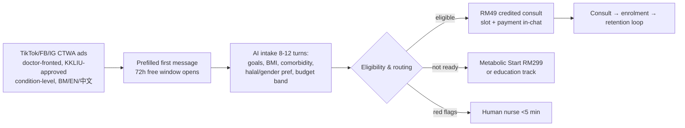

# Welltech Malaysia Go-To-Market Plan — Beachhead, Wedge, Channels & the 24-Month Launch

**Abstract.** This is the operational go-to-market plan for Welltech Health's Malaysia launch — the plan that converts the market thesis, competitive analysis and operating-model designs into a concrete sequence of moves, hires, partnerships, budgets and gates. The plan is deliberately narrow at the point of the spear and broad in what it unlocks: a **beachhead of Klang Valley T20/upper-M40 women (personas P1 "Datin-in-Progress" and P7 "Glow-Up Optimiser")**, entered through a single **wedge product — the doctor-led medical weight-loss / GLP-1 program** — because that is the one place in the market where demand, four-figure willingness-to-pay, and a dated regulatory window all coincide in 2026 ([executive-summary §1](../00-executive-summary/malaysia-executive-summary.md)). Acquisition runs through a **click-to-WhatsApp → AI-qualification → RM49 credited consult → program-enrolment → retention-loop funnel**, defended by an SEO/content moat that ranks on the vernacular while correcting it, amplified by doctor-KOL content that is simultaneously the compliant reach engine, and supplemented by a secondary corporate/employer channel and a referral-partnership network. The plan specifies the launch sequence across four phases (0–3, 3–6, 6–12, 12–24 months), a CAC strategy and budget model tied to the funnel and pricing economics (base-case CAC ~RM650, LTV:CAC ~3.8×), the trust-building playbook engineered against slimming-centre trauma and the documented complaint taxonomy, the partnerships to secure first (Alpro fulfilment, e-Rx rails, the three-person IFM bench, bariatric escalation, corporate channel), the founding team and launch hires, and the metrics and go/no-go gates for each phase. Every number is a labelled planning assumption to be replaced by observed data within one quarter of launch.

**Last updated: July 2026.**

**Related documents:** [product-strategy.md](product-strategy.md) (the programs this plan sells) · [pricing-strategy.md](pricing-strategy.md) (the price ladder and unit economics) · [funnels.md](../50-marketing-intelligence/funnels.md) (the full funnel teardown and CAC model) · [positioning.md](../50-marketing-intelligence/positioning.md) (message house, trust codes) · [competitor-comparison.md](../20-competitor-dossiers/competitor-comparison.md) (partnership map, threat clock) · [malaysia-consumer-behaviour.md](../10-market-intelligence/malaysia-consumer-behaviour.md) (personas P1–P7, journey map) · [sentiment-analysis.md](../30-patient-reviews/sentiment-analysis.md) (trust design inputs) · [malaysia-regulations.md](../10-market-intelligence/malaysia-regulations.md) (launch gates) · [ai-patient-journey.md](../60-ai-operating-model/ai-patient-journey.md).

---

**Contents:** 1. GTM thesis · 2. Beachhead definition · 3. The wedge product · 4. Channel strategy · 5. The launch sequence (0–24 mo) · 6. CAC strategy & budget model · 7. Trust-building playbook · 8. Partnerships to secure first · 9. Team & hiring · 10. Launch metrics & gates · 11. Risks to the plan · 12. Bottom line

---

## 1. GTM thesis

The market is crowded at every point of the care journey and empty across it. No Malaysian operator combines prescribing authority, retention infrastructure, WhatsApp-native clinical operations, published outcomes and subscription economics — and each incumbent category is structurally prevented from assembling that combination by its own unit economics ([competitor-comparison.md §7](../20-competitor-dossiers/competitor-comparison.md)). The GTM job is therefore not to *create* demand (it is proven — RM400–900M of GLP-1 weight-loss spend already flows in 2026, 40–50% of it through aesthetic clinics) but to **capture existing high-intent demand into a retained subscription relationship faster than the fast-followers can assemble a partial replica** (DoctorOnCall 6–18 mo, OVA now–12 mo, Alpro/DA 12–24 mo).

Three principles govern the plan:

1. **Win narrow, then widen.** One city (Klang Valley), one persona cluster (T20/upper-M40 women), one wedge (weight/GLP-1). Concentration suits a single-flagship-plus-digital model and produces the review density and outcome cohort that become the moat.
2. **Race the assembly clock on slow-to-copy assets.** Published outcomes, WhatsApp clinical SLAs, and the named clinical bench take longest to replicate — build them first ([executive-summary §6.6](../00-executive-summary/malaysia-executive-summary.md)).
3. **Trust is the first conversion battle, not price.** In a category where the brand starts "guilty until proven registered," registration performance and anti-hard-sell mechanics out-convert any discount ([sentiment-analysis.md §3](../30-patient-reviews/sentiment-analysis.md)).

The plan is engineered against the researched drop-off map: every stage where today's market loses the patient — the legitimacy check, the booking, the rushed consult, the broken delivery promise, the absent follow-up, the refund stall — is a designed counter-move, not a hope ([sentiment-analysis.md §4](../30-patient-reviews/sentiment-analysis.md)).

---

## 2. Beachhead definition

### 2.1 Geography — Klang Valley

Klang Valley (~8.8M people, Greater KL) is the beachhead: the country's highest incomes, private-care density, insurance coverage, and digital adoption. Only six states/territories exceed the national median household income of RM6,338/month, so the target geography is concentrated — which suits a single physical flagship (the PHFSA-registered anchor clinic) plus digital delivery. Expansion follows to **Penang** (diagnostics/medical-tourism cluster) and **Johor Bahru** (Singapore corridor) in Phase 4 ([executive-summary §2.5](../00-executive-summary/malaysia-executive-summary.md)).

### 2.2 Segment & persona — T20/upper-M40 women, weight

The wedge persona cluster ([consumer-behaviour §9](../10-market-intelligence/malaysia-consumer-behaviour.md)):

| Persona | Who | WTP | Why they lead the beachhead |
|---|---|---|---|
| **P1 · Datin-in-Progress** | T20 KL professional woman, 38–50; RM25k+ household; Bangsar/Mont Kiara/Damansara; tried slimming centres, PTs, keto | RM500–1,500/mo; RM1–3k screening "without blinking" | **Highest-LTV, lowest-CAC-via-referral persona**; pays for discretion + supervision; feeds the P2 longevity cross-sell |
| **P7 · Glow-Up Optimiser** | Urban woman 24–34; RM4–8k income; gym + kurus culture; BNPL user; heard of "skinny jab" on TikTok | RM150–400/mo with instalments; impulse consults <RM60 | **Highest-volume top-of-funnel**; enters via TikTok; strict eligibility screening (never prescribe to non-eligible aesthetic seekers — reputational landmine) |

Secondary personas the beachhead product also serves without being designed *for* them: **P5 Sandwich Caregiver** (Malay Muslim mother, family plans, halal/Ramadan) and **P3 Benefits Optimiser** (M40 corporate, employer-subsidised — the corporate channel). **P2 Screening Tauke** (Chinese-Malaysian screening buyer) is the longevity-line beachhead in Phase 3, not the weight wedge.

### 2.3 The flagship clinic's role in the beachhead

The single PHFSA-registered flagship in Klang Valley is not a volume centre — it is the **legitimacy anchor and compliance spine**. Its four jobs: (1) satisfy the OHS 2025 / PHFSA requirement for a physical clinic as prescription origin; (2) host the mandatory in-person GLP-1 initiation consult (physical exam + baseline labs); (3) serve as the checkable physical address that neutralises telehealth-skeptic objections ("is there a real clinic behind this?"); (4) anchor doctor-KOL and clinic-tour content. Everything after initiation is digital. One flagship suffices because the target geography is concentrated and the model is digital-first — a deliberate contrast to the asset-heavy hospital and multi-outlet slimming-chain models.

### 2.4 Why women first

Women carry higher obesity prevalence (38.8% vs 29.0% on Asian cutoffs), attempt weight loss at ~twice the male rate, and are the segment the trust deficit hits hardest (slimming-centre trauma is a women's trauma) — which makes anti-hard-sell mechanics maximally differentiating. Female-focused positioning is already proven in the category (OVA, Her Clinic), and a named female physician default neutralises the single sharpest objection ([weight-loss §2.2, §5](../10-market-intelligence/malaysia-weight-loss-market.md)).

---

## 3. The wedge product — medical weight loss / GLP-1

### 3.1 Why weight is the tip of the spear

Six dated facts make weight the only rational wedge in 2026 ([executive-summary §1](../00-executive-summary/malaysia-executive-summary.md)):

| Factor | Evidence | GTM consequence |
|---|---|---|
| Demand proven & paid | RM400–900M GLP-1 spend flowing in 2026; RM5,000–14,950 slimming-package WTP already demonstrated | No demand-creation cost; move spend from the wrong category |
| Market just formed | Mounjaro Aug 2025; Wegovy Jan 2026 at entry pricing below off-label Ozempic | First-mover window on the newly-legitimate category |
| Regulator clearing incumbents | 48 GLP-1 ad-warning letters (2025); Feb 2026 professional-body attacks on "cosmetic quick-fix" marketing | The 40–50%-volume aesthetic cohort's growth engine is being dismantled |
| Tele-MC ban favours chronic models | MMC Sep 2025 gutted transactional telehealth's main use case | Chronic/weight/longevity models mechanically favoured |
| GP fee band revised | RM10–80 from Apr 2026 (after 34 frozen years) | RM49–999 touchpoints read as modest premium, not luxury |
| The whitespace is the *operating model* | No player runs outcome-accountable, WhatsApp-delivered, subscription continuity | The wedge is the model, launched first in weight |

### 3.2 The offer at the point of the spear

The RM49 credited entry consult → RM999/month core Medical Weight Program (flat across titration, drug included) is the wedge offer ([product-strategy.md §3](product-strategy.md), [pricing-strategy.md §2](pricing-strategy.md)). It is priced at exact parity with a bare DoctorOnCall pen and visibly under the aesthetic-clinic pen — but includes the doctor, dietitian, proactive triage, cold-chain delivery and Ramadan protocol none of them provide. The wedge is not "cheaper GLP-1"; it is "the same medicine, finally *managed*."

---

## 4. Channel strategy

Five channels, ranked by role. The through-line: **WhatsApp is the conversion surface every channel funnels into**, because it is where 90.7% of Malaysians already are and where every incumbent runs only an unstructured manual inbox ([whatsapp-healthcare §2](../10-market-intelligence/malaysia-whatsapp-healthcare.md)).

| Channel | Role | Phase | Spend priority |
|---|---|---|---|
| CTWA → AI-qualification | Primary acquisition engine | 1 onward | Highest paid-media allocation |
| SEO / content moat | Defensive; dilutes blended CAC over time | 1 onward (compounds) | Front-loaded build, low ongoing |
| Doctor-KOL (TikTok/IG) | Amplifier + trust; compliant reach engine | 1 onward | Content production; organic-led |
| Corporate / employer | Secondary growth; cheapest M40 volume | 2–3 | Sales effort, not media |
| Referral & unmonetised-moment capture | Lowest-CAC, highest-intent | 1 onward | Credits budget only |

### 4.1 Primary — Click-to-WhatsApp (CTWA) → AI-qualification funnel

The core acquisition engine ([funnels.md §4](../50-marketing-intelligence/funnels.md), [ai-patient-journey.md §1](../60-ai-operating-model/ai-patient-journey.md)):

Design rules: creative never names molecules (Group B prohibition + WhatsApp drug policy); AI speaks BM/EN/Mandarin from message one; the RM49 consult is the paid lead-qualifier (filters tyre-kickers, sits under the RM58 WTP median); enrolment happens in-chat, not on a web checkout; first-response SLA <1 min kills the "consumers message 3 providers at once" comparison-shopping loss.

### 4.2 Secondary defensive — SEO/content moat

DoctorOnCall's history proves Malaysian health SEO compounds and dilutes blended CAC over time. The content strategy exploits the compliant lane: **doctor-fronted educational content that ranks on the "pen kurus" vernacular while correcting it** ("apa itu 'pen kurus' sebenarnya?"), price-transparency pages (Malaysians screenshot prices — publishing beats "contact us"), and the CPG eligibility criteria as public content (the category king defines what "good" looks like). This is the compliant reach engine given the molecule-advertising walls ([positioning.md §4](../50-marketing-intelligence/positioning.md)).

### 4.3 Amplifier — doctor-KOL content

Doctor-led TikTok is simultaneously the highest-trust conversion asset (named, MMC-registered, photographed doctors) and the compliant reach engine (education framing, no molecule names). "Welltech Doctors" roster with named profiles; individual doctor TikTok handles affiliated under brand governance. This is the researched consumer preference: patients verify via doctor profiles and shortlist on WhatsApp ([positioning.md §5, §9](../50-marketing-intelligence/positioning.md)).

### 4.4 Secondary growth — corporate/employer channel

Sold as claims-inflation control against the 15–16% medical trend, denominated in avoided claims, not consult fees. Route: HealthMetrics empanelment (cashless employer billing) + one co-sold GLP-1-cohort employer pilot with HR-facing outcome reports. PEPM + per-seat pricing avoids TPA rails entirely ([pricing-strategy.md §7](pricing-strategy.md)). Persona P3 (Benefits Optimiser) is the cheapest acquisition of M40 volume — but requires an ironclad data-firewall message ("your employer/insurer never sees your results").

### 4.5 Referral partnerships & unmonetised-moment capture

The cheapest high-intent CAC in the market comes from moments no incumbent captures ([funnels.md §2](../50-marketing-intelligence/funnels.md), [competitor-comparison.md §6](../20-competitor-dossiers/competitor-comparison.md)):

| Unmonetised moment | Capture mechanism |
|---|---|
| Post-screening handoff (hospitals hand over a PDF and wait) | "Send us your hospital/KPJ screening report" → interpret → route to program |
| Month-two disillusioned GLP-1 patient (aesthetic-clinic dropouts) | Content + retargeting on the ~50–70% who quietly discontinue by month 6 — the cheapest high-intent CAC |
| The burned-slimming cohort | Anti-hard-sell content-led acquisition; the complaint record is a ready-made "what we never do" manifesto |
| Naluri step-up referral | Coached-but-unresponsive members are the highest-intent medical-weight leads; open the conversation Q2 before an insurer forces Naluri elsewhere |
| Pharmacist referral (Alpro) | 86.9% consult the pharmacist before buying; referral + pickup de-risks the "is this legit?" question |
| Referral engine | RM50 account credit both sides at kg-milestones (target coefficient 0.25→0.4) |

### 4.6 Message house per persona

Creative is developed natively per language (BM/EN/中文), never translated, and pre-vetted through KKLIU ([positioning.md §6.2](../50-marketing-intelligence/positioning.md)):

| Persona | Core message | Channel & language | Avoid |
|---|---|---|---|
| P1 Datin-in-Progress | "Doctor-supervised, discreet, and finally not a scam" | IG, referral WhatsApp groups, Google brand search; EN | Vanity/urgency codes; "slimming" vocabulary |
| P7 Glow-Up Optimiser | "The medical upgrade to everything you've tried — from RM299/mo with instalments" | TikTok, IG Reels; EN/BM | Prescribing to non-eligible seekers (hard rule); "pen kurus" adoption |
| P5 Sandwich Caregiver | "Doktor yang faham keluarga anda — halal, jelas, tanpa beratur" | WhatsApp, TikTok BM, Facebook; BM | Jargon; hidden fees; male-doctor default |
| P3 Benefits Optimiser | "Your company covers it; your data stays yours" | HR comms, Teams, TikTok; EN/BM | Any hint results reach HR/insurer |
| P2 Screening Tauke (Ph.3 longevity) | "Your reports, interpreted and acted on — all year, in Mandarin" | XHS, WeChat/WhatsApp circles; 中文 | Subscription-trap framing; vague "wellness" |
| Corporate buyer | "Weight is your claims curve — we bend it and prove it" | LinkedIn, broker channels, Q4 briefings; EN | Consumer emotional codes |

The category is named in every asset — *pengurusan berat badan secara perubatan* (medical weight management), never "kurus"/slimming vocabulary — because the medicalised framing is ownable and stigma-safe where the vernacular is contaminated ([positioning.md §4](../50-marketing-intelligence/positioning.md)).

### 4.7 Seasonality — the acquisition calendar

Demand is seasonal: festive weight gain (0.4–3 kg) around Raya, CNY and Deepavali produces compensatory dieting peaks. **Acquisition pushes belong post-CNY (Feb–Mar) and post-Raya (Apr–May); retention interventions belong *inside* the feasting windows** (the "survive Raya" protocol). By Feb 2026 doctors were already warning of festive-season surges in GLP-1 walk-ins ([weight-loss §3.2](../10-market-intelligence/malaysia-weight-loss-market.md)).

---

## 5. The launch sequence (0–24 months)

### 5.1 Phase 0 — Pre-launch gates (months −3 to 0)

Non-negotiable launch gates ([executive-summary §6.6](../00-executive-summary/malaysia-executive-summary.md), [regulations §3](../10-market-intelligence/malaysia-regulations.md)):

- SSM entity + physical office + **registered medical practitioner in board/senior management** (plus licensed pharmacist for e-pharmacy) per OHS 2025
- **PHFSA clinic registration** (3–6 months lead) — the clinical anchor and prescription origin
- DPO appointed + 72-hour breach playbook drilled; TIAs for Meta/cloud/AI vendors (PDPA)
- e-Rx rails contracted (DOC2US or Teleme decision)
- Escalation MOU signed (Prince Court / Gleneagles KL)
- KKLIU workflow live; pre-approved claims library
- WhatsApp Business portfolio (two-number) verified with green tick

### 5.2 Phase 1 — Beachhead launch (months 0–3)

| Workstream | Moves | Gate to proceed |
|---|---|---|
| Product | Weight program (Good/Better/Best) live on WhatsApp; AI Receptionist/Nurse/Scheduling/Billing/Coordinator operating with measured SLAs; in-person initiation at anchor clinic; cold-chain delivery | End-to-end lead traced ad→enrolment |
| Partnerships | Alpro fulfilment terms; IFM/MEMS clinical bench secured (both are races) | Fulfilment + bench contracted |
| Marketing | 3 creative concepts × 2 languages at RM150–300/day; SEO hub (10 condition/price pages); referral mechanics; **published price ladder + doctor rate card (first in market on both)** | Cost/qualified-lead <RM120; intake completion >45% |
| Trust | Registration artefacts on every surface; "verify us" walkthrough; solicited-review flywheel from week one | First reviews harvested |

### 5.3 Phase 2 — Prove the funnel & retention (months 3–6)

| Workstream | Moves | Gate |
|---|---|---|
| Marketing | Winning creative to RM500–1,000/day; Mandarin/XHS cell; doctor-KOL TikTok cadence | CAC/enrolled <RM800; consult show-rate >75% |
| Retention | Full cadence live (day-3/weekly/week-4/month-2); persistence-risk scoring; save-calls; Ramadan mode if in-season | Week-4 persistence >85%; first cohort retention read vs ~30–38% baseline |
| Corporate | HealthMetrics empanelment; first co-sold employer pilot LOI | One pilot signed |
| Partnerships | Speedoc home-phlebotomy; open Naluri step-up conversation | — |

### 5.4 Phase 3 — Scale & second product line (months 6–12)

| Workstream | Moves | Gate |
|---|---|---|
| Product | Launch Longevity Membership (Core + Executive); biomarker dashboard; P1→P2 cross-sell live | Longevity pilot cohort enrolled |
| Marketing | XHS/Mandarin longevity funnel (persona P2); scale corporate | Longevity renewal signal >70% |
| Moat | **Prepare the first Malaysian GLP-1 cohort outcomes** publication | Cohort data to credible evidential standard |
| Ops | Second doctor cohort; scale AI staffing ratios | Human ratio holding ≈6.5–7 FTE/1,000 patients |

### 5.5 Phase 4 — Widen (months 12–24)

| Workstream | Moves | Gate |
|---|---|---|
| Moat | **Publish the first Malaysian GLP-1 cohort outcomes** — the decisive move before assembly threats crystallise | Published; category narrative owned |
| Geography | Penang + JB expansion (digital-first, phlebotomy partners) | Klang Valley unit economics proven |
| Product | Men's & women's health lines; family/chronic plans at scale | LTV:CAC ≥3× sustained |
| Partnerships | BIG CARING second-wave fulfilment; KPJ geographic escalation; Sunway channel co-development | Volumes justify multi-chain |
| Market | SG entry build (regulatory + pricing validation) | SG WTP measured |

---

### 5.6 Geographic expansion logic (Phase 4)

Klang Valley is proven before any second geography opens; the expansion order follows demand density and adjacency, not ambition:

| Market | When | Rationale | Entry mode |
|---|---|---|---|
| **Klang Valley** | Phase 1 | Highest income/insurance/digital density; ~8.8M; concentrated | Flagship clinic + digital |
| **Penang** | Phase 4 | Diagnostics + medical-tourism cluster; longevity-tier supply chain; Chinese-Malaysian screening buyers | Digital-first + phlebotomy/lab partners; no new flagship needed initially |
| **Johor Bahru** | Phase 4 | Singapore corridor; medical-tourism adjacency; cross-border longevity/weight demand | Digital-first + Speedoc phlebotomy; JB→SG corridor learning |
| **Singapore** | Post-24 mo | ARPU + credibility hub; corporate/insurer channel leads | Separate regulatory build (see [expansion-strategy.md](expansion-strategy.md)) |

The digital-first model means Penang and JB open with partner phlebotomy and lab touchpoints rather than a full flagship — capex-light expansion that reuses the KL clinical and AI stack. Only in-person GLP-1 initiation requires a physical presence, which partner clinics or a satellite consult room can provide without a second full build.

## 6. CAC strategy & budget model

*(All figures analyst planning estimates from [funnels.md §5–6](../50-marketing-intelligence/funnels.md) and [pricing-strategy.md §8](pricing-strategy.md); replace with observed data within one quarter.)*

### 6.1 The funnel arithmetic (base case)

10,000 ad clicks → 7,200 conversations (72% CTWA leakage) → 3,960 completed intakes (55%) → 2,376 qualified (60%) → 832 paid RM49 consults (35%) → **374 enrolments** (45% close) = **3.7% click-to-enrolment**.

### 6.2 CAC build-up (per enrolled program patient)

| Scenario | Blended CPC | Click→enrol | Media CAC | +30% load | **Fully loaded CAC** |
|---|---|---|---|---|---|
| Bull (referral-heavy 30%) | RM1.80 | 4.5% | RM280 | RM84 | **~RM365** |
| **Base** | RM2.40 | 3.7% | RM485 | RM146 | **~RM650** |
| Bear (paid-only, competitive auction) | RM3.50 | 2.5% | RM980 | RM294 | **~RM1,275** |

### 6.3 LTV:CAC (core RM999 tier, contribution ~RM300/mo at scale)

| Scenario | 12-mo retention | Yr-1 revenue/enrolled | LTV:CAC (base CAC RM650) | Payback |
|---|---|---|---|---|
| Bear | 40% | RM6,990 | 3.2× | ~3 mo |
| **Base** | 52% | RM8,190 | **3.8×** | ~2.5 mo |
| Bull | 60% | RM8,890 + cross-sell tail | 4.1×+ | ~2 mo |
| Stress: unmanaged | 30% | RM6,190 | 2.9× (falls <2× at bear CAC) | ~3.5 mo |

**Reading:** the funnel clears the 3× LTV:CAC bar in all but the stress case — and the stress case is precisely the unmanaged baseline every aesthetic clinic runs. The retention loop is the economic moat; the CTWA front-end is merely efficient. Sensitivity: ±10pp retention moves LTV:CAC ±0.4×; ±RM1 CPC moves it ±1.0× — watch auction inflation (CPCs rising 8–12%/yr) as GLP-1 competition intensifies.

### 6.4 The 90-day funnel launch micro-plan

Before spend scales, the funnel is instrumented and de-risked in three sub-phases ([funnels.md §7.3](../50-marketing-intelligence/funnels.md)):

| Sub-phase | Weeks | Milestones | Gate to proceed |
|---|---|---|---|
| Instrument | 1–2 | WABA + CRM + conversation attribution live; KKLIU submissions filed; claims library approved | End-to-end test lead traced ad→enrolment |
| Seed | 3–6 | 3 creative concepts × 2 languages at RM150–300/day; SEO hub (10 condition/price pages); referral mechanics live | Cost/qualified-lead <RM120; intake completion >45% |
| Scale | 7–12 | Winning creative to RM500–1,000/day; Mandarin/XHS cell; first corporate pilot LOI | CAC/enrolled <RM800; week-4 persistence >85%; consult show-rate >75% |

Funnel diagnostics run weekly against the stage-conversion dashboard: any two consecutive weeks outside range triggers the mapped fix as an experiment (e.g. intake abandoned at turn 2–3 → language selector first, ≤2-line messages; consult booked but no-shows >25% → T-24h/T-1h reminders + reschedule button — [funnels.md §7.4](../50-marketing-intelligence/funnels.md)).

### 6.5 Illustrative launch marketing budget (Phase 1–2, months 0–6)

*(analyst model; scale with the gates in §5)*

| Line | Months 0–3 | Months 3–6 | Basis |
|---|---|---|---|
| Paid media (CTWA + search) | RM150–300/day (~RM20k–27k) | RM500–1,000/day (~RM45k–90k) | Ramps on cost/qualified-lead <RM120 gate |
| Content/SEO/production | ~RM30k | ~RM40k | Doctor-KOL content, 10+ SEO pages, video |
| Tools (BSP, CRM, analytics) | ~RM15k | ~RM20k | respond.io-class + orchestration |
| Referral credits | ~RM10k | ~RM25k | RM50/side at milestones |
| **Approx. total** | **~RM75k–85k** | **~RM130k–175k** | At ~RM650 base CAC, months 3–6 fund ~200–270 enrolments |

Cumulative CAC to reach the 6k–15k patient SOM at 36 months is modelled at ~RM10–25M ([weight-loss §10](../10-market-intelligence/malaysia-weight-loss-market.md)). Kill-criterion for creative: cost/qualified-lead >RM120 after 2 weeks.

---

## 7. Trust-building playbook

The brand starts "guilty until proven registered." Trust is the first conversion battle, ordered by the researched hierarchy of proofs ([sentiment-analysis.md §3.1](../30-patient-reviews/sentiment-analysis.md)).

### 7.1 The five-layer trust hierarchy (build bottom-up)

| Layer | Proof | Welltech mechanism |
|---|---|---|
| 1. Legal existence | MOH/MMC/NPRA verifiability | Registration artefacts on every surface; "verify us on Quest3+" walkthrough; RM49 (not RM15) entry price signals legitimacy |
| 2. Named humans | Doctor with face + MMC number | Doctor profile cards (photo, MMC no., languages, gender) on WhatsApp, site, ads |
| 3. Kept promises | First delivery on time, first reply in-window | Cold-chain SLA + reply-time SLA; the delivery *is* the trust event |
| 4. Recovery behaviour | How the first failure is handled | Proactive delay notification (never silence); auto-refund triggers — **the cheapest differentiation, monetising events that will happen anyway** |
| 5. Social proof at volume | Alpro-style review mass | Solicited-review flywheel from week one (target ≥20% review conversion vs market's ~0.03–1%) |

Incumbents compete at layers 1–2 and neglect 3–5. Layer 4 is where every incumbent leaks trust and where Welltech wins.

### 7.2 Against slimming-centre trauma (the anti-hard-sell manifesto)

The slimming-industrial complex (6,925 NCCC complaints 2015–17, ~10 women losing >RM2M combined) trained women to expect pressure. Welltech makes anti-hard-sell mechanics *marketed features*, not hygiene ([sentiment-analysis.md §2.3, §7](../30-patient-reviews/sentiment-analysis.md)):

- Published all-in prices (no "contact us"; no deposits before price)
- No in-session sales; "decide at home" scripting; cooling-off norm
- Cancel-anytime monthly billing; one-message cancellation honoured same-day
- Written, published refund policy with auto-refund triggers (<7-day cycle)
- Non-commissioned clinicians (the doctor's income is not tied to the close)
- Eligibility screening that visibly turns people away — the credibility flywheel of saying no
- **Never** use "free trial" / "free consultation" for weight services (the phrase itself is the hard-sell cue)

### 7.3 Against the complaint taxonomy (the product spec)

Every recurring complaint theme maps to a designed counter-move ([sentiment-analysis.md §2.7](../30-patient-reviews/sentiment-analysis.md), [ai-patient-journey.md](../60-ai-operating-model/ai-patient-journey.md)): T1 price opacity → 100% all-in quotes; T2 communication black holes → reply-time SLAs + proactive updates; T3 Rx traps → prescription portability by policy + NPRA batch verification; T4 delivery → cold-chain SLA + proactive delay notice; T5 refund stalls → auto-refund <7 days; T7 hard sell → no in-session sales; T8 rushed consults → AI-prepped 10–15-min protected slots.

### 7.4 The review flywheel (run from week one)

Malaysian patients leave reviews in volume when asked at the moment of service, and the GLP-1/longevity category has near-zero incumbent review equity to displace — a new entrant that systematically harvests verified reviews can out-reputation incumbents within quarters ([sentiment-analysis.md §3, §9](../30-patient-reviews/sentiment-analysis.md)). The mechanism: a post-episode WhatsApp review prompt (Alpro-pattern) routed to Google Business Profile, targeting ≥20% review conversion vs the market's ~0.03–1%; named-staff gratitude surfaced (the strongest positive pattern in every corpus); and a quarterly "what patients complained about and what we changed" note — a transparency move no Malaysian digital-health player makes. Defensive move: claim the brand-search surfaces early (Google Business, Trustpilot, FAQ disambiguating from foreign namesakes) so the first review-shaped result about Welltech is one Welltech seeded.

### 7.5 Cultural trust codes

Halal transparency (scholar-reviewed FAQ; injections don't invalidate the fast per 1997 IIFA ruling; Ramadan-mode protocol as productised proof); Mandarin capability + XHS for the Chinese-Malaysian screening buyer; PDPA-plus privacy pledge (no insurer/employer sharing, local residency — answering the MySejahtera-leak and premium-loading anxiety); discreet unbranded packaging (patients hide GLP-1 use); one physical flagship as the legitimacy anchor.

---

## 8. Partnerships to secure first

The dossiers converge on a partner-heavy architecture: own the prescriber relationship, care channel, program layer and patient data; rent almost everything else. Every partner is also on the threat list, so the standing rule is: **data, patient billing, program IP and the prescriber relationship stay with Welltech; no exclusivity that forecloses a second source; contracts assume the partner becomes a competitor within 24 months** ([competitor-comparison.md §6](../20-competitor-dossiers/competitor-comparison.md)).

### 8.1 Q1–2 (existential — these gate the launch)

| Partner | Secure for | Why urgent |
|---|---|---|
| **Alpro** | GLP-1 fulfilment (nationwide dispensing, cold chain, 2-hr KV delivery, pharmacist counselling) + 300-panel corporate co-sell | Its verticalisation window opens at 12–24 mo; it is also **threat #3** — ring-fence the program layer, dual-source fulfilment early |
| **DOC2US or Teleme** | Digitally-signed e-Rx rails + pharmacy acceptance network | Nothing ships without compliant e-Rx; DOC2US has scale (1,500 outlets), Teleme is a build-vs-buy candidate |
| **Emagene / IFM bench** | Clinical legitimacy for longevity — IFM-certified advisory or hire | **Malaysia has only 3 IFM-certified doctors; Emagene employs 2** — first mover locks the national bottleneck |
| **Prince Court / Gleneagles KL** | Bariatric/endoscopic escalation (Dato' Dr Tikfu Gee's team, GKL Weight Management Centre); reverse-flow of post-surgical patients into maintenance; GL pre-clearance | Safety architecture must exist at launch; three IHH flagships competing improves terms |

### 8.2 Q2–4 (growth)

- **HealthMetrics** — corporate empanelment + one co-sold employer pilot (owns the HR/insurer buyer + cashless billing rail; hedge by also empanelling PMCare/MiCare/Mednefits)
- **Speedoc** — home phlebotomy + injection-training nurse visits + house-call escalation in KV/Penang/JB
- **Naluri** — open the step-up referral conversation early (whoever Naluri partners with becomes the reimbursed-channel gatekeeper; it is **threat #7** if it goes elsewhere)

### 8.3 Year 2 (scale/optionality)

BIG CARING second-wave fulfilment (626 doors + 2.4M CARiNG loyalty base as a CAC channel); KPJ geographic escalation (~29 hospitals beyond KV); Sunway channel co-development + premium diagnostics; Qualitas/Mediviron task-based physical touchpoints; BP Healthcare/Pathlab as longevity lab supply.

---

## 9. Team & hiring for launch

The staffing model is AI-leveraged: ~6.5–7 humans per 1,000 active patients vs ~17 in a traditional clinic (≈3× leverage), with human time concentrated on exceptions and relationships ([ai-clinic.md §7](../60-ai-operating-model/ai-clinic.md)).

### 9.1 Founding team

| Role | Mandate |
|---|---|
| CEO / founding strategist | Fundraise, partnerships, category narrative, board |
| **Medical Director** (MMC-registered, in senior management per OHS 2025) | Owns the protocol book, AI advice libraries (every patient-facing clinical sentence doctor-authored/approved), weekly transcript-audit program, clinical governance — a legal requirement *and* the trust anchor |
| Head of Growth | CTWA/SEO/doctor-KOL funnel, CAC discipline, brand |
| Head of Product/Engineering | Orchestration layer + memory (the build items), EMR/e-Rx/BSP integration |
| Head of Partnerships & Corporate | Alpro/e-Rx/escalation/HealthMetrics deals; employer channel |
| Licensed pharmacist | E-pharmacy compliance, dispensing, cold-chain (OHS 2025 requirement) |
| DPO / compliance (can be shared/fractional at launch) | PDPA, KKLIU workflow, 72-hr breach runbook |

### 9.2 Launch clinical & ops bench (for the first ~1,000 patients)

Per the AI-native staffing model: ~1.5–2.0 doctor FTE (panel ≈500–650 vs traditional 300–350), ~1.5 nurse FTE (grade-2+ escalations only), ~0.75 dietitian FTE, ~0.5 care-coordination, plus the new roles the AI clinic requires — **conversation QA/clinical auditor (0.5 FTE)** and **AI ops engineer (shared)**. Accept higher human ratios in months 0–6 while the memory layer fills (cold-start data poverty).

### 9.3 Hiring sequence

Hiring is phased to the launch gates — clinical governance and the build team first, growth and scale later ([ai-clinic.md §7](../60-ai-operating-model/ai-clinic.md)):

| Phase | Priority hires | Why now |
|---|---|---|
| Pre-launch (−3 to 0) | Medical Director; licensed pharmacist; Head of Product/Eng; DPO (fractional ok) | Legal/compliance gates require them in place; the build items (orchestration + memory) must start |
| Phase 1 (0–3) | 1.5–2 doctor FTE; 1.5 nurse FTE; Head of Growth; Head of Partnerships | Deliver the wedge; secure the racing partnerships |
| Phase 2 (3–6) | Conversation-QA/clinical auditor (0.5); dietitian; AI ops engineer | Retention engine + outcomes instrumentation |
| Phase 3–4 (6–24) | Second doctor cohort; corporate sales; longevity clinician (IFM bench); Mandarin-capable staff | Second product line + scale |

Headcount grows sub-linearly (~0.4–0.5 FTE per additional 100 patients) because AI absorbs volume-proportional work while humans absorb exception-proportional work — the staffing math that is the business case.

### 9.4 The doctor recruiting pitch

"**Practise medicine. We do the rest.**" — positioned against the three villains every GP recognises (the TPA extracting 10–15%, the RM15-consult platform, the contract system): ≥RM80–120 effective per clinical hour with a published rate card and ≤7-day settlement; zero unpaid admin (AI-drafted notes, auto-claims); no patient ever holds the doctor's personal number; protocolised safety (no tele-MCs ever, indemnity top-cover paid); recurring per-patient program income so follow-up becomes paid product. Routing paid GLP-1 initiation visits *into* partner GP clinics converts 12,000 potential opponents into a distribution network ([clinician-pain-points via executive-summary §5.2](../00-executive-summary/malaysia-executive-summary.md)).

---

## 10. Launch metrics & gates

### 10.1 Phase gates (go/no-go)

| Phase | Primary gate | Secondary gates |
|---|---|---|
| 0 → 1 | All pre-launch compliance gates cleared (PHFSA, OHS governance, DPO, e-Rx, escalation MOU, KKLIU) | Alpro + IFM bench contracted |
| 1 → 2 | End-to-end lead traced ad→enrolment; cost/qualified-lead <RM120 | Intake completion >45%; first reviews harvested |
| 2 → 3 | CAC/enrolled <RM800; **week-4 persistence >85%** | Consult show-rate >75%; first corporate pilot LOI |
| 3 → 4 | First cohort 12-mo retention read beating ~30–38% baseline; LTV:CAC ≥3× | Longevity renewal signal >70%; outcomes data assembled |
| 4 → widen | **First Malaysian cohort outcomes published**; KV unit economics proven | SG WTP measured before any SG price deck |

### 10.2 Standing KPI dashboard

| Layer | Metric | Target |
|---|---|---|
| Funnel | Cost/conversation; intake completion; qualified rate; consult show-rate; close rate | Per [funnels.md §5](../50-marketing-intelligence/funnels.md) |
| Persistence (the business) | Week-4 / week-8 / month-3 / month-12 retention | Month-3 ≥90%; month-12 ≥60% |
| Economics | CAC; LTV:CAC; payback; Meta fees/patient-month | <RM800; ≥3×; <3 mo; <RM1.50 |
| Channel health | WhatsApp quality rating; block rate; template rejection | Green continuously; <0.5%; <5% |
| Trust | Review conversion; scam-mention rate; complaint rate per 100 patients (T1–T9 scorecard) | ≥20% review conversion |
| Safety | Grade-2/3 escalation SLA met; missed-red-flag audit | ≥99%; zero tolerance |
| Moat | Cohort size with ≥12-mo structured outcome data | Publishable cohort by month 12–18 |

Each proof milestone doubles as the pre-planned response to a watch-list tripwire: if a threat activates early, the counter is to *accelerate the corresponding proof*, not to reprice or pivot ([executive-summary §6.6](../00-executive-summary/malaysia-executive-summary.md)).

### 10.3 The one number that governs the plan

Above all the dashboards, one number decides the launch: **12-month persistence versus the ~30–38% unmanaged baseline.** The entire P&L, the moat, the corporate pitch and the outcomes publication all rest on it. A managed program reaching >60% is worth ~RM2,700 more contribution per enrolled patient than the unmanaged baseline; a mediocre month-2 save rate makes CAC payback marginal and the model unremarkable. Every other metric — CAC, show-rate, review conversion — is instrumental to that one. The board reviews persistence first; if it holds, the plan works even if other metrics wobble; if it fails, no amount of acquisition efficiency saves the economics.

---

## 11. Risks to the plan

| # | Risk | Mitigation |
|---|---|---|
| 1 | Advertising-enforcement contact (molecule ads illegal; 48 warning letters in 2025) | All creative through KKLIU workflow; market the program never the molecule; influencer contracts prohibit drug naming; treat competitor takedowns as an early-warning feed |
| 2 | Fast-follower assembly (DoctorOnCall 6–18 mo, OVA now–12 mo, Alpro/DA 12–24 mo) | Race the assembly clock on slow-to-copy assets (outcomes, WhatsApp SLAs, named bench); run the tripwire watch-list as an operating cadence |
| 3 | Retention below model (P&L hinges on beating 30–38%) | Flat titration pricing; proactive AI Nurse cadence weeks 0–8; maintenance off-ramp; retention KPIs as board metrics |
| 4 | Trust-deficit drag on CAC (guilty until proven registered; silent abandonment invisible in analytics) | Registration performance everywhere; anti-hard-sell as marketed features; review flywheel from week one |
| 5 | Partner-turns-competitor (every priority partner is on the threat list) | Standing rule: data/billing/IP/prescriber stay with Welltech; dual-source fulfilment early; no foreclosing exclusivity |
| 6 | GLP-1 safety scare / category contamination | Pharmacovigilance-forward content; "supervised vs unsupervised" framing pre-positions Welltech as the safe pole; bake NPRA alerts into protocols same-week |
| 7 | PDPA breach in a stigmatised category (leaked GLP-1 thread) | DPO + 72-hr playbook before launch; TIAs; role-scoped access; no patient-visible group features |
| 8 | Soft-law whiplash (tele-MC ban precedent; virtual-only rests on forbearance) | Over-comply with OHS 2025 now (grandfathering favours the compliant); PHFSA anchor; no tele-MCs ever; track the Digital Health bill quarterly |

---

### 11.1 Competitive-response scenarios

Each likely competitor move has a pre-planned response — the counter is always to *accelerate a proof*, never to reprice or pivot ([positioning.md §11](../50-marketing-intelligence/positioning.md), [competitor-comparison.md §5](../20-competitor-dossiers/competitor-comparison.md)):

| Move | Likelihood (24 mo) | Welltech response |
|---|---|---|
| DoctorOnCall launches a GLP-1 SKU on its search traffic | High (owns the funnel) | Out-position on continuity + outcomes publication; do not fight on price/SEO breadth — fight on care depth |
| OVA/Seimbang raise funding and match service depth | Medium-high | Move second on features, first on proof: cohort outcomes, guarantee, corporate channel (they are B2C-only); screen for partnership/acquisition |
| Alpro verticalises (its own doctor layer) | 12–24 mo (highest structural threat) | Ring-fence fulfilment contractually; dual-source early; race the outcomes + named-bench moat it cannot quickly build |
| Naluri wraps GLP-1 for insurers | 12–24 mo | Accelerate insurer pilots; open the step-up referral first; differentiate on prescribing depth + consumer brand Naluri lacks |
| Sunway/IHH reframe "medical weight management" | Medium | Pre-empt with category-defining content + MEMS advisory board; position hospitals as escalation partners, not rivals |
| Regulatory freeze on weight-category advertising | Low-medium | Owned channels (referral, WhatsApp community, SEO education) carry acquisition; the compliance record becomes the moat |

The scenario weighting: fragmented drift ~50% (quadrant stays open 24+ months — the task is speed, not defence); category assembly ~35% (assembled offers inherit their parents' broken retention economics); capital consolidation ~15% (in which a proven, outcomes-published Welltech becomes the category's most valuable acquisition target rather than a casualty).

## 12. Bottom line

The Malaysia go-to-market is a concentration play: one city, one persona cluster, one wedge, executed fast enough to build the three slow-to-copy assets — retention infrastructure, WhatsApp clinical SLAs, and published outcomes — before the fast-followers assemble a partial replica. Acquisition runs entirely through the channel 90% of Malaysians already trust, converts on a RM49 credited consult that filters for intent, and monetises the year of managed care rather than the pen. Trust, not price, is the first battle, and the plan wins it with checkable artefacts and anti-hard-sell mechanics that turn slimming-centre trauma into a conversion asset. The partnerships that gate the launch (Alpro fulfilment, e-Rx rails, the three-person IFM bench, bariatric escalation) are secured in the first two quarters because each is a race; the corporate channel and the second product line follow once the funnel and retention are proven; and the decisive move — publishing the first Malaysian GLP-1 cohort outcomes at 12–18 months — is the one that converts an early lead into an ownable category. Every gate in §10 is a checkpoint against exactly one question: are we building the moat faster than the market can close the window?

**Blueprint context:** this GTM plan launches the programs designed in [product-strategy.md](product-strategy.md) at the ladder set in [pricing-strategy.md](pricing-strategy.md); its 24-month sequence is the Malaysia portion of the six-phase [implementation-roadmap.md](implementation-roadmap.md); the defensibility logic beneath the "race the assembly clock" imperative is argued in [competitive-moat.md](competitive-moat.md); and the Penang/JB/Singapore widening in Phase 4 is developed in [expansion-strategy.md](expansion-strategy.md). The operating cadence this plan acquires patients into is specified in [ai-patient-journey.md](../60-ai-operating-model/ai-patient-journey.md) and [whatsapp-operating-model.md](../60-ai-operating-model/whatsapp-operating-model.md).

---

## References

All market, competitive, regulatory, behavioural and operating facts are cited to primary sources in the linked repository documents — the funnel mechanics and CAC/LTV model in [funnels.md](../50-marketing-intelligence/funnels.md); the personas, journey map and WTP evidence in [malaysia-consumer-behaviour.md](../10-market-intelligence/malaysia-consumer-behaviour.md); the trust hierarchy and complaint taxonomy in [sentiment-analysis.md](../30-patient-reviews/sentiment-analysis.md); the partnership map, threat clock and capability-gap analysis in [competitor-comparison.md](../20-competitor-dossiers/competitor-comparison.md); the regulatory launch gates in [malaysia-regulations.md](../10-market-intelligence/malaysia-regulations.md); the tier prices and unit economics in [pricing-strategy.md](pricing-strategy.md); and the operating cadence in [ai-patient-journey.md](../60-ai-operating-model/ai-patient-journey.md). This document synthesises those sources into a launch plan and introduces no new external facts requiring separate citation.
