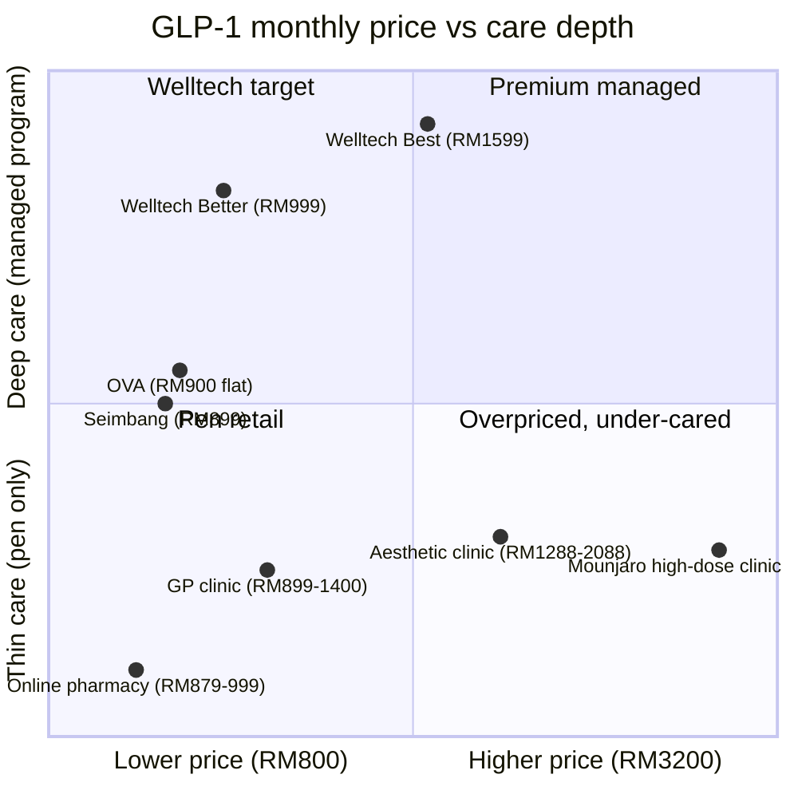

# Welltech Pricing Strategy — The Definitive Price Architecture, Decisions & Unit Economics

**Abstract.** This is the founding pricing decision document for Welltech Health — the layer of the blueprint that converts the pricing *intelligence* in [pricing.md](../50-marketing-intelligence/pricing.md) into *decisions the company builds against*. It fixes the tier architecture (RM49 credited entry consult; a good–better–best GLP-1 ladder at RM299 / RM999 / RM1,599; longevity membership at RM3,600 / RM8,800 per year; corporate at RM8–15 PEPM plus RM350–500 per enrolled seat), settles the two pricing-model questions that decide retention economics (flat-across-titration over dose-laddered; bundled-flat drug cost for semaglutide, transparent pass-through-plus-fee for tirzepatide), sets a discipline that never trains discounts into the recurring price, specifies the payment and financing rails under the Consumer Credit Act 2025, prices the corporate and insurer channel, and models unit economics per tier against the single controlling finding of the whole repository: **retention, not list price, is the dominant revenue lever — every +10pp of 12-month persistence is worth ~RM900–1,000 per enrolled patient, an order of magnitude more than any RM100 list-price move.** It closes with a willingness-to-pay evidence base, a competitive price-positioning map, and the structural rules for carrying the architecture to Singapore and Hong Kong. All prices are analyst decisions grounded in the benchmark corpus; every one is a pilot hypothesis to be confirmed against observed conversion and margin data within one quarter of launch.

**Last updated: July 2026.**

**Related documents:** [pricing.md](../50-marketing-intelligence/pricing.md) (the full benchmark corpus and model analysis this document decides from) · [product-strategy.md](product-strategy.md) (the programs these prices sell) · [malaysia-go-to-market.md](malaysia-go-to-market.md) (the funnel and CAC model) · [funnels.md](../50-marketing-intelligence/funnels.md) · [positioning.md](../50-marketing-intelligence/positioning.md) · [malaysia-weight-loss-market.md](../10-market-intelligence/malaysia-weight-loss-market.md) · [malaysia-consumer-behaviour.md](../10-market-intelligence/malaysia-consumer-behaviour.md) · [malaysia-executive-summary.md](../00-executive-summary/malaysia-executive-summary.md).

---

**Contents:** 1. Pricing philosophy · 2. The tier architecture (the decisions) · 3. Flat vs dose-laddered · 4. Drug cost: pass-through vs bundled · 5. Discount & promotion governance · 6. Payment & financing · 7. Corporate & insurer pricing · 8. Unit economics per tier · 9. Willingness-to-pay evidence · 10. Competitive price-positioning map · 11. Price-risk register · 12. Carrying to SG/HK · 13. Decision summary

---

## 1. Pricing philosophy: five principles that pre-decide the ladder

Everything below follows from five findings established in the research and adopted here as fixed principles.

1. **Malaysians under-pay for access and over-pay for transformation.** Median stated willingness-to-pay for a 30-minute teleconsult is RM58; revealed spend on supervised body transformation runs four figures monthly and RM5,000–14,950 in slimming packages ([pricing.md §5.1](../50-marketing-intelligence/pricing.md)). Pricing must ride *both* curves: a near-WTP entry price and a transformation price justified by outcome, identity and convenience — never a single mid-price that satisfies neither.

2. **The consult is unmonetisable as a flagship; the program is the product.** Every incumbent that led with paid B2C consults pivoted to pharmacy margin or payers ([pricing.md §1](../50-marketing-intelligence/pricing.md)). Welltech monetises the *program layer* (recurring care + medication management + outcomes), not the consult and not the molecule.

3. **Retention is the dominant term in the LTV equation.** At unmanaged GLP-1 persistence (~30–38% at 12 months) CAC payback is marginal; at a managed 60% it rises ~44% ([pricing.md §5.3](../50-marketing-intelligence/pricing.md)). Price architecture is therefore engineered first to *remove churn triggers* (dose-escalation sticker shock, renewal friction, cost-fatigue) and only second to maximise ARPU.

4. **Price integrity is a trust asset in a trust-poisoned category.** The slimming-industrial complex trained Malaysian women to expect opacity, deposits-before-price, and pressure ([sentiment-analysis.md §2.3](../30-patient-reviews/sentiment-analysis.md)). Published all-in prices, a protected reference price, and disciplined discounting are marketable proof, not hygiene.

5. **Drug COGS and retention move revenue; list price barely does.** Sensitivity analysis shows revenue nearly flat across RM999–1,199 list pricing ([pricing.md §5.2](../50-marketing-intelligence/pricing.md)). The two variables worth fighting for are distributor drug pricing (target 10–20% below retail) and 12-month persistence — not the list number.

> **The one-line pricing thesis:** anchor the drug near the pharmacy floor, monetise a visible care layer, price flat across titration so the churn cliff never fires, protect the reference price absolutely, and let retention — not list price — carry the P&L.

---

## 2. The tier architecture — the decisions

The definitive Welltech Malaysia price card. All figures MYR; SGD/HKD columns are *indicative structural equivalents* for later markets (see §12 — export the structure, not the ringgit). Prices are analyst decisions from the [pricing.md](../50-marketing-intelligence/pricing.md) benchmark corpus.

| SKU | MYR | ~SGD | ~HKD | Billing | What it is |
|---|---|---|---|---|---|
| **Doctor Review (entry consult)** | RM49 one-off, 100% credited to any program | S$15 | HK$85 | Card / DuitNow / wallet | 20–30 min video/WhatsApp consult + eligibility + labs order if indicated |
| **GOOD — Metabolic Start** (no GLP-1) | RM299/mo | S$90 | HK$525 | Monthly, cancel anytime | Doctor review, dietitian plan, WhatsApp coaching, weigh-in protocol, oral options (orlistat/metformin) at pass-through |
| **BETTER — Medical Weight Program** (core) | **RM999/mo flat across titration, drug included**; RM5,499 6-mo prepay (~8% off) via BNPL | S$300 | HK$1,750 | Monthly / prepay / BNPL | GLP-1 (semaglutide) + monthly MD review + dietitian + proactive WhatsApp side-effect triage + cold-chain delivery + Ramadan protocol |
| **BEST — Premium Metabolic + Concierge** | RM1,599/mo (semaglutide); tirzepatide at drug pass-through + RM399 fixed service fee | S$485 | HK$2,800 | Monthly / BNPL | Everything in Better + named-physician/gender choice, quarterly CGM, labs 2×/6mo, priority SLA, spouse-plan discount |
| **Longevity Membership — Core** | RM3,600/yr | S$1,090 | HK$6,300 | Annual, 12-mo instalment | 60–100+ biomarkers + 6-mo retest, biological-age dashboard, quarterly doctor review (Mandarin available), wearable/CGM integration |
| **Longevity Membership — Executive** | RM8,800/yr | S$2,670 | HK$15,400 | Annual, 12-mo instalment | Core + advanced imaging partner rates, hormone optimisation pathway, concierge referrals, semi-annual reviews |
| **Maintenance** (post-program) | RM199–299/mo | S$60–90 | HK$350–525 | Monthly | Low-dose/off-drug maintenance, monthly check-in, weight-regain early-warning |
| **Corporate — base** | RM8–15 PEPM | — | — | Contract | Screening + teleconsult access for the whole covered population |
| **Corporate — program seat** | RM350–500/enrolled employee/mo | — | — | Contract | Subsidised weight-program seats; employer typically subsidises 50% |

FX basis for the indicative columns: 1 SGD ≈ RM3.30, 1 HKD ≈ RM0.57 (mid-2026). These are *not* export prices — they show the shape of the ladder in local currency before the mandatory WTP rebase (§12).

### 2.1 The two empty rungs the ladder is built to occupy

Malaysia's consumer price ladder has two structural gaps ([pricing.md §1](../50-marketing-intelligence/pricing.md)): nothing between the RM131 GP visit and the RM526 specialist visit, and nothing between a RM300 screen and a RM9,300 admission. The Better tier (RM999/mo) occupies the first; the Longevity membership (RM3,600–8,800/yr) occupies the second. Neither rung has a branded incumbent.

### 2.2 The RM49 entry consult — why not free, why not RM15

The entry consult is deliberately *not* free and *not* RM15. Free "consultations" are the slimming-centre hard-sell cue that triggers the category's defensive crouch ([sentiment-analysis.md §8](../30-patient-reviews/sentiment-analysis.md)); RM15 signals the transactional-telehealth commodity Welltech is not. RM49 sits just under the RM58 WTP median, filters tyre-kickers (a paid consult raises show-rates), and is 100% credited to any program so it reads as a deposit toward transformation, not a sunk fee. It is the paid lead-qualifier that makes the whole funnel efficient — the price *is* a trust and qualification signal, not a revenue line (consult revenue is immaterial; enrolments-per-1,000-conversations is the metric it optimises).

### 2.3 The good–better–best presentation rule

Always show three program tiers with **Better pre-selected**; Best exists substantially to make RM999 read as reasonable (asymmetric-dominance framing — the same mechanism by which hospital screening menus already train Malaysians to buy the middle package, [longevity §3.1](../10-market-intelligence/malaysia-longevity-market.md)). Good (RM299) is the down-sell that captures the not-yet-eligible and the price-anxious rather than losing them.

### 2.4 What the tiers are anchored *against* (never the GP or public clinic)

| Tier | Anchor consumers already hold | The framing |
|---|---|---|
| Entry RM49 | DoctorOnCall RM15 consult; RM58 WTP median | "Not the cheapest — the *credited* one" |
| Better RM999 | Aesthetic-clinic pen RM1,288–2,088 (no care); DoctorOnCall bare pen RM999 | "The doctor, dietitian, delivery and monitoring — for less than the pen alone costs elsewhere" |
| Better/Best | Slimming package RM5,000–8,000 (machines, no medicine) | "A 6-month *medical* program costs what the package that didn't work cost" |
| Longevity | Hospital executive screen RM800–2,580 *episodic* | "The test is the cheap part — we manage the year after" |

RM999/month is framed as a **program** purchase (outcome, identity, convenience), never as a healthcare purchase, because health spend is discretionary-coded at ~2–3% of household budgets ([consumer-behaviour §5.2](../10-market-intelligence/malaysia-consumer-behaviour.md)).

---

## 3. Pricing-model decision #1 — flat-across-titration, not dose-laddered

**Decision: the core (Better) tier is priced flat at RM999/month regardless of titration step. This is the single most important pricing decision in the company.**

### 3.1 The mechanism

GLP-1 therapy titrates upward over months (semaglutide 0.25 → 0.5 → 1.0 → 1.7 → 2.4 mg). Dose-laddered pricing — where the monthly bill rises with the dose (Nexus RM1,288 → RM2,088; myGP RM899 → RM1,288; Juniper UK dose-stepped) — builds a **sticker-shock event into month 3–4**, which is *exactly* the peak persistence-danger window (Danish cohort n=77,310: 18% discontinue by month 3, 31% by month 6, 52% by month 12; steepest drop in the first twelve weeks — [ai-clinic.md refs](../60-ai-operating-model/ai-clinic.md)). Dose-laddering charges the patient *more* precisely when they are most likely to quit.

Flat pricing removes that trigger entirely. It is the best pricing idea imported from the international comparators: OVA (Malaysia) charges from RM900/month flat regardless of dose; Hims prices compounded injectable semaglutide at a flat ~US$175/month "that does not change as your dose increases" ([pricing.md §3.3](../50-marketing-intelligence/pricing.md)).

### 3.2 The trade-off, quantified

| Dimension | Flat (chosen) | Dose-laddered (rejected) |
|---|---|---|
| Month-3–4 churn trigger | **None** | Built-in sticker shock at the worst moment |
| Margin shape | Front-loaded (positive on low doses), thins at 2.4 mg | Constant margin per dose |
| Consumer trust | "No surprises" — a marketable promise | Reads as bait-and-ladder; echoes aesthetic-clinic upsell |
| Actuarial safety | Safe for semaglutide (shallow dose-cost curve; blended pen cost ~RM950–1,100 across a titration cohort) | — |
| Retention value | Captures the ~RM900–1,000-per-10pp retention prize | Forfeits it to protect per-dose margin |

The margin objection is answered by blending: across a titration *cohort*, weighted-average pen cost is predictable (~RM950–1,100), and the service margin comes from retention and tier mix, not from per-dose pricing ([pricing.md §4.3](../50-marketing-intelligence/pricing.md)). Welltech deliberately accepts thinner margin at high doses to buy the retention that dwarfs it.

### 3.3 The one exception — tirzepatide

Tirzepatide's dose-cost curve is *not* shallow: high-dose Mounjaro retails RM2,700–3,200, which makes flat pricing actuarially dangerous. Tirzepatide is therefore priced pass-through-plus-fee at the Best tier (§4), mirroring how Hims flattens compounded semaglutide but prices high-cost branded options separately.

---

## 4. Pricing-model decision #2 — drug cost: bundled-flat for semaglutide, pass-through for tirzepatide

**Decision: bundle the drug into a flat price on the semaglutide core tier; pass the drug through with a visible fixed service fee on the tirzepatide premium tier. The visible service fee is itself a positioning asset.**

### 4.1 The hybrid rationale

| Criterion | Bundled-flat (Better / semaglutide) | Pass-through + RM399 fee (Best / tirzepatide) |
|---|---|---|
| Consumer trust | High if flat across doses ("no surprises") | Highest for price-auditing Chinese-Malaysian and expat segments who screenshot pharmacy prices |
| Margin behaviour | Welltech absorbs the titration cost curve; margin front-loaded | Margin constant; drug-price risk (list changes, Juniper-style price wars) sits with the patient |
| Churn effect | Removes the dose-escalation cliff | Re-introduces it at high doses — acceptable at the premium tier's lower volume and higher WTP |
| Positioning | "Everything included" | The transparent RM399 fee *attacks* the aesthetic-clinic pen markup (30–60%) that Welltech is positioned against |

The critical Malaysian caveat, distinct from the US model: there is **no insurance coverage for obesity drugs** (weight-loss GLP-1s are near-universally excluded as "cosmetic" — [regulations §11](../10-market-intelligence/malaysia-regulations.md)), so the drug cannot be pushed to a payer as Ro/Calibrate do. Pass-through must therefore ride *negotiated distributor pricing* to beat retail — the drug-COGS negotiation (Zuellig/DKSH, target 10–20% below retail) is the enabling condition for the whole architecture, not a nice-to-have.

### 4.2 The pen-markup attack

Identical pens retail from ~RM879–999 (online pharmacy) to RM1,288–2,088 (aesthetic clinics) — a 30–60% markup for thin clinical content ([pricing.md §2.3](../50-marketing-intelligence/pricing.md)). Pricing the drug near pharmacy parity and monetising a visible care layer attacks a margin incumbents structurally cannot defend without admitting the markup. "We include the doctor, dietitian and delivery for less than they charge for the pen alone" is a claim only Welltech can make truthfully.

---

## 5. Discount & promotion governance — never train a discount into the price

**Decision: discount only the *entry consult* and the *first program month*; never the recurring tier price. The prepay discount (~8% on 6 months) is the only standing concession. Referral value is delivered as account credit, not cash.**

Malaysian consumers are voucher-trained (Shopee flash pricing; DoctorOnCall's TNGDOC10-style codes) and will actively probe for discounts. Every international comparator discounts *entry*, not run-rate (Hims/Ro/Noom/WW all discount the first month, hold the membership fee). Training discounts into the RM999 program price would permanently damage the reference price the trust strategy depends on.

| Rule | Rationale |
|---|---|
| Discount only entry consult (RM49→RM0 in defined campaigns) and first program month | Reference-price integrity; mirrors every credible telehealth operator |
| Prepay discount (~8% on 6-month) is the *only* standing price concession | Converts churn risk to upfront cash (Ro annual-prepay logic) |
| Referral = RM50 account credit both sides, never cash | Cash referral (DoctorOnCall RM30) attracts mercenary sharing; credit compounds retention |
| Corporate discounts are volume-banded, contractual, and invisible to B2C | Prevents B2B pricing leaking into consumer negotiations |
| Festive campaigns (post-CNY, post-Raya) bundle *value* (free CGM sensor, extra dietitian session), never cut price | Protects the ladder while exploiting real seasonality |

### 5.1 The outcome guarantee — a refund policy, never an advertised claim

Calibrate's 10%-or-money-back guarantee is the strongest trust device in the category and no Malaysian provider offers one. Conditioned on adherence milestones it is actuarially safe (median compliant GLP-1 patients exceed 10% loss). **But** it must be structured as a *commercial refund policy disclosed at purchase*, never an advertised efficacy claim — KKLIU/MAB treats "10% or your money back" in an ad as a prohibited guarantee ([positioning.md §7](../50-marketing-intelligence/positioning.md)). Test it as a post-consult close mechanic (roll out if close rate +5pp and refund incidence <4%), not a headline.

---

## 6. Payment & financing rails

**Decision: accept every wallet from day one; make Atome the first BNPL partner; keep instalment tenor ≤ program duration; contract only CCC-licensed providers.**

| Rail | Role | Notes |
|---|---|---|
| Cards, FPX, DuitNow QR, TNG/GrabPay/Boost | Day-one table stakes | Shopee-trained consumers abandon on friction; every rail accepted from launch ([consumer-behaviour §3.4](../10-market-intelligence/malaysia-consumer-behaviour.md)) |
| **Atome** (BNPL) | First BNPL partner | Already onboards Malaysian clinics (CLEO, Dr Chong, Millennium); splits into 3 interest-free; OVA already advertises Atome, so parity is table stakes |
| SPayLater / Grab PayLater | Coverage widening | 1–24-mo instalments to RM10,000; 4/8/12 splits — reaches Shopee-native personas |
| In-house 3-month split | Fallback | If CCC licensing shakes out BNPL providers post-June 2026 |

### 6.1 What instalments unlock

A RM5,499 six-month prepaid program becomes ~RM917/month on 6-month BNPL — pulling the M40 personas (WTP RM150–400/month "gym money" but RM900 reachable with instalments and festive motivation) into the core tier. This mirrors exactly how aesthetics and slimming centres already sell four-figure packages.

### 6.2 Expected payment-mix (why every rail is table stakes)

Malaysian payment behaviour is wallet-first and comparison-driven; friction at checkout loses Shopee-trained consumers ([consumer-behaviour §3.4](../10-market-intelligence/malaysia-consumer-behaviour.md)):

| Rail | Adoption signal | Welltech role |
|---|---|---|
| Mobile wallets (any) | ~63% of consumers use them | Accept all from day one |
| TNG eWallet | ~92% penetration | Primary wallet |
| GrabPay / Boost | ~51% / ~36% | Secondary wallets |
| DuitNow QR | 870M transactions/yr; e-payments +19% YoY | Default QR |
| BNPL (Atome/SPayLater/Grab) | RM9.3B BNPL transactions 1H2025 | Unlocks the M40 core-tier reach |

Missing any major rail is a silent conversion leak; the checkout accepts cards, FPX, DuitNow, all three wallets and BNPL before the first patient enrols.

### 6.3 Consumer Credit Act 2025 compliance (a launch gate, not a retrofit)

The CCA 2025 (gazetted 31 Dec 2025; in force 1 Mar 2026; BNPL licensing from 1 Jun 2026 under the Consumer Credit Commission) imposes affordability assessment and total-cost disclosure. Welltech must: (a) contract only CCC-licensed BNPL providers; (b) keep instalment tenor ≤ program duration — **no debt tail after care ends**, an ethical and reputational requirement for a medical brand; (c) disclose total program cost prominently ([pricing.md §4.4](../50-marketing-intelligence/pricing.md)).

---

## 7. Corporate & insurer pricing

**Decision: sell PEPM access plus per-enrolled-seat program pricing — never per-visit. Denominate proposals in avoided claims, not consult fees.**

| SKU | Price | Structure |
|---|---|---|
| Corporate base | RM8–15 PEPM | Screening + teleconsult access across the whole covered population |
| Program seat | RM350–500/enrolled employee/mo | Subsidised weight-program seat; employer typically subsidises 50% → employee co-pay RM175–250 (inside persona P3's stated tolerance) |

Per-employee-per-month avoids TPA fee-stacking rails entirely (panel/TPA rails pay RM35-pegged rates on 3–6-month settlement cycles), aligns with how Naluri priced the market (~US$20/employee benchmark), and lets the employer subsidise the seat. Renewal-season (Q4) proposals are denominated in **avoided claims**: obesity is the upstream driver of the four conditions Aon names as Malaysia's 2026 medical-cost drivers, and medical inflation runs 15–16%/year ([private-healthcare §1.3](../10-market-intelligence/malaysia-private-healthcare.md)). The pitch is CFO-grade claims-inflation control, not a wellness perk.

Insurer channel: no obesity-management riders are verified in-market as of mid-2026; watch for the first mover, since payer coverage would reshape both the B2B channel and the Naluri-gatekeeper threat ([executive-summary §9](../00-executive-summary/malaysia-executive-summary.md)). Welltech's published outcome cohorts become the tender asset the moment a payer moves.

### 7.1 The corporate ROI worked example (how the pitch is denominated)

The employer pitch is a claims-arithmetic argument, not a wellness pitch. Illustrative model for a 500-employee firm *(analyst assumptions; validate per client claims data)*:

| Line | Value | Basis |
|---|---|---|
| Employees | 500 | — |
| Metabolically at-risk (overweight/obese fraction) | ~270 (54%) | NHMS prevalence applied to workforce |
| Base access (all employees) at RM10 PEPM | RM60,000/yr | Screening + teleconsult access |
| Enrolled in subsidised weight program | 25 seats (~5% of at-risk, yr 1) | Conservative enrolment norm |
| Program seat RM400/mo, employer subsidises 50% | RM60,000/yr employer share | Employee co-pay RM200/mo |
| **Total employer spend** | **~RM120,000/yr** | — |
| Avoided-claims framing | Obesity drives the 4 conditions Aon names as 2026 cost drivers; medical trend 15–16% | The CFO argument |

The proposal lands the cost against a claims curve inflating 15–16%/year, not against a per-visit fee — the frame that lets the employer read RM120k as risk-reduction spend, not a benefit line. Renewal-season (Q4) timing and quarterly HR-facing outcome reports (retention, %-weight-loss, biomarker deltas) are what convert the pilot into a renewal.

---

## 8. Unit economics per tier

*(All figures analyst models with stated assumptions; base = the core RM999 tier unless noted; tie to [pricing.md §5](../50-marketing-intelligence/pricing.md) and [funnels.md §6](../50-marketing-intelligence/funnels.md). Replace with observed data within one quarter.)*

### 8.1 Cost stack (core tier, RM999/mo)

| Driver | Value | Source |
|---|---|---|
| Blended drug COGS (semaglutide, across titration cohort) | RM950/mo (target ~RM900–1,100 with distributor pricing 10–20% below retail) | [pricing.md §5.2](../50-marketing-intelligence/pricing.md) |
| Variable clinical + ops cost | RM120/patient/mo (falls steeply with AI triage; RM60–150 range) | [pricing.md §5.2](../50-marketing-intelligence/pricing.md) |
| WhatsApp/Meta channel cost | ≈RM1–3/patient-mo (<0.5% of revenue) | [whatsapp-operating-model.md §2.2](../60-ai-operating-model/whatsapp-operating-model.md) |
| CAC (blended, base case) | RM650 (bull RM365, bear RM1,275) | [funnels.md §6.2](../50-marketing-intelligence/funnels.md) |

Service margin per patient-month at RM999 is mix-dependent: **−RM71 to +RM60**, positive once 6-month-prepay mix ≥30% and distributor pricing lands ~10% below retail. This is *by design* — the core tier is a near-breakeven customer-acquisition and trust instrument; the profit lives in retention duration, tier mix (Best/Longevity), and the maintenance/longevity cross-sell tail.

### 8.2 Contribution and LTV:CAC by tier

| Tier | Price/mo | Contribution margin/mo (at scale) | 12-mo revenue/enrolled (at target retention) | Notes |
|---|---|---|---|---|
| Good — Metabolic Start | RM299 | RM150–200 (no drug COGS; coaching-led) | ~RM2,000 | High-margin, low-ARPU; a bridge and down-sell |
| **Better — core** | RM999 | RM250–400 | **RM8,190 at 52% (base); RM8,890 at 60%** | The volume engine; economics live or die on retention |
| Best — Premium | RM1,599 (or pass-through + RM399) | RM399 fixed + upsells | ~RM12,000+ | Constant margin; CGM/labs add ARPU |
| Longevity Core | RM3,600/yr | ~40–55% after lab COGS | RM3,600 annual, high renewal | Annual prepay = cash upfront, low churn |
| Longevity Executive | RM8,800/yr | ~45–60% | RM8,800 annual | Imaging/hormone add-ons |
| Maintenance | RM199–299/mo | RM120–200 | Extends LTV tail 6–18 mo | Converts graduates instead of losing them |
| Corporate seat | RM350–500/mo | RM150–250 | Contract-length dependent | Lower CAC (employer-distributed) |

### 8.3 The retention sensitivity that governs everything

| 12-mo retention | Avg paying months (yr 1) | Revenue/enrolled (RM999 tier) | Δ vs baseline | LTV:CAC @ RM650 CAC |
|---|---|---|---|---|
| 30% (unmanaged baseline) | ~6.2 | RM6,200 | — | 2.9× (falls below 2× at bear CAC) |
| 45% (basic support) | ~7.6 | RM7,600 | +23% | ~3.4× |
| 52% (base case) | ~8.2 | RM8,190 | +32% | **3.8×** |
| 60% (target: proactive triage, flat pricing, maintenance off-ramp) | ~8.9 | RM8,890 | +44% | 4.1×+ |

**Every +10pp of 12-month retention is worth ~RM900–1,000 per enrolled patient — an order of magnitude more than the margin difference between RM999 and RM1,099 list pricing.** This is the financial case for the entire AI + WhatsApp retention machine specified in [ai-patient-journey.md](../60-ai-operating-model/ai-patient-journey.md). Side-effect triage in the first eight weeks — the peak dropout window — is the highest-ROI clinical activity in the company.

### 8.5 Longevity, maintenance & mix economics

The core weight tier is a near-breakeven acquisition-and-trust instrument (§8.1); the profit lives in tier mix, the maintenance tail, and the longevity cross-sell — the reason the portfolio, not the wedge alone, is the P&L.

| Tier | Economics | Strategic role |
|---|---|---|
| Longevity Core (RM3,600/yr) | ~40–55% margin after lab COGS; annual prepay = cash upfront, low churn | The high-margin second P&L; renewal >70% target |
| Longevity Executive (RM8,800/yr) | ~45–60% margin; imaging/hormone add-ons lift ARPU | HNW anchor; funds the platform in later markets |
| Maintenance (RM199–299/mo) | RM120–200 contribution/mo; extends LTV tail 6–18 months | Converts graduates the market otherwise loses; answers the 63%-regain fear |
| Best/Premium | Constant margin (RM399 fee or higher-ARPU) | Where positive contribution concentrates in the weight line |

The blended patient-lifetime value is the sum: a weight patient who lands, retains ~9 paying months, steps down to maintenance for 6–12 more, then converts to a longevity membership represents RM12,000–18,000+ of lifetime revenue at attractive blended margin — an order of magnitude beyond the single-course economics every incumbent optimises for. This is why the retention engine and the cross-sell path ([product-strategy.md §4.4](product-strategy.md)) are the true monetisation, not the list price of any single tier.

### 8.4 Tier-price sensitivity (why RM999 and not RM899 or RM1,199)

| Core-tier price | Est. consult→enrol | Service margin/patient/mo | 12-mo revenue index | Verdict |
|---|---|---|---|---|
| RM899 (price-match OVA/Seimbang) | ~50% | −RM171 (loss-making at flat drug incl.) | 92 | Wins share, bleeds margin; only viable with better drug COGS |
| **RM999 (chosen)** | ~45% | −RM71 to +RM60 (mix-dependent) | **100** | Parity-plus: same price as a bare DoctorOnCall pen, *with* full care |
| RM1,199 | ~35% | +RM129 | 97 | Margin-led; cedes volume to Seimbang/OVA |
| RM1,399 | ~25% | +RM329 | 86 | Premium-only; requires named-doctor + outcome-guarantee proof |

Revenue is remarkably flat across RM999–1,199 — confirming principle #5. RM999 is chosen for the *positioning* payoff (exact parity with the bare DoctorOnCall pen, visibly under the aesthetic-clinic pen) rather than for any revenue-maximising property.

---

## 9. Willingness-to-pay evidence base

The evidence that grounds the ladder ([pricing.md §5.1](../50-marketing-intelligence/pricing.md), [consumer-behaviour §5](../10-market-intelligence/malaysia-consumer-behaviour.md)):

| Evidence | Value | What it prices |
|---|---|---|
| Stated teleconsult WTP (median, 30 min) | **RM58** (willing users RM78; unwilling RM26) | The RM49 credited entry consult (deliberately under the median) |
| Public-clinic anchor | RM1 | Why the consult can never be the flagship |
| Incumbent teleconsult pricing | RM15–30 | The floor Welltech deliberately does not fight on |
| Digital GLP-1 programs clearing volume | RM899–1,150/mo | The RM999 core tier sits at parity-plus |
| Aesthetic-clinic GLP-1 | RM1,288–3,200/mo | The ceiling Welltech undercuts on price, beats on care |
| Slimming-centre packages | RM5,000–14,950 | The demonstrated *transformation budget* — the 6-month program targets this psychological envelope |
| TRT / hormone optimisation | RM5,000–15,000/yr | The longevity Executive tier's WTP anchor |
| Revealed transformation envelope (appears across 3 categories) | **RM5,000–10,000/yr** | The demonstrated Malaysian budget for supervised body transformation |

The paradox resolved: Malaysians will not pay RM100 for a consult but *have proven* they will pay RM5,000–10,000 to the wrong category (slimming centres) for transformation. Welltech's job is to move that spend to a medical program — which is a positioning task, not a pricing one. Discretionary health spend sits at ~2–3% of household budgets, so RM999/month is discretionary money for the M40 core segment: BNPL smoothing and festive motivation are the enabling mechanics, not price cuts.

---

## 10. Competitive price-positioning map

Where Welltech's tiers sit against the market ([pricing.md §2.3](../50-marketing-intelligence/pricing.md), [positioning.md §2](../50-marketing-intelligence/positioning.md)). Monthly GLP-1 price on the x-axis; care depth on the y-axis.

Two readings. First, **price currently correlates with *low* care depth in weight loss** — aesthetic clinics and high-dose Mounjaro clinics charge the most and follow up the least. Welltech's messaging makes that inversion explicit: "paying more has not been buying more medicine." Second, the only players near Welltech's care-depth position (OVA, Seimbang) price at RM899–900 and compete on brand and price respectively — neither publishes outcomes, and both are B2C-only, sub-scale and young. Welltech prices at a RM99–100 premium to them and justifies it with outcomes, corporate channel and named clinical depth, not with a lower number.

### 10.1 Longevity price positioning

| Provider | Offer | Price | Welltech contrast |
|---|---|---|---|
| Hospital executive screen | One-off screen + PDF | RM800–2,580 | "The test is the cheap part — we manage the year after" |
| Function Health (US benchmark) | Annual diagnostics membership | US$365 (~RM1,700) | Welltech Core RM3,600 adds interpretation + doctor + dashboard |
| NAD⁺ / drip lounges | Session/package | RM880/session; RM2,288–4,288 packages | Welltech avoids unvalidated modality claims; anchors to ApoB/CGM evidence |
| Epigenetic biological-age test | One-off | RM2,500–4,000 | Bundled into the membership as a dashboard input, not a standalone SKU |

Welltech defines the unclaimed sub-category — *membership-based, digitally-delivered preventive longevity* — rather than competing on one-off screen price.

---

## 11. Price-risk register

| Risk | Trigger | Mitigation |
|---|---|---|
| Drug price war (Juniper-style) | Wegovy/Mounjaro list moves; oral semaglutide entry; post-2026 generics | Flat-tier price reviewed quarterly; pass-through premium tier already absorbs shocks; contracted distributor allocation not spot-purchase |
| Regulated telehealth fees | Act 586 amendment extends fee schedules beyond doctors' fees | Revenue weighted to program/coaching/logistics components, not consult arbitrage |
| BNPL regulatory tightening | CCC licensing shake-out post-June 2026 | Multi-rail (Atome + SPayLater + card instalments); in-house 3-month split fallback |
| Discount-culture contamination | Voucher-trained consumers demand codes | Discount only entry consult + first month, never the program price; protect reference-price integrity |
| Drug COGS above model | Distributor terms worse than 10–20% below retail | Core tier repriced to RM1,099 (revenue-flat per §8.4) rather than bleeding margin; escalate premium-tier mix |
| Retention below model | Mediocre month-2 save rate | The entire AI retention machine ([ai-patient-journey.md](../60-ai-operating-model/ai-patient-journey.md)) exists for this; retention KPIs are board metrics |

---

## 12. Carrying the architecture to Singapore & Hong Kong

**Rule: export the *structure*, never the ringgit price points.** The four structural invariants port cleanly ([pricing.md §6.3](../50-marketing-intelligence/pricing.md)); the numbers rebase to local WTP and cost.

| Invariant | Malaysia | Carries to SG/HK as |
|---|---|---|
| Credited entry consult ≤ local WTP median | RM49 | Rebase to local teleconsult WTP (SG teleconsults ~S$14–27; HK private GP ~HK$300–500) |
| Flat core tier between pharmacy floor and clinic ceiling | RM999 | Rebase between local drug floor and local clinic ceiling — higher in both markets (higher incomes, higher drug prices) |
| Pass-through premium tier | RM1,599 / RM399 fee | Same structure; SG has *partial* insurance/MediSave adjacencies that may shift the drug to a payer — a lever Malaysia lacks |
| Annual longevity membership | RM3,600 / RM8,800 | Rebase upward; HK and SG have deeper affluent-preventive WTP and established executive-screening markets |

Market-specific differences to price around: **Singapore** — higher incomes, some employer/insurer and MediSave adjacency, more mature telehealth (Doctor Anywhere home market), so the corporate/insurer channel likely leads rather than follows the consumer channel; **Hong Kong** — highest willingness-to-pay of the three, concierge-medicine norms, but the most different regulatory and insurance environment (research pending in the market-intelligence pipeline). Do not launch a price deck in either market until local WTP is measured; the Malaysia ringgit numbers are a *shape*, not a price.

---

## 13. Decision summary

The pricing decisions that define the company, in one table:

| # | Decision | Why |
|---|---|---|
| 1 | RM49 credited entry consult | Under the RM58 WTP median; a paid lead-qualifier, not a flagship |
| 2 | RM999/mo flat core tier, drug included | Parity with the bare DoctorOnCall pen *with* full care; the churn cliff never fires |
| 3 | Flat-across-titration, not dose-laddered | Removes the month-3–4 sticker shock at the peak-churn moment — the single most important pricing choice |
| 4 | Bundled-flat for semaglutide; pass-through + RM399 for tirzepatide | Blends predictable semaglutide cost; isolates tirzepatide's steep dose-cost curve; the visible fee attacks pen markups |
| 5 | Discount only entry + first month; never the recurring price | Protects the reference price in a trust-poisoned category |
| 6 | ~8% prepay is the only standing concession; referrals as credit | Converts churn to cash without training discounts |
| 7 | Corporate PEPM + per-seat, never per-visit | Avoids TPA rails; sold as claims-inflation control |
| 8 | Longevity as annual membership (RM3,600 / RM8,800) | Defines the unclaimed digital-preventive sub-category; annual prepay = low churn |
| 9 | Retention is the lever, not list price | +10pp retention ≈ RM900–1,000/patient ≫ any RM100 list move |
| 10 | Drug COGS negotiation is the enabling condition | Distributor pricing 10–20% below retail decides whether the core tier clears breakeven |

The through-line: Welltech does not win on being cheapest (it is not) or most premium (it is not). It wins by pricing the *drug* at parity, the *care* transparently, and the *architecture* to remove every churn trigger the incumbent market builds in — then letting retention, which the whole operating model is engineered to produce, carry the economics.

### 13.1 Launch pricing experiments (first two quarters)

Every price is a hypothesis; these are the experiments that resolve them ([pricing.md §6.2](../50-marketing-intelligence/pricing.md)):

| Experiment | Design | Decision rule |
|---|---|---|
| Core tier RM949 vs RM999 vs RM1,099 | Geo/cohort split at checkout, identical creative | Adopt highest price where consult→enrol stays within 5pp of the best cell |
| Consult RM29 vs RM49 vs RM69 (all credited) | CTWA cohort split | Optimise for *enrolments per 1,000 conversations*, not consult revenue |
| 6-month prepay discount 5% vs 8% vs 12% + BNPL | Offer-screen split | Adopt lowest discount that holds prepay mix ≥30% |
| Outcome-guarantee framing (refund policy disclosed vs not) | Post-consult close-rate comparison | Roll out if close rate +5pp and refund incidence <4% |
| Maintenance RM199 vs RM299 | Offered at month-5 decision point | Optimise 18-month revenue per graduate, not tier ARPU |

Instrumentation: every price shown, offered and accepted is logged at conversation level (CTWA attribution chain); minimum cell sizes per power calc before reading results; no mid-experiment creative changes.

### 13.2 Monitoring & refresh cadence

Track monthly: OVA/Seimbang/Roczen list prices; DoctorOnCall/HelloDoktor pen prices (the drug floor); Nexus/CLEO dose-tier boards (the ceiling); Wegovy/Mounjaro distributor list changes; the CCC BNPL licensing register (from June 2026); Schedule 7/13 amendments; any first Malaysian outcome-guarantee copycat. Feed changes into the CAC model and positioning claims. All price benchmarks are advertised rates gathered 2025–mid-2026 and change frequently — refresh before external use. This document is the decision layer above the living benchmark corpus in [pricing.md](../50-marketing-intelligence/pricing.md); when benchmarks move materially, the *decisions* here (not just the numbers) are re-examined.

**Blueprint context:** this pricing architecture is the monetisation layer beneath the [product-strategy.md](product-strategy.md) programs and the [malaysia-go-to-market.md](malaysia-go-to-market.md) funnel; its unit-economics feed the [implementation-roadmap.md](implementation-roadmap.md) financial bands and the [competitive-moat.md](competitive-moat.md) counter-positioning thesis (retention-as-moat); the SG/HK rebasing in §12 is developed fully in [expansion-strategy.md](expansion-strategy.md).

---

## References

All benchmark figures, international comparators (Hims, Ro, Calibrate, Noom, WW Clinic, Juniper, Oviva, Function Health), Malaysian price observations, BNPL/Consumer Credit Act details, and persistence data are cited with primary sources in [pricing.md](../50-marketing-intelligence/pricing.md) §References [^1]–[^23] and in the sibling market-intelligence documents linked inline above. This document makes decisions from that corpus and introduces no new external facts requiring separate citation; the indicative SGD/HKD conversions use mid-2026 rates (1 SGD ≈ RM3.30; 1 HKD ≈ RM0.57) and are flagged as structural, not export, prices.
