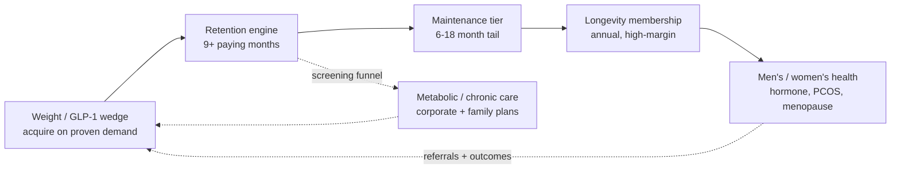
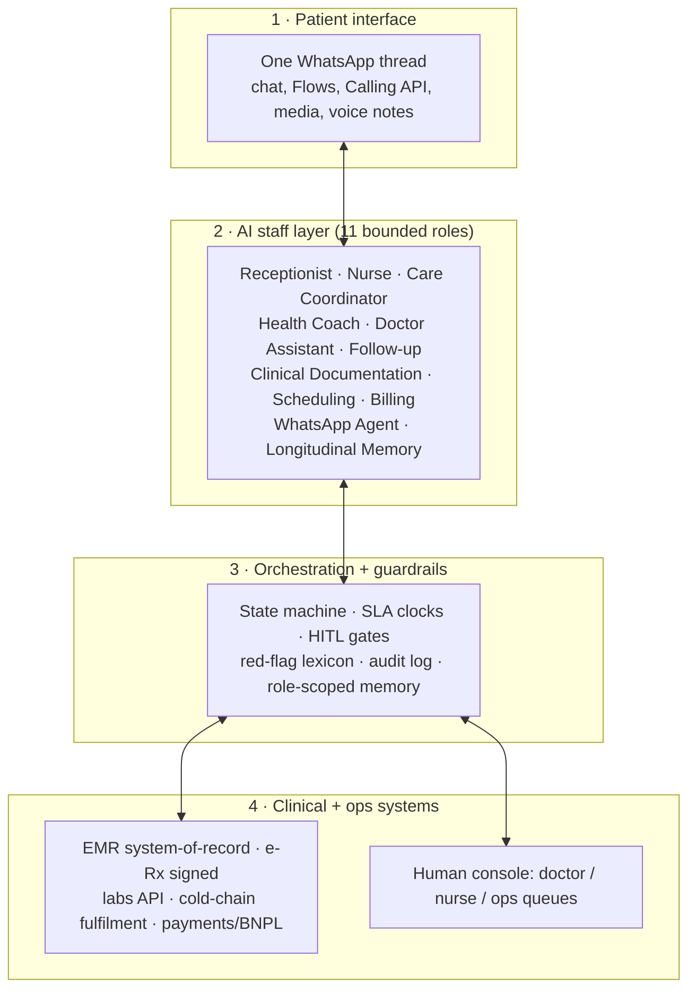

# Welltech Product Strategy — The Care Programs, Product Architecture & Capability Roadmap

**Abstract.** This document designs the Welltech product itself: what the company sells, how it is built, and why its architecture is the moat. The controlling design idea, taken from the completed research, is that Welltech is **not a telehealth app and not a GLP-1 pen shop — it is a longitudinal medical-care operating system whose core product is retention**. The care catalogue is a four-line portfolio — (1) medical weight loss / GLP-1 (the wedge, good–better–best), (2) longevity & preventive membership (the second P&L), (3) metabolic & chronic care (the retention infrastructure), and (4) men's & women's health lines (the LTV-extending flanks) — all delivered through one product architecture: a WhatsApp front-end, eleven bounded AI staff roles, a thin human clinician layer behind enforced gates, and an EMR/e-Rx/labs/fulfilment integration spine ([ai-clinic.md](../60-ai-operating-model/ai-clinic.md), [whatsapp-operating-model.md](../60-ai-operating-model/whatsapp-operating-model.md)). The longitudinal-care engine — the proactive cadence that solves the weeks-2–8 churn cliff every incumbent ignores — *is* the product, not a feature of it; the structured outcome dataset it generates is the publishable moat (across ~40 operators studied, exactly one has published any outcomes). This document specifies the program-design tables (what is included at each tier, the clinical-protocol summary, the care cadence), the technology build-vs-buy decisions, the MVP → V2 → platform capability roadmap, and how the product must change per market as it carries to Singapore and Hong Kong. Every design choice is grounded in a cited research finding and labelled where it is an analyst decision to be validated in pilot.

**Last updated: July 2026.**

**Related documents:** [ai-clinic.md](../60-ai-operating-model/ai-clinic.md) (the eleven AI staff roles + system architecture) · [whatsapp-operating-model.md](../60-ai-operating-model/whatsapp-operating-model.md) (channel spec, template library, consent) · [ai-patient-journey.md](../60-ai-operating-model/ai-patient-journey.md) (stage-by-stage cadence, escalation matrix) · [pricing-strategy.md](pricing-strategy.md) (tier prices these programs sell at) · [malaysia-go-to-market.md](malaysia-go-to-market.md) · [malaysia-weight-loss-market.md](../10-market-intelligence/malaysia-weight-loss-market.md) · [malaysia-longevity-market.md](../10-market-intelligence/malaysia-longevity-market.md) · [malaysia-regulations.md](../10-market-intelligence/malaysia-regulations.md) · [competitor-comparison.md](../20-competitor-dossiers/competitor-comparison.md).

---

**Contents:** 1. Product principles · 2. The product thesis · 3. Care line 1 — Medical weight loss / GLP-1 · 4. Care line 2 — Longevity & preventive membership · 5. Care line 3 — Metabolic & chronic care · 6. Care line 4 — Men's & women's health · 7. The product architecture · 8. The retention engine as core product · 9. The outcomes/data product · 10. Technology stack & build-vs-buy · 11. Capability roadmap · 12. How the product differs per market · 13. Bottom line

---

## 1. Product principles

Nine principles, each traceable to a research finding, govern every product decision.

0. **The company designs itself around one asset: retention.** Every subsequent principle serves it. Welltech is architected so that the thing hardest for incumbents to build — a durable, measured, longitudinal care relationship — is the thing it is best at, and everything else (channel, AI, pricing, clinical protocol) is instrumental to producing it.

1. **The product is continuity, not the consult or the molecule.** Every incumbent monetises episodes (consults, pens, admissions, screens); the empty quadrant is *longitudinal, outcome-accountable, subscription-priced medical care* ([competitor-comparison.md §4](../20-competitor-dossiers/competitor-comparison.md)). Welltech sells the year, not the visit.

2. **WhatsApp is the interface, not a channel.** One thread = one longitudinal care record. Every forced channel-switch reads as service failure; no app is ever mandatory (removes the researched tech-exclusion trigger for older/chronic cohorts, [sentiment-analysis.md §2.6](../30-patient-reviews/sentiment-analysis.md)).

3. **AI orchestrates; doctors judge — the line is architectural.** AI runs intake, monitoring, drafting, logistics, billing; doctors own diagnosis, prescribing, dose changes, abnormal results. This is simultaneously the SaMD regulatory line, the clinical-safety line, and the economic line ([ai-clinic.md §1](../60-ai-operating-model/ai-clinic.md)).

4. **Proactive beats reactive — the cadence is the product.** GLP-1 persistence collapses early (18% discontinue by month 3, ~52% by month 12); the product initiates contact rather than waiting for complaints. The follow-up stage is absent from the entire Malaysian market ([sentiment-analysis.md §4](../30-patient-reviews/sentiment-analysis.md)).

5. **Design against the complaint taxonomy.** Every product surface prevents a researched failure (T1 price opacity → all-in quotes; T4 delivery → cold-chain SLA; T8 rushed consults → AI-prepped protected slots — [ai-clinic.md §1.6](../60-ai-operating-model/ai-clinic.md)).

6. **Discretion is a feature.** Patients hide GLP-1 use because visible use signals failed self-control; unbranded packaging, private WhatsApp channels, no waiting-room exposure are product requirements, not marketing ([sentiment-analysis.md §2.4](../30-patient-reviews/sentiment-analysis.md)).

7. **Trust is built from checkable artefacts.** Named MMC doctors, NPRA batch verification, KKLIU numbers, halal/Ramadan transparency, published outcomes — built once, deployed everywhere ([positioning.md §5](../50-marketing-intelligence/positioning.md)).

8. **Bilingual by default, halal by design.** BM/EN/Manglish from message one, Mandarin for the longevity/screening line, Tamil templated; Ramadan-mode as a productised clinical protocol ([ai-clinic.md §1.8](../60-ai-operating-model/ai-clinic.md)).

9. **The dataset is the moat.** Every conversation becomes structured data; twelve months of side-effect → intervention → outcome data across a Malaysian cohort is proprietary evidence no competitor holds ([ai-clinic.md §5.2](../60-ai-operating-model/ai-clinic.md)).

10. **Remove the doctor's burdens, never add one.** The AI staff exists as much for clinicians as patients — AI-drafted notes, prepared charts, absorbed after-hours messaging, auto-claims — so the scarce, well-paid clinical bench spends its time on judgment and relationships, not admin ([ai-clinic.md §1.7](../60-ai-operating-model/ai-clinic.md)). This is simultaneously the doctor-recruiting pitch and the unit-economics engine (≈3× staffing leverage).

---

## 2. The product thesis

Welltech assembles the five capabilities no Malaysian operator combines — prescribing authority, retention infrastructure, WhatsApp-native clinical operations, published outcomes, and subscription economics — into one product. The competitive analysis shows three of these *compound*: retention infrastructure makes outcomes measurable → outcomes justify subscription pricing → WhatsApp-native operations make retention affordable to deliver ([competitor-comparison.md §4](../20-competitor-dossiers/competitor-comparison.md)). The product is architected to build those three first, because they take longest to copy.

This assembly is not a feature list but a system: the five capabilities reinforce each other, and the reinforcement — not any single capability — is what an incumbent cannot buy off the shelf. A hospital can hire prescribers; it cannot cheaply acquire WhatsApp-native retention operations without cannibalising its per-episode economics. An aesthetic clinic can publish prices; it cannot produce outcome cohorts without the retention infrastructure its commission-per-pen model punishes. The product's defensibility is the *combination*, engineered so the pieces that compound are built first.

The four care lines are sequenced by proof, not ambition:

| Line | Role | Why now | Status of demand |
|---|---|---|---|
| **1. Medical weight loss / GLP-1** | The wedge — tip of the spear | Demand and pricing proven in 2026; market formed Aug 2025–Jan 2026 | Proven (RM400–900M spend already flowing) |
| **2. Longevity & preventive membership** | The second P&L | Ageing nation 2030; affluent screening habit exists but unmanaged | Validated, no system built |
| **3. Metabolic & chronic care** | Retention infrastructure, not standalone P&L | The NCD engine; screening is the acquisition funnel | Structural (54.4% overweight, 15.6% diabetic) |
| **4. Men's & women's health lines** | LTV-extending flanks | TRT/HRT WTP proven (RM5–15k/yr); PCOS/menopause underserved | Adjacent, high-margin |

The wedge is weight because it is where demand, pricing and the regulatory window all point *now* ([executive-summary §1](../00-executive-summary/malaysia-executive-summary.md)); everything else is the retention and LTV architecture that turns a weight-loss subscription into a lifetime metabolic-health relationship.

### 2.1 The portfolio flywheel

The four lines are not four products but one relationship at different stages of a life:

Each stage reuses the same diagnostics-and-coaching spine at near-zero marginal operating cost, and each hands the patient forward rather than losing them. The metabolic/chronic line feeds acquisition (screening funnel); the retention engine converts the wedge into a durable relationship; longevity and hormone lines extend it for years. A weight patient acquired once can become a decade-long metabolic-health member — which is why the *portfolio*, not the wedge, is the business.

---

## 3. Care line 1 — Medical weight loss / GLP-1 (the wedge)

### 3.1 Program tiers

Three program tiers plus flanks, sold at the [pricing-strategy.md](pricing-strategy.md) ladder. What is *included* at each tier:

| Element | GOOD — Metabolic Start (RM299/mo) | BETTER — Medical Weight Program (RM999/mo, core) | BEST — Premium + Concierge (RM1,599/mo) |
|---|---|---|---|
| Doctor review | Initial + monthly async | Monthly MD video review | Named-physician / gender choice; priority |
| Medication | Oral options (orlistat/metformin) at pass-through | GLP-1 (semaglutide) **included, flat across titration** | Tirzepatide option (pass-through + RM399 fee) |
| Dietitian | Structured plan + monthly | Plan + proactive coaching | Plan + sessions on demand |
| WhatsApp monitoring | Weekly weigh-in prompts | Day-3 pulse + weekly check-in Flow + side-effect triage | Priority SLA + same-day nurse |
| Labs | Baseline only | Baseline + week-12 monitoring panel | Labs 2×/6 months |
| Devices | — | — | Quarterly CGM sensor |
| Cold-chain delivery | n/a (oral) | Included, discreet | Included, priority window |
| Ramadan protocol | Content | Full adjusted-dosing protocol | Full + doctor voice-note reviews |
| Spouse/family plan | — | Add-on | Discounted spouse plan |

Design rationale: Good is the down-sell that captures the not-yet-eligible and the price-anxious (persona P7 entry, RM150–400/mo WTP with BNPL); Better is the volume engine at parity-plus (matches OVA/Seimbang RM899–900 with more service and outcomes); Best rides the proven RM5,000–15,000/yr transformation envelope and isolates tirzepatide's steep dose-cost curve.

### 3.2 Clinical protocol summary

Grounded in the **CPG Management of Obesity, 2nd ed. (May 2023)** — MOH with the Malaysian Endocrine & Metabolic Society (MEMS) ([weight-loss §7](../10-market-intelligence/malaysia-weight-loss-market.md)). Asian BMI cutoffs govern eligibility.

| Protocol element | Specification |
|---|---|
| Eligibility (pharmacotherapy) | BMI ≥27.5, **or** ≥23 with comorbidity, after structured lifestyle intervention — per CPG staged pathway. AI collects structured data and applies doctor-authored inclusion rules; only a doctor confirms suitability (SaMD boundary) |
| BMI classification (Asian) | Overweight 23–27.4; Obese I 27.5–32.4; Obese II 32.5–37.4; Obese III ≥37.5 |
| First visit | **In-person** at the PHFSA-registered anchor clinic — physical exam, baseline vitals, baseline labs (FBC, renal/liver panel, HbA1c, lipids incl. ApoB), contraindication + pregnancy screen ([regulations §3.5](../10-market-intelligence/malaysia-regulations.md)) |
| Semaglutide titration | 0.25 → 0.5 → 1.0 → 1.7 → 2.4 mg, ~4-week steps, doctor-signed at each step; **program price flat across all steps** |
| Tirzepatide titration | 2.5 → 5 → 7.5 → 10 → 12.5 → 15 mg (KwikPen strengths); premium tier, pass-through pricing |
| Monitoring | Week-12 metabolic panel; quarterly labs thereafter; doctor-signed release of every result |
| Side-effect management | Protocol-graded (nausea/vomiting/constipation scales; red-flag screens for pancreatitis, gallbladder, dehydration, hypoglycaemia); peak dropout window weeks 2–8 is the highest-ROI clinical activity |
| Safety alerts baked in | NPRA GLP-1 aspiration alert → pre-procedure dose-hold check (template 24); adverse events reported to NPRA |
| Metabolic surgery threshold | BMI ≥37.5 (or ≥32.5 + comorbidity) → referral to Prince Court / Gleneagles KL bariatric partners; post-surgical patients flow back into Welltech maintenance |
| Expected outcome anchor | 10–15% body-weight loss at 12 months with adherence support (the honest, published anchor — never a guarantee in advertising) |

### 3.3 The three churn-cliff design responses (built into the program)

The weight program is engineered against the three researched drop-off clusters ([ai-patient-journey.md §3](../60-ai-operating-model/ai-patient-journey.md)):

1. **Side-effect churn, weeks 2–6** — expectation-setting *before* symptoms; day-3 pulse; symptom-matched coaching within minutes; missed check-in ×2 → human call; dose-hold-with-doctor instead of DIY quitting; week-4 doctor review as a fixed milestone.
2. **Ramadan disruption** — Ramadan-mode activation −30 days; doctor-reviewed adjusted dosing calendars; muftī-reviewed FAQ (non-nutritional injections do not invalidate the fast); check-in clock shifts to post-iftar/pre-suhoor. No regional competitor productises this.
3. **Payment friction** — cheap entry consult; price ladder shown before commitment; every wallet + BNPL from day one; renewal retry ladder; never suspend mid-titration without human review.

### 3.4 What Welltech does that OVA / Seimbang / Roczen do not

The digital GLP-1 cohort is the closest analogue and the sharpest competitor ([competitor-comparison.md §2](../20-competitor-dossiers/competitor-comparison.md)): OVA (US$17M funded, women-only, ~RM900 flat, but weak continuity, thin follow-up, no triage SLA, and a documented auto-renew-after-cancellation billing complaint); Seimbang (RM899 all-in, price-leader, unproven); Roczen (UK clinical credential, thin MY base, price unpublished). **None publishes outcomes; none runs AI qualification, proactive side-effect cadence, or structured maintenance off-ramps.** Welltech's program is differentiated on exactly the three compounding capabilities they lack — proactive retention cadence, WhatsApp-native clinical SLAs, and published cohort outcomes.

---

### 3.5 How the weight product beats each competitor type

The wedge product is differentiated against every strategic group by a capability that group's economics prevent it from building ([competitor-comparison.md §3](../20-competitor-dossiers/competitor-comparison.md)):

| Competitor type | What they offer | What Welltech adds they structurally can't |
|---|---|---|
| Online pharmacy (DoctorOnCall) | The pen at RM999, DIY | The doctor, dietitian, triage cadence and outcomes — a care relationship, not a transaction |
| Aesthetic clinics | The drug + thin follow-up at 30–60% markup | Near-parity drug pricing + managed titration + published retention |
| Digital GLP-1 (OVA/Seimbang/Roczen) | Monthly program, WhatsApp support | Proactive side-effect cadence, AI qualification, maintenance off-ramp, published outcomes — the three they lack |
| Hospitals | Bariatric surgery, episodic endocrine | The pharmacological middle + longitudinal continuity at non-hospital cost |
| Slimming centres | Packages + pressure | Real medicine, published prices, no hard sell, cancel-anytime |
| Coaching (Naluri) | Behavioural coaching, no prescribing | Prescribing depth + the medical layer their contracts avoid |

The pattern is consistent: each incumbent's revenue model (per-pen, per-episode, per-visit, coaching-only) actively punishes the longitudinal behaviour Welltech's product is built around. That is why the product wins on care depth and durability rather than on price or reach.

## 4. Care line 2 — Longevity & preventive membership (the second P&L)

### 4.1 The product gap

Malaysia's executive-screening market is a one-off diagnostic event (RM99–6,859) with a brief doctor debrief and *no longitudinal model* ([longevity §3.1](../10-market-intelligence/malaysia-longevity-market.md)). The physical "longevity clinic" label is being claimed (Longevity Clinic by Medkos, Emagene, Llayana); the **membership-based, digitally-delivered preventive-longevity sub-category is unclaimed**. Welltech defines it — a Function-Health-style annual biomarker membership with longitudinal interpretation, positioned for the affluent urban screening buyer (persona P2, the Screening Tauke) as "your screening reports, finally managed."

### 4.2 Membership tiers

| Element | Core (RM3,600/yr) | Executive (RM8,800/yr) |
|---|---|---|
| Biomarker panel | 60–100+ markers incl. ApoB, Lp(a), HbA1c, full metabolic + lipid + liver/renal, thyroid, inflammatory | Core + advanced cardiac (cardiac CT partner rate), hormone panel, expanded cancer markers |
| Retest | 6-month retest cycle | Semi-annual + on-demand |
| Biological-age dashboard | Epigenetic clock input, trend visualisation | Core + advanced imaging integration |
| Doctor review | Quarterly (Mandarin available) | Semi-annual + named physician + concierge referrals |
| Wearables/CGM | Integration; CGM sensor option | Quarterly CGM included |
| Hormone optimisation | Referral pathway | Included pathway (TRT/HRT — see §6) |
| Imaging | Partner referral | Advanced imaging partner rates (whole-body MRI when a partner exists — current MY whitespace) |

Evidence anchoring: analyst recommended envelope RM3,000–12,000/yr; persona WTP — "Optimiser" (35–50) RM4,000–8,000/yr, "Worried HNW/UHNW" (50–65) RM10,000–25,000+/yr ([longevity §11–12](../10-market-intelligence/malaysia-longevity-market.md)). Core lands at the Optimiser floor; Executive at the HNW entry.

### 4.3 Clinical posture (evidence-anchored, not drip-lounge)

The longevity line anchors claims to metabolic/cardiovascular evidence (ApoB, Lp(a), CGM, HbA1c) and explicitly avoids the unvalidated-modality trap that discredits the category — no NAD⁺/stem-cell anti-ageing claims in the core product ([longevity §5, §13](../10-market-intelligence/malaysia-longevity-market.md)). The scarce clinical bench is the enabling asset: Malaysia has only three IFM-certified functional-medicine doctors, two of whom sit at Emagene — a partner-or-hire priority in Q1–2 ([competitor-comparison.md §6](../20-competitor-dossiers/competitor-comparison.md)). MEMS endocrinology advisors provide the metabolic credibility.

### 4.4 Longevity clinical protocol & cadence

The membership is a longitudinal clinical product, not an annual test. The cadence, evidence-anchored to metabolic/cardiovascular markers ([longevity §5, §12](../10-market-intelligence/malaysia-longevity-market.md)):

| Touchpoint | Core member | Executive member |
|---|---|---|
| Onboarding | Aggregate existing screening reports free; baseline 60–100+ biomarker panel; biological-age dashboard established | + advanced cardiac (cardiac CT partner), hormone panel |
| Quarterly | Doctor review (Mandarin available); CGM/wearable data interpreted; risk-factor action plan | + named physician; concierge referral coordination |
| 6-month | Retest cycle; trend deltas (ApoB, HbA1c, Lp(a)); dashboard update | + on-demand retest; imaging review |
| Continuous | WhatsApp coaching; CGM-led metabolic nudges; supplement guidance (compliant maintenance framing only) | + hormone-optimisation pathway (TRT/HRT) |
| Annual | Full re-screen; year-over-year biological-age report | + whole-body imaging when a partner exists (current MY whitespace) |

The clinical discipline is what separates the product from the discredited drip-lounge category: claims anchor to ApoB/Lp(a)/CGM/HbA1c evidence; NAD⁺/stem-cell anti-ageing claims are excluded from the core product; NMN and supplements are framed only as compliant maintenance (omega-3, vitamin D, fibre, protein), never with therapeutic anti-ageing claims (NPRA/MAB constraint). The scarce IFM/MEMS bench provides the credibility the category's grey-market operators cannot.

### 4.5 The cross-sell that extends LTV

The weight patient → longevity member path (persona P1 → P2 logic) is the built-in LTV extension. At maintenance/step-down, the clinic volunteers the longevity membership as the natural continuation of a metabolic-health relationship ([ai-patient-journey.md §Stage 11](../60-ai-operating-model/ai-patient-journey.md)). Longevity SOM: 3,000–8,000 members at RM5,000–9,000 ≈ RM20–70M/yr at maturity ([longevity §11.2](../10-market-intelligence/malaysia-longevity-market.md)).

---

## 5. Care line 3 — Metabolic & chronic care (retention infrastructure)

This line is **not a standalone P&L** — it is the infrastructure that makes the other three durable ([executive-summary §2.2](../00-executive-summary/malaysia-executive-summary.md)). Malaysia's disease engine (54.4% overweight, 15.6% diabetic with ~40% undiagnosed, 33.3% high cholesterol, >2M with ≥3 concurrent NCDs) means the undiagnosed fraction *is* the acquisition funnel, and screening is the entry point to the entire chronic-care economy.

| Product component | Function |
|---|---|
| Screening-to-treat pipeline | "Send us your hospital screening report" → aggregate/interpret → identify metabolic risk → route to program (the unmonetised post-screening handoff no hospital captures) |
| Chronic-condition monitoring | Diabetes/hypertension/dyslipidaemia longitudinal management on WhatsApp; refill reliability (the researched public-clinic pain point of half-day queues, persona P6) |
| CGM-led metabolic coaching | FreeStyle Libre integration (~RM282/sensor) as the scalable subscription wedge tying metabolic coaching to GLP-1 and longevity |
| Family plans | The Sandwich Caregiver (P5) manages a household's chronic care; the parent (P6) is served as a dependant, not a direct-pay target |

The chronic line is delivered but **not marketed as a cheap-consult business** — it exists to lengthen relationships and feed the weight and longevity lines, funded primarily through the corporate/payer channel and family plans rather than B2C consult fees.

The strategic discipline here is important: chronic care is the largest disease pool (54.4% overweight, 15.6% diabetic) and the most tempting to monetise directly — but the consult is unmonetisable (RM58 WTP against a RM1 public anchor), so leading with cheap chronic consults would re-enter the transactional-telehealth quadrant where DoctorOnCall's price and scale win. Welltech therefore treats chronic care as *infrastructure and funnel*, not a standalone P&L: it acquires and retains through screening and family/corporate plans, and monetises through the program, membership and hormone lines that sit on top of the metabolic relationship it establishes.

---

## 6. Care line 4 — Men's & women's health lines (LTV flanks)

High-margin, high-WTP adjacencies that extend lifetime value and broaden the metabolic-health relationship ([longevity §4](../10-market-intelligence/malaysia-longevity-market.md)).

| Line | Services | WTP evidence | Product design |
|---|---|---|---|
| **Men's health** | TRT (testosterone replacement), metabolic + hormone optimisation, men's preventive screening | TRT RM5,000–15,000/yr; injections RM800–2,500/session; gels RM300–700/mo | Bundled into Longevity Executive hormone pathway; doctor-supervised, lab-gated; positions against unsupervised TRT/drip clinics (Nexus, PULSE) |
| **Women's health** | Menopause/HRT, PCOS-linked metabolic care, weight management (female-first) | HRT initial RM150–300, therapy from ~RM104; MY HRT/TRT ~40% cheaper than US/UK | Named female physician default; discreet; PCOS as a metabolic-weight comorbidity entry (research gap — build protocol on CPG + endocrinology advisory) |

Design notes: women's weight (P1, P7) is already the proven wedge — the women's health line *extends* it into menopause and PCOS-linked metabolic care rather than starting cold. Men's health enters via the screening funnel (diabetic/pre-diabetic men, persona-segment "diabetic men via screening") and the longevity Executive tier. Both lines are lab-gated and doctor-supervised — the deliberate contrast with the grey-market TRT/hormone clinics.

### 6.1 Clinical gating & entry paths

The hormone lines are the highest-scrutiny products in the catalogue and are gated accordingly ([longevity §4](../10-market-intelligence/malaysia-longevity-market.md)):

| Line | Entry path | Clinical gate |
|---|---|---|
| Men's / TRT | Longevity Executive hormone pathway; screening-funnel men flagged with low-T symptoms + metabolic risk | Confirmed biochemical hypogonadism (repeat morning testosterone + workup); doctor-owned; no walk-in TRT; monitoring labs mandatory |
| Women's / menopause-HRT | Women's-health line extension from the weight wedge; perimenopausal P1 cohort | Symptom + risk assessment; contraindication screen; doctor-owned |
| Women's / PCOS-metabolic | Weight-program comorbidity route (PCOS is a metabolic-weight entry) | CPG-anchored; protocol built on endocrinology advisory (research gap — a build item, not an off-the-shelf offer) |

The strategic value of these lines is not first-order revenue but LTV extension and relationship breadth: a longevity Executive member on a hormone-optimisation pathway, or a weight patient whose PCOS is co-managed, is a multi-year, high-margin, low-churn relationship — the opposite of the single-course economics the market optimises for. Both lines are deliberately sequenced to Phase 4 (12–24 months), after the weight wedge and longevity membership have established the clinical bench and the trust to carry higher-scrutiny hormone products credibly.

---

## 7. The product architecture

### 7.1 The stack in one view

The product is a four-layer system ([ai-clinic.md §3](../60-ai-operating-model/ai-clinic.md)):

### 7.2 Layer responsibilities

| Layer | What it is | Load-bearing rule |
|---|---|---|
| **WhatsApp front-end** | The clinic's front-of-house; one thread per patient = the care record surface | No app mandatory; two-number portfolio isolates care rail (near-zero marketing) from growth rail ([whatsapp-operating-model.md §1](../60-ai-operating-model/whatsapp-operating-model.md)) |
| **AI staff layer** | Eleven bounded agents mirroring a clinic org chart, each with defined tools, escalation rules, KPI dashboard | Escalation enforced in orchestration, not left to model discretion; the Follow-up and Nurse agents are the revenue engine |
| **Orchestration + guardrails** | Deterministic state machine owns journey stage, SLA clocks, HITL gates; LLMs classify/converse/draft *within* it | An LLM can *request* a transition; only the state machine *performs* it. Red-flag tripwires run outside the model |
| **Clinical + ops spine** | EMR (system of record), signed e-Rx (OHS 2025 pathway), labs API, cold-chain fulfilment, payments/BNPL | The EMR — not the chat scroll — is the medical record; every WhatsApp payload archived with timestamp + staff identity |

### 7.3 The human-in-the-loop gates (architectural, not procedural)

No prescription exists without a doctor signature event; no dose change without doctor approval; no abnormal lab reaches a patient before sign-off; no MC ever from a teleconsult-only encounter (MMC Sep 2025 ban). Bypass is technically impossible, not merely forbidden ([ai-clinic.md §2, §6](../60-ai-operating-model/ai-clinic.md)). The audit log — append-only, capturing every AI output shown, every gate decision, every guardrail trip — is the single artefact serving MMC defence, PDPA accountability, MDA no-device evidence, and internal QA.

### 7.4 The eleven AI staff roles as product surfaces

The AI staff layer is not infrastructure hidden from the patient — each role *is* a product capability the patient experiences, and each exists to prevent a specific researched failure ([ai-clinic.md §2](../60-ai-operating-model/ai-clinic.md)):

| AI role | Product capability delivered | Failure prevented | Autonomy |
|---|---|---|---|
| Receptionist | <10s first response; all-in price quotes before commitment | T1 pricing opacity; unanswered first contact | Full (admin only) |
| Nurse | Protocol-graded side-effect triage; red-flag screens | Silent side-effect churn; unsafe DIY dose changes | Assisted; grade-3→doctor <2h |
| Care Coordinator | End-to-end logistics state; proactive delay notices | T4 delivery + T2 silence + T5 refund chain | Full logistics |
| Health Coach | Symptom-matched nutrition/hydration nudges; Ramadan mode | Plateau discouragement; disengagement | Assisted; content whitelisted |
| Doctor Assistant | One-screen pre-consult briefs; draft orders/letters | T8 rushed consults; doctor admin burden | Drafts only |
| Follow-up | The retention engine: cadence, churn-save, win-back | Silent month-2 churn (the market's invisible leak) | Full outreach |
| Clinical Documentation | Ambient scribe; chat-to-record summaries | Records lost outside the EMR; doctor admin | Drafts only; doctor signs |
| Scheduling | Booking, confirmation cadence, backfill; enforces in-person-first | T6 queue voids; no-shows | Full |
| Billing | All-in quotes, payment links, e-invoices, auto-refunds | T1 opacity; T5 refund stalls | Full issuance; refunds gated |
| WhatsApp Agent | Window/template economics, opt-in ledger, quality protection | Channel-cost blowout; policy breach | Infrastructure |
| Longitudinal Memory | Makes month 6 feel like day 1 | The incumbents' goldfish-thread cold start | Infrastructure; no patient contact |

The product's felt quality — instant, remembered, proactive, never-silent — is the emergent behaviour of these eleven roles operating behind one thread. That felt quality is what no manually-staffed incumbent inbox can match, and it is the source of the retention the economics depend on.

### 7.5 The SaMD boundary (what the product must NOT do)

The product keeps every AI role on the administrative/drafting side of the Medical Device Act line: it collects symptoms and routes (never diagnoses), presents the doctor's signed dose schedule (never calculates or changes a dose), delivers doctor-approved result explanations (never interprets before sign-off), and markets the program (never the molecule). A titration engine that *decides* would be a deliberate Class B registration project, not a feature flag ([ai-clinic.md §6.1](../60-ai-operating-model/ai-clinic.md)).

---

## 8. The retention engine as core product

This is the product's centre of gravity. The economics are unambiguous: every +10pp of 12-month retention is worth ~RM900–1,000 per enrolled patient — an order of magnitude more than any list-price decision ([pricing-strategy.md §8.3](pricing-strategy.md)). The retention engine is the machinery that moves persistence from the ~30–38% unmanaged baseline toward the >60% target.

### 8.1 The care cadence (the product, made concrete)

The GLP-1 program's first 12 weeks, then steady state ([ai-patient-journey.md §4](../60-ai-operating-model/ai-patient-journey.md)):

| Phase | Cadence | Purpose |
|---|---|---|
| Day 0–1 | In-person consult → e-Rx → cold-chain delivery → injection walkthrough video | Set expectations; authenticity proof |
| Week 1 (D3) | Side-effect pulse (2-tap) | Earliest catchable churn moment |
| Weeks 1–8 | Weekly check-in Flow (weight, symptoms graded, dose, mood); coach content between | Structured monitoring; the churn firewall |
| Week 2 & 6 | Nurse outbound care calls (peak side-effect window) | Live contact outperforms automation |
| Week 4 | Doctor dose-review + progress chart | First outcome conversation; titration milestone |
| Week 8 | Month-2 review consult + labs + renewal reminder | The churn-cliff intervention set |
| Week 12 | Monitoring bloods → doctor-signed explanation → review | Outcome evidence + safety |
| Months 4–12 | Fortnightly → monthly check-ins; quarterly labs + doctor review; plateau content; festival protocols | Steady-state retention without fatigue |
| Months 9–12 | Step-down conversation + maintenance-tier offer + longevity cross-serve | Off-ramp by design |

The persistence-risk score (engagement decay + symptom burden + payment hesitancy + missed check-ins) fires human save-calls for high-risk patients; stated quit intent triggers respectful off-boarding with a doctor conversation — never a hard-sell retention script (anti-T7). At ~85% utility/service message class, the whole cadence costs ≈RM1–3/patient-month in Meta fees — care intensity is a clinical decision, not a cost decision ([whatsapp-operating-model.md §2.2](../60-ai-operating-model/whatsapp-operating-model.md)).

### 8.2 The longitudinal memory (why month 6 feels like day 1)

A structured patient-context store — not a raw chat log — makes months-long care coherent: identity/preferences, clinical baseline, program state, symptom history with what resolved it ("nausea settled when she split meals — week 3"), outcomes trajectory, commitments, life context (Ramadan, travel, festivals), consent ledger, service history. Role-scoped retrieval enforces PDPA data-minimisation architecturally (the Coach never sees billing; Billing never sees clinical notes). Provenance on every fact; the memory never averages two contradictory weights ([ai-clinic.md §5](../60-ai-operating-model/ai-clinic.md)). This is what the incumbents' "goldfish" chat threads cannot do — and what makes the retention cadence feel like care, not automation.

---

## 9. The outcomes / data product

The single deepest capability gap in the market: across ~40 operators in 21 dossiers, **exactly one published outcome study exists** (Naluri: one non-randomised observational study, n=774) ([competitor-comparison.md §4](../20-competitor-dossiers/competitor-comparison.md)). Because every conversation becomes structured data, Welltech accumulates twelve months of side-effect → intervention → outcome data across a Malaysian GLP-1 cohort that no competitor holds.

The outcomes product has three uses:

| Use | Mechanism | Value |
|---|---|---|
| **Category-defining moat** | Publish the first Malaysian GLP-1 cohort outcomes to a credible evidential standard (month 12–18) | The first publisher defines what "good" looks like and owns the category narrative before assembly threats crystallise |
| **Corporate/payer tender asset** | Quarterly HR-facing outcome reports (retention, %-weight-loss, biomarker deltas) | The proof that wins employer renewals and, when a payer moves on obesity riders, the tender-deciding dataset |
| **Product-improvement flywheel** | Cadence-vs-outcome analysis; every human override is a training signal | Continuously tunes the retention engine; the analytics are a by-product of the routing architecture, not an afterthought |

The proof milestone: publish the first credible Malaysian cohort outcomes within 12–18 months of launch — the decisive moat move ([executive-summary §6.6](../00-executive-summary/malaysia-executive-summary.md)).

### 9.1 The publication plan

The outcomes product is built from the first patient, not retrofitted ([whatsapp-operating-model.md §9](../60-ai-operating-model/whatsapp-operating-model.md)):

| Stage | What is published | Standard |
|---|---|---|
| Month 0 | Instrument every conversation with machine-readable tags (journey stage, actor, protocol version, disposition) | Analytics as by-product of routing, not afterthought |
| Month 6 | Internal cohort read: week-4/12/26 persistence vs the ~30–38% unmanaged baseline | Board metric; not yet external |
| Month 9 | First HR-facing outcome report for the employer pilot (retention, %-weight-loss, biomarker deltas) | De-identified aggregate; the corporate-renewal asset |
| Month 12–18 | **First Malaysian GLP-1 cohort outcomes to a credible evidential standard** (%-weight-loss distribution, retention curve, side-effect-management data) | The category-defining publication; the first in market |

Because the whole cadence is engineered to earn structured data (Flows write fields, not prose; every check-in is a datapoint), the cohort accrues automatically — the outcomes product is a *consequence* of the retention engine, which is why a competitor without the retention engine cannot produce it even by choosing to.

### 9.2 Product metrics & clinical QA

The product measures itself against the researched failure taxonomy and the outcome that is the business ([ai-patient-journey.md §5](../60-ai-operating-model/ai-patient-journey.md)):

| Layer | Metric | Target |
|---|---|---|
| Access | First AI response / human red-escalation | <1 min / ≤15 min |
| Persistence (the business) | Week-4 / month-3 / month-12 retention | >85% / ≥90% / ≥60% |
| Safety | Grade-2/3 escalation SLA met; missed-red-flag audit (100% of grade-2/3 threads) | ≥99%; zero tolerance |
| Experience | Complaint rate per 100 patients scored against T1–T9; cancellation NPS | Falling QoQ |
| Outcomes | %-body-weight loss at 6/12 mo; lab-marker deltas; screening-cycle adherence | The proprietary evidence asset |
| Channel | WhatsApp quality rating; Meta fees/patient-month | Green; <RM1.50 |

Clinical QA is a first-class product function: a named medical director owns the protocol book and the doctor-authored advice libraries; a conversation-QA/clinical-auditor role (0.5 FTE) audits sampled transcripts weekly and 100% of grade-2/3 symptom threads. The monthly review asks, for each of T1–T9, "did we generate any instance of this — and did the AI or a human catch it first?"

---

## 10. Technology stack & build-vs-buy

The governing rule: **own the orchestration layer, the memory, the prescriber relationship and the patient data; rent everything else, with portability designed in** ([ai-clinic.md §4](../60-ai-operating-model/ai-clinic.md)).

| Component | Phase 1 (launch) | Phase 2 (scale) | Decision |
|---|---|---|---|
| **Orchestration layer** (state machine, router, HITL gates) | Build (thin) | Build (deep) | **Build — this layer *is* the company** |
| **Longitudinal memory** | Build | Build | **Build — the moat** |
| LLM layer | Frontier hosted API (Claude/GPT class) for clinical-adjacent conversation + scribing; cheaper small models for classification/routing | Same + BM/Manglish eval-tuned routing | Buy/API; re-benchmark on a Welltech BM/EN eval set (public benchmarks under-test Malay/Manglish); no fine-tuning at launch |
| WhatsApp BSP | respond.io-class (KL-based, healthcare refs) | 360dialog / Cloud API direct once >50K msgs/mo | Buy → migrate; channel-abstracted, exportable, no BSP-proprietary data model |
| EMR | Malaysian cloud clinic system (API-first, PHFSA/e-invoice fit) or FHIR-native store behind thin UI | Same, deepened | Buy carefully — reversible only before the memory layer fills |
| e-Rx | In-EMR digitally signed per OHS 2025; partner e-Rx rails (DOC2US or Teleme) | + partner-pharmacy network | Buy rails (DOC2US/Teleme decision Q1–2); nothing ships without them |
| Ambient scribe | Buy/API (mature category) wrapped in own sign-off UX | Reassess build for BM/Manglish | Buy — differentiation is language + chat-summarisation, not transcription |
| Fulfilment / cold-chain | Alpro (primary) + dual-source | + BIG CARING second-wave | Partner (ring-fenced); dual-source early — Alpro is also threat #3 |
| Labs | Partner labs (BP, Pathlab, Gleneagles/Sunway for premium) + Speedoc home phlebotomy | + deeper integration | Partner; longevity tier supply chain |
| Payments | HitPay/Curlec/Stripe + BNPL (Atome first); WhatsApp Pay unavailable in MY | Same | Buy; link-in-chat pattern |

The build list is deliberately short: the orchestration layer and the memory are the only true build items, because they are the only components that compound into a moat. Everything patient-facing that can be rented is rented — with data portability (own CRM holds the patient graph + consents, not the BSP) so the channel is rebuildable if a partner turns competitor or a number is banned.

---

## 10.1 Privacy & data governance as product

In a stigmatised category where a leaked GLP-1 thread is the exact "significant harm" the 2024 PDPA amendments target — and where the MySejahtera leak (3M records) taught the market to fear that health data reaches insurers and employers — privacy is a *product feature*, not a compliance chore ([consumer-behaviour §4.2](../10-market-intelligence/malaysia-consumer-behaviour.md), [regulations §7](../10-market-intelligence/malaysia-regulations.md)):

| Product mechanism | What it delivers |
|---|---|
| Granular consent ledger (C1–C6) | Purpose-itemised consent (care ops, clinical follow-up, sensitive-data processing, education, marketing, family) captured in-Flow before any health question |
| Role-scoped memory | Coach never sees billing; Billing never sees clinical notes — data-minimisation made architectural |
| Explicit no-sharing pledge | "We never share your results with your employer or insurer; local data residency; deletion rights" — plain-language privacy card in WhatsApp (BM/EN/中文) |
| "We can't leak what we don't hoard" | Retention schedules; erasure with auditable tombstone; no patient-visible group features |
| 72-hour breach runbook | Drilled before launch; DPO appointed and notified; TIAs for Meta/cloud/AI vendors |

This is a differentiator, not overhead: the corporate channel's entire viability depends on employees trusting the data firewall (persona P3's stated objection), and the longevity/mental-health-adjacent lines carry the highest privacy sensitivity in the market.

## 11. Capability roadmap — MVP → V2 → platform

| Horizon | Product capability | Gate to proceed |
|---|---|---|
| **MVP (0–6 mo)** | Weight program (Good/Better/Best) on WhatsApp; AI Receptionist/Nurse/Scheduling/Billing/Care-Coordinator live; in-person initiation at anchor clinic; signed e-Rx; cold-chain delivery; day-3/weekly cadence; consent ledger; two-number portfolio; RM49 credited consult funnel | End-to-end lead traced ad→enrolment; week-4 persistence >85%; consult show-rate >75% |
| **V2 (6–18 mo)** | Full retention engine (persistence-risk scoring, save-calls, maintenance off-ramp); longevity membership (Core + Executive) with biomarker dashboard; corporate PEPM channel + one employer pilot; Ramadan-mode; solicited-review flywheel; **first published cohort outcomes** | First cohort retention read vs baseline; HR-facing outcome reports live; outcomes published to credible standard |
| **Platform (18–36 mo)** | Men's & women's health lines; chronic-care/family plans at scale; longevity Executive with imaging partner; Mandarin/XHS longevity funnel; second KL site; SG market entry build; data-product API for payers | LTV:CAC ≥3× sustained; longevity renewal >70%; corporate book established; SG regulatory/pricing validated |

The sequencing principle: **build the slow-to-copy assets first** — the retention engine, the WhatsApp clinical SLAs, and the outcomes dataset — because they are what the assembly threats (DoctorOnCall 6–18 mo, OVA now–12 mo, Alpro/DA 12–24 mo) cannot quickly replicate ([competitor-comparison.md §5](../20-competitor-dossiers/competitor-comparison.md)).

What is *deferred* is as deliberate as what is built first: the longevity membership waits until the weight wedge has established the clinical bench and doctor-brand equity (a longevity buyer trusts a proven metabolic operator, not a launch-day startup); the hormone lines wait until Phase 4 because they are the highest-scrutiny products and require the credibility the earlier lines earn; and full multi-city expansion waits until Klang Valley unit economics are proven. The roadmap resists the temptation to widen before the wedge's retention and outcomes are demonstrated — because a thin, unproven multi-line offer is exactly the "assembled but broken" pattern the incumbent threats will produce, and Welltech's whole advantage is doing one thing (retained medical care) provably well before doing everything.

---

## 12. How the product differs per market

The architecture is invariant; the configuration rebases. *Carries to SG/HK:*

| Product dimension | Malaysia | Singapore | Hong Kong |
|---|---|---|---|
| Channel front-end | WhatsApp (90.7% reach) | WhatsApp dominant | WhatsApp + WeChat consideration (China proximity) |
| Wedge line | Weight/GLP-1 (demand proven now) | Weight likely leads via corporate/insurer (mature telehealth, MediSave adjacency) | Weight via concierge/premium (highest WTP) |
| Regulatory spine | OHS 2025, PHFSA anchor, MMC gates, tele-MC ban | Different licensing; some insurance/MediSave adjacency may route drug to a payer | Most different regime; concierge norms; research pending |
| Language | BM/EN/Manglish + Mandarin + Tamil | EN + Mandarin + Malay/Tamil | Cantonese/EN + Mandarin |
| Halal/Ramadan | Core productised protocol (63–65% Muslim) | Present but smaller segment | Minimal |
| Corporate channel | Secondary (claims-inflation control) | Likely primary/leading (deeper employer + insurer market) | Concierge/self-pay primary |
| Longevity WTP | RM3,600–8,800/yr | Higher; established executive-screening market | Highest; concierge-medicine norms |

Welltech is not three national products but one regional operating platform — a single AI + WhatsApp + clinical-governance stack, localised per market ([expansion-strategy.md](expansion-strategy.md)). The two invariants that must never change across markets: the AI-orchestration + human-gate architecture, and the retention engine. What changes: the lead care line, the regulatory wrapper, the language mix, and whether the corporate/insurer channel leads or follows the consumer channel. **Do not port the product configuration wholesale — port the architecture and rebuild the configuration on local demand and regulation** ([pricing-strategy.md §12](pricing-strategy.md)).

---

## 13. Bottom line

### 13.1 What the product is deliberately NOT

The dead ends the research maps are as load-bearing as the design ([competitor-comparison.md §7](../20-competitor-dossiers/competitor-comparison.md)). Welltech is **not**: a cheap-consult platform (the consult is unmonetisable); a pen-retail shop (the drug is priced at parity, not marked up); a directory or booking utility; fee-banded primary care; an asset-heavy hospital service; a coaching-only wellness app (no prescribing); a slimming centre (no packages, no pressure); or an aesthetic clinic (no drug-without-care). Each "not" is a discipline that protects the position — the moment the product drifts toward any of them, it re-enters a quadrant where an incumbent's unit economics beat it.

### 13.2 Bottom line

Welltech's product is not the GLP-1 pen, the consult, or even the app — it is a longitudinal medical-care operating system whose defensible core is retention and whose moat is the outcomes dataset that retention produces. The weight program is the wedge because demand, pricing and the regulatory window all point there now; longevity is the second P&L; metabolic/chronic care is the retention infrastructure; men's and women's health are the LTV flanks. All four ride one architecture — WhatsApp front-end, eleven AI staff, deterministic orchestration with hard human gates, and a rented-but-portable clinical spine — built so that the three compounding capabilities the market lacks (proactive retention, WhatsApp-native clinical ops, published outcomes) are the first things Welltech owns and the last things a fast-follower can copy. Every table above is a build spec; every cadence is a retention mechanism; every gate is the licence to operate.

**Blueprint context:** this product design sells at the [pricing-strategy.md](pricing-strategy.md) ladder, launches through the [malaysia-go-to-market.md](malaysia-go-to-market.md) plan, is defended by the counter-positioning and six moat sources in [competitive-moat.md](competitive-moat.md), is built in the sequence set by [implementation-roadmap.md](implementation-roadmap.md), and reuses its architecture across markets per [expansion-strategy.md](expansion-strategy.md). The operating specifications it references live in [ai-clinic.md](../60-ai-operating-model/ai-clinic.md), [whatsapp-operating-model.md](../60-ai-operating-model/whatsapp-operating-model.md) and [ai-patient-journey.md](../60-ai-operating-model/ai-patient-journey.md).

---

## References

All clinical, market, regulatory and operating facts are cited to primary sources in the linked repository documents — the GLP-1 landscape and CPG in [malaysia-weight-loss-market.md](../10-market-intelligence/malaysia-weight-loss-market.md); the longevity/biomarker/hormone pricing in [malaysia-longevity-market.md](../10-market-intelligence/malaysia-longevity-market.md); the AI-role, architecture, SaMD, PDPA and staffing specifications in [ai-clinic.md](../60-ai-operating-model/ai-clinic.md), [whatsapp-operating-model.md](../60-ai-operating-model/whatsapp-operating-model.md) and [ai-patient-journey.md](../60-ai-operating-model/ai-patient-journey.md); the partnership and capability-gap analysis in [competitor-comparison.md](../20-competitor-dossiers/competitor-comparison.md). This document makes product decisions from that evidence base and introduces no new external facts requiring separate citation.
